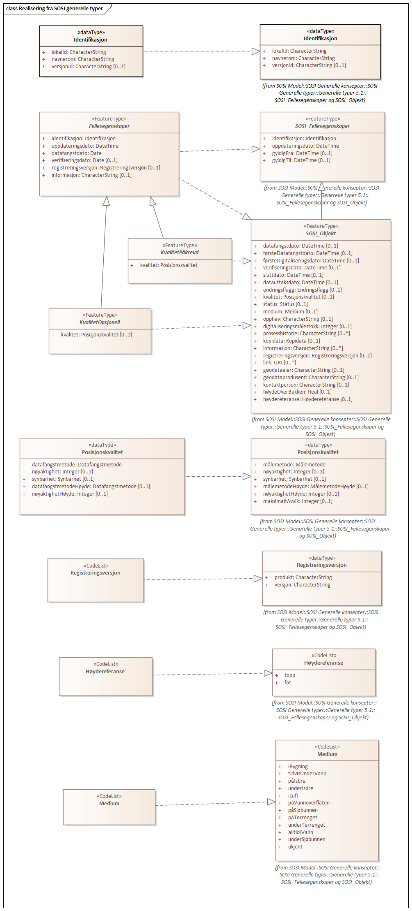
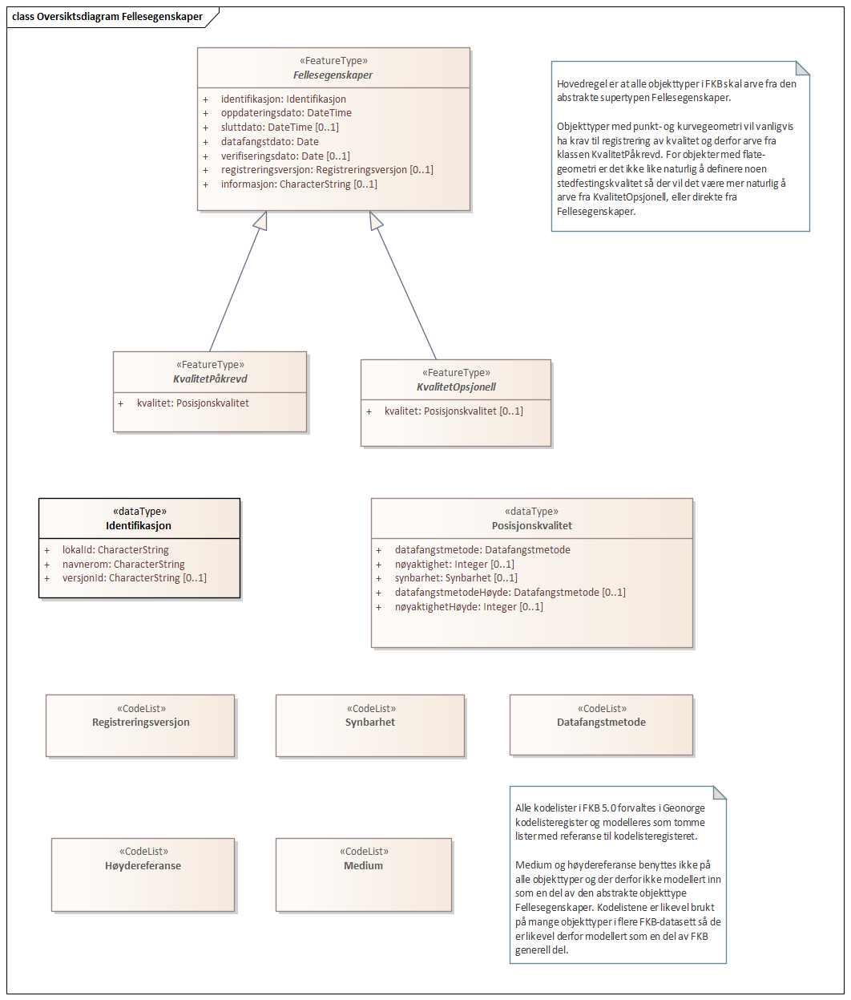
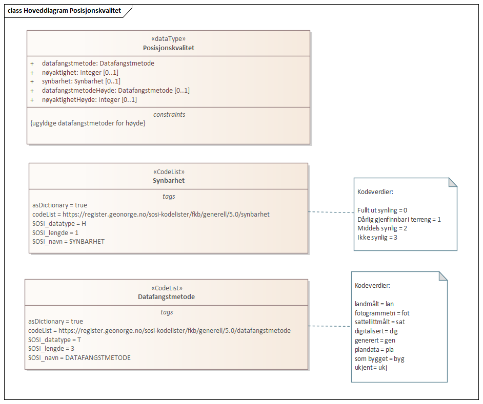
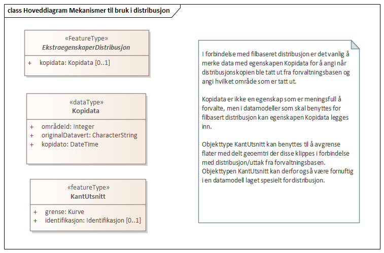
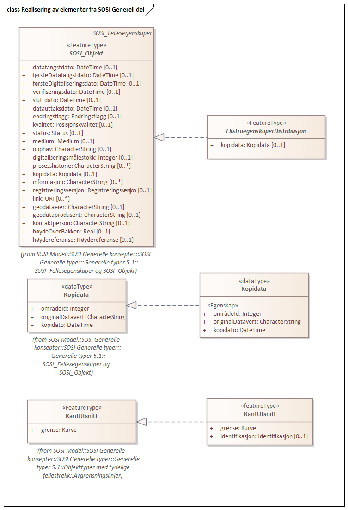

== UML felleselementer til bruk i «ApplicationSchema» for FKB-datasett
Generelle klasser og fellesegenskaper som kan kopieres inn og benyttes i FKB produktspesifikasjoner.
 
=== Pakke: Generelle elementer
*Definisjon:* Pakke med modelleringselementer som benyttes i applikasjonsskjema for forvaltning av FKB
[caption="Figur 1: ",title=Realisering fra SOSI generelle typer]

[caption="Figur 2: ",title=Oversiktsdiagram Fellesegenskaper]

[caption="Figur 3: ",title=Hoveddiagram Posisjonskvalitet]

 
|===
|===
 
[[fellesegenskaper]]
==== «FeatureType» Fellesegenskaper (abstrakt)
*Definisjon:* abstrakt objekttype som bærer sentrale egenskaper som er anbefalt for bruk i produktspesifikasjoner.

Merknad: Disse egenskapene skal derfor ikke modelleres inn i fagområdemodeller.
 
*Realisering av:* «ApplicationSchema» Generelle typer 5.1/SOSI_Fellesegenskaper og SOSI_Objekt::«FeatureType» SOSI_Fellesegenskaper
 
*Realisering av:* «ApplicationSchema» Generelle typer 5.1/SOSI_Fellesegenskaper og SOSI_Objekt::«FeatureType» SOSI_Objekt
 
===== Egenskaper
[cols="20,80"]
|===
|*Navn:* 
|*identifikasjon*
 
|Definisjon: 
|unik identifikasjon av et objekt 

Merknad FKB:

Unik identifikasjon av et objekt, ivaretas av den ansvarlige produsent/forvalter, og som kan benyttes av eksterne applikasjoner som referanse til objektet.

Den unike identifikatoren er unik for kartobjektet og skal ikke endres i kartobjektets levetid. Dette m&#229; ikke forveksles med en tematisk identifikator (for eksempel bygningsnummer) som unikt identifiserer et objekt i virkeligheten. En bygning med samme bygningsnummer vil kunne representeres i mange kartprodukter der det finnes en unik identifikasjon i hver av dem.

For FKB benyttes UUID (Universally unique identifier) som lokalId. Dette inneb&#230;rer at lokalId alene alltid vil v&#230;re unik. Likevel skal alltid navnerom ogs&#229; angis. Navnerom angir FKB-datasettet.
 
|Multiplisitet: 
|[1..1]
 
|Type: 
|<<identifikasjon,«dataType» Identifikasjon>>
|Profilparametre i tagged values: 
|
SOSI_navn: IDENT + 
|===
[cols="20,80"]
|===
|*Navn:* 
|*oppdateringsdato*
 
|Definisjon: 
|tidspunkt for siste endring p&#229; objektet 

Merknad FKB: 
Denne datoen viser datasystemets siste endring p&#229; dataobjektet. Egenskapen settes av forvaltningssystemet etter f&#248;lgende regler:
i. Oppdateringsdato er tidspunkt for oppdatering av databasen og settes av forvaltningsbasen (ikke
av klienten).
ii. Oppdateringsdato skal endres ogs&#229; hvis det er kopidata som blir endret eller importert i en
”kopibase”.
iii. N&#229;r avgrensingslinjene til en flate endres, skal flateobjektet f&#229; ny oppdateringsdato.
iv. Oppdateringsdato skal endres hvis en egenskap endres.
 
|Multiplisitet: 
|[1..1]
 
|Type: 
|http://skjema.geonorge.no/SOSI/basistype/DateTime[DateTime]
|Profilparametre i tagged values: 
|
SOSI_datatype: DATOTID + 
SOSI_navn: OPPDATERINGSDATO + 
|===
[cols="20,80"]
|===
|*Navn:* 
|*datafangstdato*
 
|Definisjon: 
|
 
|Multiplisitet: 
|[1..1]
 
|Type: 
|http://skjema.geonorge.no/SOSI/basistype/Date[Date]
|Profilparametre i tagged values: 
|
SOSI_datatype: DATO + 
SOSI_navn: DATAFANGSTDATO + 
|===
[cols="20,80"]
|===
|*Navn:* 
|*verifiseringsdato*
 
|Definisjon: 
|dato n&#229;r dataene er fastsl&#229;tt &#229; v&#230;re i samsvar med virkeligheten.

Merknad FKB:
Brukes for eksempel i de sammenhenger hvor det er foretatt fotogrammetrisk ajourhold, og hvor det ikke er registrert endringer p&#229; objektet (det virkelige objektet er i samsvar med dataobjektet)
 
|Multiplisitet: 
|[0..1]
 
|Type: 
|http://skjema.geonorge.no/SOSI/basistype/Date[Date]
|Profilparametre i tagged values: 
|
SOSI_datatype: DATO + 
SOSI_navn: VERIFISERINGSDATO + 
|===
[cols="20,80"]
|===
|*Navn:* 
|*registreringsversjon*
 
|Definisjon: 
|angivelse av hvilken produktspesifikasjon som er utgangspunkt  for dataene
 
|Multiplisitet: 
|[0..1]
 
|Type: 
|<<registreringsversjon,«CodeList» Registreringsversjon>>
|Profilparametre i tagged values: 
|
defaultCodeSpace: https://register.geonorge.no/sosi-kodelister/fkb/generell/5.0/registreringsversjon + 
SOSI_datatype: T + 
SOSI_lengde: 10 + 
SOSI_navn: REGISTRERINGSVERSJON + 
|===
[cols="20,80"]
|===
|*Navn:* 
|*informasjon*
 
|Definisjon: 
|generell opplysning.

Merknad FKB:
Mulighet til &#229; legge inn utfyllende informasjon om objektet. Egenskapen b&#248;r bare brukes til &#229; legge inn ekstra informasjon om enkeltobjekter. Egenskapen b&#248;r ikke brukes til &#229; systematisk angi ekstrainformasjon om mange/alle objekter i et datasett.
 
|Multiplisitet: 
|[0..1]
 
|Type: 
|http://skjema.geonorge.no/SOSI/basistype/CharacterString[CharacterString]
|===
[cols="20,80"]
|===
|*Subtyper:*
|«FeatureType» KvalitetOpsjonell +
«FeatureType» KvalitetPåkrevd
|===
 
|===
|===
 
[[kvalitetpåkrevd]]
==== «FeatureType» KvalitetPåkrevd (abstrakt)
*Definisjon:* 
 
*Supertype:* <<fellesegenskaper,«FeatureType» Fellesegenskaper>>
 
*Realisering av:* «ApplicationSchema» Generelle typer 5.1/SOSI_Fellesegenskaper og SOSI_Objekt::«FeatureType» SOSI_Objekt
 
===== Egenskaper
[cols="20,80"]
|===
|*Navn:* 
|*kvalitet*
 
|Definisjon: 
|beskrivelse av kvaliteten på stedfestingen

Merknad: Denne er identisk med ..KVALITET i tidligere versjoner av SOSI.
 
|Multiplisitet: 
|[1..1]
 
|Type: 
|<<posisjonskvalitet,«dataType» Posisjonskvalitet>>
|Profilparametre i tagged values: 
|
SOSI_navn: KVALITET + 
|===
 
|===
|===
 
[[kvalitetopsjonell]]
==== «FeatureType» KvalitetOpsjonell (abstrakt)
*Definisjon:* 
 
*Supertype:* <<fellesegenskaper,«FeatureType» Fellesegenskaper>>
 
*Realisering av:* «ApplicationSchema» Generelle typer 5.1/SOSI_Fellesegenskaper og SOSI_Objekt::«FeatureType» SOSI_Objekt
 
===== Egenskaper
[cols="20,80"]
|===
|*Navn:* 
|*kvalitet*
 
|Definisjon: 
|beskrivelse av kvaliteten på stedfestingen

Merknad: Denne er identisk med ..KVALITET i tidligere versjoner av SOSI.
 
|Multiplisitet: 
|[0..1]
 
|Type: 
|<<posisjonskvalitet,«dataType» Posisjonskvalitet>>
|Profilparametre i tagged values: 
|
SOSI_navn: KVALITET + 
|===
 
|===
|===
 
[[identifikasjon]]
==== «dataType» Identifikasjon
*Definisjon:* Unik identifikasjon av et objekt i et datasett, forvaltet av den ansvarlige produsent/forvalter, og kan benyttes av eksterne applikasjoner som stabil referanse til objektet. 

Merknad 1: Denne objektidentifikasjonen må ikke forveksles med en tematisk objektidentifikasjon, slik som f.eks bygningsnummer. 

Merknad 2: Denne unike identifikatoren vil ikke endres i løpet av objektets levetid, og ikke gjenbrukes i andre objekt. 
 
*Realisering av:* «ApplicationSchema» Generelle typer 5.1/SOSI_Fellesegenskaper og SOSI_Objekt::«dataType» Identifikasjon
 
===== Profilparametre i tagged values
[cols="20,80"]
|===
|SOSI_navn
|IDENT
 
|===
===== Egenskaper
[cols="20,80"]
|===
|*Navn:* 
|*lokalId*
 
|Definisjon: 
|lokal identifikator av et objekt

Merknad: Det er dataleverend&#248;rens ansvar &#229; s&#248;rge for at den lokale identifikatoren er unik innenfor navnerommet. For FKB-data benyttes UUID som lokalId.
 
|Multiplisitet: 
|[1..1]
 
|Type: 
|http://skjema.geonorge.no/SOSI/basistype/CharacterString[CharacterString]
|Profilparametre i tagged values: 
|
SOSI_datatype: T + 
SOSI_lengde: 100 + 
SOSI_navn: LOKALID + 
|===
[cols="20,80"]
|===
|*Navn:* 
|*navnerom*
 
|Definisjon: 
|navnerom som unikt identifiserer datakilden til et objekt, anbefales å være en http-URI

Eksempel: http://data.geonorge.no/SentraltStedsnavnsregister/1.0

Merknad : Verdien for nanverom vil eies av den dataprodusent som har ansvar for de unike identifikatorene og må være registrert i data.geonorge.no eller data.norge.no
 
|Multiplisitet: 
|[1..1]
 
|Type: 
|http://skjema.geonorge.no/SOSI/basistype/CharacterString[CharacterString]
|Profilparametre i tagged values: 
|
SOSI_datatype: T + 
SOSI_lengde: 100 + 
SOSI_navn: NAVNEROM + 
|===
[cols="20,80"]
|===
|*Navn:* 
|*versjonId*
 
|Definisjon: 
|identifikasjon av en spesiell versjon av et geografisk objekt (instans)
 
|Multiplisitet: 
|[0..1]
 
|Type: 
|http://skjema.geonorge.no/SOSI/basistype/CharacterString[CharacterString]
|Profilparametre i tagged values: 
|
SOSI_datatype: T + 
SOSI_lengde: 100 + 
SOSI_navn: VERSJONID + 
|===
 
|===
|===
 
[[posisjonskvalitet]]
==== «dataType» Posisjonskvalitet
*Definisjon:* beskrivelse av kvaliteten p&#229; stedfestingen.

Merknad:
Posisjonskvalitet er ikke konform med  kvalitetsmodellen i ISO slik den er defineret i ISO19157:2013, men er en videref&#248;ring av tildligere brukte kvalitetsegenskaper i SOSI. FKB 5.0 innf&#248;rer en egen variant av datatypen Posisjonskvalitet der kodeliste m&#229;lemetode er byttet ut med den mer generelle kodelista Datafangstmetode. 
 
*Realisering av:* «ApplicationSchema» Generelle typer 5.1/SOSI_Fellesegenskaper og SOSI_Objekt::«dataType» Posisjonskvalitet
 
===== Profilparametre i tagged values
[cols="20,80"]
|===
|SOSI_navn
|KVALITET
 
|===
===== Egenskaper
[cols="20,80"]
|===
|*Navn:* 
|*datafangstmetode*
 
|Definisjon: 
|metode for datafangst. 
Egenskapen beskriver datafangstmetode for grunnrisskoordinater (x,y), eller for b&#229;de grunnriss og h&#248;yde (x,y,z) dersom det ikke er oppgitt noen verdi for datafangstmetodeH&#248;yde.
 
|Multiplisitet: 
|[1..1]
 
|Type: 
|<<datafangstmetode,«CodeList» Datafangstmetode>>
|Profilparametre i tagged values: 
|
defaultCodeSpace: https://register.geonorge.no/sosi-kodelister/fkb/generell/5.0/datafangstmetode + 
SOSI_datatype: T + 
SOSI_lengde: 3 + 
SOSI_navn: DATAFANGSTMETODE + 
|===
[cols="20,80"]
|===
|*Navn:* 
|*nøyaktighet*
 
|Definisjon: 
|standardavviket til posisjoneringa av objektet oppgitt i cm

I de aller fleste sammenhenger benyttes en ansl&#229;tt eller forventet verdi for standardavvik, men dersom man har en beregnet verdi skal denne benyttes. 

For objekter med punktgeometri benyttes verdi for punktstandardavvik. For objekter med kurvegeometri benyttes standardavviket for tverravviket fra kurva. For objekter med overflate- eller volumgeometri er forst&#229;elsen at standardavviket beregnes ut fra (3D) avvikene mellom sann posisjon og n&#230;rmeste punkt p&#229; overflata. 

Merknad:

Verdien er ment &#229; beskrive n&#248;yaktigheten til objektet sammenlignet med sann verdi. Standardavvik er i utgangspunktet et m&#229;l p&#229; det tilfeldige avviket og det inneb&#230;rer at vi forutsetter at det systematiske avviket i liten grad p&#229;virker n&#248;yaktigheten til posisjoneringa. For fotogrammetriske data settes som hovedregel verdien lik kravet til standardavvik ved datafangst. Se standarden Geodatakvalitet for n&#230;rmere definisjon av standardavvik og hvordan dette defineres, beregnes og kontrolleres.

 
|Multiplisitet: 
|[0..1]
 
|Type: 
|http://skjema.geonorge.no/SOSI/basistype/Integer[Integer]
|Profilparametre i tagged values: 
|
SOSI_datatype: H + 
SOSI_lengde: 6 + 
SOSI_navn: NØYAKTIGHET + 
|===
[cols="20,80"]
|===
|*Navn:* 
|*synbarhet*
 
|Definisjon: 
|beskrivelse av hvor godt objektene framg&#229;r i datagrunnlaget for posisjonering (f.eks. flybildene).
 
|Multiplisitet: 
|[0..1]
 
|Type: 
|<<synbarhet,«CodeList» Synbarhet>>
|Profilparametre i tagged values: 
|
defaultCodeSpace: https://register.geonorge.no/sosi-kodelister/fkb/generell/5.0/synbarhet + 
SOSI_datatype: H + 
SOSI_lengde: 1 + 
SOSI_navn: SYNBARHET + 
|===
[cols="20,80"]
|===
|*Navn:* 
|*datafangstmetodeHøyde*
 
|Definisjon: 
|metoden brukt for h&#248;yderegistrering av posisjon.

Det er bare n&#248;dvending &#229; angi en verdi for egenskapen dersom datafangstmetode for h&#248;yde avviker fra datafangstmetode for grunnriss.

 
|Multiplisitet: 
|[0..1]
 
|Type: 
|<<datafangstmetode,«CodeList» Datafangstmetode>>
|Profilparametre i tagged values: 
|
defaultCodeSpace: https://register.geonorge.no/sosi-kodelister/fkb/generell/5.0/datafangstmetode + 
SOSI_datatype: T + 
SOSI_lengde: 3 + 
SOSI_navn: DATAFANGSTMETODEHØYDE + 
|===
[cols="20,80"]
|===
|*Navn:* 
|*nøyaktighetHøyde*
 
|Definisjon: 
|standardavviket til posisjoneringa av objektet oppgitt i cm

I de aller fleste sammenhenger benyttes en ansl&#229;tt eller forventet verdi for standardavvik, men dersom man har en beregnet verdi skal denne benyttes. 

For objekter med punktgeometri benyttes verdi for punktstandardavvik. For objekter med kurvegeometri benyttes standardavviket for tverravviket fra kurva. For objekter med overflate- eller volumgeometri er forst&#229;elsen at standardavviket beregnes ut fra (3D) avvikene mellom sann posisjon og n&#230;rmeste punkt p&#229; overflata. 

Merknad:

Verdien er ment &#229; beskrive n&#248;yaktigheten til objektet sammenlignet med sann verdi. Standardavvik er i utgangspunktet et m&#229;l p&#229; det tilfeldige avviket og det inneb&#230;rer at vi forutsetter at det systematiske avviket i liten grad p&#229;virker n&#248;yaktigheten til posisjoneringa. For fotogrammetriske data settes som hovedregel verdien lik kravet til standardavvik ved datafangst. Se standarden Geodatakvalitet for n&#230;rmere definisjon av standardavvik og hvordan dette defineres, beregnes og kontrolleres.

 
|Multiplisitet: 
|[0..1]
 
|Type: 
|http://skjema.geonorge.no/SOSI/basistype/Integer[Integer]
|Profilparametre i tagged values: 
|
SOSI_datatype: H + 
SOSI_lengde: 6 + 
SOSI_navn: H-NØYAKTIGHET + 
|===
===== Restriksjoner
[cols="20,80"]
|===
|*Navn:* 
|*Datafangstmetode Digitalisert skal ikke brukes på egenskapen datafangstmetodeHøyde*
 
|Beskrivelse: 
|
 
|===
 
|===
|===
 
[[synbarhet]]
==== «CodeList» Synbarhet
*Definisjon:* synbarhet beskriver hvor godt objektene framg&#229;r i datagrunnlaget for posisjonering (f.eks. flybildene).
 
===== Profilparametre i tagged values
[cols="20,80"]
|===
|asDictionary
|true
 
|codeList
|https://register.geonorge.no/sosi-kodelister/fkb/generell/5.0/synbarhet
 
|SOSI_datatype
|H
 
|SOSI_lengde
|1
 
|SOSI_navn
|SYNBARHET
 
|===
Koder fra ekstern kodeliste kan hentes fra register: https://register.geonorge.no/sosi-kodelister/fkb/generell/5.0/synbarhet
 
 
|===
|===
 
[[datafangstmetode]]
==== «CodeList» Datafangstmetode
*Definisjon:* metode for datafangst. 

Datafangstmetoden beskriver hvordan selve vektordataene er posisjonert fra et datagrunnlag (observasjoner med landm&#229;lingsutstyr, fotogrammetrisk stereomodell, digital terrengmodell etc.) og ikke prosessen med &#229; innhente det bakenforliggende datagrunnlaget.
 
===== Profilparametre i tagged values
[cols="20,80"]
|===
|asDictionary
|true
 
|codeList
|https://register.geonorge.no/sosi-kodelister/fkb/generell/5.0/datafangstmetode
 
|SOSI_datatype
|T
 
|SOSI_lengde
|3
 
|SOSI_navn
|DATAFANGSTMETODE
 
|===
Koder fra ekstern kodeliste kan hentes fra register: https://register.geonorge.no/sosi-kodelister/fkb/generell/5.0/datafangstmetode
 
 
|===
|===
 
[[registreringsversjon]]
==== «CodeList» Registreringsversjon
*Definisjon:* FKB-verjson som ligger til grunn for registrering. Mest relevant for data som er fotogrammetrisk registrert.
 
===== Profilparametre i tagged values
[cols="20,80"]
|===
|asDictionary
|true
 
|codeList
|https://register.geonorge.no/sosi-kodelister/fkb/generell/5.0/registreringsversjon
 
|SOSI_datatype
|T
 
|SOSI_lengde
|10
 
|SOSI_navn
|REGISTRERINGSVERSJON
 
|===
Koder fra ekstern kodeliste kan hentes fra register: https://register.geonorge.no/sosi-kodelister/fkb/generell/5.0/registreringsversjon
 
 
|===
|===
 
[[høydereferanse]]
==== «CodeList» Høydereferanse
*Definisjon:* koordinatregistering utf&#248;rt p&#229; topp eller bunn av et objekt
 
===== Profilparametre i tagged values
[cols="20,80"]
|===
|asDictionary
|true
 
|codeList
|https://register.geonorge.no/sosi-kodelister/fkb/generell/5.0/hoydereferanse
 
|SOSI_datatype
|T
 
|SOSI_lengde
|6
 
|SOSI_navn
|HREF
 
|===
Koder fra ekstern kodeliste kan hentes fra register: https://register.geonorge.no/sosi-kodelister/fkb/generell/5.0/hoydereferanse
 
 
|===
|===
 
[[medium]]
==== «CodeList» Medium
*Definisjon:* objektets beliggenhet i forhold til jordoverflaten

Eksempel:
Veg p&#229; bro, i tunnel, inne i et bygningsmessig anlegg, etc.
 
===== Profilparametre i tagged values
[cols="20,80"]
|===
|asDictionary
|true
 
|codeList
|https://register.geonorge.no/sosi-kodelister/fkb/generell/5.0/medium
 
|SOSI_datatype
|T
 
|SOSI_lengde
|1
 
|SOSI_navn
|MEDIUM
 
|===
Koder fra ekstern kodeliste kan hentes fra register: https://register.geonorge.no/sosi-kodelister/fkb/generell/5.0/medium
 
<<<
|===
|===
=== Pakke: Elementer til bruk i distribusjon
*Definisjon:* Pakke med elementer som kan benyttes i applikasjonsskjema for distribusjon av FKB-data/FKB-produkter
[caption="Figur 4: ",title=Hoveddiagram Mekanismer til bruk i distribusjon]

[caption="Figur 5: ",title=Realisering av elementer fra SOSI Generell del]

 
|===
|===
 
[[ekstraegenskaperdistribusjon]]
==== «FeatureType» EkstraegenskaperDistribusjon (abstrakt)
*Definisjon:* Inneholder ekstraegenskaper som er aktuelle i forbindelse med distribusjon
 
*Realisering av:* «ApplicationSchema» Generelle typer 5.1/SOSI_Fellesegenskaper og SOSI_Objekt::«FeatureType» SOSI_Objekt
 
===== Egenskaper
[cols="20,80"]
|===
|*Navn:* 
|*kopidata*
 
|Definisjon: 
|angivelse av at objektet er hentet fra et kopidatasett og ikke fra originaldatasettet

Merknad: Inneholder informasjon om når kopidatasettet ble kopiert fra originaldatasettet og hvem som er originaldataansvarlig
 
|Multiplisitet: 
|[0..1]
 
|Type: 
|<<kopidata,«dataType» Kopidata>>
|Profilparametre i tagged values: 
|
SOSI_navn: KOPIDATA + 
|===
 
|===
|===
 
[[kantutsnitt]]
==== «featureType» KantUtsnitt
*Definisjon:* avgrensning av et utsnitt. KantUtsnitt lagres ikke i forvaltningsbasen men kan benyttes for å lage komplette flateavgrensninger ved klipping av et område ut fra forvaltningsbasen. KantUtsnitt kan finnes i fileksporter.
 
*Realisering av:* «ApplicationSchema» Generelle typer 5.1/Objekttyper med tydelige fellestrekk/Avgrensningslinjer::«FeatureType» KantUtsnitt
 
===== Egenskaper
[cols="20,80"]
|===
|*Navn:* 
|*grense*
 
|Definisjon: 
|forløp som følger overgang mellom ulike fenomener
 
|Multiplisitet: 
|[1..1]
 
|Type: 
|<<kurve,«dataType» Kurve>>
|===
[cols="20,80"]
|===
|*Navn:* 
|*identifikasjon*
 
|Definisjon: 
|Unik identifikasjon av objektet
 
|Multiplisitet: 
|[0..1]
 
|Type: 
|<<identifikasjon,«dataType» Identifikasjon>>
|===
 
|===
|===
 
[[kopidata]]
==== «dataType» Kopidata
*Definisjon:* angivelse av at objektet er hentet fra en kopi av originaldata

Merknad: 
Kan benyttes dersom man gjør et uttak av en database som ikke inneholder originaldataene.
 
*Realisering av:* «ApplicationSchema» Generelle typer 5.1/SOSI_Fellesegenskaper og SOSI_Objekt::«dataType» Kopidata
 
===== Profilparametre i tagged values
[cols="20,80"]
|===
|SOSI_navn
|KOPIDATA
 
|===
===== Egenskaper
[cols="20,80"]
|===
|*Navn:* 
|*områdeId*
 
|Definisjon: 
|identifikasjon av område som dataene dekker

Merknad: Kan angis med kommunenummer eller fylkesnummer. Disse bør spesifiseres nærmere.
 
|Multiplisitet: 
|[1..1]
 
|Type: 
|http://skjema.geonorge.no/SOSI/basistype/Integer[Integer]
|Profilparametre i tagged values: 
|
SOSI_datatype: H + 
SOSI_lengde: 4 + 
SOSI_navn: OMRÅDEID + 
|===
[cols="20,80"]
|===
|*Navn:* 
|*originalDatavert*
 
|Definisjon: 
|ansvarlig etat for forvaltning av data
 
|Multiplisitet: 
|[1..1]
 
|Type: 
|http://skjema.geonorge.no/SOSI/basistype/CharacterString[CharacterString]
|Profilparametre i tagged values: 
|
SOSI_datatype: T + 
SOSI_lengde: 50 + 
SOSI_navn: ORIGINALDATAVERT + 
|===
[cols="20,80"]
|===
|*Navn:* 
|*kopidato*
 
|Definisjon: 
|dato når objektet ble kopiert fra originaldatasettet  

Merknad:
Er en del av egenskapen Kopidata. Brukes i de tilfeller hvor en kopidatabase brukes til distribusjon.
Å kopiere et datasett til en kopidatabase skal ikke føre til at Oppdateringsdato blir endret.
Eventuell redigering av data i et kopidatasett medfører ny Oppdateringsdato, Datafangstdato og/eller Verifiseringsdato.
 
|Multiplisitet: 
|[1..1]
 
|Type: 
|http://skjema.geonorge.no/SOSI/basistype/DateTime[DateTime]
|Profilparametre i tagged values: 
|
SOSI_datatype: DATOTID + 
SOSI_navn: KOPIDATO + 
|===
// End of UML-model
