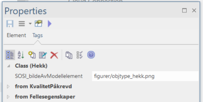
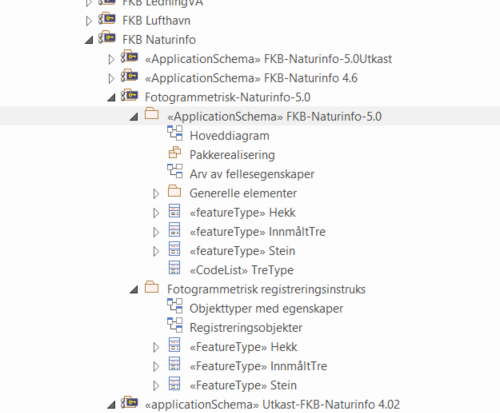
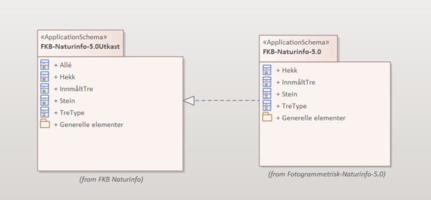
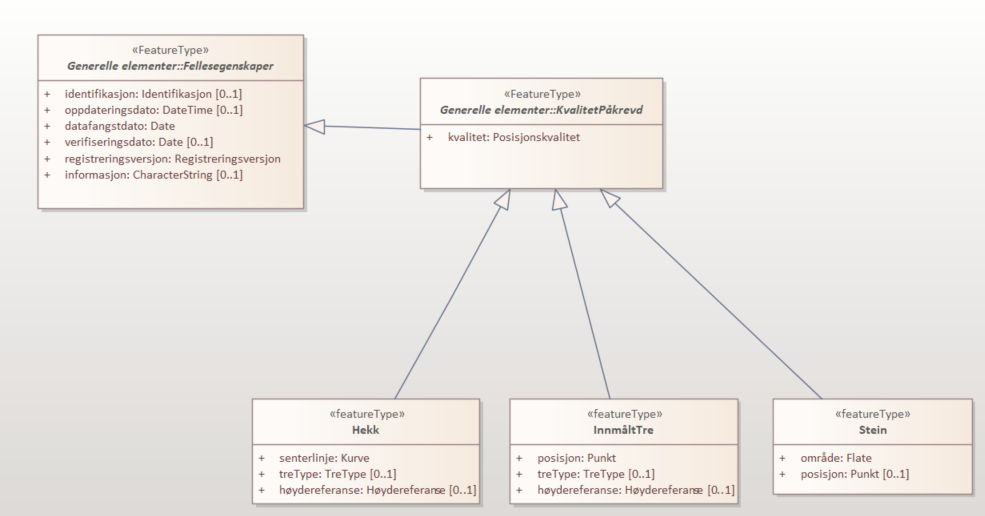
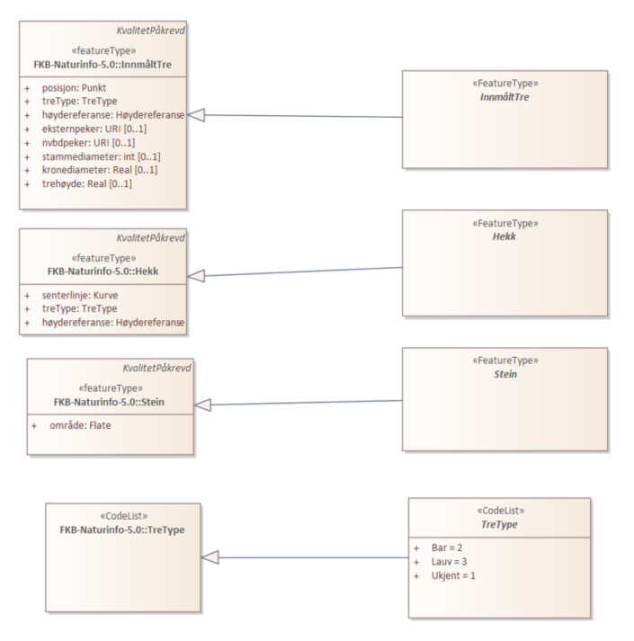

= Innlegging av FKB-spesifikk informasjon i UML-modellene

:sectnums:
:toc: left
:toc-title: Innholdsfortegnelse
:toclevels: 3
:figure-caption: Figur
:table-caption: Tabell
:doctype: article
:encoding: utf-8
:lang: nb
:appendix-caption: Vedlegg
:pdf-page-size: A4

_Versjon 2021-08-31_

== Innledning

Beskrivelse av hvilken informasjon som skal legges inn i FKB 5.0 UML-modellene for henholdsvis forvaltningsspesifikasjonene og for registreringsinstruksene.

== FKB-Forvaltningsspesifikasjoner
FKB-Forvaltningsspesifikasjonene skal være godkjente SOSI Produktspesifikasjoner.

UML-pakkene i SOSI-modellregister skal ha stereotype "ApplicationSchema". Pakkene skal validere med SOSI valideringsverktøy og gi validerende GML-skjema (xsd-filer) som output.

=== Objekttyper

==== Bruk av notes-felt
For objekttyper som hentes fra SOSI del 2 vil notesfeltet inneholde definisjon til elementet hentet fra SOSI del 2. Denne informasjonen lar vi som hovedregel stå urørt, men informasjonen tilpasses slik at den passer bruken i FKB om nødvendig.

Presiseringer eller tillegg for bruken/forståelsen av objekttypen i FKB skrives inn i notes-feltet under SOSI-definisjonen (uten egen/ekstra overskrift).

For objekttyper som defineres i FKB legger vi inn en best mulig definisjon ut fra behovet i FKB.

==== SOSI UML-profil tagged values
* SOSI_bildeAvModellelement (url til absolutt sti bilde/skisse som beskriver objekttypen)

Det anbefales at det defineres ett stk. bilde/bilde som generelt beskriver objektet som legges inn på denne taggen. (Husk å bruke små/store bokstaver riktig!)
Legg inn full sti til bildet på http://skjema.geonorge.no/SOSI/produktspesifikasjon

.Eksempel på bruk av SOSI_bildeAvModellelement

Bruk absolutt sti til http://skjema.geonorge.no/SOSI/produktspesifikasjon/. F.eks. http://skjema.geonorge.no/SOSI/produktspesifikasjon/FKB-Arealbruk/5.0/figurer/objtype_park.png

(flere bilder/skisser legges inn i registreringsinstruks. Se under punkt 3)

==== FKB tagged values
Det skal ikke ligge noen tagged values med prefiks "FKB" på objektene i forvaltningsmodellene. Også ev. andre tagged values som finnes i de gamle modellene (SOSI_melding etc.) og som ikke er definert i dette dokumentet fjernes fra elementene.

==== Spesielle regler/retningslinjer for modellering av assosiasjoner
Se beskrivelse i FKB Generell del.

=== Egenskaper

==== Bruk av notes-felt
Notesfeltet inneholder definisjon til elementet hentet fra SOSI del 2. Denne informasjonen lar vi som hovedregel stå urørt, men informasjonen tilpasses slik at den passer bruken i FKB om nødvendig.

Presiseringer eller tillegg for bruken/forståelsen av objekttypen i FKB skrives inn i notes-feltet under SOSI-definisjonen (uten egen/ekstra overskrift).

==== SOSI UML-profil tagged values
* SOSI_datatype (skal defineres i tråd med datatypen til egenskapen)
* SOSI_lengde
* SOSI_navn

==== FKB tagged values
Det skal ikke ligge noen tagged values med prefiks "FKB" på egenskapene i forvaltningsmodellene.

=== Datatyper 

==== Bruk av notes-felt
Notesfeltet inneholder definisjon til elementet hentet fra SOSI del 2. Denne informasjonen lar vi som hovedregel stå urørt, men informasjonen tilpasses slik at den passer bruken i FKB om nødvendig.

Presiseringer eller tillegg for bruken/forståelsen av objekttypen i FKB skrives inn i notes-feltet under SOSI-definisjonen (uten egen/ekstra overskrift).

==== SOSI UML-profil tagged values
* SOSI_navn

==== FKB tagged values
Det skal ikke ligge noen tagged values med prefiks "FKB" på datatypene i forvaltningsmodellene.

=== Kodelister
Alle kodelister modelleres om tomme elementer i UML, men med link til kodeliste på geonorge.no

==== Bruk av notes-felt
Notesfeltet inneholder definisjon til elementet hentet fra SOSI del 2. Denne informasjonen lar vi som hovedregel stå urørt.

Presiseringer eller tillegg for bruken/forståelsen av objekttypen i FKB skrives inn i notes-feltet under SOSI-definisjonen (uten egen/ekstra overskrift).

==== SOSI UML-profil tagged values
* asDictionary (true)
* codeList (url til kodeliste på Geonorge)

Bruk URL på formen: https://register.geonorge.no/sosi-kodelister/fkb/generell/5.0/medium
(dvs. uten "api" eller extension som del av URL)

==== FKB tagged values
Det skal ikke ligge noen tagged values med prefiks "FKB" på kodelistene i forvaltningsmodellene.

== Registreringsinstrukser

=== Mal i SOSI-modellregister
.Se under Geovekst/FKB-Naturinfo i SOSI-modellregister for mal i tråd med dette dokumentet.

*Designmål for opplegget:*

* Opplegget skal sikre at det ikke blir inkonsistens mellom datadefinisjoner i produktspesifikasjoner og registreringsinstrukser. 
* Det skal være en enklest mulig jobb å etablere og vedlikeholde UML-modeller for registreringsinstruksene som tillegg til produktspesifikasjonene.
* Det skal kunne genereres ut GML-skjema eller andre typer maskinlesbare eksporter fra registreringsinstruksene som beskriver datainnholdet og kan brukes til kontroll av data (og ev. i andre sammenhenger).
* Det skal kunne genereres ut enkel og tydelig dokumentasjon som kan brukes i forbindelse med avtale med firmaer etc. i kartleggingsprosjekter.

=== Oppskrift på etablering av registreringsinstruks

. Etabler ny pakke under FKB-datasettet for registreringsinstruksen. Pakka legges til i SOSI-modellregister *uten* stereotype 
. Ta en kopi av en (mest mulig) ferdig UML-modell for forvaltningsspesifikasjonen til denne pakka. Denne pakka beholder stereotype _ApplicationSchema_ og skal være i tråd med alle krav til et SOSI applikasjonsskjema. GML-skjema (osv.) som setter krav til data levert etter registreringsinstruksen skal kunne eksporteres ut fra denne pakke med vanlige verktøy.
. Oppdater realiseringsdiagram slik at det peker til applikasjonsskjema for forvaltningsmodellen 
+

. Gjør ønskelige endringer (slette objekttyper, slette eller endre multiplisitet på egenskaper) i det realiserte applikasjonsskjemaet. F.eks. vil det oftest være ønskelig å endre i en del fellesegenskaper. Identifikasjon endres fra påkrevd til opsjonelt osv. 
+
.Multiplisitet er endret for flere egenskaper i Fellesegenskaper. 

. Etabler en ny underpakke i registreringsinstruksen på samme nivå som det realiserte applikasjonsskjemaet med navn (f.eks.) _fotogrammetrisk registreringsinstruks_ (se figur 1). I denne pakka legges ekstrainformasjon for å kunne generere god dokumentasjon til registreringsinstruksen. Ingen krav til tagged values på pakkenivå, men legg inn en forklarende tekst på notes-feltet til pakka (teksten skrives ut i toppen av dokumentasjonen)
. Under denne pakke legges det inn _Abstrakte objekttyper_ for alle objekttyper som skal registreres. Det legges også inn andre abstrakte elementer (kodelister/datatyper) dersom det er ønskelig å beskrive spesielle regler for registrering av disse.
+

. De abstrakte objekttypene gis ekstrainformasjon med tanke på eksport av dokumentasjon for registreringsinstruksen. Hvilken informasjon som skal ligge på elementene er beskrevet lenger ned.

=== Endringer som kan utføres i det realiserte applikasjonsskjemaet
Dette er endringer som man må regne med å gjøre på nytt dersom man gjør endringer i UML-modell for produktspesifikasjonen og man må hente en ny kopi (realisering) inn til registreringsinstruksen.

* Ev. objekttyper fra forvaltningsspesifikasjonen som ikke skal inngå i registreringsinstruksen fjernes.
* Fjerne egenskaper som ikke skal registreres
* Endre multiplisitet fra opsjonelt til påkrevd (eller omvendt for identifikasjon og andre egenskaper som håndteres av forvaltningssystemet).

=== Informasjon som legges på de abstrakte objekttypene
Dersom man må hente inn en ny kopi (realisering) av FKB produktspesifikasjonen bli pakken med de abstrakte objekttypene i utgangspunktet ikke berørt. Informasjonen beholdes. Det man imidlertid må gjøre i en slik prosess er å oppdatere arve-pilene slik at de peker til oppdaterte objekttyper.

* Ekstrainformasjon om registrering av objektet legges inn i notes-feltet for elementet (ev. annen informasjon slettes).
* Legge til link til bilder/skisser med bildetekst knyttet til objekttyper m/egenskaper 
** Bruk "files" i UML med tittel/bildetekst!
* Legg til ekstra tagged values på objekttypene
** FKB_høydereferanse (fritekst) _(alle objekttyper)_
** FKB_grunnrissreferanse (fritekst) _(alle objekttyper)_
** FKB_A (-/O/P) _(alle objekttyper)_
** FKB_B (-/O/P) _(alle objekttyper)_
** FKB_C (-/O/P) _(alle objekttyper)_
** FKB_D (-/O/P) _(alle objekttyper)_
** FKB_MINSTESTØRRELSE_A (fritekst) _(bare aktuelt på noen objekttyper)_
** FKB_MINSTESTØRRELSE_B (fritekst) _(bare aktuelt på noen objekttyper)_
** FKB_MINSTESTØRRELSE_C (fritekst) _(bare aktuelt på noen objekttyper)_
** FKB_MINSTESTØRRELSE_D (fritekst) _(bare aktuelt på noen objekttyper)_

=== Informasjon som legges på de abstrakte kodelister
Mange av de samme prinsippene som er brukt for objekttyper brukes også for kodelister. 
Dersom det er behov for legge inn ekstra informasjon for registrering knyttet til en kodeliste, eller til de ulike kodeverdiene i en kodeliste må kan lage en _abstrakt_ kodeliste med samme navn som den tomme kodelista i appilkasjonsskjemaet. Denne abstrakte kodelista arver fra kodelista i applikasjonsskjema på samme måte som for objekttyper. 

En viktig forskjell på objekttyper og kodelister er at for kodelister må vi definere de kodene vi ønsker å knytte informasjon til i den abstrakte kodelista (siden kodelistene i FKB 5.0 ligger i Geonorge og i utgangspunktet er modellert som tomme). Koder som finnes i kodelista, men som ikke er relevante for registreringsinstruksen trenger ikke å defineres inn i de abstrakte kodelistene.

Informasjon som kan legges inn på kodelister:

* Definisjon (notes) for kodelista utformes slik at det beskriver spesielle forhold rundt registrering av kodene i lista
* Det legges inn skisser/bilder (med forklarende tekst) for å forklare registrering av av de ulike kodene i lista under "files" i EA for kodelista (angis som relativ sti) 
* Kodenavn (attribute), Beskrivelse (notes) - gjerne med spesiell informasjon knyttet til registering, og kodeverdi (initial value)
* Taggen SOSI_bildeAvModellelement for et bilde knyttet til hver kodeverdi (angis som relativ sti)

