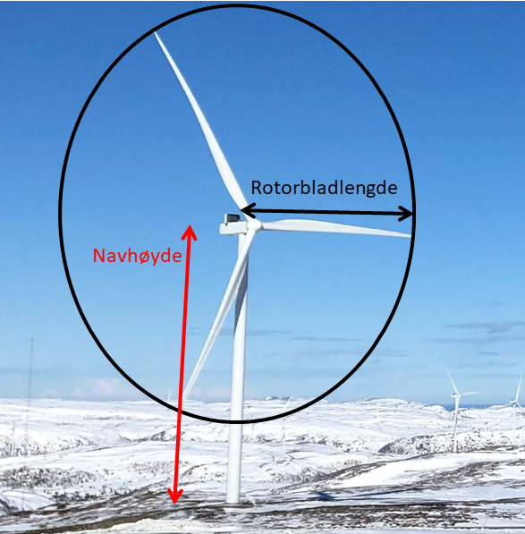

==== Informasjon om diskusjoner og vurderinger i arbeidsgruppen

I arbeidet med revisjon har arbeidsgruppen diskutert bredt hva FKB-Ledning bør være i fremtiden. Under er en oversikt over noen sentrale problemstillinger som er diskutert og hvordan dette er løst i høringsutkastet:

* Skal FKB-Ledning inneholde ledningsdata under bakken og i vann/sjø, i tillegg til objekter over bakken som i dag?
** Dette spørsmålet er drøftet i Geovekst-forum og det er besluttet at i denne omgang videreføres prinsippet om at FKB-Ledning skal inneholde objekter på eller over bakken.
* Hvor mye fag- og driftsinformasjon skal finnes i FKB-Ledning?
** I høringsutkastet er det et minimum med fag- og driftsinformasjon som er tatt med. Det er lagt til rette for at man kan benytte id-håndtering (_eksternPeker_) for å koble geometri (FKB-Ledning) med databaser med utfyllende fag- og driftsinformasjon.
* I hvor stor grad skal FKB-Ledning ha samme datamodell/innhold som Nasjonalt register over luftfartshindre (NRL)?
** Produktspesifikasjonen for FKB-Ledning og NRL er modellert litt ulikt, men produktspesifikasjonene skal være så harmoniserte at de muliggjør gjenbruk av objekter.
* Hvordan legge til rette for effektiv dataflyt mellom anleggseiers database, FKB og andre databaser (for eksempel NRL og NVDB)?
** Arbeidsgruppen har ikke vurdert i detalj dataflyt mellom ulike databaser, med unntak av at id-håndtering er tydeliggjort. 
* Hvordan håndtere at det er mange forskjellige eiere av objektene i FKB-Ledning?
** Eierinformasjon er videreført som egenskap for alle objekter. På denne måten er det lagt til rette for å merke alle objekter med eierinformasjon.
* Skal FKB-LedningVA fortsatt være et FKB-datasett?
** Objekttypene som er en del av dagens FKB-LedningVA er nå tatt inn i FKB-Ledning. Bakgrunnen for dette er et ønske om å kunne brukte produktspesifikasjonen til datafangst av kum, sluk og hydrant, samt at arbeidsgruppen har sett det som hensiktsmessig å ikke skille på om et kumlokk ligger over en VA-kum eller en trekkekum for el/ekom.
* Hva skal gjøres med produktspesifikasjon FKB-LedningLaser (klassifisering og vektorisering av ledningsdata fra laserdata)?
** Klassifisering av punktskydataene overføres til ny produktspesifikasjon Punktsky, som erstatter tidliger FKB-Laser. Den nye Punktsky spesifikasjonen kommer på høring senere i år.
** Objekttypene Jordingsledning og Luftlinje fra FKB-LedningLaser er tatt med i FKB-Ledning.

==== Hva ønskes det spesielt tilbakemeldinger på i høringen?

I http://skjema.geonorge.no/SOSITEST/produktspesifikasjon/FKB-Ledning/5.0/#trueendringslogg[endringsloggen] er de viktigste endringer fra gjeldende spesifikasjon beskrevet. Under er noen spørsmål som spesielt ønskes vurdert i høringen:

* Er UML-modellen med foreslåtte endringer fornuftig? Er det noe som mangler (objekttyper, egenskaper eller kodelister) og er beskrivelsene forståelige?
* Er spesifiseringen av de nye objekttypene Kum og Kumlokk fornuftig? 
** Bør objekttypene som i dag er en del av FKB-LedningVA (kum, sluk og hydrant) inngå i FKB-Ledning slik det er foreslått? 
** Ved fotogrammetrisk datafangst vil det være vanskelig å klassifisere hvilke type anlegg som ligger under kumlokket. Dette er bakgrunnen for at det er innført en ny generell objekttype Kumlokk med egenskapen Kumlokkform som beskriver kumlokkets form. Er dette en god løsning? 
** Er foreslått minstestørrelse for den nye objekttypen Kum fornuftig? 
* Objekttypen EL-Belysningspunkt utgår og erstattes av Mast, med egen egenskap (_belysning_) som angir belysning eller ikke. Om ønskelig kan også det enkelte lysarmatur registreres – noe som gjøres ved å benytte objekttypen Lysarmatur. Er foreslåtte endringer fornuftig?
* For frittstående nettverkstasjoner (f.eks. pumpehus) – er det behov for en egen objekttype for Nettverkstasjonomriss? Kan objekttypen AnnenBygning (i FKB-Bygning) benyttes i stedet?
* For Mast er det nå spesifisert to egenskaper, Linjebredde og VertikalAvstand, som kan benyttes for å angi horisontal og vertikal utstrekning? Er dette en god løsning og er minstestørrelsene fornuftig? Under er eksempel på master over minstestørrelse og bruken av egenskapene. 

.Forslag til registering av egenskapene vertikalAvstand og linjebredde for objekttype Mast
image::vertikalAvstandOgLinjeBredde.png[alt="Forslag til registering av egenskapene vertikalAvstand og linjebredde for objekttype Mast"]

* For Vindturbin er det spesifisert to nye egenskaper, _navhøyde_ og _rotorbladlengde_, som kan benyttes for å angi utstrekningen til Vindturbinen. Er dette en god løsning?

.Forslag til registering av egenskapene navhøyde og rotorbladlengde for objekttype Vindturbin

* Bør Bardun bli en ny objekttype i FKB-Ledning slik det er foreslått? Er foreslått minstemål i så fall fornuftig?
* Bør Jordingsledning og Luftlinje, som i dag er spesifisert i FKB-LedningLaser, bli nye objekttyper i FKB-Ledning slik det er foreslått?
* I høringsutkastet for FKB-Ledning er det spesifisert at datasettet skal inneholde ferdigbyggede anlegg. Er det aktuelt at FKB skal inneholde ledningsanlegg som er under oppføring? Dette er ikke spesifisert i høringsversjonen av FKB-Tiltak. Til informasjon vil slike objekter bli rapporteringspliktige til NRL 30 dager før de settes opp. Gitt at rapporteringsplikten etterleves, vil objektene være tilgjengelige for nedlasting og inngå i NRLs WMS-tjeneste.

==== Høringsdokumenter

http://skjema.geonorge.no/SOSITEST/produktspesifikasjon/FKB-Ledning/5.0/#trueendringslogg[Endringslogg for FKB-Ledning] beskriver de viktigste endringene for datasettet.

.Høringsdokumenter for FKB-Ledning 5.0
[cols="3*", options="header"]
|===
|Dokument
|Link
|Dato

|Standardisert produktspesifikasjon FKB-Ledning 5.0 (HTML)
|https://skjema.geonorge.no/SOSITEST/produktspesifikasjon/FKB-Ledning/5.0/
|2021-09-30

|Standardisert produktspesifikasjon FKB-Ledning 5.0 (PDF)
|https://skjema.geonorge.no/SOSITEST/produktspesifikasjon/FKB-Ledning/5.0/Produktspesifikasjon_FKB-Ledning_50.pdf
|2021-09-30

|GML skjemafil
|https://skjema.geonorge.no/SOSITEST/produktspesifikasjon/FKB-Ledning/5.0/FKBLedning50.xsd
|2021-09-30

|GML eksempelfil
|https://skjema.geonorge.no/SOSITEST/produktspesifikasjon/FKB-Ledning/5.0/eksempel/FKBLedning50.gml
|2021-09-30

|SOSI-format eksempelfil
|https://skjema.geonorge.no/SOSITEST/produktspesifikasjon/FKB-Ledning/5.0/eksempel/FKBLedning50.sos
|2021-09-30

|Registreringsinstruks for fotogrammetrisk datafangst (HTML)
|https://skjema.geonorge.no/SOSITEST/registreringsinstruks/FKB-Ledning/5.0/
|2021-10-12

|Registreringsinstruks for fotogrammetrisk datafangst (PDF)
|https://skjema.geonorge.no/SOSITEST/registreringsinstruks/FKB-Ledning/5.0/Fotogrammetrisk_registreringsinstruks_FKB-Ledning_50_2022-01-01.pdf
|2021-10-12

|===
