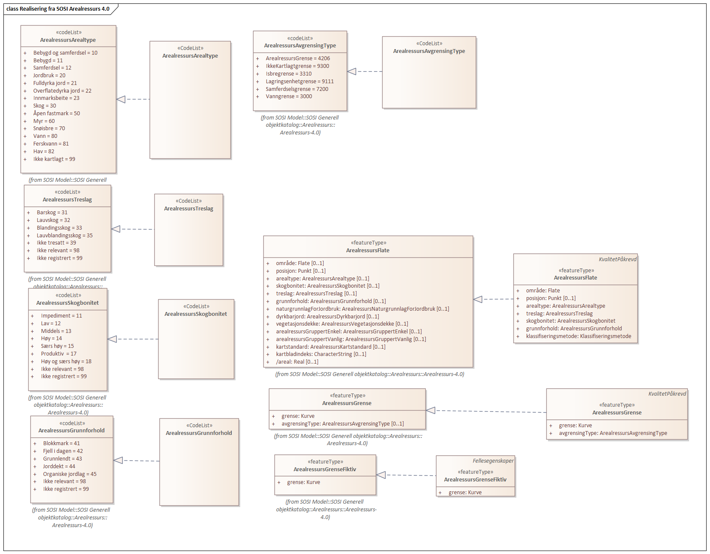
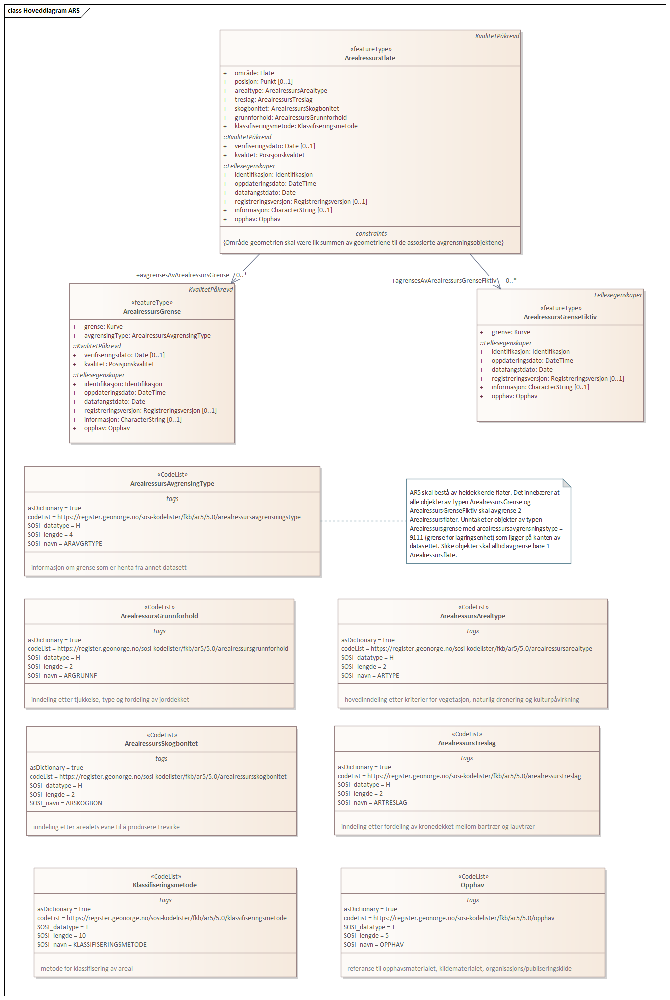
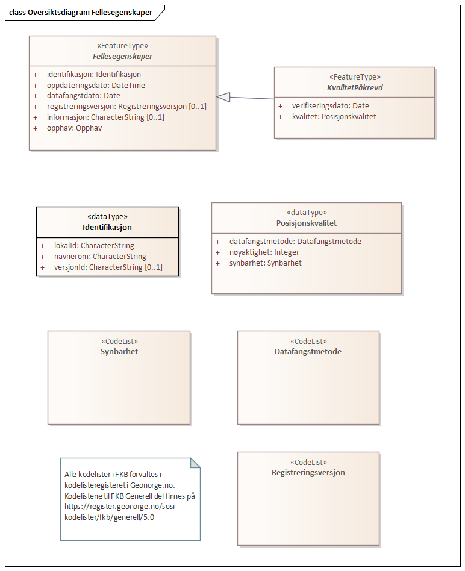
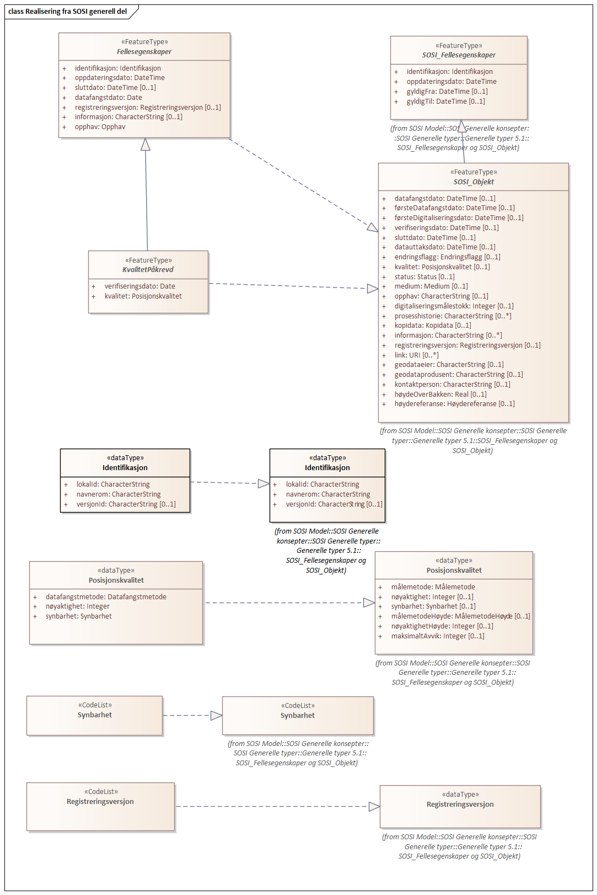
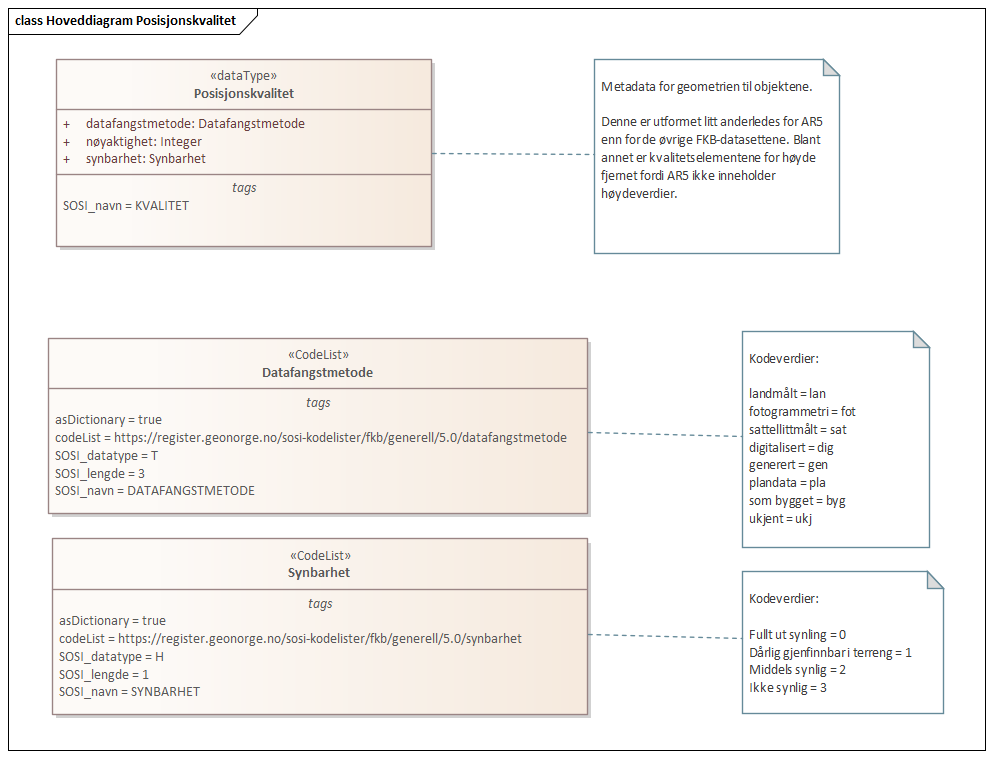

=== Pakke «ApplicationSchema» FKB-AR5-5.0 utkast
*Definisjon:* Datamodell for produktspesifikasjonen FKB-AR5. AR5 er et datasett som klassifiserer arealressuresene til alt areal ut fra arealtype (bebygd areal, dyrka mark, skog osv.), grunnforhold og bonitet.
 
===== Profilparametre i tagged values
[cols="20,80"]
|===
|definition
|"FKB-AR5 is covers all areas in a classification of area resources"@en
 
|description
|"e.g. forest, agriculture areas, built up areas, open land"@en
 
|designation
|"Product specification FKB-AR5 5.0"@en
 
|language
|no
 
|SOSI_kortnavn
|FKB-AR5
 
|SOSI_langnavn
|FKB Arealressurs
 
|SOSI_modellstatus
|utkast
 
|SOSI_spesifikasjonstype
|Produktspesifikasjon
 
|SOSI_versjon
|5.0
 
|version
|5.0
 
|xmlns
|app
 
|xsdDocument
|FKB-AR550.xsd
 
|===
[caption="Figur 1: ",title=Oversiktsdiagram]
image::diagrammer/Oversiktsdiagram.png[Oversiktsdiagram]
[caption="Figur 2: ",title=Pakkerealisering]
image::diagrammer/Pakkerealisering.png[Pakkerealisering]
[caption="Figur 3: ",title=Realisering fra SOSI Arealressurs 4.0]

[caption="Figur 4: ",title=Hoveddiagram AR5]

 
|===
|===
 
[[arealressursflate]]
==== «featureType» ArealressursFlate
*Definisjon:* et sammenhengende areal som er tilordnet de samme egenskapsverdiene i henhold til et Arealressursklassifikasjonssystem
 
===== Egenskaper
[cols="20,80"]
|===
|*Navn:* 
|*område*
 
|Definisjon: 
|objektets utstrekning
 
|Multiplisitet: 
|[1..1]
 
|Type: 
|<<flate,«dataType» Flate>>
|===
[cols="20,80"]
|===
|*Navn:* 
|*posisjon*
 
|Definisjon: 
|sted som objektet eksisterer på
 
|Multiplisitet: 
|[0..1]
 
|Type: 
|<<punkt,«dataType» Punkt>>
|===
[cols="20,80"]
|===
|*Navn:* 
|*arealtype*
 
|Definisjon: 
|hovedinndeling etter kriterier for vegetasjon, naturlig drenering og kulturpåvirkning
 
|Multiplisitet: 
|[1..1]
 
|Type: 
|<<arealressursarealtype,«CodeList» ArealressursArealtype>>
|Profilparametre i tagged values: 
|
defaultCodeSpace: https://register.geonorge.no/sosi-kodelister/fkb/ar5/5.0/arealressursarealtype + 
SOSI_datatype: H + 
SOSI_lengde: 2 + 
SOSI_navn: ARTYPE + 
|===
[cols="20,80"]
|===
|*Navn:* 
|*treslag*
 
|Definisjon: 
|inndeling etter fordeling av kronedekket mellom bartrær og lauvtrær
 
|Multiplisitet: 
|[1..1]
 
|Type: 
|<<arealressurstreslag,«CodeList» ArealressursTreslag>>
|Profilparametre i tagged values: 
|
defaultCodeSpace: https://register.geonorge.no/sosi-kodelister/fkb/ar5/5.0/arealressurstreslag + 
SOSI_datatype: H + 
SOSI_lengde: 2 + 
SOSI_navn: ARTRESLAG + 
|===
[cols="20,80"]
|===
|*Navn:* 
|*skogbonitet*
 
|Definisjon: 
|inndeling etter arealets evne til å produsere trevirke
 
|Multiplisitet: 
|[1..1]
 
|Type: 
|<<arealressursskogbonitet,«CodeList» ArealressursSkogbonitet>>
|Profilparametre i tagged values: 
|
defaultCodeSpace: https://register.geonorge.no/sosi-kodelister/fkb/ar5/5.0/arealressursskogbonitet + 
SOSI_datatype: H + 
SOSI_lengde: 2 + 
SOSI_navn: ARSKOGBON + 
|===
[cols="20,80"]
|===
|*Navn:* 
|*grunnforhold*
 
|Definisjon: 
|inndeling etter tjukkelse, type og fordeling av jorddekket
 
|Multiplisitet: 
|[1..1]
 
|Type: 
|<<arealressursgrunnforhold,«CodeList» ArealressursGrunnforhold>>
|Profilparametre i tagged values: 
|
defaultCodeSpace: https://register.geonorge.no/sosi-kodelister/fkb/ar5/5.0/arealressursgrunnforhold + 
SOSI_datatype: H + 
SOSI_lengde: 2 + 
SOSI_navn: ARGRUNNF + 
|===
[cols="20,80"]
|===
|*Navn:* 
|*klassifiseringsmetode*
 
|Definisjon: 
|metode for klassifisering av areal 
 
|Multiplisitet: 
|[1..1]
 
|Type: 
|<<klassifiseringsmetode,«CodeList» Klassifiseringsmetode>>
|Profilparametre i tagged values: 
|
defaultCodeSpace: https://register.geonorge.no/sosi-kodelister/fkb/ar5/5.0/klassifiseringsmetode + 
SOSI_datatype: T + 
SOSI_lengde: 10 + 
SOSI_navn: KLASSIFISERINGSMETODE + 
|===
===== Roller
[cols="20,80"]
|===
|*Rollenavn:* 
|*agrensesAvArealressursGrenseFiktiv*
 
|Definisjon:
|Krav til delt flategeometri. Avgrensning av Arealressursflate ved hjelp av bygningsdelelinje
 
|Multiplisitet: 
|[0..*]
 
|Til klasse
|<<arealressursgrensefiktiv,«featureType» ArealressursGrenseFiktiv>>
|===
[cols="20,80"]
|===
|*Rollenavn:* 
|*avgrensesAvArealressursGrense*
 
|Definisjon:
|Krav til delt flategeometri. Avgrensning av Arealressursflate ved hjelp av Arealressursgrense
 
|Multiplisitet: 
|[0..*]
 
|Til klasse
|<<arealressursgrense,«featureType» ArealressursGrense>>
|===
===== Restriksjoner
[cols="20,80"]
|===
|*Navn:* 
|*Område-geometrien skal være lik summen av geometriene til de assosierte avgrensningsobjektene*
 
|Beskrivelse: 
|--ingen OCL, restriksjonen implementeres manuelt
 
|===
===== Arv og realiseringer
[cols="20,80"]
|===
|Supertype: 
|<<kvalitetpåkrevd,«FeatureType» KvalitetPåkrevd>>
 
|Realisering av: 
|«ApplicationSchema» Arealressurs-4.0::«featureType» ArealressursFlate +
|===
 
|===
|===
 
[[arealressursgrense]]
==== «featureType» ArealressursGrense
*Definisjon:* avgrensing for en eller to arealressursflater
 
===== Egenskaper
[cols="20,80"]
|===
|*Navn:* 
|*grense*
 
|Definisjon: 
|forløp som følger overgang mellom ulike fenomener
 
|Multiplisitet: 
|[1..1]
 
|Type: 
|<<kurve,«dataType» Kurve>>
|===
[cols="20,80"]
|===
|*Navn:* 
|*avgrensingType*
 
|Definisjon: 
|informasjon om grense som er henta fra annet datasett
 
|Multiplisitet: 
|[1..1]
 
|Type: 
|<<arealressursavgrensingtype,«CodeList» ArealressursAvgrensingType>>
|Profilparametre i tagged values: 
|
defaultCodeSpace: https://register.geonorge.no/sosi-kodelister/fkb/ar5/5.0/arealressursavgrensningstype + 
SOSI_datatype: H + 
SOSI_lengde: 4 + 
SOSI_navn: ARAVGRTYPE + 
|===
===== Arv og realiseringer
[cols="20,80"]
|===
|Supertype: 
|<<kvalitetpåkrevd,«FeatureType» KvalitetPåkrevd>>
 
|Realisering av: 
|«ApplicationSchema» Arealressurs-4.0::«featureType» ArealressursGrense +
|===
 
|===
|===
 
[[arealressursgrensefiktiv]]
==== «featureType» ArealressursGrenseFiktiv
*Definisjon:* avgrensing mellom to arealressursflater som har like egenskapsverdier
 
===== Egenskaper
[cols="20,80"]
|===
|*Navn:* 
|*grense*
 
|Definisjon: 
|forløp som følger overgang mellom ulike fenomener
 
|Multiplisitet: 
|[1..1]
 
|Type: 
|<<kurve,«dataType» Kurve>>
|===
===== Arv og realiseringer
[cols="20,80"]
|===
|Supertype: 
|<<fellesegenskaper,«FeatureType» Fellesegenskaper>>
 
|Realisering av: 
|«ApplicationSchema» Arealressurs-4.0::«featureType» ArealressursGrenseFiktiv +
|===
 
|===
|===
 
[[arealressursarealtype]]
==== «CodeList» ArealressursArealtype
*Definisjon:* hovedinndeling etter kriterier for vegetasjon, naturlig drenering og kulturp&#229;virkning
 
===== Profilparametre i tagged values
[cols="20,80"]
|===
|asDictionary
|true
 
|codeList
|https://register.geonorge.no/sosi-kodelister/fkb/ar5/5.0/arealressursarealtype
 
|SOSI_datatype
|H
 
|SOSI_lengde
|2
 
|SOSI_navn
|ARTYPE
 
|===
Koder fra ekstern kodeliste kan hentes fra register: https://register.geonorge.no/sosi-kodelister/fkb/ar5/5.0/arealressursarealtype
 
 
|===
|===
 
[[arealressursavgrensingtype]]
==== «CodeList» ArealressursAvgrensingType
*Definisjon:* informasjon om grense som er henta fra annet datasett
 
===== Profilparametre i tagged values
[cols="20,80"]
|===
|asDictionary
|true
 
|codeList
|https://register.geonorge.no/sosi-kodelister/fkb/ar5/5.0/arealressursavgrensningstype
 
|SOSI_datatype
|H
 
|SOSI_lengde
|4
 
|SOSI_navn
|ARAVGRTYPE
 
|===
Koder fra ekstern kodeliste kan hentes fra register: https://register.geonorge.no/sosi-kodelister/fkb/ar5/5.0/arealressursavgrensningstype
 
 
|===
|===
 
[[arealressursgrunnforhold]]
==== «CodeList» ArealressursGrunnforhold
*Definisjon:* inndeling etter tjukkelse, type og fordeling av jorddekket
 
===== Profilparametre i tagged values
[cols="20,80"]
|===
|asDictionary
|true
 
|codeList
|https://register.geonorge.no/sosi-kodelister/fkb/ar5/5.0/arealressursgrunnforhold
 
|SOSI_datatype
|H
 
|SOSI_lengde
|2
 
|SOSI_navn
|ARGRUNNF
 
|===
Koder fra ekstern kodeliste kan hentes fra register: https://register.geonorge.no/sosi-kodelister/fkb/ar5/5.0/arealressursgrunnforhold
 
 
|===
|===
 
[[arealressursskogbonitet]]
==== «CodeList» ArealressursSkogbonitet
*Definisjon:* inndeling etter arealets evne til å produsere trevirke
 
===== Profilparametre i tagged values
[cols="20,80"]
|===
|asDictionary
|true
 
|codeList
|https://register.geonorge.no/sosi-kodelister/fkb/ar5/5.0/arealressursskogbonitet
 
|SOSI_datatype
|H
 
|SOSI_lengde
|2
 
|SOSI_navn
|ARSKOGBON
 
|===
Koder fra ekstern kodeliste kan hentes fra register: https://register.geonorge.no/sosi-kodelister/fkb/ar5/5.0/arealressursskogbonitet
 
 
|===
|===
 
[[arealressurstreslag]]
==== «CodeList» ArealressursTreslag
*Definisjon:* inndeling etter fordeling av kronedekket mellom bartrær og lauvtrær
 
===== Profilparametre i tagged values
[cols="20,80"]
|===
|asDictionary
|true
 
|codeList
|https://register.geonorge.no/sosi-kodelister/fkb/ar5/5.0/arealressurstreslag
 
|SOSI_datatype
|H
 
|SOSI_lengde
|2
 
|SOSI_navn
|ARTRESLAG
 
|===
Koder fra ekstern kodeliste kan hentes fra register: https://register.geonorge.no/sosi-kodelister/fkb/ar5/5.0/arealressurstreslag
 
 
|===
|===
 
[[klassifiseringsmetode]]
==== «CodeList» Klassifiseringsmetode
*Definisjon:* metode for klassifisering av areal 
 
===== Profilparametre i tagged values
[cols="20,80"]
|===
|asDictionary
|true
 
|codeList
|https://register.geonorge.no/sosi-kodelister/fkb/ar5/5.0/klassifiseringsmetode
 
|SOSI_datatype
|T
 
|SOSI_lengde
|10
 
|SOSI_navn
|KLASSIFISERINGSMETODE
 
|===
Koder fra ekstern kodeliste kan hentes fra register: https://register.geonorge.no/sosi-kodelister/fkb/ar5/5.0/klassifiseringsmetode
 
 
|===
|===
 
[[opphav]]
==== «CodeList» Opphav
*Definisjon:* referanse til opphavsmaterialet, kildematerialet, organisasjons/publiseringskilde
 
===== Profilparametre i tagged values
[cols="20,80"]
|===
|asDictionary
|true
 
|codeList
|https://register.geonorge.no/sosi-kodelister/fkb/ar5/5.0/opphav
 
|SOSI_datatype
|T
 
|SOSI_lengde
|5
 
|SOSI_navn
|OPPHAV
 
|===
Koder fra ekstern kodeliste kan hentes fra register: https://register.geonorge.no/sosi-kodelister/fkb/ar5/5.0/opphav
 
<<<
|===
|===
=== Pakke: Generelle elementer
*Definisjon:* pakke med elementer som realiserer tilsvarende elementer i FKB Generell del 5.0

Merknad:
Kopieres direkte inn i de enkelte FKB-datasettene
[caption="Figur 5: ",title=Oversiktsdiagram Fellesegenskaper]

[caption="Figur 6: ",title=Realisering fra SOSI generell del]

[caption="Figur 7: ",title=Hoveddiagram Posisjonskvalitet]

 
|===
|===
 
[[fellesegenskaper]]
==== «FeatureType» Fellesegenskaper (abstrakt)
*Definisjon:* abstrakt objekttype som b&#230;rer sentrale egenskaper som er anbefalt for bruk i produktspesifikasjoner.
 
===== Egenskaper
[cols="20,80"]
|===
|*Navn:* 
|*identifikasjon*
 
|Definisjon: 
|unik identifikasjon av et objekt 

Merknad FKB:
Unik identifikasjon av et objekt, ivaretas av den ansvarlige produsent/forvalter, og som kan benyttes av eksterne applikasjoner som referanse til objektet.
Den unike identifikatoren er unik for kartobjektet og skal ikke endres i kartobjektets levetid. Dette m&#229; ikke forveksles med en tematisk identifikator (for eksempel bygningsnummer) som unikt identifiserer et objekt i virkeligheten. En bygning med samme bygningsnummer vil kunne representeres i mange kartprodukter der det finnes en unik identifikasjon i hver av dem.
For FKB benyttes UUID (Universally unique identifier) som lokalId. Dette inneb&#230;rer at lokalId alene alltid vil v&#230;re unik. Likevel skal alltid navnerom ogs&#229; angis. Navnerom angir FKB-datasettet.
 
|Multiplisitet: 
|[1..1]
 
|Type: 
|<<identifikasjon,«dataType» Identifikasjon>>
|Profilparametre i tagged values: 
|
SOSI_navn: IDENT + 
|===
[cols="20,80"]
|===
|*Navn:* 
|*oppdateringsdato*
 
|Definisjon: 
|tidspunkt for siste endring p&#229; objektet 

Merknad FKB: 

Denne datoen viser datasystemets siste endring p&#229; dataobjektet. Egenskapen settes av forvaltningssystemet etter f&#248;lgende regler:

i. Oppdateringsdato er tidspunkt for oppdatering av databasen og settes av forvaltningsbasen (ikke
av klienten).

ii. Oppdateringsdato skal endres ogs&#229; hvis det er kopidata som blir endret eller importert i en
”kopibase”.

iii. N&#229;r avgrensingslinjene til en flate endres, skal flateobjektet f&#229; ny oppdateringsdato.

iv. Oppdateringsdato skal endres hvis en egenskap endres.
 
|Multiplisitet: 
|[1..1]
 
|Type: 
|http://skjema.geonorge.no/SOSI/basistype/DateTime[DateTime]
|Profilparametre i tagged values: 
|
SOSI_datatype: DATOTID + 
SOSI_navn: OPPDATERINGSDATO + 
|===
[cols="20,80"]
|===
|*Navn:* 
|*datafangstdato*
 
|Definisjon: 
|dato n&#229;r objektet siste gang ble registrert/observert/m&#229;lt i terrenget

Merknad: I mange tilfeller er denne forskjellig fra oppdateringsdato, da registrerte endringer kan bufres i en kortere eller lengre periode f&#248;r disse legges inn i databasen.
Ved f&#248;rstegangsregistrering settes Datafangstdato lik f&#248;rsteDatafangstdato.
 
|Multiplisitet: 
|[1..1]
 
|Type: 
|http://skjema.geonorge.no/SOSI/basistype/Date[Date]
|Profilparametre i tagged values: 
|
SOSI_datatype: DATO + 
SOSI_navn: DATAFANGSTDATO + 
|===
[cols="20,80"]
|===
|*Navn:* 
|*registreringsversjon*
 
|Definisjon: 
|angivelse av hvilken produktspesifikasjon som er utgangspunkt  for dataene
 
|Multiplisitet: 
|[0..1]
 
|Type: 
|<<registreringsversjon,«CodeList» Registreringsversjon>>
|Profilparametre i tagged values: 
|
defaultCodeSpace:  + 
SOSI_navn: REGISTRERINGSVERSJON + 
|===
[cols="20,80"]
|===
|*Navn:* 
|*informasjon*
 
|Definisjon: 
|generell opplysning.

Merknad FKB:
Mulighet til &#229; legge inn utfyllende informasjon om objektet. Egenskapen b&#248;r bare brukes til &#229; legge inn ekstra informasjon om enkeltobjekter. Egenskapen b&#248;r ikke brukes til &#229; systematisk angi ekstrainformasjon om mange/alle objekter i et datasett.
 
|Multiplisitet: 
|[0..1]
 
|Type: 
|http://skjema.geonorge.no/SOSI/basistype/CharacterString[CharacterString]
|Profilparametre i tagged values: 
|
SOSI_datatype: T + 
SOSI_lengde: 255 + 
SOSI_navn: INFORMASJON + 
|===
[cols="20,80"]
|===
|*Navn:* 
|*opphav*
 
|Definisjon: 
|referanse til opphavsmaterialet, kildematerialet, organisasjons/publiseringskilde
 
|Multiplisitet: 
|[1..1]
 
|Type: 
|<<opphav,«CodeList» Opphav>>
|Profilparametre i tagged values: 
|
defaultCodeSpace: https://register.geonorge.no/sosi-kodelister/fkb/ar5/5.0/opphav + 
SOSI_datatype: T + 
SOSI_lengde: 5 + 
SOSI_navn: OPPHAV + 
|===
===== Arv og realiseringer
[cols="20,80"]
|===
|Subtyper:
|<<kvalitetpåkrevd,«FeatureType» KvalitetPåkrevd>> +
<<arealressursgrensefiktiv,«featureType» ArealressursGrenseFiktiv>> +
|Realisering av: 
|«ApplicationSchema» Generelle typer 5.1/SOSI_Fellesegenskaper og SOSI_Objekt::«FeatureType» SOSI_Objekt +
|===
 
|===
|===
 
[[kvalitetpåkrevd]]
==== «FeatureType» KvalitetPåkrevd (abstrakt)
*Definisjon:* abstrakt objekttype med p&#229;krevet kvalitetsangivelse
 
===== Egenskaper
[cols="20,80"]
|===
|*Navn:* 
|*verifiseringsdato*
 
|Definisjon: 
|dato n&#229;r dataene er fastsl&#229;tt &#229; v&#230;re i samsvar med virkeligheten.
 
|Multiplisitet: 
|[1..1]
 
|Type: 
|http://skjema.geonorge.no/SOSI/basistype/Date[Date]
|Profilparametre i tagged values: 
|
SOSI_datatype: DATO + 
SOSI_navn: VERIFISERINGSDATO + 
|===
[cols="20,80"]
|===
|*Navn:* 
|*kvalitet*
 
|Definisjon: 
|beskrivelse av kvaliteten på stedfestingen

Merknad: Denne er identisk med ..KVALITET i tidligere versjoner av SOSI.
 
|Multiplisitet: 
|[1..1]
 
|Type: 
|<<posisjonskvalitet,«dataType» Posisjonskvalitet>>
|Profilparametre i tagged values: 
|
SOSI_navn: KVALITET + 
|===
===== Arv og realiseringer
[cols="20,80"]
|===
|Supertype: 
|<<fellesegenskaper,«FeatureType» Fellesegenskaper>>
 
|Subtyper:
|<<arealressursflate,«featureType» ArealressursFlate>> +
<<arealressursgrense,«featureType» ArealressursGrense>> +
|Realisering av: 
|«ApplicationSchema» Generelle typer 5.1/SOSI_Fellesegenskaper og SOSI_Objekt::«FeatureType» SOSI_Objekt +
|===
 
|===
|===
 
[[identifikasjon]]
==== «dataType» Identifikasjon
*Definisjon:* Unik identifikasjon av et objekt i et datasett, forvaltet av den ansvarlige produsent/forvalter, og kan benyttes av eksterne applikasjoner som stabil referanse til objektet. 

Merknad 1: Denne objektidentifikasjonen må ikke forveksles med en tematisk objektidentifikasjon, slik som f.eks bygningsnummer. 

Merknad 2: Denne unike identifikatoren vil ikke endres i løpet av objektets levetid, og ikke gjenbrukes i andre objekt. 
 
===== Profilparametre i tagged values
[cols="20,80"]
|===
|SOSI_navn
|IDENT
 
|===
===== Egenskaper
[cols="20,80"]
|===
|*Navn:* 
|*lokalId*
 
|Definisjon: 
|lokal identifikator av et objekt

Merknad: Det er dataleverend&#248;rens ansvar &#229; s&#248;rge for at den lokale identifikatoren er unik innenfor navnerommet. For FKB-data benyttes UUID som lokalId.
 
|Multiplisitet: 
|[1..1]
 
|Type: 
|http://skjema.geonorge.no/SOSI/basistype/CharacterString[CharacterString]
|Profilparametre i tagged values: 
|
SOSI_datatype: T + 
SOSI_lengde: 100 + 
SOSI_navn: LOKALID + 
|===
[cols="20,80"]
|===
|*Navn:* 
|*navnerom*
 
|Definisjon: 
|navnerom som unikt identifiserer datakilden til et objekt, anbefales å være en http-URI

Eksempel: http://data.geonorge.no/SentraltStedsnavnsregister/1.0

Merknad : Verdien for nanverom vil eies av den dataprodusent som har ansvar for de unike identifikatorene og må være registrert i data.geonorge.no eller data.norge.no
 
|Multiplisitet: 
|[1..1]
 
|Type: 
|http://skjema.geonorge.no/SOSI/basistype/CharacterString[CharacterString]
|Profilparametre i tagged values: 
|
SOSI_datatype: T + 
SOSI_lengde: 100 + 
SOSI_navn: NAVNEROM + 
|===
[cols="20,80"]
|===
|*Navn:* 
|*versjonId*
 
|Definisjon: 
|identifikasjon av en spesiell versjon av et geografisk objekt (instans)
 
|Multiplisitet: 
|[0..1]
 
|Type: 
|http://skjema.geonorge.no/SOSI/basistype/CharacterString[CharacterString]
|Profilparametre i tagged values: 
|
SOSI_datatype: T + 
SOSI_lengde: 100 + 
SOSI_navn: VERSJONID + 
|===
===== Arv og realiseringer
[cols="20,80"]
|===
|Realisering av: 
|«ApplicationSchema» Generelle typer 5.1/SOSI_Fellesegenskaper og SOSI_Objekt::«dataType» Identifikasjon +
|===
 
|===
|===
 
[[posisjonskvalitet]]
==== «dataType» Posisjonskvalitet
*Definisjon:* beskrivelse av kvaliteten p&#229; stedfestingen.

Merknad:
Posisjonskvalitet er ikke konform med  kvalitetsmodellen i ISO slik den er defineret i ISO19157:2013, men er en videref&#248;ring av tildligere brukte kvalitetsegenskaper i SOSI. FKB 5.0 innf&#248;rer en egen variant av datatypen Posisjonskvalitet der kodeliste m&#229;lemetode er byttet ut med den mer generelle kodelista Datafangstmetode. 
 
===== Profilparametre i tagged values
[cols="20,80"]
|===
|SOSI_navn
|KVALITET
 
|===
===== Egenskaper
[cols="20,80"]
|===
|*Navn:* 
|*datafangstmetode*
 
|Definisjon: 
|metode for datafangst. 
Egenskapen beskriver datafangstmetode for grunnrisskoordinater (x,y), eller for b&#229;de grunnriss og h&#248;yde (x,y,z) dersom det ikke er oppgitt noen verdi for datafangstmetodeH&#248;yde.
 
|Multiplisitet: 
|[1..1]
 
|Type: 
|<<datafangstmetode,«CodeList» Datafangstmetode>>
|Profilparametre i tagged values: 
|
defaultCodeSpace: https://register.geonorge.no/sosi-kodelister/fkb/generell/5.0/datafangstmetode + 
SOSI_datatype: T + 
SOSI_lengde: 3 + 
SOSI_navn: DATAFANGSTMETODE + 
|===
[cols="20,80"]
|===
|*Navn:* 
|*nøyaktighet*
 
|Definisjon: 
|standardavviket til posisjoneringa av objektet oppgitt i cm

I de aller fleste sammenhenger benyttes en ansl&#229;tt eller forventet verdi for standardavvik, men dersom man har en beregnet verdi skal denne benyttes. 

For objekter med punktgeometri benyttes verdi for punktstandardavvik. For objekter med kurvegeometri benyttes standardavviket for tverravviket fra kurva. For objekter med overflate- eller volumgeometri er forst&#229;elsen at standardavviket beregnes ut fra (3D) avvikene mellom sann posisjon og n&#230;rmeste punkt p&#229; overflata. 

Merknad:

Verdien er ment &#229; beskrive n&#248;yaktigheten til objektet sammenlignet med sann verdi. Standardavvik er i utgangspunktet et m&#229;l p&#229; det tilfeldige avviket og det inneb&#230;rer at vi forutsetter at det systematiske avviket i liten grad p&#229;virker n&#248;yaktigheten til posisjoneringa. For fotogrammetriske data settes som hovedregel verdien lik kravet til standardavvik ved datafangst. Se standarden Geodatakvalitet for n&#230;rmere definisjon av standardavvik og hvordan dette defineres, beregnes og kontrolleres.
 
|Multiplisitet: 
|[1..1]
 
|Type: 
|http://skjema.geonorge.no/SOSI/basistype/Integer[Integer]
|Profilparametre i tagged values: 
|
SOSI_datatype: H + 
SOSI_lengde: 6 + 
SOSI_navn: NØYAKTIGHET + 
|===
[cols="20,80"]
|===
|*Navn:* 
|*synbarhet*
 
|Definisjon: 
|beskrivelse av hvor godt objektene framg&#229;r i datagrunnlaget for posisjonering (f.eks. flybildene).
 
|Multiplisitet: 
|[1..1]
 
|Type: 
|<<synbarhet,«CodeList» Synbarhet>>
|Profilparametre i tagged values: 
|
defaultCodeSpace: https://register.geonorge.no/sosi-kodelister/fkb/generell/5.0/synbarhet + 
SOSI_datatype: H + 
SOSI_lengde: 1 + 
SOSI_navn: SYNBARHET + 
|===
===== Arv og realiseringer
[cols="20,80"]
|===
|Realisering av: 
|«ApplicationSchema» Generelle typer 5.1/SOSI_Fellesegenskaper og SOSI_Objekt::«dataType» Posisjonskvalitet +
|===
 
|===
|===
 
[[synbarhet]]
==== «CodeList» Synbarhet
*Definisjon:* synbarhet beskriver hvor godt objektene framg&#229;r i datagrunnlaget for posisjonering (f.eks. flybildene).
 
===== Profilparametre i tagged values
[cols="20,80"]
|===
|asDictionary
|true
 
|codeList
|https://register.geonorge.no/sosi-kodelister/fkb/generell/5.0/synbarhet
 
|SOSI_datatype
|H
 
|SOSI_lengde
|1
 
|SOSI_navn
|SYNBARHET
 
|===
Koder fra ekstern kodeliste kan hentes fra register: https://register.geonorge.no/sosi-kodelister/fkb/generell/5.0/synbarhet
 
 
|===
|===
 
[[datafangstmetode]]
==== «CodeList» Datafangstmetode
*Definisjon:* metode for datafangst. 

Datafangstmetoden beskriver hvordan selve vektordataene er posisjonert fra et datagrunnlag (observasjoner med landm&#229;lingsutstyr, fotogrammetrisk stereomodell, digital terrengmodell etc.) og ikke prosessen med &#229; innhente det bakenforliggende datagrunnlaget.
 
===== Profilparametre i tagged values
[cols="20,80"]
|===
|asDictionary
|true
 
|codeList
|https://register.geonorge.no/sosi-kodelister/fkb/generell/5.0/datafangstmetode
 
|SOSI_datatype
|T
 
|SOSI_lengde
|3
 
|SOSI_navn
|DATAFANGSTMETODE
 
|===
Koder fra ekstern kodeliste kan hentes fra register: https://register.geonorge.no/sosi-kodelister/fkb/generell/5.0/datafangstmetode
 
 
|===
|===
 
[[registreringsversjon]]
==== «CodeList» Registreringsversjon
*Definisjon:* FKB-versjon som ligger til grunn for registrering. Mest relevant for data som er fotogrammetrisk registrert.
 
===== Profilparametre i tagged values
[cols="20,80"]
|===
|asDictionary
|true
 
|codeList
|https://register.geonorge.no/sosi-kodelister/fkb/generell/5.0/registreringsversjon
 
|SOSI_datatype
|T
 
|SOSI_lengde
|10
 
|SOSI_navn
|REGISTRERINGSVERSJON
 
|===
Koder fra ekstern kodeliste kan hentes fra register: https://register.geonorge.no/sosi-kodelister/fkb/generell/5.0/registreringsversjon
 
// End of UML-model
