=== Pakke «ApplicationSchema» FKB-Arealbruk-5.0-Utkast
*Definisjon:* Datamodell for produktspesifikasjonen FKB-Arealbruk. FKB-Arealbruk beskriver den fysiske bruken av et areal, f.eks. industriomr&#229;der, campingplasser og parker. Datasettet er ikke heldekkende.
 
===== Profilparametre i tagged values
[cols="20,80"]
|===
|definition
|"FKB-Arealbruk decribes the physical use of the land area"@en
 
|description
|"Contains industrial areas, camping grounds, parks e.g."@en 
 
|designation
|"Product specification FKB-Arealbruk 5.0"@en
 
|language
|no
 
|SOSI_kortnavn
|FKB-Arealbruk
 
|SOSI_langnavn
|FKB Arealbruk
 
|SOSI_modellstatus
|utkast
 
|SOSI_spesifikasjonstype
|Produktspesifikasjon
 
|SOSI_versjon
|5.0
 
|targetNamespace
|http://skjema.geonorge.no/SOSI/produktspesifikasjon/FKB-Arealbruk/5.0/
 
|version
|5.0
 
|xmlns
|app
 
|xsdDocument
|FKB-Arealbruk50.xsd
 
|xsdEncodingRule
|sosi
 
|===
 
.Oversiktsdiagram 
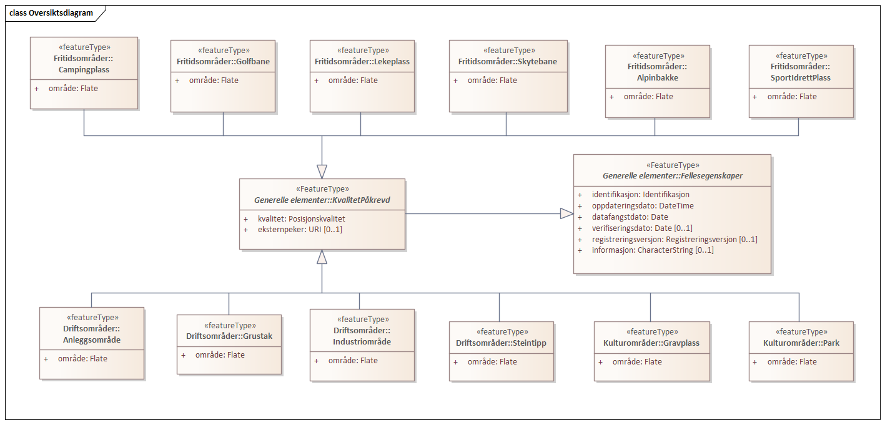
 
.Pakkerealisering 
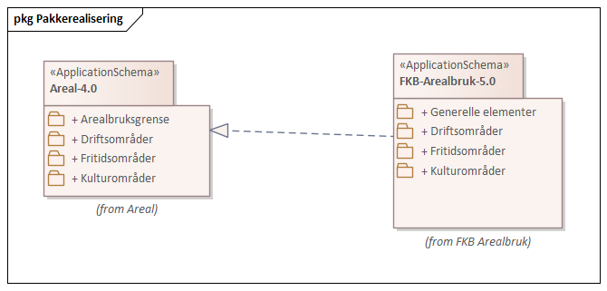
<<<
|===
|===
=== Pakke: Generelle elementer
*Definisjon:* pakke med elementer som realiserer tilsvarende elementer i FKB Generell del 5.0

Merknad:
Kopieres direkte inn i de enkelte FKB-datasettene
 
.Oversiktsdiagram Fellesegenskaper 
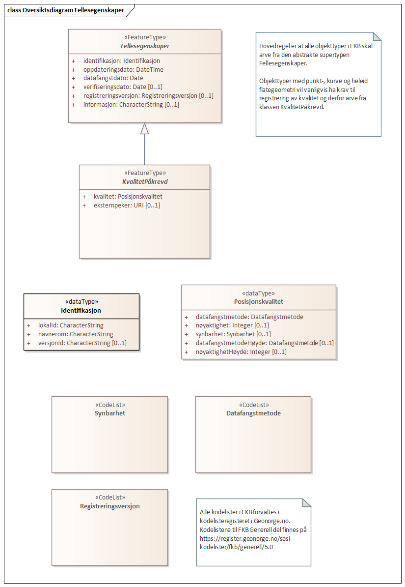
 
.Realisering fra SOSI generell del 
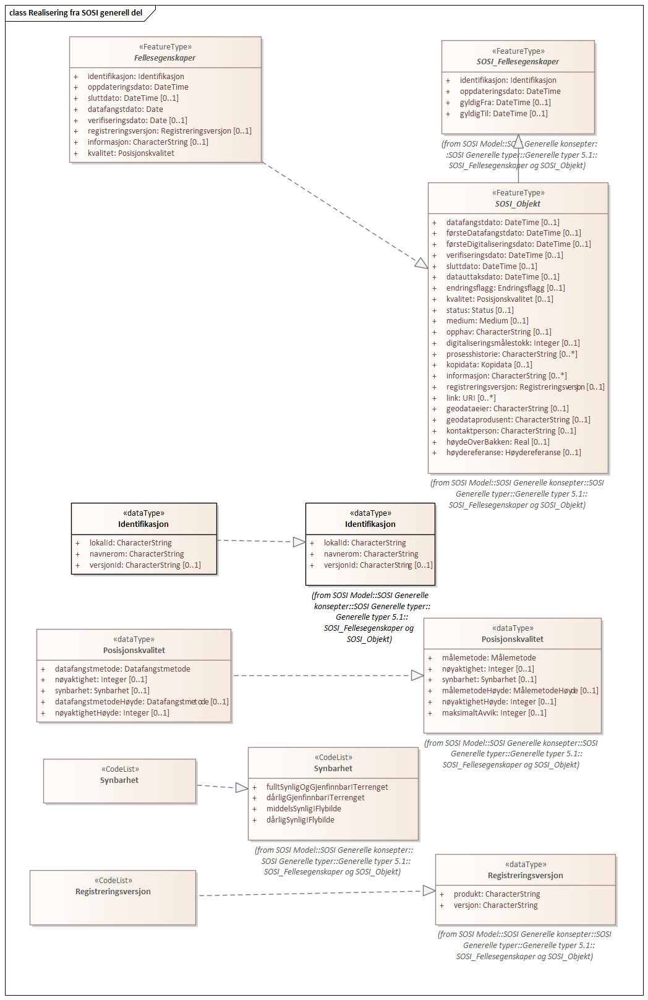
 
.Hoveddiagram Posisjonskvalitet 
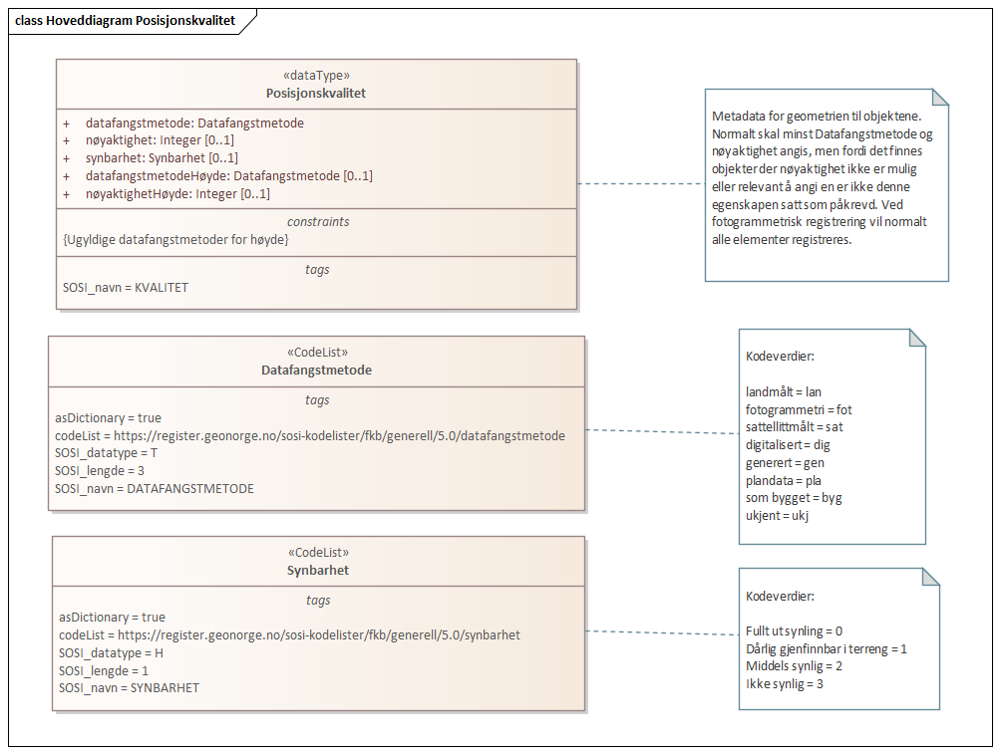
 
|===
|===
 
[[fellesegenskaper]]
==== «FeatureType» Fellesegenskaper (abstrakt)
*Definisjon:* abstrakt objekttype som bærer sentrale egenskaper som er anbefalt for bruk i produktspesifikasjoner.

Merknad: Disse egenskapene skal derfor ikke modelleres inn i fagområdemodeller.
 
===== Egenskaper
[cols="20,80"]
|===
|*Navn:* 
|*identifikasjon*
 
|Definisjon: 
|unik identifikasjon av et objekt 

Merknad FKB:

Unik identifikasjon av et objekt, ivaretas av den ansvarlige produsent/forvalter, og som kan benyttes av eksterne applikasjoner som referanse til objektet.

Den unike identifikatoren er unik for kartobjektet og skal ikke endres i kartobjektets levetid. Dette m&#229; ikke forveksles med en tematisk identifikator (for eksempel bygningsnummer) som unikt identifiserer et objekt i virkeligheten. En bygning med samme bygningsnummer vil kunne representeres i mange kartprodukter der det finnes en unik identifikasjon i hver av dem.

For FKB benyttes UUID (Universally unique identifier) som lokalId. Dette inneb&#230;rer at lokalId alene alltid vil v&#230;re unik. Likevel skal alltid navnerom ogs&#229; angis. Navnerom angir FKB-datasettet.
 
|Multiplisitet: 
|[1..1]
 
|Type: 
|<<identifikasjon,«dataType» Identifikasjon>>
|Profilparametre i tagged values: 
|
SOSI_navn: IDENT + 
|===
[cols="20,80"]
|===
|*Navn:* 
|*oppdateringsdato*
 
|Definisjon: 
|tidspunkt for siste endring p&#229; objektet 

Merknad FKB: 

Denne datoen viser datasystemets siste endring p&#229; dataobjektet. Egenskapen settes av forvaltningssystemet etter f&#248;lgende regler:

i. Oppdateringsdato er tidspunkt for oppdatering av databasen og settes av forvaltningsbasen (ikke av klienten).

ii. Oppdateringsdato skal endres ogs&#229; hvis det er kopidata som blir endret eller importert i en ”kopibase”.

iii. N&#229;r avgrensingslinjene til en flate endres, skal flateobjektet f&#229; ny oppdateringsdato.

iv. Oppdateringsdato skal endres hvis en egenskap endres.
 
|Multiplisitet: 
|[1..1]
 
|Type: 
|http://skjema.geonorge.no/SOSI/basistype/DateTime[DateTime]
|Profilparametre i tagged values: 
|
SOSI_datatype: DATOTID + 
SOSI_navn: OPPDATERINGSDATO + 
|===
[cols="20,80"]
|===
|*Navn:* 
|*datafangstdato*
 
|Definisjon: 
|dato n&#229;r objektet siste gang ble registrert/observert/m&#229;lt i terrenget
 
|Multiplisitet: 
|[1..1]
 
|Type: 
|http://skjema.geonorge.no/SOSI/basistype/Date[Date]
|Profilparametre i tagged values: 
|
SOSI_datatype: DATO + 
SOSI_navn: DATAFANGSTDATO + 
|===
[cols="20,80"]
|===
|*Navn:* 
|*verifiseringsdato*
 
|Definisjon: 
|dato n&#229;r dataene er fastsl&#229;tt &#229; v&#230;re i samsvar med virkeligheten.

Merknad FKB:
Brukes for eksempel i de sammenhenger hvor det er foretatt fotogrammetrisk ajourhold, og hvor det ikke er registrert endringer p&#229; objektet (det virkelige objektet er i samsvar med dataobjektet)
 
|Multiplisitet: 
|[0..1]
 
|Type: 
|http://skjema.geonorge.no/SOSI/basistype/Date[Date]
|Profilparametre i tagged values: 
|
SOSI_datatype: DATO + 
SOSI_navn: VERIFISERINGSDATO + 
|===
[cols="20,80"]
|===
|*Navn:* 
|*registreringsversjon*
 
|Definisjon: 
|angivelse av hvilken produktspesifikasjon som er utgangspunkt  for dataene
 
|Multiplisitet: 
|[0..1]
 
|Type: 
|<<registreringsversjon,«CodeList» Registreringsversjon>>
|Profilparametre i tagged values: 
|
defautCodeSpace: https://register.geonorge.no/sosi-kodelister/fkb/generell/5.0/registreringsversjon + 
SOSI_datatype: T + 
SOSI_lengde: 10 + 
SOSI_navn: REGISTRERINGSVERSJON + 
|===
[cols="20,80"]
|===
|*Navn:* 
|*informasjon*
 
|Definisjon: 
|generell opplysning.

Merknad FKB:
Mulighet til &#229; legge inn utfyllende informasjon om objektet. Egenskapen b&#248;r bare brukes til &#229; legge inn ekstra informasjon om enkeltobjekter. Egenskapen b&#248;r ikke brukes til &#229; systematisk angi ekstrainformasjon om mange/alle objekter i et datasett.
 
|Multiplisitet: 
|[0..1]
 
|Type: 
|http://skjema.geonorge.no/SOSI/basistype/CharacterString[CharacterString]
|Profilparametre i tagged values: 
|
SOSI_datatype: T + 
SOSI_lengde: 255 + 
SOSI_navn: INFORMASJON + 
|===
===== Arv og realiseringer
[cols="20,80"]
|===
|Subtyper:
|<<kvalitetpåkrevd,«FeatureType» KvalitetPåkrevd>> +
|Realisering av: 
|«ApplicationSchema» FKB Generell del-5.0Utkast/Generelle elementer::«FeatureType» Fellesegenskaper +
«ApplicationSchema» Generelle typer 5.1/SOSI_Fellesegenskaper og SOSI_Objekt::«FeatureType» SOSI_Objekt +
 
|===
 
|===
|===
 
[[kvalitetpåkrevd]]
==== «FeatureType» KvalitetPåkrevd (abstrakt)
*Definisjon:* abstrakt objekttype med p&#229;krevet kvalitetsangivelse
 
===== Egenskaper
[cols="20,80"]
|===
|*Navn:* 
|*kvalitet*
 
|Definisjon: 
|beskrivelse av kvaliteten på stedfestingen

Merknad: Denne er identisk med ..KVALITET i tidligere versjoner av SOSI.
 
|Multiplisitet: 
|[1..1]
 
|Type: 
|<<posisjonskvalitet,«dataType» Posisjonskvalitet>>
|Profilparametre i tagged values: 
|
SOSI_navn: KVALITET + 
|===
[cols="20,80"]
|===
|*Navn:* 
|*eksternpeker*
 
|Definisjon: 
|referanse til det samme objektet forvaltet i et annet datasystem. Kan f.eks. v&#230;re parkforvalter i en kommune, skytebaneregister e.l. Informasjonen m&#229; vedlikeholdes administrativt.

Det vil v&#230;re opp til det eksterne systemet &#229; etablere URI-er som unikt indentifiserer systemet og det aktuelle objektet i systemet. 
 
|Multiplisitet: 
|[0..1]
 
|Type: 
|http://skjema.geonorge.no/SOSI/basistype/URI[URI]
|Profilparametre i tagged values: 
|
SOSI_datatype: T + 
SOSI_lengde: 255 + 
SOSI_navn: EKSTERNPEKER + 
|===
===== Arv og realiseringer
[cols="20,80"]
|===
|Supertype: 
|<<fellesegenskaper,«FeatureType» Fellesegenskaper>>
 
|Subtyper:
|<<industriområde,«featureType» Industriområde>> +
<<campingplass,«featureType» Campingplass>> +
<<grustak,«featureType» Grustak>> +
<<steintipp,«featureType» Steintipp>> +
<<alpinbakke,«featureType» Alpinbakke>> +
<<golfbane,«featureType» Golfbane>> +
<<lekeplass,«featureType» Lekeplass>> +
<<gravplass,«featureType» Gravplass>> +
<<park,«featureType» Park>> +
<<skytebane,«featureType» Skytebane>> +
<<sportidrettplass,«featureType» SportIdrettPlass>> +
<<anleggsområde,«featureType» Anleggsområde>> +
|Realisering av: 
|«ApplicationSchema» FKB Generell del-5.0Utkast/Generelle elementer::«FeatureType» KvalitetPåkrevd +
«ApplicationSchema» Generelle typer 5.1/SOSI_Fellesegenskaper og SOSI_Objekt::«FeatureType» SOSI_Objekt +
 
|===
 
|===
|===
 
[[identifikasjon]]
==== «dataType» Identifikasjon
*Definisjon:* Unik identifikasjon av et objekt i et datasett, forvaltet av den ansvarlige produsent/forvalter, og kan benyttes av eksterne applikasjoner som stabil referanse til objektet. 

Merknad 1: Denne objektidentifikasjonen må ikke forveksles med en tematisk objektidentifikasjon, slik som f.eks bygningsnummer. 

Merknad 2: Denne unike identifikatoren vil ikke endres i løpet av objektets levetid, og ikke gjenbrukes i andre objekt. 
 
===== Profilparametre i tagged values
[cols="20,80"]
|===
|SOSI_navn
|IDENT
 
|===
===== Egenskaper
[cols="20,80"]
|===
|*Navn:* 
|*lokalId*
 
|Definisjon: 
|lokal identifikator av et objekt

Merknad: Det er dataleverend&#248;rens ansvar &#229; s&#248;rge for at den lokale identifikatoren er unik innenfor navnerommet. For FKB-data benyttes UUID som lokalId.
 
|Multiplisitet: 
|[1..1]
 
|Type: 
|http://skjema.geonorge.no/SOSI/basistype/CharacterString[CharacterString]
|Profilparametre i tagged values: 
|
SOSI_datatype: T + 
SOSI_lengde: 100 + 
SOSI_navn: LOKALID + 
|===
[cols="20,80"]
|===
|*Navn:* 
|*navnerom*
 
|Definisjon: 
|navnerom som unikt identifiserer datakilden til et objekt, anbefales å være en http-URI

Eksempel: http://data.geonorge.no/SentraltStedsnavnsregister/1.0

Merknad : Verdien for nanverom vil eies av den dataprodusent som har ansvar for de unike identifikatorene og må være registrert i data.geonorge.no eller data.norge.no
 
|Multiplisitet: 
|[1..1]
 
|Type: 
|http://skjema.geonorge.no/SOSI/basistype/CharacterString[CharacterString]
|Profilparametre i tagged values: 
|
SOSI_datatype: T + 
SOSI_lengde: 100 + 
SOSI_navn: NAVNEROM + 
|===
[cols="20,80"]
|===
|*Navn:* 
|*versjonId*
 
|Definisjon: 
|identifikasjon av en spesiell versjon av et geografisk objekt (instans)
 
|Multiplisitet: 
|[0..1]
 
|Type: 
|http://skjema.geonorge.no/SOSI/basistype/CharacterString[CharacterString]
|Profilparametre i tagged values: 
|
SOSI_datatype: T + 
SOSI_lengde: 100 + 
SOSI_navn: VERSJONID + 
|===
===== Arv og realiseringer
[cols="20,80"]
|===
|Realisering av: 
|«ApplicationSchema» Generelle typer 5.1/SOSI_Fellesegenskaper og SOSI_Objekt::«dataType» Identifikasjon +
|===
 
|===
|===
 
[[posisjonskvalitet]]
==== «dataType» Posisjonskvalitet
*Definisjon:* beskrivelse av kvaliteten p&#229; stedfestingen.

Merknad:
Posisjonskvalitet er ikke konform med  kvalitetsmodellen i ISO slik den er defineret i ISO19157:2013, men er en videref&#248;ring av tildligere brukte kvalitetsegenskaper i SOSI. FKB 5.0 innf&#248;rer en egen variant av datatypen Posisjonskvalitet der kodeliste m&#229;lemetode er byttet ut med den mer generelle kodelista Datafangstmetode. 
 
===== Profilparametre i tagged values
[cols="20,80"]
|===
|SOSI_navn
|KVALITET
 
|===
===== Egenskaper
[cols="20,80"]
|===
|*Navn:* 
|*datafangstmetode*
 
|Definisjon: 
|metode for datafangst. 
Egenskapen beskriver datafangstmetode for grunnrisskoordinater (x,y), eller for b&#229;de grunnriss og h&#248;yde (x,y,z) dersom det ikke er oppgitt noen verdi for datafangstmetodeH&#248;yde.
 
|Multiplisitet: 
|[1..1]
 
|Type: 
|<<datafangstmetode,«CodeList» Datafangstmetode>>
|Profilparametre i tagged values: 
|
defaultCodeSpace: https://register.geonorge.no/sosi-kodelister/fkb/generell/5.0/datafangstmetode + 
SOSI_datatype: T + 
SOSI_lengde: 3 + 
SOSI_navn: DATAFANGSTMETODE + 
|===
[cols="20,80"]
|===
|*Navn:* 
|*nøyaktighet*
 
|Definisjon: 
|standardavviket til posisjoneringa av objektet oppgitt i cm

I de aller fleste sammenhenger benyttes en ansl&#229;tt eller forventet verdi for standardavvik, men dersom man har en beregnet verdi skal denne benyttes. 

For objekter med punktgeometri benyttes verdi for punktstandardavvik. For objekter med kurvegeometri benyttes standardavviket for tverravviket fra kurva. For objekter med overflate- eller volumgeometri er forst&#229;elsen at standardavviket beregnes ut fra (3D) avvikene mellom sann posisjon og n&#230;rmeste punkt p&#229; overflata. 

Merknad:

Verdien er ment &#229; beskrive n&#248;yaktigheten til objektet sammenlignet med sann verdi. Standardavvik er i utgangspunktet et m&#229;l p&#229; det tilfeldige avviket og det inneb&#230;rer at vi forutsetter at det systematiske avviket i liten grad p&#229;virker n&#248;yaktigheten til posisjoneringa. For fotogrammetriske data settes som hovedregel verdien lik kravet til standardavvik ved datafangst. Se standarden Geodatakvalitet for n&#230;rmere definisjon av standardavvik og hvordan dette defineres, beregnes og kontrolleres.
 
|Multiplisitet: 
|[0..1]
 
|Type: 
|http://skjema.geonorge.no/SOSI/basistype/Integer[Integer]
|Profilparametre i tagged values: 
|
SOSI_datatype: H + 
SOSI_lengde: 6 + 
SOSI_navn: NØYAKTIGHET + 
|===
[cols="20,80"]
|===
|*Navn:* 
|*synbarhet*
 
|Definisjon: 
|beskrivelse av hvor godt objektene framg&#229;r i datagrunnlaget for posisjonering (f.eks. flybildene).
 
|Multiplisitet: 
|[0..1]
 
|Type: 
|<<synbarhet,«CodeList» Synbarhet>>
|Profilparametre i tagged values: 
|
defaultCodeSpace: https://register.geonorge.no/sosi-kodelister/fkb/generell/5.0/synbarhet + 
SOSI_datatype: H + 
SOSI_lengde: 1 + 
SOSI_navn: SYNBARHET + 
|===
[cols="20,80"]
|===
|*Navn:* 
|*datafangstmetodeHøyde*
 
|Definisjon: 
|metoden brukt for h&#248;yderegistrering av posisjon.

Det er bare n&#248;dvending &#229; angi en verdi for egenskapen dersom datafangstmetode for h&#248;yde avviker fra datafangstmetode for grunnriss.

 
|Multiplisitet: 
|[0..1]
 
|Type: 
|<<datafangstmetode,«CodeList» Datafangstmetode>>
|Profilparametre i tagged values: 
|
defaultCodeSpace: https://register.geonorge.no/sosi-kodelister/fkb/generell/5.0/datafangstmetode + 
SOSI_datatype: T + 
SOSI_lengde: 3 + 
SOSI_navn: DATAFANGSTMETODEHØYDE + 
|===
[cols="20,80"]
|===
|*Navn:* 
|*nøyaktighetHøyde*
 
|Definisjon: 
|standardavviket til posisjoneringa av objektet oppgitt i cm

I de aller fleste sammenhenger benyttes en ansl&#229;tt eller forventet verdi for standardavviket, men dersom man faktisk har standardavviket til posisjoneringa av objektet oppgitt i cm

I de aller fleste sammenhenger benyttes en ansl&#229;tt eller forventet verdi for standardavvik, men dersom man har en beregnet verdi skal denne benyttes. 

Merknad:

Verdien er ment &#229; beskrive n&#248;yaktigheten til objektet sammenlignet med sann verdi. Standardavvik er i utgangspunktet et m&#229;l p&#229; det tilfeldige avviket og det inneb&#230;rer at vi forutsetter at det systematiske avviket i liten grad p&#229;virker n&#248;yaktigheten til posisjoneringa. For fotogrammetriske data settes som hovedregel verdien lik kravet til standardavvik ved datafangst. Se standarden Geodatakvalitet for n&#230;rmere definisjon av standardavvik og hvordan dette defineres, beregnes og kontrolleres
 
|Multiplisitet: 
|[0..1]
 
|Type: 
|http://skjema.geonorge.no/SOSI/basistype/Integer[Integer]
|Profilparametre i tagged values: 
|
SOSI_datatype: H + 
SOSI_lengde: 6 + 
SOSI_navn: H-NØYAKTIGHET + 
|===
===== Restriksjoner
[cols="20,80"]
|===
|*Navn:* 
|*Datafangstmetode Digitalisert skal ikke brukes på egenskapen datafangstmetodeHøyde*
 
|Beskrivelse: 
|inv: self.datafangstmetodeH&#248;yde &lt;&gt; 'dig'
 
|===
===== Arv og realiseringer
[cols="20,80"]
|===
|Realisering av: 
|«ApplicationSchema» Generelle typer 5.1/SOSI_Fellesegenskaper og SOSI_Objekt::«dataType» Posisjonskvalitet +
|===
 
|===
|===
 
[[synbarhet]]
==== «CodeList» Synbarhet
*Definisjon:* synbarhet beskriver hvor godt objektene framg&#229;r i datagrunnlaget for posisjonering (f.eks. flybildene).
 
===== Profilparametre i tagged values
[cols="20,80"]
|===
|asDictionary
|true
 
|codeList
|https://register.geonorge.no/sosi-kodelister/fkb/generell/5.0/synbarhet
 
|SOSI_datatype
|H
 
|SOSI_lengde
|1
 
|SOSI_navn
|SYNBARHET
 
|===
Koder fra ekstern kodeliste kan hentes fra register: https://register.geonorge.no/sosi-kodelister/fkb/generell/5.0/synbarhet
 
 
|===
|===
 
[[datafangstmetode]]
==== «CodeList» Datafangstmetode
*Definisjon:* metode for datafangst. 

Datafangstmetoden beskriver hvordan selve vektordataene er posisjonert fra et datagrunnlag (observasjoner med landm&#229;lingsutstyr, fotogrammetrisk stereomodell, digital terrengmodell etc.) og ikke prosessen med &#229; innhente det bakenforliggende datagrunnlaget.
 
===== Profilparametre i tagged values
[cols="20,80"]
|===
|asDictionary
|true
 
|codeList
|https://register.geonorge.no/sosi-kodelister/fkb/generell/5.0/datafangstmetode
 
|SOSI_datatype
|T
 
|SOSI_lengde
|3
 
|SOSI_navn
|DATAFANGSTMETODE
 
|===
Koder fra ekstern kodeliste kan hentes fra register: https://register.geonorge.no/sosi-kodelister/fkb/generell/5.0/datafangstmetode
 
 
|===
|===
 
[[registreringsversjon]]
==== «CodeList» Registreringsversjon
*Definisjon:* FKB-verjson som ligger til grunn for registrering. Mest relevant for data som er fotogrammetrisk registrert.
 
===== Profilparametre i tagged values
[cols="20,80"]
|===
|asDictionary
|true
 
|codeList
|https://register.geonorge.no/sosi-kodelister/fkb/generell/5.0/registreringsversjon
 
|SOSI_datatype
|T
 
|SOSI_lengde
|10
 
|SOSI_navn
|REGISTRERINGSVERSJON
 
|===
Koder fra ekstern kodeliste kan hentes fra register: https://register.geonorge.no/sosi-kodelister/fkb/generell/5.0/registreringsversjon
 
<<<
|===
|===
=== Pakke: Driftsområder
*Definisjon:* Inneholder elementer fra SOSI Areal 4.0 Driftsområder
 
.Hoveddiagram Driftsområder 
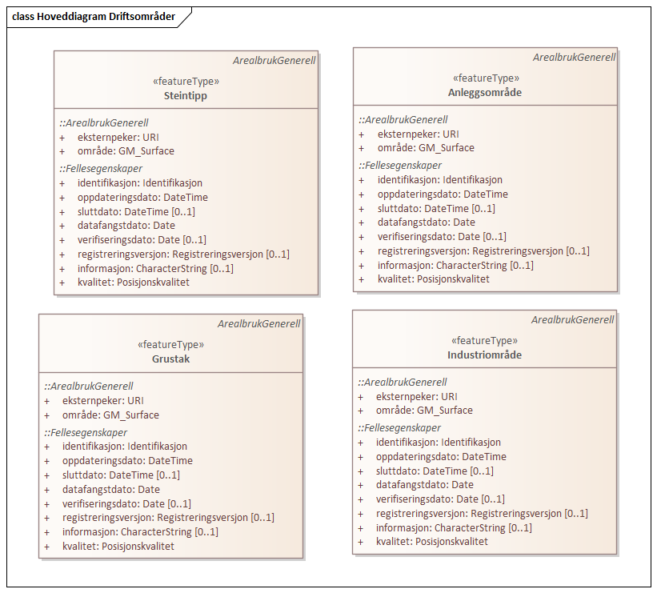
 
.Realisering fra Areal 4.0 Driftsområder 
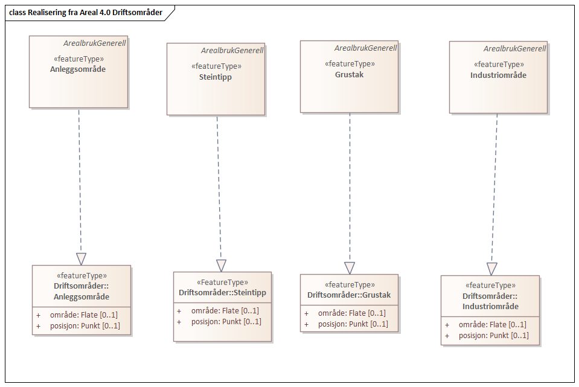
 
|===
|===
 
[[anleggsområde]]
==== «featureType» Anleggsområde
*Definisjon:* omr&#229;de der det p&#229;g&#229;r anleggsarbeid

I FKB er det en m&#229;lsetting om at mest mulig av byggeaktivitet n&#229;r det gjelder f.eks. bygninger eller veganlegg fanges opp gjennom saksbehandling og legges inn i tiltaksbasen (FKB-Tiltak). Anleggsomr&#229;der som ligger i tiltaksbasen skal ikke inng&#229; i FKB-Arealbruk.
 
.Illustrasjon av objekttype Anleggsområde
image::http://skjema.geonorge.no/SOSI/produktspesifikasjon/FKB-Arealbruk/5.0/figurer/objtype_anleggsomrade.png[link=http://skjema.geonorge.no/SOSI/produktspesifikasjon/FKB-Arealbruk/5.0/figurer/objtype_anleggsomrade.png,"Illustrasjon av objekttype: Anleggsområde"]
===== Egenskaper
[cols="20,80"]
|===
|*Navn:* 
|*område*
 
|Definisjon: 
|objektets utstrekning
 
|Multiplisitet: 
|[1..1]
 
|Type: 
|<<flate,Flate>>
|===
===== Arv og realiseringer
[cols="20,80"]
|===
|Supertype: 
|<<kvalitetpåkrevd,«FeatureType» KvalitetPåkrevd>>
 
|Realisering av: 
|«ApplicationSchema» Areal-4.0/Driftsområder::«featureType» Anleggsområde +
|===
 
|===
|===
 
[[grustak]]
==== «featureType» Grustak
*Definisjon:* uttaksplass, område, drevet i dagen for malm eller sand, grus, pukk, skifer
 
.Illustrasjon av objekttype Grustak
image::http://skjema.geonorge.no/SOSI/produktspesifikasjon/FKB-Arealbruk/5.0/figurer/objtype_grustak.png[link=http://skjema.geonorge.no/SOSI/produktspesifikasjon/FKB-Arealbruk/5.0/figurer/objtype_grustak.png,"Illustrasjon av objekttype: Grustak"]
===== Egenskaper
[cols="20,80"]
|===
|*Navn:* 
|*område*
 
|Definisjon: 
|objektets utstrekning
 
|Multiplisitet: 
|[1..1]
 
|Type: 
|<<flate,Flate>>
|===
===== Arv og realiseringer
[cols="20,80"]
|===
|Supertype: 
|<<kvalitetpåkrevd,«FeatureType» KvalitetPåkrevd>>
 
|Realisering av: 
|«ApplicationSchema» Areal-4.0/Driftsområder::«featureType» Grustak +
|===
 
|===
|===
 
[[industriområde]]
==== «featureType» Industriområde
*Definisjon:* område, bebygd eller ubebygd, benyttet til industriformål
 
.Illustrasjon av objekttype Industriområde
image::http://skjema.geonorge.no/SOSI/produktspesifikasjon/FKB-Arealbruk/5.0/figurer/objtype_industriomrade.png[link=http://skjema.geonorge.no/SOSI/produktspesifikasjon/FKB-Arealbruk/5.0/figurer/objtype_industriomrade.png,"Illustrasjon av objekttype: Industriområde"]
===== Egenskaper
[cols="20,80"]
|===
|*Navn:* 
|*område*
 
|Definisjon: 
|objektets utstrekning
 
|Multiplisitet: 
|[1..1]
 
|Type: 
|<<flate,Flate>>
|===
===== Arv og realiseringer
[cols="20,80"]
|===
|Supertype: 
|<<kvalitetpåkrevd,«FeatureType» KvalitetPåkrevd>>
 
|Realisering av: 
|«ApplicationSchema» Areal-4.0/Driftsområder::«featureType» Industriområde +
|===
 
|===
|===
 
[[steintipp]]
==== «featureType» Steintipp
*Definisjon:* område for steintipp
 
.Illustrasjon av objekttype Steintipp
image::http://skjema.geonorge.no/SOSI/produktspesifikasjon/FKB-Arealbruk/5.0/figurer/objtype_steintipp.png[link=http://skjema.geonorge.no/SOSI/produktspesifikasjon/FKB-Arealbruk/5.0/figurer/objtype_steintipp.png,"Illustrasjon av objekttype: Steintipp"]
===== Egenskaper
[cols="20,80"]
|===
|*Navn:* 
|*område*
 
|Definisjon: 
|objektets utstrekning
 
|Multiplisitet: 
|[1..1]
 
|Type: 
|<<flate,Flate>>
|===
===== Arv og realiseringer
[cols="20,80"]
|===
|Supertype: 
|<<kvalitetpåkrevd,«FeatureType» KvalitetPåkrevd>>
 
|Realisering av: 
|«ApplicationSchema» Areal-4.0/Driftsområder::«FeatureType» Steintipp +
|===
<<<
|===
|===
=== Pakke: Fritidsområder
*Definisjon:* Inneholder elementer fra SOSI Areal 4.0 Fritidsområder
 
.Hoveddiagram Fritidsområder 
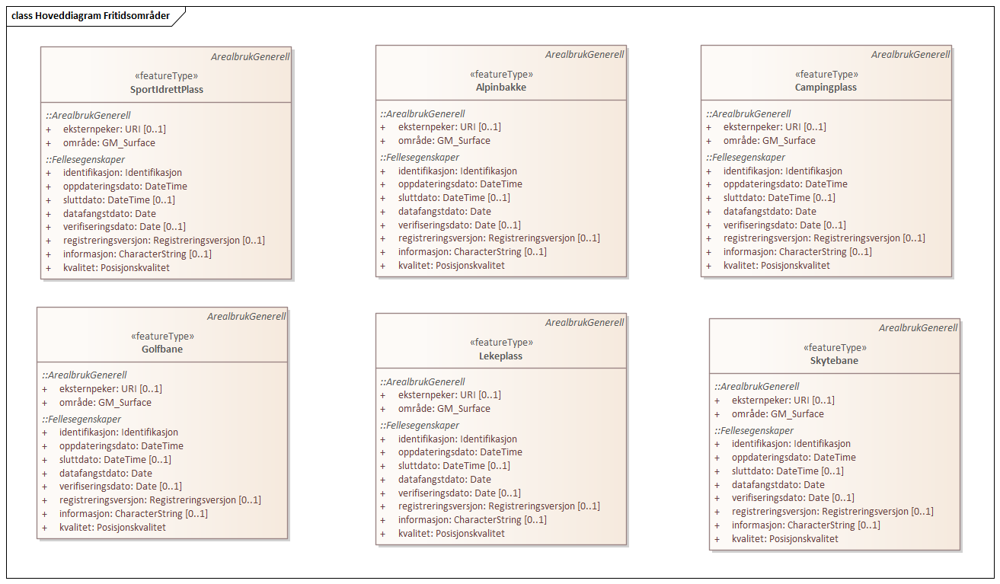
 
.Realisering fra Areal 4.0 Fritidsområder 
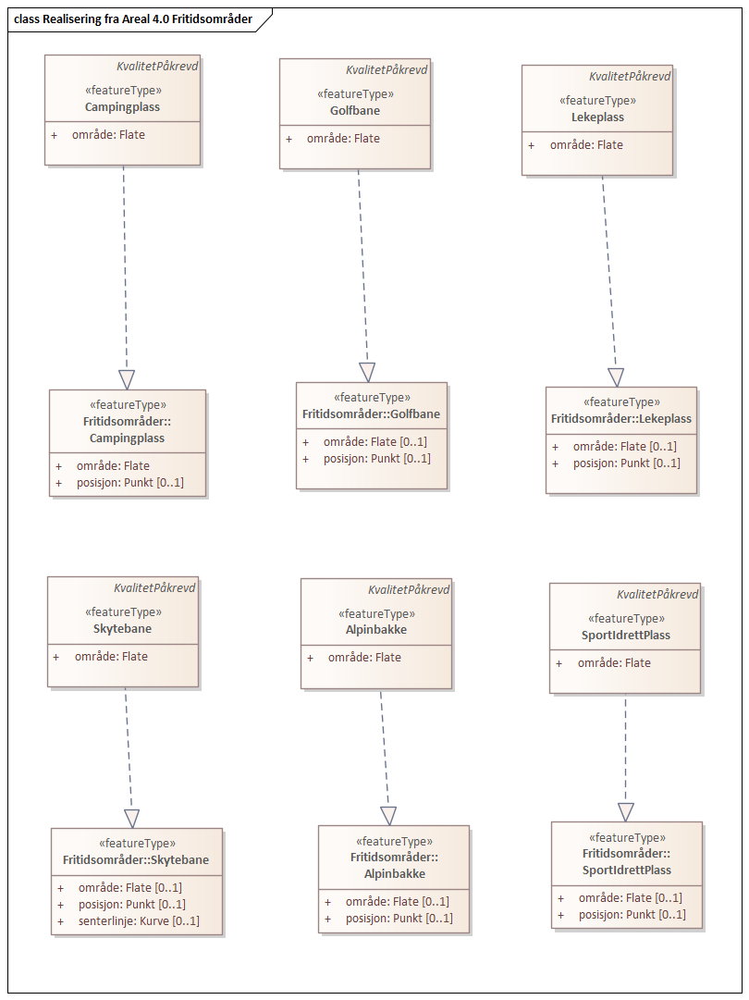
 
|===
|===
 
[[alpinbakke]]
==== «featureType» Alpinbakke
*Definisjon:* nedfart for ski med permanent karakter
 
.Illustrasjon av objekttype Alpinbakke
image::http://skjema.geonorge.no/SOSI/produktspesifikasjon/FKB-Arealbruk/5.0/figurer/objtype_alpinbakke.png[link=http://skjema.geonorge.no/SOSI/produktspesifikasjon/FKB-Arealbruk/5.0/figurer/objtype_alpinbakke.png,"Illustrasjon av objekttype: Alpinbakke"]
===== Egenskaper
[cols="20,80"]
|===
|*Navn:* 
|*område*
 
|Definisjon: 
|objektets utstrekning
 
|Multiplisitet: 
|[1..1]
 
|Type: 
|<<flate,Flate>>
|===
===== Arv og realiseringer
[cols="20,80"]
|===
|Supertype: 
|<<kvalitetpåkrevd,«FeatureType» KvalitetPåkrevd>>
 
|Realisering av: 
|«ApplicationSchema» Areal-4.0/Fritidsområder::«featureType» Alpinbakke +
|===
 
|===
|===
 
[[campingplass]]
==== «featureType» Campingplass
*Definisjon:* faste anlegg med vaskerom, campinghytter o.l.
 
.Illustrasjon av objekttype Campingplass
image::http://skjema.geonorge.no/SOSI/produktspesifikasjon/FKB-Arealbruk/5.0/figurer/objtype_campingplass.png[link=http://skjema.geonorge.no/SOSI/produktspesifikasjon/FKB-Arealbruk/5.0/figurer/objtype_campingplass.png,"Illustrasjon av objekttype: Campingplass"]
===== Egenskaper
[cols="20,80"]
|===
|*Navn:* 
|*område*
 
|Definisjon: 
|objektets utstrekning
 
|Multiplisitet: 
|[1..1]
 
|Type: 
|<<flate,Flate>>
|===
===== Arv og realiseringer
[cols="20,80"]
|===
|Supertype: 
|<<kvalitetpåkrevd,«FeatureType» KvalitetPåkrevd>>
 
|Realisering av: 
|«ApplicationSchema» Areal-4.0/Fritidsområder::«featureType» Campingplass +
|===
 
|===
|===
 
[[golfbane]]
==== «featureType» Golfbane
*Definisjon:* område for golfspilling
 
.Illustrasjon av objekttype Golfbane
image::http://skjema.geonorge.no/SOSI/produktspesifikasjon/FKB-Arealbruk/5.0/figurer/objtype_golfbane.png[link=http://skjema.geonorge.no/SOSI/produktspesifikasjon/FKB-Arealbruk/5.0/figurer/objtype_golfbane.png,"Illustrasjon av objekttype: Golfbane"]
===== Egenskaper
[cols="20,80"]
|===
|*Navn:* 
|*område*
 
|Definisjon: 
|objektets utstrekning
 
|Multiplisitet: 
|[1..1]
 
|Type: 
|<<flate,Flate>>
|===
===== Arv og realiseringer
[cols="20,80"]
|===
|Supertype: 
|<<kvalitetpåkrevd,«FeatureType» KvalitetPåkrevd>>
 
|Realisering av: 
|«ApplicationSchema» Areal-4.0/Fritidsområder::«featureType» Golfbane +
|===
 
|===
|===
 
[[lekeplass]]
==== «featureType» Lekeplass
*Definisjon:* område for lekeplass
 
.Illustrasjon av objekttype Lekeplass
image::http://skjema.geonorge.no/SOSI/produktspesifikasjon/FKB-Arealbruk/5.0/figurer/objtype_lekeplass.png[link=http://skjema.geonorge.no/SOSI/produktspesifikasjon/FKB-Arealbruk/5.0/figurer/objtype_lekeplass.png,"Illustrasjon av objekttype: Lekeplass"]
===== Egenskaper
[cols="20,80"]
|===
|*Navn:* 
|*område*
 
|Definisjon: 
|objektets utstrekning
 
|Multiplisitet: 
|[1..1]
 
|Type: 
|<<flate,Flate>>
|===
===== Arv og realiseringer
[cols="20,80"]
|===
|Supertype: 
|<<kvalitetpåkrevd,«FeatureType» KvalitetPåkrevd>>
 
|Realisering av: 
|«ApplicationSchema» Areal-4.0/Fritidsområder::«featureType» Lekeplass +
|===
 
|===
|===
 
[[skytebane]]
==== «featureType» Skytebane
*Definisjon:* avgrenset område hvor det skytes
 
.Illustrasjon av objekttype Skytebane
image::http://skjema.geonorge.no/SOSI/produktspesifikasjon/FKB-Arealbruk/5.0/figurer/objtype_skytebane.png[link=http://skjema.geonorge.no/SOSI/produktspesifikasjon/FKB-Arealbruk/5.0/figurer/objtype_skytebane.png,"Illustrasjon av objekttype: Skytebane"]
===== Egenskaper
[cols="20,80"]
|===
|*Navn:* 
|*område*
 
|Definisjon: 
|Området for selve skytebanen
 
|Multiplisitet: 
|[1..1]
 
|Type: 
|<<flate,Flate>>
|===
===== Arv og realiseringer
[cols="20,80"]
|===
|Supertype: 
|<<kvalitetpåkrevd,«FeatureType» KvalitetPåkrevd>>
 
|Realisering av: 
|«ApplicationSchema» Areal-4.0/Fritidsområder::«featureType» Skytebane +
|===
 
|===
|===
 
[[sportidrettplass]]
==== «featureType» SportIdrettPlass
*Definisjon:* område hvor det utøves sport og idrett
 
.Illustrasjon av objekttype SportIdrettPlass
image::http://skjema.geonorge.no/SOSI/produktspesifikasjon/FKB-Arealbruk/5.0/figurer/objtype_sportidrettsplass.png[link=http://skjema.geonorge.no/SOSI/produktspesifikasjon/FKB-Arealbruk/5.0/figurer/objtype_sportidrettsplass.png,"Illustrasjon av objekttype: SportIdrettPlass"]
===== Egenskaper
[cols="20,80"]
|===
|*Navn:* 
|*område*
 
|Definisjon: 
|objektets utstrekning
 
|Multiplisitet: 
|[1..1]
 
|Type: 
|<<flate,Flate>>
|===
===== Arv og realiseringer
[cols="20,80"]
|===
|Supertype: 
|<<kvalitetpåkrevd,«FeatureType» KvalitetPåkrevd>>
 
|Realisering av: 
|«ApplicationSchema» Areal-4.0/Fritidsområder::«featureType» SportIdrettPlass +
|===
<<<
|===
|===
=== Pakke: Kulturområder
*Definisjon:* Inneholder elementer fra SOSI Areal 4.0 Kulturområder
 
.Hoveddiagram Kulturområder 
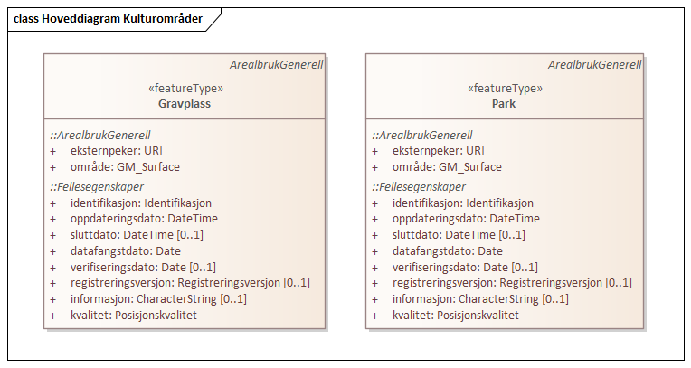
 
.Realisering fra Areal 4.0 Kulturområder 
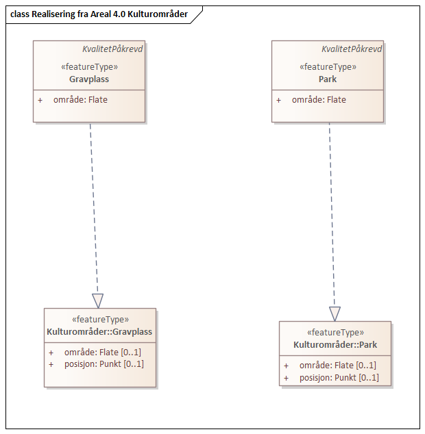
 
|===
|===
 
[[gravplass]]
==== «featureType» Gravplass
*Definisjon:* område for gravstøtter, begravelsesplass og kirkegård
 
.Illustrasjon av objekttype Gravplass
image::http://skjema.geonorge.no/SOSI/produktspesifikasjon/FKB-Arealbruk/5.0/figurer/objtype_gravplass.png[link=http://skjema.geonorge.no/SOSI/produktspesifikasjon/FKB-Arealbruk/5.0/figurer/objtype_gravplass.png,"Illustrasjon av objekttype: Gravplass"]
===== Egenskaper
[cols="20,80"]
|===
|*Navn:* 
|*område*
 
|Definisjon: 
|objektets utstrekning
 
|Multiplisitet: 
|[1..1]
 
|Type: 
|<<flate,Flate>>
|===
===== Arv og realiseringer
[cols="20,80"]
|===
|Supertype: 
|<<kvalitetpåkrevd,«FeatureType» KvalitetPåkrevd>>
 
|Realisering av: 
|«ApplicationSchema» Areal-4.0/Kulturområder::«featureType» Gravplass +
|===
 
|===
|===
 
[[park]]
==== «featureType» Park
*Definisjon:* grøntområde i by- eller tettbygd område, opparbeidet og vedlikeholdt med plenareal, beplantninger, vannpartier og lignende
 
.Illustrasjon av objekttype Park
image::http://skjema.geonorge.no/SOSI/produktspesifikasjon/FKB-Arealbruk/5.0/figurer/objtype_park.png[link=http://skjema.geonorge.no/SOSI/produktspesifikasjon/FKB-Arealbruk/5.0/figurer/objtype_park.png,"Illustrasjon av objekttype: Park"]
===== Egenskaper
[cols="20,80"]
|===
|*Navn:* 
|*område*
 
|Definisjon: 
|objektets utstrekning
 
|Multiplisitet: 
|[1..1]
 
|Type: 
|<<flate,Flate>>
|===
===== Arv og realiseringer
[cols="20,80"]
|===
|Supertype: 
|<<kvalitetpåkrevd,«FeatureType» KvalitetPåkrevd>>
 
|Realisering av: 
|«ApplicationSchema» Areal-4.0/Kulturområder::«featureType» Park +
|===
// End of UML-model
