=== FKB-BygnAnlegg-5.0-Utkast
Definisjon: 
 
===== Tagged Values
[cols="20,80"]
|===
|SOSI_kortnavn
|FKB-BygnAnlegg
 
|SOSI_langnavn
|FKB Bygningsmessige anlegg
 
|SOSI_modellstatus
|utkastOgSkjult
 
|SOSI_versjon
|5.1
 
|targetNamespace
|http://skjema.geonorge.no/SOSI/produktspesifikasjon/FKB-BygnAnlegg/5.0/
 
|version
|5.0
 
|xmlns
|app
 
|xsdDocument
|FKB-BygnAnlegg50.xsd
 
|===
[caption="Figur 1: ",title=Hoveddiagram]
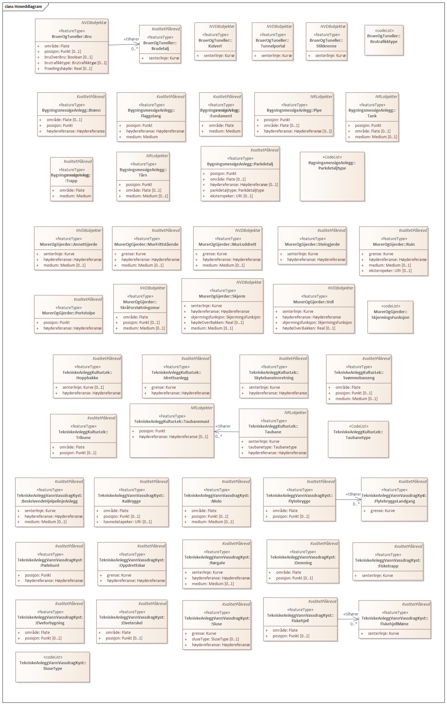
[caption="Figur 2: ",title=Pakkerealisering]
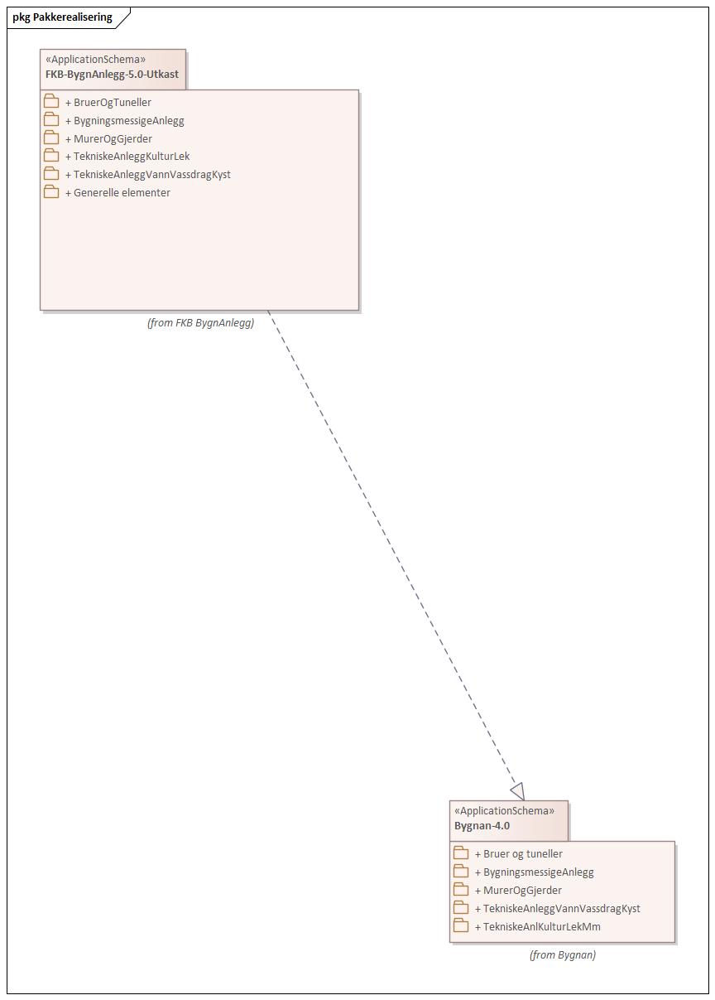
=== BruerOgTuneller
Definisjon: Inneholder elementer fra SOSI Bygnan 4.0, Bruer og tuneller
[caption="Figur 3: ",title=Bruer og tuneller - Realisering av objekttyper og kodelister]
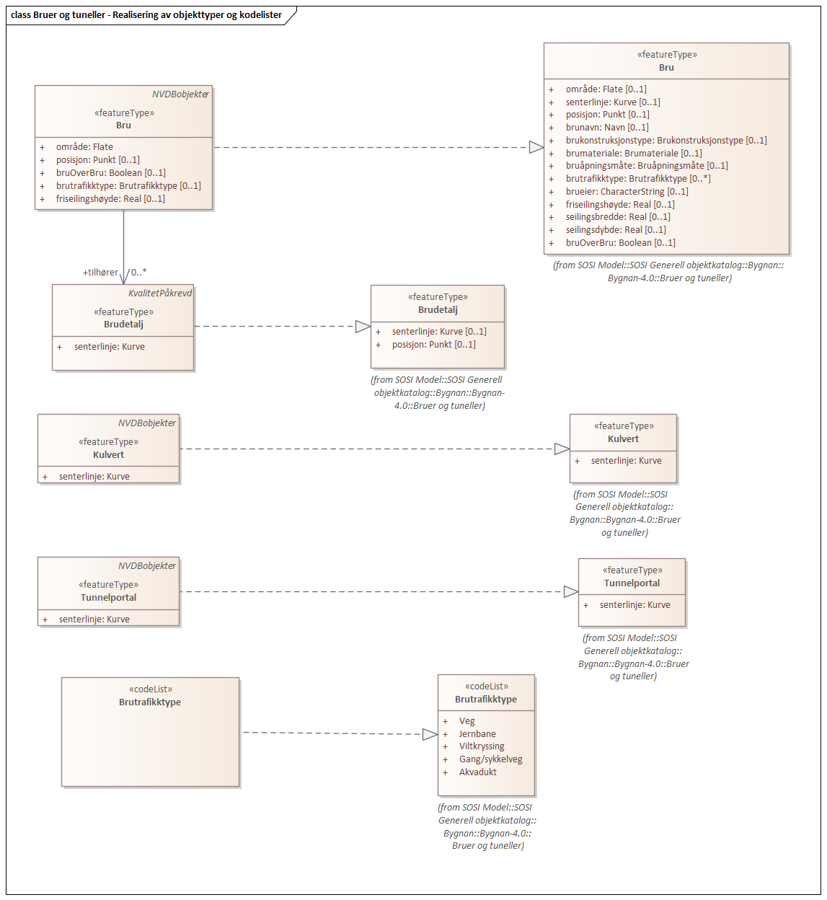
[caption="Figur 4: ",title=Bruer og tuneller - Arv av fellesegenskaper]
image::figurer/Bruer og tuneller - Arv av fellesegenskaper.png[Bruer og tuneller - Arv av fellesegenskaper]
[caption="Figur 5: ",title=Bruer og tuneller - Objekttyper med egenskaper og kodelister]
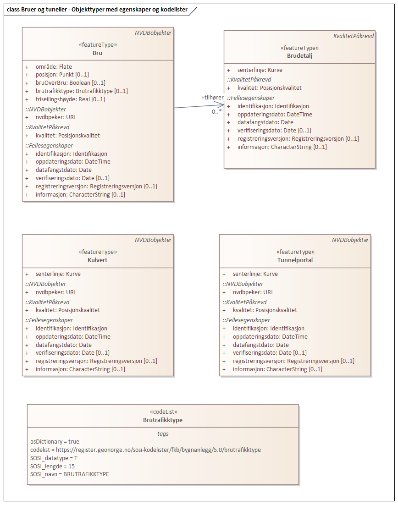
 
==== «featureType» Bru
Definisjon: konstruksjon for kryssing av vanskelig farbart område
Merknad: Med vanskelig farbart område menes en elv, et juv eller andre naturlige hindringer, samt kryssende infrastruktur.
 
*Supertype:* «FeatureType» NVDBobjekter
 
*Realisering av:* «ApplicationSchema» Bygnan-4.0/Bruer og tuneller::«featureType» Bru
 
===== Egenskaper
[cols="20,80"]
|===
|*Navn:* 
|*område*
 
|Definisjon: 
|objektets utstrekning
 
|Multiplisitet: 
|[1..1]
 
|Type: 
|Flate
|===
[cols="20,80"]
|===
|*Navn:* 
|*posisjon*
 
|Definisjon: 
|sted som objektet eksisterer på
 
|Multiplisitet: 
|[0..1]
 
|Type: 
|Punkt
|===
[cols="20,80"]
|===
|*Navn:* 
|*bruOverBru*
 
|Definisjon: 
|angivelse av om brue ligger over en eller flere andre bruer
 
|Multiplisitet: 
|[0..1]
 
|Type: 
|Boolean
|Tagged Values: 
|
SOSI_datatype: BOOLSK + 
SOSI_lengde:  + 
SOSI_navn: BRUOVERBRU + 
|===
[cols="20,80"]
|===
|*Navn:* 
|*brutrafikktype*
 
|Definisjon: 
|type trafikk bruen brukes til
 
|Multiplisitet: 
|[0..1]
 
|Type: 
|Brutrafikktype
|Tagged Values: 
|
SOSI_datatype: T + 
SOSI_lengde: 15 + 
SOSI_navn: BRUTRAFIKKTYPE + 
|===
[cols="20,80"]
|===
|*Navn:* 
|*friseilingshøyde*
 
|Definisjon: 
|friseilingsh&#248;yde angitt i meter. Angis kun for bruer over vann der friseilingsh&#248;yde er relevant.
 
|Multiplisitet: 
|[0..1]
 
|Type: 
|Real
|===
[cols="20,80"]
|===
===== Roller
|*Rollenavn:* 
|*tilhører*
 
|Multiplisitet: 
|[0..*]
 
|Til klasse
|«featureType» Brudetalj
|===
 
==== «featureType» Brudetalj
Definisjon: markante detaljer på bru som ikke registreres gjennom andre objekttyper
Eksempler:
-          Brutårn for hengebruer.
-          Bæreelement for brukonstruksjon.
 
*Supertype:* «FeatureType» KvalitetPåkrevd
 
*Realisering av:* «ApplicationSchema» Bygnan-4.0/Bruer og tuneller::«featureType» Brudetalj
 
===== Egenskaper
[cols="20,80"]
|===
|*Navn:* 
|*senterlinje*
 
|Definisjon: 
|forløp som følger objektets sentrale del
 
|Multiplisitet: 
|[1..1]
 
|Type: 
|Kurve
|===
 
==== «featureType» Kulvert
Definisjon: gjennomløp på tvers av veg-eller jernbane med overliggende fylling og 1m &lt; lysåpning &lt; 2,5m
 
*Supertype:* «FeatureType» NVDBobjekter
 
*Realisering av:* «ApplicationSchema» Bygnan-4.0/Bruer og tuneller::«featureType» Kulvert
 
===== Egenskaper
[cols="20,80"]
|===
|*Navn:* 
|*senterlinje*
 
|Definisjon: 
|forløp som følger objektets sentrale del
 
|Multiplisitet: 
|[1..1]
 
|Type: 
|Kurve
|Tagged Values: 
|
SOSI_melding: Fant ikke denne i SOSI_db + 
|===
 
==== «featureType» Tunnelportal
Definisjon: spesielt byggverk som sammenbinder tunnel og åpen veg
 
*Supertype:* «FeatureType» NVDBobjekter
 
*Realisering av:* «ApplicationSchema» Bygnan-4.0/Bruer og tuneller::«featureType» Tunnelportal
 
===== Egenskaper
[cols="20,80"]
|===
|*Navn:* 
|*senterlinje*
 
|Definisjon: 
|forløp som følger objektets sentrale del
 
|Multiplisitet: 
|[1..1]
 
|Type: 
|Kurve
|Tagged Values: 
|
SOSI_melding: Fant ikke denne i SOSI_db + 
|===
 
==== «codeList» Brutrafikktype
Definisjon: ulike former for trafikk en bru er bygget for
 
===== Tagged Values
[cols="20,80"]
|===
|asDictionary
|true
 
|codelist
|https://register.geonorge.no/sosi-kodelister/fkb/bygnanlegg/5.0/brutrafikktype
 
|SOSI_datatype
|T
 
|SOSI_lengde
|15
 
|SOSI_navn
|BRUTRAFIKKTYPE
 
|===
=== BygningsmessigeAnlegg
Definisjon: Inneholder elementer fra SOSI Bygnan 4.0, BygningsmessigeAnlegg
[caption="Figur 6: ",title=Bygningsmessige anlegg - Realisering av objekttyper]

[caption="Figur 7: ",title=Bygningsmessige anlegg - Arv av fellesegenskaper]
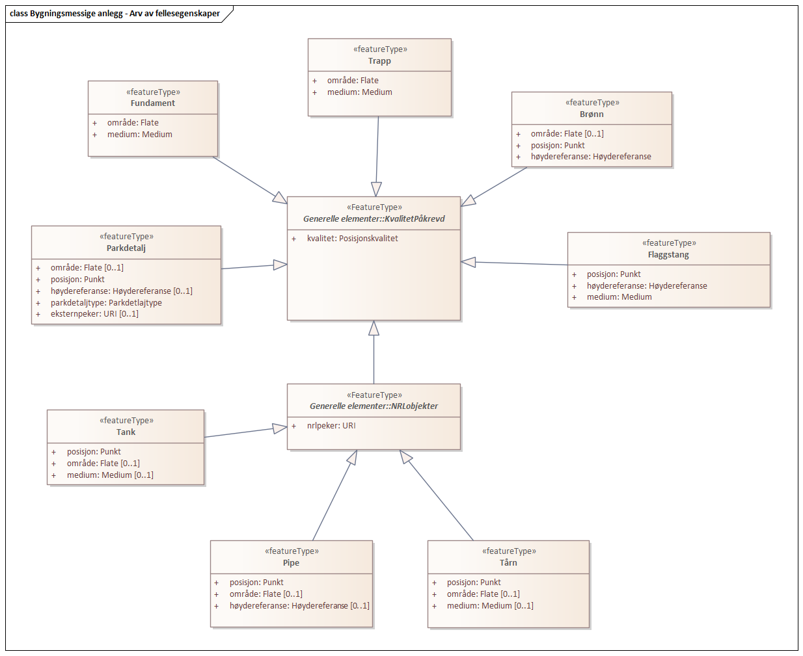
[caption="Figur 8: ",title=Bygningsmessige anlegg - Objekttyper med egenskaper]
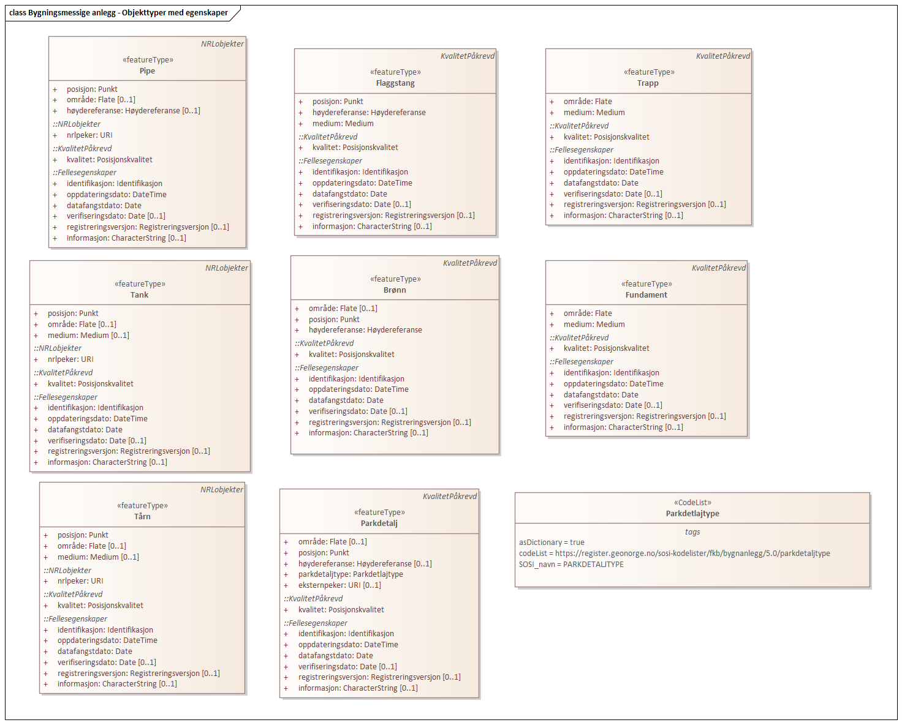
 
==== «featureType» Brønn
Definisjon: lite bygningsmessig anlegg for uttak av ferskvann
 
*Supertype:* «FeatureType» KvalitetPåkrevd
 
*Realisering av:* «ApplicationSchema» Bygnan-4.0/BygningsmessigeAnlegg/Pakke1::«featureType» Brønn
 
===== Egenskaper
[cols="20,80"]
|===
|*Navn:* 
|*område*
 
|Definisjon: 
|objektets utstrekning
 
|Multiplisitet: 
|[0..1]
 
|Type: 
|Flate
|===
[cols="20,80"]
|===
|*Navn:* 
|*posisjon*
 
|Definisjon: 
|sted som objektet eksisterer på
 
|Multiplisitet: 
|[1..1]
 
|Type: 
|Punkt
|===
[cols="20,80"]
|===
|*Navn:* 
|*høydereferanse*
 
|Definisjon: 
|koordinatregistering utført på topp eller bunn av et objekt
 
|Multiplisitet: 
|[1..1]
 
|Type: 
|Høydereferanse
|===
 
==== «featureType» Flaggstang
Definisjon: lang rett stang for heising av flagg
 
*Supertype:* «FeatureType» KvalitetPåkrevd
 
*Realisering av:* «ApplicationSchema» Bygnan-4.0/BygningsmessigeAnlegg/Pakke1::«featureType» Flaggstang
 
===== Egenskaper
[cols="20,80"]
|===
|*Navn:* 
|*posisjon*
 
|Definisjon: 
|sted som objektet eksisterer på
 
|Multiplisitet: 
|[1..1]
 
|Type: 
|Punkt
|===
[cols="20,80"]
|===
|*Navn:* 
|*høydereferanse*
 
|Definisjon: 
|angivelse av om registreringen er utført på topp eller bunn av et element- f.eks. en skråning- mur osv.
 
|Multiplisitet: 
|[1..1]
 
|Type: 
|Høydereferanse
|Tagged Values: 
|
SOSI_datatype: T + 
SOSI_lengde: 6 + 
SOSI_navn: HREF + 
|===
[cols="20,80"]
|===
|*Navn:* 
|*medium*
 
|Definisjon: 
|objektets beliggenhet i forhold til jordoverflaten
 
|Multiplisitet: 
|[1..1]
 
|Type: 
|Medium
|===
 
==== «featureType» Fundament
Definisjon: støpt underlag for frittstående konstruksjoner 
Merknad: Selve konstruksjonen oppå fundamentet og dens funksjon vil eventuelt  være beskrevet som en node i nettverket den er en del av.
Eksempel: Stolper og master
 
*Supertype:* «FeatureType» KvalitetPåkrevd
 
*Realisering av:* «ApplicationSchema» Bygnan-4.0/BygningsmessigeAnlegg/Pakke1::«featureType» Fundament
 
===== Egenskaper
[cols="20,80"]
|===
|*Navn:* 
|*område*
 
|Definisjon: 
|objektets utstrekning
 
|Multiplisitet: 
|[1..1]
 
|Type: 
|Flate
|===
[cols="20,80"]
|===
|*Navn:* 
|*medium*
 
|Definisjon: 
|objektets beliggenhet i forhold til jordoverflaten
 
|Multiplisitet: 
|[1..1]
 
|Type: 
|Medium
|===
 
==== «featureType» Pipe
Definisjon: frittstående rørformete innretninger for transport av avgasser
 
*Supertype:* «FeatureType» NRLobjekter
 
*Realisering av:* «ApplicationSchema» Bygnan-4.0/BygningsmessigeAnlegg/Pakke2::«featureType» Pipe
 
===== Egenskaper
[cols="20,80"]
|===
|*Navn:* 
|*posisjon*
 
|Definisjon: 
|sted som objektet eksisterer på
 
|Multiplisitet: 
|[1..1]
 
|Type: 
|Punkt
|===
[cols="20,80"]
|===
|*Navn:* 
|*område*
 
|Definisjon: 
|objektets utstrekning
 
|Multiplisitet: 
|[0..1]
 
|Type: 
|Flate
|===
[cols="20,80"]
|===
|*Navn:* 
|*høydereferanse*
 
|Definisjon: 
|koordinatregistering utført på topp eller bunn av et objekt
 
|Multiplisitet: 
|[0..1]
 
|Type: 
|Høydereferanse
|===
 
==== «featureType» Tank
Definisjon: lukkede kar for oppbevaring av gass eller væsker som ikke er registrert som bygning
 
*Supertype:* «FeatureType» NRLobjekter
 
*Realisering av:* «ApplicationSchema» Bygnan-4.0/BygningsmessigeAnlegg/Pakke2::«featureType» Tank
 
===== Egenskaper
[cols="20,80"]
|===
|*Navn:* 
|*posisjon*
 
|Definisjon: 
|sted som objektet eksisterer på
 
|Multiplisitet: 
|[1..1]
 
|Type: 
|Punkt
|===
[cols="20,80"]
|===
|*Navn:* 
|*område*
 
|Definisjon: 
|objektets utstrekning
 
|Multiplisitet: 
|[0..1]
 
|Type: 
|Flate
|===
[cols="20,80"]
|===
|*Navn:* 
|*medium*
 
|Definisjon: 
|objektets beliggenhet i forhold til jordoverflaten
 
|Multiplisitet: 
|[0..1]
 
|Type: 
|Medium
|===
 
==== «featureType» Trapp
Definisjon: trapp som ikke st&#229;r i tilknytning til en bygning
 
*Supertype:* «FeatureType» KvalitetPåkrevd
 
*Realisering av:* «ApplicationSchema» Bygnan-4.0/BygningsmessigeAnlegg/Pakke1::«featureType» FrittståendeTrapp
 
===== Egenskaper
[cols="20,80"]
|===
|*Navn:* 
|*område*
 
|Definisjon: 
|objektets utstrekning
 
|Multiplisitet: 
|[1..1]
 
|Type: 
|Flate
|===
[cols="20,80"]
|===
|*Navn:* 
|*medium*
 
|Definisjon: 
|objektets beliggenhet i forhold til jordoverflaten
 
|Multiplisitet: 
|[1..1]
 
|Type: 
|Medium
|===
 
==== «featureType» Tårn
Definisjon: h&#248;y bygningsmessig konstruksjon hvor h&#248;yden er stor i forhold til bygningens areal i grunnplanet
Merknad: Omfatter alle t&#229;rn med unntak av de som er registrert i matrikkelen og de som har en mer spesifisert beskrivelse- som f.eks tank. 
Eksempel: M&#229;let&#229;rn og stupet&#229;rn
 
*Supertype:* «FeatureType» NRLobjekter
 
*Realisering av:* «ApplicationSchema» Bygnan-4.0/BygningsmessigeAnlegg/Pakke2::«featureType» Tårn
 
===== Egenskaper
[cols="20,80"]
|===
|*Navn:* 
|*posisjon*
 
|Definisjon: 
|sted som objektet eksisterer på
 
|Multiplisitet: 
|[1..1]
 
|Type: 
|Punkt
|===
[cols="20,80"]
|===
|*Navn:* 
|*område*
 
|Definisjon: 
|objektets utstrekning
 
|Multiplisitet: 
|[0..1]
 
|Type: 
|Flate
|===
[cols="20,80"]
|===
|*Navn:* 
|*medium*
 
|Definisjon: 
|objektets beliggenhet i forhold til jordoverflaten
 
|Multiplisitet: 
|[0..1]
 
|Type: 
|Medium
|===
 
==== «featureType» Parkdetalj
Definisjon: detalj i parkmessig omr&#229;de
 
*Supertype:* «FeatureType» KvalitetPåkrevd
 
*Realisering av:* «ApplicationSchema» Bygnan-4.0/BygningsmessigeAnlegg/Pakke1::«featureType» BautaStatue
 
===== Egenskaper
[cols="20,80"]
|===
|*Navn:* 
|*område*
 
|Definisjon: 
|objektets utstrekning
 
|Multiplisitet: 
|[0..1]
 
|Type: 
|Flate
|Tagged Values: 
|
SOSI_melding: Fant ikke denne i SOSI_db + 
SOSI_navn: Flate + 
|===
[cols="20,80"]
|===
|*Navn:* 
|*posisjon*
 
|Definisjon: 
|sted som objektet eksisterer på
 
|Multiplisitet: 
|[1..1]
 
|Type: 
|Punkt
|Tagged Values: 
|
SOSI_datatype: * + 
SOSI_lengde:  + 
SOSI_navn: NØ + 
SOSI_navn: Punkt + 
|===
[cols="20,80"]
|===
|*Navn:* 
|*høydereferanse*
 
|Definisjon: 
|angivelse av om registreringen er utført på topp eller bunn av et element- f.eks. en skråning- mur osv.
 
|Multiplisitet: 
|[0..1]
 
|Type: 
|Høydereferanse
|Tagged Values: 
|
SOSI_datatype: T + 
SOSI_lengde: 6 + 
SOSI_navn: HREF + 
|===
[cols="20,80"]
|===
|*Navn:* 
|*parkdetaljtype*
 
|Definisjon: 
|
 
|Multiplisitet: 
|[1..1]
 
|Type: 
|Parkdetlajtype
|===
[cols="20,80"]
|===
|*Navn:* 
|*eksternpeker*
 
|Definisjon: 
|referanse til objektet i et eksternt system, f.eks. hos parkforvalter i kommunen.
 
|Multiplisitet: 
|[0..1]
 
|Type: 
|URI
|Tagged Values: 
|
SOSI_navn: EKSTERNPEKER + 
|===
 
==== «CodeList» Parkdetlajtype
Definisjon: angir type parkdetalj
 
===== Tagged Values
[cols="20,80"]
|===
|asDictionary
|true
 
|codeList
|https://register.geonorge.no/sosi-kodelister/fkb/bygnanlegg/5.0/parkdetaljtype
 
|SOSI_navn
|PARKDETALJTYPE
 
|===
=== MurerOgGjerder
Definisjon: Inneholder elementer fra SOSI Bygnan 4.0, Murer og gjerder
[caption="Figur 9: ",title=Murer og gjerder - Realisering av objekttyper og kodelister]
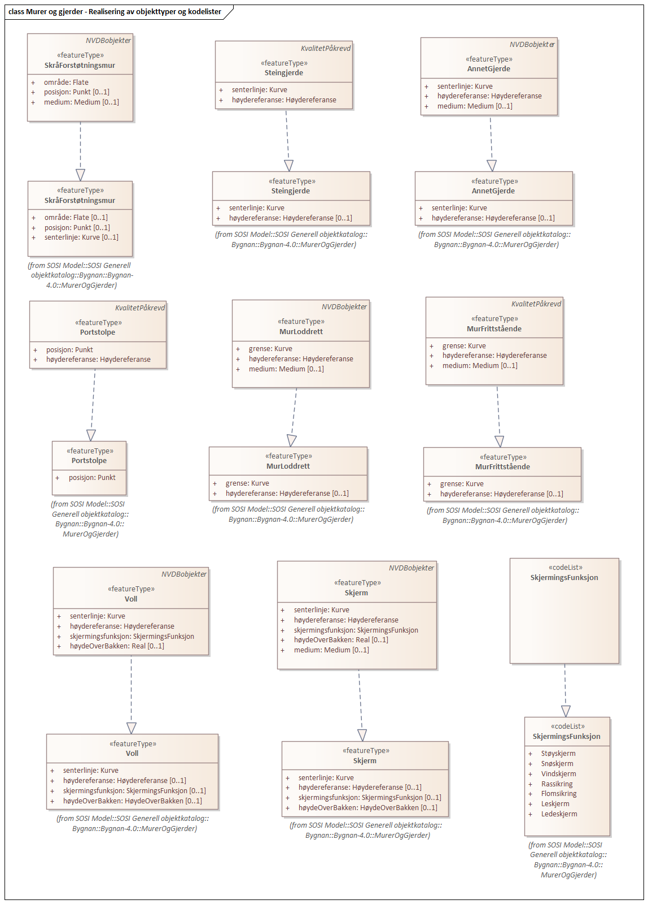
[caption="Figur 10: ",title=Murer og gjerder - Arv av fellesegenskaper]
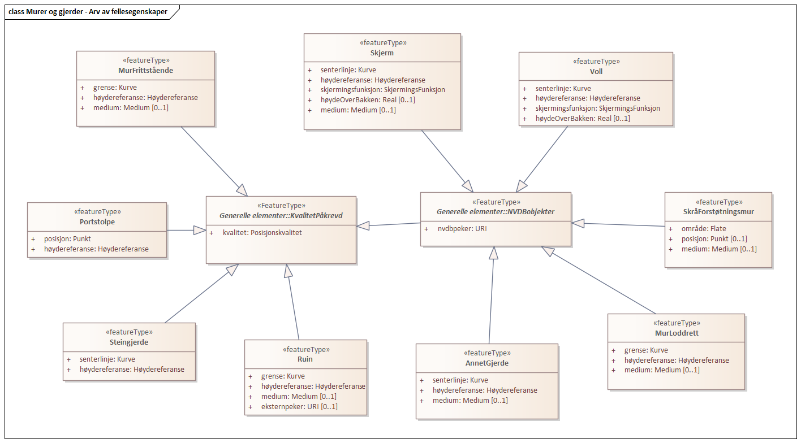
[caption="Figur 11: ",title=Murer og gjerder - Objekttyper med egenskaper]
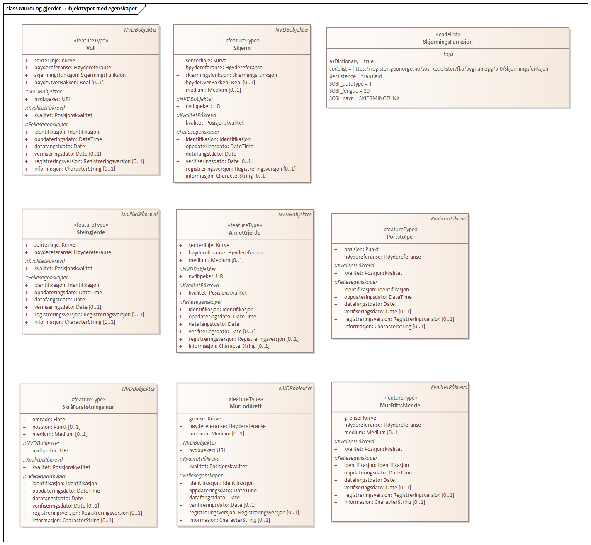
 
==== «featureType» AnnetGjerde
Definisjon: oppsatt stengsel som hindrer passering
Merknad: Står ofte i grensa mellom eiendommer, og som i utgangspunktet ikke er definert som egne objekter, slik som steingjerde.
 
*Supertype:* «FeatureType» NVDBobjekter
 
*Realisering av:* «ApplicationSchema» Bygnan-4.0/MurerOgGjerder::«featureType» AnnetGjerde
 
===== Tagged Values
[cols="20,80"]
|===
|SOSI_geometri
|KURVE;
 
|===
===== Egenskaper
[cols="20,80"]
|===
|*Navn:* 
|*senterlinje*
 
|Definisjon: 
|forløp som følger objektets sentrale del
 
|Multiplisitet: 
|[1..1]
 
|Type: 
|Kurve
|===
[cols="20,80"]
|===
|*Navn:* 
|*høydereferanse*
 
|Definisjon: 
|angivelse av om registreringen er utført på topp eller bunn av et element- f.eks. en skråning- mur osv.
 
|Multiplisitet: 
|[1..1]
 
|Type: 
|Høydereferanse
|Tagged Values: 
|
SOSI_datatype: T + 
SOSI_lengde: 6 + 
SOSI_navn: HREF + 
|===
[cols="20,80"]
|===
|*Navn:* 
|*medium*
 
|Definisjon: 
|objektets beliggenhet i forhold til jordoverflaten
 
|Multiplisitet: 
|[0..1]
 
|Type: 
|Medium
|===
 
==== «featureType» MurFrittstående
Definisjon: mur hvor oppfyllingen på en side utgjør mindre enn halve høyden på den andre siden
 
*Supertype:* «FeatureType» KvalitetPåkrevd
 
*Realisering av:* «ApplicationSchema» Bygnan-4.0/MurerOgGjerder::«featureType» MurFrittstående
 
===== Egenskaper
[cols="20,80"]
|===
|*Navn:* 
|*grense*
 
|Definisjon: 
|forløp som følger overgang mellom ulike fenomener
 
|Multiplisitet: 
|[1..1]
 
|Type: 
|Kurve
|===
[cols="20,80"]
|===
|*Navn:* 
|*høydereferanse*
 
|Definisjon: 
|angivelse av om registreringen er utført på topp eller bunn av et element- f.eks. en skråning- mur osv.
 
|Multiplisitet: 
|[1..1]
 
|Type: 
|Høydereferanse
|Tagged Values: 
|
SOSI_datatype: T + 
SOSI_lengde: 6 + 
SOSI_navn: HREF + 
|===
[cols="20,80"]
|===
|*Navn:* 
|*medium*
 
|Definisjon: 
|objektets beliggenhet i forhold til jordoverflaten
 
|Multiplisitet: 
|[0..1]
 
|Type: 
|Medium
|===
 
==== «featureType» MurLoddrett
Definisjon: forst&#248;tningsmur hvor topp og bunn er ubetydelig forskj&#248;vet i  forhold til hverandre
 
*Supertype:* «FeatureType» NVDBobjekter
 
*Realisering av:* «ApplicationSchema» Bygnan-4.0/MurerOgGjerder::«featureType» MurLoddrett
 
===== Egenskaper
[cols="20,80"]
|===
|*Navn:* 
|*grense*
 
|Definisjon: 
|forløp som følger overgang mellom ulike fenomener
 
|Multiplisitet: 
|[1..1]
 
|Type: 
|Kurve
|===
[cols="20,80"]
|===
|*Navn:* 
|*høydereferanse*
 
|Definisjon: 
|angivelse av om registreringen er utført på topp eller bunn av et element- f.eks. en skråning- mur osv.
 
|Multiplisitet: 
|[1..1]
 
|Type: 
|Høydereferanse
|Tagged Values: 
|
SOSI_datatype: T + 
SOSI_lengde: 6 + 
SOSI_navn: HREF + 
|===
[cols="20,80"]
|===
|*Navn:* 
|*medium*
 
|Definisjon: 
|objektets beliggenhet i forhold til jordoverflaten
 
|Multiplisitet: 
|[0..1]
 
|Type: 
|Medium
|===
 
==== «featureType» Portstolpe
Definisjon: stolpe som en port kan være hengslet til
 
*Supertype:* «FeatureType» KvalitetPåkrevd
 
*Realisering av:* «ApplicationSchema» Bygnan-4.0/MurerOgGjerder::«featureType» Portstolpe
 
===== Egenskaper
[cols="20,80"]
|===
|*Navn:* 
|*posisjon*
 
|Definisjon: 
|sted som objektet eksisterer på
 
|Multiplisitet: 
|[1..1]
 
|Type: 
|Punkt
|===
[cols="20,80"]
|===
|*Navn:* 
|*høydereferanse*
 
|Definisjon: 
|koordinatregistering utført på topp eller bunn av et objekt
 
|Multiplisitet: 
|[1..1]
 
|Type: 
|Høydereferanse
|===
 
==== «featureType» Skjerm
Definisjon: frittstående konstruksjon som skal være et hinder for eksempel til støyutbredelse eller snøfokk
 
*Supertype:* «FeatureType» NVDBobjekter
 
*Realisering av:* «ApplicationSchema» Bygnan-4.0/MurerOgGjerder::«featureType» Skjerm
 
===== Egenskaper
[cols="20,80"]
|===
|*Navn:* 
|*senterlinje*
 
|Definisjon: 
|forløp som følger objektets sentrale del
 
|Multiplisitet: 
|[1..1]
 
|Type: 
|Kurve
|===
[cols="20,80"]
|===
|*Navn:* 
|*høydereferanse*
 
|Definisjon: 
|angivelse av om registreringen er utført på topp eller bunn av et element- f.eks. en skråning- mur osv.
 
|Multiplisitet: 
|[1..1]
 
|Type: 
|Høydereferanse
|Tagged Values: 
|
SOSI_datatype: T + 
SOSI_lengde: 6 + 
SOSI_navn: HREF + 
|===
[cols="20,80"]
|===
|*Navn:* 
|*skjermingsfunksjon*
 
|Definisjon: 
|hvilken funksjon skjermen har
 
|Multiplisitet: 
|[1..1]
 
|Type: 
|SkjermingsFunksjon
|Tagged Values: 
|
SOSI_datatype: T + 
SOSI_lengde: 20 + 
SOSI_navn: SKJERMINGFUNK + 
|===
[cols="20,80"]
|===
|*Navn:* 
|*høydeOverBakken*
 
|Definisjon: 
|h&#248;yde over bakken (angitt i meter)
 
|Multiplisitet: 
|[0..1]
 
|Type: 
|Real
|Tagged Values: 
|
SOSI_datatype: D + 
SOSI_lengde: 10 + 
SOSI_navn: HOB + 
|===
[cols="20,80"]
|===
|*Navn:* 
|*medium*
 
|Definisjon: 
|objektets beliggenhet i forhold til jordoverflaten
 
|Multiplisitet: 
|[0..1]
 
|Type: 
|Medium
|===
 
==== «featureType» SkråForstøtningsmur
Definisjon: forst&#248;tningsmur hvor topp og bunn er betydelig forskj&#248;vet i forhold til hverandre
 
*Supertype:* «FeatureType» NVDBobjekter
 
*Realisering av:* «ApplicationSchema» Bygnan-4.0/MurerOgGjerder::«featureType» SkråForstøtningsmur
 
===== Egenskaper
[cols="20,80"]
|===
|*Navn:* 
|*område*
 
|Definisjon: 
|objektets utstrekning
 
|Multiplisitet: 
|[1..1]
 
|Type: 
|Flate
|Tagged Values: 
|
SOSI_melding: Fant ikke denne i SOSI_db + 
|===
[cols="20,80"]
|===
|*Navn:* 
|*posisjon*
 
|Definisjon: 
|sted som objektet eksisterer på
 
|Multiplisitet: 
|[0..1]
 
|Type: 
|Punkt
|Tagged Values: 
|
SOSI_datatype: * + 
SOSI_lengde:  + 
SOSI_navn: NØ + 
|===
[cols="20,80"]
|===
|*Navn:* 
|*medium*
 
|Definisjon: 
|objektets beliggenhet i forhold til jordoverflaten
 
|Multiplisitet: 
|[0..1]
 
|Type: 
|Medium
|===
 
==== «featureType» Steingjerde
Definisjon: frittstående mur oppført av naturstein uten bindemiddel
 
*Supertype:* «FeatureType» KvalitetPåkrevd
 
*Realisering av:* «ApplicationSchema» Bygnan-4.0/MurerOgGjerder::«featureType» Steingjerde
 
===== Egenskaper
[cols="20,80"]
|===
|*Navn:* 
|*senterlinje*
 
|Definisjon: 
|forløp som følger objektets sentrale del
 
|Multiplisitet: 
|[1..1]
 
|Type: 
|Kurve
|===
[cols="20,80"]
|===
|*Navn:* 
|*høydereferanse*
 
|Definisjon: 
|angivelse av om registreringen er utført på topp eller bunn av et element- f.eks. en skråning- mur osv.
 
|Multiplisitet: 
|[1..1]
 
|Type: 
|Høydereferanse
|Tagged Values: 
|
SOSI_datatype: T + 
SOSI_lengde: 6 + 
SOSI_navn: HREF + 
|===
 
==== «featureType» Voll
Definisjon: opphøyd terrengformasjon anlagt for å skjerme
 
*Supertype:* «FeatureType» NVDBobjekter
 
*Realisering av:* «ApplicationSchema» Bygnan-4.0/MurerOgGjerder::«featureType» Voll
 
===== Egenskaper
[cols="20,80"]
|===
|*Navn:* 
|*senterlinje*
 
|Definisjon: 
|forløp som følger objektets sentrale del
 
|Multiplisitet: 
|[1..1]
 
|Type: 
|Kurve
|===
[cols="20,80"]
|===
|*Navn:* 
|*høydereferanse*
 
|Definisjon: 
|angivelse av om registreringen er utført på topp eller bunn av et element- f.eks. en skråning- mur osv.
 
|Multiplisitet: 
|[1..1]
 
|Type: 
|Høydereferanse
|Tagged Values: 
|
SOSI_datatype: T + 
SOSI_lengde: 6 + 
SOSI_navn: HREF + 
|===
[cols="20,80"]
|===
|*Navn:* 
|*skjermingsfunksjon*
 
|Definisjon: 
|hvilken funksjon vollen har
 
|Multiplisitet: 
|[1..1]
 
|Type: 
|SkjermingsFunksjon
|Tagged Values: 
|
SOSI_datatype: T + 
SOSI_lengde: 20 + 
SOSI_navn: SKJERMINGFUNK + 
|===
[cols="20,80"]
|===
|*Navn:* 
|*høydeOverBakken*
 
|Definisjon: 
|objekts høyde over bakken
 
|Multiplisitet: 
|[0..1]
 
|Type: 
|Real
|Tagged Values: 
|
SOSI_datatype: D + 
SOSI_lengde: 10 + 
SOSI_navn: HOB + 
|===
 
==== «codeList» SkjermingsFunksjon
Definisjon: ulike funksjoner en skjerm kan ha
 
===== Tagged Values
[cols="20,80"]
|===
|asDictionary
|true
 
|codelist
|https://register.geonorge.no/sosi-kodelister/fkb/bygnanlegg/5.0/skjermingsfunksjon
 
|SOSI_datatype
|T
 
|SOSI_lengde
|20
 
|SOSI_navn
|SKJERMINGFUNK
 
|===
=== TekniskeAnleggKulturLek
Definisjon: Inneholder elementer fra SOSI Bygnan 4.0, TekniskeAnleggKulturLekMm
[caption="Figur 12: ",title=Kultur og lek - Realisering av objekttyper]
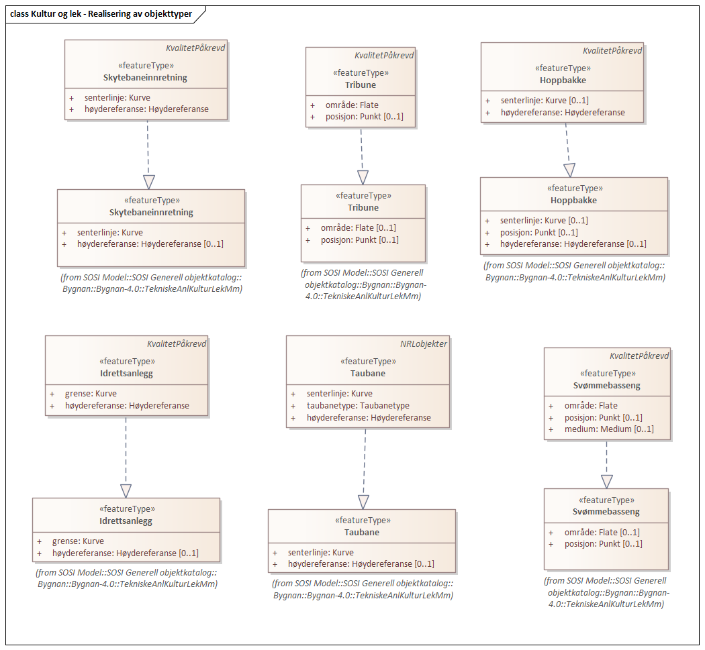
[caption="Figur 13: ",title=Kultur og lek - Arv av fellesegenskaper]
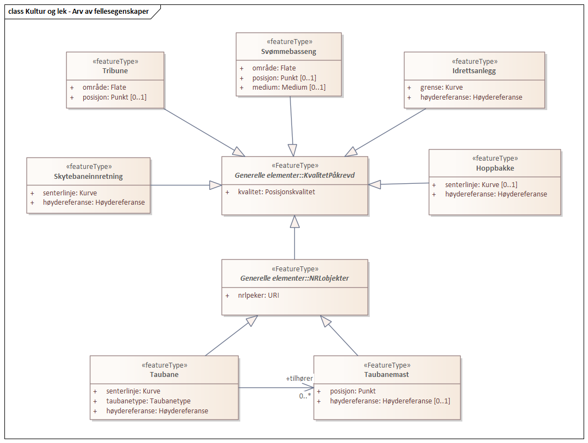
[caption="Figur 14: ",title=Kultur og lek - Objekttyper og egenskaper]
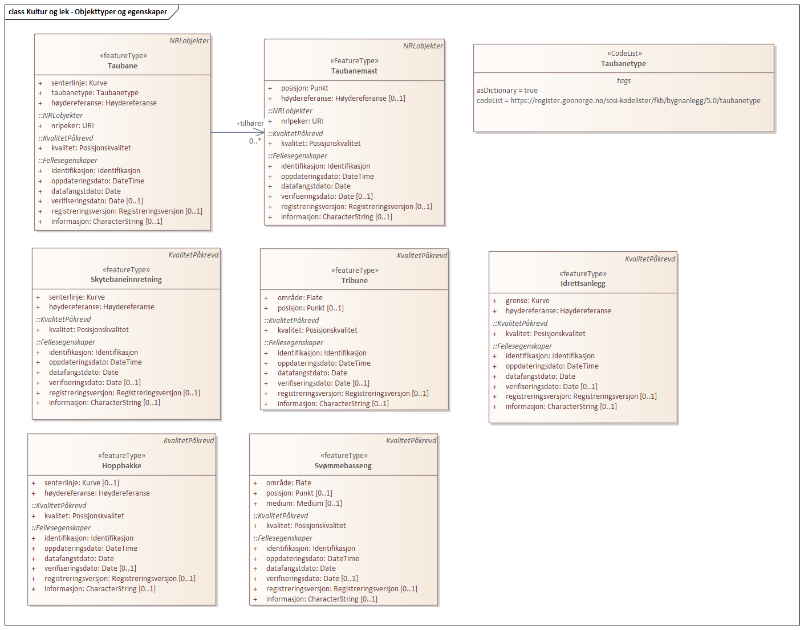
 
==== «featureType» Hoppbakke
Definisjon: anlegg for skihopping med kunstig eller naturlig tilløp
 
*Supertype:* «FeatureType» KvalitetPåkrevd
 
*Realisering av:* «ApplicationSchema» Bygnan-4.0/TekniskeAnlKulturLekMm::«featureType» Hoppbakke
 
===== Egenskaper
[cols="20,80"]
|===
|*Navn:* 
|*senterlinje*
 
|Definisjon: 
|forløp som følger objektets sentrale del
 
|Multiplisitet: 
|[0..1]
 
|Type: 
|Kurve
|===
[cols="20,80"]
|===
|*Navn:* 
|*høydereferanse*
 
|Definisjon: 
|angivelse av om registreringen er utført på topp eller bunn av et element- f.eks. en skråning- mur osv.
 
|Multiplisitet: 
|[1..1]
 
|Type: 
|Høydereferanse
|Tagged Values: 
|
SOSI_datatype: T + 
SOSI_lengde: 6 + 
SOSI_navn: HREF + 
|===
 
==== «featureType» Idrettsanlegg
Definisjon: linje for avgrensning av anleggsmessige deler av et idrettsanlegg, som f.eks ytteravgrensning av en fotballbane
Merknad: Området rundt idrettsanlegget kan beskrives som arealbruksobjekt (se kap. for arealbruk).
 
*Supertype:* «FeatureType» KvalitetPåkrevd
 
*Realisering av:* «ApplicationSchema» Bygnan-4.0/TekniskeAnlKulturLekMm::«featureType» Idrettsanlegg
 
===== Egenskaper
[cols="20,80"]
|===
|*Navn:* 
|*grense*
 
|Definisjon: 
|forløp som følger overgang mellom ulike fenomener
 
|Multiplisitet: 
|[1..1]
 
|Type: 
|Kurve
|===
[cols="20,80"]
|===
|*Navn:* 
|*høydereferanse*
 
|Definisjon: 
|angivelse av om registreringen er utført på topp eller bunn av et element- f.eks. en skråning- mur osv.
 
|Multiplisitet: 
|[1..1]
 
|Type: 
|Høydereferanse
|Tagged Values: 
|
SOSI_datatype: T + 
SOSI_lengde: 6 + 
SOSI_navn: HREF + 
|===
 
==== «featureType» Skytebaneinnretning
Definisjon: omriss av tekniske anlegg på skytebane - standplass og skiver som ikke blir registrert som f.eks bygninger og murer
 
*Supertype:* «FeatureType» KvalitetPåkrevd
 
*Realisering av:* «ApplicationSchema» Bygnan-4.0/TekniskeAnlKulturLekMm::«featureType» Skytebaneinnretning
 
===== Egenskaper
[cols="20,80"]
|===
|*Navn:* 
|*senterlinje*
 
|Definisjon: 
|forløp som følger objektets sentrale del
 
|Multiplisitet: 
|[1..1]
 
|Type: 
|Kurve
|===
[cols="20,80"]
|===
|*Navn:* 
|*høydereferanse*
 
|Definisjon: 
|angivelse av om registreringen er utført på topp eller bunn av et element- f.eks. en skråning- mur osv.
 
|Multiplisitet: 
|[1..1]
 
|Type: 
|Høydereferanse
|Tagged Values: 
|
SOSI_datatype: T + 
SOSI_lengde: 6 + 
SOSI_navn: HREF + 
|===
 
==== «featureType» Svømmebasseng
Definisjon: basseng for svømming og vannlek
 
*Supertype:* «FeatureType» KvalitetPåkrevd
 
*Realisering av:* «ApplicationSchema» Bygnan-4.0/TekniskeAnlKulturLekMm::«featureType» Svømmebasseng
 
===== Egenskaper
[cols="20,80"]
|===
|*Navn:* 
|*område*
 
|Definisjon: 
|objektets utstrekning
 
|Multiplisitet: 
|[1..1]
 
|Type: 
|Flate
|===
[cols="20,80"]
|===
|*Navn:* 
|*posisjon*
 
|Definisjon: 
|sted som objektet eksisterer på
 
|Multiplisitet: 
|[0..1]
 
|Type: 
|Punkt
|===
[cols="20,80"]
|===
|*Navn:* 
|*medium*
 
|Definisjon: 
|objektets beliggenhet i forhold til jordoverflaten
 
|Multiplisitet: 
|[0..1]
 
|Type: 
|Medium
|===
 
==== «featureType» Taubane
Definisjon: innretning hvor tau eller vaiere bærer og eller trekker last over en strekning
 
*Supertype:* «FeatureType» NRLobjekter
 
*Realisering av:* «ApplicationSchema» Bygnan-4.0/TekniskeAnlKulturLekMm::«featureType» Taubane
 
===== Tagged Values
[cols="20,80"]
|===
|SOSI_geometri
|KURVE;
 
|===
===== Egenskaper
[cols="20,80"]
|===
|*Navn:* 
|*senterlinje*
 
|Definisjon: 
|forløp som følger objektets sentrale del
 
|Multiplisitet: 
|[1..1]
 
|Type: 
|Kurve
|Tagged Values: 
|
SOSI_melding: Fant ikke denne i SOSI_db + 
|===
[cols="20,80"]
|===
|*Navn:* 
|*taubanetype*
 
|Definisjon: 
|
 
|Multiplisitet: 
|[1..1]
 
|Type: 
|Taubanetype
|Tagged Values: 
|
SOSI_navn: TAUBANETYPE + 
|===
[cols="20,80"]
|===
|*Navn:* 
|*høydereferanse*
 
|Definisjon: 
|angivelse av om registreringen er utført på topp eller bunn av et element- f.eks. en skråning- mur osv.
 
|Multiplisitet: 
|[1..1]
 
|Type: 
|Høydereferanse
|Tagged Values: 
|
SOSI_datatype: T + 
SOSI_lengde: 6 + 
SOSI_navn: HREF + 
|===
[cols="20,80"]
|===
===== Roller
|*Rollenavn:* 
|*tilhører*
 
|Multiplisitet: 
|[0..*]
 
|Til klasse
|«FeatureType» Taubanemast
|===
 
==== «FeatureType» Taubanemast
Definisjon: mast som taubanen er hengt opp i
 
*Supertype:* «FeatureType» NRLobjekter
 
===== Egenskaper
[cols="20,80"]
|===
|*Navn:* 
|*posisjon*
 
|Definisjon: 
|
 
|Multiplisitet: 
|[1..1]
 
|Type: 
|Punkt
|===
[cols="20,80"]
|===
|*Navn:* 
|*høydereferanse*
 
|Definisjon: 
|
 
|Multiplisitet: 
|[0..1]
 
|Type: 
|Høydereferanse
|===
 
==== «featureType» Tribune
Definisjon: opparbeidet anlegg av metall- stein- mur eller tre for betjening av publikum på kulturarenaer, særlig idrettsanlegg
Merknad: Tribune som er innredet for bruk, f.eks. som kontor eller butikk, vil være en bygningsenhet.
 
*Supertype:* «FeatureType» KvalitetPåkrevd
 
*Realisering av:* «ApplicationSchema» Bygnan-4.0/TekniskeAnlKulturLekMm::«featureType» Tribune
 
===== Egenskaper
[cols="20,80"]
|===
|*Navn:* 
|*område*
 
|Definisjon: 
|objektets utstrekning
 
|Multiplisitet: 
|[1..1]
 
|Type: 
|Flate
|===
[cols="20,80"]
|===
|*Navn:* 
|*posisjon*
 
|Definisjon: 
|sted som objektet eksisterer på
 
|Multiplisitet: 
|[0..1]
 
|Type: 
|Punkt
|Tagged Values: 
|
SOSI_datatype: * + 
SOSI_lengde:  + 
SOSI_navn: NØ + 
|===
 
==== «CodeList» Taubanetype
Definisjon: 
 
===== Tagged Values
[cols="20,80"]
|===
|asDictionary
|true
 
|codeList
|https://register.geonorge.no/sosi-kodelister/fkb/bygnanlegg/5.0/taubanetype
 
|===
=== TekniskeAnleggVannVassdragKyst
Definisjon: Inneholder elementer fra SOSI Bygnan 4.0, TekniskeAnleggVannVassdragKyst
[caption="Figur 15: ",title=Vann - Realisering av objekttyper]
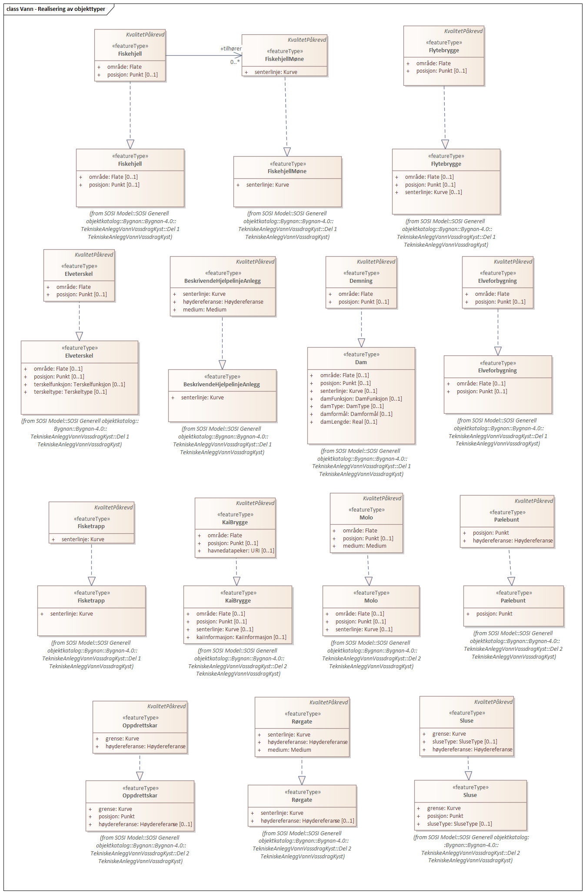
[caption="Figur 16: ",title=Vann - Arv av fellesegenskaper]
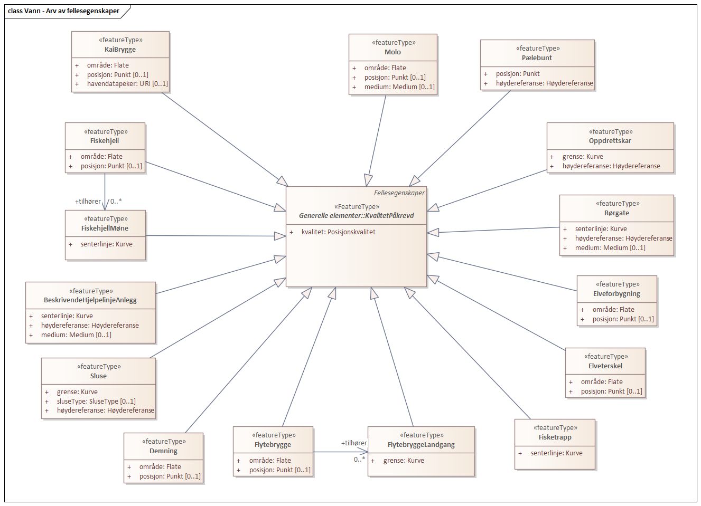
[caption="Figur 17: ",title=Vann - Objekttyper med egenskaper]
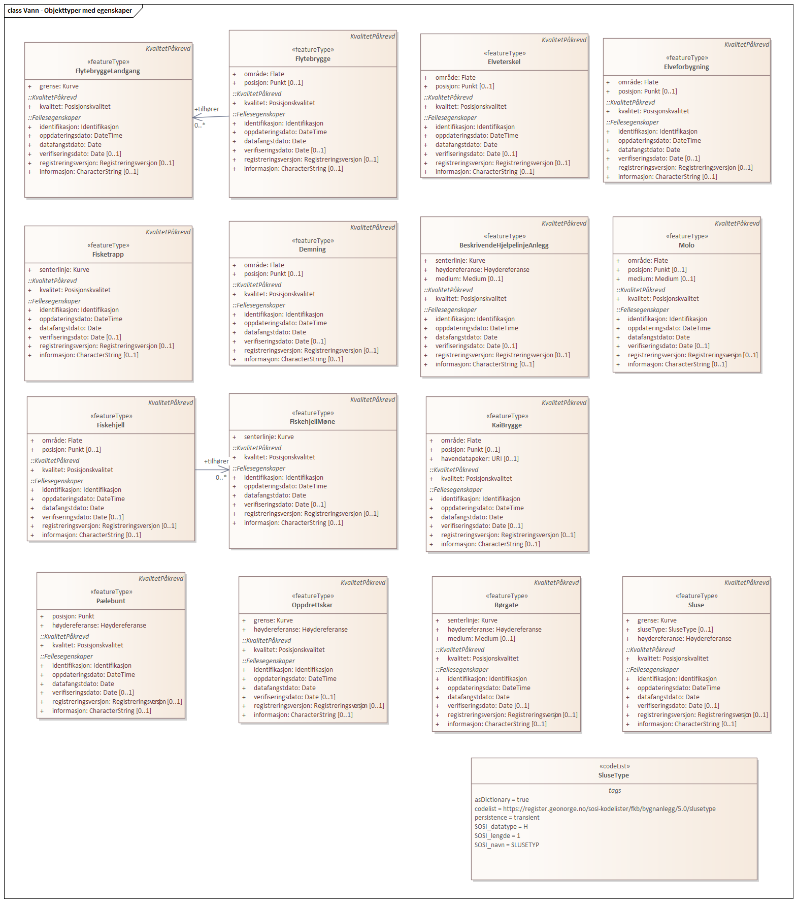
 
==== «featureType» BeskrivendeHjelpelinjeAnlegg
Definisjon: karakteristiske linjer p&#229; bygningsmessige- og tekniske anlegg
Merknad: Tilsvarer Bygningslinjer for Bygning 
Eksempel: Markerte linjer p&#229; en demning.
 
*Supertype:* «FeatureType» KvalitetPåkrevd
 
*Realisering av:* «ApplicationSchema» Bygnan-4.0/TekniskeAnleggVannVassdragKyst/Del 1 TekniskeAnleggVannVassdragKyst::«featureType» BeskrivendeHjelpelinjeAnlegg
 
===== Egenskaper
[cols="20,80"]
|===
|*Navn:* 
|*senterlinje*
 
|Definisjon: 
|forløp som følger objektets sentrale del
 
|Multiplisitet: 
|[1..1]
 
|Type: 
|Kurve
|===
[cols="20,80"]
|===
|*Navn:* 
|*høydereferanse*
 
|Definisjon: 
|koordinatregistering utført på topp eller bunn av et objekt
 
|Multiplisitet: 
|[1..1]
 
|Type: 
|Høydereferanse
|===
[cols="20,80"]
|===
|*Navn:* 
|*medium*
 
|Definisjon: 
|objektets beliggenhet i forhold til jordoverflaten
 
|Multiplisitet: 
|[0..1]
 
|Type: 
|Medium
|===
 
==== «featureType» KaiBrygge
Definisjon: angivelse av  innretninger som er satt opp for å betjene båter ved lasting- lossing og landligge
Merknad: Kai er utvidet til også å kunne være bare et fortøyningsanlegg- f.eks. enkeltstående metallring for fastgjøring av skip.
 
*Supertype:* «FeatureType» KvalitetPåkrevd
 
*Realisering av:* «ApplicationSchema» Bygnan-4.0/TekniskeAnleggVannVassdragKyst/Del 2 TekniskeAnleggVannVassdragKyst::«featureType» KaiBrygge
 
===== Egenskaper
[cols="20,80"]
|===
|*Navn:* 
|*område*
 
|Definisjon: 
|objektets utstrekning
 
|Multiplisitet: 
|[1..1]
 
|Type: 
|Flate
|===
[cols="20,80"]
|===
|*Navn:* 
|*posisjon*
 
|Definisjon: 
|sted som objektet eksisterer på
 
|Multiplisitet: 
|[0..1]
 
|Type: 
|Punkt
|===
[cols="20,80"]
|===
===== Roller
|*Rollenavn:* 
|*tilhører*
 
|Multiplisitet: 
|[0..*]
 
|Til klasse
|«featureType» Kaifront
|===
 
==== «featureType» Kaifront
Definisjon: avgrensning av kaibrygge mot vann
 
*Supertype:* «FeatureType» KvalitetPåkrevd
 
*Realisering av:* «ApplicationSchema» Bygnan-4.0/TekniskeAnleggVannVassdragKyst/Del 2 TekniskeAnleggVannVassdragKyst::«featureType» KaiBryggeKant
 
===== Egenskaper
[cols="20,80"]
|===
|*Navn:* 
|*senterlinje*
 
|Definisjon: 
|forløp som følger overgang mellom ulike fenomener
 
|Multiplisitet: 
|[1..1]
 
|Type: 
|Kurve
|===
[cols="20,80"]
|===
|*Navn:* 
|*havnedatapeker*
 
|Definisjon: 
|peker til Kaifront-objekt i Havnedata
 
|Multiplisitet: 
|[0..1]
 
|Type: 
|URI
|Tagged Values: 
|
SOSI_navn: HAVNEDATAPEKER + 
|===
 
==== «featureType» Molo
Definisjon: kunstig eller naturlig oppbygning som demper eller tilintetgjør bølgebevegelser i sjøen
 
*Supertype:* «FeatureType» KvalitetPåkrevd
 
*Realisering av:* «ApplicationSchema» Bygnan-4.0/TekniskeAnleggVannVassdragKyst/Del 2 TekniskeAnleggVannVassdragKyst::«featureType» Molo
 
===== Egenskaper
[cols="20,80"]
|===
|*Navn:* 
|*område*
 
|Definisjon: 
|objektets utstrekning
 
|Multiplisitet: 
|[1..1]
 
|Type: 
|Flate
|===
[cols="20,80"]
|===
|*Navn:* 
|*posisjon*
 
|Definisjon: 
|sted som objektet eksisterer på
 
|Multiplisitet: 
|[0..1]
 
|Type: 
|Punkt
|===
[cols="20,80"]
|===
|*Navn:* 
|*medium*
 
|Definisjon: 
|objektets beliggenhet i forhold til jordoverflaten
 
|Multiplisitet: 
|[0..1]
 
|Type: 
|Medium
|===
 
==== «featureType» Flytebrygge
Definisjon: brygge som er forankret til bunn og hvor plasseringen kan avhenge av vind og strømretning
 
*Supertype:* «FeatureType» KvalitetPåkrevd
 
*Realisering av:* «ApplicationSchema» Bygnan-4.0/TekniskeAnleggVannVassdragKyst/Del 1 TekniskeAnleggVannVassdragKyst::«featureType» Flytebrygge
 
===== Tagged Values
[cols="20,80"]
|===
|SOSI_geometri
|PUNKT;KURVE;FLATE;
 
|===
===== Egenskaper
[cols="20,80"]
|===
|*Navn:* 
|*område*
 
|Definisjon: 
|objektets utstrekning
 
|Multiplisitet: 
|[1..1]
 
|Type: 
|Flate
|===
[cols="20,80"]
|===
|*Navn:* 
|*posisjon*
 
|Definisjon: 
|sted som objektet eksisterer på
 
|Multiplisitet: 
|[0..1]
 
|Type: 
|Punkt
|===
[cols="20,80"]
|===
===== Roller
|*Rollenavn:* 
|*tilhører*
 
|Multiplisitet: 
|[0..*]
 
|Til klasse
|«featureType» FlytebryggeLandgang
|===
 
==== «featureType» FlytebryggeLandgang
Definisjon: landgang for flytebrygger
 
*Supertype:* «FeatureType» KvalitetPåkrevd
 
*Realisering av:* «ApplicationSchema» Bygnan-4.0/TekniskeAnleggVannVassdragKyst/Del 1 TekniskeAnleggVannVassdragKyst::«featureType» FiktivAvgrensningForAnlegg
 
===== Egenskaper
[cols="20,80"]
|===
|*Navn:* 
|*grense*
 
|Definisjon: 
|forløp som følger overgang mellom ulike fenomener
 
|Multiplisitet: 
|[1..1]
 
|Type: 
|Kurve
|Tagged Values: 
|
SOSI_melding: Fant ikke denne i SOSI_db + 
|===
 
==== «featureType» Pælebunt
Definisjon: bunt av stokker som er drevet ned i sjøbunnen, vann eller elver for å lede trafikken eller tømmer
 
*Supertype:* «FeatureType» KvalitetPåkrevd
 
*Realisering av:* «ApplicationSchema» Bygnan-4.0/TekniskeAnleggVannVassdragKyst/Del 2 TekniskeAnleggVannVassdragKyst::«featureType» Pælebunt
 
===== Egenskaper
[cols="20,80"]
|===
|*Navn:* 
|*posisjon*
 
|Definisjon: 
|sted som objektet eksisterer på
 
|Multiplisitet: 
|[1..1]
 
|Type: 
|Punkt
|===
[cols="20,80"]
|===
|*Navn:* 
|*høydereferanse*
 
|Definisjon: 
|koordinatregistering utført på topp eller bunn av et objekt
 
|Multiplisitet: 
|[1..1]
 
|Type: 
|Høydereferanse
|===
 
==== «featureType» Oppdrettskar
Definisjon: kar i sjøen for oppdrett av fisk
 
*Supertype:* «FeatureType» KvalitetPåkrevd
 
*Realisering av:* «ApplicationSchema» Bygnan-4.0/TekniskeAnleggVannVassdragKyst/Del 2 TekniskeAnleggVannVassdragKyst::«featureType» Oppdrettskar
 
===== Egenskaper
[cols="20,80"]
|===
|*Navn:* 
|*grense*
 
|Definisjon: 
|forløp som følger overgang mellom ulike fenomener
 
|Multiplisitet: 
|[1..1]
 
|Type: 
|Kurve
|===
[cols="20,80"]
|===
|*Navn:* 
|*høydereferanse*
 
|Definisjon: 
|angivelse av om registreringen er utført på topp eller bunn av et element- f.eks. en skråning- mur osv.
 
|Multiplisitet: 
|[1..1]
 
|Type: 
|Høydereferanse
|Tagged Values: 
|
SOSI_datatype: T + 
SOSI_lengde: 6 + 
SOSI_navn: HREF + 
|===
 
==== «featureType» Rørgate
Definisjon: rør som leder vann frem til foredlingsanlegg
 
*Supertype:* «FeatureType» KvalitetPåkrevd
 
*Realisering av:* «ApplicationSchema» Bygnan-4.0/TekniskeAnleggVannVassdragKyst/Del 2 TekniskeAnleggVannVassdragKyst::«featureType» Rørgate
 
===== Egenskaper
[cols="20,80"]
|===
|*Navn:* 
|*senterlinje*
 
|Definisjon: 
|forløp som følger objektets sentrale del
 
|Multiplisitet: 
|[1..1]
 
|Type: 
|Kurve
|===
[cols="20,80"]
|===
|*Navn:* 
|*høydereferanse*
 
|Definisjon: 
|angivelse av om registreringen er utført på topp eller bunn av et element- f.eks. en skråning- mur osv.
 
|Multiplisitet: 
|[1..1]
 
|Type: 
|Høydereferanse
|Tagged Values: 
|
SOSI_datatype: T + 
SOSI_lengde: 6 + 
SOSI_navn: HREF + 
|===
[cols="20,80"]
|===
|*Navn:* 
|*medium*
 
|Definisjon: 
|objektets beliggenhet i forhold til jordoverflaten
 
|Multiplisitet: 
|[0..1]
 
|Type: 
|Medium
|===
 
==== «featureType» Demning
Definisjon: konstruksjon for å heve vannspeilet og danne et kunstig vannmagasin, samt regulere vannføringen
 
*Supertype:* «FeatureType» KvalitetPåkrevd
 
*Realisering av:* «ApplicationSchema» Bygnan-4.0/TekniskeAnleggVannVassdragKyst/Del 1 TekniskeAnleggVannVassdragKyst::«featureType» Dam
 
===== Egenskaper
[cols="20,80"]
|===
|*Navn:* 
|*område*
 
|Definisjon: 
|objektets utstrekning
 
|Multiplisitet: 
|[1..1]
 
|Type: 
|Flate
|Tagged Values: 
|
SOSI_melding: Fant ikke denne i SOSI_db + 
SOSI_navn: Flate + 
|===
[cols="20,80"]
|===
|*Navn:* 
|*posisjon*
 
|Definisjon: 
|sted som objektet eksisterer på
 
|Multiplisitet: 
|[0..1]
 
|Type: 
|Punkt
|Tagged Values: 
|
SOSI_datatype: * + 
SOSI_lengde:  + 
SOSI_navn: NØ + 
SOSI_navn: Punkt + 
|===
 
==== «featureType» Elveforbygning
Definisjon: konstruksjon i eller langs vassdrag for å sikre mot erosjon, flom eller som miljøtiltak
 
*Supertype:* «FeatureType» KvalitetPåkrevd
 
*Realisering av:* «ApplicationSchema» Bygnan-4.0/TekniskeAnleggVannVassdragKyst/Del 1 TekniskeAnleggVannVassdragKyst::«featureType» Elveforbygning
 
===== Egenskaper
[cols="20,80"]
|===
|*Navn:* 
|*område*
 
|Definisjon: 
|objektets utstrekning
 
|Multiplisitet: 
|[1..1]
 
|Type: 
|Flate
|===
[cols="20,80"]
|===
|*Navn:* 
|*posisjon*
 
|Definisjon: 
|sted som objektet eksisterer på
 
|Multiplisitet: 
|[0..1]
 
|Type: 
|Punkt
|===
 
==== «featureType» Elveterskel
Definisjon: kunstig oppbygning i elver som brukes for å lage vannspeil i elveløpet
 
*Supertype:* «FeatureType» KvalitetPåkrevd
 
*Realisering av:* «ApplicationSchema» Bygnan-4.0/TekniskeAnleggVannVassdragKyst/Del 1 TekniskeAnleggVannVassdragKyst::«featureType» Elveterskel
 
===== Egenskaper
[cols="20,80"]
|===
|*Navn:* 
|*område*
 
|Definisjon: 
|objektets utstrekning
 
|Multiplisitet: 
|[1..1]
 
|Type: 
|Flate
|Tagged Values: 
|
SOSI_melding: Fant ikke denne i SOSI_db + 
SOSI_navn: Flate + 
|===
[cols="20,80"]
|===
|*Navn:* 
|*posisjon*
 
|Definisjon: 
|sted som objektet eksisterer på
 
|Multiplisitet: 
|[0..1]
 
|Type: 
|Punkt
|Tagged Values: 
|
SOSI_datatype: * + 
SOSI_lengde:  + 
SOSI_navn: NØ + 
SOSI_navn: Punkt + 
|===
 
==== «featureType» Fiskehjell
Definisjon: anordning bygd opp for tørking av fisk
 
*Supertype:* «FeatureType» KvalitetPåkrevd
 
*Realisering av:* «ApplicationSchema» Bygnan-4.0/TekniskeAnleggVannVassdragKyst/Del 1 TekniskeAnleggVannVassdragKyst::«featureType» Fiskehjell
 
===== Egenskaper
[cols="20,80"]
|===
|*Navn:* 
|*område*
 
|Definisjon: 
|objektets utstrekning
 
|Multiplisitet: 
|[1..1]
 
|Type: 
|Flate
|===
[cols="20,80"]
|===
|*Navn:* 
|*posisjon*
 
|Definisjon: 
|sted som objektet eksisterer på
 
|Multiplisitet: 
|[0..1]
 
|Type: 
|Punkt
|===
[cols="20,80"]
|===
===== Roller
|*Rollenavn:* 
|*tilhører*
 
|Multiplisitet: 
|[0..*]
 
|Til klasse
|«featureType» FiskehjellMøne
|===
 
==== «featureType» FiskehjellMøne
Definisjon: toppen av rammeverket for fiskehjell
 
*Supertype:* «FeatureType» KvalitetPåkrevd
 
*Realisering av:* «ApplicationSchema» Bygnan-4.0/TekniskeAnleggVannVassdragKyst/Del 1 TekniskeAnleggVannVassdragKyst::«featureType» FiskehjellMøne
 
===== Egenskaper
[cols="20,80"]
|===
|*Navn:* 
|*senterlinje*
 
|Definisjon: 
|forløp som følger objektets sentrale del
 
|Multiplisitet: 
|[1..1]
 
|Type: 
|Kurve
|===
 
==== «featureType» Fisketrapp
Definisjon: innretning i elver for at fisken kan vandre oppover elven
 
*Supertype:* «FeatureType» KvalitetPåkrevd
 
*Realisering av:* «ApplicationSchema» Bygnan-4.0/TekniskeAnleggVannVassdragKyst/Del 1 TekniskeAnleggVannVassdragKyst::«featureType» Fisketrapp
 
===== Egenskaper
[cols="20,80"]
|===
|*Navn:* 
|*senterlinje*
 
|Definisjon: 
|forløp som følger overgang mellom ulike fenomener
 
|Multiplisitet: 
|[1..1]
 
|Type: 
|Kurve
|===
 
==== «featureType» Sluse
Definisjon: byggverk i elv eller kanal med flere slusekamre som gjør det mulig å heve eller senke fartøy fra et vann-nivå til et annet
 
*Supertype:* «FeatureType» KvalitetPåkrevd
 
*Realisering av:* «ApplicationSchema» Bygnan-4.0/TekniskeAnleggVannVassdragKyst/Del 2 TekniskeAnleggVannVassdragKyst::«featureType» Sluse
 
===== Egenskaper
[cols="20,80"]
|===
|*Navn:* 
|*grense*
 
|Definisjon: 
|geometri-egenskap - omriss
 
|Multiplisitet: 
|[1..1]
 
|Type: 
|Kurve
|===
[cols="20,80"]
|===
|*Navn:* 
|*sluseType*
 
|Definisjon: 
|beskrivelse av selve slusetypen
 
|Multiplisitet: 
|[0..1]
 
|Type: 
|SluseType
|Tagged Values: 
|
SOSI_datatype: H + 
SOSI_lengde: 1 + 
SOSI_navn: SLUSETYP + 
|===
[cols="20,80"]
|===
|*Navn:* 
|*høydereferanse*
 
|Definisjon: 
|koordinatregistering utført på topp eller bunn av et objekt
 
|Multiplisitet: 
|[1..1]
 
|Type: 
|Høydereferanse
|===
 
==== «codeList» SluseType
Definisjon: beskrivelse av selve slusetypen
 
===== Tagged Values
[cols="20,80"]
|===
|asDictionary
|true
 
|codelist
|https://register.geonorge.no/sosi-kodelister/fkb/bygnanlegg/5.0/slusetype
 
|SOSI_datatype
|H
 
|SOSI_lengde
|1
 
|SOSI_navn
|SLUSETYP
 
|===
=== Generelle elementer
Definisjon: pakke med elementer som realiserer tilsvarende elementer i FKB Generell del 5.0

Merknad:
Kopieres direkte inn i de enkelte FKB-datasettene
[caption="Figur 18: ",title=Hoveddiagram Fellesegenskaper]
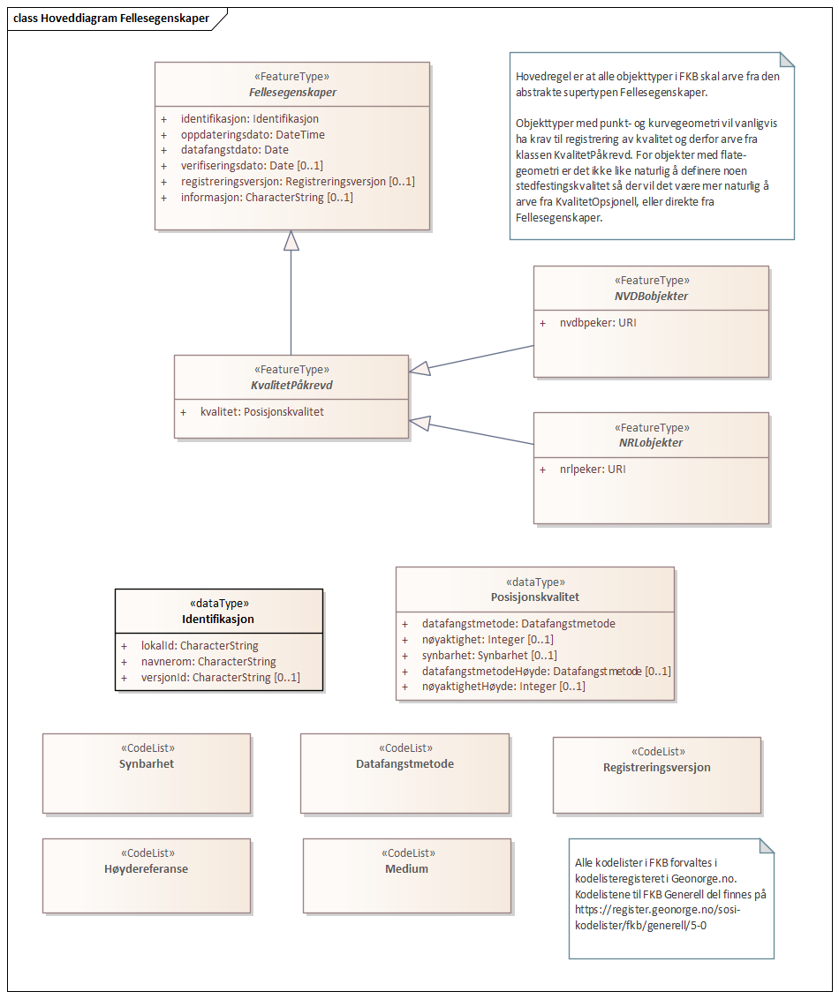
[caption="Figur 19: ",title=Realisering av fellesegenskaper fra SOSI generell del]
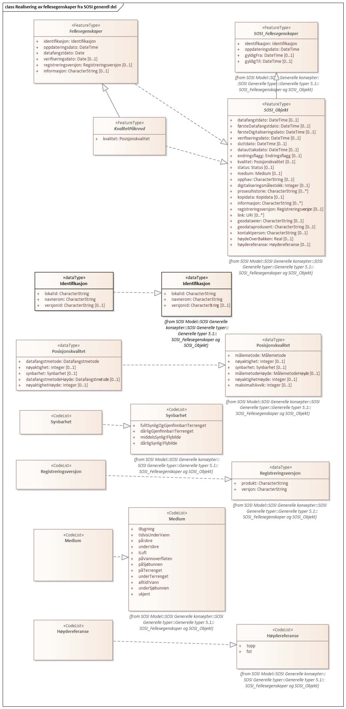
[caption="Figur 20: ",title=Posisjonskvalitet]
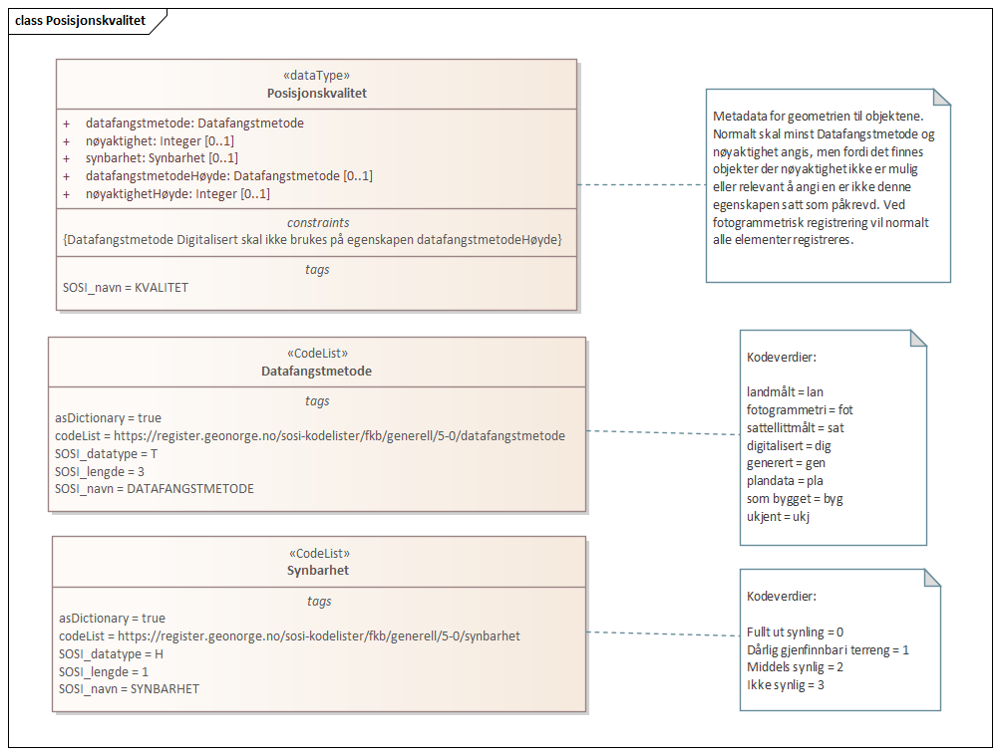
 
==== «FeatureType» Fellesegenskaper
Definisjon: abstrakt objekttype som bærer sentrale egenskaper som er anbefalt for bruk i produktspesifikasjoner.

Merknad: Disse egenskapene skal derfor ikke modelleres inn i fagområdemodeller.
 
*Realisering av:* «ApplicationSchema» FKB Generell del-5.0Utkast::«FeatureType» Fellesegenskaper
 
*Realisering av:* «ApplicationSchema» Generelle typer 5.1/SOSI_Fellesegenskaper og SOSI_Objekt::«FeatureType» SOSI_Objekt
 
===== Egenskaper
[cols="20,80"]
|===
|*Navn:* 
|*identifikasjon*
 
|Definisjon: 
|unik identifikasjon av et objekt 

Merknad FKB:
Unik identifikasjon av et objekt, ivaretas av den ansvarlige produsent/forvalter, og som kan benyttes av eksterne applikasjoner som referanse til objektet.
Den unike identifikatoren er unik for kartobjektet og skal ikke endres i kartobjektets levetid. Dette m&#229; ikke forveksles med en tematisk identifikator (for eksempel bygningsnummer) som unikt identifiserer et objekt i virkeligheten. En bygning med samme bygningsnummer vil kunne representeres i mange kartprodukter der det finnes en unik identifikasjon i hver av dem.
For FKB benyttes UUID (Universally unique identifier) som lokalId. Dette inneb&#230;rer at lokalId alene alltid vil v&#230;re unik. Likevel skal alltid navnerom ogs&#229; angis. Navnerom angir FKB-datasettet.
 
|Multiplisitet: 
|[1..1]
 
|Type: 
|Identifikasjon
|Tagged Values: 
|
SOSI_navn: IDENT + 
|===
[cols="20,80"]
|===
|*Navn:* 
|*oppdateringsdato*
 
|Definisjon: 
|tidspunkt for siste endring p&#229; objektet 

Merknad FKB: 
Denne datoen viser datasystemets siste endring p&#229; dataobjektet. Egenskapen settes av forvaltningssystemet etter f&#248;lgende regler:
i. Oppdateringsdato er tidspunkt for oppdatering av databasen og settes av forvaltningsbasen (ikke
av klienten).
ii. Oppdateringsdato skal endres ogs&#229; hvis det er kopidata som blir endret eller importert i en
”kopibase”.
iii. N&#229;r avgrensingslinjene til en flate endres, skal flateobjektet f&#229; ny oppdateringsdato.
iv. Oppdateringsdato skal endres hvis en egenskap endres.
 
|Multiplisitet: 
|[1..1]
 
|Type: 
|DateTime
|Tagged Values: 
|
definition: "Date and time at which this version of the spatial object was inserted or changed in the spatial data set."@en + 
SOSI_datatype: DATOTID + 
SOSI_navn: OPPDATERINGSDATO + 
|===
[cols="20,80"]
|===
|*Navn:* 
|*datafangstdato*
 
|Definisjon: 
|
 
|Multiplisitet: 
|[1..1]
 
|Type: 
|Date
|Tagged Values: 
|
SOSI_datatype: DATO + 
SOSI_navn: DATAFANGSTDATO + 
|===
[cols="20,80"]
|===
|*Navn:* 
|*verifiseringsdato*
 
|Definisjon: 
|dato n&#229;r dataene er fastsl&#229;tt &#229; v&#230;re i samsvar med virkeligheten.

Merknad FKB:
Brukes for eksempel i de sammenhenger hvor det er foretatt fotogrammetrisk ajourhold, og hvor det ikke er registrert endringer p&#229; objektet (det virkelige objektet er i samsvar med dataobjektet)
 
|Multiplisitet: 
|[0..1]
 
|Type: 
|Date
|Tagged Values: 
|
SOSI_datatype: DATO + 
SOSI_navn: VERIFISERINGSDATO + 
|===
[cols="20,80"]
|===
|*Navn:* 
|*registreringsversjon*
 
|Definisjon: 
|angivelse av hvilken produktspesifikasjon som er utgangspunkt  for dataene
 
|Multiplisitet: 
|[0..1]
 
|Type: 
|Registreringsversjon
|Tagged Values: 
|
SOSI_navn: REGISTRERINGSVERSJON + 
|===
[cols="20,80"]
|===
|*Navn:* 
|*informasjon*
 
|Definisjon: 
|generell opplysning.

Merknad FKB:
Mulighet til &#229; legge inn utfyllende informasjon om objektet. Egenskapen b&#248;r bare brukes til &#229; legge inn ekstra informasjon om enkeltobjekter. Egenskapen b&#248;r ikke brukes til &#229; systematisk angi ekstrainformasjon om mange/alle objekter i et datasett.
 
|Multiplisitet: 
|[0..1]
 
|Type: 
|CharacterString
|===
[cols="20,80"]
|===
|*Subtyper:*
|«FeatureType» KvalitetPåkrevd
|===
 
==== «FeatureType» KvalitetPåkrevd
Definisjon: 
 
*Supertype:* «FeatureType» Fellesegenskaper
 
*Realisering av:* «ApplicationSchema» Generelle typer 5.1/SOSI_Fellesegenskaper og SOSI_Objekt::«FeatureType» SOSI_Objekt
 
*Realisering av:* «ApplicationSchema» FKB Generell del-5.0Utkast::«FeatureType» KvalitetPåkrevd
 
===== Egenskaper
[cols="20,80"]
|===
|*Navn:* 
|*kvalitet*
 
|Definisjon: 
|beskrivelse av kvaliteten på stedfestingen

Merknad: Denne er identisk med ..KVALITET i tidligere versjoner av SOSI.
 
|Multiplisitet: 
|[1..1]
 
|Type: 
|Posisjonskvalitet
|Tagged Values: 
|
SOSI_navn: KVALITET + 
|===
[cols="20,80"]
|===
|*Subtyper:*
|«FeatureType» NRLobjekter +
«FeatureType» NVDBobjekter +
«featureType» Elveforbygning +
«featureType» Fisketrapp +
«featureType» FiskehjellMøne +
«featureType» Kaifront +
«featureType» KaiBrygge +
«featureType» Elveterskel +
«featureType» BeskrivendeHjelpelinjeAnlegg +
«featureType» Oppdrettskar +
«featureType» Fiskehjell +
«featureType» FlytebryggeLandgang +
«featureType» Molo +
«featureType» Demning +
«featureType» Sluse +
«featureType» Flytebrygge +
«featureType» Pælebunt +
«featureType» Rørgate +
«featureType» Idrettsanlegg +
«featureType» Skytebaneinnretning +
«featureType» Svømmebasseng +
«featureType» Hoppbakke +
«featureType» Tribune +
«featureType» Steingjerde +
«featureType» MurFrittstående +
«featureType» Portstolpe +
«featureType» Parkdetalj +
«featureType» Trapp +
«featureType» Brønn +
«featureType» Fundament +
«featureType» Flaggstang +
«featureType» Brudetalj
|===
 
==== «FeatureType» NRLobjekter
Definisjon: abstrakt objekttype som arves fra for objekter som har kobling til NRL
 
*Supertype:* «FeatureType» KvalitetPåkrevd
 
===== Egenskaper
[cols="20,80"]
|===
|*Navn:* 
|*nrlpeker*
 
|Definisjon: 
|peker til objekt i NRL
 
|Multiplisitet: 
|[1..1]
 
|Type: 
|URI
|Tagged Values: 
|
SOSI_navn: NRLPEKER + 
|===
[cols="20,80"]
|===
|*Subtyper:*
|«featureType» Taubane +
«FeatureType» Taubanemast +
«featureType» Tank +
«featureType» Pipe +
«featureType» Tårn
|===
 
==== «FeatureType» NVDBobjekter
Definisjon: abstrakt objekttype som arves fra for objekter som har kobling til NVDB
 
*Supertype:* «FeatureType» KvalitetPåkrevd
 
===== Egenskaper
[cols="20,80"]
|===
|*Navn:* 
|*nvdbpeker*
 
|Definisjon: 
|peker til objekt i NVDB
 
|Multiplisitet: 
|[1..1]
 
|Type: 
|URI
|Tagged Values: 
|
SOSI_navn: NVDBPEKER + 
|===
[cols="20,80"]
|===
|*Subtyper:*
|«featureType» Voll +
«featureType» Skjerm +
«featureType» SkråForstøtningsmur +
«featureType» AnnetGjerde +
«featureType» MurLoddrett +
«featureType» Bru +
«featureType» Tunnelportal +
«featureType» Kulvert
|===
 
==== «dataType» Identifikasjon
Definisjon: Unik identifikasjon av et objekt i et datasett, forvaltet av den ansvarlige produsent/forvalter, og kan benyttes av eksterne applikasjoner som stabil referanse til objektet. 

Merknad 1: Denne objektidentifikasjonen må ikke forveksles med en tematisk objektidentifikasjon, slik som f.eks bygningsnummer. 

Merknad 2: Denne unike identifikatoren vil ikke endres i løpet av objektets levetid, og ikke gjenbrukes i andre objekt. 
 
*Realisering av:* «ApplicationSchema» Generelle typer 5.1/SOSI_Fellesegenskaper og SOSI_Objekt::«dataType» Identifikasjon
 
===== Tagged Values
[cols="20,80"]
|===
|SOSI_navn
|IDENT
 
|===
===== Egenskaper
[cols="20,80"]
|===
|*Navn:* 
|*lokalId*
 
|Definisjon: 
|lokal identifikator av et objekt

Merknad: Det er dataleverend&#248;rens ansvar &#229; s&#248;rge for at den lokale identifikatoren er unik innenfor navnerommet. For FKB-data benyttes UUID som lokalId.
 
|Multiplisitet: 
|[1..1]
 
|Type: 
|CharacterString
|Tagged Values: 
|
SOSI_datatype: T + 
SOSI_lengde: 100 + 
SOSI_navn: LOKALID + 
|===
[cols="20,80"]
|===
|*Navn:* 
|*navnerom*
 
|Definisjon: 
|navnerom som unikt identifiserer datakilden til et objekt, anbefales å være en http-URI

Eksempel: http://data.geonorge.no/SentraltStedsnavnsregister/1.0

Merknad : Verdien for nanverom vil eies av den dataprodusent som har ansvar for de unike identifikatorene og må være registrert i data.geonorge.no eller data.norge.no
 
|Multiplisitet: 
|[1..1]
 
|Type: 
|CharacterString
|Tagged Values: 
|
SOSI_datatype: T + 
SOSI_lengde: 100 + 
SOSI_navn: NAVNEROM + 
|===
[cols="20,80"]
|===
|*Navn:* 
|*versjonId*
 
|Definisjon: 
|identifikasjon av en spesiell versjon av et geografisk objekt (instans)
 
|Multiplisitet: 
|[0..1]
 
|Type: 
|CharacterString
|Tagged Values: 
|
SOSI_datatype: T + 
SOSI_lengde: 100 + 
SOSI_navn: VERSJONID + 
|===
 
==== «dataType» Posisjonskvalitet
Definisjon: beskrivelse av kvaliteten p&#229; stedfestingen.

Merknad:
Posisjonskvalitet er ikke konform med  kvalitetsmodellen i ISO slik den er defineret i ISO19157:2013, men er en videref&#248;ring av tildligere brukte kvalitetsegenskaper i SOSI. FKB 5.0 innf&#248;rer en egen variant av datatypen Posisjonskvalitet der kodeliste m&#229;lemetode er byttet ut med den mer generelle kodelista Datafangstmetode. 
 
*Realisering av:* «ApplicationSchema» Generelle typer 5.1/SOSI_Fellesegenskaper og SOSI_Objekt::«dataType» Posisjonskvalitet
 
===== Tagged Values
[cols="20,80"]
|===
|SOSI_navn
|KVALITET
 
|===
===== Egenskaper
[cols="20,80"]
|===
|*Navn:* 
|*datafangstmetode*
 
|Definisjon: 
|metode for datafangst. 
Egenskapen beskriver datafangstmetode for grunnrisskoordinater (x,y), eller for b&#229;de grunnriss og h&#248;yde (x,y,z) dersom det ikke er oppgitt noen verdi for datafangstmetodeH&#248;yde.
 
|Multiplisitet: 
|[1..1]
 
|Type: 
|Datafangstmetode
|Tagged Values: 
|
SOSI_lengde: 3 + 
SOSI_navn: DATAFANGSTMETODE + 
|===
[cols="20,80"]
|===
|*Navn:* 
|*nøyaktighet*
 
|Definisjon: 
|standardavviket til posisjoneringa av objektet oppgitt i cm
I de aller fleste sammenhenger benyttes en ansl&#229;tt eller forventet verdi for standardavvik, men dersom man har en beregnet verdi skal denne benyttes. 
For objekter med punktgeometri benyttes verdi for punktstandardavvik. For objekter med kurvegeometri benyttes standardavviket for tverravviket fra kurva. For objekter med overflate- eller volumgeometri er forst&#229;elsen at standardavviket beregnes ut fra (3D) avvikene mellom sann posisjon og n&#230;rmeste punkt p&#229; overflata. 
Merknad:
Verdien er ment &#229; beskrive n&#248;yaktigheten til objektet sammenlignet med sann verdi. Standardavvik er i utgangspunktet et m&#229;l p&#229; det tilfeldige avviket og det inneb&#230;rer at vi forutsetter at det systematiske avviket i liten grad p&#229;virker n&#248;yaktigheten til posisjoneringa. For fotogrammetriske data settes som hovedregel verdien lik kravet til standardavvik ved datafangst. Se standarden Geodatakvalitet for n&#230;rmere definisjon av standardavvik og hvordan dette defineres, beregnes og kontrolleres.
 
|Multiplisitet: 
|[0..1]
 
|Type: 
|Integer
|Tagged Values: 
|
SOSI_lengde: 6 + 
SOSI_navn: NØYAKTIGHET + 
|===
[cols="20,80"]
|===
|*Navn:* 
|*synbarhet*
 
|Definisjon: 
|beskrivelse av hvor godt objektene framg&#229;r i datagrunnlaget for posisjonering (f.eks. flybildene).
 
|Multiplisitet: 
|[0..1]
 
|Type: 
|Synbarhet
|Tagged Values: 
|
SOSI_lengde: 1 + 
SOSI_navn: SYNBARHET + 
|===
[cols="20,80"]
|===
|*Navn:* 
|*datafangstmetodeHøyde*
 
|Definisjon: 
|metoden brukt for h&#248;yderegistrering av posisjon.

Det er bare n&#248;dvending &#229; angi en verdi for egenskapen dersom datafangstmetode for h&#248;yde avviker fra datafangstmetode for grunnriss.

 
|Multiplisitet: 
|[0..1]
 
|Type: 
|Datafangstmetode
|Tagged Values: 
|
SOSI_lengde: 3 + 
SOSI_navn: DATAFANGSTMETODEHØYDE + 
|===
[cols="20,80"]
|===
|*Navn:* 
|*nøyaktighetHøyde*
 
|Definisjon: 
|standardavviket til posisjoneringa av objektet oppgitt i cm
I de aller fleste sammenhenger benyttes en ansl&#229;tt eller forventet verdi for standardavviket, men dersom man faktisk har standardavviket til posisjoneringa av objektet oppgitt i cm
I de aller fleste sammenhenger benyttes en ansl&#229;tt eller forventet verdi for standardavvik, men dersom man har en beregnet verdi skal denne benyttes. 
Merknad:
Verdien er ment &#229; beskrive n&#248;yaktigheten til objektet sammenlignet med sann verdi. Standardavvik er i utgangspunktet et m&#229;l p&#229; det tilfeldige avviket og det inneb&#230;rer at vi forutsetter at det systematiske avviket i liten grad p&#229;virker n&#248;yaktigheten til posisjoneringa. For fotogrammetriske data settes som hovedregel verdien lik kravet til standardavvik ved datafangst. Se standarden Geodatakvalitet for n&#230;rmere definisjon av standardavvik og hvordan dette defineres, beregnes og kontrolleres.
 
|Multiplisitet: 
|[0..1]
 
|Type: 
|Integer
|Tagged Values: 
|
SOSI_lengde: 6 + 
SOSI_navn: H-NØYAKTIGHET + 
|===
 
==== «CodeList» Synbarhet
Definisjon: synbarhet beskriver hvor godt objektene framg&#229;r i datagrunnlaget for posisjonering (f.eks. flybildene).
 
===== Tagged Values
[cols="20,80"]
|===
|asDictionary
|true
 
|codeList
|https://register.geonorge.no/sosi-kodelister/fkb/generell/5-0/synbarhet
 
|SOSI_datatype
|H
 
|SOSI_lengde
|1
 
|SOSI_navn
|SYNBARHET
 
|===
 
==== «CodeList» Datafangstmetode
Definisjon: metode for datafangst. 

Datafangstmetoden beskriver hvordan selve vektordataene er posisjonert fra et datagrunnlag (observasjoner med landm&#229;lingsutstyr, fotogrammetrisk stereomodell, digital terrengmodell etc.) og ikke prosessen med &#229; innhente det bakenforliggende datagrunnlaget.
 
===== Tagged Values
[cols="20,80"]
|===
|asDictionary
|true
 
|codeList
|https://register.geonorge.no/sosi-kodelister/fkb/generell/5-0/datafangstmetode
 
|SOSI_datatype
|T
 
|SOSI_lengde
|3
 
|SOSI_navn
|DATAFANGSTMETODE
 
|===
 
==== «CodeList» Registreringsversjon
Definisjon: FKB-verjson som ligger til grunn for registrering. Mest relevant for data som er fotogrammetrisk registrert.
 
===== Tagged Values
[cols="20,80"]
|===
|asDictionary
|true
 
|codeList
|https://register.geonorge.no/sosi-kodelister/fkb/generell/5-0/registreringsversjon
 
|SOSI_datatype
|T
 
|SOSI_lengde
|10
 
|SOSI_navn
|REGISTRERINGSVERSJON
 
|===
 
==== «CodeList» Høydereferanse
Definisjon: koordinatregistering utf&#248;rt p&#229; topp eller bunn av et objekt
 
===== Tagged Values
[cols="20,80"]
|===
|asDictionary
|true
 
|codeList
|https://register.geonorge.no/sosi-kodelister/fkb/generell/5-0/hoydereferanse
 
|SOSI_datatype
|T
 
|SOSI_lengde
|6
 
|SOSI_navn
|HREF
 
|===
 
==== «CodeList» Medium
Definisjon: objektets beliggenhet i forhold til jordoverflaten

Eksempel:
Veg p&#229; bro, i tunnel, inne i et bygningsmessig anlegg, etc.
 
===== Tagged Values
[cols="20,80"]
|===
|asDictionary
|true
 
|codeList
|https://register.geonorge.no/sosi-kodelister/fkb/generell/5-0/medium
 
|SOSI_datatype
|T
 
|SOSI_lengde
|1
 
|SOSI_navn
|MEDIUM
 
|===
