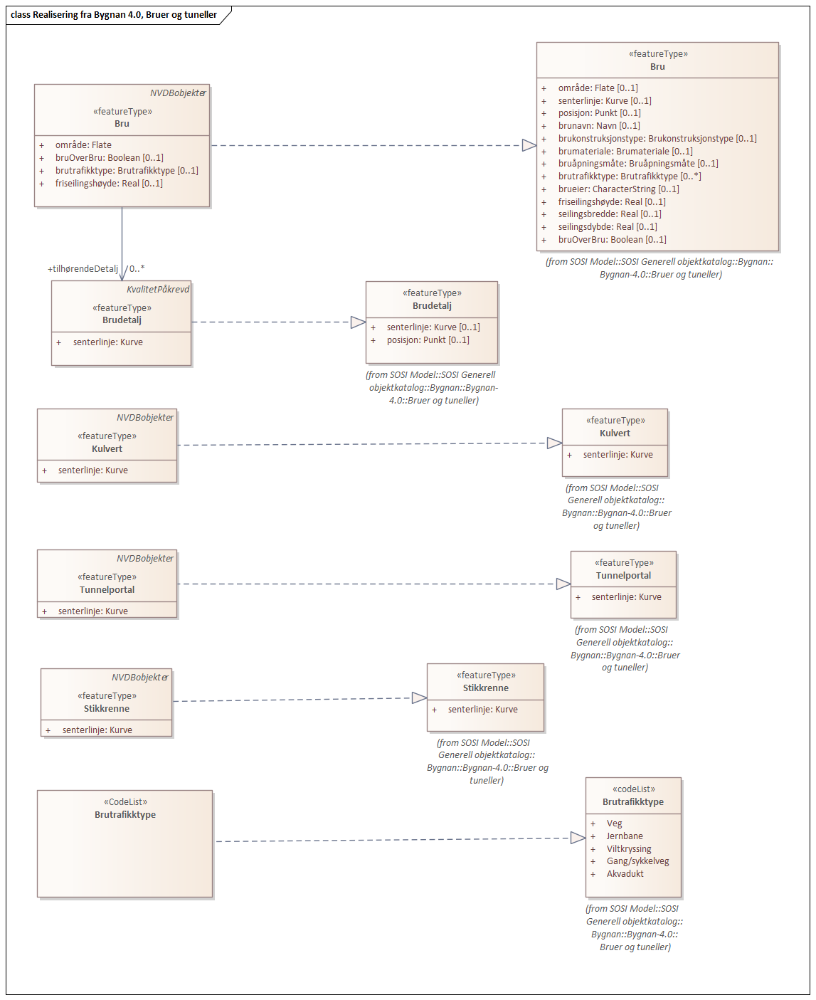
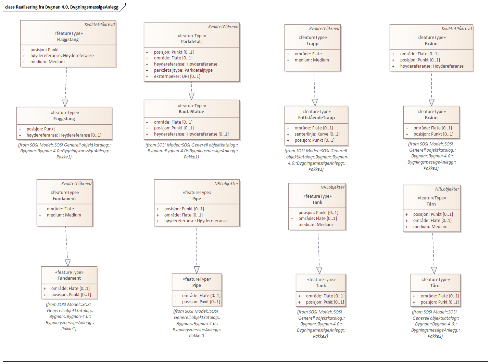
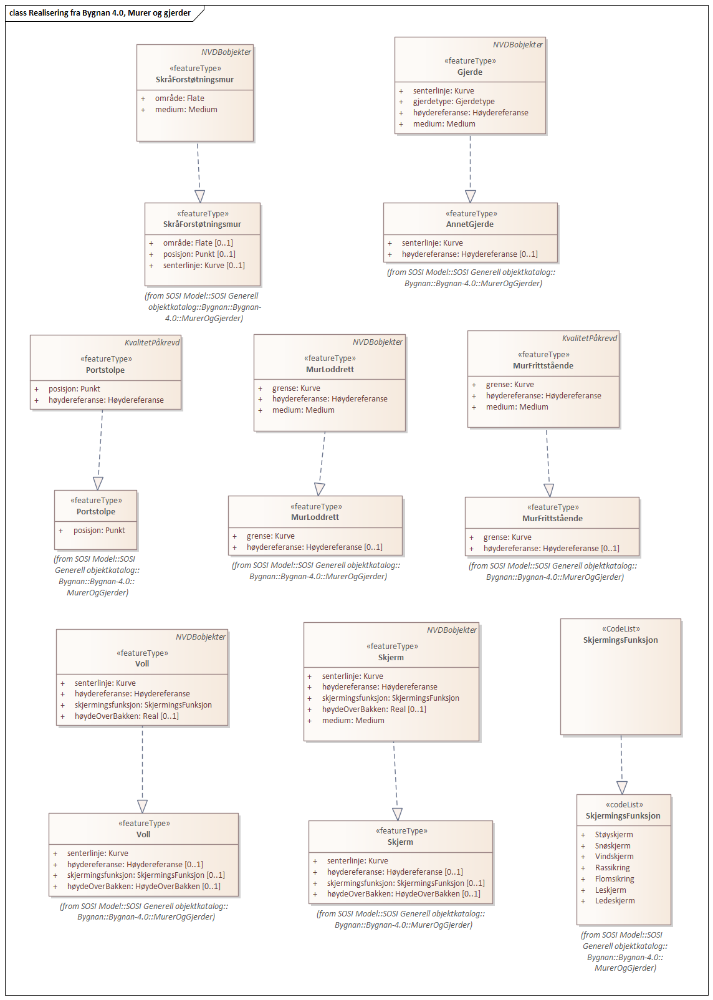
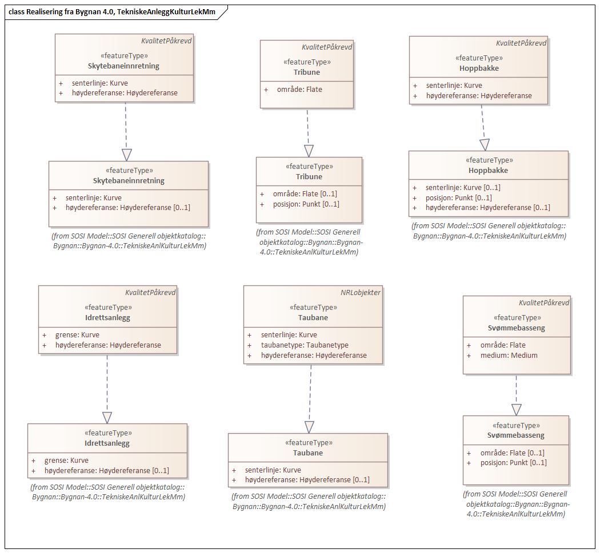
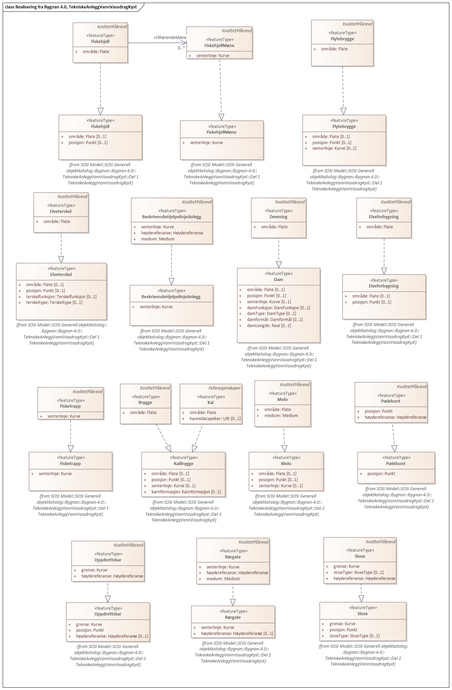

=== Pakke «ApplicationSchema» FKB-BygnAnlegg-5.0-Utkast
*Definisjon:* Datamodell for produktspesifikasjonen FKB-BygnAnelgg. FKB-BygnAnlegg beskriver bygningsmessige anlegg som ikke er knyttet til bygninger eller veger. Dette inkluderer objekter som murer, gjerder, taubaner, kaier, moloer, tanker etc.
 
===== Profilparametre i tagged values
[cols="20,80"]
|===
|definition
|"FKB-BygnAnlegg contains construction objects that is not realated to roads and buildings"@en
 
|description
|"Contains for instance walls, fences, warfs, tanks, cable cars"@en
 
|designation
|"Product specification FKB-BygnAnlegg 5.0"@en
 
|language
|no
 
|SOSI_kortnavn
|FKB-BygnAnlegg
 
|SOSI_langnavn
|FKB Bygningsmessige anlegg
 
|SOSI_modellstatus
|utkast
 
|SOSI_versjon
|5.0
 
|targetNamespace
|http://skjema.geonorge.no/SOSI/produktspesifikasjon/FKB-BygnAnlegg/5.0/
 
|version
|5.0
 
|xmlns
|app
 
|xsdDocument
|FKB-BygnAnlegg50.xsd
 
|===
 
.Oversiktsdiagram FKB-BygnAnlegg 
image::diagrammer/Oversiktsdiagram FKB-BygnAnlegg.png[link=diagrammer/Oversiktsdiagram FKB-BygnAnlegg.png,"Diagramm: Oversiktsdiagram FKB-BygnAnlegg"]
 
.Pakkerealisering 
image::diagrammer/Pakkerealisering.png[link=diagrammer/Pakkerealisering.png,"Diagramm: Pakkerealisering"]
<<<
|===
|===
=== Pakke: Generelle elementer
*Definisjon:* pakke med elementer som realiserer tilsvarende elementer i FKB Generell del 5.0

Merknad:
Kopieres direkte inn i de enkelte FKB-datasettene
 
.Oversiktsdiagram Fellesegenskaper 
image::diagrammer/Oversiktsdiagram Fellesegenskaper.png[link=diagrammer/Oversiktsdiagram Fellesegenskaper.png,"Diagramm: Oversiktsdiagram Fellesegenskaper"]
 
.Realisering fra SOSI generell del 
image::diagrammer/Realisering fra SOSI generell del.png[link=diagrammer/Realisering fra SOSI generell del.png,"Diagramm: Realisering fra SOSI generell del"]
 
.Hoveddiagram Posisjonskvalitet 
image::diagrammer/Hoveddiagram Posisjonskvalitet.png[link=diagrammer/Hoveddiagram Posisjonskvalitet.png,"Diagramm: Hoveddiagram Posisjonskvalitet"]
 
|===
|===
 
[[fellesegenskaper]]
==== «FeatureType» Fellesegenskaper (abstrakt)
*Definisjon:* abstrakt objekttype som bærer sentrale egenskaper som er anbefalt for bruk i produktspesifikasjoner.

Merknad: Disse egenskapene skal derfor ikke modelleres inn i fagområdemodeller.
 
===== Egenskaper
[cols="20,80"]
|===
|*Navn:* 
|*identifikasjon*
 
|Definisjon: 
|unik identifikasjon av et objekt 

Merknad FKB:
Unik identifikasjon av et objekt, ivaretas av den ansvarlige produsent/forvalter, og som kan benyttes av eksterne applikasjoner som referanse til objektet.
Den unike identifikatoren er unik for kartobjektet og skal ikke endres i kartobjektets levetid. Dette m&#229; ikke forveksles med en tematisk identifikator (for eksempel bygningsnummer) som unikt identifiserer et objekt i virkeligheten. En bygning med samme bygningsnummer vil kunne representeres i mange kartprodukter der det finnes en unik identifikasjon i hver av dem.
For FKB benyttes UUID (Universally unique identifier) som lokalId. Dette inneb&#230;rer at lokalId alene alltid vil v&#230;re unik. Likevel skal alltid navnerom ogs&#229; angis. Navnerom angir FKB-datasettet.
 
|Multiplisitet: 
|[1..1]
 
|Type: 
|<<identifikasjon,«dataType» Identifikasjon>>
|Profilparametre i tagged values: 
|
SOSI_navn: IDENT + 
|===
[cols="20,80"]
|===
|*Navn:* 
|*oppdateringsdato*
 
|Definisjon: 
|tidspunkt for siste endring p&#229; objektet 

Merknad FKB: 

Denne datoen viser datasystemets siste endring p&#229; dataobjektet. Egenskapen settes av forvaltningssystemet etter f&#248;lgende regler:

i. Oppdateringsdato er tidspunkt for oppdatering av databasen og settes av forvaltningsbasen (ikke av klienten).

ii. Oppdateringsdato skal endres ogs&#229; hvis det er kopidata som blir endret eller importert i en ”kopibase”.

iii. N&#229;r avgrensingslinjene til en flate endres, skal flateobjektet f&#229; ny oppdateringsdato.

iv. Oppdateringsdato skal endres hvis en egenskap endres.
 
|Multiplisitet: 
|[1..1]
 
|Type: 
|http://skjema.geonorge.no/SOSI/basistype/DateTime[DateTime]
|Profilparametre i tagged values: 
|
SOSI_datatype: DATOTID + 
SOSI_navn: OPPDATERINGSDATO + 
|===
[cols="20,80"]
|===
|*Navn:* 
|*datafangstdato*
 
|Definisjon: 
|dato n&#229;r objektet siste gang ble registrert/observert/m&#229;lt i terrenget
 
|Multiplisitet: 
|[1..1]
 
|Type: 
|http://skjema.geonorge.no/SOSI/basistype/Date[Date]
|Profilparametre i tagged values: 
|
SOSI_datatype: DATO + 
SOSI_navn: DATAFANGSTDATO + 
|===
[cols="20,80"]
|===
|*Navn:* 
|*verifiseringsdato*
 
|Definisjon: 
|dato n&#229;r dataene er fastsl&#229;tt &#229; v&#230;re i samsvar med virkeligheten.

Merknad FKB:
Brukes for eksempel i de sammenhenger hvor det er foretatt fotogrammetrisk ajourhold, og hvor det ikke er registrert endringer p&#229; objektet (det virkelige objektet er i samsvar med dataobjektet)
 
|Multiplisitet: 
|[0..1]
 
|Type: 
|http://skjema.geonorge.no/SOSI/basistype/Date[Date]
|Profilparametre i tagged values: 
|
SOSI_datatype: DATO + 
SOSI_navn: VERIFISERINGSDATO + 
|===
[cols="20,80"]
|===
|*Navn:* 
|*registreringsversjon*
 
|Definisjon: 
|angivelse av hvilken produktspesifikasjon som er utgangspunkt  for dataene
 
|Multiplisitet: 
|[0..1]
 
|Type: 
|<<registreringsversjon,«CodeList» Registreringsversjon>>
|Profilparametre i tagged values: 
|
defaultCodeSpace: https://register.geonorge.no/sosi-kodelister/fkb/generell/5.0/registreringsversjon + 
SOSI_datatype: T + 
SOSI_lengde: 10 + 
SOSI_navn: REGISTRERINGSVERSJON + 
|===
[cols="20,80"]
|===
|*Navn:* 
|*informasjon*
 
|Definisjon: 
|generell opplysning.

Merknad FKB:
Mulighet til &#229; legge inn utfyllende informasjon om objektet. Egenskapen b&#248;r bare brukes til &#229; legge inn ekstra informasjon om enkeltobjekter. Egenskapen b&#248;r ikke brukes til &#229; systematisk angi ekstrainformasjon om mange/alle objekter i et datasett.
 
|Multiplisitet: 
|[0..1]
 
|Type: 
|http://skjema.geonorge.no/SOSI/basistype/CharacterString[CharacterString]
|Profilparametre i tagged values: 
|
SOSI_datatype: T + 
SOSI_lengde: 255 + 
SOSI_navn: INFORMASJON + 
|===
===== Arv og realiseringer
[cols="20,80"]
|===
|Subtyper:
|<<kai,«featureType» Kai>> +
<<kvalitetpåkrevd,«FeatureType» KvalitetPåkrevd>> +
<<fiktivavgrensningforanlegg,«featureType» FiktivAvgrensningForAnlegg>> +
|Realisering av: 
|«ApplicationSchema» FKB Generell del-5.0Utkast/Generelle elementer::«FeatureType» Fellesegenskaper +
«ApplicationSchema» Generelle typer 5.1/SOSI_Fellesegenskaper og SOSI_Objekt::«FeatureType» SOSI_Objekt +
 
|===
 
|===
|===
 
[[kvalitetpåkrevd]]
==== «FeatureType» KvalitetPåkrevd (abstrakt)
*Definisjon:* abstrakt objekttype med p&#229;krevet kvalitetsangivelse
 
===== Egenskaper
[cols="20,80"]
|===
|*Navn:* 
|*kvalitet*
 
|Definisjon: 
|beskrivelse av kvaliteten på stedfestingen

Merknad: Denne er identisk med ..KVALITET i tidligere versjoner av SOSI.
 
|Multiplisitet: 
|[1..1]
 
|Type: 
|<<posisjonskvalitet,«dataType» Posisjonskvalitet>>
|Profilparametre i tagged values: 
|
SOSI_navn: KVALITET + 
|===
===== Arv og realiseringer
[cols="20,80"]
|===
|Supertype: 
|<<fellesegenskaper,«FeatureType» Fellesegenskaper>>
 
|Subtyper:
|<<kaifront,«featureType» KaiFront>> +
<<elveterskel,«featureType» Elveterskel>> +
<<elveforbygning,«featureType» Elveforbygning>> +
<<tribune,«featureType» Tribune>> +
<<murfrittstående,«featureType» MurFrittstående>> +
<<skytebaneinnretning,«featureType» Skytebaneinnretning>> +
<<svømmebasseng,«featureType» Svømmebasseng>> +
<<fiskehjell,«featureType» Fiskehjell>> +
<<ruin,«featureType» Ruin>> +
<<portstolpe,«featureType» Portstolpe>> +
<<idrettsanlegg,«featureType» Idrettsanlegg>> +
<<pælebunt,«featureType» Pælebunt>> +
<<brygge,«featureType» Brygge>> +
<<flytebrygge,«featureType» Flytebrygge>> +
<<fisketrapp,«featureType» Fisketrapp>> +
<<fundament,«featureType» Fundament>> +
<<trapp,«featureType» Trapp>> +
<<hoppbakke,«featureType» Hoppbakke>> +
<<sluse,«featureType» Sluse>> +
<<brudetalj,«featureType» Brudetalj>> +
<<fiskehjellmøne,«featureType» FiskehjellMøne>> +
<<parkdetalj,«featureType» Parkdetalj>> +
<<brønn,«featureType» Brønn>> +
<<beskrivendehjelpelinjeanlegg,«featureType» BeskrivendeHjelpelinjeAnlegg>> +
<<molo,«featureType» Molo>> +
<<søppelbeholder,«featureType» Søppelbeholder>> +
<<oppdrettskar,«featureType» Oppdrettskar>> +
<<demning,«featureType» Demning>> +
<<rørgate,«featureType» Rørgate>> +
<<flaggstang,«featureType» Flaggstang>> +
<<flytebryggelandgang,«featureType» FlytebryggeLandgang>> +
<<nrlobjekter,«FeatureType» NRLobjekter>> +
<<nvdbobjekter,«FeatureType» NVDBobjekter>> +
|Realisering av: 
|«ApplicationSchema» Generelle typer 5.1/SOSI_Fellesegenskaper og SOSI_Objekt::«FeatureType» SOSI_Objekt +
«ApplicationSchema» FKB Generell del-5.0Utkast/Generelle elementer::«FeatureType» KvalitetPåkrevd +
 
|===
 
|===
|===
 
[[nrlobjekter]]
==== «FeatureType» NRLobjekter (abstrakt)
*Definisjon:* abstrakt objekttype som arves fra for objekter som har kobling til NRL
 
===== Egenskaper
[cols="20,80"]
|===
|*Navn:* 
|*nrlpeker*
 
|Definisjon: 
|peker til objekt i NRL
 
|Multiplisitet: 
|[0..1]
 
|Type: 
|http://skjema.geonorge.no/SOSI/basistype/URI[URI]
|Profilparametre i tagged values: 
|
SOSI_datatype: T + 
SOSI_lengde: 255 + 
SOSI_navn: NRLPEKER + 
|===
===== Arv og realiseringer
[cols="20,80"]
|===
|Supertype: 
|<<kvalitetpåkrevd,«FeatureType» KvalitetPåkrevd>>
 
|Subtyper:
|<<taubane,«featureType» Taubane>> +
<<pipe,«featureType» Pipe>> +
<<tårn,«featureType» Tårn>> +
<<tank,«featureType» Tank>> +
<<taubanemast,«FeatureType» Taubanemast>> +
|===
 
|===
|===
 
[[nvdbobjekter]]
==== «FeatureType» NVDBobjekter (abstrakt)
*Definisjon:* abstrakt objekttype som arves fra for objekter som har kobling til NVDB
 
===== Egenskaper
[cols="20,80"]
|===
|*Navn:* 
|*nvdbpeker*
 
|Definisjon: 
|peker til objekt i NVDB
 
|Multiplisitet: 
|[0..1]
 
|Type: 
|http://skjema.geonorge.no/SOSI/basistype/URI[URI]
|Profilparametre i tagged values: 
|
SOSI_datatype: T + 
SOSI_lengde: 255 + 
SOSI_navn: NVDBPEKER + 
|===
===== Arv og realiseringer
[cols="20,80"]
|===
|Supertype: 
|<<kvalitetpåkrevd,«FeatureType» KvalitetPåkrevd>>
 
|Subtyper:
|<<kulvert,«featureType» Kulvert>> +
<<skjerm,«featureType» Skjerm>> +
<<skråforstøtningsmur,«featureType» SkråForstøtningsmur>> +
<<bru,«featureType» Bru>> +
<<murloddrett,«featureType» MurLoddrett>> +
<<stikkrenne,«featureType» Stikkrenne>> +
<<voll,«featureType» Voll>> +
<<gjerde,«featureType» Gjerde>> +
<<tunnelportal,«featureType» Tunnelportal>> +
|===
 
|===
|===
 
[[identifikasjon]]
==== «dataType» Identifikasjon
*Definisjon:* Unik identifikasjon av et objekt i et datasett, forvaltet av den ansvarlige produsent/forvalter, og kan benyttes av eksterne applikasjoner som stabil referanse til objektet. 

Merknad 1: Denne objektidentifikasjonen må ikke forveksles med en tematisk objektidentifikasjon, slik som f.eks bygningsnummer. 

Merknad 2: Denne unike identifikatoren vil ikke endres i løpet av objektets levetid, og ikke gjenbrukes i andre objekt. 
 
===== Profilparametre i tagged values
[cols="20,80"]
|===
|SOSI_navn
|IDENT
 
|===
===== Egenskaper
[cols="20,80"]
|===
|*Navn:* 
|*lokalId*
 
|Definisjon: 
|lokal identifikator av et objekt

Merknad: Det er dataleverend&#248;rens ansvar &#229; s&#248;rge for at den lokale identifikatoren er unik innenfor navnerommet. For FKB-data benyttes UUID som lokalId.
 
|Multiplisitet: 
|[1..1]
 
|Type: 
|http://skjema.geonorge.no/SOSI/basistype/CharacterString[CharacterString]
|Profilparametre i tagged values: 
|
SOSI_datatype: T + 
SOSI_lengde: 100 + 
SOSI_navn: LOKALID + 
|===
[cols="20,80"]
|===
|*Navn:* 
|*navnerom*
 
|Definisjon: 
|navnerom som unikt identifiserer datakilden til et objekt, anbefales å være en http-URI

Eksempel: http://data.geonorge.no/SentraltStedsnavnsregister/1.0

Merknad : Verdien for nanverom vil eies av den dataprodusent som har ansvar for de unike identifikatorene og må være registrert i data.geonorge.no eller data.norge.no
 
|Multiplisitet: 
|[1..1]
 
|Type: 
|http://skjema.geonorge.no/SOSI/basistype/CharacterString[CharacterString]
|Profilparametre i tagged values: 
|
SOSI_datatype: T + 
SOSI_lengde: 100 + 
SOSI_navn: NAVNEROM + 
|===
[cols="20,80"]
|===
|*Navn:* 
|*versjonId*
 
|Definisjon: 
|identifikasjon av en spesiell versjon av et geografisk objekt (instans)
 
|Multiplisitet: 
|[0..1]
 
|Type: 
|http://skjema.geonorge.no/SOSI/basistype/CharacterString[CharacterString]
|Profilparametre i tagged values: 
|
SOSI_datatype: T + 
SOSI_lengde: 100 + 
SOSI_navn: VERSJONID + 
|===
===== Arv og realiseringer
[cols="20,80"]
|===
|Realisering av: 
|«ApplicationSchema» Generelle typer 5.1/SOSI_Fellesegenskaper og SOSI_Objekt::«dataType» Identifikasjon +
|===
 
|===
|===
 
[[posisjonskvalitet]]
==== «dataType» Posisjonskvalitet
*Definisjon:* beskrivelse av kvaliteten p&#229; stedfestingen.

Merknad:
Posisjonskvalitet er ikke konform med  kvalitetsmodellen i ISO slik den er defineret i ISO19157:2013, men er en videref&#248;ring av tildligere brukte kvalitetsegenskaper i SOSI. FKB 5.0 innf&#248;rer en egen variant av datatypen Posisjonskvalitet der kodeliste m&#229;lemetode er byttet ut med den mer generelle kodelista Datafangstmetode. 
 
===== Profilparametre i tagged values
[cols="20,80"]
|===
|SOSI_navn
|KVALITET
 
|===
===== Egenskaper
[cols="20,80"]
|===
|*Navn:* 
|*datafangstmetode*
 
|Definisjon: 
|metode for datafangst. 
Egenskapen beskriver datafangstmetode for grunnrisskoordinater (x,y), eller for b&#229;de grunnriss og h&#248;yde (x,y,z) dersom det ikke er oppgitt noen verdi for datafangstmetodeH&#248;yde.
 
|Multiplisitet: 
|[1..1]
 
|Type: 
|<<datafangstmetode,«CodeList» Datafangstmetode>>
|Profilparametre i tagged values: 
|
defaultCodeSpace: https://register.geonorge.no/sosi-kodelister/fkb/generell/5.0/datafangstmetode + 
SOSI_datatype: T + 
SOSI_lengde: 3 + 
SOSI_navn: DATAFANGSTMETODE + 
|===
[cols="20,80"]
|===
|*Navn:* 
|*nøyaktighet*
 
|Definisjon: 
|standardavviket til posisjoneringa av objektet oppgitt i cm

I de aller fleste sammenhenger benyttes en ansl&#229;tt eller forventet verdi for standardavvik, men dersom man har en beregnet verdi skal denne benyttes. 

For objekter med punktgeometri benyttes verdi for punktstandardavvik. For objekter med kurvegeometri benyttes standardavviket for tverravviket fra kurva. For objekter med overflate- eller volumgeometri er forst&#229;elsen at standardavviket beregnes ut fra (3D) avvikene mellom sann posisjon og n&#230;rmeste punkt p&#229; overflata. 

Merknad:
Verdien er ment &#229; beskrive n&#248;yaktigheten til objektet sammenlignet med sann verdi. Standardavvik er i utgangspunktet et m&#229;l p&#229; det tilfeldige avviket og det inneb&#230;rer at vi forutsetter at det systematiske avviket i liten grad p&#229;virker n&#248;yaktigheten til posisjoneringa. For fotogrammetriske data settes som hovedregel verdien lik kravet til standardavvik ved datafangst. Se standarden Geodatakvalitet for n&#230;rmere definisjon av standardavvik og hvordan dette defineres, beregnes og kontrolleres.

 
|Multiplisitet: 
|[0..1]
 
|Type: 
|http://skjema.geonorge.no/SOSI/basistype/Integer[Integer]
|Profilparametre i tagged values: 
|
SOSI_datatype: H + 
SOSI_lengde: 6 + 
SOSI_navn: NØYAKTIGHET + 
|===
[cols="20,80"]
|===
|*Navn:* 
|*synbarhet*
 
|Definisjon: 
|beskrivelse av hvor godt objektene framg&#229;r i datagrunnlaget for posisjonering (f.eks. flybildene).
 
|Multiplisitet: 
|[0..1]
 
|Type: 
|<<synbarhet,«CodeList» Synbarhet>>
|Profilparametre i tagged values: 
|
defaultCodeSpace: https://register.geonorge.no/sosi-kodelister/fkb/generell/5.0/synbarhet + 
SOSI_datatype: T + 
SOSI_lengde: 1 + 
SOSI_navn: SYNBARHET + 
|===
[cols="20,80"]
|===
|*Navn:* 
|*datafangstmetodeHøyde*
 
|Definisjon: 
|metoden brukt for h&#248;yderegistrering av posisjon.

Det er bare n&#248;dvending &#229; angi en verdi for egenskapen dersom datafangstmetode for h&#248;yde avviker fra datafangstmetode for grunnriss.

 
|Multiplisitet: 
|[0..1]
 
|Type: 
|<<datafangstmetode,«CodeList» Datafangstmetode>>
|Profilparametre i tagged values: 
|
defaultCodeSpace: https://register.geonorge.no/sosi-kodelister/fkb/generell/5.0/datafangstmetode + 
SOSI_datatype: T + 
SOSI_lengde: 3 + 
SOSI_navn: DATAFANGSTMETODEHØYDE + 
|===
[cols="20,80"]
|===
|*Navn:* 
|*nøyaktighetHøyde*
 
|Definisjon: 
|standardavviket til posisjoneringa av objektet oppgitt i cm

I de aller fleste sammenhenger benyttes en ansl&#229;tt eller forventet verdi for standardavviket, men dersom man faktisk har standardavviket til posisjoneringa av objektet oppgitt i cm

I de aller fleste sammenhenger benyttes en ansl&#229;tt eller forventet verdi for standardavvik, men dersom man har en beregnet verdi skal denne benyttes. 

Merknad:
Verdien er ment &#229; beskrive n&#248;yaktigheten til objektet sammenlignet med sann verdi. Standardavvik er i utgangspunktet et m&#229;l p&#229; det tilfeldige avviket og det inneb&#230;rer at vi forutsetter at det systematiske avviket i liten grad p&#229;virker n&#248;yaktigheten til posisjoneringa. For fotogrammetriske data settes som hovedregel verdien lik kravet til standardavvik ved datafangst. Se standarden Geodatakvalitet for n&#230;rmere definisjon av standardavvik og hvordan dette defineres, beregnes og kontrolleres.
 
|Multiplisitet: 
|[0..1]
 
|Type: 
|http://skjema.geonorge.no/SOSI/basistype/Integer[Integer]
|Profilparametre i tagged values: 
|
SOSI_datatype: H + 
SOSI_lengde: 6 + 
SOSI_navn: H-NØYAKTIGHET + 
|===
===== Restriksjoner
[cols="20,80"]
|===
|*Navn:* 
|*Datafangstmetode Digitalisert skal ikke brukes på egenskapen datafangstmetodeHøyde*
 
|Beskrivelse: 
|inv: self.datafangstmetodeH&#248;yde &lt;&gt; 'dig'
 
|===
===== Arv og realiseringer
[cols="20,80"]
|===
|Realisering av: 
|«ApplicationSchema» Generelle typer 5.1/SOSI_Fellesegenskaper og SOSI_Objekt::«dataType» Posisjonskvalitet +
|===
 
|===
|===
 
[[synbarhet]]
==== «CodeList» Synbarhet
*Definisjon:* synbarhet beskriver hvor godt objektene framg&#229;r i datagrunnlaget for posisjonering (f.eks. flybildene).
 
===== Profilparametre i tagged values
[cols="20,80"]
|===
|asDictionary
|true
 
|codeList
|https://register.geonorge.no/sosi-kodelister/fkb/generell/5.0/synbarhet
 
|SOSI_datatype
|H
 
|SOSI_lengde
|1
 
|SOSI_navn
|SYNBARHET
 
|===
Koder fra ekstern kodeliste kan hentes fra register: https://register.geonorge.no/sosi-kodelister/fkb/generell/5.0/synbarhet
 
 
|===
|===
 
[[datafangstmetode]]
==== «CodeList» Datafangstmetode
*Definisjon:* metode for datafangst. 

Datafangstmetoden beskriver hvordan selve vektordataene er posisjonert fra et datagrunnlag (observasjoner med landm&#229;lingsutstyr, fotogrammetrisk stereomodell, digital terrengmodell etc.) og ikke prosessen med &#229; innhente det bakenforliggende datagrunnlaget.
 
===== Profilparametre i tagged values
[cols="20,80"]
|===
|asDictionary
|true
 
|codeList
|https://register.geonorge.no/sosi-kodelister/fkb/generell/5.0/datafangstmetode
 
|SOSI_datatype
|T
 
|SOSI_lengde
|3
 
|SOSI_navn
|DATAFANGSTMETODE
 
|===
Koder fra ekstern kodeliste kan hentes fra register: https://register.geonorge.no/sosi-kodelister/fkb/generell/5.0/datafangstmetode
 
 
|===
|===
 
[[registreringsversjon]]
==== «CodeList» Registreringsversjon
*Definisjon:* FKB-verjson som ligger til grunn for registrering. Mest relevant for data som er fotogrammetrisk registrert.
 
===== Profilparametre i tagged values
[cols="20,80"]
|===
|asDictionary
|true
 
|codeList
|https://register.geonorge.no/sosi-kodelister/fkb/generell/5.0/registreringsversjon
 
|SOSI_datatype
|T
 
|SOSI_lengde
|10
 
|SOSI_navn
|REGISTRERINGSVERSJON
 
|===
Koder fra ekstern kodeliste kan hentes fra register: https://register.geonorge.no/sosi-kodelister/fkb/generell/5.0/registreringsversjon
 
 
|===
|===
 
[[høydereferanse]]
==== «CodeList» Høydereferanse
*Definisjon:* koordinatregistering utf&#248;rt p&#229; topp eller bunn av et objekt
 
===== Profilparametre i tagged values
[cols="20,80"]
|===
|asDictionary
|true
 
|codeList
|https://register.geonorge.no/sosi-kodelister/fkb/generell/5.0/hoydereferanse
 
|SOSI_datatype
|T
 
|SOSI_lengde
|6
 
|SOSI_navn
|HREF
 
|===
Koder fra ekstern kodeliste kan hentes fra register: https://register.geonorge.no/sosi-kodelister/fkb/generell/5.0/hoydereferanse
 
 
|===
|===
 
[[medium]]
==== «CodeList» Medium
*Definisjon:* objektets beliggenhet i forhold til jordoverflaten

Eksempel:
Veg p&#229; bro, i tunnel, inne i et bygningsmessig anlegg, etc.
 
===== Profilparametre i tagged values
[cols="20,80"]
|===
|asDictionary
|true
 
|codeList
|https://register.geonorge.no/sosi-kodelister/fkb/generell/5.0/medium
 
|SOSI_datatype
|T
 
|SOSI_lengde
|1
 
|SOSI_navn
|MEDIUM
 
|===
Koder fra ekstern kodeliste kan hentes fra register: https://register.geonorge.no/sosi-kodelister/fkb/generell/5.0/medium
 
<<<
|===
|===
=== Pakke: BruerOgTuneller
*Definisjon:* Inneholder elementer fra SOSI Bygnan 4.0, Bruer og tuneller
 
.Oversiktsdiagram Bruer og tuneller 
image::diagrammer/Oversiktsdiagram Bruer og tuneller.png[link=diagrammer/Oversiktsdiagram Bruer og tuneller.png,"Diagramm: Oversiktsdiagram Bruer og tuneller"]
 
.Realisering fra Bygnan 4.0, Bruer og tuneller 

 
.Hoveddiagram Bruer og tuneller - objekttyper og kodelister 
image::diagrammer/Hoveddiagram Bruer og tuneller - objekttyper og kodelister.png[link=diagrammer/Hoveddiagram Bruer og tuneller - objekttyper og kodelister.png,"Diagramm: Hoveddiagram Bruer og tuneller - objekttyper og kodelister"]
 
|===
|===
 
[[bru]]
==== «featureType» Bru
*Definisjon:* konstruksjon for kryssing av vanskelig farbart område
Merknad: Med vanskelig farbart område menes en elv, et juv eller andre naturlige hindringer, samt kryssende infrastruktur.
 
.Illustrasjon av objekttype Bru
image::http://skjema.geonorge.no/SOSI/produktspesifikasjon/FKB-BygnAnlegg/5.0/figurer/objtype_bru.png[link=http://skjema.geonorge.no/SOSI/produktspesifikasjon/FKB-BygnAnlegg/5.0/figurer/objtype_bru.png,"Illustrasjon av objekttype: Bru"]
===== Egenskaper
[cols="20,80"]
|===
|*Navn:* 
|*område*
 
|Definisjon: 
|objektets utstrekning
 
|Multiplisitet: 
|[1..1]
 
|Type: 
|<<flate,Flate>>
|===
[cols="20,80"]
|===
|*Navn:* 
|*bruOverBru*
 
|Definisjon: 
|angivelse av om brue ligger over en eller flere andre bruer
 
|Multiplisitet: 
|[0..1]
 
|Type: 
|http://skjema.geonorge.no/SOSI/basistype/Boolean[Boolean]
|Profilparametre i tagged values: 
|
SOSI_datatype: BOOLSK + 
SOSI_navn: BRUOVERBRU + 
|===
[cols="20,80"]
|===
|*Navn:* 
|*brutrafikktype*
 
|Definisjon: 
|type trafikk bruen brukes til
 
|Multiplisitet: 
|[0..1]
 
|Type: 
|<<brutrafikktype,«CodeList» Brutrafikktype>>
|Profilparametre i tagged values: 
|
defaultCodeSpace: https://register.geonorge.no/sosi-kodelister/fkb/bygnanlegg/5.0/brutrafikktype + 
SOSI_datatype: T + 
SOSI_lengde: 15 + 
SOSI_navn: BRUTRAFIKKTYPE + 
|===
[cols="20,80"]
|===
|*Navn:* 
|*friseilingshøyde*
 
|Definisjon: 
|friseilingsh&#248;yde angitt i meter. Angis kun for bruer over vann der friseilingsh&#248;yde er relevant.
 
|Multiplisitet: 
|[0..1]
 
|Type: 
|http://skjema.geonorge.no/SOSI/basistype/Real[Real]
|Profilparametre i tagged values: 
|
SOSI_datatype: D + 
SOSI_lengde: 10 + 
SOSI_navn: FRISEILINGSHØYDE + 
|===
===== Roller
[cols="20,80"]
|===
|*Rollenavn:* 
|*tilhørendeDetalj*
 
|Definisjon:
|viser hvilke brudetaljer som tilhører brua
 
|Multiplisitet: 
|[0..*]
 
|Til klasse
|<<brudetalj,«featureType» Brudetalj>>
|===
===== Arv og realiseringer
[cols="20,80"]
|===
|Supertype: 
|<<nvdbobjekter,«FeatureType» NVDBobjekter>>
 
|Realisering av: 
|«ApplicationSchema» Bygnan-4.0/Bruer og tuneller::«featureType» Bru +
|===
 
|===
|===
 
[[brudetalj]]
==== «featureType» Brudetalj
*Definisjon:* markante detaljer på bru som ikke registreres gjennom andre objekttyper
Eksempler:
-          Brutårn for hengebruer.
-          Bæreelement for brukonstruksjon.
 
.Illustrasjon av objekttype Brudetalj
image::http://skjema.geonorge.no/SOSI/produktspesifikasjon/FKB-BygnAnlegg/5.0/figurer/objtype_brudetalj.png[link=http://skjema.geonorge.no/SOSI/produktspesifikasjon/FKB-BygnAnlegg/5.0/figurer/objtype_brudetalj.png,"Illustrasjon av objekttype: Brudetalj"]
===== Egenskaper
[cols="20,80"]
|===
|*Navn:* 
|*senterlinje*
 
|Definisjon: 
|forløp som følger objektets sentrale del
 
|Multiplisitet: 
|[1..1]
 
|Type: 
|<<kurve,Kurve>>
|===
===== Arv og realiseringer
[cols="20,80"]
|===
|Supertype: 
|<<kvalitetpåkrevd,«FeatureType» KvalitetPåkrevd>>
 
|Realisering av: 
|«ApplicationSchema» Bygnan-4.0/Bruer og tuneller::«featureType» Brudetalj +
|===
 
|===
|===
 
[[kulvert]]
==== «featureType» Kulvert
*Definisjon:* gjennomløp på tvers av veg-eller jernbane med overliggende fylling og 1m &lt; lysåpning &lt; 2,5m
 
.Illustrasjon av objekttype Kulvert
image::http://skjema.geonorge.no/SOSI/produktspesifikasjon/FKB-BygnAnlegg/5.0/figurer/objtype_kulvert.png[link=http://skjema.geonorge.no/SOSI/produktspesifikasjon/FKB-BygnAnlegg/5.0/figurer/objtype_kulvert.png,"Illustrasjon av objekttype: Kulvert"]
===== Egenskaper
[cols="20,80"]
|===
|*Navn:* 
|*senterlinje*
 
|Definisjon: 
|forløp som følger objektets sentrale del
 
|Multiplisitet: 
|[1..1]
 
|Type: 
|<<kurve,Kurve>>
|===
===== Arv og realiseringer
[cols="20,80"]
|===
|Supertype: 
|<<nvdbobjekter,«FeatureType» NVDBobjekter>>
 
|Realisering av: 
|«ApplicationSchema» Bygnan-4.0/Bruer og tuneller::«featureType» Kulvert +
|===
 
|===
|===
 
[[stikkrenne]]
==== «featureType» Stikkrenne
*Definisjon:* gjennomløp på tvers av veg-eller jernbane med overliggende fylling og 1m &gt; lysåpning
 
.Illustrasjon av objekttype Stikkrenne
image::http://skjema.geonorge.no/SOSI/produktspesifikasjon/FKB-BygnAnlegg/5.0/figurer/objtype_stikkrenne.png[link=http://skjema.geonorge.no/SOSI/produktspesifikasjon/FKB-BygnAnlegg/5.0/figurer/objtype_stikkrenne.png,"Illustrasjon av objekttype: Stikkrenne"]
===== Egenskaper
[cols="20,80"]
|===
|*Navn:* 
|*senterlinje*
 
|Definisjon: 
|forløp som følger objektets sentrale del
 
|Multiplisitet: 
|[1..1]
 
|Type: 
|<<kurve,Kurve>>
|===
===== Arv og realiseringer
[cols="20,80"]
|===
|Supertype: 
|<<nvdbobjekter,«FeatureType» NVDBobjekter>>
 
|Realisering av: 
|«ApplicationSchema» Bygnan-4.0/Bruer og tuneller::«featureType» Stikkrenne +
|===
 
|===
|===
 
[[tunnelportal]]
==== «featureType» Tunnelportal
*Definisjon:* spesielt byggverk som sammenbinder tunnel og åpen veg
 
.Illustrasjon av objekttype Tunnelportal
image::http://skjema.geonorge.no/SOSI/produktspesifikasjon/FKB-BygnAnlegg/5.0/figurer/objtype_tunnelportal.png[link=http://skjema.geonorge.no/SOSI/produktspesifikasjon/FKB-BygnAnlegg/5.0/figurer/objtype_tunnelportal.png,"Illustrasjon av objekttype: Tunnelportal"]
===== Egenskaper
[cols="20,80"]
|===
|*Navn:* 
|*senterlinje*
 
|Definisjon: 
|forløp som følger objektets sentrale del
 
|Multiplisitet: 
|[1..1]
 
|Type: 
|<<kurve,Kurve>>
|Profilparametre i tagged values: 
|
SOSI_melding: Fant ikke denne i SOSI_db + 
|===
===== Arv og realiseringer
[cols="20,80"]
|===
|Supertype: 
|<<nvdbobjekter,«FeatureType» NVDBobjekter>>
 
|Realisering av: 
|«ApplicationSchema» Bygnan-4.0/Bruer og tuneller::«featureType» Tunnelportal +
|===
 
|===
|===
 
[[brutrafikktype]]
==== «CodeList» Brutrafikktype
*Definisjon:* ulike former for trafikk en bru er bygget for
 
===== Profilparametre i tagged values
[cols="20,80"]
|===
|asDictionary
|true
 
|codeList
|https://register.geonorge.no/sosi-kodelister/fkb/bygnanlegg/5.0/brutrafikktype
 
|SOSI_datatype
|T
 
|SOSI_lengde
|15
 
|SOSI_navn
|BRUTRAFIKKTYPE
 
|===
Koder fra ekstern kodeliste kan hentes fra register: https://register.geonorge.no/sosi-kodelister/fkb/bygnanlegg/5.0/brutrafikktype
 
<<<
|===
|===
=== Pakke: BygningsmessigeAnlegg
*Definisjon:* Inneholder elementer fra SOSI Bygnan 4.0, BygningsmessigeAnlegg
 
.Oversiktsdiagram Bygningsmessige anlegg 
image::diagrammer/Oversiktsdiagram Bygningsmessige anlegg.png[link=diagrammer/Oversiktsdiagram Bygningsmessige anlegg.png,"Diagramm: Oversiktsdiagram Bygningsmessige anlegg"]
 
.Realisering fra Bygnan 4.0, BygningsmessigeAnlegg 

 
.Hoveddiagram Bygningsmessige anlegg - objekttyper og kodelister 
image::diagrammer/Hoveddiagram Bygningsmessige anlegg - objekttyper og kodelister.png[link=diagrammer/Hoveddiagram Bygningsmessige anlegg - objekttyper og kodelister.png,"Diagramm: Hoveddiagram Bygningsmessige anlegg - objekttyper og kodelister"]
 
|===
|===
 
[[brønn]]
==== «featureType» Brønn
*Definisjon:* lite bygningsmessig anlegg for uttak av ferskvann
 
.Illustrasjon av objekttype Brønn
image::http://skjema.geonorge.no/SOSI/produktspesifikasjon/FKB-BygnAnlegg/5.0/figurer/objtype_bronn.png[link=http://skjema.geonorge.no/SOSI/produktspesifikasjon/FKB-BygnAnlegg/5.0/figurer/objtype_bronn.png,"Illustrasjon av objekttype: Brønn"]
===== Egenskaper
[cols="20,80"]
|===
|*Navn:* 
|*område*
 
|Definisjon: 
|objektets utstrekning
 
|Multiplisitet: 
|[0..1]
 
|Type: 
|<<flate,Flate>>
|===
[cols="20,80"]
|===
|*Navn:* 
|*posisjon*
 
|Definisjon: 
|sted som objektet eksisterer på
 
|Multiplisitet: 
|[0..1]
 
|Type: 
|<<punkt,Punkt>>
|===
[cols="20,80"]
|===
|*Navn:* 
|*høydereferanse*
 
|Definisjon: 
|koordinatregistering utført på topp eller bunn av et objekt
 
|Multiplisitet: 
|[1..1]
 
|Type: 
|<<høydereferanse,«CodeList» Høydereferanse>>
|Profilparametre i tagged values: 
|
defaultCodeSpace: https://register.geonorge.no/sosi-kodelister/fkb/generell/5.0/hoydereferanse + 
SOSI_datatype: T + 
SOSI_lengde: 6 + 
SOSI_navn: HREF + 
|===
===== Restriksjoner
[cols="20,80"]
|===
|*Navn:* 
|*Skal ha enten punkt- eller flategeometri*
 
|Beskrivelse: 
|inv: (self.omr&#229;de -&gt; size()) + (self.posisjon -&gt; size()) = 1

 
|===
===== Arv og realiseringer
[cols="20,80"]
|===
|Supertype: 
|<<kvalitetpåkrevd,«FeatureType» KvalitetPåkrevd>>
 
|Realisering av: 
|«ApplicationSchema» Bygnan-4.0/BygningsmessigeAnlegg/Pakke1::«featureType» Brønn +
|===
 
|===
|===
 
[[flaggstang]]
==== «featureType» Flaggstang
*Definisjon:* lang rett stang for heising av flagg
 
.Illustrasjon av objekttype Flaggstang
image::http://skjema.geonorge.no/SOSI/produktspesifikasjon/FKB-BygnAnlegg/5.0/figurer/objtype_flaggstang.png[link=http://skjema.geonorge.no/SOSI/produktspesifikasjon/FKB-BygnAnlegg/5.0/figurer/objtype_flaggstang.png,"Illustrasjon av objekttype: Flaggstang"]
===== Egenskaper
[cols="20,80"]
|===
|*Navn:* 
|*posisjon*
 
|Definisjon: 
|sted som objektet eksisterer på
 
|Multiplisitet: 
|[1..1]
 
|Type: 
|<<punkt,Punkt>>
|===
[cols="20,80"]
|===
|*Navn:* 
|*høydereferanse*
 
|Definisjon: 
|angivelse av om registreringen er utført på topp eller bunn av et element- f.eks. en skråning- mur osv.
 
|Multiplisitet: 
|[1..1]
 
|Type: 
|<<høydereferanse,«CodeList» Høydereferanse>>
|Profilparametre i tagged values: 
|
defaultCodeSpace: https://register.geonorge.no/sosi-kodelister/fkb/generell/5.0/hoydereferanse + 
SOSI_datatype: T + 
SOSI_lengde: 6 + 
SOSI_navn: HREF + 
|===
[cols="20,80"]
|===
|*Navn:* 
|*medium*
 
|Definisjon: 
|objektets beliggenhet i forhold til jordoverflaten
 
|Multiplisitet: 
|[1..1]
 
|Type: 
|<<medium,«CodeList» Medium>>
|Profilparametre i tagged values: 
|
defaultCodeSpace: https://register.geonorge.no/sosi-kodelister/fkb/generell/5.0/medium + 
SOSI_datatype: T + 
SOSI_lengde: 1 + 
SOSI_navn: MEDIUM + 
|===
===== Arv og realiseringer
[cols="20,80"]
|===
|Supertype: 
|<<kvalitetpåkrevd,«FeatureType» KvalitetPåkrevd>>
 
|Realisering av: 
|«ApplicationSchema» Bygnan-4.0/BygningsmessigeAnlegg/Pakke1::«featureType» Flaggstang +
|===
 
|===
|===
 
[[fundament]]
==== «featureType» Fundament
*Definisjon:* støpt underlag for frittstående konstruksjoner 
Merknad: Selve konstruksjonen oppå fundamentet og dens funksjon vil eventuelt  være beskrevet som en node i nettverket den er en del av.
Eksempel: Stolper og master
 
.Illustrasjon av objekttype Fundament
image::http://skjema.geonorge.no/SOSI/produktspesifikasjon/FKB-BygnAnlegg/5.0/figurer/objtype_fundament.png[link=http://skjema.geonorge.no/SOSI/produktspesifikasjon/FKB-BygnAnlegg/5.0/figurer/objtype_fundament.png,"Illustrasjon av objekttype: Fundament"]
===== Egenskaper
[cols="20,80"]
|===
|*Navn:* 
|*område*
 
|Definisjon: 
|objektets utstrekning
 
|Multiplisitet: 
|[1..1]
 
|Type: 
|<<flate,Flate>>
|===
[cols="20,80"]
|===
|*Navn:* 
|*medium*
 
|Definisjon: 
|objektets beliggenhet i forhold til jordoverflaten
 
|Multiplisitet: 
|[1..1]
 
|Type: 
|<<medium,«CodeList» Medium>>
|Profilparametre i tagged values: 
|
defaultCodeSpace: https://register.geonorge.no/sosi-kodelister/fkb/generell/5.0/medium + 
SOSI_datatype: T + 
SOSI_lengde: 1 + 
SOSI_navn: MEDIUM + 
|===
===== Arv og realiseringer
[cols="20,80"]
|===
|Supertype: 
|<<kvalitetpåkrevd,«FeatureType» KvalitetPåkrevd>>
 
|Realisering av: 
|«ApplicationSchema» Bygnan-4.0/BygningsmessigeAnlegg/Pakke1::«featureType» Fundament +
|===
 
|===
|===
 
[[pipe]]
==== «featureType» Pipe
*Definisjon:* frittstående rørformete innretninger for transport av avgasser
 
.Illustrasjon av objekttype Pipe
image::http://skjema.geonorge.no/SOSI/produktspesifikasjon/FKB-BygnAnlegg/5.0/figurer/objtype_pipe.png[link=http://skjema.geonorge.no/SOSI/produktspesifikasjon/FKB-BygnAnlegg/5.0/figurer/objtype_pipe.png,"Illustrasjon av objekttype: Pipe"]
===== Egenskaper
[cols="20,80"]
|===
|*Navn:* 
|*posisjon*
 
|Definisjon: 
|sted som objektet eksisterer på
 
|Multiplisitet: 
|[0..1]
 
|Type: 
|<<punkt,Punkt>>
|===
[cols="20,80"]
|===
|*Navn:* 
|*område*
 
|Definisjon: 
|objektets utstrekning
 
|Multiplisitet: 
|[0..1]
 
|Type: 
|<<flate,Flate>>
|===
[cols="20,80"]
|===
|*Navn:* 
|*høydereferanse*
 
|Definisjon: 
|koordinatregistering utført på topp eller bunn av et objekt
 
|Multiplisitet: 
|[1..1]
 
|Type: 
|<<høydereferanse,«CodeList» Høydereferanse>>
|Profilparametre i tagged values: 
|
defaultCodeSpace: https://register.geonorge.no/sosi-kodelister/fkb/generell/5.0/hoydereferanse + 
SOSI_datatype: T + 
SOSI_lengde: 6 + 
SOSI_navn: HREF + 
|===
===== Restriksjoner
[cols="20,80"]
|===
|*Navn:* 
|*Skal ha enten punkt- eller flategeometri*
 
|Beskrivelse: 
|inv: (self.omr&#229;de -&gt; size()) + (self.posisjon -&gt; size()) = 1
 
|===
===== Arv og realiseringer
[cols="20,80"]
|===
|Supertype: 
|<<nrlobjekter,«FeatureType» NRLobjekter>>
 
|Realisering av: 
|«ApplicationSchema» Bygnan-4.0/BygningsmessigeAnlegg/Pakke2::«featureType» Pipe +
|===
 
|===
|===
 
[[søppelbeholder]]
==== «featureType» Søppelbeholder
*Definisjon:* St&#248;rre tank eller annen type beholder for s&#248;ppel
 
.Illustrasjon av objekttype Søppelbeholder
image::http://skjema.geonorge.no/SOSI/produktspesifikasjon/FKB-BygnAnlegg/5.0/figurer/objtype_soppelbeholder.png[link=http://skjema.geonorge.no/SOSI/produktspesifikasjon/FKB-BygnAnlegg/5.0/figurer/objtype_soppelbeholder.png,"Illustrasjon av objekttype: Søppelbeholder"]
===== Egenskaper
[cols="20,80"]
|===
|*Navn:* 
|*posisjon*
 
|Definisjon: 
|sted som objektet eksisterer på
 
|Multiplisitet: 
|[0..1]
 
|Type: 
|<<punkt,Punkt>>
|===
[cols="20,80"]
|===
|*Navn:* 
|*område*
 
|Definisjon: 
|objektets utstrekning
 
|Multiplisitet: 
|[0..1]
 
|Type: 
|<<flate,Flate>>
|===
[cols="20,80"]
|===
|*Navn:* 
|*medium*
 
|Definisjon: 
|objektets beliggenhet i forhold til jordoverflaten
 
|Multiplisitet: 
|[1..1]
 
|Type: 
|<<medium,«CodeList» Medium>>
|Profilparametre i tagged values: 
|
defaultCodeSpace: https://register.geonorge.no/sosi-kodelister/fkb/generell/5.0/medium + 
SOSI_datatype: T + 
SOSI_lengde: 1 + 
SOSI_navn: MEDIUM + 
|===
[cols="20,80"]
|===
|*Navn:* 
|*høydereferanse*
 
|Definisjon: 
|angivelse av om registreringen er utf&#248;rt p&#229; topp eller bunn av et element
 
|Multiplisitet: 
|[1..1]
 
|Type: 
|<<høydereferanse,«CodeList» Høydereferanse>>
|Profilparametre i tagged values: 
|
defaultCodeSpace: https://register.geonorge.no/sosi-kodelister/fkb/generell/5.0/hoydereferanse + 
SOSI_datatype: T + 
SOSI_lengde: 6 + 
SOSI_navn: HREF + 
|===
[cols="20,80"]
|===
|*Navn:* 
|*eksternpeker*
 
|Definisjon: 
|referanse til objektet i et eksternt system, f.eks. hos ansvarlig renovasjonsselskap.
 
|Multiplisitet: 
|[1..1]
 
|Type: 
|http://skjema.geonorge.no/SOSI/basistype/URI[URI]
|Profilparametre i tagged values: 
|
SOSI_datatype: T + 
SOSI_lengde: 255 + 
SOSI_navn: EKSTERNPEKER + 
|===
===== Restriksjoner
[cols="20,80"]
|===
|*Navn:* 
|*Skal ha enten punkt- eller flategeometri*
 
|Beskrivelse: 
|inv: (self.omr&#229;de -&gt; size()) + (self.posisjon -&gt; size()) = 1
 
|===
===== Arv og realiseringer
[cols="20,80"]
|===
|Supertype: 
|<<kvalitetpåkrevd,«FeatureType» KvalitetPåkrevd>>
 
|===
 
|===
|===
 
[[tank]]
==== «featureType» Tank
*Definisjon:* lukkede kar for oppbevaring av gass eller væsker som ikke er registrert som bygning
 
.Illustrasjon av objekttype Tank
image::http://skjema.geonorge.no/SOSI/produktspesifikasjon/FKB-BygnAnlegg/5.0/figurer/objtype_tank.png[link=http://skjema.geonorge.no/SOSI/produktspesifikasjon/FKB-BygnAnlegg/5.0/figurer/objtype_tank.png,"Illustrasjon av objekttype: Tank"]
===== Egenskaper
[cols="20,80"]
|===
|*Navn:* 
|*posisjon*
 
|Definisjon: 
|sted som objektet eksisterer på
 
|Multiplisitet: 
|[0..1]
 
|Type: 
|<<punkt,Punkt>>
|===
[cols="20,80"]
|===
|*Navn:* 
|*område*
 
|Definisjon: 
|objektets utstrekning
 
|Multiplisitet: 
|[0..1]
 
|Type: 
|<<flate,Flate>>
|===
[cols="20,80"]
|===
|*Navn:* 
|*medium*
 
|Definisjon: 
|objektets beliggenhet i forhold til jordoverflaten
 
|Multiplisitet: 
|[1..1]
 
|Type: 
|<<medium,«CodeList» Medium>>
|Profilparametre i tagged values: 
|
defaultCodeSpace: https://register.geonorge.no/sosi-kodelister/fkb/generell/5.0/medium + 
SOSI_datatype: T + 
SOSI_lengde: 1 + 
SOSI_navn: MEDIUM + 
|===
===== Restriksjoner
[cols="20,80"]
|===
|*Navn:* 
|*Skal ha enten punkt- eller flategeometri*
 
|Beskrivelse: 
|inv: (self.omr&#229;de -&gt; size()) + (self.posisjon -&gt; size()) = 1
 
|===
===== Arv og realiseringer
[cols="20,80"]
|===
|Supertype: 
|<<nrlobjekter,«FeatureType» NRLobjekter>>
 
|Realisering av: 
|«ApplicationSchema» Bygnan-4.0/BygningsmessigeAnlegg/Pakke2::«featureType» Tank +
|===
 
|===
|===
 
[[trapp]]
==== «featureType» Trapp
*Definisjon:* trapp som ikke st&#229;r i tilknytning til en bygning
 
.Illustrasjon av objekttype Trapp
image::http://skjema.geonorge.no/SOSI/produktspesifikasjon/FKB-BygnAnlegg/5.0/figurer/objtype_trapp.png[link=http://skjema.geonorge.no/SOSI/produktspesifikasjon/FKB-BygnAnlegg/5.0/figurer/objtype_trapp.png,"Illustrasjon av objekttype: Trapp"]
===== Egenskaper
[cols="20,80"]
|===
|*Navn:* 
|*område*
 
|Definisjon: 
|objektets utstrekning
 
|Multiplisitet: 
|[1..1]
 
|Type: 
|<<flate,Flate>>
|===
[cols="20,80"]
|===
|*Navn:* 
|*medium*
 
|Definisjon: 
|objektets beliggenhet i forhold til jordoverflaten
 
|Multiplisitet: 
|[1..1]
 
|Type: 
|<<medium,«CodeList» Medium>>
|Profilparametre i tagged values: 
|
defaultCodeSpace: https://register.geonorge.no/sosi-kodelister/fkb/generell/5.0/medium + 
SOSI_datatype: T + 
SOSI_lengde: 1 + 
SOSI_navn: MEDIUM + 
|===
===== Arv og realiseringer
[cols="20,80"]
|===
|Supertype: 
|<<kvalitetpåkrevd,«FeatureType» KvalitetPåkrevd>>
 
|Realisering av: 
|«ApplicationSchema» Bygnan-4.0/BygningsmessigeAnlegg/Pakke1::«featureType» FrittståendeTrapp +
|===
 
|===
|===
 
[[tårn]]
==== «featureType» Tårn
*Definisjon:* h&#248;y bygningsmessig konstruksjon hvor h&#248;yden er stor i forhold til bygningens areal i grunnplanet
Merknad: Omfatter alle t&#229;rn med unntak av de som er registrert i matrikkelen og de som har en mer spesifisert beskrivelse- som f.eks tank. 
Eksempel: M&#229;let&#229;rn og stupet&#229;rn
 
.Illustrasjon av objekttype Tårn
image::http://skjema.geonorge.no/SOSI/produktspesifikasjon/FKB-BygnAnlegg/5.0/figurer/objtype_tarn.png[link=http://skjema.geonorge.no/SOSI/produktspesifikasjon/FKB-BygnAnlegg/5.0/figurer/objtype_tarn.png,"Illustrasjon av objekttype: Tårn"]
===== Egenskaper
[cols="20,80"]
|===
|*Navn:* 
|*posisjon*
 
|Definisjon: 
|sted som objektet eksisterer på
 
|Multiplisitet: 
|[0..1]
 
|Type: 
|<<punkt,Punkt>>
|===
[cols="20,80"]
|===
|*Navn:* 
|*område*
 
|Definisjon: 
|objektets utstrekning
 
|Multiplisitet: 
|[0..1]
 
|Type: 
|<<flate,Flate>>
|===
[cols="20,80"]
|===
|*Navn:* 
|*medium*
 
|Definisjon: 
|objektets beliggenhet i forhold til jordoverflaten
 
|Multiplisitet: 
|[1..1]
 
|Type: 
|<<medium,«CodeList» Medium>>
|Profilparametre i tagged values: 
|
defaultCodeSpace: https://register.geonorge.no/sosi-kodelister/fkb/generell/5.0/medium + 
SOSI_datatype: T + 
SOSI_lengde: 1 + 
SOSI_navn: MEDIUM + 
|===
===== Restriksjoner
[cols="20,80"]
|===
|*Navn:* 
|*Skal ha enten punkt- eller flategeometri*
 
|Beskrivelse: 
|inv: (self.omr&#229;de -&gt; size()) + (self.posisjon -&gt; size()) = 1
 
|===
===== Arv og realiseringer
[cols="20,80"]
|===
|Supertype: 
|<<nrlobjekter,«FeatureType» NRLobjekter>>
 
|Realisering av: 
|«ApplicationSchema» Bygnan-4.0/BygningsmessigeAnlegg/Pakke2::«featureType» Tårn +
|===
 
|===
|===
 
[[parkdetalj]]
==== «featureType» Parkdetalj
*Definisjon:* detalj i parkmessig omr&#229;de

Merknad:
Omfatter detaljer som f.eks. bauter, statuer, fontener, basseng, lekeapparater og sandkasser. Registreres som punkt- eller flategeometri.
 
.Illustrasjon av objekttype Parkdetalj
image::http://skjema.geonorge.no/SOSI/produktspesifikasjon/FKB-BygnAnlegg/5.0/figurer/objtype_parkdetalj.png[link=http://skjema.geonorge.no/SOSI/produktspesifikasjon/FKB-BygnAnlegg/5.0/figurer/objtype_parkdetalj.png,"Illustrasjon av objekttype: Parkdetalj"]
===== Egenskaper
[cols="20,80"]
|===
|*Navn:* 
|*posisjon*
 
|Definisjon: 
|sted som objektet eksisterer på
 
|Multiplisitet: 
|[0..1]
 
|Type: 
|<<punkt,Punkt>>
|===
[cols="20,80"]
|===
|*Navn:* 
|*område*
 
|Definisjon: 
|objektets utstrekning
 
|Multiplisitet: 
|[0..1]
 
|Type: 
|<<flate,Flate>>
|===
[cols="20,80"]
|===
|*Navn:* 
|*høydereferanse*
 
|Definisjon: 
|angivelse av om registreringen er utført på topp eller bunn av et element- f.eks. en skråning- mur osv.
 
|Multiplisitet: 
|[1..1]
 
|Type: 
|<<høydereferanse,«CodeList» Høydereferanse>>
|Profilparametre i tagged values: 
|
defaultCodeSpace: https://register.geonorge.no/sosi-kodelister/fkb/generell/5.0/hoydereferanse + 
SOSI_datatype: T + 
SOSI_lengde: 6 + 
SOSI_navn: HREF + 
|===
[cols="20,80"]
|===
|*Navn:* 
|*parkdetaljtype*
 
|Definisjon: 
|angir type parkdetalj
 
|Multiplisitet: 
|[1..1]
 
|Type: 
|<<parkdetaljtype,«CodeList» Parkdetaljtype>>
|Profilparametre i tagged values: 
|
defaultCodeSpace: https://register.geonorge.no/sosi-kodelister/fkb/bygnanlegg/5.0/parkdetaljtype + 
SOSI_datatype: T + 
SOSI_lengde: 10 + 
SOSI_navn: PARKDETALJTYPE + 
|===
[cols="20,80"]
|===
|*Navn:* 
|*eksternpeker*
 
|Definisjon: 
|referanse til objektet i et eksternt system, f.eks. hos parkforvalter i kommunen.
 
|Multiplisitet: 
|[0..1]
 
|Type: 
|http://skjema.geonorge.no/SOSI/basistype/URI[URI]
|Profilparametre i tagged values: 
|
SOSI_datatype: T + 
SOSI_lengde: 255 + 
SOSI_navn: EKSTERNPEKER + 
|===
===== Restriksjoner
[cols="20,80"]
|===
|*Navn:* 
|*Skal ha enten punkt- eller flategeometri*
 
|Beskrivelse: 
|inv: (self.omr&#229;de -&gt; size()) + (self.posisjon -&gt; size()) = 1
 
|===
===== Arv og realiseringer
[cols="20,80"]
|===
|Supertype: 
|<<kvalitetpåkrevd,«FeatureType» KvalitetPåkrevd>>
 
|Realisering av: 
|«ApplicationSchema» Bygnan-4.0/BygningsmessigeAnlegg/Pakke1::«featureType» BautaStatue +
|===
 
|===
|===
 
[[parkdetaljtype]]
==== «CodeList» Parkdetaljtype
*Definisjon:* angir type parkdetalj
 
===== Profilparametre i tagged values
[cols="20,80"]
|===
|asDictionary
|true
 
|codeList
|https://register.geonorge.no/sosi-kodelister/fkb/bygnanlegg/5.0/parkdetaljtype
 
|SOSI_datatype
|T
 
|SOSI_lengde
|15
 
|SOSI_navn
|PARKDETALJTYPE
 
|===
Koder fra ekstern kodeliste kan hentes fra register: https://register.geonorge.no/sosi-kodelister/fkb/bygnanlegg/5.0/parkdetaljtype
 
<<<
|===
|===
=== Pakke: MurerOgGjerder
*Definisjon:* Inneholder elementer fra SOSI Bygnan 4.0, Murer og gjerder
 
.Oversiktsdiagram Murer og gjerder 
image::diagrammer/Oversiktsdiagram Murer og gjerder.png[link=diagrammer/Oversiktsdiagram Murer og gjerder.png,"Diagramm: Oversiktsdiagram Murer og gjerder"]
 
.Realisering fra Bygnan 4.0, Murer og gjerder 

 
.Hoveddiagram Murer og gjerder - objekttyper og kodelister 
image::diagrammer/Hoveddiagram Murer og gjerder - objekttyper og kodelister.png[link=diagrammer/Hoveddiagram Murer og gjerder - objekttyper og kodelister.png,"Diagramm: Hoveddiagram Murer og gjerder - objekttyper og kodelister"]
 
|===
|===
 
[[gjerde]]
==== «featureType» Gjerde
*Definisjon:* oppsatt stengsel som hindrer passering. St&#229;r ofte i grensa mellom eiendommer
 
.Illustrasjon av objekttype Gjerde
image::http://skjema.geonorge.no/SOSI/produktspesifikasjon/FKB-BygnAnlegg/5.0/figurer/objtype_gjerde.png[link=http://skjema.geonorge.no/SOSI/produktspesifikasjon/FKB-BygnAnlegg/5.0/figurer/objtype_gjerde.png,"Illustrasjon av objekttype: Gjerde"]
===== Egenskaper
[cols="20,80"]
|===
|*Navn:* 
|*senterlinje*
 
|Definisjon: 
|forløp som følger objektets sentrale del
 
|Multiplisitet: 
|[1..1]
 
|Type: 
|<<kurve,Kurve>>
|===
[cols="20,80"]
|===
|*Navn:* 
|*gjerdetype*
 
|Definisjon: 
|Type gjerde
 
|Multiplisitet: 
|[1..1]
 
|Type: 
|<<gjerdetype,«CodeList» Gjerdetype>>
|Profilparametre i tagged values: 
|
defaultCodeSpace: https://register.geonorge.no/sosi-kodelister/fkb/bygnanlegg/5.0/gjerdetype + 
SOSI_datatype: T + 
SOSI_lengde: 10 + 
SOSI_navn: GJERDETYPE + 
|===
[cols="20,80"]
|===
|*Navn:* 
|*høydereferanse*
 
|Definisjon: 
|angivelse av om registreringen er utført på topp eller bunn av et element- f.eks. en skråning- mur osv.
 
|Multiplisitet: 
|[1..1]
 
|Type: 
|<<høydereferanse,«CodeList» Høydereferanse>>
|Profilparametre i tagged values: 
|
defaultCodeSpace: https://register.geonorge.no/sosi-kodelister/fkb/generell/5.0/hoydereferanse + 
SOSI_datatype: T + 
SOSI_lengde: 6 + 
SOSI_navn: HREF + 
|===
[cols="20,80"]
|===
|*Navn:* 
|*medium*
 
|Definisjon: 
|objektets beliggenhet i forhold til jordoverflaten
 
|Multiplisitet: 
|[1..1]
 
|Type: 
|<<medium,«CodeList» Medium>>
|Profilparametre i tagged values: 
|
defaultCodeSpace: https://register.geonorge.no/sosi-kodelister/fkb/generell/5.0/medium + 
SOSI_datatype: T + 
SOSI_lengde: 1 + 
SOSI_navn: MEDIUM + 
|===
===== Arv og realiseringer
[cols="20,80"]
|===
|Supertype: 
|<<nvdbobjekter,«FeatureType» NVDBobjekter>>
 
|Realisering av: 
|«ApplicationSchema» Bygnan-4.0/MurerOgGjerder::«featureType» AnnetGjerde +
|===
 
|===
|===
 
[[murfrittstående]]
==== «featureType» MurFrittstående
*Definisjon:* mur hvor oppfyllingen på en side utgjør mindre enn halve høyden på den andre siden
 
.Illustrasjon av objekttype MurFrittstående
image::http://skjema.geonorge.no/SOSI/produktspesifikasjon/FKB-BygnAnlegg/5.0/figurer/objtype_murfrittstaende.png[link=http://skjema.geonorge.no/SOSI/produktspesifikasjon/FKB-BygnAnlegg/5.0/figurer/objtype_murfrittstaende.png,"Illustrasjon av objekttype: MurFrittstående"]
===== Egenskaper
[cols="20,80"]
|===
|*Navn:* 
|*grense*
 
|Definisjon: 
|forløp som følger overgang mellom ulike fenomener
 
|Multiplisitet: 
|[1..1]
 
|Type: 
|<<kurve,Kurve>>
|===
[cols="20,80"]
|===
|*Navn:* 
|*høydereferanse*
 
|Definisjon: 
|angivelse av om registreringen er utført på topp eller bunn av et element- f.eks. en skråning- mur osv.
 
|Multiplisitet: 
|[1..1]
 
|Type: 
|<<høydereferanse,«CodeList» Høydereferanse>>
|Profilparametre i tagged values: 
|
defaultCodeSpace: https://register.geonorge.no/sosi-kodelister/fkb/generell/5.0/hoydereferanse + 
SOSI_datatype: T + 
SOSI_lengde: 6 + 
SOSI_navn: HREF + 
|===
[cols="20,80"]
|===
|*Navn:* 
|*medium*
 
|Definisjon: 
|objektets beliggenhet i forhold til jordoverflaten
 
|Multiplisitet: 
|[1..1]
 
|Type: 
|<<medium,«CodeList» Medium>>
|Profilparametre i tagged values: 
|
defaultCodeSpace: https://register.geonorge.no/sosi-kodelister/fkb/generell/5.0/medium + 
SOSI_datatype: T + 
SOSI_lengde: 1 + 
SOSI_navn: MEDIUM + 
|===
===== Arv og realiseringer
[cols="20,80"]
|===
|Supertype: 
|<<kvalitetpåkrevd,«FeatureType» KvalitetPåkrevd>>
 
|Realisering av: 
|«ApplicationSchema» Bygnan-4.0/MurerOgGjerder::«featureType» MurFrittstående +
|===
 
|===
|===
 
[[murloddrett]]
==== «featureType» MurLoddrett
*Definisjon:* forst&#248;tningsmur hvor topp og bunn er ubetydelig forskj&#248;vet i  forhold til hverandre
 
.Illustrasjon av objekttype MurLoddrett
image::http://skjema.geonorge.no/SOSI/produktspesifikasjon/FKB-BygnAnlegg/5.0/figurer/objtype_murloddrett.png[link=http://skjema.geonorge.no/SOSI/produktspesifikasjon/FKB-BygnAnlegg/5.0/figurer/objtype_murloddrett.png,"Illustrasjon av objekttype: MurLoddrett"]
===== Egenskaper
[cols="20,80"]
|===
|*Navn:* 
|*grense*
 
|Definisjon: 
|forløp som følger overgang mellom ulike fenomener
 
|Multiplisitet: 
|[1..1]
 
|Type: 
|<<kurve,Kurve>>
|===
[cols="20,80"]
|===
|*Navn:* 
|*høydereferanse*
 
|Definisjon: 
|angivelse av om registreringen er utført på topp eller bunn av et element- f.eks. en skråning- mur osv.
 
|Multiplisitet: 
|[1..1]
 
|Type: 
|<<høydereferanse,«CodeList» Høydereferanse>>
|Profilparametre i tagged values: 
|
defaultCodeSpace: https://register.geonorge.no/sosi-kodelister/fkb/generell/5.0/hoydereferanse + 
SOSI_datatype: T + 
SOSI_lengde: 6 + 
SOSI_navn: HREF + 
|===
[cols="20,80"]
|===
|*Navn:* 
|*medium*
 
|Definisjon: 
|objektets beliggenhet i forhold til jordoverflaten
 
|Multiplisitet: 
|[1..1]
 
|Type: 
|<<medium,«CodeList» Medium>>
|Profilparametre i tagged values: 
|
defaultCodeSpace: https://register.geonorge.no/sosi-kodelister/fkb/generell/5.0/medium + 
SOSI_datatype: T + 
SOSI_lengde: 1 + 
SOSI_navn: MEDIUM + 
|===
===== Arv og realiseringer
[cols="20,80"]
|===
|Supertype: 
|<<nvdbobjekter,«FeatureType» NVDBobjekter>>
 
|Realisering av: 
|«ApplicationSchema» Bygnan-4.0/MurerOgGjerder::«featureType» MurLoddrett +
|===
 
|===
|===
 
[[ruin]]
==== «featureType» Ruin
*Definisjon:* Synlig mur som er rester etter tidligere byggverk
 
.Illustrasjon av objekttype Ruin
image::http://skjema.geonorge.no/SOSI/produktspesifikasjon/FKB-BygnAnlegg/5.0/figurer/objtype_ruin.png[link=http://skjema.geonorge.no/SOSI/produktspesifikasjon/FKB-BygnAnlegg/5.0/figurer/objtype_ruin.png,"Illustrasjon av objekttype: Ruin"]
===== Egenskaper
[cols="20,80"]
|===
|*Navn:* 
|*grense*
 
|Definisjon: 
|forløp som følger overgang mellom ulike fenomener
 
|Multiplisitet: 
|[1..1]
 
|Type: 
|<<kurve,Kurve>>
|===
[cols="20,80"]
|===
|*Navn:* 
|*høydereferanse*
 
|Definisjon: 
|angivelse av om registreringen er utført på topp eller bunn av et element- f.eks. en skråning- mur osv.
 
|Multiplisitet: 
|[1..1]
 
|Type: 
|<<høydereferanse,«CodeList» Høydereferanse>>
|Profilparametre i tagged values: 
|
defaultCodeSpace: https://register.geonorge.no/sosi-kodelister/fkb/generell/5.0/hoydereferanse + 
SOSI_datatype: T + 
SOSI_lengde: 6 + 
SOSI_navn: HREF + 
|===
[cols="20,80"]
|===
|*Navn:* 
|*medium*
 
|Definisjon: 
|objektets beliggenhet i forhold til jordoverflaten
 
|Multiplisitet: 
|[1..1]
 
|Type: 
|<<medium,«CodeList» Medium>>
|Profilparametre i tagged values: 
|
defaultCodeSpace: https://register.geonorge.no/sosi-kodelister/fkb/generell/5.0/medium + 
SOSI_datatype: T + 
SOSI_lengde: 1 + 
SOSI_navn: MEDIUM + 
|===
[cols="20,80"]
|===
|*Navn:* 
|*eksternpeker*
 
|Definisjon: 
|referanse til objektet i et eksternt system, f.eks. hos parkforvalter i kommunen.
 
|Multiplisitet: 
|[0..1]
 
|Type: 
|http://skjema.geonorge.no/SOSI/basistype/URI[URI]
|Profilparametre i tagged values: 
|
SOSI_datatype: T + 
SOSI_lengde: 255 + 
SOSI_navn: EKSTERNPEKER + 
|===
===== Arv og realiseringer
[cols="20,80"]
|===
|Supertype: 
|<<kvalitetpåkrevd,«FeatureType» KvalitetPåkrevd>>
 
|===
 
|===
|===
 
[[portstolpe]]
==== «featureType» Portstolpe
*Definisjon:* stolpe som en port kan være hengslet til
 
.Illustrasjon av objekttype Portstolpe
image::http://skjema.geonorge.no/SOSI/produktspesifikasjon/FKB-BygnAnlegg/5.0/figurer/objtype_portstolpe.png[link=http://skjema.geonorge.no/SOSI/produktspesifikasjon/FKB-BygnAnlegg/5.0/figurer/objtype_portstolpe.png,"Illustrasjon av objekttype: Portstolpe"]
===== Egenskaper
[cols="20,80"]
|===
|*Navn:* 
|*posisjon*
 
|Definisjon: 
|sted som objektet eksisterer på
 
|Multiplisitet: 
|[1..1]
 
|Type: 
|<<punkt,Punkt>>
|===
[cols="20,80"]
|===
|*Navn:* 
|*høydereferanse*
 
|Definisjon: 
|koordinatregistering utført på topp eller bunn av et objekt
 
|Multiplisitet: 
|[1..1]
 
|Type: 
|<<høydereferanse,«CodeList» Høydereferanse>>
|Profilparametre i tagged values: 
|
defaultCodeSpace: https://register.geonorge.no/sosi-kodelister/fkb/generell/5.0/hoydereferanse + 
SOSI_datatype: T + 
SOSI_lengde: 6 + 
SOSI_navn: HREF + 
|===
===== Arv og realiseringer
[cols="20,80"]
|===
|Supertype: 
|<<kvalitetpåkrevd,«FeatureType» KvalitetPåkrevd>>
 
|Realisering av: 
|«ApplicationSchema» Bygnan-4.0/MurerOgGjerder::«featureType» Portstolpe +
|===
 
|===
|===
 
[[skjerm]]
==== «featureType» Skjerm
*Definisjon:* frittstående konstruksjon som skal være et hinder for eksempel til støyutbredelse eller snøfokk
 
.Illustrasjon av objekttype Skjerm
image::http://skjema.geonorge.no/SOSI/produktspesifikasjon/FKB-BygnAnlegg/5.0/figurer/objtype_skjerm.png[link=http://skjema.geonorge.no/SOSI/produktspesifikasjon/FKB-BygnAnlegg/5.0/figurer/objtype_skjerm.png,"Illustrasjon av objekttype: Skjerm"]
===== Egenskaper
[cols="20,80"]
|===
|*Navn:* 
|*senterlinje*
 
|Definisjon: 
|forløp som følger objektets sentrale del
 
|Multiplisitet: 
|[1..1]
 
|Type: 
|<<kurve,Kurve>>
|===
[cols="20,80"]
|===
|*Navn:* 
|*skjermingsfunksjon*
 
|Definisjon: 
|hvilken funksjon skjermen har
 
|Multiplisitet: 
|[1..1]
 
|Type: 
|<<skjermingsfunksjon,«CodeList» SkjermingsFunksjon>>
|Profilparametre i tagged values: 
|
defaultCodeSpace: https://register.geonorge.no/sosi-kodelister/fkb/bygnanlegg/5.0/skjermingsfunksjon + 
SOSI_datatype: T + 
SOSI_lengde: 20 + 
SOSI_navn: SKJERMINGFUNK + 
|===
[cols="20,80"]
|===
|*Navn:* 
|*høydereferanse*
 
|Definisjon: 
|angivelse av om registreringen er utført på topp eller bunn av et element- f.eks. en skråning- mur osv.
 
|Multiplisitet: 
|[1..1]
 
|Type: 
|<<høydereferanse,«CodeList» Høydereferanse>>
|Profilparametre i tagged values: 
|
defaultCodeSpace: https://register.geonorge.no/sosi-kodelister/fkb/generell/5.0/hoydereferanse + 
SOSI_datatype: T + 
SOSI_lengde: 6 + 
SOSI_navn: HREF + 
|===
[cols="20,80"]
|===
|*Navn:* 
|*medium*
 
|Definisjon: 
|objektets beliggenhet i forhold til jordoverflaten
 
|Multiplisitet: 
|[1..1]
 
|Type: 
|<<medium,«CodeList» Medium>>
|Profilparametre i tagged values: 
|
defaultCodeSpace: https://register.geonorge.no/sosi-kodelister/fkb/generell/5.0/medium + 
SOSI_datatype: T + 
SOSI_lengde: 1 + 
SOSI_navn: MEDIUM + 
|===
[cols="20,80"]
|===
|*Navn:* 
|*høydeOverBakken*
 
|Definisjon: 
|h&#248;yde over bakken (angitt i meter)
 
|Multiplisitet: 
|[0..1]
 
|Type: 
|http://skjema.geonorge.no/SOSI/basistype/Real[Real]
|Profilparametre i tagged values: 
|
SOSI_datatype: D + 
SOSI_lengde: 10 + 
SOSI_navn: HOB + 
|===
===== Arv og realiseringer
[cols="20,80"]
|===
|Supertype: 
|<<nvdbobjekter,«FeatureType» NVDBobjekter>>
 
|Realisering av: 
|«ApplicationSchema» Bygnan-4.0/MurerOgGjerder::«featureType» Skjerm +
|===
 
|===
|===
 
[[skråforstøtningsmur]]
==== «featureType» SkråForstøtningsmur
*Definisjon:* forst&#248;tningsmur hvor topp og bunn er betydelig forskj&#248;vet i forhold til hverandre
 
.Illustrasjon av objekttype SkråForstøtningsmur
image::http://skjema.geonorge.no/SOSI/produktspesifikasjon/FKB-BygnAnlegg/5.0/figurer/objtype_skraforstotningsmur.png[link=http://skjema.geonorge.no/SOSI/produktspesifikasjon/FKB-BygnAnlegg/5.0/figurer/objtype_skraforstotningsmur.png,"Illustrasjon av objekttype: SkråForstøtningsmur"]
===== Egenskaper
[cols="20,80"]
|===
|*Navn:* 
|*område*
 
|Definisjon: 
|objektets utstrekning
 
|Multiplisitet: 
|[1..1]
 
|Type: 
|<<flate,Flate>>
|===
[cols="20,80"]
|===
|*Navn:* 
|*medium*
 
|Definisjon: 
|objektets beliggenhet i forhold til jordoverflaten
 
|Multiplisitet: 
|[1..1]
 
|Type: 
|<<medium,«CodeList» Medium>>
|Profilparametre i tagged values: 
|
defaultCodeSpace: https://register.geonorge.no/sosi-kodelister/fkb/generell/5.0/medium + 
SOSI_datatype: T + 
SOSI_lengde: 1 + 
SOSI_navn: MEDIUM + 
|===
===== Arv og realiseringer
[cols="20,80"]
|===
|Supertype: 
|<<nvdbobjekter,«FeatureType» NVDBobjekter>>
 
|Realisering av: 
|«ApplicationSchema» Bygnan-4.0/MurerOgGjerder::«featureType» SkråForstøtningsmur +
|===
 
|===
|===
 
[[voll]]
==== «featureType» Voll
*Definisjon:* opphøyd terrengformasjon anlagt for å skjerme
 
.Illustrasjon av objekttype Voll
image::http://skjema.geonorge.no/SOSI/produktspesifikasjon/FKB-BygnAnlegg/5.0/figurer/objtype_voll.png[link=http://skjema.geonorge.no/SOSI/produktspesifikasjon/FKB-BygnAnlegg/5.0/figurer/objtype_voll.png,"Illustrasjon av objekttype: Voll"]
===== Egenskaper
[cols="20,80"]
|===
|*Navn:* 
|*senterlinje*
 
|Definisjon: 
|forløp som følger objektets sentrale del
 
|Multiplisitet: 
|[1..1]
 
|Type: 
|<<kurve,Kurve>>
|===
[cols="20,80"]
|===
|*Navn:* 
|*skjermingsfunksjon*
 
|Definisjon: 
|hvilken funksjon vollen har
 
|Multiplisitet: 
|[1..1]
 
|Type: 
|<<skjermingsfunksjon,«CodeList» SkjermingsFunksjon>>
|Profilparametre i tagged values: 
|
defaultCodeSpace: https://register.geonorge.no/sosi-kodelister/fkb/bygnanlegg/5.0/skjermingsfunksjon + 
SOSI_datatype: T + 
SOSI_lengde: 20 + 
SOSI_navn: SKJERMINGFUNK + 
|===
[cols="20,80"]
|===
|*Navn:* 
|*høydereferanse*
 
|Definisjon: 
|angivelse av om registreringen er utført på topp eller bunn av et element- f.eks. en skråning- mur osv.
 
|Multiplisitet: 
|[1..1]
 
|Type: 
|<<høydereferanse,«CodeList» Høydereferanse>>
|Profilparametre i tagged values: 
|
defaultCodeSpace: https://register.geonorge.no/sosi-kodelister/fkb/generell/5.0/hoydereferanse + 
SOSI_datatype: T + 
SOSI_lengde: 6 + 
SOSI_navn: HREF + 
|===
[cols="20,80"]
|===
|*Navn:* 
|*høydeOverBakken*
 
|Definisjon: 
|objekts høyde over bakken
 
|Multiplisitet: 
|[0..1]
 
|Type: 
|http://skjema.geonorge.no/SOSI/basistype/Real[Real]
|Profilparametre i tagged values: 
|
SOSI_datatype: D + 
SOSI_lengde: 10 + 
SOSI_navn: HOB + 
|===
===== Arv og realiseringer
[cols="20,80"]
|===
|Supertype: 
|<<nvdbobjekter,«FeatureType» NVDBobjekter>>
 
|Realisering av: 
|«ApplicationSchema» Bygnan-4.0/MurerOgGjerder::«featureType» Voll +
|===
 
|===
|===
 
[[gjerdetype]]
==== «CodeList» Gjerdetype
*Definisjon:* Type gjerde
 
===== Profilparametre i tagged values
[cols="20,80"]
|===
|asDictionary
|true
 
|codeList
|https://register.geonorge.no/sosi-kodelister/fkb/bygnanlegg/5.0/gjerdetype
 
|SOSI_datatype
|T
 
|SOSI_lengde
|10
 
|SOSI_navn
|GJERDETYPE
 
|===
Koder fra ekstern kodeliste kan hentes fra register: https://register.geonorge.no/sosi-kodelister/fkb/bygnanlegg/5.0/gjerdetype
 
 
|===
|===
 
[[skjermingsfunksjon]]
==== «CodeList» SkjermingsFunksjon
*Definisjon:* ulike funksjoner en skjerm kan ha
 
===== Profilparametre i tagged values
[cols="20,80"]
|===
|asDictionary
|true
 
|codeList
|https://register.geonorge.no/sosi-kodelister/fkb/bygnanlegg/5.0/skjermingsfunksjon
 
|SOSI_datatype
|T
 
|SOSI_lengde
|20
 
|SOSI_navn
|SKJERMINGFUNK
 
|===
Koder fra ekstern kodeliste kan hentes fra register: https://register.geonorge.no/sosi-kodelister/fkb/bygnanlegg/5.0/skjermingsfunksjon
 
<<<
|===
|===
=== Pakke: TekniskeAnleggKulturLek
*Definisjon:* Inneholder elementer fra SOSI Bygnan 4.0, TekniskeAnleggKulturLekMm
 
.Oversiktsdiagram Kultur og lek 
image::diagrammer/Oversiktsdiagram Kultur og lek.png[link=diagrammer/Oversiktsdiagram Kultur og lek.png,"Diagramm: Oversiktsdiagram Kultur og lek"]
 
.Realisering fra Bygnan 4.0, TekniskeAnleggKulturLekMm 

 
.Hoveddiagram Kultur og lek - objekttyper og kodelister 
image::diagrammer/Hoveddiagram Kultur og lek - objekttyper og kodelister.png[link=diagrammer/Hoveddiagram Kultur og lek - objekttyper og kodelister.png,"Diagramm: Hoveddiagram Kultur og lek - objekttyper og kodelister"]
 
|===
|===
 
[[hoppbakke]]
==== «featureType» Hoppbakke
*Definisjon:* anlegg for skihopping med kunstig eller naturlig tilløp
 
.Illustrasjon av objekttype Hoppbakke
image::http://skjema.geonorge.no/SOSI/produktspesifikasjon/FKB-BygnAnlegg/5.0/figurer/objtype_hoppbakke.png[link=http://skjema.geonorge.no/SOSI/produktspesifikasjon/FKB-BygnAnlegg/5.0/figurer/objtype_hoppbakke.png,"Illustrasjon av objekttype: Hoppbakke"]
===== Egenskaper
[cols="20,80"]
|===
|*Navn:* 
|*senterlinje*
 
|Definisjon: 
|forløp som følger objektets sentrale del
 
|Multiplisitet: 
|[1..1]
 
|Type: 
|<<kurve,Kurve>>
|===
[cols="20,80"]
|===
|*Navn:* 
|*høydereferanse*
 
|Definisjon: 
|angivelse av om registreringen er utført på topp eller bunn av et element- f.eks. en skråning- mur osv.
 
|Multiplisitet: 
|[1..1]
 
|Type: 
|<<høydereferanse,«CodeList» Høydereferanse>>
|Profilparametre i tagged values: 
|
defaultCodeSpace: https://register.geonorge.no/sosi-kodelister/fkb/generell/5.0/hoydereferanse + 
SOSI_datatype: T + 
SOSI_lengde: 6 + 
SOSI_navn: HREF + 
|===
===== Arv og realiseringer
[cols="20,80"]
|===
|Supertype: 
|<<kvalitetpåkrevd,«FeatureType» KvalitetPåkrevd>>
 
|Realisering av: 
|«ApplicationSchema» Bygnan-4.0/TekniskeAnlKulturLekMm::«featureType» Hoppbakke +
|===
 
|===
|===
 
[[idrettsanlegg]]
==== «featureType» Idrettsanlegg
*Definisjon:* linje for avgrensning av anleggsmessige deler av et idrettsanlegg, som f.eks ytteravgrensning av en fotballbane
Merknad: Området rundt idrettsanlegget kan beskrives som arealbruksobjekt (se kap. for arealbruk).
 
.Illustrasjon av objekttype Idrettsanlegg
image::http://skjema.geonorge.no/SOSI/produktspesifikasjon/FKB-BygnAnlegg/5.0/figurer/objtype_idrettsanlegg.png[link=http://skjema.geonorge.no/SOSI/produktspesifikasjon/FKB-BygnAnlegg/5.0/figurer/objtype_idrettsanlegg.png,"Illustrasjon av objekttype: Idrettsanlegg"]
===== Egenskaper
[cols="20,80"]
|===
|*Navn:* 
|*grense*
 
|Definisjon: 
|forløp som følger overgang mellom ulike fenomener
 
|Multiplisitet: 
|[1..1]
 
|Type: 
|<<kurve,Kurve>>
|===
[cols="20,80"]
|===
|*Navn:* 
|*høydereferanse*
 
|Definisjon: 
|angivelse av om registreringen er utført på topp eller bunn av et element- f.eks. en skråning- mur osv.
 
|Multiplisitet: 
|[1..1]
 
|Type: 
|<<høydereferanse,«CodeList» Høydereferanse>>
|Profilparametre i tagged values: 
|
defaultCodeSpace: https://register.geonorge.no/sosi-kodelister/fkb/generell/5.0/hoydereferanse + 
SOSI_datatype: T + 
SOSI_lengde: 6 + 
SOSI_navn: HREF + 
|===
===== Arv og realiseringer
[cols="20,80"]
|===
|Supertype: 
|<<kvalitetpåkrevd,«FeatureType» KvalitetPåkrevd>>
 
|Realisering av: 
|«ApplicationSchema» Bygnan-4.0/TekniskeAnlKulturLekMm::«featureType» Idrettsanlegg +
|===
 
|===
|===
 
[[skytebaneinnretning]]
==== «featureType» Skytebaneinnretning
*Definisjon:* omriss av tekniske anlegg på skytebane - standplass og skiver som ikke blir registrert som f.eks bygninger og murer
 
.Illustrasjon av objekttype Skytebaneinnretning
image::http://skjema.geonorge.no/SOSI/produktspesifikasjon/FKB-BygnAnlegg/5.0/figurer/objtype_skytebaneinnretning.png[link=http://skjema.geonorge.no/SOSI/produktspesifikasjon/FKB-BygnAnlegg/5.0/figurer/objtype_skytebaneinnretning.png,"Illustrasjon av objekttype: Skytebaneinnretning"]
===== Egenskaper
[cols="20,80"]
|===
|*Navn:* 
|*senterlinje*
 
|Definisjon: 
|forløp som følger objektets sentrale del
 
|Multiplisitet: 
|[1..1]
 
|Type: 
|<<kurve,Kurve>>
|===
[cols="20,80"]
|===
|*Navn:* 
|*høydereferanse*
 
|Definisjon: 
|angivelse av om registreringen er utført på topp eller bunn av et element- f.eks. en skråning- mur osv.
 
|Multiplisitet: 
|[1..1]
 
|Type: 
|<<høydereferanse,«CodeList» Høydereferanse>>
|Profilparametre i tagged values: 
|
defaultCodeSpace: https://register.geonorge.no/sosi-kodelister/fkb/generell/5.0/hoydereferanse + 
SOSI_datatype: T + 
SOSI_lengde: 6 + 
SOSI_navn: HREF + 
|===
===== Arv og realiseringer
[cols="20,80"]
|===
|Supertype: 
|<<kvalitetpåkrevd,«FeatureType» KvalitetPåkrevd>>
 
|Realisering av: 
|«ApplicationSchema» Bygnan-4.0/TekniskeAnlKulturLekMm::«featureType» Skytebaneinnretning +
|===
 
|===
|===
 
[[svømmebasseng]]
==== «featureType» Svømmebasseng
*Definisjon:* basseng for svømming og vannlek
 
.Illustrasjon av objekttype Svømmebasseng
image::http://skjema.geonorge.no/SOSI/produktspesifikasjon/FKB-BygnAnlegg/5.0/figurer/objtype_svommebasseng.png[link=http://skjema.geonorge.no/SOSI/produktspesifikasjon/FKB-BygnAnlegg/5.0/figurer/objtype_svommebasseng.png,"Illustrasjon av objekttype: Svømmebasseng"]
===== Egenskaper
[cols="20,80"]
|===
|*Navn:* 
|*område*
 
|Definisjon: 
|objektets utstrekning
 
|Multiplisitet: 
|[1..1]
 
|Type: 
|<<flate,Flate>>
|===
[cols="20,80"]
|===
|*Navn:* 
|*medium*
 
|Definisjon: 
|objektets beliggenhet i forhold til jordoverflaten
 
|Multiplisitet: 
|[1..1]
 
|Type: 
|<<medium,«CodeList» Medium>>
|Profilparametre i tagged values: 
|
defaultCodeSpace: https://register.geonorge.no/sosi-kodelister/fkb/generell/5.0/medium + 
SOSI_datatype: T + 
SOSI_lengde: 1 + 
SOSI_navn: MEDIUM + 
|===
===== Arv og realiseringer
[cols="20,80"]
|===
|Supertype: 
|<<kvalitetpåkrevd,«FeatureType» KvalitetPåkrevd>>
 
|Realisering av: 
|«ApplicationSchema» Bygnan-4.0/TekniskeAnlKulturLekMm::«featureType» Svømmebasseng +
|===
 
|===
|===
 
[[taubane]]
==== «featureType» Taubane
*Definisjon:* innretning hvor tau eller vaiere bærer og eller trekker last over en strekning
 
.Illustrasjon av objekttype Taubane
image::http://skjema.geonorge.no/SOSI/produktspesifikasjon/FKB-BygnAnlegg/5.0/figurer/objtype_taubane.png[link=http://skjema.geonorge.no/SOSI/produktspesifikasjon/FKB-BygnAnlegg/5.0/figurer/objtype_taubane.png,"Illustrasjon av objekttype: Taubane"]
===== Egenskaper
[cols="20,80"]
|===
|*Navn:* 
|*senterlinje*
 
|Definisjon: 
|forløp som følger objektets sentrale del
 
|Multiplisitet: 
|[1..1]
 
|Type: 
|<<kurve,Kurve>>
|===
[cols="20,80"]
|===
|*Navn:* 
|*taubanetype*
 
|Definisjon: 
|hva slags type taubane
 
|Multiplisitet: 
|[1..1]
 
|Type: 
|<<taubanetype,«CodeList» Taubanetype>>
|Profilparametre i tagged values: 
|
defaultCodeSpace: https://register.geonorge.no/sosi-kodelister/fkb/bygnanlegg/5.0/taubanetype + 
SOSI_datatype: T + 
SOSI_lengde: 10 + 
SOSI_navn: TAUBANETYPE + 
|===
[cols="20,80"]
|===
|*Navn:* 
|*høydereferanse*
 
|Definisjon: 
|angivelse av om registreringen er utf&#248;rt p&#229; topp eller bunn av et element
 
|Multiplisitet: 
|[1..1]
 
|Type: 
|<<høydereferanse,«CodeList» Høydereferanse>>
|Profilparametre i tagged values: 
|
defaultCodeSpace: https://register.geonorge.no/sosi-kodelister/fkb/generell/5.0/hoydereferanse + 
SOSI_datatype: T + 
SOSI_lengde: 6 + 
SOSI_navn: HREF + 
|===
===== Roller
[cols="20,80"]
|===
|*Rollenavn:* 
|*tilhørendeMast*
 
|Definisjon:
|viser hvilke taubanemaster som tilhører hvilke taubaner
 
|Multiplisitet: 
|[0..*]
 
|Til klasse
|<<taubanemast,«FeatureType» Taubanemast>>
|===
===== Arv og realiseringer
[cols="20,80"]
|===
|Supertype: 
|<<nrlobjekter,«FeatureType» NRLobjekter>>
 
|Realisering av: 
|«ApplicationSchema» Bygnan-4.0/TekniskeAnlKulturLekMm::«featureType» Taubane +
|===
 
|===
|===
 
[[taubanemast]]
==== «FeatureType» Taubanemast
*Definisjon:* mast som taubanen er hengt opp i
 
.Illustrasjon av objekttype Taubanemast
image::http://skjema.geonorge.no/SOSI/produktspesifikasjon/FKB-BygnAnlegg/5.0/figurer/objtype_taubanemast.png[link=http://skjema.geonorge.no/SOSI/produktspesifikasjon/FKB-BygnAnlegg/5.0/figurer/objtype_taubanemast.png,"Illustrasjon av objekttype: Taubanemast"]
===== Egenskaper
[cols="20,80"]
|===
|*Navn:* 
|*posisjon*
 
|Definisjon: 
|sted som objektet eksisterer p&#229;
 
|Multiplisitet: 
|[1..1]
 
|Type: 
|http://skjema.geonorge.no/SOSI/basistype/Punkt[Punkt]
|===
[cols="20,80"]
|===
|*Navn:* 
|*høydereferanse*
 
|Definisjon: 
|angivelse av om registreringen av h&#248;ydeverdi er utf&#248;rt p&#229; topp eller bunn av et element
 
|Multiplisitet: 
|[1..1]
 
|Type: 
|<<høydereferanse,«CodeList» Høydereferanse>>
|Profilparametre i tagged values: 
|
defaultCodeSpace: https://register.geonorge.no/sosi-kodelister/fkb/generell/5.0/hoydereferanse + 
SOSI_datatype: T + 
SOSI_lengde: 6 + 
SOSI_navn: HREF + 
|===
===== Arv og realiseringer
[cols="20,80"]
|===
|Supertype: 
|<<nrlobjekter,«FeatureType» NRLobjekter>>
 
|===
 
|===
|===
 
[[tribune]]
==== «featureType» Tribune
*Definisjon:* opparbeidet anlegg av metall- stein- mur eller tre for betjening av publikum på kulturarenaer, særlig idrettsanlegg
Merknad: Tribune som er innredet for bruk, f.eks. som kontor eller butikk, vil være en bygningsenhet.
 
.Illustrasjon av objekttype Tribune
image::http://skjema.geonorge.no/SOSI/produktspesifikasjon/FKB-BygnAnlegg/5.0/figurer/objtype_tribune.png[link=http://skjema.geonorge.no/SOSI/produktspesifikasjon/FKB-BygnAnlegg/5.0/figurer/objtype_tribune.png,"Illustrasjon av objekttype: Tribune"]
===== Egenskaper
[cols="20,80"]
|===
|*Navn:* 
|*område*
 
|Definisjon: 
|objektets utstrekning
 
|Multiplisitet: 
|[1..1]
 
|Type: 
|<<flate,Flate>>
|===
===== Arv og realiseringer
[cols="20,80"]
|===
|Supertype: 
|<<kvalitetpåkrevd,«FeatureType» KvalitetPåkrevd>>
 
|Realisering av: 
|«ApplicationSchema» Bygnan-4.0/TekniskeAnlKulturLekMm::«featureType» Tribune +
|===
 
|===
|===
 
[[taubanetype]]
==== «CodeList» Taubanetype
*Definisjon:* hva slags type taubane
 
===== Profilparametre i tagged values
[cols="20,80"]
|===
|asDictionary
|true
 
|codeList
|https://register.geonorge.no/sosi-kodelister/fkb/bygnanlegg/5.0/taubanetype
 
|SOSI_datatype
|T
 
|SOSI_lengde
|10
 
|SOSI_navn
|TAUBANETYPE
 
|===
Koder fra ekstern kodeliste kan hentes fra register: https://register.geonorge.no/sosi-kodelister/fkb/bygnanlegg/5.0/taubanetype
 
<<<
|===
|===
=== Pakke: TekniskeAnleggVannVassdragKyst
*Definisjon:* Inneholder elementer fra SOSI Bygnan 4.0, TekniskeAnleggVannVassdragKyst
 
.Oversiktsdiagram Vann 
image::diagrammer/Oversiktsdiagram Vann.png[link=diagrammer/Oversiktsdiagram Vann.png,"Diagramm: Oversiktsdiagram Vann"]
 
.Realisering fra Bygnan 4.0, TekniskeAnleggVannVassdragKyst 

 
.Hoveddiagram Vann - objekttyper og kodelister 
image::diagrammer/Hoveddiagram Vann - objekttyper og kodelister.png[link=diagrammer/Hoveddiagram Vann - objekttyper og kodelister.png,"Diagramm: Hoveddiagram Vann - objekttyper og kodelister"]
 
|===
|===
 
[[beskrivendehjelpelinjeanlegg]]
==== «featureType» BeskrivendeHjelpelinjeAnlegg
*Definisjon:* karakteristiske linjer p&#229; bygningsmessige- og tekniske anlegg

Merknad:
Kan ogs&#229; benyttes til &#229; registrere mindre selvstendige bygningsmessige anlegg som ikke omfattes av andre objekttyper i FKB, men som det er naturlig &#229; registrere i et detaljert grunnkart.

Eksempel: 
Markerte linjer p&#229; en demning.
Skilderhus
 
===== Egenskaper
[cols="20,80"]
|===
|*Navn:* 
|*senterlinje*
 
|Definisjon: 
|forløp som følger objektets sentrale del
 
|Multiplisitet: 
|[1..1]
 
|Type: 
|<<kurve,Kurve>>
|===
[cols="20,80"]
|===
|*Navn:* 
|*høydereferanse*
 
|Definisjon: 
|koordinatregistering utført på topp eller bunn av et objekt
 
|Multiplisitet: 
|[1..1]
 
|Type: 
|<<høydereferanse,«CodeList» Høydereferanse>>
|Profilparametre i tagged values: 
|
defaultCodeSpace: https://register.geonorge.no/sosi-kodelister/fkb/generell/5.0/hoydereferanse + 
SOSI_datatype: T + 
SOSI_lengde: 6 + 
SOSI_navn: HREF + 
|===
[cols="20,80"]
|===
|*Navn:* 
|*medium*
 
|Definisjon: 
|objektets beliggenhet i forhold til jordoverflaten
 
|Multiplisitet: 
|[1..1]
 
|Type: 
|<<medium,«CodeList» Medium>>
|Profilparametre i tagged values: 
|
defaultCodeSpace: https://register.geonorge.no/sosi-kodelister/fkb/generell/5.0/medium + 
SOSI_datatype: T + 
SOSI_lengde: 1 + 
SOSI_navn: MEDIUM + 
|===
===== Arv og realiseringer
[cols="20,80"]
|===
|Supertype: 
|<<kvalitetpåkrevd,«FeatureType» KvalitetPåkrevd>>
 
|Realisering av: 
|«ApplicationSchema» Bygnan-4.0/TekniskeAnleggVannVassdragKyst/Del 1 TekniskeAnleggVannVassdragKyst::«featureType» BeskrivendeHjelpelinjeAnlegg +
|===
 
|===
|===
 
[[fiktivavgrensningforanlegg]]
==== «featureType» FiktivAvgrensningForAnlegg
*Definisjon:* fiktiv avgrensningslinje for anlegg
Merknad: Brukes når det skal dannes flater av bygningsmessige- og tekniske anlegg og det mangler en eller flere avgrensingslinjer.
 
===== Egenskaper
[cols="20,80"]
|===
|*Navn:* 
|*grense*
 
|Definisjon: 
|forløp som følger overgang mellom ulike fenomener
 
|Multiplisitet: 
|[1..1]
 
|Type: 
|<<kurve,Kurve>>
|===
===== Arv og realiseringer
[cols="20,80"]
|===
|Supertype: 
|<<fellesegenskaper,«FeatureType» Fellesegenskaper>>
 
|===
 
|===
|===
 
[[kai]]
==== «featureType» Kai
*Definisjon:* brolignende platformkonstruksjon langs land eller fra land og ut i vannet, brukt som fort&#248;yningssted for st&#248;rre eller mindre fart&#248;yer. 
Brygger er mindre konstruksjoner en kaier og er ofte bygget i treverk. Brygger kan v&#230;re bygget over vann slik at vannkonturen registeres under brygga. 
 
.Illustrasjon av objekttype Kai
image::http://skjema.geonorge.no/SOSI/produktspesifikasjon/FKB-BygnAnlegg/5.0/figurer/objtype_kai.png[link=http://skjema.geonorge.no/SOSI/produktspesifikasjon/FKB-BygnAnlegg/5.0/figurer/objtype_kai.png,"Illustrasjon av objekttype: Kai"]
===== Egenskaper
[cols="20,80"]
|===
|*Navn:* 
|*område*
 
|Definisjon: 
|objektets utstrekning
 
|Multiplisitet: 
|[1..1]
 
|Type: 
|<<flate,Flate>>
|===
[cols="20,80"]
|===
|*Navn:* 
|*havnedatapeker*
 
|Definisjon: 
|referanse til Kai-objekt i Havnedata
 
|Multiplisitet: 
|[0..1]
 
|Type: 
|http://skjema.geonorge.no/SOSI/basistype/URI[URI]
|Profilparametre i tagged values: 
|
SOSI_datatype: T + 
SOSI_lengde: 255 + 
SOSI_navn: HAVNEDATAPEKER + 
|===
===== Roller
[cols="20,80"]
|===
|*Rollenavn:* 
|*avgrensesAvKaiFront*
 
|Definisjon:
|Krav til delt flategeometri. Avgrensning av Kai ved hjelp av fiktive geometriobjekter (mot vegareal, bygninger eller annet areal på land)
 
|Multiplisitet: 
|[0..*]
 
|Til klasse
|<<kaifront,«featureType» KaiFront>>
|===
[cols="20,80"]
|===
|*Rollenavn:* 
|*avgrensesAvFiktivAvgrensningForAnlegg*
 
|Definisjon:
|Krav til delt flategeometri. Avgrensning av Kai ved hjelp av KaiFront-objekter
 
|Multiplisitet: 
|[0..*]
 
|Til klasse
|<<fiktivavgrensningforanlegg,«featureType» FiktivAvgrensningForAnlegg>>
|===
===== Restriksjoner
[cols="20,80"]
|===
|*Navn:* 
|*Område-geometrien skal være lik summen av geometriene til de assosierte avgrensningsobjektene*
 
|Beskrivelse: 
|--ingen OCL, restriksjonen implementeres manuelt
 
|===
===== Arv og realiseringer
[cols="20,80"]
|===
|Supertype: 
|<<fellesegenskaper,«FeatureType» Fellesegenskaper>>
 
|Realisering av: 
|«ApplicationSchema» Bygnan-4.0/TekniskeAnleggVannVassdragKyst/Del 2 TekniskeAnleggVannVassdragKyst::«featureType» KaiBrygge +
|===
 
|===
|===
 
[[kaifront]]
==== «featureType» KaiFront
*Definisjon:* avgrensning av kai mot vann.
 
.Illustrasjon av objekttype KaiFront
image::http://skjema.geonorge.no/SOSI/produktspesifikasjon/FKB-BygnAnlegg/5.0/figurer/objtype_kaifront.png[link=http://skjema.geonorge.no/SOSI/produktspesifikasjon/FKB-BygnAnlegg/5.0/figurer/objtype_kaifront.png,"Illustrasjon av objekttype: KaiFront"]
===== Egenskaper
[cols="20,80"]
|===
|*Navn:* 
|*grense*
 
|Definisjon: 
|forløp som følger overgang mellom ulike fenomener
 
|Multiplisitet: 
|[1..1]
 
|Type: 
|<<kurve,Kurve>>
|===
[cols="20,80"]
|===
|*Navn:* 
|*havnedatapeker*
 
|Definisjon: 
|referanse til KaiFront-objekt i Havnedata
 
|Multiplisitet: 
|[1..1]
 
|Type: 
|http://skjema.geonorge.no/SOSI/basistype/URI[URI]
|Profilparametre i tagged values: 
|
SOSI_datatype: T + 
SOSI_lengde: 255 + 
SOSI_navn: HAVNEDATAPEKER + 
|===
===== Arv og realiseringer
[cols="20,80"]
|===
|Supertype: 
|<<kvalitetpåkrevd,«FeatureType» KvalitetPåkrevd>>
 
|===
 
|===
|===
 
[[brygge]]
==== «featureType» Brygge
*Definisjon:* angivelse av  innretninger som er satt opp for å betjene båter ved lasting- lossing og landligge
Merknad: Kai er utvidet til også å kunne være bare et fortøyningsanlegg- f.eks. enkeltstående metallring for fastgjøring av skip.
 
.Illustrasjon av objekttype Brygge
image::http://skjema.geonorge.no/SOSI/produktspesifikasjon/FKB-BygnAnlegg/5.0/figurer/objtype_brygge.png[link=http://skjema.geonorge.no/SOSI/produktspesifikasjon/FKB-BygnAnlegg/5.0/figurer/objtype_brygge.png,"Illustrasjon av objekttype: Brygge"]
===== Egenskaper
[cols="20,80"]
|===
|*Navn:* 
|*område*
 
|Definisjon: 
|objektets utstrekning
 
|Multiplisitet: 
|[1..1]
 
|Type: 
|<<flate,Flate>>
|===
===== Arv og realiseringer
[cols="20,80"]
|===
|Supertype: 
|<<kvalitetpåkrevd,«FeatureType» KvalitetPåkrevd>>
 
|Realisering av: 
|«ApplicationSchema» Bygnan-4.0/TekniskeAnleggVannVassdragKyst/Del 2 TekniskeAnleggVannVassdragKyst::«featureType» KaiBrygge +
|===
 
|===
|===
 
[[molo]]
==== «featureType» Molo
*Definisjon:* kunstig eller naturlig oppbygning som demper eller tilintetgjør bølgebevegelser i sjøen
 
.Illustrasjon av objekttype Molo
image::http://skjema.geonorge.no/SOSI/produktspesifikasjon/FKB-BygnAnlegg/5.0/figurer/objtype_molo.png[link=http://skjema.geonorge.no/SOSI/produktspesifikasjon/FKB-BygnAnlegg/5.0/figurer/objtype_molo.png,"Illustrasjon av objekttype: Molo"]
===== Egenskaper
[cols="20,80"]
|===
|*Navn:* 
|*område*
 
|Definisjon: 
|objektets utstrekning
 
|Multiplisitet: 
|[1..1]
 
|Type: 
|<<flate,Flate>>
|===
[cols="20,80"]
|===
|*Navn:* 
|*medium*
 
|Definisjon: 
|objektets beliggenhet i forhold til jordoverflaten
 
|Multiplisitet: 
|[1..1]
 
|Type: 
|<<medium,«CodeList» Medium>>
|Profilparametre i tagged values: 
|
defaultCodeSpace: https://register.geonorge.no/sosi-kodelister/fkb/generell/5.0/medium + 
SOSI_datatype: T + 
SOSI_lengde: 1 + 
SOSI_navn: MEDIUM + 
|===
===== Arv og realiseringer
[cols="20,80"]
|===
|Supertype: 
|<<kvalitetpåkrevd,«FeatureType» KvalitetPåkrevd>>
 
|Realisering av: 
|«ApplicationSchema» Bygnan-4.0/TekniskeAnleggVannVassdragKyst/Del 2 TekniskeAnleggVannVassdragKyst::«featureType» Molo +
|===
 
|===
|===
 
[[flytebrygge]]
==== «featureType» Flytebrygge
*Definisjon:* brygge som er forankret til bunn og hvor plasseringen kan avhenge av vind og strømretning
 
.Illustrasjon av objekttype Flytebrygge
image::http://skjema.geonorge.no/SOSI/produktspesifikasjon/FKB-BygnAnlegg/5.0/figurer/objtype_flytebrygge.png[link=http://skjema.geonorge.no/SOSI/produktspesifikasjon/FKB-BygnAnlegg/5.0/figurer/objtype_flytebrygge.png,"Illustrasjon av objekttype: Flytebrygge"]
===== Egenskaper
[cols="20,80"]
|===
|*Navn:* 
|*område*
 
|Definisjon: 
|objektets utstrekning
 
|Multiplisitet: 
|[1..1]
 
|Type: 
|<<flate,Flate>>
|===
===== Roller
[cols="20,80"]
|===
|*Rollenavn:* 
|*tilhørendeLandgang*
 
|Definisjon:
|viser hvilke landganger som tilhører hvilke flytebrygger
 
|Multiplisitet: 
|[0..*]
 
|Til klasse
|<<flytebryggelandgang,«featureType» FlytebryggeLandgang>>
|===
===== Arv og realiseringer
[cols="20,80"]
|===
|Supertype: 
|<<kvalitetpåkrevd,«FeatureType» KvalitetPåkrevd>>
 
|Realisering av: 
|«ApplicationSchema» Bygnan-4.0/TekniskeAnleggVannVassdragKyst/Del 1 TekniskeAnleggVannVassdragKyst::«featureType» Flytebrygge +
|===
 
|===
|===
 
[[flytebryggelandgang]]
==== «featureType» FlytebryggeLandgang
*Definisjon:* landgang for flytebrygger
 
.Illustrasjon av objekttype FlytebryggeLandgang
image::http://skjema.geonorge.no/SOSI/produktspesifikasjon/FKB-BygnAnlegg/5.0/figurer/objtype_flytebryggelandgang.png[link=http://skjema.geonorge.no/SOSI/produktspesifikasjon/FKB-BygnAnlegg/5.0/figurer/objtype_flytebryggelandgang.png,"Illustrasjon av objekttype: FlytebryggeLandgang"]
===== Egenskaper
[cols="20,80"]
|===
|*Navn:* 
|*grense*
 
|Definisjon: 
|forløp som følger overgang mellom ulike fenomener
 
|Multiplisitet: 
|[1..1]
 
|Type: 
|<<kurve,Kurve>>
|===
===== Arv og realiseringer
[cols="20,80"]
|===
|Supertype: 
|<<kvalitetpåkrevd,«FeatureType» KvalitetPåkrevd>>
 
|Realisering av: 
|«ApplicationSchema» Bygnan-4.0/TekniskeAnleggVannVassdragKyst/Del 1 TekniskeAnleggVannVassdragKyst::«featureType» FiktivAvgrensningForAnlegg +
|===
 
|===
|===
 
[[pælebunt]]
==== «featureType» Pælebunt
*Definisjon:* bunt av stokker som er drevet ned i sjøbunnen, vann eller elver for å lede trafikken eller tømmer
 
.Illustrasjon av objekttype Pælebunt
image::http://skjema.geonorge.no/SOSI/produktspesifikasjon/FKB-BygnAnlegg/5.0/figurer/objtype_palebunt.png[link=http://skjema.geonorge.no/SOSI/produktspesifikasjon/FKB-BygnAnlegg/5.0/figurer/objtype_palebunt.png,"Illustrasjon av objekttype: Pælebunt"]
===== Egenskaper
[cols="20,80"]
|===
|*Navn:* 
|*posisjon*
 
|Definisjon: 
|sted som objektet eksisterer på
 
|Multiplisitet: 
|[1..1]
 
|Type: 
|<<punkt,Punkt>>
|===
[cols="20,80"]
|===
|*Navn:* 
|*høydereferanse*
 
|Definisjon: 
|koordinatregistering utført på topp eller bunn av et objekt
 
|Multiplisitet: 
|[1..1]
 
|Type: 
|<<høydereferanse,«CodeList» Høydereferanse>>
|Profilparametre i tagged values: 
|
defaultCodeSpace: https://register.geonorge.no/sosi-kodelister/fkb/generell/5.0/hoydereferanse + 
SOSI_datatype: T + 
SOSI_lengde: 6 + 
SOSI_navn: HREF + 
|===
===== Arv og realiseringer
[cols="20,80"]
|===
|Supertype: 
|<<kvalitetpåkrevd,«FeatureType» KvalitetPåkrevd>>
 
|Realisering av: 
|«ApplicationSchema» Bygnan-4.0/TekniskeAnleggVannVassdragKyst/Del 2 TekniskeAnleggVannVassdragKyst::«featureType» Pælebunt +
|===
 
|===
|===
 
[[oppdrettskar]]
==== «featureType» Oppdrettskar
*Definisjon:* kar i sjøen for oppdrett av fisk
 
.Illustrasjon av objekttype Oppdrettskar
image::http://skjema.geonorge.no/SOSI/produktspesifikasjon/FKB-BygnAnlegg/5.0/figurer/objtype_oppdrettskar.png[link=http://skjema.geonorge.no/SOSI/produktspesifikasjon/FKB-BygnAnlegg/5.0/figurer/objtype_oppdrettskar.png,"Illustrasjon av objekttype: Oppdrettskar"]
===== Egenskaper
[cols="20,80"]
|===
|*Navn:* 
|*grense*
 
|Definisjon: 
|forløp som følger overgang mellom ulike fenomener
 
|Multiplisitet: 
|[1..1]
 
|Type: 
|<<kurve,Kurve>>
|===
[cols="20,80"]
|===
|*Navn:* 
|*høydereferanse*
 
|Definisjon: 
|angivelse av om registreringen er utført på topp eller bunn av et element- f.eks. en skråning- mur osv.
 
|Multiplisitet: 
|[1..1]
 
|Type: 
|<<høydereferanse,«CodeList» Høydereferanse>>
|Profilparametre i tagged values: 
|
defaultCodeSpace: https://register.geonorge.no/sosi-kodelister/fkb/generell/5.0/hoydereferanse + 
SOSI_datatype: T + 
SOSI_lengde: 6 + 
SOSI_navn: HREF + 
|===
===== Arv og realiseringer
[cols="20,80"]
|===
|Supertype: 
|<<kvalitetpåkrevd,«FeatureType» KvalitetPåkrevd>>
 
|Realisering av: 
|«ApplicationSchema» Bygnan-4.0/TekniskeAnleggVannVassdragKyst/Del 2 TekniskeAnleggVannVassdragKyst::«featureType» Oppdrettskar +
|===
 
|===
|===
 
[[rørgate]]
==== «featureType» Rørgate
*Definisjon:* rør som leder vann frem til foredlingsanlegg
 
.Illustrasjon av objekttype Rørgate
image::http://skjema.geonorge.no/SOSI/produktspesifikasjon/FKB-BygnAnlegg/5.0/figurer/objtype_rorgate.png[link=http://skjema.geonorge.no/SOSI/produktspesifikasjon/FKB-BygnAnlegg/5.0/figurer/objtype_rorgate.png,"Illustrasjon av objekttype: Rørgate"]
===== Egenskaper
[cols="20,80"]
|===
|*Navn:* 
|*senterlinje*
 
|Definisjon: 
|forløp som følger objektets sentrale del
 
|Multiplisitet: 
|[1..1]
 
|Type: 
|<<kurve,Kurve>>
|===
[cols="20,80"]
|===
|*Navn:* 
|*høydereferanse*
 
|Definisjon: 
|angivelse av om registreringen er utført på topp eller bunn av et element- f.eks. en skråning- mur osv.
 
|Multiplisitet: 
|[1..1]
 
|Type: 
|<<høydereferanse,«CodeList» Høydereferanse>>
|Profilparametre i tagged values: 
|
defaultCodeSpace: https://register.geonorge.no/sosi-kodelister/fkb/generell/5.0/hoydereferanse + 
SOSI_datatype: T + 
SOSI_lengde: 6 + 
SOSI_navn: HREF + 
|===
[cols="20,80"]
|===
|*Navn:* 
|*medium*
 
|Definisjon: 
|objektets beliggenhet i forhold til jordoverflaten
 
|Multiplisitet: 
|[1..1]
 
|Type: 
|<<medium,«CodeList» Medium>>
|Profilparametre i tagged values: 
|
defaultCodeSpace: https://register.geonorge.no/sosi-kodelister/fkb/generell/5.0/medium + 
SOSI_datatype: T + 
SOSI_lengde: 1 + 
SOSI_navn: MEDIUM + 
|===
===== Arv og realiseringer
[cols="20,80"]
|===
|Supertype: 
|<<kvalitetpåkrevd,«FeatureType» KvalitetPåkrevd>>
 
|Realisering av: 
|«ApplicationSchema» Bygnan-4.0/TekniskeAnleggVannVassdragKyst/Del 2 TekniskeAnleggVannVassdragKyst::«featureType» Rørgate +
|===
 
|===
|===
 
[[demning]]
==== «featureType» Demning
*Definisjon:* konstruksjon for å heve vannspeilet og danne et kunstig vannmagasin, samt regulere vannføringen
 
.Illustrasjon av objekttype Demning
image::http://skjema.geonorge.no/SOSI/produktspesifikasjon/FKB-BygnAnlegg/5.0/figurer/objtype_demning.png[link=http://skjema.geonorge.no/SOSI/produktspesifikasjon/FKB-BygnAnlegg/5.0/figurer/objtype_demning.png,"Illustrasjon av objekttype: Demning"]
===== Egenskaper
[cols="20,80"]
|===
|*Navn:* 
|*område*
 
|Definisjon: 
|objektets utstrekning
 
|Multiplisitet: 
|[1..1]
 
|Type: 
|<<flate,Flate>>
|===
===== Arv og realiseringer
[cols="20,80"]
|===
|Supertype: 
|<<kvalitetpåkrevd,«FeatureType» KvalitetPåkrevd>>
 
|Realisering av: 
|«ApplicationSchema» Bygnan-4.0/TekniskeAnleggVannVassdragKyst/Del 1 TekniskeAnleggVannVassdragKyst::«featureType» Dam +
|===
 
|===
|===
 
[[elveforbygning]]
==== «featureType» Elveforbygning
*Definisjon:* konstruksjon i eller langs vassdrag for å sikre mot erosjon, flom eller som miljøtiltak
 
.Illustrasjon av objekttype Elveforbygning
image::http://skjema.geonorge.no/SOSI/produktspesifikasjon/FKB-BygnAnlegg/5.0/figurer/objtype_elveforbygning.png[link=http://skjema.geonorge.no/SOSI/produktspesifikasjon/FKB-BygnAnlegg/5.0/figurer/objtype_elveforbygning.png,"Illustrasjon av objekttype: Elveforbygning"]
===== Egenskaper
[cols="20,80"]
|===
|*Navn:* 
|*område*
 
|Definisjon: 
|objektets utstrekning
 
|Multiplisitet: 
|[1..1]
 
|Type: 
|<<flate,Flate>>
|===
===== Arv og realiseringer
[cols="20,80"]
|===
|Supertype: 
|<<kvalitetpåkrevd,«FeatureType» KvalitetPåkrevd>>
 
|Realisering av: 
|«ApplicationSchema» Bygnan-4.0/TekniskeAnleggVannVassdragKyst/Del 1 TekniskeAnleggVannVassdragKyst::«featureType» Elveforbygning +
|===
 
|===
|===
 
[[elveterskel]]
==== «featureType» Elveterskel
*Definisjon:* kunstig oppbygning i elver som brukes for å lage vannspeil i elveløpet
 
.Illustrasjon av objekttype Elveterskel
image::http://skjema.geonorge.no/SOSI/produktspesifikasjon/FKB-BygnAnlegg/5.0/figurer/objtype_elveterskel.png[link=http://skjema.geonorge.no/SOSI/produktspesifikasjon/FKB-BygnAnlegg/5.0/figurer/objtype_elveterskel.png,"Illustrasjon av objekttype: Elveterskel"]
===== Egenskaper
[cols="20,80"]
|===
|*Navn:* 
|*område*
 
|Definisjon: 
|objektets utstrekning
 
|Multiplisitet: 
|[1..1]
 
|Type: 
|<<flate,Flate>>
|===
===== Arv og realiseringer
[cols="20,80"]
|===
|Supertype: 
|<<kvalitetpåkrevd,«FeatureType» KvalitetPåkrevd>>
 
|Realisering av: 
|«ApplicationSchema» Bygnan-4.0/TekniskeAnleggVannVassdragKyst/Del 1 TekniskeAnleggVannVassdragKyst::«featureType» Elveterskel +
|===
 
|===
|===
 
[[fiskehjell]]
==== «featureType» Fiskehjell
*Definisjon:* anordning bygd opp for tørking av fisk
 
.Illustrasjon av objekttype Fiskehjell
image::http://skjema.geonorge.no/SOSI/produktspesifikasjon/FKB-BygnAnlegg/5.0/figurer/objtype_fiskehjell.png[link=http://skjema.geonorge.no/SOSI/produktspesifikasjon/FKB-BygnAnlegg/5.0/figurer/objtype_fiskehjell.png,"Illustrasjon av objekttype: Fiskehjell"]
===== Egenskaper
[cols="20,80"]
|===
|*Navn:* 
|*område*
 
|Definisjon: 
|objektets utstrekning
 
|Multiplisitet: 
|[1..1]
 
|Type: 
|<<flate,Flate>>
|===
===== Roller
[cols="20,80"]
|===
|*Rollenavn:* 
|*tilhørendeMøne*
 
|Definisjon:
|viser hvilke fiskehjellmøne som tilhører hvilke fiskehjell
 
|Multiplisitet: 
|[0..*]
 
|Til klasse
|<<fiskehjellmøne,«featureType» FiskehjellMøne>>
|===
===== Arv og realiseringer
[cols="20,80"]
|===
|Supertype: 
|<<kvalitetpåkrevd,«FeatureType» KvalitetPåkrevd>>
 
|Realisering av: 
|«ApplicationSchema» Bygnan-4.0/TekniskeAnleggVannVassdragKyst/Del 1 TekniskeAnleggVannVassdragKyst::«featureType» Fiskehjell +
|===
 
|===
|===
 
[[fiskehjellmøne]]
==== «featureType» FiskehjellMøne
*Definisjon:* toppen av rammeverket for fiskehjell
 
.Illustrasjon av objekttype FiskehjellMøne
image::http://skjema.geonorge.no/SOSI/produktspesifikasjon/FKB-BygnAnlegg/5.0/figurer/objtype_fiskehjellmone.png[link=http://skjema.geonorge.no/SOSI/produktspesifikasjon/FKB-BygnAnlegg/5.0/figurer/objtype_fiskehjellmone.png,"Illustrasjon av objekttype: FiskehjellMøne"]
===== Egenskaper
[cols="20,80"]
|===
|*Navn:* 
|*senterlinje*
 
|Definisjon: 
|forløp som følger objektets sentrale del
 
|Multiplisitet: 
|[1..1]
 
|Type: 
|<<kurve,Kurve>>
|===
===== Arv og realiseringer
[cols="20,80"]
|===
|Supertype: 
|<<kvalitetpåkrevd,«FeatureType» KvalitetPåkrevd>>
 
|Realisering av: 
|«ApplicationSchema» Bygnan-4.0/TekniskeAnleggVannVassdragKyst/Del 1 TekniskeAnleggVannVassdragKyst::«featureType» FiskehjellMøne +
|===
 
|===
|===
 
[[fisketrapp]]
==== «featureType» Fisketrapp
*Definisjon:* innretning i elver for at fisken kan vandre oppover elven
 
.Illustrasjon av objekttype Fisketrapp
image::http://skjema.geonorge.no/SOSI/produktspesifikasjon/FKB-BygnAnlegg/5.0/figurer/objtype_fisketrapp.png[link=http://skjema.geonorge.no/SOSI/produktspesifikasjon/FKB-BygnAnlegg/5.0/figurer/objtype_fisketrapp.png,"Illustrasjon av objekttype: Fisketrapp"]
===== Egenskaper
[cols="20,80"]
|===
|*Navn:* 
|*senterlinje*
 
|Definisjon: 
|forløp som følger overgang mellom ulike fenomener
 
|Multiplisitet: 
|[1..1]
 
|Type: 
|<<kurve,Kurve>>
|===
===== Arv og realiseringer
[cols="20,80"]
|===
|Supertype: 
|<<kvalitetpåkrevd,«FeatureType» KvalitetPåkrevd>>
 
|Realisering av: 
|«ApplicationSchema» Bygnan-4.0/TekniskeAnleggVannVassdragKyst/Del 1 TekniskeAnleggVannVassdragKyst::«featureType» Fisketrapp +
|===
 
|===
|===
 
[[sluse]]
==== «featureType» Sluse
*Definisjon:* byggverk i elv eller kanal med flere slusekamre som gjør det mulig å heve eller senke fartøy fra et vann-nivå til et annet
 
.Illustrasjon av objekttype Sluse
image::http://skjema.geonorge.no/SOSI/produktspesifikasjon/FKB-BygnAnlegg/5.0/figurer/objtype_sluse.png[link=http://skjema.geonorge.no/SOSI/produktspesifikasjon/FKB-BygnAnlegg/5.0/figurer/objtype_sluse.png,"Illustrasjon av objekttype: Sluse"]
===== Egenskaper
[cols="20,80"]
|===
|*Navn:* 
|*grense*
 
|Definisjon: 
|geometri-egenskap - omriss
 
|Multiplisitet: 
|[1..1]
 
|Type: 
|<<kurve,Kurve>>
|===
[cols="20,80"]
|===
|*Navn:* 
|*sluseType*
 
|Definisjon: 
|beskrivelse av selve slusetypen
 
|Multiplisitet: 
|[0..1]
 
|Type: 
|<<slusetype,«CodeList» SluseType>>
|Profilparametre i tagged values: 
|
defaultCodeSpace: https://register.geonorge.no/sosi-kodelister/fkb/bygnanlegg/5.0/slusetype + 
SOSI_datatype: H + 
SOSI_lengde: 1 + 
SOSI_navn: SLUSETYP + 
|===
[cols="20,80"]
|===
|*Navn:* 
|*høydereferanse*
 
|Definisjon: 
|koordinatregistering utført på topp eller bunn av et objekt
 
|Multiplisitet: 
|[1..1]
 
|Type: 
|<<høydereferanse,«CodeList» Høydereferanse>>
|Profilparametre i tagged values: 
|
defaultCodeSpace: https://register.geonorge.no/sosi-kodelister/fkb/generell/5.0/hoydereferanse + 
SOSI_datatype: T + 
SOSI_lengde: 6 + 
SOSI_navn: HREF + 
|===
===== Arv og realiseringer
[cols="20,80"]
|===
|Supertype: 
|<<kvalitetpåkrevd,«FeatureType» KvalitetPåkrevd>>
 
|Realisering av: 
|«ApplicationSchema» Bygnan-4.0/TekniskeAnleggVannVassdragKyst/Del 2 TekniskeAnleggVannVassdragKyst::«featureType» Sluse +
|===
 
|===
|===
 
[[slusetype]]
==== «CodeList» SluseType
*Definisjon:* beskrivelse av selve slusetypen
 
===== Profilparametre i tagged values
[cols="20,80"]
|===
|asDictionary
|true
 
|codeList
|https://register.geonorge.no/sosi-kodelister/fkb/bygnanlegg/5.0/slusetype
 
|SOSI_datatype
|H
 
|SOSI_lengde
|1
 
|SOSI_navn
|SLUSETYP
 
|===
Koder fra ekstern kodeliste kan hentes fra register: https://register.geonorge.no/sosi-kodelister/fkb/bygnanlegg/5.0/slusetype
 
// End of UML-model
