// Start of UML-model
=== Pakke: «ApplicationSchema» FKB-BygnAnlegg-5.0
*Definisjon:* Datamodell for produktspesifikasjonen FKB-BygnAnelgg. FKB-BygnAnlegg beskriver bygningsmessige anlegg som ikke er knyttet til bygninger eller veger. Dette inkluderer objekter som murer, gjerder, taubaner, kaier, moloer, tanker etc.
 
[discrete]
==== Profilparametre i tagged values
[cols="20,80"]
|===
|definition
|"FKB-BygnAnlegg contains construction objects that is not realated to roads and buildings"@en
 
|description
|"Contains for instance walls, fences, warfs, tanks, cable cars"@en
 
|designation
|"Product specification FKB-BygnAnlegg 5.0"@en
 
|language
|no
 
|SOSI_kortnavn
|FKBBygnAnlegg
 
|SOSI_langnavn
|FKB-BygnAnlegg
 
|SOSI_modellstatus
|gyldig
 
|SOSI_versjon
|5.0
 
|targetNamespace
|http://skjema.geonorge.no/SOSI/produktspesifikasjon/FKB-BygnAnlegg/5.0
 
|version
|5.0
 
|xmlns
|app
 
|xsdDocument
|FKBBygnAnlegg.xsd
 
|xsdEncodingRule
|sosi
 
|===
 
'''
 
.Oversiktsdiagram FKB-BygnAnlegg 
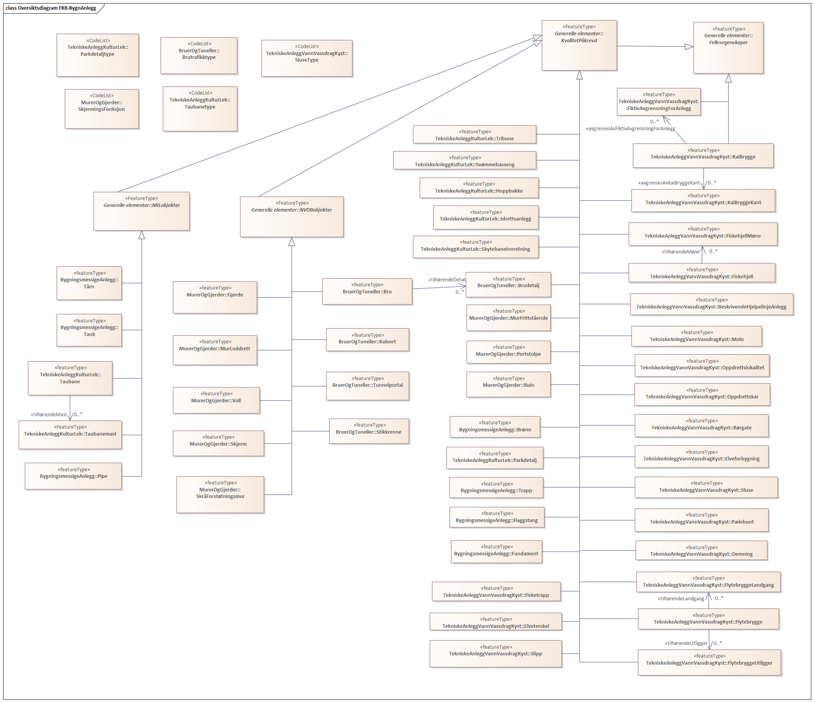
 
'''
 
.Pakkerealisering 
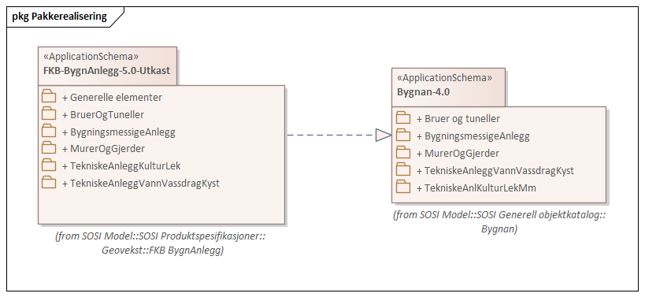
<<<
'''
==== Pakke: Generelle elementer
*Definisjon:* pakke med elementer som realiserer tilsvarende elementer i FKB Generell del 5.0

Merknad:
Kopieres direkte inn i de enkelte FKB-datasettene
 
'''
 
.Oversiktsdiagram Fellesegenskaper 
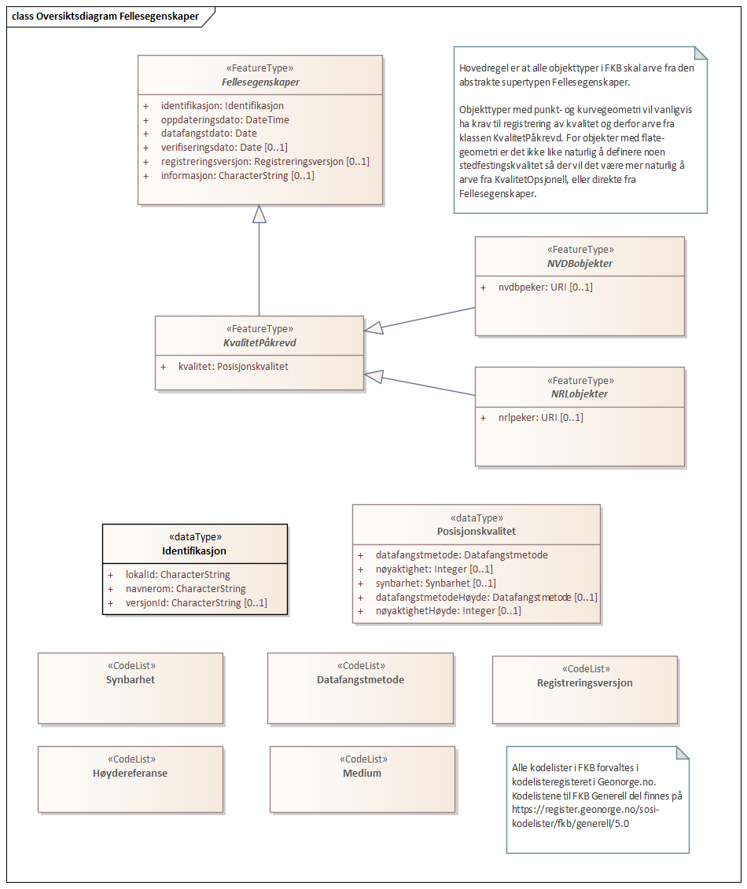
 
'''
 
.Realisering fra SOSI generell del 
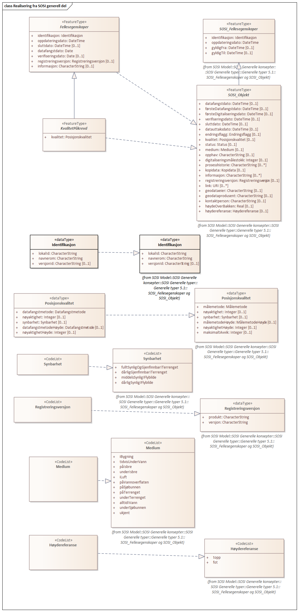
 
'''
 
.Hoveddiagram Posisjonskvalitet 
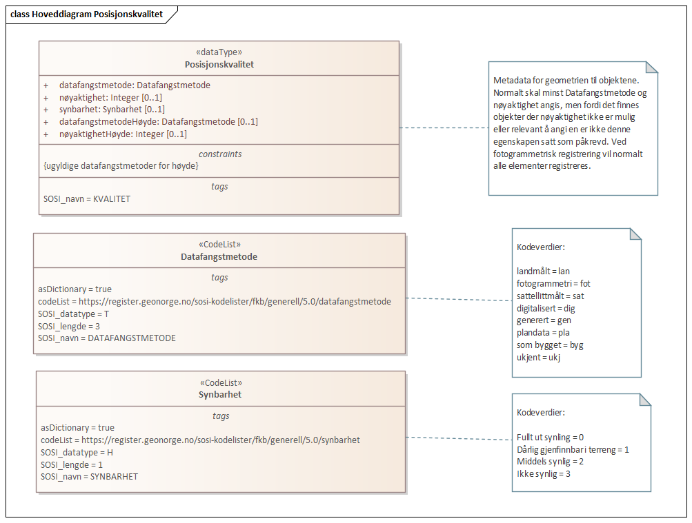
 
'''
 
[[fellesegenskaper]]
===== «FeatureType» Fellesegenskaper (abstrakt)
*Definisjon:* abstrakt objekttype som bærer sentrale egenskaper som er anbefalt for bruk i produktspesifikasjoner.

Merknad: Disse egenskapene skal derfor ikke modelleres inn i fagområdemodeller.
 
[discrete]
====== Egenskaper
[cols="20,80"]
|===
|*Navn:* 
|*identifikasjon*
 
|Definisjon: 
|unik identifikasjon av et objekt 

Merknad FKB:
Unik identifikasjon av et objekt, ivaretas av den ansvarlige produsent/forvalter, og som kan benyttes av eksterne applikasjoner som referanse til objektet.
Den unike identifikatoren er unik for kartobjektet og skal ikke endres i kartobjektets levetid. Dette må ikke forveksles med en tematisk identifikator (for eksempel bygningsnummer) som unikt identifiserer et objekt i virkeligheten. En bygning med samme bygningsnummer vil kunne representeres i mange kartprodukter der det finnes en unik identifikasjon i hver av dem.
For FKB benyttes UUID (Universally unique identifier) som lokalId. Dette innebærer at lokalId alene alltid vil være unik. Likevel skal alltid navnerom også angis. Navnerom angir FKB-datasettet.
 
|Multiplisitet: 
|[1..1]
 
|Type: 
|<<identifikasjon,«dataType» Identifikasjon>>
|Profilparametre i tagged values: 
|
SOSI_navn: IDENT + 
|===
[cols="20,80"]
|===
|*Navn:* 
|*oppdateringsdato*
 
|Definisjon: 
|tidspunkt for siste endring på objektet 

Merknad FKB: 

Denne datoen viser datasystemets siste endring på dataobjektet. Egenskapen settes av forvaltningssystemet etter følgende regler:

i. Oppdateringsdato er tidspunkt for oppdatering av databasen og settes av forvaltningsbasen (ikke av klienten).

ii. Oppdateringsdato skal endres også hvis det er kopidata som blir endret eller importert i en ”kopibase”.

iii. Når avgrensingslinjene til en flate endres, skal flateobjektet få ny oppdateringsdato.

iv. Oppdateringsdato skal endres hvis en egenskap endres.
 
|Multiplisitet: 
|[1..1]
 
|Type: 
|http://skjema.geonorge.no/SOSI/basistype/DateTime[DateTime]
|Profilparametre i tagged values: 
|
SOSI_datatype: DATOTID + 
SOSI_navn: OPPDATERINGSDATO + 
|===
[cols="20,80"]
|===
|*Navn:* 
|*sluttdato*
 
|Definisjon: 
|Tid for når denne versjonen av objektet var erstattet eller opphørt å eksistere.

Merknad FKB:
Egenskapen settes av forvaltningssystemet. Sluttdato skal kun sendes med ut fra forvaltningssystemet i sammenhenger der objektenes historikk er interessant.    
 
|Multiplisitet: 
|[0..1]
 
|Type: 
|http://skjema.geonorge.no/SOSI/basistype/DateTime[DateTime]
|Profilparametre i tagged values: 
|
SOSI_datatype: DATOTID + 
SOSI_navn: SLUTTDATO + 
|===
[cols="20,80"]
|===
|*Navn:* 
|*datafangstdato*
 
|Definisjon: 
|dato når objektet siste gang ble registrert/observert/målt i terrenget
 
|Multiplisitet: 
|[1..1]
 
|Type: 
|http://skjema.geonorge.no/SOSI/basistype/Date[Date]
|Profilparametre i tagged values: 
|
SOSI_datatype: DATO + 
SOSI_navn: DATAFANGSTDATO + 
|===
[cols="20,80"]
|===
|*Navn:* 
|*verifiseringsdato*
 
|Definisjon: 
|dato når dataene er fastslått å være i samsvar med virkeligheten.

Merknad FKB:
Brukes for eksempel i de sammenhenger hvor det er foretatt fotogrammetrisk ajourhold, og hvor det ikke er registrert endringer på objektet (det virkelige objektet er i samsvar med dataobjektet)
 
|Multiplisitet: 
|[0..1]
 
|Type: 
|http://skjema.geonorge.no/SOSI/basistype/Date[Date]
|Profilparametre i tagged values: 
|
SOSI_datatype: DATO + 
SOSI_navn: VERIFISERINGSDATO + 
|===
[cols="20,80"]
|===
|*Navn:* 
|*registreringsversjon*
 
|Definisjon: 
|angivelse av hvilken produktspesifikasjon som er utgangspunkt  for dataene
 
|Multiplisitet: 
|[0..1]
 
|Type: 
|<<registreringsversjon,«CodeList» Registreringsversjon>>
|Profilparametre i tagged values: 
|
defaultCodeSpace: https://register.geonorge.no/sosi-kodelister/fkb/generell/5.0/registreringsversjon + 
SOSI_datatype: T + 
SOSI_lengde: 10 + 
SOSI_navn: REGISTRERINGSVERSJON + 
|===
[cols="20,80"]
|===
|*Navn:* 
|*informasjon*
 
|Definisjon: 
|generell opplysning.

Merknad FKB:
Mulighet til å legge inn utfyllende informasjon om objektet. Egenskapen bør bare brukes til å legge inn ekstra informasjon om enkeltobjekter. Egenskapen bør ikke brukes til å systematisk angi ekstrainformasjon om mange/alle objekter i et datasett.
 
|Multiplisitet: 
|[0..1]
 
|Type: 
|http://skjema.geonorge.no/SOSI/basistype/CharacterString[CharacterString]
|Profilparametre i tagged values: 
|
SOSI_datatype: T + 
SOSI_lengde: 255 + 
SOSI_navn: INFORMASJON + 
|===
 
[discrete]
====== Arv og realiseringer
[cols="20,80"]
|===
|Subtyper:
|<<kaibrygge,«featureType» KaiBrygge>> +
<<kvalitetpåkrevd,«FeatureType» KvalitetPåkrevd>> +
<<fiktivavgrensningforanlegg,«featureType» FiktivAvgrensningForAnlegg>> +
|Realisering av: 
|/SOSI Model/SOSI Generell objektkatalog/FKB Generell del/FKB Generell del-5.0/Generelle elementer::«FeatureType» Fellesegenskaper +
|Realisering av: 
|«ApplicationSchema» Generelle typer 5.1/SOSI_Fellesegenskaper og SOSI_Objekt::«FeatureType» SOSI_Objekt +
|===
 
'''
 
[[kvalitetpåkrevd]]
===== «FeatureType» KvalitetPåkrevd (abstrakt)
*Definisjon:* abstrakt objekttype med påkrevet kvalitetsangivelse
 
[discrete]
====== Egenskaper
[cols="20,80"]
|===
|*Navn:* 
|*kvalitet*
 
|Definisjon: 
|beskrivelse av kvaliteten på stedfestingen

Merknad: Denne er identisk med ..KVALITET i tidligere versjoner av SOSI.
 
|Multiplisitet: 
|[1..1]
 
|Type: 
|<<posisjonskvalitet,«dataType» Posisjonskvalitet>>
|Profilparametre i tagged values: 
|
SOSI_navn: KVALITET + 
|===
 
[discrete]
====== Arv og realiseringer
[cols="20,80"]
|===
|Supertype: 
|<<fellesegenskaper,«FeatureType» Fellesegenskaper>>
 
|Subtyper:
|<<kaibryggekant,«featureType» KaiBryggeKant>> +
<<elveterskel,«featureType» Elveterskel>> +
<<elveforbygning,«featureType» Elveforbygning>> +
<<tribune,«featureType» Tribune>> +
<<murfrittstående,«featureType» MurFrittstående>> +
<<skytebaneinnretning,«featureType» Skytebaneinnretning>> +
<<svømmebasseng,«featureType» Svømmebasseng>> +
<<fiskehjell,«featureType» Fiskehjell>> +
<<ruin,«featureType» Ruin>> +
<<portstolpe,«featureType» Portstolpe>> +
<<idrettsanlegg,«featureType» Idrettsanlegg>> +
<<pælebunt,«featureType» Pælebunt>> +
<<flytebryggeutligger,«featureType» FlytebryggeUtligger>> +
<<flytebrygge,«featureType» Flytebrygge>> +
<<fisketrapp,«featureType» Fisketrapp>> +
<<fundament,«featureType» Fundament>> +
<<trapp,«featureType» Trapp>> +
<<hoppbakke,«featureType» Hoppbakke>> +
<<sluse,«featureType» Sluse>> +
<<navigasjonsinstallasjon,«featureType» Navigasjonsinstallasjon>> +
<<brudetalj,«featureType» Brudetalj>> +
<<fiskehjellmøne,«featureType» FiskehjellMøne>> +
<<parkdetalj,«featureType» Parkdetalj>> +
<<brønn,«featureType» Brønn>> +
<<beskrivendehjelpelinjeanlegg,«featureType» BeskrivendeHjelpelinjeAnlegg>> +
<<molo,«featureType» Molo>> +
<<avfallsbeholder,«featureType» Avfallsbeholder>> +
<<oppdrettskar,«featureType» Oppdrettskar>> +
<<demning,«featureType» Demning>> +
<<slipp,«featureType» Slipp>> +
<<rørgate,«featureType» Rørgate>> +
<<oppdrettslokalitet,«featureType» Oppdrettslokalitet>> +
<<flytebryggelandgang,«featureType» FlytebryggeLandgang>> +
<<nrlobjekter,«FeatureType» NRLobjekter>> +
<<nvdbobjekter,«FeatureType» NVDBobjekter>> +
|Realisering av: 
|«ApplicationSchema» Generelle typer 5.1/SOSI_Fellesegenskaper og SOSI_Objekt::«FeatureType» SOSI_Objekt +
|Realisering av: 
|/SOSI Model/SOSI Generell objektkatalog/FKB Generell del/FKB Generell del-5.0/Generelle elementer::«FeatureType» KvalitetPåkrevd +
|===
 
'''
 
[[nrlobjekter]]
===== «FeatureType» NRLobjekter (abstrakt)
*Definisjon:* abstrakt objekttype som arves fra for objekter som har kobling til NRL
 
[discrete]
====== Egenskaper
[cols="20,80"]
|===
|*Navn:* 
|*nrlpeker*
 
|Definisjon: 
|peker til objekt i NRL
 
|Multiplisitet: 
|[0..1]
 
|Type: 
|http://skjema.geonorge.no/SOSI/basistype/URI[URI]
|Profilparametre i tagged values: 
|
SOSI_datatype: T + 
SOSI_lengde: 255 + 
SOSI_navn: NRLPEKER + 
|===
 
[discrete]
====== Arv og realiseringer
[cols="20,80"]
|===
|Supertype: 
|<<kvalitetpåkrevd,«FeatureType» KvalitetPåkrevd>>
 
|Subtyper:
|<<taubane,«featureType» Taubane>> +
<<pipe,«featureType» Pipe>> +
<<tårn,«featureType» Tårn>> +
<<tank,«featureType» Tank>> +
<<taubanemast,«FeatureType» Taubanemast>> +
<<flaggstang,«featureType» Flaggstang>> +
|===
 
'''
 
[[nvdbobjekter]]
===== «FeatureType» NVDBobjekter (abstrakt)
*Definisjon:* abstrakt objekttype som arves fra for objekter som har kobling til NVDB
 
[discrete]
====== Egenskaper
[cols="20,80"]
|===
|*Navn:* 
|*nvdbpeker*
 
|Definisjon: 
|peker til objekt i NVDB
 
|Multiplisitet: 
|[0..1]
 
|Type: 
|http://skjema.geonorge.no/SOSI/basistype/URI[URI]
|Profilparametre i tagged values: 
|
SOSI_datatype: T + 
SOSI_lengde: 255 + 
SOSI_navn: NVDBPEKER + 
|===
 
[discrete]
====== Arv og realiseringer
[cols="20,80"]
|===
|Supertype: 
|<<kvalitetpåkrevd,«FeatureType» KvalitetPåkrevd>>
 
|Subtyper:
|<<kulvert,«featureType» Kulvert>> +
<<skjerm,«featureType» Skjerm>> +
<<skråforstøtningsmur,«featureType» SkråForstøtningsmur>> +
<<bru,«featureType» Bru>> +
<<murloddrett,«featureType» MurLoddrett>> +
<<stikkrenne,«featureType» Stikkrenne>> +
<<voll,«featureType» Voll>> +
<<gjerde,«featureType» Gjerde>> +
<<tunnelportal,«featureType» Tunnelportal>> +
|===
 
'''
 
[[identifikasjon]]
===== «dataType» Identifikasjon
*Definisjon:* Unik identifikasjon av et objekt i et datasett, forvaltet av den ansvarlige produsent/forvalter, og kan benyttes av eksterne applikasjoner som stabil referanse til objektet. 

Merknad 1: Denne objektidentifikasjonen må ikke forveksles med en tematisk objektidentifikasjon, slik som f.eks bygningsnummer. 

Merknad 2: Denne unike identifikatoren vil ikke endres i løpet av objektets levetid, og ikke gjenbrukes i andre objekt.
 
[discrete]
====== Profilparametre i tagged values
[cols="20,80"]
|===
|SOSI_navn
|IDENT
 
|===
[discrete]
====== Egenskaper
[cols="20,80"]
|===
|*Navn:* 
|*lokalId*
 
|Definisjon: 
|lokal identifikator av et objekt

Merknad: Det er dataleverendørens ansvar å sørge for at den lokale identifikatoren er unik innenfor navnerommet. For FKB-data benyttes UUID som lokalId.
 
|Multiplisitet: 
|[1..1]
 
|Type: 
|http://skjema.geonorge.no/SOSI/basistype/CharacterString[CharacterString]
|Profilparametre i tagged values: 
|
SOSI_datatype: T + 
SOSI_lengde: 100 + 
SOSI_navn: LOKALID + 
|===
[cols="20,80"]
|===
|*Navn:* 
|*navnerom*
 
|Definisjon: 
|navnerom som unikt identifiserer datakilden til et objekt, anbefales å være en http-URI

Eksempel: http://data.geonorge.no/SentraltStedsnavnsregister/1.0

Merknad : Verdien for nanverom vil eies av den dataprodusent som har ansvar for de unike identifikatorene og må være registrert i data.geonorge.no eller data.norge.no
 
|Multiplisitet: 
|[1..1]
 
|Type: 
|http://skjema.geonorge.no/SOSI/basistype/CharacterString[CharacterString]
|Profilparametre i tagged values: 
|
SOSI_datatype: T + 
SOSI_lengde: 100 + 
SOSI_navn: NAVNEROM + 
|===
[cols="20,80"]
|===
|*Navn:* 
|*versjonId*
 
|Definisjon: 
|identifikasjon av en spesiell versjon av et geografisk objekt (instans)
 
|Multiplisitet: 
|[0..1]
 
|Type: 
|http://skjema.geonorge.no/SOSI/basistype/CharacterString[CharacterString]
|Profilparametre i tagged values: 
|
SOSI_datatype: T + 
SOSI_lengde: 100 + 
SOSI_navn: VERSJONID + 
|===
[discrete]
====== Arv og realiseringer
[cols="20,80"]
|===
|Realisering av: 
|«ApplicationSchema» Generelle typer 5.1/SOSI_Fellesegenskaper og SOSI_Objekt::«dataType» Identifikasjon +
|===
 
'''
 
[[posisjonskvalitet]]
===== «dataType» Posisjonskvalitet
*Definisjon:* beskrivelse av kvaliteten på stedfestingen.

Merknad:
Posisjonskvalitet er ikke konform med  kvalitetsmodellen i ISO slik den er defineret i ISO19157:2013, men er en videreføring av tildligere brukte kvalitetsegenskaper i SOSI. FKB 5.0 innfører en egen variant av datatypen Posisjonskvalitet der kodeliste målemetode er byttet ut med den mer generelle kodelista Datafangstmetode.
 
[discrete]
====== Profilparametre i tagged values
[cols="20,80"]
|===
|SOSI_navn
|KVALITET
 
|===
[discrete]
====== Egenskaper
[cols="20,80"]
|===
|*Navn:* 
|*datafangstmetode*
 
|Definisjon: 
|metode for datafangst. 
Egenskapen beskriver datafangstmetode for grunnrisskoordinater (x,y), eller for både grunnriss og høyde (x,y,z) dersom det ikke er oppgitt noen verdi for datafangstmetodeHøyde.
 
|Multiplisitet: 
|[1..1]
 
|Type: 
|<<datafangstmetode,«CodeList» Datafangstmetode>>
|Profilparametre i tagged values: 
|
defaultCodeSpace: https://register.geonorge.no/sosi-kodelister/fkb/generell/5.0/datafangstmetode + 
SOSI_datatype: T + 
SOSI_lengde: 3 + 
SOSI_navn: DATAFANGSTMETODE + 
|===
[cols="20,80"]
|===
|*Navn:* 
|*nøyaktighet*
 
|Definisjon: 
|standardavviket til posisjoneringa av objektet oppgitt i cm

I de aller fleste sammenhenger benyttes en anslått eller forventet verdi for standardavvik, men dersom man har en beregnet verdi skal denne benyttes. 

For objekter med punktgeometri benyttes verdi for punktstandardavvik. For objekter med kurvegeometri benyttes standardavviket for tverravviket fra kurva. For objekter med overflate- eller volumgeometri er forståelsen at standardavviket beregnes ut fra (3D) avvikene mellom sann posisjon og nærmeste punkt på overflata. 

Merknad:
Verdien er ment å beskrive nøyaktigheten til objektet sammenlignet med sann verdi. Standardavvik er i utgangspunktet et mål på det tilfeldige avviket og det innebærer at vi forutsetter at det systematiske avviket i liten grad påvirker nøyaktigheten til posisjoneringa. For fotogrammetriske data settes som hovedregel verdien lik kravet til standardavvik ved datafangst. Se standarden Geodatakvalitet for nærmere definisjon av standardavvik og hvordan dette defineres, beregnes og kontrolleres.

 
|Multiplisitet: 
|[0..1]
 
|Type: 
|http://skjema.geonorge.no/SOSI/basistype/Integer[Integer]
|Profilparametre i tagged values: 
|
SOSI_datatype: H + 
SOSI_lengde: 6 + 
SOSI_navn: NØYAKTIGHET + 
|===
[cols="20,80"]
|===
|*Navn:* 
|*synbarhet*
 
|Definisjon: 
|beskrivelse av hvor godt objektene framgår i datagrunnlaget for posisjonering (f.eks. flybildene).
 
|Multiplisitet: 
|[0..1]
 
|Type: 
|<<synbarhet,«CodeList» Synbarhet>>
|Profilparametre i tagged values: 
|
defaultCodeSpace: https://register.geonorge.no/sosi-kodelister/fkb/generell/5.0/synbarhet + 
SOSI_datatype: T + 
SOSI_lengde: 1 + 
SOSI_navn: SYNBARHET + 
|===
[cols="20,80"]
|===
|*Navn:* 
|*datafangstmetodeHøyde*
 
|Definisjon: 
|metoden brukt for høyderegistrering av posisjon.

Det er bare nødvending å angi en verdi for egenskapen dersom datafangstmetode for høyde avviker fra datafangstmetode for grunnriss.

 
|Multiplisitet: 
|[0..1]
 
|Type: 
|<<datafangstmetode,«CodeList» Datafangstmetode>>
|Profilparametre i tagged values: 
|
defaultCodeSpace: https://register.geonorge.no/sosi-kodelister/fkb/generell/5.0/datafangstmetode + 
SOSI_datatype: T + 
SOSI_lengde: 3 + 
SOSI_navn: DATAFANGSTMETODEHØYDE + 
|===
[cols="20,80"]
|===
|*Navn:* 
|*nøyaktighetHøyde*
 
|Definisjon: 
|standardavviket til posisjoneringa av objektet oppgitt i cm

I de aller fleste sammenhenger benyttes en anslått eller forventet verdi for standardavviket, men dersom man faktisk har standardavviket til posisjoneringa av objektet oppgitt i cm

I de aller fleste sammenhenger benyttes en anslått eller forventet verdi for standardavvik, men dersom man har en beregnet verdi skal denne benyttes. 

Merknad:
Verdien er ment å beskrive nøyaktigheten til objektet sammenlignet med sann verdi. Standardavvik er i utgangspunktet et mål på det tilfeldige avviket og det innebærer at vi forutsetter at det systematiske avviket i liten grad påvirker nøyaktigheten til posisjoneringa. For fotogrammetriske data settes som hovedregel verdien lik kravet til standardavvik ved datafangst. Se standarden Geodatakvalitet for nærmere definisjon av standardavvik og hvordan dette defineres, beregnes og kontrolleres.
 
|Multiplisitet: 
|[0..1]
 
|Type: 
|http://skjema.geonorge.no/SOSI/basistype/Integer[Integer]
|Profilparametre i tagged values: 
|
SOSI_datatype: H + 
SOSI_lengde: 6 + 
SOSI_navn: H-NØYAKTIGHET + 
|===
 
[discrete]
====== Restriksjoner
[cols="20,80"]
|===
|*Navn:* 
|*ugyldige datafangstmetoder for høyde*
 
|Beskrivelse: 
|inv: self.datafangstmetodeHøyde &lt;&gt; 'dig'

--Datafangstmetode Digitalisert skal ikke brukes på egenskapen datafangstmetodeHøyde
 
|===
[discrete]
====== Arv og realiseringer
[cols="20,80"]
|===
|Realisering av: 
|«ApplicationSchema» Generelle typer 5.1/SOSI_Fellesegenskaper og SOSI_Objekt::«dataType» Posisjonskvalitet +
|===
 
'''
 
[[synbarhet]]
===== «CodeList» Synbarhet
*Definisjon:* synbarhet beskriver hvor godt objektene framgår i datagrunnlaget for posisjonering (f.eks. flybildene).
 
[discrete]
====== Profilparametre i tagged values
[cols="20,80"]
|===
|asDictionary
|true
 
|codeList
|https://register.geonorge.no/sosi-kodelister/fkb/generell/5.0/synbarhet
 
|SOSI_datatype
|H
 
|SOSI_lengde
|1
 
|SOSI_navn
|SYNBARHET
 
|===
 
'''
 
[[datafangstmetode]]
===== «CodeList» Datafangstmetode
*Definisjon:* metode for datafangst. 

Datafangstmetoden beskriver hvordan selve vektordataene er posisjonert fra et datagrunnlag (observasjoner med landmålingsutstyr, fotogrammetrisk stereomodell, digital terrengmodell etc.) og ikke prosessen med å innhente det bakenforliggende datagrunnlaget.
 
[discrete]
====== Profilparametre i tagged values
[cols="20,80"]
|===
|asDictionary
|true
 
|codeList
|https://register.geonorge.no/sosi-kodelister/fkb/generell/5.0/datafangstmetode
 
|SOSI_datatype
|T
 
|SOSI_lengde
|3
 
|SOSI_navn
|DATAFANGSTMETODE
 
|===
 
'''
 
[[registreringsversjon]]
===== «CodeList» Registreringsversjon
*Definisjon:* FKB-verjson som ligger til grunn for registrering. Mest relevant for data som er fotogrammetrisk registrert.
 
[discrete]
====== Profilparametre i tagged values
[cols="20,80"]
|===
|asDictionary
|true
 
|codeList
|https://register.geonorge.no/sosi-kodelister/fkb/generell/5.0/registreringsversjon
 
|SOSI_datatype
|T
 
|SOSI_lengde
|10
 
|SOSI_navn
|REGISTRERINGSVERSJON
 
|===
 
'''
 
[[høydereferanse]]
===== «CodeList» Høydereferanse
*Definisjon:* koordinatregistering utført på topp eller bunn av et objekt
 
[discrete]
====== Profilparametre i tagged values
[cols="20,80"]
|===
|asDictionary
|true
 
|codeList
|https://register.geonorge.no/sosi-kodelister/fkb/generell/5.0/hoydereferanse
 
|SOSI_datatype
|T
 
|SOSI_lengde
|6
 
|SOSI_navn
|HREF
 
|===
 
'''
 
[[medium]]
===== «CodeList» Medium
*Definisjon:* objektets beliggenhet i forhold til jordoverflaten

Eksempel:
Veg på bro, i tunnel, inne i et bygningsmessig anlegg, etc.
 
[discrete]
====== Profilparametre i tagged values
[cols="20,80"]
|===
|asDictionary
|true
 
|codeList
|https://register.geonorge.no/sosi-kodelister/fkb/generell/5.0/medium
 
|SOSI_datatype
|T
 
|SOSI_lengde
|1
 
|SOSI_navn
|MEDIUM
 
|===
<<<
'''
==== Pakke: BruerOgTuneller
*Definisjon:* Inneholder elementer fra SOSI Bygnan 4.0, Bruer og tuneller
 
'''
 
.Oversiktsdiagram Bruer og tuneller 
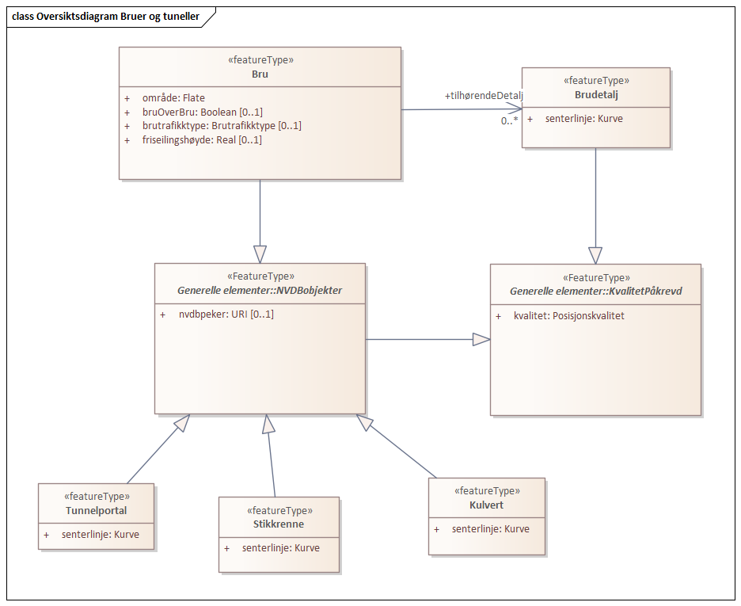
 
'''
 
.Realisering fra Bygnan 4.0 - Bruer og tuneller 
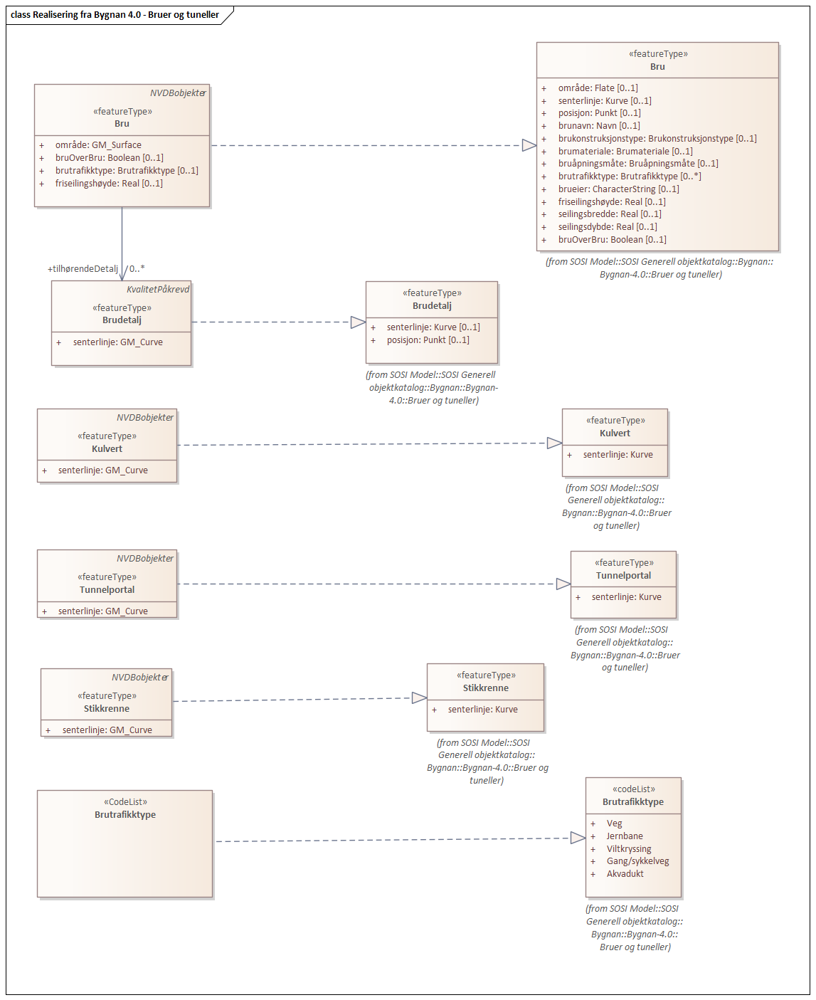
 
'''
 
.Hoveddiagram Bruer og tuneller - objekttyper og kodelister 
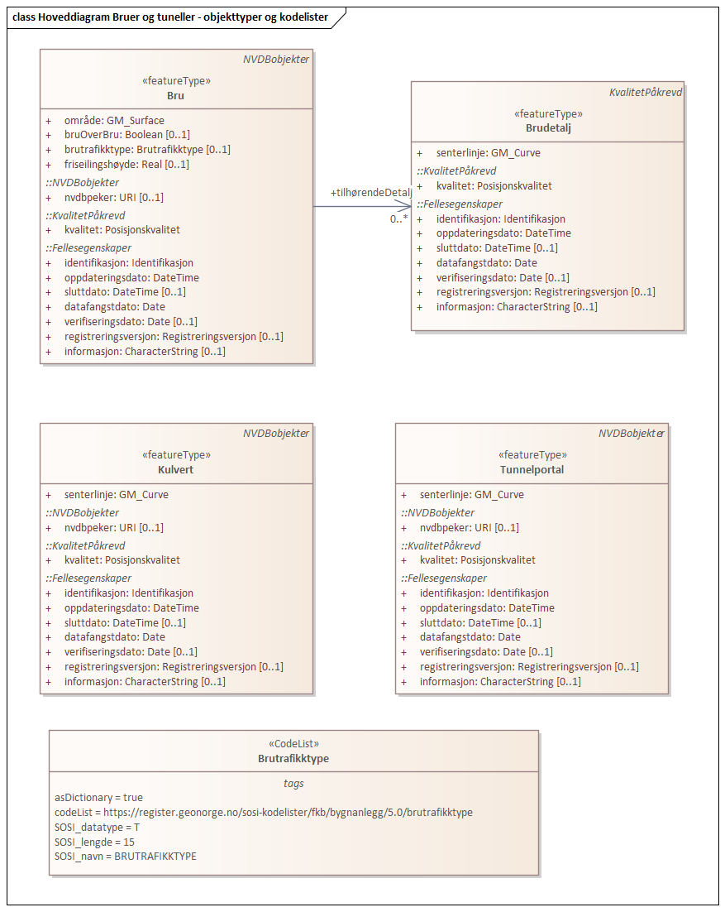
 
'''
 
[[bru]]
===== «featureType» Bru
*Definisjon:* konstruksjon for kryssing av vanskelig farbart område
Merknad: Med vanskelig farbart område menes en elv, et juv eller andre naturlige hindringer, samt kryssende infrastruktur.
 
 
'''
.Illustrasjon av objekttype Bru
image::http://skjema.geonorge.no/SOSI/produktspesifikasjon/FKB-BygnAnlegg/5.0/figurer/objtype_bru.png[link=http://skjema.geonorge.no/SOSI/produktspesifikasjon/FKB-BygnAnlegg/5.0/figurer/objtype_bru.png, alt="Bilde av et eksempel på objekttypen Bru, eventuelt med påtegning av streker som viser hvor geometrien til objektet skal måles fra."]
[discrete]
====== Egenskaper
[cols="20,80"]
|===
|*Navn:* 
|*område*
 
|Definisjon: 
|objektets utstrekning
 
|Multiplisitet: 
|[1..1]
 
|Type: 
|http://skjema.geonorge.no/SOSI/basistype/GM_Surface[GM_Surface]
|===
[cols="20,80"]
|===
|*Navn:* 
|*bruOverBru*
 
|Definisjon: 
|angivelse av om brue ligger over en eller flere andre bruer
 
|Multiplisitet: 
|[0..1]
 
|Type: 
|http://skjema.geonorge.no/SOSI/basistype/Boolean[Boolean]
|Profilparametre i tagged values: 
|
SOSI_datatype: BOOLSK + 
SOSI_navn: BRUOVERBRU + 
|===
[cols="20,80"]
|===
|*Navn:* 
|*brutrafikktype*
 
|Definisjon: 
|type trafikk bruen brukes til
 
|Multiplisitet: 
|[0..1]
 
|Type: 
|<<brutrafikktype,«CodeList» Brutrafikktype>>
|Profilparametre i tagged values: 
|
defaultCodeSpace: https://register.geonorge.no/sosi-kodelister/fkb/bygnanlegg/5.0/brutrafikktype + 
SOSI_datatype: T + 
SOSI_lengde: 15 + 
SOSI_navn: BRUTRAFIKKTYPE + 
|===
[cols="20,80"]
|===
|*Navn:* 
|*eksternpeker*
 
|Definisjon: 
|referanse til objektet i et eksternt system (annet enn NVDB).
 
|Multiplisitet: 
|[0..1]
 
|Type: 
|http://skjema.geonorge.no/SOSI/basistype/URI[URI]
|Profilparametre i tagged values: 
|
SOSI_datatype: T + 
SOSI_lengde: 255 + 
SOSI_navn: EKSTERNPEKER + 
|===
[cols="20,80"]
|===
|*Navn:* 
|*friseilingshøyde*
 
|Definisjon: 
|friseilingshøyde angitt i meter. Angis kun for bruer over vann der friseilingshøyde er relevant.

Merknad: Friseilingshøyde er en administrativ verdi som ikke kan avledes fra bruas geometri
 
|Multiplisitet: 
|[0..1]
 
|Type: 
|http://skjema.geonorge.no/SOSI/basistype/Real[Real]
|Profilparametre i tagged values: 
|
SOSI_datatype: D + 
SOSI_lengde: 10 + 
SOSI_navn: FRISEILINGSHØYDE + 
|===
 
[discrete]
====== Roller
[cols="20,80"]
|===
|*Rollenavn:* 
|*tilhørendeDetalj*
 
|Definisjon:
|viser hvilke brudetaljer som tilhører brua
 
|Multiplisitet: 
|[0..*]
 
|Til klasse
|<<brudetalj,«featureType» Brudetalj>>
|===
 
[discrete]
====== Arv og realiseringer
[cols="20,80"]
|===
|Supertype: 
|<<nvdbobjekter,«FeatureType» NVDBobjekter>>
 
|Realisering av: 
|«ApplicationSchema» Bygnan-4.0/Bruer og tuneller::«featureType» Bru +
|===
 
'''
 
[[brudetalj]]
===== «featureType» Brudetalj
*Definisjon:* markante detaljer på bru som ikke registreres gjennom andre objekttyper
Eksempler:
-          Brutårn for hengebruer.
-          Bæreelement for brukonstruksjon.
 
 
'''
.Illustrasjon av objekttype Brudetalj
image::http://skjema.geonorge.no/SOSI/produktspesifikasjon/FKB-BygnAnlegg/5.0/figurer/objtype_brudetalj.png[link=http://skjema.geonorge.no/SOSI/produktspesifikasjon/FKB-BygnAnlegg/5.0/figurer/objtype_brudetalj.png, alt="Bilde av et eksempel på objekttypen Brudetalj, eventuelt med påtegning av streker som viser hvor geometrien til objektet skal måles fra."]
[discrete]
====== Egenskaper
[cols="20,80"]
|===
|*Navn:* 
|*senterlinje*
 
|Definisjon: 
|forløp som følger objektets sentrale del
 
|Multiplisitet: 
|[1..1]
 
|Type: 
|http://skjema.geonorge.no/SOSI/basistype/GM_Curve[GM_Curve]
|===
 
[discrete]
====== Arv og realiseringer
[cols="20,80"]
|===
|Supertype: 
|<<kvalitetpåkrevd,«FeatureType» KvalitetPåkrevd>>
 
|Realisering av: 
|«ApplicationSchema» Bygnan-4.0/Bruer og tuneller::«featureType» Brudetalj +
|===
 
'''
 
[[kulvert]]
===== «featureType» Kulvert
*Definisjon:* gjennomløp på tvers av veg-eller jernbane med overliggende fylling og lysåpning mellom 1m og 2,5m
 
 
'''
.Illustrasjon av objekttype Kulvert
image::http://skjema.geonorge.no/SOSI/produktspesifikasjon/FKB-BygnAnlegg/5.0/figurer/objtype_kulvert.png[link=http://skjema.geonorge.no/SOSI/produktspesifikasjon/FKB-BygnAnlegg/5.0/figurer/objtype_kulvert.png, alt="Bilde av et eksempel på objekttypen Kulvert, eventuelt med påtegning av streker som viser hvor geometrien til objektet skal måles fra."]
[discrete]
====== Egenskaper
[cols="20,80"]
|===
|*Navn:* 
|*senterlinje*
 
|Definisjon: 
|forløp som følger objektets sentrale del
 
|Multiplisitet: 
|[1..1]
 
|Type: 
|http://skjema.geonorge.no/SOSI/basistype/GM_Curve[GM_Curve]
|===
 
[discrete]
====== Arv og realiseringer
[cols="20,80"]
|===
|Supertype: 
|<<nvdbobjekter,«FeatureType» NVDBobjekter>>
 
|Realisering av: 
|«ApplicationSchema» Bygnan-4.0/Bruer og tuneller::«featureType» Kulvert +
|===
 
'''
 
[[stikkrenne]]
===== «featureType» Stikkrenne
*Definisjon:* gjennomløp på tvers av veg-eller jernbane med overliggende fylling og lysåpning mindre enn 1m
 
 
'''
.Illustrasjon av objekttype Stikkrenne
image::http://skjema.geonorge.no/SOSI/produktspesifikasjon/FKB-BygnAnlegg/5.0/figurer/objtype_stikkrenne.png[link=http://skjema.geonorge.no/SOSI/produktspesifikasjon/FKB-BygnAnlegg/5.0/figurer/objtype_stikkrenne.png, alt="Bilde av et eksempel på objekttypen Stikkrenne, eventuelt med påtegning av streker som viser hvor geometrien til objektet skal måles fra."]
[discrete]
====== Egenskaper
[cols="20,80"]
|===
|*Navn:* 
|*senterlinje*
 
|Definisjon: 
|forløp som følger objektets sentrale del
 
|Multiplisitet: 
|[1..1]
 
|Type: 
|http://skjema.geonorge.no/SOSI/basistype/GM_Curve[GM_Curve]
|===
 
[discrete]
====== Arv og realiseringer
[cols="20,80"]
|===
|Supertype: 
|<<nvdbobjekter,«FeatureType» NVDBobjekter>>
 
|Realisering av: 
|«ApplicationSchema» Bygnan-4.0/Bruer og tuneller::«featureType» Stikkrenne +
|===
 
'''
 
[[tunnelportal]]
===== «featureType» Tunnelportal
*Definisjon:* spesielt byggverk som sammenbinder tunnel og åpen veg
 
 
'''
.Illustrasjon av objekttype Tunnelportal
image::http://skjema.geonorge.no/SOSI/produktspesifikasjon/FKB-BygnAnlegg/5.0/figurer/objtype_tunnelportal.png[link=http://skjema.geonorge.no/SOSI/produktspesifikasjon/FKB-BygnAnlegg/5.0/figurer/objtype_tunnelportal.png, alt="Bilde av et eksempel på objekttypen Tunnelportal, eventuelt med påtegning av streker som viser hvor geometrien til objektet skal måles fra."]
[discrete]
====== Egenskaper
[cols="20,80"]
|===
|*Navn:* 
|*senterlinje*
 
|Definisjon: 
|forløp som følger objektets sentrale del
 
|Multiplisitet: 
|[1..1]
 
|Type: 
|http://skjema.geonorge.no/SOSI/basistype/GM_Curve[GM_Curve]
|Profilparametre i tagged values: 
|
SOSI_melding: Fant ikke denne i SOSI_db + 
|===
 
[discrete]
====== Arv og realiseringer
[cols="20,80"]
|===
|Supertype: 
|<<nvdbobjekter,«FeatureType» NVDBobjekter>>
 
|Realisering av: 
|«ApplicationSchema» Bygnan-4.0/Bruer og tuneller::«featureType» Tunnelportal +
|===
 
'''
 
[[brutrafikktype]]
===== «CodeList» Brutrafikktype
*Definisjon:* ulike former for trafikk en bru er bygget for
 
[discrete]
====== Profilparametre i tagged values
[cols="20,80"]
|===
|asDictionary
|true
 
|codeList
|https://register.geonorge.no/sosi-kodelister/fkb/bygnanlegg/5.0/brutrafikktype
 
|SOSI_datatype
|T
 
|SOSI_lengde
|15
 
|SOSI_navn
|BRUTRAFIKKTYPE
 
|===
<<<
'''
==== Pakke: BygningsmessigeAnlegg
*Definisjon:* Inneholder elementer fra SOSI Bygnan 4.0, BygningsmessigeAnlegg
 
'''
 
.Oversiktsdiagram Bygningsmessige anlegg 
image::diagrammer/Oversiktsdiagram Bygningsmessige anlegg.png[link=diagrammer/Oversiktsdiagram Bygningsmessige anlegg.png, alt="Diagram med navn Oversiktsdiagram Bygningsmessige anlegg som viser UML-klasser beskrevet i teksten nedenfor."]
 
'''
 
.Realisering fra Bygnan 4.0 - BygningsmessigeAnlegg 
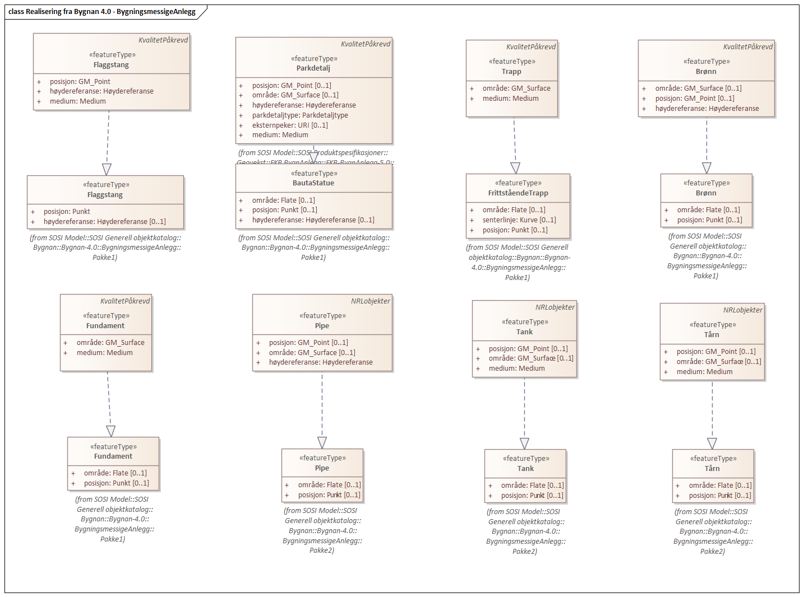
 
'''
 
.Hoveddiagram Bygningsmessige anlegg - objekttyper og kodelister 
image::diagrammer/Hoveddiagram Bygningsmessige anlegg - objekttyper og kodelister.png[link=diagrammer/Hoveddiagram Bygningsmessige anlegg - objekttyper og kodelister.png, alt="Diagram med navn Hoveddiagram Bygningsmessige anlegg - objekttyper og kodelister som viser UML-klasser beskrevet i teksten nedenfor."]
 
'''
 
[[avfallsbeholder]]
===== «featureType» Avfallsbeholder
*Definisjon:* Større tank eller annen type beholder for avfall
 
 
'''
.Illustrasjon av objekttype Avfallsbeholder
image::http://skjema.geonorge.no/SOSI/produktspesifikasjon/FKB-BygnAnlegg/5.0/figurer/objtype_avfallsbeholder.png[link=http://skjema.geonorge.no/SOSI/produktspesifikasjon/FKB-BygnAnlegg/5.0/figurer/objtype_avfallsbeholder.png, alt="Bilde av et eksempel på objekttypen Avfallsbeholder, eventuelt med påtegning av streker som viser hvor geometrien til objektet skal måles fra."]
[discrete]
====== Egenskaper
[cols="20,80"]
|===
|*Navn:* 
|*posisjon*
 
|Definisjon: 
|sted som objektet eksisterer på
 
|Multiplisitet: 
|[0..1]
 
|Type: 
|http://skjema.geonorge.no/SOSI/basistype/GM_Point[GM_Point]
|===
[cols="20,80"]
|===
|*Navn:* 
|*område*
 
|Definisjon: 
|objektets utstrekning
 
|Multiplisitet: 
|[0..1]
 
|Type: 
|http://skjema.geonorge.no/SOSI/basistype/GM_Surface[GM_Surface]
|===
[cols="20,80"]
|===
|*Navn:* 
|*medium*
 
|Definisjon: 
|objektets beliggenhet i forhold til jordoverflaten
 
|Multiplisitet: 
|[1..1]
 
|Type: 
|<<medium,«CodeList» Medium>>
|Profilparametre i tagged values: 
|
defaultCodeSpace: https://register.geonorge.no/sosi-kodelister/fkb/generell/5.0/medium + 
SOSI_datatype: T + 
SOSI_lengde: 1 + 
SOSI_navn: MEDIUM + 
|===
[cols="20,80"]
|===
|*Navn:* 
|*høydereferanse*
 
|Definisjon: 
|angivelse av om registreringen er utført på topp eller bunn av et element
 
|Multiplisitet: 
|[1..1]
 
|Type: 
|<<høydereferanse,«CodeList» Høydereferanse>>
|Profilparametre i tagged values: 
|
defaultCodeSpace: https://register.geonorge.no/sosi-kodelister/fkb/generell/5.0/hoydereferanse + 
SOSI_datatype: T + 
SOSI_lengde: 6 + 
SOSI_navn: HREF + 
|===
[cols="20,80"]
|===
|*Navn:* 
|*eksternpeker*
 
|Definisjon: 
|referanse til objektet i et eksternt system, f.eks. hos ansvarlig renovasjonsselskap.
 
|Multiplisitet: 
|[0..1]
 
|Type: 
|http://skjema.geonorge.no/SOSI/basistype/URI[URI]
|Profilparametre i tagged values: 
|
SOSI_datatype: T + 
SOSI_lengde: 255 + 
SOSI_navn: EKSTERNPEKER + 
|===
 
[discrete]
====== Restriksjoner
[cols="20,80"]
|===
|*Navn:* 
|*Skal ha enten punkt- eller flategeometri*
 
|Beskrivelse: 
|inv: (self.område -&gt; size() ) + (self.posisjon -&gt; size() ) = 1
 
|===
 
[discrete]
====== Arv og realiseringer
[cols="20,80"]
|===
|Supertype: 
|<<kvalitetpåkrevd,«FeatureType» KvalitetPåkrevd>>
 
|===
 
'''
 
[[brønn]]
===== «featureType» Brønn
*Definisjon:* lite bygningsmessig anlegg for uttak av ferskvann
 
 
'''
.Illustrasjon av objekttype Brønn
image::http://skjema.geonorge.no/SOSI/produktspesifikasjon/FKB-BygnAnlegg/5.0/figurer/objtype_bronn.png[link=http://skjema.geonorge.no/SOSI/produktspesifikasjon/FKB-BygnAnlegg/5.0/figurer/objtype_bronn.png, alt="Bilde av et eksempel på objekttypen Brønn, eventuelt med påtegning av streker som viser hvor geometrien til objektet skal måles fra."]
[discrete]
====== Egenskaper
[cols="20,80"]
|===
|*Navn:* 
|*område*
 
|Definisjon: 
|objektets utstrekning
 
|Multiplisitet: 
|[0..1]
 
|Type: 
|http://skjema.geonorge.no/SOSI/basistype/GM_Surface[GM_Surface]
|===
[cols="20,80"]
|===
|*Navn:* 
|*posisjon*
 
|Definisjon: 
|sted som objektet eksisterer på
 
|Multiplisitet: 
|[0..1]
 
|Type: 
|http://skjema.geonorge.no/SOSI/basistype/GM_Point[GM_Point]
|===
[cols="20,80"]
|===
|*Navn:* 
|*høydereferanse*
 
|Definisjon: 
|koordinatregistering utført på topp eller bunn av et objekt
 
|Multiplisitet: 
|[1..1]
 
|Type: 
|<<høydereferanse,«CodeList» Høydereferanse>>
|Profilparametre i tagged values: 
|
defaultCodeSpace: https://register.geonorge.no/sosi-kodelister/fkb/generell/5.0/hoydereferanse + 
SOSI_datatype: T + 
SOSI_lengde: 6 + 
SOSI_navn: HREF + 
|===
 
[discrete]
====== Restriksjoner
[cols="20,80"]
|===
|*Navn:* 
|*Skal ha enten punkt- eller flategeometri*
 
|Beskrivelse: 
|inv: (self.område -&gt; size() ) + (self.posisjon -&gt; size() ) = 1

 
|===
 
[discrete]
====== Arv og realiseringer
[cols="20,80"]
|===
|Supertype: 
|<<kvalitetpåkrevd,«FeatureType» KvalitetPåkrevd>>
 
|Realisering av: 
|«ApplicationSchema» Bygnan-4.0/BygningsmessigeAnlegg/Pakke1::«featureType» Brønn +
|===
 
'''
 
[[flaggstang]]
===== «featureType» Flaggstang
*Definisjon:* lang rett stang for heising av flagg
 
 
'''
.Illustrasjon av objekttype Flaggstang
image::http://skjema.geonorge.no/SOSI/produktspesifikasjon/FKB-BygnAnlegg/5.0/figurer/objtype_flaggstang.png[link=http://skjema.geonorge.no/SOSI/produktspesifikasjon/FKB-BygnAnlegg/5.0/figurer/objtype_flaggstang.png, alt="Bilde av et eksempel på objekttypen Flaggstang, eventuelt med påtegning av streker som viser hvor geometrien til objektet skal måles fra."]
[discrete]
====== Egenskaper
[cols="20,80"]
|===
|*Navn:* 
|*posisjon*
 
|Definisjon: 
|sted som objektet eksisterer på
 
|Multiplisitet: 
|[1..1]
 
|Type: 
|http://skjema.geonorge.no/SOSI/basistype/GM_Point[GM_Point]
|===
[cols="20,80"]
|===
|*Navn:* 
|*høydereferanse*
 
|Definisjon: 
|angivelse av om registreringen er utført på topp eller bunn av et element- f.eks. en skråning- mur osv.
 
|Multiplisitet: 
|[1..1]
 
|Type: 
|<<høydereferanse,«CodeList» Høydereferanse>>
|Profilparametre i tagged values: 
|
defaultCodeSpace: https://register.geonorge.no/sosi-kodelister/fkb/generell/5.0/hoydereferanse + 
SOSI_datatype: T + 
SOSI_lengde: 6 + 
SOSI_navn: HREF + 
|===
[cols="20,80"]
|===
|*Navn:* 
|*medium*
 
|Definisjon: 
|objektets beliggenhet i forhold til jordoverflaten
 
|Multiplisitet: 
|[1..1]
 
|Type: 
|<<medium,«CodeList» Medium>>
|Profilparametre i tagged values: 
|
defaultCodeSpace: https://register.geonorge.no/sosi-kodelister/fkb/generell/5.0/medium + 
SOSI_datatype: T + 
SOSI_lengde: 1 + 
SOSI_navn: MEDIUM + 
|===
 
[discrete]
====== Arv og realiseringer
[cols="20,80"]
|===
|Supertype: 
|<<nrlobjekter,«FeatureType» NRLobjekter>>
 
|Realisering av: 
|«ApplicationSchema» Bygnan-4.0/BygningsmessigeAnlegg/Pakke1::«featureType» Flaggstang +
|===
 
'''
 
[[fundament]]
===== «featureType» Fundament
*Definisjon:* støpt underlag for frittstående konstruksjoner 
Merknad: Selve konstruksjonen oppå fundamentet og dens funksjon vil være kartlagt som egne objekter. For eksempel stolper, master, rørgater, brupilarer, vindturbiner, helikopterlandingsplasser mv.
 
 
'''
.Illustrasjon av objekttype Fundament
image::http://skjema.geonorge.no/SOSI/produktspesifikasjon/FKB-BygnAnlegg/5.0/figurer/objtype_fundament.png[link=http://skjema.geonorge.no/SOSI/produktspesifikasjon/FKB-BygnAnlegg/5.0/figurer/objtype_fundament.png, alt="Bilde av et eksempel på objekttypen Fundament, eventuelt med påtegning av streker som viser hvor geometrien til objektet skal måles fra."]
[discrete]
====== Egenskaper
[cols="20,80"]
|===
|*Navn:* 
|*område*
 
|Definisjon: 
|objektets utstrekning
 
|Multiplisitet: 
|[1..1]
 
|Type: 
|http://skjema.geonorge.no/SOSI/basistype/GM_Surface[GM_Surface]
|===
[cols="20,80"]
|===
|*Navn:* 
|*medium*
 
|Definisjon: 
|objektets beliggenhet i forhold til jordoverflaten
 
|Multiplisitet: 
|[1..1]
 
|Type: 
|<<medium,«CodeList» Medium>>
|Profilparametre i tagged values: 
|
defaultCodeSpace: https://register.geonorge.no/sosi-kodelister/fkb/generell/5.0/medium + 
SOSI_datatype: T + 
SOSI_lengde: 1 + 
SOSI_navn: MEDIUM + 
|===
 
[discrete]
====== Arv og realiseringer
[cols="20,80"]
|===
|Supertype: 
|<<kvalitetpåkrevd,«FeatureType» KvalitetPåkrevd>>
 
|Realisering av: 
|«ApplicationSchema» Bygnan-4.0/BygningsmessigeAnlegg/Pakke1::«featureType» Fundament +
|===
 
'''
 
[[pipe]]
===== «featureType» Pipe
*Definisjon:* frittstående rørformete innretninger for transport av avgasser

Merknad: Piper kan forskjellig tverrsnitt (må ikke være sirkulære)
 
 
'''
.Illustrasjon av objekttype Pipe
image::http://skjema.geonorge.no/SOSI/produktspesifikasjon/FKB-BygnAnlegg/5.0/figurer/objtype_pipe.png[link=http://skjema.geonorge.no/SOSI/produktspesifikasjon/FKB-BygnAnlegg/5.0/figurer/objtype_pipe.png, alt="Bilde av et eksempel på objekttypen Pipe, eventuelt med påtegning av streker som viser hvor geometrien til objektet skal måles fra."]
[discrete]
====== Egenskaper
[cols="20,80"]
|===
|*Navn:* 
|*posisjon*
 
|Definisjon: 
|sted som objektet eksisterer på
 
|Multiplisitet: 
|[0..1]
 
|Type: 
|http://skjema.geonorge.no/SOSI/basistype/GM_Point[GM_Point]
|===
[cols="20,80"]
|===
|*Navn:* 
|*område*
 
|Definisjon: 
|objektets utstrekning
 
|Multiplisitet: 
|[0..1]
 
|Type: 
|http://skjema.geonorge.no/SOSI/basistype/GM_Surface[GM_Surface]
|===
[cols="20,80"]
|===
|*Navn:* 
|*høydereferanse*
 
|Definisjon: 
|koordinatregistering utført på topp eller bunn av et objekt
 
|Multiplisitet: 
|[1..1]
 
|Type: 
|<<høydereferanse,«CodeList» Høydereferanse>>
|Profilparametre i tagged values: 
|
defaultCodeSpace: https://register.geonorge.no/sosi-kodelister/fkb/generell/5.0/hoydereferanse + 
SOSI_datatype: T + 
SOSI_lengde: 6 + 
SOSI_navn: HREF + 
|===
 
[discrete]
====== Restriksjoner
[cols="20,80"]
|===
|*Navn:* 
|*Skal ha enten punkt- eller flategeometri*
 
|Beskrivelse: 
|inv: (self.område -&gt; size() ) + (self.posisjon -&gt; size() ) = 1
 
|===
 
[discrete]
====== Arv og realiseringer
[cols="20,80"]
|===
|Supertype: 
|<<nrlobjekter,«FeatureType» NRLobjekter>>
 
|Realisering av: 
|«ApplicationSchema» Bygnan-4.0/BygningsmessigeAnlegg/Pakke2::«featureType» Pipe +
|===
 
'''
 
[[tank]]
===== «featureType» Tank
*Definisjon:* lukkede kar for oppbevaring av gass eller væsker som ikke er registrert som bygning
 
 
'''
.Illustrasjon av objekttype Tank
image::http://skjema.geonorge.no/SOSI/produktspesifikasjon/FKB-BygnAnlegg/5.0/figurer/objtype_tank.png[link=http://skjema.geonorge.no/SOSI/produktspesifikasjon/FKB-BygnAnlegg/5.0/figurer/objtype_tank.png, alt="Bilde av et eksempel på objekttypen Tank, eventuelt med påtegning av streker som viser hvor geometrien til objektet skal måles fra."]
[discrete]
====== Egenskaper
[cols="20,80"]
|===
|*Navn:* 
|*posisjon*
 
|Definisjon: 
|sted som objektet eksisterer på
 
|Multiplisitet: 
|[0..1]
 
|Type: 
|http://skjema.geonorge.no/SOSI/basistype/GM_Point[GM_Point]
|===
[cols="20,80"]
|===
|*Navn:* 
|*område*
 
|Definisjon: 
|objektets utstrekning
 
|Multiplisitet: 
|[0..1]
 
|Type: 
|http://skjema.geonorge.no/SOSI/basistype/GM_Surface[GM_Surface]
|===
[cols="20,80"]
|===
|*Navn:* 
|*medium*
 
|Definisjon: 
|objektets beliggenhet i forhold til jordoverflaten
 
|Multiplisitet: 
|[1..1]
 
|Type: 
|<<medium,«CodeList» Medium>>
|Profilparametre i tagged values: 
|
defaultCodeSpace: https://register.geonorge.no/sosi-kodelister/fkb/generell/5.0/medium + 
SOSI_datatype: T + 
SOSI_lengde: 1 + 
SOSI_navn: MEDIUM + 
|===
 
[discrete]
====== Restriksjoner
[cols="20,80"]
|===
|*Navn:* 
|*Skal ha enten punkt- eller flategeometri*
 
|Beskrivelse: 
|inv: (self.område -&gt; size() ) + (self.posisjon -&gt; size() ) = 1
 
|===
 
[discrete]
====== Arv og realiseringer
[cols="20,80"]
|===
|Supertype: 
|<<nrlobjekter,«FeatureType» NRLobjekter>>
 
|Realisering av: 
|«ApplicationSchema» Bygnan-4.0/BygningsmessigeAnlegg/Pakke2::«featureType» Tank +
|===
 
'''
 
[[trapp]]
===== «featureType» Trapp
*Definisjon:* trapp som ikke står i tilknytning til en bygning

Merknad: Kan også brukes på rullestolramper etc.
 
 
'''
.Illustrasjon av objekttype Trapp
image::http://skjema.geonorge.no/SOSI/produktspesifikasjon/FKB-BygnAnlegg/5.0/figurer/objtype_trapp.png[link=http://skjema.geonorge.no/SOSI/produktspesifikasjon/FKB-BygnAnlegg/5.0/figurer/objtype_trapp.png, alt="Bilde av et eksempel på objekttypen Trapp, eventuelt med påtegning av streker som viser hvor geometrien til objektet skal måles fra."]
[discrete]
====== Egenskaper
[cols="20,80"]
|===
|*Navn:* 
|*område*
 
|Definisjon: 
|objektets utstrekning
 
|Multiplisitet: 
|[1..1]
 
|Type: 
|http://skjema.geonorge.no/SOSI/basistype/GM_Surface[GM_Surface]
|===
[cols="20,80"]
|===
|*Navn:* 
|*medium*
 
|Definisjon: 
|objektets beliggenhet i forhold til jordoverflaten
 
|Multiplisitet: 
|[1..1]
 
|Type: 
|<<medium,«CodeList» Medium>>
|Profilparametre i tagged values: 
|
defaultCodeSpace: https://register.geonorge.no/sosi-kodelister/fkb/generell/5.0/medium + 
SOSI_datatype: T + 
SOSI_lengde: 1 + 
SOSI_navn: MEDIUM + 
|===
 
[discrete]
====== Arv og realiseringer
[cols="20,80"]
|===
|Supertype: 
|<<kvalitetpåkrevd,«FeatureType» KvalitetPåkrevd>>
 
|Realisering av: 
|«ApplicationSchema» Bygnan-4.0/BygningsmessigeAnlegg/Pakke1::«featureType» FrittståendeTrapp +
|===
 
'''
 
[[tårn]]
===== «featureType» Tårn
*Definisjon:* høy bygningsmessig konstruksjon hvor høyden er stor i forhold til bygningens areal i grunnplanet
Merknad: Omfatter alle tårn med unntak av de som er registrert i matrikkelen og de som har en mer spesifisert beskrivelse, som f.eks. tank. 
Eksempel: Måletårn og stupetårn
 
 
'''
.Illustrasjon av objekttype Tårn
image::http://skjema.geonorge.no/SOSI/produktspesifikasjon/FKB-BygnAnlegg/5.0/figurer/objtype_tarn.png[link=http://skjema.geonorge.no/SOSI/produktspesifikasjon/FKB-BygnAnlegg/5.0/figurer/objtype_tarn.png, alt="Bilde av et eksempel på objekttypen Tårn, eventuelt med påtegning av streker som viser hvor geometrien til objektet skal måles fra."]
[discrete]
====== Egenskaper
[cols="20,80"]
|===
|*Navn:* 
|*posisjon*
 
|Definisjon: 
|sted som objektet eksisterer på
 
|Multiplisitet: 
|[0..1]
 
|Type: 
|http://skjema.geonorge.no/SOSI/basistype/GM_Point[GM_Point]
|===
[cols="20,80"]
|===
|*Navn:* 
|*område*
 
|Definisjon: 
|objektets utstrekning
 
|Multiplisitet: 
|[0..1]
 
|Type: 
|http://skjema.geonorge.no/SOSI/basistype/GM_Surface[GM_Surface]
|===
[cols="20,80"]
|===
|*Navn:* 
|*medium*
 
|Definisjon: 
|objektets beliggenhet i forhold til jordoverflaten
 
|Multiplisitet: 
|[1..1]
 
|Type: 
|<<medium,«CodeList» Medium>>
|Profilparametre i tagged values: 
|
defaultCodeSpace: https://register.geonorge.no/sosi-kodelister/fkb/generell/5.0/medium + 
SOSI_datatype: T + 
SOSI_lengde: 1 + 
SOSI_navn: MEDIUM + 
|===
 
[discrete]
====== Restriksjoner
[cols="20,80"]
|===
|*Navn:* 
|*Skal ha enten punkt- eller flategeometri*
 
|Beskrivelse: 
|inv: (self.område -&gt; size() ) + (self.posisjon -&gt; size() ) = 1
 
|===
 
[discrete]
====== Arv og realiseringer
[cols="20,80"]
|===
|Supertype: 
|<<nrlobjekter,«FeatureType» NRLobjekter>>
 
|Realisering av: 
|«ApplicationSchema» Bygnan-4.0/BygningsmessigeAnlegg/Pakke2::«featureType» Tårn +
|===
<<<
'''
==== Pakke: MurerOgGjerder
*Definisjon:* Inneholder elementer fra SOSI Bygnan 4.0, Murer og gjerder
 
'''
 
.Oversiktsdiagram Murer og gjerder 
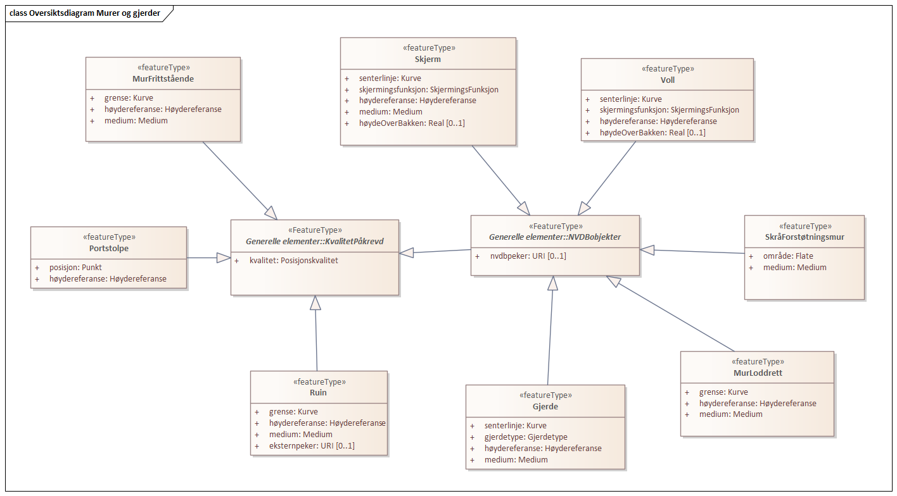
 
'''
 
.Realisering fra Bygnan 4.0 - Murer og gjerder 

 
'''
 
.Hoveddiagram Murer og gjerder - objekttyper og kodelister 
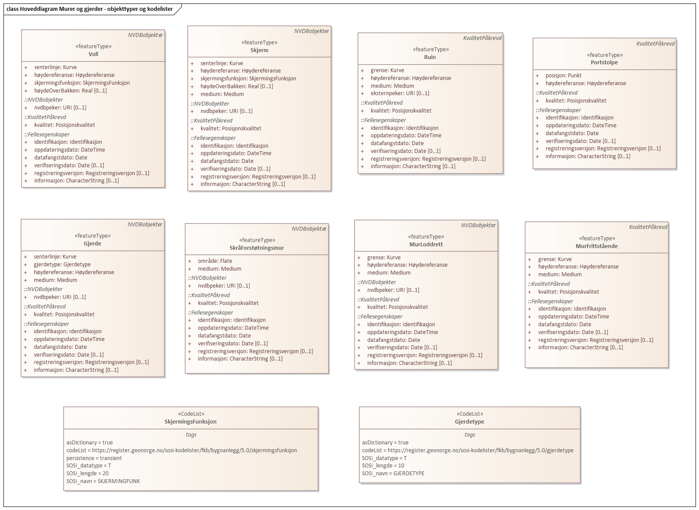
 
'''
 
[[gjerde]]
===== «featureType» Gjerde
*Definisjon:* oppsatt stengsel som hindrer passering. Står ofte i grensa mellom eiendommer
 
 
'''
.Illustrasjon av objekttype Gjerde
image::http://skjema.geonorge.no/SOSI/produktspesifikasjon/FKB-BygnAnlegg/5.0/figurer/objtype_gjerde.png[link=http://skjema.geonorge.no/SOSI/produktspesifikasjon/FKB-BygnAnlegg/5.0/figurer/objtype_gjerde.png, alt="Bilde av et eksempel på objekttypen Gjerde, eventuelt med påtegning av streker som viser hvor geometrien til objektet skal måles fra."]
[discrete]
====== Egenskaper
[cols="20,80"]
|===
|*Navn:* 
|*senterlinje*
 
|Definisjon: 
|forløp som følger objektets sentrale del
 
|Multiplisitet: 
|[1..1]
 
|Type: 
|http://skjema.geonorge.no/SOSI/basistype/GM_Curve[GM_Curve]
|===
[cols="20,80"]
|===
|*Navn:* 
|*gjerdetype*
 
|Definisjon: 
|Type gjerde
 
|Multiplisitet: 
|[1..1]
 
|Type: 
|<<gjerdetype,«CodeList» Gjerdetype>>
|Profilparametre i tagged values: 
|
defaultCodeSpace: https://register.geonorge.no/sosi-kodelister/fkb/bygnanlegg/5.0/gjerdetype + 
SOSI_datatype: T + 
SOSI_lengde: 10 + 
SOSI_navn: GJERDETYPE + 
|===
[cols="20,80"]
|===
|*Navn:* 
|*høydereferanse*
 
|Definisjon: 
|angivelse av om registreringen er utført på topp eller bunn av et element- f.eks. en skråning- mur osv.
 
|Multiplisitet: 
|[1..1]
 
|Type: 
|<<høydereferanse,«CodeList» Høydereferanse>>
|Profilparametre i tagged values: 
|
defaultCodeSpace: https://register.geonorge.no/sosi-kodelister/fkb/generell/5.0/hoydereferanse + 
SOSI_datatype: T + 
SOSI_lengde: 6 + 
SOSI_navn: HREF + 
|===
[cols="20,80"]
|===
|*Navn:* 
|*medium*
 
|Definisjon: 
|objektets beliggenhet i forhold til jordoverflaten
 
|Multiplisitet: 
|[1..1]
 
|Type: 
|<<medium,«CodeList» Medium>>
|Profilparametre i tagged values: 
|
defaultCodeSpace: https://register.geonorge.no/sosi-kodelister/fkb/generell/5.0/medium + 
SOSI_datatype: T + 
SOSI_lengde: 1 + 
SOSI_navn: MEDIUM + 
|===
 
[discrete]
====== Arv og realiseringer
[cols="20,80"]
|===
|Supertype: 
|<<nvdbobjekter,«FeatureType» NVDBobjekter>>
 
|Realisering av: 
|«ApplicationSchema» Bygnan-4.0/MurerOgGjerder::«featureType» AnnetGjerde +
|===
 
'''
 
[[murfrittstående]]
===== «featureType» MurFrittstående
*Definisjon:* mur hvor oppfyllingen på en side utgjør mindre enn halve høyden på den andre siden
 
 
'''
.Illustrasjon av objekttype MurFrittstående
image::http://skjema.geonorge.no/SOSI/produktspesifikasjon/FKB-BygnAnlegg/5.0/figurer/objtype_murfrittstaende.png[link=http://skjema.geonorge.no/SOSI/produktspesifikasjon/FKB-BygnAnlegg/5.0/figurer/objtype_murfrittstaende.png, alt="Bilde av et eksempel på objekttypen MurFrittstående, eventuelt med påtegning av streker som viser hvor geometrien til objektet skal måles fra."]
[discrete]
====== Egenskaper
[cols="20,80"]
|===
|*Navn:* 
|*grense*
 
|Definisjon: 
|forløp som følger overgang mellom ulike fenomener
 
|Multiplisitet: 
|[1..1]
 
|Type: 
|http://skjema.geonorge.no/SOSI/basistype/GM_Curve[GM_Curve]
|===
[cols="20,80"]
|===
|*Navn:* 
|*høydereferanse*
 
|Definisjon: 
|angivelse av om registreringen er utført på topp eller bunn av et element- f.eks. en skråning- mur osv.
 
|Multiplisitet: 
|[1..1]
 
|Type: 
|<<høydereferanse,«CodeList» Høydereferanse>>
|Profilparametre i tagged values: 
|
defaultCodeSpace: https://register.geonorge.no/sosi-kodelister/fkb/generell/5.0/hoydereferanse + 
SOSI_datatype: T + 
SOSI_lengde: 6 + 
SOSI_navn: HREF + 
|===
[cols="20,80"]
|===
|*Navn:* 
|*medium*
 
|Definisjon: 
|objektets beliggenhet i forhold til jordoverflaten
 
|Multiplisitet: 
|[1..1]
 
|Type: 
|<<medium,«CodeList» Medium>>
|Profilparametre i tagged values: 
|
defaultCodeSpace: https://register.geonorge.no/sosi-kodelister/fkb/generell/5.0/medium + 
SOSI_datatype: T + 
SOSI_lengde: 1 + 
SOSI_navn: MEDIUM + 
|===
 
[discrete]
====== Arv og realiseringer
[cols="20,80"]
|===
|Supertype: 
|<<kvalitetpåkrevd,«FeatureType» KvalitetPåkrevd>>
 
|Realisering av: 
|«ApplicationSchema» Bygnan-4.0/MurerOgGjerder::«featureType» MurFrittstående +
|===
 
'''
 
[[murloddrett]]
===== «featureType» MurLoddrett
*Definisjon:* forstøtningsmur hvor topp og bunn er ubetydelig forskjøvet i  forhold til hverandre
 
 
'''
.Illustrasjon av objekttype MurLoddrett
image::http://skjema.geonorge.no/SOSI/produktspesifikasjon/FKB-BygnAnlegg/5.0/figurer/objtype_murloddrett.png[link=http://skjema.geonorge.no/SOSI/produktspesifikasjon/FKB-BygnAnlegg/5.0/figurer/objtype_murloddrett.png, alt="Bilde av et eksempel på objekttypen MurLoddrett, eventuelt med påtegning av streker som viser hvor geometrien til objektet skal måles fra."]
[discrete]
====== Egenskaper
[cols="20,80"]
|===
|*Navn:* 
|*grense*
 
|Definisjon: 
|forløp som følger overgang mellom ulike fenomener
 
|Multiplisitet: 
|[1..1]
 
|Type: 
|http://skjema.geonorge.no/SOSI/basistype/GM_Curve[GM_Curve]
|===
[cols="20,80"]
|===
|*Navn:* 
|*høydereferanse*
 
|Definisjon: 
|angivelse av om registreringen er utført på topp eller bunn av et element- f.eks. en skråning- mur osv.
 
|Multiplisitet: 
|[1..1]
 
|Type: 
|<<høydereferanse,«CodeList» Høydereferanse>>
|Profilparametre i tagged values: 
|
defaultCodeSpace: https://register.geonorge.no/sosi-kodelister/fkb/generell/5.0/hoydereferanse + 
SOSI_datatype: T + 
SOSI_lengde: 6 + 
SOSI_navn: HREF + 
|===
[cols="20,80"]
|===
|*Navn:* 
|*medium*
 
|Definisjon: 
|objektets beliggenhet i forhold til jordoverflaten
 
|Multiplisitet: 
|[1..1]
 
|Type: 
|<<medium,«CodeList» Medium>>
|Profilparametre i tagged values: 
|
defaultCodeSpace: https://register.geonorge.no/sosi-kodelister/fkb/generell/5.0/medium + 
SOSI_datatype: T + 
SOSI_lengde: 1 + 
SOSI_navn: MEDIUM + 
|===
 
[discrete]
====== Arv og realiseringer
[cols="20,80"]
|===
|Supertype: 
|<<nvdbobjekter,«FeatureType» NVDBobjekter>>
 
|Realisering av: 
|«ApplicationSchema» Bygnan-4.0/MurerOgGjerder::«featureType» MurLoddrett +
|===
 
'''
 
[[portstolpe]]
===== «featureType» Portstolpe
*Definisjon:* stolpe som en port kan være hengslet til
 
 
'''
.Illustrasjon av objekttype Portstolpe
image::http://skjema.geonorge.no/SOSI/produktspesifikasjon/FKB-BygnAnlegg/5.0/figurer/objtype_portstolpe.png[link=http://skjema.geonorge.no/SOSI/produktspesifikasjon/FKB-BygnAnlegg/5.0/figurer/objtype_portstolpe.png, alt="Bilde av et eksempel på objekttypen Portstolpe, eventuelt med påtegning av streker som viser hvor geometrien til objektet skal måles fra."]
[discrete]
====== Egenskaper
[cols="20,80"]
|===
|*Navn:* 
|*posisjon*
 
|Definisjon: 
|sted som objektet eksisterer på
 
|Multiplisitet: 
|[1..1]
 
|Type: 
|http://skjema.geonorge.no/SOSI/basistype/GM_Point[GM_Point]
|===
[cols="20,80"]
|===
|*Navn:* 
|*høydereferanse*
 
|Definisjon: 
|koordinatregistering utført på topp eller bunn av et objekt
 
|Multiplisitet: 
|[1..1]
 
|Type: 
|<<høydereferanse,«CodeList» Høydereferanse>>
|Profilparametre i tagged values: 
|
defaultCodeSpace: https://register.geonorge.no/sosi-kodelister/fkb/generell/5.0/hoydereferanse + 
SOSI_datatype: T + 
SOSI_lengde: 6 + 
SOSI_navn: HREF + 
|===
 
[discrete]
====== Arv og realiseringer
[cols="20,80"]
|===
|Supertype: 
|<<kvalitetpåkrevd,«FeatureType» KvalitetPåkrevd>>
 
|Realisering av: 
|«ApplicationSchema» Bygnan-4.0/MurerOgGjerder::«featureType» Portstolpe +
|===
 
'''
 
[[ruin]]
===== «featureType» Ruin
*Definisjon:* Synlig mur som er rester etter tidligere byggverk
 
 
'''
.Illustrasjon av objekttype Ruin
image::http://skjema.geonorge.no/SOSI/produktspesifikasjon/FKB-BygnAnlegg/5.0/figurer/objtype_ruin.png[link=http://skjema.geonorge.no/SOSI/produktspesifikasjon/FKB-BygnAnlegg/5.0/figurer/objtype_ruin.png, alt="Bilde av et eksempel på objekttypen Ruin, eventuelt med påtegning av streker som viser hvor geometrien til objektet skal måles fra."]
[discrete]
====== Egenskaper
[cols="20,80"]
|===
|*Navn:* 
|*grense*
 
|Definisjon: 
|forløp som følger overgang mellom ulike fenomener
 
|Multiplisitet: 
|[1..1]
 
|Type: 
|http://skjema.geonorge.no/SOSI/basistype/GM_Curve[GM_Curve]
|===
[cols="20,80"]
|===
|*Navn:* 
|*høydereferanse*
 
|Definisjon: 
|angivelse av om registreringen er utført på topp eller bunn av et element- f.eks. en skråning- mur osv.
 
|Multiplisitet: 
|[1..1]
 
|Type: 
|<<høydereferanse,«CodeList» Høydereferanse>>
|Profilparametre i tagged values: 
|
defaultCodeSpace: https://register.geonorge.no/sosi-kodelister/fkb/generell/5.0/hoydereferanse + 
SOSI_datatype: T + 
SOSI_lengde: 6 + 
SOSI_navn: HREF + 
|===
[cols="20,80"]
|===
|*Navn:* 
|*medium*
 
|Definisjon: 
|objektets beliggenhet i forhold til jordoverflaten
 
|Multiplisitet: 
|[1..1]
 
|Type: 
|<<medium,«CodeList» Medium>>
|Profilparametre i tagged values: 
|
defaultCodeSpace: https://register.geonorge.no/sosi-kodelister/fkb/generell/5.0/medium + 
SOSI_datatype: T + 
SOSI_lengde: 1 + 
SOSI_navn: MEDIUM + 
|===
[cols="20,80"]
|===
|*Navn:* 
|*eksternpeker*
 
|Definisjon: 
|referanse til objektet i et eksternt system, f.eks. hos parkforvalter i kommunen.
 
|Multiplisitet: 
|[0..1]
 
|Type: 
|http://skjema.geonorge.no/SOSI/basistype/URI[URI]
|Profilparametre i tagged values: 
|
SOSI_datatype: T + 
SOSI_lengde: 255 + 
SOSI_navn: EKSTERNPEKER + 
|===
 
[discrete]
====== Arv og realiseringer
[cols="20,80"]
|===
|Supertype: 
|<<kvalitetpåkrevd,«FeatureType» KvalitetPåkrevd>>
 
|===
 
'''
 
[[skjerm]]
===== «featureType» Skjerm
*Definisjon:* frittstående konstruksjon laget for å skjerme mot støy eller snø, eller hindre/begrense ras og flom.
 
 
'''
.Illustrasjon av objekttype Skjerm
image::http://skjema.geonorge.no/SOSI/produktspesifikasjon/FKB-BygnAnlegg/5.0/figurer/objtype_skjerm.png[link=http://skjema.geonorge.no/SOSI/produktspesifikasjon/FKB-BygnAnlegg/5.0/figurer/objtype_skjerm.png, alt="Bilde av et eksempel på objekttypen Skjerm, eventuelt med påtegning av streker som viser hvor geometrien til objektet skal måles fra."]
[discrete]
====== Egenskaper
[cols="20,80"]
|===
|*Navn:* 
|*senterlinje*
 
|Definisjon: 
|forløp som følger objektets sentrale del
 
|Multiplisitet: 
|[1..1]
 
|Type: 
|http://skjema.geonorge.no/SOSI/basistype/GM_Curve[GM_Curve]
|===
[cols="20,80"]
|===
|*Navn:* 
|*skjermingsfunksjon*
 
|Definisjon: 
|hvilken funksjon skjermen har
 
|Multiplisitet: 
|[1..1]
 
|Type: 
|<<skjermingsfunksjon,«CodeList» SkjermingsFunksjon>>
|Profilparametre i tagged values: 
|
defaultCodeSpace: https://register.geonorge.no/sosi-kodelister/fkb/bygnanlegg/5.0/skjermingsfunksjon + 
SOSI_datatype: T + 
SOSI_lengde: 20 + 
SOSI_navn: SKJERMINGFUNK + 
|===
[cols="20,80"]
|===
|*Navn:* 
|*høydereferanse*
 
|Definisjon: 
|angivelse av om registreringen er utført på topp eller bunn av et element- f.eks. en skråning- mur osv.
 
|Multiplisitet: 
|[1..1]
 
|Type: 
|<<høydereferanse,«CodeList» Høydereferanse>>
|Profilparametre i tagged values: 
|
defaultCodeSpace: https://register.geonorge.no/sosi-kodelister/fkb/generell/5.0/hoydereferanse + 
SOSI_datatype: T + 
SOSI_lengde: 6 + 
SOSI_navn: HREF + 
|===
[cols="20,80"]
|===
|*Navn:* 
|*medium*
 
|Definisjon: 
|objektets beliggenhet i forhold til jordoverflaten
 
|Multiplisitet: 
|[1..1]
 
|Type: 
|<<medium,«CodeList» Medium>>
|Profilparametre i tagged values: 
|
defaultCodeSpace: https://register.geonorge.no/sosi-kodelister/fkb/generell/5.0/medium + 
SOSI_datatype: T + 
SOSI_lengde: 1 + 
SOSI_navn: MEDIUM + 
|===
[cols="20,80"]
|===
|*Navn:* 
|*høydeOverBakken*
 
|Definisjon: 
|høyde over bakken (angitt i meter)
 
|Multiplisitet: 
|[0..1]
 
|Type: 
|http://skjema.geonorge.no/SOSI/basistype/Real[Real]
|Profilparametre i tagged values: 
|
SOSI_datatype: D + 
SOSI_lengde: 10 + 
SOSI_navn: HOB + 
|===
 
[discrete]
====== Arv og realiseringer
[cols="20,80"]
|===
|Supertype: 
|<<nvdbobjekter,«FeatureType» NVDBobjekter>>
 
|Realisering av: 
|«ApplicationSchema» Bygnan-4.0/MurerOgGjerder::«featureType» Skjerm +
|===
 
'''
 
[[skråforstøtningsmur]]
===== «featureType» SkråForstøtningsmur
*Definisjon:* forstøtningsmur hvor topp og bunn er betydelig forskjøvet i forhold til hverandre
 
 
'''
.Illustrasjon av objekttype SkråForstøtningsmur
image::http://skjema.geonorge.no/SOSI/produktspesifikasjon/FKB-BygnAnlegg/5.0/figurer/objtype_skraforstotningsmur.png[link=http://skjema.geonorge.no/SOSI/produktspesifikasjon/FKB-BygnAnlegg/5.0/figurer/objtype_skraforstotningsmur.png, alt="Bilde av et eksempel på objekttypen SkråForstøtningsmur, eventuelt med påtegning av streker som viser hvor geometrien til objektet skal måles fra."]
[discrete]
====== Egenskaper
[cols="20,80"]
|===
|*Navn:* 
|*område*
 
|Definisjon: 
|objektets utstrekning
 
|Multiplisitet: 
|[1..1]
 
|Type: 
|http://skjema.geonorge.no/SOSI/basistype/GM_Surface[GM_Surface]
|===
[cols="20,80"]
|===
|*Navn:* 
|*medium*
 
|Definisjon: 
|objektets beliggenhet i forhold til jordoverflaten
 
|Multiplisitet: 
|[1..1]
 
|Type: 
|<<medium,«CodeList» Medium>>
|Profilparametre i tagged values: 
|
defaultCodeSpace: https://register.geonorge.no/sosi-kodelister/fkb/generell/5.0/medium + 
SOSI_datatype: T + 
SOSI_lengde: 1 + 
SOSI_navn: MEDIUM + 
|===
 
[discrete]
====== Arv og realiseringer
[cols="20,80"]
|===
|Supertype: 
|<<nvdbobjekter,«FeatureType» NVDBobjekter>>
 
|Realisering av: 
|«ApplicationSchema» Bygnan-4.0/MurerOgGjerder::«featureType» SkråForstøtningsmur +
|===
 
'''
 
[[voll]]
===== «featureType» Voll
*Definisjon:* opphøyd terrengformasjon anlagt for å hindre støy, ukontrollert gjennomstrømming av vann, skade fra  prosjektiler på skytebane o.l.
 
 
'''
.Illustrasjon av objekttype Voll
image::http://skjema.geonorge.no/SOSI/produktspesifikasjon/FKB-BygnAnlegg/5.0/figurer/objtype_voll.png[link=http://skjema.geonorge.no/SOSI/produktspesifikasjon/FKB-BygnAnlegg/5.0/figurer/objtype_voll.png, alt="Bilde av et eksempel på objekttypen Voll, eventuelt med påtegning av streker som viser hvor geometrien til objektet skal måles fra."]
[discrete]
====== Egenskaper
[cols="20,80"]
|===
|*Navn:* 
|*senterlinje*
 
|Definisjon: 
|forløp som følger objektets sentrale del
 
|Multiplisitet: 
|[1..1]
 
|Type: 
|http://skjema.geonorge.no/SOSI/basistype/GM_Curve[GM_Curve]
|===
[cols="20,80"]
|===
|*Navn:* 
|*skjermingsfunksjon*
 
|Definisjon: 
|hvilken funksjon vollen har
 
|Multiplisitet: 
|[1..1]
 
|Type: 
|<<skjermingsfunksjon,«CodeList» SkjermingsFunksjon>>
|Profilparametre i tagged values: 
|
defaultCodeSpace: https://register.geonorge.no/sosi-kodelister/fkb/bygnanlegg/5.0/skjermingsfunksjon + 
SOSI_datatype: T + 
SOSI_lengde: 20 + 
SOSI_navn: SKJERMINGFUNK + 
|===
[cols="20,80"]
|===
|*Navn:* 
|*høydereferanse*
 
|Definisjon: 
|angivelse av om registreringen er utført på topp eller bunn av et element- f.eks. en skråning- mur osv.
 
|Multiplisitet: 
|[1..1]
 
|Type: 
|<<høydereferanse,«CodeList» Høydereferanse>>
|Profilparametre i tagged values: 
|
defaultCodeSpace: https://register.geonorge.no/sosi-kodelister/fkb/generell/5.0/hoydereferanse + 
SOSI_datatype: T + 
SOSI_lengde: 6 + 
SOSI_navn: HREF + 
|===
[cols="20,80"]
|===
|*Navn:* 
|*høydeOverBakken*
 
|Definisjon: 
|objekts høyde over bakken
 
|Multiplisitet: 
|[0..1]
 
|Type: 
|http://skjema.geonorge.no/SOSI/basistype/Real[Real]
|Profilparametre i tagged values: 
|
SOSI_datatype: D + 
SOSI_lengde: 10 + 
SOSI_navn: HOB + 
|===
 
[discrete]
====== Arv og realiseringer
[cols="20,80"]
|===
|Supertype: 
|<<nvdbobjekter,«FeatureType» NVDBobjekter>>
 
|Realisering av: 
|«ApplicationSchema» Bygnan-4.0/MurerOgGjerder::«featureType» Voll +
|===
 
'''
 
[[gjerdetype]]
===== «CodeList» Gjerdetype
*Definisjon:* Type gjerde
 
[discrete]
====== Profilparametre i tagged values
[cols="20,80"]
|===
|asDictionary
|true
 
|codeList
|https://register.geonorge.no/sosi-kodelister/fkb/bygnanlegg/5.0/gjerdetype
 
|SOSI_datatype
|T
 
|SOSI_lengde
|10
 
|SOSI_navn
|GJERDETYPE
 
|===
 
'''
 
[[skjermingsfunksjon]]
===== «CodeList» SkjermingsFunksjon
*Definisjon:* ulike funksjoner en skjerm kan ha
 
[discrete]
====== Profilparametre i tagged values
[cols="20,80"]
|===
|asDictionary
|true
 
|codeList
|https://register.geonorge.no/sosi-kodelister/fkb/bygnanlegg/5.0/skjermingsfunksjon
 
|SOSI_datatype
|T
 
|SOSI_lengde
|20
 
|SOSI_navn
|SKJERMINGFUNK
 
|===
<<<
'''
==== Pakke: TekniskeAnleggKulturLek
*Definisjon:* Inneholder elementer fra SOSI Bygnan 4.0, TekniskeAnleggKulturLekMm
 
'''
 
.Oversiktsdiagram Kultur og lek 
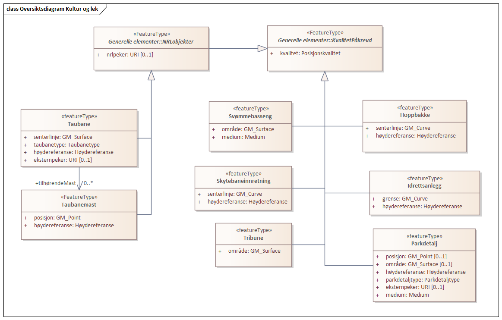
 
'''
 
.Realisering fra Bygnan 4.0 - TekniskeAnleggKulturLekMm 
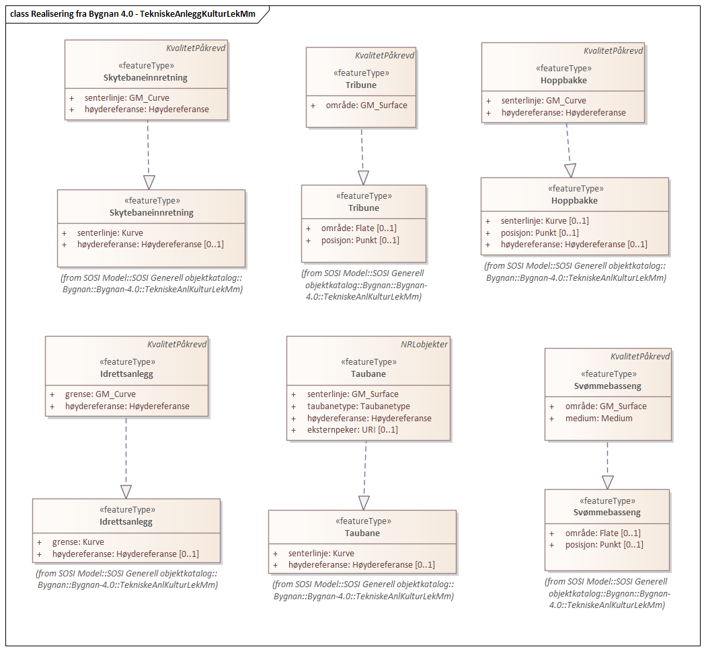
 
'''
 
.Hoveddiagram Kultur og lek - objekttyper og kodelister 
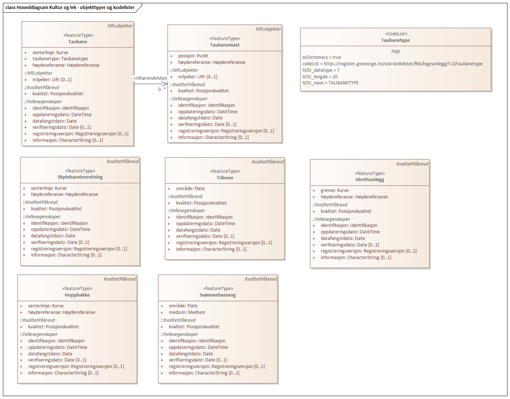
 
'''
 
[[hoppbakke]]
===== «featureType» Hoppbakke
*Definisjon:* anlegg for skihopping med kunstig eller naturlig tilløp
 
 
'''
.Illustrasjon av objekttype Hoppbakke
image::http://skjema.geonorge.no/SOSI/produktspesifikasjon/FKB-BygnAnlegg/5.0/figurer/objtype_hoppbakke.png[link=http://skjema.geonorge.no/SOSI/produktspesifikasjon/FKB-BygnAnlegg/5.0/figurer/objtype_hoppbakke.png, alt="Bilde av et eksempel på objekttypen Hoppbakke, eventuelt med påtegning av streker som viser hvor geometrien til objektet skal måles fra."]
[discrete]
====== Egenskaper
[cols="20,80"]
|===
|*Navn:* 
|*senterlinje*
 
|Definisjon: 
|forløp som følger objektets sentrale del
 
|Multiplisitet: 
|[1..1]
 
|Type: 
|http://skjema.geonorge.no/SOSI/basistype/GM_Curve[GM_Curve]
|===
[cols="20,80"]
|===
|*Navn:* 
|*høydereferanse*
 
|Definisjon: 
|angivelse av om registreringen er utført på topp eller bunn av et element- f.eks. en skråning- mur osv.
 
|Multiplisitet: 
|[1..1]
 
|Type: 
|<<høydereferanse,«CodeList» Høydereferanse>>
|Profilparametre i tagged values: 
|
defaultCodeSpace: https://register.geonorge.no/sosi-kodelister/fkb/generell/5.0/hoydereferanse + 
SOSI_datatype: T + 
SOSI_lengde: 6 + 
SOSI_navn: HREF + 
|===
 
[discrete]
====== Arv og realiseringer
[cols="20,80"]
|===
|Supertype: 
|<<kvalitetpåkrevd,«FeatureType» KvalitetPåkrevd>>
 
|Realisering av: 
|«ApplicationSchema» Bygnan-4.0/TekniskeAnlKulturLekMm::«featureType» Hoppbakke +
|===
 
'''
 
[[idrettsanlegg]]
===== «featureType» Idrettsanlegg
*Definisjon:* linje for avgrensning av anleggsmessige deler av et idrettsanlegg, som f.eks ytteravgrensning av en fotballbane

Merknad: Området rundt idrettsanlegget kan beskrives som arealbruksobjekt (se kap. for arealbruk).
 
 
'''
.Illustrasjon av objekttype Idrettsanlegg
image::http://skjema.geonorge.no/SOSI/produktspesifikasjon/FKB-BygnAnlegg/5.0/figurer/objtype_idrettsanlegg.png[link=http://skjema.geonorge.no/SOSI/produktspesifikasjon/FKB-BygnAnlegg/5.0/figurer/objtype_idrettsanlegg.png, alt="Bilde av et eksempel på objekttypen Idrettsanlegg, eventuelt med påtegning av streker som viser hvor geometrien til objektet skal måles fra."]
[discrete]
====== Egenskaper
[cols="20,80"]
|===
|*Navn:* 
|*grense*
 
|Definisjon: 
|forløp som følger overgang mellom ulike fenomener
 
|Multiplisitet: 
|[1..1]
 
|Type: 
|http://skjema.geonorge.no/SOSI/basistype/GM_Curve[GM_Curve]
|===
[cols="20,80"]
|===
|*Navn:* 
|*høydereferanse*
 
|Definisjon: 
|angivelse av om registreringen er utført på topp eller bunn av et element- f.eks. en skråning- mur osv.
 
|Multiplisitet: 
|[1..1]
 
|Type: 
|<<høydereferanse,«CodeList» Høydereferanse>>
|Profilparametre i tagged values: 
|
defaultCodeSpace: https://register.geonorge.no/sosi-kodelister/fkb/generell/5.0/hoydereferanse + 
SOSI_datatype: T + 
SOSI_lengde: 6 + 
SOSI_navn: HREF + 
|===
 
[discrete]
====== Arv og realiseringer
[cols="20,80"]
|===
|Supertype: 
|<<kvalitetpåkrevd,«FeatureType» KvalitetPåkrevd>>
 
|Realisering av: 
|«ApplicationSchema» Bygnan-4.0/TekniskeAnlKulturLekMm::«featureType» Idrettsanlegg +
|===
 
'''
 
[[parkdetalj]]
===== «featureType» Parkdetalj
*Definisjon:* detalj i parkmessig område

Merknad:
Omfatter detaljer som f.eks. bautaer, statuer, fontener, basseng, lekeapparater og sandkasser. Registreres som punkt- eller flategeometri.
 
 
'''
.Illustrasjon av objekttype Parkdetalj
image::http://skjema.geonorge.no/SOSI/produktspesifikasjon/FKB-BygnAnlegg/5.0/figurer/objtype_parkdetalj.png[link=http://skjema.geonorge.no/SOSI/produktspesifikasjon/FKB-BygnAnlegg/5.0/figurer/objtype_parkdetalj.png, alt="Bilde av et eksempel på objekttypen Parkdetalj, eventuelt med påtegning av streker som viser hvor geometrien til objektet skal måles fra."]
[discrete]
====== Egenskaper
[cols="20,80"]
|===
|*Navn:* 
|*posisjon*
 
|Definisjon: 
|sted som objektet eksisterer på
 
|Multiplisitet: 
|[0..1]
 
|Type: 
|http://skjema.geonorge.no/SOSI/basistype/GM_Point[GM_Point]
|===
[cols="20,80"]
|===
|*Navn:* 
|*område*
 
|Definisjon: 
|objektets utstrekning
 
|Multiplisitet: 
|[0..1]
 
|Type: 
|http://skjema.geonorge.no/SOSI/basistype/GM_Surface[GM_Surface]
|===
[cols="20,80"]
|===
|*Navn:* 
|*høydereferanse*
 
|Definisjon: 
|angivelse av om registreringen er utført på topp eller bunn av et element- f.eks. en skråning- mur osv.
 
|Multiplisitet: 
|[1..1]
 
|Type: 
|<<høydereferanse,«CodeList» Høydereferanse>>
|Profilparametre i tagged values: 
|
defaultCodeSpace: https://register.geonorge.no/sosi-kodelister/fkb/generell/5.0/hoydereferanse + 
SOSI_datatype: T + 
SOSI_lengde: 6 + 
SOSI_navn: HREF + 
|===
[cols="20,80"]
|===
|*Navn:* 
|*parkdetaljtype*
 
|Definisjon: 
|angir type parkdetalj
 
|Multiplisitet: 
|[1..1]
 
|Type: 
|<<parkdetaljtype,«CodeList» Parkdetaljtype>>
|Profilparametre i tagged values: 
|
defaultCodeSpace: https://register.geonorge.no/sosi-kodelister/fkb/bygnanlegg/5.0/parkdetaljtype + 
SOSI_datatype: T + 
SOSI_lengde: 10 + 
SOSI_navn: PARKDETALJTYPE + 
|===
[cols="20,80"]
|===
|*Navn:* 
|*eksternpeker*
 
|Definisjon: 
|referanse til objektet i et eksternt system, f.eks. hos parkforvalter i kommunen.
 
|Multiplisitet: 
|[0..1]
 
|Type: 
|http://skjema.geonorge.no/SOSI/basistype/URI[URI]
|Profilparametre i tagged values: 
|
SOSI_datatype: T + 
SOSI_lengde: 255 + 
SOSI_navn: EKSTERNPEKER + 
|===
[cols="20,80"]
|===
|*Navn:* 
|*medium*
 
|Definisjon: 
|objektets beliggenhet i forhold til jordoverflaten
 
|Multiplisitet: 
|[1..1]
 
|Type: 
|<<medium,«CodeList» Medium>>
|Profilparametre i tagged values: 
|
SOSI_datatype: T + 
SOSI_lengde: 1 + 
SOSI_navn: MEDIUM + 
|===
 
[discrete]
====== Restriksjoner
[cols="20,80"]
|===
|*Navn:* 
|*Skal ha enten punkt- eller flategeometri*
 
|Beskrivelse: 
|inv: (self.område -&gt; size() ) + (self.posisjon -&gt; size() ) = 1
 
|===
 
[discrete]
====== Arv og realiseringer
[cols="20,80"]
|===
|Supertype: 
|<<kvalitetpåkrevd,«FeatureType» KvalitetPåkrevd>>
 
|Realisering av: 
|«ApplicationSchema» Bygnan-4.0/BygningsmessigeAnlegg/Pakke1::«featureType» BautaStatue +
|===
 
'''
 
[[skytebaneinnretning]]
===== «featureType» Skytebaneinnretning
*Definisjon:* omriss av tekniske anlegg på skytebane - standplass og skiver som ikke blir registrert som f.eks bygninger og murer
 
 
'''
.Illustrasjon av objekttype Skytebaneinnretning
image::http://skjema.geonorge.no/SOSI/produktspesifikasjon/FKB-BygnAnlegg/5.0/figurer/objtype_skytebaneinnretning.png[link=http://skjema.geonorge.no/SOSI/produktspesifikasjon/FKB-BygnAnlegg/5.0/figurer/objtype_skytebaneinnretning.png, alt="Bilde av et eksempel på objekttypen Skytebaneinnretning, eventuelt med påtegning av streker som viser hvor geometrien til objektet skal måles fra."]
[discrete]
====== Egenskaper
[cols="20,80"]
|===
|*Navn:* 
|*senterlinje*
 
|Definisjon: 
|forløp som følger objektets sentrale del
 
|Multiplisitet: 
|[1..1]
 
|Type: 
|http://skjema.geonorge.no/SOSI/basistype/GM_Curve[GM_Curve]
|===
[cols="20,80"]
|===
|*Navn:* 
|*høydereferanse*
 
|Definisjon: 
|angivelse av om registreringen er utført på topp eller bunn av et element- f.eks. en skråning- mur osv.
 
|Multiplisitet: 
|[1..1]
 
|Type: 
|<<høydereferanse,«CodeList» Høydereferanse>>
|Profilparametre i tagged values: 
|
defaultCodeSpace: https://register.geonorge.no/sosi-kodelister/fkb/generell/5.0/hoydereferanse + 
SOSI_datatype: T + 
SOSI_lengde: 6 + 
SOSI_navn: HREF + 
|===
 
[discrete]
====== Arv og realiseringer
[cols="20,80"]
|===
|Supertype: 
|<<kvalitetpåkrevd,«FeatureType» KvalitetPåkrevd>>
 
|Realisering av: 
|«ApplicationSchema» Bygnan-4.0/TekniskeAnlKulturLekMm::«featureType» Skytebaneinnretning +
|===
 
'''
 
[[svømmebasseng]]
===== «featureType» Svømmebasseng
*Definisjon:* basseng for svømming og vannlek
 
 
'''
.Illustrasjon av objekttype Svømmebasseng
image::http://skjema.geonorge.no/SOSI/produktspesifikasjon/FKB-BygnAnlegg/5.0/figurer/objtype_svommebasseng.png[link=http://skjema.geonorge.no/SOSI/produktspesifikasjon/FKB-BygnAnlegg/5.0/figurer/objtype_svommebasseng.png, alt="Bilde av et eksempel på objekttypen Svømmebasseng, eventuelt med påtegning av streker som viser hvor geometrien til objektet skal måles fra."]
[discrete]
====== Egenskaper
[cols="20,80"]
|===
|*Navn:* 
|*område*
 
|Definisjon: 
|objektets utstrekning
 
|Multiplisitet: 
|[1..1]
 
|Type: 
|http://skjema.geonorge.no/SOSI/basistype/GM_Surface[GM_Surface]
|===
[cols="20,80"]
|===
|*Navn:* 
|*medium*
 
|Definisjon: 
|objektets beliggenhet i forhold til jordoverflaten
 
|Multiplisitet: 
|[1..1]
 
|Type: 
|<<medium,«CodeList» Medium>>
|Profilparametre i tagged values: 
|
defaultCodeSpace: https://register.geonorge.no/sosi-kodelister/fkb/generell/5.0/medium + 
SOSI_datatype: T + 
SOSI_lengde: 1 + 
SOSI_navn: MEDIUM + 
|===
 
[discrete]
====== Arv og realiseringer
[cols="20,80"]
|===
|Supertype: 
|<<kvalitetpåkrevd,«FeatureType» KvalitetPåkrevd>>
 
|Realisering av: 
|«ApplicationSchema» Bygnan-4.0/TekniskeAnlKulturLekMm::«featureType» Svømmebasseng +
|===
 
'''
 
[[taubane]]
===== «featureType» Taubane
*Definisjon:* innretning hvor tau eller vaiere bærer og eller trekker last over en strekning
 
 
'''
.Illustrasjon av objekttype Taubane
image::http://skjema.geonorge.no/SOSI/produktspesifikasjon/FKB-BygnAnlegg/5.0/figurer/objtype_taubane.png[link=http://skjema.geonorge.no/SOSI/produktspesifikasjon/FKB-BygnAnlegg/5.0/figurer/objtype_taubane.png, alt="Bilde av et eksempel på objekttypen Taubane, eventuelt med påtegning av streker som viser hvor geometrien til objektet skal måles fra."]
[discrete]
====== Egenskaper
[cols="20,80"]
|===
|*Navn:* 
|*senterlinje*
 
|Definisjon: 
|forløp som følger objektets sentrale del
 
|Multiplisitet: 
|[1..1]
 
|Type: 
|http://skjema.geonorge.no/SOSI/basistype/GM_Surface[GM_Surface]
|===
[cols="20,80"]
|===
|*Navn:* 
|*taubanetype*
 
|Definisjon: 
|hva slags type taubane
 
|Multiplisitet: 
|[1..1]
 
|Type: 
|<<taubanetype,«CodeList» Taubanetype>>
|Profilparametre i tagged values: 
|
defaultCodeSpace: https://register.geonorge.no/sosi-kodelister/fkb/bygnanlegg/5.0/taubanetype + 
SOSI_datatype: T + 
SOSI_lengde: 10 + 
SOSI_navn: TAUBANETYPE + 
|===
[cols="20,80"]
|===
|*Navn:* 
|*høydereferanse*
 
|Definisjon: 
|angivelse av om registreringen er utført på topp eller bunn av et element
 
|Multiplisitet: 
|[1..1]
 
|Type: 
|<<høydereferanse,«CodeList» Høydereferanse>>
|Profilparametre i tagged values: 
|
defaultCodeSpace: https://register.geonorge.no/sosi-kodelister/fkb/generell/5.0/hoydereferanse + 
SOSI_datatype: T + 
SOSI_lengde: 6 + 
SOSI_navn: HREF + 
|===
[cols="20,80"]
|===
|*Navn:* 
|*eksternpeker*
 
|Definisjon: 
|referanse til objektet i et eksternt system
 
|Multiplisitet: 
|[0..1]
 
|Type: 
|http://skjema.geonorge.no/SOSI/basistype/URI[URI]
|Profilparametre i tagged values: 
|
SOSI_datatype: T + 
SOSI_lengde: 255 + 
SOSI_navn: EKSTERNPEKER + 
|===
 
[discrete]
====== Roller
[cols="20,80"]
|===
|*Rollenavn:* 
|*tilhørendeMast*
 
|Definisjon:
|viser hvilke taubanemaster som tilhører hvilke taubaner
 
|Multiplisitet: 
|[0..*]
 
|Til klasse
|<<taubanemast,«FeatureType» Taubanemast>>
|===
 
[discrete]
====== Arv og realiseringer
[cols="20,80"]
|===
|Supertype: 
|<<nrlobjekter,«FeatureType» NRLobjekter>>
 
|Realisering av: 
|«ApplicationSchema» Bygnan-4.0/TekniskeAnlKulturLekMm::«featureType» Taubane +
|===
 
'''
 
[[taubanemast]]
===== «FeatureType» Taubanemast
*Definisjon:* mast som taubanen er hengt opp i
 
 
'''
.Illustrasjon av objekttype Taubanemast
image::http://skjema.geonorge.no/SOSI/produktspesifikasjon/FKB-BygnAnlegg/5.0/figurer/objtype_taubanemast.png[link=http://skjema.geonorge.no/SOSI/produktspesifikasjon/FKB-BygnAnlegg/5.0/figurer/objtype_taubanemast.png, alt="Bilde av et eksempel på objekttypen Taubanemast, eventuelt med påtegning av streker som viser hvor geometrien til objektet skal måles fra."]
[discrete]
====== Egenskaper
[cols="20,80"]
|===
|*Navn:* 
|*posisjon*
 
|Definisjon: 
|sted som objektet eksisterer på
 
|Multiplisitet: 
|[1..1]
 
|Type: 
|http://skjema.geonorge.no/SOSI/basistype/GM_Point[GM_Point]
|===
[cols="20,80"]
|===
|*Navn:* 
|*høydereferanse*
 
|Definisjon: 
|angivelse av om registreringen av høydeverdi er utført på topp eller bunn av et element
 
|Multiplisitet: 
|[1..1]
 
|Type: 
|<<høydereferanse,«CodeList» Høydereferanse>>
|Profilparametre i tagged values: 
|
defaultCodeSpace: https://register.geonorge.no/sosi-kodelister/fkb/generell/5.0/hoydereferanse + 
SOSI_datatype: T + 
SOSI_lengde: 6 + 
SOSI_navn: HREF + 
|===
[cols="20,80"]
|===
|*Navn:* 
|*linjebredde*
 
|Definisjon: 
|største avstand mellom vaierene som er hengt opp i ei mast
 
|Multiplisitet: 
|[0..1]
 
|Type: 
|http://skjema.geonorge.no/SOSI/basistype/Real[Real]
|Profilparametre i tagged values: 
|
SOSI_datatype: D + 
SOSI_lengde: 6.2 + 
SOSI_navn: LINJEBREDDE + 
|===
 
[discrete]
====== Arv og realiseringer
[cols="20,80"]
|===
|Supertype: 
|<<nrlobjekter,«FeatureType» NRLobjekter>>
 
|===
 
'''
 
[[tribune]]
===== «featureType» Tribune
*Definisjon:* opparbeidet anlegg av metall- stein- mur eller tre for betjening av publikum på kulturarenaer, særlig idrettsanlegg
Merknad: Tribune som er innredet for bruk, f.eks. som kontor eller butikk, vil være en bygningsenhet.
 
 
'''
.Illustrasjon av objekttype Tribune
image::http://skjema.geonorge.no/SOSI/produktspesifikasjon/FKB-BygnAnlegg/5.0/figurer/objtype_tribune.png[link=http://skjema.geonorge.no/SOSI/produktspesifikasjon/FKB-BygnAnlegg/5.0/figurer/objtype_tribune.png, alt="Bilde av et eksempel på objekttypen Tribune, eventuelt med påtegning av streker som viser hvor geometrien til objektet skal måles fra."]
[discrete]
====== Egenskaper
[cols="20,80"]
|===
|*Navn:* 
|*område*
 
|Definisjon: 
|objektets utstrekning
 
|Multiplisitet: 
|[1..1]
 
|Type: 
|http://skjema.geonorge.no/SOSI/basistype/GM_Surface[GM_Surface]
|===
 
[discrete]
====== Arv og realiseringer
[cols="20,80"]
|===
|Supertype: 
|<<kvalitetpåkrevd,«FeatureType» KvalitetPåkrevd>>
 
|Realisering av: 
|«ApplicationSchema» Bygnan-4.0/TekniskeAnlKulturLekMm::«featureType» Tribune +
|===
 
'''
 
[[taubanetype]]
===== «CodeList» Taubanetype
*Definisjon:* hva slags type taubane
 
[discrete]
====== Profilparametre i tagged values
[cols="20,80"]
|===
|asDictionary
|true
 
|codeList
|https://register.geonorge.no/sosi-kodelister/fkb/bygnanlegg/5.0/taubanetype
 
|SOSI_datatype
|T
 
|SOSI_lengde
|10
 
|SOSI_navn
|TAUBANETYPE
 
|===
 
'''
 
[[parkdetaljtype]]
===== «CodeList» Parkdetaljtype
*Definisjon:* angir type parkdetalj
 
[discrete]
====== Profilparametre i tagged values
[cols="20,80"]
|===
|asDictionary
|true
 
|codeList
|https://register.geonorge.no/sosi-kodelister/fkb/bygnanlegg/5.0/parkdetaljtype
 
|SOSI_datatype
|T
 
|SOSI_lengde
|15
 
|SOSI_navn
|PARKDETALJTYPE
 
|===
<<<
'''
==== Pakke: TekniskeAnleggVannVassdragKyst
*Definisjon:* Inneholder elementer fra SOSI Bygnan 4.0, TekniskeAnleggVannVassdragKyst
 
'''
 
.Oversiktsdiagram Vann 
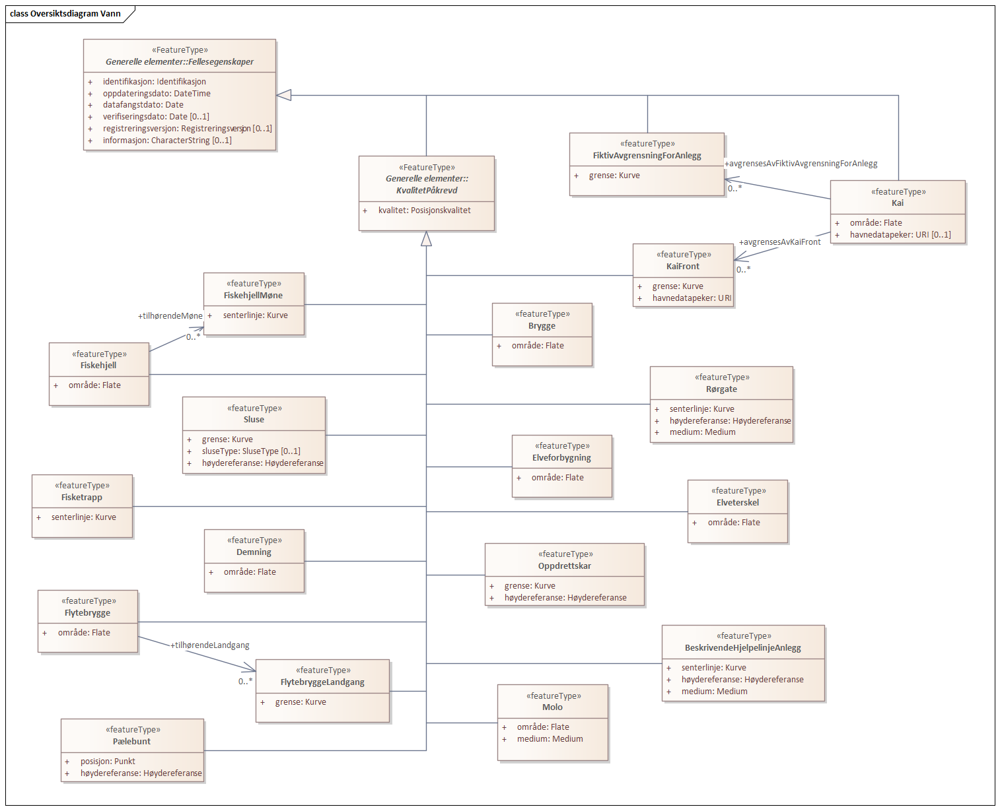
 
'''
 
.Realisering fra Bygnan 4.0 - TekniskeAnleggVannVassdragKyst 
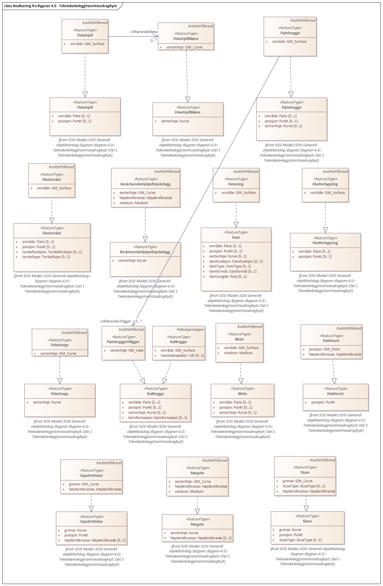
 
'''
 
.Hoveddiagram Vann - objekttyper og kodelister 
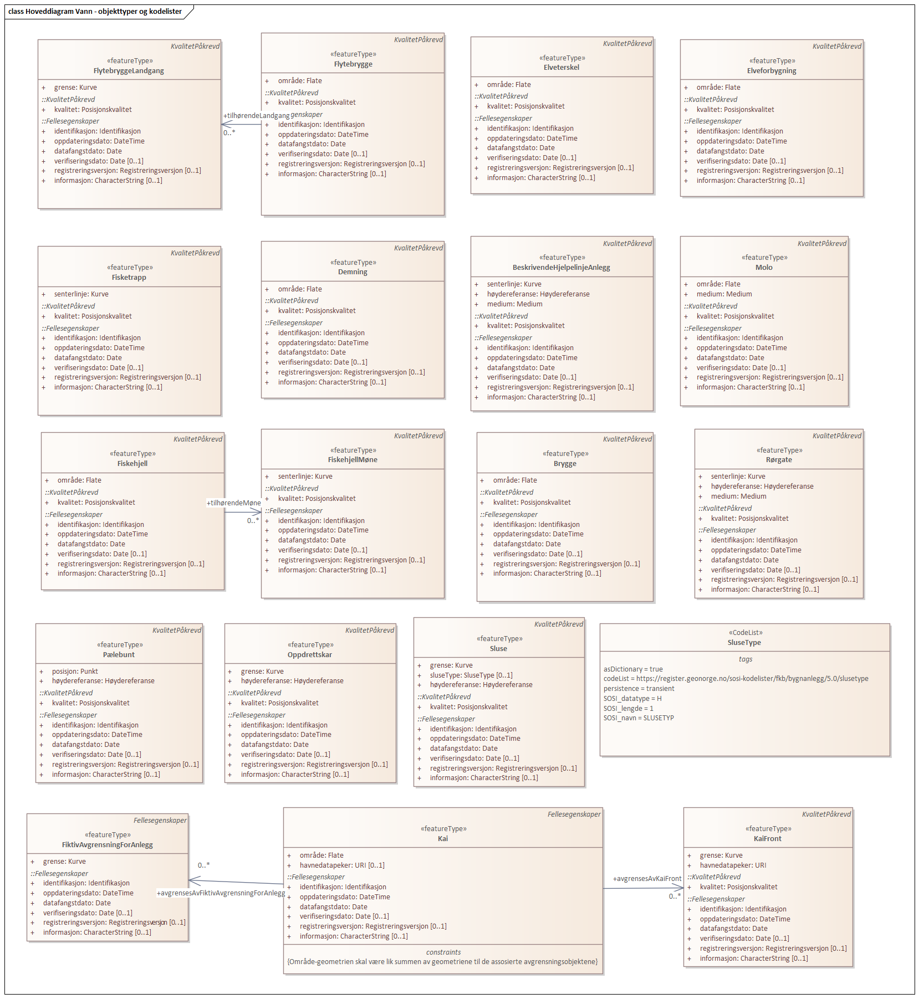
 
'''
 
[[beskrivendehjelpelinjeanlegg]]
===== «featureType» BeskrivendeHjelpelinjeAnlegg
*Definisjon:* karakteristiske linjer på bygningsmessige- og tekniske anlegg

Merknad:
Kan også benyttes til å registrere mindre selvstendige bygningsmessige anlegg som ikke omfattes av andre objekttyper i FKB, men som det er naturlig å registrere i et detaljert grunnkart. 

Eksempler: 
Markerte linjer på en demning, molo, sluse, pipe, tårn, murloddrett og små frittstående anlegg som f.eks. skilderhus, kiosker etc.
 
[discrete]
====== Egenskaper
[cols="20,80"]
|===
|*Navn:* 
|*senterlinje*
 
|Definisjon: 
|forløp som følger objektets sentrale del
 
|Multiplisitet: 
|[1..1]
 
|Type: 
|http://skjema.geonorge.no/SOSI/basistype/GM_Curve[GM_Curve]
|===
[cols="20,80"]
|===
|*Navn:* 
|*høydereferanse*
 
|Definisjon: 
|koordinatregistering utført på topp eller bunn av et objekt
 
|Multiplisitet: 
|[1..1]
 
|Type: 
|<<høydereferanse,«CodeList» Høydereferanse>>
|Profilparametre i tagged values: 
|
defaultCodeSpace: https://register.geonorge.no/sosi-kodelister/fkb/generell/5.0/hoydereferanse + 
SOSI_datatype: T + 
SOSI_lengde: 6 + 
SOSI_navn: HREF + 
|===
[cols="20,80"]
|===
|*Navn:* 
|*medium*
 
|Definisjon: 
|objektets beliggenhet i forhold til jordoverflaten
 
|Multiplisitet: 
|[1..1]
 
|Type: 
|<<medium,«CodeList» Medium>>
|Profilparametre i tagged values: 
|
defaultCodeSpace: https://register.geonorge.no/sosi-kodelister/fkb/generell/5.0/medium + 
SOSI_datatype: T + 
SOSI_lengde: 1 + 
SOSI_navn: MEDIUM + 
|===
 
[discrete]
====== Arv og realiseringer
[cols="20,80"]
|===
|Supertype: 
|<<kvalitetpåkrevd,«FeatureType» KvalitetPåkrevd>>
 
|Realisering av: 
|«ApplicationSchema» Bygnan-4.0/TekniskeAnleggVannVassdragKyst/Del 1 TekniskeAnleggVannVassdragKyst::«featureType» BeskrivendeHjelpelinjeAnlegg +
|===
 
'''
 
[[demning]]
===== «featureType» Demning
*Definisjon:* konstruksjon for å heve vannspeilet og danne et kunstig vannmagasin, samt regulere vannføringen
 
 
'''
.Illustrasjon av objekttype Demning
image::http://skjema.geonorge.no/SOSI/produktspesifikasjon/FKB-BygnAnlegg/5.0/figurer/objtype_demning.png[link=http://skjema.geonorge.no/SOSI/produktspesifikasjon/FKB-BygnAnlegg/5.0/figurer/objtype_demning.png, alt="Bilde av et eksempel på objekttypen Demning, eventuelt med påtegning av streker som viser hvor geometrien til objektet skal måles fra."]
[discrete]
====== Egenskaper
[cols="20,80"]
|===
|*Navn:* 
|*område*
 
|Definisjon: 
|objektets utstrekning
 
|Multiplisitet: 
|[1..1]
 
|Type: 
|http://skjema.geonorge.no/SOSI/basistype/GM_Surface[GM_Surface]
|===
 
[discrete]
====== Arv og realiseringer
[cols="20,80"]
|===
|Supertype: 
|<<kvalitetpåkrevd,«FeatureType» KvalitetPåkrevd>>
 
|Realisering av: 
|«ApplicationSchema» Bygnan-4.0/TekniskeAnleggVannVassdragKyst/Del 1 TekniskeAnleggVannVassdragKyst::«featureType» Dam +
|===
 
'''
 
[[elveforbygning]]
===== «featureType» Elveforbygning
*Definisjon:* konstruksjon i eller langs vassdrag for å sikre mot erosjon, flom eller som miljøtiltak
 
 
'''
.Illustrasjon av objekttype Elveforbygning
image::http://skjema.geonorge.no/SOSI/produktspesifikasjon/FKB-BygnAnlegg/5.0/figurer/objtype_elveforbygning.png[link=http://skjema.geonorge.no/SOSI/produktspesifikasjon/FKB-BygnAnlegg/5.0/figurer/objtype_elveforbygning.png, alt="Bilde av et eksempel på objekttypen Elveforbygning, eventuelt med påtegning av streker som viser hvor geometrien til objektet skal måles fra."]
[discrete]
====== Egenskaper
[cols="20,80"]
|===
|*Navn:* 
|*område*
 
|Definisjon: 
|objektets utstrekning
 
|Multiplisitet: 
|[1..1]
 
|Type: 
|http://skjema.geonorge.no/SOSI/basistype/GM_Surface[GM_Surface]
|===
 
[discrete]
====== Arv og realiseringer
[cols="20,80"]
|===
|Supertype: 
|<<kvalitetpåkrevd,«FeatureType» KvalitetPåkrevd>>
 
|Realisering av: 
|«ApplicationSchema» Bygnan-4.0/TekniskeAnleggVannVassdragKyst/Del 1 TekniskeAnleggVannVassdragKyst::«featureType» Elveforbygning +
|===
 
'''
 
[[elveterskel]]
===== «featureType» Elveterskel
*Definisjon:* kunstig oppbygning i elver som brukes for å lage vannspeil i elveløpet
 
 
'''
.Illustrasjon av objekttype Elveterskel
image::http://skjema.geonorge.no/SOSI/produktspesifikasjon/FKB-BygnAnlegg/5.0/figurer/objtype_elveterskel.png[link=http://skjema.geonorge.no/SOSI/produktspesifikasjon/FKB-BygnAnlegg/5.0/figurer/objtype_elveterskel.png, alt="Bilde av et eksempel på objekttypen Elveterskel, eventuelt med påtegning av streker som viser hvor geometrien til objektet skal måles fra."]
[discrete]
====== Egenskaper
[cols="20,80"]
|===
|*Navn:* 
|*område*
 
|Definisjon: 
|objektets utstrekning
 
|Multiplisitet: 
|[1..1]
 
|Type: 
|http://skjema.geonorge.no/SOSI/basistype/GM_Surface[GM_Surface]
|===
 
[discrete]
====== Arv og realiseringer
[cols="20,80"]
|===
|Supertype: 
|<<kvalitetpåkrevd,«FeatureType» KvalitetPåkrevd>>
 
|Realisering av: 
|«ApplicationSchema» Bygnan-4.0/TekniskeAnleggVannVassdragKyst/Del 1 TekniskeAnleggVannVassdragKyst::«featureType» Elveterskel +
|===
 
'''
 
[[fiktivavgrensningforanlegg]]
===== «featureType» FiktivAvgrensningForAnlegg
*Definisjon:* fiktiv avgrensningslinje for anlegg
Merknad: Brukes når det skal dannes flater av bygningsmessige- og tekniske anlegg og det mangler en eller flere avgrensingslinjer.
 
[discrete]
====== Egenskaper
[cols="20,80"]
|===
|*Navn:* 
|*grense*
 
|Definisjon: 
|forløp som følger overgang mellom ulike fenomener
 
|Multiplisitet: 
|[1..1]
 
|Type: 
|http://skjema.geonorge.no/SOSI/basistype/GM_Curve[GM_Curve]
|===
 
[discrete]
====== Arv og realiseringer
[cols="20,80"]
|===
|Supertype: 
|<<fellesegenskaper,«FeatureType» Fellesegenskaper>>
 
|===
 
'''
 
[[fiskehjell]]
===== «featureType» Fiskehjell
*Definisjon:* anordning bygd opp for tørking av fisk
 
 
'''
.Illustrasjon av objekttype Fiskehjell
image::http://skjema.geonorge.no/SOSI/produktspesifikasjon/FKB-BygnAnlegg/5.0/figurer/objtype_fiskehjell.png[link=http://skjema.geonorge.no/SOSI/produktspesifikasjon/FKB-BygnAnlegg/5.0/figurer/objtype_fiskehjell.png, alt="Bilde av et eksempel på objekttypen Fiskehjell, eventuelt med påtegning av streker som viser hvor geometrien til objektet skal måles fra."]
[discrete]
====== Egenskaper
[cols="20,80"]
|===
|*Navn:* 
|*område*
 
|Definisjon: 
|objektets utstrekning
 
|Multiplisitet: 
|[1..1]
 
|Type: 
|http://skjema.geonorge.no/SOSI/basistype/GM_Surface[GM_Surface]
|===
 
[discrete]
====== Roller
[cols="20,80"]
|===
|*Rollenavn:* 
|*tilhørendeMøne*
 
|Definisjon:
|viser hvilke fiskehjellmøne som tilhører hvilke fiskehjell
 
|Multiplisitet: 
|[0..*]
 
|Til klasse
|<<fiskehjellmøne,«featureType» FiskehjellMøne>>
|===
 
[discrete]
====== Arv og realiseringer
[cols="20,80"]
|===
|Supertype: 
|<<kvalitetpåkrevd,«FeatureType» KvalitetPåkrevd>>
 
|Realisering av: 
|«ApplicationSchema» Bygnan-4.0/TekniskeAnleggVannVassdragKyst/Del 1 TekniskeAnleggVannVassdragKyst::«featureType» Fiskehjell +
|===
 
'''
 
[[fiskehjellmøne]]
===== «featureType» FiskehjellMøne
*Definisjon:* toppen av rammeverket for fiskehjell
 
 
'''
.Illustrasjon av objekttype FiskehjellMøne
image::http://skjema.geonorge.no/SOSI/produktspesifikasjon/FKB-BygnAnlegg/5.0/figurer/objtype_fiskehjellmone.png[link=http://skjema.geonorge.no/SOSI/produktspesifikasjon/FKB-BygnAnlegg/5.0/figurer/objtype_fiskehjellmone.png, alt="Bilde av et eksempel på objekttypen FiskehjellMøne, eventuelt med påtegning av streker som viser hvor geometrien til objektet skal måles fra."]
[discrete]
====== Egenskaper
[cols="20,80"]
|===
|*Navn:* 
|*senterlinje*
 
|Definisjon: 
|forløp som følger objektets sentrale del
 
|Multiplisitet: 
|[1..1]
 
|Type: 
|http://skjema.geonorge.no/SOSI/basistype/GM_Curve[GM_Curve]
|===
 
[discrete]
====== Arv og realiseringer
[cols="20,80"]
|===
|Supertype: 
|<<kvalitetpåkrevd,«FeatureType» KvalitetPåkrevd>>
 
|Realisering av: 
|«ApplicationSchema» Bygnan-4.0/TekniskeAnleggVannVassdragKyst/Del 1 TekniskeAnleggVannVassdragKyst::«featureType» FiskehjellMøne +
|===
 
'''
 
[[fisketrapp]]
===== «featureType» Fisketrapp
*Definisjon:* innretning i elver for at fisken kan vandre oppover elven
 
 
'''
.Illustrasjon av objekttype Fisketrapp
image::http://skjema.geonorge.no/SOSI/produktspesifikasjon/FKB-BygnAnlegg/5.0/figurer/objtype_fisketrapp.png[link=http://skjema.geonorge.no/SOSI/produktspesifikasjon/FKB-BygnAnlegg/5.0/figurer/objtype_fisketrapp.png, alt="Bilde av et eksempel på objekttypen Fisketrapp, eventuelt med påtegning av streker som viser hvor geometrien til objektet skal måles fra."]
[discrete]
====== Egenskaper
[cols="20,80"]
|===
|*Navn:* 
|*senterlinje*
 
|Definisjon: 
|forløp som følger overgang mellom ulike fenomener
 
|Multiplisitet: 
|[1..1]
 
|Type: 
|http://skjema.geonorge.no/SOSI/basistype/GM_Curve[GM_Curve]
|===
 
[discrete]
====== Arv og realiseringer
[cols="20,80"]
|===
|Supertype: 
|<<kvalitetpåkrevd,«FeatureType» KvalitetPåkrevd>>
 
|Realisering av: 
|«ApplicationSchema» Bygnan-4.0/TekniskeAnleggVannVassdragKyst/Del 1 TekniskeAnleggVannVassdragKyst::«featureType» Fisketrapp +
|===
 
'''
 
[[flytebrygge]]
===== «featureType» Flytebrygge
*Definisjon:* flytende plattform som er forankret til bunn og hvor plasseringen kan avhenge av vind og strømretning
 
 
'''
.Illustrasjon av objekttype Flytebrygge
image::http://skjema.geonorge.no/SOSI/produktspesifikasjon/FKB-BygnAnlegg/5.0/figurer/objtype_flytebrygge.png[link=http://skjema.geonorge.no/SOSI/produktspesifikasjon/FKB-BygnAnlegg/5.0/figurer/objtype_flytebrygge.png, alt="Bilde av et eksempel på objekttypen Flytebrygge, eventuelt med påtegning av streker som viser hvor geometrien til objektet skal måles fra."]
[discrete]
====== Egenskaper
[cols="20,80"]
|===
|*Navn:* 
|*område*
 
|Definisjon: 
|objektets utstrekning
 
|Multiplisitet: 
|[1..1]
 
|Type: 
|http://skjema.geonorge.no/SOSI/basistype/GM_Surface[GM_Surface]
|===
 
[discrete]
====== Roller
[cols="20,80"]
|===
|*Rollenavn:* 
|*tilhørendeLandgang*
 
|Definisjon:
|viser hvilke landganger som tilhører hvilke flytebrygger
 
|Multiplisitet: 
|[0..*]
 
|Til klasse
|<<flytebryggelandgang,«featureType» FlytebryggeLandgang>>
|===
[cols="20,80"]
|===
|*Rollenavn:* 
|*tilhørendeUtligger*
 
|Definisjon:
|Viser hvilke utliggere som tilhører hvilke flytebrygger
 
|Multiplisitet: 
|[0..*]
 
|Til klasse
|<<flytebryggeutligger,«featureType» FlytebryggeUtligger>>
|===
 
[discrete]
====== Arv og realiseringer
[cols="20,80"]
|===
|Supertype: 
|<<kvalitetpåkrevd,«FeatureType» KvalitetPåkrevd>>
 
|Realisering av: 
|«ApplicationSchema» Bygnan-4.0/TekniskeAnleggVannVassdragKyst/Del 1 TekniskeAnleggVannVassdragKyst::«featureType» Flytebrygge +
|===
 
'''
 
[[flytebryggelandgang]]
===== «featureType» FlytebryggeLandgang
*Definisjon:* landgang for flytebrygger
 
 
'''
.Illustrasjon av objekttype FlytebryggeLandgang
image::http://skjema.geonorge.no/SOSI/produktspesifikasjon/FKB-BygnAnlegg/5.0/figurer/objtype_flytebryggelandgang.png[link=http://skjema.geonorge.no/SOSI/produktspesifikasjon/FKB-BygnAnlegg/5.0/figurer/objtype_flytebryggelandgang.png, alt="Bilde av et eksempel på objekttypen FlytebryggeLandgang, eventuelt med påtegning av streker som viser hvor geometrien til objektet skal måles fra."]
[discrete]
====== Egenskaper
[cols="20,80"]
|===
|*Navn:* 
|*grense*
 
|Definisjon: 
|forløp som følger overgang mellom ulike fenomener
 
|Multiplisitet: 
|[1..1]
 
|Type: 
|http://skjema.geonorge.no/SOSI/basistype/GM_Curve[GM_Curve]
|===
 
[discrete]
====== Arv og realiseringer
[cols="20,80"]
|===
|Supertype: 
|<<kvalitetpåkrevd,«FeatureType» KvalitetPåkrevd>>
 
|Realisering av: 
|«ApplicationSchema» Bygnan-4.0/TekniskeAnleggVannVassdragKyst/Del 1 TekniskeAnleggVannVassdragKyst::«featureType» FiktivAvgrensningForAnlegg +
|===
 
'''
 
[[flytebryggeutligger]]
===== «featureType» FlytebryggeUtligger
*Definisjon:* Utligger for fortøyning av mindre båter som er båter som er forankret i flytebrygge.
 
 
'''
.Illustrasjon av objekttype FlytebryggeUtligger
image::http://skjema.geonorge.no/SOSI/produktspesifikasjon/FKB-BygnAnlegg/5.0/figurer/objtype_flytebrygge_utligger.png[link=http://skjema.geonorge.no/SOSI/produktspesifikasjon/FKB-BygnAnlegg/5.0/figurer/objtype_flytebrygge_utligger.png, alt="Bilde av et eksempel på objekttypen FlytebryggeUtligger, eventuelt med påtegning av streker som viser hvor geometrien til objektet skal måles fra."]
[discrete]
====== Egenskaper
[cols="20,80"]
|===
|*Navn:* 
|*senterlinje*
 
|Definisjon: 
|objektets utstrekning
 
|Multiplisitet: 
|[1..1]
 
|Type: 
|http://skjema.geonorge.no/SOSI/basistype/GM_Curve[GM_Curve]
|===
 
[discrete]
====== Arv og realiseringer
[cols="20,80"]
|===
|Supertype: 
|<<kvalitetpåkrevd,«FeatureType» KvalitetPåkrevd>>
 
|Realisering av: 
|«ApplicationSchema» Bygnan-4.0/TekniskeAnleggVannVassdragKyst/Del 2 TekniskeAnleggVannVassdragKyst::«featureType» KaiBrygge +
|===
 
'''
 
[[kaibrygge]]
===== «featureType» KaiBrygge
*Definisjon:* platformkonstruksjon langs land eller fra land og ut i vannet, brukt som fortøyningssted for større eller mindre fartøyer. 
Merknad: KaiBrygge kan være bygget over vann slik at vannkonturen registeres under konstruksjonen
 
 
'''
.Illustrasjon av objekttype KaiBrygge
image::http://skjema.geonorge.no/SOSI/produktspesifikasjon/FKB-BygnAnlegg/5.0/figurer/objtype_kaibrygge.png[link=http://skjema.geonorge.no/SOSI/produktspesifikasjon/FKB-BygnAnlegg/5.0/figurer/objtype_kaibrygge.png, alt="Bilde av et eksempel på objekttypen KaiBrygge, eventuelt med påtegning av streker som viser hvor geometrien til objektet skal måles fra."]
[discrete]
====== Egenskaper
[cols="20,80"]
|===
|*Navn:* 
|*område*
 
|Definisjon: 
|objektets utstrekning
 
|Multiplisitet: 
|[1..1]
 
|Type: 
|http://skjema.geonorge.no/SOSI/basistype/GM_Surface[GM_Surface]
|===
[cols="20,80"]
|===
|*Navn:* 
|*havnedatapeker*
 
|Definisjon: 
|referanse til Kai-objekt i Havnedata
 
|Multiplisitet: 
|[0..1]
 
|Type: 
|http://skjema.geonorge.no/SOSI/basistype/URI[URI]
|Profilparametre i tagged values: 
|
SOSI_datatype: T + 
SOSI_lengde: 255 + 
SOSI_navn: HAVNEDATAPEKER + 
|===
 
[discrete]
====== Roller
[cols="20,80"]
|===
|*Rollenavn:* 
|*avgrensesAvKaiBryggeKant*
 
|Definisjon:
|Krav til delt flategeometri. Avgrensning av Kai ved hjelp av fiktive geometriobjekter (mot vegareal, bygninger eller annet areal på land)
 
|Multiplisitet: 
|[0..*]
 
|Til klasse
|<<kaibryggekant,«featureType» KaiBryggeKant>>
|===
[cols="20,80"]
|===
|*Rollenavn:* 
|*avgrensesAvFiktivAvgrensningForAnlegg*
 
|Definisjon:
|Krav til delt flategeometri. Avgrensning av Kai ved hjelp av KaiFront-objekter
 
|Multiplisitet: 
|[0..*]
 
|Til klasse
|<<fiktivavgrensningforanlegg,«featureType» FiktivAvgrensningForAnlegg>>
|===
 
[discrete]
====== Restriksjoner
[cols="20,80"]
|===
|*Navn:* 
|*avgrensningsobjekter i samsvar med områdegeometri*
 
|Beskrivelse: 
|
--ingen OCL, restriksjonen implementeres manuelt
 + 
--Område-geometrien skal være lik summen av geometriene til de assosierte avgrensningsobjektene
 
|===
 
[discrete]
====== Arv og realiseringer
[cols="20,80"]
|===
|Supertype: 
|<<fellesegenskaper,«FeatureType» Fellesegenskaper>>
 
|Realisering av: 
|«ApplicationSchema» Bygnan-4.0/TekniskeAnleggVannVassdragKyst/Del 2 TekniskeAnleggVannVassdragKyst::«featureType» KaiBrygge +
|===
 
'''
 
[[kaibryggekant]]
===== «featureType» KaiBryggeKant
*Definisjon:* avgrensning av kai mot vann.
 
 
'''
.Illustrasjon av objekttype KaiBryggeKant
image::http://skjema.geonorge.no/SOSI/produktspesifikasjon/FKB-BygnAnlegg/5.0/figurer/objtype_kaibryggekant.png[link=http://skjema.geonorge.no/SOSI/produktspesifikasjon/FKB-BygnAnlegg/5.0/figurer/objtype_kaibryggekant.png, alt="Bilde av et eksempel på objekttypen KaiBryggeKant, eventuelt med påtegning av streker som viser hvor geometrien til objektet skal måles fra."]
[discrete]
====== Egenskaper
[cols="20,80"]
|===
|*Navn:* 
|*grense*
 
|Definisjon: 
|forløp som følger overgang mellom ulike fenomener
 
|Multiplisitet: 
|[1..1]
 
|Type: 
|http://skjema.geonorge.no/SOSI/basistype/GM_Curve[GM_Curve]
|===
 
[discrete]
====== Arv og realiseringer
[cols="20,80"]
|===
|Supertype: 
|<<kvalitetpåkrevd,«FeatureType» KvalitetPåkrevd>>
 
|===
 
'''
 
[[molo]]
===== «featureType» Molo
*Definisjon:* kunstig eller naturlig oppbygning som demper eller tilintetgjør bølgebevegelser i sjøen
 
 
'''
.Illustrasjon av objekttype Molo
image::http://skjema.geonorge.no/SOSI/produktspesifikasjon/FKB-BygnAnlegg/5.0/figurer/objtype_molo.png[link=http://skjema.geonorge.no/SOSI/produktspesifikasjon/FKB-BygnAnlegg/5.0/figurer/objtype_molo.png, alt="Bilde av et eksempel på objekttypen Molo, eventuelt med påtegning av streker som viser hvor geometrien til objektet skal måles fra."]
[discrete]
====== Egenskaper
[cols="20,80"]
|===
|*Navn:* 
|*område*
 
|Definisjon: 
|objektets utstrekning
 
|Multiplisitet: 
|[1..1]
 
|Type: 
|http://skjema.geonorge.no/SOSI/basistype/GM_Surface[GM_Surface]
|===
[cols="20,80"]
|===
|*Navn:* 
|*medium*
 
|Definisjon: 
|objektets beliggenhet i forhold til jordoverflaten
 
|Multiplisitet: 
|[1..1]
 
|Type: 
|<<medium,«CodeList» Medium>>
|Profilparametre i tagged values: 
|
defaultCodeSpace: https://register.geonorge.no/sosi-kodelister/fkb/generell/5.0/medium + 
SOSI_datatype: T + 
SOSI_lengde: 1 + 
SOSI_navn: MEDIUM + 
|===
 
[discrete]
====== Arv og realiseringer
[cols="20,80"]
|===
|Supertype: 
|<<kvalitetpåkrevd,«FeatureType» KvalitetPåkrevd>>
 
|Realisering av: 
|«ApplicationSchema» Bygnan-4.0/TekniskeAnleggVannVassdragKyst/Del 2 TekniskeAnleggVannVassdragKyst::«featureType» Molo +
|===
 
'''
 
[[navigasjonsinstallasjon]]
===== «featureType» Navigasjonsinstallasjon
*Definisjon:* objekt som hjelper sjøfarende å navigere på sjøen.
 
 
'''
.Illustrasjon av objekttype Navigasjonsinstallasjon
image::http://skjema.geonorge.no/SOSI/produktspesifikasjon/FKB-BygnAnlegg/5.0/figurer/objtype_navigasjonsinstallasjon.png[link=http://skjema.geonorge.no/SOSI/produktspesifikasjon/FKB-BygnAnlegg/5.0/figurer/objtype_navigasjonsinstallasjon.png, alt="Bilde av et eksempel på objekttypen Navigasjonsinstallasjon, eventuelt med påtegning av streker som viser hvor geometrien til objektet skal måles fra."]
[discrete]
====== Egenskaper
[cols="20,80"]
|===
|*Navn:* 
|*posisjon*
 
|Definisjon: 
|sted som objektet eksisterer på
 
|Multiplisitet: 
|[1..1]
 
|Type: 
|http://skjema.geonorge.no/SOSI/basistype/GM_Point[GM_Point]
|===
 
[discrete]
====== Arv og realiseringer
[cols="20,80"]
|===
|Supertype: 
|<<kvalitetpåkrevd,«FeatureType» KvalitetPåkrevd>>
 
|===
 
'''
 
[[oppdrettskar]]
===== «featureType» Oppdrettskar
*Definisjon:* kar for oppdrett av fisk
 
 
'''
.Illustrasjon av objekttype Oppdrettskar
image::http://skjema.geonorge.no/SOSI/produktspesifikasjon/FKB-BygnAnlegg/5.0/figurer/objtype_oppdrettskar.png[link=http://skjema.geonorge.no/SOSI/produktspesifikasjon/FKB-BygnAnlegg/5.0/figurer/objtype_oppdrettskar.png, alt="Bilde av et eksempel på objekttypen Oppdrettskar, eventuelt med påtegning av streker som viser hvor geometrien til objektet skal måles fra."]
[discrete]
====== Egenskaper
[cols="20,80"]
|===
|*Navn:* 
|*grense*
 
|Definisjon: 
|forløp som følger overgang mellom ulike fenomener
 
|Multiplisitet: 
|[1..1]
 
|Type: 
|http://skjema.geonorge.no/SOSI/basistype/GM_Curve[GM_Curve]
|===
[cols="20,80"]
|===
|*Navn:* 
|*høydereferanse*
 
|Definisjon: 
|angivelse av om registreringen er utført på topp eller bunn av et element- f.eks. en skråning- mur osv.
 
|Multiplisitet: 
|[1..1]
 
|Type: 
|<<høydereferanse,«CodeList» Høydereferanse>>
|Profilparametre i tagged values: 
|
defaultCodeSpace: https://register.geonorge.no/sosi-kodelister/fkb/generell/5.0/hoydereferanse + 
SOSI_datatype: T + 
SOSI_lengde: 6 + 
SOSI_navn: HREF + 
|===
 
[discrete]
====== Arv og realiseringer
[cols="20,80"]
|===
|Supertype: 
|<<kvalitetpåkrevd,«FeatureType» KvalitetPåkrevd>>
 
|Realisering av: 
|«ApplicationSchema» Bygnan-4.0/TekniskeAnleggVannVassdragKyst/Del 2 TekniskeAnleggVannVassdragKyst::«featureType» Oppdrettskar +
|===
 
'''
 
[[oppdrettslokalitet]]
===== «featureType» Oppdrettslokalitet
*Definisjon:* fast anlegg for oppdrett av fisk i vann
 
 
'''
.Illustrasjon av objekttype Oppdrettslokalitet
image::http://skjema.geonorge.no/SOSI/produktspesifikasjon/FKB-BygnAnlegg/5.0/figurer/objtype_oppdrettslokalitet.png[link=http://skjema.geonorge.no/SOSI/produktspesifikasjon/FKB-BygnAnlegg/5.0/figurer/objtype_oppdrettslokalitet.png, alt="Bilde av et eksempel på objekttypen Oppdrettslokalitet, eventuelt med påtegning av streker som viser hvor geometrien til objektet skal måles fra."]
[discrete]
====== Egenskaper
[cols="20,80"]
|===
|*Navn:* 
|*område*
 
|Definisjon: 
|objektets utstrekning
 
|Multiplisitet: 
|[1..1]
 
|Type: 
|http://skjema.geonorge.no/SOSI/basistype/GM_Surface[GM_Surface]
|===
[cols="20,80"]
|===
|*Navn:* 
|*eksternpeker*
 
|Definisjon: 
|peker til forvaltning av det samme objektet i et eksternt system
 
|Multiplisitet: 
|[0..1]
 
|Type: 
|http://skjema.geonorge.no/SOSI/basistype/URI[URI]
|Profilparametre i tagged values: 
|
SOSI_datatype: T + 
SOSI_lengde: 255 + 
SOSI_navn: EKSTERNPEKER + 
|===
 
[discrete]
====== Arv og realiseringer
[cols="20,80"]
|===
|Supertype: 
|<<kvalitetpåkrevd,«FeatureType» KvalitetPåkrevd>>
 
|===
 
'''
 
[[pælebunt]]
===== «featureType» Pælebunt
*Definisjon:* bunt av stokker som er drevet ned i sjøbunnen, vann eller elver for å lede trafikken eller tømmer
 
 
'''
.Illustrasjon av objekttype Pælebunt
image::http://skjema.geonorge.no/SOSI/produktspesifikasjon/FKB-BygnAnlegg/5.0/figurer/objtype_palebunt.png[link=http://skjema.geonorge.no/SOSI/produktspesifikasjon/FKB-BygnAnlegg/5.0/figurer/objtype_palebunt.png, alt="Bilde av et eksempel på objekttypen Pælebunt, eventuelt med påtegning av streker som viser hvor geometrien til objektet skal måles fra."]
[discrete]
====== Egenskaper
[cols="20,80"]
|===
|*Navn:* 
|*posisjon*
 
|Definisjon: 
|sted som objektet eksisterer på
 
|Multiplisitet: 
|[1..1]
 
|Type: 
|http://skjema.geonorge.no/SOSI/basistype/GM_Point[GM_Point]
|===
[cols="20,80"]
|===
|*Navn:* 
|*høydereferanse*
 
|Definisjon: 
|koordinatregistering utført på topp eller bunn av et objekt
 
|Multiplisitet: 
|[1..1]
 
|Type: 
|<<høydereferanse,«CodeList» Høydereferanse>>
|Profilparametre i tagged values: 
|
defaultCodeSpace: https://register.geonorge.no/sosi-kodelister/fkb/generell/5.0/hoydereferanse + 
SOSI_datatype: T + 
SOSI_lengde: 6 + 
SOSI_navn: HREF + 
|===
 
[discrete]
====== Arv og realiseringer
[cols="20,80"]
|===
|Supertype: 
|<<kvalitetpåkrevd,«FeatureType» KvalitetPåkrevd>>
 
|Realisering av: 
|«ApplicationSchema» Bygnan-4.0/TekniskeAnleggVannVassdragKyst/Del 2 TekniskeAnleggVannVassdragKyst::«featureType» Pælebunt +
|===
 
'''
 
[[rørgate]]
===== «featureType» Rørgate
*Definisjon:* store rør som leder vann frem til foredlingsanlegg, kraftverk, fjernvarmeanlegg, annet vassdrag osv. 
 
 
'''
.Illustrasjon av objekttype Rørgate
image::http://skjema.geonorge.no/SOSI/produktspesifikasjon/FKB-BygnAnlegg/5.0/figurer/objtype_rorgate.png[link=http://skjema.geonorge.no/SOSI/produktspesifikasjon/FKB-BygnAnlegg/5.0/figurer/objtype_rorgate.png, alt="Bilde av et eksempel på objekttypen Rørgate, eventuelt med påtegning av streker som viser hvor geometrien til objektet skal måles fra."]
[discrete]
====== Egenskaper
[cols="20,80"]
|===
|*Navn:* 
|*senterlinje*
 
|Definisjon: 
|forløp som følger objektets sentrale del
 
|Multiplisitet: 
|[1..1]
 
|Type: 
|http://skjema.geonorge.no/SOSI/basistype/GM_Curve[GM_Curve]
|===
[cols="20,80"]
|===
|*Navn:* 
|*høydereferanse*
 
|Definisjon: 
|angivelse av om registreringen er utført på topp eller bunn av et element- f.eks. en skråning- mur osv.
 
|Multiplisitet: 
|[1..1]
 
|Type: 
|<<høydereferanse,«CodeList» Høydereferanse>>
|Profilparametre i tagged values: 
|
defaultCodeSpace: https://register.geonorge.no/sosi-kodelister/fkb/generell/5.0/hoydereferanse + 
SOSI_datatype: T + 
SOSI_lengde: 6 + 
SOSI_navn: HREF + 
|===
[cols="20,80"]
|===
|*Navn:* 
|*medium*
 
|Definisjon: 
|objektets beliggenhet i forhold til jordoverflaten
 
|Multiplisitet: 
|[1..1]
 
|Type: 
|<<medium,«CodeList» Medium>>
|Profilparametre i tagged values: 
|
defaultCodeSpace: https://register.geonorge.no/sosi-kodelister/fkb/generell/5.0/medium + 
SOSI_datatype: T + 
SOSI_lengde: 1 + 
SOSI_navn: MEDIUM + 
|===
 
[discrete]
====== Arv og realiseringer
[cols="20,80"]
|===
|Supertype: 
|<<kvalitetpåkrevd,«FeatureType» KvalitetPåkrevd>>
 
|Realisering av: 
|«ApplicationSchema» Bygnan-4.0/TekniskeAnleggVannVassdragKyst/Del 2 TekniskeAnleggVannVassdragKyst::«featureType» Rørgate +
|===
 
'''
 
[[slipp]]
===== «featureType» Slipp
*Definisjon:* bane som mindre og middelstore fartøyer kan hales opp ved landsetting, bedding
 
 
'''
.Illustrasjon av objekttype Slipp
image::http://skjema.geonorge.no/SOSI/produktspesifikasjon/FKB-BygnAnlegg/5.0/figurer/objtype_slipp.png[link=http://skjema.geonorge.no/SOSI/produktspesifikasjon/FKB-BygnAnlegg/5.0/figurer/objtype_slipp.png, alt="Bilde av et eksempel på objekttypen Slipp, eventuelt med påtegning av streker som viser hvor geometrien til objektet skal måles fra."]
[discrete]
====== Egenskaper
[cols="20,80"]
|===
|*Navn:* 
|*grense*
 
|Definisjon: 
|forløp som følger overgang mellom ulike fenomener
 
|Multiplisitet: 
|[1..1]
 
|Type: 
|http://skjema.geonorge.no/SOSI/basistype/GM_Curve[GM_Curve]
|Profilparametre i tagged values: 
|
SOSI_melding: Fant ikke denne i SOSI_db + 
SOSI_navn: Kurve + 
|===
[cols="20,80"]
|===
|*Navn:* 
|*høydereferanse*
 
|Definisjon: 
|angivelse av om registreringen er utført på topp eller bunn av et element- f.eks. en skråning- mur osv.
 
|Multiplisitet: 
|[1..1]
 
|Type: 
|<<høydereferanse,«CodeList» Høydereferanse>>
|Profilparametre i tagged values: 
|
SOSI_datatype: T + 
SOSI_lengde: 6 + 
SOSI_navn: HREF + 
|===
 
[discrete]
====== Arv og realiseringer
[cols="20,80"]
|===
|Supertype: 
|<<kvalitetpåkrevd,«FeatureType» KvalitetPåkrevd>>
 
|===
 
'''
 
[[sluse]]
===== «featureType» Sluse
*Definisjon:* byggverk i elv eller kanal med flere slusekamre som gjør det mulig å heve eller senke fartøy fra et vann-nivå til et annet
 
 
'''
.Illustrasjon av objekttype Sluse
image::http://skjema.geonorge.no/SOSI/produktspesifikasjon/FKB-BygnAnlegg/5.0/figurer/objtype_sluse.png[link=http://skjema.geonorge.no/SOSI/produktspesifikasjon/FKB-BygnAnlegg/5.0/figurer/objtype_sluse.png, alt="Bilde av et eksempel på objekttypen Sluse, eventuelt med påtegning av streker som viser hvor geometrien til objektet skal måles fra."]
[discrete]
====== Egenskaper
[cols="20,80"]
|===
|*Navn:* 
|*grense*
 
|Definisjon: 
|geometri-egenskap - omriss
 
|Multiplisitet: 
|[1..1]
 
|Type: 
|http://skjema.geonorge.no/SOSI/basistype/GM_Curve[GM_Curve]
|===
[cols="20,80"]
|===
|*Navn:* 
|*sluseType*
 
|Definisjon: 
|beskrivelse av selve slusetypen
 
|Multiplisitet: 
|[0..1]
 
|Type: 
|<<slusetype,«CodeList» SluseType>>
|Profilparametre i tagged values: 
|
defaultCodeSpace: https://register.geonorge.no/sosi-kodelister/fkb/bygnanlegg/5.0/slusetype + 
SOSI_datatype: H + 
SOSI_lengde: 1 + 
SOSI_navn: SLUSETYP + 
|===
[cols="20,80"]
|===
|*Navn:* 
|*høydereferanse*
 
|Definisjon: 
|koordinatregistering utført på topp eller bunn av et objekt
 
|Multiplisitet: 
|[1..1]
 
|Type: 
|<<høydereferanse,«CodeList» Høydereferanse>>
|Profilparametre i tagged values: 
|
defaultCodeSpace: https://register.geonorge.no/sosi-kodelister/fkb/generell/5.0/hoydereferanse + 
SOSI_datatype: T + 
SOSI_lengde: 6 + 
SOSI_navn: HREF + 
|===
 
[discrete]
====== Arv og realiseringer
[cols="20,80"]
|===
|Supertype: 
|<<kvalitetpåkrevd,«FeatureType» KvalitetPåkrevd>>
 
|Realisering av: 
|«ApplicationSchema» Bygnan-4.0/TekniskeAnleggVannVassdragKyst/Del 2 TekniskeAnleggVannVassdragKyst::«featureType» Sluse +
|===
 
'''
 
[[slusetype]]
===== «CodeList» SluseType
*Definisjon:* beskrivelse av selve slusetypen
 
[discrete]
====== Profilparametre i tagged values
[cols="20,80"]
|===
|asDictionary
|true
 
|codeList
|https://register.geonorge.no/sosi-kodelister/fkb/bygnanlegg/5.0/slusetype
 
|SOSI_datatype
|H
 
|SOSI_lengde
|1
 
|SOSI_navn
|SLUSETYP
 
|===
// End of UML-model
