// Start of UML-model
=== Pakke: «ApplicationSchema» FKB-Bygning-5.0
*Definisjon:* Datamodell for produktspesfikasjonen FKB-Bygning. FKB-Bygning inneholder detaljert bygningsinformasjon. Datamodellen omfatter beskrivelse av alle typer bygninger, takoverbygg, beskrivende bygningslinjer (for eksempel mønelinje) samt bygningsvedheng (for eksempel veranda).
 
[discrete]
==== Profilparametre i tagged values
[cols="20,80"]
|===
|definition
|"FKB-Bygning contains detailed topographic building in 2.5D"@en
 
|description
|"Contains building surface, contour lines describing the builing and objects connected to the building" @en
 
|designation
|"Product specification FKB-Bygning 5.0"@en
 
|language
|no
 
|SOSI_kortnavn
|FKBBygning
 
|SOSI_langnavn
|FKB-Bygning
 
|SOSI_modellstatus
|gyldig
 
|SOSI_spesifikasjonstype
|produktspesifikasjon
 
|SOSI_versjon
|5.0
 
|targetNamespace
|http://skjema.geonorge.no/SOSI/produktspesifikasjon/FKB-Bygning/5.0
 
|version
|5.0
 
|xmlns
|app
 
|xsdDocument
|FKBBygning.xsd
 
|xsdEncodingRule
|sosi
 
|===
 
'''
 
.Pakkerealisering 
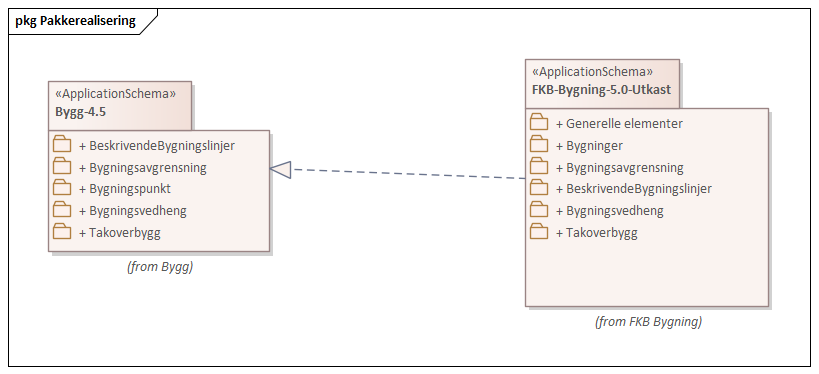
 
'''
 
.Oversiktsdiagram FKB-Bygning 
image::diagrammer/Oversiktsdiagram FKB-Bygning.png[link=diagrammer/Oversiktsdiagram FKB-Bygning.png, alt="Diagram med navn Oversiktsdiagram FKB-Bygning som viser UML-klasser beskrevet i teksten nedenfor."]
<<<
'''
==== Pakke: Generelle elementer
*Definisjon:* Inneholder elementer fra FKB Generell del 5.0
 
'''
 
.Oversiktsdiagram Fellesegenskaper 
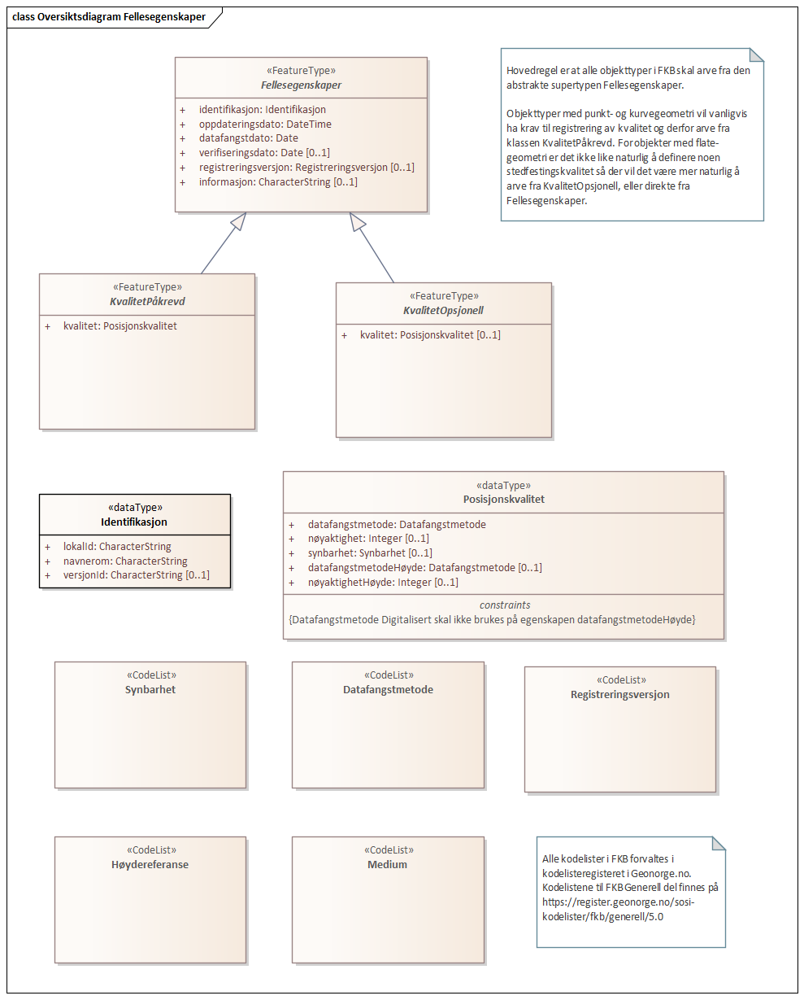
 
'''
 
.Realisering fra SOSI generell del 
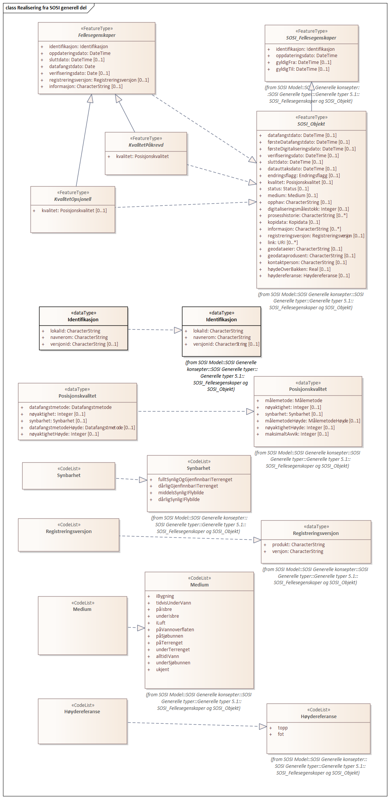
 
'''
 
.Hoveddiagram Posisjonskvalitet 
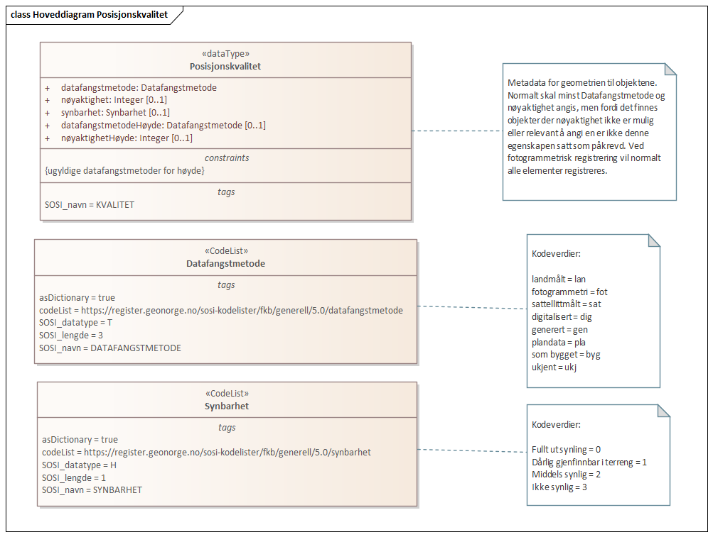
 
'''
 
[[fellesegenskaper]]
===== «FeatureType» Fellesegenskaper (abstrakt)
*Definisjon:* abstrakt objekttype som bærer sentrale egenskaper som er anbefalt for bruk i produktspesifikasjoner.
 
[discrete]
====== Egenskaper
[cols="20,80"]
|===
|*Navn:* 
|*identifikasjon*
 
|Definisjon: 
|unik identifikasjon av et objekt 

Merknad FKB:
Unik identifikasjon av et objekt, ivaretas av den ansvarlige produsent/forvalter, og som kan benyttes av eksterne applikasjoner som referanse til objektet.
Den unike identifikatoren er unik for kartobjektet og skal ikke endres i kartobjektets levetid. Dette må ikke forveksles med en tematisk identifikator (for eksempel bygningsnummer) som unikt identifiserer et objekt i virkeligheten. En bygning med samme bygningsnummer vil kunne representeres i mange kartprodukter der det finnes en unik identifikasjon i hver av dem.
For FKB benyttes UUID (Universally unique identifier) som lokalId. Dette innebærer at lokalId alene alltid vil være unik. Likevel skal alltid navnerom også angis. Navnerom angir FKB-datasettet.
 
|Multiplisitet: 
|[1..1]
 
|Type: 
|<<identifikasjon,«dataType» Identifikasjon>>
|Profilparametre i tagged values: 
|
SOSI_navn: IDENT + 
|===
[cols="20,80"]
|===
|*Navn:* 
|*oppdateringsdato*
 
|Definisjon: 
|tidspunkt for siste endring på objektet 

Merknad FKB: 

Denne datoen viser datasystemets siste endring på dataobjektet. Egenskapen settes av forvaltningssystemet etter følgende regler:

i. Oppdateringsdato er tidspunkt for oppdatering av databasen og settes av forvaltningsbasen (ikke av klienten).

ii. Oppdateringsdato skal endres også hvis det er kopidata som blir endret eller importert i en ”kopibase”.

iii. Når avgrensingslinjene til en flate endres, skal flateobjektet få ny oppdateringsdato.

iv. Oppdateringsdato skal endres hvis en egenskap endres.
 
|Multiplisitet: 
|[1..1]
 
|Type: 
|http://skjema.geonorge.no/SOSI/basistype/DateTime[DateTime]
|Profilparametre i tagged values: 
|
SOSI_datatype: DATOTID + 
SOSI_navn: OPPDATERINGSDATO + 
|===
[cols="20,80"]
|===
|*Navn:* 
|*sluttdato*
 
|Definisjon: 
|Tid for når denne versjonen av objektet var erstattet eller opphørt å eksistere.

Merknad FKB:
Egenskapen settes av forvaltningssystemet. Sluttdato skal kun sendes med ut fra forvaltningssystemet i sammenhenger der objektenes historikk er interessant.
 
|Multiplisitet: 
|[0..1]
 
|Type: 
|http://skjema.geonorge.no/SOSI/basistype/DateTime[DateTime]
|Profilparametre i tagged values: 
|
SOSI_datatype: DATOTID + 
SOSI_navn: SLUTTDATO + 
|===
[cols="20,80"]
|===
|*Navn:* 
|*datafangstdato*
 
|Definisjon: 
|dato når objektet siste gang ble registrert/observert/målt i terrenget
 
|Multiplisitet: 
|[1..1]
 
|Type: 
|http://skjema.geonorge.no/SOSI/basistype/Date[Date]
|Profilparametre i tagged values: 
|
SOSI_datatype: DATO + 
SOSI_navn: DATAFANGSTDATO + 
|===
[cols="20,80"]
|===
|*Navn:* 
|*verifiseringsdato*
 
|Definisjon: 
|dato når dataene er fastslått å være i samsvar med virkeligheten.

Merknad FKB:
Brukes for eksempel i de sammenhenger hvor det er foretatt fotogrammetrisk ajourhold, og hvor det ikke er registrert endringer på objektet (det virkelige objektet er i samsvar med dataobjektet)
 
|Multiplisitet: 
|[0..1]
 
|Type: 
|http://skjema.geonorge.no/SOSI/basistype/Date[Date]
|Profilparametre i tagged values: 
|
SOSI_datatype: DATO + 
SOSI_navn: VERIFISERINGSDATO + 
|===
[cols="20,80"]
|===
|*Navn:* 
|*registreringsversjon*
 
|Definisjon: 
|angivelse av hvilken produktspesifikasjon som er utgangspunkt  for dataene
 
|Multiplisitet: 
|[0..1]
 
|Type: 
|<<registreringsversjon,«CodeList» Registreringsversjon>>
|Profilparametre i tagged values: 
|
defaultCodeSpace: https://register.geonorge.no/sosi-kodelister/fkb/generell/5.0/registreringsversjon + 
SOSI_datatype: T + 
SOSI_lengde: 10 + 
SOSI_navn: REGISTRERINGSVERSJON + 
|===
[cols="20,80"]
|===
|*Navn:* 
|*informasjon*
 
|Definisjon: 
|generell opplysning.

Merknad FKB:
Mulighet til å legge inn utfyllende informasjon om objektet. Egenskapen bør bare brukes til å legge inn ekstra informasjon om enkeltobjekter. Egenskapen bør ikke brukes til å systematisk angi ekstrainformasjon om mange/alle objekter i et datasett.
 
|Multiplisitet: 
|[0..1]
 
|Type: 
|http://skjema.geonorge.no/SOSI/basistype/CharacterString[CharacterString]
|Profilparametre i tagged values: 
|
SOSI_datatype: T + 
SOSI_lengde: 255 + 
SOSI_navn: INFORMASJON + 
|===
 
[discrete]
====== Arv og realiseringer
[cols="20,80"]
|===
|Subtyper:
|<<annenbygning,«featureType» AnnenBygning>> +
<<takoverbygg,«featureType» Takoverbygg>> +
<<bygningsdelelinje,«featureType» Bygningsdelelinje>> +
<<bygning,«featureType» Bygning>> +
<<kvalitetpåkrevd,«FeatureType» KvalitetPåkrevd>> +
<<kvalitetopsjonell,«FeatureType» KvalitetOpsjonell>> +
|Realisering av: 
|«ApplicationSchema» Generelle typer 5.1/SOSI_Fellesegenskaper og SOSI_Objekt::«FeatureType» SOSI_Objekt +
|Realisering av: 
|/SOSI Model/SOSI Generell objektkatalog/FKB Generell del/FKB Generell del-5.0/Generelle elementer::«FeatureType» Fellesegenskaper +
|===
 
'''
 
[[kvalitetpåkrevd]]
===== «FeatureType» KvalitetPåkrevd (abstrakt)
*Definisjon:* abstrakt objekttype med påkrevet kvalitetsangivelse
 
[discrete]
====== Egenskaper
[cols="20,80"]
|===
|*Navn:* 
|*kvalitet*
 
|Definisjon: 
|beskrivelse av kvaliteten på stedfestingen

Merknad: Denne er identisk med ..KVALITET i tidligere versjoner av SOSI.
 
|Multiplisitet: 
|[1..1]
 
|Type: 
|<<posisjonskvalitet,«dataType» Posisjonskvalitet>>
|Profilparametre i tagged values: 
|
SOSI_navn: KVALITET + 
|===
 
[discrete]
====== Arv og realiseringer
[cols="20,80"]
|===
|Supertype: 
|<<fellesegenskaper,«FeatureType» Fellesegenskaper>>
 
|Subtyper:
|<<beskrivendebygningsdetalj,«featureType» BeskrivendeBygningsdetalj>> +
<<bygningsavgrensning,«featureType» Bygningsavgrensning>> +
<<takoverbyggkant,«featureType» TakoverbyggKant>> +
<<bygningsvedheng,«featureType» Bygningsvedheng>> +
|Realisering av: 
|«ApplicationSchema» Generelle typer 5.1/SOSI_Fellesegenskaper og SOSI_Objekt::«FeatureType» SOSI_Objekt +
|Realisering av: 
|/SOSI Model/SOSI Generell objektkatalog/FKB Generell del/FKB Generell del-5.0/Generelle elementer::«FeatureType» KvalitetPåkrevd +
|===
 
'''
 
[[kvalitetopsjonell]]
===== «FeatureType» KvalitetOpsjonell (abstrakt)
*Definisjon:* abstrakt objekttype med valgfri kvalitetsangivelse
 
[discrete]
====== Egenskaper
[cols="20,80"]
|===
|*Navn:* 
|*kvalitet*
 
|Definisjon: 
|beskrivelse av kvaliteten på stedfestingen

Merknad: Denne er identisk med ..KVALITET i tidligere versjoner av SOSI.
 
|Multiplisitet: 
|[0..1]
 
|Type: 
|<<posisjonskvalitet,«dataType» Posisjonskvalitet>>
|Profilparametre i tagged values: 
|
SOSI_navn: KVALITET + 
|===
 
[discrete]
====== Arv og realiseringer
[cols="20,80"]
|===
|Supertype: 
|<<fellesegenskaper,«FeatureType» Fellesegenskaper>>
 
|Subtyper:
|<<fiktivbygningsavgrensning,«featureType» FiktivBygningsavgrensning>> +
<<bygningsavgrensningtiltak,«featureType» BygningsavgrensningTiltak>> +
|Realisering av: 
|«ApplicationSchema» Generelle typer 5.1/SOSI_Fellesegenskaper og SOSI_Objekt::«FeatureType» SOSI_Objekt +
|===
 
'''
 
[[identifikasjon]]
===== «dataType» Identifikasjon
*Definisjon:* Unik identifikasjon av et objekt i et datasett, forvaltet av den ansvarlige produsent/forvalter, og kan benyttes av eksterne applikasjoner som stabil referanse til objektet. 

Merknad 1: Denne objektidentifikasjonen må ikke forveksles med en tematisk objektidentifikasjon, slik som f.eks bygningsnummer. 

Merknad 2: Denne unike identifikatoren vil ikke endres i løpet av objektets levetid, og ikke gjenbrukes i andre objekt.
 
[discrete]
====== Profilparametre i tagged values
[cols="20,80"]
|===
|SOSI_navn
|IDENT
 
|===
[discrete]
====== Egenskaper
[cols="20,80"]
|===
|*Navn:* 
|*lokalId*
 
|Definisjon: 
|lokal identifikator av et objekt

Merknad: Det er dataleverendørens ansvar å sørge for at den lokale identifikatoren er unik innenfor navnerommet. For FKB-data benyttes UUID som lokalId.
 
|Multiplisitet: 
|[1..1]
 
|Type: 
|http://skjema.geonorge.no/SOSI/basistype/CharacterString[CharacterString]
|Profilparametre i tagged values: 
|
SOSI_datatype: T + 
SOSI_lengde: 100 + 
SOSI_navn: LOKALID + 
|===
[cols="20,80"]
|===
|*Navn:* 
|*navnerom*
 
|Definisjon: 
|navnerom som unikt identifiserer datakilden til et objekt, anbefales å være en http-URI

Eksempel: http://data.geonorge.no/SentraltStedsnavnsregister/1.0

Merknad : Verdien for nanverom vil eies av den dataprodusent som har ansvar for de unike identifikatorene og må være registrert i data.geonorge.no eller data.norge.no
 
|Multiplisitet: 
|[1..1]
 
|Type: 
|http://skjema.geonorge.no/SOSI/basistype/CharacterString[CharacterString]
|Profilparametre i tagged values: 
|
SOSI_datatype: T + 
SOSI_lengde: 100 + 
SOSI_navn: NAVNEROM + 
|===
[cols="20,80"]
|===
|*Navn:* 
|*versjonId*
 
|Definisjon: 
|identifikasjon av en spesiell versjon av et geografisk objekt (instans)
 
|Multiplisitet: 
|[0..1]
 
|Type: 
|http://skjema.geonorge.no/SOSI/basistype/CharacterString[CharacterString]
|Profilparametre i tagged values: 
|
SOSI_datatype: T + 
SOSI_lengde: 100 + 
SOSI_navn: VERSJONID + 
|===
[discrete]
====== Arv og realiseringer
[cols="20,80"]
|===
|Realisering av: 
|«ApplicationSchema» Generelle typer 5.1/SOSI_Fellesegenskaper og SOSI_Objekt::«dataType» Identifikasjon +
|===
 
'''
 
[[posisjonskvalitet]]
===== «dataType» Posisjonskvalitet
*Definisjon:* beskrivelse av kvaliteten på stedfestingen.

Merknad:
Posisjonskvalitet er ikke konform med  kvalitetsmodellen i ISO slik den er defineret i ISO19157:2013, men er en videreføring av tildligere brukte kvalitetsegenskaper i SOSI. FKB 5.0 innfører en egen variant av datatypen Posisjonskvalitet der kodeliste målemetode er byttet ut med den mer generelle kodelista Datafangstmetode.
 
[discrete]
====== Profilparametre i tagged values
[cols="20,80"]
|===
|SOSI_navn
|KVALITET
 
|===
[discrete]
====== Egenskaper
[cols="20,80"]
|===
|*Navn:* 
|*datafangstmetode*
 
|Definisjon: 
|metode for datafangst. 
Egenskapen beskriver datafangstmetode for grunnrisskoordinater (x,y), eller for både grunnriss og høyde (x,y,z) dersom det ikke er oppgitt noen verdi for datafangstmetodeHøyde.
 
|Multiplisitet: 
|[1..1]
 
|Type: 
|<<datafangstmetode,«CodeList» Datafangstmetode>>
|Profilparametre i tagged values: 
|
defaultCodeSpace: https://register.geonorge.no/sosi-kodelister/fkb/generell/5.0/datafangstmetode + 
SOSI_datatype: T + 
SOSI_lengde: 3 + 
SOSI_navn: DATAFANGSTMETODE + 
|===
[cols="20,80"]
|===
|*Navn:* 
|*nøyaktighet*
 
|Definisjon: 
|standardavviket til posisjoneringa av objektet oppgitt i cm

I de aller fleste sammenhenger benyttes en anslått eller forventet verdi for standardavvik, men dersom man har en beregnet verdi skal denne benyttes. 

For objekter med punktgeometri benyttes verdi for punktstandardavvik. For objekter med kurvegeometri benyttes standardavviket for tverravviket fra kurva. For objekter med overflate- eller volumgeometri er forståelsen at standardavviket beregnes ut fra (3D) avvikene mellom sann posisjon og nærmeste punkt på overflata. 

Merknad:
Verdien er ment å beskrive nøyaktigheten til objektet sammenlignet med sann verdi. Standardavvik er i utgangspunktet et mål på det tilfeldige avviket og det innebærer at vi forutsetter at det systematiske avviket i liten grad påvirker nøyaktigheten til posisjoneringa. For fotogrammetriske data settes som hovedregel verdien lik kravet til standardavvik ved datafangst. Se standarden Geodatakvalitet for nærmere definisjon av standardavvik og hvordan dette defineres, beregnes og kontrolleres.
 
|Multiplisitet: 
|[0..1]
 
|Type: 
|http://skjema.geonorge.no/SOSI/basistype/Integer[Integer]
|Profilparametre i tagged values: 
|
SOSI_datatype: H + 
SOSI_lengde: 6 + 
SOSI_navn: NØYAKTIGHET + 
|===
[cols="20,80"]
|===
|*Navn:* 
|*synbarhet*
 
|Definisjon: 
|beskrivelse av hvor godt objektene framgår i datagrunnlaget for posisjonering (f.eks. flybildene).
 
|Multiplisitet: 
|[0..1]
 
|Type: 
|<<synbarhet,«CodeList» Synbarhet>>
|Profilparametre i tagged values: 
|
defaultCodeSpace: https://register.geonorge.no/sosi-kodelister/fkb/generell/5.0/synbarhet + 
SOSI_datatype: H + 
SOSI_lengde: 1 + 
SOSI_navn: SYNBARHET + 
|===
[cols="20,80"]
|===
|*Navn:* 
|*datafangstmetodeHøyde*
 
|Definisjon: 
|metoden brukt for høyderegistrering av posisjon.

Det er bare nødvending å angi en verdi for egenskapen dersom datafangstmetode for høyde avviker fra datafangstmetode for grunnriss.

 
|Multiplisitet: 
|[0..1]
 
|Type: 
|<<datafangstmetode,«CodeList» Datafangstmetode>>
|Profilparametre i tagged values: 
|
defaultCodeSpace: https://register.geonorge.no/sosi-kodelister/fkb/generell/5.0/datafangstmetode + 
SOSI_datatype: T + 
SOSI_lengde: 3 + 
SOSI_navn: DATAFANGSTMETODEHØYDE + 
|===
[cols="20,80"]
|===
|*Navn:* 
|*nøyaktighetHøyde*
 
|Definisjon: 
|standardavviket til posisjoneringa av objektet oppgitt i cm

I de aller fleste sammenhenger benyttes en anslått eller forventet verdi for standardavviket, men dersom man faktisk har standardavviket til posisjoneringa av objektet oppgitt i cm

I de aller fleste sammenhenger benyttes en anslått eller forventet verdi for standardavvik, men dersom man har en beregnet verdi skal denne benyttes. 

Merknad:
Verdien er ment å beskrive nøyaktigheten til objektet sammenlignet med sann verdi. Standardavvik er i utgangspunktet et mål på det tilfeldige avviket og det innebærer at vi forutsetter at det systematiske avviket i liten grad påvirker nøyaktigheten til posisjoneringa. For fotogrammetriske data settes som hovedregel verdien lik kravet til standardavvik ved datafangst. Se standarden Geodatakvalitet for nærmere definisjon av standardavvik og hvordan dette defineres, beregnes og kontrolleres.

 
|Multiplisitet: 
|[0..1]
 
|Type: 
|http://skjema.geonorge.no/SOSI/basistype/Integer[Integer]
|Profilparametre i tagged values: 
|
SOSI_datatype: H + 
SOSI_lengde: 6 + 
SOSI_navn: H-NØYAKTIGHET + 
|===
 
[discrete]
====== Restriksjoner
[cols="20,80"]
|===
|*Navn:* 
|*ugyldige datafangstmetoder for høyde*
 
|Beskrivelse: 
|inv: self.datafangstmetodeHøyde &lt;&gt; 'dig'

--Datafangstmetode Digitalisert skal ikke brukes på egenskapen datafangstmetodeHøyde
 
|===
[discrete]
====== Arv og realiseringer
[cols="20,80"]
|===
|Realisering av: 
|«ApplicationSchema» Generelle typer 5.1/SOSI_Fellesegenskaper og SOSI_Objekt::«dataType» Posisjonskvalitet +
|===
 
'''
 
[[synbarhet]]
===== «CodeList» Synbarhet
*Definisjon:* synbarhet beskriver hvor godt objektene framgår i datagrunnlaget for posisjonering (f.eks. flybildene).
 
[discrete]
====== Profilparametre i tagged values
[cols="20,80"]
|===
|asDictionary
|true
 
|codeList
|https://register.geonorge.no/sosi-kodelister/fkb/generell/5.0/synbarhet
 
|SOSI_datatype
|H
 
|SOSI_lengde
|1
 
|SOSI_navn
|SYNBARHET
 
|===
 
'''
 
[[datafangstmetode]]
===== «CodeList» Datafangstmetode
*Definisjon:* metode for datafangst. 

Datafangstmetoden beskriver hvordan selve vektordataene er posisjonert fra et datagrunnlag (observasjoner med landmålingsutstyr, fotogrammetrisk stereomodell, digital terrengmodell etc.) og ikke prosessen med å innhente det bakenforliggende datagrunnlaget.
 
[discrete]
====== Profilparametre i tagged values
[cols="20,80"]
|===
|asDictionary
|true
 
|codeList
|https://register.geonorge.no/sosi-kodelister/fkb/generell/5.0/datafangstmetode
 
|SOSI_datatype
|T
 
|SOSI_lengde
|3
 
|SOSI_navn
|DATAFANGSTMETODE
 
|===
 
'''
 
[[registreringsversjon]]
===== «CodeList» Registreringsversjon
*Definisjon:* FKB-verjson som ligger til grunn for registrering. Mest relevant for data som er fotogrammetrisk registrert.
 
[discrete]
====== Profilparametre i tagged values
[cols="20,80"]
|===
|asDictionary
|true
 
|codeList
|https://register.geonorge.no/sosi-kodelister/fkb/generell/5.0/registreringsversjon
 
|SOSI_datatype
|T
 
|SOSI_lengde
|10
 
|SOSI_navn
|REGISTRERINGSVERSJON
 
|===
 
'''
 
[[høydereferanse]]
===== «CodeList» Høydereferanse
*Definisjon:* koordinatregistering utført på topp eller bunn av et objekt
 
[discrete]
====== Profilparametre i tagged values
[cols="20,80"]
|===
|asDictionary
|true
 
|codeList
|https://register.geonorge.no/sosi-kodelister/fkb/generell/5.0/hoydereferanse
 
|SOSI_datatype
|T
 
|SOSI_lengde
|6
 
|SOSI_navn
|HREF
 
|===
 
'''
 
[[medium]]
===== «CodeList» Medium
*Definisjon:* objektets beliggenhet i forhold til jordoverflaten

Eksempel:
Veg på bro, i tunnel, inne i et bygningsmessig anlegg, etc.
 
[discrete]
====== Profilparametre i tagged values
[cols="20,80"]
|===
|asDictionary
|true
 
|codeList
|https://register.geonorge.no/sosi-kodelister/fkb/generell/5.0/medium
 
|SOSI_datatype
|T
 
|SOSI_lengde
|1
 
|SOSI_navn
|MEDIUM
 
|===
<<<
'''
==== Pakke: Bygninger
*Definisjon:* Inneholder elementer fra SOSI Bygg 4.5, Bygningspunkt
 
'''
 
.Oversiktsdiagram Bygning 
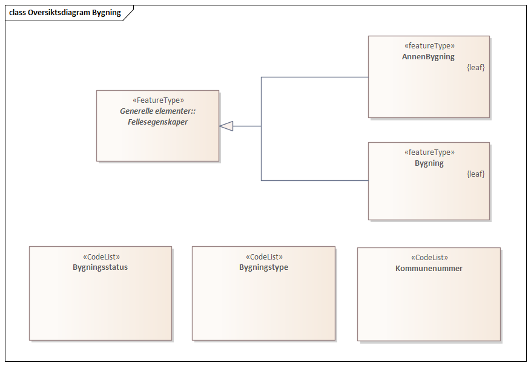
 
'''
 
.Realisering fra Bygg 4.5 - Bygningspunkt 
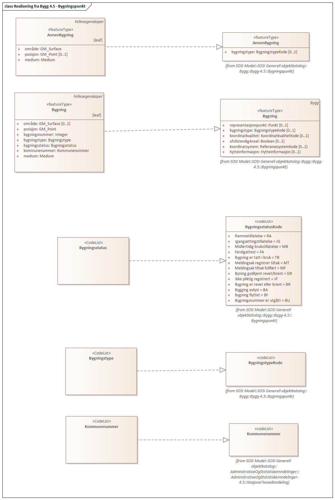
 
'''
 
.Hoveddiagram Bygning - objekttyper og kodelister 
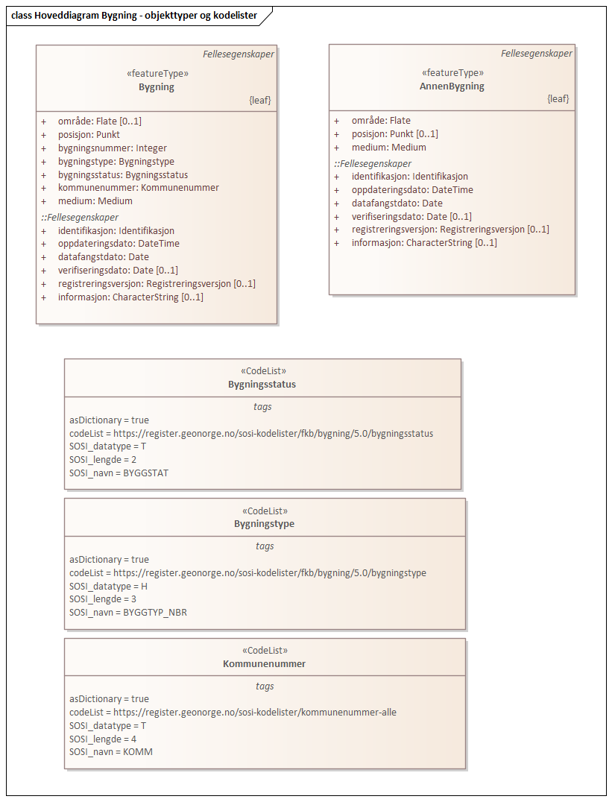
 
'''
 
.Hoveddiagram Bygning - flateavgrensning 
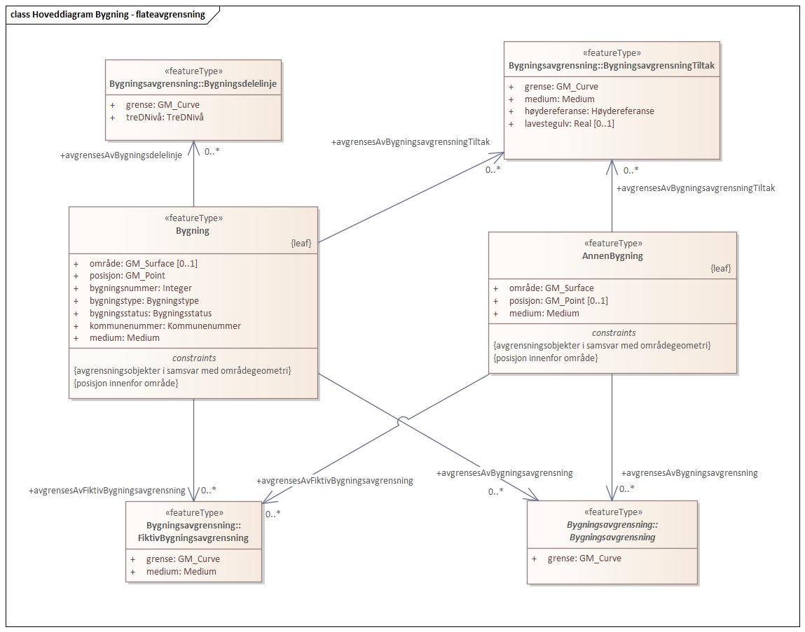
 
'''
 
[[bygning]]
===== «featureType» Bygning
*Definisjon:* bygning som er registrert i matrikkelen
 
 
'''
.Illustrasjon av objekttype Bygning
image::http://skjema.geonorge.no/SOSI/produktspesifikasjon/FKB-Bygning/5.0/figurer/objtype_bygning.png[link=http://skjema.geonorge.no/SOSI/produktspesifikasjon/FKB-Bygning/5.0/figurer/objtype_bygning.png, alt="Bilde av et eksempel på objekttypen Bygning, eventuelt med påtegning av streker som viser hvor geometrien til objektet skal måles fra."]
[discrete]
====== Egenskaper
[cols="20,80"]
|===
|*Navn:* 
|*område*
 
|Definisjon: 
|objektets utstrekning
 
|Multiplisitet: 
|[0..1]
 
|Type: 
|http://skjema.geonorge.no/SOSI/basistype/GM_Surface[GM_Surface]
|===
[cols="20,80"]
|===
|*Navn:* 
|*posisjon*
 
|Definisjon: 
|sted som objektet eksisterer på. Punktet er en kopi av bygningspunktet i matrikkelen
 
|Multiplisitet: 
|[1..1]
 
|Type: 
|http://skjema.geonorge.no/SOSI/basistype/GM_Point[GM_Point]
|===
[cols="20,80"]
|===
|*Navn:* 
|*bygningsnummer*
 
|Definisjon: 
|nummerering av bygninger fra Matrikkelen. Nummeret er unikt og landsdekkende.
 
|Multiplisitet: 
|[1..1]
 
|Type: 
|<<integer,«dataType» Integer>>
|Profilparametre i tagged values: 
|
SOSI_datatype: H + 
SOSI_lengde: 9 + 
SOSI_navn: BYGGNR + 
|===
[cols="20,80"]
|===
|*Navn:* 
|*bygningstype*
 
|Definisjon: 
|beskrivelse av hva bygningen faktisk er brukt til, eventuelt hva bygningen er godkjent til.
 
|Multiplisitet: 
|[1..1]
 
|Type: 
|<<bygningstype,«CodeList» Bygningstype>>
|Profilparametre i tagged values: 
|
defaultCodeSpace: https://register.geonorge.no/sosi-kodelister/fkb/bygning/5.0/bygningstype + 
SOSI_datatype: H + 
SOSI_lengde: 3 + 
SOSI_navn: BYGGTYP_NBR + 
|===
[cols="20,80"]
|===
|*Navn:* 
|*bygningsstatus*
 
|Definisjon: 
|informasjon om bygningens status
 
|Multiplisitet: 
|[1..1]
 
|Type: 
|<<bygningsstatus,«CodeList» Bygningsstatus>>
|Profilparametre i tagged values: 
|
defaultCodeSpace: https://register.geonorge.no/sosi-kodelister/fkb/bygning/5.0/bygningsstatus + 
SOSI_datatype: T + 
SOSI_lengde: 2 + 
SOSI_navn: BYGGSTAT + 
|===
[cols="20,80"]
|===
|*Navn:* 
|*kommunenummer*
 
|Definisjon: 
|nummerering av kommuner i henhold til Statistisk sentralbyrå sin offisielle liste
 
|Multiplisitet: 
|[1..1]
 
|Type: 
|<<kommunenummer,«CodeList» Kommunenummer>>
|Profilparametre i tagged values: 
|
defaultCodeSpace: https://register.geonorge.no/sosi-kodelister/kommunenummer-alle + 
SOSI_datatype: T + 
SOSI_lengde: 4 + 
SOSI_navn: KOMM + 
|===
[cols="20,80"]
|===
|*Navn:* 
|*medium*
 
|Definisjon: 
|objektets beliggenhet i forhold til jordoverflaten
 
|Multiplisitet: 
|[1..1]
 
|Type: 
|<<medium,«CodeList» Medium>>
|Profilparametre i tagged values: 
|
defaultCodeSpace: https://register.geonorge.no/sosi-kodelister/fkb/generell/5.0/medium + 
SOSI_datatype: T + 
SOSI_lengde: 1 + 
SOSI_navn: MEDIUM + 
|===
 
[discrete]
====== Roller
[cols="20,80"]
|===
|*Rollenavn:* 
|*vedhengTilBygning*
 
|Definisjon:
|Bygning kjenner sine vedheng
 
|Multiplisitet: 
|[0..*]
 
|Til klasse
|<<bygningsvedheng,«featureType» Bygningsvedheng>>
|===
[cols="20,80"]
|===
|*Rollenavn:* 
|*beskriverBygning*
 
|Definisjon:
|bygningen kjenner hvilke beskrivede bygningsdetaljer som tilhører bygningen
 
|Multiplisitet: 
|[0..*]
 
|Til klasse
|<<beskrivendebygningsdetalj,«featureType» BeskrivendeBygningsdetalj>>
|===
[cols="20,80"]
|===
|*Rollenavn:* 
|*avgrensesAvBygningsavgrensningTiltak*
 
|Definisjon:
|Krav til delt flategeometri. Avgrensning av bygning ved hjelp av geometriobjekter fra tiltaksbasen.
 
|Multiplisitet: 
|[0..*]
 
|Til klasse
|<<bygningsavgrensningtiltak,«featureType» BygningsavgrensningTiltak>>
|===
[cols="20,80"]
|===
|*Rollenavn:* 
|*avgrensesAvBygningsavgrensning*
 
|Definisjon:
|Krav til delt flategeometri. Avgrensning av bygning med en innmålt avgrensningslinje
 
|Multiplisitet: 
|[0..*]
 
|Til klasse
|<<bygningsavgrensning,«featureType» Bygningsavgrensning>>
|===
[cols="20,80"]
|===
|*Rollenavn:* 
|*avgrensesAvFiktivBygningsavgrensning*
 
|Definisjon:
|Krav til delt flategeometri. Avgrensning av bygning med en fiktiv avgrensningslinje
 
|Multiplisitet: 
|[0..*]
 
|Til klasse
|<<fiktivbygningsavgrensning,«featureType» FiktivBygningsavgrensning>>
|===
[cols="20,80"]
|===
|*Rollenavn:* 
|*avgrensesAvBygningsdelelinje*
 
|Definisjon:
|Krav til delt flategeometri. Avgrensning av bygning ved hjelp av bygningsdelelinje
 
|Multiplisitet: 
|[0..*]
 
|Til klasse
|<<bygningsdelelinje,«featureType» Bygningsdelelinje>>
|===
 
[discrete]
====== Restriksjoner
[cols="20,80"]
|===
|*Navn:* 
|*avgrensningsobjekter i samsvar med områdegeometri*
 
|Beskrivelse: 
|
--ingen OCL, restriksjonen implementeres manuelt
 + 
--Område-geometrien skal være lik summen av geometriene til de assosierte avgrensningsobjektene
 
|===
[cols="20,80"]
|===
|*Navn:* 
|*posisjon innenfor område*
 
|Beskrivelse: 
|
--ingen OCL, restriksjonen implementeres manuelt
 + 
--Dersom det finnes område-geometri skal posisjon-geometrien ligge innenfor område-geometrien
 
|===
 
[discrete]
====== Arv og realiseringer
[cols="20,80"]
|===
|Supertype: 
|<<fellesegenskaper,«FeatureType» Fellesegenskaper>>
 
|Realisering av: 
|«ApplicationSchema» Bygg-4.5/Bygningspunkt::«featureType» Bygning +
|===
 
'''
 
[[annenbygning]]
===== «featureType» AnnenBygning
*Definisjon:* bygning som ikke er registrert  i matrikkelen
 
 
'''
.Illustrasjon av objekttype AnnenBygning
image::http://skjema.geonorge.no/SOSI/produktspesifikasjon/FKB-Bygning/5.0/figurer/objtype_annenbygning.png[link=http://skjema.geonorge.no/SOSI/produktspesifikasjon/FKB-Bygning/5.0/figurer/objtype_annenbygning.png, alt="Bilde av et eksempel på objekttypen AnnenBygning, eventuelt med påtegning av streker som viser hvor geometrien til objektet skal måles fra."]
[discrete]
====== Egenskaper
[cols="20,80"]
|===
|*Navn:* 
|*område*
 
|Definisjon: 
|objektets utstrekning
 
|Multiplisitet: 
|[1..1]
 
|Type: 
|http://skjema.geonorge.no/SOSI/basistype/GM_Surface[GM_Surface]
|===
[cols="20,80"]
|===
|*Navn:* 
|*posisjon*
 
|Definisjon: 
|sted som objektet eksisterer på
 
|Multiplisitet: 
|[0..1]
 
|Type: 
|http://skjema.geonorge.no/SOSI/basistype/GM_Point[GM_Point]
|===
[cols="20,80"]
|===
|*Navn:* 
|*medium*
 
|Definisjon: 
|objektets beliggenhet i forhold til jordoverflaten
 
|Multiplisitet: 
|[1..1]
 
|Type: 
|<<medium,«CodeList» Medium>>
|Profilparametre i tagged values: 
|
defaultCodeSpace: https://register.geonorge.no/sosi-kodelister/fkb/generell/5.0/medium + 
SOSI_datatype: T + 
SOSI_lengde: 1 + 
SOSI_navn: MEDIUM + 
|===
 
[discrete]
====== Roller
[cols="20,80"]
|===
|*Rollenavn:* 
|*avgrensesAvBygningsavgrensning*
 
|Definisjon:
|Krav til delt flategeometri. Avgrensning av bygning (som ikke ligger i matrikkel) med en innmålt avgrensningslinje.
 
|Multiplisitet: 
|[0..*]
 
|Til klasse
|<<bygningsavgrensning,«featureType» Bygningsavgrensning>>
|===
[cols="20,80"]
|===
|*Rollenavn:* 
|*avgrensesAvBygningsavgrensningTiltak*
 
|Definisjon:
|Krav til delt flategeometri. Avgrensning av bygning (som ikke ligger i matrikkel)  ved hjelp av geometriobjekter fra tiltaksbasen.
 
|Multiplisitet: 
|[0..*]
 
|Til klasse
|<<bygningsavgrensningtiltak,«featureType» BygningsavgrensningTiltak>>
|===
[cols="20,80"]
|===
|*Rollenavn:* 
|*beskriverAnnenBygning*
 
|Definisjon:
|AnnenBygning kjenner hvilke beskrivede bygningsdetaljer som tilhører bygningen
 
|Multiplisitet: 
|[0..*]
 
|Til klasse
|<<beskrivendebygningsdetalj,«featureType» BeskrivendeBygningsdetalj>>
|===
[cols="20,80"]
|===
|*Rollenavn:* 
|*vedhengTilAnnenBygning*
 
|Definisjon:
|AnnenBygning kjenner sine bygningsvedheng
 
|Multiplisitet: 
|[0..*]
 
|Til klasse
|<<bygningsvedheng,«featureType» Bygningsvedheng>>
|===
[cols="20,80"]
|===
|*Rollenavn:* 
|*avgrensesAvFiktivBygningsavgrensning*
 
|Definisjon:
|Krav til delt flategeometri. Avgrensning av bygning (som ikke ligger i matrikkel) med en fiktiv avgrensningslinje
 
|Multiplisitet: 
|[0..*]
 
|Til klasse
|<<fiktivbygningsavgrensning,«featureType» FiktivBygningsavgrensning>>
|===
 
[discrete]
====== Restriksjoner
[cols="20,80"]
|===
|*Navn:* 
|*avgrensningsobjekter i samsvar med områdegeometri*
 
|Beskrivelse: 
|
--ingen OCL, restriksjonen implementeres manuelt
 + 
--Område-geometrien skal være lik summen av geometriene til de assosierte avgrensningsobjektene
 
|===
[cols="20,80"]
|===
|*Navn:* 
|*posisjon innenfor område*
 
|Beskrivelse: 
|
--ingen OCL, restriksjonen implementeres manuelt
 + 
--Dersom det finns område-geometri skal posisjon-geometrien ligge innenfor område-geometrien
 
|===
 
[discrete]
====== Arv og realiseringer
[cols="20,80"]
|===
|Supertype: 
|<<fellesegenskaper,«FeatureType» Fellesegenskaper>>
 
|Realisering av: 
|«ApplicationSchema» Bygg-4.5/Bygningspunkt::«featureType» AnnenBygning +
|===
 
'''
 
[[bygningsstatus]]
===== «CodeList» Bygningsstatus
*Definisjon:* Bygningsstatuskoder fra matrikkelen som benyttes i FKB-Bygning
 
[discrete]
====== Profilparametre i tagged values
[cols="20,80"]
|===
|asDictionary
|true
 
|codeList
|https://register.geonorge.no/sosi-kodelister/fkb/bygning/5.0/bygningsstatus
 
|SOSI_datatype
|T
 
|SOSI_lengde
|2
 
|SOSI_navn
|BYGGSTAT
 
|===
 
'''
 
[[bygningstype]]
===== «CodeList» Bygningstype
*Definisjon:* Bygningstyper fra matrikkelen som benyttes i FKB-Bygning
 
[discrete]
====== Profilparametre i tagged values
[cols="20,80"]
|===
|asDictionary
|true
 
|codeList
|https://register.geonorge.no/sosi-kodelister/fkb/bygning/5.0/bygningstype
 
|SOSI_datatype
|H
 
|SOSI_lengde
|3
 
|SOSI_navn
|BYGGTYP_NBR
 
|===
 
'''
 
[[kommunenummer]]
===== «CodeList» Kommunenummer
*Definisjon:* nummerering av kommuner i henhold til SSB sin offisielle liste.
 
[discrete]
====== Profilparametre i tagged values
[cols="20,80"]
|===
|asDictionary
|true
 
|codeList
|https://register.geonorge.no/sosi-kodelister/kommunenummer-alle
 
|SOSI_datatype
|T
 
|SOSI_lengde
|4
 
|SOSI_navn
|KOMM
 
|===
<<<
'''
==== Pakke: Bygningsavgrensning
*Definisjon:* Inneholder elementer fra SOSI Bygg 4.5, Bygningsavgrensning
 
'''
 
.Oversiktsdiagram Bygningsavgrensning 
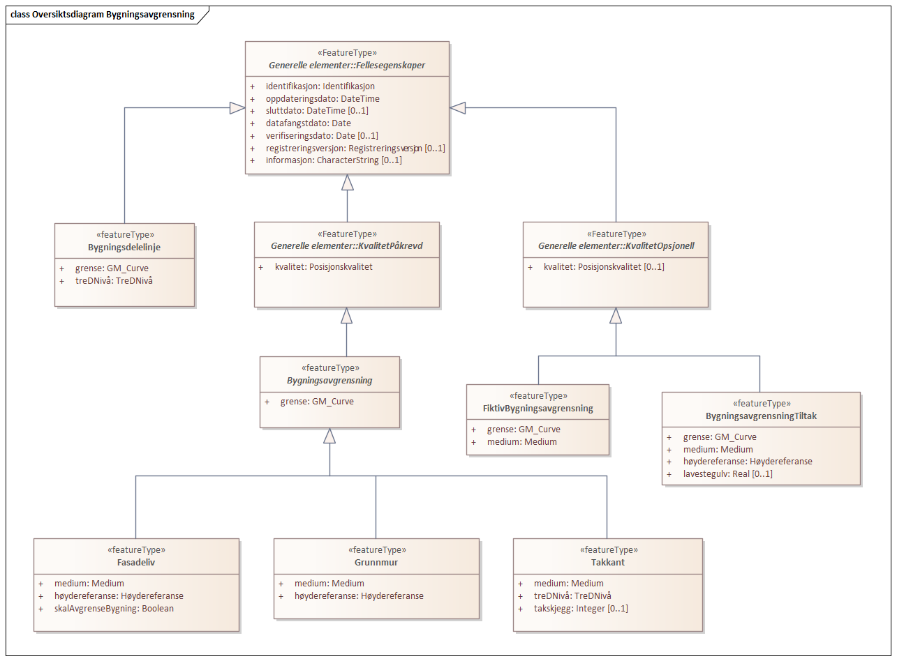
 
'''
 
.Realisering fra Bygg 4.5 - Bygningsavgrensning 
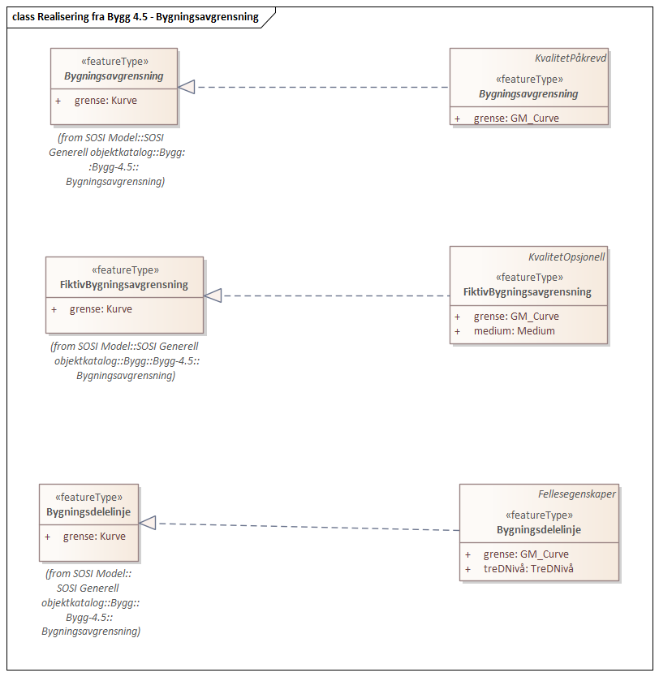
 
'''
 
.Hoveddiagram Bygningsavgrensning - Objekttyper med egenskaper 
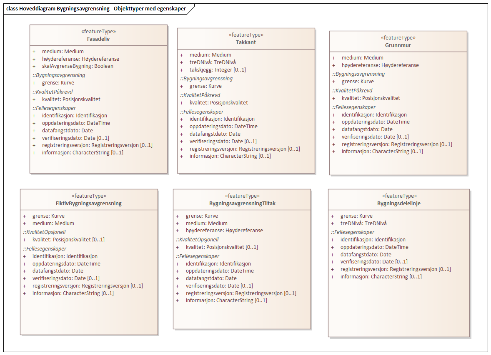
 
'''
 
[[bygningsavgrensning]]
===== «featureType» Bygningsavgrensning (abstrakt)
*Definisjon:* abstrakt supertype som bærer geometrien til avgrensningslinjene. Vil aldri realiseres som en objekttype
 
[discrete]
====== Egenskaper
[cols="20,80"]
|===
|*Navn:* 
|*grense*
 
|Definisjon: 
|forløp som følger objektets sentrale del (ytterkant)
 
|Multiplisitet: 
|[1..1]
 
|Type: 
|http://skjema.geonorge.no/SOSI/basistype/GM_Curve[GM_Curve]
|===
 
[discrete]
====== Arv og realiseringer
[cols="20,80"]
|===
|Supertype: 
|<<kvalitetpåkrevd,«FeatureType» KvalitetPåkrevd>>
 
|Subtyper:
|<<grunnmur,«featureType» Grunnmur>> +
<<takkant,«featureType» Takkant>> +
<<fasadeliv,«featureType» Fasadeliv>> +
|Realisering av: 
|«ApplicationSchema» Bygg-4.5/Bygningsavgrensning::«featureType» Bygningsavgrensning +
|===
 
'''
 
[[bygningsavgrensningtiltak]]
===== «featureType» BygningsavgrensningTiltak
*Definisjon:* Bygningsavgrensning hentet fra FKB-Tiltak. Dataene er tatt fra plan og er ikke innmålt i terrenget.
 
 
'''
.Illustrasjon av objekttype BygningsavgrensningTiltak
image::http://skjema.geonorge.no/SOSI/produktspesifikasjon/FKB-Bygning/5.0/figurer/objtype_bygningsavgrensningtiltak.png[link=http://skjema.geonorge.no/SOSI/produktspesifikasjon/FKB-Bygning/5.0/figurer/objtype_bygningsavgrensningtiltak.png, alt="Bilde av et eksempel på objekttypen BygningsavgrensningTiltak, eventuelt med påtegning av streker som viser hvor geometrien til objektet skal måles fra."]
[discrete]
====== Egenskaper
[cols="20,80"]
|===
|*Navn:* 
|*grense*
 
|Definisjon: 
|forløp som følger objektets sentrale del (ytterkant)
 
|Multiplisitet: 
|[1..1]
 
|Type: 
|http://skjema.geonorge.no/SOSI/basistype/GM_Curve[GM_Curve]
|===
[cols="20,80"]
|===
|*Navn:* 
|*medium*
 
|Definisjon: 
|objektets beliggenhet i forhold til jordoverflaten
 
|Multiplisitet: 
|[1..1]
 
|Type: 
|<<medium,«CodeList» Medium>>
|Profilparametre i tagged values: 
|
defaultCodeSpace: https://register.geonorge.no/sosi-kodelister/fkb/generell/5.0/medium + 
SOSI_datatype: T + 
SOSI_lengde: 1 + 
SOSI_navn: MEDIUM + 
|===
[cols="20,80"]
|===
|*Navn:* 
|*høydereferanse*
 
|Definisjon: 
|koordinatregistering utført på topp eller bunn av et objekt
 
|Multiplisitet: 
|[1..1]
 
|Type: 
|<<høydereferanse,«CodeList» Høydereferanse>>
|Profilparametre i tagged values: 
|
defaultCodeSpace: https://register.geonorge.no/sosi-kodelister/fkb/generell/5.0/hoydereferanse + 
SOSI_datatype: T + 
SOSI_lengde: 6 + 
SOSI_navn: HREF + 
|===
[cols="20,80"]
|===
|*Navn:* 
|*lavestegulv*
 
|Definisjon: 
|høydeverdi for laveste gulvhøyde på tiltaket.

Merknad:
Objektets geometri angir høyeste høydeverdi (Høydereferanse = top). Denne egenskapen gir mulighet til å i tillegg angi tiltakets laveste høyde. Egenskapen brukes primært for bygninger/tiltak under bakken.
 
|Multiplisitet: 
|[0..1]
 
|Type: 
|http://skjema.geonorge.no/SOSI/basistype/Real[Real]
|Profilparametre i tagged values: 
|
SOSI_datatype: D + 
SOSI_lengde: 10 + 
SOSI_navn: LAVESTEGULV + 
|===
 
[discrete]
====== Arv og realiseringer
[cols="20,80"]
|===
|Supertype: 
|<<kvalitetopsjonell,«FeatureType» KvalitetOpsjonell>>
 
|===
 
'''
 
[[bygningsdelelinje]]
===== «featureType» Bygningsdelelinje
*Definisjon:* linje mellom to bygninger (bygninger registrert i Matrikkelen) som står inntil hverandre
Merknad: Det kan ofte være vanskelig å registrere bygningsdelelinjer nøyaktig. Usikkerhet i fastleggelsen av bygningsdelelinjen skal synliggjøres gjennom kvalitetskoding (f.eks posisjonskvalitet 81 50).
 
 
'''
.Illustrasjon av objekttype Bygningsdelelinje
image::http://skjema.geonorge.no/SOSI/produktspesifikasjon/FKB-Bygning/5.0/figurer/objtype_bygningsdelelinje.png[link=http://skjema.geonorge.no/SOSI/produktspesifikasjon/FKB-Bygning/5.0/figurer/objtype_bygningsdelelinje.png, alt="Bilde av et eksempel på objekttypen Bygningsdelelinje, eventuelt med påtegning av streker som viser hvor geometrien til objektet skal måles fra."]
[discrete]
====== Egenskaper
[cols="20,80"]
|===
|*Navn:* 
|*grense*
 
|Definisjon: 
|forløp som følger objektets sentrale del (ytterkant)
 
|Multiplisitet: 
|[1..1]
 
|Type: 
|http://skjema.geonorge.no/SOSI/basistype/GM_Curve[GM_Curve]
|===
[cols="20,80"]
|===
|*Navn:* 
|*treDNivå*
 
|Definisjon: 
|hvilken 3D framstillingsmulighet (angitt i 6 nivåer) bygningen kan framstilles i.
 
|Multiplisitet: 
|[1..1]
 
|Type: 
|<<trednivå,«CodeList» TreDNivå>>
|Profilparametre i tagged values: 
|
defaultCodeSpace: https://register.geonorge.no/sosi-kodelister/fkb/bygning/5.0/tredniv%c3%a5 + 
SOSI_datatype: T + 
SOSI_lengde: 1 + 
SOSI_navn: TRE_D_NIVÅ + 
|===
 
[discrete]
====== Arv og realiseringer
[cols="20,80"]
|===
|Supertype: 
|<<fellesegenskaper,«FeatureType» Fellesegenskaper>>
 
|Realisering av: 
|«ApplicationSchema» Bygg-4.5/Bygningsavgrensning::«featureType» Bygningsdelelinje +
|===
 
'''
 
[[fasadeliv]]
===== «featureType» Fasadeliv
*Definisjon:* bygningens ytre avgrensing i fasaderiss
 
 
'''
.Illustrasjon av objekttype Fasadeliv
image::http://skjema.geonorge.no/SOSI/produktspesifikasjon/FKB-Bygning/5.0/figurer/objtype_fasadeliv.png[link=http://skjema.geonorge.no/SOSI/produktspesifikasjon/FKB-Bygning/5.0/figurer/objtype_fasadeliv.png, alt="Bilde av et eksempel på objekttypen Fasadeliv, eventuelt med påtegning av streker som viser hvor geometrien til objektet skal måles fra."]
[discrete]
====== Egenskaper
[cols="20,80"]
|===
|*Navn:* 
|*medium*
 
|Definisjon: 
|objektets beliggenhet i forhold til jordoverflaten
 
|Multiplisitet: 
|[1..1]
 
|Type: 
|<<medium,«CodeList» Medium>>
|Profilparametre i tagged values: 
|
defaultCodeSpace: https://register.geonorge.no/sosi-kodelister/fkb/generell/5.0/medium + 
SOSI_datatype: T + 
SOSI_lengde: 1 + 
SOSI_navn: MEDIUM + 
|===
[cols="20,80"]
|===
|*Navn:* 
|*høydereferanse*
 
|Definisjon: 
|koordinatregistering utført på topp eller bunn av et objekt
 
|Multiplisitet: 
|[1..1]
 
|Type: 
|<<høydereferanse,«CodeList» Høydereferanse>>
|Profilparametre i tagged values: 
|
defaultCodeSpace: https://register.geonorge.no/sosi-kodelister/fkb/generell/5.0/hoydereferanse + 
SOSI_datatype: T + 
SOSI_lengde: 6 + 
SOSI_navn: HREF + 
|===
[cols="20,80"]
|===
|*Navn:* 
|*skalAvgrenseBygning*
 
|Definisjon: 
|angivelse av om fasadeliv skal benyttes til å danne bygningsflate. Defaultverdi er Nei, dvs. at fasadeliv kun benyttes til flateavgrensning dersom skalAvgrenseBygning = Ja.

Merknad:
Fasadeliv (hele eller deler av fasaden) vil i mange tilfeller eksistere i tillegg til Takkant. Egenskapen kan da benyttes til å angi at enten takriss eller fasadelivriss skal danne Bygningsavgrensning for bygningsflaten (normalt benyttes Takkant til riss hvis begge eksisterer).
 
|Multiplisitet: 
|[1..1]
 
|Type: 
|http://skjema.geonorge.no/SOSI/basistype/Boolean[Boolean]
|Profilparametre i tagged values: 
|
SOSI_datatype: BOOLSK + 
SOSI_navn: SKAL_AVGR_BYGN + 
|===
 
[discrete]
====== Arv og realiseringer
[cols="20,80"]
|===
|Supertype: 
|<<bygningsavgrensning,«featureType» Bygningsavgrensning>>
 
|===
 
'''
 
[[fiktivbygningsavgrensning]]
===== «featureType» FiktivBygningsavgrensning
*Definisjon:* fiktiv avgrensing av bygning
Merknad: Brukes når deler av takkant, fasadeliv, grunnmur eller bygningsdelelinje er ukjent for at det skal bli mulig å danne en flate.  Fiktiv bygningsavgrensing benyttes også for å lage flater for underjordiske bygninger og som fiktiv linje på takoverbygg der takoverbyggkant mangler.
 
 
'''
.Illustrasjon av objekttype FiktivBygningsavgrensning
image::http://skjema.geonorge.no/SOSI/produktspesifikasjon/FKB-Bygning/5.0/figurer/objtype_fiktivbygningsavgrensning.png[link=http://skjema.geonorge.no/SOSI/produktspesifikasjon/FKB-Bygning/5.0/figurer/objtype_fiktivbygningsavgrensning.png, alt="Bilde av et eksempel på objekttypen FiktivBygningsavgrensning, eventuelt med påtegning av streker som viser hvor geometrien til objektet skal måles fra."]
[discrete]
====== Egenskaper
[cols="20,80"]
|===
|*Navn:* 
|*grense*
 
|Definisjon: 
|forløp som følger objektets sentrale del (ytterkant)
 
|Multiplisitet: 
|[1..1]
 
|Type: 
|http://skjema.geonorge.no/SOSI/basistype/GM_Curve[GM_Curve]
|===
[cols="20,80"]
|===
|*Navn:* 
|*medium*
 
|Definisjon: 
|objektets beliggenhet i forhold til jordoverflaten
 
|Multiplisitet: 
|[1..1]
 
|Type: 
|<<medium,«CodeList» Medium>>
|Profilparametre i tagged values: 
|
defaultCodeSpace: https://register.geonorge.no/sosi-kodelister/fkb/generell/5.0/medium + 
SOSI_datatype: T + 
SOSI_lengde: 1 + 
SOSI_navn: MEDIUM + 
|===
 
[discrete]
====== Arv og realiseringer
[cols="20,80"]
|===
|Supertype: 
|<<kvalitetopsjonell,«FeatureType» KvalitetOpsjonell>>
 
|Realisering av: 
|«ApplicationSchema» Bygg-4.5/Bygningsavgrensning::«featureType» FiktivBygningsavgrensning +
|===
 
'''
 
[[grunnmur]]
===== «featureType» Grunnmur
*Definisjon:* bygningens ytteravgrensning langs grunnmur
Merknad: Høydereferanse  angis med høydereferanse. Grunnrissreferanse er ytterkant av grunnmur.
Merknad: Benyttes hovedsaklig for bygning under oppføring. For bygninger som revet/nedbrent benyttes objekttyper ruin og mur i FKB-BygnAnlegg
 
 
'''
.Illustrasjon av objekttype Grunnmur
image::http://skjema.geonorge.no/SOSI/produktspesifikasjon/FKB-Bygning/5.0/figurer/objtype_grunnmur.png[link=http://skjema.geonorge.no/SOSI/produktspesifikasjon/FKB-Bygning/5.0/figurer/objtype_grunnmur.png, alt="Bilde av et eksempel på objekttypen Grunnmur, eventuelt med påtegning av streker som viser hvor geometrien til objektet skal måles fra."]
[discrete]
====== Egenskaper
[cols="20,80"]
|===
|*Navn:* 
|*medium*
 
|Definisjon: 
|objektets beliggenhet i forhold til jordoverflaten
 
|Multiplisitet: 
|[1..1]
 
|Type: 
|<<medium,«CodeList» Medium>>
|Profilparametre i tagged values: 
|
defaultCodeSpace: https://register.geonorge.no/sosi-kodelister/fkb/generell/5.0/medium + 
SOSI_datatype: T + 
SOSI_lengde: 1 + 
SOSI_navn: MEDIUM + 
|===
[cols="20,80"]
|===
|*Navn:* 
|*høydereferanse*
 
|Definisjon: 
|koordinatregistering utført på topp eller bunn av et objekt
 
|Multiplisitet: 
|[1..1]
 
|Type: 
|<<høydereferanse,«CodeList» Høydereferanse>>
|Profilparametre i tagged values: 
|
defaultCodeSpace: https://register.geonorge.no/sosi-kodelister/fkb/generell/5.0/hoydereferanse + 
SOSI_datatype: T + 
SOSI_lengde: 6 + 
SOSI_navn: HREF + 
|===
 
[discrete]
====== Arv og realiseringer
[cols="20,80"]
|===
|Supertype: 
|<<bygningsavgrensning,«featureType» Bygningsavgrensning>>
 
|===
 
'''
 
[[takkant]]
===== «featureType» Takkant
*Definisjon:* bygningens ytre takflateavgrensing
Merknad: Høydereferansen er de målte punktene på taket. 
Merknad: Dersom deler av takkanten ikke er synlig kodes den synlige delen som takkant- og den ikke synlige som fiktiv bygningsavgrensning.
 
 
'''
.Illustrasjon av objekttype Takkant
image::http://skjema.geonorge.no/SOSI/produktspesifikasjon/FKB-Bygning/5.0/figurer/objtype_takkant.png[link=http://skjema.geonorge.no/SOSI/produktspesifikasjon/FKB-Bygning/5.0/figurer/objtype_takkant.png, alt="Bilde av et eksempel på objekttypen Takkant, eventuelt med påtegning av streker som viser hvor geometrien til objektet skal måles fra."]
[discrete]
====== Egenskaper
[cols="20,80"]
|===
|*Navn:* 
|*medium*
 
|Definisjon: 
|objektets beliggenhet i forhold til jordoverflaten
 
|Multiplisitet: 
|[1..1]
 
|Type: 
|<<medium,«CodeList» Medium>>
|Profilparametre i tagged values: 
|
defaultCodeSpace: https://register.geonorge.no/sosi-kodelister/fkb/generell/5.0/medium + 
SOSI_datatype: T + 
SOSI_lengde: 1 + 
SOSI_navn: MEDIUM + 
|===
[cols="20,80"]
|===
|*Navn:* 
|*treDNivå*
 
|Definisjon: 
|hvilken 3D framstillingsmulighet (angitt i 6 nivåer) bygningen kan framstilles i.
 
|Multiplisitet: 
|[1..1]
 
|Type: 
|<<trednivå,«CodeList» TreDNivå>>
|Profilparametre i tagged values: 
|
defaultCodeSpace: https://register.geonorge.no/sosi-kodelister/fkb/bygning/5.0/tredniv%c3%a5 + 
SOSI_datatype: H + 
SOSI_lengde: 1 + 
SOSI_navn: TRE_D_NIVÅ + 
|===
[cols="20,80"]
|===
|*Navn:* 
|*takskjegg*
 
|Definisjon: 
|avstanden fra veggliv til takkant målt i cm
 
|Multiplisitet: 
|[0..1]
 
|Type: 
|<<integer,«dataType» Integer>>
|Profilparametre i tagged values: 
|
SOSI_datatype: H + 
SOSI_lengde: 3 + 
SOSI_navn: TAKSKJEGG + 
|===
 
[discrete]
====== Arv og realiseringer
[cols="20,80"]
|===
|Supertype: 
|<<bygningsavgrensning,«featureType» Bygningsavgrensning>>
 
|===
<<<
'''
==== Pakke: BeskrivendeBygningslinjer
*Definisjon:* Inneholder elementer fra SOSI Bygg 4.5, BeskrivendeBygningslinjer
 
'''
 
.Oversiktsdiagram BeskrivendeBygningslinjer 
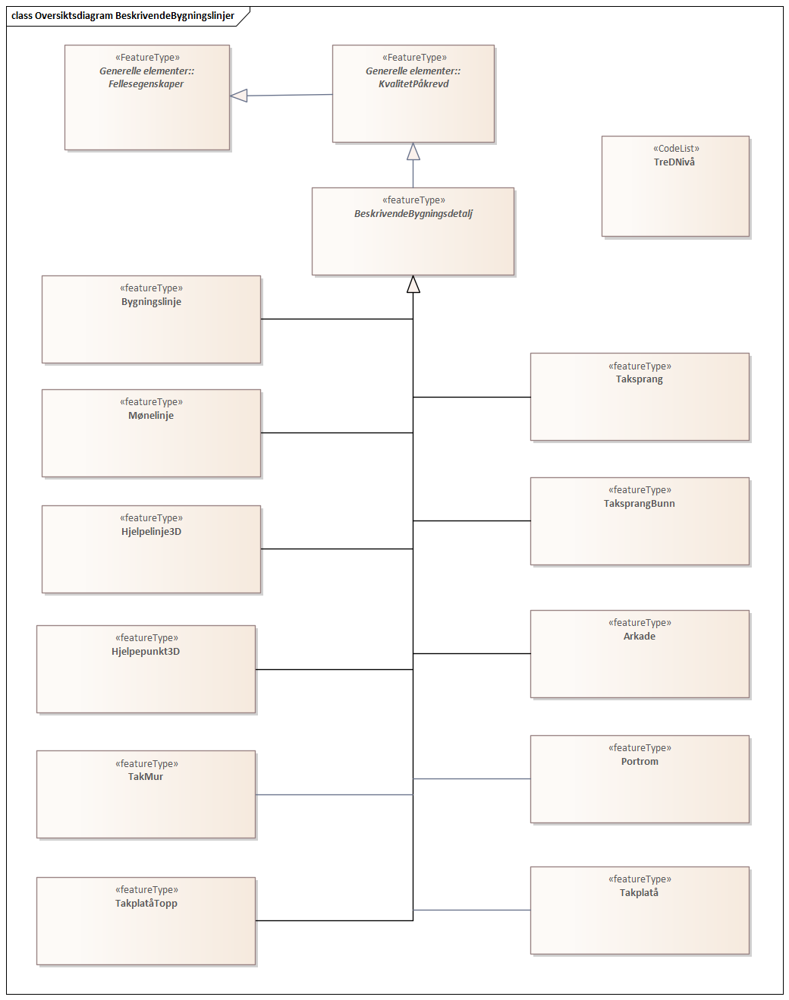
 
'''
 
.Realisering fra Bygg 4.5 - BeskrivendeBygningslinjer 
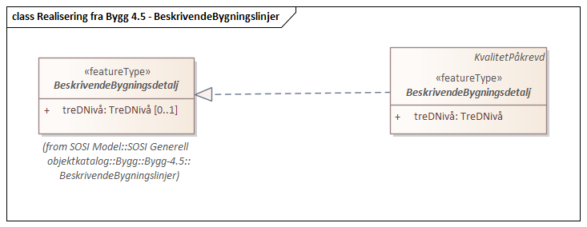
 
'''
 
.Hoveddiagram BeskrivendeBygningslinjer - objekttyper og kodelister 
image::diagrammer/Hoveddiagram BeskrivendeBygningslinjer - objekttyper og kodelister.png[link=diagrammer/Hoveddiagram BeskrivendeBygningslinjer - objekttyper og kodelister.png, alt="Diagram med navn Hoveddiagram BeskrivendeBygningslinjer - objekttyper og kodelister som viser UML-klasser beskrevet i teksten nedenfor."]
 
'''
 
.Hoveddiagram BeskrivendeBygningslinjer - Assosiasjoner 
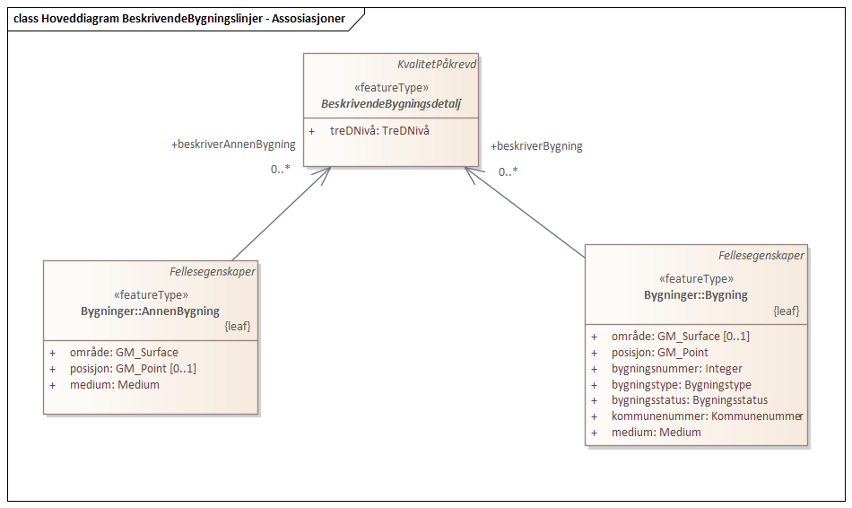
 
'''
 
[[beskrivendebygningsdetalj]]
===== «featureType» BeskrivendeBygningsdetalj (abstrakt)
*Definisjon:* bygningsdetalj som ligger innenfor bygningsavgrensning, og som ikke er knyttet til bygningens avgrensning
 
[discrete]
====== Egenskaper
[cols="20,80"]
|===
|*Navn:* 
|*treDNivå*
 
|Definisjon: 
|hvilken 3D framstillingsmulighet (angitt i 6 nivåer) bygningen kan framstilles i.
 
|Multiplisitet: 
|[1..1]
 
|Type: 
|<<trednivå,«CodeList» TreDNivå>>
|Profilparametre i tagged values: 
|
defaultCodeSpace: https://register.geonorge.no/sosi-kodelister/fkb/bygning/5.0/tredniv%c3%a5 + 
SOSI_datatype: H + 
SOSI_lengde: 1 + 
SOSI_navn: TRE_D_NIVÅ + 
|===
 
[discrete]
====== Arv og realiseringer
[cols="20,80"]
|===
|Supertype: 
|<<kvalitetpåkrevd,«FeatureType» KvalitetPåkrevd>>
 
|Subtyper:
|<<arkade,«featureType» Arkade>> +
<<hjelpelinje3d,«featureType» Hjelpelinje3D>> +
<<bygningslinje,«featureType» Bygningslinje>> +
<<taksprangbunn,«featureType» TaksprangBunn>> +
<<taksprang,«featureType» Taksprang>> +
<<hjelpepunkt3d,«featureType» Hjelpepunkt3D>> +
<<takplatåtopp,«featureType» TakplatåTopp>> +
<<portrom,«featureType» Portrom>> +
<<takplatå,«featureType» Takplatå>> +
<<takmur,«featureType» TakMur>> +
<<mønelinje,«featureType» Mønelinje>> +
|Realisering av: 
|«ApplicationSchema» Bygg-4.5/BeskrivendeBygningslinjer::«featureType» BeskrivendeBygningsdetalj +
|===
 
'''
 
[[arkade]]
===== «featureType» Arkade
*Definisjon:* avgrensing av en tunnel gjennom en bygning
 
 
'''
.Illustrasjon av objekttype Arkade
image::http://skjema.geonorge.no/SOSI/produktspesifikasjon/FKB-Bygning/5.0/figurer/objtype_arkade.png[link=http://skjema.geonorge.no/SOSI/produktspesifikasjon/FKB-Bygning/5.0/figurer/objtype_arkade.png, alt="Bilde av et eksempel på objekttypen Arkade, eventuelt med påtegning av streker som viser hvor geometrien til objektet skal måles fra."]
[discrete]
====== Egenskaper
[cols="20,80"]
|===
|*Navn:* 
|*grense*
 
|Definisjon: 
|forløp som følger objektets sentrale del (ytterkant)
 
|Multiplisitet: 
|[1..1]
 
|Type: 
|http://skjema.geonorge.no/SOSI/basistype/GM_Curve[GM_Curve]
|===
[cols="20,80"]
|===
|*Navn:* 
|*høydereferanse*
 
|Definisjon: 
|koordinatregistering utført på topp eller bunn av et objekt
 
|Multiplisitet: 
|[1..1]
 
|Type: 
|<<høydereferanse,«CodeList» Høydereferanse>>
|Profilparametre i tagged values: 
|
defaultCodeSpace: https://register.geonorge.no/sosi-kodelister/fkb/generell/5.0/hoydereferanse + 
SOSI_datatype: T + 
SOSI_lengde: 6 + 
SOSI_navn: HREF + 
|===
 
[discrete]
====== Arv og realiseringer
[cols="20,80"]
|===
|Supertype: 
|<<beskrivendebygningsdetalj,«featureType» BeskrivendeBygningsdetalj>>
 
|===
 
'''
 
[[bygningslinje]]
===== «featureType» Bygningslinje
*Definisjon:* linje som beskriver bygningsdetalj innenfor en takflate  og som ikke kan beskrives av andre objekttyper
Eksempel: Valming på tak
 
 
'''
.Illustrasjon av objekttype Bygningslinje
image::http://skjema.geonorge.no/SOSI/produktspesifikasjon/FKB-Bygning/5.0/figurer/objtype_bygningslinje.png[link=http://skjema.geonorge.no/SOSI/produktspesifikasjon/FKB-Bygning/5.0/figurer/objtype_bygningslinje.png, alt="Bilde av et eksempel på objekttypen Bygningslinje, eventuelt med påtegning av streker som viser hvor geometrien til objektet skal måles fra."]
[discrete]
====== Egenskaper
[cols="20,80"]
|===
|*Navn:* 
|*grense*
 
|Definisjon: 
|forløp som følger objektets sentrale del (ytterkant)
 
|Multiplisitet: 
|[1..1]
 
|Type: 
|http://skjema.geonorge.no/SOSI/basistype/GM_Curve[GM_Curve]
|===
 
[discrete]
====== Arv og realiseringer
[cols="20,80"]
|===
|Supertype: 
|<<beskrivendebygningsdetalj,«featureType» BeskrivendeBygningsdetalj>>
 
|===
 
'''
 
[[hjelpelinje3d]]
===== «featureType» Hjelpelinje3D
*Definisjon:* linje for å kunne danne gode 3D modeller av bygninger
 
 
'''
.Illustrasjon av objekttype Hjelpelinje3D
image::http://skjema.geonorge.no/SOSI/produktspesifikasjon/FKB-Bygning/5.0/figurer/objtype_hjelpelinje3d.png[link=http://skjema.geonorge.no/SOSI/produktspesifikasjon/FKB-Bygning/5.0/figurer/objtype_hjelpelinje3d.png, alt="Bilde av et eksempel på objekttypen Hjelpelinje3D, eventuelt med påtegning av streker som viser hvor geometrien til objektet skal måles fra."]
[discrete]
====== Egenskaper
[cols="20,80"]
|===
|*Navn:* 
|*senterlinje*
 
|Definisjon: 
|forløp som følger objektets sentrale del
 
|Multiplisitet: 
|[1..1]
 
|Type: 
|http://skjema.geonorge.no/SOSI/basistype/GM_Curve[GM_Curve]
|===
 
[discrete]
====== Arv og realiseringer
[cols="20,80"]
|===
|Supertype: 
|<<beskrivendebygningsdetalj,«featureType» BeskrivendeBygningsdetalj>>
 
|===
 
'''
 
[[hjelpepunkt3d]]
===== «featureType» Hjelpepunkt3D
*Definisjon:* punkt for å kunne danne gode 3-D modeller av oppstikkende detaljer som for eksempel spir
 
 
'''
.Illustrasjon av objekttype Hjelpepunkt3D
image::http://skjema.geonorge.no/SOSI/produktspesifikasjon/FKB-Bygning/5.0/figurer/objtype_hjelpepunkt3d.png[link=http://skjema.geonorge.no/SOSI/produktspesifikasjon/FKB-Bygning/5.0/figurer/objtype_hjelpepunkt3d.png, alt="Bilde av et eksempel på objekttypen Hjelpepunkt3D, eventuelt med påtegning av streker som viser hvor geometrien til objektet skal måles fra."]
[discrete]
====== Egenskaper
[cols="20,80"]
|===
|*Navn:* 
|*posisjon*
 
|Definisjon: 
|sted som objektet eksisterer på
 
|Multiplisitet: 
|[1..1]
 
|Type: 
|http://skjema.geonorge.no/SOSI/basistype/GM_Point[GM_Point]
|===
 
[discrete]
====== Arv og realiseringer
[cols="20,80"]
|===
|Supertype: 
|<<beskrivendebygningsdetalj,«featureType» BeskrivendeBygningsdetalj>>
 
|===
 
'''
 
[[mønelinje]]
===== «featureType» Mønelinje
*Definisjon:* linje som beskriver den horisontale knekklinje på toppen av taket (høyeste topp)
 
 
'''
.Illustrasjon av objekttype Mønelinje
image::http://skjema.geonorge.no/SOSI/produktspesifikasjon/FKB-Bygning/5.0/figurer/objtype_monelinje.png[link=http://skjema.geonorge.no/SOSI/produktspesifikasjon/FKB-Bygning/5.0/figurer/objtype_monelinje.png, alt="Bilde av et eksempel på objekttypen Mønelinje, eventuelt med påtegning av streker som viser hvor geometrien til objektet skal måles fra."]
[discrete]
====== Egenskaper
[cols="20,80"]
|===
|*Navn:* 
|*grense*
 
|Definisjon: 
|forløp som følger objektets sentrale del (ytterkant)
 
|Multiplisitet: 
|[1..1]
 
|Type: 
|http://skjema.geonorge.no/SOSI/basistype/GM_Curve[GM_Curve]
|===
 
[discrete]
====== Arv og realiseringer
[cols="20,80"]
|===
|Supertype: 
|<<beskrivendebygningsdetalj,«featureType» BeskrivendeBygningsdetalj>>
 
|===
 
'''
 
[[portrom]]
===== «featureType» Portrom
*Definisjon:* avgrensing av en tunnel gjennom en bygning
 
 
'''
.Illustrasjon av objekttype Portrom
image::http://skjema.geonorge.no/SOSI/produktspesifikasjon/FKB-Bygning/5.0/figurer/objtype_portrom.png[link=http://skjema.geonorge.no/SOSI/produktspesifikasjon/FKB-Bygning/5.0/figurer/objtype_portrom.png, alt="Bilde av et eksempel på objekttypen Portrom, eventuelt med påtegning av streker som viser hvor geometrien til objektet skal måles fra."]
[discrete]
====== Egenskaper
[cols="20,80"]
|===
|*Navn:* 
|*grense*
 
|Definisjon: 
|forløp som følger objektets sentrale del (ytterkant)
 
|Multiplisitet: 
|[1..1]
 
|Type: 
|http://skjema.geonorge.no/SOSI/basistype/GM_Curve[GM_Curve]
|===
[cols="20,80"]
|===
|*Navn:* 
|*høydereferanse*
 
|Definisjon: 
|koordinatregistering utført på topp eller bunn av et objekt
 
|Multiplisitet: 
|[1..1]
 
|Type: 
|<<høydereferanse,«CodeList» Høydereferanse>>
|Profilparametre i tagged values: 
|
defaultCodeSpace: https://register.geonorge.no/sosi-kodelister/fkb/generell/5.0/hoydereferanse + 
SOSI_datatype: T + 
SOSI_lengde: 6 + 
SOSI_navn: HREF + 
|===
 
[discrete]
====== Arv og realiseringer
[cols="20,80"]
|===
|Supertype: 
|<<beskrivendebygningsdetalj,«featureType» BeskrivendeBygningsdetalj>>
 
|===
 
'''
 
[[takmur]]
===== «featureType» TakMur
*Definisjon:* opphøyde kanter ved takkant
Merknad: Eksempel på kanter der TakMur skal benyttes er gavlvegger og brannvegger som stikker opp over takflaten
 
 
'''
.Illustrasjon av objekttype TakMur
image::http://skjema.geonorge.no/SOSI/produktspesifikasjon/FKB-Bygning/5.0/figurer/objtype_takmur.png[link=http://skjema.geonorge.no/SOSI/produktspesifikasjon/FKB-Bygning/5.0/figurer/objtype_takmur.png, alt="Bilde av et eksempel på objekttypen TakMur, eventuelt med påtegning av streker som viser hvor geometrien til objektet skal måles fra."]
[discrete]
====== Egenskaper
[cols="20,80"]
|===
|*Navn:* 
|*grense*
 
|Definisjon: 
|forløp som følger objektets sentrale del (ytterkant)
 
|Multiplisitet: 
|[1..1]
 
|Type: 
|http://skjema.geonorge.no/SOSI/basistype/GM_Curve[GM_Curve]
|===
 
[discrete]
====== Arv og realiseringer
[cols="20,80"]
|===
|Supertype: 
|<<beskrivendebygningsdetalj,«featureType» BeskrivendeBygningsdetalj>>
 
|===
 
'''
 
[[takplatå]]
===== «featureType» Takplatå
*Definisjon:* innsøkk i form av laveste vannrette flate på hovedvolum på bygningskropp
Eksempel: Arker som går inn i hovedtaket og "terrasse" inne i en bygård.
 
 
'''
.Illustrasjon av objekttype Takplatå
image::http://skjema.geonorge.no/SOSI/produktspesifikasjon/FKB-Bygning/5.0/figurer/objtype_takplata.png[link=http://skjema.geonorge.no/SOSI/produktspesifikasjon/FKB-Bygning/5.0/figurer/objtype_takplata.png, alt="Bilde av et eksempel på objekttypen Takplatå, eventuelt med påtegning av streker som viser hvor geometrien til objektet skal måles fra."]
[discrete]
====== Egenskaper
[cols="20,80"]
|===
|*Navn:* 
|*grense*
 
|Definisjon: 
|forløp som følger objektets sentrale del (ytterkant)
 
|Multiplisitet: 
|[1..1]
 
|Type: 
|http://skjema.geonorge.no/SOSI/basistype/GM_Curve[GM_Curve]
|===
 
[discrete]
====== Arv og realiseringer
[cols="20,80"]
|===
|Supertype: 
|<<beskrivendebygningsdetalj,«featureType» BeskrivendeBygningsdetalj>>
 
|===
 
'''
 
[[takplatåtopp]]
===== «featureType» TakplatåTopp
*Definisjon:* takkant i indre rom i bygårder der det indre rommet ikke går ned til terrengoverflaten
MERKNAD: Objekttypen skal benyttes som en utfyllende linje for å beskrive bygningsvolumet. Benyttes kun der Takplatå er benyttet for å beskrive tak inne i en bygning (for eksempel en bygård).
 
 
'''
.Illustrasjon av objekttype TakplatåTopp
image::http://skjema.geonorge.no/SOSI/produktspesifikasjon/FKB-Bygning/5.0/figurer/objtype_takplatatopp.png[link=http://skjema.geonorge.no/SOSI/produktspesifikasjon/FKB-Bygning/5.0/figurer/objtype_takplatatopp.png, alt="Bilde av et eksempel på objekttypen TakplatåTopp, eventuelt med påtegning av streker som viser hvor geometrien til objektet skal måles fra."]
[discrete]
====== Egenskaper
[cols="20,80"]
|===
|*Navn:* 
|*grense*
 
|Definisjon: 
|forløp som følger objektets sentrale del (ytterkant)
 
|Multiplisitet: 
|[1..1]
 
|Type: 
|http://skjema.geonorge.no/SOSI/basistype/GM_Curve[GM_Curve]
|===
 
[discrete]
====== Arv og realiseringer
[cols="20,80"]
|===
|Supertype: 
|<<beskrivendebygningsdetalj,«featureType» BeskrivendeBygningsdetalj>>
 
|===
 
'''
 
[[taksprang]]
===== «featureType» Taksprang
*Definisjon:* topp av takkant inne på en bygningskropp
Merknad: ikke ytterkant som registreres som takkant
 
 
'''
.Illustrasjon av objekttype Taksprang
image::http://skjema.geonorge.no/SOSI/produktspesifikasjon/FKB-Bygning/5.0/figurer/objtype_taksprang.png[link=http://skjema.geonorge.no/SOSI/produktspesifikasjon/FKB-Bygning/5.0/figurer/objtype_taksprang.png, alt="Bilde av et eksempel på objekttypen Taksprang, eventuelt med påtegning av streker som viser hvor geometrien til objektet skal måles fra."]
[discrete]
====== Egenskaper
[cols="20,80"]
|===
|*Navn:* 
|*grense*
 
|Definisjon: 
|forløp som følger objektets sentrale del (ytterkant)
 
|Multiplisitet: 
|[1..1]
 
|Type: 
|http://skjema.geonorge.no/SOSI/basistype/GM_Curve[GM_Curve]
|===
 
[discrete]
====== Arv og realiseringer
[cols="20,80"]
|===
|Supertype: 
|<<beskrivendebygningsdetalj,«featureType» BeskrivendeBygningsdetalj>>
 
|===
 
'''
 
[[taksprangbunn]]
===== «featureType» TaksprangBunn
*Definisjon:* bunn av takkant inne på en bygningskropp 
Merknad: Ikke ytterkant som er takkant
 
 
'''
.Illustrasjon av objekttype TaksprangBunn
image::http://skjema.geonorge.no/SOSI/produktspesifikasjon/FKB-Bygning/5.0/figurer/objtype_taksprangbunn.png[link=http://skjema.geonorge.no/SOSI/produktspesifikasjon/FKB-Bygning/5.0/figurer/objtype_taksprangbunn.png, alt="Bilde av et eksempel på objekttypen TaksprangBunn, eventuelt med påtegning av streker som viser hvor geometrien til objektet skal måles fra."]
[discrete]
====== Egenskaper
[cols="20,80"]
|===
|*Navn:* 
|*grense*
 
|Definisjon: 
|forløp som følger objektets sentrale del (ytterkant)
 
|Multiplisitet: 
|[1..1]
 
|Type: 
|http://skjema.geonorge.no/SOSI/basistype/GM_Curve[GM_Curve]
|===
 
[discrete]
====== Arv og realiseringer
[cols="20,80"]
|===
|Supertype: 
|<<beskrivendebygningsdetalj,«featureType» BeskrivendeBygningsdetalj>>
 
|===
 
'''
 
[[trednivå]]
===== «CodeList» TreDNivå
*Definisjon:* hvilken 3D framstillingsmulighet (angitt i 6 nivåer) bygningen kan framstilles i. Tilsvarer LOD i CityGML.
 
[discrete]
====== Profilparametre i tagged values
[cols="20,80"]
|===
|asDictionary
|true
 
|codeList
|https://register.geonorge.no/sosi-kodelister/fkb/bygning/5.0/tredniv%c3%a5
 
|SOSI_datatype
|H
 
|SOSI_lengde
|1
 
|SOSI_navn
|TRE_D_NIVÅ
 
|===
<<<
'''
==== Pakke: Bygningsvedheng
*Definisjon:* Inneholder elementer fra SOSI Bygg 4.5, Bygningsvedheng
 
'''
 
.Oversiktsdiagram Bygningsvedheng 
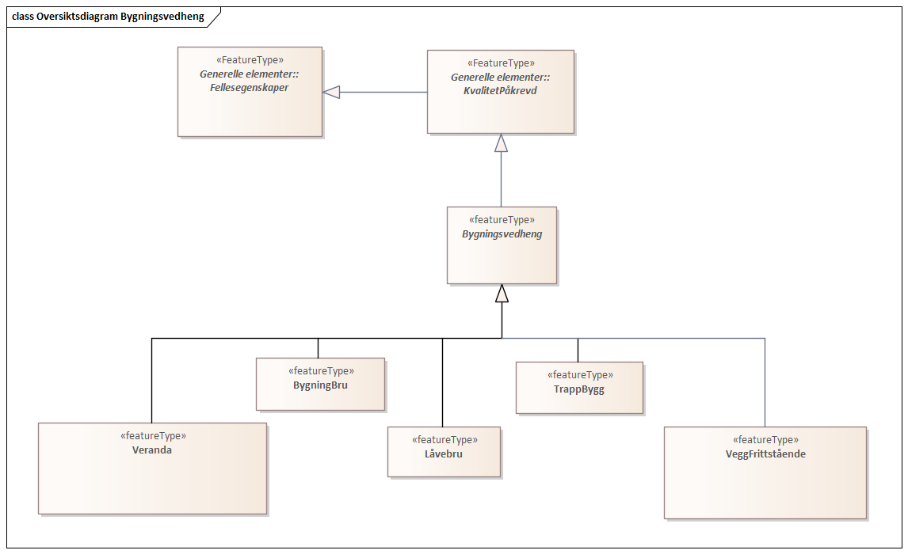
 
'''
 
.Realisering fra Bygg 4.5 - Bygningsvedheng 
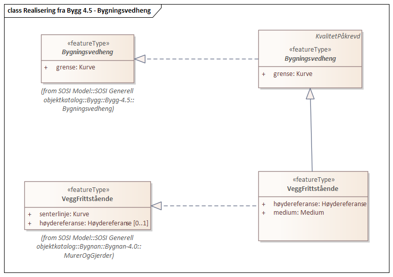
 
'''
 
.Hoveddiagram Bygningsvedheng - objekttyper 
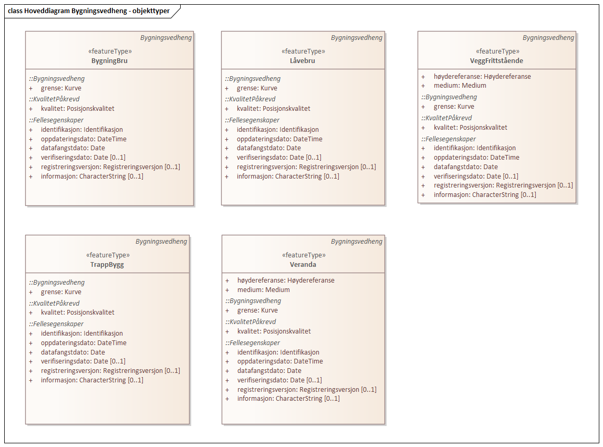
 
'''
 
.Hoveddiagram Bygningsvedheng - assosiasjoner 
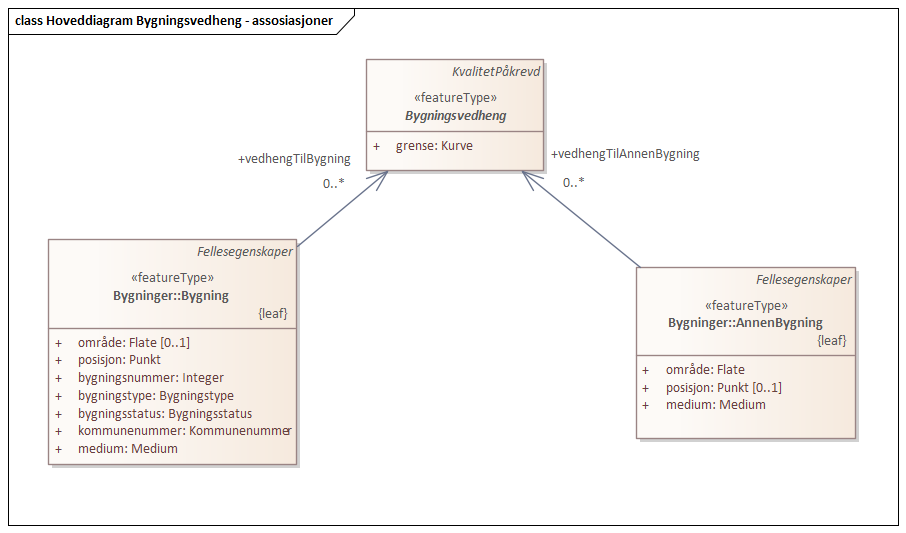
 
'''
 
[[bygningsvedheng]]
===== «featureType» Bygningsvedheng (abstrakt)
*Definisjon:* bygningsdetaljer som ligger i tilknytning til  bygningen, og som ikke er knyttet til bygningens avgrensning
 
[discrete]
====== Egenskaper
[cols="20,80"]
|===
|*Navn:* 
|*grense*
 
|Definisjon: 
|forløp som følger objektets sentrale del (ytterkant)
 
|Multiplisitet: 
|[1..1]
 
|Type: 
|http://skjema.geonorge.no/SOSI/basistype/GM_Curve[GM_Curve]
|===
 
[discrete]
====== Arv og realiseringer
[cols="20,80"]
|===
|Supertype: 
|<<kvalitetpåkrevd,«FeatureType» KvalitetPåkrevd>>
 
|Subtyper:
|<<låvebru,«featureType» Låvebru>> +
<<trappbygg,«featureType» TrappBygg>> +
<<veranda,«featureType» Veranda>> +
<<veggfrittstående,«featureType» VeggFrittstående>> +
<<bygningbru,«featureType» BygningBru>> +
|Realisering av: 
|«ApplicationSchema» Bygg-4.5/Bygningsvedheng::«featureType» Bygningsvedheng +
|===
 
'''
 
[[bygningbru]]
===== «featureType» BygningBru
*Definisjon:* bru tilknyttet bygning som brukes som adkomst til bygninger, og bruer mellom bygninger
Merknad:  Brukes på bygninger som ikke er driftsbygninger i landbruket. I det siste tilfellet brukes låvebru
 
 
'''
.Illustrasjon av objekttype BygningBru
image::http://skjema.geonorge.no/SOSI/produktspesifikasjon/FKB-Bygning/5.0/figurer/objtype_bygningbru.png[link=http://skjema.geonorge.no/SOSI/produktspesifikasjon/FKB-Bygning/5.0/figurer/objtype_bygningbru.png, alt="Bilde av et eksempel på objekttypen BygningBru, eventuelt med påtegning av streker som viser hvor geometrien til objektet skal måles fra."]
 
[discrete]
====== Arv og realiseringer
[cols="20,80"]
|===
|Supertype: 
|<<bygningsvedheng,«featureType» Bygningsvedheng>>
 
|===
 
'''
 
[[låvebru]]
===== «featureType» Låvebru
*Definisjon:* kjørerampe til et landbruksbygg
Merknad: Kjørerampe i tilknytning til et industri og lagerbygg beskrives som Annet vegareal/avkjørsel og Brukonstruksjon
 
 
'''
.Illustrasjon av objekttype Låvebru
image::http://skjema.geonorge.no/SOSI/produktspesifikasjon/FKB-Bygning/5.0/figurer/objtype_lavebru.png[link=http://skjema.geonorge.no/SOSI/produktspesifikasjon/FKB-Bygning/5.0/figurer/objtype_lavebru.png, alt="Bilde av et eksempel på objekttypen Låvebru, eventuelt med påtegning av streker som viser hvor geometrien til objektet skal måles fra."]
 
[discrete]
====== Arv og realiseringer
[cols="20,80"]
|===
|Supertype: 
|<<bygningsvedheng,«featureType» Bygningsvedheng>>
 
|===
 
'''
 
[[trappbygg]]
===== «featureType» TrappBygg
*Definisjon:* omfatter trapper som danner adkomsten til hus og trapp inntil hus
 
 
'''
.Illustrasjon av objekttype TrappBygg
image::http://skjema.geonorge.no/SOSI/produktspesifikasjon/FKB-Bygning/5.0/figurer/objtype_trappbygg.png[link=http://skjema.geonorge.no/SOSI/produktspesifikasjon/FKB-Bygning/5.0/figurer/objtype_trappbygg.png, alt="Bilde av et eksempel på objekttypen TrappBygg, eventuelt med påtegning av streker som viser hvor geometrien til objektet skal måles fra."]
 
[discrete]
====== Arv og realiseringer
[cols="20,80"]
|===
|Supertype: 
|<<bygningsvedheng,«featureType» Bygningsvedheng>>
 
|===
 
'''
 
[[veranda]]
===== «featureType» Veranda
*Definisjon:* bygningsvedheng som omfatter veranda,  terrasse, altan, balkong og lasterampe
Merknad: Garasje med veranda på taket er enten en del av bygningsenheten den ligger til eller - hvis den er tildelt eget bygningsnummer - en bygning.
 
 
'''
.Illustrasjon av objekttype Veranda
image::http://skjema.geonorge.no/SOSI/produktspesifikasjon/FKB-Bygning/5.0/figurer/objtype_veranda.png[link=http://skjema.geonorge.no/SOSI/produktspesifikasjon/FKB-Bygning/5.0/figurer/objtype_veranda.png, alt="Bilde av et eksempel på objekttypen Veranda, eventuelt med påtegning av streker som viser hvor geometrien til objektet skal måles fra."]
[discrete]
====== Egenskaper
[cols="20,80"]
|===
|*Navn:* 
|*høydereferanse*
 
|Definisjon: 
|koordinatregistering utført på topp eller bunn av et objekt
 
|Multiplisitet: 
|[1..1]
 
|Type: 
|<<høydereferanse,«CodeList» Høydereferanse>>
|Profilparametre i tagged values: 
|
defaultCodeSpace: https://register.geonorge.no/sosi-kodelister/fkb/generell/5.0/hoydereferanse + 
SOSI_datatype: T + 
SOSI_lengde: 6 + 
SOSI_navn: HREF + 
|===
[cols="20,80"]
|===
|*Navn:* 
|*medium*
 
|Definisjon: 
|objektets beliggenhet i forhold til jordoverflaten

Eksempel:
På bro, i tunnel, inne i et bygningsmessig anlegg, etc.
 
|Multiplisitet: 
|[1..1]
 
|Type: 
|<<medium,«CodeList» Medium>>
|Profilparametre i tagged values: 
|
defaultCodeSpace: https://register.geonorge.no/sosi-kodelister/fkb/generell/5.0/medium + 
SOSI_datatype: T + 
SOSI_lengde: 1 + 
SOSI_navn: MEDIUM + 
|===
 
[discrete]
====== Arv og realiseringer
[cols="20,80"]
|===
|Supertype: 
|<<bygningsvedheng,«featureType» Bygningsvedheng>>
 
|===
 
'''
 
[[veggfrittstående]]
===== «featureType» VeggFrittstående
*Definisjon:* vegg oppsatt for skjerming
 
 
'''
.Illustrasjon av objekttype VeggFrittstående
image::http://skjema.geonorge.no/SOSI/produktspesifikasjon/FKB-Bygning/5.0/figurer/objtype_veggfrittstaende.png[link=http://skjema.geonorge.no/SOSI/produktspesifikasjon/FKB-Bygning/5.0/figurer/objtype_veggfrittstaende.png, alt="Bilde av et eksempel på objekttypen VeggFrittstående, eventuelt med påtegning av streker som viser hvor geometrien til objektet skal måles fra."]
[discrete]
====== Egenskaper
[cols="20,80"]
|===
|*Navn:* 
|*høydereferanse*
 
|Definisjon: 
|angivelse av om registreringen er utført på topp eller bunn av et element- f.eks. en skråning- mur osv.
 
|Multiplisitet: 
|[1..1]
 
|Type: 
|<<høydereferanse,«CodeList» Høydereferanse>>
|Profilparametre i tagged values: 
|
defaultCodeSpace: https://register.geonorge.no/sosi-kodelister/fkb/generell/5.0/hoydereferanse + 
SOSI_datatype: T + 
SOSI_lengde: 6 + 
SOSI_navn: HREF + 
|===
[cols="20,80"]
|===
|*Navn:* 
|*medium*
 
|Definisjon: 
|objektets beliggenhet i forhold til jordoverflaten
 
|Multiplisitet: 
|[1..1]
 
|Type: 
|<<medium,«CodeList» Medium>>
|Profilparametre i tagged values: 
|
defaultCodeSpace: https://register.geonorge.no/sosi-kodelister/fkb/generell/5.0/medium + 
SOSI_datatype: T + 
SOSI_lengde: 1 + 
SOSI_navn: MEDIUM + 
|===
 
[discrete]
====== Arv og realiseringer
[cols="20,80"]
|===
|Supertype: 
|<<bygningsvedheng,«featureType» Bygningsvedheng>>
 
|Realisering av: 
|«ApplicationSchema» Bygnan-4.0/MurerOgGjerder::«featureType» VeggFrittstående +
|===
<<<
'''
==== Pakke: Takoverbygg
*Definisjon:* Inneholder elementer fra SOSI Bygg 4.5, Takoverbygg
 
'''
 
.Oversiktsdiagram Takoverbygg 
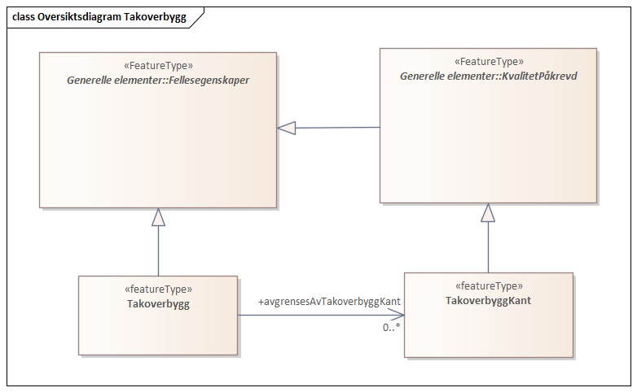
 
'''
 
.Realisering fra Bygg 4.5 - Takoverbygg 
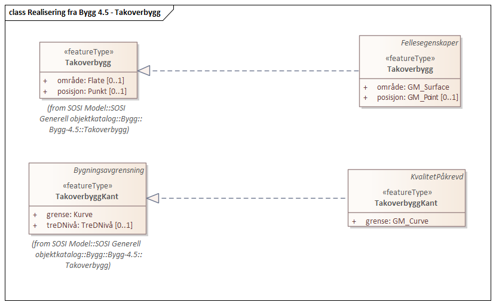
 
'''
 
.Hoveddiagram Takoverbygg - objekttyper 
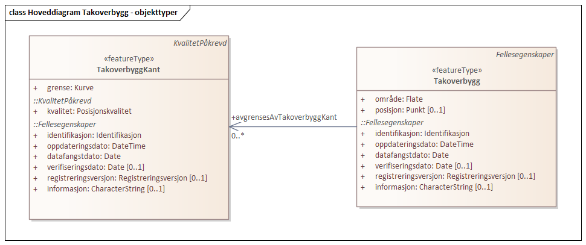
 
'''
 
.Hoveddiagram Takoverbygg - flateavgrensning 
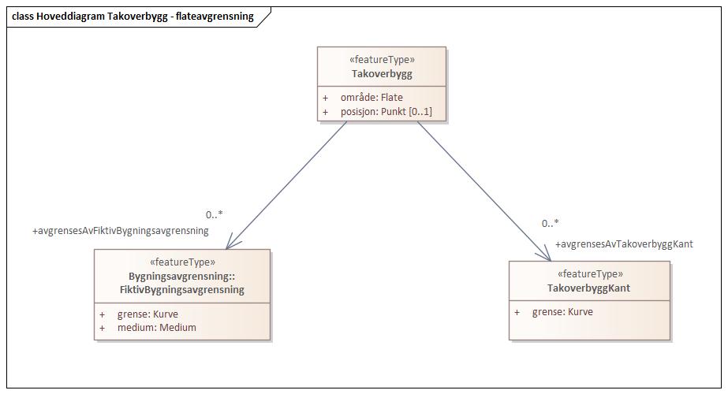
 
'''
 
[[takoverbygg]]
===== «featureType» Takoverbygg
*Definisjon:* byggverk med ingen eller få vegger, og som ikke er registrert som bygning i matrikkelen
Eksempel:  'carport' eller tak over bensinpumper
 
 
'''
.Illustrasjon av objekttype Takoverbygg
image::http://skjema.geonorge.no/SOSI/produktspesifikasjon/FKB-Bygning/5.0/figurer/objtype_takoverbygg.png[link=http://skjema.geonorge.no/SOSI/produktspesifikasjon/FKB-Bygning/5.0/figurer/objtype_takoverbygg.png, alt="Bilde av et eksempel på objekttypen Takoverbygg, eventuelt med påtegning av streker som viser hvor geometrien til objektet skal måles fra."]
[discrete]
====== Egenskaper
[cols="20,80"]
|===
|*Navn:* 
|*område*
 
|Definisjon: 
|objektets utstrekning
 
|Multiplisitet: 
|[1..1]
 
|Type: 
|http://skjema.geonorge.no/SOSI/basistype/GM_Surface[GM_Surface]
|===
[cols="20,80"]
|===
|*Navn:* 
|*posisjon*
 
|Definisjon: 
|sted som objektet eksisterer på
 
|Multiplisitet: 
|[0..1]
 
|Type: 
|http://skjema.geonorge.no/SOSI/basistype/GM_Point[GM_Point]
|===
 
[discrete]
====== Roller
[cols="20,80"]
|===
|*Rollenavn:* 
|*avgrensesAvTakoverbyggKant*
 
|Definisjon:
|Krav til delt flategeometri. Avgrensning av takoverbygg med takoverbyggkant
 
|Multiplisitet: 
|[0..*]
 
|Til klasse
|<<takoverbyggkant,«featureType» TakoverbyggKant>>
|===
[cols="20,80"]
|===
|*Rollenavn:* 
|*avgrensesAvFiktivBygningsavgrensning*
 
|Definisjon:
|Krav til delt flategeometri. Avgrensning av takoverbygg med en fiktiv avgrensningslinje
 
|Multiplisitet: 
|[0..*]
 
|Til klasse
|<<fiktivbygningsavgrensning,«featureType» FiktivBygningsavgrensning>>
|===
 
[discrete]
====== Restriksjoner
[cols="20,80"]
|===
|*Navn:* 
|*avgrensningsobjekter i samsvar med områdegeometri*
 
|Beskrivelse: 
|
--ingen OCL, restriksjonen implementeres manuelt
 + 
--Område-geometrien skal være lik summen av geometriene til de assosierte avgrensningsobjektene
 
|===
[cols="20,80"]
|===
|*Navn:* 
|*posisjon innenfor område*
 
|Beskrivelse: 
|
--ingen OCL, restriksjonen implementeres manuelt
 + 
--Dersom det finnes område-geometri skal posisjon-geometrien ligge innenfor område-geometrien
 
|===
 
[discrete]
====== Arv og realiseringer
[cols="20,80"]
|===
|Supertype: 
|<<fellesegenskaper,«FeatureType» Fellesegenskaper>>
 
|Realisering av: 
|«ApplicationSchema» Bygg-4.5/Takoverbygg::«featureType» Takoverbygg +
|===
 
'''
 
[[takoverbyggkant]]
===== «featureType» TakoverbyggKant
*Definisjon:* avgrensing av takoverbygg
 
 
'''
.Illustrasjon av objekttype TakoverbyggKant
image::http://skjema.geonorge.no/SOSI/produktspesifikasjon/FKB-Bygning/5.0/figurer/objtype_takoverbyggkant.png[link=http://skjema.geonorge.no/SOSI/produktspesifikasjon/FKB-Bygning/5.0/figurer/objtype_takoverbyggkant.png, alt="Bilde av et eksempel på objekttypen TakoverbyggKant, eventuelt med påtegning av streker som viser hvor geometrien til objektet skal måles fra."]
[discrete]
====== Egenskaper
[cols="20,80"]
|===
|*Navn:* 
|*grense*
 
|Definisjon: 
|forløp som følger objektets sentrale del (ytterkant)
 
|Multiplisitet: 
|[1..1]
 
|Type: 
|http://skjema.geonorge.no/SOSI/basistype/GM_Curve[GM_Curve]
|===
 
[discrete]
====== Arv og realiseringer
[cols="20,80"]
|===
|Supertype: 
|<<kvalitetpåkrevd,«FeatureType» KvalitetPåkrevd>>
 
|Realisering av: 
|«ApplicationSchema» Bygg-4.5/Takoverbygg::«featureType» TakoverbyggKant +
|===
// End of UML-model
