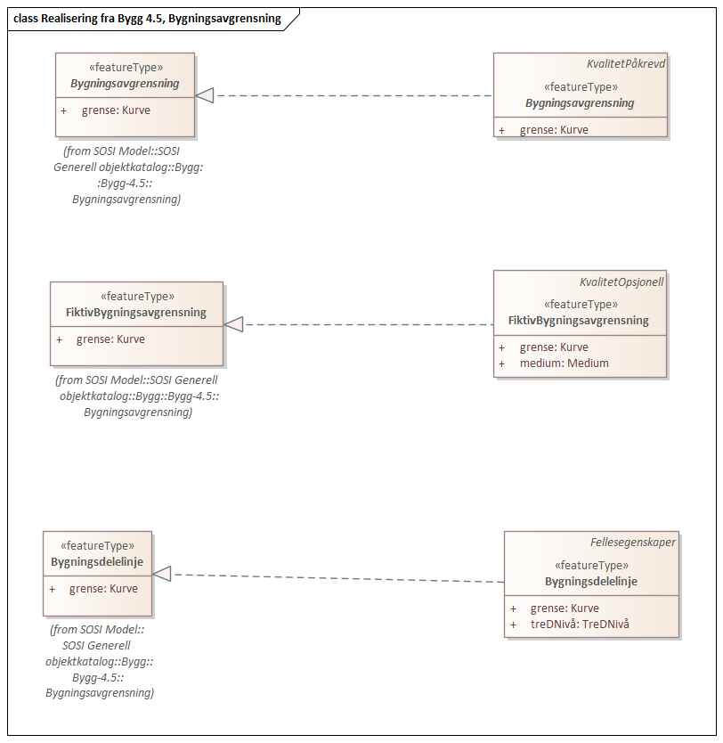

=== Pakke «ApplicationSchema» FKB-Bygning-5.0-Utkast
*Definisjon:* Datamodell for produktspesfikasjonen FKB-Bygning. FKB-Bygning inneholder detaljert bygningsinformasjon. Datamodellen omfatter beskrivelse av alle typer bygninger, takoverbygg, beskrivende bygningslinjer (for eksempel m&#248;nelinje) samt bygningsvedheng (for eksempel veranda).
 
===== Profilparametre i tagged values
[cols="20,80"]
|===
|definition
|"FKB-Bygning contains detailed topographic building in 2.5D"@en
 
|description
|"Contains building surface, contour lines describing the builing and objects connected to the building" @en
 
|designation
|"Product specification FKB-Bygning 5.0"@en
 
|language
|no
 
|SOSI_kortnavn
|FKB-Bygning
 
|SOSI_langnavn
|FKB Bygning
 
|SOSI_modellstatus
|utkast
 
|SOSI_spesifikasjonstype
|produktspesifikasjon
 
|SOSI_versjon
|5.0
 
|targetNamespace
|http://skjema.geonorge.no/SOSI/produktspesifikasjon/FKB-Bygning/5.0/
 
|version
|5.0
 
|xmlns
|app
 
|xsdDocument
|FKB-Bygning50.xsd
 
|===
[caption="Figur 1: ",title=Pakkerealisering]
image::diagrammer/Pakkerealisering.png[Pakkerealisering]
[caption="Figur 2: ",title=Oversiktsdiagram FKB-Bygning]
image::diagrammer/Oversiktsdiagram FKB-Bygning.png[Oversiktsdiagram FKB-Bygning]
<<<
|===
|===
=== Pakke: Generelle elementer
*Definisjon:* Inneholder elementer fra FKB Generell del 5.0
[caption="Figur 3: ",title=Oversiktsdiagram Fellesegenskaper]
image::diagrammer/Oversiktsdiagram Fellesegenskaper.png[Oversiktsdiagram Fellesegenskaper]
[caption="Figur 4: ",title=Realisering fra SOSI generell del]
image::diagrammer/Realisering fra SOSI generell del.png[Realisering fra SOSI generell del]
[caption="Figur 5: ",title=Hoveddiagram Posisjonskvalitet]
image::diagrammer/Hoveddiagram Posisjonskvalitet.png[Hoveddiagram Posisjonskvalitet]
 
|===
|===
 
[[fellesegenskaper]]
==== «FeatureType» Fellesegenskaper (abstrakt)
*Definisjon:* abstrakt objekttype som bærer sentrale egenskaper som er anbefalt for bruk i produktspesifikasjoner.

Merknad: Disse egenskapene skal derfor ikke modelleres inn i fagområdemodeller.
 
*Realisering av:* «ApplicationSchema» Generelle typer 5.1/SOSI_Fellesegenskaper og SOSI_Objekt::«FeatureType» SOSI_Objekt
 
*Realisering av:* «ApplicationSchema» FKB Generell del-5.0Utkast::«FeatureType» Fellesegenskaper
 
===== Egenskaper
[cols="20,80"]
|===
|*Navn:* 
|*identifikasjon*
 
|Definisjon: 
|unik identifikasjon av et objekt 

Merknad FKB:
Unik identifikasjon av et objekt, ivaretas av den ansvarlige produsent/forvalter, og som kan benyttes av eksterne applikasjoner som referanse til objektet.
Den unike identifikatoren er unik for kartobjektet og skal ikke endres i kartobjektets levetid. Dette m&#229; ikke forveksles med en tematisk identifikator (for eksempel bygningsnummer) som unikt identifiserer et objekt i virkeligheten. En bygning med samme bygningsnummer vil kunne representeres i mange kartprodukter der det finnes en unik identifikasjon i hver av dem.
For FKB benyttes UUID (Universally unique identifier) som lokalId. Dette inneb&#230;rer at lokalId alene alltid vil v&#230;re unik. Likevel skal alltid navnerom ogs&#229; angis. Navnerom angir FKB-datasettet.
 
|Multiplisitet: 
|[1..1]
 
|Type: 
|<<identifikasjon,«dataType» Identifikasjon>>
|Profilparametre i tagged values: 
|
SOSI_navn: IDENT + 
|===
[cols="20,80"]
|===
|*Navn:* 
|*oppdateringsdato*
 
|Definisjon: 
|tidspunkt for siste endring p&#229; objektet 

Merknad FKB: 

Denne datoen viser datasystemets siste endring p&#229; dataobjektet. Egenskapen settes av forvaltningssystemet etter f&#248;lgende regler:

i. Oppdateringsdato er tidspunkt for oppdatering av databasen og settes av forvaltningsbasen (ikke av klienten).

ii. Oppdateringsdato skal endres ogs&#229; hvis det er kopidata som blir endret eller importert i en ”kopibase”.

iii. N&#229;r avgrensingslinjene til en flate endres, skal flateobjektet f&#229; ny oppdateringsdato.

iv. Oppdateringsdato skal endres hvis en egenskap endres.
 
|Multiplisitet: 
|[1..1]
 
|Type: 
|http://skjema.geonorge.no/SOSI/basistype/DateTime[DateTime]
|Profilparametre i tagged values: 
|
SOSI_datatype: DATOTID + 
SOSI_navn: OPPDATERINGSDATO + 
|===
[cols="20,80"]
|===
|*Navn:* 
|*datafangstdato*
 
|Definisjon: 
|dato n&#229;r objektet siste gang ble registrert/observert/m&#229;lt i terrenget
 
|Multiplisitet: 
|[1..1]
 
|Type: 
|http://skjema.geonorge.no/SOSI/basistype/Date[Date]
|Profilparametre i tagged values: 
|
SOSI_datatype: DATO + 
SOSI_navn: DATAFANGSTDATO + 
|===
[cols="20,80"]
|===
|*Navn:* 
|*verifiseringsdato*
 
|Definisjon: 
|dato n&#229;r dataene er fastsl&#229;tt &#229; v&#230;re i samsvar med virkeligheten.

Merknad FKB:
Brukes for eksempel i de sammenhenger hvor det er foretatt fotogrammetrisk ajourhold, og hvor det ikke er registrert endringer p&#229; objektet (det virkelige objektet er i samsvar med dataobjektet)
 
|Multiplisitet: 
|[0..1]
 
|Type: 
|http://skjema.geonorge.no/SOSI/basistype/Date[Date]
|Profilparametre i tagged values: 
|
SOSI_datatype: DATO + 
SOSI_navn: VERIFISERINGSDATO + 
|===
[cols="20,80"]
|===
|*Navn:* 
|*registreringsversjon*
 
|Definisjon: 
|angivelse av hvilken produktspesifikasjon som er utgangspunkt  for dataene
 
|Multiplisitet: 
|[0..1]
 
|Type: 
|<<registreringsversjon,«CodeList» Registreringsversjon>>
|Profilparametre i tagged values: 
|
defaultCodeSpace: https://register.geonorge.no/sosi-kodelister/fkb/generell/5.0/registreringsversjon + 
SOSI_datatype: T + 
SOSI_lengde: 10 + 
SOSI_navn: REGISTRERINGSVERSJON + 
|===
[cols="20,80"]
|===
|*Navn:* 
|*informasjon*
 
|Definisjon: 
|generell opplysning.

Merknad FKB:
Mulighet til &#229; legge inn utfyllende informasjon om objektet. Egenskapen b&#248;r bare brukes til &#229; legge inn ekstra informasjon om enkeltobjekter. Egenskapen b&#248;r ikke brukes til &#229; systematisk angi ekstrainformasjon om mange/alle objekter i et datasett.
 
|Multiplisitet: 
|[0..1]
 
|Type: 
|http://skjema.geonorge.no/SOSI/basistype/CharacterString[CharacterString]
|Profilparametre i tagged values: 
|
SOSI_datatype: T + 
SOSI_lengde: 255 + 
SOSI_navn: INFORMASJON + 
|===
[cols="20,80"]
|===
|*Subtyper:*
|«featureType» AnnenBygning +
«featureType» Takoverbygg +
«featureType» Bygningsdelelinje +
«featureType» Bygning +
«FeatureType» KvalitetPåkrevd +
«FeatureType» KvalitetOpsjonell
|===
 
|===
|===
 
[[kvalitetpåkrevd]]
==== «FeatureType» KvalitetPåkrevd (abstrakt)
*Definisjon:* abstrakt objekttype med p&#229;krevet kvalitetsangivelse
 
*Supertype:* <<fellesegenskaper,«FeatureType» Fellesegenskaper>>
 
*Realisering av:* «ApplicationSchema» Generelle typer 5.1/SOSI_Fellesegenskaper og SOSI_Objekt::«FeatureType» SOSI_Objekt
 
*Realisering av:* «ApplicationSchema» FKB Generell del-5.0Utkast::«FeatureType» KvalitetPåkrevd
 
===== Egenskaper
[cols="20,80"]
|===
|*Navn:* 
|*kvalitet*
 
|Definisjon: 
|beskrivelse av kvaliteten på stedfestingen

Merknad: Denne er identisk med ..KVALITET i tidligere versjoner av SOSI.
 
|Multiplisitet: 
|[1..1]
 
|Type: 
|<<posisjonskvalitet,«dataType» Posisjonskvalitet>>
|Profilparametre i tagged values: 
|
SOSI_navn: KVALITET + 
|===
[cols="20,80"]
|===
|*Subtyper:*
|«featureType» BeskrivendeBygningsdetalj +
«featureType» Bygningsavgrensning +
«featureType» TakoverbyggKant +
«featureType» Bygningsvedheng
|===
 
|===
|===
 
[[kvalitetopsjonell]]
==== «FeatureType» KvalitetOpsjonell (abstrakt)
*Definisjon:* abstrakt objekttype med valgfri kvalitetsangivelse
 
*Supertype:* <<fellesegenskaper,«FeatureType» Fellesegenskaper>>
 
*Realisering av:* «ApplicationSchema» Generelle typer 5.1/SOSI_Fellesegenskaper og SOSI_Objekt::«FeatureType» SOSI_Objekt
 
===== Egenskaper
[cols="20,80"]
|===
|*Navn:* 
|*kvalitet*
 
|Definisjon: 
|beskrivelse av kvaliteten på stedfestingen

Merknad: Denne er identisk med ..KVALITET i tidligere versjoner av SOSI.
 
|Multiplisitet: 
|[0..1]
 
|Type: 
|<<posisjonskvalitet,«dataType» Posisjonskvalitet>>
|Profilparametre i tagged values: 
|
SOSI_navn: KVALITET + 
|===
[cols="20,80"]
|===
|*Subtyper:*
|«featureType» FiktivBygningsavgrensning +
«featureType» BygningsavgrensningTiltak
|===
 
|===
|===
 
[[identifikasjon]]
==== «dataType» Identifikasjon
*Definisjon:* Unik identifikasjon av et objekt i et datasett, forvaltet av den ansvarlige produsent/forvalter, og kan benyttes av eksterne applikasjoner som stabil referanse til objektet. 

Merknad 1: Denne objektidentifikasjonen må ikke forveksles med en tematisk objektidentifikasjon, slik som f.eks bygningsnummer. 

Merknad 2: Denne unike identifikatoren vil ikke endres i løpet av objektets levetid, og ikke gjenbrukes i andre objekt. 
 
*Realisering av:* «ApplicationSchema» Generelle typer 5.1/SOSI_Fellesegenskaper og SOSI_Objekt::«dataType» Identifikasjon
 
===== Profilparametre i tagged values
[cols="20,80"]
|===
|SOSI_navn
|IDENT
 
|===
===== Egenskaper
[cols="20,80"]
|===
|*Navn:* 
|*lokalId*
 
|Definisjon: 
|lokal identifikator av et objekt

Merknad: Det er dataleverend&#248;rens ansvar &#229; s&#248;rge for at den lokale identifikatoren er unik innenfor navnerommet. For FKB-data benyttes UUID som lokalId.
 
|Multiplisitet: 
|[1..1]
 
|Type: 
|http://skjema.geonorge.no/SOSI/basistype/CharacterString[CharacterString]
|Profilparametre i tagged values: 
|
SOSI_datatype: T + 
SOSI_lengde: 100 + 
SOSI_navn: LOKALID + 
|===
[cols="20,80"]
|===
|*Navn:* 
|*navnerom*
 
|Definisjon: 
|navnerom som unikt identifiserer datakilden til et objekt, anbefales å være en http-URI

Eksempel: http://data.geonorge.no/SentraltStedsnavnsregister/1.0

Merknad : Verdien for nanverom vil eies av den dataprodusent som har ansvar for de unike identifikatorene og må være registrert i data.geonorge.no eller data.norge.no
 
|Multiplisitet: 
|[1..1]
 
|Type: 
|http://skjema.geonorge.no/SOSI/basistype/CharacterString[CharacterString]
|Profilparametre i tagged values: 
|
SOSI_datatype: T + 
SOSI_lengde: 100 + 
SOSI_navn: NAVNEROM + 
|===
[cols="20,80"]
|===
|*Navn:* 
|*versjonId*
 
|Definisjon: 
|identifikasjon av en spesiell versjon av et geografisk objekt (instans)
 
|Multiplisitet: 
|[0..1]
 
|Type: 
|http://skjema.geonorge.no/SOSI/basistype/CharacterString[CharacterString]
|Profilparametre i tagged values: 
|
SOSI_datatype: T + 
SOSI_lengde: 100 + 
SOSI_navn: VERSJONID + 
|===
 
|===
|===
 
[[posisjonskvalitet]]
==== «dataType» Posisjonskvalitet
*Definisjon:* beskrivelse av kvaliteten p&#229; stedfestingen.

Merknad:
Posisjonskvalitet er ikke konform med  kvalitetsmodellen i ISO slik den er defineret i ISO19157:2013, men er en videref&#248;ring av tildligere brukte kvalitetsegenskaper i SOSI. FKB 5.0 innf&#248;rer en egen variant av datatypen Posisjonskvalitet der kodeliste m&#229;lemetode er byttet ut med den mer generelle kodelista Datafangstmetode. 
 
*Realisering av:* «ApplicationSchema» Generelle typer 5.1/SOSI_Fellesegenskaper og SOSI_Objekt::«dataType» Posisjonskvalitet
 
===== Profilparametre i tagged values
[cols="20,80"]
|===
|SOSI_navn
|KVALITET
 
|===
===== Egenskaper
[cols="20,80"]
|===
|*Navn:* 
|*datafangstmetode*
 
|Definisjon: 
|metode for datafangst. 
Egenskapen beskriver datafangstmetode for grunnrisskoordinater (x,y), eller for b&#229;de grunnriss og h&#248;yde (x,y,z) dersom det ikke er oppgitt noen verdi for datafangstmetodeH&#248;yde.
 
|Multiplisitet: 
|[1..1]
 
|Type: 
|<<datafangstmetode,«CodeList» Datafangstmetode>>
|Profilparametre i tagged values: 
|
defaultCodeSpace: https://register.geonorge.no/sosi-kodelister/fkb/generell/5.0/datafangstmetode + 
SOSI_datatype: T + 
SOSI_lengde: 3 + 
SOSI_navn: DATAFANGSTMETODE + 
|===
[cols="20,80"]
|===
|*Navn:* 
|*nøyaktighet*
 
|Definisjon: 
|standardavviket til posisjoneringa av objektet oppgitt i cm

I de aller fleste sammenhenger benyttes en ansl&#229;tt eller forventet verdi for standardavvik, men dersom man har en beregnet verdi skal denne benyttes. 

For objekter med punktgeometri benyttes verdi for punktstandardavvik. For objekter med kurvegeometri benyttes standardavviket for tverravviket fra kurva. For objekter med overflate- eller volumgeometri er forst&#229;elsen at standardavviket beregnes ut fra (3D) avvikene mellom sann posisjon og n&#230;rmeste punkt p&#229; overflata. 

Merknad:
Verdien er ment &#229; beskrive n&#248;yaktigheten til objektet sammenlignet med sann verdi. Standardavvik er i utgangspunktet et m&#229;l p&#229; det tilfeldige avviket og det inneb&#230;rer at vi forutsetter at det systematiske avviket i liten grad p&#229;virker n&#248;yaktigheten til posisjoneringa. For fotogrammetriske data settes som hovedregel verdien lik kravet til standardavvik ved datafangst. Se standarden Geodatakvalitet for n&#230;rmere definisjon av standardavvik og hvordan dette defineres, beregnes og kontrolleres.
 
|Multiplisitet: 
|[0..1]
 
|Type: 
|http://skjema.geonorge.no/SOSI/basistype/Integer[Integer]
|Profilparametre i tagged values: 
|
SOSI_datatype: H + 
SOSI_lengde: 6 + 
SOSI_navn: NØYAKTIGHET + 
|===
[cols="20,80"]
|===
|*Navn:* 
|*synbarhet*
 
|Definisjon: 
|beskrivelse av hvor godt objektene framg&#229;r i datagrunnlaget for posisjonering (f.eks. flybildene).
 
|Multiplisitet: 
|[0..1]
 
|Type: 
|<<synbarhet,«CodeList» Synbarhet>>
|Profilparametre i tagged values: 
|
defaultCodeSpace: https://register.geonorge.no/sosi-kodelister/fkb/generell/5.0/synbarhet + 
SOSI_datatype: H + 
SOSI_lengde: 1 + 
SOSI_navn: SYNBARHET + 
|===
[cols="20,80"]
|===
|*Navn:* 
|*datafangstmetodeHøyde*
 
|Definisjon: 
|metoden brukt for h&#248;yderegistrering av posisjon.

Det er bare n&#248;dvending &#229; angi en verdi for egenskapen dersom datafangstmetode for h&#248;yde avviker fra datafangstmetode for grunnriss.

 
|Multiplisitet: 
|[0..1]
 
|Type: 
|<<datafangstmetode,«CodeList» Datafangstmetode>>
|Profilparametre i tagged values: 
|
defaultCodeSpace: https://register.geonorge.no/sosi-kodelister/fkb/generell/5.0/datafangstmetode + 
SOSI_datatype: T + 
SOSI_lengde: 3 + 
SOSI_navn: DATAFANGSTMETODEHØYDE + 
|===
[cols="20,80"]
|===
|*Navn:* 
|*nøyaktighetHøyde*
 
|Definisjon: 
|standardavviket til posisjoneringa av objektet oppgitt i cm

I de aller fleste sammenhenger benyttes en ansl&#229;tt eller forventet verdi for standardavviket, men dersom man faktisk har standardavviket til posisjoneringa av objektet oppgitt i cm

I de aller fleste sammenhenger benyttes en ansl&#229;tt eller forventet verdi for standardavvik, men dersom man har en beregnet verdi skal denne benyttes. 

Merknad:
Verdien er ment &#229; beskrive n&#248;yaktigheten til objektet sammenlignet med sann verdi. Standardavvik er i utgangspunktet et m&#229;l p&#229; det tilfeldige avviket og det inneb&#230;rer at vi forutsetter at det systematiske avviket i liten grad p&#229;virker n&#248;yaktigheten til posisjoneringa. For fotogrammetriske data settes som hovedregel verdien lik kravet til standardavvik ved datafangst. Se standarden Geodatakvalitet for n&#230;rmere definisjon av standardavvik og hvordan dette defineres, beregnes og kontrolleres.

 
|Multiplisitet: 
|[0..1]
 
|Type: 
|http://skjema.geonorge.no/SOSI/basistype/Integer[Integer]
|Profilparametre i tagged values: 
|
SOSI_datatype: H + 
SOSI_lengde: 6 + 
SOSI_navn: H-NØYAKTIGHET + 
|===
===== Restriksjoner
[cols="20,80"]
|===
|*Navn:* 
|*Datafangstmetode Digitalisert skal ikke brukes på egenskapen datafangstmetodeHøyde*
 
|Beskrivelse: 
|
 
|===
 
|===
|===
 
[[synbarhet]]
==== «CodeList» Synbarhet
*Definisjon:* synbarhet beskriver hvor godt objektene framg&#229;r i datagrunnlaget for posisjonering (f.eks. flybildene).
 
===== Profilparametre i tagged values
[cols="20,80"]
|===
|asDictionary
|true
 
|codeList
|https://register.geonorge.no/sosi-kodelister/fkb/generell/5.0/synbarhet
 
|SOSI_datatype
|H
 
|SOSI_lengde
|1
 
|SOSI_navn
|SYNBARHET
 
|===
Koder fra ekstern kodeliste kan hentes fra register: https://register.geonorge.no/sosi-kodelister/fkb/generell/5.0/synbarhet
 
 
|===
|===
 
[[datafangstmetode]]
==== «CodeList» Datafangstmetode
*Definisjon:* metode for datafangst. 

Datafangstmetoden beskriver hvordan selve vektordataene er posisjonert fra et datagrunnlag (observasjoner med landm&#229;lingsutstyr, fotogrammetrisk stereomodell, digital terrengmodell etc.) og ikke prosessen med &#229; innhente det bakenforliggende datagrunnlaget.
 
===== Profilparametre i tagged values
[cols="20,80"]
|===
|asDictionary
|true
 
|codeList
|https://register.geonorge.no/sosi-kodelister/fkb/generell/5.0/datafangstmetode
 
|SOSI_datatype
|T
 
|SOSI_lengde
|3
 
|SOSI_navn
|DATAFANGSTMETODE
 
|===
Koder fra ekstern kodeliste kan hentes fra register: https://register.geonorge.no/sosi-kodelister/fkb/generell/5.0/datafangstmetode
 
 
|===
|===
 
[[registreringsversjon]]
==== «CodeList» Registreringsversjon
*Definisjon:* FKB-verjson som ligger til grunn for registrering. Mest relevant for data som er fotogrammetrisk registrert.
 
===== Profilparametre i tagged values
[cols="20,80"]
|===
|asDictionary
|true
 
|codeList
|https://register.geonorge.no/sosi-kodelister/fkb/generell/5.0/registreringsversjon
 
|SOSI_datatype
|T
 
|SOSI_lengde
|10
 
|SOSI_navn
|REGISTRERINGSVERSJON
 
|===
Koder fra ekstern kodeliste kan hentes fra register: https://register.geonorge.no/sosi-kodelister/fkb/generell/5.0/registreringsversjon
 
 
|===
|===
 
[[høydereferanse]]
==== «CodeList» Høydereferanse
*Definisjon:* koordinatregistering utf&#248;rt p&#229; topp eller bunn av et objekt
 
===== Profilparametre i tagged values
[cols="20,80"]
|===
|asDictionary
|true
 
|codeList
|https://register.geonorge.no/sosi-kodelister/fkb/generell/5.0/hoydereferanse
 
|SOSI_datatype
|T
 
|SOSI_lengde
|6
 
|SOSI_navn
|HREF
 
|===
Koder fra ekstern kodeliste kan hentes fra register: https://register.geonorge.no/sosi-kodelister/fkb/generell/5.0/hoydereferanse
 
 
|===
|===
 
[[medium]]
==== «CodeList» Medium
*Definisjon:* objektets beliggenhet i forhold til jordoverflaten

Eksempel:
Veg p&#229; bro, i tunnel, inne i et bygningsmessig anlegg, etc.
 
===== Profilparametre i tagged values
[cols="20,80"]
|===
|asDictionary
|true
 
|codeList
|https://register.geonorge.no/sosi-kodelister/fkb/generell/5.0/medium
 
|SOSI_datatype
|T
 
|SOSI_lengde
|1
 
|SOSI_navn
|MEDIUM
 
|===
Koder fra ekstern kodeliste kan hentes fra register: https://register.geonorge.no/sosi-kodelister/fkb/generell/5.0/medium
 
<<<
|===
|===
=== Pakke: Bygninger
*Definisjon:* Inneholder elementer fra SOSI Bygg 4.5, Bygningspunkt
[caption="Figur 6: ",title=Oversiktsdiagram Bygning]
image::diagrammer/Oversiktsdiagram Bygning.png[Oversiktsdiagram Bygning]
[caption="Figur 7: ",title=Realisering fra Bygg 4.5, Bygningspunkt]

[caption="Figur 8: ",title=Hoveddiagram Bygning - objekttyper og kodelister]
image::diagrammer/Hoveddiagram Bygning - objekttyper og kodelister.png[Hoveddiagram Bygning - objekttyper og kodelister]
[caption="Figur 9: ",title=Hoveddiagram Bygning - flateavgrensning]
image::diagrammer/Hoveddiagram Bygning - flateavgrensning.png[Hoveddiagram Bygning - flateavgrensning]
 
|===
|===
 
[[bygning]]
==== «featureType» Bygning
*Definisjon:* bygning som er registrert i matrikkelen
 
*Supertype:* <<fellesegenskaper,«FeatureType» Fellesegenskaper>>
 
*Realisering av:* «ApplicationSchema» Bygg-4.5/Bygningspunkt::«featureType» Bygning
 
[caption="Figur 10: ",title=Illustrasjon av objekttype Bygning]
image::http://skjema.geonorge.no/SOSI/produktspesifikasjon/FKB-Bygning/5.0/figurer/objtype_bygning.png[http://skjema.geonorge.no/SOSI/produktspesifikasjon/FKB-Bygning/5.0/figurer/objtype_bygning.png]
===== Egenskaper
[cols="20,80"]
|===
|*Navn:* 
|*område*
 
|Definisjon: 
|objektets utstrekning
 
|Multiplisitet: 
|[0..1]
 
|Type: 
|<<flate,Flate>>
|===
[cols="20,80"]
|===
|*Navn:* 
|*posisjon*
 
|Definisjon: 
|sted som objektet eksisterer p&#229;. Punktet er en kopi av bygningspunktet i matrikkelen
 
|Multiplisitet: 
|[1..1]
 
|Type: 
|<<punkt,Punkt>>
|===
[cols="20,80"]
|===
|*Navn:* 
|*bygningsnummer*
 
|Definisjon: 
|nummerering av bygninger fra Matrikkelen. Nummeret er unikt og landsdekkende.
 
|Multiplisitet: 
|[1..1]
 
|Type: 
|<<integer,«dataType» Integer>>
|Profilparametre i tagged values: 
|
SOSI_datatype: H + 
SOSI_lengde: 9 + 
SOSI_navn: BYGGNR + 
|===
[cols="20,80"]
|===
|*Navn:* 
|*bygningstype*
 
|Definisjon: 
|beskrivelse av hva bygningen faktisk er brukt til, eventuelt hva bygningen er godkjent til. 
 
|Multiplisitet: 
|[1..1]
 
|Type: 
|<<bygningstype,«CodeList» Bygningstype>>
|Profilparametre i tagged values: 
|
defaultCodeSpace: https://register.geonorge.no/sosi-kodelister/fkb/bygning/5.0/bygningstype + 
SOSI_datatype: H + 
SOSI_lengde: 3 + 
SOSI_navn: BYGGTYP_NBR + 
|===
[cols="20,80"]
|===
|*Navn:* 
|*bygningsstatus*
 
|Definisjon: 
|informasjon om bygningens status
 
|Multiplisitet: 
|[1..1]
 
|Type: 
|<<bygningsstatus,«CodeList» Bygningsstatus>>
|Profilparametre i tagged values: 
|
defaultCodeSpace: https://register.geonorge.no/sosi-kodelister/fkb/bygning/5.0/bygningsstatus + 
SOSI_datatype: T + 
SOSI_lengde: 2 + 
SOSI_navn: BYGGSTAT + 
|===
[cols="20,80"]
|===
|*Navn:* 
|*kommunenummer*
 
|Definisjon: 
|nummerering av kommuner i henhold til Statistisk sentralbyrå sin offisielle liste
 
|Multiplisitet: 
|[1..1]
 
|Type: 
|<<kommunenummer,«CodeList» Kommunenummer>>
|Profilparametre i tagged values: 
|
defaultCodeSpace: ttps://register.geonorge.no/sosi-kodelister/kommunenummer-alle + 
SOSI_datatype: T + 
SOSI_lengde: 4 + 
SOSI_navn: KOMM + 
|===
[cols="20,80"]
|===
|*Navn:* 
|*medium*
 
|Definisjon: 
|objektets beliggenhet i forhold til jordoverflaten
 
|Multiplisitet: 
|[1..1]
 
|Type: 
|<<medium,«CodeList» Medium>>
|Profilparametre i tagged values: 
|
defaultCodeSpace: https://register.geonorge.no/sosi-kodelister/fkb/generell/5.0/medium + 
SOSI_datatype: T + 
SOSI_lengde: 1 + 
SOSI_navn: MEDIUM + 
|===
===== Roller
[cols="20,80"]
|===
|*Rollenavn:* 
|*vedhengTilBygning*
 
|Definisjon:
|Bygning kjenner sine vedheng
 
|Multiplisitet: 
|[0..*]
 
|Til klasse
|<<bygningsvedheng,«featureType» Bygningsvedheng>>
|===
[cols="20,80"]
|===
|*Rollenavn:* 
|*beskriverBygning*
 
|Definisjon:
|bygningen kjenner hvilke beskrivede bygningsdetaljer som tilhører bygningen
 
|Multiplisitet: 
|[0..*]
 
|Til klasse
|<<beskrivendebygningsdetalj,«featureType» BeskrivendeBygningsdetalj>>
|===
[cols="20,80"]
|===
|*Rollenavn:* 
|*avgrensesAvBygningsavgrensningTiltak*
 
|Definisjon:
|Krav til delt flategeometri. Avgrensning av bygning ved hjelp av geometriobjekter fra tiltaksbasen.
 
|Multiplisitet: 
|[0..*]
 
|Til klasse
|<<bygningsavgrensningtiltak,«featureType» BygningsavgrensningTiltak>>
|===
[cols="20,80"]
|===
|*Rollenavn:* 
|*avgrensesAvBygningsavgrensning*
 
|Definisjon:
|Krav til delt flategeometri. Avgrensning av bygning med en innmålt avgrensningslinje
 
|Multiplisitet: 
|[0..*]
 
|Til klasse
|<<bygningsavgrensning,«featureType» Bygningsavgrensning>>
|===
[cols="20,80"]
|===
|*Rollenavn:* 
|*avgrensesAvFiktivBygningsavgrensning*
 
|Definisjon:
|Krav til delt flategeometri. Avgrensning av bygning med en fiktiv avgrensningslinje
 
|Multiplisitet: 
|[0..*]
 
|Til klasse
|<<fiktivbygningsavgrensning,«featureType» FiktivBygningsavgrensning>>
|===
[cols="20,80"]
|===
|*Rollenavn:* 
|*avgrensesAvBygningsdelelinje*
 
|Definisjon:
|Krav til delt flategeometri. Avgrensning av bygning ved hjelp av bygningsdelelinje
 
|Multiplisitet: 
|[0..*]
 
|Til klasse
|<<bygningsdelelinje,«featureType» Bygningsdelelinje>>
|===
===== Restriksjoner
[cols="20,80"]
|===
|*Navn:* 
|*Dersom det finns område-geometri skal posisjon-geometrien ligge innenfor område-geometrien*
 
|Beskrivelse: 
|
 
|===
[cols="20,80"]
|===
|*Navn:* 
|*Område-geometrien skal være lik summen av geometriene til de assosierte avgrensningsobjektene*
 
|Beskrivelse: 
|
 
|===
 
|===
|===
 
[[annenbygning]]
==== «featureType» AnnenBygning
*Definisjon:* bygning som ikke er registrert  i matrikkelen
 
*Supertype:* <<fellesegenskaper,«FeatureType» Fellesegenskaper>>
 
*Realisering av:* «ApplicationSchema» Bygg-4.5/Bygningspunkt::«featureType» AnnenBygning
 
[caption="Figur 11: ",title=Illustrasjon av objekttype AnnenBygning]
image::http://skjema.geonorge.no/SOSI/produktspesifikasjon/FKB-Bygning/5.0/figurer/objtype_annenbygning.png[http://skjema.geonorge.no/SOSI/produktspesifikasjon/FKB-Bygning/5.0/figurer/objtype_annenbygning.png]
===== Egenskaper
[cols="20,80"]
|===
|*Navn:* 
|*område*
 
|Definisjon: 
|objektets utstrekning
 
|Multiplisitet: 
|[1..1]
 
|Type: 
|<<flate,Flate>>
|===
[cols="20,80"]
|===
|*Navn:* 
|*posisjon*
 
|Definisjon: 
|sted som objektet eksisterer på
 
|Multiplisitet: 
|[0..1]
 
|Type: 
|<<punkt,Punkt>>
|===
[cols="20,80"]
|===
|*Navn:* 
|*medium*
 
|Definisjon: 
|objektets beliggenhet i forhold til jordoverflaten
 
|Multiplisitet: 
|[1..1]
 
|Type: 
|<<medium,«CodeList» Medium>>
|Profilparametre i tagged values: 
|
defaultCodeSpace: https://register.geonorge.no/sosi-kodelister/fkb/generell/5.0/medium + 
SOSI_datatype: T + 
SOSI_lengde: 1 + 
SOSI_navn: MEDIUM + 
|===
===== Roller
[cols="20,80"]
|===
|*Rollenavn:* 
|*avgrensesAvBygningsavgrensning*
 
|Definisjon:
|Krav til delt flategeometri. Avgrensning av bygning (som ikke ligger i matrikkel) med en innmålt avgrensningslinje.
 
|Multiplisitet: 
|[0..*]
 
|Til klasse
|<<bygningsavgrensning,«featureType» Bygningsavgrensning>>
|===
[cols="20,80"]
|===
|*Rollenavn:* 
|*avgrensesAvBygningsavgrensningTiltak*
 
|Definisjon:
|Krav til delt flategeometri. Avgrensning av bygning (som ikke ligger i matrikkel)  ved hjelp av geometriobjekter fra tiltaksbasen.
 
|Multiplisitet: 
|[0..*]
 
|Til klasse
|<<bygningsavgrensningtiltak,«featureType» BygningsavgrensningTiltak>>
|===
[cols="20,80"]
|===
|*Rollenavn:* 
|*beskriverAnnenBygning*
 
|Definisjon:
|AnnenBygning kjenner hvilke beskrivede bygningsdetaljer som tilhører bygningen
 
|Multiplisitet: 
|[0..*]
 
|Til klasse
|<<beskrivendebygningsdetalj,«featureType» BeskrivendeBygningsdetalj>>
|===
[cols="20,80"]
|===
|*Rollenavn:* 
|*vedhengTilAnnenBygning*
 
|Definisjon:
|AnnenBygning kjenner sine bygningsvedheng
 
|Multiplisitet: 
|[0..*]
 
|Til klasse
|<<bygningsvedheng,«featureType» Bygningsvedheng>>
|===
[cols="20,80"]
|===
|*Rollenavn:* 
|*avgrensesAvFiktivBygningsavgrensning*
 
|Definisjon:
|Krav til delt flategeometri. Avgrensning av bygning (som ikke ligger i matrikkel) med en fiktiv avgrensningslinje
 
|Multiplisitet: 
|[0..*]
 
|Til klasse
|<<fiktivbygningsavgrensning,«featureType» FiktivBygningsavgrensning>>
|===
===== Restriksjoner
[cols="20,80"]
|===
|*Navn:* 
|*Dersom det finnes posisjon-geometri skal dette punktet ligge innenfor område-geometrien*
 
|Beskrivelse: 
|
 
|===
[cols="20,80"]
|===
|*Navn:* 
|*Område-geometrien skal være lik summen av geometriene til de assosierte avgrensningsobjektene*
 
|Beskrivelse: 
|
 
|===
 
|===
|===
 
[[bygningsstatus]]
==== «CodeList» Bygningsstatus
*Definisjon:* Bygningsstatuskoder fra matrikkelen som benyttes i FKB-Bygning
 
===== Profilparametre i tagged values
[cols="20,80"]
|===
|asDictionary
|true
 
|codeList
|https://register.geonorge.no/sosi-kodelister/fkb/bygning/5.0/bygningsstatus
 
|SOSI_datatype
|T
 
|SOSI_lengde
|2
 
|SOSI_navn
|BYGGSTAT
 
|===
Koder fra ekstern kodeliste kan hentes fra register: https://register.geonorge.no/sosi-kodelister/fkb/bygning/5.0/bygningsstatus
 
 
|===
|===
 
[[bygningstype]]
==== «CodeList» Bygningstype
*Definisjon:* Bygningstyper fra matrikkelen som benyttes i FKB-Bygning
 
===== Profilparametre i tagged values
[cols="20,80"]
|===
|asDictionary
|true
 
|codeList
|https://register.geonorge.no/sosi-kodelister/fkb/bygning/5.0/bygningstype
 
|SOSI_datatype
|H
 
|SOSI_lengde
|3
 
|SOSI_navn
|BYGGTYP_NBR
 
|===
Koder fra ekstern kodeliste kan hentes fra register: https://register.geonorge.no/sosi-kodelister/fkb/bygning/5.0/bygningstype
 
 
|===
|===
 
[[kommunenummer]]
==== «CodeList» Kommunenummer
*Definisjon:* nummerering av kommuner i henhold til SSB sin offisielle liste.
 
===== Profilparametre i tagged values
[cols="20,80"]
|===
|asDictionary
|true
 
|codeList
|https://register.geonorge.no/sosi-kodelister/kommunenummer-alle
 
|SOSI_datatype
|T
 
|SOSI_lengde
|4
 
|SOSI_navn
|KOMM
 
|===
Koder fra ekstern kodeliste kan hentes fra register: https://register.geonorge.no/sosi-kodelister/kommunenummer-alle
 
<<<
|===
|===
=== Pakke: Bygningsavgrensning
*Definisjon:* Inneholder elementer fra SOSI Bygg 4.5, Bygningsavgrensning
[caption="Figur 12: ",title=Oversiktsdiagram Bygningsavgrensning]
image::diagrammer/Oversiktsdiagram Bygningsavgrensning.png[Oversiktsdiagram Bygningsavgrensning]
[caption="Figur 13: ",title=Realisering fra Bygg 4.5, Bygningsavgrensning]

[caption="Figur 14: ",title=Hoveddiagram Bygningsavgrensning - Objekttyper med egenskaper]
image::diagrammer/Hoveddiagram Bygningsavgrensning - Objekttyper med egenskaper.png[Hoveddiagram Bygningsavgrensning - Objekttyper med egenskaper]
 
|===
|===
 
[[bygningsavgrensning]]
==== «featureType» Bygningsavgrensning (abstrakt)
*Definisjon:* abstrakt supertype som bærer geometrien til avgrensningslinjene. Vil aldri realiseres som en objekttype
 
*Supertype:* <<kvalitetpåkrevd,«FeatureType» KvalitetPåkrevd>>
 
*Realisering av:* «ApplicationSchema» Bygg-4.5/Bygningsavgrensning::«featureType» Bygningsavgrensning
 
===== Egenskaper
[cols="20,80"]
|===
|*Navn:* 
|*grense*
 
|Definisjon: 
|forløp som følger objektets sentrale del (ytterkant)
 
|Multiplisitet: 
|[1..1]
 
|Type: 
|<<kurve,Kurve>>
|===
[cols="20,80"]
|===
|*Subtyper:*
|«featureType» Grunnmur +
«featureType» Takkant +
«featureType» Fasadeliv
|===
 
|===
|===
 
[[bygningsavgrensningtiltak]]
==== «featureType» BygningsavgrensningTiltak
*Definisjon:* Bygningsavgrensning hentet fra FKB-Tiltak. Dataene er tatt fra plan og er ikke innmålt i terrenget.
 
*Supertype:* <<kvalitetopsjonell,«FeatureType» KvalitetOpsjonell>>
 
[caption="Figur 15: ",title=Illustrasjon av objekttype BygningsavgrensningTiltak]
image::http://skjema.geonorge.no/SOSI/produktspesifikasjon/FKB-Bygning/5.0/figurer/objtype_bygningsavgrensningtiltak.png[http://skjema.geonorge.no/SOSI/produktspesifikasjon/FKB-Bygning/5.0/figurer/objtype_bygningsavgrensningtiltak.png]
===== Egenskaper
[cols="20,80"]
|===
|*Navn:* 
|*grense*
 
|Definisjon: 
|forløp som følger objektets sentrale del (ytterkant)
 
|Multiplisitet: 
|[1..1]
 
|Type: 
|http://skjema.geonorge.no/SOSI/basistype/Kurve[Kurve]
|===
[cols="20,80"]
|===
|*Navn:* 
|*medium*
 
|Definisjon: 
|objektets beliggenhet i forhold til jordoverflaten
 
|Multiplisitet: 
|[1..1]
 
|Type: 
|<<medium,«CodeList» Medium>>
|Profilparametre i tagged values: 
|
defaultCodeSpace: https://register.geonorge.no/sosi-kodelister/fkb/generell/5.0/medium + 
SOSI_datatype: T + 
SOSI_lengde: 1 + 
SOSI_navn: MEDIUM + 
|===
[cols="20,80"]
|===
|*Navn:* 
|*høydereferanse*
 
|Definisjon: 
|koordinatregistering utført på topp eller bunn av et objekt
 
|Multiplisitet: 
|[1..1]
 
|Type: 
|<<høydereferanse,«CodeList» Høydereferanse>>
|Profilparametre i tagged values: 
|
defaultCodeSpace: https://register.geonorge.no/sosi-kodelister/fkb/generell/5.0/hoydereferanse + 
SOSI_datatype: T + 
SOSI_lengde: 6 + 
SOSI_navn: HREF + 
|===
 
|===
|===
 
[[bygningsdelelinje]]
==== «featureType» Bygningsdelelinje
*Definisjon:* linje mellom to bygninger (bygninger registrert i Matrikkelen) som står inntil hverandre
Merknad: Det kan ofte være vanskelig å registrere bygningsdelelinjer nøyaktig. Usikkerhet i fastleggelsen av bygningsdelelinjen skal synliggjøres gjennom kvalitetskoding (f.eks posisjonskvalitet 81 50).
 
*Supertype:* <<fellesegenskaper,«FeatureType» Fellesegenskaper>>
 
*Realisering av:* «ApplicationSchema» Bygg-4.5/Bygningsavgrensning::«featureType» Bygningsdelelinje
 
[caption="Figur 16: ",title=Illustrasjon av objekttype Bygningsdelelinje]
image::http://skjema.geonorge.no/SOSI/produktspesifikasjon/FKB-Bygning/5.0/figurer/objtype_bygningsdelelinje.png[http://skjema.geonorge.no/SOSI/produktspesifikasjon/FKB-Bygning/5.0/figurer/objtype_bygningsdelelinje.png]
===== Egenskaper
[cols="20,80"]
|===
|*Navn:* 
|*grense*
 
|Definisjon: 
|forløp som følger objektets sentrale del (ytterkant)
 
|Multiplisitet: 
|[1..1]
 
|Type: 
|<<kurve,Kurve>>
|===
[cols="20,80"]
|===
|*Navn:* 
|*treDNivå*
 
|Definisjon: 
|hvilken 3D framstillingsmulighet (angitt i 6 nivåer) bygningen kan framstilles i.
 
|Multiplisitet: 
|[1..1]
 
|Type: 
|<<trednivå,«CodeList» TreDNivå>>
|Profilparametre i tagged values: 
|
defaultCodeSpace: https://register.geonorge.no/sosi-kodelister/fkb/bygning/5.0/tredniv%c3%a5 + 
SOSI_datatype: T + 
SOSI_lengde: 1 + 
SOSI_navn: TRE_D_NIVÅ + 
|===
 
|===
|===
 
[[fasadeliv]]
==== «featureType» Fasadeliv
*Definisjon:* bygningens ytre avgrensing i fasaderiss
 
*Supertype:* <<bygningsavgrensning,«featureType» Bygningsavgrensning>>
 
[caption="Figur 17: ",title=Illustrasjon av objekttype Fasadeliv]
image::http://skjema.geonorge.no/SOSI/produktspesifikasjon/FKB-Bygning/5.0/figurer/objtype_fasadeliv.png[http://skjema.geonorge.no/SOSI/produktspesifikasjon/FKB-Bygning/5.0/figurer/objtype_fasadeliv.png]
===== Egenskaper
[cols="20,80"]
|===
|*Navn:* 
|*medium*
 
|Definisjon: 
|objektets beliggenhet i forhold til jordoverflaten
 
|Multiplisitet: 
|[1..1]
 
|Type: 
|<<medium,«CodeList» Medium>>
|Profilparametre i tagged values: 
|
defaultCodeSpace: https://register.geonorge.no/sosi-kodelister/fkb/generell/5.0/medium + 
SOSI_datatype: T + 
SOSI_lengde: 1 + 
SOSI_navn: MEDIUM + 
|===
[cols="20,80"]
|===
|*Navn:* 
|*høydereferanse*
 
|Definisjon: 
|koordinatregistering utført på topp eller bunn av et objekt
 
|Multiplisitet: 
|[1..1]
 
|Type: 
|<<høydereferanse,«CodeList» Høydereferanse>>
|Profilparametre i tagged values: 
|
defaultCodeSpace: https://register.geonorge.no/sosi-kodelister/fkb/generell/5.0/hoydereferanse + 
SOSI_datatype: T + 
SOSI_lengde: 6 + 
SOSI_navn: HREF + 
|===
[cols="20,80"]
|===
|*Navn:* 
|*skalAvgrenseBygning*
 
|Definisjon: 
|angivelse av om fasadeliv skal benyttes til å danne bygningsflate. Defaultverdi er Nei, dvs. at fasadeliv kun benyttes til flateavgrensning dersom skalAvgrenseBygning = Ja.

Merknad:
Fasadeliv (hele eller deler av fasaden) vil i mange tilfeller eksistere i tillegg til Takkant. Egenskapen kan da benyttes til å angi at enten takriss eller fasadelivriss skal danne Bygningsavgrensning for bygningsflaten (normalt benyttes Takkant til riss hvis begge eksisterer).
 
|Multiplisitet: 
|[1..1]
 
|Type: 
|http://skjema.geonorge.no/SOSI/basistype/Boolean[Boolean]
|Profilparametre i tagged values: 
|
SOSI_datatype: BOOLSK + 
SOSI_navn: SKAL_AVGR_BYGN + 
|===
 
|===
|===
 
[[fiktivbygningsavgrensning]]
==== «featureType» FiktivBygningsavgrensning
*Definisjon:* fiktiv avgrensing av bygning
Merknad: Brukes når deler av takkant, fasadeliv, grunnmur eller bygningsdelelinje er ukjent for at det skal bli mulig å danne en flate.  Fiktiv bygningsavgrensing benyttes også for å lage flater for underjordiske bygninger og som fiktiv linje på takoverbygg der takoverbyggkant mangler.
 
*Supertype:* <<kvalitetopsjonell,«FeatureType» KvalitetOpsjonell>>
 
*Realisering av:* «ApplicationSchema» Bygg-4.5/Bygningsavgrensning::«featureType» FiktivBygningsavgrensning
 
[caption="Figur 18: ",title=Illustrasjon av objekttype FiktivBygningsavgrensning]
image::http://skjema.geonorge.no/SOSI/produktspesifikasjon/FKB-Bygning/5.0/figurer/objtype_fiktivbygningsavgrensning.png[http://skjema.geonorge.no/SOSI/produktspesifikasjon/FKB-Bygning/5.0/figurer/objtype_fiktivbygningsavgrensning.png]
===== Egenskaper
[cols="20,80"]
|===
|*Navn:* 
|*grense*
 
|Definisjon: 
|forløp som følger objektets sentrale del (ytterkant)
 
|Multiplisitet: 
|[1..1]
 
|Type: 
|<<kurve,Kurve>>
|===
[cols="20,80"]
|===
|*Navn:* 
|*medium*
 
|Definisjon: 
|objektets beliggenhet i forhold til jordoverflaten
 
|Multiplisitet: 
|[1..1]
 
|Type: 
|<<medium,«CodeList» Medium>>
|Profilparametre i tagged values: 
|
defaultCodeSpace: https://register.geonorge.no/sosi-kodelister/fkb/generell/5.0/medium + 
|===
 
|===
|===
 
[[grunnmur]]
==== «featureType» Grunnmur
*Definisjon:* bygningens ytteravgrensning langs grunnmur
Merknad: Høydereferanse  angis med høydereferanse. Grunnrissreferanse er ytterkant av grunnmur.
Merknad: Kan benyttes for bygning under oppføring eller for bygning som er revet/nedbrent
 
*Supertype:* <<bygningsavgrensning,«featureType» Bygningsavgrensning>>
 
[caption="Figur 19: ",title=Illustrasjon av objekttype Grunnmur]
image::http://skjema.geonorge.no/SOSI/produktspesifikasjon/FKB-Bygning/5.0/figurer/objtype_grunnmur.png[http://skjema.geonorge.no/SOSI/produktspesifikasjon/FKB-Bygning/5.0/figurer/objtype_grunnmur.png]
===== Egenskaper
[cols="20,80"]
|===
|*Navn:* 
|*medium*
 
|Definisjon: 
|objektets beliggenhet i forhold til jordoverflaten
 
|Multiplisitet: 
|[1..1]
 
|Type: 
|<<medium,«CodeList» Medium>>
|Profilparametre i tagged values: 
|
defaultCodeSpace: https://register.geonorge.no/sosi-kodelister/fkb/generell/5.0/medium + 
SOSI_datatype: T + 
SOSI_lengde: 1 + 
SOSI_navn: MEDIUM + 
|===
[cols="20,80"]
|===
|*Navn:* 
|*høydereferanse*
 
|Definisjon: 
|koordinatregistering utført på topp eller bunn av et objekt
 
|Multiplisitet: 
|[1..1]
 
|Type: 
|<<høydereferanse,«CodeList» Høydereferanse>>
|Profilparametre i tagged values: 
|
defaultCodeSpace: https://register.geonorge.no/sosi-kodelister/fkb/generell/5.0/hoydereferanse + 
SOSI_datatype: T + 
SOSI_lengde: 6 + 
SOSI_navn: HREF + 
|===
 
|===
|===
 
[[takkant]]
==== «featureType» Takkant
*Definisjon:* bygningens ytre takflateavgrensing
Merknad: Høydereferansen er de målte punktene på taket. 
Merknad: Dersom deler av takkanten ikke er synlig kodes den synlige delen som takkant- og den ikke synlige som fiktiv bygningsavgrensning.
 
*Supertype:* <<bygningsavgrensning,«featureType» Bygningsavgrensning>>
 
[caption="Figur 20: ",title=Illustrasjon av objekttype Takkant]
image::http://skjema.geonorge.no/SOSI/produktspesifikasjon/FKB-Bygning/5.0/figurer/objtype_takkant.png[http://skjema.geonorge.no/SOSI/produktspesifikasjon/FKB-Bygning/5.0/figurer/objtype_takkant.png]
===== Egenskaper
[cols="20,80"]
|===
|*Navn:* 
|*medium*
 
|Definisjon: 
|objektets beliggenhet i forhold til jordoverflaten
 
|Multiplisitet: 
|[1..1]
 
|Type: 
|<<medium,«CodeList» Medium>>
|Profilparametre i tagged values: 
|
defaultCodeSpace: https://register.geonorge.no/sosi-kodelister/fkb/generell/5.0/medium + 
SOSI_datatype: T + 
SOSI_lengde: 1 + 
SOSI_navn: MEDIUM + 
|===
[cols="20,80"]
|===
|*Navn:* 
|*treDNivå*
 
|Definisjon: 
|hvilken 3D framstillingsmulighet (angitt i 6 nivåer) bygningen kan framstilles i.
 
|Multiplisitet: 
|[1..1]
 
|Type: 
|<<trednivå,«CodeList» TreDNivå>>
|Profilparametre i tagged values: 
|
defaultCodeSpace: https://register.geonorge.no/sosi-kodelister/fkb/bygning/5.0/tredniv%c3%a5 + 
SOSI_datatype: H + 
SOSI_lengde: 1 + 
SOSI_navn: TRE_D_NIVÅ + 
|===
[cols="20,80"]
|===
|*Navn:* 
|*takskjegg*
 
|Definisjon: 
|avstanden fra veggliv til takkant målt i cm
 
|Multiplisitet: 
|[0..1]
 
|Type: 
|<<integer,«dataType» Integer>>
|Profilparametre i tagged values: 
|
SOSI_datatype: H + 
SOSI_lengde: 3 + 
SOSI_navn: TAKSKJEGG + 
|===
<<<
|===
|===
=== Pakke: BeskrivendeBygningslinjer
*Definisjon:* Inneholder elementer fra SOSI Bygg 4.5, BeskrivendeBygningslinjer
[caption="Figur 21: ",title=Oversiktsdiagram BeskrivendeBygningslinjer]
image::diagrammer/Oversiktsdiagram BeskrivendeBygningslinjer.png[Oversiktsdiagram BeskrivendeBygningslinjer]
[caption="Figur 22: ",title=Realisering fra Bygg 4.5, BeskrivendeBygningslinjer]

[caption="Figur 23: ",title=Hoveddiagram BeskrivendeBygningslinjer - objekttyper og kodelister]
image::diagrammer/Hoveddiagram BeskrivendeBygningslinjer - objekttyper og kodelister.png[Hoveddiagram BeskrivendeBygningslinjer - objekttyper og kodelister]
[caption="Figur 24: ",title=Hoveddiagram BeskrivendeBygningslinjer - Assosiasjoner]
image::diagrammer/Hoveddiagram BeskrivendeBygningslinjer - Assosiasjoner.png[Hoveddiagram BeskrivendeBygningslinjer - Assosiasjoner]
 
|===
|===
 
[[beskrivendebygningsdetalj]]
==== «featureType» BeskrivendeBygningsdetalj (abstrakt)
*Definisjon:* bygningsdetalj som ligger innenfor bygningsavgrensning, og som ikke er knyttet til bygningens avgrensning
 
*Supertype:* <<kvalitetpåkrevd,«FeatureType» KvalitetPåkrevd>>
 
*Realisering av:* «ApplicationSchema» Bygg-4.5/BeskrivendeBygningslinjer::«featureType» BeskrivendeBygningsdetalj
 
===== Egenskaper
[cols="20,80"]
|===
|*Navn:* 
|*treDNivå*
 
|Definisjon: 
|hvilken 3D framstillingsmulighet (angitt i 6 nivåer) bygningen kan framstilles i.
 
|Multiplisitet: 
|[1..1]
 
|Type: 
|<<trednivå,«CodeList» TreDNivå>>
|Profilparametre i tagged values: 
|
defaultCodeSpace: https://register.geonorge.no/sosi-kodelister/fkb/bygning/5.0/tredniv%c3%a5 + 
SOSI_datatype: H + 
SOSI_lengde: 1 + 
SOSI_navn: TRE_D_NIVÅ + 
|===
[cols="20,80"]
|===
|*Subtyper:*
|«featureType» Arkade +
«featureType» Hjelpelinje3D +
«featureType» Bygningslinje +
«featureType» TaksprangBunn +
«featureType» Taksprang +
«featureType» Hjelpepunkt3D +
«featureType» TakplatåTopp +
«featureType» Portrom +
«featureType» Takplatå +
«featureType» TakMur +
«featureType» Mønelinje
|===
 
|===
|===
 
[[arkade]]
==== «featureType» Arkade
*Definisjon:* avgrensing av en tunnel gjennom en bygning
 
*Supertype:* <<beskrivendebygningsdetalj,«featureType» BeskrivendeBygningsdetalj>>
 
[caption="Figur 25: ",title=Illustrasjon av objekttype Arkade]
image::http://skjema.geonorge.no/SOSI/produktspesifikasjon/FKB-Bygning/5.0/figurer/objtype_arkade.png[http://skjema.geonorge.no/SOSI/produktspesifikasjon/FKB-Bygning/5.0/figurer/objtype_arkade.png]
===== Egenskaper
[cols="20,80"]
|===
|*Navn:* 
|*høydereferanse*
 
|Definisjon: 
|koordinatregistering utført på topp eller bunn av et objekt
 
|Multiplisitet: 
|[1..1]
 
|Type: 
|<<høydereferanse,«CodeList» Høydereferanse>>
|Profilparametre i tagged values: 
|
defaultCodeSpace: https://register.geonorge.no/sosi-kodelister/fkb/generell/5.0/hoydereferanse + 
SOSI_datatype: T + 
SOSI_lengde: 6 + 
SOSI_navn: HREF + 
|===
[cols="20,80"]
|===
|*Navn:* 
|*grense*
 
|Definisjon: 
|forløp som følger objektets sentrale del (ytterkant)
 
|Multiplisitet: 
|[1..1]
 
|Type: 
|http://skjema.geonorge.no/SOSI/basistype/Kurve[Kurve]
|===
 
|===
|===
 
[[bygningslinje]]
==== «featureType» Bygningslinje
*Definisjon:* linje som beskriver bygningsdetalj innenfor en takflate  og som ikke kan beskrives av andre objekttyper
Eksempel: Valming på tak
 
*Supertype:* <<beskrivendebygningsdetalj,«featureType» BeskrivendeBygningsdetalj>>
 
[caption="Figur 26: ",title=Illustrasjon av objekttype Bygningslinje]
image::http://skjema.geonorge.no/SOSI/produktspesifikasjon/FKB-Bygning/5.0/figurer/objtype_bygningslinje.png[http://skjema.geonorge.no/SOSI/produktspesifikasjon/FKB-Bygning/5.0/figurer/objtype_bygningslinje.png]
===== Egenskaper
[cols="20,80"]
|===
|*Navn:* 
|*grense*
 
|Definisjon: 
|forløp som følger objektets sentrale del (ytterkant)
 
|Multiplisitet: 
|[1..1]
 
|Type: 
|http://skjema.geonorge.no/SOSI/basistype/Kurve[Kurve]
|===
 
|===
|===
 
[[hjelpelinje3d]]
==== «featureType» Hjelpelinje3D
*Definisjon:* linje for å kunne danne gode 3D modeller av bygninger
 
*Supertype:* <<beskrivendebygningsdetalj,«featureType» BeskrivendeBygningsdetalj>>
 
[caption="Figur 27: ",title=Illustrasjon av objekttype Hjelpelinje3D]
image::http://skjema.geonorge.no/SOSI/produktspesifikasjon/FKB-Bygning/5.0/figurer/objtype_hjelpelinje3d.png[http://skjema.geonorge.no/SOSI/produktspesifikasjon/FKB-Bygning/5.0/figurer/objtype_hjelpelinje3d.png]
===== Egenskaper
[cols="20,80"]
|===
|*Navn:* 
|*senterlinje*
 
|Definisjon: 
|forløp som følger objektets sentrale del
 
|Multiplisitet: 
|[1..1]
 
|Type: 
|http://skjema.geonorge.no/SOSI/basistype/Kurve[Kurve]
|===
 
|===
|===
 
[[hjelpepunkt3d]]
==== «featureType» Hjelpepunkt3D
*Definisjon:* punkt for å kunne danne gode 3-D modeller av oppstikkende detaljer som for eksempel spir
 
*Supertype:* <<beskrivendebygningsdetalj,«featureType» BeskrivendeBygningsdetalj>>
 
[caption="Figur 28: ",title=Illustrasjon av objekttype Hjelpepunkt3D]
image::http://skjema.geonorge.no/SOSI/produktspesifikasjon/FKB-Bygning/5.0/figurer/objtype_hjelpepunkt3d.png[http://skjema.geonorge.no/SOSI/produktspesifikasjon/FKB-Bygning/5.0/figurer/objtype_hjelpepunkt3d.png]
===== Egenskaper
[cols="20,80"]
|===
|*Navn:* 
|*posisjon*
 
|Definisjon: 
|sted som objektet eksisterer på
 
|Multiplisitet: 
|[1..1]
 
|Type: 
|http://skjema.geonorge.no/SOSI/basistype/Punkt[Punkt]
|===
 
|===
|===
 
[[mønelinje]]
==== «featureType» Mønelinje
*Definisjon:* linje som beskriver den horisontale knekklinje på toppen av taket (høyeste topp)
 
*Supertype:* <<beskrivendebygningsdetalj,«featureType» BeskrivendeBygningsdetalj>>
 
[caption="Figur 29: ",title=Illustrasjon av objekttype Mønelinje]
image::http://skjema.geonorge.no/SOSI/produktspesifikasjon/FKB-Bygning/5.0/figurer/objtype_monelinje.png[http://skjema.geonorge.no/SOSI/produktspesifikasjon/FKB-Bygning/5.0/figurer/objtype_monelinje.png]
===== Egenskaper
[cols="20,80"]
|===
|*Navn:* 
|*grense*
 
|Definisjon: 
|forløp som følger objektets sentrale del (ytterkant)
 
|Multiplisitet: 
|[1..1]
 
|Type: 
|http://skjema.geonorge.no/SOSI/basistype/Kurve[Kurve]
|===
 
|===
|===
 
[[portrom]]
==== «featureType» Portrom
*Definisjon:* avgrensing av en tunnel gjennom en bygning
 
*Supertype:* <<beskrivendebygningsdetalj,«featureType» BeskrivendeBygningsdetalj>>
 
[caption="Figur 30: ",title=Illustrasjon av objekttype Portrom]
image::http://skjema.geonorge.no/SOSI/produktspesifikasjon/FKB-Bygning/5.0/figurer/objtype_portrom.png[http://skjema.geonorge.no/SOSI/produktspesifikasjon/FKB-Bygning/5.0/figurer/objtype_portrom.png]
===== Egenskaper
[cols="20,80"]
|===
|*Navn:* 
|*grense*
 
|Definisjon: 
|forløp som følger objektets sentrale del (ytterkant)
 
|Multiplisitet: 
|[1..1]
 
|Type: 
|http://skjema.geonorge.no/SOSI/basistype/Kurve[Kurve]
|===
[cols="20,80"]
|===
|*Navn:* 
|*høydereferanse*
 
|Definisjon: 
|koordinatregistering utført på topp eller bunn av et objekt
 
|Multiplisitet: 
|[1..1]
 
|Type: 
|<<høydereferanse,«CodeList» Høydereferanse>>
|Profilparametre i tagged values: 
|
defaultCodeSpace: https://register.geonorge.no/sosi-kodelister/fkb/generell/5.0/hoydereferanse + 
SOSI_datatype: T + 
SOSI_lengde: 6 + 
SOSI_navn: HREF + 
|===
 
|===
|===
 
[[takmur]]
==== «featureType» TakMur
*Definisjon:* opphøyde kanter ved takkant
Merknad: Eksempel på kanter der TakMur skal benyttes er gavlvegger og brannvegger som stikker opp over takflaten
 
*Supertype:* <<beskrivendebygningsdetalj,«featureType» BeskrivendeBygningsdetalj>>
 
[caption="Figur 31: ",title=Illustrasjon av objekttype TakMur]
image::http://skjema.geonorge.no/SOSI/produktspesifikasjon/FKB-Bygning/5.0/figurer/objtype_takmur.png[http://skjema.geonorge.no/SOSI/produktspesifikasjon/FKB-Bygning/5.0/figurer/objtype_takmur.png]
===== Egenskaper
[cols="20,80"]
|===
|*Navn:* 
|*grense*
 
|Definisjon: 
|forløp som følger objektets sentrale del (ytterkant)
 
|Multiplisitet: 
|[1..1]
 
|Type: 
|http://skjema.geonorge.no/SOSI/basistype/Kurve[Kurve]
|===
 
|===
|===
 
[[takplatå]]
==== «featureType» Takplatå
*Definisjon:* innsøkk i form av laveste vannrette flate på hovedvolum på bygningskropp
Eksempel: Arker som går inn i hovedtaket og "terrasse" inne i en bygård.
 
*Supertype:* <<beskrivendebygningsdetalj,«featureType» BeskrivendeBygningsdetalj>>
 
[caption="Figur 32: ",title=Illustrasjon av objekttype Takplatå]
image::http://skjema.geonorge.no/SOSI/produktspesifikasjon/FKB-Bygning/5.0/figurer/objtype_takplata.png[http://skjema.geonorge.no/SOSI/produktspesifikasjon/FKB-Bygning/5.0/figurer/objtype_takplata.png]
===== Egenskaper
[cols="20,80"]
|===
|*Navn:* 
|*grense*
 
|Definisjon: 
|forløp som følger objektets sentrale del (ytterkant)
 
|Multiplisitet: 
|[1..1]
 
|Type: 
|http://skjema.geonorge.no/SOSI/basistype/Kurve[Kurve]
|===
 
|===
|===
 
[[takplatåtopp]]
==== «featureType» TakplatåTopp
*Definisjon:* takkant i indre rom i byg&#229;rder der det indre rommet ikke g&#229;r ned til terrengoverflaten
MERKNAD: Objekttypen skal benyttes som en utfyllende linje for &#229; beskrive bygningsvolumet. Benyttes kun der Takplat&#229; er benyttet for &#229; beskrive tak inne i en bygning (for eksempel en byg&#229;rd).
 
*Supertype:* <<beskrivendebygningsdetalj,«featureType» BeskrivendeBygningsdetalj>>
 
[caption="Figur 33: ",title=Illustrasjon av objekttype TakplatåTopp]
image::http://skjema.geonorge.no/SOSI/produktspesifikasjon/FKB-Bygning/5.0/figurer/objtype_takplatatopp.png[http://skjema.geonorge.no/SOSI/produktspesifikasjon/FKB-Bygning/5.0/figurer/objtype_takplatatopp.png]
===== Egenskaper
[cols="20,80"]
|===
|*Navn:* 
|*grense*
 
|Definisjon: 
|forløp som følger objektets sentrale del (ytterkant)
 
|Multiplisitet: 
|[1..1]
 
|Type: 
|http://skjema.geonorge.no/SOSI/basistype/Kurve[Kurve]
|===
 
|===
|===
 
[[taksprang]]
==== «featureType» Taksprang
*Definisjon:* topp av takkant inne på en bygningskropp
Merknad: ikke ytterkant som registreres som takkant
 
*Supertype:* <<beskrivendebygningsdetalj,«featureType» BeskrivendeBygningsdetalj>>
 
[caption="Figur 34: ",title=Illustrasjon av objekttype Taksprang]
image::http://skjema.geonorge.no/SOSI/produktspesifikasjon/FKB-Bygning/5.0/figurer/objtype_taksprang.png[http://skjema.geonorge.no/SOSI/produktspesifikasjon/FKB-Bygning/5.0/figurer/objtype_taksprang.png]
===== Egenskaper
[cols="20,80"]
|===
|*Navn:* 
|*grense*
 
|Definisjon: 
|forløp som følger objektets sentrale del (ytterkant)
 
|Multiplisitet: 
|[1..1]
 
|Type: 
|http://skjema.geonorge.no/SOSI/basistype/Kurve[Kurve]
|===
 
|===
|===
 
[[taksprangbunn]]
==== «featureType» TaksprangBunn
*Definisjon:* bunn av takkant inne på en bygningskropp 
Merknad: Ikke ytterkant som er takkant
 
*Supertype:* <<beskrivendebygningsdetalj,«featureType» BeskrivendeBygningsdetalj>>
 
[caption="Figur 35: ",title=Illustrasjon av objekttype TaksprangBunn]
image::http://skjema.geonorge.no/SOSI/produktspesifikasjon/FKB-Bygning/5.0/figurer/objtype_taksprangbunn.png[http://skjema.geonorge.no/SOSI/produktspesifikasjon/FKB-Bygning/5.0/figurer/objtype_taksprangbunn.png]
===== Egenskaper
[cols="20,80"]
|===
|*Navn:* 
|*grense*
 
|Definisjon: 
|forløp som følger objektets sentrale del (ytterkant)
 
|Multiplisitet: 
|[1..1]
 
|Type: 
|http://skjema.geonorge.no/SOSI/basistype/Kurve[Kurve]
|===
 
|===
|===
 
[[trednivå]]
==== «CodeList» TreDNivå
*Definisjon:* hvilken 3D framstillingsmulighet (angitt i 6 niv&#229;er) bygningen kan framstilles i. Tilsvarer LOD i CityGML.
 
===== Profilparametre i tagged values
[cols="20,80"]
|===
|asDictionary
|true
 
|codeList
|https://register.geonorge.no/sosi-kodelister/fkb/bygning/5.0/tredniv%c3%a5
 
|SOSI_datatype
|H
 
|SOSI_lengde
|1
 
|SOSI_navn
|TRE_D_NIVÅ
 
|===
Koder fra ekstern kodeliste kan hentes fra register: https://register.geonorge.no/sosi-kodelister/fkb/bygning/5.0/tredniv%c3%a5
 
<<<
|===
|===
=== Pakke: Bygningsvedheng
*Definisjon:* Inneholder elementer fra SOSI Bygg 4.5, Bygningsvedheng
[caption="Figur 36: ",title=Oversiktsdiagram Bygningsvedheng]
image::diagrammer/Oversiktsdiagram Bygningsvedheng.png[Oversiktsdiagram Bygningsvedheng]
[caption="Figur 37: ",title=Realisering fra Bygg 4.5, Bygningsvedheng]
image::diagrammer/Realisering fra Bygg 4.5, Bygningsvedheng.png[Realisering fra Bygg 4.5, Bygningsvedheng]
[caption="Figur 38: ",title=Hoveddiagram Bygningsvedheng - objekttyper]
image::diagrammer/Hoveddiagram Bygningsvedheng - objekttyper.png[Hoveddiagram Bygningsvedheng - objekttyper]
[caption="Figur 39: ",title=Hoveddiagram Bygningsvedheng - assosiasjoner]
image::diagrammer/Hoveddiagram Bygningsvedheng - assosiasjoner.png[Hoveddiagram Bygningsvedheng - assosiasjoner]
 
|===
|===
 
[[bygningsvedheng]]
==== «featureType» Bygningsvedheng (abstrakt)
*Definisjon:* bygningsdetaljer som ligger i tilknytning til  bygningen, og som ikke er knyttet til bygningens avgrensning
 
*Supertype:* <<kvalitetpåkrevd,«FeatureType» KvalitetPåkrevd>>
 
*Realisering av:* «ApplicationSchema» Bygg-4.5/Bygningsvedheng::«featureType» Bygningsvedheng
 
===== Egenskaper
[cols="20,80"]
|===
|*Navn:* 
|*grense*
 
|Definisjon: 
|forløp som følger objektets sentrale del (ytterkant)
 
|Multiplisitet: 
|[1..1]
 
|Type: 
|<<kurve,Kurve>>
|===
[cols="20,80"]
|===
|*Subtyper:*
|«featureType» Låvebru +
«featureType» TrappBygg +
«featureType» Veranda +
«featureType» VeggFrittstående +
«featureType» BygningBru
|===
 
|===
|===
 
[[bygningbru]]
==== «featureType» BygningBru
*Definisjon:* bru tilknyttet bygning som brukes som adkomst til bygninger, og bruer mellom bygninger
Merknad:  Brukes på bygninger som ikke er driftsbygninger i landbruket. I det siste tilfellet brukes låvebru
 
*Supertype:* <<bygningsvedheng,«featureType» Bygningsvedheng>>
 
[caption="Figur 40: ",title=Illustrasjon av objekttype BygningBru]
image::http://skjema.geonorge.no/SOSI/produktspesifikasjon/FKB-Bygning/5.0/figurer/objtype_bygningbru.png[http://skjema.geonorge.no/SOSI/produktspesifikasjon/FKB-Bygning/5.0/figurer/objtype_bygningbru.png]
 
|===
|===
 
[[låvebru]]
==== «featureType» Låvebru
*Definisjon:* kjørerampe til et landbruksbygg
Merknad: Kjørerampe i tilknytning til et industri og lagerbygg beskrives som Annet vegareal/avkjørsel og Brukonstruksjon
 
*Supertype:* <<bygningsvedheng,«featureType» Bygningsvedheng>>
 
[caption="Figur 41: ",title=Illustrasjon av objekttype Låvebru]
image::http://skjema.geonorge.no/SOSI/produktspesifikasjon/FKB-Bygning/5.0/figurer/objtype_lavebru.png[http://skjema.geonorge.no/SOSI/produktspesifikasjon/FKB-Bygning/5.0/figurer/objtype_lavebru.png]
 
|===
|===
 
[[trappbygg]]
==== «featureType» TrappBygg
*Definisjon:* omfatter trapper som danner adkomsten til hus og trapp inntil hus
 
*Supertype:* <<bygningsvedheng,«featureType» Bygningsvedheng>>
 
[caption="Figur 42: ",title=Illustrasjon av objekttype TrappBygg]
image::http://skjema.geonorge.no/SOSI/produktspesifikasjon/FKB-Bygning/5.0/figurer/objtype_trappbygg.png[http://skjema.geonorge.no/SOSI/produktspesifikasjon/FKB-Bygning/5.0/figurer/objtype_trappbygg.png]
 
|===
|===
 
[[veranda]]
==== «featureType» Veranda
*Definisjon:* bygningsvedheng som omfatter veranda,  terrasse, altan, balkong og lasterampe
Merknad: Garasje med veranda på taket er enten en del av bygningsenheten den ligger til eller - hvis den er tildelt eget bygningsnummer - en bygning.
 
*Supertype:* <<bygningsvedheng,«featureType» Bygningsvedheng>>
 
[caption="Figur 43: ",title=Illustrasjon av objekttype Veranda]
image::http://skjema.geonorge.no/SOSI/produktspesifikasjon/FKB-Bygning/5.0/figurer/objtype_veranda.png[http://skjema.geonorge.no/SOSI/produktspesifikasjon/FKB-Bygning/5.0/figurer/objtype_veranda.png]
===== Egenskaper
[cols="20,80"]
|===
|*Navn:* 
|*høydereferanse*
 
|Definisjon: 
|koordinatregistering utført på topp eller bunn av et objekt
 
|Multiplisitet: 
|[1..1]
 
|Type: 
|<<høydereferanse,«CodeList» Høydereferanse>>
|Profilparametre i tagged values: 
|
defaultCodeSpace: https://register.geonorge.no/sosi-kodelister/fkb/generell/5.0/hoydereferanse + 
SOSI_datatype: T + 
SOSI_lengde: 6 + 
SOSI_navn: HREF + 
|===
[cols="20,80"]
|===
|*Navn:* 
|*medium*
 
|Definisjon: 
|objektets beliggenhet i forhold til jordoverflaten

Eksempel:
På bro, i tunnel, inne i et bygningsmessig anlegg, etc.
 
|Multiplisitet: 
|[1..1]
 
|Type: 
|<<medium,«CodeList» Medium>>
|Profilparametre i tagged values: 
|
defaultCodeSpace: https://register.geonorge.no/sosi-kodelister/fkb/generell/5.0/medium + 
SOSI_datatype: T + 
SOSI_lengde: 1 + 
SOSI_navn: MEDIUM + 
|===
 
|===
|===
 
[[veggfrittstående]]
==== «featureType» VeggFrittstående
*Definisjon:* vegg oppsatt for skjerming
 
*Supertype:* <<bygningsvedheng,«featureType» Bygningsvedheng>>
 
*Realisering av:* «ApplicationSchema» Bygnan-4.0/MurerOgGjerder::«featureType» VeggFrittstående
 
[caption="Figur 44: ",title=Illustrasjon av objekttype VeggFrittstående]
image::http://skjema.geonorge.no/SOSI/produktspesifikasjon/FKB-Bygning/5.0/figurer/objtype_veggfrittstaende.png[http://skjema.geonorge.no/SOSI/produktspesifikasjon/FKB-Bygning/5.0/figurer/objtype_veggfrittstaende.png]
===== Egenskaper
[cols="20,80"]
|===
|*Navn:* 
|*høydereferanse*
 
|Definisjon: 
|angivelse av om registreringen er utført på topp eller bunn av et element- f.eks. en skråning- mur osv.
 
|Multiplisitet: 
|[1..1]
 
|Type: 
|<<høydereferanse,«CodeList» Høydereferanse>>
|Profilparametre i tagged values: 
|
defaultCodeSpace: https://register.geonorge.no/sosi-kodelister/fkb/generell/5.0/hoydereferanse + 
SOSI_datatype: T + 
SOSI_lengde: 6 + 
SOSI_navn: HREF + 
|===
[cols="20,80"]
|===
|*Navn:* 
|*medium*
 
|Definisjon: 
|objektets beliggenhet i forhold til jordoverflaten
 
|Multiplisitet: 
|[1..1]
 
|Type: 
|<<medium,«CodeList» Medium>>
|Profilparametre i tagged values: 
|
defaultCodeSpace: https://register.geonorge.no/sosi-kodelister/fkb/generell/5.0/medium + 
SOSI_datatype: T + 
SOSI_lengde: 1 + 
SOSI_navn: MEDIUM + 
|===
<<<
|===
|===
=== Pakke: Takoverbygg
*Definisjon:* Inneholder elementer fra SOSI Bygg 4.5, Takoverbygg
[caption="Figur 45: ",title=Oversiktsdiagram Takoverbygg]
image::diagrammer/Oversiktsdiagram Takoverbygg.png[Oversiktsdiagram Takoverbygg]
[caption="Figur 46: ",title=Realisering fra Bygg 4.5, Takoverbygg]
image::diagrammer/Realisering fra Bygg 4.5, Takoverbygg.png[Realisering fra Bygg 4.5, Takoverbygg]
[caption="Figur 47: ",title=Hoveddiagram Takoverbygg - objekttyper]
image::diagrammer/Hoveddiagram Takoverbygg - objekttyper.png[Hoveddiagram Takoverbygg - objekttyper]
[caption="Figur 48: ",title=Hoveddiagram Takoverbygg - flateavgrensning]
image::diagrammer/Hoveddiagram Takoverbygg - flateavgrensning.png[Hoveddiagram Takoverbygg - flateavgrensning]
 
|===
|===
 
[[takoverbygg]]
==== «featureType» Takoverbygg
*Definisjon:* byggverk med ingen eller få vegger, og som ikke er registrert som bygning i matrikkelen
Eksempel:  'carport' eller tak over bensinpumper
 
*Supertype:* <<fellesegenskaper,«FeatureType» Fellesegenskaper>>
 
*Realisering av:* «ApplicationSchema» Bygg-4.5/Takoverbygg::«featureType» Takoverbygg
 
[caption="Figur 49: ",title=Illustrasjon av objekttype Takoverbygg]
image::http://skjema.geonorge.no/SOSI/produktspesifikasjon/FKB-Bygning/5.0/figurer/objtype_takoverbygg.png[http://skjema.geonorge.no/SOSI/produktspesifikasjon/FKB-Bygning/5.0/figurer/objtype_takoverbygg.png]
===== Egenskaper
[cols="20,80"]
|===
|*Navn:* 
|*område*
 
|Definisjon: 
|objektets utstrekning
 
|Multiplisitet: 
|[1..1]
 
|Type: 
|<<flate,Flate>>
|===
[cols="20,80"]
|===
|*Navn:* 
|*posisjon*
 
|Definisjon: 
|sted som objektet eksisterer på
 
|Multiplisitet: 
|[0..1]
 
|Type: 
|<<punkt,Punkt>>
|===
===== Roller
[cols="20,80"]
|===
|*Rollenavn:* 
|*avgrensesAvTakoverbyggKant*
 
|Definisjon:
|Krav til delt flategeometri. Avgrensning av takoverbygg med takoverbyggkant
 
|Multiplisitet: 
|[0..*]
 
|Til klasse
|<<takoverbyggkant,«featureType» TakoverbyggKant>>
|===
[cols="20,80"]
|===
|*Rollenavn:* 
|*avgrensesAvFiktivBygningsavgrensning*
 
|Definisjon:
|Krav til delt flategeometri. Avgrensning av takoverbygg med en fiktiv avgrensningslinje
 
|Multiplisitet: 
|[0..*]
 
|Til klasse
|<<fiktivbygningsavgrensning,«featureType» FiktivBygningsavgrensning>>
|===
 
|===
|===
 
[[takoverbyggkant]]
==== «featureType» TakoverbyggKant
*Definisjon:* avgrensing av takoverbygg
 
*Supertype:* <<kvalitetpåkrevd,«FeatureType» KvalitetPåkrevd>>
 
*Realisering av:* «ApplicationSchema» Bygg-4.5/Takoverbygg::«featureType» TakoverbyggKant
 
[caption="Figur 50: ",title=Illustrasjon av objekttype TakoverbyggKant]
image::http://skjema.geonorge.no/SOSI/produktspesifikasjon/FKB-Bygning/5.0/figurer/objtype_takoverbyggkant.png[http://skjema.geonorge.no/SOSI/produktspesifikasjon/FKB-Bygning/5.0/figurer/objtype_takoverbyggkant.png]
===== Egenskaper
[cols="20,80"]
|===
|*Navn:* 
|*grense*
 
|Definisjon: 
|forløp som følger objektets sentrale del (ytterkant)
 
|Multiplisitet: 
|[1..1]
 
|Type: 
|<<kurve,Kurve>>
|===
// End of UML-model
