=== «ApplicationSchema» FKB-Bygning-5.0-Utkast
Definisjon: 
 
===== Tagged Values
[cols="20,80"]
|===
|SOSI_modellstatus
|utkastOgSkjult
 
|===
[caption="Figur 1: ",title=Pakkerealisering]
image::figurer/Pakkerealisering.png[Pakkerealisering]
[caption="Figur 2: ",title=Hoveddiagram]
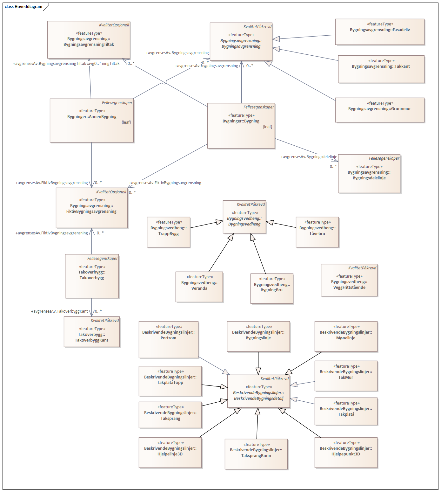
=== Pakke: Generelle elementer
Definisjon: pakke med elementer som realiserer tilsvarende elementer i FKB Generell del 5.0

Merknad:
Kopieres direkte inn i de enkelte FKB-datasettene
[caption="Figur 3: ",title=Hoveddiagram Fellesegenskaper]
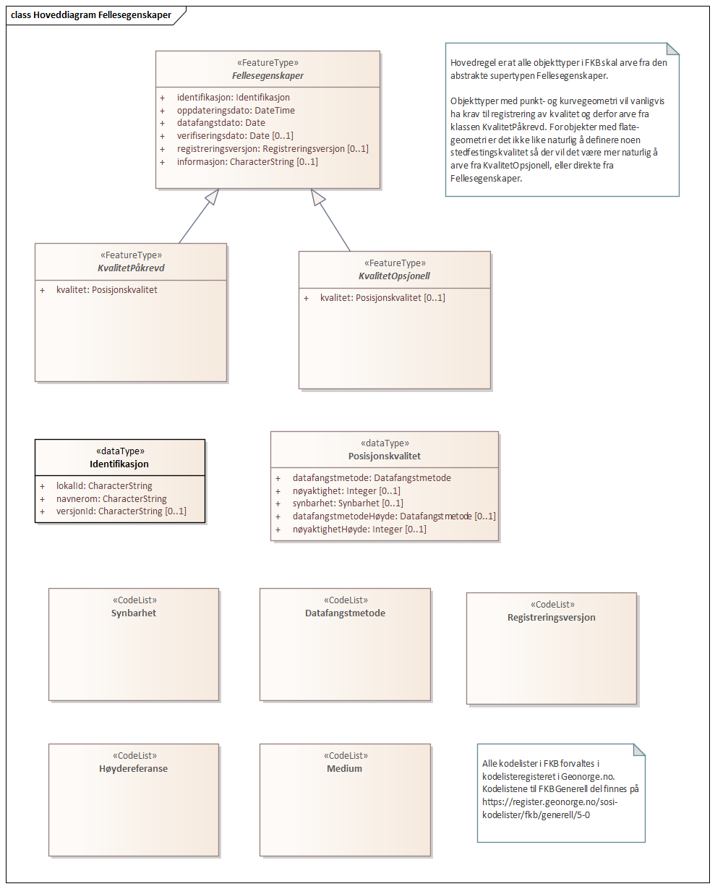
[caption="Figur 4: ",title=Realisering av fellesegenskaper fra SOSI generell del]
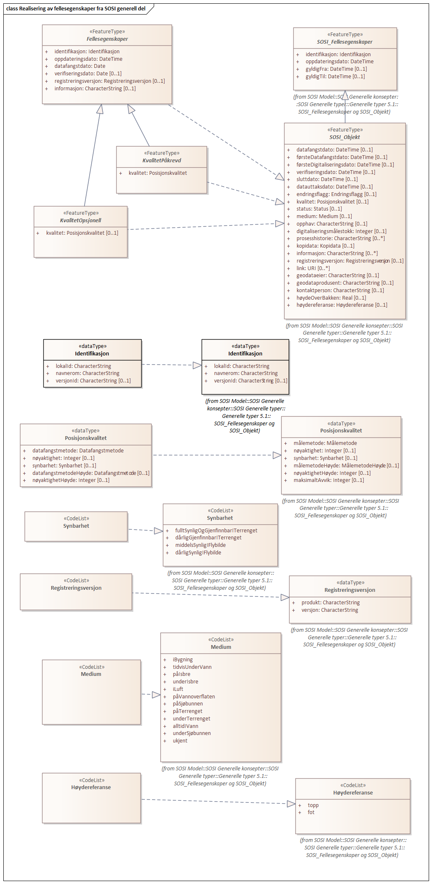
[caption="Figur 5: ",title=Posisjonskvalitet]
image::figurer/Posisjonskvalitet.png[Posisjonskvalitet]
 
==== «FeatureType» Fellesegenskaper
Definisjon: abstrakt objekttype som bærer sentrale egenskaper som er anbefalt for bruk i produktspesifikasjoner.

Merknad: Disse egenskapene skal derfor ikke modelleres inn i fagområdemodeller.
 
*Realisering av:* «ApplicationSchema» Generelle typer 5.1/SOSI_Fellesegenskaper og SOSI_Objekt::«FeatureType» SOSI_Objekt
 
*Realisering av:* «ApplicationSchema» FKB Generell del-5.0Utkast::«FeatureType» Fellesegenskaper
 
===== Egenskaper
[cols="20,80"]
|===
|*Navn:* 
|*identifikasjon*
 
|Definisjon: 
|unik identifikasjon av et objekt 

Merknad FKB:
Unik identifikasjon av et objekt, ivaretas av den ansvarlige produsent/forvalter, og som kan benyttes av eksterne applikasjoner som referanse til objektet.
Den unike identifikatoren er unik for kartobjektet og skal ikke endres i kartobjektets levetid. Dette m&#229; ikke forveksles med en tematisk identifikator (for eksempel bygningsnummer) som unikt identifiserer et objekt i virkeligheten. En bygning med samme bygningsnummer vil kunne representeres i mange kartprodukter der det finnes en unik identifikasjon i hver av dem.
For FKB benyttes UUID (Universally unique identifier) som lokalId. Dette inneb&#230;rer at lokalId alene alltid vil v&#230;re unik. Likevel skal alltid navnerom ogs&#229; angis. Navnerom angir FKB-datasettet.
 
|Multiplisitet: 
|[1..1]
 
|Type: 
|Identifikasjon
|Tagged Values: 
|
SOSI_navn: IDENT + 
|===
[cols="20,80"]
|===
|*Navn:* 
|*oppdateringsdato*
 
|Definisjon: 
|tidspunkt for siste endring p&#229; objektet 

Merknad FKB: 
Denne datoen viser datasystemets siste endring p&#229; dataobjektet. Egenskapen settes av forvaltningssystemet etter f&#248;lgende regler:
i. Oppdateringsdato er tidspunkt for oppdatering av databasen og settes av forvaltningsbasen (ikke
av klienten).
ii. Oppdateringsdato skal endres ogs&#229; hvis det er kopidata som blir endret eller importert i en
”kopibase”.
iii. N&#229;r avgrensingslinjene til en flate endres, skal flateobjektet f&#229; ny oppdateringsdato.
iv. Oppdateringsdato skal endres hvis en egenskap endres.
 
|Multiplisitet: 
|[1..1]
 
|Type: 
|DateTime
|Tagged Values: 
|
definition: "Date and time at which this version of the spatial object was inserted or changed in the spatial data set."@en + 
SOSI_datatype: DATOTID + 
SOSI_navn: OPPDATERINGSDATO + 
|===
[cols="20,80"]
|===
|*Navn:* 
|*datafangstdato*
 
|Definisjon: 
|
 
|Multiplisitet: 
|[1..1]
 
|Type: 
|Date
|Tagged Values: 
|
SOSI_datatype: DATO + 
SOSI_navn: DATAFANGSTDATO + 
|===
[cols="20,80"]
|===
|*Navn:* 
|*verifiseringsdato*
 
|Definisjon: 
|dato n&#229;r dataene er fastsl&#229;tt &#229; v&#230;re i samsvar med virkeligheten.

Merknad FKB:
Brukes for eksempel i de sammenhenger hvor det er foretatt fotogrammetrisk ajourhold, og hvor det ikke er registrert endringer p&#229; objektet (det virkelige objektet er i samsvar med dataobjektet)
 
|Multiplisitet: 
|[0..1]
 
|Type: 
|Date
|Tagged Values: 
|
SOSI_datatype: DATO + 
SOSI_navn: VERIFISERINGSDATO + 
|===
[cols="20,80"]
|===
|*Navn:* 
|*registreringsversjon*
 
|Definisjon: 
|angivelse av hvilken produktspesifikasjon som er utgangspunkt  for dataene
 
|Multiplisitet: 
|[0..1]
 
|Type: 
|Registreringsversjon
|Tagged Values: 
|
SOSI_navn: REGISTRERINGSVERSJON + 
|===
[cols="20,80"]
|===
|*Navn:* 
|*informasjon*
 
|Definisjon: 
|generell opplysning.

Merknad FKB:
Mulighet til &#229; legge inn utfyllende informasjon om objektet. Egenskapen b&#248;r bare brukes til &#229; legge inn ekstra informasjon om enkeltobjekter. Egenskapen b&#248;r ikke brukes til &#229; systematisk angi ekstrainformasjon om mange/alle objekter i et datasett.
 
|Multiplisitet: 
|[0..1]
 
|Type: 
|CharacterString
|===
[cols="20,80"]
|===
|*Subtyper:*
|«featureType» AnnenBygning +
«featureType» Takoverbygg +
«featureType» Bygningsdelelinje +
«featureType» Bygning +
«FeatureType» KvalitetPåkrevd +
«FeatureType» KvalitetOpsjonell
|===
 
==== «FeatureType» KvalitetPåkrevd
Definisjon: 
 
*Supertype:* «FeatureType» Fellesegenskaper
 
*Realisering av:* «ApplicationSchema» Generelle typer 5.1/SOSI_Fellesegenskaper og SOSI_Objekt::«FeatureType» SOSI_Objekt
 
*Realisering av:* «ApplicationSchema» FKB Generell del-5.0Utkast::«FeatureType» KvalitetPåkrevd
 
===== Egenskaper
[cols="20,80"]
|===
|*Navn:* 
|*kvalitet*
 
|Definisjon: 
|beskrivelse av kvaliteten på stedfestingen

Merknad: Denne er identisk med ..KVALITET i tidligere versjoner av SOSI.
 
|Multiplisitet: 
|[1..1]
 
|Type: 
|Posisjonskvalitet
|Tagged Values: 
|
SOSI_navn: KVALITET + 
|===
[cols="20,80"]
|===
|*Subtyper:*
|«featureType» BeskrivendeBygningsdetalj +
«featureType» Bygningsavgrensning +
«featureType» TakoverbyggKant +
«featureType» Bygningsvedheng +
«featureType» VeggFrittstående
|===
 
==== «FeatureType» KvalitetOpsjonell
Definisjon: 
 
*Supertype:* «FeatureType» Fellesegenskaper
 
*Realisering av:* «ApplicationSchema» Generelle typer 5.1/SOSI_Fellesegenskaper og SOSI_Objekt::«FeatureType» SOSI_Objekt
 
===== Egenskaper
[cols="20,80"]
|===
|*Navn:* 
|*kvalitet*
 
|Definisjon: 
|beskrivelse av kvaliteten på stedfestingen

Merknad: Denne er identisk med ..KVALITET i tidligere versjoner av SOSI.
 
|Multiplisitet: 
|[0..1]
 
|Type: 
|Posisjonskvalitet
|Tagged Values: 
|
SOSI_navn: KVALITET + 
|===
[cols="20,80"]
|===
|*Subtyper:*
|«featureType» FiktivBygningsavgrensning +
«featureType» BygningsavgrensningTiltak
|===
 
==== «dataType» Identifikasjon
Definisjon: Unik identifikasjon av et objekt i et datasett, forvaltet av den ansvarlige produsent/forvalter, og kan benyttes av eksterne applikasjoner som stabil referanse til objektet. 

Merknad 1: Denne objektidentifikasjonen må ikke forveksles med en tematisk objektidentifikasjon, slik som f.eks bygningsnummer. 

Merknad 2: Denne unike identifikatoren vil ikke endres i løpet av objektets levetid, og ikke gjenbrukes i andre objekt. 
 
*Realisering av:* «ApplicationSchema» Generelle typer 5.1/SOSI_Fellesegenskaper og SOSI_Objekt::«dataType» Identifikasjon
 
===== Tagged Values
[cols="20,80"]
|===
|SOSI_navn
|IDENT
 
|===
===== Egenskaper
[cols="20,80"]
|===
|*Navn:* 
|*lokalId*
 
|Definisjon: 
|lokal identifikator av et objekt

Merknad: Det er dataleverend&#248;rens ansvar &#229; s&#248;rge for at den lokale identifikatoren er unik innenfor navnerommet. For FKB-data benyttes UUID som lokalId.
 
|Multiplisitet: 
|[1..1]
 
|Type: 
|CharacterString
|Tagged Values: 
|
SOSI_datatype: T + 
SOSI_lengde: 100 + 
SOSI_navn: LOKALID + 
|===
[cols="20,80"]
|===
|*Navn:* 
|*navnerom*
 
|Definisjon: 
|navnerom som unikt identifiserer datakilden til et objekt, anbefales å være en http-URI

Eksempel: http://data.geonorge.no/SentraltStedsnavnsregister/1.0

Merknad : Verdien for nanverom vil eies av den dataprodusent som har ansvar for de unike identifikatorene og må være registrert i data.geonorge.no eller data.norge.no
 
|Multiplisitet: 
|[1..1]
 
|Type: 
|CharacterString
|Tagged Values: 
|
SOSI_datatype: T + 
SOSI_lengde: 100 + 
SOSI_navn: NAVNEROM + 
|===
[cols="20,80"]
|===
|*Navn:* 
|*versjonId*
 
|Definisjon: 
|identifikasjon av en spesiell versjon av et geografisk objekt (instans)
 
|Multiplisitet: 
|[0..1]
 
|Type: 
|CharacterString
|Tagged Values: 
|
SOSI_datatype: T + 
SOSI_lengde: 100 + 
SOSI_navn: VERSJONID + 
|===
 
==== «dataType» Posisjonskvalitet
Definisjon: beskrivelse av kvaliteten p&#229; stedfestingen.

Merknad:
Posisjonskvalitet er ikke konform med  kvalitetsmodellen i ISO slik den er defineret i ISO19157:2013, men er en videref&#248;ring av tildligere brukte kvalitetsegenskaper i SOSI. FKB 5.0 innf&#248;rer en egen variant av datatypen Posisjonskvalitet der kodeliste m&#229;lemetode er byttet ut med den mer generelle kodelista Datafangstmetode. 
 
*Realisering av:* «ApplicationSchema» Generelle typer 5.1/SOSI_Fellesegenskaper og SOSI_Objekt::«dataType» Posisjonskvalitet
 
===== Tagged Values
[cols="20,80"]
|===
|SOSI_navn
|KVALITET
 
|===
===== Egenskaper
[cols="20,80"]
|===
|*Navn:* 
|*datafangstmetode*
 
|Definisjon: 
|metode for datafangst. 
Egenskapen beskriver datafangstmetode for grunnrisskoordinater (x,y), eller for b&#229;de grunnriss og h&#248;yde (x,y,z) dersom det ikke er oppgitt noen verdi for datafangstmetodeH&#248;yde.
 
|Multiplisitet: 
|[1..1]
 
|Type: 
|Datafangstmetode
|Tagged Values: 
|
SOSI_lengde: 3 + 
SOSI_navn: DATAFANGSTMETODE + 
|===
[cols="20,80"]
|===
|*Navn:* 
|*nøyaktighet*
 
|Definisjon: 
|standardavviket til posisjoneringa av objektet oppgitt i cm
I de aller fleste sammenhenger benyttes en ansl&#229;tt eller forventet verdi for standardavvik, men dersom man har en beregnet verdi skal denne benyttes. 
For objekter med punktgeometri benyttes verdi for punktstandardavvik. For objekter med kurvegeometri benyttes standardavviket for tverravviket fra kurva. For objekter med overflate- eller volumgeometri er forst&#229;elsen at standardavviket beregnes ut fra (3D) avvikene mellom sann posisjon og n&#230;rmeste punkt p&#229; overflata. 
Merknad:
Verdien er ment &#229; beskrive n&#248;yaktigheten til objektet sammenlignet med sann verdi. Standardavvik er i utgangspunktet et m&#229;l p&#229; det tilfeldige avviket og det inneb&#230;rer at vi forutsetter at det systematiske avviket i liten grad p&#229;virker n&#248;yaktigheten til posisjoneringa. For fotogrammetriske data settes som hovedregel verdien lik kravet til standardavvik ved datafangst. Se standarden Geodatakvalitet for n&#230;rmere definisjon av standardavvik og hvordan dette defineres, beregnes og kontrolleres.
 
|Multiplisitet: 
|[0..1]
 
|Type: 
|Integer
|Tagged Values: 
|
SOSI_lengde: 6 + 
SOSI_navn: NØYAKTIGHET + 
|===
[cols="20,80"]
|===
|*Navn:* 
|*synbarhet*
 
|Definisjon: 
|beskrivelse av hvor godt objektene framg&#229;r i datagrunnlaget for posisjonering (f.eks. flybildene).
 
|Multiplisitet: 
|[0..1]
 
|Type: 
|Synbarhet
|Tagged Values: 
|
SOSI_lengde: 1 + 
SOSI_navn: SYNBARHET + 
|===
[cols="20,80"]
|===
|*Navn:* 
|*datafangstmetodeHøyde*
 
|Definisjon: 
|metoden brukt for h&#248;yderegistrering av posisjon.

Det er bare n&#248;dvending &#229; angi en verdi for egenskapen dersom datafangstmetode for h&#248;yde avviker fra datafangstmetode for grunnriss.

 
|Multiplisitet: 
|[0..1]
 
|Type: 
|Datafangstmetode
|Tagged Values: 
|
SOSI_lengde: 3 + 
SOSI_navn: DATAFANGSTMETODEHØYDE + 
|===
[cols="20,80"]
|===
|*Navn:* 
|*nøyaktighetHøyde*
 
|Definisjon: 
|standardavviket til posisjoneringa av objektet oppgitt i cm
I de aller fleste sammenhenger benyttes en ansl&#229;tt eller forventet verdi for standardavviket, men dersom man faktisk har standardavviket til posisjoneringa av objektet oppgitt i cm
I de aller fleste sammenhenger benyttes en ansl&#229;tt eller forventet verdi for standardavvik, men dersom man har en beregnet verdi skal denne benyttes. 
Merknad:
Verdien er ment &#229; beskrive n&#248;yaktigheten til objektet sammenlignet med sann verdi. Standardavvik er i utgangspunktet et m&#229;l p&#229; det tilfeldige avviket og det inneb&#230;rer at vi forutsetter at det systematiske avviket i liten grad p&#229;virker n&#248;yaktigheten til posisjoneringa. For fotogrammetriske data settes som hovedregel verdien lik kravet til standardavvik ved datafangst. Se standarden Geodatakvalitet for n&#230;rmere definisjon av standardavvik og hvordan dette defineres, beregnes og kontrolleres.
 
|Multiplisitet: 
|[0..1]
 
|Type: 
|Integer
|Tagged Values: 
|
SOSI_lengde: 6 + 
SOSI_navn: H-NØYAKTIGHET + 
|===
 
==== «CodeList» Synbarhet
Definisjon: synbarhet beskriver hvor godt objektene framg&#229;r i datagrunnlaget for posisjonering (f.eks. flybildene).
 
===== Tagged Values
[cols="20,80"]
|===
|asDictionary
|true
 
|codeList
|https://register.geonorge.no/sosi-kodelister/fkb/generell/5-0/synbarhet
 
|SOSI_datatype
|H
 
|SOSI_lengde
|1
 
|SOSI_navn
|SYNBARHET
 
|===
Kodeliste hentet fra register: https://register.geonorge.no/sosi-kodelister/fkb/generell/5-0/synbarhet
 
Kodeliste hentet på tidspunkt: 2021-07-02T15:11:47Z
 
Kodelistens navn i registeret: Synbarhet
 
===== Koder
[cols="25,60,15"]
|===
|*Kodenavn:* 
|*Definisjon:* 
|*Utvekslingsalias:* 
 
|Middels synlig
|Objektet er middels synlig/gjenkjennbart i flybilde eller annen datakilde for posisjonering. Ved fotogrammetrisk datafangst brukes denne koden for objekter som har lav kontrast eller er delvis skjult av overliggende objekter (vegetasjon, takoverbygg, bruer etc.). For slike objekter settes en større verdi for nøyaktighet enn kravet (opptil 3 ganger kravet)
|2
|Ikke synlig
|Objektet er ikke synlig/gjenkjennbart i flybilde eller annen datakilde for posisjonering. Ved fotogrammetrisk datafangst brukes denne koden for objekter som er helt skjult av overliggende objekter (vegetasjon, takoverbygg, bruer etc.). For slike objekter settes en stor verdi for nøyaktighet (mer enn 3 ganger kravet)
|3
|Fullt ut synlig
|Objektet er fullt ut synlig/gjenfinnbart i flybilde eller annen datakilde for posisjonering. Ved fotogrammetrisk registrering skal objekter som er fullt ut synlige registreres i tråd med angitte krav til nøyaktig registrering.
|0
|Dårlig gjenfinnbar i terreng
|Objektets posisjon er vanskelig å definere presist i terrenget på grunn av objektets natur. Koden kan f.eks. brukes på høydekurver (eller andre isolinjer) eller objekter som er skjult i bakken (f.eks. innmåling av ledninger på lukket grøft) 
|1
|===
 
==== «CodeList» Datafangstmetode
Definisjon: metode for datafangst. 

Datafangstmetoden beskriver hvordan selve vektordataene er posisjonert fra et datagrunnlag (observasjoner med landm&#229;lingsutstyr, fotogrammetrisk stereomodell, digital terrengmodell etc.) og ikke prosessen med &#229; innhente det bakenforliggende datagrunnlaget.
 
===== Tagged Values
[cols="20,80"]
|===
|asDictionary
|true
 
|codeList
|https://register.geonorge.no/sosi-kodelister/fkb/generell/5-0/datafangstmetode
 
|SOSI_datatype
|T
 
|SOSI_lengde
|3
 
|SOSI_navn
|DATAFANGSTMETODE
 
|===
Kodeliste hentet fra register: https://register.geonorge.no/sosi-kodelister/fkb/generell/5-0/datafangstmetode
 
Kodeliste hentet på tidspunkt: 2021-07-02T15:11:48Z
 
Kodelistens navn i registeret: Datafangstmetode
 
===== Koder
[cols="25,60,15"]
|===
|*Kodenavn:* 
|*Definisjon:* 
|*Utvekslingsalias:* 
 
|Som bygget
|Posisjonen er hentet fra prosjekterte eller planlagte data, f.eks. fra en BIM-modell, som er verifisert som bygget ved innmålinger
|byg
|Ukjent
|Ukjent eller uspesifisert datafangstmetode
|ukj
|Plandata
|Posisjonen er hentet plandata. Posisjonen er ikke verifisert med innmåling. 
|pla
|Satellittmålt
|Posisjonen er målt inn direkte med GNSS (for posisjoner målt inn med GNSS i kombinasjon med andre landmålingsmetoder skal koden Landmåling benyttes)
|sat
|Generert
|Posisjonen er manuelt konstruert, eller generert ved maskinlæring eller annen type programvare, fra punktsky fra laserskanning, bildematching, sonar, andre typer sensordata eller kombinasjon av flere typer sensordata.
|gen
|Fotogrammetri
|Posisjonen er konstruert/generert fra en fotogrammetrisk stereomodell 
|fot
|Landmålt
|Posisjonen er målt inn direkte med en landmålingsmetode. Aktuelle landmålingsmetoder kan være nivellering, vinkelmåling, avstandsmåling eller treghetsmåling. Kodeverdien brukes også for kombinasjoner av disse målemetodene eller der disse målemetodene kombineres med GNSS. Landmåling utføres normalt med overskytende målinger og utjevning av resultatet.
|lan
|===
 
==== «CodeList» Registreringsversjon
Definisjon: FKB-verjson som ligger til grunn for registrering. Mest relevant for data som er fotogrammetrisk registrert.
 
===== Tagged Values
[cols="20,80"]
|===
|asDictionary
|true
 
|codeList
|https://register.geonorge.no/sosi-kodelister/fkb/generell/5-0/registreringsversjon
 
|SOSI_datatype
|T
 
|SOSI_lengde
|10
 
|SOSI_navn
|REGISTRERINGSVERSJON
 
|===
Kodeliste hentet fra register: https://register.geonorge.no/sosi-kodelister/fkb/generell/5-0/registreringsversjon
 
Kodeliste hentet på tidspunkt: 2021-07-02T15:11:49Z
 
Kodelistens navn i registeret: Registreringsversjon
 
===== Koder
[cols="25,60,15"]
|===
|*Kodenavn:* 
|*Definisjon:* 
|*Utvekslingsalias:* 
 
|FKB 4.5 2014-03-01
|Data registrert etter FKB 4.5 2014-03-01
|2014-03-01
|FKB 4.6 2020-01-01
|Data registrert etter FKB 4.6/4.61 2020-01-01
|2020-01-01
|FKB 4.6 2018-01-01
|Data registrert etter FKB 4.6/4.61 2018-01-01
|2018-01-01
|FKB 5.0 2022-01-01
|Data registrert etter FKB 5.0 2022-01-01
|2022-01-01
|FKB 4.01 2011-01-01
|Data registrert etter FKB 4.01 2011-01-01
|2011-01-01
|FKB 4.0 2007-01-01
|Data registrert etter FKB 4.0 2007-01-01
|2007-01-07
|FKB 4.6 2016-06-01
|Data registrert etter FKB 4.6 2016-06-01
|2016-06-01
|FKB 4.01 2009-03-10
|Data registrert etter FKB 4.01 2009-03-10
|2009-03-10
|FKB 4.5 2015-01-01
|Data registrert etter FKB 4.5 2015-01-01
|2015-01-01
|FKB 4.02 2013-01-01
|Data registrert etter FKB 4.02 2013-01-01
|2013-01-01
|FKB 4.02 2011-12-01
|Data registrert etter FKB 4.02 2011-12-01
|2001-12-01
|===
 
==== «CodeList» Høydereferanse
Definisjon: koordinatregistering utf&#248;rt p&#229; topp eller bunn av et objekt
 
===== Tagged Values
[cols="20,80"]
|===
|asDictionary
|true
 
|codeList
|https://register.geonorge.no/sosi-kodelister/fkb/generell/5-0/hoydereferanse
 
|SOSI_datatype
|T
 
|SOSI_lengde
|6
 
|SOSI_navn
|HREF
 
|===
Kodeliste hentet fra register: https://register.geonorge.no/sosi-kodelister/fkb/generell/5-0/hoydereferanse
 
Kodeliste hentet på tidspunkt: 2021-07-02T15:11:50Z
 
Kodelistens navn i registeret: Høydereferanse
 
===== Koder
[cols="25,60,15"]
|===
|*Kodenavn:* 
|*Definisjon:* 
|*Utvekslingsalias:* 
 
|Fot
|Høyden målt til foten av objektet
|FOT
|Ukjent
|Ukjent høydereferanse
|UKJENT
|Topp
|Høyden målt til toppen av objektet
|TOP
|===
 
==== «CodeList» Medium
Definisjon: objektets beliggenhet i forhold til jordoverflaten

Eksempel:
Veg p&#229; bro, i tunnel, inne i et bygningsmessig anlegg, etc.
 
===== Tagged Values
[cols="20,80"]
|===
|asDictionary
|true
 
|codeList
|https://register.geonorge.no/sosi-kodelister/fkb/generell/5-0/medium
 
|SOSI_datatype
|T
 
|SOSI_lengde
|1
 
|SOSI_navn
|MEDIUM
 
|===
Kodeliste hentet fra register: https://register.geonorge.no/sosi-kodelister/fkb/generell/5-0/medium
 
Kodeliste hentet på tidspunkt: 2021-07-02T15:11:51Z
 
Kodelistens navn i registeret: Medium
 
===== Koder
[cols="25,60,15"]
|===
|*Kodenavn:* 
|*Definisjon:* 
|*Utvekslingsalias:* 
 
|På terrenget
|På terrenget/på bakkenivå
|T
|Ukjent
|Ukjent plassering i forhold til jordoverflaten
|X
|Delvis under vann
|Delvis i eller under vann
|D
|På Isbre
|På isbre
|I
|Under terrenget
|Under terrenget
|U
|I vann
|Alltid i vann
|V
|I Bygning
|I eller på bygning eller bygningsmessig anlegg
|B
|I luft
|I lufta
|L
|===
=== Pakke: Bygninger
Definisjon: Inneholder elementer fra SOSI Bygg 4.5, Bygningspunkt
[caption="Figur 6: ",title=Bygning - Realisering av objekttyper og kodelister]
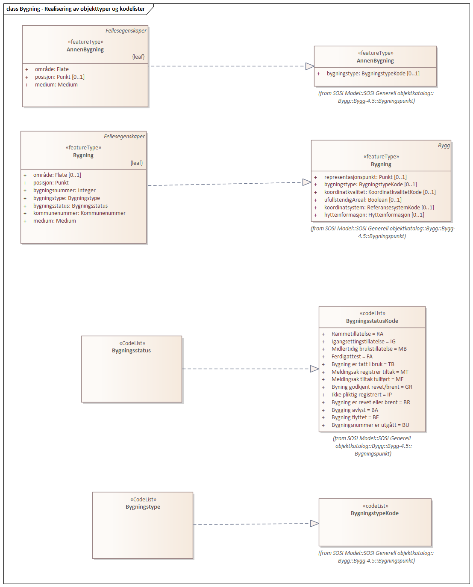
[caption="Figur 7: ",title=Bygning - Arv fra fellesegenskaper]
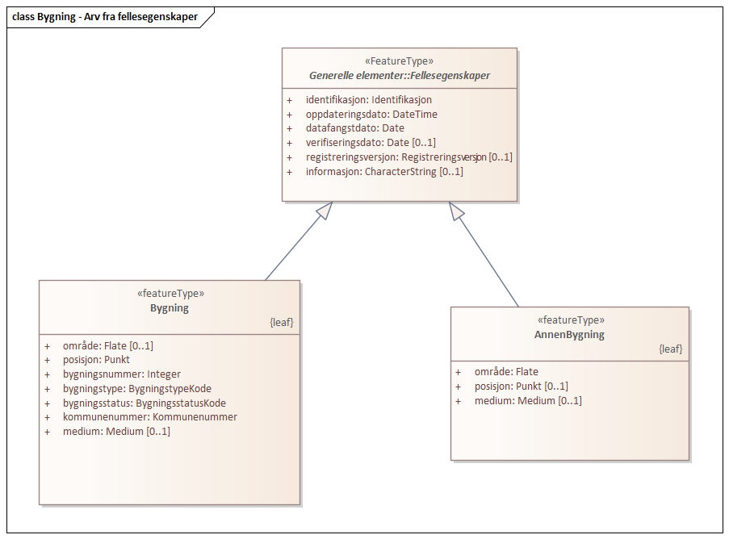
[caption="Figur 8: ",title=Bygning - Objekttyper med egenskaper]
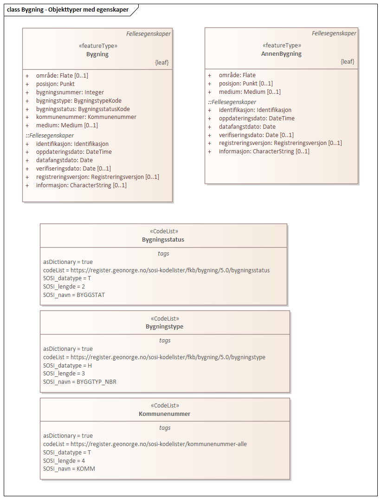
[caption="Figur 9: ",title=Bygning - Flateavgrensning]
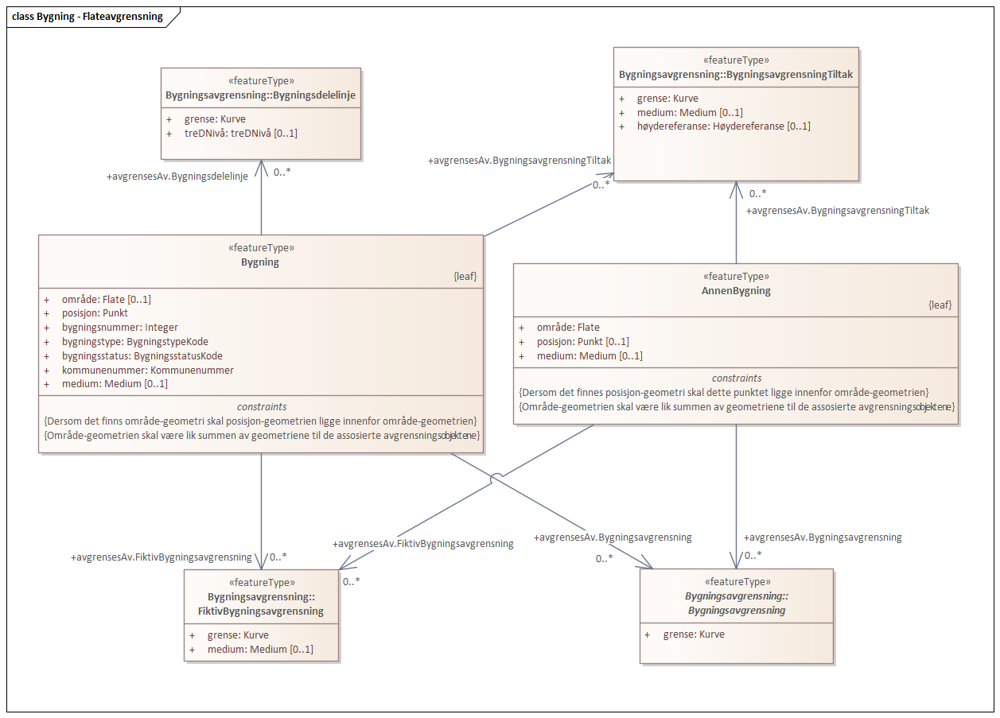
 
==== «featureType» AnnenBygning
Definisjon: bygning som ikke er registrert  i matrikkelen
 
*Supertype:* «FeatureType» Fellesegenskaper
 
*Realisering av:* «ApplicationSchema» Bygg-4.5/Bygningspunkt::«featureType» AnnenBygning
 
===== Egenskaper
[cols="20,80"]
|===
|*Navn:* 
|*område*
 
|Definisjon: 
|objektets utstrekning
 
|Multiplisitet: 
|[1..1]
 
|Type: 
|Flate
|===
[cols="20,80"]
|===
|*Navn:* 
|*posisjon*
 
|Definisjon: 
|sted som objektet eksisterer på
 
|Multiplisitet: 
|[0..1]
 
|Type: 
|Punkt
|===
[cols="20,80"]
|===
|*Navn:* 
|*medium*
 
|Definisjon: 
|objektets beliggenhet i forhold til jordoverflaten
 
|Multiplisitet: 
|[0..1]
 
|Type: 
|Medium
|===
[cols="20,80"]
|===
===== Roller
|*Rollenavn:* 
|*avgrensesAv.Bygningsavgrensning*
 
|Multiplisitet: 
|[0..*]
 
|Til klasse
|«featureType» Bygningsavgrensning
|===
|*Rollenavn:* 
|*avgrensesAv.BygningsavgrensningTiltak*
 
|Multiplisitet: 
|[0..*]
 
|Til klasse
|«featureType» BygningsavgrensningTiltak
|===
|*Rollenavn:* 
|*avgrensesAv.FiktivBygningsavgrensning*
 
|Multiplisitet: 
|[0..*]
 
|Til klasse
|«featureType» FiktivBygningsavgrensning
|===
 
==== «featureType» Bygning
Definisjon: bygning som er registrert i matrikkelen
 
*Supertype:* «FeatureType» Fellesegenskaper
 
*Realisering av:* «ApplicationSchema» Bygg-4.5/Bygningspunkt::«featureType» Bygning
 
===== Egenskaper
[cols="20,80"]
|===
|*Navn:* 
|*område*
 
|Definisjon: 
|objektets utstrekning
 
|Multiplisitet: 
|[0..1]
 
|Type: 
|Flate
|===
[cols="20,80"]
|===
|*Navn:* 
|*posisjon*
 
|Definisjon: 
|sted som objektet eksisterer p&#229;. Punktet er en kopi av bygningspunktet i matrikkelen
 
|Multiplisitet: 
|[1..1]
 
|Type: 
|Punkt
|===
[cols="20,80"]
|===
|*Navn:* 
|*bygningsnummer*
 
|Definisjon: 
|nummerering av bygninger fra Matrikkelen. Nummeret er unikt og landsdekkende.
 
|Multiplisitet: 
|[1..1]
 
|Type: 
|Integer
|Tagged Values: 
|
SOSI_datatype: H + 
SOSI_lengde: 9 + 
SOSI_navn: BYGGNR + 
|===
[cols="20,80"]
|===
|*Navn:* 
|*bygningstype*
 
|Definisjon: 
|beskrivelse av hva bygningen faktisk er brukt til, eventuelt hva bygningen er godkjent til. 
 
|Multiplisitet: 
|[1..1]
 
|Type: 
|BygningstypeKode
|Tagged Values: 
|
SOSI_datatype: H + 
SOSI_lengde: 3 + 
SOSI_navn: BYGGTYP_NBR + 
|===
[cols="20,80"]
|===
|*Navn:* 
|*bygningsstatus*
 
|Definisjon: 
|informasjon om bygningens status
 
|Multiplisitet: 
|[1..1]
 
|Type: 
|BygningsstatusKode
|===
[cols="20,80"]
|===
|*Navn:* 
|*kommunenummer*
 
|Definisjon: 
|nummerering av kommuner i henhold til Statistisk sentralbyrå sin offisielle liste
 
|Multiplisitet: 
|[1..1]
 
|Type: 
|Kommunenummer
|Tagged Values: 
|
asDictionary: true + 
codeList: Kommunenummer.xml + 
defaultCodeSpace: http://skjema.geonorge.no/SOSI/produktspesifikasjon/FKB-Bygning/4.61/Kommunenummer.xml + 
SOSI_datatype: T + 
SOSI_lengde: 4 + 
SOSI_navn: KOMM + 
|===
[cols="20,80"]
|===
|*Navn:* 
|*medium*
 
|Definisjon: 
|objektets beliggenhet i forhold til jordoverflaten
 
|Multiplisitet: 
|[0..1]
 
|Type: 
|Medium
|===
[cols="20,80"]
|===
===== Roller
|*Rollenavn:* 
|*avgrensesAv.BygningsavgrensningTiltak*
 
|Multiplisitet: 
|[0..*]
 
|Til klasse
|«featureType» BygningsavgrensningTiltak
|===
|*Rollenavn:* 
|*avgrensesAv.Bygningsavgrensning*
 
|Multiplisitet: 
|[0..*]
 
|Til klasse
|«featureType» Bygningsavgrensning
|===
|*Rollenavn:* 
|*avgrensesAv.FiktivBygningsavgrensning*
 
|Multiplisitet: 
|[0..*]
 
|Til klasse
|«featureType» FiktivBygningsavgrensning
|===
|*Rollenavn:* 
|*avgrensesAv.Bygningsdelelinje*
 
|Multiplisitet: 
|[0..*]
 
|Til klasse
|«featureType» Bygningsdelelinje
|===
 
==== «CodeList» Bygningsstatus
Definisjon: Bygningsstatuskoder fra matrikkelen som benyttes i FKB-Bygning
 
===== Tagged Values
[cols="20,80"]
|===
|asDictionary
|true
 
|codeList
|https://register.geonorge.no/sosi-kodelister/fkb/bygning/5.0/bygningsstatus
 
|SOSI_datatype
|T
 
|SOSI_lengde
|2
 
|SOSI_navn
|BYGGSTAT
 
|===
Kodeliste hentet fra register: https://register.geonorge.no/sosi-kodelister/fkb/bygning/5.0/bygningsstatus
 
Kodeliste hentet på tidspunkt: 2021-07-02T15:12:09Z
 
Kodelistens navn i registeret: Bygningsstatus
 
===== Koder
[cols="25,60,15"]
|===
|*Kodenavn:* 
|*Definisjon:* 
|*Utvekslingsalias:* 
 
|===
 
==== «CodeList» Bygningstype
Definisjon: Bygningstyper fra matrikkelen som benyttes i FKB-Bygning
 
===== Tagged Values
[cols="20,80"]
|===
|asDictionary
|true
 
|codeList
|https://register.geonorge.no/sosi-kodelister/fkb/bygning/5.0/bygningstype
 
|SOSI_datatype
|H
 
|SOSI_lengde
|3
 
|SOSI_navn
|BYGGTYP_NBR
 
|===
Kodeliste hentet fra register: https://register.geonorge.no/sosi-kodelister/fkb/bygning/5.0/bygningstype
 
Kodeliste hentet på tidspunkt: 2021-07-02T15:12:09Z
 
Kodelistens navn i registeret: Bygningstype
 
===== Koder
[cols="25,60,15"]
|===
|*Kodenavn:* 
|*Definisjon:* 
|*Utvekslingsalias:* 
 
|===
 
==== «CodeList» Kommunenummer
Definisjon: 
 
===== Tagged Values
[cols="20,80"]
|===
|asDictionary
|true
 
|codeList
|https://register.geonorge.no/sosi-kodelister/kommunenummer-alle
 
|SOSI_datatype
|T
 
|SOSI_lengde
|4
 
|SOSI_navn
|KOMM
 
|===
Kodeliste hentet fra register: https://register.geonorge.no/sosi-kodelister/kommunenummer-alle
 
Kodeliste hentet på tidspunkt: 2021-07-02T15:12:12Z
 
Kodelistens navn i registeret: Kommunenummer alle
 
===== Koder
[cols="25,60,15"]
|===
|*Kodenavn:* 
|*Definisjon:* 
|*Utvekslingsalias:* 
 
|5417
|Salangen
|5417
|4616
|Tysnes
|4616
|1263
|Lindås
|1263
|4619
|Eidfjord
|4619
|1433
|Naustdal
|1433
|1231
|Ullensvang
|1231
|3022
|Frogn
|3022
|0625
|Nedre Eiker
|0625
|4633
|Fedje
|4633
|1933
|Balsfjord
|1933
|1632
|Roan
|1632
|0717
|Borre
|0717
|1124
|Sola
|1124
|2021
|Kárášjohka – Karasjok 
|2021
|1445
|Gloppen
|1445
|1134
|Suldal
|1134
|5027
|Midtre Gauldal
|5027
|Hopen
|Hopen
|2131
|5436
|Porsanger – Porsáŋgu – Porsanki 
|5436
|0301
|Oslo
|0301
|2001
|Hammerfest
|2001
|5435
|Nordkapp
|5435
|0728
|Lardal
|0728
|0105
|Sarpsborg
|0105
|1926
|Dyrøy
|1926
|3430
|Os
|3430
|1579
|Hustadvika
|1579
|0903
|Arendal
|0903
|1514
|Sande i Møre og Romsdal
|1514
|5051
|Nærøy
|5051
|5006
|Steinkjer
|5006
|1839
|Beiarn
|1839
|5042
|Lierne
|5042
|4629
|Modalen
|4629
|1556
|Frei
|1556
|1241
|Fusa
|1241
|1723
|Mosvik
|1723
|2028
|Båtsfjord
|2028
|4212
|Vegårshei
|4212
|2027
|Unjárga – Nesseby
|2027
|0418
|Nord-Odal
|0418
|1439
|Vågsøy
|1439
|0935
|Iveland
|0935
|0111
|Hvaler
|0111
|0626
|Lier
|0626
|3411
|Ringsaker
|3411
|0712
|Larvik
|0712
|3052
|Nore og Uvdal
|3052
|1837
|Meløy
|1837
|1852
|Tjeldsund
|1852
|5427
|Skjervøy
|5427
|0220
|Asker
|0220
|3040
|Nesbyen (tidligere Nes i Buskerud)
|3040
|3044
|Hol
|3044
|5035
|Stjørdal
|5035
|3822
|Nissedal
|3822
|0230
|Lørenskog
|0230
|0912
|Vegårshei
|0912
|1531
|Sula
|1531
|0612
|Hole
|0612
|1443
|Eid
|1443
|1114
|Bjerkreim
|1114
|0134
|Onsøy
|0134
|0814
|Bamble
|0814
|1027
|Audnedal
|1027
|1636
|Meldal
|1636
|1903
|Harstad – Hárstták
|1903
|0133
|Kråkerøy
|0133
|4647
|Sunnfjord
|4647
|0620
|Hol
|0620
|4220
|Bygland
|4220
|5433
|Hasvik
|5433
|5011
|Hemne
|5011
|3420
|Elverum
|3420
|0213
|Ski
|0213
|1756
|Inderøy
|1756
|3435
|Vågå
|3435
|1018
|Søgne
|1018
|3429
|Folldal
|3429
|0829
|Kviteseid
|0829
|1804
|Bodø
|1804
|4612
|Sveio
|4612
|4639
|Vik
|4639
|1653
|Melhus
|1653
|1560
|Tingvoll
|1560
|0427
|Elverum
|0427
|0415
|Løten
|0415
|5020
|Osen
|5020
|4222
|Bykle
|4222
|0914
|Tvedestrand
|0914
|5422
|Balsfjord
|5422
|Bjørnøya
|Bjørnøya
|2121
|1573
|Smøla
|1573
|0937
|Evje og Hornnes
|0937
|4651
|Stryn
|4651
|4211
|Gjerstad
|4211
|1638
|Orkdal
|1638
|3005
|Drammen
|3005
|3043
|Ål
|3043
|4215
|Lillesand
|4215
|1812
|Sømna
|1812
|3454
|Vang
|3454
|5005
|Namsos
|5005
|4613
|Bømlo
|4613
|4623
|Samnanger
|4623
|2018
|Måsøy
|2018
|5024
|Orkdal
|5024
|1127
|Randaberg
|1127
|1936
|Karlsøy
|1936
|1902
|Tromsø
|1902
|1633
|Osen
|1633
|1256
|Meland
|1256
|4617
|Kvinnherad
|4617
|1046
|Sirdal
|1046
|4635
|Gulen
|4635
|5414
|Gratangen
|5414
|3816
|Nome
|3816
|5047
|Overhalla
|5047
|4648
|Bremanger
|4648
|1743
|Høylandet
|1743
|5443
|Båtsfjord
|5443
|1644
|Holtålen
|1644
|5052
|Leka
|5052
|4626
|Øygarden
|4626
|3007
|Ringerike
|3007
|1222
|Fitjar
|1222
|1662
|Klæbu
|1662
|0211
|Vestby
|0211
|2020
|Porsanger – Porsáŋgu – Porsanki
|2020
|1805
|Narvik
|1805
|1515
|Herøy i Møre og Romsdal
|1515
|0522
|Gausdal
|0522
|5028
|Melhus
|5028
|0544
|Øystre Slidre
|0544
|0118
|Aremark
|0118
|1224
|Kvinnherad
|1224
|1238
|Kvam
|1238
|0520
|Ringebu
|0520
|5404
|Vardø
|5404
|3416
|Eidskog
|3416
|1848
|Steigen
|1848
|5437
|Kárášjohka – Karasjok
|5437
|1247
|Askøy
|1247
|0426
|Våler i Hedmark
|0426
|1714
|Stjørdal
|1714
|5045
|Grong
|5045
|0727
|Hedrum
|0727
|0137
|Våler i Østfold
|0137
|1721
|Verdal
|1721
|4614
|Stord
|4614
|1755
|Leka
|1755
|1001
|Kristiansand
|1001
|5007
|Namsos – Nåavmesjenjaelmie
|5007
|1724
|Verran
|1724
|0929
|Åmli
|0929
|5019
|Roan
|5019
|0622
|Krødsherad
|0622
|1119
|Hå
|1119
|0726
|Brunlanes
|0726
|4225
|Lyngdal
|4225
|3425
|Engerdal
|3425
|0906
|Arendal
|0906
|4632
|Austrheim
|4632
|1920
|Loabák – Lavangen
|1920
|3421
|Trysil
|3421
|1520
|Ørsta
|1520
|1034
|Hægebostad
|1034
|1834
|Lurøy
|1834
|1428
|Askvoll
|1428
|5037
|Levanger
|5037
|1401
|Flora
|1401
|0715
|Holmestrand
|0715
|1874
|Moskenes
|1874
|4649
|Stad
|4649
|3815
|Drangedal
|3815
|5004
|Steinkjer
|5004
|1922
|Bardu
|1922
|3031
|Nittedal
|3031
|2004
|Hammerfest
|2004
|Svalbard
|Svalbard
|2100
|1841
|Fauske – Fuossko
|1841
|1529
|Skodje
|1529
|1422
|Lærdal
|1422
|1927
|Tranøy
|1927
|1663
|Malvik
|1663
|1871
|Andøy
|1871
|0709
|Larvik
|0709
|5026
|Holtålen
|5026
|1826
|Aarborte – Hattfjelldal
|1826
|0511
|Dovre
|0511
|3018
|Våler i Viken
|3018
|3449
|Sør-Aurdal
|3449
|0716
|Re
|0716
|3417
|Grue
|3417
|0540
|Sør-Aurdal
|0540
|0103
|Fredrikstad
|0103
|0710
|Sandefjord
|0710
|3403
|Hamar
|3403
|0121
|Rømskog
|0121
|0826
|Tinn
|0826
|0529
|Vestre Toten
|0529
|1571
|Halsa
|1571
|5412
|Tjeldsund – Dielddanuorri
|5412
|0828
|Seljord
|0828
|3448
|Nordre Land
|3448
|3016
|Rakkestad
|3016
|0114
|Varteig
|0114
|5041
|Snåase – Snåsa
|5041
|1816
|Vevelstad
|1816
|5040
|Namdalseid
|5040
|1718
|Leksvik
|1718
|0711
|Svelvik
|0711
|1259
|Øygarden
|1259
|1850
|Divtasvuodna – Tysfjord
|1850
|4611
|Etne
|4611
|0512
|Lesja
|0512
|0817
|Drangedal
|0817
|1620
|Frøya
|1620
|4631
|Alver
|4631
|1528
|Sykkylven
|1528
|1108
|Sandnes
|1108
|0429
|Åmot
|0429
|0901
|Risør
|0901
|0119
|Marker
|0119
|1430
|Gaular
|1430
|3050
|Flesberg
|3050
|1111
|Sokndal
|1111
|3004
|Fredrikstad
|3004
|2012
|Alta
|2012
|0819
|Nome
|0819
|3046
|Krødsherad
|3046
|0419
|Sør-Odal
|0419
|5421
|Senja
|5421
|3432
|Lesja
|3432
|1424
|Årdal
|1424
|1648
|Midtre Gauldal
|1648
|1940
|Gáivuotna – Kåfjord – Kaivuono
|1940
|3020
|Nordre Follo
|3020
|5017
|Bjugn
|5017
|3407
|Gjøvik
|3407
|0822
|Sauherad
|0822
|5022
|Rennebu
|5022
|0806
|Skien
|0806
|1853
|Evenes – Evenášši
|1853
|0519
|Sør-Fron
|0519
|3414
|Nord-Odal
|3414
|4621
|Voss
|4621
|0920
|Øyestad
|0920
|5401
|Tromsø
|5401
|0434
|Engerdal
|0434
|1725
|Namdalseid
|1725
|0702
|Holmestrand
|0702
|0631
|Flesberg
|0631
|1252
|Modalen
|1252
|0605
|Ringerike
|0605
|1243
|Os i Hordaland
|1243
|3042
|Hemsedal
|3042
|0922
|Hisøy
|0922
|1838
|Gildeskål
|1838
|1017
|Songdalen
|1017
|5430
|Guovdageaidnu – Kautokeino
|5430
|3821
|Kviteseid
|3821
|0437
|Tynset
|0437
|0707
|Larvik
|0707
|3443
|Vestre Toten
|3443
|4227
|Kvinesdal
|4227
|4642
|Lærdal
|4642
|0720
|Stokke
|0720
|1246
|Fjell
|1246
|4201
|Risør
|4201
|1711
|Meråker
|1711
|3039
|Flå
|3039
|0104
|Moss
|0104
|1554
|Averøy
|1554
|0521
|Øyer
|0521
|1502
|Molde
|1502
|1416
|Høyanger
|1416
|1412
|Solund
|1412
|1835
|Træna
|1835
|1624
|Rissa
|1624
|0214
|Ås
|0214
|1418
|Balestrand
|1418
|3051
|Rollag
|3051
|5033
|Tydal
|5033
|0115
|Skjeberg
|0115
|0138
|Hobøl
|0138
|1026
|Åseral
|1026
|1612
|Hemne
|1612
|4217
|Åmli
|4217
|0615
|Flå
|0615
|0545
|Vang
|0545
|0918
|Moland
|0918
|1151
|Utsira
|1151
|5423
|Karlsøy
|5423
|4216
|Birkenes
|4216
|1806
|Narvik 
|1806
|4618
|Ullensvang
|4618
|1870
|Sortland – Suortá
|1870
|1617
|Hitra
|1617
|1939
|Storfjord – Omasvuotna – Omasvuono
|1939
|2023
|Gamvik
|2023
|4620
|Ulvik
|4620
|5049
|Flatanger
|5049
|0703
|Horten
|0703
|4221
|Valle
|4221
|5444
|Sør-Varanger
|5444
|0402
|Kongsvinger
|0402
|0122
|Trøgstad
|0122
|3819
|Hjartdal
|3819
|3003
|Sarpsborg
|3003
|1543
|Nesset
|1543
|0604
|Kongsberg
|0604
|1931
|Lenvik
|1931
|4615
|Fitjar
|4615
|1413
|Hyllestad
|1413
|1828
|Nesna
|1828
|0516
|Nord-Fron
|0516
|3013
|Marker
|3013
|0536
|Søndre Land
|0536
|1815
|Vega
|1815
|1129
|Forsand
|1129
|1526
|Stordal
|1526
|1856
|Røst
|1856
|4223
|Vennesla
|4223
|1634
|Oppdal
|1634
|0215
|Frogn
|0215
|0718
|Ramnes
|0718
|0815
|Kragerø
|0815
|3804
|Sandefjord
|3804
|1849
|Hamarøy – Hábmer
|1849
|1702
|Steinkjer
|1702
|1214
|Ølen
|1214
|5014
|Frøya
|5014
|1563
|Sunndal
|1563
|0515
|Vågå
|0515
|4207
|Flekkefjord
|4207
|1740
|Namsskogan
|1740
|1866
|Hadsel
|1866
|0628
|Hurum
|0628
|5420
|Dyrøy
|5420
|0705
|Tønsberg
|0705
|0228
|Rælingen
|0228
|5044
|Namsskogan
|5044
|4205
|Lindesnes
|4205
|0414
|Vang
|0414
|3428
|Alvdal
|3428
|1029
|Lindesnes
|1029
|1532
|Giske
|1532
|1142
|Rennesøy
|1142
|5021
|Oppdal
|5021
|2030
|Sør-Varanger
|2030
|0234
|Gjerdrum
|0234
|5048
|Fosnes
|5048
|5016
|Agdenes
|5016
|0542
|Nord-Aurdal
|0542
|0217
|Oppegård
|0217
|1833
|Rana
|1833
|0834
|Vinje
|0834
|1242
|Samnanger
|1242
|Spitsbergen
|Spitsbergen
|2111
|1601
|Trondheim
|1601
|3049
|Lier
|3049
|0928
|Birkenes
|0928
|5428
|Nordreisa – Ráisa – Raisi
|5428
|0602
|Drammen
|0602
|0911
|Gjerstad
|0911
|5432
|Loppa
|5432
|5413
|Ibestad
|5413
|0821
|Bø i Telemark
|0821
|0428
|Trysil
|0428
|0227
|Fet
|0227
|3038
|Hole
|3038
|1265
|Fedje
|1265
|4202
|Grimstad
|4202
|5416
|Bardu
|5416
|3439
|Ringebu
|3439
|1825
|Grane
|1825
|4643
|Årdal
|4643
|0235
|Ullensaker
|0235
|0237
|Eidsvoll
|0237
|3001
|Halden
|3001
|0101
|Halden
|0101
|0807
|Notodden
|0807
|3028
|Enebakk
|3028
|1572
|Tustna
|1572
|0501
|Lillehammer
|0501
|3019
|Vestby
|3019
|5034
|Meråker
|5034
|4224
|Åseral
|4224
|3014
|Indre Østfold
|3014
|4214
|Froland
|4214
|1504
|Ålesund
|1504
|3811
|Færder
|3811
|1429
|Fjaler
|1429
|0721
|Sem
|0721
|4630
|Osterøy
|4630
|1548
|Fræna
|1548
|4650
|Gloppen
|4650
|5439
|Gamvik
|5439
|1505
|Kristiansund
|1505
|1133
|Hjelmeland
|1133
|0701
|Horten
|0701
|1813
|Brønnøy
|1813
|5032
|Selbu
|5032
|5013
|Hitra
|5013
|0436
|Tolga
|0436
|0919
|Froland
|0919
|0417
|Stange
|0417
|1260
|Radøy
|1260
|4627
|Askøy
|4627
|1144
|Kvitsøy
|1144
|5441
|Deatnu – Tana
|5441
|4203
|Arendal
|4203
|1751
|Nærøy
|1751
|5058
|Åfjord
|5058
|4624
|Bjørnafjorden
|4624
|1266
|Masfjorden
|1266
|1545
|Midsund
|1545
|5426
|Gáivuotna – Kåfjord – Kaivuono
|5426
|1146
|Tysvær
|1146
|2017
|Kvalsund
|2017
|4640
|Sogndal
|4640
|1517
|Hareid
|1517
|0633
|Nore og Uvdal
|0633
|5050
|Vikna
|5050
|1438
|Bremanger
|1438
|1003
|Farsund
|1003
|0708
|Stavern
|0708
|0627
|Røyken
|0627
|0231
|Skedsmo
|0231
|2002
|Vardø
|2002
|1827
|Dønna
|1827
|0723
|Tjøme
|0723
|5043
|Raarvikhe – Røyrvik
|5043
|1228
|Odda
|1228
|1507
|Ålesund
|1507
|0106
|Fredrikstad
|0106
|1411
|Gulen
|1411
|3053
|Jevnaker
|3053
|0432
|Rendalen
|0432
|0541
|Etnedal
|0541
|5023
|Meldal
|5023
|1014
|Vennesla
|1014
|2022
|Lebesby
|2022
|1101
|Eigersund
|1101
|0725
|Tjølling
|0725
|3450
|Etnedal
|3450
|1159
|Ølen
|1159
|1865
|Vågan
|1865
|3029
|Lørenskog
|3029
|0706
|Sandefjord
|0706
|1122
|Gjesdal
|1122
|0623
|Modum
|0623
|3806
|Porsgrunn
|3806
|1860
|Vestvågøy
|1860
|0538
|Nordre Land
|0538
|1924
|Målselv
|1924
|5429
|Kvænangen
|5429
|5031
|Malvik
|5031
|1811
|Bindal
|1811
|1622
|Agdenes
|1622
|1942
|Nordreisa – Ráisa – Raisi
|1942
|3422
|Åmot
|3422
|1630
|Åfjord
|1630
|3424
|Rendalen
|3424
|5438
|Lebesby
|5438
|4638
|Høyanger
|4638
|3054
|Lunner
|3054
|5054
|Indre Fosen
|5054
|1738
|Lierne
|1738
|1431
|Jølster
|1431
|1845
|Sørfold
|1845
|3431
|Dovre
|3431
|1566
|Surnadal
|1566
|1915
|Bjarkøy
|1915
|3824
|Tokke
|3824
|5415
|Loabák – Lavangen
|5415
|3023
|Nesodden
|3023
|3805
|Larvik
|3805
|1149
|Karmøy
|1149
|0130
|Tune
|0130
|0125
|Eidsberg
|0125
|1524
|Norddal
|1524
|1635
|Rennebu
|1635
|2011
|Guovdageaidnu – Kautokeino
|2011
|2025
|Deatnu – Tana
|2025
|1037
|Kvinesdal
|1037
|4219
|Evje og Hornnes
|4219
|5418
|Målselv
|5418
|0128
|Rakkestad
|0128
|0811
|Siljan
|0811
|5425
|Storfjord – Omasvuotna – Omasvuono
|5425
|4602
|Kinn
|4602
|3807
|Skien
|3807
|0618
|Hemsedal
|0618
|1640
|Røros
|1640
|1717
|Frosta
|1717
|0904
|Grimstad
|0904
|5036
|Frosta
|5036
|5411
|Kvæfjord
|5411
|3047
|Modum
|3047
|2015
|Hasvik
|2015
|3035
|Eidsvoll
|3035
|0135
|Råde
|0135
|1235
|Voss
|1235
|0833
|Tokke
|0833
|5001
|Trondheim 
|5001
|1627
|Bjugn
|1627
|1426
|Luster
|1426
|0216
|Nesodden
|0216
|1216
|Sveio
|1216
|5039
|Verran
|5039
|0621
|Sigdal
|0621
|3026
|Aurskog-Høland
|3026
|4228
|Sirdal
|4228
|1851
|Lødingen
|1851
|3434
|Lom
|3434
|1744
|Overhalla
|1744
|1832
|Hemnes
|1832
|3412
|Løten
|3412
|3413
|Stange
|3413
|3033
|Ullensaker
|3033
|0239
|Hurdal
|0239
|3801
|Horten
|3801
|5405
|Vadsø
|5405
|1719
|Levanger
|1719
|0219
|Bærum
|0219
|1840
|Saltdal
|1840
|1112
|Lund
|1112
|3423
|Stor-Elvdal
|3423
|5424
|Lyngen
|5424
|3438
|Sør-Fron
|3438
|0714
|Hof
|0714
|0425
|Åsnes
|0425
|1244
|Austevoll
|1244
|0430
|Stor-Elvdal
|0430
|4206
|Farsund
|4206
|0123
|Spydeberg
|0123
|0238
|Nannestad
|0238
|3024
|Bærum
|3024
|1613
|Snillfjord
|1613
|3401
|Kongsvinger
|3401
|0617
|Gol
|0617
|3808
|Notodden
|3808
|0719
|Andebu
|0719
|1551
|Eide
|1551
|0124
|Askim
|0124
|3823
|Fyresdal
|3823
|0940
|Valle
|0940
|1569
|Aure
|1569
|1004
|Flekkefjord
|1004
|0532
|Jevnaker
|0532
|1919
|Gratangen
|1919
|1824
|Vefsn
|1824
|3433
|Skjåk
|3433
|0420
|Eidskog
|0420
|1750
|Vikna
|1750
|1736
|Snåase – Snåsa
|1736
|1264
|Austrheim
|1264
|3426
|Tolga
|3426
|0127
|Skiptvet
|0127
|5442
|Unjárga – Nesseby
|5442
|1233
|Ulvik
|1233
|3048
|Øvre Eiker
|3048
|3452
|Vestre Slidre
|3452
|3012
|Aremark
|3012
|1854
|Ballangen
|1854
|3427
|Tynset
|3427
|1523
|Ørskog
|1523
|2016
|Sørøysund
|2016
|1211
|Etne
|1211
|1135
|Sauda
|1135
|1201
|Bergen
|1201
|3011
|Hvaler
|3011
|1911
|Kvæfjord
|1911
|1901
|Harstad
|1901
|1857
|Værøy
|1857
|5061
|Rindal
|5061
|Jan Mayen
|Jan Mayen
|2211
|1913
|Skånland
|1913
|0831
|Fyresdal
|0831
|0616
|Nes i Buskerud
|0616
|1103
|Stavanger
|1103
|4637
|Hyllestad
|4637
|5038
|Verdal
|5038
|0926
|Lillesand
|0926
|0401
|Hamar
|0401
|0624
|Øvre Eiker
|0624
|1106
|Haugesund
|1106
|1253
|Osterøy
|1253
|0136
|Rygge
|0136
|3021
|Ås
|3021
|1836
|Rødøy
|1836
|1444
|Hornindal
|1444
|0713
|Sande i Vestfold
|0713
|0704
|Tønsberg
|0704
|5055
|Heim
|5055
|1729
|Inderøy
|1729
|0543
|Vestre Slidre
|0543
|1943
|Kvænangen
|1943
|1928
|Torsken
|1928
|0412
|Ringsaker
|0412
|4226
|Hægebostad
|4226
|1503
|Kristiansund
|1503
|0438
|Alvdal
|0438
|1567
|Rindal
|1567
|3037
|Hurdal
|3037
|3803
|Tønsberg
|3803
|0938
|Bygland
|0938
|3025
|Asker
|3025
|0632
|Rollag
|0632
|3041
|Gol
|3041
|1141
|Finnøy
|1141
|1703
|Namsos
|1703
|3405
|Lillehammer
|3405
|3442
|Østre Toten
|3442
|1525
|Stranda
|1525
|4218
|Iveland
|4218
|1748
|Fosnes
|1748
|5402
|Harstad – Hárstták
|5402
|5057
|Ørland
|5057
|5403
|Alta
|5403
|1868
|Øksnes
|1868
|3418
|Åsnes
|3418
|4213
|Tvedestrand
|4213
|3017
|Råde
|3017
|0102
|Sarpsborg
|0102
|1419
|Leikanger
|1419
|0229
|Enebakk
|0229
|1102
|Sandnes
|1102
|4644
|Luster
|4644
|1742
|Grong
|1742
|3825
|Vinje
|3825
|0619
|Ål
|0619
|4622
|Kvam
|4622
|1441
|Selje
|1441
|1577
|Volda
|1577
|1420
|Sogndal
|1420
|1251
|Vaksdal
|1251
|3818
|Tinn
|3818
|1875
|Hábmer – Hamarøy
|1875
|1219
|Bømlo
|1219
|1154
|Vindafjord
|1154
|1227
|Jondal
|1227
|0533
|Lunner
|0533
|1232
|Eidfjord
|1232
|3036
|Nannestad
|3036
|3814
|Kragerø
|3814
|1822
|Leirfjord
|1822
|1941
|Skjervøy
|1941
|1234
|Granvin
|1234
|0233
|Nittedal
|0233
|0441
|Os i Hedmark
|0441
|2019
|Nordkapp
|2019
|3002
|Moss
|3002
|1621
|Ørland
|1621
|3446
|Gran
|3446
|1032
|Lyngdal
|1032
|1002
|Mandal
|1002
|0236
|Nes i Akershus
|0236
|5056
|Hitra
|5056
|5046
|Høylandet
|5046
|1130
|Strand
|1130
|1842
|Skjerstad
|1842
|0528
|Østre Toten
|0528
|1917
|Ibestad
|1917
|0403
|Hamar
|0403
|2014
|Loppa
|2014
|1432
|Førde
|1432
|1160
|Vindafjord
|1160
|3034
|Nes (tidligere Nes i Akershus)
|3034
|5012
|Snillfjord
|5012
|3045
|Sigdal
|3045
|5434
|Måsøy
|5434
|3451
|Nord-Aurdal
|3451
|1578
|Fjord
|1578
|4634
|Masfjorden
|4634
|5053
|Inderøy
|5053
|1223
|Tysnes
|1223
|1539
|Rauma
|1539
|4641
|Aurland
|4641
|0514
|Lom
|0514
|3817
|Midt-Telemark
|3817
|4204
|Kristiansand
|4204
|5440
|Berlevåg
|5440
|1221
|Stord
|1221
|5025
|Røros
|5025
|0517
|Sel
|0517
|3813
|Bamble
|3813
|0439
|Folldal
|0439
|0805
|Porsgrunn
|0805
|5015
|Ørland
|5015
|3030
|Lillestrøm
|3030
|1449
|Stryn
|1449
|1818
|Herøy i Nordland
|1818
|1867
|Bø i Nordland 
|1867
|1925
|Sørreisa
|1925
|0423
|Grue
|0423
|0113
|Borge
|0113
|1546
|Sandøy
|1546
|3015
|Skiptvet
|3015
|1121
|Time
|1121
|0226
|Sørum
|0226
|1120
|Klepp
|1120
|0827
|Hjartdal
|0827
|2024
|Berlevåg
|2024
|4645
|Askvoll
|4645
|1145
|Bokn
|1145
|5060
|Nærøysund
|5060
|2003
|Vadsø
|2003
|5030
|Klæbu
|5030
|1535
|Vestnes
|1535
|1664
|Selbu
|1664
|3027
|Rælingen
|3027
|0941
|Bykle
|0941
|1749
|Flatanger
|1749
|3437
|Sel
|3437
|4625
|Austevoll
|4625
|1938
|Lyngen
|1938
|0729
|Færder
|0729
|1923
|Salangen
|1923
|1576
|Aure
|1576
|0722
|Nøtterøy
|0722
|1519
|Volda
|1519
|1820
|Alstahaug
|1820
|4636
|Solund
|4636
|1929
|Berg
|1929
|0921
|Tromøy
|0921
|3436
|Nord-Fron
|3436
|1021
|Marnardal
|1021
|0502
|Gjøvik
|0502
|5029
|Skaun
|5029
|3441
|Gausdal
|3441
|5419
|Sørreisa
|5419
|4646
|Fjaler
|4646
|1245
|Sund
|1245
|5059
|Orkland
|5059
|5406
|Hammerfest – Hámmerfeasta
|5406
|0534
|Gran
|0534
|1511
|Vanylven
|1511
|1557
|Gjemnes
|1557
|3802
|Holmestrand
|3802
|1534
|Haram
|1534
|3820
|Seljord
|3820
|3447
|Søndre Land
|3447
|1506
|Molde
|1506
|3415
|Sør-Odal
|3415
|3440
|Øyer
|3440
|5018
|Åfjord
|5018
|0131
|Rolvsøy
|0131
|1547
|Aukra
|1547
|0221
|Aurskog-Høland
|0221
|3419
|Våler i Innlandet
|3419
|1417
|Vik
|1417
|4628
|Vaksdal
|4628
|1739
|Raarvihke – Røyrvik
|1739
|1421
|Aurland
|1421
|0830
|Nissedal
|0830
|1657
|Skaun
|1657
|1859
|Flakstad
|1859
|0513
|Skjåk
|0513
|3453
|Øystre Slidre
|3453
|3032
|Gjerdrum
|3032
|1665
|Tydal
|1665
|4601
|Bergen
|4601
|3812
|Siljan
|3812
|1516
|Ulstein
|1516
|3006
|Kongsberg
|3006
|===
=== Pakke: Bygningsavgrensning
Definisjon: Inneholder elementer fra SOSI Bygg 4.5, Bygningsavgrensning
[caption="Figur 10: ",title=Bygningsavgrensning - Realisering av objekttyper]
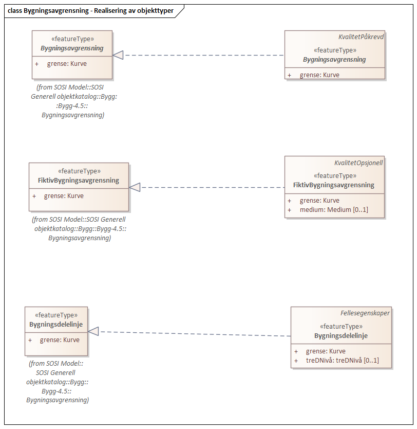
[caption="Figur 11: ",title=Bygningsavgrensning - Arv fra fellesegenskaper]
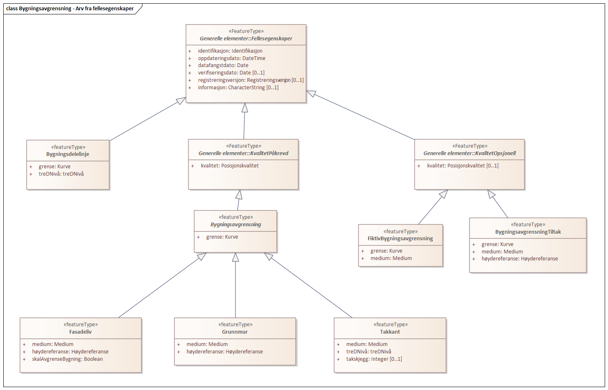
[caption="Figur 12: ",title=Bygningsavgrensning - Objekttyper med egenskaper]
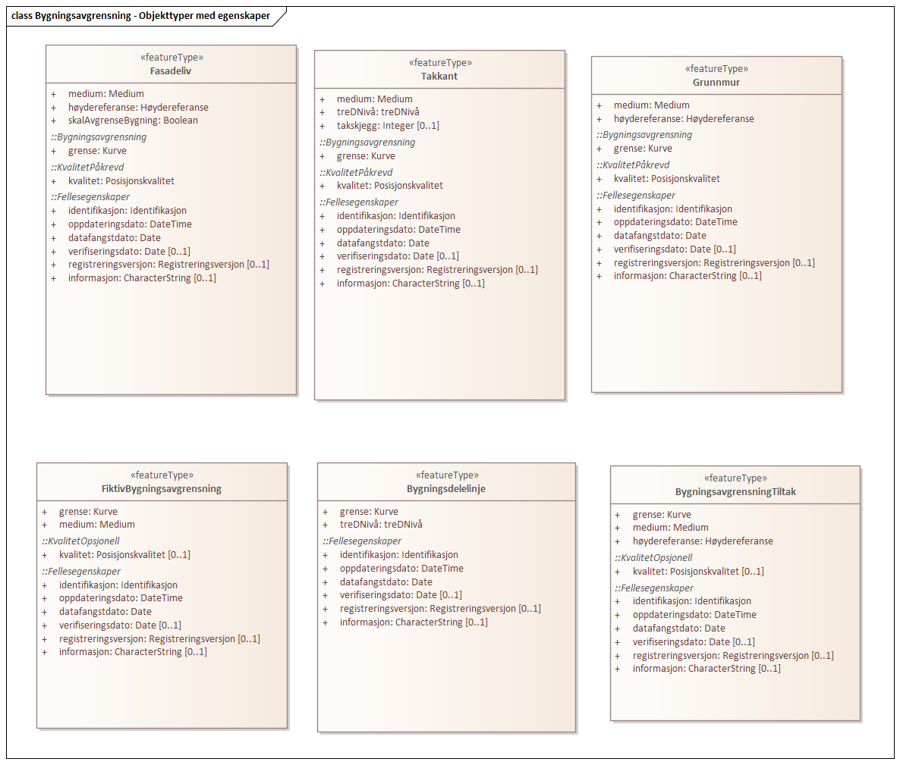
 
==== «featureType» Bygningsavgrensning
Definisjon: abstrakt supertype som bærer geometrien til avgrensningslinjene. Vil aldri realiseres som en objekttype
 
*Supertype:* «FeatureType» KvalitetPåkrevd
 
*Realisering av:* «ApplicationSchema» Bygg-4.5/Bygningsavgrensning::«featureType» Bygningsavgrensning
 
===== Egenskaper
[cols="20,80"]
|===
|*Navn:* 
|*grense*
 
|Definisjon: 
|forløp som følger objektets sentrale del (ytterkant)
 
|Multiplisitet: 
|[1..1]
 
|Type: 
|Kurve
|===
[cols="20,80"]
|===
|*Subtyper:*
|«featureType» Grunnmur +
«featureType» Takkant +
«featureType» Fasadeliv
|===
 
==== «featureType» BygningsavgrensningTiltak
Definisjon: Bygningsavgrensning hentet fra FKB-Tiltak. Dataene er tatt fra plan og er ikke innmålt i terrenget.
 
*Supertype:* «FeatureType» KvalitetOpsjonell
 
===== Egenskaper
[cols="20,80"]
|===
|*Navn:* 
|*grense*
 
|Definisjon: 
|forløp som følger objektets sentrale del (ytterkant)
 
|Multiplisitet: 
|[1..1]
 
|Type: 
|Kurve
|===
[cols="20,80"]
|===
|*Navn:* 
|*medium*
 
|Definisjon: 
|objektets beliggenhet i forhold til jordoverflaten
 
|Multiplisitet: 
|[0..1]
 
|Type: 
|Medium
|Tagged Values: 
|
SOSI_datatype: T + 
SOSI_lengde: 1 + 
SOSI_navn: MEDIUM + 
|===
[cols="20,80"]
|===
|*Navn:* 
|*høydereferanse*
 
|Definisjon: 
|koordinatregistering utført på topp eller bunn av et objekt
 
|Multiplisitet: 
|[0..1]
 
|Type: 
|Høydereferanse
|Tagged Values: 
|
SOSI_datatype: T + 
SOSI_lengde: 6 + 
SOSI_navn: HREF + 
|===
 
==== «featureType» Bygningsdelelinje
Definisjon: linje mellom to bygninger (bygninger registrert i Matrikkelen) som står inntil hverandre
Merknad: Det kan ofte være vanskelig å registrere bygningsdelelinjer nøyaktig. Usikkerhet i fastleggelsen av bygningsdelelinjen skal synliggjøres gjennom kvalitetskoding (f.eks posisjonskvalitet 81 50).
 
*Supertype:* «FeatureType» Fellesegenskaper
 
*Realisering av:* «ApplicationSchema» Bygg-4.5/Bygningsavgrensning::«featureType» Bygningsdelelinje
 
===== Egenskaper
[cols="20,80"]
|===
|*Navn:* 
|*grense*
 
|Definisjon: 
|forløp som følger objektets sentrale del (ytterkant)
 
|Multiplisitet: 
|[1..1]
 
|Type: 
|Kurve
|===
[cols="20,80"]
|===
|*Navn:* 
|*treDNivå*
 
|Definisjon: 
|hvilken 3D framstillingsmulighet (angitt i 6 nivåer) bygningen kan framstilles i.
 
|Multiplisitet: 
|[0..1]
 
|Type: 
|treDNivå
|===
 
==== «featureType» Fasadeliv
Definisjon: bygningens ytre avgrensing i fasaderiss
 
*Supertype:* «featureType» Bygningsavgrensning
 
===== Egenskaper
[cols="20,80"]
|===
|*Navn:* 
|*medium*
 
|Definisjon: 
|objektets beliggenhet i forhold til jordoverflaten
 
|Multiplisitet: 
|[0..1]
 
|Type: 
|Medium
|Tagged Values: 
|
SOSI_datatype: T + 
SOSI_lengde: 1 + 
SOSI_navn: MEDIUM + 
|===
[cols="20,80"]
|===
|*Navn:* 
|*høydereferanse*
 
|Definisjon: 
|koordinatregistering utført på topp eller bunn av et objekt
 
|Multiplisitet: 
|[0..1]
 
|Type: 
|Høydereferanse
|Tagged Values: 
|
SOSI_datatype: T + 
SOSI_lengde: 6 + 
SOSI_navn: HREF + 
|===
[cols="20,80"]
|===
|*Navn:* 
|*skalAvgrenseBygning*
 
|Definisjon: 
|angivelse av om fasadeliv skal benyttes til å danne bygningsflate. Defaultverdi er Nei, dvs. at fasadeliv kun benyttes til flateavgrensning dersom skalAvgrenseBygning = Ja.

Merknad:
Fasadeliv (hele eller deler av fasaden) vil i mange tilfeller eksistere i tillegg til Takkant. Egenskapen kan da benyttes til å angi at enten takriss eller fasadelivriss skal danne Bygningsavgrensning for bygningsflaten (normalt benyttes Takkant til riss hvis begge eksisterer).
 
|Multiplisitet: 
|[0..1]
 
|Type: 
|Boolean
|Tagged Values: 
|
SOSI_datatype: BOOLSK + 
SOSI_lengde:  + 
SOSI_navn: SKAL_AVGR_BYGN + 
|===
 
==== «featureType» FiktivBygningsavgrensning
Definisjon: fiktiv avgrensing av bygning
Merknad: Brukes når deler av takkant, fasadeliv, grunnmur eller bygningsdelelinje er ukjent for at det skal bli mulig å danne en flate.  Fiktiv bygningsavgrensing benyttes også for å lage flater for underjordiske bygninger og som fiktiv linje på takoverbygg der takoverbyggkant mangler.
 
*Supertype:* «FeatureType» KvalitetOpsjonell
 
*Realisering av:* «ApplicationSchema» Bygg-4.5/Bygningsavgrensning::«featureType» FiktivBygningsavgrensning
 
===== Egenskaper
[cols="20,80"]
|===
|*Navn:* 
|*grense*
 
|Definisjon: 
|forløp som følger objektets sentrale del (ytterkant)
 
|Multiplisitet: 
|[1..1]
 
|Type: 
|Kurve
|===
[cols="20,80"]
|===
|*Navn:* 
|*medium*
 
|Definisjon: 
|objektets beliggenhet i forhold til jordoverflaten
 
|Multiplisitet: 
|[0..1]
 
|Type: 
|Medium
|===
 
==== «featureType» Grunnmur
Definisjon: bygningens ytteravgrensning langs grunnmur
Merknad: Høydereferanse  angis med høydereferanse. Grunnrissreferanse er ytterkant av grunnmur.
Merknad: Kan benyttes for bygning under oppføring eller for bygning som er revet/nedbrent
 
*Supertype:* «featureType» Bygningsavgrensning
 
===== Egenskaper
[cols="20,80"]
|===
|*Navn:* 
|*medium*
 
|Definisjon: 
|objektets beliggenhet i forhold til jordoverflaten
 
|Multiplisitet: 
|[0..1]
 
|Type: 
|Medium
|Tagged Values: 
|
SOSI_datatype: T + 
SOSI_lengde: 1 + 
SOSI_navn: MEDIUM + 
|===
[cols="20,80"]
|===
|*Navn:* 
|*høydereferanse*
 
|Definisjon: 
|koordinatregistering utført på topp eller bunn av et objekt
 
|Multiplisitet: 
|[0..1]
 
|Type: 
|Høydereferanse
|Tagged Values: 
|
SOSI_datatype: T + 
SOSI_lengde: 6 + 
SOSI_navn: HREF + 
|===
 
==== «featureType» Takkant
Definisjon: bygningens ytre takflateavgrensing
Merknad: Høydereferansen er de målte punktene på taket. 
Merknad: Dersom deler av takkanten ikke er synlig kodes den synlige delen som takkant- og den ikke synlige som fiktiv bygningsavgrensning.
 
*Supertype:* «featureType» Bygningsavgrensning
 
===== Egenskaper
[cols="20,80"]
|===
|*Navn:* 
|*medium*
 
|Definisjon: 
|objektets beliggenhet i forhold til jordoverflaten
 
|Multiplisitet: 
|[0..1]
 
|Type: 
|Medium
|Tagged Values: 
|
SOSI_datatype: T + 
SOSI_lengde: 1 + 
SOSI_navn: MEDIUM + 
|===
[cols="20,80"]
|===
|*Navn:* 
|*treDNivå*
 
|Definisjon: 
|hvilken 3D framstillingsmulighet (angitt i 6 nivåer) bygningen kan framstilles i.
 
|Multiplisitet: 
|[0..1]
 
|Type: 
|treDNivå
|Tagged Values: 
|
SOSI_datatype: H + 
SOSI_lengde: 1 + 
SOSI_navn: TRE_D_NIVÅ + 
|===
[cols="20,80"]
|===
|*Navn:* 
|*takskjegg*
 
|Definisjon: 
|avstanden fra veggliv til takkant målt i cm
 
|Multiplisitet: 
|[0..1]
 
|Type: 
|Integer
|Tagged Values: 
|
SOSI_datatype: H + 
SOSI_lengde: 3 + 
SOSI_navn: TAKSKJEGG + 
|===
=== Pakke: BeskrivendeBygningslinjer
Definisjon: Inneholder elementer fra SOSI Bygg 4.5, BeskrivendeBygningslinjer
[caption="Figur 13: ",title=BeskrivendeBygningslinjer - Realisering av objekttyper]
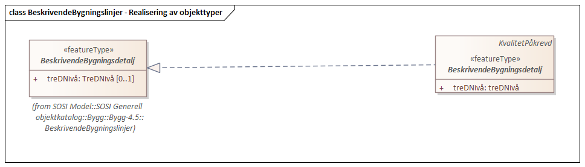
[caption="Figur 14: ",title=BeskrivendeBygningslinjer - Arv av fellesegenskaper]
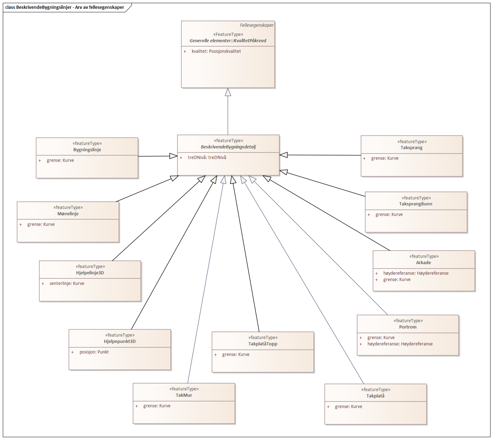
[caption="Figur 15: ",title=BeskrivendeBygningslinjer - Objekttyper med egenskaper]
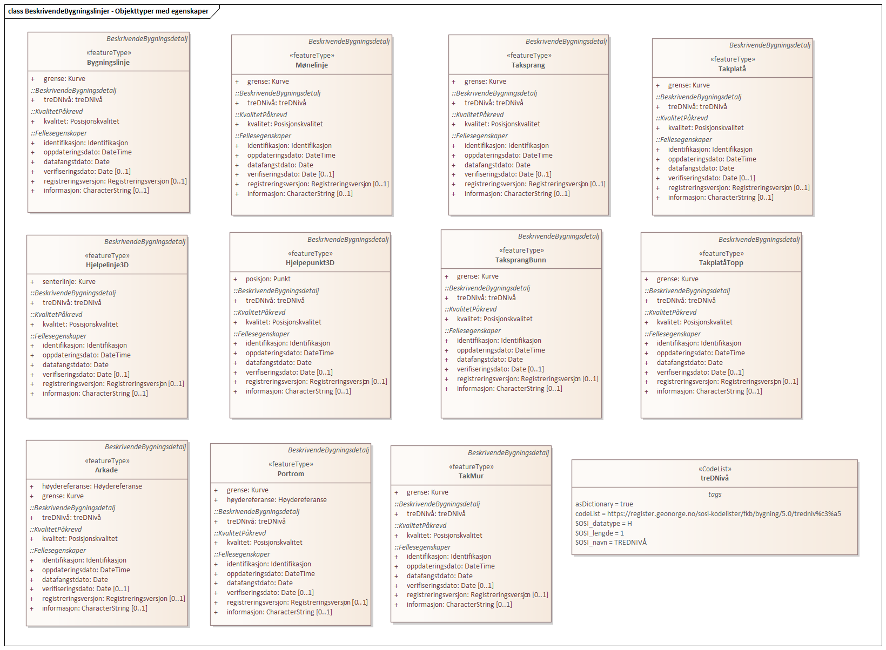
 
==== «featureType» BeskrivendeBygningsdetalj
Definisjon: bygningsdetalj som ligger innenfor bygningsavgrensning, og som ikke er knyttet til bygningens avgrensning
 
*Supertype:* «FeatureType» KvalitetPåkrevd
 
*Realisering av:* «ApplicationSchema» Bygg-4.5/BeskrivendeBygningslinjer::«featureType» BeskrivendeBygningsdetalj
 
===== Egenskaper
[cols="20,80"]
|===
|*Navn:* 
|*treDNivå*
 
|Definisjon: 
|hvilken 3D framstillingsmulighet (angitt i 6 nivåer) bygningen kan framstilles i.
 
|Multiplisitet: 
|[1..1]
 
|Type: 
|treDNivå
|Tagged Values: 
|
SOSI_datatype: H + 
SOSI_lengde: 1 + 
SOSI_melding: Fant ikke denne i SOSI_db/Objektegenskaper + 
SOSI_navn: TRE_D_NIVÅ + 
|===
[cols="20,80"]
|===
|*Subtyper:*
|«featureType» Arkade +
«featureType» Hjelpelinje3D +
«featureType» Bygningslinje +
«featureType» TaksprangBunn +
«featureType» Taksprang +
«featureType» Hjelpepunkt3D +
«featureType» TakplatåTopp +
«featureType» Portrom +
«featureType» Takplatå +
«featureType» TakMur +
«featureType» Mønelinje
|===
 
==== «featureType» Arkade
Definisjon: avgrensing av en tunnel gjennom en bygning
 
*Supertype:* «featureType» BeskrivendeBygningsdetalj
 
===== Egenskaper
[cols="20,80"]
|===
|*Navn:* 
|*høydereferanse*
 
|Definisjon: 
|koordinatregistering utført på topp eller bunn av et objekt
 
|Multiplisitet: 
|[1..1]
 
|Type: 
|Høydereferanse
|Tagged Values: 
|
SOSI_datatype: T + 
SOSI_lengde: 6 + 
SOSI_navn: HREF + 
|===
[cols="20,80"]
|===
|*Navn:* 
|*grense*
 
|Definisjon: 
|forløp som følger objektets sentrale del (ytterkant)
 
|Multiplisitet: 
|[1..1]
 
|Type: 
|Kurve
|Tagged Values: 
|
SOSI_melding: Fant ikke denne i SOSI_db + 
SOSI_navn: Kurve + 
|===
 
==== «featureType» Bygningslinje
Definisjon: linje som beskriver bygningsdetalj innenfor en takflate  og som ikke kan beskrives av andre objekttyper
Eksempel: Valming på tak
 
*Supertype:* «featureType» BeskrivendeBygningsdetalj
 
===== Egenskaper
[cols="20,80"]
|===
|*Navn:* 
|*grense*
 
|Definisjon: 
|forløp som følger objektets sentrale del (ytterkant)
 
|Multiplisitet: 
|[1..1]
 
|Type: 
|Kurve
|===
 
==== «featureType» Hjelpelinje3D
Definisjon: linje for å kunne danne gode 3D modeller av bygninger
 
*Supertype:* «featureType» BeskrivendeBygningsdetalj
 
===== Egenskaper
[cols="20,80"]
|===
|*Navn:* 
|*senterlinje*
 
|Definisjon: 
|forløp som følger objektets sentrale del
 
|Multiplisitet: 
|[1..1]
 
|Type: 
|Kurve
|===
 
==== «featureType» Hjelpepunkt3D
Definisjon: punkt for å kunne danne gode 3-D modeller av oppstikkende detaljer som for eksempel spir
 
*Supertype:* «featureType» BeskrivendeBygningsdetalj
 
===== Egenskaper
[cols="20,80"]
|===
|*Navn:* 
|*posisjon*
 
|Definisjon: 
|sted som objektet eksisterer på
 
|Multiplisitet: 
|[1..1]
 
|Type: 
|Punkt
|===
 
==== «featureType» Mønelinje
Definisjon: linje som beskriver den horisontale knekklinje på toppen av taket (høyeste topp)
 
*Supertype:* «featureType» BeskrivendeBygningsdetalj
 
===== Egenskaper
[cols="20,80"]
|===
|*Navn:* 
|*grense*
 
|Definisjon: 
|forløp som følger objektets sentrale del (ytterkant)
 
|Multiplisitet: 
|[1..1]
 
|Type: 
|Kurve
|===
 
==== «featureType» Portrom
Definisjon: avgrensing av en tunnel gjennom en bygning
 
*Supertype:* «featureType» BeskrivendeBygningsdetalj
 
===== Egenskaper
[cols="20,80"]
|===
|*Navn:* 
|*grense*
 
|Definisjon: 
|forløp som følger objektets sentrale del (ytterkant)
 
|Multiplisitet: 
|[1..1]
 
|Type: 
|Kurve
|===
[cols="20,80"]
|===
|*Navn:* 
|*høydereferanse*
 
|Definisjon: 
|koordinatregistering utført på topp eller bunn av et objekt
 
|Multiplisitet: 
|[1..1]
 
|Type: 
|Høydereferanse
|Tagged Values: 
|
SOSI_datatype: T + 
SOSI_lengde: 6 + 
SOSI_navn: HREF + 
|===
 
==== «featureType» TakMur
Definisjon: opphøyde kanter ved takkant
Merknad: Eksempel på kanter der TakMur skal benyttes er gavlvegger og brannvegger som stikker opp over takflaten
 
*Supertype:* «featureType» BeskrivendeBygningsdetalj
 
===== Egenskaper
[cols="20,80"]
|===
|*Navn:* 
|*grense*
 
|Definisjon: 
|forløp som følger objektets sentrale del (ytterkant)
 
|Multiplisitet: 
|[1..1]
 
|Type: 
|Kurve
|===
 
==== «featureType» Takplatå
Definisjon: innsøkk i form av laveste vannrette flate på hovedvolum på bygningskropp
Eksempel: Arker som går inn i hovedtaket og "terrasse" inne i en bygård.
 
*Supertype:* «featureType» BeskrivendeBygningsdetalj
 
===== Egenskaper
[cols="20,80"]
|===
|*Navn:* 
|*grense*
 
|Definisjon: 
|forløp som følger objektets sentrale del (ytterkant)
 
|Multiplisitet: 
|[1..1]
 
|Type: 
|Kurve
|===
 
==== «featureType» TakplatåTopp
Definisjon: innsøkk i form av laveste vannrette flate på hovedvolum på bygningskropp
Eksempel: Arker som går inn i hovedtaket og "terrasse" inne i en bygård.
 
*Supertype:* «featureType» BeskrivendeBygningsdetalj
 
===== Egenskaper
[cols="20,80"]
|===
|*Navn:* 
|*grense*
 
|Definisjon: 
|forløp som følger objektets sentrale del (ytterkant)
 
|Multiplisitet: 
|[1..1]
 
|Type: 
|Kurve
|Tagged Values: 
|
SOSI_melding: Fant ikke denne i SOSI_db + 
SOSI_navn: Kurve + 
|===
 
==== «featureType» Taksprang
Definisjon: topp av takkant inne på en bygningskropp
Merknad: ikke ytterkant som registreres som takkant
 
*Supertype:* «featureType» BeskrivendeBygningsdetalj
 
===== Egenskaper
[cols="20,80"]
|===
|*Navn:* 
|*grense*
 
|Definisjon: 
|forløp som følger objektets sentrale del (ytterkant)
 
|Multiplisitet: 
|[1..1]
 
|Type: 
|Kurve
|===
 
==== «featureType» TaksprangBunn
Definisjon: bunn av takkant inne på en bygningskropp 
Merknad: Ikke ytterkant som er takkant
 
*Supertype:* «featureType» BeskrivendeBygningsdetalj
 
===== Egenskaper
[cols="20,80"]
|===
|*Navn:* 
|*grense*
 
|Definisjon: 
|forløp som følger objektets sentrale del (ytterkant)
 
|Multiplisitet: 
|[1..1]
 
|Type: 
|Kurve
|===
 
==== «CodeList» treDNivå
Definisjon: hvilken 3D framstillingsmulighet (angitt i 6 niv&#229;er) bygningen kan framstilles i. Tilsvarer LOD i CityGML.
 
===== Tagged Values
[cols="20,80"]
|===
|asDictionary
|true
 
|codeList
|https://register.geonorge.no/sosi-kodelister/fkb/bygning/5.0/tredniv%c3%a5
 
|SOSI_datatype
|H
 
|SOSI_lengde
|1
 
|SOSI_navn
|TREDNIVÅ
 
|===
Kodeliste hentet fra register: https://register.geonorge.no/sosi-kodelister/fkb/bygning/5.0/tredniv%c3%a5
 
Kodeliste hentet på tidspunkt: 2021-07-02T15:13:46Z
 
Kodelistens navn i registeret: TreDNivå
 
===== Koder
[cols="25,60,15"]
|===
|*Kodenavn:* 
|*Definisjon:* 
|*Utvekslingsalias:* 
 
|===
=== Pakke: Bygningsvedheng
Definisjon: Inneholder elementer fra SOSI Bygg 4.5, Bygningsvedheng
[caption="Figur 16: ",title=Bygningsvedheng - Realisering av objekttyper]
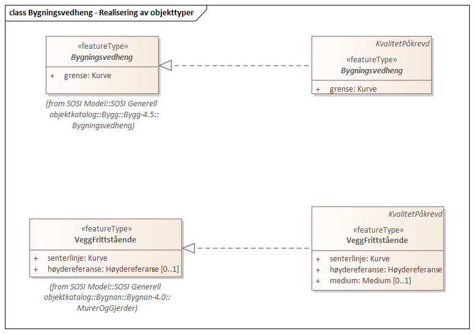
[caption="Figur 17: ",title=Bygningsvedheng - Arv av fellesegenskaper]
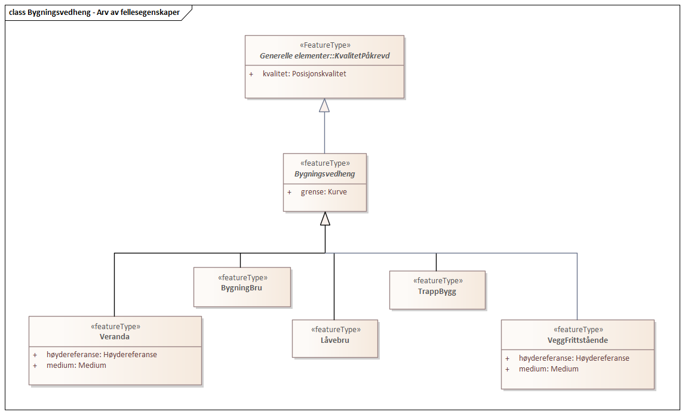
[caption="Figur 18: ",title=Bygningsvedheng - Objekttyper og egenskaper]
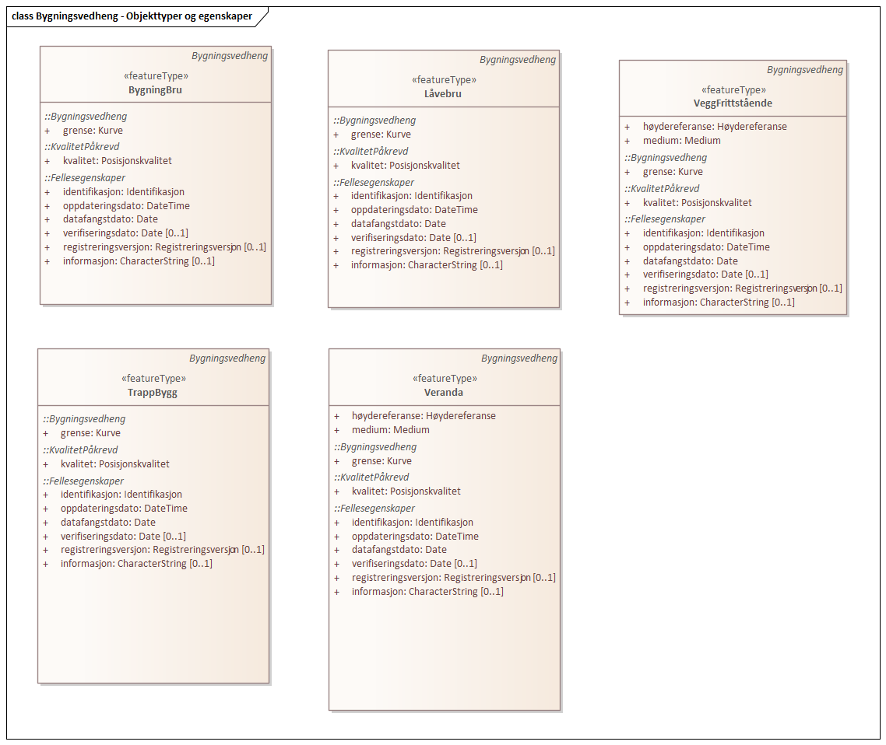
 
==== «featureType» Bygningsvedheng
Definisjon: bygningsdetaljer som ligger i tilknytning til  bygningen, og som ikke er knyttet til bygningens avgrensning
 
*Supertype:* «FeatureType» KvalitetPåkrevd
 
*Realisering av:* «ApplicationSchema» Bygg-4.5/Bygningsvedheng::«featureType» Bygningsvedheng
 
===== Egenskaper
[cols="20,80"]
|===
|*Navn:* 
|*grense*
 
|Definisjon: 
|forløp som følger objektets sentrale del (ytterkant)
 
|Multiplisitet: 
|[1..1]
 
|Type: 
|Kurve
|===
[cols="20,80"]
|===
|*Subtyper:*
|«featureType» Låvebru +
«featureType» TrappBygg +
«featureType» Veranda +
«featureType» BygningBru
|===
 
==== «featureType» BygningBru
Definisjon: bru tilknyttet bygning som brukes som adkomst til bygninger, og bruer mellom bygninger
Merknad:  Brukes på bygninger som ikke er driftsbygninger i landbruket. I det siste tilfellet brukes låvebru
 
*Supertype:* «featureType» Bygningsvedheng
 
 
==== «featureType» Låvebru
Definisjon: kjørerampe til et landbruksbygg
Merknad: Kjørerampe i tilknytning til et industri og lagerbygg beskrives som Annet vegareal/avkjørsel og Brukonstruksjon
 
*Supertype:* «featureType» Bygningsvedheng
 
 
==== «featureType» TrappBygg
Definisjon: omfatter trapper som danner adkomsten til hus og trapp inntil hus
 
*Supertype:* «featureType» Bygningsvedheng
 
 
==== «featureType» Veranda
Definisjon: bygningsvedheng som omfatter veranda,  terrasse, altan, balkong og lasterampe
Merknad: Garasje med veranda på taket er enten en del av bygningsenheten den ligger til eller - hvis den er tildelt eget bygningsnummer - en bygning.
 
*Supertype:* «featureType» Bygningsvedheng
 
===== Egenskaper
[cols="20,80"]
|===
|*Navn:* 
|*høydereferanse*
 
|Definisjon: 
|koordinatregistering utført på topp eller bunn av et objekt
 
|Multiplisitet: 
|[1..1]
 
|Type: 
|Høydereferanse
|Tagged Values: 
|
SOSI_datatype: T + 
SOSI_lengde: 6 + 
SOSI_navn: HREF + 
|===
[cols="20,80"]
|===
|*Navn:* 
|*medium*
 
|Definisjon: 
|objektets beliggenhet i forhold til jordoverflaten

Eksempel:
På bro, i tunnel, inne i et bygningsmessig anlegg, etc.
 
|Multiplisitet: 
|[1..1]
 
|Type: 
|Medium
|Tagged Values: 
|
SOSI_datatype: T + 
SOSI_lengde: 1 + 
SOSI_melding: Fant ikke denne i SOSI_db/Objektegenskaper + 
SOSI_navn: MEDIUM + 
|===
 
==== «featureType» VeggFrittstående
Definisjon: vegg oppsatt for skjerming
 
*Supertype:* «FeatureType» KvalitetPåkrevd
 
*Realisering av:* «ApplicationSchema» Bygnan-4.0/MurerOgGjerder::«featureType» VeggFrittstående
 
===== Egenskaper
[cols="20,80"]
|===
|*Navn:* 
|*senterlinje*
 
|Definisjon: 
|forløp som følger objektets sentrale del
 
|Multiplisitet: 
|[1..1]
 
|Type: 
|Kurve
|===
[cols="20,80"]
|===
|*Navn:* 
|*høydereferanse*
 
|Definisjon: 
|angivelse av om registreringen er utført på topp eller bunn av et element- f.eks. en skråning- mur osv.
 
|Multiplisitet: 
|[1..1]
 
|Type: 
|Høydereferanse
|Tagged Values: 
|
SOSI_datatype: T + 
SOSI_lengde: 6 + 
SOSI_navn: HREF + 
|===
[cols="20,80"]
|===
|*Navn:* 
|*medium*
 
|Definisjon: 
|objektets beliggenhet i forhold til jordoverflaten
 
|Multiplisitet: 
|[0..1]
 
|Type: 
|Medium
|===
=== Pakke: Takoverbygg
Definisjon: Inneholder elementer fra SOSI Bygg 4.5, Takoverbygg
[caption="Figur 19: ",title=Takoverbygg - Realisering av objekttyper]
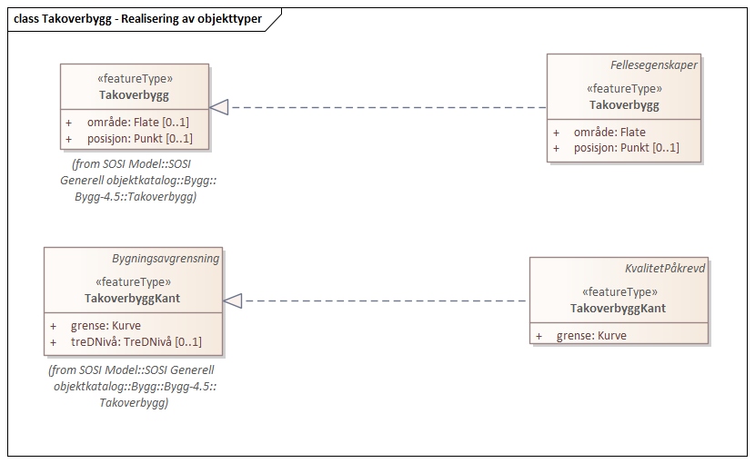
[caption="Figur 20: ",title=Takoverbygg - Arv av fellesegenskaper]
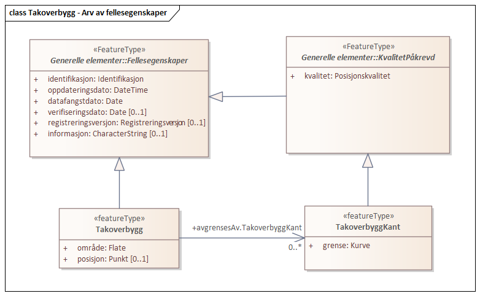
[caption="Figur 21: ",title=Takoverbygg - Objekttyper og egenskaper]

[caption="Figur 22: ",title=Takoverbygg - Flateavgrensning]
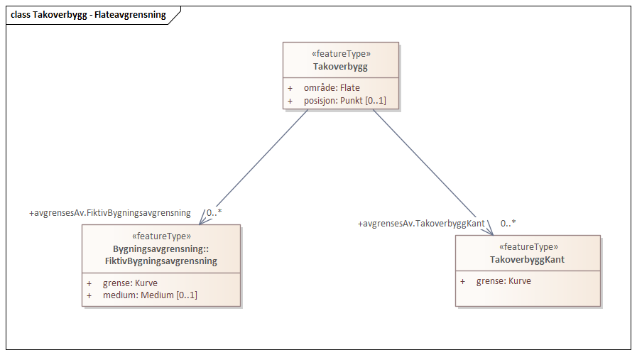
 
==== «featureType» Takoverbygg
Definisjon: byggverk med ingen eller få vegger, og som ikke er registrert som bygning i matrikkelen
Eksempel:  'carport' eller tak over bensinpumper
 
*Supertype:* «FeatureType» Fellesegenskaper
 
*Realisering av:* «ApplicationSchema» Bygg-4.5/Takoverbygg::«featureType» Takoverbygg
 
===== Egenskaper
[cols="20,80"]
|===
|*Navn:* 
|*område*
 
|Definisjon: 
|objektets utstrekning
 
|Multiplisitet: 
|[1..1]
 
|Type: 
|Flate
|===
[cols="20,80"]
|===
|*Navn:* 
|*posisjon*
 
|Definisjon: 
|sted som objektet eksisterer på
 
|Multiplisitet: 
|[0..1]
 
|Type: 
|Punkt
|===
[cols="20,80"]
|===
===== Roller
|*Rollenavn:* 
|*avgrensesAv.TakoverbyggKant*
 
|Multiplisitet: 
|[0..*]
 
|Til klasse
|«featureType» TakoverbyggKant
|===
|*Rollenavn:* 
|*avgrensesAv.FiktivBygningsavgrensning*
 
|Multiplisitet: 
|[0..*]
 
|Til klasse
|«featureType» FiktivBygningsavgrensning
|===
 
==== «featureType» TakoverbyggKant
Definisjon: avgrensing av takoverbygg
 
*Supertype:* «FeatureType» KvalitetPåkrevd
 
*Realisering av:* «ApplicationSchema» Bygg-4.5/Takoverbygg::«featureType» TakoverbyggKant
 
===== Egenskaper
[cols="20,80"]
|===
|*Navn:* 
|*grense*
 
|Definisjon: 
|forløp som følger objektets sentrale del (ytterkant)
 
|Multiplisitet: 
|[1..1]
 
|Type: 
|Kurve
|===
