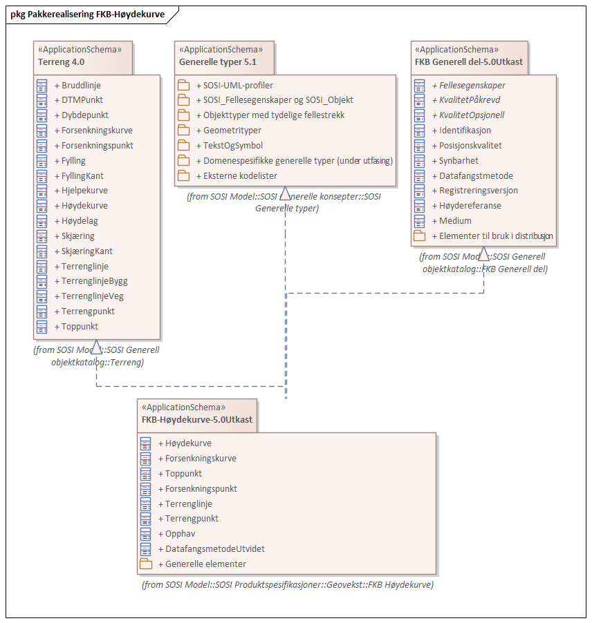
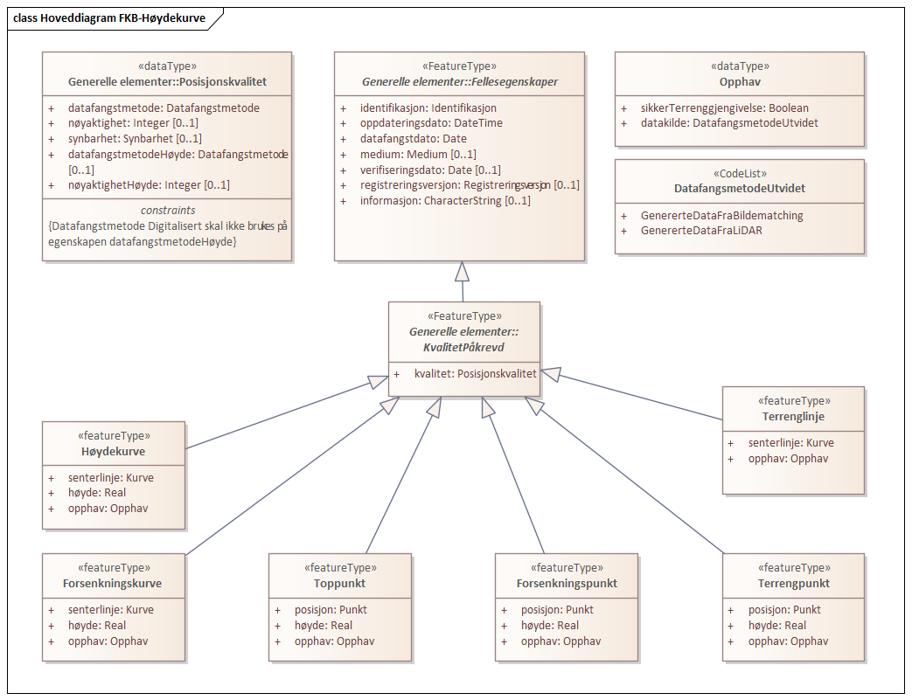
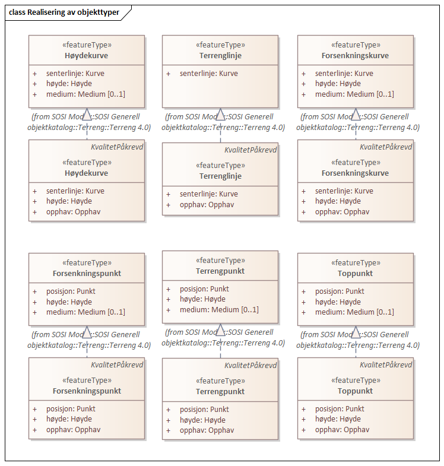
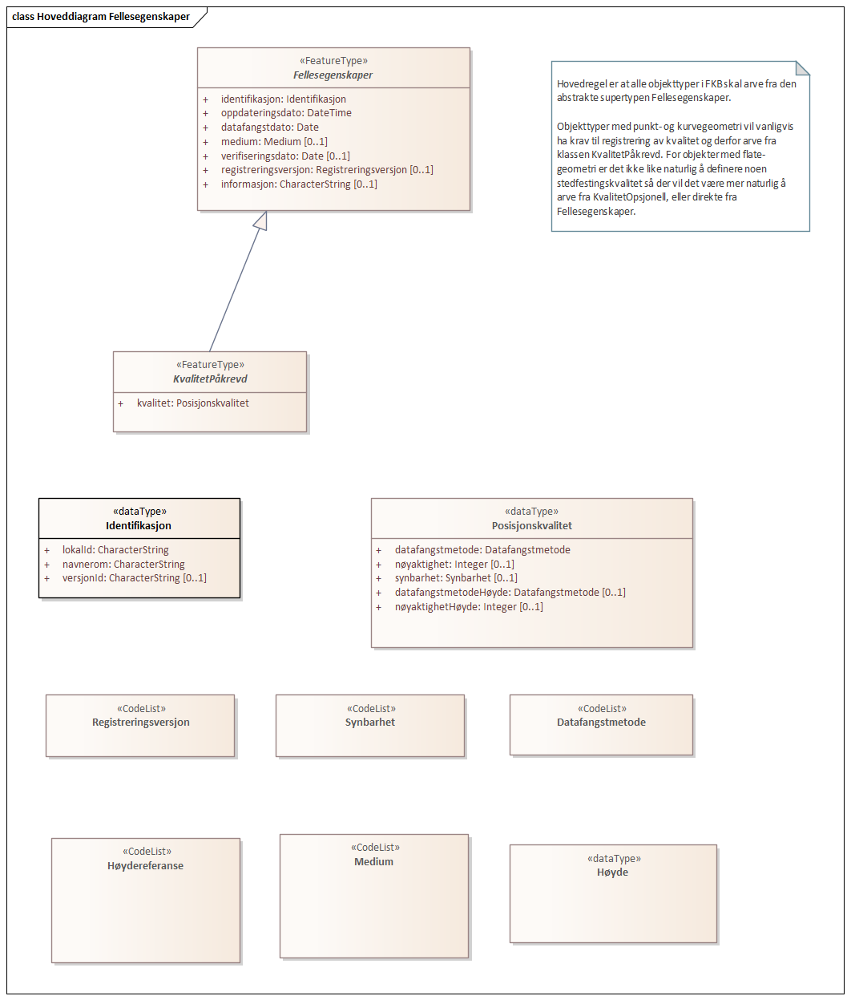
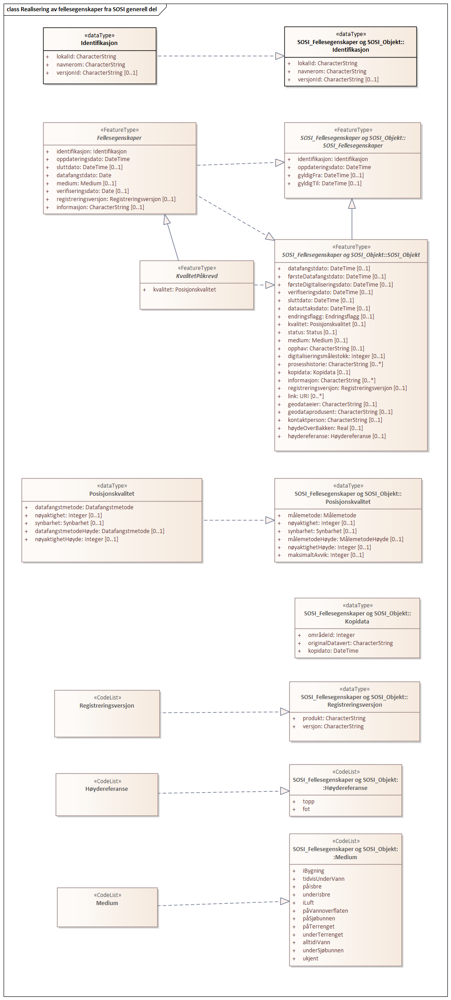
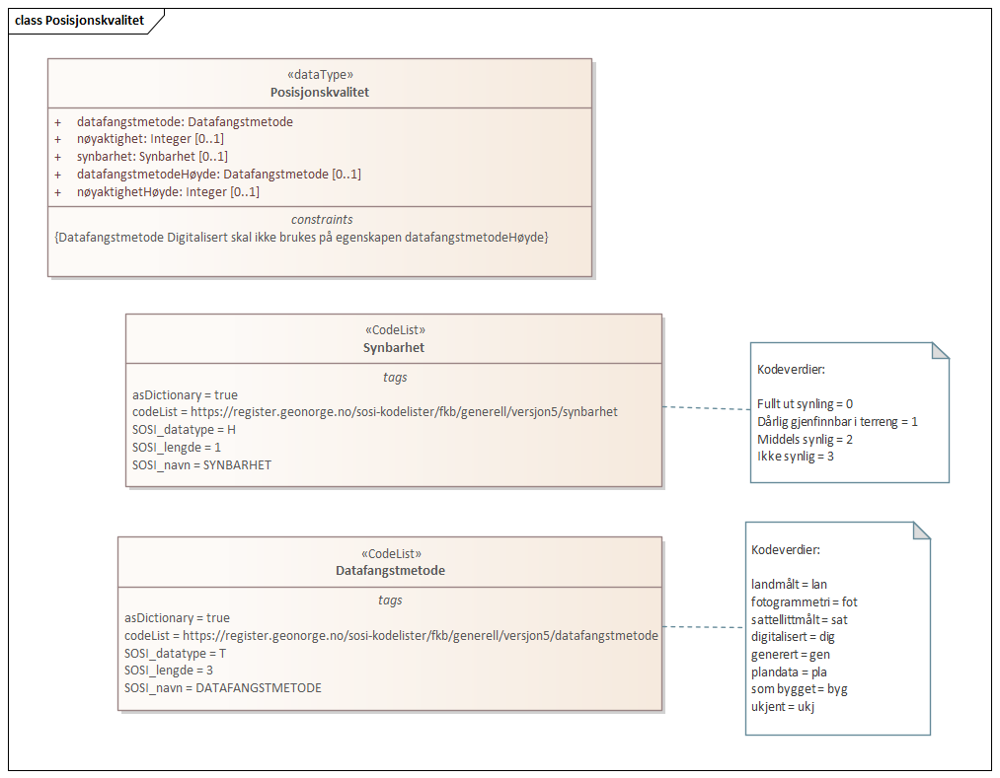

// Start of UML-model
=== Pakke: «ApplicationSchema» FKB-Høydekurve-5.0.1
*Definisjon:* Spesifikasjonen omfatter alle data som er nødvendig for å beskrive terrengets form og høyde over et gitt referansenivå som høydekurver, forsenkningskurver, toppunkt etc.

Nye høydekurver genereres hovedsaklig fra en terrengmodell basert på punktskyer fra enten laserskanning eller bildematching. Høydekurvene blir da bare en visning av terrengmodellen. Best informasjon om terrenget fås ved direkte bruk av terrengmodellen.
 
[discrete]
==== Profilparametre i tagged values
[cols="20,80"]
|===
|definition
|"The specification details the datasets describing the shape of the terrain"@en
 
|description
|"FKB-Høydekurve 5.0"@en
 
|designation
|"Product specification FKB-Høydekurve 5.0"@en
 
|language
|no
 
|SOSI_kortnavn
|FKBHøydekurve
 
|SOSI_langnavn
|FKB-Høydekurve
 
|SOSI_modellstatus
|gyldig
 
|SOSI_spesifikasjonstype
|produktspesifikasjon
 
|SOSI_versjon
|5.0
 
|targetNamespace
|http://skjema.geonorge.no/SOSI/produktspesifikasjon/FKB-Høydekurve/5.0
 
|version
|5.0.1
 
|xmlns
|app
 
|xsdDocument
|FKBHøydekurve.xsd
 
|xsdEncodingRule
|sosi
 
|===
 
'''
 
.Pakkerealisering FKB-Høydekurve 

 
'''
 
.Hoveddiagram FKB-Høydekurve 

 
'''
 
.Realisering av objekttyper 

 
'''
 
[[høydekurve]]
==== «featureType» Høydekurve
*Definisjon:* linje i terrenget med fast høydeverdi (z-verdi) over referansehøyden
 
[discrete]
===== Egenskaper
[cols="20,80"]
|===
|*Navn:* 
|*senterlinje*
 
|Definisjon: 
|forløp som følger objektets sentrale del
 
|Multiplisitet: 
|[1..1]
 
|Type: 
|http://skjema.geonorge.no/SOSI/basistype/GM_Curve[GM_Curve]
|===
[cols="20,80"]
|===
|*Navn:* 
|*høyde*
 
|Definisjon: 
|angivelse av høydekurvens høyde over høydereferansen i meter- og oppgis som et desimalt tall hvis nødvendig
 
|Multiplisitet: 
|[1..1]
 
|Type: 
|http://skjema.geonorge.no/SOSI/basistype/Real[Real]
|Profilparametre i tagged values: 
|
SOSI_datatype: D + 
SOSI_lengde: 8.2 + 
SOSI_navn: HØYDE + 
SOSI_navn: HØYDE + 
|===
[cols="20,80"]
|===
|*Navn:* 
|*opphav*
 
|Definisjon: 
|beskriver objektets opphav og forteller om objektet sikkert gjengir terrenget
 
|Multiplisitet: 
|[1..1]
 
|Type: 
|<<opphav,«dataType» Opphav>>
|Profilparametre i tagged values: 
|
SOSI_navn: OPPHAV + 
|===
 
[discrete]
===== Arv og realiseringer
[cols="20,80"]
|===
|Supertype: 
|<<kvalitetpåkrevd,«FeatureType» KvalitetPåkrevd>>
 
|Realisering av: 
|«ApplicationSchema» Terreng 4.0::«featureType» Høydekurve +
|===
 
'''
 
[[forsenkningskurve]]
==== «featureType» Forsenkningskurve
*Definisjon:* linje i terrenget med fast høydeverdi (z-verdi) som beskriver en forsenkning i terrenget
Merknad: Alle kurver som beskriver en forsenkning skal kodes som forsenkningskurver- ikke bare den nederste kurven.
 
[discrete]
===== Egenskaper
[cols="20,80"]
|===
|*Navn:* 
|*senterlinje*
 
|Definisjon: 
|forløp som følger objektets sentrale del
 
|Multiplisitet: 
|[1..1]
 
|Type: 
|http://skjema.geonorge.no/SOSI/basistype/GM_Curve[GM_Curve]
|===
[cols="20,80"]
|===
|*Navn:* 
|*høyde*
 
|Definisjon: 
|angir forsenkningskurvens  høyde over høydereferansen i meter- og oppgis som et desimalt tall hvis nødvendig
 
|Multiplisitet: 
|[1..1]
 
|Type: 
|http://skjema.geonorge.no/SOSI/basistype/Real[Real]
|Profilparametre i tagged values: 
|
SOSI_datatype: D + 
SOSI_lengde: 8.2 + 
SOSI_navn: HØYDE + 
SOSI_navn: HØYDE + 
|===
[cols="20,80"]
|===
|*Navn:* 
|*opphav*
 
|Definisjon: 
|beskriver objektets opphav og forteller om objektet sikkert gjengir terrenget
 
|Multiplisitet: 
|[1..1]
 
|Type: 
|<<opphav,«dataType» Opphav>>
|Profilparametre i tagged values: 
|
SOSI_navn: OPPHAV + 
|===
 
[discrete]
===== Arv og realiseringer
[cols="20,80"]
|===
|Supertype: 
|<<kvalitetpåkrevd,«FeatureType» KvalitetPåkrevd>>
 
|Realisering av: 
|«ApplicationSchema» Terreng 4.0::«featureType» Forsenkningskurve +
|===
 
'''
 
[[toppunkt]]
==== «featureType» Toppunkt
*Definisjon:* punkt med målt høydeverdi som ligger på en markert forhøyning eller topp i terrenget
 
[discrete]
===== Egenskaper
[cols="20,80"]
|===
|*Navn:* 
|*posisjon*
 
|Definisjon: 
|sted som objektet eksisterer på
 
|Multiplisitet: 
|[1..1]
 
|Type: 
|http://skjema.geonorge.no/SOSI/basistype/GM_Point[GM_Point]
|===
[cols="20,80"]
|===
|*Navn:* 
|*høyde*
 
|Definisjon: 
|angivelse av topp punktets øyde over høydereferansen i meter- og oppgis som et desimalt tall hvis nødvendig.
 
|Multiplisitet: 
|[1..1]
 
|Type: 
|http://skjema.geonorge.no/SOSI/basistype/Real[Real]
|Profilparametre i tagged values: 
|
SOSI_datatype: D + 
SOSI_lengde: 8.2 + 
SOSI_navn: HØYDE + 
SOSI_navn: HØYDE + 
|===
[cols="20,80"]
|===
|*Navn:* 
|*opphav*
 
|Definisjon: 
|beskriver objektets opphav og forteller om objektet sikkert gjengir terrenget
 
|Multiplisitet: 
|[1..1]
 
|Type: 
|<<opphav,«dataType» Opphav>>
|Profilparametre i tagged values: 
|
SOSI_navn: OPPHAV + 
|===
 
[discrete]
===== Arv og realiseringer
[cols="20,80"]
|===
|Supertype: 
|<<kvalitetpåkrevd,«FeatureType» KvalitetPåkrevd>>
 
|Realisering av: 
|«ApplicationSchema» Terreng 4.0::«featureType» Toppunkt +
|===
 
'''
 
[[forsenkningspunkt]]
==== «featureType» Forsenkningspunkt
*Definisjon:* punkt med målt høydeverdi som ligger i en markert forsenkning i terrenget
 
[discrete]
===== Egenskaper
[cols="20,80"]
|===
|*Navn:* 
|*posisjon*
 
|Definisjon: 
|sted som objektet eksisterer på
 
|Multiplisitet: 
|[1..1]
 
|Type: 
|http://skjema.geonorge.no/SOSI/basistype/GM_Point[GM_Point]
|===
[cols="20,80"]
|===
|*Navn:* 
|*høyde*
 
|Definisjon: 
|angivelse av punktets høyde over høydereferansen i meter- og oppgis som et desimalt tall hvis nødvendig
 
|Multiplisitet: 
|[1..1]
 
|Type: 
|http://skjema.geonorge.no/SOSI/basistype/Real[Real]
|Profilparametre i tagged values: 
|
SOSI_datatype: D + 
SOSI_lengde: 8.2 + 
SOSI_navn: HØYDE + 
SOSI_navn: HØYDE + 
|===
[cols="20,80"]
|===
|*Navn:* 
|*opphav*
 
|Definisjon: 
|beskriver objektets opphav og forteller om objektet sikkert gjengir terrenget
 
|Multiplisitet: 
|[1..1]
 
|Type: 
|<<opphav,«dataType» Opphav>>
|Profilparametre i tagged values: 
|
SOSI_navn: OPPHAV + 
|===
 
[discrete]
===== Arv og realiseringer
[cols="20,80"]
|===
|Supertype: 
|<<kvalitetpåkrevd,«FeatureType» KvalitetPåkrevd>>
 
|Realisering av: 
|«ApplicationSchema» Terreng 4.0::«featureType» Forsenkningspunkt +
|===
 
'''
 
[[terrenglinje]]
==== «featureType» Terrenglinje
*Definisjon:* linje som benyttes der hvor terrenget markert forandrer helning og/eller retning (på tvers av terrenglinja) Typisk skal terrenglinjer benyttes i søkk, på rygger, over topper, i bunnen av forsenkninger, i sadel eller på flate områder hvor det er lite annen høydeinformasjon
 
[discrete]
===== Egenskaper
[cols="20,80"]
|===
|*Navn:* 
|*senterlinje*
 
|Definisjon: 
|forløp som følger objektets sentrale del
 
|Multiplisitet: 
|[1..1]
 
|Type: 
|http://skjema.geonorge.no/SOSI/basistype/GM_Curve[GM_Curve]
|===
[cols="20,80"]
|===
|*Navn:* 
|*opphav*
 
|Definisjon: 
|beskriver objektets opphav og forteller om objektet sikkert gjengir terrenget
 
|Multiplisitet: 
|[1..1]
 
|Type: 
|<<opphav,«dataType» Opphav>>
|Profilparametre i tagged values: 
|
SOSI_navn: OPPHAV + 
|===
 
[discrete]
===== Arv og realiseringer
[cols="20,80"]
|===
|Supertype: 
|<<kvalitetpåkrevd,«FeatureType» KvalitetPåkrevd>>
 
|Realisering av: 
|«ApplicationSchema» Terreng 4.0::«featureType» Terrenglinje +
|===
 
'''
 
[[terrengpunkt]]
==== «featureType» Terrengpunkt
*Definisjon:* punkt i terrenget med målt høydeverdi som brukes for å angi høyde på markerte flater i terrenget som for eksempel sadler og store flater, i veg- og gatekryss og andre kryss mellom samferdselslinjer, på gårdsplasser utenfor hovedinnganger og på parkeringsplasser
 
[discrete]
===== Egenskaper
[cols="20,80"]
|===
|*Navn:* 
|*posisjon*
 
|Definisjon: 
|sted som objektet eksisterer på
 
|Multiplisitet: 
|[1..1]
 
|Type: 
|http://skjema.geonorge.no/SOSI/basistype/GM_Point[GM_Point]
|===
[cols="20,80"]
|===
|*Navn:* 
|*høyde*
 
|Definisjon: 
|angivelse av punktets høyde, og oppgis som et desimalt tall hvis nødvendig
 
|Multiplisitet: 
|[1..1]
 
|Type: 
|http://skjema.geonorge.no/SOSI/basistype/Real[Real]
|Profilparametre i tagged values: 
|
SOSI_datatype: D + 
SOSI_lengde: 8.2 + 
SOSI_navn: HØYDE + 
SOSI_navn: HØYDE + 
|===
[cols="20,80"]
|===
|*Navn:* 
|*opphav*
 
|Definisjon: 
|beskriver objektets opphav og forteller om objektet sikkert gjengir terrenget
 
|Multiplisitet: 
|[1..1]
 
|Type: 
|<<opphav,«dataType» Opphav>>
|Profilparametre i tagged values: 
|
SOSI_navn: OPPHAV + 
|===
 
[discrete]
===== Arv og realiseringer
[cols="20,80"]
|===
|Supertype: 
|<<kvalitetpåkrevd,«FeatureType» KvalitetPåkrevd>>
 
|Realisering av: 
|«ApplicationSchema» Terreng 4.0::«featureType» Terrengpunkt +
|===
 
'''
 
[[opphav]]
==== «dataType» Opphav
*Definisjon:* beskriver objektets opphav og forteller om objektet sikkert gjengir terrenget
 
[discrete]
===== Profilparametre i tagged values
[cols="20,80"]
|===
|SOSI_navn
|OPPHAV
 
|===
[discrete]
===== Egenskaper
[cols="20,80"]
|===
|*Navn:* 
|*sikkerTerrenggjengivelse*
 
|Definisjon: 
|Boolsk verdi som forteller om objektet ansees som en sikker (1) eller usikker (0) representasjon av faktisk terreng.
 
|Multiplisitet: 
|[1..1]
 
|Type: 
|http://skjema.geonorge.no/SOSI/basistype/Boolean[Boolean]
|Profilparametre i tagged values: 
|
SOSI_navn: SIKKERTERRENGGJENGIVELSE + 
|===
[cols="20,80"]
|===
|*Navn:* 
|*datakilde*
 
|Definisjon: 
|referanse til datasettype som ligger til grunn for kurvegenereringen
 
|Multiplisitet: 
|[1..1]
 
|Type: 
|<<datafangsmetodeutvidet,«CodeList» DatafangsmetodeUtvidet>>
|Profilparametre i tagged values: 
|
defalutCodeSpace: https://register.geonorge.no/sosi-kodelister/fkb/hoydekurve/5.0/datafangstmetodeutvidet + 
SOSI_datatype: T + 
SOSI_lengde: 30 + 
SOSI_navn: DATAKILDE + 
|===
 
'''
 
[[datafangsmetodeutvidet]]
==== «CodeList» DatafangsmetodeUtvidet
*Definisjon:* referanse til datasettype som ligger til grunn for kurvegenereringen
 
[discrete]
===== Profilparametre i tagged values
[cols="20,80"]
|===
|asDictionary
|true
 
|codeList
|https://register.geonorge.no/sosi-kodelister/fkb/hoydekurve/5.0/datafangstmetodeutvidet
 
|SOSI_datatype
|T
 
|SOSI_lengde
|30
 
|SOSI_navn
|DATAFANGSTMETODEUTVIDET
 
|===
<<<
'''
==== Pakke: Generelle elementer
*Definisjon:* pakke med elementer som realiserer tilsvarende elementer i FKB Generell del 5.0
 
'''
 
.Hoveddiagram Fellesegenskaper 

 
'''
 
.Realisering av fellesegenskaper fra SOSI generell del 

 
'''
 
.Posisjonskvalitet 

 
'''
 
[[fellesegenskaper]]
===== «FeatureType» Fellesegenskaper (abstrakt)
*Definisjon:* abstrakt objekttype som bærer sentrale egenskaper som er anbefalt for bruk i produktspesifikasjoner.

Merknad: Disse egenskapene skal derfor ikke modelleres inn i fagområdemodeller.
 
[discrete]
====== Egenskaper
[cols="20,80"]
|===
|*Navn:* 
|*identifikasjon*
 
|Definisjon: 
|unik identifikasjon av et objekt 

Merknad FKB:
Unik identifikasjon av et objekt, ivaretas av den ansvarlige produsent/forvalter, og som kan benyttes av eksterne applikasjoner som referanse til objektet.
Den unike identifikatoren er unik for kartobjektet og skal ikke endres i kartobjektets levetid. Dette må ikke forveksles med en tematisk identifikator (for eksempel bygningsnummer) som unikt identifiserer et objekt i virkeligheten. En bygning med samme bygningsnummer vil kunne representeres i mange kartprodukter der det finnes en unik identifikasjon i hver av dem.
For FKB benyttes UUID (Universally unique identifier) som lokalId. Dette innebærer at lokalId alene alltid vil være unik. Likevel skal alltid navnerom også angis. Navnerom angir FKB-datasettet.
 
|Multiplisitet: 
|[1..1]
 
|Type: 
|<<identifikasjon,«dataType» Identifikasjon>>
|Profilparametre i tagged values: 
|
SOSI_navn: IDENT + 
|===
[cols="20,80"]
|===
|*Navn:* 
|*oppdateringsdato*
 
|Definisjon: 
|tidspunkt for siste endring på objektet 

Merknad FKB: 
Denne datoen viser datasystemets siste endring på dataobjektet. Egenskapen settes av forvaltningssystemet etter følgende regler:
i. Oppdateringsdato er tidspunkt for oppdatering av databasen og settes av forvaltningsbasen (ikke
av klienten).
ii. Oppdateringsdato skal endres også hvis det er kopidata som blir endret eller importert i en
”kopibase”.
iii. Når avgrensingslinjene til en flate endres, skal flateobjektet få ny oppdateringsdato.
iv. Oppdateringsdato skal endres hvis en egenskap endres.
 
|Multiplisitet: 
|[1..1]
 
|Type: 
|http://skjema.geonorge.no/SOSI/basistype/DateTime[DateTime]
|Profilparametre i tagged values: 
|
definition: "Date and time at which this version of the spatial object was inserted or changed in the spatial data set."@en + 
SOSI_datatype: DATOTID + 
SOSI_navn: OPPDATERINGSDATO + 
|===
[cols="20,80"]
|===
|*Navn:* 
|*sluttdato*
 
|Definisjon: 
|Tid for når denne versjonen av objektet var erstattet eller opphørt å eksistere.

Merknad FKB:
Egenskapen settes av forvaltningssystemet. Sluttdato skal kun sendes med ut fra forvaltningssystemet i sammenhenger der objektenes historikk er interessant.
 
|Multiplisitet: 
|[0..1]
 
|Type: 
|http://skjema.geonorge.no/SOSI/basistype/DateTime[DateTime]
|Profilparametre i tagged values: 
|
SOSI_datatype: DATOTID + 
SOSI_navn: SLUTTDATO + 
|===
[cols="20,80"]
|===
|*Navn:* 
|*datafangstdato*
 
|Definisjon: 
|dato når objektet siste gang ble registrert/observert/målt i terrenget

Merknad: I mange tilfeller er denne forskjellig fra oppdateringsdato, da registrerte endringer kan bufres i en kortere eller lengre periode før disse legges inn i databasen.
Ved førstegangsregistrering settes Datafangstdato lik førsteDatafangstdato.
 
|Multiplisitet: 
|[1..1]
 
|Type: 
|http://skjema.geonorge.no/SOSI/basistype/Date[Date]
|Profilparametre i tagged values: 
|
SOSI_datatype: DATO + 
SOSI_navn: DATAFANGSTDATO + 
|===
[cols="20,80"]
|===
|*Navn:* 
|*medium*
 
|Definisjon: 
|objektets beliggenhet i forhold til jordoverflaten
 
|Multiplisitet: 
|[0..1]
 
|Type: 
|<<medium,«CodeList» Medium>>
|Profilparametre i tagged values: 
|
codeList: https://register.geonorge.no/sosi-kodelister/fkb/generell/5.0/medium + 
SOSI_datatype: T + 
SOSI_lengde: 1 + 
SOSI_navn: MEDIUM + 
|===
[cols="20,80"]
|===
|*Navn:* 
|*verifiseringsdato*
 
|Definisjon: 
|dato når dataene er fastslått å være i samsvar med virkeligheten.

Merknad FKB:
Brukes for eksempel i de sammenhenger hvor det er foretatt fotogrammetrisk ajourhold, og hvor det ikke er registrert endringer på objektet (det virkelige objektet er i samsvar med dataobjektet)
 
|Multiplisitet: 
|[0..1]
 
|Type: 
|http://skjema.geonorge.no/SOSI/basistype/Date[Date]
|Profilparametre i tagged values: 
|
SOSI_datatype: DATO + 
SOSI_navn: VERIFISERINGSDATO + 
|===
[cols="20,80"]
|===
|*Navn:* 
|*registreringsversjon*
 
|Definisjon: 
|angivelse av hvilken produktspesifikasjon som er utgangspunkt  for dataene
 
|Multiplisitet: 
|[0..1]
 
|Type: 
|<<registreringsversjon,«CodeList» Registreringsversjon>>
|Profilparametre i tagged values: 
|
codeList: https://register.geonorge.no/sosi-kodelister/fkb/generell/5.0/registreringsversjon + 
SOSI_navn: REGISTRERINGSVERSJON + 
|===
[cols="20,80"]
|===
|*Navn:* 
|*informasjon*
 
|Definisjon: 
|generell opplysning.

Merknad FKB:
Mulighet til å legge inn utfyllende informasjon om objektet. Egenskapen bør bare brukes til å legge inn ekstra informasjon om enkeltobjekter. Egenskapen bør ikke brukes til å systematisk angi ekstrainformasjon om mange/alle objekter i et datasett.
 
|Multiplisitet: 
|[0..1]
 
|Type: 
|http://skjema.geonorge.no/SOSI/basistype/CharacterString[CharacterString]
|Profilparametre i tagged values: 
|
SOSI_datatype: T + 
SOSI_lengde: 255 + 
SOSI_navn: INFORMASJON + 
|===
 
[discrete]
====== Arv og realiseringer
[cols="20,80"]
|===
|Subtyper:
|<<kvalitetpåkrevd,«FeatureType» KvalitetPåkrevd>> +
|Realisering av: 
|«ApplicationSchema» Generelle typer 5.1/SOSI_Fellesegenskaper og SOSI_Objekt::«FeatureType» SOSI_Objekt +
|Realisering av: 
|«ApplicationSchema» Generelle typer 5.1/SOSI_Fellesegenskaper og SOSI_Objekt::«FeatureType» SOSI_Fellesegenskaper +
|===
 
'''
 
[[kvalitetpåkrevd]]
===== «FeatureType» KvalitetPåkrevd (abstrakt)
*Definisjon:* abstrakt objekttype med påkrevet kvalitetsangivelse
 
[discrete]
====== Egenskaper
[cols="20,80"]
|===
|*Navn:* 
|*kvalitet*
 
|Definisjon: 
|beskrivelse av kvaliteten på stedfestingen

Merknad: Denne er identisk med ..KVALITET i tidligere versjoner av SOSI.
 
|Multiplisitet: 
|[1..1]
 
|Type: 
|<<posisjonskvalitet,«dataType» Posisjonskvalitet>>
|Profilparametre i tagged values: 
|
SOSI_navn: KVALITET + 
|===
 
[discrete]
====== Arv og realiseringer
[cols="20,80"]
|===
|Supertype: 
|<<fellesegenskaper,«FeatureType» Fellesegenskaper>>
 
|Subtyper:
|<<terrenglinje,«featureType» Terrenglinje>> +
<<forsenkningspunkt,«featureType» Forsenkningspunkt>> +
<<toppunkt,«featureType» Toppunkt>> +
<<forsenkningskurve,«featureType» Forsenkningskurve>> +
<<terrengpunkt,«featureType» Terrengpunkt>> +
<<høydekurve,«featureType» Høydekurve>> +
|Realisering av: 
|«ApplicationSchema» Generelle typer 5.1/SOSI_Fellesegenskaper og SOSI_Objekt::«FeatureType» SOSI_Objekt +
|===
 
'''
 
[[identifikasjon]]
===== «dataType» Identifikasjon
*Definisjon:* Unik identifikasjon av et objekt i et datasett, forvaltet av den ansvarlige produsent/forvalter, og kan benyttes av eksterne applikasjoner som stabil referanse til objektet. 

Merknad 1: Denne objektidentifikasjonen må ikke forveksles med en tematisk objektidentifikasjon, slik som f.eks bygningsnummer. 

Merknad 2: Denne unike identifikatoren vil ikke endres i løpet av objektets levetid, og ikke gjenbrukes i andre objekt.
 
[discrete]
====== Profilparametre i tagged values
[cols="20,80"]
|===
|SOSI_navn
|IDENT
 
|===
[discrete]
====== Egenskaper
[cols="20,80"]
|===
|*Navn:* 
|*lokalId*
 
|Definisjon: 
|lokal identifikator av et objekt

Merknad: Det er dataleverendørens ansvar å sørge for at den lokale identifikatoren er unik innenfor navnerommet. For FKB-data benyttes UUID som lokalId.
 
|Multiplisitet: 
|[1..1]
 
|Type: 
|http://skjema.geonorge.no/SOSI/basistype/CharacterString[CharacterString]
|Profilparametre i tagged values: 
|
SOSI_datatype: T + 
SOSI_lengde: 100 + 
SOSI_navn: LOKALID + 
|===
[cols="20,80"]
|===
|*Navn:* 
|*navnerom*
 
|Definisjon: 
|navnerom som unikt identifiserer datakilden til et objekt, anbefales å være en http-URI

Eksempel: http://data.geonorge.no/SentraltStedsnavnsregister/1.0

Merknad : Verdien for nanverom vil eies av den dataprodusent som har ansvar for de unike identifikatorene og må være registrert i data.geonorge.no eller data.norge.no
 
|Multiplisitet: 
|[1..1]
 
|Type: 
|http://skjema.geonorge.no/SOSI/basistype/CharacterString[CharacterString]
|Profilparametre i tagged values: 
|
SOSI_datatype: T + 
SOSI_lengde: 100 + 
SOSI_navn: NAVNEROM + 
|===
[cols="20,80"]
|===
|*Navn:* 
|*versjonId*
 
|Definisjon: 
|identifikasjon av en spesiell versjon av et geografisk objekt (instans)
 
|Multiplisitet: 
|[0..1]
 
|Type: 
|http://skjema.geonorge.no/SOSI/basistype/CharacterString[CharacterString]
|Profilparametre i tagged values: 
|
SOSI_datatype: T + 
SOSI_lengde: 100 + 
SOSI_navn: VERSJONID + 
|===
[discrete]
====== Arv og realiseringer
[cols="20,80"]
|===
|Realisering av: 
|«ApplicationSchema» Generelle typer 5.1/SOSI_Fellesegenskaper og SOSI_Objekt::«dataType» Identifikasjon +
|===
 
'''
 
[[posisjonskvalitet]]
===== «dataType» Posisjonskvalitet
*Definisjon:* beskrivelse av kvaliteten på stedfestingen.

Merknad:
Posisjonskvalitet er ikke konform med  kvalitetsmodellen i ISO slik den er defineret i ISO19157:2013, men er en videreføring av tildligere brukte kvalitetsegenskaper i SOSI. FKB 5.0 innfører en egen variant av datatypen Posisjonskvalitet der kodeliste målemetode er byttet ut med den mer generelle kodelista Datafangstmetode.
 
[discrete]
====== Profilparametre i tagged values
[cols="20,80"]
|===
|SOSI_navn
|KVALITET
 
|===
[discrete]
====== Egenskaper
[cols="20,80"]
|===
|*Navn:* 
|*datafangstmetode*
 
|Definisjon: 
|metode for datafangst. 
Egenskapen beskriver datafangstmetode for grunnrisskoordinater (x,y), eller for både grunnriss og høyde (x,y,z) dersom det ikke er oppgitt noen verdi for datafangstmetodeHøyde.
 
|Multiplisitet: 
|[1..1]
 
|Type: 
|<<datafangstmetode,«CodeList» Datafangstmetode>>
|Profilparametre i tagged values: 
|
codeList: https://register.geonorge.no/sosi-kodelister/fkb/generell/5.0/datafangstmetode + 
SOSI_lengde: 3 + 
SOSI_navn: DATAFANGSTMETODE + 
|===
[cols="20,80"]
|===
|*Navn:* 
|*nøyaktighet*
 
|Definisjon: 
| standardavviket til posisjoneringa av objektet oppgitt i cm 
 I de aller fleste sammenhenger benyttes en anslått eller forventet verdi for standardavvik, men dersom man har en beregnet verdi skal denne benyttes.  
 For objekter med punktgeometri benyttes verdi for punktstandardavvik. For objekter med kurvegeometri benyttes standardavviket for tverravviket fra kurva. For objekter med overflate- eller volumgeometri er forståelsen at standardavviket beregnes ut fra (3D) avvikene mellom sann posisjon og nærmeste punkt på overflata.  
 Merknad: 
 Verdien er ment å beskrive nøyaktigheten til objektet sammenlignet med sann verdi. Standardavvik er i utgangspunktet et mål på det tilfeldige avviket og det innebærer at vi forutsetter at det systematiske avviket i liten grad påvirker nøyaktigheten til posisjoneringa. For fotogrammetriske data settes som hovedregel verdien lik kravet til standardavvik ved datafangst. Se standarden Geodatakvalitet for nærmere definisjon av standardavvik og hvordan dette defineres, beregnes og kontrolleres. 
 
|Multiplisitet: 
|[0..1]
 
|Type: 
|http://skjema.geonorge.no/SOSI/basistype/Integer[Integer]
|Profilparametre i tagged values: 
|
SOSI_lengde: 6 + 
SOSI_navn: NØYAKTIGHET + 
|===
[cols="20,80"]
|===
|*Navn:* 
|*synbarhet*
 
|Definisjon: 
|beskrivelse av hvor godt objektene framgår i datagrunnlaget for posisjonering (f.eks. flybildene).
 
|Multiplisitet: 
|[0..1]
 
|Type: 
|<<synbarhet,«CodeList» Synbarhet>>
|Profilparametre i tagged values: 
|
codeList: https://register.geonorge.no/sosi-kodelister/fkb/generell/5.0/synbarhet + 
SOSI_lengde: 1 + 
SOSI_navn: SYNBARHET + 
|===
[cols="20,80"]
|===
|*Navn:* 
|*datafangstmetodeHøyde*
 
|Definisjon: 
|metoden brukt for høyderegistrering av posisjon.

Det er bare nødvending å angi en verdi for egenskapen dersom datafangstmetode for høyde avviker fra datafangstmetode for grunnriss.

 
|Multiplisitet: 
|[0..1]
 
|Type: 
|<<datafangstmetode,«CodeList» Datafangstmetode>>
|Profilparametre i tagged values: 
|
codeList: https://register.geonorge.no/sosi-kodelister/fkb/generell/5.0/datafangstmetode + 
SOSI_lengde: 3 + 
SOSI_navn: DATAFANGSTMETODEHØYDE + 
|===
[cols="20,80"]
|===
|*Navn:* 
|*nøyaktighetHøyde*
 
|Definisjon: 
|standardavviket til posisjoneringa av objektet oppgitt i cm
I de aller fleste sammenhenger benyttes en anslått eller forventet verdi for standardavviket, men dersom man faktisk har  standardavviket til posisjoneringa av objektet oppgitt i cm 
 I de aller fleste sammenhenger benyttes en anslått eller forventet verdi for standardavvik, men dersom man har en beregnet verdi skal denne benyttes.  
 Merknad: 
 Verdien er ment å beskrive nøyaktigheten til objektet sammenlignet med sann verdi. Standardavvik er i utgangspunktet et mål på det tilfeldige avviket og det innebærer at vi forutsetter at det systematiske avviket i liten grad påvirker nøyaktigheten til posisjoneringa. For fotogrammetriske data settes som hovedregel verdien lik kravet til standardavvik ved datafangst. Se standarden Geodatakvalitet for nærmere definisjon av standardavvik og hvordan dette defineres, beregnes og kontrolleres. 
 
|Multiplisitet: 
|[0..1]
 
|Type: 
|http://skjema.geonorge.no/SOSI/basistype/Integer[Integer]
|Profilparametre i tagged values: 
|
SOSI_lengde: 6 + 
SOSI_navn: H-NØYAKTIGHET + 
|===
 
[discrete]
====== Restriksjoner
[cols="20,80"]
|===
|*Navn:* 
|*ugyldige datafangstmetoder for høyde*
 
|Beskrivelse: 
|inv: self.datafangstmetodeHøyde &lt;&gt; 'dig'

--Datafangstmetode Digitalisert skal ikke brukes på egenskapen datafangstmetodeHøyde
 
|===
[discrete]
====== Arv og realiseringer
[cols="20,80"]
|===
|Realisering av: 
|«ApplicationSchema» Generelle typer 5.1/SOSI_Fellesegenskaper og SOSI_Objekt::«dataType» Posisjonskvalitet +
|===
 
'''
 
[[synbarhet]]
===== «CodeList» Synbarhet
*Definisjon:* synbarhet beskriver hvor godt objektene framgår i datagrunnlaget for posisjonering (f.eks. flybildene).
 
[discrete]
====== Profilparametre i tagged values
[cols="20,80"]
|===
|asDictionary
|true
 
|codeList
|https://register.geonorge.no/sosi-kodelister/fkb/generell/5.0/synbarhet
 
|SOSI_datatype
|H
 
|SOSI_lengde
|1
 
|SOSI_navn
|SYNBARHET
 
|===
 
'''
 
[[datafangstmetode]]
===== «CodeList» Datafangstmetode
*Definisjon:* metode for datafangst. 

Datafangstmetoden beskriver hvordan selve vektordataene er posisjonert fra et datagrunnlag (observasjoner med landmålingsutstyr, fotogrammetrisk stereomodell, digital terrengmodell etc.) og ikke prosessen med å innhente det bakenforliggende datagrunnlaget.
 
[discrete]
====== Profilparametre i tagged values
[cols="20,80"]
|===
|asDictionary
|true
 
|codeList
|https://register.geonorge.no/sosi-kodelister/fkb/generell/5.0/datafangstmetode
 
|SOSI_datatype
|T
 
|SOSI_lengde
|3
 
|SOSI_navn
|DATAFANGSTMETODE
 
|===
 
'''
 
[[registreringsversjon]]
===== «CodeList» Registreringsversjon
*Definisjon:* FKB-verjson som ligger til grunn for registrering. Mest relevant for data som er fotogrammetrisk registrert.
 
[discrete]
====== Profilparametre i tagged values
[cols="20,80"]
|===
|asDictionary
|true
 
|codeList
|https://register.geonorge.no/sosi-kodelister/fkb/generell/5.0/registreringsversjon
 
|SOSI_datatype
|T
 
|SOSI_lengde
|10
 
|SOSI_navn
|REGISTRERINGSVERSJON
 
|===
 
'''
 
[[medium]]
===== «CodeList» Medium
*Definisjon:* objektets beliggenhet i forhold til jordoverflaten

Eksempel:
Veg på bro, i tunnel, inne i et bygningsmessig anlegg, etc.
 
[discrete]
====== Profilparametre i tagged values
[cols="20,80"]
|===
|asDictionary
|true
 
|codeList
|https://register.geonorge.no/sosi-kodelister/fkb/generell/5.0/medium
 
|SOSI_datatype
|T
 
|SOSI_lengde
|1
 
|SOSI_navn
|MEDIUM
 
|===
// End of UML-model
