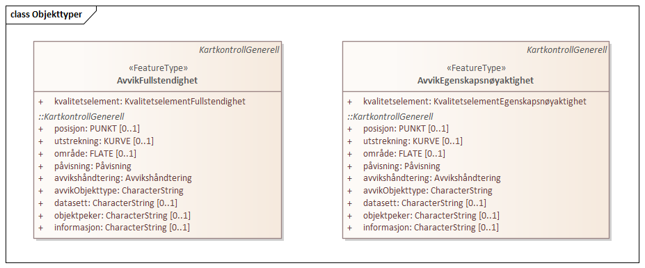

=== Kartkontroll 1.0 utkast
Definisjon: Datamodell for tilbakemelding p&#229; avvik funnet ved kontroll av kartdata i Geovekst kartleggingsprosjekter
 
===== Tagged Values
[cols="20,80"]
|===
|SOSI_modellstatus
|utkastOgSkjult
 
|===
[caption="Figur 1: ",title=Hoveddiagram]
image::figurer/Hoveddiagram.png[Hoveddiagram]
[caption="Figur 2: ",title=Objekttyper]

 
==== «FeatureType» KartkontrollGenerell
Definisjon: 
 
===== Tagged Values
[cols="20,80"]
|===
|===
===== Egenskaper
[cols="20,80"]
|===
|*Navn:* 
|*posisjon*
 
|Definisjon: 
|
 
|Multiplisitet: 
|[0..1]
 
|Type: 
|PUNKT
|===
[cols="20,80"]
|===
|*Navn:* 
|*utstrekning*
 
|Definisjon: 
|
 
|Multiplisitet: 
|[0..1]
 
|Type: 
|KURVE
|===
[cols="20,80"]
|===
|*Navn:* 
|*område*
 
|Definisjon: 
|
 
|Multiplisitet: 
|[0..1]
 
|Type: 
|FLATE
|===
[cols="20,80"]
|===
|*Navn:* 
|*påvisning*
 
|Definisjon: 
|vurdering av hvor sikkert avviket er p&#229;vist
 
|Multiplisitet: 
|[1..1]
 
|Type: 
|Påvisning
|Tagged Values: 
|
SOSI_navn: PÅVISNING + 
|===
[cols="20,80"]
|===
|*Navn:* 
|*avvikshåndtering*
 
|Definisjon: 
|hvordan avviket skal h&#229;ndteres. Det vil i de fleste tilfeller si hvem som har ansvar for &#229; retter avviket.
 
|Multiplisitet: 
|[1..1]
 
|Type: 
|Avvikshåndtering
|Tagged Values: 
|
SOSI_navn: AVVIKSHÅNDTERING + 
|===
[cols="20,80"]
|===
|*Navn:* 
|*avvikObjekttype*
 
|Definisjon: 
|hvilken objekttype avviket gjelder. For veglenke eller andre typer generelle objekttyper brukes i stedet typeveg (eller ev. annen egenskap som beskriver objektet) som beskrivelse.
 
|Multiplisitet: 
|[1..1]
 
|Type: 
|CharacterString
|Tagged Values: 
|
SOSI_navn: AVVIK_OBJEKTTYPE + 
|===
[cols="20,80"]
|===
|*Navn:* 
|*datasett*
 
|Definisjon: 
|hvilket datasett avviket gjelder
 
|Multiplisitet: 
|[0..1]
 
|Type: 
|CharacterString
|Tagged Values: 
|
SOSI_navn: DATASETT + 
|===
[cols="20,80"]
|===
|*Navn:* 
|*objektpeker*
 
|Definisjon: 
|referanse til hvilket objekt avviket gjelder der dette er mulig/hensiktsmessig &#229; angi. Bruk lokalid eller ev. annen identifikasjon som identifiserer objektet unikt.
 
|Multiplisitet: 
|[0..1]
 
|Type: 
|CharacterString
|Tagged Values: 
|
SOSI_navn: OBJEKTPEKER + 
|===
[cols="20,80"]
|===
|*Navn:* 
|*informasjon*
 
|Definisjon: 
|ekstra beskrivende eller forklarende tekst til avviket
 
|Multiplisitet: 
|[0..1]
 
|Type: 
|CharacterString
|Tagged Values: 
|
SOSI_navn: INFORMASJON + 
|===
===== Roller
[cols="20,80"]
|===
|Generalisering av:
|«FeatureType» AvvikEgenskapsnøyaktighet +
«FeatureType» AvvikFullstendighet
|===
 
==== «FeatureType» AvvikEgenskapsnøyaktighet
Definisjon: 
 
*Supertype:* «FeatureType» KartkontrollGenerell
 
===== Tagged Values
[cols="20,80"]
|===
|===
===== Egenskaper
[cols="20,80"]
|===
|*Navn:* 
|*kvalitetselement*
 
|Definisjon: 
|
 
|Multiplisitet: 
|[1..1]
 
|Type: 
|KvalitetselementEgenskapsnøyaktighet
|===
 
==== «FeatureType» AvvikFullstendighet
Definisjon: 
 
*Supertype:* «FeatureType» KartkontrollGenerell
 
===== Tagged Values
[cols="20,80"]
|===
|===
===== Egenskaper
[cols="20,80"]
|===
|*Navn:* 
|*kvalitetselement*
 
|Definisjon: 
|
 
|Multiplisitet: 
|[1..1]
 
|Type: 
|KvalitetselementFullstendighet
|===
 
==== «CodeList» Avvikshåndtering
Definisjon: 
 
===== Tagged Values
[cols="20,80"]
|===
|asDictionary
|true
 
|codeList
|https://register.test.geonorge.no/sosi-kodelister/fkb/kartkontroll/avviksh%C3%A5ndtering
 
|SOSI_datatype
|T
 
|SOSI_navn
|AVVIKSHÅNDTERING
 
|===
 
==== «CodeList» Påvisning
Definisjon: 
 
===== Tagged Values
[cols="20,80"]
|===
|asDictionary
|true
 
|codeList
|https://register.test.geonorge.no/sosi-kodelister/fkb/kartkontroll/p%C3%A5visning
 
|SOSI_datatype
|T
 
|SOSI_navn
|PÅVISNING
 
|===
 
==== «CodeList» KvalitetselementEgenskapsnøyaktighet
Definisjon: 
 
===== Tagged Values
[cols="20,80"]
|===
|asDictionary
|true
 
|codeList
|https://register.test.geonorge.no/sosi-kodelister/fkb/kartkontroll/kvalitetetselementegenskapsn%C3%B8yaktighet
 
|SOSI_datatype
|T
 
|SOSI_navn
|EGENSKAPSNØYAKTIGHET
 
|===
 
==== «CodeList» KvalitetselementFullstendighet
Definisjon: 
 
===== Tagged Values
[cols="20,80"]
|===
|asDictionary
|true
 
|codeList
|https://register.test.geonorge.no/sosi-kodelister/fkb/kartkontroll/kvalitetselementfullstendighet
 
|SOSI_datatype
|T
 
|SOSI_navn
|FULLSTENDIGHET
 
|===
