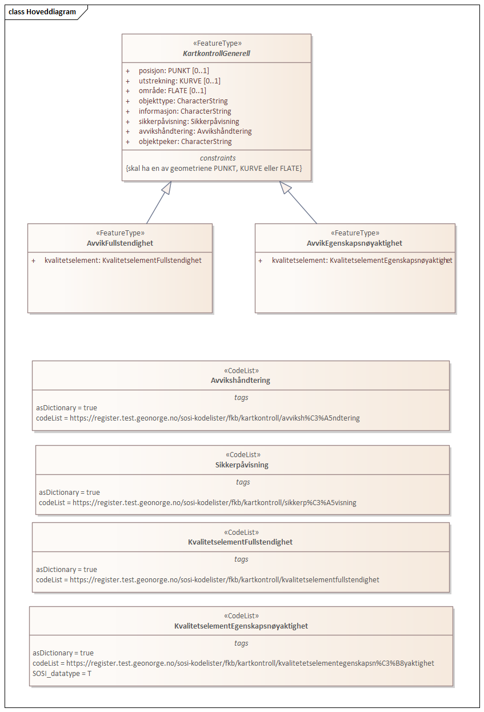

=== Kartkontroll 1.0 utkast
Definisjon: Datamodell for tilbakemelding p&#229; avvik funnet ved kontroll av kartdata i Geovekst kartleggingsprosjekter
 
===== Tagged Values
[cols="20,80"]
|===
|SOSI_modellstatus
|utkastOgSkjult
 
|===
[caption="Figur 1: ",title=Hoveddiagram]

 
==== «FeatureType» KartkontrollGenerell
Definisjon: 
 
===== Tagged Values
[cols="20,80"]
|===
|===
===== Egenskaper
[cols="20,80"]
|===
|*Navn:* 
|*posisjon*
 
|Definisjon: 
|
 
|Multiplisitet: 
|[0..1]
 
|Type: 
|PUNKT
|===
[cols="20,80"]
|===
|*Navn:* 
|*utstrekning*
 
|Definisjon: 
|
 
|Multiplisitet: 
|[0..1]
 
|Type: 
|KURVE
|===
[cols="20,80"]
|===
|*Navn:* 
|*område*
 
|Definisjon: 
|
 
|Multiplisitet: 
|[0..1]
 
|Type: 
|FLATE
|===
[cols="20,80"]
|===
|*Navn:* 
|*objekttype*
 
|Definisjon: 
|
 
|Multiplisitet: 
|[1..1]
 
|Type: 
|CharacterString
|===
[cols="20,80"]
|===
|*Navn:* 
|*informasjon*
 
|Definisjon: 
|
 
|Multiplisitet: 
|[1..1]
 
|Type: 
|CharacterString
|===
[cols="20,80"]
|===
|*Navn:* 
|*sikkerpåvisning*
 
|Definisjon: 
|
 
|Multiplisitet: 
|[1..1]
 
|Type: 
|Sikkerpåvisning
|===
[cols="20,80"]
|===
|*Navn:* 
|*avvikshåndtering*
 
|Definisjon: 
|
 
|Multiplisitet: 
|[1..1]
 
|Type: 
|Avvikshåndtering
|===
[cols="20,80"]
|===
|*Navn:* 
|*objektpeker*
 
|Definisjon: 
|
 
|Multiplisitet: 
|[0..1]
 
|Type: 
|CharacterString
|===
===== Roller
[cols="20,80"]
|===
|Generalisering av:
|«FeatureType» AvvikFullstendighet +
«FeatureType» AvvikEgenskapsnøyaktighet
|===
 
==== «FeatureType» AvvikEgenskapsnøyaktighet
Definisjon: 
 
*Supertype:* «FeatureType» KartkontrollGenerell
 
===== Tagged Values
[cols="20,80"]
|===
|===
===== Egenskaper
[cols="20,80"]
|===
|*Navn:* 
|*kvalitetselement*
 
|Definisjon: 
|
 
|Multiplisitet: 
|[1..1]
 
|Type: 
|KvalitetselementEgenskapsnøyaktighet
|===
 
==== «FeatureType» AvvikFullstendighet
Definisjon: 
 
*Supertype:* «FeatureType» KartkontrollGenerell
 
===== Tagged Values
[cols="20,80"]
|===
|===
===== Egenskaper
[cols="20,80"]
|===
|*Navn:* 
|*kvalitetselement*
 
|Definisjon: 
|
 
|Multiplisitet: 
|[1..1]
 
|Type: 
|KvalitetselementFullstendighet
|===
 
==== «CodeList» Avvikshåndtering
Definisjon: 
 
===== Tagged Values
[cols="20,80"]
|===
|asDictionary
|true
 
|codeList
|https://register.test.geonorge.no/sosi-kodelister/fkb/kartkontroll/avviksh%C3%A5ndtering
 
|===
 
==== «CodeList» Sikkerpåvisning
Definisjon: 
 
===== Tagged Values
[cols="20,80"]
|===
|asDictionary
|true
 
|codeList
|https://register.test.geonorge.no/sosi-kodelister/fkb/kartkontroll/sikkerp%C3%A5visning
 
|===
 
==== «CodeList» KvalitetselementEgenskapsnøyaktighet
Definisjon: 
 
===== Tagged Values
[cols="20,80"]
|===
|asDictionary
|true
 
|codeList
|https://register.test.geonorge.no/sosi-kodelister/fkb/kartkontroll/kvalitetetselementegenskapsn%C3%B8yaktighet
 
|SOSI_datatype
|T
 
|===
 
==== «CodeList» KvalitetselementFullstendighet
Definisjon: 
 
===== Tagged Values
[cols="20,80"]
|===
|asDictionary
|true
 
|codeList
|https://register.test.geonorge.no/sosi-kodelister/fkb/kartkontroll/kvalitetselementfullstendighet
 
|===
