=== «ApplicationSchema» FKB-Ledning-5.0-Utkast
Definisjon: Spesifikasjonen gjelder for ledningsdata innenfor elektrisitet, elektrisk kommunikasjon, belysningsanlegg og ledningsanlegg tilknyttet bane. Det er kun objekter som er synlig i terrenget (ligger over bakkeniv&#229;) som inng&#229;r i produktspesifikasjonen. Produktspesifikasjonen er tenkt benyttet ved datafangst av ledningsobjekter.

FKB-Ledning versjon 5.0 baserer seg p&#229; generelle konsepter definert i SOSI del 1 versjon 4.5 og SOSI del 2 Ledning versjon 4.6.
 
===== Tagged Values
[cols="20,80"]
|===
|definition
|"FKB-Ledning 5.0 Draft"@en
 
|description
|FKB-Ledning 5.0
 
|designation
|"Product specification FKB-Ledning 5.0"@en
 
|language
|no
 
|SOSI_kortnavn
|FKB-Ledning
 
|SOSI_langnavn
|FKB-Ledning
 
|SOSI_modellstatus
|utkastOgSkjult
 
|SOSI_spesifikasjonstype
|prodspesifikasjon
 
|SOSI_versjon
|5.1
 
|targetNamespace
|http://skjema.geonorge.no/SOSITEST/produktspesifikasjon/FKB-Ledning/5.0/
 
|version
|5.0
 
|xmlns
|ledning
 
|xsdDocument
|fkbledning50utkast.xsd
 
|xsdEncodingRule
|sosi
 
|===
[caption="Figur 1: ",title=Hoveddiagram FKB-Ledning 5.0]
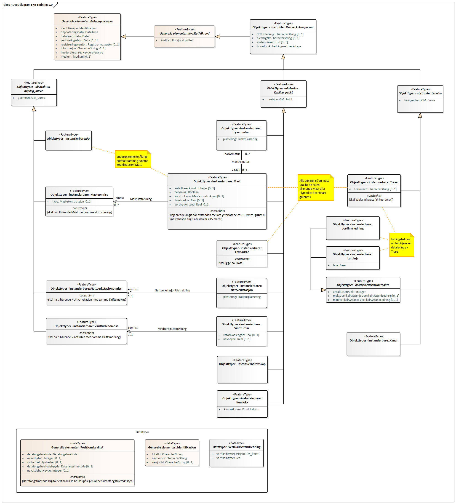
[caption="Figur 2: ",title=Pakkerealisering FKB-Ledning 5.0]
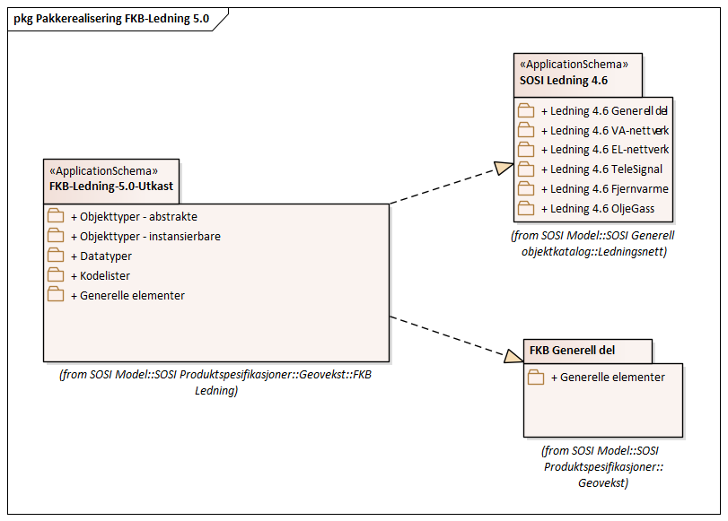
=== Pakke: Objekttyper - abstrakte
Definisjon: Ikke realiserbare objekttyper. Objekttypene benyttes kun som konteinerobjekter for egenskaper som benyttes av et eller flere subtyper.
[caption="Figur 3: ",title=Objekttyper - abstrakte]
image::figurer/Objekttyper - abstrakte.png[Objekttyper - abstrakte]
[caption="Figur 4: ",title=Realiseringer objekttyper - abstrakte]
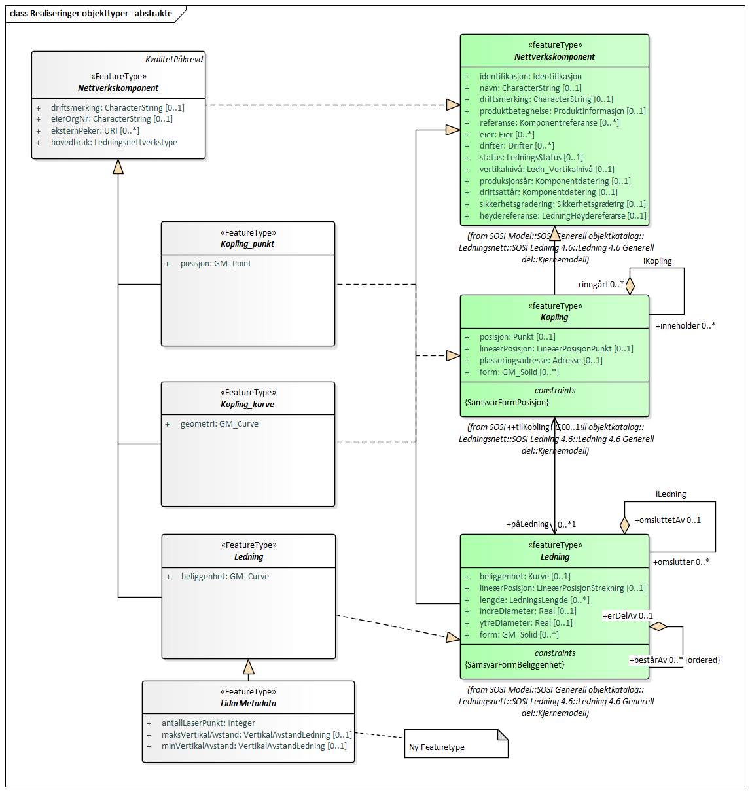
 
==== «FeatureType» Kopling_kurve
Definisjon: generell betegnelse på objekt som er node (punkt) i et ledningsnettverk
 
*Supertype:* «FeatureType» Nettverkskomponent
 
*Realisering av:* «ApplicationSchema» SOSI Ledning 4.6/Ledning 4.6 Generell del/Kjernemodell::«featureType» Kopling
 
===== Egenskaper
[cols="20,80"]
|===
|*Navn:* 
|*geometri*
 
|Definisjon: 
|beskriver koplingens geografiske beliggenhet i form av en kurve med koordinater
 
|Multiplisitet: 
|[1..1]
 
|Type: 
|GM_Curve
|Tagged Values: 
|
SOSI_geometri: Kurve + 
|===
[cols="20,80"]
|===
|*Subtyper:*
|«FeatureType» Masteomriss +
«FeatureType» Vindturbinomriss +
«FeatureType» Nettverkstasjonomriss +
«FeatureType» Åk
|===
 
==== «FeatureType» Kopling_punkt
Definisjon: generell betegnelse på objekt som er node (punkt) i et ledningsnettverk
 
*Supertype:* «FeatureType» Nettverkskomponent
 
*Realisering av:* «ApplicationSchema» SOSI Ledning 4.5/Kjernemodell::«featureType» Kopling
 
*Realisering av:* «ApplicationSchema» SOSI Ledning 4.6/Ledning 4.6 Generell del/Kjernemodell::«featureType» Kopling
 
===== Egenskaper
[cols="20,80"]
|===
|*Navn:* 
|*posisjon*
 
|Definisjon: 
|beskriver koplingens geografiske beliggenhet i form av koordinatene til et punkt
 
|Multiplisitet: 
|[1..1]
 
|Type: 
|GM_Point
|Tagged Values: 
|
SOSI_geometri: Punkt + 
|===
[cols="20,80"]
|===
|*Subtyper:*
|«FeatureType» Vindturbin +
«FeatureType» Kumlokk +
«FeatureType» Nettverkstasjon +
«FeatureType» Flymarkør +
«FeatureType» Lysarmatur +
«FeatureType» Mast +
«FeatureType» Skap
|===
 
==== «FeatureType» Ledning
Definisjon: generell betegnelse for langsgående objekt i et ledningsnettverk
 
*Supertype:* «FeatureType» Nettverkskomponent
 
*Realisering av:* «ApplicationSchema» SOSI Ledning 4.6/Ledning 4.6 Generell del/Kjernemodell::«featureType» Ledning
 
*Realisering av:* «ApplicationSchema» SOSI Ledning 4.5/Kjernemodell::«featureType» Ledning
 
===== Egenskaper
[cols="20,80"]
|===
|*Navn:* 
|*beliggenhet*
 
|Definisjon: 
|beskriver ledningens geografiske beliggenhet i form av en kurve med koordinater
 
|Multiplisitet: 
|[1..1]
 
|Type: 
|GM_Curve
|Tagged Values: 
|
SOSI_geometri: Kurve + 
|===
[cols="20,80"]
|===
|*Subtyper:*
|«FeatureType» LidarMetadata +
«FeatureType» Kanal +
«FeatureType» Trase
|===
 
==== «FeatureType» LidarMetadata
Definisjon: informasjon om punkskyen som ligger til grunn for klassifisering og vektorisering
 
*Supertype:* «FeatureType» Ledning
 
===== Egenskaper
[cols="20,80"]
|===
|*Navn:* 
|*antallLaserPunkt*
 
|Definisjon: 
|antallet klassifiserte laserpunkt som er med p&#229; &#229; bestemme vektorisert objekt
 
|Multiplisitet: 
|[1..1]
 
|Type: 
|Integer
|Tagged Values: 
|
SOSI_datatype: H + 
SOSI_lengde: 5 + 
SOSI_navn: ANTALL_LASERPUNKT + 
|===
[cols="20,80"]
|===
|*Navn:* 
|*maksVertikalAvstand*
 
|Definisjon: 
|luftspennets maksimale vertikalutstrekning over terrenget (bakke, vann, sj&#248;, mv.)
 
|Multiplisitet: 
|[0..1]
 
|Type: 
|VertikalAvstandLedning
|Tagged Values: 
|
SOSI_navn: MAKS_VERTIKALUTSTREKNING + 
|===
[cols="20,80"]
|===
|*Navn:* 
|*minVertikalAvstand*
 
|Definisjon: 
|luftspennets laveste vertikalutstrekning over terrenget (bakke, vann, sj&#248;, mv.)
 
|Multiplisitet: 
|[0..1]
 
|Type: 
|VertikalAvstandLedning
|Tagged Values: 
|
SOSI_navn: MIN_VERTIKALUTSTREKNING + 
|===
[cols="20,80"]
|===
|*Subtyper:*
|«FeatureType» Jordingsledning +
«FeatureType» Luftlinje
|===
 
==== «FeatureType» Nettverkskomponent
Definisjon: konteiner objekt med fellesegenskaper for alle ledningsobjekter
 
*Supertype:* «FeatureType» KvalitetPåkrevd
 
*Realisering av:* «ApplicationSchema» SOSI Ledning 4.6/Ledning 4.6 Generell del/Kjernemodell::«featureType» Nettverkskomponent
 
*Realisering av:* «ApplicationSchema» SOSI Ledning 4.5/Kjernemodell::«featureType» Nettverkskomponent
 
===== Egenskaper
[cols="20,80"]
|===
|*Navn:* 
|*driftsmerking*
 
|Definisjon: 
|unik ID for den fysiske nettverkskomponenten

Merknad: 
Vil kunne brukes til &#229; knytte sammen informasjon om samme komponenten forvaltet i ulike databaser.
 
|Multiplisitet: 
|[0..1]
 
|Type: 
|CharacterString
|Tagged Values: 
|
SOSI_datatype: T + 
SOSI_lengde: 50 + 
SOSI_navn: DRIFTSMERKING + 
SOSI_primærnøkkel: True + 
|===
[cols="20,80"]
|===
|*Navn:* 
|*eierOrgNr*
 
|Definisjon: 
|organisasjonsnummer (9 siffer uten mellomrom) til eier av objektet. Organisasjonsnummeret skal v&#230;re registrert i Br&#248;nn&#248;ysundregisteret

Eksempel: 971032081

Merknad FKB:
I noen f&#229; tilfeller kan det v&#230;re delt eierskap av et objekt i marka, typisk en mast. I disse tilfellene registreres det ett objekt pr. eier. Dette medf&#248;rer at ett fysisk objekt i marka, med delt eierskap, representeres flere ganger. Hvert enkelt objekt kan kun registreres med en eier.
 
|Multiplisitet: 
|[0..1]
 
|Type: 
|CharacterString
|Tagged Values: 
|
SOSI_datatype: T + 
SOSI_lengde: 9 + 
SOSI_navn: EIERORGNR + 
|===
[cols="20,80"]
|===
|*Navn:* 
|*eksternPeker*
 
|Definisjon: 
|peker til et eksternt system hvor det samme objektet er registrert
 
|Multiplisitet: 
|[0..*]
 
|Type: 
|URI
|Tagged Values: 
|
SOSI_datatype: T + 
SOSI_lengde: 255 + 
SOSI_navn: EKSTERNPEKER + 
|===
[cols="20,80"]
|===
|*Navn:* 
|*hovedbruk*
 
|Definisjon: 
|hovedbruken for objektet
 
|Multiplisitet: 
|[1..1]
 
|Type: 
|Ledningsnettverkstype
|Tagged Values: 
|
defaultCodeSpace: https://register.geonorge.no/sosi-kodelister/fkb/ledning/5.0/ledningsnettverkstype + 
SOSI_datatype: T + 
SOSI_lengde: 32 + 
SOSI_navn: LEDNINGSNETTVERKSTYPE + 
|===
[cols="20,80"]
|===
|*Subtyper:*
|«FeatureType» Kopling_punkt +
«FeatureType» Ledning +
«FeatureType» Kopling_kurve
|===
=== Pakke: Objekttyper - instansierbare
Definisjon: Instansierbare objekttyper. Objekttypene kan benyttes som objekttyper i forbindelse med datautveksling. Objekttypene arver gjerne en eller flere egenskaper fra ett eller flere abstrakte supertyper, men kan ogs&#229; inneholde egenskaper som kun er relevante for den aktuelle objekttypen.
[caption="Figur 5: ",title=Instansierbare objekttyper]
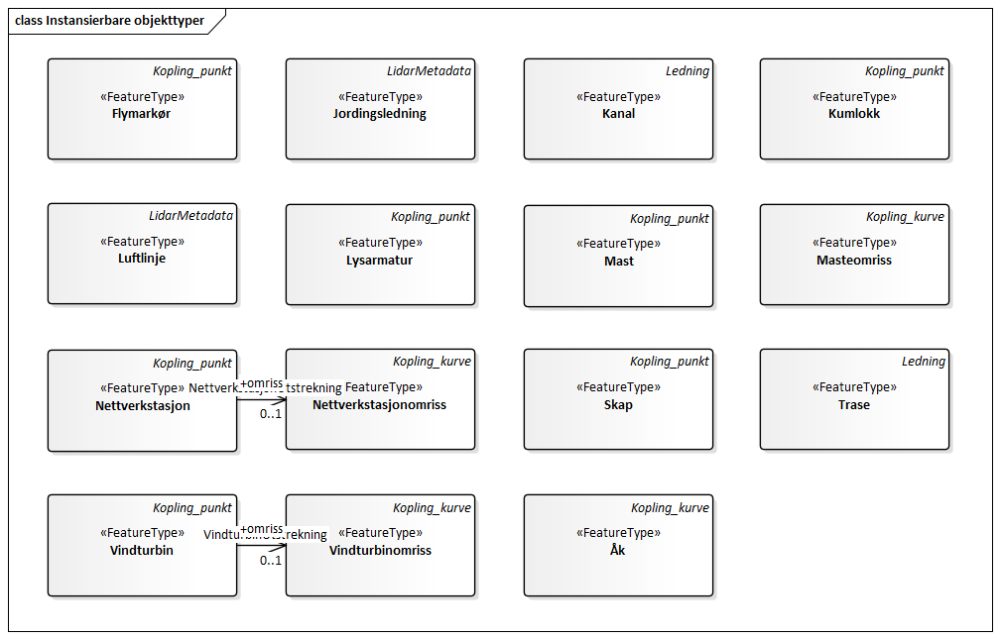
[caption="Figur 6: ",title=Flymarkør - alle egenskaper og realisering]
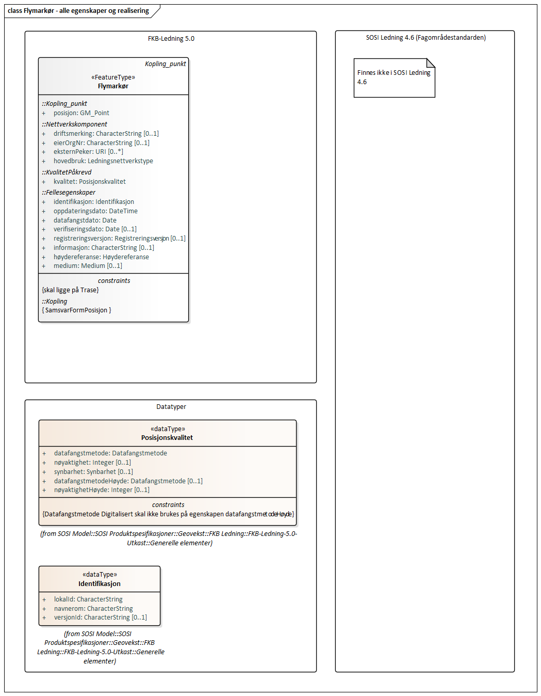
[caption="Figur 7: ",title=Jordingsledning - alle egenskaper og realisering]
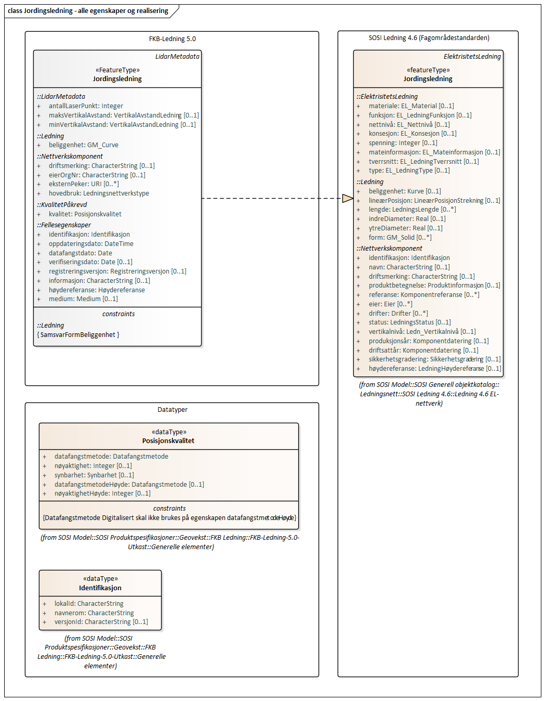
[caption="Figur 8: ",title=Kanal - alle egenskaper og realisering]
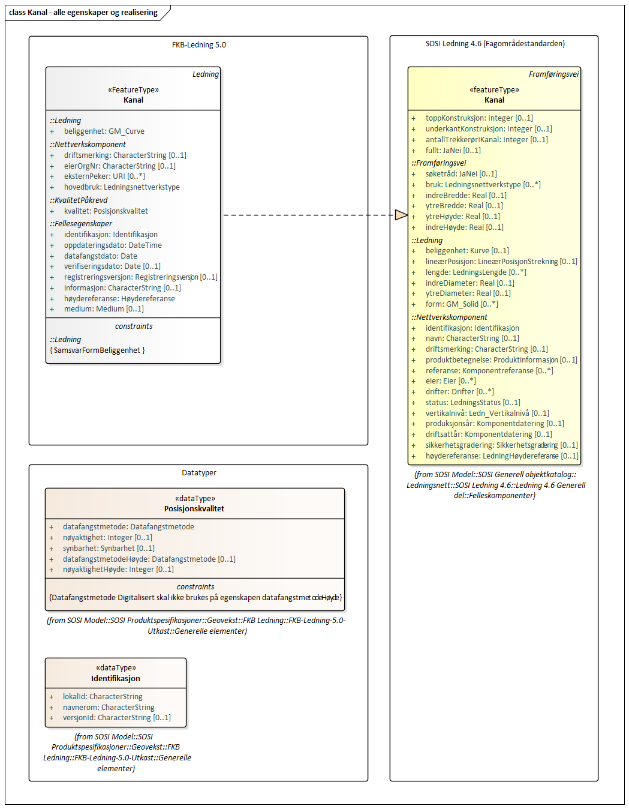
[caption="Figur 9: ",title=Kumlokk - alle egenskaper og realisering]
image::figurer/Kumlokk - alle egenskaper og realisering.png[Kumlokk - alle egenskaper og realisering]
[caption="Figur 10: ",title=Luftlinje - alle egenskaper og realisering]
image::figurer/Luftlinje - alle egenskaper og realisering.png[Luftlinje - alle egenskaper og realisering]
[caption="Figur 11: ",title=Lysarmatur - alle egenskaper og realisering]
image::figurer/Lysarmatur - alle egenskaper og realisering.png[Lysarmatur - alle egenskaper og realisering]
[caption="Figur 12: ",title=Mast og Masteomriss - alle egenskaper og realisering]
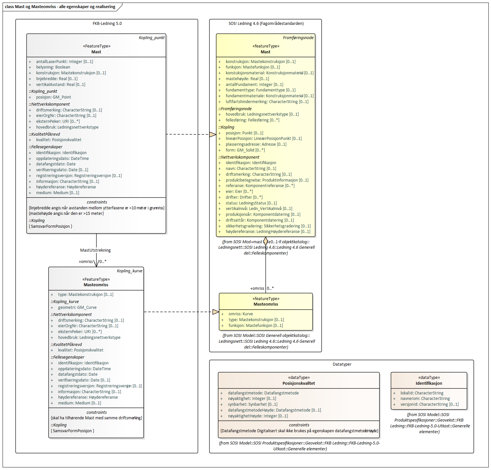
[caption="Figur 13: ",title=Nettverkstasjon og Nettverkstasjonomriss - alle egenskaper og realisering]
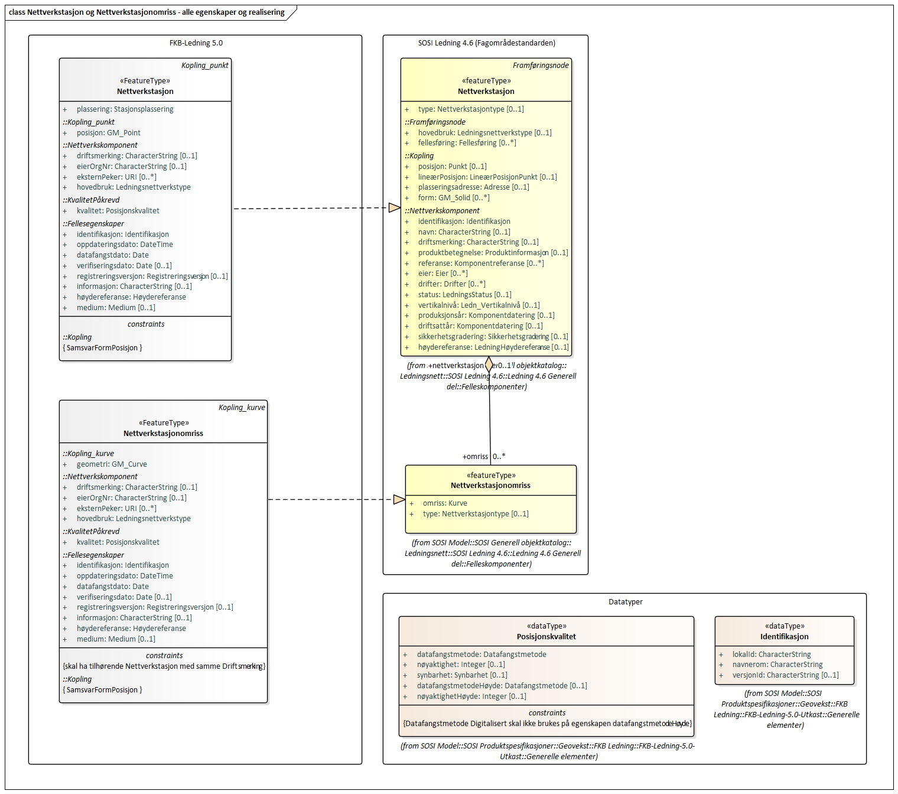
[caption="Figur 14: ",title=Skap - alle egenskaper og realisering]
image::figurer/Skap - alle egenskaper og realisering.png[Skap - alle egenskaper og realisering]
[caption="Figur 15: ",title=Trase - alle egenskaper og realisering]
image::figurer/Trase - alle egenskaper og realisering.png[Trase - alle egenskaper og realisering]
[caption="Figur 16: ",title=Vindturbin og Vindturbinomriss - alle egenskaper og realisering]
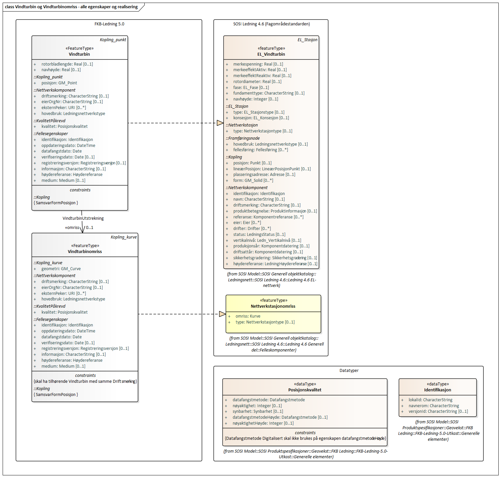
[caption="Figur 17: ",title=Åk - alle egenskaper og realisering]
image::figurer/Åk - alle egenskaper og realisering.png[Åk - alle egenskaper og realisering]
 
==== «FeatureType» Flymarkør
Definisjon: markering av store luftspenn over daler og fjorder
 
*Supertype:* «FeatureType» Kopling_punkt
 
[caption="Figur 18: Eksempel på ",title=Flymarkør]
image::http://skjema.geonorge.no/SOSITEST/produktspesifikasjon/FKB-Ledning/5.0/figurer/Flymarkor.jpg[http://skjema.geonorge.no/SOSITEST/produktspesifikasjon/FKB-Ledning/5.0/figurer/Flymarkor.jpg]
 
==== «FeatureType» Jordingsledning
Definisjon: ledning hvor form&#229;let er &#229; lede farlige overspenninger til jord. ledningen er under normale forhold ikke str&#248;mf&#248;rende
 
*Supertype:* «FeatureType» LidarMetadata
 
*Realisering av:* «ApplicationSchema» SOSI Ledning 4.6/Ledning 4.6 EL-nettverk::«featureType» Jordingsledning
 
 
==== «FeatureType» Kanal
Definisjon: brukes som fremf&#248;ringsvei for ledning
 
*Supertype:* «FeatureType» Ledning
 
*Realisering av:* «ApplicationSchema» SOSI Ledning 4.6/Ledning 4.6 Generell del/Felleskomponenter::«featureType» Kanal
 
[caption="Figur 19: Eksempel på ",title=Kanal]
image::http://skjema.geonorge.no/SOSITEST/produktspesifikasjon/FKB-Ledning/5.0/figurer/Kanal.jpg[http://skjema.geonorge.no/SOSITEST/produktspesifikasjon/FKB-Ledning/5.0/figurer/Kanal.jpg]
 
==== «FeatureType» Kumlokk
Definisjon: et deksel over en kum eller annet hulrom under bakkeniv&#229;
 
*Supertype:* «FeatureType» Kopling_punkt
 
*Realisering av:* «ApplicationSchema» SOSI Ledning 4.6/Ledning 4.6 Generell del/Felleskomponenter::«featureType» Kumlokk
 
[caption="Figur 20: Eksempel på ",title=Kumlokk]
image::http://skjema.geonorge.no/SOSITEST/produktspesifikasjon/FKB-Ledning/5.0/figurer/Kumlokk.jpg[http://skjema.geonorge.no/SOSITEST/produktspesifikasjon/FKB-Ledning/5.0/figurer/Kumlokk.jpg]
===== Egenskaper
[cols="20,80"]
|===
|*Navn:* 
|*kumlokkform*
 
|Definisjon: 
|kumlokkets geometriske utforming
 
|Multiplisitet: 
|[1..1]
 
|Type: 
|Kumlokkform
|Tagged Values: 
|
defaultCodeSpace: https://register.geonorge.no/sosi-kodelister/fkb/ledning/5.0/kumlokkform + 
SOSI_datatype: T + 
SOSI_lengde: 20 + 
SOSI_navn: KUMLOKKFORM + 
|===
 
==== «FeatureType» Luftlinje
Definisjon: en enkelt vaier/kabel mellom to faste forankringspunkt
 
*Supertype:* «FeatureType» LidarMetadata
 
*Realisering av:* «ApplicationSchema» SOSI Ledning 4.6/Ledning 4.6 EL-nettverk::«featureType» EL_Luftlinje
 
===== Egenskaper
[cols="20,80"]
|===
|*Navn:* 
|*fase*
 
|Definisjon: 
|angivelse av intern plassering i grunnris for aktuell faseline
 
|Multiplisitet: 
|[1..1]
 
|Type: 
|Fase
|Tagged Values: 
|
defaultCodeSpace: https://register.geonorge.no/sosi-kodelister/fkb/ledning/5.0/fase + 
SOSI_datatype: T + 
SOSI_lengde: 10 + 
SOSI_navn: FASE + 
|===
 
==== «FeatureType» Lysarmatur
Definisjon: selve det elektriske punktet som gir lys
 
*Supertype:* «FeatureType» Kopling_punkt
 
*Realisering av:* «ApplicationSchema» SOSI Ledning 4.6/Ledning 4.6 EL-nettverk::«featureType» EL_Armatur
 
[caption="Figur 21: Eksempel på ",title=Lysarmatur]
image::http://skjema.geonorge.no/SOSITEST/produktspesifikasjon/FKB-Ledning/5.0/figurer/Lysarmatur.jpg[http://skjema.geonorge.no/SOSITEST/produktspesifikasjon/FKB-Ledning/5.0/figurer/Lysarmatur.jpg]
===== Egenskaper
[cols="20,80"]
|===
|*Navn:* 
|*plassering*
 
|Definisjon: 
|angivelse av hvor lysarmaturet er plassert
 
|Multiplisitet: 
|[1..1]
 
|Type: 
|Punktplassering
|Tagged Values: 
|
defaultCodeSpace: https://register.geonorge.no/sosi-kodelister/fkb/ledning/5.0/punktplassering + 
SOSI_navn: BELYSNINGSPLASSERING + 
|===
===== Roller
[cols="20,80"]
|===
|*Rollenavn:* 
|*iMast*
 
|Definisjon: 
|referanse til masten hvor armaturet evt. er montert
 
|Multiplisitet: 
|[0..1]
 
|Til klasse:
|«FeatureType» Mast
|===
 
==== «FeatureType» Mast
Definisjon: alle konstruksjoner laget for &#229; holde ledningsnett/komponent oppe fra bakken. Dette betyr at det ogs&#229; inkluderer det som i noen sammenhenger kalles Stolpe
 
*Supertype:* «FeatureType» Kopling_punkt
 
*Realisering av:* «ApplicationSchema» SOSI Ledning 4.6/Ledning 4.6 Generell del/Felleskomponenter::«featureType» Mast
 
[caption="Figur 22: Eksempel på ",title=Mast]
image::http://skjema.geonorge.no/SOSITEST/produktspesifikasjon/FKB-Ledning/5.0/figurer/Mast.jpg[http://skjema.geonorge.no/SOSITEST/produktspesifikasjon/FKB-Ledning/5.0/figurer/Mast.jpg]
===== Egenskaper
[cols="20,80"]
|===
|*Navn:* 
|*antallLaserPunkt*
 
|Definisjon: 
|antallet klassifiserte laserpunkt som er med p&#229; &#229; bestemme vektorisert objekt

Merknad FKB:
Angis kun dersom mastens geometri har laser som datafangstmetode.
 
|Multiplisitet: 
|[0..1]
 
|Type: 
|Integer
|Tagged Values: 
|
SOSI_datatype: H + 
SOSI_lengde: 5 + 
SOSI_navn: ANTALL_LASERPUNKT + 
|===
[cols="20,80"]
|===
|*Navn:* 
|*belysning*
 
|Definisjon: 
|angir om det er montert ett eller flere flere lysarmaturer i masta
 
|Multiplisitet: 
|[1..1]
 
|Type: 
|Boolean
|Tagged Values: 
|
SOSI_datatype: BOOLSK + 
SOSI_navn: BELYSNING + 
|===
[cols="20,80"]
|===
|*Navn:* 
|*konstruksjon*
 
|Definisjon: 
|hvordan masta er konstruert
 
|Multiplisitet: 
|[0..1]
 
|Type: 
|Mastekonstruksjon
|Tagged Values: 
|
defaultCodeSpace: https://register.geonorge.no/sosi-kodelister/fkb/ledning/5.0/mastekonstruksjon + 
SOSI_datatype: H + 
SOSI_lengde: 2 + 
SOSI_navn: MASTEKONSTRUKSJON + 
|===
[cols="20,80"]
|===
|*Navn:* 
|*linjebredde*
 
|Definisjon: 
|st&#248;rste avstanden mellom ytterfasene (ledningene) i ei mast

Enhet: meter
 
|Multiplisitet: 
|[0..1]
 
|Type: 
|Real
|Tagged Values: 
|
SOSI_datatype: D + 
SOSI_lengde: 6.2 + 
SOSI_navn: LINJEBREDDE + 
|===
[cols="20,80"]
|===
|*Navn:* 
|*vertikalAvstand*
 
|Definisjon: 
|mastens maksimale vertikale h&#248;yde over under-/omkringliggende terreng eller vannoverflate

Enhet: meter
 
|Multiplisitet: 
|[0..1]
 
|Type: 
|Real
|Tagged Values: 
|
SOSI_datatype: D + 
SOSI_lengde: 6.2 + 
SOSI_navn: VERTIKALAVSTAND + 
|===
===== Roller
[cols="20,80"]
|===
|*Rollenavn:* 
|*harArmatur*
 
|Definisjon:
|referanse til de armaturer som evt. er montert i masta
 
|Multiplisitet: 
|[0..*]
 
|Til klasse:
|«FeatureType» Lysarmatur
|===
[cols="20,80"]
|===
|*Rollenavn:* 
|*omriss*
 
|Definisjon:
|omrisset til mast
 
|Multiplisitet: 
|[0..*]
 
|Til klasse
|«FeatureType» Masteomriss
|===
 
==== «FeatureType» Masteomriss
Definisjon: ytre avgrensning av mastens fotavtrykk p&#229; bakken

Merknad FKB:
F&#248;rst og fremst aktuelt for fotogrammetrisk kartlegging
 
*Supertype:* «FeatureType» Kopling_kurve
 
*Realisering av:* «ApplicationSchema» SOSI Ledning 4.6/Ledning 4.6 Generell del/Felleskomponenter::«featureType» Masteomriss
 
===== Tagged Values
[cols="20,80"]
|===
|SOSI_geometri
|KURVE;
 
|===
===== Egenskaper
[cols="20,80"]
|===
|*Navn:* 
|*type*
 
|Definisjon: 
|type mast

Merknad: Brukes kun der omrisset ikke knyttes opp til en mast. Der mastomrisset "tilhører" ei mast, vil den angi masttypen "selv".
 
|Multiplisitet: 
|[0..1]
 
|Type: 
|Mastekonstruksjon
|Tagged Values: 
|
defaultCodeSpace: https://register.geonorge.no/sosi-kodelister/fkb/ledning/5.0/mastekonstruksjon + 
SOSI_navn: MASTEKONSTRUKSJON + 
|===
 
==== «FeatureType» Nettverkstasjon
Definisjon: et fysisk, gjerne bygningsmessig, objekt som inneholder komponenter som gjør en eller annen behandling av vann, elektrisk strøm, signal eller annet som det nettverket den er en del av fører. Komponenter som gjør behandlingen kan for eksempel være pumper for vann, transformatorer for elektrisk strøm, forsterkere for signal osv.
 
*Supertype:* «FeatureType» Kopling_punkt
 
*Realisering av:* «ApplicationSchema» SOSI Ledning 4.6/Ledning 4.6 Generell del/Felleskomponenter::«featureType» Nettverkstasjon
 
[caption="Figur 23: Eksempel på ",title=Nettverkstasjon]
image::http://skjema.geonorge.no/SOSITEST/produktspesifikasjon/FKB-Ledning/5.0/figurer/Nettverkstasjon.jpg[http://skjema.geonorge.no/SOSITEST/produktspesifikasjon/FKB-Ledning/5.0/figurer/Nettverkstasjon.jpg]
===== Egenskaper
[cols="20,80"]
|===
|*Navn:* 
|*plassering*
 
|Definisjon: 
|angir hvor nettverksstasjonen er plassert
 
|Multiplisitet: 
|[1..1]
 
|Type: 
|Stasjonsplassering
|Tagged Values: 
|
defaultCodeSpace: https://register.geonorge.no/sosi-kodelister/fkb/ledning/5.0/stasjonsplassering + 
SOSI_datatype: T + 
SOSI_lengde: 32 + 
SOSI_navn: STASJONSPLASSERING + 
|===
===== Roller
[cols="20,80"]
|===
|*Rollenavn:* 
|*omriss*
 
|Definisjon:
|omrisset til nettverkstasjon
 
|Multiplisitet: 
|[0..1]
 
|Til klasse
|«FeatureType» Nettverkstasjonomriss
|===
 
==== «FeatureType» Nettverkstasjonomriss
Definisjon: ytre avgrensning av nettverkstasjonen, i grunnriss
 
*Supertype:* «FeatureType» Kopling_kurve
 
*Realisering av:* «ApplicationSchema» SOSI Ledning 4.6/Ledning 4.6 Generell del/Felleskomponenter::«featureType» Nettverkstasjonomriss
 
 
==== «FeatureType» Skap
Definisjon: beskyttelseskasse plassert vanligvis p&#229; bakken, som inneholder koblinger for elektrisk str&#248;m, signal eller annet

Merknad:
Kan ogs&#229; v&#230;re p&#229; st&#248;rrelse med kiosk.
 
*Supertype:* «FeatureType» Kopling_punkt
 
*Realisering av:* «ApplicationSchema» SOSI Ledning 4.6/Ledning 4.6 Generell del/Felleskomponenter::«featureType» Skap
 
[caption="Figur 24: Eksempel på ",title=Skap]
image::http://skjema.geonorge.no/SOSITEST/produktspesifikasjon/FKB-Ledning/5.0/figurer/Skap.jpg[http://skjema.geonorge.no/SOSITEST/produktspesifikasjon/FKB-Ledning/5.0/figurer/Skap.jpg]
 
==== «FeatureType» Trase
Definisjon: den mest mulig geografisk riktige posisjonen for en framf&#248;ring av ledning(er)
 
*Supertype:* «FeatureType» Ledning
 
*Realisering av:* «ApplicationSchema» SOSI Ledning 4.6/Ledning 4.6 Generell del/Felleskomponenter::«featureType» Trase
 
[caption="Figur 25: Eksempel på ",title=Trase]
image::http://skjema.geonorge.no/SOSITEST/produktspesifikasjon/FKB-Ledning/5.0/figurer/Trase.jpg[http://skjema.geonorge.no/SOSITEST/produktspesifikasjon/FKB-Ledning/5.0/figurer/Trase.jpg]
===== Egenskaper
[cols="20,80"]
|===
|*Navn:* 
|*trasenavn*
 
|Definisjon: 
|navn p&#229; trasen 

Merknad FKB:
Dette er gjerne en tekstlig beskrivelse av tras&#233;ens plassering, for eksempel "fra stasjon til stasjon"
 
|Multiplisitet: 
|[0..1]
 
|Type: 
|CharacterString
|Tagged Values: 
|
SOSI_datatype: T + 
SOSI_lengde: 100 + 
SOSI_navn: TRASENAVN + 
|===
 
==== «FeatureType» Vindturbin
Definisjon: en kontainer som betegner en hel "vindm&#248;lle". En vindturbin har en generator
 
*Supertype:* «FeatureType» Kopling_punkt
 
*Realisering av:* «ApplicationSchema» SOSI Ledning 4.6/Ledning 4.6 EL-nettverk::«featureType» EL_Vindturbin
 
===== Tagged Values
[cols="20,80"]
|===
|SOSI_geometri
|PUNKT;
 
|===
[caption="Figur 26: Eksempel på ",title=Vindturbin]
image::http://skjema.geonorge.no/SOSITEST/produktspesifikasjon/FKB-Ledning/5.0/figurer/Vindturbin.jpg[http://skjema.geonorge.no/SOSITEST/produktspesifikasjon/FKB-Ledning/5.0/figurer/Vindturbin.jpg]
===== Egenskaper
[cols="20,80"]
|===
|*Navn:* 
|*rotorbladlengde*
 
|Definisjon: 
|lengde rotoblad

Enhet: meter
 
|Multiplisitet: 
|[0..1]
 
|Type: 
|Real
|Tagged Values: 
|
SOSI_datatype: D + 
SOSI_lengde: 3.2 + 
SOSI_navn: ROTORBLADLENGDE + 
|===
[cols="20,80"]
|===
|*Navn:* 
|*navhøyde*
 
|Definisjon: 
|vertikal avstand fra omkringliggende terreng eller vann og til topp vindturbint&#229;rn

Enhet: meter
 
|Multiplisitet: 
|[0..1]
 
|Type: 
|Real
|Tagged Values: 
|
SOSI_datatype: D + 
SOSI_lengde: 3.2 + 
SOSI_navn: NAVHØYDE + 
|===
===== Roller
[cols="20,80"]
|===
|*Rollenavn:* 
|*omriss*
 
|Definisjon:
|omrisset til vindturbinen
 
|Multiplisitet: 
|[0..1]
 
|Til klasse
|«FeatureType» Vindturbinomriss
|===
 
==== «FeatureType» Vindturbinomriss
Definisjon: ytre avgrensning av vindturbinens fotavtrykk p&#229; bakken

Merknad FKB:
F&#248;rst og fremst aktuelt for fotogrammetrisk kartlegging
 
*Supertype:* «FeatureType» Kopling_kurve
 
*Realisering av:* «ApplicationSchema» SOSI Ledning 4.6/Ledning 4.6 Generell del/Felleskomponenter::«featureType» Nettverkstasjonomriss
 
 
==== «FeatureType» Åk
Definisjon: en hovedsaklig liggende konstruksjon festet i (vanligvis) to master, ei p&#229; hver side av en veg eller bane

Merknad FKB:
"Beina" er egne objekter (objekttype Mast), og ikke del av objektet av objekttypen &#197;k.
 
*Supertype:* «FeatureType» Kopling_kurve
 
*Realisering av:* «ApplicationSchema» SOSI Ledning 4.6/Ledning 4.6 Generell del/Felleskomponenter::«featureType» Åk
 
[caption="Figur 27: Eksempel på ",title=Åk]
image::http://skjema.geonorge.no/SOSITEST/produktspesifikasjon/FKB-Ledning/5.0/figurer/Aak.jpg[http://skjema.geonorge.no/SOSITEST/produktspesifikasjon/FKB-Ledning/5.0/figurer/Aak.jpg]
=== Pakke: Datatyper
Definisjon: Alle Datatyper (gruppeegenskaper) som ikke er en del av de generelle FKB elementene, men som inng&#229;r i denne spesifikke FKB-datamodellen.
[caption="Figur 28: ",title=Fagspesifikke datatyper FKB-Ledning]
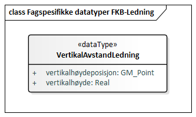
 
==== «dataType» VertikalAvstandLedning
Definisjon: ledningens h&#248;yde over/til terreng, vann eller sj&#248;
 
===== Tagged Values
[cols="20,80"]
|===
|SOSI_kompaktifisering
|Nei
 
|===
===== Egenskaper
[cols="20,80"]
|===
|*Navn:* 
|*vertikalhøydeposisjon*
 
|Definisjon: 
|posisjonen til stedet p&#229; objektets hvor vertikalh&#248;yden er angitt. Z-koordinaten angis i forhold til referansepunktet p&#229; objektet

Merknad FKB:
Ved SOSI-realisering skal vertikalh&#248;ydeposisjonen angis p&#229; f&#248;lgende m&#229;te: ...N&#216;HKOOR "&lt;KOORSYS&gt; &lt;N&gt; &lt;&#216;&gt; &lt;H&gt;" 
Eksempel: ...N&#216;HKOOR "22 7175399.09 395657.11 219.82" 
 
|Multiplisitet: 
|[1..1]
 
|Type: 
|GM_Point
|Tagged Values: 
|
SOSI_datatype: T + 
SOSI_lengde: 70 + 
SOSI_navn: NØHKOOR + 
|===
[cols="20,80"]
|===
|*Navn:* 
|*vertikalhøyde*
 
|Definisjon: 
|objektets h&#248;yde over terreng (bakke/vann/sj&#248;)

Enhet: meter
 
|Multiplisitet: 
|[1..1]
 
|Type: 
|Real
|Tagged Values: 
|
SOSI_datatype: 8.2 + 
SOSI_datatype: D + 
SOSI_lengde: 8.2 + 
SOSI_navn: VERTIKALHØYDE + 
|===
=== Pakke: Kodelister
Definisjon: Alle Kodelister som ikke er en del av de generelle FKB elementene, men som inng&#229;r i denne spesifikke FKB-datamodellen.

Kodelistene forvaltes eksternt p&#229; Geonorge. Kodelistene er tilgjenglig p&#229; https://register.geonorge.no/sosi-kodelister/fkb/ledning/5.0
[caption="Figur 29: ",title=Fagspesifikke kodelister FKB-Ledning]
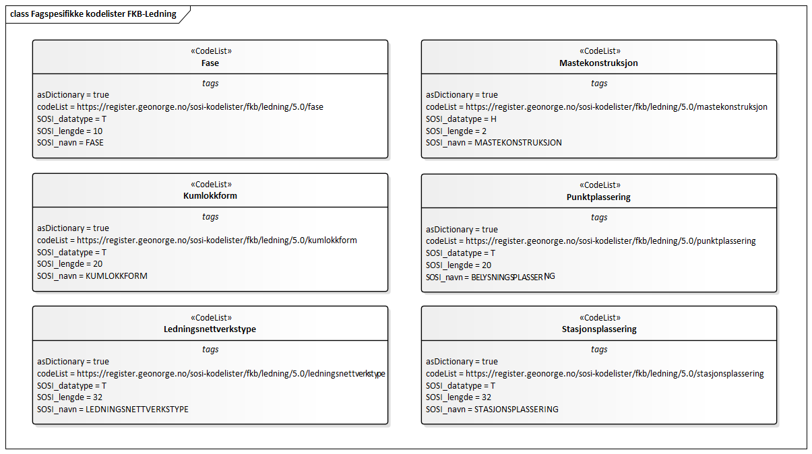
[caption="Figur 30: ",title=Realiseringer kodelister]
image::figurer/Realiseringer kodelister.png[Realiseringer kodelister]
 
==== «CodeList» Fase
Definisjon: angivelse av intern plassering i grunnris for aktuell faseline
 
===== Tagged Values
[cols="20,80"]
|===
|asDictionary
|true
 
|codeList
|https://register.geonorge.no/sosi-kodelister/fkb/ledning/5.0/fase
 
|SOSI_datatype
|T
 
|SOSI_lengde
|10
 
|SOSI_navn
|FASE
 
|===
Kodeliste hentet fra register: https://register.geonorge.no/sosi-kodelister/fkb/ledning/5.0/fase
 
Kodeliste hentet på tidspunkt: 2021-07-23T10:08:38Z
 
Kodelistens navn i registeret: Fase
 
===== Koder
[cols="25,60,15"]
|===
|*Kodenavn:* 
|*Definisjon:* 
|*Utvekslingsalias:* 
 
|Ytre
|ytre fase line i grunnriss
|ytre
|Midtre
|midtre eller indre fase line i grunnriss
|midtre
|===
 
==== «CodeList» Kumlokkform
Definisjon: kodeliste som inneholder hvilke geometrisk utforminger et kumlokk kan ha
 
===== Tagged Values
[cols="20,80"]
|===
|asDictionary
|true
 
|codeList
|https://register.geonorge.no/sosi-kodelister/fkb/ledning/5.0/kumlokkform
 
|SOSI_datatype
|T
 
|SOSI_lengde
|20
 
|SOSI_navn
|KUMLOKKFORM
 
|===
Kodeliste hentet fra register: https://register.geonorge.no/sosi-kodelister/fkb/ledning/5.0/kumlokkform
 
Kodeliste hentet på tidspunkt: 2021-07-23T10:08:39Z
 
Kodelistens navn i registeret: Kumlokkform
 
===== Koder
[cols="25,60,15"]
|===
|*Kodenavn:* 
|*Definisjon:* 
|*Utvekslingsalias:* 
 
|Kvadratisk
|kumlokket har utstrekning i form av et kvadrat
|kvadratisk
|Rektangulært
|kumlokket har utstrekning i form av et rektangel
|rektangulært
|Hydrant
|kumlokk eller konstruksjon som er utformet slik at tilkopling av slanger for håndtering av og bekjempelse av brann/ulykker er mulig
|hydrant
|Sluk
|kumlokk eller åpning med rist der overflatevann kan renne ned i avløpssystemet, ofte i forbindelse med vegsystemer
|sluk
|Sirkelformet
|kumlokket er sirkelformet, rundt
|sirkelforma
|===
 
==== «CodeList» Ledningsnettverkstype
Definisjon: oversikt over nettverkstyper, satt sammen av nettverkskomponenter, med en bestemt hensikt

Merknad: 
Et nettverk utgj&#248;r en logisk enhet. Et nettverk kan v&#230;re knytta til andre nettverk, men da oftest p&#229; bestemte tilkoplingspunkter. 
 
===== Tagged Values
[cols="20,80"]
|===
|asDictionary
|true
 
|codeList
|https://register.geonorge.no/sosi-kodelister/fkb/ledning/5.0/ledningsnettverkstype
 
|SOSI_datatype
|T
 
|SOSI_lengde
|32
 
|SOSI_navn
|LEDNINGSNETTVERKSTYPE
 
|===
Kodeliste hentet fra register: https://register.geonorge.no/sosi-kodelister/fkb/ledning/5.0/ledningsnettverkstype
 
Kodeliste hentet på tidspunkt: 2021-07-23T10:08:42Z
 
Kodelistens navn i registeret: Ledningsnettverkstype
 
===== Koder
[cols="25,60,15"]
|===
|*Kodenavn:* 
|*Definisjon:* 
|*Utvekslingsalias:* 
 
|Signalanlegg
|nettverk som brukes for å oversende og formidle trafikksignal
|signalanlegg
|Lavspentnett
|lavspentnett, &lt;= 1 kV
|lavspentnett
|Høgspentnett
|høgspentnett, &gt; 1 kV
|høgspentnett
|Ekom
|fellesbetegnelse for flere typer elektronisk kommunikasjon
|ekom
|Vann- og avløpsanlegg
|anlegg for transport av drikkevann, avløpsvann eller overvann
|vaanlegg
|Ukjent
|ledningsnettverkstype ikke kjent ved registreringstidspunkt
|ukjent
|Belysningsanlegg
|nettverk som brukes til utendørsbelysning
|belysningsanlegg
|===
 
==== «CodeList» Mastekonstruksjon
Definisjon: hvordan masta er konstruert

Merknad: Enkelte av kodene er stereotypet for å fortelle hvor konstruksjonstypen er hentet fra.
 
===== Tagged Values
[cols="20,80"]
|===
|asDictionary
|true
 
|codeList
|https://register.geonorge.no/sosi-kodelister/fkb/ledning/5.0/mastekonstruksjon
 
|SOSI_datatype
|H
 
|SOSI_lengde
|2
 
|SOSI_navn
|MASTEKONSTRUKSJON
 
|===
Kodeliste hentet fra register: https://register.geonorge.no/sosi-kodelister/fkb/ledning/5.0/mastekonstruksjon
 
Kodeliste hentet på tidspunkt: 2021-07-23T10:08:44Z
 
Kodelistens navn i registeret: Mastekonstruksjon
 
===== Koder
[cols="25,60,15"]
|===
|*Kodenavn:* 
|*Definisjon:* 
|*Utvekslingsalias:* 
 
|StorStolpe
|stolpe i høyspentlinjer som ikke er fagverksmast
|storStolpe
|EnkelStolpe
|mast laget av kun en enkelt stolpe, vanligvis i lavspentnett, telenett eller langs jernbane
|enkelStolpe
|Annet
|andre typer mastekonstruksjoner eller master sammensatt av to eller flere konstruksjonstyper
|annet
|Kontaktledningsmast
|mast som bærer elektrisk strømførende ledning som er spent over sporet til en jernbane-, forstadsbane- eller sporvogns-trasé for å tilføre elektrisk energi til rullende materiell
|kontaktledningsmast
|Fagverksmast
|fagverk av metallkonstruksjoner
|fagverksmast
|===
 
==== «CodeList» Punktplassering
Definisjon: tekstlig beskrivelse av hvor et punkt er plassert
 
===== Tagged Values
[cols="20,80"]
|===
|asDictionary
|true
 
|codeList
|https://register.geonorge.no/sosi-kodelister/fkb/ledning/5.0/punktplassering
 
|SOSI_datatype
|T
 
|SOSI_lengde
|20
 
|SOSI_navn
|BELYSNINGSPLASSERI
NG
 
|===
Kodeliste hentet fra register: https://register.geonorge.no/sosi-kodelister/fkb/ledning/5.0/punktplassering
 
Kodeliste hentet på tidspunkt: 2021-07-23T10:08:44Z
 
Kodelistens navn i registeret: Punktplassering
 
===== Koder
[cols="25,60,15"]
|===
|*Kodenavn:* 
|*Definisjon:* 
|*Utvekslingsalias:* 
 
|Hengende i kabel
|objektet er montert hengende i kabel
|hengendeIKabel
|På portal
|objektet er montert på en portal
|påPortal
|I tak/kabelbru
|objektet er montert i tak av bygning, tunnel eller annen bygningsmessig konstruksjon
|iTakKabelbru
|I åk
|objektet er montert på/i åk
|iÅk
|På vegg
|objektet er montert på vegg av bygning, tunnel eller annen bygningsmessig konstruksjon
|påVegg
|Annet
|annet, som ikke er definert som spesifikke punktplasseringer i kodelisten forøvrig
|annet
|I mast
|objektet er montert på/i mast
|iMast
|===
 
==== «CodeList» Stasjonsplassering
Definisjon: kodeliste som angir hvor nettverksstasjonen er plassert
 
===== Tagged Values
[cols="20,80"]
|===
|asDictionary
|true
 
|codeList
|https://register.geonorge.no/sosi-kodelister/fkb/ledning/5.0/stasjonsplassering
 
|SOSI_datatype
|T
 
|SOSI_lengde
|32
 
|SOSI_navn
|STASJONSPLASSERING
 
|===
Kodeliste hentet fra register: https://register.geonorge.no/sosi-kodelister/fkb/ledning/5.0/stasjonsplassering
 
Kodeliste hentet på tidspunkt: 2021-07-23T10:08:45Z
 
Kodelistens navn i registeret: Stasjonsplassering
 
===== Koder
[cols="25,60,15"]
|===
|*Kodenavn:* 
|*Definisjon:* 
|*Utvekslingsalias:* 
 
|Mastearrangement
|nettverkstasjon hengende i mast
|mastearrangement
|Frittstående
|frittstående nettverkstasjon
|frittstående
|Minikiosk
|nettverkstasjon i form av frittstående liten bygning
|minikiosk
|Mastefotkiosk
|plassering av nettverkstasjon på bakkenivå mellom mastefundamentene
|mastefotkiosk
|I bygg
|nettverkstasjon plasser i bygning
|iBygg
|===
=== Pakke: Generelle elementer
Definisjon: pakke med elementer som realiserer tilsvarende elementer i FKB Generell del 5.0

Merknad:
Kopieres direkte inn i de enkelte FKB-datasettene
[caption="Figur 31: ",title=Hoveddiagram Fellesegenskaper]
image::figurer/Hoveddiagram Fellesegenskaper.png[Hoveddiagram Fellesegenskaper]
[caption="Figur 32: ",title=Realisering av fellesegenskaper fra SOSI generell del]
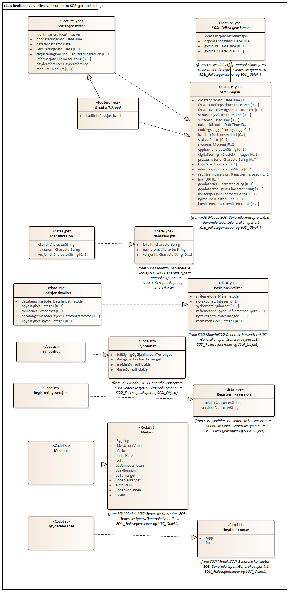
[caption="Figur 33: ",title=Posisjonskvalitet]
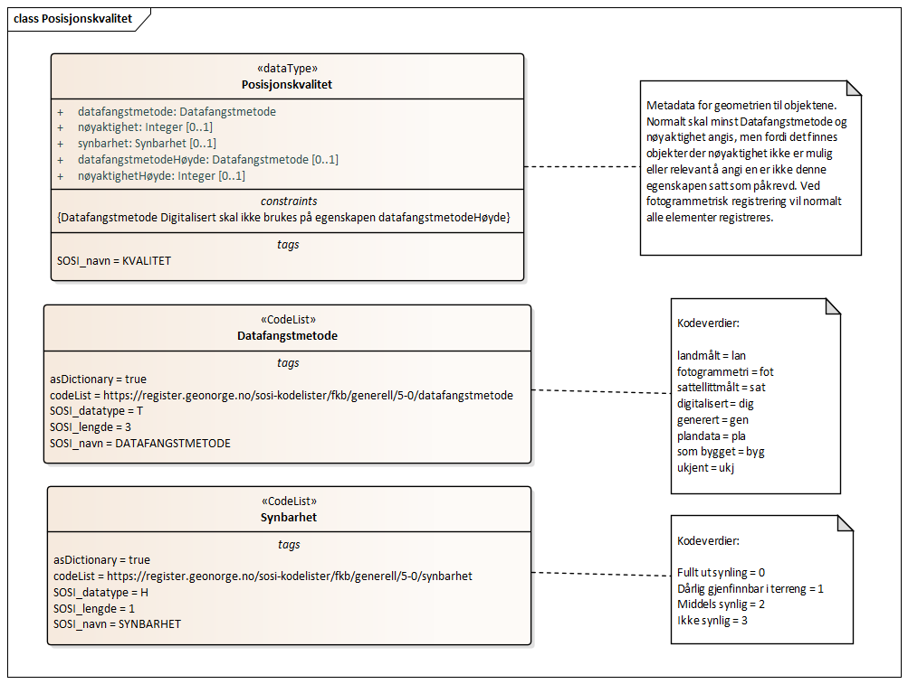
 
==== «FeatureType» Fellesegenskaper
Definisjon: abstrakt objekttype som bærer sentrale egenskaper som er anbefalt for bruk i produktspesifikasjoner.

Merknad: Disse egenskapene skal derfor ikke modelleres inn i fagområdemodeller.
 
*Realisering av:* «ApplicationSchema» Generelle typer 5.1/SOSI_Fellesegenskaper og SOSI_Objekt::«FeatureType» SOSI_Objekt
 
===== Egenskaper
[cols="20,80"]
|===
|*Navn:* 
|*identifikasjon*
 
|Definisjon: 
|unik identifikasjon av et objekt 

Merknad FKB:
Unik identifikasjon av et objekt, ivaretas av den ansvarlige produsent/forvalter, og som kan benyttes av eksterne applikasjoner som referanse til objektet.
Den unike identifikatoren er unik for kartobjektet og skal ikke endres i kartobjektets levetid. Dette m&#229; ikke forveksles med en tematisk identifikator (for eksempel bygningsnummer) som unikt identifiserer et objekt i virkeligheten. En bygning med samme bygningsnummer vil kunne representeres i mange kartprodukter der det finnes en unik identifikasjon i hver av dem.
For FKB benyttes UUID (Universally unique identifier) som lokalId. Dette inneb&#230;rer at lokalId alene alltid vil v&#230;re unik. Likevel skal alltid navnerom ogs&#229; angis. Navnerom angir FKB-datasettet.
 
|Multiplisitet: 
|[1..1]
 
|Type: 
|Identifikasjon
|Tagged Values: 
|
SOSI_navn: IDENT + 
|===
[cols="20,80"]
|===
|*Navn:* 
|*oppdateringsdato*
 
|Definisjon: 
|tidspunkt for siste endring p&#229; objektet 

Merknad FKB: 
Denne datoen viser datasystemets siste endring p&#229; dataobjektet. Egenskapen settes av forvaltningssystemet etter f&#248;lgende regler:
i. Oppdateringsdato er tidspunkt for oppdatering av databasen og settes av forvaltningsbasen (ikke
av klienten).
ii. Oppdateringsdato skal endres ogs&#229; hvis det er kopidata som blir endret eller importert i en
”kopibase”.
iii. N&#229;r avgrensingslinjene til en flate endres, skal flateobjektet f&#229; ny oppdateringsdato.
iv. Oppdateringsdato skal endres hvis en egenskap endres.
 
|Multiplisitet: 
|[1..1]
 
|Type: 
|DateTime
|Tagged Values: 
|
SOSI_datatype: DATOTID + 
SOSI_navn: OPPDATERINGSDATO + 
|===
[cols="20,80"]
|===
|*Navn:* 
|*datafangstdato*
 
|Definisjon: 
|dato n&#229;r objektet siste gang ble registrert/observert/m&#229;lt i terrenget

Merknad: I mange tilfeller er denne forskjellig fra oppdateringsdato, da registrerte endringer kan bufres i en kortere eller lengre periode f&#248;r disse legges inn i databasen.
Ved f&#248;rstegangsregistrering settes Datafangstdato lik f&#248;rsteDatafangstdato.
 
|Multiplisitet: 
|[1..1]
 
|Type: 
|Date
|Tagged Values: 
|
SOSI_datatype: DATO + 
SOSI_navn: DATAFANGSTDATO + 
|===
[cols="20,80"]
|===
|*Navn:* 
|*verifiseringsdato*
 
|Definisjon: 
|dato n&#229;r dataene er fastsl&#229;tt &#229; v&#230;re i samsvar med virkeligheten

Merknad FKB:
Brukes for eksempel i de sammenhenger hvor det er foretatt fotogrammetrisk ajourhold, og hvor det ikke er registrert endringer p&#229; objektet (det virkelige objektet er i samsvar med dataobjektet)
 
|Multiplisitet: 
|[0..1]
 
|Type: 
|Date
|Tagged Values: 
|
SOSI_datatype: DATO + 
SOSI_navn: VERIFISERINGSDATO + 
|===
[cols="20,80"]
|===
|*Navn:* 
|*registreringsversjon*
 
|Definisjon: 
|angivelse av hvilken produktspesifikasjon som er utgangspunkt  for dataene
 
|Multiplisitet: 
|[0..1]
 
|Type: 
|Registreringsversjon
|Tagged Values: 
|
defaultCodeSpace: https://register.geonorge.no/sosi-kodelister/fkb/generell/5-0/registreringsversjon + 
SOSI_navn: REGISTRERINGSVERSJON + 
|===
[cols="20,80"]
|===
|*Navn:* 
|*informasjon*
 
|Definisjon: 
|generell opplysning

Merknad FKB:
Mulighet til &#229; legge inn utfyllende informasjon om objektet. Egenskapen b&#248;r bare brukes til &#229; legge inn ekstra informasjon om enkeltobjekter. Egenskapen b&#248;r ikke brukes til &#229; systematisk angi ekstrainformasjon om mange/alle objekter i et datasett.
 
|Multiplisitet: 
|[0..1]
 
|Type: 
|CharacterString
|Tagged Values: 
|
SOSI_datatype: T + 
SOSI_lengde: 255 + 
SOSI_navn: INFORMASJON + 
|===
[cols="20,80"]
|===
|*Navn:* 
|*høydereferanse*
 
|Definisjon: 
|angir hvilken del av objektet h&#248;ydeverdien refererer til
 
|Multiplisitet: 
|[1..1]
 
|Type: 
|Høydereferanse
|Tagged Values: 
|
defaultCodeSpace:  + 
SOSI_datatype: T + 
SOSI_lengde: 6 + 
SOSI_navn: HREF + 
|===
[cols="20,80"]
|===
|*Navn:* 
|*medium*
 
|Definisjon: 
|objektets beliggenhet i forhold til jordoverflaten
 
|Multiplisitet: 
|[0..1]
 
|Type: 
|Medium
|Tagged Values: 
|
defaultCodeSpace: https://register.geonorge.no/sosi-kodelister/fkb/generell/5-0/medium + 
SOSI_datatype: T + 
SOSI_lengde: 1 + 
SOSI_navn: MEDIUM + 
|===
[cols="20,80"]
|===
|*Subtyper:*
|«FeatureType» KvalitetPåkrevd
|===
 
==== «FeatureType» KvalitetPåkrevd
Definisjon: abstrakt objekttype med p&#229;krevet kvalitetsangivelse
 
*Supertype:* «FeatureType» Fellesegenskaper
 
*Realisering av:* «ApplicationSchema» Generelle typer 5.1/SOSI_Fellesegenskaper og SOSI_Objekt::«FeatureType» SOSI_Objekt
 
===== Egenskaper
[cols="20,80"]
|===
|*Navn:* 
|*kvalitet*
 
|Definisjon: 
|beskrivelse av kvaliteten på stedfestingen

Merknad: Denne er identisk med ..KVALITET i tidligere versjoner av SOSI.
 
|Multiplisitet: 
|[1..1]
 
|Type: 
|Posisjonskvalitet
|Tagged Values: 
|
SOSI_navn: KVALITET + 
|===
[cols="20,80"]
|===
|*Subtyper:*
|«FeatureType» Nettverkskomponent
|===
 
==== «dataType» Identifikasjon
Definisjon: unik identifikasjon av et objekt i et datasett, forvaltet av den ansvarlige produsent/forvalter, og kan benyttes av eksterne applikasjoner som stabil referanse til objektet

Merknad 1: Denne objektidentifikasjonen m&#229; ikke forveksles med en tematisk objektidentifikasjon, slik som f.eks bygningsnummer. 

Merknad 2: Denne unike identifikatoren vil ikke endres i l&#248;pet av objektets levetid, og ikke gjenbrukes i andre objekt. 
 
*Realisering av:* «ApplicationSchema» Generelle typer 5.1/SOSI_Fellesegenskaper og SOSI_Objekt::«dataType» Identifikasjon
 
===== Tagged Values
[cols="20,80"]
|===
|SOSI_navn
|IDENT
 
|===
===== Egenskaper
[cols="20,80"]
|===
|*Navn:* 
|*lokalId*
 
|Definisjon: 
|lokal identifikator av et objekt

Merknad: Det er dataleverend&#248;rens ansvar &#229; s&#248;rge for at den lokale identifikatoren er unik innenfor navnerommet. For FKB-data benyttes UUID som lokalId.
 
|Multiplisitet: 
|[1..1]
 
|Type: 
|CharacterString
|Tagged Values: 
|
SOSI_datatype: T + 
SOSI_lengde: 100 + 
SOSI_navn: LOKALID + 
|===
[cols="20,80"]
|===
|*Navn:* 
|*navnerom*
 
|Definisjon: 
|navnerom som unikt identifiserer datakilden til et objekt, anbefales å være en http-URI

Eksempel: http://data.geonorge.no/SentraltStedsnavnsregister/1.0

Merknad : Verdien for nanverom vil eies av den dataprodusent som har ansvar for de unike identifikatorene og må være registrert i data.geonorge.no eller data.norge.no
 
|Multiplisitet: 
|[1..1]
 
|Type: 
|CharacterString
|Tagged Values: 
|
SOSI_datatype: T + 
SOSI_lengde: 100 + 
SOSI_navn: NAVNEROM + 
|===
[cols="20,80"]
|===
|*Navn:* 
|*versjonId*
 
|Definisjon: 
|identifikasjon av en spesiell versjon av et geografisk objekt (instans)
 
|Multiplisitet: 
|[0..1]
 
|Type: 
|CharacterString
|Tagged Values: 
|
SOSI_datatype: T + 
SOSI_lengde: 100 + 
SOSI_navn: VERSJONID + 
|===
 
==== «dataType» Posisjonskvalitet
Definisjon: beskrivelse av kvaliteten p&#229; stedfestingen.

Merknad:
Posisjonskvalitet er ikke konform med  kvalitetsmodellen i ISO slik den er defineret i ISO19157:2013, men er en videref&#248;ring av tildligere brukte kvalitetsegenskaper i SOSI. FKB 5.0 innf&#248;rer en egen variant av datatypen Posisjonskvalitet der kodeliste m&#229;lemetode er byttet ut med den mer generelle kodelista Datafangstmetode. 
 
*Realisering av:* «ApplicationSchema» Generelle typer 5.1/SOSI_Fellesegenskaper og SOSI_Objekt::«dataType» Posisjonskvalitet
 
===== Tagged Values
[cols="20,80"]
|===
|SOSI_navn
|KVALITET
 
|===
===== Egenskaper
[cols="20,80"]
|===
|*Navn:* 
|*datafangstmetode*
 
|Definisjon: 
|metode for datafangst. 
Egenskapen beskriver datafangstmetode for grunnrisskoordinater (x,y), eller for b&#229;de grunnriss og h&#248;yde (x,y,z) dersom det ikke er oppgitt noen verdi for datafangstmetodeH&#248;yde.
 
|Multiplisitet: 
|[1..1]
 
|Type: 
|Datafangstmetode
|Tagged Values: 
|
defaultCodeSpace: https://register.geonorge.no/sosi-kodelister/fkb/generell/5-0/datafangstmetode + 
SOSI_lengde: 3 + 
SOSI_navn: DATAFANGSTMETODE + 
|===
[cols="20,80"]
|===
|*Navn:* 
|*nøyaktighet*
 
|Definisjon: 
|standardavviket til posisjoneringa av objektet oppgitt i cm
I de aller fleste sammenhenger benyttes en ansl&#229;tt eller forventet verdi for standardavvik, men dersom man har en beregnet verdi skal denne benyttes. 
For objekter med punktgeometri benyttes verdi for punktstandardavvik. For objekter med kurvegeometri benyttes standardavviket for tverravviket fra kurva. For objekter med overflate- eller volumgeometri er forst&#229;elsen at standardavviket beregnes ut fra (3D) avvikene mellom sann posisjon og n&#230;rmeste punkt p&#229; overflata. 
Merknad:
Verdien er ment &#229; beskrive n&#248;yaktigheten til objektet sammenlignet med sann verdi. Standardavvik er i utgangspunktet et m&#229;l p&#229; det tilfeldige avviket og det inneb&#230;rer at vi forutsetter at det systematiske avviket i liten grad p&#229;virker n&#248;yaktigheten til posisjoneringa. For fotogrammetriske data settes som hovedregel verdien lik kravet til standardavvik ved datafangst. Se standarden Geodatakvalitet for n&#230;rmere definisjon av standardavvik og hvordan dette defineres, beregnes og kontrolleres.
 
|Multiplisitet: 
|[0..1]
 
|Type: 
|Integer
|Tagged Values: 
|
SOSI_lengde: 6 + 
SOSI_navn: NØYAKTIGHET + 
|===
[cols="20,80"]
|===
|*Navn:* 
|*synbarhet*
 
|Definisjon: 
|beskrivelse av hvor godt objektene framg&#229;r i datagrunnlaget for posisjonering (f.eks. flybildene).
 
|Multiplisitet: 
|[0..1]
 
|Type: 
|Synbarhet
|Tagged Values: 
|
defaultCodeSpace: https://register.geonorge.no/sosi-kodelister/fkb/generell/5-0/synbarhet + 
SOSI_lengde: 1 + 
SOSI_navn: SYNBARHET + 
|===
[cols="20,80"]
|===
|*Navn:* 
|*datafangstmetodeHøyde*
 
|Definisjon: 
|metoden brukt for h&#248;yderegistrering av posisjon.

Det er bare n&#248;dvending &#229; angi en verdi for egenskapen dersom datafangstmetode for h&#248;yde avviker fra datafangstmetode for grunnriss.

 
|Multiplisitet: 
|[0..1]
 
|Type: 
|Datafangstmetode
|Tagged Values: 
|
defaultCodeSpace: https://register.geonorge.no/sosi-kodelister/fkb/generell/5-0/datafangstmetode + 
SOSI_lengde: 3 + 
SOSI_navn: DATAFANGSTMETODEHØYDE + 
|===
[cols="20,80"]
|===
|*Navn:* 
|*nøyaktighetHøyde*
 
|Definisjon: 
|standardavviket til posisjoneringa av objektet oppgitt i cm
I de aller fleste sammenhenger benyttes en ansl&#229;tt eller forventet verdi for standardavviket, men dersom man faktisk har standardavviket til posisjoneringa av objektet oppgitt i cm
I de aller fleste sammenhenger benyttes en ansl&#229;tt eller forventet verdi for standardavvik, men dersom man har en beregnet verdi skal denne benyttes. 
Merknad:
Verdien er ment &#229; beskrive n&#248;yaktigheten til objektet sammenlignet med sann verdi. Standardavvik er i utgangspunktet et m&#229;l p&#229; det tilfeldige avviket og det inneb&#230;rer at vi forutsetter at det systematiske avviket i liten grad p&#229;virker n&#248;yaktigheten til posisjoneringa. For fotogrammetriske data settes som hovedregel verdien lik kravet til standardavvik ved datafangst. Se standarden Geodatakvalitet for n&#230;rmere definisjon av standardavvik og hvordan dette defineres, beregnes og kontrolleres.
 
|Multiplisitet: 
|[0..1]
 
|Type: 
|Integer
|Tagged Values: 
|
SOSI_lengde: 6 + 
SOSI_navn: H-NØYAKTIGHET + 
|===
 
==== «CodeList» Synbarhet
Definisjon: synbarhet beskriver hvor godt objektene framg&#229;r i datagrunnlaget for posisjonering (f.eks. flybildene).
 
===== Tagged Values
[cols="20,80"]
|===
|asDictionary
|true
 
|codeList
|https://register.geonorge.no/sosi-kodelister/fkb/generell/5-0/synbarhet
 
|SOSI_datatype
|H
 
|SOSI_lengde
|1
 
|SOSI_navn
|SYNBARHET
 
|===
Kodeliste hentet fra register: https://register.geonorge.no/sosi-kodelister/fkb/generell/5-0/synbarhet
 
Kodeliste hentet på tidspunkt: 2021-07-23T10:09:12Z
 
Kodelistens navn i registeret: Synbarhet
 
===== Koder
[cols="25,60,15"]
|===
|*Kodenavn:* 
|*Definisjon:* 
|*Utvekslingsalias:* 
 
|Middels synlig
|Objektet er middels synlig/gjenkjennbart i flybilde eller annen datakilde for posisjonering. Ved fotogrammetrisk datafangst brukes denne koden for objekter som har lav kontrast eller er delvis skjult av overliggende objekter (vegetasjon, takoverbygg, bruer etc.). For slike objekter settes en større verdi for nøyaktighet enn kravet (opptil 3 ganger kravet)
|2
|Ikke synlig
|Objektet er ikke synlig/gjenkjennbart i flybilde eller annen datakilde for posisjonering. Ved fotogrammetrisk datafangst brukes denne koden for objekter som er helt skjult av overliggende objekter (vegetasjon, takoverbygg, bruer etc.). For slike objekter settes en stor verdi for nøyaktighet (mer enn 3 ganger kravet)
|3
|Fullt ut synlig
|Objektet er fullt ut synlig/gjenfinnbart i flybilde eller annen datakilde for posisjonering. Ved fotogrammetrisk registrering skal objekter som er fullt ut synlige registreres i tråd med angitte krav til nøyaktig registrering.
|0
|Dårlig gjenfinnbar i terreng
|Objektets posisjon er vanskelig å definere presist i terrenget på grunn av objektets natur. Koden kan f.eks. brukes på høydekurver (eller andre isolinjer) eller objekter som er skjult i bakken (f.eks. innmåling av ledninger på lukket grøft) 
|1
|===
 
==== «CodeList» Datafangstmetode
Definisjon: metode for datafangst. 

Datafangstmetoden beskriver hvordan selve vektordataene er posisjonert fra et datagrunnlag (observasjoner med landm&#229;lingsutstyr, fotogrammetrisk stereomodell, digital terrengmodell etc.) og ikke prosessen med &#229; innhente det bakenforliggende datagrunnlaget.
 
===== Tagged Values
[cols="20,80"]
|===
|asDictionary
|true
 
|codeList
|https://register.geonorge.no/sosi-kodelister/fkb/generell/5-0/datafangstmetode
 
|SOSI_datatype
|T
 
|SOSI_lengde
|3
 
|SOSI_navn
|DATAFANGSTMETODE
 
|===
Kodeliste hentet fra register: https://register.geonorge.no/sosi-kodelister/fkb/generell/5-0/datafangstmetode
 
Kodeliste hentet på tidspunkt: 2021-07-23T10:09:13Z
 
Kodelistens navn i registeret: Datafangstmetode
 
===== Koder
[cols="25,60,15"]
|===
|*Kodenavn:* 
|*Definisjon:* 
|*Utvekslingsalias:* 
 
|Som bygget
|Posisjonen er hentet fra prosjekterte eller planlagte data, f.eks. fra en BIM-modell, som er verifisert som bygget ved innmålinger
|byg
|Ukjent
|Ukjent eller uspesifisert datafangstmetode
|ukj
|Plandata
|Posisjonen er hentet plandata. Posisjonen er ikke verifisert med innmåling. 
|pla
|Satellittmålt
|Posisjonen er målt inn direkte med GNSS (for posisjoner målt inn med GNSS i kombinasjon med andre landmålingsmetoder skal koden Landmåling benyttes)
|sat
|Generert
|Posisjonen er manuelt konstruert, eller generert ved maskinlæring eller annen type programvare, fra punktsky fra laserskanning, bildematching, sonar, andre typer sensordata eller kombinasjon av flere typer sensordata.
|gen
|Fotogrammetri
|Posisjonen er konstruert/generert fra en fotogrammetrisk stereomodell 
|fot
|Digitalisert
|Posisjonen er digitalisert fra ortofoto eller andre plane kartdata
|dig
|Landmålt
|Posisjonen er målt inn direkte med en landmålingsmetode. Aktuelle landmålingsmetoder kan være nivellering, vinkelmåling, avstandsmåling eller treghetsmåling. Kodeverdien brukes også for kombinasjoner av disse målemetodene eller der disse målemetodene kombineres med GNSS. Landmåling utføres normalt med overskytende målinger og utjevning av resultatet.
|lan
|===
 
==== «CodeList» Registreringsversjon
Definisjon: FKB-verjson som ligger til grunn for registrering. Mest relevant for data som er fotogrammetrisk registrert.
 
===== Tagged Values
[cols="20,80"]
|===
|asDictionary
|true
 
|codeList
|https://register.geonorge.no/sosi-kodelister/fkb/generell/5-0/registreringsversjon
 
|SOSI_datatype
|T
 
|SOSI_lengde
|10
 
|SOSI_navn
|REGISTRERINGSVERSJON
 
|===
Kodeliste hentet fra register: https://register.geonorge.no/sosi-kodelister/fkb/generell/5-0/registreringsversjon
 
Kodeliste hentet på tidspunkt: 2021-07-23T10:09:14Z
 
Kodelistens navn i registeret: Registreringsversjon
 
===== Koder
[cols="25,60,15"]
|===
|*Kodenavn:* 
|*Definisjon:* 
|*Utvekslingsalias:* 
 
|FKB 4.5 2014-03-01
|Data registrert etter FKB 4.5 2014-03-01
|2014-03-01
|FKB 4.6 2020-01-01
|Data registrert etter FKB 4.6/4.61 2020-01-01
|2020-01-01
|FKB 4.6 2018-01-01
|Data registrert etter FKB 4.6/4.61 2018-01-01
|2018-01-01
|FKB 5.0 2022-01-01
|Data registrert etter FKB 5.0 2022-01-01
|2022-01-01
|FKB 4.01 2011-01-01
|Data registrert etter FKB 4.01 2011-01-01
|2011-01-01
|FKB 4.0 2007-01-01
|Data registrert etter FKB 4.0 2007-01-01
|2007-01-07
|FKB 4.6 2016-06-01
|Data registrert etter FKB 4.6 2016-06-01
|2016-06-01
|FKB 4.01 2009-03-10
|Data registrert etter FKB 4.01 2009-03-10
|2009-03-10
|FKB 4.5 2015-01-01
|Data registrert etter FKB 4.5 2015-01-01
|2015-01-01
|FKB 4.02 2013-01-01
|Data registrert etter FKB 4.02 2013-01-01
|2013-01-01
|FKB 4.02 2011-12-01
|Data registrert etter FKB 4.02 2011-12-01
|2001-12-01
|===
 
==== «CodeList» Høydereferanse
Definisjon: koordinatregistering utf&#248;rt p&#229; topp eller bunn av et objekt
 
===== Tagged Values
[cols="20,80"]
|===
|asDictionary
|true
 
|codeList
|https://register.geonorge.no/sosi-kodelister/fkb/generell/5-0/hoydereferanse
 
|SOSI_datatype
|T
 
|SOSI_lengde
|6
 
|SOSI_navn
|HREF
 
|===
Kodeliste hentet fra register: https://register.geonorge.no/sosi-kodelister/fkb/generell/5-0/hoydereferanse
 
Kodeliste hentet på tidspunkt: 2021-07-23T10:09:15Z
 
Kodelistens navn i registeret: Høydereferanse
 
===== Koder
[cols="25,60,15"]
|===
|*Kodenavn:* 
|*Definisjon:* 
|*Utvekslingsalias:* 
 
|Fot
|Høyden målt til foten av objektet
|FOT
|Ukjent
|Ukjent høydereferanse
|UKJENT
|Topp
|Høyden målt til toppen av objektet
|TOP
|===
 
==== «CodeList» Medium
Definisjon: objektets beliggenhet i forhold til jordoverflaten

Eksempel:
Veg p&#229; bro, i tunnel, inne i et bygningsmessig anlegg, etc.
 
===== Tagged Values
[cols="20,80"]
|===
|asDictionary
|true
 
|codeList
|https://register.geonorge.no/sosi-kodelister/fkb/generell/5-0/medium
 
|SOSI_datatype
|T
 
|SOSI_lengde
|1
 
|SOSI_navn
|MEDIUM
 
|===
Kodeliste hentet fra register: https://register.geonorge.no/sosi-kodelister/fkb/generell/5-0/medium
 
Kodeliste hentet på tidspunkt: 2021-07-23T10:09:16Z
 
Kodelistens navn i registeret: Medium
 
===== Koder
[cols="25,60,15"]
|===
|*Kodenavn:* 
|*Definisjon:* 
|*Utvekslingsalias:* 
 
|På terrenget
|På terrenget/på bakkenivå
|T
|Ukjent
|Ukjent plassering i forhold til jordoverflaten
|X
|Delvis under vann
|Delvis i eller under vann
|D
|På Isbre
|På isbre
|I
|Under terrenget
|Under terrenget
|U
|I vann
|Alltid i vann
|V
|I Bygning
|I eller på bygning eller bygningsmessig anlegg
|B
|I luft
|I lufta
|L
|===
