// Start of UML-model
=== Pakke: «ApplicationSchema» FKB-Ledning-5.0
*Definisjon:* Spesifikasjonen gjelder for ledningsdata innenfor elektrisitet, elektrisk kommunikasjon, belysningsanlegg, ledningsanlegg tilknyttet bane og vann- og avløpsanlegg. Det er kun objekter som er synlig i terrenget (ligger over bakkenivå) som inngår i produktspesifikasjonen. Produktspesifikasjonen er tenkt benyttet ved datafangst av ledningsobjekter.

FKB-Ledning versjon 5.0 baserer seg på generelle konsepter definert i SOSI del 1 versjon 4.5 og SOSI del 2 Ledning versjon 4.6.
 
[discrete]
==== Profilparametre i tagged values
[cols="20,80"]
|===
|definition
|"FKB-Ledning 5.0 Draft"@en
 
|description
|FKB-Ledning 5.0
 
|designation
|"Product specification FKB-Ledning 5.0"@en
 
|language
|nor
 
|SOSI_kortnavn
|FKBLedning
 
|SOSI_langnavn
|FKB-Ledning
 
|SOSI_modellstatus
|gyldig
 
|SOSI_spesifikasjonstype
|produktspesifikasjon
 
|SOSI_versjon
|5.0
 
|targetNamespace
|http://skjema.geonorge.no/SOSI/produktspesifikasjon/FKB-Ledning/5.0
 
|version
|5.0
 
|xmlns
|app
 
|xsdDocument
|FKBLedning.xsd
 
|xsdEncodingRule
|sosi
 
|===
 
'''
 
.Hoveddiagram FKB-Ledning 5.0 
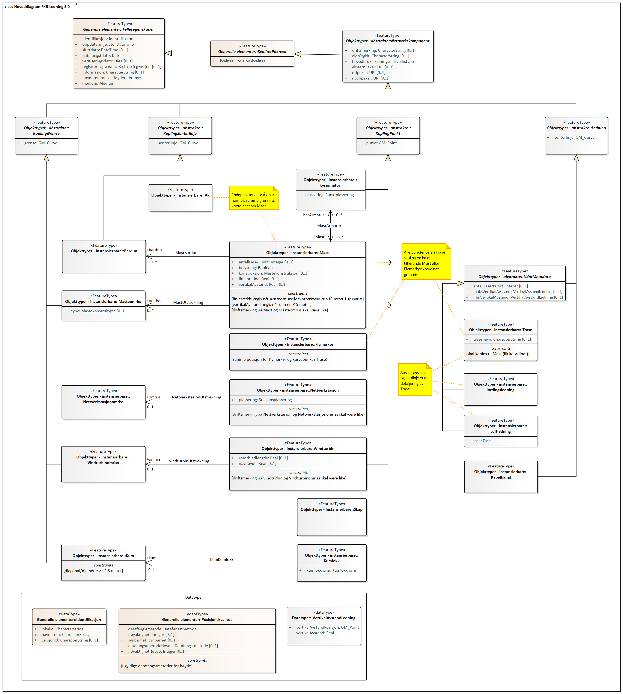
 
'''
 
.Pakkerealisering FKB-Ledning 5.0 
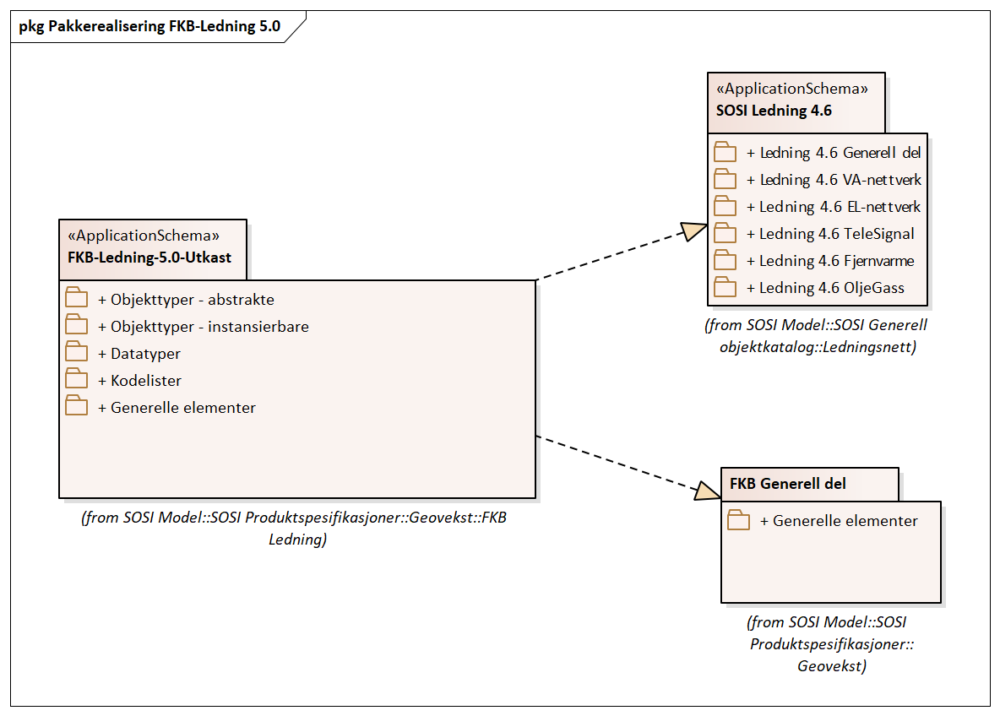
<<<
'''
==== Pakke: Objekttyper - abstrakte
*Definisjon:* Ikke realiserbare objekttyper. Objekttypene benyttes kun som konteinerobjekter for egenskaper som benyttes av et eller flere subtyper.
 
'''
 
.Objekttyper - abstrakte 
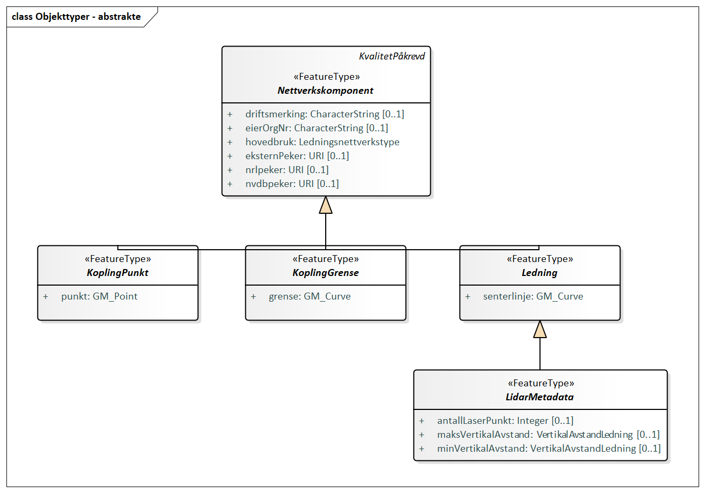
 
'''
 
.Realiseringer objekttyper - abstrakte 
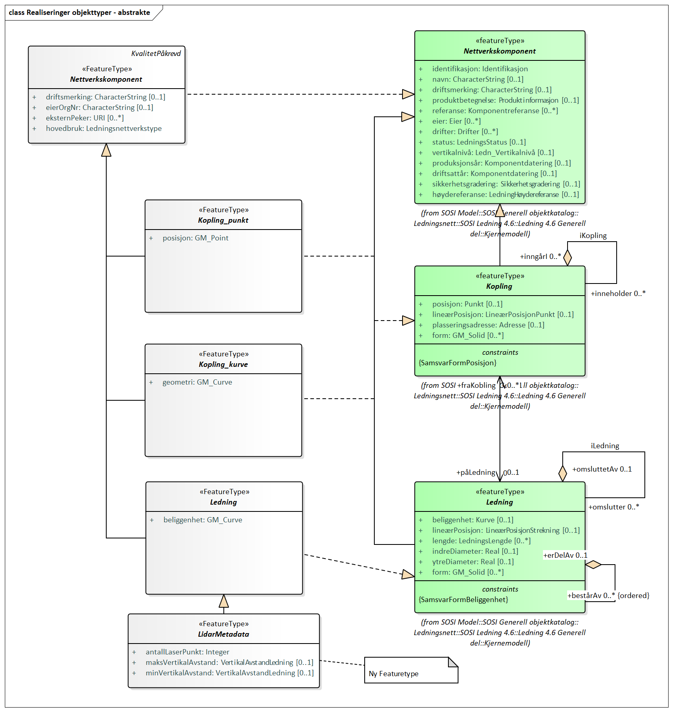
 
'''
 
[[koplinggrense]]
===== «FeatureType» KoplingGrense (abstrakt)
*Definisjon:* generell betegnelse på objekt som er avgrensningslinjer for et nodepunkt i et ledningsnettverk
 
[discrete]
====== Egenskaper
[cols="20,80"]
|===
|*Navn:* 
|*grense*
 
|Definisjon: 
|beskriver koplingens geografiske beliggenhet i form av en kurve med koordinater
 
|Multiplisitet: 
|[1..1]
 
|Type: 
|http://skjema.geonorge.no/SOSI/basistype/GM_Curve[GM_Curve]
|Profilparametre i tagged values: 
|
SOSI_navn: Kurve + 
|===
 
[discrete]
====== Arv og realiseringer
[cols="20,80"]
|===
|Supertype: 
|<<nettverkskomponent,«FeatureType» Nettverkskomponent>>
 
|Subtyper:
|<<masteomriss,«FeatureType» Masteomriss>> +
<<vindturbinomriss,«FeatureType» Vindturbinomriss>> +
<<kum,«FeatureType» Kum>> +
<<nettverkstasjonomriss,«FeatureType» Nettverkstasjonomriss>> +
|Realisering av: 
|«ApplicationSchema» SOSI Ledning 4.6/Ledning 4.6 Generell del/Kjernemodell::«featureType» Kopling +
|===
 
'''
 
[[koplingsenterlinje]]
===== «FeatureType» KoplingSenterlinje (abstrakt)
*Definisjon:* generell betegnelse for langsgående konstruksjoner i et ledningsnettverk
 
[discrete]
====== Egenskaper
[cols="20,80"]
|===
|*Navn:* 
|*senterlinje*
 
|Definisjon: 
|beskriver koplingens geografiske beliggenhet i form av en kurve med koordinater
 
|Multiplisitet: 
|[1..1]
 
|Type: 
|http://skjema.geonorge.no/SOSI/basistype/GM_Curve[GM_Curve]
|Profilparametre i tagged values: 
|
SOSI_navn: Kurve + 
|===
 
[discrete]
====== Arv og realiseringer
[cols="20,80"]
|===
|Supertype: 
|<<nettverkskomponent,«FeatureType» Nettverkskomponent>>
 
|Subtyper:
|<<bardun,«FeatureType» Bardun>> +
<<åk,«FeatureType» Åk>> +
|Realisering av: 
|«ApplicationSchema» SOSI Ledning 4.6/Ledning 4.6 Generell del/Kjernemodell::«featureType» Kopling +
|===
 
'''
 
[[koplingpunkt]]
===== «FeatureType» KoplingPunkt (abstrakt)
*Definisjon:* generell betegnelse på objekt som er node (punkt) i et ledningsnettverk
 
[discrete]
====== Egenskaper
[cols="20,80"]
|===
|*Navn:* 
|*punkt*
 
|Definisjon: 
|beskriver koplingens geografiske beliggenhet i form av koordinatene til et punkt
 
|Multiplisitet: 
|[1..1]
 
|Type: 
|http://skjema.geonorge.no/SOSI/basistype/GM_Point[GM_Point]
|Profilparametre i tagged values: 
|
SOSI_navn: Punkt + 
|===
 
[discrete]
====== Arv og realiseringer
[cols="20,80"]
|===
|Supertype: 
|<<nettverkskomponent,«FeatureType» Nettverkskomponent>>
 
|Subtyper:
|<<vindturbin,«FeatureType» Vindturbin>> +
<<kumlokk,«FeatureType» Kumlokk>> +
<<nettverkstasjon,«FeatureType» Nettverkstasjon>> +
<<flymarkør,«FeatureType» Flymarkør>> +
<<lysarmatur,«FeatureType» Lysarmatur>> +
<<mast,«FeatureType» Mast>> +
<<skap,«FeatureType» Skap>> +
|Realisering av: 
|«ApplicationSchema» SOSI Ledning 4.6/Ledning 4.6 Generell del/Kjernemodell::«featureType» Kopling +
|===
 
'''
 
[[ledning]]
===== «FeatureType» Ledning (abstrakt)
*Definisjon:* generell betegnelse for langsgående objekt i et ledningsnettverk
 
[discrete]
====== Egenskaper
[cols="20,80"]
|===
|*Navn:* 
|*senterlinje*
 
|Definisjon: 
|beskriver ledningens geografiske beliggenhet i form av en kurve med koordinater
 
|Multiplisitet: 
|[1..1]
 
|Type: 
|http://skjema.geonorge.no/SOSI/basistype/GM_Curve[GM_Curve]
|Profilparametre i tagged values: 
|
SOSI_navn: Kurve + 
|===
 
[discrete]
====== Arv og realiseringer
[cols="20,80"]
|===
|Supertype: 
|<<nettverkskomponent,«FeatureType» Nettverkskomponent>>
 
|Subtyper:
|<<lidarmetadata,«FeatureType» LidarMetadata>> +
<<kabelkanal,«FeatureType» Kabelkanal>> +
|Realisering av: 
|«ApplicationSchema» SOSI Ledning 4.6/Ledning 4.6 Generell del/Kjernemodell::«featureType» Ledning +
|===
 
'''
 
[[lidarmetadata]]
===== «FeatureType» LidarMetadata (abstrakt)
*Definisjon:* informasjon om punktskyen som ligger til grunn for klassifisering og vektorisering
 
[discrete]
====== Egenskaper
[cols="20,80"]
|===
|*Navn:* 
|*antallLaserPunkt*
 
|Definisjon: 
|antallet klassifiserte laserpunkt som er med på å bestemme vektorisert objekt
 
|Multiplisitet: 
|[0..1]
 
|Type: 
|http://skjema.geonorge.no/SOSI/basistype/Integer[Integer]
|Profilparametre i tagged values: 
|
SOSI_datatype: H + 
SOSI_lengde: 5 + 
SOSI_navn: ANTALL_LASERPUNKT + 
|===
[cols="20,80"]
|===
|*Navn:* 
|*maksVertikalAvstand*
 
|Definisjon: 
|maksimal avstand i vertikalplanet fra objektet til under-/omkringliggende terreng eller vannoverflate
 
|Multiplisitet: 
|[0..1]
 
|Type: 
|<<vertikalavstandledning,«dataType» VertikalAvstandLedning>>
|Profilparametre i tagged values: 
|
SOSI_navn: MAKS_VERTIKALUTSTREKNING + 
|===
[cols="20,80"]
|===
|*Navn:* 
|*minVertikalAvstand*
 
|Definisjon: 
|minste avstand i vertikalplanet fra objektet til under-/omkringliggende terreng eller vannoverflate
 
|Multiplisitet: 
|[0..1]
 
|Type: 
|<<vertikalavstandledning,«dataType» VertikalAvstandLedning>>
|Profilparametre i tagged values: 
|
SOSI_navn: MIN_VERTIKALUTSTREKNING + 
|===
 
[discrete]
====== Arv og realiseringer
[cols="20,80"]
|===
|Supertype: 
|<<ledning,«FeatureType» Ledning>>
 
|Subtyper:
|<<trase,«FeatureType» Trase>> +
<<jordingsledning,«FeatureType» Jordingsledning>> +
<<luftledning,«FeatureType» Luftledning>> +
|===
 
'''
 
[[nettverkskomponent]]
===== «FeatureType» Nettverkskomponent (abstrakt)
*Definisjon:* konteinerobjekt med fellesegenskaper for alle ledningsobjekter
 
[discrete]
====== Egenskaper
[cols="20,80"]
|===
|*Navn:* 
|*driftsmerking*
 
|Definisjon: 
|unik ID for den fysiske nettverkskomponenten

Merknad: 
Vil kunne brukes til å knytte sammen informasjon om samme komponenten forvaltet i ulike databaser.
 
|Multiplisitet: 
|[0..1]
 
|Type: 
|http://skjema.geonorge.no/SOSI/basistype/CharacterString[CharacterString]
|Profilparametre i tagged values: 
|
SOSI_datatype: T + 
SOSI_lengde: 50 + 
SOSI_navn: DRIFTSMERKING + 
|===
[cols="20,80"]
|===
|*Navn:* 
|*eierOrgNr*
 
|Definisjon: 
|organisasjonsnummer (9 siffer uten mellomrom) til eier av objektet. Organisasjonsnummeret skal være registrert i Brønnøysundregisteret

Eksempel: 971032081

Merknad FKB:
I noen få tilfeller kan det være delt eierskap av et objekt i marka, typisk en mast. I disse tilfellene registreres det ett objekt pr. eier. Dette medfører at ett fysisk objekt i marka, med delt eierskap, representeres flere ganger. Hvert enkelt objekt kan kun registreres med en eier.
 
|Multiplisitet: 
|[0..1]
 
|Type: 
|http://skjema.geonorge.no/SOSI/basistype/CharacterString[CharacterString]
|Profilparametre i tagged values: 
|
SOSI_datatype: T + 
SOSI_lengde: 9 + 
SOSI_navn: EIERORGNR + 
|===
[cols="20,80"]
|===
|*Navn:* 
|*hovedbruk*
 
|Definisjon: 
|hovedbruken for objektet

Merknad FKB:
Hovedregelen er at eieres hovedbruk av objektet bestemmer angitt bruksområde. 
 
|Multiplisitet: 
|[1..1]
 
|Type: 
|<<ledningsnettverkstype,«CodeList» Ledningsnettverkstype>>
|Profilparametre i tagged values: 
|
defaultCodeSpace: https://register.geonorge.no/sosi-kodelister/fkb/ledning/5.0/ledningsnettverkstype + 
SOSI_datatype: T + 
SOSI_lengde: 32 + 
SOSI_navn: LEDNINGSNETTVERKSTYPE + 
|===
[cols="20,80"]
|===
|*Navn:* 
|*eksternpeker*
 
|Definisjon: 
|peker til et eksternt system hvor det samme objektet er registrert

Merknad:
Ved peker til NRL eller NVDB registreres dette under sine respektive peker
 
|Multiplisitet: 
|[0..1]
 
|Type: 
|http://skjema.geonorge.no/SOSI/basistype/URI[URI]
|Profilparametre i tagged values: 
|
SOSI_datatype: T + 
SOSI_lengde: 255 + 
SOSI_navn: EKSTERNPEKER + 
|===
[cols="20,80"]
|===
|*Navn:* 
|*nrlpeker*
 
|Definisjon: 
|peker til objekt i NRL
 
|Multiplisitet: 
|[0..1]
 
|Type: 
|http://skjema.geonorge.no/SOSI/basistype/URI[URI]
|Profilparametre i tagged values: 
|
SOSI_datatype: T + 
SOSI_lengde: 255 + 
SOSI_navn: NRLPEKER + 
|===
[cols="20,80"]
|===
|*Navn:* 
|*nvdbpeker*
 
|Definisjon: 
|peker til objekt i NVDB
 
|Multiplisitet: 
|[0..1]
 
|Type: 
|http://skjema.geonorge.no/SOSI/basistype/URI[URI]
|Profilparametre i tagged values: 
|
SOSI_datatype: T + 
SOSI_lengde: 255 + 
SOSI_navn: NVDBPEKER + 
|===
 
[discrete]
====== Arv og realiseringer
[cols="20,80"]
|===
|Supertype: 
|<<kvalitetpåkrevd,«FeatureType» KvalitetPåkrevd>>
 
|Subtyper:
|<<koplingpunkt,«FeatureType» KoplingPunkt>> +
<<ledning,«FeatureType» Ledning>> +
<<koplingsenterlinje,«FeatureType» KoplingSenterlinje>> +
<<koplinggrense,«FeatureType» KoplingGrense>> +
|Realisering av: 
|«ApplicationSchema» SOSI Ledning 4.6/Ledning 4.6 Generell del/Kjernemodell::«featureType» Nettverkskomponent +
|===
<<<
'''
==== Pakke: Objekttyper - instansierbare
*Definisjon:* Instansierbare objekttyper. Objekttypene kan benyttes som objekttyper i forbindelse med datautveksling. Objekttypene arver gjerne en eller flere egenskaper fra ett eller flere abstrakte supertyper, men kan også inneholde egenskaper som kun er relevante for den aktuelle objekttypen.
 
'''
 
.Instansierbare objekttyper 
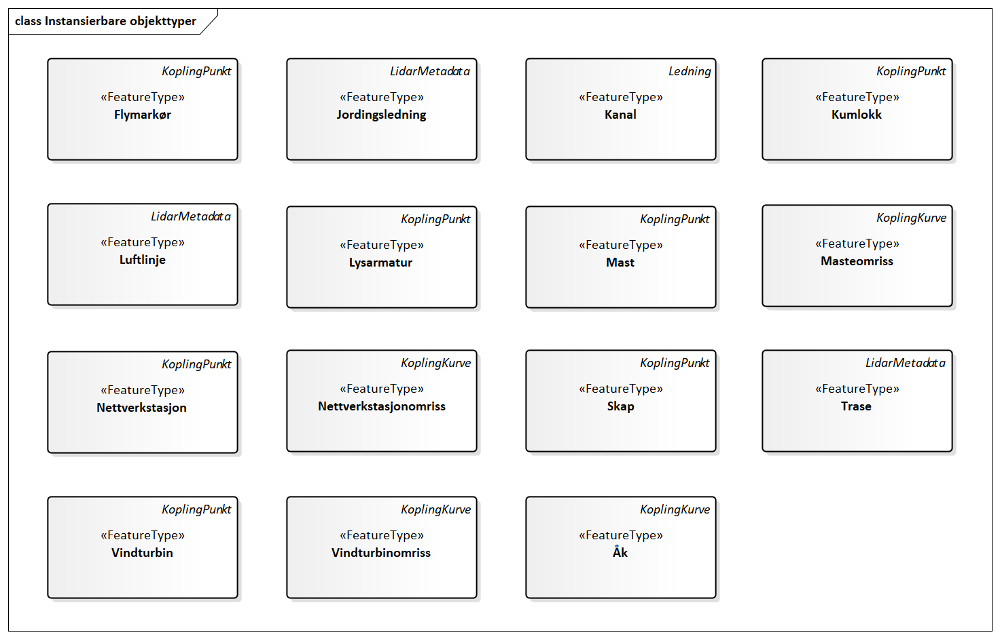
 
'''
 
.Flymarkør - alle egenskaper og realisering 
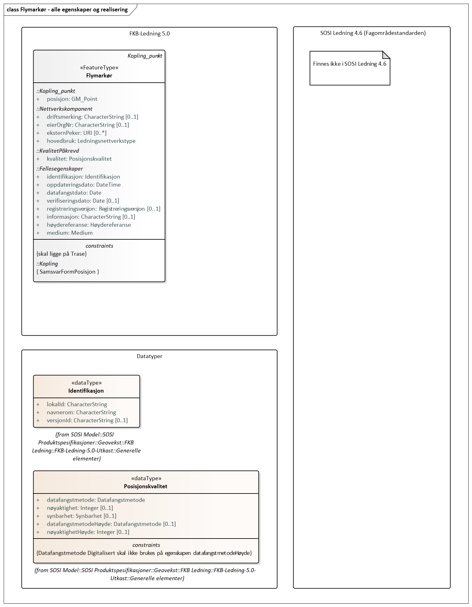
 
'''
 
.Jordingsledning - alle egenskaper og realisering 
image::diagrammer/Jordingsledning - alle egenskaper og realisering.png[link=diagrammer/Jordingsledning - alle egenskaper og realisering.png, alt="Diagram med navn Jordingsledning - alle egenskaper og realisering som viser UML-klasser beskrevet i teksten nedenfor."]
 
'''
 
.Kabelkanal - alle egenskaper og realisering 
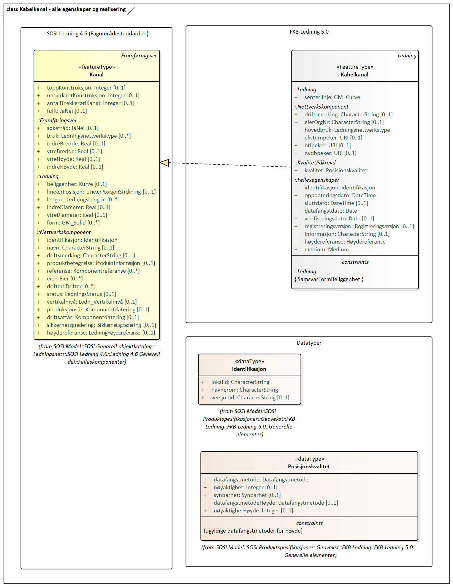
 
'''
 
.Kum og Kumlokk - alle egenskaper og realisering 
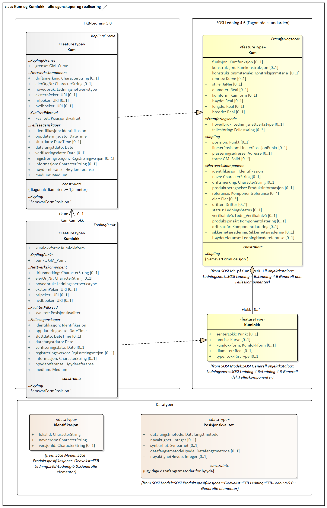
 
'''
 
.Luftledning - alle egenskaper og realisering 
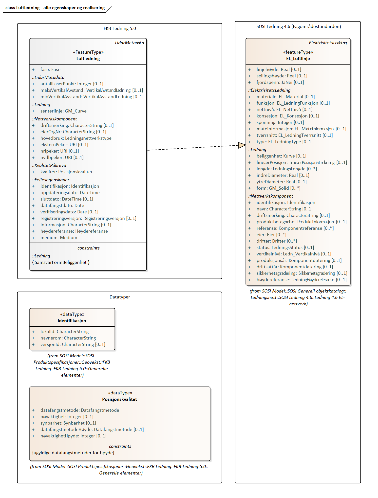
 
'''
 
.Lysarmatur - alle egenskaper og realisering 
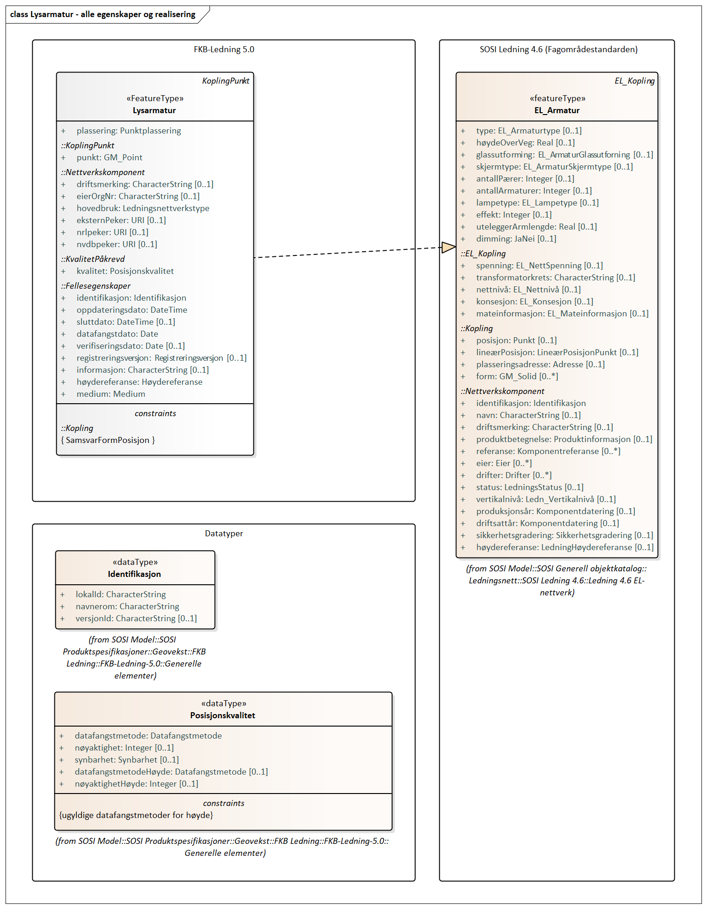
 
'''
 
.Mast Masteomriss og Bardun - alle egenskaper og realisering 
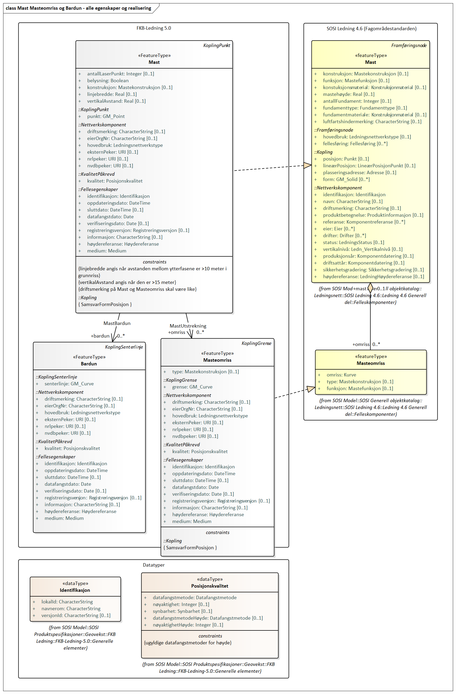
 
'''
 
.Nettverkstasjon og Nettverkstasjonomriss - alle egenskaper og realisering 
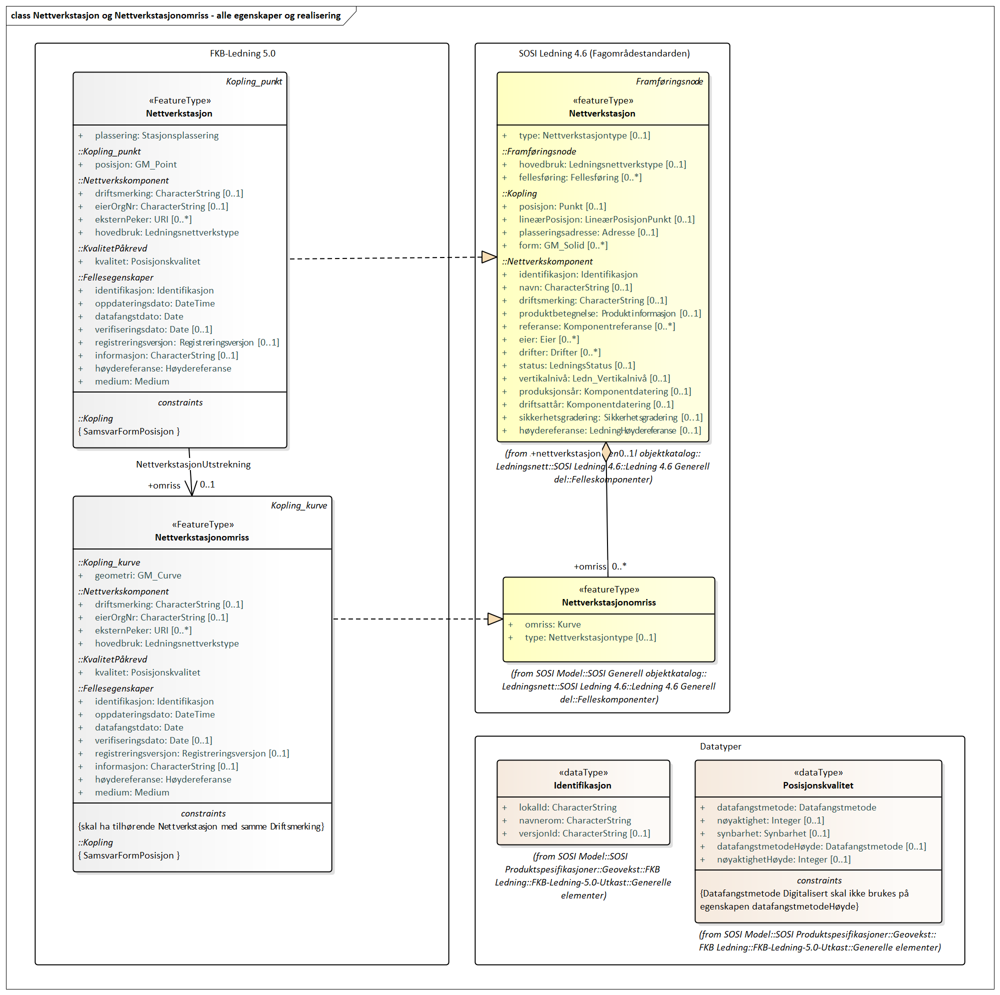
 
'''
 
.Skap - alle egenskaper og realisering 
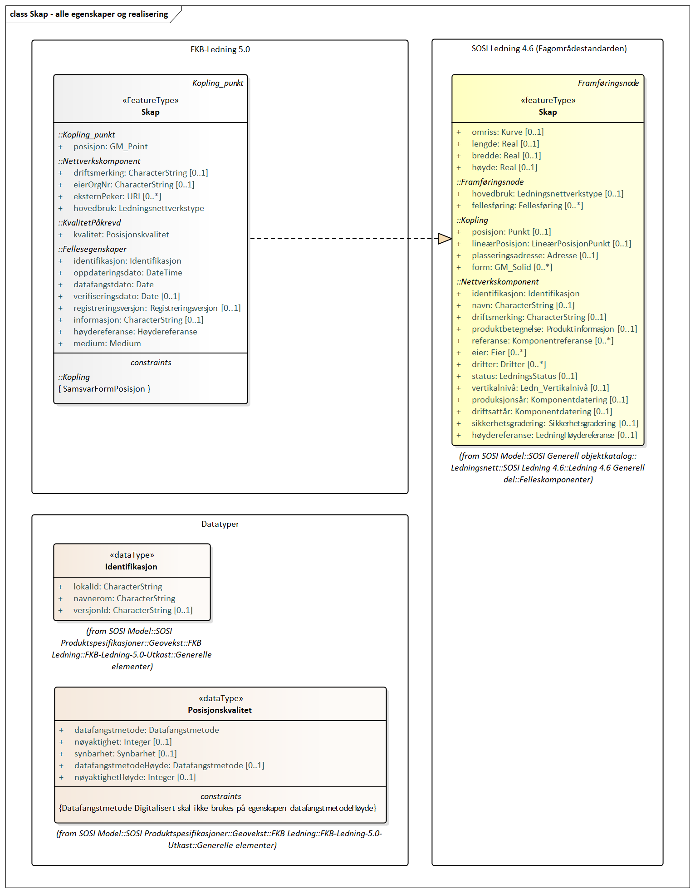
 
'''
 
.Trase - alle egenskaper og realisering 
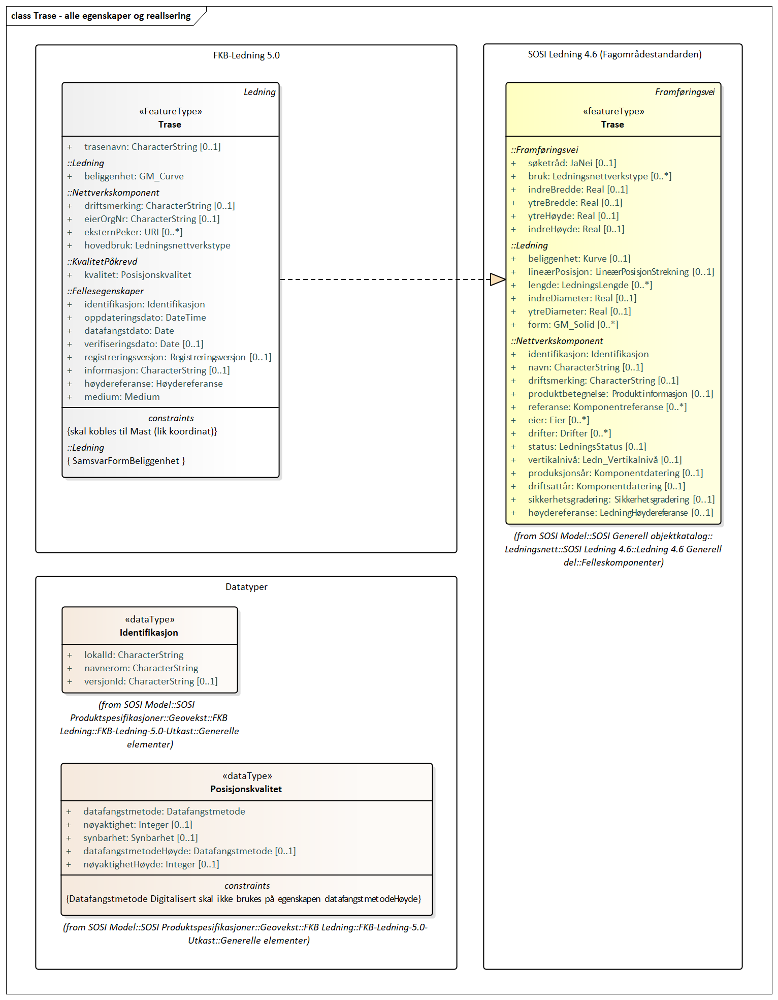
 
'''
 
.Vindturbin og Vindturbinomriss - alle egenskaper og realisering 
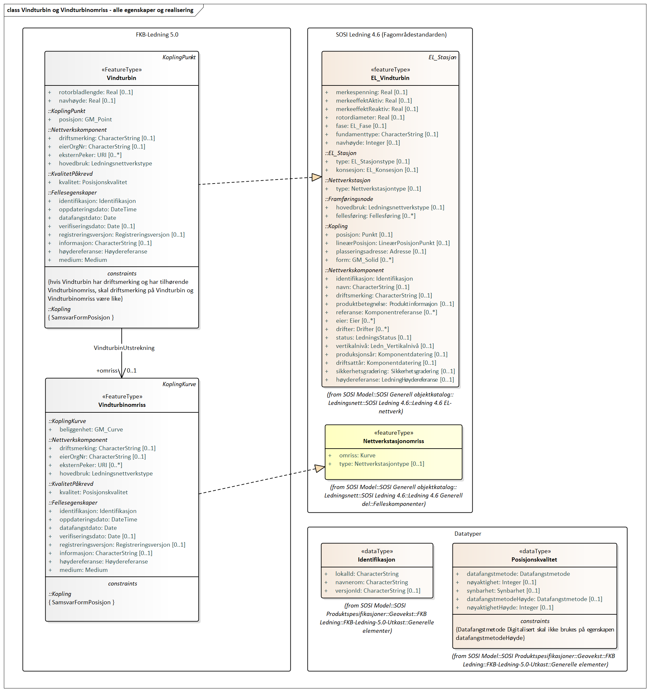
 
'''
 
.Åk - alle egenskaper og realisering 
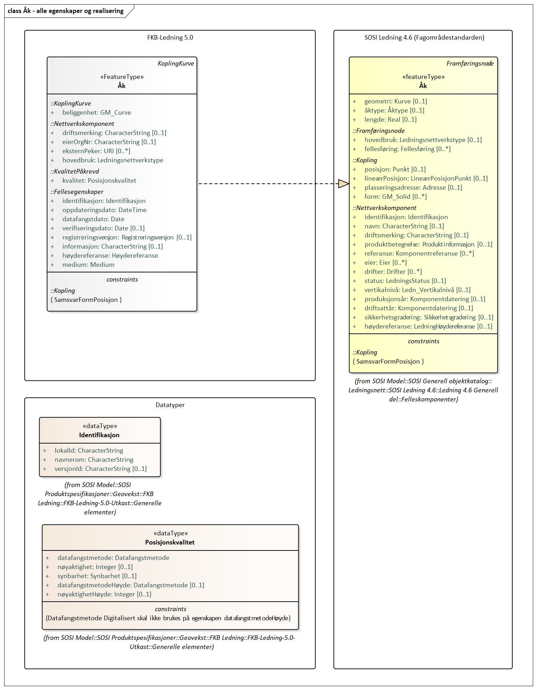
 
'''
 
[[bardun]]
===== «FeatureType» Bardun
*Definisjon:* tau, vaier eller liknende som støtter eller stabiliserer høye gjenstander

Merknad FKB:
Dersom flere barduner går i samme retning skal den høyeste og lengste bardunen registreres.

 
 
'''
.Illustrasjon av objekttype Bardun
image::http://skjema.geonorge.no/SOSI/produktspesifikasjon/FKB-Ledning/5.0/figurer/Bardun.jpg[link=http://skjema.geonorge.no/SOSI/produktspesifikasjon/FKB-Ledning/5.0/figurer/Bardun.jpg, alt="Bilde av et eksempel på objekttypen Bardun, eventuelt med påtegning av streker som viser hvor geometrien til objektet skal måles fra."]
 
[discrete]
====== Arv og realiseringer
[cols="20,80"]
|===
|Supertype: 
|<<koplingsenterlinje,«FeatureType» KoplingSenterlinje>>
 
|===
 
'''
 
[[flymarkør]]
===== «FeatureType» Flymarkør
*Definisjon:* markering av store luftspenn over daler og fjorder
 
 
'''
.Illustrasjon av objekttype Flymarkør
image::http://skjema.geonorge.no/SOSI/produktspesifikasjon/FKB-Ledning/5.0/figurer/Flymarkor.jpg[link=http://skjema.geonorge.no/SOSI/produktspesifikasjon/FKB-Ledning/5.0/figurer/Flymarkor.jpg, alt="Bilde av et eksempel på objekttypen Flymarkør, eventuelt med påtegning av streker som viser hvor geometrien til objektet skal måles fra."]
 
[discrete]
====== Restriksjoner
[cols="20,80"]
|===
|*Navn:* 
|*samme posisjon for flymarkør og kurvepunkt i Trase*
 
|Beskrivelse: 
|
--ingen OCL, restriksjonen implementeres manuelt
 + 
--flymarkør og kurvepunkt i Trase skal ha samme posisjon, både i grunnriss og høyde
 
|===
 
[discrete]
====== Arv og realiseringer
[cols="20,80"]
|===
|Supertype: 
|<<koplingpunkt,«FeatureType» KoplingPunkt>>
 
|===
 
'''
 
[[jordingsledning]]
===== «FeatureType» Jordingsledning
*Definisjon:* ledning hvor formålet er å lede farlige overspenninger til jord. ledningen er under normale forhold ikke strømførende
 
 
'''
.Illustrasjon av objekttype Jordingsledning
image::http://skjema.geonorge.no/SOSI/produktspesifikasjon/FKB-Ledning/5.0/figurer/Jordingsledning.jpg[link=http://skjema.geonorge.no/SOSI/produktspesifikasjon/FKB-Ledning/5.0/figurer/Jordingsledning.jpg, alt="Bilde av et eksempel på objekttypen Jordingsledning, eventuelt med påtegning av streker som viser hvor geometrien til objektet skal måles fra."]
 
[discrete]
====== Arv og realiseringer
[cols="20,80"]
|===
|Supertype: 
|<<lidarmetadata,«FeatureType» LidarMetadata>>
 
|Realisering av: 
|«ApplicationSchema» SOSI Ledning 4.6/Ledning 4.6 EL-nettverk::«featureType» Jordingsledning +
|===
 
'''
 
[[kabelkanal]]
===== «FeatureType» Kabelkanal
*Definisjon:* brukes som fremføringsvei for ledning
 
 
'''
.Illustrasjon av objekttype Kabelkanal
image::http://skjema.geonorge.no/SOSI/produktspesifikasjon/FKB-Ledning/5.0/figurer/Kabelkanal.jpg[link=http://skjema.geonorge.no/SOSI/produktspesifikasjon/FKB-Ledning/5.0/figurer/Kabelkanal.jpg, alt="Bilde av et eksempel på objekttypen Kabelkanal, eventuelt med påtegning av streker som viser hvor geometrien til objektet skal måles fra."]
 
[discrete]
====== Arv og realiseringer
[cols="20,80"]
|===
|Supertype: 
|<<ledning,«FeatureType» Ledning>>
 
|Realisering av: 
|«ApplicationSchema» SOSI Ledning 4.6/Ledning 4.6 Generell del/Felleskomponenter::«featureType» Kanal +
|===
 
'''
 
[[kum]]
===== «FeatureType» Kum
*Definisjon:* et fysisk objekt som regel av stål, plast eller betong som er gravd ned i bakken, og som lager et rom

Merknad FKB:
Ytterkant topp kumkonstruksjon der denne er synlig. 
 
 
'''
.Illustrasjon av objekttype Kum
image::http://skjema.geonorge.no/SOSI/produktspesifikasjon/FKB-Ledning/5.0/figurer/Kum.jpg[link=http://skjema.geonorge.no/SOSI/produktspesifikasjon/FKB-Ledning/5.0/figurer/Kum.jpg, alt="Bilde av et eksempel på objekttypen Kum, eventuelt med påtegning av streker som viser hvor geometrien til objektet skal måles fra."]
 
[discrete]
====== Arv og realiseringer
[cols="20,80"]
|===
|Supertype: 
|<<koplinggrense,«FeatureType» KoplingGrense>>
 
|Realisering av: 
|«ApplicationSchema» SOSI Ledning 4.6/Ledning 4.6 Generell del/Felleskomponenter::«featureType» Kum +
|===
 
'''
 
[[kumlokk]]
===== «FeatureType» Kumlokk
*Definisjon:* et deksel over en kum eller annet hulrom under bakkenivå
 
 
'''
.Illustrasjon av objekttype Kumlokk
image::http://skjema.geonorge.no/SOSI/produktspesifikasjon/FKB-Ledning/5.0/figurer/Kumlokk.jpg[link=http://skjema.geonorge.no/SOSI/produktspesifikasjon/FKB-Ledning/5.0/figurer/Kumlokk.jpg, alt="Bilde av et eksempel på objekttypen Kumlokk, eventuelt med påtegning av streker som viser hvor geometrien til objektet skal måles fra."]
[discrete]
====== Egenskaper
[cols="20,80"]
|===
|*Navn:* 
|*kumlokkform*
 
|Definisjon: 
|kumlokkets geometriske utforming
 
|Multiplisitet: 
|[1..1]
 
|Type: 
|<<kumlokkform,«CodeList» Kumlokkform>>
|Profilparametre i tagged values: 
|
defaultCodeSpace: https://register.geonorge.no/sosi-kodelister/fkb/ledning/5.0/kumlokkform + 
SOSI_datatype: T + 
SOSI_lengde: 20 + 
SOSI_navn: KUMLOKKFORM + 
|===
 
[discrete]
====== Roller
[cols="20,80"]
|===
|*Rollenavn:* 
|*kum*
 
|Definisjon:
|kum til kumlokk
 
|Multiplisitet: 
|[0..1]
 
|Assosiasjonsnavn: 
|KumKumlokk
 
|Til klasse
|<<kum,«FeatureType» Kum>>
|===
 
[discrete]
====== Arv og realiseringer
[cols="20,80"]
|===
|Supertype: 
|<<koplingpunkt,«FeatureType» KoplingPunkt>>
 
|Realisering av: 
|«ApplicationSchema» SOSI Ledning 4.6/Ledning 4.6 Generell del/Felleskomponenter::«featureType» Kumlokk +
|===
 
'''
 
[[luftledning]]
===== «FeatureType» Luftledning
*Definisjon:* vaier/kabel mellom to faste forankringspunkt, som er eller kan være strøm- eller signalførende
 
 
'''
.Illustrasjon av objekttype Luftledning
image::http://skjema.geonorge.no/SOSI/produktspesifikasjon/FKB-Ledning/5.0/figurer/Luftledning.jpg[link=http://skjema.geonorge.no/SOSI/produktspesifikasjon/FKB-Ledning/5.0/figurer/Luftledning.jpg, alt="Bilde av et eksempel på objekttypen Luftledning, eventuelt med påtegning av streker som viser hvor geometrien til objektet skal måles fra."]
[discrete]
====== Egenskaper
[cols="20,80"]
|===
|*Navn:* 
|*fase*
 
|Definisjon: 
|angivelse av intern plassering i grunnriss for aktuell faseline
 
|Multiplisitet: 
|[1..1]
 
|Type: 
|<<fase,«CodeList» Fase>>
|Profilparametre i tagged values: 
|
defaultCodeSpace: https://register.geonorge.no/sosi-kodelister/fkb/ledning/5.0/fase + 
SOSI_datatype: T + 
SOSI_lengde: 10 + 
SOSI_navn: FASE + 
|===
 
[discrete]
====== Arv og realiseringer
[cols="20,80"]
|===
|Supertype: 
|<<lidarmetadata,«FeatureType» LidarMetadata>>
 
|Realisering av: 
|«ApplicationSchema» SOSI Ledning 4.6/Ledning 4.6 EL-nettverk::«featureType» EL_Luftlinje +
|===
 
'''
 
[[lysarmatur]]
===== «FeatureType» Lysarmatur
*Definisjon:* selve det elektriske punktet som gir lys
 
 
'''
.Illustrasjon av objekttype Lysarmatur
image::http://skjema.geonorge.no/SOSI/produktspesifikasjon/FKB-Ledning/5.0/figurer/Lysarmatur.jpg[link=http://skjema.geonorge.no/SOSI/produktspesifikasjon/FKB-Ledning/5.0/figurer/Lysarmatur.jpg, alt="Bilde av et eksempel på objekttypen Lysarmatur, eventuelt med påtegning av streker som viser hvor geometrien til objektet skal måles fra."]
[discrete]
====== Egenskaper
[cols="20,80"]
|===
|*Navn:* 
|*plassering*
 
|Definisjon: 
|angivelse av hvor lysarmaturet er plassert
 
|Multiplisitet: 
|[1..1]
 
|Type: 
|<<punktplassering,«CodeList» Punktplassering>>
|Profilparametre i tagged values: 
|
defaultCodeSpace: https://register.geonorge.no/sosi-kodelister/fkb/ledning/5.0/punktplassering + 
SOSI_navn: BELYSNINGSPLASSERING + 
|===
 
[discrete]
====== Roller
[cols="20,80"]
|===
|*Rollenavn:* 
|*iMast*
 
|Definisjon: 
|referanse til masten hvor armaturet evt. er montert
 
|Multiplisitet: 
|[0..1]
 
|Assosiasjonsnavn: 
|MastArmatur
 
|Til klasse
|<<mast,«FeatureType» Mast>>
|===
 
[discrete]
====== Arv og realiseringer
[cols="20,80"]
|===
|Supertype: 
|<<koplingpunkt,«FeatureType» KoplingPunkt>>
 
|Realisering av: 
|«ApplicationSchema» SOSI Ledning 4.6/Ledning 4.6 EL-nettverk::«featureType» EL_Armatur +
|===
 
'''
 
[[mast]]
===== «FeatureType» Mast
*Definisjon:* alle konstruksjoner som primært er laget for å holde ledningsnett/komponent oppe fra bakken

Merknad FKB:
En mast kan bestå av en eller flere stolper og beskriver mastens representasjonspunkt (senterpunkt grunnriss / mastepunkt).
 
 
'''
.Illustrasjon av objekttype Mast
image::http://skjema.geonorge.no/SOSI/produktspesifikasjon/FKB-Ledning/5.0/figurer/Mast.jpg[link=http://skjema.geonorge.no/SOSI/produktspesifikasjon/FKB-Ledning/5.0/figurer/Mast.jpg, alt="Bilde av et eksempel på objekttypen Mast, eventuelt med påtegning av streker som viser hvor geometrien til objektet skal måles fra."]
[discrete]
====== Egenskaper
[cols="20,80"]
|===
|*Navn:* 
|*antallLaserPunkt*
 
|Definisjon: 
|antallet klassifiserte laserpunkt som er med på å bestemme vektorisert objekt

Merknad FKB:
Angis kun dersom mastens geometri har laser som datafangstmetode.
 
|Multiplisitet: 
|[0..1]
 
|Type: 
|http://skjema.geonorge.no/SOSI/basistype/Integer[Integer]
|Profilparametre i tagged values: 
|
SOSI_datatype: H + 
SOSI_lengde: 5 + 
SOSI_navn: ANTALL_LASERPUNKT + 
|===
[cols="20,80"]
|===
|*Navn:* 
|*belysning*
 
|Definisjon: 
|angir om det er montert ett eller flere lysarmaturer i masta
 
|Multiplisitet: 
|[1..1]
 
|Type: 
|http://skjema.geonorge.no/SOSI/basistype/Boolean[Boolean]
|Profilparametre i tagged values: 
|
SOSI_datatype: BOOLSK + 
SOSI_navn: BELYSNING + 
|===
[cols="20,80"]
|===
|*Navn:* 
|*konstruksjon*
 
|Definisjon: 
|hvordan masta er utformet
 
|Multiplisitet: 
|[0..1]
 
|Type: 
|<<mastekonstruksjon,«CodeList» Mastekonstruksjon>>
|Profilparametre i tagged values: 
|
defaultCodeSpace: https://register.geonorge.no/sosi-kodelister/fkb/ledning/5.0/mastekonstruksjon + 
SOSI_datatype: T + 
SOSI_lengde: 20 + 
SOSI_navn: MASTEKONSTRUKSJON + 
|===
[cols="20,80"]
|===
|*Navn:* 
|*linjebredde*
 
|Definisjon: 
|største avstanden mellom ytterfasene (ledningene) i ei mast

Enhet: meter
 
|Multiplisitet: 
|[0..1]
 
|Type: 
|http://skjema.geonorge.no/SOSI/basistype/Real[Real]
|Profilparametre i tagged values: 
|
SOSI_datatype: D + 
SOSI_lengde: 6.2 + 
SOSI_navn: LINJEBREDDE + 
|===
[cols="20,80"]
|===
|*Navn:* 
|*vertikalAvstand*
 
|Definisjon: 
|mastens maksimale vertikale høyde over under-/omkringliggende terreng eller vannoverflate

Enhet: meter
 
|Multiplisitet: 
|[0..1]
 
|Type: 
|http://skjema.geonorge.no/SOSI/basistype/Real[Real]
|Profilparametre i tagged values: 
|
SOSI_datatype: D + 
SOSI_lengde: 6.2 + 
SOSI_navn: VERTIKALAVSTAND + 
|===
 
[discrete]
====== Roller
[cols="20,80"]
|===
|*Rollenavn:* 
|*harArmatur*
 
|Definisjon:
|referanse til de armaturer som evt. er montert i masta
 
|Multiplisitet: 
|[0..*]
 
|Assosiasjonsnavn: 
|MastArmatur
 
|Til klasse
|<<lysarmatur,«FeatureType» Lysarmatur>>
|===
[cols="20,80"]
|===
|*Rollenavn:* 
|*bardun*
 
|Definisjon:
|bardun til mast
 
|Multiplisitet: 
|[0..*]
 
|Assosiasjonsnavn: 
|MastBardun
 
|Til klasse
|<<bardun,«FeatureType» Bardun>>
|===
[cols="20,80"]
|===
|*Rollenavn:* 
|*omriss*
 
|Definisjon:
|omrisset til mast
 
|Multiplisitet: 
|[0..*]
 
|Assosiasjonsnavn: 
|MastUtstrekning
 
|Til klasse
|<<masteomriss,«FeatureType» Masteomriss>>
|===
 
[discrete]
====== Restriksjoner
[cols="20,80"]
|===
|*Navn:* 
|*driftsmerking på Mast og Masteomriss skal være like*
 
|Beskrivelse: 
|inv: (self.driftsmerking -&gt; notEmpty() and self.omriss -&gt; notEmpty() ) implies (self.omriss-&gt;forAll(m:Masteomriss\|m.driftsmerking = self.driftsmerking) )

--hvis Mast har driftsmerking og har tilhørende Masteomriss, skal driftsmerking på Mast og Masteomriss være like
 
|===
 
[discrete]
====== Arv og realiseringer
[cols="20,80"]
|===
|Supertype: 
|<<koplingpunkt,«FeatureType» KoplingPunkt>>
 
|Realisering av: 
|«ApplicationSchema» SOSI Ledning 4.6/Ledning 4.6 Generell del/Felleskomponenter::«featureType» Mast +
|===
 
'''
 
[[masteomriss]]
===== «FeatureType» Masteomriss
*Definisjon:* ytre avgrensning av mastens fotavtrykk på bakken
 
[discrete]
====== Egenskaper
[cols="20,80"]
|===
|*Navn:* 
|*type*
 
|Definisjon: 
|type mast
 
|Multiplisitet: 
|[0..1]
 
|Type: 
|<<mastekonstruksjon,«CodeList» Mastekonstruksjon>>
|Profilparametre i tagged values: 
|
defaultCodeSpace: https://register.geonorge.no/sosi-kodelister/fkb/ledning/5.0/mastekonstruksjon + 
SOSI_datatype: T + 
SOSI_lengde: 20 + 
SOSI_navn: MASTEKONSTRUKSJON + 
|===
 
[discrete]
====== Arv og realiseringer
[cols="20,80"]
|===
|Supertype: 
|<<koplinggrense,«FeatureType» KoplingGrense>>
 
|Realisering av: 
|«ApplicationSchema» SOSI Ledning 4.6/Ledning 4.6 Generell del/Felleskomponenter::«featureType» Masteomriss +
|===
 
'''
 
[[nettverkstasjon]]
===== «FeatureType» Nettverkstasjon
*Definisjon:* et fysisk, gjerne bygningsmessig, objekt som inneholder komponenter som gjør en eller annen behandling av vann, elektrisk strøm, signal eller annet som det nettverket den er en del av fører.
 
 
'''
.Illustrasjon av objekttype Nettverkstasjon
image::http://skjema.geonorge.no/SOSI/produktspesifikasjon/FKB-Ledning/5.0/figurer/Nettverkstasjon.jpg[link=http://skjema.geonorge.no/SOSI/produktspesifikasjon/FKB-Ledning/5.0/figurer/Nettverkstasjon.jpg, alt="Bilde av et eksempel på objekttypen Nettverkstasjon, eventuelt med påtegning av streker som viser hvor geometrien til objektet skal måles fra."]
[discrete]
====== Egenskaper
[cols="20,80"]
|===
|*Navn:* 
|*plassering*
 
|Definisjon: 
|angir hvor nettverksstasjonen er plassert
 
|Multiplisitet: 
|[1..1]
 
|Type: 
|<<stasjonsplassering,«CodeList» Stasjonsplassering>>
|Profilparametre i tagged values: 
|
defaultCodeSpace: https://register.geonorge.no/sosi-kodelister/fkb/ledning/5.0/stasjonsplassering + 
SOSI_datatype: T + 
SOSI_lengde: 32 + 
SOSI_navn: STASJONSPLASSERING + 
|===
 
[discrete]
====== Roller
[cols="20,80"]
|===
|*Rollenavn:* 
|*omriss*
 
|Definisjon:
|omrisset til nettverkstasjon
 
|Multiplisitet: 
|[0..1]
 
|Assosiasjonsnavn: 
|NettverkstasjonUtstrekning
 
|Til klasse
|<<nettverkstasjonomriss,«FeatureType» Nettverkstasjonomriss>>
|===
 
[discrete]
====== Restriksjoner
[cols="20,80"]
|===
|*Navn:* 
|*driftsmerking på Nettverkstasjon og Nettverkstasjonomriss skal være like*
 
|Beskrivelse: 
|inv: (self.driftsmerking -&gt; notEmpty() and self.omriss -&gt; notEmpty() ) implies (self.driftsmerking = self.omriss.driftsmerking)

--hvis Nettverkstasjon har driftsmerking og har tilhørende Nettverkstasjonomriss, skal driftsmerking på Nettverkstasjon og Nettverkstasjonomriss være like
 
|===
 
[discrete]
====== Arv og realiseringer
[cols="20,80"]
|===
|Supertype: 
|<<koplingpunkt,«FeatureType» KoplingPunkt>>
 
|Realisering av: 
|«ApplicationSchema» SOSI Ledning 4.6/Ledning 4.6 Generell del/Felleskomponenter::«featureType» Nettverkstasjon +
|===
 
'''
 
[[nettverkstasjonomriss]]
===== «FeatureType» Nettverkstasjonomriss
*Definisjon:* ytre avgrensning av nettverkstasjonen, i grunnriss
 
 
[discrete]
====== Arv og realiseringer
[cols="20,80"]
|===
|Supertype: 
|<<koplinggrense,«FeatureType» KoplingGrense>>
 
|Realisering av: 
|«ApplicationSchema» SOSI Ledning 4.6/Ledning 4.6 Generell del/Felleskomponenter::«featureType» Nettverkstasjonomriss +
|===
 
'''
 
[[skap]]
===== «FeatureType» Skap
*Definisjon:* beskyttelseskasse plassert vanligvis på bakken, som inneholder koblinger for elektrisk strøm, signal eller annet

Merknad:
Kan også være på størrelse med kiosk.
 
 
'''
.Illustrasjon av objekttype Skap
image::http://skjema.geonorge.no/SOSI/produktspesifikasjon/FKB-Ledning/5.0/figurer/Skap.jpg[link=http://skjema.geonorge.no/SOSI/produktspesifikasjon/FKB-Ledning/5.0/figurer/Skap.jpg, alt="Bilde av et eksempel på objekttypen Skap, eventuelt med påtegning av streker som viser hvor geometrien til objektet skal måles fra."]
 
[discrete]
====== Arv og realiseringer
[cols="20,80"]
|===
|Supertype: 
|<<koplingpunkt,«FeatureType» KoplingPunkt>>
 
|Realisering av: 
|«ApplicationSchema» SOSI Ledning 4.6/Ledning 4.6 Generell del/Felleskomponenter::«featureType» Skap +
|===
 
'''
 
[[trase]]
===== «FeatureType» Trase
*Definisjon:* den mest mulig geografisk riktige posisjonen for en framføring av ledning(er)
 
 
'''
.Illustrasjon av objekttype Trase
image::http://skjema.geonorge.no/SOSI/produktspesifikasjon/FKB-Ledning/5.0/figurer/Trase.jpg[link=http://skjema.geonorge.no/SOSI/produktspesifikasjon/FKB-Ledning/5.0/figurer/Trase.jpg, alt="Bilde av et eksempel på objekttypen Trase, eventuelt med påtegning av streker som viser hvor geometrien til objektet skal måles fra."]
[discrete]
====== Egenskaper
[cols="20,80"]
|===
|*Navn:* 
|*trasenavn*
 
|Definisjon: 
|navn på trasen 

Merknad FKB:
Dette er gjerne en tekstlig beskrivelse av traséens plassering, for eksempel "fra stasjon til stasjon"
 
|Multiplisitet: 
|[0..1]
 
|Type: 
|http://skjema.geonorge.no/SOSI/basistype/CharacterString[CharacterString]
|Profilparametre i tagged values: 
|
SOSI_datatype: T + 
SOSI_lengde: 100 + 
SOSI_navn: TRASENAVN + 
|===
 
[discrete]
====== Restriksjoner
[cols="20,80"]
|===
|*Navn:* 
|*samme posisjon for knekkpunkt i Trase som Mast*
 
|Beskrivelse: 
|
--ingen OCL, restriksjonen implementeres manuelt
 
|===
 
[discrete]
====== Arv og realiseringer
[cols="20,80"]
|===
|Supertype: 
|<<lidarmetadata,«FeatureType» LidarMetadata>>
 
|Realisering av: 
|«ApplicationSchema» SOSI Ledning 4.6/Ledning 4.6 Generell del/Felleskomponenter::«featureType» Trase +
|===
 
'''
 
[[vindturbin]]
===== «FeatureType» Vindturbin
*Definisjon:* en kontainer som betegner en hel "vindmølle". En vindturbin har en generator
 
 
'''
.Illustrasjon av objekttype Vindturbin
image::http://skjema.geonorge.no/SOSI/produktspesifikasjon/FKB-Ledning/5.0/figurer/Vindturbin.jpg[link=http://skjema.geonorge.no/SOSI/produktspesifikasjon/FKB-Ledning/5.0/figurer/Vindturbin.jpg, alt="Bilde av et eksempel på objekttypen Vindturbin, eventuelt med påtegning av streker som viser hvor geometrien til objektet skal måles fra."]
[discrete]
====== Egenskaper
[cols="20,80"]
|===
|*Navn:* 
|*rotorbladlengde*
 
|Definisjon: 
|lengde rotorblad

Enhet: meter
 
|Multiplisitet: 
|[0..1]
 
|Type: 
|http://skjema.geonorge.no/SOSI/basistype/Real[Real]
|Profilparametre i tagged values: 
|
SOSI_datatype: D + 
SOSI_lengde: 3.3 + 
SOSI_navn: ROTORBLADLENGDE + 
|===
[cols="20,80"]
|===
|*Navn:* 
|*navhøyde*
 
|Definisjon: 
|vertikal avstand fra omkringliggende terreng eller vann og til topp vindturbintårn

Enhet: meter
 
|Multiplisitet: 
|[0..1]
 
|Type: 
|http://skjema.geonorge.no/SOSI/basistype/Real[Real]
|Profilparametre i tagged values: 
|
SOSI_datatype: D + 
SOSI_lengde: D3.3 + 
SOSI_navn: NAVHØYDE + 
|===
 
[discrete]
====== Roller
[cols="20,80"]
|===
|*Rollenavn:* 
|*omriss*
 
|Definisjon:
|omrisset til vindturbinen
 
|Multiplisitet: 
|[0..1]
 
|Assosiasjonsnavn: 
|VindturbinUtstrekning
 
|Til klasse
|<<vindturbinomriss,«FeatureType» Vindturbinomriss>>
|===
 
[discrete]
====== Restriksjoner
[cols="20,80"]
|===
|*Navn:* 
|*driftsmerking på Vindturbin og Vindturbinomriss skal være like*
 
|Beskrivelse: 
|inv: (self.driftsmerking -&gt; notEmpty() and self.omriss -&gt; notEmpty() ) implies (self.driftsmerking = self.omriss.driftsmerking)

--hvis Vindturbin har driftsmerking og har tilhørende Vindturbinomriss, skal driftsmerking på Vindturbin og Vindturbinomriss være like
 
|===
 
[discrete]
====== Arv og realiseringer
[cols="20,80"]
|===
|Supertype: 
|<<koplingpunkt,«FeatureType» KoplingPunkt>>
 
|Realisering av: 
|«ApplicationSchema» SOSI Ledning 4.6/Ledning 4.6 EL-nettverk::«featureType» EL_Vindturbin +
|===
 
'''
 
[[vindturbinomriss]]
===== «FeatureType» Vindturbinomriss
*Definisjon:* ytre avgrensning av vindturbinens fotavtrykk på bakken
 
 
[discrete]
====== Arv og realiseringer
[cols="20,80"]
|===
|Supertype: 
|<<koplinggrense,«FeatureType» KoplingGrense>>
 
|Realisering av: 
|«ApplicationSchema» SOSI Ledning 4.6/Ledning 4.6 Generell del/Felleskomponenter::«featureType» Nettverkstasjonomriss +
|===
 
'''
 
[[åk]]
===== «FeatureType» Åk
*Definisjon:* en hovedsaklig liggende konstruksjon festet i (vanligvis) to master, ei på hver side av bane

Merknad FKB:
"Beina" er egne objekter (objekttype Mast), og ikke del av objektet av objekttypen Åk.
 
 
'''
.Illustrasjon av objekttype Åk
image::http://skjema.geonorge.no/SOSI/produktspesifikasjon/FKB-Ledning/5.0/figurer/Aak.jpg[link=http://skjema.geonorge.no/SOSI/produktspesifikasjon/FKB-Ledning/5.0/figurer/Aak.jpg, alt="Bilde av et eksempel på objekttypen Åk, eventuelt med påtegning av streker som viser hvor geometrien til objektet skal måles fra."]
 
[discrete]
====== Arv og realiseringer
[cols="20,80"]
|===
|Supertype: 
|<<koplingsenterlinje,«FeatureType» KoplingSenterlinje>>
 
|Realisering av: 
|«ApplicationSchema» SOSI Ledning 4.6/Ledning 4.6 Generell del/Felleskomponenter::«featureType» Åk +
|===
<<<
'''
==== Pakke: Datatyper
*Definisjon:* Alle Datatyper (gruppeegenskaper) som ikke er en del av de generelle FKB elementene, men som inngår i denne spesifikke FKB-datamodellen.
 
'''
 
.Fagspesifikke datatyper FKB-Ledning 
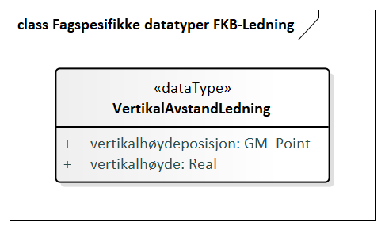
 
'''
 
[[vertikalavstandledning]]
===== «dataType» VertikalAvstandLedning
*Definisjon:* ledningens høyde over/til terreng, vann eller sjø
 
[discrete]
====== Egenskaper
[cols="20,80"]
|===
|*Navn:* 
|*vertikalAvstandPosisjon*
 
|Definisjon: 
|posisjonen til det punktet på objektet hvor vertikal avstand er angitt

Merknad FKB:
Ved SOSI-format realisering skal vertikalhøydeposisjonen angis på følgende måte: ...NØHKOOR "&lt;KOORSYS&gt; &lt;N&gt; &lt;Ø&gt; &lt;H&gt;" 

Eksempel: ...NØHKOOR "22 7175399.09 395657.11 219.82"
 
|Multiplisitet: 
|[1..1]
 
|Type: 
|http://skjema.geonorge.no/SOSI/basistype/GM_Point[GM_Point]
|Profilparametre i tagged values: 
|
SOSI_datatype: T + 
SOSI_lengde: 70 + 
SOSI_navn: NØHKOOR + 
|===
[cols="20,80"]
|===
|*Navn:* 
|*vertikalAvstand*
 
|Definisjon: 
|avstand i vertikalplanet fra objektet til under-/omkringliggende terreng eller vannoverflate

Enhet: meter
 
|Multiplisitet: 
|[1..1]
 
|Type: 
|<<real,«dataType» Real>>
|Profilparametre i tagged values: 
|
SOSI_datatype: 8.2 + 
SOSI_datatype: D + 
SOSI_lengde: 8.2 + 
SOSI_navn: VERTIKALAVSTAND + 
|===
<<<
'''
==== Pakke: Kodelister
*Definisjon:* Alle Kodelister som ikke er en del av de generelle FKB elementene, men som inngår i denne spesifikke FKB-datamodellen.

Kodelistene forvaltes eksternt på Geonorge. Kodelistene er tilgjenglig på https://register.geonorge.no/sosi-kodelister/fkb/ledning/5.0
 
'''
 
.Fagspesifikke kodelister FKB-Ledning 
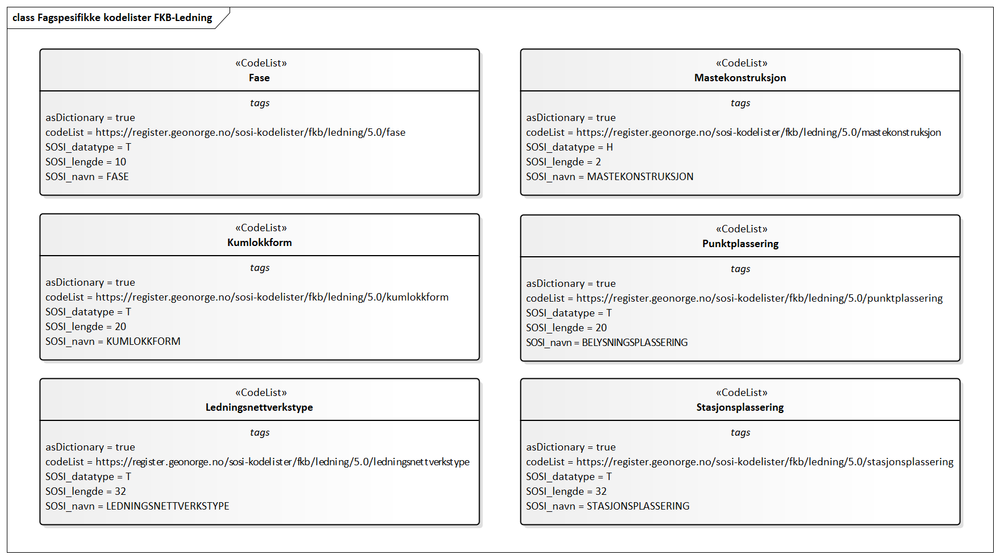
 
'''
 
.Realiseringer kodelister 
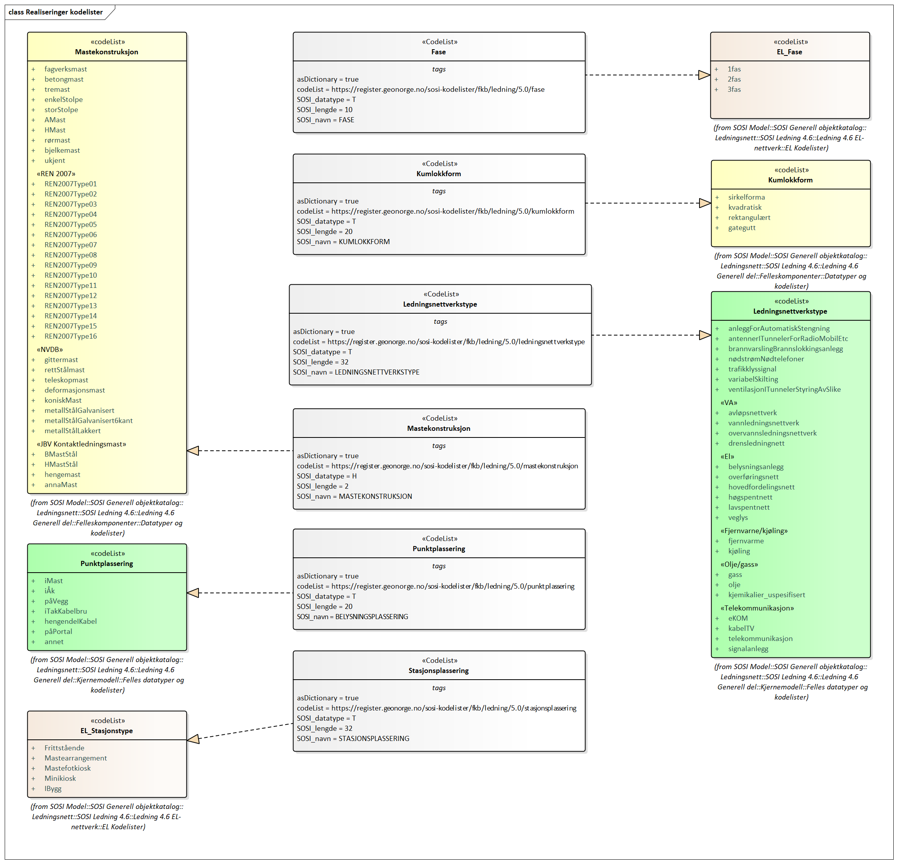
 
'''
 
[[fase]]
===== «CodeList» Fase
*Definisjon:* angivelse av intern plassering i grunnriss for aktuell faseline
 
[discrete]
====== Profilparametre i tagged values
[cols="20,80"]
|===
|asDictionary
|true
 
|codeList
|https://register.geonorge.no/sosi-kodelister/fkb/ledning/5.0/fase
 
|SOSI_datatype
|T
 
|SOSI_lengde
|10
 
|SOSI_navn
|FASE
 
|===
 
'''
 
[[kumlokkform]]
===== «CodeList» Kumlokkform
*Definisjon:* kodeliste som inneholder hvilke geometrisk utforminger et kumlokk kan ha
 
[discrete]
====== Profilparametre i tagged values
[cols="20,80"]
|===
|asDictionary
|true
 
|codeList
|https://register.geonorge.no/sosi-kodelister/fkb/ledning/5.0/kumlokkform
 
|SOSI_datatype
|T
 
|SOSI_lengde
|20
 
|SOSI_navn
|KUMLOKKFORM
 
|===
 
'''
 
[[ledningsnettverkstype]]
===== «CodeList» Ledningsnettverkstype
*Definisjon:* oversikt over nettverkstyper, satt sammen av nettverkskomponenter, med en bestemt hensikt

Merknad: 
Et nettverk utgjør en logisk enhet. Et nettverk kan være knytta til andre nettverk, men da oftest på bestemte tilkoplingspunkter.
 
[discrete]
====== Profilparametre i tagged values
[cols="20,80"]
|===
|asDictionary
|true
 
|codeList
|https://register.geonorge.no/sosi-kodelister/fkb/ledning/5.0/ledningsnettverkstype
 
|SOSI_datatype
|T
 
|SOSI_lengde
|32
 
|SOSI_navn
|LEDNINGSNETTVERKSTYPE
 
|===
 
'''
 
[[mastekonstruksjon]]
===== «CodeList» Mastekonstruksjon
*Definisjon:* hvordan masta er konstruert

Merknad: Enkelte av kodene er stereotypet for å fortelle hvor konstruksjonstypen er hentet fra.
 
[discrete]
====== Profilparametre i tagged values
[cols="20,80"]
|===
|asDictionary
|true
 
|codeList
|https://register.geonorge.no/sosi-kodelister/fkb/ledning/5.0/mastekonstruksjon
 
|SOSI_datatype
|T
 
|SOSI_lengde
|20
 
|SOSI_navn
|MASTEKONSTRUKSJON
 
|===
 
'''
 
[[punktplassering]]
===== «CodeList» Punktplassering
*Definisjon:* tekstlig beskrivelse av hvor et punkt er plassert
 
[discrete]
====== Profilparametre i tagged values
[cols="20,80"]
|===
|asDictionary
|true
 
|codeList
|https://register.geonorge.no/sosi-kodelister/fkb/ledning/5.0/punktplassering
 
|SOSI_datatype
|T
 
|SOSI_lengde
|20
 
|SOSI_navn
|BELYSNINGSPLASSERING
 
|===
 
'''
 
[[stasjonsplassering]]
===== «CodeList» Stasjonsplassering
*Definisjon:* kodeliste som angir hvor nettverksstasjonen er plassert
 
[discrete]
====== Profilparametre i tagged values
[cols="20,80"]
|===
|asDictionary
|true
 
|codeList
|https://register.geonorge.no/sosi-kodelister/fkb/ledning/5.0/stasjonsplassering
 
|SOSI_datatype
|T
 
|SOSI_lengde
|32
 
|SOSI_navn
|STASJONSPLASSERING
 
|===
<<<
'''
==== Pakke: Generelle elementer
*Definisjon:* pakke med elementer som realiserer tilsvarende elementer i FKB Generell del 5.0
 
'''
 
.Oversiktsdiagram Fellesegenskaper 
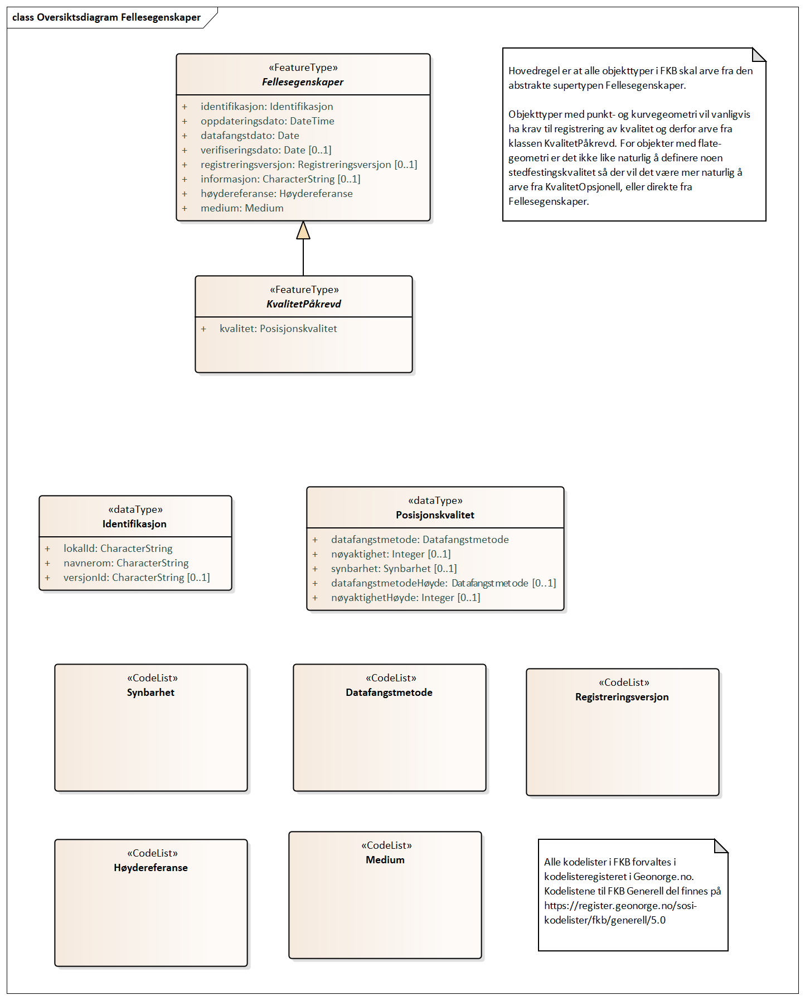
 
'''
 
.Realisering fra SOSI generell del 
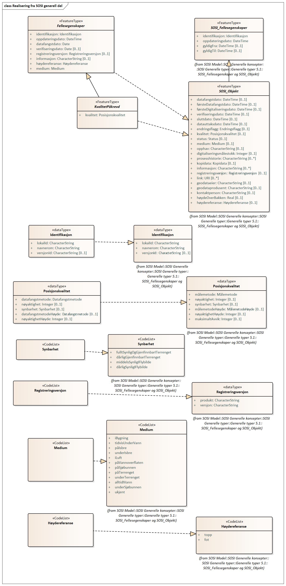
 
'''
 
.Hoveddiagram Posisjonskvalitet 
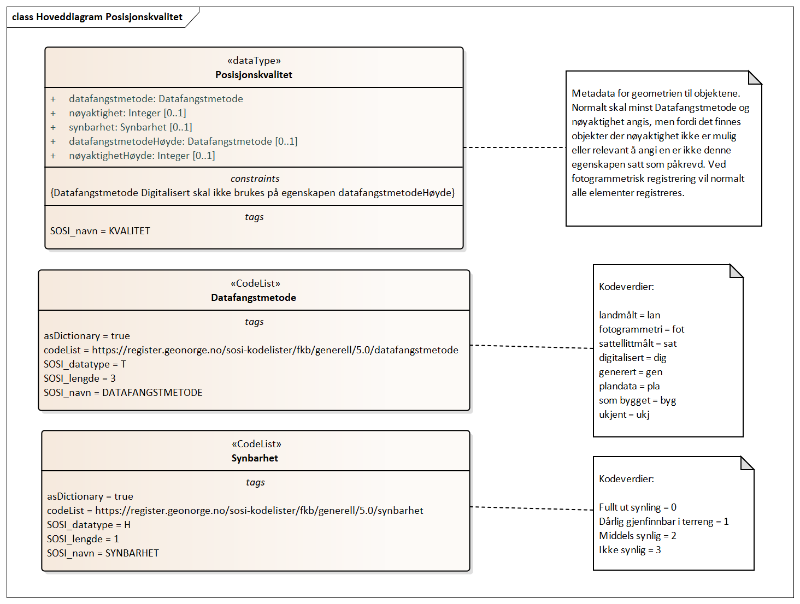
 
'''
 
[[fellesegenskaper]]
===== «FeatureType» Fellesegenskaper (abstrakt)
*Definisjon:* abstrakt objekttype som bærer sentrale egenskaper som er anbefalt for bruk i produktspesifikasjoner.
 
[discrete]
====== Egenskaper
[cols="20,80"]
|===
|*Navn:* 
|*identifikasjon*
 
|Definisjon: 
|unik identifikasjon av et objekt 

Merknad FKB:
Unik identifikasjon av et objekt, ivaretas av den ansvarlige produsent/forvalter, og som kan benyttes av eksterne applikasjoner som referanse til objektet.

Den unike identifikatoren er unik for kartobjektet og skal ikke endres i kartobjektets levetid. Dette må ikke forveksles med en tematisk identifikator (for eksempel bygningsnummer) som unikt identifiserer et objekt i virkeligheten. En bygning med samme bygningsnummer vil kunne representeres i mange kartprodukter der det finnes en unik identifikasjon i hver av dem.

For FKB benyttes UUID (Universally unique identifier) som lokalId. Dette innebærer at lokalId alene alltid vil være unik. Likevel skal alltid navnerom også angis. Navnerom angir FKB-datasettet.
 
|Multiplisitet: 
|[1..1]
 
|Type: 
|<<identifikasjon,«dataType» Identifikasjon>>
|Profilparametre i tagged values: 
|
SOSI_navn: IDENT + 
|===
[cols="20,80"]
|===
|*Navn:* 
|*oppdateringsdato*
 
|Definisjon: 
|tidspunkt for siste endring på objektet 

Merknad FKB: 

Denne datoen viser datasystemets siste endring på dataobjektet. Egenskapen settes av forvaltningssystemet etter følgende regler:

i. Oppdateringsdato er tidspunkt for oppdatering av databasen og settes av forvaltningsbasen (ikke av klienten).

ii. Oppdateringsdato skal endres også hvis det er kopidata som blir endret eller importert i en ”kopibase”.

iii. Oppdateringsdato skal endres hvis en egenskap endres.
 
|Multiplisitet: 
|[1..1]
 
|Type: 
|http://skjema.geonorge.no/SOSI/basistype/DateTime[DateTime]
|Profilparametre i tagged values: 
|
SOSI_datatype: DATOTID + 
SOSI_navn: OPPDATERINGSDATO + 
|===
[cols="20,80"]
|===
|*Navn:* 
|*sluttdato*
 
|Definisjon: 
|tid for når denne versjonen av objektet var erstattet eller opphørt å eksistere

Merknad FKB:
Egenskapen settes av forvaltningssystemet. Sluttdato skal kun sendes med ut fra forvaltningssystemet i sammenhenger der objektenes historikk er interessant.
 
|Multiplisitet: 
|[0..1]
 
|Type: 
|http://skjema.geonorge.no/SOSI/basistype/DateTime[DateTime]
|Profilparametre i tagged values: 
|
SOSI_datatype: DATOTID + 
SOSI_navn: SLUTTDATO + 
|===
[cols="20,80"]
|===
|*Navn:* 
|*datafangstdato*
 
|Definisjon: 
|dato når objektet siste gang ble registrert/observert/målt i terrenget

Merknad: I mange tilfeller er denne forskjellig fra oppdateringsdato, da registrerte endringer kan bufres i en kortere eller lengre periode før disse legges inn i databasen.
Ved førstegangsregistrering settes Datafangstdato lik førsteDatafangstdato.
 
|Multiplisitet: 
|[1..1]
 
|Type: 
|http://skjema.geonorge.no/SOSI/basistype/Date[Date]
|Profilparametre i tagged values: 
|
SOSI_datatype: DATO + 
SOSI_navn: DATAFANGSTDATO + 
|===
[cols="20,80"]
|===
|*Navn:* 
|*verifiseringsdato*
 
|Definisjon: 
|dato når dataene er fastslått å være i samsvar med virkeligheten.

Merknad FKB:
Brukes for eksempel i de sammenhenger hvor det er foretatt fotogrammetrisk ajourhold, og hvor det ikke er registrert endringer på objektet (det virkelige objektet er i samsvar med dataobjektet)
 
|Multiplisitet: 
|[0..1]
 
|Type: 
|http://skjema.geonorge.no/SOSI/basistype/Date[Date]
|Profilparametre i tagged values: 
|
SOSI_datatype: DATO + 
SOSI_navn: VERIFISERINGSDATO + 
|===
[cols="20,80"]
|===
|*Navn:* 
|*registreringsversjon*
 
|Definisjon: 
|angivelse av hvilken produktspesifikasjon som er utgangspunkt  for dataene
 
|Multiplisitet: 
|[0..1]
 
|Type: 
|<<registreringsversjon,«CodeList» Registreringsversjon>>
|Profilparametre i tagged values: 
|
defaultCodeSpace: https://register.geonorge.no/sosi-kodelister/fkb/generell/5.0/registreringsversjon + 
SOSI_datatype: T + 
SOSI_lengde: 10 + 
SOSI_navn: REGISTRERINGSVERSJON + 
|===
[cols="20,80"]
|===
|*Navn:* 
|*informasjon*
 
|Definisjon: 
|generell opplysning.

Merknad FKB:
Mulighet til å legge inn utfyllende informasjon om objektet. Egenskapen bør bare brukes til å legge inn ekstra informasjon om enkeltobjekter. Egenskapen bør ikke brukes til å systematisk angi ekstrainformasjon om mange/alle objekter i et datasett.
 
|Multiplisitet: 
|[0..1]
 
|Type: 
|http://skjema.geonorge.no/SOSI/basistype/CharacterString[CharacterString]
|Profilparametre i tagged values: 
|
SOSI_datatype: T + 
SOSI_lengde: 255 + 
SOSI_navn: INFORMASJON + 
|===
[cols="20,80"]
|===
|*Navn:* 
|*høydereferanse*
 
|Definisjon: 
|angir hvilken del av objektet høydeverdien refererer til
 
|Multiplisitet: 
|[1..1]
 
|Type: 
|<<høydereferanse,«CodeList» Høydereferanse>>
|Profilparametre i tagged values: 
|
defaultCodeSpace: https://register.geonorge.no/sosi-kodelister/fkb/generell/5.0/hoydereferanse + 
SOSI_datatype: T + 
SOSI_lengde: 6 + 
SOSI_navn: HREF + 
|===
[cols="20,80"]
|===
|*Navn:* 
|*medium*
 
|Definisjon: 
|objektets beliggenhet i forhold til jordoverflaten
 
|Multiplisitet: 
|[1..1]
 
|Type: 
|<<medium,«CodeList» Medium>>
|Profilparametre i tagged values: 
|
defaultCodeSpace: https://register.geonorge.no/sosi-kodelister/fkb/generell/5.0/medium + 
SOSI_datatype: T + 
SOSI_lengde: 1 + 
SOSI_navn: MEDIUM + 
|===
 
[discrete]
====== Arv og realiseringer
[cols="20,80"]
|===
|Subtyper:
|<<kvalitetpåkrevd,«FeatureType» KvalitetPåkrevd>> +
|Realisering av: 
|«ApplicationSchema» Generelle typer 5.1/SOSI_Fellesegenskaper og SOSI_Objekt::«FeatureType» SOSI_Objekt +
|===
 
'''
 
[[kvalitetpåkrevd]]
===== «FeatureType» KvalitetPåkrevd (abstrakt)
*Definisjon:* abstrakt objekttype med påkrevet kvalitetsangivelse
 
[discrete]
====== Egenskaper
[cols="20,80"]
|===
|*Navn:* 
|*kvalitet*
 
|Definisjon: 
|beskrivelse av kvaliteten på stedfestingen

Merknad: Denne er identisk med ..KVALITET i tidligere versjoner av SOSI.
 
|Multiplisitet: 
|[1..1]
 
|Type: 
|<<posisjonskvalitet,«dataType» Posisjonskvalitet>>
|Profilparametre i tagged values: 
|
SOSI_navn: KVALITET + 
|===
 
[discrete]
====== Arv og realiseringer
[cols="20,80"]
|===
|Supertype: 
|<<fellesegenskaper,«FeatureType» Fellesegenskaper>>
 
|Subtyper:
|<<nettverkskomponent,«FeatureType» Nettverkskomponent>> +
|Realisering av: 
|«ApplicationSchema» Generelle typer 5.1/SOSI_Fellesegenskaper og SOSI_Objekt::«FeatureType» SOSI_Objekt +
|===
 
'''
 
[[identifikasjon]]
===== «dataType» Identifikasjon
*Definisjon:* Unik identifikasjon av et objekt i et datasett, forvaltet av den ansvarlige produsent/forvalter, og kan benyttes av eksterne applikasjoner som stabil referanse til objektet. 

Merknad 1: Denne objektidentifikasjonen må ikke forveksles med en tematisk objektidentifikasjon, slik som f.eks bygningsnummer. 

Merknad 2: Denne unike identifikatoren vil ikke endres i løpet av objektets levetid, og ikke gjenbrukes i andre objekt.
 
[discrete]
====== Profilparametre i tagged values
[cols="20,80"]
|===
|SOSI_navn
|IDENT
 
|===
[discrete]
====== Egenskaper
[cols="20,80"]
|===
|*Navn:* 
|*lokalId*
 
|Definisjon: 
|lokal identifikator av et objekt

Merknad: Det er dataleverendørens ansvar å sørge for at den lokale identifikatoren er unik innenfor navnerommet. For FKB-data benyttes UUID som lokalId.
 
|Multiplisitet: 
|[1..1]
 
|Type: 
|http://skjema.geonorge.no/SOSI/basistype/CharacterString[CharacterString]
|Profilparametre i tagged values: 
|
SOSI_datatype: T + 
SOSI_lengde: 100 + 
SOSI_navn: LOKALID + 
|===
[cols="20,80"]
|===
|*Navn:* 
|*navnerom*
 
|Definisjon: 
|navnerom som unikt identifiserer datakilden til et objekt, anbefales å være en http-URI

Eksempel: http://data.geonorge.no/SentraltStedsnavnsregister/1.0

Merknad : Verdien for navnerom vil eies av den dataprodusent som har ansvar for de unike identifikatorene og må være registrert i data.geonorge.no eller data.norge.no
 
|Multiplisitet: 
|[1..1]
 
|Type: 
|http://skjema.geonorge.no/SOSI/basistype/CharacterString[CharacterString]
|Profilparametre i tagged values: 
|
SOSI_datatype: T + 
SOSI_lengde: 100 + 
SOSI_navn: NAVNEROM + 
|===
[cols="20,80"]
|===
|*Navn:* 
|*versjonId*
 
|Definisjon: 
|identifikasjon av en spesiell versjon av et geografisk objekt (instans)
 
|Multiplisitet: 
|[0..1]
 
|Type: 
|http://skjema.geonorge.no/SOSI/basistype/CharacterString[CharacterString]
|Profilparametre i tagged values: 
|
SOSI_datatype: T + 
SOSI_lengde: 100 + 
SOSI_navn: VERSJONID + 
|===
[discrete]
====== Arv og realiseringer
[cols="20,80"]
|===
|Realisering av: 
|«ApplicationSchema» Generelle typer 5.1/SOSI_Fellesegenskaper og SOSI_Objekt::«dataType» Identifikasjon +
|===
 
'''
 
[[posisjonskvalitet]]
===== «dataType» Posisjonskvalitet
*Definisjon:* beskrivelse av kvaliteten på stedfestingen.

Merknad:
Posisjonskvalitet er ikke konform med  kvalitetsmodellen i ISO slik den er defineret i ISO19157:2013, men er en videreføring av tidligere brukte kvalitetsegenskaper i SOSI. FKB 5.0 innfører en egen variant av datatypen Posisjonskvalitet der kodeliste målemetode er byttet ut med den mer generelle kodelista Datafangstmetode.
 
[discrete]
====== Profilparametre i tagged values
[cols="20,80"]
|===
|SOSI_navn
|KVALITET
 
|===
[discrete]
====== Egenskaper
[cols="20,80"]
|===
|*Navn:* 
|*datafangstmetode*
 
|Definisjon: 
|metode for datafangst
Egenskapen beskriver datafangstmetode for grunnrisskoordinater (x,y), eller for både grunnriss og høyde (x,y,z) dersom det ikke er oppgitt noen verdi for datafangstmetodeHøyde.
 
|Multiplisitet: 
|[1..1]
 
|Type: 
|<<datafangstmetode,«CodeList» Datafangstmetode>>
|Profilparametre i tagged values: 
|
defaultCodeSpace: https://register.geonorge.no/sosi-kodelister/fkb/generell/5.0/datafangstmetode + 
SOSI_datatype: T + 
SOSI_lengde: 3 + 
SOSI_navn: DATAFANGSTMETODE + 
|===
[cols="20,80"]
|===
|*Navn:* 
|*nøyaktighet*
 
|Definisjon: 
|standardavviket til posisjoneringa av objektet oppgitt i cm

I de aller fleste sammenhenger benyttes en anslått eller forventet verdi for standardavvik, men dersom man har en beregnet verdi skal denne benyttes. 

For objekter med punktgeometri benyttes verdi for punktstandardavvik. For objekter med kurvegeometri benyttes standardavviket for tverravviket fra kurva. For objekter med overflate- eller volumgeometri er forståelsen at standardavviket beregnes ut fra (3D) avvikene mellom sann posisjon og nærmeste punkt på overflata. 

Merknad:

Verdien er ment å beskrive nøyaktigheten til objektet sammenlignet med sann verdi. Standardavvik er i utgangspunktet et mål på det tilfeldige avviket og det innebærer at vi forutsetter at det systematiske avviket i liten grad påvirker nøyaktigheten til posisjoneringa. For fotogrammetriske data settes som hovedregel verdien lik kravet til standardavvik ved datafangst. Se standarden Geodatakvalitet for nærmere definisjon av standardavvik og hvordan dette defineres, beregnes og kontrolleres.

 
|Multiplisitet: 
|[0..1]
 
|Type: 
|http://skjema.geonorge.no/SOSI/basistype/Integer[Integer]
|Profilparametre i tagged values: 
|
SOSI_datatype: H + 
SOSI_lengde: 6 + 
SOSI_navn: NØYAKTIGHET + 
|===
[cols="20,80"]
|===
|*Navn:* 
|*synbarhet*
 
|Definisjon: 
|beskrivelse av hvor godt objektene framgår i datagrunnlaget for posisjonering (f.eks. flybildene)
 
|Multiplisitet: 
|[0..1]
 
|Type: 
|<<synbarhet,«CodeList» Synbarhet>>
|Profilparametre i tagged values: 
|
defaultCodeSpace: https://register.geonorge.no/sosi-kodelister/fkb/generell/5.0/synbarhet + 
SOSI_datatype: H + 
SOSI_lengde: 1 + 
SOSI_navn: SYNBARHET + 
|===
[cols="20,80"]
|===
|*Navn:* 
|*datafangstmetodeHøyde*
 
|Definisjon: 
|metoden brukt for høyderegistrering av posisjon

Det er bare nødvending å angi en verdi for egenskapen dersom datafangstmetode for høyde avviker fra datafangstmetode for grunnriss.

 
|Multiplisitet: 
|[0..1]
 
|Type: 
|<<datafangstmetode,«CodeList» Datafangstmetode>>
|Profilparametre i tagged values: 
|
defaultCodeSpace: https://register.geonorge.no/sosi-kodelister/fkb/generell/5.0/datafangstmetode + 
SOSI_datatype: T + 
SOSI_lengde: 3 + 
SOSI_navn: DATAFANGSTMETODEHØYDE + 
|===
[cols="20,80"]
|===
|*Navn:* 
|*nøyaktighetHøyde*
 
|Definisjon: 
|standardavviket til posisjoneringa av objektet oppgitt i cm

I de aller fleste sammenhenger benyttes en anslått eller forventet verdi for standardavvik, men dersom man har en beregnet verdi skal denne benyttes. 

For objekter med punktgeometri benyttes verdi for punktstandardavvik. For objekter med kurvegeometri benyttes standardavviket for tverravviket fra kurva. For objekter med overflate- eller volumgeometri er forståelsen at standardavviket beregnes ut fra (3D) avvikene mellom sann posisjon og nærmeste punkt på overflata. 

Merknad:

Verdien er ment å beskrive nøyaktigheten til objektet sammenlignet med sann verdi. Standardavvik er i utgangspunktet et mål på det tilfeldige avviket og det innebærer at vi forutsetter at det systematiske avviket i liten grad påvirker nøyaktigheten til posisjoneringa. For fotogrammetriske data settes som hovedregel verdien lik kravet til standardavvik ved datafangst. Se standarden Geodatakvalitet for nærmere definisjon av standardavvik og hvordan dette defineres, beregnes og kontrolleres.

 
|Multiplisitet: 
|[0..1]
 
|Type: 
|http://skjema.geonorge.no/SOSI/basistype/Integer[Integer]
|Profilparametre i tagged values: 
|
SOSI_datatype: H + 
SOSI_lengde: 6 + 
SOSI_navn: H-NØYAKTIGHET + 
|===
 
[discrete]
====== Restriksjoner
[cols="20,80"]
|===
|*Navn:* 
|*ugyldige datafangstmetoder for høyde*
 
|Beskrivelse: 
|inv: self.datafangstmetodeHøyde &lt;&gt; 'dig'

--Datafangstmetode Digitalisert skal ikke brukes på egenskapen datafangstmetodeHøyde
 
|===
[discrete]
====== Arv og realiseringer
[cols="20,80"]
|===
|Realisering av: 
|«ApplicationSchema» Generelle typer 5.1/SOSI_Fellesegenskaper og SOSI_Objekt::«dataType» Posisjonskvalitet +
|===
 
'''
 
[[synbarhet]]
===== «CodeList» Synbarhet
*Definisjon:* synbarhet beskriver hvor godt objektene framgår i datagrunnlaget for posisjonering (f.eks. flybildene).
 
[discrete]
====== Profilparametre i tagged values
[cols="20,80"]
|===
|asDictionary
|true
 
|codeList
|https://register.geonorge.no/sosi-kodelister/fkb/generell/5.0/synbarhet
 
|SOSI_datatype
|H
 
|SOSI_lengde
|1
 
|SOSI_navn
|SYNBARHET
 
|===
 
'''
 
[[datafangstmetode]]
===== «CodeList» Datafangstmetode
*Definisjon:* metode for datafangst. 

Datafangstmetoden beskriver hvordan selve vektordataene er posisjonert fra et datagrunnlag (observasjoner med landmålingsutstyr, fotogrammetrisk stereomodell, digital terrengmodell etc.) og ikke prosessen med å innhente det bakenforliggende datagrunnlaget.
 
[discrete]
====== Profilparametre i tagged values
[cols="20,80"]
|===
|asDictionary
|true
 
|codeList
|https://register.geonorge.no/sosi-kodelister/fkb/generell/5.0/datafangstmetode
 
|SOSI_datatype
|T
 
|SOSI_lengde
|3
 
|SOSI_navn
|DATAFANGSTMETODE
 
|===
 
'''
 
[[registreringsversjon]]
===== «CodeList» Registreringsversjon
*Definisjon:* produktspesifikasjon som ligger til grunn for registrering. Mest relevant for data som er fotogrammetrisk registrert eller som stammer fra NRL
 
[discrete]
====== Profilparametre i tagged values
[cols="20,80"]
|===
|asDictionary
|true
 
|codeList
|https://register.geonorge.no/sosi-kodelister/fkb/generell/5.0/registreringsversjon
 
|SOSI_datatype
|T
 
|SOSI_lengde
|10
 
|SOSI_navn
|REGISTRERINGSVERSJON
 
|===
 
'''
 
[[høydereferanse]]
===== «CodeList» Høydereferanse
*Definisjon:* koordinatregistering utført på topp eller bunn av et objekt
 
[discrete]
====== Profilparametre i tagged values
[cols="20,80"]
|===
|asDictionary
|true
 
|codeList
|https://register.geonorge.no/sosi-kodelister/fkb/generell/5.0/hoydereferanse
 
|SOSI_datatype
|T
 
|SOSI_lengde
|6
 
|SOSI_navn
|HREF
 
|===
 
'''
 
[[medium]]
===== «CodeList» Medium
*Definisjon:* objektets beliggenhet i forhold til jordoverflaten

Eksempel:
Veg på bro, i tunnel, inne i et bygningsmessig anlegg, etc.
 
[discrete]
====== Profilparametre i tagged values
[cols="20,80"]
|===
|asDictionary
|true
 
|codeList
|https://register.geonorge.no/sosi-kodelister/fkb/generell/5.0/medium
 
|SOSI_datatype
|T
 
|SOSI_lengde
|1
 
|SOSI_navn
|MEDIUM
 
|===
// End of UML-model
