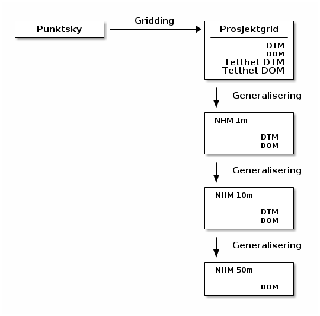

== Appendix B - Høydedata.no
Alle punktskydata skal forvaltes i https://hoydedata.no/LaserInnsyn/[høydedata.no]. Forvaltningsløsningen (FvL) serverer rådatasett, avledede grid med varierende oppløsning, samt enkle visualiseringer i 2D og 3D. 

Punktskyene som holdes i FvL må sees i sammenheng med produktspesifikasjonen som var gjeldende når datasettet ble etablert og lagt inn i FvL. Dette kommuniseres ved hjelp av attributt '..OBJEKTKATALOG' i visningstjeneste og i metadatasett ved eksport. Informasjon om delspesifikasjon finnes i attributt ' ..FKB-LASERSTANDARD'. Ved overgang til ny spesifikasjon oppgraderes ikke punktskydatasettene. 

Primærdatasettet i FvL er punktskyen, og alle produkt avledes fra denne automatisk. Dette sikrer en effektiv prosesseringsflyt, men bortfall av manuell editering kan gi visse artefakter i prosjektgrid og i nasjonale grid. 

Prosesseringsflyten i FvL er: 
// rendered png er lenket direkte
////
[ditaa]
....
+--------------+    Gridding    +--------------+
|   Punktsky   |--------------->| Prosjektgrid |
+--------------+                |--------------|
                                |          DTM |
                                |          DOM |
                                |  Tetthet DTM |
                                |  Tetthet DOM |
                                +--------------+
                                  |
                                  | Generalisering
                                  v
                                +--------------+
                                | NHM 1m       |
                                |--------------|
                                |         DTM  |
                                |         DOM  |
                                +--------------+
                                  |
                                  | Generalisering
                                  v
                                +--------------+
                                | NHM 10m      |
                                |--------------|
                                |         DTM  |
                                |         DOM  |
                                +--------------+
                                  |
                                  | Generalisering
                                  v
                                +--------------+
                                | NHM 50m      |
                                |--------------|
                                |         DOM  |
                                +--------------+
....
////

.Prosesseringsflyt høydedata.no
[#hdataflyt]
//[caption="Figure 1:"]

Terrengmodellene (DTM) generes fra klassene 2 (bakke) og 21 (snø) for topografiprosjekt, og for batymetri benyttes klassene 2 (bakke), 21 (snø) og 40 (havbunn). Terreng og batymetrigrid blir generert med primærmetode "Triangulate with Natural Neighbor Interpolation", og sekundærmetode "Bin with Average Value" om primærmetode feiler grunnet for lange triangelsider. DTM punkttetthet blir generert med metoden "Point Count" på relevante klasser. 

Overflatemodellene for topografigrid blir generert av alle klaser utenom [0, 7, 8, 12, 18]. For batymetri benyttes alle klasser utenom [0, 7, 8, 9, 12, 18, 41 og 42]. Overflatemodellene genereres med metoden "Bin with Maximum Value" og hull fylles etterpå med "Natural Neighbour Interpolation". Tetthetsplottene generes med metoden "Pulse Count".

Oppløsningen på prosjektgridene bestemmes av punkttetthet i henhold til følgende tabell: 

.Relasjon Punktskytetthet og Gridoppløsning
|===
|**Punktsky LiDAR** |
|0 < = tetthet < 2 | 1m x 1m grid
|2 < = tetthet < 4 | 0.50m x 0.50m grid
|4 < = tetthet     | 0.25m x 0.25m grid
|**Punktsky Bildematching** |
|0 < = tetthet < 2 | 1m x 1m grid
|2 < = tetthet < 10 | 0.50m x 0.50m grid
|10 < = tetthet     | 0.25m x 0.25m grid

|===

For gjeldende funksjonalitet refereres til hjelpetekst tilgjengelig på https://hoydedata.no/LaserInnsyn/[høydedata.no].