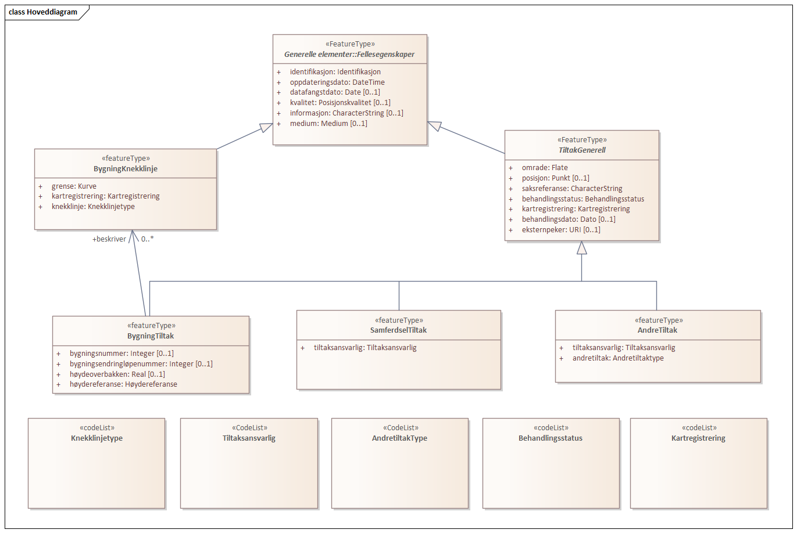
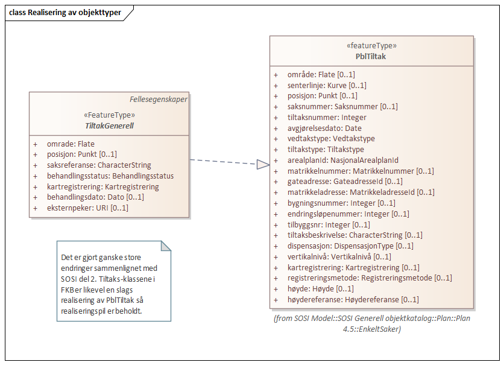
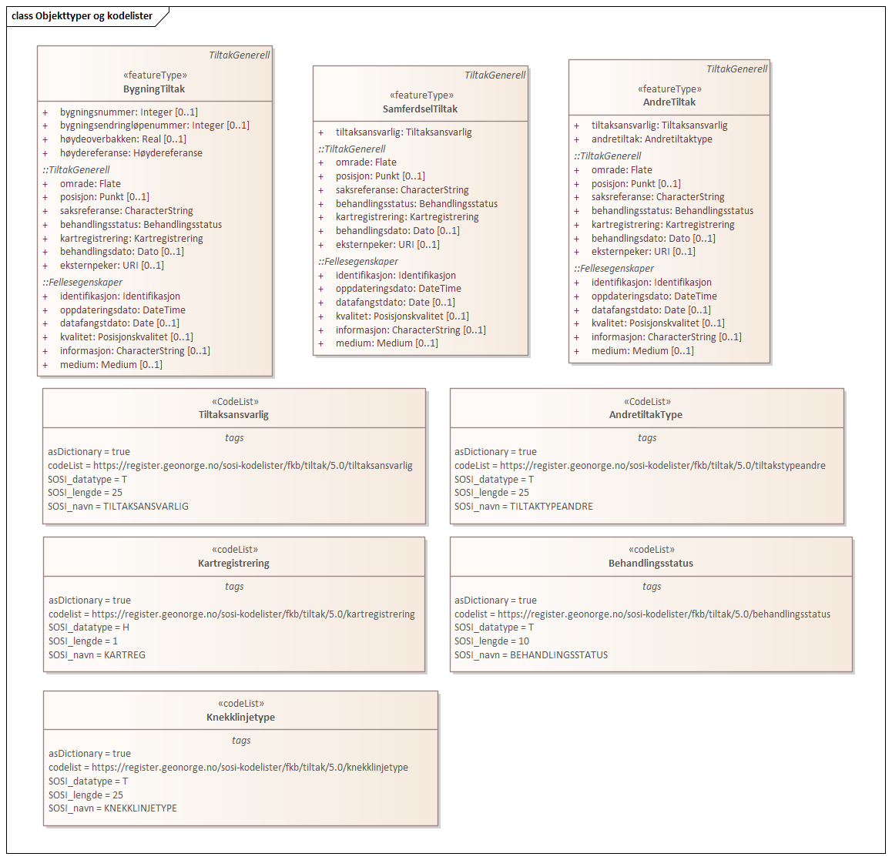
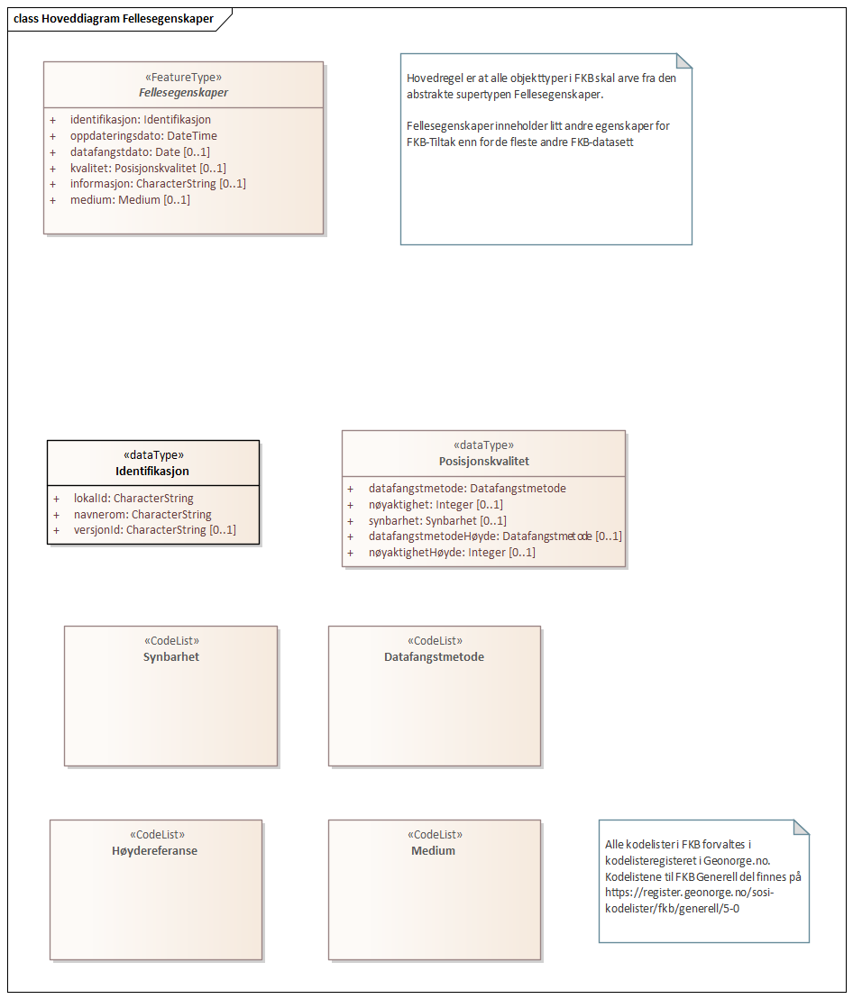

=== «ApplicationSchema» FKB-Tiltak-5.0-Utkast
Definisjon: 
 
===== Tagged Values
[cols="20,80"]
|===
|SOSI_modellstatus
|utkastOgSkjult
 
|===
[caption="Figur 1: ",title=Hoveddiagram]

[caption="Figur 2: ",title=Pakkerealisering]
image::figurer/Pakkerealisering.png[Pakkerealisering]
[caption="Figur 3: ",title=Realisering av objekttyper]

[caption="Figur 4: ",title=Objekttyper og kodelister]

 
==== «FeatureType» TiltakGenerell
Definisjon: abstrakt supertype som inneholder generelle egenskaper som gjelder alle typer tiltak.
Tiltak registreres generelt s&#229; tidlig som mulig i tiltaksbasen, gjerne allerede fra mottak av s&#248;knad. 
N&#229;r tiltaket er ferdig utbygd skal dette medf&#248;re oppdatering av grunnkartet (&#248;vrige FKB-datasett). Tiltak som er registrert i grunnkartet merkes med kartregistrering "Innm&#229;lt i kartet" (KARTREG 2) i FKB-Tiltak. 
 
*Supertype:* «FeatureType» Fellesegenskaper
 
*Realisering av:* «ApplicationSchema» Plan 4.5/EnkeltSaker::«featureType» PblTiltak
 
===== Egenskaper
[cols="20,80"]
|===
|*Navn:* 
|*omrade*
 
|Definisjon: 
|Omr&#229;det som tiltaket befinner seg innenfor.
 
|Multiplisitet: 
|[1..1]
 
|Type: 
|Flate
|===
[cols="20,80"]
|===
|*Navn:* 
|*posisjon*
 
|Definisjon: 
|Representasjonspunkt for tiltaket
 
|Multiplisitet: 
|[0..1]
 
|Type: 
|Punkt
|===
[cols="20,80"]
|===
|*Navn:* 
|*saksreferanse*
 
|Definisjon: 
|Saksnummer eller annen type unik referanse til det aktuelle sakssytemet der man kan finne mer informasjon om saken
 
|Multiplisitet: 
|[1..1]
 
|Type: 
|CharacterString
|===
[cols="20,80"]
|===
|*Navn:* 
|*behandlingsstatus*
 
|Definisjon: 
|
 
|Multiplisitet: 
|[1..1]
 
|Type: 
|Behandlingsstatus
|===
[cols="20,80"]
|===
|*Navn:* 
|*kartregistrering*
 
|Definisjon: 
|
 
|Multiplisitet: 
|[1..1]
 
|Type: 
|Kartregistrering
|===
[cols="20,80"]
|===
|*Navn:* 
|*behandlingsdato*
 
|Definisjon: 
|Siste dato for oppdatering av saken i saksystemet
 
|Multiplisitet: 
|[0..1]
 
|Type: 
|Dato
|Tagged Values: 
|
SOSI_navn: BEHANDLINGSDATO + 
|===
[cols="20,80"]
|===
|*Navn:* 
|*eksternpeker*
 
|Definisjon: 
|Peker til tiltaksobjektet i et annet system. Dette kan f.eks. v&#230;re prosjekteringssystemer e.l. i forbindelse med st&#248;rre samferdselsutbygginger.
 
|Multiplisitet: 
|[0..1]
 
|Type: 
|URI
|===
[cols="20,80"]
|===
|*Subtyper:*
|«featureType» AndreTiltak +
«featureType» SamferdselTiltak +
«featureType» BygningTiltak
|===
 
==== «featureType» BygningTiltak
Definisjon: Tiltak som gjelder Bygning etter plan- og bygningsloven. Kommunene er ansvarlige for saksbehandling etter Pbl og f&#248;ring av BygningTiltak i tiltaksbasen.
Bygningsnummer (og ev. bygningsendringsnummer) fra Matrikkelen registreres p&#229; tiltaket s&#229; fort bygningen er etablert i Matrikkelen. 
Omr&#229;de-geometrien til tiltaket angir omr&#229;det i grunnriss som bygningen skal bygges innenfor. Dette vil normalt samsvare med byggets planlagte yttervegger. 
Dersom man &#248;nsker &#229; gi informasjon om bygningens planlagte h&#248;yde kan dette gj&#248;res ved &#229; angi (1) h&#248;ydeverdier p&#229; omr&#229;degeometrien og sette h&#248;ydereferanse topp, (2) angi en verdi for maks h&#248;yde over terrengh&#248;yde eller (3) registrere objekter av typen BygningKnekklinje som beskriver planlagt form p&#229; bygget i 2.5D i mer detalj. 
 
*Supertype:* «FeatureType» TiltakGenerell
 
===== Egenskaper
[cols="20,80"]
|===
|*Navn:* 
|*bygningsnummer*
 
|Definisjon: 
|nummerering av bygninger fra Matrikkelen. Nummeret er unikt og landsdekkende.
Merknad: For tiltak som omhandler bygninger (tiltakstype nybygg, tilbygg, påbygg, underbygg og ombygging) skal bygningsnummer overføres til tiltaket så fort bygningsnummeret er etablert i Matrikkelen.
 
|Multiplisitet: 
|[0..1]
 
|Type: 
|Integer
|Tagged Values: 
|
SOSI_datatype: H + 
SOSI_lengde: 9 + 
SOSI_navn: BYGGNR + 
|===
[cols="20,80"]
|===
|*Navn:* 
|*bygningsendringløpenummer*
 
|Definisjon: 
|løpende nummerering av tilbygg til et hovedbygg.
Merknad:
For tiltak som omhandler bygningsendringer (tiltakstype tilbygg, påbygg, underbygg og ombygging) skal bygningsendringløpenummer overføres til tiltaket så fort løpenummeret er etablert i Matrikkelen.
 
|Multiplisitet: 
|[0..1]
 
|Type: 
|Integer
|Tagged Values: 
|
SOSI_datatype: H + 
SOSI_lengde: 2 + 
SOSI_navn: BYGN_ENDR_LØPENR + 
|===
[cols="20,80"]
|===
|*Navn:* 
|*høydeoverbakken*
 
|Definisjon: 
|St&#248;rste h&#248;yde p&#229; tiltaket over gjennomsnittlig terrengh&#248;yde angitt i meter
 
|Multiplisitet: 
|[0..1]
 
|Type: 
|Real
|Tagged Values: 
|
SOSI_datatype: D + 
SOSI_lengde: 10 + 
SOSI_navn: HOB + 
|===
[cols="20,80"]
|===
|*Navn:* 
|*høydereferanse*
 
|Definisjon: 
|
 
|Multiplisitet: 
|[1..1]
 
|Type: 
|Høydereferanse
|===
[cols="20,80"]
|===
===== Roller
|*Rollenavn:* 
|*beskriver*
 
|Multiplisitet: 
|[0..*]
 
|Til klasse
|«featureType» BygningKnekklinje
|===
 
==== «featureType» SamferdselTiltak
Definisjon: Tiltak som gjelder utbygging av infrastruktur for samferdsel. 

Tiltaksansvarlig har ansvar for &#229; oppdatere tiltaksbasen med informasjon om saksbehandling og framdrift samt &#229; oppdatere grunnkartet med nye data n&#229;r utbyggingen er ferdigstilt.
 
*Supertype:* «FeatureType» TiltakGenerell
 
===== Egenskaper
[cols="20,80"]
|===
|*Navn:* 
|*tiltaksansvarlig*
 
|Definisjon: 
|
 
|Multiplisitet: 
|[1..1]
 
|Type: 
|Tiltaksansvarlig
|===
[cols="20,80"]
|===
===== Roller
|*Rollenavn:* 
|*avgrensning*
 
|Multiplisitet: 
|[0..*]
 
|Til klasse
|«featureType» BygningKnekklinje
|===
 
==== «featureType» AndreTiltak
Definisjon: andre typer tiltak enn tiltak for bygninger og samferdselsutbygging.

Tiltaksansvarlig har ansvar for &#229; oppdatere tiltaksbasen med informasjon om saksbehandling og framdrift samt &#229; oppdatere grunnkartet med nye data n&#229;r utbyggingen er ferdigstilt.
 
*Supertype:* «FeatureType» TiltakGenerell
 
===== Egenskaper
[cols="20,80"]
|===
|*Navn:* 
|*tiltaksansvarlig*
 
|Definisjon: 
|
 
|Multiplisitet: 
|[1..1]
 
|Type: 
|Tiltaksansvarlig
|===
[cols="20,80"]
|===
|*Navn:* 
|*andretiltak*
 
|Definisjon: 
|andre type tiltak enn de som omfattes av plan- og bygningsloven
 
|Multiplisitet: 
|[1..1]
 
|Type: 
|Andretiltaktype
|===
[cols="20,80"]
|===
===== Roller
|*Rollenavn:* 
|*avgrensning*
 
|Multiplisitet: 
|[0..*]
 
|Til klasse
|«featureType» BygningKnekklinje
|===
 
==== «featureType» BygningKnekklinje
Definisjon: Geometri som beskriver takformen til bygningen i 2.5D. Som minimum b&#248;r toppen av byggets avgrensninger registreres og gjerne ogs&#229; knekklinjer som beskriver takformen inne p&#229; taket (m&#248;nelinjer, taksprang osv.)
 
*Supertype:* «FeatureType» Fellesegenskaper
 
===== Egenskaper
[cols="20,80"]
|===
|*Navn:* 
|*grense*
 
|Definisjon: 
|forløp som følger overgang mellom ulike fenomener
 
|Multiplisitet: 
|[1..1]
 
|Type: 
|Kurve
|===
[cols="20,80"]
|===
|*Navn:* 
|*kartregistrering*
 
|Definisjon: 
|status for kartregistrering av avgjorte tiltak
 
|Multiplisitet: 
|[1..1]
 
|Type: 
|Kartregistrering
|===
[cols="20,80"]
|===
|*Navn:* 
|*knekklinje*
 
|Definisjon: 
|
 
|Multiplisitet: 
|[1..1]
 
|Type: 
|Knekklinjetype
|===
 
==== «codeList» Behandlingsstatus
Definisjon: status for sakbehandlingen
 
===== Tagged Values
[cols="20,80"]
|===
|asDictionary
|true
 
|codelist
|https://register.geonorge.no/sosi-kodelister/fkb/tiltak/5.0/behandlingsstatus
 
|SOSI_datatype
|T
 
|SOSI_lengde
|10
 
|SOSI_navn
|BEHANDLINGSSTATUS
 
|===
Kodeliste hentet fra register: https://register.geonorge.no/sosi-kodelister/fkb/tiltak/5.0/behandlingsstatus
 
Kodeliste hentet på tidspunkt: 2021-07-01T12:36:03Z
 
Kodelistens navn i registeret: Behandlingsstatus
 
===== Koder
[cols="25,60,15"]
|===
|*Kodenavn:* 
|*Definisjon:* 
|*Utvekslingsalias:* 
 
|Søknad mottatt
|Søknad om tiltak er mottatt
|soknad
|Trukket
|Saken er trukket. Tiltaket vil ikke bli gjennomført.
|trukket
|Godkjent midlertidig
|Saken er midlertidig godkjent
|midlertidig
|Godkjent
|Saken er godkjent for utbygging
|godkjent
|Foreldet
|Saken er foreldet. Ny søknad må sendes før utbygging kan skje
|foreldet
|Avslått
|Søknad om utbygging er avslått. Tiltaket vil ikke bli gjennomført
|avslatt
|===
 
==== «codeList» Kartregistrering
Definisjon: status for kartregistrering av avgjorte tiltak. Når tiltaket er lagt inn i grunnkartet (et av de andre FKB-datasettene) endres verdien til "2 - Innmålt i kartet"
 
===== Tagged Values
[cols="20,80"]
|===
|asDictionary
|true
 
|codelist
|https://register.geonorge.no/sosi-kodelister/fkb/tiltak/5.0/kartregistrering
 
|SOSI_datatype
|H
 
|SOSI_lengde
|1
 
|SOSI_navn
|KARTREG
 
|===
Kodeliste hentet fra register: https://register.geonorge.no/sosi-kodelister/fkb/tiltak/5.0/kartregistrering
 
Kodeliste hentet på tidspunkt: 2021-07-01T12:36:05Z
 
Kodelistens navn i registeret: Kartregistrering
 
===== Koder
[cols="25,60,15"]
|===
|*Kodenavn:* 
|*Definisjon:* 
|*Utvekslingsalias:* 
 
|Ikke innmålt i kartet
|Tiltaket er ikke registrert i grunnkartet
|1
|Innmålt i kartet
|Tiltaket er registrert i grunnkartet
|2
|===
 
==== «CodeList» Tiltaksansvarlig
Definisjon: hvilket forvaltningsniv&#229;/etat som er ansvarlig for oppf&#248;lging av tiltaket 
 
===== Tagged Values
[cols="20,80"]
|===
|asDictionary
|true
 
|codeList
|https://register.geonorge.no/sosi-kodelister/fkb/tiltak/5.0/tiltaksansvarlig
 
|SOSI_datatype
|T
 
|SOSI_lengde
|25
 
|SOSI_navn
|TILTAKSANSVARLIG
 
|===
Kodeliste hentet fra register: https://register.geonorge.no/sosi-kodelister/fkb/tiltak/5.0/tiltaksansvarlig
 
Kodeliste hentet på tidspunkt: 2021-07-01T12:36:06Z
 
Kodelistens navn i registeret: Tiltaksansvarlig
 
===== Koder
[cols="25,60,15"]
|===
|*Kodenavn:* 
|*Definisjon:* 
|*Utvekslingsalias:* 
 
|Bane NOR
|Tiltak for utbygging av jernbane der BaneNOR er ansvarlig for oppfølging av tiltaket.
|baneNor
|NVE
|Myndighet for utbygging av energi etc.
|nve
|Vegvesenet
|Veganlegg på Riks- og Europaveg der Statens vegvesen er ansvarlig for tiltaket
|vegvesen
|Fylkeskommune
|Fylkeskommunen er ansvarlig for å følge opp tiltaket. Dette vil stort sett dreie seg om tiltak som gjelder fylkesveg. 
|fylke
|Kommune
|Kommunen er ansvarlig for oppfølging av tiltaket. Gjelder tiltak (som ikke omhandler bygninger) etter Pbl eller annet lovverk som det er naturlig at følges opp av kommunen
|kommune
|Nye Veier
|Veganlegg på Riks- og Europaveg der Nye Veier AS er ansvarlig for tiltaket
|nyeVeier
|===
 
==== «CodeList» AndretiltakType
Definisjon: 
 
===== Tagged Values
[cols="20,80"]
|===
|asDictionary
|true
 
|codeList
|https://register.geonorge.no/sosi-kodelister/fkb/tiltak/5.0/tiltakstypeandre
 
|SOSI_datatype
|T
 
|SOSI_lengde
|25
 
|SOSI_navn
|TILTAKTYPEANDRE
 
|===
Kodeliste hentet fra register: https://register.geonorge.no/sosi-kodelister/fkb/tiltak/5.0/tiltakstypeandre
 
Kodeliste hentet på tidspunkt: 2021-07-01T12:36:07Z
 
Kodelistens navn i registeret: TiltakstypeAndre
 
===== Koder
[cols="25,60,15"]
|===
|*Kodenavn:* 
|*Definisjon:* 
|*Utvekslingsalias:* 
 
|Andre anlegg
|Andre typer tiltak enn de som gjelder bygninger, samferdselsanlegg eller noen av de andre tiltakstypene som er definert i denne kodelista
|andre
|Sjøanlegg
|Utbygging av dekningsverk, navigasjonsinnstallasjoner etc. i sjø som fanges opp gjennom saksbehandlingsprosesser
|sjo
|Energianlegg
|Utbygging av energiproduksjonsanlegg (vind/vann/sol etc.) eller anlegg for overføring av energi
|energi
|Steinbrudd, gruve, massetak
|Utbygging av steinbrudd, gruver og massetak med tilhørende knuseverk og sorteringsanlegg
|massetak
|===
 
==== «codeList» Knekklinjetype
Definisjon: Type knekklinje som beskriver takformen i 2.5D
 
===== Tagged Values
[cols="20,80"]
|===
|asDictionary
|true
 
|codelist
|https://register.geonorge.no/sosi-kodelister/fkb/tiltak/5.0/knekklinjetype
 
|SOSI_datatype
|T
 
|SOSI_lengde
|25
 
|SOSI_navn
|KNEKKLINJETYPE
 
|===
Kodeliste hentet fra register: https://register.geonorge.no/sosi-kodelister/fkb/tiltak/5.0/knekklinjetype
 
Kodeliste hentet på tidspunkt: 2021-07-01T12:36:09Z
 
Kodelistens navn i registeret: Knekklinjetype
 
===== Koder
[cols="25,60,15"]
|===
|*Kodenavn:* 
|*Definisjon:* 
|*Utvekslingsalias:* 
 
|Mønelinje
|Knekklinja representerer mønelinje (høyeste punkt på taket)
|monelinje
|Fasadeliv
|Knekklinja representerer bygningens veggliv/fasadeliv (overgang mellom vegg og tak)
|fasadeliv
|Takkant
|Knekklinja representerer bygningens takkant (overgang mellom vegg og tak)
|takkant
|Annen knekklinje
|Knekklinja representerer en annen type knekklinje (inne på et tak) som bidrar til å beskrive takformen.  
|annen
|===
=== Pakke: Generelle elementer
Definisjon: pakke med elementer som realiserer tilsvarende elementer i FKB Generell del 5.0

Merknad:
Kopieres direkte inn i de enkelte FKB-datasettene
[caption="Figur 5: ",title=Hoveddiagram Fellesegenskaper]

[caption="Figur 6: ",title=Realisering av fellesegenskaper fra SOSI generell del]

[caption="Figur 7: ",title=Posisjonskvalitet]
image::figurer/Posisjonskvalitet.png[Posisjonskvalitet]
 
==== «FeatureType» Fellesegenskaper
Definisjon: abstrakt objekttype som bærer sentrale egenskaper som er anbefalt for bruk i produktspesifikasjoner.

Merknad: Disse egenskapene skal derfor ikke modelleres inn i fagområdemodeller.
 
*Realisering av:* «ApplicationSchema» FKB Generell del-5.0Utkast::«FeatureType» Fellesegenskaper
 
*Realisering av:* «ApplicationSchema» Generelle typer 5.1/SOSI_Fellesegenskaper og SOSI_Objekt::«FeatureType» SOSI_Objekt
 
===== Egenskaper
[cols="20,80"]
|===
|*Navn:* 
|*identifikasjon*
 
|Definisjon: 
|unik identifikasjon av et objekt 

Merknad FKB:
Unik identifikasjon av et objekt, ivaretas av den ansvarlige produsent/forvalter, og som kan benyttes av eksterne applikasjoner som referanse til objektet.
Den unike identifikatoren er unik for kartobjektet og skal ikke endres i kartobjektets levetid. Dette m&#229; ikke forveksles med en tematisk identifikator (for eksempel bygningsnummer) som unikt identifiserer et objekt i virkeligheten. En bygning med samme bygningsnummer vil kunne representeres i mange kartprodukter der det finnes en unik identifikasjon i hver av dem.
For FKB benyttes UUID (Universally unique identifier) som lokalId. Dette inneb&#230;rer at lokalId alene alltid vil v&#230;re unik. Likevel skal alltid navnerom ogs&#229; angis. Navnerom angir FKB-datasettet.
 
|Multiplisitet: 
|[1..1]
 
|Type: 
|Identifikasjon
|Tagged Values: 
|
SOSI_navn: IDENT + 
|===
[cols="20,80"]
|===
|*Navn:* 
|*oppdateringsdato*
 
|Definisjon: 
|tidspunkt for siste endring p&#229; objektet 

Merknad FKB: 
Denne datoen viser datasystemets siste endring p&#229; dataobjektet. Egenskapen settes av forvaltningssystemet etter f&#248;lgende regler:
i. Oppdateringsdato er tidspunkt for oppdatering av databasen og settes av forvaltningsbasen (ikke
av klienten).
ii. Oppdateringsdato skal endres ogs&#229; hvis det er kopidata som blir endret eller importert i en
”kopibase”.
iii. N&#229;r avgrensingslinjene til en flate endres, skal flateobjektet f&#229; ny oppdateringsdato.
iv. Oppdateringsdato skal endres hvis en egenskap endres.
 
|Multiplisitet: 
|[1..1]
 
|Type: 
|DateTime
|Tagged Values: 
|
definition: "Date and time at which this version of the spatial object was inserted or changed in the spatial data set."@en + 
SOSI_datatype: DATOTID + 
SOSI_navn: OPPDATERINGSDATO + 
|===
[cols="20,80"]
|===
|*Navn:* 
|*datafangstdato*
 
|Definisjon: 
|
 
|Multiplisitet: 
|[0..1]
 
|Type: 
|Date
|Tagged Values: 
|
SOSI_datatype: DATO + 
SOSI_navn: DATAFANGSTDATO + 
|===
[cols="20,80"]
|===
|*Navn:* 
|*kvalitet*
 
|Definisjon: 
|
 
|Multiplisitet: 
|[0..1]
 
|Type: 
|Posisjonskvalitet
|===
[cols="20,80"]
|===
|*Navn:* 
|*informasjon*
 
|Definisjon: 
|generell opplysning.

Merknad FKB:
Mulighet til &#229; legge inn utfyllende informasjon om objektet. Egenskapen b&#248;r bare brukes til &#229; legge inn ekstra informasjon om enkeltobjekter. Egenskapen b&#248;r ikke brukes til &#229; systematisk angi ekstrainformasjon om mange/alle objekter i et datasett.
 
|Multiplisitet: 
|[0..1]
 
|Type: 
|CharacterString
|===
[cols="20,80"]
|===
|*Navn:* 
|*medium*
 
|Definisjon: 
|
 
|Multiplisitet: 
|[0..1]
 
|Type: 
|Medium
|===
[cols="20,80"]
|===
|*Subtyper:*
|«FeatureType» TiltakGenerell +
«featureType» BygningKnekklinje
|===
 
==== «dataType» Identifikasjon
Definisjon: Unik identifikasjon av et objekt i et datasett, forvaltet av den ansvarlige produsent/forvalter, og kan benyttes av eksterne applikasjoner som stabil referanse til objektet. 

Merknad 1: Denne objektidentifikasjonen må ikke forveksles med en tematisk objektidentifikasjon, slik som f.eks bygningsnummer. 

Merknad 2: Denne unike identifikatoren vil ikke endres i løpet av objektets levetid, og ikke gjenbrukes i andre objekt. 
 
*Realisering av:* «ApplicationSchema» Generelle typer 5.1/SOSI_Fellesegenskaper og SOSI_Objekt::«dataType» Identifikasjon
 
===== Tagged Values
[cols="20,80"]
|===
|SOSI_navn
|IDENT
 
|===
===== Egenskaper
[cols="20,80"]
|===
|*Navn:* 
|*lokalId*
 
|Definisjon: 
|lokal identifikator av et objekt

Merknad: Det er dataleverend&#248;rens ansvar &#229; s&#248;rge for at den lokale identifikatoren er unik innenfor navnerommet. For FKB-data benyttes UUID som lokalId.
 
|Multiplisitet: 
|[1..1]
 
|Type: 
|CharacterString
|Tagged Values: 
|
SOSI_datatype: T + 
SOSI_lengde: 100 + 
SOSI_navn: LOKALID + 
|===
[cols="20,80"]
|===
|*Navn:* 
|*navnerom*
 
|Definisjon: 
|navnerom som unikt identifiserer datakilden til et objekt, anbefales å være en http-URI

Eksempel: http://data.geonorge.no/SentraltStedsnavnsregister/1.0

Merknad : Verdien for nanverom vil eies av den dataprodusent som har ansvar for de unike identifikatorene og må være registrert i data.geonorge.no eller data.norge.no
 
|Multiplisitet: 
|[1..1]
 
|Type: 
|CharacterString
|Tagged Values: 
|
SOSI_datatype: T + 
SOSI_lengde: 100 + 
SOSI_navn: NAVNEROM + 
|===
[cols="20,80"]
|===
|*Navn:* 
|*versjonId*
 
|Definisjon: 
|identifikasjon av en spesiell versjon av et geografisk objekt (instans)
 
|Multiplisitet: 
|[0..1]
 
|Type: 
|CharacterString
|Tagged Values: 
|
SOSI_datatype: T + 
SOSI_lengde: 100 + 
SOSI_navn: VERSJONID + 
|===
 
==== «dataType» Posisjonskvalitet
Definisjon: beskrivelse av kvaliteten p&#229; stedfestingen.

Merknad:
Posisjonskvalitet er ikke konform med  kvalitetsmodellen i ISO slik den er defineret i ISO19157:2013, men er en videref&#248;ring av tildligere brukte kvalitetsegenskaper i SOSI. FKB 5.0 innf&#248;rer en egen variant av datatypen Posisjonskvalitet der kodeliste m&#229;lemetode er byttet ut med den mer generelle kodelista Datafangstmetode. 
 
*Realisering av:* «ApplicationSchema» Generelle typer 5.1/SOSI_Fellesegenskaper og SOSI_Objekt::«dataType» Posisjonskvalitet
 
===== Tagged Values
[cols="20,80"]
|===
|SOSI_navn
|KVALITET
 
|===
===== Egenskaper
[cols="20,80"]
|===
|*Navn:* 
|*datafangstmetode*
 
|Definisjon: 
|metode for datafangst. 
Egenskapen beskriver datafangstmetode for grunnrisskoordinater (x,y), eller for b&#229;de grunnriss og h&#248;yde (x,y,z) dersom det ikke er oppgitt noen verdi for datafangstmetodeH&#248;yde.
 
|Multiplisitet: 
|[1..1]
 
|Type: 
|Datafangstmetode
|Tagged Values: 
|
SOSI_lengde: 3 + 
SOSI_navn: DATAFANGSTMETODE + 
|===
[cols="20,80"]
|===
|*Navn:* 
|*nøyaktighet*
 
|Definisjon: 
|standardavviket til posisjoneringa av objektet oppgitt i cm
I de aller fleste sammenhenger benyttes en ansl&#229;tt eller forventet verdi for standardavvik, men dersom man har en beregnet verdi skal denne benyttes. 
For objekter med punktgeometri benyttes verdi for punktstandardavvik. For objekter med kurvegeometri benyttes standardavviket for tverravviket fra kurva. For objekter med overflate- eller volumgeometri er forst&#229;elsen at standardavviket beregnes ut fra (3D) avvikene mellom sann posisjon og n&#230;rmeste punkt p&#229; overflata. 
Merknad:
Verdien er ment &#229; beskrive n&#248;yaktigheten til objektet sammenlignet med sann verdi. Standardavvik er i utgangspunktet et m&#229;l p&#229; det tilfeldige avviket og det inneb&#230;rer at vi forutsetter at det systematiske avviket i liten grad p&#229;virker n&#248;yaktigheten til posisjoneringa. For fotogrammetriske data settes som hovedregel verdien lik kravet til standardavvik ved datafangst. Se standarden Geodatakvalitet for n&#230;rmere definisjon av standardavvik og hvordan dette defineres, beregnes og kontrolleres.
 
|Multiplisitet: 
|[0..1]
 
|Type: 
|Integer
|Tagged Values: 
|
SOSI_lengde: 6 + 
SOSI_navn: NØYAKTIGHET + 
|===
[cols="20,80"]
|===
|*Navn:* 
|*synbarhet*
 
|Definisjon: 
|beskrivelse av hvor godt objektene framg&#229;r i datagrunnlaget for posisjonering (f.eks. flybildene).
 
|Multiplisitet: 
|[0..1]
 
|Type: 
|Synbarhet
|Tagged Values: 
|
SOSI_lengde: 1 + 
SOSI_navn: SYNBARHET + 
|===
[cols="20,80"]
|===
|*Navn:* 
|*datafangstmetodeHøyde*
 
|Definisjon: 
|metoden brukt for h&#248;yderegistrering av posisjon.

Det er bare n&#248;dvending &#229; angi en verdi for egenskapen dersom datafangstmetode for h&#248;yde avviker fra datafangstmetode for grunnriss.

 
|Multiplisitet: 
|[0..1]
 
|Type: 
|Datafangstmetode
|Tagged Values: 
|
SOSI_lengde: 3 + 
SOSI_navn: DATAFANGSTMETODEHØYDE + 
|===
[cols="20,80"]
|===
|*Navn:* 
|*nøyaktighetHøyde*
 
|Definisjon: 
|standardavviket til posisjoneringa av objektet oppgitt i cm
I de aller fleste sammenhenger benyttes en ansl&#229;tt eller forventet verdi for standardavviket, men dersom man faktisk har standardavviket til posisjoneringa av objektet oppgitt i cm
I de aller fleste sammenhenger benyttes en ansl&#229;tt eller forventet verdi for standardavvik, men dersom man har en beregnet verdi skal denne benyttes. 
Merknad:
Verdien er ment &#229; beskrive n&#248;yaktigheten til objektet sammenlignet med sann verdi. Standardavvik er i utgangspunktet et m&#229;l p&#229; det tilfeldige avviket og det inneb&#230;rer at vi forutsetter at det systematiske avviket i liten grad p&#229;virker n&#248;yaktigheten til posisjoneringa. For fotogrammetriske data settes som hovedregel verdien lik kravet til standardavvik ved datafangst. Se standarden Geodatakvalitet for n&#230;rmere definisjon av standardavvik og hvordan dette defineres, beregnes og kontrolleres.
 
|Multiplisitet: 
|[0..1]
 
|Type: 
|Integer
|Tagged Values: 
|
SOSI_lengde: 6 + 
SOSI_navn: H-NØYAKTIGHET + 
|===
 
==== «CodeList» Synbarhet
Definisjon: synbarhet beskriver hvor godt objektene framg&#229;r i datagrunnlaget for posisjonering (f.eks. flybildene).
 
===== Tagged Values
[cols="20,80"]
|===
|asDictionary
|true
 
|codeList
|https://register.geonorge.no/sosi-kodelister/fkb/generell/5-0/synbarhet
 
|SOSI_datatype
|H
 
|SOSI_lengde
|1
 
|SOSI_navn
|SYNBARHET
 
|===
Kodeliste hentet fra register: https://register.geonorge.no/sosi-kodelister/fkb/generell/5-0/synbarhet
 
Kodeliste hentet på tidspunkt: 2021-07-01T12:36:45Z
 
Kodelistens navn i registeret: Synbarhet
 
===== Koder
[cols="25,60,15"]
|===
|*Kodenavn:* 
|*Definisjon:* 
|*Utvekslingsalias:* 
 
|Middels synlig
|Objektet er middels synlig/gjenkjennbart i flybilde eller annen datakilde for posisjonering. Ved fotogrammetrisk datafangst brukes denne koden for objekter som har lav kontrast eller er delvis skjult av overliggende objekter (vegetasjon, takoverbygg, bruer etc.). For slike objekter settes en større verdi for nøyaktighet enn kravet (opptil 3 ganger kravet)
|2
|Ikke synlig
|Objektet er ikke synlig/gjenkjennbart i flybilde eller annen datakilde for posisjonering. Ved fotogrammetrisk datafangst brukes denne koden for objekter som er helt skjult av overliggende objekter (vegetasjon, takoverbygg, bruer etc.). For slike objekter settes en stor verdi for nøyaktighet (mer enn 3 ganger kravet)
|3
|Fullt ut synlig
|Objektet er fullt ut synlig/gjenfinnbart i flybilde eller annen datakilde for posisjonering. Ved fotogrammetrisk registrering skal objekter som er fullt ut synlige registreres i tråd med angitte krav til nøyaktig registrering.
|0
|Dårlig gjenfinnbar i terreng
|Objektets posisjon er vanskelig å definere presist i terrenget på grunn av objektets natur. Koden kan f.eks. brukes på høydekurver (eller andre isolinjer) eller objekter som er skjult i bakken (f.eks. innmåling av ledninger på lukket grøft) 
|1
|===
 
==== «CodeList» Datafangstmetode
Definisjon: metode for datafangst. 

Datafangstmetoden beskriver hvordan selve vektordataene er posisjonert fra et datagrunnlag (observasjoner med landm&#229;lingsutstyr, fotogrammetrisk stereomodell, digital terrengmodell etc.) og ikke prosessen med &#229; innhente det bakenforliggende datagrunnlaget.
 
===== Tagged Values
[cols="20,80"]
|===
|asDictionary
|true
 
|codeList
|https://register.geonorge.no/sosi-kodelister/fkb/generell/5-0/datafangstmetode
 
|SOSI_datatype
|T
 
|SOSI_lengde
|3
 
|SOSI_navn
|DATAFANGSTMETODE
 
|===
Kodeliste hentet fra register: https://register.geonorge.no/sosi-kodelister/fkb/generell/5-0/datafangstmetode
 
Kodeliste hentet på tidspunkt: 2021-07-01T12:36:47Z
 
Kodelistens navn i registeret: Datafangstmetode
 
===== Koder
[cols="25,60,15"]
|===
|*Kodenavn:* 
|*Definisjon:* 
|*Utvekslingsalias:* 
 
|Som bygget
|Posisjonen er hentet fra prosjekterte eller planlagte data, f.eks. fra en BIM-modell, som er verifisert som bygget ved innmålinger
|byg
|Ukjent
|Ukjent eller uspesifisert datafangstmetode
|ukj
|Plandata
|Posisjonen er hentet plandata. Posisjonen er ikke verifisert med innmåling. 
|pla
|Satellittmålt
|Posisjonen er målt inn direkte med GNSS (for posisjoner målt inn med GNSS i kombinasjon med andre landmålingsmetoder skal koden Landmåling benyttes)
|sat
|Generert
|Posisjonen er manuelt konstruert, eller generert ved maskinlæring eller annen type programvare, fra punktsky fra laserskanning, bildematching, sonar, andre typer sensordata eller kombinasjon av flere typer sensordata.
|gen
|Fotogrammetri
|Posisjonen er konstruert/generert fra en fotogrammetrisk stereomodell 
|fot
|Landmålt
|Posisjonen er målt inn direkte med en landmålingsmetode. Aktuelle landmålingsmetoder kan være nivellering, vinkelmåling, avstandsmåling eller treghetsmåling. Kodeverdien brukes også for kombinasjoner av disse målemetodene eller der disse målemetodene kombineres med GNSS. Landmåling utføres normalt med overskytende målinger og utjevning av resultatet.
|lan
|===
 
==== «CodeList» Høydereferanse
Definisjon: koordinatregistering utf&#248;rt p&#229; topp eller bunn av et objekt
 
===== Tagged Values
[cols="20,80"]
|===
|asDictionary
|true
 
|codeList
|https://register.geonorge.no/sosi-kodelister/fkb/generell/5-0/hoydereferanse
 
|SOSI_datatype
|T
 
|SOSI_lengde
|6
 
|SOSI_navn
|HREF
 
|===
Kodeliste hentet fra register: https://register.geonorge.no/sosi-kodelister/fkb/generell/5-0/hoydereferanse
 
Kodeliste hentet på tidspunkt: 2021-07-01T12:36:49Z
 
Kodelistens navn i registeret: Høydereferanse
 
===== Koder
[cols="25,60,15"]
|===
|*Kodenavn:* 
|*Definisjon:* 
|*Utvekslingsalias:* 
 
|Fot
|Høyden målt til foten av objektet
|FOT
|Ukjent
|Ukjent høydereferanse
|UKJENT
|Topp
|Høyden målt til toppen av objektet
|TOP
|===
 
==== «CodeList» Medium
Definisjon: objektets beliggenhet i forhold til jordoverflaten

Eksempel:
Veg p&#229; bro, i tunnel, inne i et bygningsmessig anlegg, etc.
 
===== Tagged Values
[cols="20,80"]
|===
|asDictionary
|true
 
|codeList
|https://register.geonorge.no/sosi-kodelister/fkb/generell/5-0/medium
 
|SOSI_datatype
|T
 
|SOSI_lengde
|1
 
|SOSI_navn
|MEDIUM
 
|===
Kodeliste hentet fra register: https://register.geonorge.no/sosi-kodelister/fkb/generell/5-0/medium
 
Kodeliste hentet på tidspunkt: 2021-07-01T12:36:51Z
 
Kodelistens navn i registeret: Medium
 
===== Koder
[cols="25,60,15"]
|===
|*Kodenavn:* 
|*Definisjon:* 
|*Utvekslingsalias:* 
 
|På terrenget
|På terrenget/på bakkenivå
|T
|Ukjent
|Ukjent plassering i forhold til jordoverflaten
|X
|Delvis under vann
|Delvis i eller under vann
|D
|På Isbre
|På isbre
|I
|Under terrenget
|Under terrenget
|U
|I vann
|Alltid i vann
|V
|I Bygning
|I eller på bygning eller bygningsmessig anlegg
|B
|I luft
|I lufta
|L
|===
