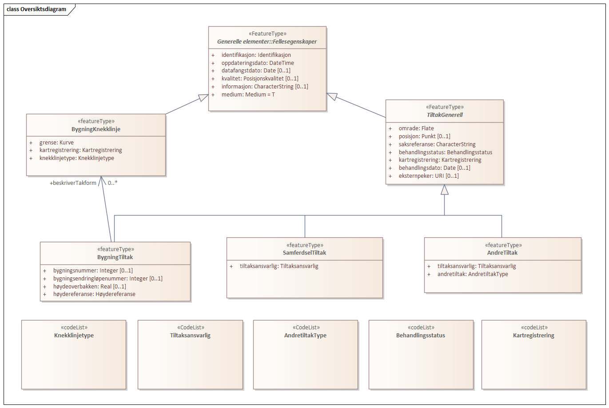
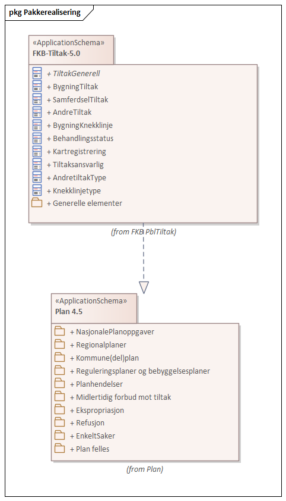
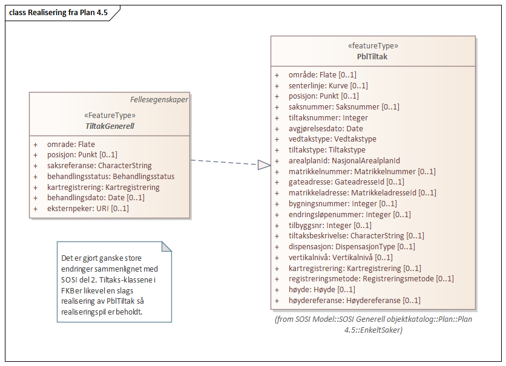
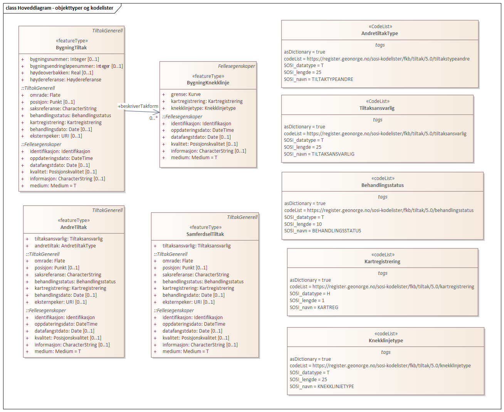
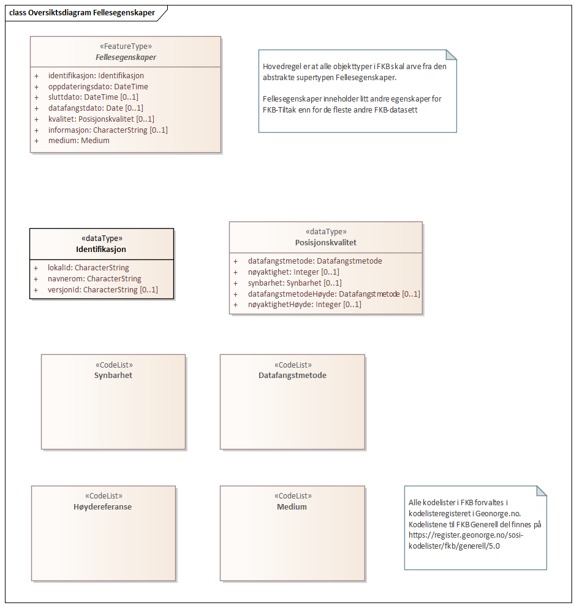
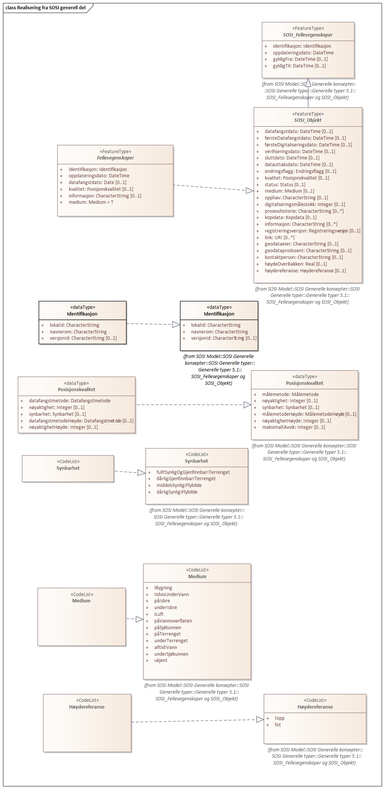

// Start of UML-model
=== Pakke: «ApplicationSchema» FKB-Tiltak-5.0
*Definisjon:* Datamodell for produktspesifikasjon FKB-Tiltakt. FKB-Tiltak inneholder objekter (=områder der det skjer utbygging) som er omsøkt/godkjent gjennom saksbehandling i kommunen eller andre offentlige myndigheter.
 
[discrete]
==== Profilparametre i tagged values
[cols="20,80"]
|===
|definition
|"FKB-Tiltak contains building areas from public authorities case processing"@en
 
|description
|"Construction areas from FKB-Tiltak can be used as metadata for other detailed (FKB) maps"@en
 
|designation
|"Product spesification FKB-Tiltak 5.0"@en
 
|language
|no
 
|SOSI_kortnavn
|FKBTiltak
 
|SOSI_langnavn
|FKB-Tiltak
 
|SOSI_modellstatus
|gyldig
 
|SOSI_spesifikasjonstype
|produktspesifikasjon
 
|SOSI_versjon
|5.0
 
|targetNamespace
|http://skjema.geonorge.no/SOSI/produktspesifikasjon/FKB-Tiltak/5.0
 
|version
|5.0
 
|xmlns
|app
 
|xsdDocument
|FKBTiltak.xsd
 
|xsdEncodingRule
|sosi
 
|===
 
'''
 
.Oversiktsdiagram 

 
'''
 
.Pakkerealisering 

 
'''
 
.Realisering fra Plan 4.5 

 
'''
 
.Hoveddiagram - objekttyper og kodelister 

 
'''
 
[[tiltakgenerell]]
==== «FeatureType» TiltakGenerell (abstrakt)
*Definisjon:* abstrakt supertype som inneholder generelle egenskaper som gjelder alle typer tiltak.

Tiltak registreres generelt så tidlig som mulig i tiltaksbasen, gjerne allerede fra mottak av søknad. 

Når tiltaket er ferdig utbygd skal dette medføre oppdatering av grunnkartet (øvrige FKB-datasett). Tiltak som er registrert i grunnkartet merkes med kartregistrering "Innmålt i kartet" (KARTREG 2) i FKB-Tiltak. 
 
[discrete]
===== Egenskaper
[cols="20,80"]
|===
|*Navn:* 
|*område*
 
|Definisjon: 
|Området som tiltaket befinner seg innenfor.
 
|Multiplisitet: 
|[1..1]
 
|Type: 
|http://skjema.geonorge.no/SOSI/basistype/GM_Surface[GM_Surface]
|===
[cols="20,80"]
|===
|*Navn:* 
|*posisjon*
 
|Definisjon: 
|Representasjonspunkt for tiltaket
 
|Multiplisitet: 
|[0..1]
 
|Type: 
|http://skjema.geonorge.no/SOSI/basistype/GM_Point[GM_Point]
|===
[cols="20,80"]
|===
|*Navn:* 
|*saksreferanse*
 
|Definisjon: 
|Saksnummer eller annen type unik referanse til det aktuelle sakssytemet der man kan finne mer informasjon om saken
 
|Multiplisitet: 
|[1..1]
 
|Type: 
|http://skjema.geonorge.no/SOSI/basistype/CharacterString[CharacterString]
|Profilparametre i tagged values: 
|
SOSI_datatype: T + 
SOSI_lengde: 50 + 
SOSI_navn: SAKSREFERANSE + 
|===
[cols="20,80"]
|===
|*Navn:* 
|*behandlingsstatus*
 
|Definisjon: 
|status for saksbehandlingen
 
|Multiplisitet: 
|[1..1]
 
|Type: 
|<<behandlingsstatus,«codeList» Behandlingsstatus>>
|Profilparametre i tagged values: 
|
defaultCodeSpace: https://register.geonorge.no/sosi-kodelister/fkb/tiltak/5.0/behandlingsstatus + 
SOSI_datatype: T + 
SOSI_lengde: 10 + 
SOSI_navn: BEHANDLINGSSTATUS + 
|===
[cols="20,80"]
|===
|*Navn:* 
|*kartregistrering*
 
|Definisjon: 
|status for kartregistrering av avgjorte tiltak
 
|Multiplisitet: 
|[1..1]
 
|Type: 
|<<kartregistrering,«codeList» Kartregistrering>>
|Profilparametre i tagged values: 
|
defaultCodeSpace: https://register.geonorge.no/sosi-kodelister/fkb/tiltak/5.0/kartregistrering + 
SOSI_datatype: H + 
SOSI_lengde: 1 + 
SOSI_navn: KARTREG + 
|===
[cols="20,80"]
|===
|*Navn:* 
|*behandlingsdato*
 
|Definisjon: 
|Siste dato for oppdatering av saken i saksystemet
 
|Multiplisitet: 
|[0..1]
 
|Type: 
|http://skjema.geonorge.no/SOSI/basistype/Date[Date]
|Profilparametre i tagged values: 
|
SOSI_datatype: DATO + 
SOSI_navn: BEHANDLINGSDATO + 
|===
[cols="20,80"]
|===
|*Navn:* 
|*eksternpeker*
 
|Definisjon: 
|Peker til tiltaksobjektet i et annet system. Dette kan f.eks. være prosjekteringssystemer e.l. i forbindelse med større samferdselsutbygginger.
 
|Multiplisitet: 
|[0..1]
 
|Type: 
|http://skjema.geonorge.no/SOSI/basistype/URI[URI]
|Profilparametre i tagged values: 
|
SOSI_datatype: T + 
SOSI_lengde: 255 + 
SOSI_navn: EKSTERNPEKER + 
|===
 
[discrete]
===== Restriksjoner
[cols="20,80"]
|===
|*Navn:* 
|*posisjon innenfor område*
 
|Beskrivelse: 
|
--ingen OCL, restriksjonen implementeres manuelt
 + 
--Dersom det finnes område-geometri skal posisjon-geometrien ligge innenfor område-geometrien
 
|===
 
[discrete]
===== Arv og realiseringer
[cols="20,80"]
|===
|Supertype: 
|<<fellesegenskaper,«FeatureType» Fellesegenskaper>>
 
|Subtyper:
|<<andretiltak,«featureType» AndreTiltak>> +
<<samferdseltiltak,«featureType» SamferdselTiltak>> +
<<bygningtiltak,«featureType» BygningTiltak>> +
|Realisering av: 
|«ApplicationSchema» Plan 4.5.2/EnkeltSaker::«featureType» PblTiltak +
|===
 
'''
 
[[bygningtiltak]]
==== «featureType» BygningTiltak
*Definisjon:* Tiltak som gjelder Bygning etter plan- og bygningsloven. Kommunene er ansvarlige for saksbehandling etter Pbl og føring av BygningTiltak i tiltaksbasen.

Bygningsnummer (og ev. bygningsendringsnummer) fra Matrikkelen registreres på tiltaket så fort bygningen er etablert i Matrikkelen. 

Område-geometrien til tiltaket angir området i grunnriss som bygningen skal bygges innenfor. Dette vil normalt samsvare med byggets planlagte yttervegger. 

Dersom man ønsker å gi informasjon om bygningens planlagte høyde kan dette gjøres ved å:

1. Angi høydeverdier på områdegeometrien og sette høydereferanse topp. Geometrien må inneholde mønehøyde (høyeste nivå på bygget). 

2. Angi en verdi for maks høyde over gjennomsnittlig terrenghøyde 

3. Registrere objekter av typen BygningKnekklinje som beskriver planlagt form på bygget i 2.5D i mer detalj. 

Ved registrering av tiltak under bakken benyttes Medium U på tiltaksomriss. Kotehøyde på omriss gis som høyeste taknivå og kotehøyde på laveste gulvnivå legges inn på egenskap Lavestegulv
 
[discrete]
===== Egenskaper
[cols="20,80"]
|===
|*Navn:* 
|*bygningsnummer*
 
|Definisjon: 
|nummerering av bygninger fra Matrikkelen. Nummeret er unikt og landsdekkende.
Merknad: For tiltak som omhandler bygninger (tiltakstype nybygg, tilbygg, påbygg, underbygg og ombygging) skal bygningsnummer overføres til tiltaket så fort bygningsnummeret er etablert i Matrikkelen.
 
|Multiplisitet: 
|[0..1]
 
|Type: 
|<<integer,«dataType» Integer>>
|Profilparametre i tagged values: 
|
SOSI_datatype: H + 
SOSI_lengde: 9 + 
SOSI_navn: BYGGNR + 
|===
[cols="20,80"]
|===
|*Navn:* 
|*bygningsendringløpenummer*
 
|Definisjon: 
|løpende nummerering av tilbygg til et hovedbygg.
Merknad:
For tiltak som omhandler bygningsendringer (tiltakstype tilbygg, påbygg, underbygg og ombygging) skal bygningsendringløpenummer overføres til tiltaket så fort løpenummeret er etablert i Matrikkelen.
 
|Multiplisitet: 
|[0..1]
 
|Type: 
|<<integer,«dataType» Integer>>
|Profilparametre i tagged values: 
|
SOSI_datatype: H + 
SOSI_lengde: 2 + 
SOSI_navn: BYGN_ENDR_LØPENR + 
|===
[cols="20,80"]
|===
|*Navn:* 
|*høydereferanse*
 
|Definisjon: 
|koordinatregistering utført på topp eller bunn av et objekt
 
|Multiplisitet: 
|[1..1]
 
|Type: 
|<<høydereferanse,«CodeList» Høydereferanse>>
|Profilparametre i tagged values: 
|
defaultCodeSpace: https://register.geonorge.no/sosi-kodelister/fkb/generell/5.0/hoydereferanse + 
SOSI_datatype: T + 
SOSI_lengde: 6 + 
SOSI_navn: HREF + 
|===
[cols="20,80"]
|===
|*Navn:* 
|*lavestegulv*
 
|Definisjon: 
|høydeverdi for laveste gulvhøyde på tiltaket.

Merknad:
Objektets geometri angir høyeste høydeverdi (Høydereferanse = top). Denne egenskapen gir mulighet til å i tillegg angi tiltakets laveste høyde slik at kan angi hvilket høydeintervall tiltaket skal holde seg innenfor. Egenskapen brukes primært for tiltak under bakken.
 
|Multiplisitet: 
|[0..1]
 
|Type: 
|http://skjema.geonorge.no/SOSI/basistype/Real[Real]
|Profilparametre i tagged values: 
|
SOSI_datatype: D + 
SOSI_lengde: 10 + 
SOSI_navn: LAVESTEGULV + 
|===
[cols="20,80"]
|===
|*Navn:* 
|*høydeoverbakken*
 
|Definisjon: 
|Største høyde på tiltaket over gjennomsnittlig terrenghøyde angitt i meter
 
|Multiplisitet: 
|[0..1]
 
|Type: 
|http://skjema.geonorge.no/SOSI/basistype/Real[Real]
|Profilparametre i tagged values: 
|
SOSI_datatype: D + 
SOSI_lengde: 10 + 
SOSI_navn: HOB + 
|===
[cols="20,80"]
|===
|*Navn:* 
|*tiltakstypeBygning*
 
|Definisjon: 
|type tiltak som gjelder saksbehandling av bygninger etter Pbl.
 
|Multiplisitet: 
|[1..1]
 
|Type: 
|<<tiltakstypebygning,«CodeList» TiltakstypeBygning>>
|Profilparametre i tagged values: 
|
defaultCodeSpace: https://register.geonorge.no/sosi-kodelister/fkb/tiltak/5.0/tiltakstypebygning + 
SOSI_datatype: T + 
SOSI_lengde: 30 + 
SOSI_navn: TILTAKSTYPEBYGNING + 
|===
 
[discrete]
===== Roller
[cols="20,80"]
|===
|*Rollenavn:* 
|*beskriverTakform*
 
|Definisjon:
|knekklinjer som beskriver takformen til bygningstiltaket
 
|Multiplisitet: 
|[0..*]
 
|Til klasse
|<<bygningknekklinje,«featureType» BygningKnekklinje>>
|===
 
[discrete]
===== Arv og realiseringer
[cols="20,80"]
|===
|Supertype: 
|<<tiltakgenerell,«FeatureType» TiltakGenerell>>
 
|===
 
'''
 
[[samferdseltiltak]]
==== «featureType» SamferdselTiltak
*Definisjon:* Tiltak som gjelder utbygging av infrastruktur for samferdsel. 

Tiltaksansvarlig har ansvar for å oppdatere tiltaksbasen med informasjon om saksbehandling og framdrift samt å oppdatere grunnkartet med nye data når utbyggingen er ferdigstilt.
 
[discrete]
===== Egenskaper
[cols="20,80"]
|===
|*Navn:* 
|*tiltaksansvarlig*
 
|Definisjon: 
|hvilket forvaltningsnivå/etat som er ansvarlig for oppfølging av tiltaket
 
|Multiplisitet: 
|[1..1]
 
|Type: 
|<<tiltaksansvarlig,«CodeList» Tiltaksansvarlig>>
|Profilparametre i tagged values: 
|
defaultCodeSpace: https://register.geonorge.no/sosi-kodelister/fkb/tiltak/5.0/tiltaksansvarlig + 
SOSI_datatype: T + 
SOSI_lengde: 25 + 
SOSI_navn: TILTAKSANSVARLIG + 
|===
 
[discrete]
===== Arv og realiseringer
[cols="20,80"]
|===
|Supertype: 
|<<tiltakgenerell,«FeatureType» TiltakGenerell>>
 
|===
 
'''
 
[[andretiltak]]
==== «featureType» AndreTiltak
*Definisjon:* andre typer tiltak enn tiltak for bygninger og samferdselsutbygging.

Tiltaksansvarlig har ansvar for å oppdatere tiltaksbasen med informasjon om saksbehandling og framdrift samt å oppdatere grunnkartet med nye data når utbyggingen er ferdigstilt.
 
[discrete]
===== Egenskaper
[cols="20,80"]
|===
|*Navn:* 
|*tiltaksansvarlig*
 
|Definisjon: 
|hvilket forvaltningsnivå/etat som er ansvarlig for oppfølging av tiltaket 
 
|Multiplisitet: 
|[1..1]
 
|Type: 
|<<tiltaksansvarlig,«CodeList» Tiltaksansvarlig>>
|Profilparametre i tagged values: 
|
defaultCodeSpace: https://register.geonorge.no/sosi-kodelister/fkb/tiltak/5.0/tiltaksansvarlig + 
SOSI_datatype: T + 
SOSI_lengde: 25 + 
SOSI_navn: TILTAKSANSVARLIG + 
|===
[cols="20,80"]
|===
|*Navn:* 
|*andretiltak*
 
|Definisjon: 
|andre type tiltak enn de som omfattes av plan- og bygningsloven
 
|Multiplisitet: 
|[1..1]
 
|Type: 
|<<andretiltaktype,«CodeList» AndretiltakType>>
|Profilparametre i tagged values: 
|
defaultCodeSpace: https://register.geonorge.no/sosi-kodelister/fkb/tiltak/5.0/tiltakstypeandre + 
SOSI_datatype: T + 
SOSI_lengde: 25 + 
SOSI_navn: TILTAKTYPEANDRE + 
|===
 
[discrete]
===== Arv og realiseringer
[cols="20,80"]
|===
|Supertype: 
|<<tiltakgenerell,«FeatureType» TiltakGenerell>>
 
|===
 
'''
 
[[bygningknekklinje]]
==== «featureType» BygningKnekklinje
*Definisjon:* Geometri som beskriver takformen til bygningen i 2.5D. Som minimum bør toppen av byggets avgrensninger registreres og gjerne også knekklinjer som beskriver takformen inne på taket (mønelinjer, taksprang osv.)
 
[discrete]
===== Egenskaper
[cols="20,80"]
|===
|*Navn:* 
|*grense*
 
|Definisjon: 
|forløp som følger overgang mellom ulike fenomener
 
|Multiplisitet: 
|[1..1]
 
|Type: 
|http://skjema.geonorge.no/SOSI/basistype/GM_Curve[GM_Curve]
|===
[cols="20,80"]
|===
|*Navn:* 
|*kartregistrering*
 
|Definisjon: 
|status for kartregistrering av avgjorte tiltak
 
|Multiplisitet: 
|[1..1]
 
|Type: 
|<<kartregistrering,«codeList» Kartregistrering>>
|Profilparametre i tagged values: 
|
defaultCodeSpace: https://register.geonorge.no/sosi-kodelister/fkb/tiltak/5.0/kartregistrering + 
SOSI_datatype: H + 
SOSI_lengde: 1 + 
SOSI_navn: KARTREG + 
|===
[cols="20,80"]
|===
|*Navn:* 
|*knekklinjetype*
 
|Definisjon: 
|Type knekklinje som beskriver takformen i 2.5D
 
|Multiplisitet: 
|[1..1]
 
|Type: 
|<<knekklinjetype,«codeList» Knekklinjetype>>
|Profilparametre i tagged values: 
|
defaultCodeSpace: https://register.geonorge.no/sosi-kodelister/fkb/tiltak/5.0/knekklinjetype + 
SOSI_datatype: T + 
SOSI_lengde: 25 + 
SOSI_navn: KNEKKLINJETYPE + 
|===
 
[discrete]
===== Arv og realiseringer
[cols="20,80"]
|===
|Supertype: 
|<<fellesegenskaper,«FeatureType» Fellesegenskaper>>
 
|===
 
'''
 
[[behandlingsstatus]]
==== «codeList» Behandlingsstatus
*Definisjon:* status for sakbehandlingen
 
[discrete]
===== Profilparametre i tagged values
[cols="20,80"]
|===
|asDictionary
|true
 
|codeList
|https://register.geonorge.no/sosi-kodelister/fkb/tiltak/5.0/behandlingsstatus
 
|SOSI_datatype
|T
 
|SOSI_lengde
|10
 
|SOSI_navn
|BEHANDLINGSSTATUS
 
|===
 
'''
 
[[kartregistrering]]
==== «codeList» Kartregistrering
*Definisjon:* status for kartregistrering av avgjorte tiltak. Når tiltaket er lagt inn i grunnkartet (et av de andre FKB-datasettene) endres verdien til "2 - Innmålt i kartet"
 
[discrete]
===== Profilparametre i tagged values
[cols="20,80"]
|===
|asDictionary
|true
 
|codeList
|https://register.geonorge.no/sosi-kodelister/fkb/tiltak/5.0/kartregistrering
 
|SOSI_datatype
|H
 
|SOSI_lengde
|1
 
|SOSI_navn
|KARTREG
 
|===
 
'''
 
[[tiltakstypebygning]]
==== «CodeList» TiltakstypeBygning
*Definisjon:* type tiltak som gjelder saksbehandling av bygninger etter Pbl.
 
[discrete]
===== Profilparametre i tagged values
[cols="20,80"]
|===
|asDictionary
|true
 
|codeList
|https://register.geonorge.no/sosi-kodelister/fkb/tiltak/5.0/tiltakstypebygning
 
|SOSI_datatype
|T
 
|SOSI_lengde
|30
 
|SOSI_navn
|TILTAKSTYPEBYGNING
 
|===
 
'''
 
[[tiltaksansvarlig]]
==== «CodeList» Tiltaksansvarlig
*Definisjon:* hvilket forvaltningsnivå/etat som er ansvarlig for oppfølging av tiltaket
 
[discrete]
===== Profilparametre i tagged values
[cols="20,80"]
|===
|asDictionary
|true
 
|codeList
|https://register.geonorge.no/sosi-kodelister/fkb/tiltak/5.0/tiltaksansvarlig
 
|SOSI_datatype
|T
 
|SOSI_lengde
|25
 
|SOSI_navn
|TILTAKSANSVARLIG
 
|===
 
'''
 
[[andretiltaktype]]
==== «CodeList» AndretiltakType
*Definisjon:* forskjellige typer tiltak som fanges kan fanges opp gjennom søknader og saksbehandling hos en offentlig myndighet
 
[discrete]
===== Profilparametre i tagged values
[cols="20,80"]
|===
|asDictionary
|true
 
|codeList
|https://register.geonorge.no/sosi-kodelister/fkb/tiltak/5.0/tiltakstypeandre
 
|SOSI_datatype
|T
 
|SOSI_lengde
|25
 
|SOSI_navn
|TILTAKTYPEANDRE
 
|===
 
'''
 
[[knekklinjetype]]
==== «codeList» Knekklinjetype
*Definisjon:* Type knekklinje som beskriver takformen i 2.5D
 
[discrete]
===== Profilparametre i tagged values
[cols="20,80"]
|===
|asDictionary
|true
 
|codeList
|https://register.geonorge.no/sosi-kodelister/fkb/tiltak/5.0/knekklinjetype
 
|SOSI_datatype
|T
 
|SOSI_lengde
|25
 
|SOSI_navn
|KNEKKLINJETYPE
 
|===
<<<
'''
==== Pakke: Generelle elementer
*Definisjon:* pakke med elementer som realiserer tilsvarende elementer i FKB Generell del 5.0
 
'''
 
.Oversiktsdiagram Fellesegenskaper 

 
'''
 
.Realisering fra SOSI generell del 

 
'''
 
.Hoveddiagram Posisjonskvalitet 
image::diagrammer/Hoveddiagram Posisjonskvalitet.png[link=diagrammer/Hoveddiagram Posisjonskvalitet.png, alt="Diagram med navn Hoveddiagram Posisjonskvalitet som viser UML-klasser beskrevet i teksten nedenfor."]
 
'''
 
[[fellesegenskaper]]
===== «FeatureType» Fellesegenskaper (abstrakt)
*Definisjon:* abstrakt objekttype som bærer sentrale egenskaper som er anbefalt for bruk i produktspesifikasjoner.
 
[discrete]
====== Egenskaper
[cols="20,80"]
|===
|*Navn:* 
|*identifikasjon*
 
|Definisjon: 
|unik identifikasjon av et objekt 

Merknad FKB:
Unik identifikasjon av et objekt, ivaretas av den ansvarlige produsent/forvalter, og som kan benyttes av eksterne applikasjoner som referanse til objektet.

Den unike identifikatoren er unik for kartobjektet og skal ikke endres i kartobjektets levetid. Dette må ikke forveksles med en tematisk identifikator (for eksempel bygningsnummer) som unikt identifiserer et objekt i virkeligheten. En bygning med samme bygningsnummer vil kunne representeres i mange kartprodukter der det finnes en unik identifikasjon i hver av dem.

For FKB benyttes UUID (Universally unique identifier) som lokalId. Dette innebærer at lokalId alene alltid vil være unik. Likevel skal alltid navnerom også angis. Navnerom angir FKB-datasettet.
 
|Multiplisitet: 
|[1..1]
 
|Type: 
|<<identifikasjon,«dataType» Identifikasjon>>
|Profilparametre i tagged values: 
|
SOSI_navn: IDENT + 
|===
[cols="20,80"]
|===
|*Navn:* 
|*oppdateringsdato*
 
|Definisjon: 
|tidspunkt for siste endring på objektet 

Merknad FKB: 

Denne datoen viser datasystemets siste endring på dataobjektet. Egenskapen settes av forvaltningssystemet etter følgende regler:

i. Oppdateringsdato er tidspunkt for oppdatering av databasen og settes av forvaltningsbasen (ikke av klienten).

ii. Oppdateringsdato skal endres også hvis det er kopidata som blir endret eller importert i en ”kopibase”.

iii. Når avgrensingslinjene til en flate endres, skal flateobjektet få ny oppdateringsdato.

iv. Oppdateringsdato skal endres hvis en egenskap endres.
 
|Multiplisitet: 
|[1..1]
 
|Type: 
|http://skjema.geonorge.no/SOSI/basistype/DateTime[DateTime]
|Profilparametre i tagged values: 
|
definition: "Date and time at which this version of the spatial object was inserted or changed in the spatial data set."@en + 
SOSI_datatype: DATOTID + 
SOSI_navn: OPPDATERINGSDATO + 
|===
[cols="20,80"]
|===
|*Navn:* 
|*sluttdato*
 
|Definisjon: 
| Tid for når denne versjonen av objektet var erstattet eller opphørt å eksistere. 
 
  Merknad FKB: 
Egenskapen settes av forvaltningssystemet . Sluttdato skal kun sendes med ut fra forvaltningssystemet i sammenhenger der objektenes historikk er interessant.   
 
|Multiplisitet: 
|[0..1]
 
|Type: 
|http://skjema.geonorge.no/SOSI/basistype/DateTime[DateTime]
|Profilparametre i tagged values: 
|
SOSI_datatype: DATOTID + 
SOSI_navn: SLUTTDATO + 
|===
[cols="20,80"]
|===
|*Navn:* 
|*datafangstdato*
 
|Definisjon: 
|dato når objektet siste gang ble registrert/observert/målt i terrenget
 
|Multiplisitet: 
|[0..1]
 
|Type: 
|http://skjema.geonorge.no/SOSI/basistype/Date[Date]
|Profilparametre i tagged values: 
|
SOSI_datatype: DATO + 
SOSI_navn: DATAFANGSTDATO + 
|===
[cols="20,80"]
|===
|*Navn:* 
|*kvalitet*
 
|Definisjon: 
|beskrivelse av kvaliteten på stedfestingen.
 
|Multiplisitet: 
|[0..1]
 
|Type: 
|<<posisjonskvalitet,«dataType» Posisjonskvalitet>>
|Profilparametre i tagged values: 
|
SOSI_navn: KVALITET + 
|===
[cols="20,80"]
|===
|*Navn:* 
|*informasjon*
 
|Definisjon: 
|generell opplysning.

Merknad FKB:
Mulighet til å legge inn utfyllende informasjon om objektet. Egenskapen bør bare brukes til å legge inn ekstra informasjon om enkeltobjekter. Egenskapen bør ikke brukes til å systematisk angi ekstrainformasjon om mange/alle objekter i et datasett.
 
|Multiplisitet: 
|[0..1]
 
|Type: 
|http://skjema.geonorge.no/SOSI/basistype/CharacterString[CharacterString]
|Profilparametre i tagged values: 
|
SOSI_datatype: T + 
SOSI_lengde: 255 + 
SOSI_navn: INFORMASJON + 
|===
[cols="20,80"]
|===
|*Navn:* 
|*medium*
 
|Definisjon: 
|objektets beliggenhet i forhold til jordoverflaten
 
|Multiplisitet: 
|[1..1]
 
|Type: 
|<<medium,«CodeList» Medium>>
|Profilparametre i tagged values: 
|
defaultCodeSpace: https://register.geonorge.no/sosi-kodelister/fkb/generell/5.0/medium + 
SOSI_datatype: T + 
SOSI_lengde: 1 + 
SOSI_navn: MEDIUM + 
|===
 
[discrete]
====== Arv og realiseringer
[cols="20,80"]
|===
|Subtyper:
|<<tiltakgenerell,«FeatureType» TiltakGenerell>> +
<<bygningknekklinje,«featureType» BygningKnekklinje>> +
|Realisering av: 
|/SOSI Model/SOSI Generell objektkatalog/FKB Generell del/FKB Generell del-5.0/Generelle elementer::«FeatureType» Fellesegenskaper +
|Realisering av: 
|«ApplicationSchema» Generelle typer 5.1/SOSI_Fellesegenskaper og SOSI_Objekt::«FeatureType» SOSI_Objekt +
|===
 
'''
 
[[identifikasjon]]
===== «dataType» Identifikasjon
*Definisjon:* Unik identifikasjon av et objekt i et datasett, forvaltet av den ansvarlige produsent/forvalter, og kan benyttes av eksterne applikasjoner som stabil referanse til objektet. 

Merknad 1: Denne objektidentifikasjonen må ikke forveksles med en tematisk objektidentifikasjon, slik som f.eks bygningsnummer. 

Merknad 2: Denne unike identifikatoren vil ikke endres i løpet av objektets levetid, og ikke gjenbrukes i andre objekt.
 
[discrete]
====== Profilparametre i tagged values
[cols="20,80"]
|===
|SOSI_navn
|IDENT
 
|===
[discrete]
====== Egenskaper
[cols="20,80"]
|===
|*Navn:* 
|*lokalId*
 
|Definisjon: 
|lokal identifikator av et objekt

Merknad: Det er dataleverendørens ansvar å sørge for at den lokale identifikatoren er unik innenfor navnerommet. For FKB-data benyttes UUID som lokalId.
 
|Multiplisitet: 
|[1..1]
 
|Type: 
|http://skjema.geonorge.no/SOSI/basistype/CharacterString[CharacterString]
|Profilparametre i tagged values: 
|
SOSI_datatype: T + 
SOSI_lengde: 100 + 
SOSI_navn: LOKALID + 
|===
[cols="20,80"]
|===
|*Navn:* 
|*navnerom*
 
|Definisjon: 
|navnerom som unikt identifiserer datakilden til et objekt, anbefales å være en http-URI

Eksempel: http://data.geonorge.no/SentraltStedsnavnsregister/1.0

Merknad : Verdien for nanverom vil eies av den dataprodusent som har ansvar for de unike identifikatorene og må være registrert i data.geonorge.no eller data.norge.no
 
|Multiplisitet: 
|[1..1]
 
|Type: 
|http://skjema.geonorge.no/SOSI/basistype/CharacterString[CharacterString]
|Profilparametre i tagged values: 
|
SOSI_datatype: T + 
SOSI_lengde: 100 + 
SOSI_navn: NAVNEROM + 
|===
[cols="20,80"]
|===
|*Navn:* 
|*versjonId*
 
|Definisjon: 
|identifikasjon av en spesiell versjon av et geografisk objekt (instans)
 
|Multiplisitet: 
|[0..1]
 
|Type: 
|http://skjema.geonorge.no/SOSI/basistype/CharacterString[CharacterString]
|Profilparametre i tagged values: 
|
SOSI_datatype: T + 
SOSI_lengde: 100 + 
SOSI_navn: VERSJONID + 
|===
[discrete]
====== Arv og realiseringer
[cols="20,80"]
|===
|Realisering av: 
|«ApplicationSchema» Generelle typer 5.1/SOSI_Fellesegenskaper og SOSI_Objekt::«dataType» Identifikasjon +
|===
 
'''
 
[[posisjonskvalitet]]
===== «dataType» Posisjonskvalitet
*Definisjon:* beskrivelse av kvaliteten på stedfestingen.

Merknad:
Posisjonskvalitet er ikke konform med  kvalitetsmodellen i ISO slik den er defineret i ISO19157:2013, men er en videreføring av tildligere brukte kvalitetsegenskaper i SOSI. FKB 5.0 innfører en egen variant av datatypen Posisjonskvalitet der kodeliste målemetode er byttet ut med den mer generelle kodelista Datafangstmetode.
 
[discrete]
====== Profilparametre i tagged values
[cols="20,80"]
|===
|SOSI_navn
|KVALITET
 
|===
[discrete]
====== Egenskaper
[cols="20,80"]
|===
|*Navn:* 
|*datafangstmetode*
 
|Definisjon: 
|metode for datafangst. 
Egenskapen beskriver datafangstmetode for grunnrisskoordinater (x,y), eller for både grunnriss og høyde (x,y,z) dersom det ikke er oppgitt noen verdi for datafangstmetodeHøyde.
 
|Multiplisitet: 
|[1..1]
 
|Type: 
|<<datafangstmetode,«CodeList» Datafangstmetode>>
|Profilparametre i tagged values: 
|
defaultCodeSpace: https://register.geonorge.no/sosi-kodelister/fkb/generell/5.0/datafangstmetode + 
SOSI_datatype: T + 
SOSI_lengde: 3 + 
SOSI_lengde: 3 + 
SOSI_navn: DATAFANGSTMETODE + 
|===
[cols="20,80"]
|===
|*Navn:* 
|*nøyaktighet*
 
|Definisjon: 
|standardavviket til posisjoneringa av objektet oppgitt i cm

I de aller fleste sammenhenger benyttes en anslått eller forventet verdi for standardavvik, men dersom man har en beregnet verdi skal denne benyttes. 

For objekter med punktgeometri benyttes verdi for punktstandardavvik. For objekter med kurvegeometri benyttes standardavviket for tverravviket fra kurva. For objekter med overflate- eller volumgeometri er forståelsen at standardavviket beregnes ut fra (3D) avvikene mellom sann posisjon og nærmeste punkt på overflata. 

Merknad:

Verdien er ment å beskrive nøyaktigheten til objektet sammenlignet med sann verdi. Standardavvik er i utgangspunktet et mål på det tilfeldige avviket og det innebærer at vi forutsetter at det systematiske avviket i liten grad påvirker nøyaktigheten til posisjoneringa. For fotogrammetriske data settes som hovedregel verdien lik kravet til standardavvik ved datafangst. Se standarden Geodatakvalitet for nærmere definisjon av standardavvik og hvordan dette defineres, beregnes og kontrolleres.
 
|Multiplisitet: 
|[0..1]
 
|Type: 
|http://skjema.geonorge.no/SOSI/basistype/Integer[Integer]
|Profilparametre i tagged values: 
|
SOSI_datatype: H + 
SOSI_lengde: 6 + 
SOSI_navn: NØYAKTIGHET + 
|===
[cols="20,80"]
|===
|*Navn:* 
|*synbarhet*
 
|Definisjon: 
|beskrivelse av hvor godt objektene framgår i datagrunnlaget for posisjonering (f.eks. flybildene).
 
|Multiplisitet: 
|[0..1]
 
|Type: 
|<<synbarhet,«CodeList» Synbarhet>>
|Profilparametre i tagged values: 
|
defaultCodeSpace: https://register.geonorge.no/sosi-kodelister/fkb/generell/5.0/synbarhet + 
SOSI_datatype: H + 
SOSI_lengde: 1 + 
SOSI_navn: SYNBARHET + 
|===
[cols="20,80"]
|===
|*Navn:* 
|*datafangstmetodeHøyde*
 
|Definisjon: 
|metoden brukt for høyderegistrering av posisjon.

Det er bare nødvending å angi en verdi for egenskapen dersom datafangstmetode for høyde avviker fra datafangstmetode for grunnriss.

 
|Multiplisitet: 
|[0..1]
 
|Type: 
|<<datafangstmetode,«CodeList» Datafangstmetode>>
|Profilparametre i tagged values: 
|
defaultCodeSpace: https://register.geonorge.no/sosi-kodelister/fkb/generell/5.0/datafangstmetode + 
SOSI_datatype: T + 
SOSI_lengde: 3 + 
SOSI_navn: DATAFANGSTMETODEHØYDE + 
|===
[cols="20,80"]
|===
|*Navn:* 
|*nøyaktighetHøyde*
 
|Definisjon: 
|standardavviket til posisjoneringa av objektet oppgitt i cm

I de aller fleste sammenhenger benyttes en anslått eller forventet verdi for standardavvik, men dersom man har en beregnet verdi skal denne benyttes. 

For objekter med punktgeometri benyttes verdi for punktstandardavvik. For objekter med kurvegeometri benyttes standardavviket for tverravviket fra kurva. For objekter med overflate- eller volumgeometri er forståelsen at standardavviket beregnes ut fra (3D) avvikene mellom sann posisjon og nærmeste punkt på overflata. 

Merknad:

Verdien er ment å beskrive nøyaktigheten til objektet sammenlignet med sann verdi. Standardavvik er i utgangspunktet et mål på det tilfeldige avviket og det innebærer at vi forutsetter at det systematiske avviket i liten grad påvirker nøyaktigheten til posisjoneringa. For fotogrammetriske data settes som hovedregel verdien lik kravet til standardavvik ved datafangst. Se standarden Geodatakvalitet for nærmere definisjon av standardavvik og hvordan dette defineres, beregnes og kontrolleres.
 
|Multiplisitet: 
|[0..1]
 
|Type: 
|http://skjema.geonorge.no/SOSI/basistype/Integer[Integer]
|Profilparametre i tagged values: 
|
SOSI_datatype: H + 
SOSI_lengde: 6 + 
SOSI_navn: H-NØYAKTIGHET + 
|===
 
[discrete]
====== Restriksjoner
[cols="20,80"]
|===
|*Navn:* 
|*ugyldige datafangstmetoder for høyde*
 
|Beskrivelse: 
|inv: self.datafangstmetodeHøyde &lt;&gt; 'dig'

--Datafangstmetode Digitalisert skal ikke brukes på egenskapen datafangstmetodeHøyde
 
|===
[discrete]
====== Arv og realiseringer
[cols="20,80"]
|===
|Realisering av: 
|«ApplicationSchema» Generelle typer 5.1/SOSI_Fellesegenskaper og SOSI_Objekt::«dataType» Posisjonskvalitet +
|===
 
'''
 
[[synbarhet]]
===== «CodeList» Synbarhet
*Definisjon:* synbarhet beskriver hvor godt objektene framgår i datagrunnlaget for posisjonering (f.eks. flybildene).
 
[discrete]
====== Profilparametre i tagged values
[cols="20,80"]
|===
|asDictionary
|true
 
|codeList
|https://register.geonorge.no/sosi-kodelister/fkb/generell/5.0/synbarhet
 
|SOSI_datatype
|H
 
|SOSI_lengde
|1
 
|SOSI_navn
|SYNBARHET
 
|===
 
'''
 
[[datafangstmetode]]
===== «CodeList» Datafangstmetode
*Definisjon:* metode for datafangst. 

Datafangstmetoden beskriver hvordan selve vektordataene er posisjonert fra et datagrunnlag (observasjoner med landmålingsutstyr, fotogrammetrisk stereomodell, digital terrengmodell etc.) og ikke prosessen med å innhente det bakenforliggende datagrunnlaget.
 
[discrete]
====== Profilparametre i tagged values
[cols="20,80"]
|===
|asDictionary
|true
 
|codeList
|https://register.geonorge.no/sosi-kodelister/fkb/generell/5.0/datafangstmetode
 
|SOSI_datatype
|T
 
|SOSI_lengde
|3
 
|SOSI_navn
|DATAFANGSTMETODE
 
|===
 
'''
 
[[høydereferanse]]
===== «CodeList» Høydereferanse
*Definisjon:* koordinatregistering utført på topp eller bunn av et objekt
 
[discrete]
====== Profilparametre i tagged values
[cols="20,80"]
|===
|asDictionary
|true
 
|codeList
|https://register.geonorge.no/sosi-kodelister/fkb/generell/5.0/hoydereferanse
 
|SOSI_datatype
|T
 
|SOSI_lengde
|6
 
|SOSI_navn
|HREF
 
|===
 
'''
 
[[medium]]
===== «CodeList» Medium
*Definisjon:* objektets beliggenhet i forhold til jordoverflaten

Eksempel:
Veg på bro, i tunnel, inne i et bygningsmessig anlegg, etc.
 
[discrete]
====== Profilparametre i tagged values
[cols="20,80"]
|===
|asDictionary
|true
 
|codeList
|https://register.geonorge.no/sosi-kodelister/fkb/generell/5.0/medium
 
|SOSI_datatype
|T
 
|SOSI_lengde
|1
 
|SOSI_navn
|MEDIUM
 
|===
// End of UML-model
