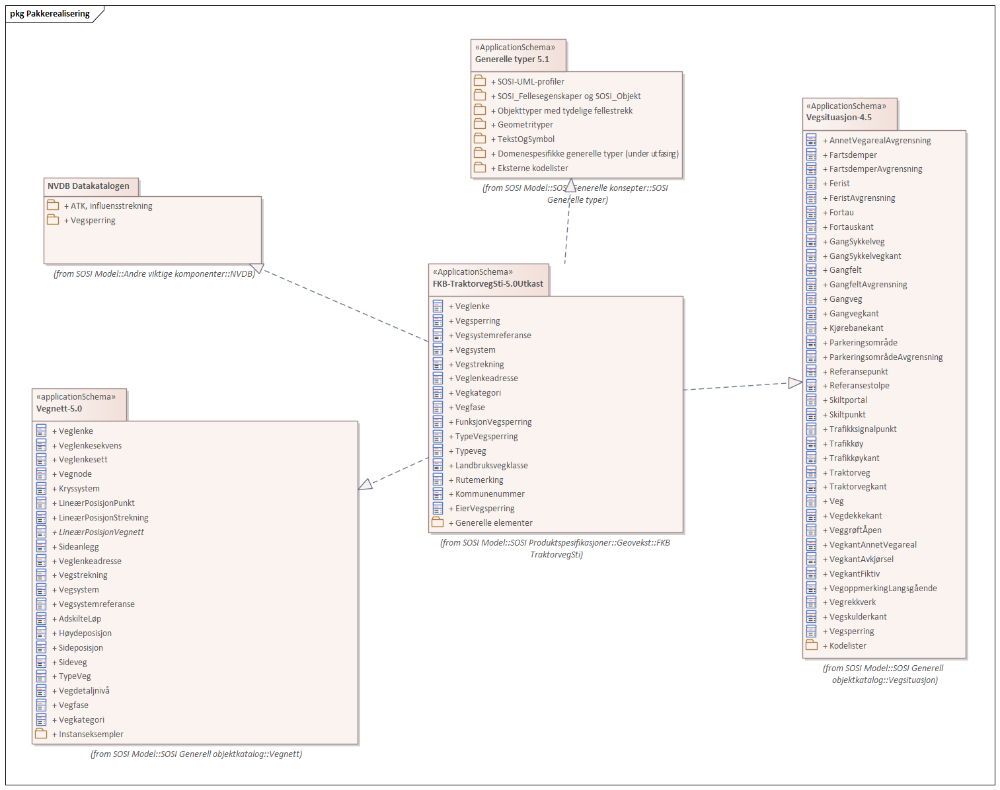
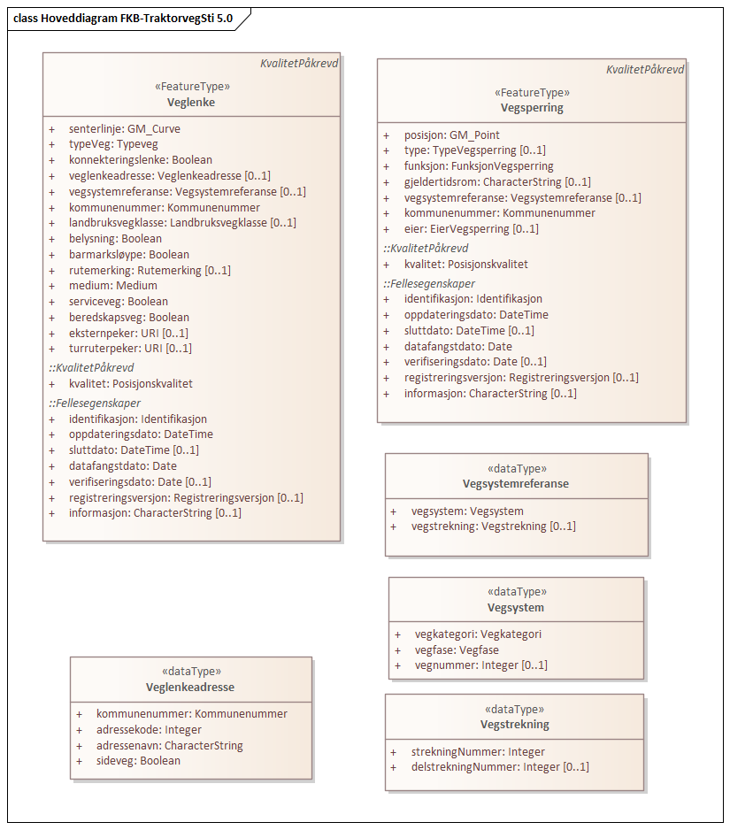
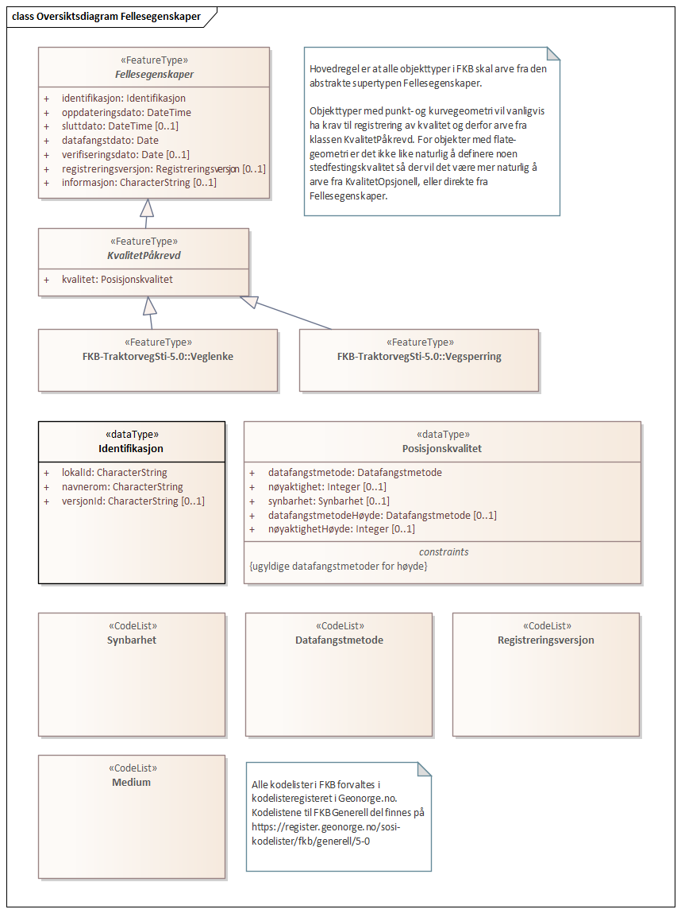
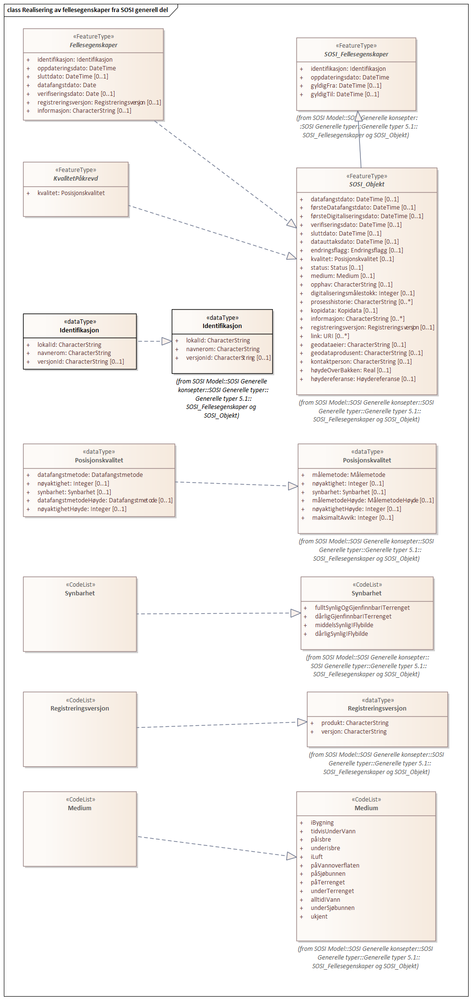
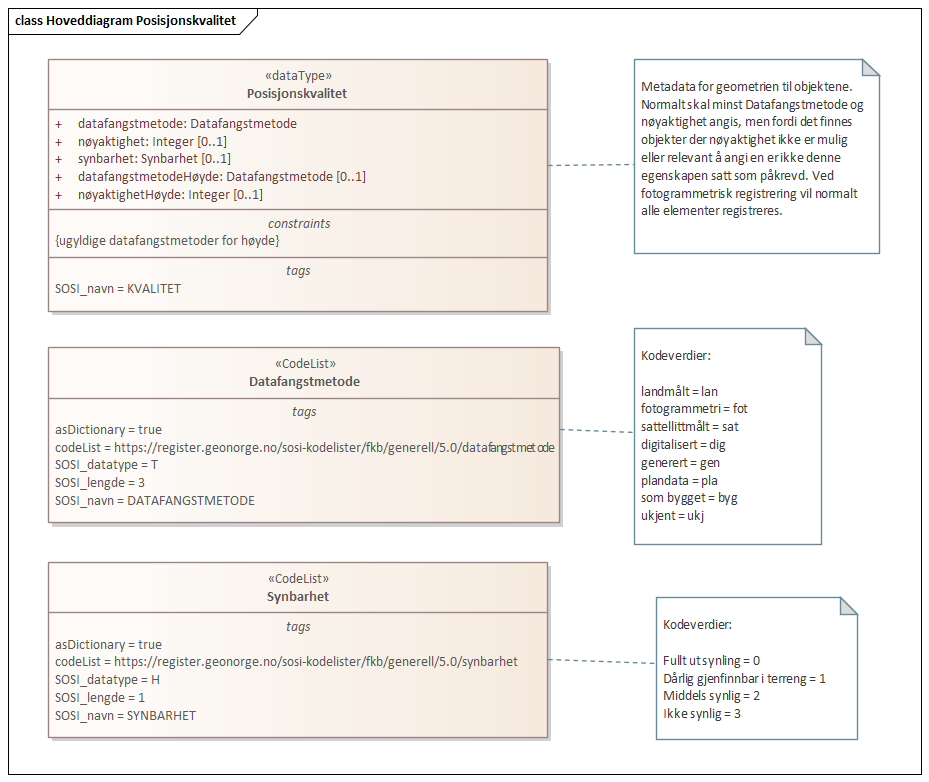

// Start of UML-model
=== Pakke: «ApplicationSchema» FKB-TraktorvegSti-5.0
*Definisjon:* Datamodell for produktspesfikasjonen FKB-TraktorvegSti. FKB-TraktorvegSti inneholder senterlinjer for traktorveger, stier og tritrapp, vegsperringer langs aktuelle senterlinjer samt et utvalg av tilhørende informasjon.
 
[discrete]
==== Profilparametre i tagged values
[cols="20,80"]
|===
|definition
|"Data model for FKB-TraktorvegSti"@en
 
|description
|"Contains unpaved tracks and footways including related roadblocks" @en
 
|designation
|"Product specification FKB-TraktorvegSti 5.0"@en
 
|language
|no
 
|SOSI_kortnavn
|FKBTraktorvegSti
 
|SOSI_langnavn
|FKB-TraktorvegSti
 
|SOSI_modellstatus
|gyldig
 
|SOSI_spesifikasjonstype
|produktspesifikasjon
 
|SOSI_versjon
|5.0
 
|targetNamespace
|http://skjema.geonorge.no/SOSI/produktspesifikasjon/FKB-TraktorvegSti/5.0
 
|version
|5.0
 
|xmlns
|app
 
|xsdDocument
|FKBTraktorvegSti.xsd
 
|xsdEncodingRule
|sosi
 
|===
 
'''
 
.Pakkerealisering 

 
'''
 
.Hoveddiagram FKB-TraktorvegSti 5.0 

 
'''
 
.Kodelister 
image::diagrammer/Kodelister.png[link=diagrammer/Kodelister.png, alt="Diagram med navn Kodelister som viser UML-klasser beskrevet i teksten nedenfor."]
 
'''
 
.Realisering av objekttyper og datatyper 
image::diagrammer/Realisering av objekttyper og datatyper.png[link=diagrammer/Realisering av objekttyper og datatyper.png, alt="Diagram med navn Realisering av objekttyper og datatyper som viser UML-klasser beskrevet i teksten nedenfor."]
 
'''
 
[[veglenke]]
==== «FeatureType» Veglenke
*Definisjon:* Objekttype som representerer alle senterlinjelenker i FKB-TraktorvegSti.
 
 
'''
.Illustrasjon av objekttype Veglenke
image::https://skjema.geonorge.no/SOSI/produktspesifikasjon/FKB-TraktorvegSti/5.0/figurer/objtype_veglenke.png[link=https://skjema.geonorge.no/SOSI/produktspesifikasjon/FKB-TraktorvegSti/5.0/figurer/objtype_veglenke.png, alt="Bilde av et eksempel på objekttypen Veglenke, eventuelt med påtegning av streker som viser hvor geometrien til objektet skal måles fra."]
[discrete]
===== Egenskaper
[cols="20,80"]
|===
|*Navn:* 
|*senterlinje*
 
|Definisjon: 
|forløp som følger objektets sentrale del
 
|Multiplisitet: 
|[1..1]
 
|Type: 
|http://skjema.geonorge.no/SOSI/basistype/GM_Curve[GM_Curve]
|===
[cols="20,80"]
|===
|*Navn:* 
|*typeveg*
 
|Definisjon: 
|egenskap for å angi type veglenke strekningen representerer.
 
|Multiplisitet: 
|[1..1]
 
|Type: 
|<<typeveg,«CodeList» Typeveg>>
|Profilparametre i tagged values: 
|
defaultCodeSpace: https://register.geonorge.no/sosi-kodelister/fkb/traktorvegsti/5.0/typeveg + 
SOSI_datatype: T + 
SOSI_lengde: 30 + 
SOSI_navn: TYPEVEG + 
|===
[cols="20,80"]
|===
|*Navn:* 
|*konnekteringslenke*
 
|Definisjon: 
|kunstig objekt hvor senterlinjen representerer en konstruert linje som skjøter sammen lenker der det er hull i topologien. Lenke kun eksisterer for å knytte sammen andre lenker.

Dersom egenskapen ikke er angitt betyr dette det samme som  konnekteringslenke Nei. 
 
|Multiplisitet: 
|[1..1]
 
|Type: 
|<<boolean,Boolean>>
|Profilparametre i tagged values: 
|
SOSI_datatype: BOOLSK + 
SOSI_navn: KONNEKTERINGSLENKE + 
|===
[cols="20,80"]
|===
|*Navn:* 
|*veglenkeadresse*
 
|Definisjon: 
|sammensatt identifikator for veglenkeadresse.
Merknad: Komplett vegadresse består i tillegg av husnummer og bokstav
 
|Multiplisitet: 
|[0..1]
 
|Type: 
|<<veglenkeadresse,«dataType» Veglenkeadresse>>
|Profilparametre i tagged values: 
|
SOSI_navn: VEGLENKEADRESSE + 
|===
[cols="20,80"]
|===
|*Navn:* 
|*vegsystemreferanse*
 
|Definisjon: 
|sammensatt identifikator for vegreferanse
 
|Multiplisitet: 
|[0..1]
 
|Type: 
|<<vegsystemreferanse,«dataType» Vegsystemreferanse>>
|Profilparametre i tagged values: 
|
SOSI_navn: VEGSYSTEMREFERANSE + 
|===
[cols="20,80"]
|===
|*Navn:* 
|*kommunenummer*
 
|Definisjon: 
|Egenskap for nummerering av kommune objektet befinner seg i, i henhold til SSB sin offisielle liste.
Merknad: Det presiseres at kommunenummer alltid skal ha 4 sifre, dvs. eventuelt med ledende null.
 
|Multiplisitet: 
|[1..1]
 
|Type: 
|<<kommunenummer,«CodeList» Kommunenummer>>
|Profilparametre i tagged values: 
|
defaultCodeSpace: https://register.geonorge.no/sosi-kodelister/kommunenummer-alle + 
SOSI_datatype: T + 
SOSI_lengde: T + 
SOSI_navn: KOMM + 
|===
[cols="20,80"]
|===
|*Navn:* 
|*klasselandbruksveg*
 
|Definisjon: 
|kalissifisering av landbruksveger i henhold til normaler for landbruksveier    http://www.skogkurs.no/vegnormaler/   
 
|Multiplisitet: 
|[0..1]
 
|Type: 
|<<klasselandbruksveg,«CodeList» KlasseLandbruksveg>>
|Profilparametre i tagged values: 
|
defaultCodeSpace: https://register.geonorge.no/sosi-kodelister/fkb/traktorvegsti/5.0/klasselandbruksveg + 
SOSI_datatype: T + 
SOSI_lengde: 30 + 
SOSI_navn: KLASSELANDBRUKSVEG + 
|===
[cols="20,80"]
|===
|*Navn:* 
|*belysning*
 
|Definisjon: 
|angivelse av permanent belysning langs sti eller løype.

Dersom egenskapen ikke er angitt betyr dette det samme som  belysning Nei. 
 
|Multiplisitet: 
|[1..1]
 
|Type: 
|<<boolean,Boolean>>
|Profilparametre i tagged values: 
|
SOSI_datatype: BOOLSK + 
SOSI_navn: BELYSNING + 
|===
[cols="20,80"]
|===
|*Navn:* 
|*barmarksløype*
 
|Definisjon: 
|Betinget egenskap som kun brukes for veglenker som er omfattet av barmarksløyper i Finnmark (jf. definison styrt av fylkesmannen i Finnmark). Dersom egenskapen ikke er angitt betyr dette det samme som barmarksløype Nei.
 
|Multiplisitet: 
|[1..1]
 
|Type: 
|<<boolean,Boolean>>
|Profilparametre i tagged values: 
|
SOSI_datatype: BOOLSK + 
SOSI_navn: BARMARKSLØYPE + 
|===
[cols="20,80"]
|===
|*Navn:* 
|*rutemerking*
 
|Definisjon: 
|forteller om det er merking langs en sti, løype, veg, sykkelvei mv. Det skal være samsvar mellom veglenker angitt som merket i FKB-TraktorvegSti og turrutene som inngår i Nasjonal database for turruter. Med merking menes markering for å vise retning/led. Praktisk arbeid med  merking av turruter er beskrevet i Merkehåndboka.
 
|Multiplisitet: 
|[0..1]
 
|Type: 
|<<rutemerking,«CodeList» Rutemerking>>
|Profilparametre i tagged values: 
|
defaultCodeSpace: https://register.geonorge.no/sosi-kodelister/fkb/traktorvegsti/5.0/rutemerking + 
SOSI_datatype: T + 
SOSI_lengde: 3 + 
SOSI_navn: RUTEMERKING + 
|===
[cols="20,80"]
|===
|*Navn:* 
|*medium*
 
|Definisjon: 
|objektets beliggenhet i forhold til jordoverflaten
 
|Multiplisitet: 
|[1..1]
 
|Type: 
|<<medium,«CodeList» Medium>>
|Profilparametre i tagged values: 
|
defaultCodeSpace: https://register.geonorge.no/sosi-kodelister/fkb/generell/5.0/medium + 
SOSI_datatype: T + 
SOSI_lengde: 1 + 
SOSI_navn: MEDIUM + 
|===
[cols="20,80"]
|===
|*Navn:* 
|*serviceveg*
 
|Definisjon: 
|Vegstrekning som ikke er åpen for allmenn trafikk, men som benyttes for å komme til tekniske anlegg el.l.
Dersom egenskapen ikke er angitt betyr dette det samme som  serviceveg Nei. 
 
|Multiplisitet: 
|[1..1]
 
|Type: 
|<<boolean,Boolean>>
|Profilparametre i tagged values: 
|
SOSI_datatype: BOOLSK + 
SOSI_navn: SERVICEVEG + 
|===
[cols="20,80"]
|===
|*Navn:* 
|*beredskapsveg*
 
|Definisjon: 
|Vegstrekning som ikke er åpen for allmenn trafikk. Åpnes for å lede trafikk til en annen veg når hovedvegen stenges.
Dersom egenskapen ikke er angitt betyr dette det samme som  beredskapsveg Nei. 
 
|Multiplisitet: 
|[1..1]
 
|Type: 
|<<boolean,Boolean>>
|Profilparametre i tagged values: 
|
SOSI_datatype: BOOLSK + 
SOSI_navn: BEREDSKAPSVEG + 
|===
[cols="20,80"]
|===
|*Navn:* 
|*eksternpeker*
 
|Definisjon: 
|referanse til objekt i et eksternt system, som ikke er Nasjonal database for turruter.
 
|Multiplisitet: 
|[0..1]
 
|Type: 
|http://skjema.geonorge.no/SOSI/basistype/URI[URI]
|Profilparametre i tagged values: 
|
SOSI_datatype: T + 
SOSI_lengde: 255 + 
SOSI_navn: EKSTERNPEKER + 
|===
[cols="20,80"]
|===
|*Navn:* 
|*turruterpeker*
 
|Definisjon: 
|referanse til objekt i Nasjonal database for turruter.
 
|Multiplisitet: 
|[0..1]
 
|Type: 
|http://skjema.geonorge.no/SOSI/basistype/URI[URI]
|Profilparametre i tagged values: 
|
SOSI_datatype: T + 
SOSI_lengde: 255 + 
SOSI_navn: TURRUTERPEKER + 
|===
 
[discrete]
===== Arv og realiseringer
[cols="20,80"]
|===
|Supertype: 
|<<kvalitetpåkrevd,«FeatureType» KvalitetPåkrevd>>
 
|Realisering av: 
|«applicationSchema» Vegnett-5.0::«featureType» Veglenke +
|===
 
'''
 
[[vegsperring]]
==== «FeatureType» Vegsperring
*Definisjon:* Objekttype som representerer fysisk sperring langs traktorveg eller sti.
 
[discrete]
===== Profilparametre i tagged values
[cols="20,80"]
|===
|byValuePropertyType
|false
 
|catalogue-entry
|NVDB Datakatalogen
 
|isCollection
|false
 
|noPropertyType
|false
 
|NVDB_ID
|607
 
|NVDB_navn
|Vegsperring
 
|SOSI_navn
|VEGSPERRING
 
|===
 
'''
.Illustrasjon av objekttype Vegsperring
image::https://skjema.geonorge.no/SOSI/produktspesifikasjon/FKB-TraktorvegSti/5.0/figurer/objtype_vegsperring.png[link=https://skjema.geonorge.no/SOSI/produktspesifikasjon/FKB-TraktorvegSti/5.0/figurer/objtype_vegsperring.png, alt="Bilde av et eksempel på objekttypen Vegsperring, eventuelt med påtegning av streker som viser hvor geometrien til objektet skal måles fra."]
[discrete]
===== Egenskaper
[cols="20,80"]
|===
|*Navn:* 
|*posisjon*
 
|Definisjon: 
|Gir punkt som geometrisk representerer objektet.
 
|Multiplisitet: 
|[1..1]
 
|Type: 
|http://skjema.geonorge.no/SOSI/basistype/GM_Point[GM_Point]
|Profilparametre i tagged values: 
|
SOSI_datatype: PUNKT + 
SOSI_navn: POSISJON + 
|===
[cols="20,80"]
|===
|*Navn:* 
|*typevegsperring*
 
|Definisjon: 
|angir type sperring
 
|Multiplisitet: 
|[0..1]
 
|Type: 
|<<typevegsperring,«CodeList» TypeVegsperring>>
|Profilparametre i tagged values: 
|
defaultCodeSpace: https://register.geonorge.no/sosi-kodelister/fkb/traktorvegsti/5.0/typevegsperring + 
SOSI_datatype: T + 
SOSI_lengde: 30 + 
SOSI_navn: TYPEVEGSPERRING + 
|===
[cols="20,80"]
|===
|*Navn:* 
|*funksjon*
 
|Definisjon: 
|angir sperringens funksjon
 
|Multiplisitet: 
|[1..1]
 
|Type: 
|<<funksjonvegsperring,«CodeList» FunksjonVegsperring>>
|Profilparametre i tagged values: 
|
defaultCodeSpace: https://register.geonorge.no/sosi-kodelister/fkb/veg/5.0/funksjonvegsperring + 
SOSI_datatype: T + 
SOSI_lengde: 25 + 
SOSI_navn: FUNKSJON + 
|===
[cols="20,80"]
|===
|*Navn:* 
|*gjeldertidsrom*
 
|Definisjon: 
|angir tidsrommet (hhmm-hhmm) eller (mnd-mnd) vegsperringen gjelder
 
|Multiplisitet: 
|[0..1]
 
|Type: 
|<<characterstring,«dataType» CharacterString>>
|Profilparametre i tagged values: 
|
SOSI_datatype: T + 
SOSI_lengde: 9 + 
SOSI_navn: GJELDERTIDSROM + 
|===
[cols="20,80"]
|===
|*Navn:* 
|*vegsystemreferanse*
 
|Definisjon: 
|sammensatt identifikator for vegreferanse
 
|Multiplisitet: 
|[0..1]
 
|Type: 
|<<vegsystemreferanse,«dataType» Vegsystemreferanse>>
|Profilparametre i tagged values: 
|
SOSI_navn: VEGSYSTEMREFERANSE + 
|===
[cols="20,80"]
|===
|*Navn:* 
|*kommunenummer*
 
|Definisjon: 
|Egenskap for nummerering av kommune objektet befinner seg i, i henhold til SSB sin offisielle liste.
Merknad: Det presiseres at kommunenummer alltid skal ha 4 sifre, dvs. eventuelt med ledende null.
 
|Multiplisitet: 
|[1..1]
 
|Type: 
|<<kommunenummer,«CodeList» Kommunenummer>>
|Profilparametre i tagged values: 
|
defaultCodeSpace: https://register.geonorge.no/sosi-kodelister/kommunenummer-alle + 
SOSI_datatype: T + 
SOSI_lengde: 4 + 
SOSI_navn: KOMM + 
|===
[cols="20,80"]
|===
|*Navn:* 
|*eier*
 
|Definisjon: 
|angir eier av sperring
 
|Multiplisitet: 
|[0..1]
 
|Type: 
|<<eiervegsperring,«CodeList» EierVegsperring>>
|Profilparametre i tagged values: 
|
defaultCodeSpace: https://register.geonorge.no/sosi-kodelister/fkb/traktorvegsti/5.0/eiervegsperring + 
SOSI_datatype: T + 
SOSI_lengde: 30 + 
SOSI_navn: EIER + 
|===
 
[discrete]
===== Arv og realiseringer
[cols="20,80"]
|===
|Supertype: 
|<<kvalitetpåkrevd,«FeatureType» KvalitetPåkrevd>>
 
|===
 
'''
 
[[vegsystemreferanse]]
==== «dataType» Vegsystemreferanse
*Definisjon:* sammensatt identifikator for vegsystemreferanse
 
[discrete]
===== Profilparametre i tagged values
[cols="20,80"]
|===
|SOSI_navn
|VEGSYSTEMREFERANSE
 
|===
[discrete]
===== Egenskaper
[cols="20,80"]
|===
|*Navn:* 
|*vegsystem*
 
|Definisjon: 
|hvilke deler av vegnettet som forvaltningsmessig hører sammen
 
|Multiplisitet: 
|[1..1]
 
|Type: 
|<<vegsystem,«dataType» Vegsystem>>
|Profilparametre i tagged values: 
|
SOSI_navn: VEGSYSTEM + 
|===
[cols="20,80"]
|===
|*Navn:* 
|*vegstrekning*
 
|Definisjon: 
|deler inn vegsystemet i praktisk håndterbare størrelser nummerert i stigende rekkefølge i vegens retning
 
|Multiplisitet: 
|[0..1]
 
|Type: 
|<<vegstrekning,«dataType» Vegstrekning>>
|Profilparametre i tagged values: 
|
SOSI_navn: VEGSTREKNING + 
|===
[discrete]
===== Arv og realiseringer
[cols="20,80"]
|===
|Realisering av: 
|«applicationSchema» Vegnett-5.0::«dataType» Vegsystemreferanse +
|===
 
'''
 
[[vegsystem]]
==== «dataType» Vegsystem
*Definisjon:* Definerer hvilke deler av vegnettet som forvaltningsmessig hører sammen.
 
[discrete]
===== Profilparametre i tagged values
[cols="20,80"]
|===
|SOSI_navn
|VEGSYSTEM
 
|===
[discrete]
===== Egenskaper
[cols="20,80"]
|===
|*Navn:* 
|*vegkategori*
 
|Definisjon: 
|Kategorisering som angir på hvilket nivå vegmyndigheten for strekningen ligger.
 
|Multiplisitet: 
|[1..1]
 
|Type: 
|<<vegkategori,«CodeList» Vegkategori>>
|Profilparametre i tagged values: 
|
defaultCodeSpace: https://register.geonorge.no/sosi-kodelister/fkb/traktorvegsti/5.0/vegkategori + 
NVDB_ID: 11276 + 
NVDB_navn: Vegkategori + 
SOSI_datatype: T + 
SOSI_lengde: 50 + 
SOSI_navn: VEGKATEGORI + 
|===
[cols="20,80"]
|===
|*Navn:* 
|*vegfase*
 
|Definisjon: 
|Angir vegens fase i livet.
 
|Multiplisitet: 
|[1..1]
 
|Type: 
|<<vegfase,«CodeList» Vegfase>>
|Profilparametre i tagged values: 
|
defaultCodeSpace: https://register.geonorge.no/sosi-kodelister/fkb/traktorvegsti/5.0/vegfase + 
NVDB_ID: 11278 + 
NVDB_navn: Fase + 
SOSI_datatype: T + 
SOSI_lengde: 20 + 
SOSI_navn: VEGFASE + 
|===
[cols="20,80"]
|===
|*Navn:* 
|*vegnummer*
 
|Definisjon: 
|Angir hvilke deler av vegnettet som rutemessig hører sammen.
 
|Multiplisitet: 
|[0..1]
 
|Type: 
|<<integer,«dataType» Integer>>
|Profilparametre i tagged values: 
|
NVDB_ID: 11277 + 
NVDB_navn: Vegnummer + 
SOSI_datatype: H + 
SOSI_lengde: 5 + 
SOSI_navn: VEGNUMMER + 
|===
[discrete]
===== Arv og realiseringer
[cols="20,80"]
|===
|Realisering av: 
|«applicationSchema» Vegnett-5.0::«dataType» Vegsystem +
|===
 
'''
 
[[vegstrekning]]
==== «dataType» Vegstrekning
*Definisjon:* deler inn vegsystemet i praktisk håndterbare størrelser nummerert i stigende rekkefølge i vegens retning
 
[discrete]
===== Profilparametre i tagged values
[cols="20,80"]
|===
|SOSI_navn
|VEGSTREKNING
 
|===
[discrete]
===== Egenskaper
[cols="20,80"]
|===
|*Navn:* 
|*strekningNummer*
 
|Definisjon: 
|nummer for den enkelte strekning i et vegsystem
 
|Multiplisitet: 
|[1..1]
 
|Type: 
|<<integer,«dataType» Integer>>
|Profilparametre i tagged values: 
|
SOSI_datatype: H + 
SOSI_lengde: 3 + 
SOSI_navn: STREKNINGNUMMER + 
|===
[cols="20,80"]
|===
|*Navn:* 
|*delstrekningNummer*
 
|Definisjon: 
|inndeling av Strekning i forhold til delstrekningens funksjon, f.eks. hovedløp, armer, gang- og sykkelveger. Nummeret er unikt innenfor strekningen.
 
|Multiplisitet: 
|[0..1]
 
|Type: 
|<<integer,«dataType» Integer>>
|Profilparametre i tagged values: 
|
SOSI_datatype: H + 
SOSI_lengde: 3 + 
SOSI_navn: DELSTREKNINGNUMMER + 
|===
[discrete]
===== Arv og realiseringer
[cols="20,80"]
|===
|Realisering av: 
|«applicationSchema» Vegnett-5.0::«dataType» Vegstrekning +
|===
 
'''
 
[[veglenkeadresse]]
==== «dataType» Veglenkeadresse
*Definisjon:* Sammensatt identifikator for veglenkeadresse. Merknad: Komplett vegadresse består i tillegg av husnummer og bokstav.
 
[discrete]
===== Profilparametre i tagged values
[cols="20,80"]
|===
|SOSI_navn
|VEGLENKEADRESSE
 
|===
[discrete]
===== Egenskaper
[cols="20,80"]
|===
|*Navn:* 
|*kommunenummer*
 
|Definisjon: 
|nummerering av kommuner i henhold til Statistisk sentralbyrå sin offisielle liste.
Merknad: egenskapen er påkrevd for unik identifisering av veglenkeadresser, i og med at adressekoden kun er unik innen en kommune.
 
|Multiplisitet: 
|[1..1]
 
|Type: 
|<<kommunenummer,«CodeList» Kommunenummer>>
|Profilparametre i tagged values: 
|
defaultCodeSpace: https://register.geonorge.no/sosi-kodelister/kommunenummer-alle + 
SOSI_navn: KOMM + 
|===
[cols="20,80"]
|===
|*Navn:* 
|*adressekode*
 
|Definisjon: 
|Nummer som entydig identifiserer adresserbare veglenker i matrikkelen. For hvert adressenavn (gatenavn) skal det således foreligge en adressekode, jf. matrikkelforskriften § 51.2. Merknad: Adressekode er unik innenfor kommunen
 
|Multiplisitet: 
|[1..1]
 
|Type: 
|<<integer,«dataType» Integer>>
|Profilparametre i tagged values: 
|
NVDB_ID: 4588 + 
NVDB_navn: Gatekode + 
SOSI_datatype: H + 
SOSI_lengde: 5 + 
SOSI_navn: ADRESSEKODE + 
|===
[cols="20,80"]
|===
|*Navn:* 
|*adressenavn*
 
|Definisjon: 
|Navn på veglenke i matrikkelen (matrikkelforskriften § 2e)
 
|Multiplisitet: 
|[1..1]
 
|Type: 
|<<characterstring,«dataType» CharacterString>>
|Profilparametre i tagged values: 
|
NVDB_ID: 4589 + 
NVDB_navn: Gatenavn + 
SOSI_datatype: T + 
SOSI_lengde: 50 + 
SOSI_navn: ADRESSENAVN + 
|===
[cols="20,80"]
|===
|*Navn:* 
|*sideveg*
 
|Definisjon: 
|Angir om en veglenke er sideveg og dermed bruker adresser fra lenken den er sideveg fra. Dersom ikke oppgitt, gir det "Nei"- alternativet, dvs "Ikke sideveg".
 
|Multiplisitet: 
|[1..1]
 
|Type: 
|<<boolean,Boolean>>
|Profilparametre i tagged values: 
|
SOSI_datatype: BOOLSK + 
SOSI_navn: SIDEVEG + 
|===
[discrete]
===== Arv og realiseringer
[cols="20,80"]
|===
|Realisering av: 
|«applicationSchema» Vegnett-5.0::«dataType» Veglenkeadresse +
|===
 
'''
 
[[vegkategori]]
==== «CodeList» Vegkategori
*Definisjon:* angivelse av vegens kategori/eierskap
 
[discrete]
===== Profilparametre i tagged values
[cols="20,80"]
|===
|asDictionary
|true
 
|codeList
|https://register.geonorge.no/sosi-kodelister/fkb/traktorvegsti/5.0/vegkategori
 
|SOSI_datatype
|T
 
|SOSI_lengde
|1
 
|SOSI_navn
|VEGKATEGORI
 
|===
 
'''
 
[[vegfase]]
==== «CodeList» Vegfase
*Definisjon:* angivelse av vegens "fase i livet"
 
[discrete]
===== Profilparametre i tagged values
[cols="20,80"]
|===
|asDictionary
|true
 
|codeList
|https://register.geonorge.no/sosi-kodelister/fkb/traktorvegsti/5.0/vegfase
 
|SOSI_datatype
|T
 
|SOSI_lengde
|1
 
|SOSI_navn
|VEGFASE
 
|===
 
'''
 
[[funksjonvegsperring]]
==== «CodeList» FunksjonVegsperring
*Definisjon:* kodeliste for funksjon av vegsperring
 
[discrete]
===== Profilparametre i tagged values
[cols="20,80"]
|===
|asDictionary
|true
 
|codeList
|https://register.geonorge.no/sosi-kodelister/fkb/veg/5.0/funksjonvegsperring
 
|SOSI_datatype
|T
 
|SOSI_lengde
|30
 
|SOSI_navn
|FUNKSJONVEGSPERRING
 
|===
 
'''
 
[[typevegsperring]]
==== «CodeList» TypeVegsperring
*Definisjon:* kodeliste for type vegsperring
 
[discrete]
===== Profilparametre i tagged values
[cols="20,80"]
|===
|asDictionary
|true
 
|codeList
|https://register.geonorge.no/sosi-kodelister/fkb/traktorvegsti/5.0/typevegsperring
 
|SOSI_datatype
|T
 
|SOSI_lengde
|30
 
|SOSI_navn
|TYPEVEGSPERRING
 
|===
 
'''
 
[[typeveg]]
==== «CodeList» Typeveg
*Definisjon:* kodeliste typeveger som brukes i FKB-TraktorvegSti 5.0
 
[discrete]
===== Profilparametre i tagged values
[cols="20,80"]
|===
|asDictionary
|true
 
|codeList
|https://register.geonorge.no/sosi-kodelister/fkb/traktorvegsti/5.0/typeveg
 
|SOSI_datatype
|T
 
|SOSI_lengde
|30
 
|SOSI_navn
|TYPEVEG
 
|===
 
'''
 
[[klasselandbruksveg]]
==== «CodeList» KlasseLandbruksveg
*Definisjon:* kodeliste for klasser av landbruksveger. Benyttes kun for veger definert som landbruksveger.
 
[discrete]
===== Profilparametre i tagged values
[cols="20,80"]
|===
|asDictionary
|true
 
|codeList
|https://register.geonorge.no/sosi-kodelister/fkb/traktorvegsti/5.0/klasselandbruksveg
 
|SOSI_datatype
|T
 
|SOSI_lengde
|30
 
|SOSI_navn
|KLASSELANDBRUKSVEG
 
|===
 
'''
 
[[rutemerking]]
==== «CodeList» Rutemerking
*Definisjon:* brukes for å angi om en sti eller løype er markert for å vise retning, i samsvar med Nasjonal database for turruter og i henhold til Merkehåndboka.
 
[discrete]
===== Profilparametre i tagged values
[cols="20,80"]
|===
|asDictionary
|true
 
|codeList
|https://register.geonorge.no/sosi-kodelister/fkb/traktorvegsti/5.0/rutemerking
 
|SOSI_datatype
|T
 
|SOSI_lengde
|3
 
|SOSI_navn
|RUTEMERKING
 
|===
 
'''
 
[[kommunenummer]]
==== «CodeList» Kommunenummer
*Definisjon:* Kodeliste for nummerering av kommuner i henhold til SSB sin offisielle liste. Inneholder fremtidige, gyldige og utgåtte kommunenummer.
 
[discrete]
===== Profilparametre i tagged values
[cols="20,80"]
|===
|asDictionary
|true
 
|codeList
|https://register.geonorge.no/sosi-kodelister/kommunenummer-alle
 
|SOSI_datatype
|H
 
|SOSI_lengde
|4
 
|SOSI_navn
|KOMM
 
|===
 
'''
 
[[eiervegsperring]]
==== «CodeList» EierVegsperring
*Definisjon:* kodeliste for eier og forvaltningsansvar for vegsperring
 
[discrete]
===== Profilparametre i tagged values
[cols="20,80"]
|===
|asDictionary
|true
 
|codeList
|https://register.geonorge.no/sosi-kodelister/fkb/traktorvegsti/5.0/eiervegsperring
 
|SOSI_datatype
|T
 
|SOSI_lengde
|30
 
|SOSI_navn
|EIERVEGSPERRING
 
|===
<<<
'''
==== Pakke: Generelle elementer
*Definisjon:* pakke med elementer som realiserer tilsvarende elementer i FKB Generell del 5.0.
 
'''
 
.Oversiktsdiagram Fellesegenskaper 

 
'''
 
.Realisering av fellesegenskaper fra SOSI generell del 

 
'''
 
.Hoveddiagram Posisjonskvalitet 

 
'''
 
[[fellesegenskaper]]
===== «FeatureType» Fellesegenskaper (abstrakt)
*Definisjon:* abstrakt objekttype som bærer sentrale egenskaper som er anbefalt for bruk i produktspesifikasjoner.
 
[discrete]
====== Egenskaper
[cols="20,80"]
|===
|*Navn:* 
|*identifikasjon*
 
|Definisjon: 
|unik identifikasjon av et objekt 

Merknad FKB:
Unik identifikasjon av et objekt, ivaretas av den ansvarlige produsent/forvalter, og som kan benyttes av eksterne applikasjoner som referanse til objektet.

Den unike identifikatoren er unik for kartobjektet og skal ikke endres i kartobjektets levetid. Dette må ikke forveksles med en tematisk identifikator (for eksempel bygningsnummer) som unikt identifiserer et objekt i virkeligheten. En bygning med samme bygningsnummer vil kunne representeres i mange kartprodukter der det finnes en unik identifikasjon i hver av dem.

For FKB benyttes UUID (Universally unique identifier) som lokalId. Dette innebærer at lokalId alene alltid vil være unik. Likevel skal alltid navnerom også angis. Navnerom angir FKB-datasettet.
 
|Multiplisitet: 
|[1..1]
 
|Type: 
|<<identifikasjon,«dataType» Identifikasjon>>
|Profilparametre i tagged values: 
|
SOSI_navn: IDENT + 
|===
[cols="20,80"]
|===
|*Navn:* 
|*oppdateringsdato*
 
|Definisjon: 
|tidspunkt for siste endring på objektet 

Merknad FKB: 

Denne datoen viser datasystemets siste endring på dataobjektet. Egenskapen settes av forvaltningssystemet etter følgende regler:

i. Oppdateringsdato er tidspunkt for oppdatering av databasen og settes av forvaltningsbasen (ikke av klienten).

ii. Oppdateringsdato skal endres også hvis det er kopidata som blir endret eller importert i en ”kopibase”.

iii. Når avgrensingslinjene til en flate endres, skal flateobjektet få ny oppdateringsdato.

iv. Oppdateringsdato skal endres hvis en egenskap endres.
 
|Multiplisitet: 
|[1..1]
 
|Type: 
|http://skjema.geonorge.no/SOSI/basistype/DateTime[DateTime]
|Profilparametre i tagged values: 
|
SOSI_datatype: DATOTID + 
SOSI_navn: OPPDATERINGSDATO + 
|===
[cols="20,80"]
|===
|*Navn:* 
|*sluttdato*
 
|Definisjon: 
|Tid for når denne versjonen av objektet var erstattet eller opphørt å eksistere.

Merknad FKB:
Egenskapen settes av forvaltningssystemet. Sluttdato skal kun sendes med ut fra forvaltningssystemet i sammenhenger der objektenes historikk er interessant.    
 
|Multiplisitet: 
|[0..1]
 
|Type: 
|http://skjema.geonorge.no/SOSI/basistype/DateTime[DateTime]
|Profilparametre i tagged values: 
|
SOSI_datatype: DATOTID + 
SOSI_navn: SLUTTDATO + 
|===
[cols="20,80"]
|===
|*Navn:* 
|*datafangstdato*
 
|Definisjon: 
|dato når objektet siste gang ble registrert/observert/målt i terrenget
 
|Multiplisitet: 
|[1..1]
 
|Type: 
|http://skjema.geonorge.no/SOSI/basistype/Date[Date]
|Profilparametre i tagged values: 
|
SOSI_datatype: DATO + 
SOSI_navn: DATAFANGSTDATO + 
|===
[cols="20,80"]
|===
|*Navn:* 
|*verifiseringsdato*
 
|Definisjon: 
|dato når dataene er fastslått å være i samsvar med virkeligheten.

Merknad FKB:
Brukes for eksempel i de sammenhenger hvor det er foretatt fotogrammetrisk ajourhold, og hvor det ikke er registrert endringer på objektet (det virkelige objektet er i samsvar med dataobjektet)
 
|Multiplisitet: 
|[0..1]
 
|Type: 
|http://skjema.geonorge.no/SOSI/basistype/Date[Date]
|Profilparametre i tagged values: 
|
SOSI_datatype: DATO + 
SOSI_navn: VERIFISERINGSDATO + 
|===
[cols="20,80"]
|===
|*Navn:* 
|*registreringsversjon*
 
|Definisjon: 
|angivelse av hvilken produktspesifikasjon som er utgangspunkt  for dataene
 
|Multiplisitet: 
|[0..1]
 
|Type: 
|<<registreringsversjon,«CodeList» Registreringsversjon>>
|Profilparametre i tagged values: 
|
defaultCodeSpace: https://register.geonorge.no/sosi-kodelister/fkb/generell/5.0/registreringsversjon + 
SOSI_datatype: T + 
SOSI_lengde: 10 + 
SOSI_navn: REGISTRERINGSVERSJON + 
|===
[cols="20,80"]
|===
|*Navn:* 
|*informasjon*
 
|Definisjon: 
|generell opplysning.

Merknad FKB:
Mulighet til å legge inn utfyllende informasjon om objektet. Egenskapen bør bare brukes til å legge inn ekstra informasjon om enkeltobjekter. Egenskapen bør ikke brukes til å systematisk angi ekstrainformasjon om mange/alle objekter i et datasett.
 
|Multiplisitet: 
|[0..1]
 
|Type: 
|http://skjema.geonorge.no/SOSI/basistype/CharacterString[CharacterString]
|Profilparametre i tagged values: 
|
SOSI_datatype: T + 
SOSI_lengde: 255 + 
SOSI_navn: INFORMASJON + 
|===
 
[discrete]
====== Arv og realiseringer
[cols="20,80"]
|===
|Subtyper:
|<<kvalitetpåkrevd,«FeatureType» KvalitetPåkrevd>> +
|Realisering av: 
|«ApplicationSchema» Generelle typer 5.1/SOSI_Fellesegenskaper og SOSI_Objekt::«FeatureType» SOSI_Objekt +
|===
 
'''
 
[[kvalitetpåkrevd]]
===== «FeatureType» KvalitetPåkrevd (abstrakt)
*Definisjon:* abstrakt objekttype med påkrevet kvalitetsangivelse
 
[discrete]
====== Egenskaper
[cols="20,80"]
|===
|*Navn:* 
|*kvalitet*
 
|Definisjon: 
|beskrivelse av kvaliteten på stedfestingen

Merknad: Denne er identisk med ..KVALITET i tidligere versjoner av SOSI.
 
|Multiplisitet: 
|[1..1]
 
|Type: 
|<<posisjonskvalitet,«dataType» Posisjonskvalitet>>
|Profilparametre i tagged values: 
|
SOSI_navn: KVALITET + 
|===
 
[discrete]
====== Arv og realiseringer
[cols="20,80"]
|===
|Supertype: 
|<<fellesegenskaper,«FeatureType» Fellesegenskaper>>
 
|Subtyper:
|<<vegsperring,«FeatureType» Vegsperring>> +
<<veglenke,«FeatureType» Veglenke>> +
|Realisering av: 
|«ApplicationSchema» Generelle typer 5.1/SOSI_Fellesegenskaper og SOSI_Objekt::«FeatureType» SOSI_Objekt +
|===
 
'''
 
[[identifikasjon]]
===== «dataType» Identifikasjon
*Definisjon:* Unik identifikasjon av et objekt i et datasett, forvaltet av den ansvarlige produsent/forvalter, og kan benyttes av eksterne applikasjoner som stabil referanse til objektet. 

Merknad 1: Denne objektidentifikasjonen må ikke forveksles med en tematisk objektidentifikasjon, slik som f.eks bygningsnummer. 

Merknad 2: Denne unike identifikatoren vil ikke endres i løpet av objektets levetid, og ikke gjenbrukes i andre objekt.
 
[discrete]
====== Profilparametre i tagged values
[cols="20,80"]
|===
|SOSI_navn
|IDENT
 
|===
[discrete]
====== Egenskaper
[cols="20,80"]
|===
|*Navn:* 
|*lokalId*
 
|Definisjon: 
|lokal identifikator av et objekt

Merknad: Det er dataleverendørens ansvar å sørge for at den lokale identifikatoren er unik innenfor navnerommet. For FKB-data benyttes UUID som lokalId.
 
|Multiplisitet: 
|[1..1]
 
|Type: 
|http://skjema.geonorge.no/SOSI/basistype/CharacterString[CharacterString]
|Profilparametre i tagged values: 
|
SOSI_datatype: T + 
SOSI_lengde: 100 + 
SOSI_navn: LOKALID + 
|===
[cols="20,80"]
|===
|*Navn:* 
|*navnerom*
 
|Definisjon: 
|navnerom som unikt identifiserer datakilden til et objekt, anbefales å være en http-URI

Eksempel: http://data.geonorge.no/SentraltStedsnavnsregister/1.0

Merknad : Verdien for nanverom vil eies av den dataprodusent som har ansvar for de unike identifikatorene og må være registrert i data.geonorge.no eller data.norge.no
 
|Multiplisitet: 
|[1..1]
 
|Type: 
|http://skjema.geonorge.no/SOSI/basistype/CharacterString[CharacterString]
|Profilparametre i tagged values: 
|
SOSI_datatype: T + 
SOSI_lengde: 100 + 
SOSI_navn: NAVNEROM + 
|===
[cols="20,80"]
|===
|*Navn:* 
|*versjonId*
 
|Definisjon: 
|identifikasjon av en spesiell versjon av et geografisk objekt (instans)
 
|Multiplisitet: 
|[0..1]
 
|Type: 
|http://skjema.geonorge.no/SOSI/basistype/CharacterString[CharacterString]
|Profilparametre i tagged values: 
|
SOSI_datatype: T + 
SOSI_lengde: 100 + 
SOSI_navn: VERSJONID + 
|===
[discrete]
====== Arv og realiseringer
[cols="20,80"]
|===
|Realisering av: 
|«ApplicationSchema» Generelle typer 5.1/SOSI_Fellesegenskaper og SOSI_Objekt::«dataType» Identifikasjon +
|===
 
'''
 
[[posisjonskvalitet]]
===== «dataType» Posisjonskvalitet
*Definisjon:* beskrivelse av kvaliteten på stedfestingen.

Merknad:
Posisjonskvalitet er ikke konform med  kvalitetsmodellen i ISO slik den er defineret i ISO19157:2013, men er en videreføring av tildligere brukte kvalitetsegenskaper i SOSI. FKB 5.0 innfører en egen variant av datatypen Posisjonskvalitet der kodeliste målemetode er byttet ut med den mer generelle kodelista Datafangstmetode.
 
[discrete]
====== Profilparametre i tagged values
[cols="20,80"]
|===
|SOSI_navn
|KVALITET
 
|===
[discrete]
====== Egenskaper
[cols="20,80"]
|===
|*Navn:* 
|*datafangstmetode*
 
|Definisjon: 
|metode for datafangst. 
Egenskapen beskriver datafangstmetode for grunnrisskoordinater (x,y), eller for både grunnriss og høyde (x,y,z) dersom det ikke er oppgitt noen verdi for datafangstmetodeHøyde.
 
|Multiplisitet: 
|[1..1]
 
|Type: 
|<<datafangstmetode,«CodeList» Datafangstmetode>>
|Profilparametre i tagged values: 
|
defaultCodeSpace: https://register.geonorge.no/sosi-kodelister/fkb/generell/5.0/datafangstmetode + 
SOSI_datatype: T + 
SOSI_lengde: 3 + 
SOSI_navn: DATAFANGSTMETODE + 
|===
[cols="20,80"]
|===
|*Navn:* 
|*nøyaktighet*
 
|Definisjon: 
|standardavviket til posisjoneringa av objektet oppgitt i cm

I de aller fleste sammenhenger benyttes en anslått eller forventet verdi for standardavvik, men dersom man har en beregnet verdi skal denne benyttes. 

For objekter med punktgeometri benyttes verdi for punktstandardavvik. For objekter med kurvegeometri benyttes standardavviket for tverravviket fra kurva. For objekter med overflate- eller volumgeometri er forståelsen at standardavviket beregnes ut fra (3D) avvikene mellom sann posisjon og nærmeste punkt på overflata. 

Merknad:

Verdien er ment å beskrive nøyaktigheten til objektet sammenlignet med sann verdi. Standardavvik er i utgangspunktet et mål på det tilfeldige avviket og det innebærer at vi forutsetter at det systematiske avviket i liten grad påvirker nøyaktigheten til posisjoneringa. For fotogrammetriske data settes som hovedregel verdien lik kravet til standardavvik ved datafangst. Se standarden Geodatakvalitet for nærmere definisjon av standardavvik og hvordan dette defineres, beregnes og kontrolleres.

 
|Multiplisitet: 
|[0..1]
 
|Type: 
|http://skjema.geonorge.no/SOSI/basistype/Integer[Integer]
|Profilparametre i tagged values: 
|
SOSI_datatype: H + 
SOSI_lengde: 6 + 
SOSI_navn: NØYAKTIGHET + 
|===
[cols="20,80"]
|===
|*Navn:* 
|*synbarhet*
 
|Definisjon: 
|beskrivelse av hvor godt objektene framgår i datagrunnlaget for posisjonering (f.eks. flybildene).
 
|Multiplisitet: 
|[0..1]
 
|Type: 
|<<synbarhet,«CodeList» Synbarhet>>
|Profilparametre i tagged values: 
|
defaultCodeSpace: https://register.geonorge.no/sosi-kodelister/fkb/generell/5.0/synbarhet + 
SOSI_datatype: H + 
SOSI_lengde: 1 + 
SOSI_navn: SYNBARHET + 
|===
[cols="20,80"]
|===
|*Navn:* 
|*datafangstmetodeHøyde*
 
|Definisjon: 
|metoden brukt for høyderegistrering av posisjon.

Det er bare nødvending å angi en verdi for egenskapen dersom datafangstmetode for høyde avviker fra datafangstmetode for grunnriss.

 
|Multiplisitet: 
|[0..1]
 
|Type: 
|<<datafangstmetode,«CodeList» Datafangstmetode>>
|Profilparametre i tagged values: 
|
defaultCodeSpace: https://register.geonorge.no/sosi-kodelister/fkb/generell/5.0/datafangstmetode + 
SOSI_datatype: T + 
SOSI_lengde: 3 + 
SOSI_navn: DATAFANGSTMETODEHØYDE + 
|===
[cols="20,80"]
|===
|*Navn:* 
|*nøyaktighetHøyde*
 
|Definisjon: 
|standardavviket til posisjoneringa av objektet oppgitt i cm

I de aller fleste sammenhenger benyttes en anslått eller forventet verdi for standardavvik, men dersom man har en beregnet verdi skal denne benyttes. 

For objekter med punktgeometri benyttes verdi for punktstandardavvik. For objekter med kurvegeometri benyttes standardavviket for tverravviket fra kurva. For objekter med overflate- eller volumgeometri er forståelsen at standardavviket beregnes ut fra (3D) avvikene mellom sann posisjon og nærmeste punkt på overflata. 

Merknad:

Verdien er ment å beskrive nøyaktigheten til objektet sammenlignet med sann verdi. Standardavvik er i utgangspunktet et mål på det tilfeldige avviket og det innebærer at vi forutsetter at det systematiske avviket i liten grad påvirker nøyaktigheten til posisjoneringa. For fotogrammetriske data settes som hovedregel verdien lik kravet til standardavvik ved datafangst. Se standarden Geodatakvalitet for nærmere definisjon av standardavvik og hvordan dette defineres, beregnes og kontrolleres.

 
|Multiplisitet: 
|[0..1]
 
|Type: 
|http://skjema.geonorge.no/SOSI/basistype/Integer[Integer]
|Profilparametre i tagged values: 
|
SOSI_datatype: H + 
SOSI_lengde: 6 + 
SOSI_navn: H-NØYAKTIGHET + 
|===
 
[discrete]
====== Restriksjoner
[cols="20,80"]
|===
|*Navn:* 
|*ugyldige datafangstmetoder for høyde*
 
|Beskrivelse: 
|inv: self.datafangstmetodeHøyde &lt;&gt; 'dig'

--Datafangstmetode Digitalisert skal ikke brukes på egenskapen datafangstmetodeHøyde
 
|===
[discrete]
====== Arv og realiseringer
[cols="20,80"]
|===
|Realisering av: 
|«ApplicationSchema» Generelle typer 5.1/SOSI_Fellesegenskaper og SOSI_Objekt::«dataType» Posisjonskvalitet +
|===
 
'''
 
[[synbarhet]]
===== «CodeList» Synbarhet
*Definisjon:* synbarhet beskriver hvor godt objektene framgår i datagrunnlaget for posisjonering (f.eks. flybildene).
 
[discrete]
====== Profilparametre i tagged values
[cols="20,80"]
|===
|asDictionary
|true
 
|codeList
|https://register.geonorge.no/sosi-kodelister/fkb/generell/5.0/synbarhet
 
|SOSI_datatype
|H
 
|SOSI_lengde
|1
 
|SOSI_navn
|SYNBARHET
 
|===
 
'''
 
[[datafangstmetode]]
===== «CodeList» Datafangstmetode
*Definisjon:* metode for datafangst. 

Datafangstmetoden beskriver hvordan selve vektordataene er posisjonert fra et datagrunnlag (observasjoner med landmålingsutstyr, fotogrammetrisk stereomodell, digital terrengmodell etc.) og ikke prosessen med å innhente det bakenforliggende datagrunnlaget.
 
[discrete]
====== Profilparametre i tagged values
[cols="20,80"]
|===
|asDictionary
|true
 
|codeList
|https://register.geonorge.no/sosi-kodelister/fkb/generell/5.0/datafangstmetode
 
|SOSI_datatype
|T
 
|SOSI_lengde
|3
 
|SOSI_navn
|DATAFANGSTMETODE
 
|===
 
'''
 
[[registreringsversjon]]
===== «CodeList» Registreringsversjon
*Definisjon:* FKB-verjson som ligger til grunn for registrering. Mest relevant for data som er fotogrammetrisk registrert.
 
[discrete]
====== Profilparametre i tagged values
[cols="20,80"]
|===
|asDictionary
|true
 
|codeList
|https://register.geonorge.no/sosi-kodelister/fkb/generell/5.0/registreringsversjon
 
|SOSI_datatype
|T
 
|SOSI_lengde
|10
 
|SOSI_navn
|REGISTRERINGSVERSJON
 
|===
 
'''
 
[[medium]]
===== «CodeList» Medium
*Definisjon:* objektets beliggenhet i forhold til jordoverflaten

Eksempel:
Veg på bro, i tunnel, inne i et bygningsmessig anlegg, etc.
 
[discrete]
====== Profilparametre i tagged values
[cols="20,80"]
|===
|asDictionary
|true
 
|codeList
|https://register.geonorge.no/sosi-kodelister/fkb/generell/5.0/medium
 
|SOSI_datatype
|T
 
|SOSI_lengde
|1
 
|SOSI_navn
|MEDIUM
 
|===
// End of UML-model
