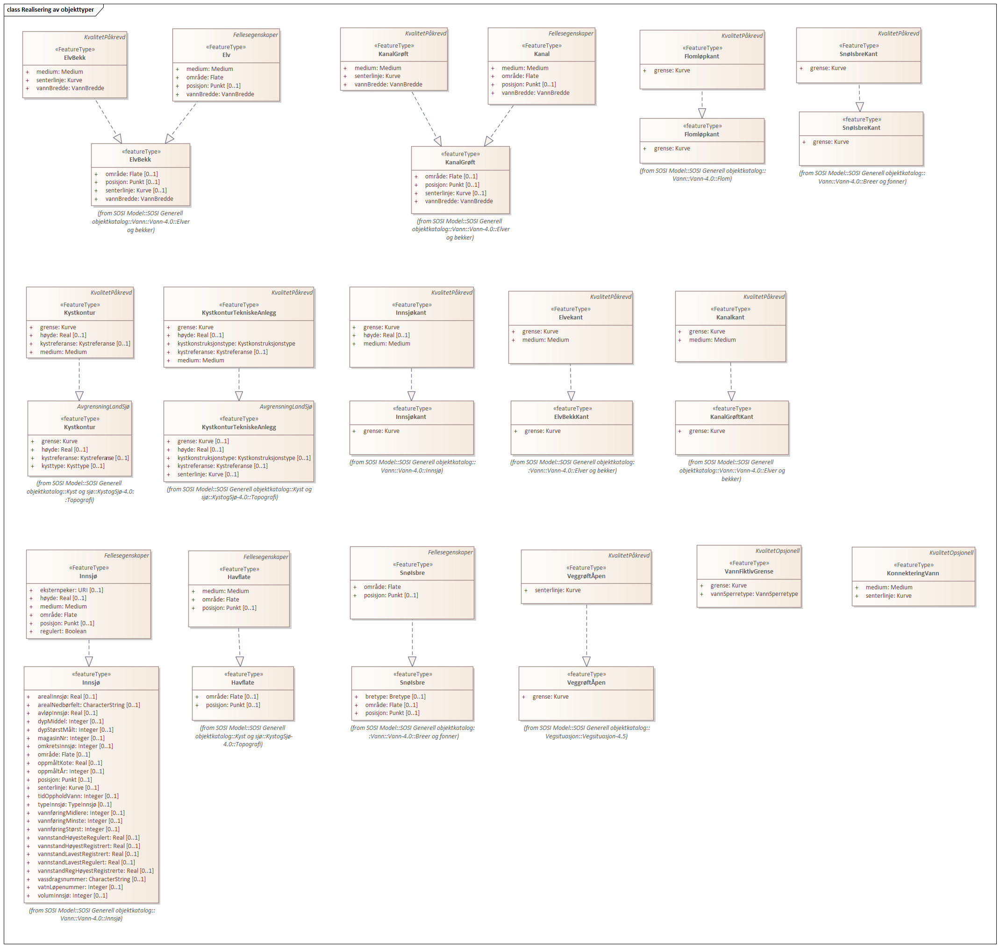
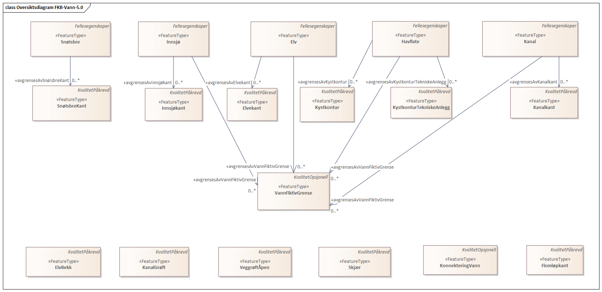
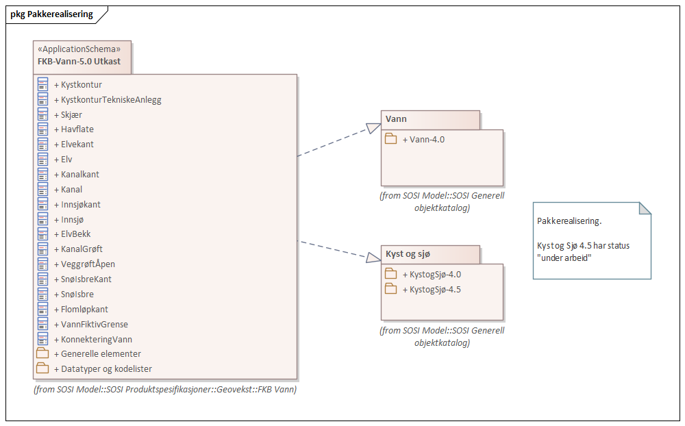
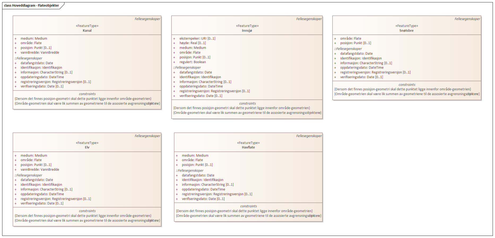
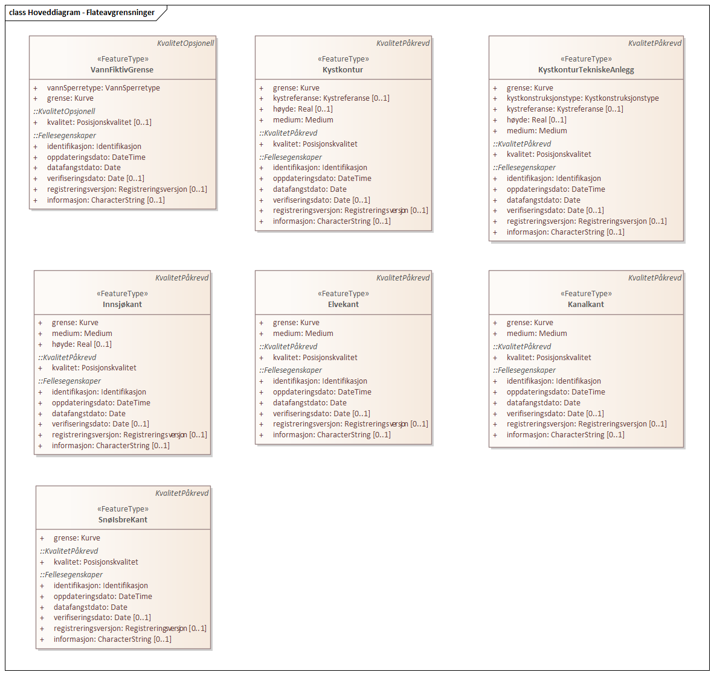
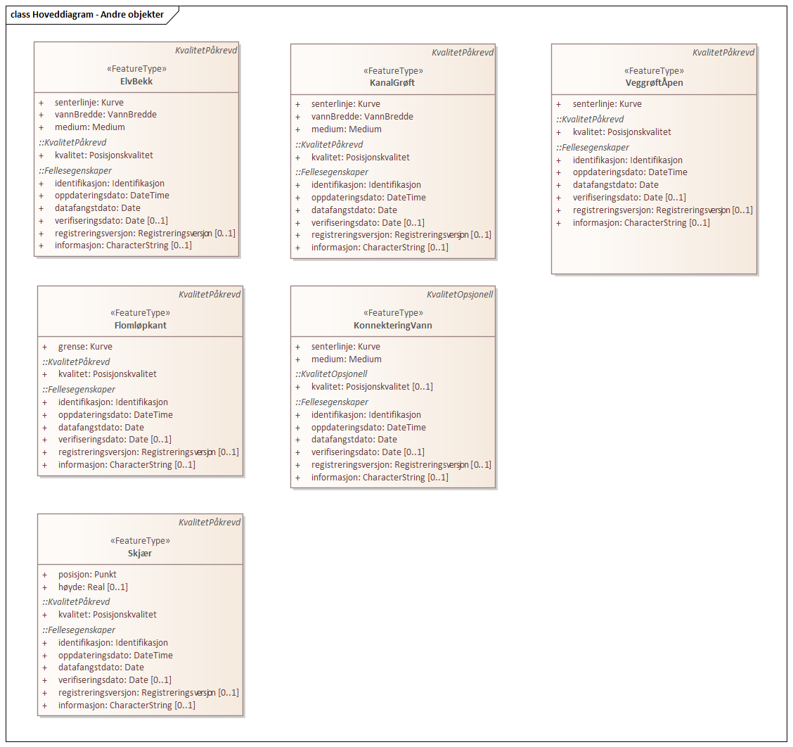
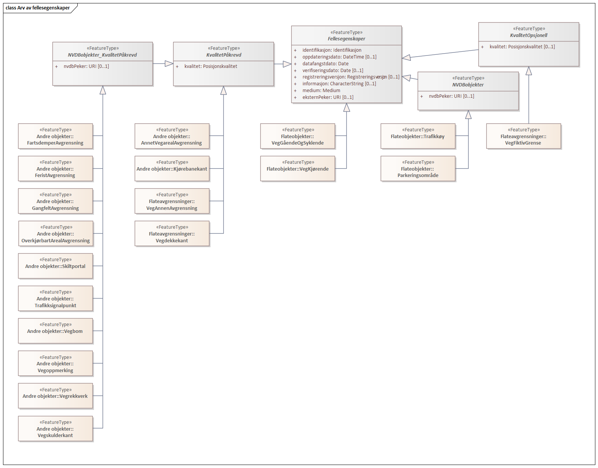
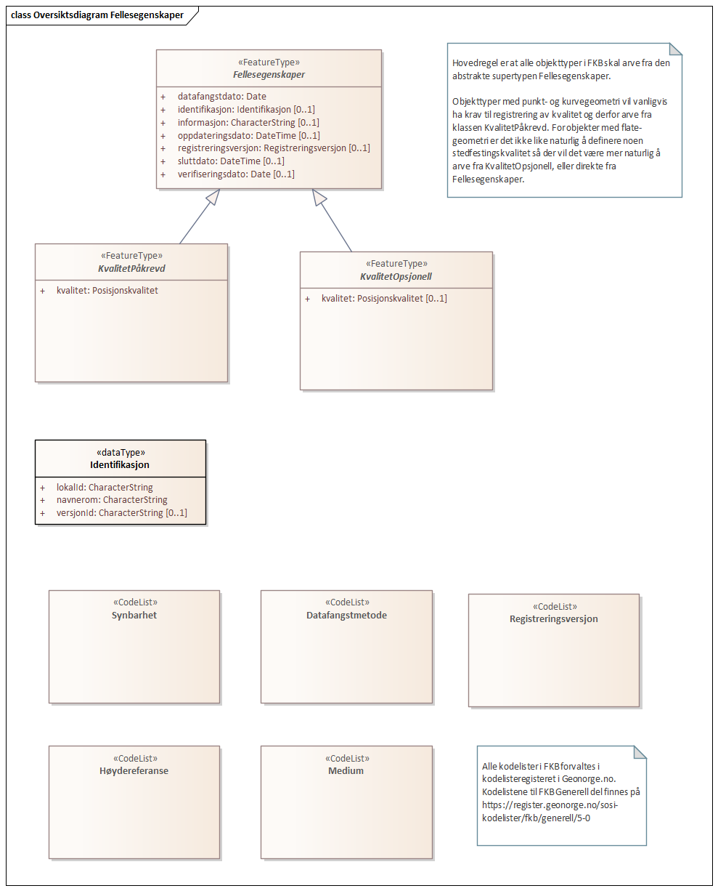
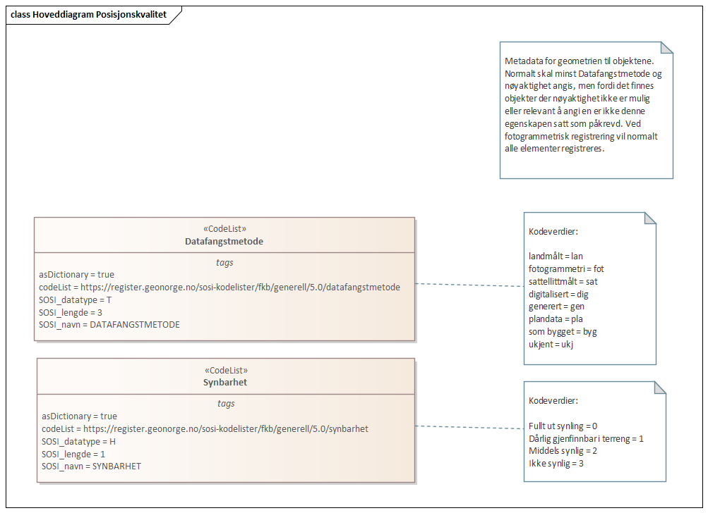

// Start of UML-model
=== Pakke: «ApplicationSchema» FKB-Vann-5.0
*Definisjon:* Spesifikasjonen beskriver geografisk beliggenhet, forløp og form for bekker, elver, kanaler, grøfter, innsjøer, isbreer og den topografiske delen av kyst og sjø. 
Kystkonturen er en del av FKB-Vann og fra og med FKB-Vann versjon 4.6 forvaltes Primærdata Kystkontur som en del av FKB-Vann.

FKB-Vann versjon 5.0 baserer seg på de generelle konseptene fra SOSI del 1 versjon 5 og SOSI del 3 Vann, Kyst og Sjø versjon 4.0. 
 
[discrete]
==== Profilparametre i tagged values
[cols="20,80"]
|===
|definition
|"FKB-Vann contains information about coastlines, rivers, lakes, canals and glaciers"@en
 
|description
|"Contains for instance coastlines, shoreline constructions, rivers, canals, lakes, glaciers"@en
 
|designation
|"Product specification FKB-Vann 5.0"@en
 
|language
|no
 
|SOSI_kortnavn
|FKBVann
 
|SOSI_langnavn
|FKB-Vann
 
|SOSI_modellstatus
|gyldig
 
|SOSI_spesifikasjonstype
|produktspesifikasjon
 
|SOSI_versjon
|5.0
 
|targetNamespace
|https://skjema.geonorge.no/SOSI/produktspesifikasjon/FKB-Vann/5.0
 
|version
|5.0
 
|xmlns
|app
 
|xsdDocument
|FKBVann.xsd
 
|xsdEncodingRule
|sosi
 
|===
 
'''
 
.Realisering av objekttyper 

 
'''
 
.Oversiktsdiagram FKB-Vann-5.0 

 
'''
 
.Pakkerealisering 

 
'''
 
.Hoveddiagram - Flateobjekter 

 
'''
 
.Hoveddiagram - Flateavgrensninger 

 
'''
 
.Hoveddiagram - Andre objekter 

 
'''
 
.Arv av fellesegenskaper 

 
'''
 
[[kystkontur]]
==== «FeatureType» Kystkontur
*Definisjon:* grense mellom land og sjø, definert som midlere høyvannslinje.
 
 
'''
.Illustrasjon av objekttype Kystkontur
image::http://skjema.geonorge.no/SOSI/produktspesifikasjon/FKB-Vann/5.0/figurer/objtype_kystkontur.png[link=http://skjema.geonorge.no/SOSI/produktspesifikasjon/FKB-Vann/5.0/figurer/objtype_kystkontur.png, alt="Bilde av et eksempel på objekttypen Kystkontur, eventuelt med påtegning av streker som viser hvor geometrien til objektet skal måles fra."]
[discrete]
===== Egenskaper
[cols="20,80"]
|===
|*Navn:* 
|*grense*
 
|Definisjon: 
|forløp som følger overgang mellom ulike fenomener
 
|Multiplisitet: 
|[1..1]
 
|Type: 
|http://skjema.geonorge.no/SOSI/basistype/GM_Curve[GM_Curve]
|===
[cols="20,80"]
|===
|*Navn:* 
|*kystreferanse*
 
|Definisjon: 
|kystkonturens referansenivå
 
|Multiplisitet: 
|[0..1]
 
|Type: 
|<<kystreferanse,«CodeList» Kystreferanse>>
|Profilparametre i tagged values: 
|
defaultCodeSpace: https://register.geonorge.no/sosi-kodelister/fkb/vann/5.0/kystreferanse + 
SOSI_datatype: T + 
SOSI_lengde: 5 + 
SOSI_navn: KYSTREF + 
|===
[cols="20,80"]
|===
|*Navn:* 
|*høyde*
 
|Definisjon: 
|et punkts vertikale avstand over en fysisk eller matematisk definert referanseflate
 
|Multiplisitet: 
|[0..1]
 
|Type: 
|http://skjema.geonorge.no/SOSI/basistype/Real[Real]
|Profilparametre i tagged values: 
|
SOSI_datatype: D + 
SOSI_lengde: 8.2 + 
SOSI_navn: HØYDE + 
|===
[cols="20,80"]
|===
|*Navn:* 
|*medium*
 
|Definisjon: 
|objektets beliggenhet i forhold til jordoverflaten
 
|Multiplisitet: 
|[1..1]
 
|Type: 
|<<medium,«CodeList» Medium>>
|Profilparametre i tagged values: 
|
defaultCodeSpace: https://register.geonorge.no/sosi-kodelister/fkb/generell/5.0/medium + 
SOSI_datatype: T + 
SOSI_lengde: 1 + 
SOSI_navn: MEDIUM + 
|===
 
[discrete]
===== Arv og realiseringer
[cols="20,80"]
|===
|Supertype: 
|<<kvalitetpåkrevd,«FeatureType» KvalitetPåkrevd>>
 
|Realisering av: 
|«ApplicationSchema» KystogSjø-4.0/Topografi::«featureType» Kystkontur +
|===
 
'''
 
[[kystkonturtekniskeanlegg]]
==== «FeatureType» KystkonturTekniskeAnlegg
*Definisjon:* angivelse av kystkontur der denne består av tekniske anlegg, definert som  midlere høyvann
 
 
'''
.Illustrasjon av objekttype KystkonturTekniskeAnlegg
image::http://skjema.geonorge.no/SOSI/produktspesifikasjon/FKB-Vann/5.0/figurer/objtype_kystkonturtekniskeanlegg.png[link=http://skjema.geonorge.no/SOSI/produktspesifikasjon/FKB-Vann/5.0/figurer/objtype_kystkonturtekniskeanlegg.png, alt="Bilde av et eksempel på objekttypen KystkonturTekniskeAnlegg, eventuelt med påtegning av streker som viser hvor geometrien til objektet skal måles fra."]
[discrete]
===== Egenskaper
[cols="20,80"]
|===
|*Navn:* 
|*grense*
 
|Definisjon: 
|forløp som følger overgang mellom ulike fenomener
 
|Multiplisitet: 
|[1..1]
 
|Type: 
|http://skjema.geonorge.no/SOSI/basistype/GM_Curve[GM_Curve]
|Profilparametre i tagged values: 
|
SOSI_navn: Kurve + 
|===
[cols="20,80"]
|===
|*Navn:* 
|*kystkonstruksjonstype*
 
|Definisjon: 
|angivelse av kystkonturens konstruksjon
 
|Multiplisitet: 
|[1..1]
 
|Type: 
|<<kystkonstruksjonstype,«CodeList» Kystkonstruksjonstype>>
|Profilparametre i tagged values: 
|
defaultCodeSpace: https://register.geonorge.no/sosi-kodelister/fkb/vann/5.0/kystkonstruksjonstype + 
SOSI_datatype: H + 
SOSI_lengde: 2 + 
SOSI_navn: KYSTKONSTRUKSJONSTYPE + 
|===
[cols="20,80"]
|===
|*Navn:* 
|*kystreferanse*
 
|Definisjon: 
|kystkonturens referansenivå
 
|Multiplisitet: 
|[0..1]
 
|Type: 
|<<kystreferanse,«CodeList» Kystreferanse>>
|Profilparametre i tagged values: 
|
defaultCodeSpace: https://register.geonorge.no/sosi-kodelister/fkb/vann/5.0/kystreferanse + 
SOSI_datatype: T + 
SOSI_lengde: 5 + 
SOSI_navn: KYSTREF + 
|===
[cols="20,80"]
|===
|*Navn:* 
|*høyde*
 
|Definisjon: 
|et punkts vertikale avstand over en fysisk eller matematisk definert referanseflate
 
|Multiplisitet: 
|[0..1]
 
|Type: 
|http://skjema.geonorge.no/SOSI/basistype/Real[Real]
|Profilparametre i tagged values: 
|
SOSI_datatype: D + 
SOSI_lengde: 8.2 + 
SOSI_navn: HØYDE + 
|===
[cols="20,80"]
|===
|*Navn:* 
|*medium*
 
|Definisjon: 
|objektets beliggenhet i forhold til jordoverflaten
 
|Multiplisitet: 
|[1..1]
 
|Type: 
|<<medium,«CodeList» Medium>>
|Profilparametre i tagged values: 
|
defaultCodeSpace: https://register.geonorge.no/sosi-kodelister/fkb/generell/5.0/medium + 
SOSI_datatype: T + 
SOSI_lengde: 1 + 
SOSI_navn: MEDIUM + 
|===
 
[discrete]
===== Arv og realiseringer
[cols="20,80"]
|===
|Supertype: 
|<<kvalitetpåkrevd,«FeatureType» KvalitetPåkrevd>>
 
|Realisering av: 
|«ApplicationSchema» KystogSjø-4.0/Topografi::«featureType» KystkonturTekniskeAnlegg +
|===
 
'''
 
[[skjær]]
==== «FeatureType» Skjær
*Definisjon:* generalisert punktobjekt for små øyer eller landareal
 
 
'''
.Illustrasjon av objekttype Skjær
image::http://skjema.geonorge.no/SOSI/produktspesifikasjon/FKB-Vann/5.0/figurer/objtype_skjer.png[link=http://skjema.geonorge.no/SOSI/produktspesifikasjon/FKB-Vann/5.0/figurer/objtype_skjer.png, alt="Bilde av et eksempel på objekttypen Skjær, eventuelt med påtegning av streker som viser hvor geometrien til objektet skal måles fra."]
[discrete]
===== Egenskaper
[cols="20,80"]
|===
|*Navn:* 
|*posisjon*
 
|Definisjon: 
|sted som objektet eksisterer på
 
|Multiplisitet: 
|[1..1]
 
|Type: 
|http://skjema.geonorge.no/SOSI/basistype/GM_Point[GM_Point]
|===
[cols="20,80"]
|===
|*Navn:* 
|*høyde*
 
|Definisjon: 
|et punkts vertikale avstand over en fysisk eller matematisk definert referanseflate
 
|Multiplisitet: 
|[0..1]
 
|Type: 
|http://skjema.geonorge.no/SOSI/basistype/Real[Real]
|Profilparametre i tagged values: 
|
SOSI_datatype: D + 
SOSI_lengde: 8.2 + 
SOSI_navn: HØYDE + 
|===
 
[discrete]
===== Arv og realiseringer
[cols="20,80"]
|===
|Supertype: 
|<<kvalitetpåkrevd,«FeatureType» KvalitetPåkrevd>>
 
|Realisering av: 
|«ApplicationSchema» KystogSjø-4.0/Topografi::«featureType» Skjær +
|===
 
'''
 
[[havflate]]
==== «FeatureType» Havflate
*Definisjon:* havområde som avgrenses av Kystkontur, VannFiktivGrense og KystkonturTekniskAnlegg
 
 
'''
.Illustrasjon av objekttype Havflate
image::http://skjema.geonorge.no/SOSI/produktspesifikasjon/FKB-Vann/5.0/figurer/objtype_havflate.png[link=http://skjema.geonorge.no/SOSI/produktspesifikasjon/FKB-Vann/5.0/figurer/objtype_havflate.png, alt="Bilde av et eksempel på objekttypen Havflate, eventuelt med påtegning av streker som viser hvor geometrien til objektet skal måles fra."]
[discrete]
===== Egenskaper
[cols="20,80"]
|===
|*Navn:* 
|*område*
 
|Definisjon: 
|objektets utstrekning
 
|Multiplisitet: 
|[1..1]
 
|Type: 
|http://skjema.geonorge.no/SOSI/basistype/GM_Surface[GM_Surface]
|===
[cols="20,80"]
|===
|*Navn:* 
|*posisjon*
 
|Definisjon: 
|objektets plassering
 
|Multiplisitet: 
|[0..1]
 
|Type: 
|http://skjema.geonorge.no/SOSI/basistype/GM_Point[GM_Point]
|===
[cols="20,80"]
|===
|*Navn:* 
|*medium*
 
|Definisjon: 
|objektets beliggenhet i forhold til jordoverflaten
 
|Multiplisitet: 
|[1..1]
 
|Type: 
|<<medium,«CodeList» Medium>>
|Profilparametre i tagged values: 
|
defaultCodeSpace: https://register.geonorge.no/sosi-kodelister/fkb/generell/5.0/medium + 
SOSI_datatype: T + 
SOSI_lengde: 1 + 
SOSI_navn: MEDIUM + 
|===
 
[discrete]
===== Roller
[cols="20,80"]
|===
|*Rollenavn:* 
|*avgrensesAvKystkonturTekniskeAnlegg*
 
|Definisjon: 
|grense mellom land og sjø som følger tekniske anlegg
 
|Multiplisitet: 
|[0..*]
 
|Til klasse
|<<kystkonturtekniskeanlegg,«FeatureType» KystkonturTekniskeAnlegg>>
|===
[cols="20,80"]
|===
|*Rollenavn:* 
|*avgrensesAvVannFiktivGrense*
 
|Definisjon: 
|delelinjer mellom tilstøtende vannflater
 
|Multiplisitet: 
|[0..*]
 
|Til klasse
|<<vannfiktivgrense,«FeatureType» VannFiktivGrense>>
|===
[cols="20,80"]
|===
|*Rollenavn:* 
|*avgrensesAvKystkontur*
 
|Definisjon: 
|grense mellom land og sjø i henhold til angitt kystreferanse, normalt middel høyvannstand
 
|Multiplisitet: 
|[0..*]
 
|Til klasse
|<<kystkontur,«FeatureType» Kystkontur>>
|===
 
[discrete]
===== Restriksjoner
[cols="20,80"]
|===
|*Navn:* 
|*avgrensningsobjekter i samsvar med områdegeometri*
 
|Beskrivelse: 
|
--ingen OCL, restriksjonen implementeres manuelt
 + 
--Område-geometrien skal være lik summen av geometriene til de assosierte avgrensningsobjektene
 
|===
[cols="20,80"]
|===
|*Navn:* 
|*posisjon innenfor område*
 
|Beskrivelse: 
|
--ingen OCL, restriksjonen implementeres manuelt
 + 
--Dersom det finnes område-geometri skal posisjon-geometrien ligge innenfor område-geometrien
 
|===
 
[discrete]
===== Arv og realiseringer
[cols="20,80"]
|===
|Supertype: 
|<<fellesegenskaper,«FeatureType» Fellesegenskaper>>
 
|Realisering av: 
|«ApplicationSchema» KystogSjø-4.0/Topografi::«featureType» Havflate +
|===
 
'''
 
[[elvekant]]
==== «FeatureType» Elvekant
*Definisjon:* konturlinje mellom land og elveflate
 
 
'''
.Illustrasjon av objekttype Elvekant
image::http://skjema.geonorge.no/SOSI/produktspesifikasjon/FKB-Vann/5.0/figurer/objtype_elvekant.png[link=http://skjema.geonorge.no/SOSI/produktspesifikasjon/FKB-Vann/5.0/figurer/objtype_elvekant.png, alt="Bilde av et eksempel på objekttypen Elvekant, eventuelt med påtegning av streker som viser hvor geometrien til objektet skal måles fra."]
[discrete]
===== Egenskaper
[cols="20,80"]
|===
|*Navn:* 
|*grense*
 
|Definisjon: 
|forløp som følger overgang mellom ulike fenomener
 
|Multiplisitet: 
|[1..1]
 
|Type: 
|http://skjema.geonorge.no/SOSI/basistype/GM_Curve[GM_Curve]
|===
[cols="20,80"]
|===
|*Navn:* 
|*medium*
 
|Definisjon: 
|objektets beliggenhet i forhold til jordoverflaten
 
|Multiplisitet: 
|[1..1]
 
|Type: 
|<<medium,«CodeList» Medium>>
|Profilparametre i tagged values: 
|
SOSI_datatype: T + 
SOSI_lengde: 1 + 
SOSI_navn: MEDIUM + 
|===
 
[discrete]
===== Arv og realiseringer
[cols="20,80"]
|===
|Supertype: 
|<<kvalitetpåkrevd,«FeatureType» KvalitetPåkrevd>>
 
|Realisering av: 
|«ApplicationSchema» Vann-4.0/Elver og bekker::«featureType» ElvBekkKant +
|===
 
'''
 
[[elv]]
==== «FeatureType» Elv
*Definisjon:* større vannvei for rennende vann representert ved flate
 
 
'''
.Illustrasjon av objekttype Elv
image::http://skjema.geonorge.no/SOSI/produktspesifikasjon/FKB-Vann/5.0/figurer/objtype_elv.png[link=http://skjema.geonorge.no/SOSI/produktspesifikasjon/FKB-Vann/5.0/figurer/objtype_elv.png, alt="Bilde av et eksempel på objekttypen Elv, eventuelt med påtegning av streker som viser hvor geometrien til objektet skal måles fra."]
[discrete]
===== Egenskaper
[cols="20,80"]
|===
|*Navn:* 
|*posisjon*
 
|Definisjon: 
|objektets plassering
 
|Multiplisitet: 
|[0..1]
 
|Type: 
|http://skjema.geonorge.no/SOSI/basistype/GM_Point[GM_Point]
|===
[cols="20,80"]
|===
|*Navn:* 
|*område*
 
|Definisjon: 
|objektets utstrekning
 
|Multiplisitet: 
|[1..1]
 
|Type: 
|http://skjema.geonorge.no/SOSI/basistype/GM_Surface[GM_Surface]
|===
[cols="20,80"]
|===
|*Navn:* 
|*vannBredde*
 
|Definisjon: 
|grov klassifisering av vassdrag etter gjennomsnittlig bredde over lengre strekninger
 
|Multiplisitet: 
|[1..1]
 
|Type: 
|<<vannbredde,«CodeList» VannBredde>>
|Profilparametre i tagged values: 
|
defaultCodeSpace: https://register.geonorge.no/sosi-kodelister/fkb/vann/5.0/vannbredde + 
SOSI_datatype: H + 
SOSI_lengde: 1 + 
SOSI_navn: VANNBR + 
|===
[cols="20,80"]
|===
|*Navn:* 
|*medium*
 
|Definisjon: 
|objektets beliggenhet i forhold til jordoverflaten
 
|Multiplisitet: 
|[1..1]
 
|Type: 
|<<medium,«CodeList» Medium>>
|Profilparametre i tagged values: 
|
defaultCodeSpace: https://register.geonorge.no/sosi-kodelister/fkb/generell/5.0/medium + 
SOSI_datatype: T + 
SOSI_lengde: 1 + 
SOSI_navn: MEDIUM + 
|===
 
[discrete]
===== Roller
[cols="20,80"]
|===
|*Rollenavn:* 
|*avgrensesAvElvekant*
 
|Definisjon: 
|konturlinje mellom land og elveflate
 
|Multiplisitet: 
|[0..*]
 
|Til klasse
|<<elvekant,«FeatureType» Elvekant>>
|===
[cols="20,80"]
|===
|*Rollenavn:* 
|*avgrensesAvVannFiktivGrense*
 
|Definisjon:
|delelinjer mellom tilstøtende vannflater
 
|Multiplisitet: 
|[0..*]
 
|Til klasse
|<<vannfiktivgrense,«FeatureType» VannFiktivGrense>>
|===
 
[discrete]
===== Restriksjoner
[cols="20,80"]
|===
|*Navn:* 
|*avgrensningsobjekter i samsvar med områdegeometri*
 
|Beskrivelse: 
|
--ingen OCL, restriksjonen implementeres manuelt
 + 
--Område-geometrien skal være lik summen av geometriene til de assosierte avgrensningsobjektene
 
|===
[cols="20,80"]
|===
|*Navn:* 
|*posisjon innenfor område*
 
|Beskrivelse: 
|
--ingen OCL, restriksjonen implementeres manuelt
 + 
--Dersom det finnes område-geometri skal posisjon-geometrien ligge innenfor område-geometrien
 
|===
 
[discrete]
===== Arv og realiseringer
[cols="20,80"]
|===
|Supertype: 
|<<fellesegenskaper,«FeatureType» Fellesegenskaper>>
 
|Realisering av: 
|«ApplicationSchema» Vann-4.0/Elver og bekker::«featureType» ElvBekk +
|===
 
'''
 
[[kanalkant]]
==== «FeatureType» Kanalkant
*Definisjon:* konturlinje mellom land og kanalflate
 
 
'''
.Illustrasjon av objekttype Kanalkant
image::http://skjema.geonorge.no/SOSI/produktspesifikasjon/FKB-Vann/5.0/figurer/objtype_kanalkant.png[link=http://skjema.geonorge.no/SOSI/produktspesifikasjon/FKB-Vann/5.0/figurer/objtype_kanalkant.png, alt="Bilde av et eksempel på objekttypen Kanalkant, eventuelt med påtegning av streker som viser hvor geometrien til objektet skal måles fra."]
[discrete]
===== Egenskaper
[cols="20,80"]
|===
|*Navn:* 
|*grense*
 
|Definisjon: 
|forløp som følger overgang mellom ulike fenomener
 
|Multiplisitet: 
|[1..1]
 
|Type: 
|http://skjema.geonorge.no/SOSI/basistype/GM_Curve[GM_Curve]
|===
[cols="20,80"]
|===
|*Navn:* 
|*medium*
 
|Definisjon: 
|objektets beliggenhet i forhold til jordoverflaten
 
|Multiplisitet: 
|[1..1]
 
|Type: 
|<<medium,«CodeList» Medium>>
|Profilparametre i tagged values: 
|
defaultCodeSpace: https://register.geonorge.no/sosi-kodelister/fkb/generell/5.0/medium + 
SOSI_datatype: T + 
SOSI_lengde: 1 + 
SOSI_navn: MEDIUM + 
|===
 
[discrete]
===== Arv og realiseringer
[cols="20,80"]
|===
|Supertype: 
|<<kvalitetpåkrevd,«FeatureType» KvalitetPåkrevd>>
 
|Realisering av: 
|«ApplicationSchema» Vann-4.0/Elver og bekker::«featureType» KanalGrøftKant +
|===
 
'''
 
[[kanal]]
==== «FeatureType» Kanal
*Definisjon:* større menneskeskapt vannvei for rennende vann representert ved flate
 
 
'''
.Illustrasjon av objekttype Kanal
image::http://skjema.geonorge.no/SOSI/produktspesifikasjon/FKB-Vann/5.0/figurer/objtype_kanal.png[link=http://skjema.geonorge.no/SOSI/produktspesifikasjon/FKB-Vann/5.0/figurer/objtype_kanal.png, alt="Bilde av et eksempel på objekttypen Kanal, eventuelt med påtegning av streker som viser hvor geometrien til objektet skal måles fra."]
[discrete]
===== Egenskaper
[cols="20,80"]
|===
|*Navn:* 
|*posisjon*
 
|Definisjon: 
|objektets plassering
 
|Multiplisitet: 
|[0..1]
 
|Type: 
|http://skjema.geonorge.no/SOSI/basistype/GM_Point[GM_Point]
|===
[cols="20,80"]
|===
|*Navn:* 
|*område*
 
|Definisjon: 
|objektets utstrekning
 
|Multiplisitet: 
|[1..1]
 
|Type: 
|http://skjema.geonorge.no/SOSI/basistype/GM_Surface[GM_Surface]
|===
[cols="20,80"]
|===
|*Navn:* 
|*medium*
 
|Definisjon: 
|objektets beliggenhet i forhold til jordoverflaten
 
|Multiplisitet: 
|[1..1]
 
|Type: 
|<<medium,«CodeList» Medium>>
|Profilparametre i tagged values: 
|
defaultCodeSpace: https://register.geonorge.no/sosi-kodelister/fkb/generell/5.0/medium + 
SOSI_datatype: T + 
SOSI_lengde: 1 + 
SOSI_navn: MEDIUM + 
|===
[cols="20,80"]
|===
|*Navn:* 
|*vannBredde*
 
|Definisjon: 
|grov klassifisering av vassdrag etter gjennomsnittlig bredde over lengre strekninger

 
|Multiplisitet: 
|[1..1]
 
|Type: 
|<<vannbredde,«CodeList» VannBredde>>
|Profilparametre i tagged values: 
|
defaultCodeSpace: https://register.geonorge.no/sosi-kodelister/fkb/vann/5.0/vannbredde + 
SOSI_datatype: H + 
SOSI_lengde: 1 + 
SOSI_navn: VANNBR + 
|===
 
[discrete]
===== Roller
[cols="20,80"]
|===
|*Rollenavn:* 
|*avgrensesAvKanalkant*
 
|Definisjon: 
|avgrensningslinje av kanal, dvs. der stor vannføring normalt går
 
|Multiplisitet: 
|[0..*]
 
|Til klasse
|<<kanalkant,«FeatureType» Kanalkant>>
|===
[cols="20,80"]
|===
|*Rollenavn:* 
|*avgrensesAvVannFiktivGrense*
 
|Definisjon: 
|delelinjer mellom tilstøtende vannflater
 
|Multiplisitet: 
|[0..*]
 
|Til klasse
|<<vannfiktivgrense,«FeatureType» VannFiktivGrense>>
|===
 
[discrete]
===== Restriksjoner
[cols="20,80"]
|===
|*Navn:* 
|*avgrensningsobjekter i samsvar med områdegeometri*
 
|Beskrivelse: 
|
--ingen OCL, restriksjonen implementeres manuelt
 + 
--Område-geometrien skal være lik summen av geometriene til de assosierte avgrensningsobjektene
 
|===
[cols="20,80"]
|===
|*Navn:* 
|*posisjon innenfor område*
 
|Beskrivelse: 
|
--ingen OCL, restriksjonen implementeres manuelt
 + 
--Dersom det finnes område-geometri skal posisjon-geometrien ligge innenfor område-geometrien
 
|===
 
[discrete]
===== Arv og realiseringer
[cols="20,80"]
|===
|Supertype: 
|<<fellesegenskaper,«FeatureType» Fellesegenskaper>>
 
|Realisering av: 
|«ApplicationSchema» Vann-4.0/Elver og bekker::«featureType» KanalGrøft +
|===
 
'''
 
[[innsjøkant]]
==== «FeatureType» Innsjøkant
*Definisjon:* konturlinje mellom land og innsjø

Merknad:
for innsjø som er oppdemt/regulert skal konturlinjen ligge i høydenivået for høyeste regulerte vannstand
 
 
'''
.Illustrasjon av objekttype Innsjøkant
image::http://skjema.geonorge.no/SOSI/produktspesifikasjon/FKB-Vann/5.0/figurer/objtype_innsjokant.png[link=http://skjema.geonorge.no/SOSI/produktspesifikasjon/FKB-Vann/5.0/figurer/objtype_innsjokant.png, alt="Bilde av et eksempel på objekttypen Innsjøkant, eventuelt med påtegning av streker som viser hvor geometrien til objektet skal måles fra."]
[discrete]
===== Egenskaper
[cols="20,80"]
|===
|*Navn:* 
|*grense*
 
|Definisjon: 
|forløp som følger overgang mellom ulike fenomener
 
|Multiplisitet: 
|[1..1]
 
|Type: 
|http://skjema.geonorge.no/SOSI/basistype/GM_Curve[GM_Curve]
|===
[cols="20,80"]
|===
|*Navn:* 
|*medium*
 
|Definisjon: 
|objektets beliggenhet i forhold til jordoverflaten
 
|Multiplisitet: 
|[1..1]
 
|Type: 
|<<medium,«CodeList» Medium>>
|Profilparametre i tagged values: 
|
defaultCodeSpace: https://register.geonorge.no/sosi-kodelister/fkb/generell/5.0/medium + 
SOSI_datatype: T + 
SOSI_lengde: 1 + 
SOSI_navn: MEDIUM + 
|===
[cols="20,80"]
|===
|*Navn:* 
|*høyde*
 
|Definisjon: 
|kurvas vertikale avstand over en fysisk eller matematisk definert referanseflate.
 
|Multiplisitet: 
|[0..1]
 
|Type: 
|http://skjema.geonorge.no/SOSI/basistype/Real[Real]
|Profilparametre i tagged values: 
|
SOSI_datatype: D + 
SOSI_lengde: 8.2 + 
SOSI_navn: HØYDE + 
|===
 
[discrete]
===== Arv og realiseringer
[cols="20,80"]
|===
|Supertype: 
|<<kvalitetpåkrevd,«FeatureType» KvalitetPåkrevd>>
 
|Realisering av: 
|«ApplicationSchema» Vann-4.0/Innsjø::«featureType» Innsjøkant +
|===
 
'''
 
[[innsjø]]
==== «FeatureType» Innsjø
*Definisjon:* en ferskvannsflate som ikke er rennende vann
 
 
'''
.Illustrasjon av objekttype Innsjø
image::http://skjema.geonorge.no/SOSI/produktspesifikasjon/FKB-Vann/5.0/figurer/objtype_innsjo.png[link=http://skjema.geonorge.no/SOSI/produktspesifikasjon/FKB-Vann/5.0/figurer/objtype_innsjo.png, alt="Bilde av et eksempel på objekttypen Innsjø, eventuelt med påtegning av streker som viser hvor geometrien til objektet skal måles fra."]
[discrete]
===== Egenskaper
[cols="20,80"]
|===
|*Navn:* 
|*område*
 
|Definisjon: 
|objektets utstrekning
 
|Multiplisitet: 
|[1..1]
 
|Type: 
|http://skjema.geonorge.no/SOSI/basistype/GM_Surface[GM_Surface]
|===
[cols="20,80"]
|===
|*Navn:* 
|*posisjon*
 
|Definisjon: 
|objektets posisjon
 
|Multiplisitet: 
|[0..1]
 
|Type: 
|http://skjema.geonorge.no/SOSI/basistype/GM_Point[GM_Point]
|===
[cols="20,80"]
|===
|*Navn:* 
|*høyde*
 
|Definisjon: 
|objektets vertikale avstand over en fysisk eller matematisk definert referanseflate.
 
|Multiplisitet: 
|[0..1]
 
|Type: 
|http://skjema.geonorge.no/SOSI/basistype/Real[Real]
|Profilparametre i tagged values: 
|
SOSI_datatype: D + 
SOSI_lengde: 8.2 + 
SOSI_navn: HØYDE + 
|===
[cols="20,80"]
|===
|*Navn:* 
|*medium*
 
|Definisjon: 
|objektets beliggenhet i forhold til jordoverflaten
 
|Multiplisitet: 
|[1..1]
 
|Type: 
|<<medium,«CodeList» Medium>>
|Profilparametre i tagged values: 
|
defaultCodeSpace: https://register.geonorge.no/sosi-kodelister/fkb/generell/5.0/medium + 
SOSI_datatype: T + 
SOSI_lengde: 1 + 
SOSI_navn: MEDIUM + 
|===
[cols="20,80"]
|===
|*Navn:* 
|*regulert*
 
|Definisjon: 
|angir om innsjø er oppdemt/regulert
 
|Multiplisitet: 
|[1..1]
 
|Type: 
|http://skjema.geonorge.no/SOSI/basistype/Boolean[Boolean]
|Profilparametre i tagged values: 
|
SOSI_datatype: BOOLSK + 
SOSI_navn: REGULERT + 
|===
[cols="20,80"]
|===
|*Navn:* 
|*eksternpeker*
 
|Definisjon: 
|peker til eksternt system som inneholder mer informasjon om objekttypen
 
|Multiplisitet: 
|[0..*]
 
|Type: 
|http://skjema.geonorge.no/SOSI/basistype/URI[URI]
|Profilparametre i tagged values: 
|
SOSI_datatype: T + 
SOSI_lengde: 255 + 
SOSI_navn: EKSTERNPEKER + 
|===
 
[discrete]
===== Roller
[cols="20,80"]
|===
|*Rollenavn:* 
|*avgrensesAvInnsjøkant*
 
|Definisjon: 
|avgrensning mellom land og innsjø.
 
|Multiplisitet: 
|[0..*]
 
|Til klasse
|<<innsjøkant,«FeatureType» Innsjøkant>>
|===
[cols="20,80"]
|===
|*Rollenavn:* 
|*avgrensesAvVannFiktivGrense*
 
|Definisjon: 
|delelinjer mellom tilstøtende vannflater
 
|Multiplisitet: 
|[0..*]
 
|Til klasse
|<<vannfiktivgrense,«FeatureType» VannFiktivGrense>>
|===
 
[discrete]
===== Restriksjoner
[cols="20,80"]
|===
|*Navn:* 
|*avgrensningsobjekter i samsvar med områdegeometri*
 
|Beskrivelse: 
|
--ingen OCL, restriksjonen implementeres manuelt
 + 
--Område-geometrien skal være lik summen av geometriene til de assosierte avgrensningsobjektene
 
|===
[cols="20,80"]
|===
|*Navn:* 
|*posisjon innenfor område*
 
|Beskrivelse: 
|
--ingen OCL, restriksjonen implementeres manuelt
 + 
--Dersom det finnes område-geometri skal posisjon-geometrien ligge innenfor område-geometrien
 
|===
 
[discrete]
===== Arv og realiseringer
[cols="20,80"]
|===
|Supertype: 
|<<fellesegenskaper,«FeatureType» Fellesegenskaper>>
 
|Realisering av: 
|«ApplicationSchema» Vann-4.0/Innsjø::«featureType» Innsjø +
|===
 
'''
 
[[elvbekk]]
==== «FeatureType» ElvBekk
*Definisjon:* mindre vannvei for rennende vann representert ved senterlinje
 
 
'''
.Illustrasjon av objekttype ElvBekk
image::http://skjema.geonorge.no/SOSI/produktspesifikasjon/FKB-Vann/5.0/figurer/objtype_elvbekk.png[link=http://skjema.geonorge.no/SOSI/produktspesifikasjon/FKB-Vann/5.0/figurer/objtype_elvbekk.png, alt="Bilde av et eksempel på objekttypen ElvBekk, eventuelt med påtegning av streker som viser hvor geometrien til objektet skal måles fra."]
[discrete]
===== Egenskaper
[cols="20,80"]
|===
|*Navn:* 
|*senterlinje*
 
|Definisjon: 
|forløp som følger objektets sentrale del
 
|Multiplisitet: 
|[1..1]
 
|Type: 
|http://skjema.geonorge.no/SOSI/basistype/GM_Curve[GM_Curve]
|===
[cols="20,80"]
|===
|*Navn:* 
|*vannBredde*
 
|Definisjon: 
|grov klassifikasjon av vassdrag etter gjennomsnittlig bredde over lengre strekninger
 
|Multiplisitet: 
|[1..1]
 
|Type: 
|<<vannbredde,«CodeList» VannBredde>>
|Profilparametre i tagged values: 
|
defaultCodeSpace: https://register.geonorge.no/sosi-kodelister/fkb/vann/5.0/vannbredde + 
SOSI_datatype: H + 
SOSI_lengde: 1 + 
SOSI_navn: VANNBR + 
|===
[cols="20,80"]
|===
|*Navn:* 
|*medium*
 
|Definisjon: 
|objektets beliggenhet i forhold til jordoverflaten
 
|Multiplisitet: 
|[1..1]
 
|Type: 
|<<medium,«CodeList» Medium>>
|Profilparametre i tagged values: 
|
defaultCodeSpace: https://register.geonorge.no/sosi-kodelister/fkb/generell/5.0/medium + 
SOSI_datatype: T + 
SOSI_lengde: 1 + 
SOSI_navn: MEDIUM + 
|===
 
[discrete]
===== Arv og realiseringer
[cols="20,80"]
|===
|Supertype: 
|<<kvalitetpåkrevd,«FeatureType» KvalitetPåkrevd>>
 
|Realisering av: 
|«ApplicationSchema» Vann-4.0/Elver og bekker::«featureType» ElvBekk +
|===
 
'''
 
[[kanalgrøft]]
==== «FeatureType» KanalGrøft
*Definisjon:* mindre menneskeskapt vannvei for rennende vann representert ved senterlinje
 
 
'''
.Illustrasjon av objekttype KanalGrøft
image::http://skjema.geonorge.no/SOSI/produktspesifikasjon/FKB-Vann/5.0/figurer/objtype_kanalgroft.png[link=http://skjema.geonorge.no/SOSI/produktspesifikasjon/FKB-Vann/5.0/figurer/objtype_kanalgroft.png, alt="Bilde av et eksempel på objekttypen KanalGrøft, eventuelt med påtegning av streker som viser hvor geometrien til objektet skal måles fra."]
[discrete]
===== Egenskaper
[cols="20,80"]
|===
|*Navn:* 
|*senterlinje*
 
|Definisjon: 
|forløp som følger objektets sentrale del
 
|Multiplisitet: 
|[1..1]
 
|Type: 
|http://skjema.geonorge.no/SOSI/basistype/GM_Curve[GM_Curve]
|===
[cols="20,80"]
|===
|*Navn:* 
|*vannBredde*
 
|Definisjon: 
|grov klassifikasjon av vassdrag etter gjennomsnittlig bredde over lengre strekninger 
 
|Multiplisitet: 
|[1..1]
 
|Type: 
|<<vannbredde,«CodeList» VannBredde>>
|Profilparametre i tagged values: 
|
defaultCodeSpace: https://register.geonorge.no/sosi-kodelister/fkb/vann/5.0/vannbredde + 
SOSI_datatype: H + 
SOSI_lengde: 1 + 
SOSI_navn: VANNBR + 
|===
[cols="20,80"]
|===
|*Navn:* 
|*medium*
 
|Definisjon: 
|objektets beliggenhet i forhold til jordoverflaten
 
|Multiplisitet: 
|[1..1]
 
|Type: 
|<<medium,«CodeList» Medium>>
|Profilparametre i tagged values: 
|
defaultCodeSpace: https://register.geonorge.no/sosi-kodelister/fkb/generell/5.0/medium + 
SOSI_datatype: T + 
SOSI_lengde: 1 + 
SOSI_navn: MEDIUM + 
|===
 
[discrete]
===== Arv og realiseringer
[cols="20,80"]
|===
|Supertype: 
|<<kvalitetpåkrevd,«FeatureType» KvalitetPåkrevd>>
 
|Realisering av: 
|«ApplicationSchema» Vann-4.0/Elver og bekker::«featureType» KanalGrøft +
|===
 
'''
 
[[veggrøftåpen]]
==== «FeatureType» VeggrøftÅpen
*Definisjon:* åpen drenering parallelt med veg
 
 
'''
.Illustrasjon av objekttype VeggrøftÅpen
image::http://skjema.geonorge.no/SOSI/produktspesifikasjon/FKB-Vann/5.0/figurer/objtype_veggroftapen.png[link=http://skjema.geonorge.no/SOSI/produktspesifikasjon/FKB-Vann/5.0/figurer/objtype_veggroftapen.png, alt="Bilde av et eksempel på objekttypen VeggrøftÅpen, eventuelt med påtegning av streker som viser hvor geometrien til objektet skal måles fra."]
[discrete]
===== Egenskaper
[cols="20,80"]
|===
|*Navn:* 
|*senterlinje*
 
|Definisjon: 
|forløp som følger objektets sentrale del
 
|Multiplisitet: 
|[1..1]
 
|Type: 
|http://skjema.geonorge.no/SOSI/basistype/GM_Curve[GM_Curve]
|===
 
[discrete]
===== Arv og realiseringer
[cols="20,80"]
|===
|Supertype: 
|<<kvalitetpåkrevd,«FeatureType» KvalitetPåkrevd>>
 
|Realisering av: 
|«ApplicationSchema» Vegsituasjon-4.5::«featureType» VeggrøftÅpen +
|===
 
'''
 
[[snøisbrekant]]
==== «FeatureType» SnøIsbreKant
*Definisjon:* grense mellom snø eller isbre og barmark der det er usikkert om det er isbre eller snø
 
 
'''
.Illustrasjon av objekttype SnøIsbreKant
image::http://skjema.geonorge.no/SOSI/produktspesifikasjon/FKB-Vann/5.0/figurer/objtype_snoisbrekant.png[link=http://skjema.geonorge.no/SOSI/produktspesifikasjon/FKB-Vann/5.0/figurer/objtype_snoisbrekant.png, alt="Bilde av et eksempel på objekttypen SnøIsbreKant, eventuelt med påtegning av streker som viser hvor geometrien til objektet skal måles fra."]
[discrete]
===== Egenskaper
[cols="20,80"]
|===
|*Navn:* 
|*grense*
 
|Definisjon: 
|forløp som følger overgang mellom ulike fenomener
 
|Multiplisitet: 
|[1..1]
 
|Type: 
|http://skjema.geonorge.no/SOSI/basistype/GM_Curve[GM_Curve]
|===
 
[discrete]
===== Arv og realiseringer
[cols="20,80"]
|===
|Supertype: 
|<<kvalitetpåkrevd,«FeatureType» KvalitetPåkrevd>>
 
|Realisering av: 
|«ApplicationSchema» Vann-4.0/Breer og fonner::«featureType» SnøIsbreKant +
|===
 
'''
 
[[snøisbre]]
==== «FeatureType» SnøIsbre
*Definisjon:* flate som er dekket med "evigvarende" snø eller isbre
 
 
'''
.Illustrasjon av objekttype SnøIsbre
image::http://skjema.geonorge.no/SOSI/produktspesifikasjon/FKB-Vann/5.0/figurer/objtype_snoisbre.png[link=http://skjema.geonorge.no/SOSI/produktspesifikasjon/FKB-Vann/5.0/figurer/objtype_snoisbre.png, alt="Bilde av et eksempel på objekttypen SnøIsbre, eventuelt med påtegning av streker som viser hvor geometrien til objektet skal måles fra."]
[discrete]
===== Egenskaper
[cols="20,80"]
|===
|*Navn:* 
|*område*
 
|Definisjon: 
|objektets utstrekning
 
|Multiplisitet: 
|[1..1]
 
|Type: 
|http://skjema.geonorge.no/SOSI/basistype/GM_Surface[GM_Surface]
|===
[cols="20,80"]
|===
|*Navn:* 
|*posisjon*
 
|Definisjon: 
|objektets plassering
 
|Multiplisitet: 
|[0..1]
 
|Type: 
|http://skjema.geonorge.no/SOSI/basistype/GM_Point[GM_Point]
|===
 
[discrete]
===== Roller
[cols="20,80"]
|===
|*Rollenavn:* 
|*avgrensesAvSnøIsbreKant*
 
|Definisjon: 
|avgrensning
 
|Multiplisitet: 
|[0..*]
 
|Til klasse
|<<snøisbrekant,«FeatureType» SnøIsbreKant>>
|===
 
[discrete]
===== Restriksjoner
[cols="20,80"]
|===
|*Navn:* 
|*avgrensningsobjekter i samsvar med områdegeometri*
 
|Beskrivelse: 
|
--ingen OCL, restriksjonen implementeres manuelt
 + 
--Område-geometrien skal være lik summen av geometriene til de assosierte avgrensningsobjektene
 
|===
[cols="20,80"]
|===
|*Navn:* 
|*posisjon innenfor område*
 
|Beskrivelse: 
|
--ingen OCL, restriksjonen implementeres manuelt
 + 
--Dersom det finnes område-geometri skal posisjon-geometrien ligge innenfor område-geometrien
 
|===
 
[discrete]
===== Arv og realiseringer
[cols="20,80"]
|===
|Supertype: 
|<<fellesegenskaper,«FeatureType» Fellesegenskaper>>
 
|Realisering av: 
|«ApplicationSchema» Vann-4.0/Breer og fonner::«featureType» SnøIsbre +
|===
 
'''
 
[[flomløpkant]]
==== «FeatureType» Flomløpkant
*Definisjon:* begrensningslinje for store markerte elveløp hvor det pga regulering eller andre årsaker bare en sjelden gang er vannføring
 
 
'''
.Illustrasjon av objekttype Flomløpkant
image::http://skjema.geonorge.no/SOSI/produktspesifikasjon/FKB-Vann/5.0/figurer/objtype_flomlopkant.png[link=http://skjema.geonorge.no/SOSI/produktspesifikasjon/FKB-Vann/5.0/figurer/objtype_flomlopkant.png, alt="Bilde av et eksempel på objekttypen Flomløpkant, eventuelt med påtegning av streker som viser hvor geometrien til objektet skal måles fra."]
[discrete]
===== Egenskaper
[cols="20,80"]
|===
|*Navn:* 
|*grense*
 
|Definisjon: 
|forløp som følger overgang mellom ulike fenomener
 
|Multiplisitet: 
|[1..1]
 
|Type: 
|http://skjema.geonorge.no/SOSI/basistype/GM_Curve[GM_Curve]
|===
 
[discrete]
===== Arv og realiseringer
[cols="20,80"]
|===
|Supertype: 
|<<kvalitetpåkrevd,«FeatureType» KvalitetPåkrevd>>
 
|Realisering av: 
|«ApplicationSchema» Vann-4.0/Flom::«featureType» Flomløpkant +
|===
 
'''
 
[[vannfiktivgrense]]
==== «FeatureType» VannFiktivGrense
*Definisjon:* fiktiv delelinje for vannflater, delelinjetype spesifiseres på egenskapsnivå
 
 
'''
.Illustrasjon av objekttype VannFiktivGrense
image::http://skjema.geonorge.no/SOSI/produktspesifikasjon/FKB-Vann/5.0/figurer/objtype_vannfiktivgrense.png[link=http://skjema.geonorge.no/SOSI/produktspesifikasjon/FKB-Vann/5.0/figurer/objtype_vannfiktivgrense.png, alt="Bilde av et eksempel på objekttypen VannFiktivGrense, eventuelt med påtegning av streker som viser hvor geometrien til objektet skal måles fra."]
[discrete]
===== Egenskaper
[cols="20,80"]
|===
|*Navn:* 
|*vannSperretype*
 
|Definisjon: 
|hjelpelinjetyper for å avgrense eller dele opp  vannflater
 
|Multiplisitet: 
|[1..1]
 
|Type: 
|<<vannsperretype,«CodeList» VannSperretype>>
|Profilparametre i tagged values: 
|
defaultCodeSpace: https://register.geonorge.no/sosi-kodelister/fkb/vann/5.0/vannsperretype + 
SOSI_datatype: T + 
SOSI_lengde: 30 + 
SOSI_navn: VANN_SPERRETYPE + 
|===
[cols="20,80"]
|===
|*Navn:* 
|*grense*
 
|Definisjon: 
|avgrensning for fiktive hjelpelinjer
 
|Multiplisitet: 
|[1..1]
 
|Type: 
|http://skjema.geonorge.no/SOSI/basistype/GM_Curve[GM_Curve]
|===
 
[discrete]
===== Arv og realiseringer
[cols="20,80"]
|===
|Supertype: 
|<<kvalitetopsjonell,«FeatureType» KvalitetOpsjonell>>
 
|===
 
'''
 
[[konnekteringvann]]
==== «FeatureType» KonnekteringVann
*Definisjon:* kunstig objekt hvor senterlinjen representerer en fiktiv linje som skjøter sammen lenker der det er hull i beskrivelsen av vannforløp
 
 
'''
.Illustrasjon av objekttype KonnekteringVann
image::http://skjema.geonorge.no/SOSI/produktspesifikasjon/FKB-Vann/5.0/figurer/objtype_konnekteringvann.png[link=http://skjema.geonorge.no/SOSI/produktspesifikasjon/FKB-Vann/5.0/figurer/objtype_konnekteringvann.png, alt="Bilde av et eksempel på objekttypen KonnekteringVann, eventuelt med påtegning av streker som viser hvor geometrien til objektet skal måles fra."]
[discrete]
===== Egenskaper
[cols="20,80"]
|===
|*Navn:* 
|*senterlinje*
 
|Definisjon: 
|fiktiv linje som skjøter sammen lenker der det er hull i beskrivelsen av vannforløp
 
|Multiplisitet: 
|[1..1]
 
|Type: 
|http://skjema.geonorge.no/SOSI/basistype/GM_Curve[GM_Curve]
|===
[cols="20,80"]
|===
|*Navn:* 
|*medium*
 
|Definisjon: 
|objektets beliggenhet i forhold til jordoverflaten
 
|Multiplisitet: 
|[1..1]
 
|Type: 
|<<medium,«CodeList» Medium>>
|Profilparametre i tagged values: 
|
defaultCodeSpace: https://register.geonorge.no/sosi-kodelister/fkb/generell/5.0/medium + 
SOSI_datatype: T + 
SOSI_lengde: 1 + 
SOSI_navn: MEDIUM + 
|===
 
[discrete]
===== Arv og realiseringer
[cols="20,80"]
|===
|Supertype: 
|<<kvalitetopsjonell,«FeatureType» KvalitetOpsjonell>>
 
|===
<<<
'''
==== Pakke: Generelle elementer
*Definisjon:* pakke med elementer som realiserer tilsvarende elementer i FKB Generell del 5.0

Merknad:
Kopieres direkte inn i de enkelte FKB-datasettene
 
'''
 
.Oversiktsdiagram Fellesegenskaper 

 
'''
 
.Realisering fra SOSI generell del 
image::diagrammer/Realisering fra SOSI generell del.png[link=diagrammer/Realisering fra SOSI generell del.png, alt="Diagram med navn Realisering fra SOSI generell del som viser UML-klasser beskrevet i teksten nedenfor."]
 
'''
 
.Hoveddiagram Posisjonskvalitet 

 
'''
 
[[fellesegenskaper]]
===== «FeatureType» Fellesegenskaper (abstrakt)
*Definisjon:* abstrakt objekttype som bærer sentrale egenskaper som er anbefalt for bruk i produktspesifikasjoner.
 
[discrete]
====== Egenskaper
[cols="20,80"]
|===
|*Navn:* 
|*identifikasjon*
 
|Definisjon: 
|unik identifikasjon av et objekt 

Merknad FKB:
Unik identifikasjon av et objekt, ivaretas av den ansvarlige produsent/forvalter, og som kan benyttes av eksterne applikasjoner som referanse til objektet.
Den unike identifikatoren er unik for kartobjektet og skal ikke endres i kartobjektets levetid. Dette må ikke forveksles med en tematisk identifikator (for eksempel bygningsnummer) som unikt identifiserer et objekt i virkeligheten. En bygning med samme bygningsnummer vil kunne representeres i mange kartprodukter der det finnes en unik identifikasjon i hver av dem.
For FKB benyttes UUID (Universally unique identifier) som lokalId. Dette innebærer at lokalId alene alltid vil være unik. Likevel skal alltid navnerom også angis. Navnerom angir FKB-datasettet.
 
|Multiplisitet: 
|[1..1]
 
|Type: 
|<<identifikasjon,«dataType» Identifikasjon>>
|Profilparametre i tagged values: 
|
SOSI_navn: IDENT + 
|===
[cols="20,80"]
|===
|*Navn:* 
|*oppdateringsdato*
 
|Definisjon: 
|tidspunkt for siste endring på objektet 

Merknad FKB: 
Denne datoen viser datasystemets siste endring på dataobjektet. Egenskapen settes av forvaltningssystemet etter følgende regler:
i. Oppdateringsdato er tidspunkt for oppdatering av databasen og settes av forvaltningsbasen (ikke
av klienten).
ii. Oppdateringsdato skal endres også hvis det er kopidata som blir endret eller importert i en
”kopibase”.
iii. Når avgrensingslinjene til en flate endres, skal flateobjektet få ny oppdateringsdato.
iv. Oppdateringsdato skal endres hvis en egenskap endres.
 
|Multiplisitet: 
|[1..1]
 
|Type: 
|http://skjema.geonorge.no/SOSI/basistype/DateTime[DateTime]
|Profilparametre i tagged values: 
|
SOSI_datatype: DATOTID + 
SOSI_navn: OPPDATERINGSDATO + 
|===
[cols="20,80"]
|===
|*Navn:* 
|*datafangstdato*
 
|Definisjon: 
|dato når objektet siste gang ble registrert/observert/målt i terrenget
 
|Multiplisitet: 
|[1..1]
 
|Type: 
|http://skjema.geonorge.no/SOSI/basistype/Date[Date]
|Profilparametre i tagged values: 
|
SOSI_datatype: DATO + 
SOSI_navn: DATAFANGSTDATO + 
|===
[cols="20,80"]
|===
|*Navn:* 
|*verifiseringsdato*
 
|Definisjon: 
|dato når dataene er fastslått å være i samsvar med virkeligheten.

Merknad FKB:
Brukes for eksempel i de sammenhenger hvor det er foretatt fotogrammetrisk ajourhold, og hvor det ikke er registrert endringer på objektet (det virkelige objektet er i samsvar med dataobjektet)
 
|Multiplisitet: 
|[0..1]
 
|Type: 
|http://skjema.geonorge.no/SOSI/basistype/Date[Date]
|Profilparametre i tagged values: 
|
SOSI_datatype: DATO + 
SOSI_navn: VERIFISERINGSDATO + 
|===
[cols="20,80"]
|===
|*Navn:* 
|*registreringsversjon*
 
|Definisjon: 
|angivelse av hvilken produktspesifikasjon som er utgangspunkt  for dataene
 
|Multiplisitet: 
|[0..1]
 
|Type: 
|<<registreringsversjon,«CodeList» Registreringsversjon>>
|Profilparametre i tagged values: 
|
defaultCodeSpace: https://register.geonorge.no/sosi-kodelister/fkb/generell/5.0/registreringsversjon + 
SOSI_navn: REGISTRERINGSVERSJON + 
|===
[cols="20,80"]
|===
|*Navn:* 
|*informasjon*
 
|Definisjon: 
|generell opplysning.

Merknad FKB:
Mulighet til å legge inn utfyllende informasjon om objektet. Egenskapen bør bare brukes til å legge inn ekstra informasjon om enkeltobjekter. Egenskapen bør ikke brukes til å systematisk angi ekstrainformasjon om mange/alle objekter i et datasett.
 
|Multiplisitet: 
|[0..1]
 
|Type: 
|http://skjema.geonorge.no/SOSI/basistype/CharacterString[CharacterString]
|Profilparametre i tagged values: 
|
SOSI_datatype: T + 
SOSI_lengde: 255 + 
SOSI_navn: INFORMASJON + 
|===
[cols="20,80"]
|===
|*Navn:* 
|*sluttdato*
 
|Definisjon: 
| Tid for når denne versjonen av objektet var erstattet eller opphørt å eksistere. 
 
  Merknad FKB: 
Egenskapen settes av forvaltningssystemet . Sluttdato skal kun sendes med ut fra forvaltningssystemet i sammenhenger der objektenes historikk er interessant.   
 
|Multiplisitet: 
|[0..1]
 
|Type: 
|http://skjema.geonorge.no/SOSI/basistype/DateTime[DateTime]
|Profilparametre i tagged values: 
|
SOSI_datatype: DATOTID + 
SOSI_navn: SLUTTDATO + 
|===
 
[discrete]
====== Arv og realiseringer
[cols="20,80"]
|===
|Subtyper:
|<<kvalitetopsjonell,«FeatureType» KvalitetOpsjonell>> +
<<kvalitetpåkrevd,«FeatureType» KvalitetPåkrevd>> +
<<kanal,«FeatureType» Kanal>> +
<<snøisbre,«FeatureType» SnøIsbre>> +
<<innsjø,«FeatureType» Innsjø>> +
<<havflate,«FeatureType» Havflate>> +
<<elv,«FeatureType» Elv>> +
|Realisering av: 
|«ApplicationSchema» Generelle typer 5.1/SOSI_Fellesegenskaper og SOSI_Objekt::«FeatureType» SOSI_Objekt +
|Realisering av: 
|/SOSI Model/SOSI Generell objektkatalog/FKB Generell del/FKB Generell del-5.0/Generelle elementer::«FeatureType» Fellesegenskaper +
|===
 
'''
 
[[kvalitetpåkrevd]]
===== «FeatureType» KvalitetPåkrevd (abstrakt)
*Definisjon:* abstrakt objekttype med påkrevet kvalitetsangivelse
 
[discrete]
====== Egenskaper
[cols="20,80"]
|===
|*Navn:* 
|*kvalitet*
 
|Definisjon: 
|beskrivelse av kvaliteten på stedfestingen

Merknad: Denne er identisk med ..KVALITET i tidligere versjoner av SOSI.
 
|Multiplisitet: 
|[1..1]
 
|Type: 
|<<posisjonskvalitet,«dataType» Posisjonskvalitet>>
|Profilparametre i tagged values: 
|
SOSI_navn: KVALITET + 
|===
 
[discrete]
====== Arv og realiseringer
[cols="20,80"]
|===
|Supertype: 
|<<fellesegenskaper,«FeatureType» Fellesegenskaper>>
 
|Subtyper:
|<<innsjøkant,«FeatureType» Innsjøkant>> +
<<kystkonturtekniskeanlegg,«FeatureType» KystkonturTekniskeAnlegg>> +
<<kanalkant,«FeatureType» Kanalkant>> +
<<snøisbrekant,«FeatureType» SnøIsbreKant>> +
<<elvbekk,«FeatureType» ElvBekk>> +
<<flomløpkant,«FeatureType» Flomløpkant>> +
<<kanalgrøft,«FeatureType» KanalGrøft>> +
<<elvekant,«FeatureType» Elvekant>> +
<<skjær,«FeatureType» Skjær>> +
<<veggrøftåpen,«FeatureType» VeggrøftÅpen>> +
<<kystkontur,«FeatureType» Kystkontur>> +
|Realisering av: 
|«ApplicationSchema» Generelle typer 5.1/SOSI_Fellesegenskaper og SOSI_Objekt::«FeatureType» SOSI_Objekt +
|Realisering av: 
|/SOSI Model/SOSI Generell objektkatalog/FKB Generell del/FKB Generell del-5.0/Generelle elementer::«FeatureType» KvalitetPåkrevd +
|===
 
'''
 
[[kvalitetopsjonell]]
===== «FeatureType» KvalitetOpsjonell (abstrakt)
*Definisjon:* abstrakt objekttype med valgfri kvalitetsangivelse
 
[discrete]
====== Egenskaper
[cols="20,80"]
|===
|*Navn:* 
|*kvalitet*
 
|Definisjon: 
|beskrivelse av kvaliteten på stedfestingen

Merknad: Denne er identisk med ..KVALITET i tidligere versjoner av SOSI.
 
|Multiplisitet: 
|[0..1]
 
|Type: 
|<<posisjonskvalitet,«dataType» Posisjonskvalitet>>
|Profilparametre i tagged values: 
|
SOSI_navn: KVALITET + 
|===
 
[discrete]
====== Arv og realiseringer
[cols="20,80"]
|===
|Supertype: 
|<<fellesegenskaper,«FeatureType» Fellesegenskaper>>
 
|Subtyper:
|<<konnekteringvann,«FeatureType» KonnekteringVann>> +
<<vannfiktivgrense,«FeatureType» VannFiktivGrense>> +
|Realisering av: 
|«ApplicationSchema» Generelle typer 5.1/SOSI_Fellesegenskaper og SOSI_Objekt::«FeatureType» SOSI_Objekt +
|===
 
'''
 
[[identifikasjon]]
===== «dataType» Identifikasjon
*Definisjon:* Unik identifikasjon av et objekt i et datasett, forvaltet av den ansvarlige produsent/forvalter, og kan benyttes av eksterne applikasjoner som stabil referanse til objektet. 

Merknad 1: Denne objektidentifikasjonen må ikke forveksles med en tematisk objektidentifikasjon, slik som f.eks bygningsnummer. 

Merknad 2: Denne unike identifikatoren vil ikke endres i løpet av objektets levetid, og ikke gjenbrukes i andre objekt.
 
[discrete]
====== Profilparametre i tagged values
[cols="20,80"]
|===
|SOSI_navn
|IDENT
 
|===
[discrete]
====== Egenskaper
[cols="20,80"]
|===
|*Navn:* 
|*lokalId*
 
|Definisjon: 
|lokal identifikator av et objekt

Merknad: Det er dataleverendørens ansvar å sørge for at den lokale identifikatoren er unik innenfor navnerommet. For FKB-data benyttes UUID som lokalId.
 
|Multiplisitet: 
|[1..1]
 
|Type: 
|http://skjema.geonorge.no/SOSI/basistype/CharacterString[CharacterString]
|Profilparametre i tagged values: 
|
SOSI_datatype: T + 
SOSI_lengde: 100 + 
SOSI_navn: LOKALID + 
|===
[cols="20,80"]
|===
|*Navn:* 
|*navnerom*
 
|Definisjon: 
|navnerom som unikt identifiserer datakilden til et objekt, anbefales å være en http-URI

Eksempel: http://data.geonorge.no/SentraltStedsnavnsregister/1.0

Merknad : Verdien for navnerom vil eies av den dataprodusent som har ansvar for de unike identifikatorene og må være registrert i data.geonorge.no eller data.norge.no
 
|Multiplisitet: 
|[1..1]
 
|Type: 
|http://skjema.geonorge.no/SOSI/basistype/CharacterString[CharacterString]
|Profilparametre i tagged values: 
|
SOSI_datatype: T + 
SOSI_lengde: 100 + 
SOSI_navn: NAVNEROM + 
|===
[cols="20,80"]
|===
|*Navn:* 
|*versjonId*
 
|Definisjon: 
|identifikasjon av en spesiell versjon av et geografisk objekt (instans)
 
|Multiplisitet: 
|[0..1]
 
|Type: 
|http://skjema.geonorge.no/SOSI/basistype/CharacterString[CharacterString]
|Profilparametre i tagged values: 
|
SOSI_datatype: T + 
SOSI_lengde: 100 + 
SOSI_navn: VERSJONID + 
|===
[discrete]
====== Arv og realiseringer
[cols="20,80"]
|===
|Realisering av: 
|«ApplicationSchema» Generelle typer 5.1/SOSI_Fellesegenskaper og SOSI_Objekt::«dataType» Identifikasjon +
|===
 
'''
 
[[posisjonskvalitet]]
===== «dataType» Posisjonskvalitet
*Definisjon:* beskrivelse av kvaliteten på stedfestingen.

Merknad:
Posisjonskvalitet er ikke konform med  kvalitetsmodellen i ISO slik den er definert i ISO19157:2013, men er en videreføring av tidligere brukte kvalitetsegenskaper i SOSI. FKB 5.0 innfører en egen variant av datatypen Posisjonskvalitet der kodeliste målemetode er byttet ut med den mer generelle kodelista Datafangstmetode.
 
[discrete]
====== Profilparametre i tagged values
[cols="20,80"]
|===
|SOSI_navn
|KVALITET
 
|===
[discrete]
====== Egenskaper
[cols="20,80"]
|===
|*Navn:* 
|*datafangstmetode*
 
|Definisjon: 
|metode for datafangst. 
Egenskapen beskriver datafangstmetode for grunnrisskoordinater (x,y), eller for både grunnriss og høyde (x,y,z) dersom det ikke er oppgitt noen verdi for datafangstmetodeHøyde.
 
|Multiplisitet: 
|[1..1]
 
|Type: 
|<<datafangstmetode,«CodeList» Datafangstmetode>>
|Profilparametre i tagged values: 
|
defaultCodeSpace: https://register.geonorge.no/sosi-kodelister/fkb/generell/5.0/datafangstmetode + 
SOSI_datatype: T + 
SOSI_lengde: 3 + 
SOSI_navn: DATAFANGSTMETODE + 
|===
[cols="20,80"]
|===
|*Navn:* 
|*nøyaktighet*
 
|Definisjon: 
|standardavviket til posisjoneringa av objektet oppgitt i cm.

I de aller fleste sammenhenger benyttes en anslått eller forventet verdi for standardavvik, men dersom man har en beregnet verdi skal denne benyttes. 

For objekter med punktgeometri benyttes verdi for punktstandardavvik. For objekter med kurvegeometri benyttes standardavviket for tverravviket fra kurva. For objekter med overflate- eller volumgeometri er forståelsen at standardavviket beregnes ut fra (3D) avvikene mellom sann posisjon og nærmeste punkt på overflata. 

Merknad:

Verdien er ment å beskrive nøyaktigheten til objektet sammenlignet med sann verdi. Standardavvik er i utgangspunktet et mål på det tilfeldige avviket og det innebærer at vi forutsetter at det systematiske avviket i liten grad påvirker nøyaktigheten til posisjoneringa. For fotogrammetriske data settes som hovedregel verdien lik kravet til standardavvik ved datafangst. Se standarden Geodatakvalitet for nærmere definisjon av standardavvik og hvordan dette defineres, beregnes og kontrolleres.

 
|Multiplisitet: 
|[0..1]
 
|Type: 
|http://skjema.geonorge.no/SOSI/basistype/Integer[Integer]
|Profilparametre i tagged values: 
|
SOSI_lengde: 6 + 
SOSI_navn: NØYAKTIGHET + 
|===
[cols="20,80"]
|===
|*Navn:* 
|*synbarhet*
 
|Definisjon: 
|beskrivelse av hvor godt objektene framgår i datagrunnlaget for posisjonering (f.eks. flybildene).
 
|Multiplisitet: 
|[0..1]
 
|Type: 
|<<synbarhet,«CodeList» Synbarhet>>
|Profilparametre i tagged values: 
|
defaultCodeSpace: https://register.geonorge.no/sosi-kodelister/fkb/generell/5.0/synbarhet + 
SOSI_lengde: 1 + 
SOSI_navn: SYNBARHET + 
|===
[cols="20,80"]
|===
|*Navn:* 
|*datafangstmetodeHøyde*
 
|Definisjon: 
|metoden brukt for høyderegistrering av posisjon.

Det er bare nødvending å angi en verdi for egenskapen dersom datafangstmetode for høyde avviker fra datafangstmetode for grunnriss.

 
|Multiplisitet: 
|[0..1]
 
|Type: 
|<<datafangstmetode,«CodeList» Datafangstmetode>>
|Profilparametre i tagged values: 
|
defaultCodeSpace: https://register.geonorge.no/sosi-kodelister/fkb/generell/5.0/datafangstmetode + 
SOSI_datatype: T + 
SOSI_lengde: 3 + 
SOSI_navn: DATAFANGSTMETODEHØYDE + 
|===
[cols="20,80"]
|===
|*Navn:* 
|*nøyaktighetHøyde*
 
|Definisjon: 
|standardavviket til posisjoneringa av objektet oppgitt i cm.

I de aller fleste sammenhenger benyttes en anslått eller forventet verdi for standardavvik, men dersom man har en beregnet verdi skal denne benyttes. 

For objekter med punktgeometri benyttes verdi for punktstandardavvik. For objekter med kurvegeometri benyttes standardavviket for tverravviket fra kurva. For objekter med overflate- eller volumgeometri er forståelsen at standardavviket beregnes ut fra (3D) avvikene mellom sann posisjon og nærmeste punkt på overflata. 

Merknad:

Verdien er ment å beskrive nøyaktigheten til objektet sammenlignet med sann verdi. Standardavvik er i utgangspunktet et mål på det tilfeldige avviket og det innebærer at vi forutsetter at det systematiske avviket i liten grad påvirker nøyaktigheten til posisjoneringa. For fotogrammetriske data settes som hovedregel verdien lik kravet til standardavvik ved datafangst. Se standarden Geodatakvalitet for nærmere definisjon av standardavvik og hvordan dette defineres, beregnes og kontrolleres.

 
|Multiplisitet: 
|[0..1]
 
|Type: 
|http://skjema.geonorge.no/SOSI/basistype/Integer[Integer]
|Profilparametre i tagged values: 
|
SOSI_lengde: 6 + 
SOSI_navn: H-NØYAKTIGHET + 
|===
 
[discrete]
====== Restriksjoner
[cols="20,80"]
|===
|*Navn:* 
|*ugyldige datafangstmetoder for høyde*
 
|Beskrivelse: 
|inv: self.datafangstmetodeHøyde &lt;&gt; 'dig'

--Datafangstmetode Digitalisert skal ikke brukes på egenskapen datafangstmetodeHøyde
 
|===
[discrete]
====== Arv og realiseringer
[cols="20,80"]
|===
|Realisering av: 
|«ApplicationSchema» Generelle typer 5.1/SOSI_Fellesegenskaper og SOSI_Objekt::«dataType» Posisjonskvalitet +
|===
 
'''
 
[[synbarhet]]
===== «CodeList» Synbarhet
*Definisjon:* synbarhet beskriver hvor godt objektene framgår i datagrunnlaget for posisjonering (f.eks. flybildene).
 
[discrete]
====== Profilparametre i tagged values
[cols="20,80"]
|===
|asDictionary
|true
 
|codeList
|https://register.geonorge.no/sosi-kodelister/fkb/generell/5.0/synbarhet
 
|SOSI_datatype
|H
 
|SOSI_lengde
|1
 
|SOSI_navn
|SYNBARHET
 
|===
 
'''
 
[[datafangstmetode]]
===== «CodeList» Datafangstmetode
*Definisjon:* metode for datafangst. 

Datafangstmetoden beskriver hvordan selve vektordataene er posisjonert fra et datagrunnlag (observasjoner med landmålingsutstyr, fotogrammetrisk stereomodell, digital terrengmodell etc.) og ikke prosessen med å innhente det bakenforliggende datagrunnlaget.
 
[discrete]
====== Profilparametre i tagged values
[cols="20,80"]
|===
|asDictionary
|true
 
|codeList
|https://register.geonorge.no/sosi-kodelister/fkb/generell/5.0/datafangstmetode
 
|SOSI_datatype
|T
 
|SOSI_lengde
|3
 
|SOSI_navn
|DATAFANGSTMETODE
 
|===
 
'''
 
[[registreringsversjon]]
===== «CodeList» Registreringsversjon
*Definisjon:* FKB-versjon som ligger til grunn for registrering. Mest relevant for data som er fotogrammetrisk registrert.
 
[discrete]
====== Profilparametre i tagged values
[cols="20,80"]
|===
|asDictionary
|true
 
|codeList
|https://register.geonorge.no/sosi-kodelister/fkb/generell/5.0/registreringsversjon
 
|SOSI_datatype
|T
 
|SOSI_lengde
|10
 
|SOSI_navn
|REGISTRERINGSVERSJON
 
|===
 
'''
 
[[høydereferanse]]
===== «CodeList» Høydereferanse
*Definisjon:* koordinatregistering utført på topp eller bunn av et objekt
 
[discrete]
====== Profilparametre i tagged values
[cols="20,80"]
|===
|asDictionary
|true
 
|codeList
|https://register.geonorge.no/sosi-kodelister/fkb/generell/5.0/hoydereferanse
 
|SOSI_datatype
|T
 
|SOSI_lengde
|6
 
|SOSI_navn
|HREF
 
|===
 
'''
 
[[medium]]
===== «CodeList» Medium
*Definisjon:* objektets beliggenhet i forhold til jordoverflaten

Eksempel:
Veg på bro, i tunnel, inne i et bygningsmessig anlegg, etc.
 
[discrete]
====== Profilparametre i tagged values
[cols="20,80"]
|===
|asDictionary
|true
 
|codeList
|https://register.geonorge.no/sosi-kodelister/fkb/generell/5.0/medium
 
|SOSI_datatype
|T
 
|SOSI_lengde
|1
 
|SOSI_navn
|MEDIUM
 
|===
<<<
'''
==== Pakke: Datatyper og kodelister
*Definisjon:* datatyper og kodelister
 
'''
 
.Hoveddiagram for datatyper og kodelister 
image::diagrammer/Hoveddiagram for datatyper og kodelister.png[link=diagrammer/Hoveddiagram for datatyper og kodelister.png, alt="Diagram med navn Hoveddiagram for datatyper og kodelister som viser UML-klasser beskrevet i teksten nedenfor."]
 
'''
 
[[kystkonstruksjonstype]]
===== «CodeList» Kystkonstruksjonstype
*Definisjon:* angivelse av kystkonturens konstruksjon
 
[discrete]
====== Profilparametre i tagged values
[cols="20,80"]
|===
|asDictionary
|true
 
|codeList
|https://register.geonorge.no/sosi-kodelister/fkb/vann/5.0/kystkonstruksjonstype
 
|SOSI_datatype
|H
 
|SOSI_lengde
|2
 
|SOSI_navn
|KYSTKONSTRUKSJONSTYPE
 
|===
 
'''
 
[[kystreferanse]]
===== «CodeList» Kystreferanse
*Definisjon:* kystkonturens referansenivå
 
[discrete]
====== Profilparametre i tagged values
[cols="20,80"]
|===
|asDictionary
|true
 
|codeList
|https://register.geonorge.no/sosi-kodelister/fkb/vann/5.0/kystreferanse
 
|SOSI_datatype
|T
 
|SOSI_lengde
|5
 
|SOSI_navn
|KYSTREF
 
|===
 
'''
 
[[vannbredde]]
===== «CodeList» VannBredde
*Definisjon:* grov klassifikasjon av vassdrag etter gjennomsnittlig bredde over lengre strekninger
 
[discrete]
====== Profilparametre i tagged values
[cols="20,80"]
|===
|asDictionary
|true
 
|codeList
|https://register.geonorge.no/sosi-kodelister/fkb/vann/5.0/vannbredde
 
|SOSI_datatype
|H
 
|SOSI_lengde
|1
 
|SOSI_navn
|VANNBR
 
|===
 
'''
 
[[vannsperretype]]
===== «CodeList» VannSperretype
*Definisjon:* inndeling av hjelpelinjer for avgrensning og oppdeling av vannflater
 
[discrete]
====== Profilparametre i tagged values
[cols="20,80"]
|===
|asDictionary
|true
 
|codeList
|https://register.geonorge.no/sosi-kodelister/fkb/vann/5.0/vannsperretype
 
|SOSI_datatype
|T
 
|SOSI_lengde
|30
 
|SOSI_navn
|VANN_SPERRETYPE
 
|===
// End of UML-model
