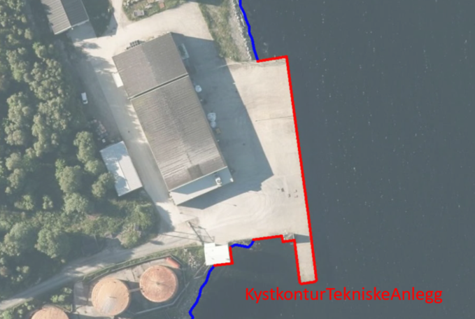
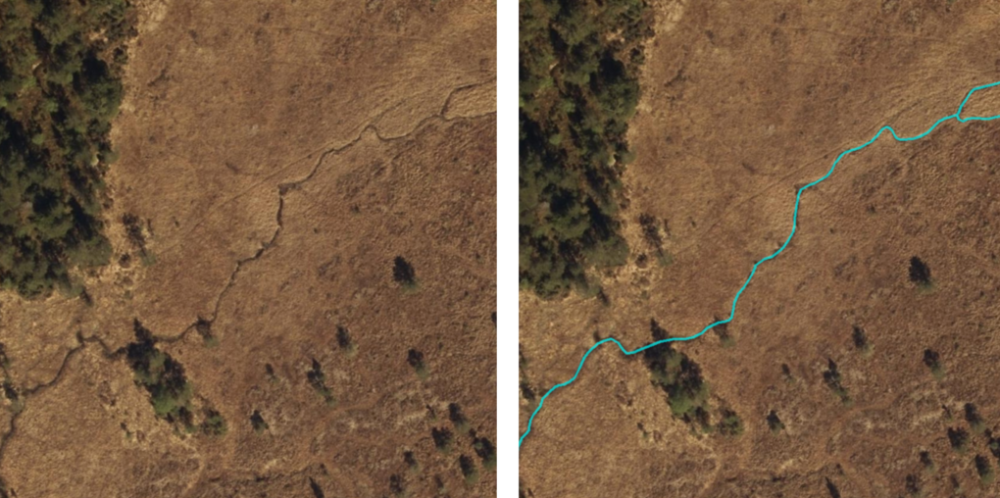
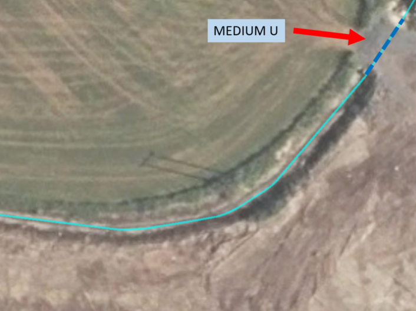
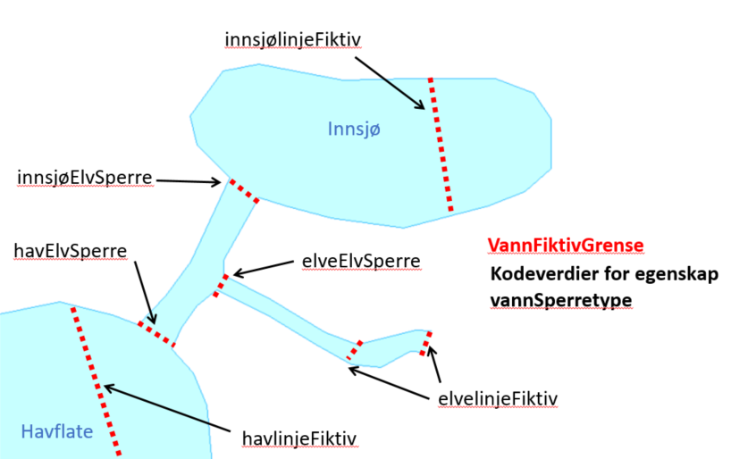

=== Pakke «ApplicationSchema» FKB-Vann-5.0 Utkast
Definisjon:Image
Spesifikasjonen beskriver geografisk beliggenhet, forl&#248;p og form for bekker, elver, kanaler, gr&#248;fter, innsj&#248;er, isbreer og den topografiske delen av kyst og sj&#248;. 
Kystkonturen er en del av FKB-Vann og fra og med FKB-Vann versjon 4.6 forvaltes Prim&#230;rdata Kystkontur som en del av FKB-Vann.

FKB-Vann versjon 5.0 baserer seg p&#229; de generelle konseptene fra SOSI del 1 versjon 5 og SOSI del 3 Vann, Kyst og Sj&#248; versjon 4.0. 
 
===== Profilparametre i tagged values
[cols="20,80"]
|===
|description
|Produktspesifikasjon for FKB-Vann
 
|designation
|"Product specification FKB-Vann 5.0"@en
 
|language
|no
 
|SOSI_kortnavn
|FKB-Vann
 
|SOSI_langnavn
|FKB Vann
 
|SOSI_modellstatus
|utkast
 
|SOSI_spesifikasjonstype
|produktspesifikasjon
 
|SOSI_versjon
|5.0
 
|targetNamespace
|http://skjema.geonorge.no/SOSI/produktspesifikasjon/FKB-Vann/5.0/
 
|version
|5.0
 
|xmlns
|app
 
|xsdDocument
|FKB-Vann50.xsd
 
|===
[caption="Figur 1: ",title=Realisering av objekttyper]
image::diagrammer/Realisering av objekttyper.png[Realisering av objekttyper]
[caption="Figur 2: ",title=Oversiktsdiagram FKB-Vann-5.0]
image::diagrammer/Oversiktsdiagram FKB-Vann-5.0.png[Oversiktsdiagram FKB-Vann-5.0]
[caption="Figur 3: ",title=Pakkerealisering]
image::diagrammer/Pakkerealisering.png[Pakkerealisering]
[caption="Figur 4: ",title=Hoveddiagram - Flateobjekter]
image::diagrammer/Hoveddiagram - Flateobjekter.png[Hoveddiagram - Flateobjekter]
[caption="Figur 5: ",title=Hoveddiagram - Flateavgrensninger]
image::diagrammer/Hoveddiagram - Flateavgrensninger.png[Hoveddiagram - Flateavgrensninger]
[caption="Figur 6: ",title=Hoveddiagram - Andre objekter]
image::diagrammer/Hoveddiagram - Andre objekter.png[Hoveddiagram - Andre objekter]
[caption="Figur 7: ",title=Arv av fellesegenskaper]
image::diagrammer/Arv av fellesegenskaper.png[Arv av fellesegenskaper]
 
|===
|===
==== «FeatureType» Kystkontur
Definisjon: grense mellom land og sj&#248;, definert som midlere h&#248;yvannslinje.
 
*Supertype:* «FeatureType» KvalitetPåkrevd
 
*Realisering av:* «ApplicationSchema» KystogSjø-4.0/Topografi::«featureType» Kystkontur
 
[caption="Figur 8: ",title=Illustrasjon av objekttype Kystkontur]
image::figurer/objtype_kystkontur.png[figurer/objtype_kystkontur.png]
===== Egenskaper
[cols="20,80"]
|===
|*Navn:* 
|*grense*
 
|Definisjon: 
|forløp som følger overgang mellom ulike fenomener
 
|Multiplisitet: 
|[1..1]
 
|Type: 
|Kurve
|===
[cols="20,80"]
|===
|*Navn:* 
|*kystreferanse*
 
|Definisjon: 
|kystkonturens referansenivå
 
|Multiplisitet: 
|[0..1]
 
|Type: 
|Kystreferanse
|Profilparametre i tagged values: 
|
SOSI_datatype: T + 
SOSI_lengde: 5 + 
SOSI_navn: KYSTREF + 
|===
[cols="20,80"]
|===
|*Navn:* 
|*høyde*
 
|Definisjon: 
|et punkts vertikale avstand over en fysisk eller matematisk definert referanseflate
 
|Multiplisitet: 
|[0..1]
 
|Type: 
|Real
|Profilparametre i tagged values: 
|
SOSI_datatype: D + 
SOSI_lengde: 8.2 + 
SOSI_navn: HØYDE + 
|===
[cols="20,80"]
|===
|*Navn:* 
|*medium*
 
|Definisjon: 
|objektets beliggenhet i forhold til jordoverflaten
 
|Multiplisitet: 
|[1..1]
 
|Type: 
|Medium
|===
 
|===
|===
==== «FeatureType» KystkonturTekniskeAnlegg
Definisjon: angivelse av kystkontur der denne består av tekniske anlegg, definert som  midlere høyvann
 
*Supertype:* «FeatureType» KvalitetPåkrevd
 
*Realisering av:* «ApplicationSchema» KystogSjø-4.0/Topografi::«featureType» KystkonturTekniskeAnlegg
 
[caption="Figur 9: ",title=Illustrasjon av objekttype KystkonturTekniskeAnlegg]

===== Egenskaper
[cols="20,80"]
|===
|*Navn:* 
|*grense*
 
|Definisjon: 
|forløp som følger overgang mellom ulike fenomener
 
|Multiplisitet: 
|[1..1]
 
|Type: 
|Kurve
|Profilparametre i tagged values: 
|
SOSI_navn: Kurve + 
|===
[cols="20,80"]
|===
|*Navn:* 
|*kystkonstruksjonstype*
 
|Definisjon: 
|angivelse av kystkonturens konstruksjon
 
|Multiplisitet: 
|[1..1]
 
|Type: 
|Kystkonstruksjonstype
|Profilparametre i tagged values: 
|
SOSI_datatype: H + 
SOSI_lengde: 2 + 
SOSI_navn: KYSTKONSTRUKSJONSTYPE + 
|===
[cols="20,80"]
|===
|*Navn:* 
|*kystreferanse*
 
|Definisjon: 
|kystkonturens referansenivå
 
|Multiplisitet: 
|[0..1]
 
|Type: 
|Kystreferanse
|Profilparametre i tagged values: 
|
SOSI_datatype: T + 
SOSI_lengde: 5 + 
SOSI_navn: KYSTREF + 
|===
[cols="20,80"]
|===
|*Navn:* 
|*høyde*
 
|Definisjon: 
|et punkts vertikale avstand over en fysisk eller matematisk definert referanseflate
 
|Multiplisitet: 
|[0..1]
 
|Type: 
|Real
|Profilparametre i tagged values: 
|
SOSI_datatype: D + 
SOSI_lengde: 8.2 + 
SOSI_navn: HØYDE + 
|===
[cols="20,80"]
|===
|*Navn:* 
|*medium*
 
|Definisjon: 
|objektets beliggenhet i forhold til jordoverflaten
 
|Multiplisitet: 
|[1..1]
 
|Type: 
|Medium
|===
 
|===
|===
==== «FeatureType» Skjær
Definisjon: generalisert punktobjekt for sm&#229; &#248;yer eller landareal
 
*Supertype:* «FeatureType» KvalitetPåkrevd
 
*Realisering av:* «ApplicationSchema» KystogSjø-4.0/Topografi::«featureType» Skjær
 
[caption="Figur 10: ",title=Illustrasjon av objekttype Skjær]
image::figurer/objtype_skjær.png[figurer/objtype_skjær.png]
===== Egenskaper
[cols="20,80"]
|===
|*Navn:* 
|*posisjon*
 
|Definisjon: 
|sted som objektet eksisterer på
 
|Multiplisitet: 
|[1..1]
 
|Type: 
|Punkt
|===
[cols="20,80"]
|===
|*Navn:* 
|*høyde*
 
|Definisjon: 
|et punkts vertikale avstand over en fysisk eller matematisk definert referanseflate
 
|Multiplisitet: 
|[0..1]
 
|Type: 
|Real
|Profilparametre i tagged values: 
|
SOSI_datatype: D + 
SOSI_lengde: 8.2 + 
SOSI_navn: HØYDE + 
|===
 
|===
|===
==== «FeatureType» Havflate
Definisjon: havomr&#229;de som avgrenses av Kystkontur, VannFiktivGrense og KystkonturTekniskAnlegg
 
*Supertype:* «FeatureType» Fellesegenskaper
 
*Realisering av:* «ApplicationSchema» KystogSjø-4.0/Topografi::«featureType» Havflate
 
[caption="Figur 11: ",title=Illustrasjon av objekttype Havflate]
image::figurer/objtype_havflate.png[figurer/objtype_havflate.png]
===== Egenskaper
[cols="20,80"]
|===
|*Navn:* 
|*område*
 
|Definisjon: 
|objektets utstrekning
 
|Multiplisitet: 
|[1..1]
 
|Type: 
|Flate
|===
[cols="20,80"]
|===
|*Navn:* 
|*posisjon*
 
|Definisjon: 
|objektets plassering
 
|Multiplisitet: 
|[0..1]
 
|Type: 
|Punkt
|===
[cols="20,80"]
|===
|*Navn:* 
|*medium*
 
|Definisjon: 
|objektets beliggenhet i forhold til jordoverflaten
 
|Multiplisitet: 
|[1..1]
 
|Type: 
|Medium
|===
===== Roller
[cols="20,80"]
|===
|*Rollenavn:* 
|*avgrensesAvKystkonturTekniskeAnlegg*
 
|Definisjon: 
|grense mellom land og sjø som følger tekniske anlegg.
 
|Multiplisitet: 
|[0..*]
 
|Til klasse
|«FeatureType» KystkonturTekniskeAnlegg
|===
[cols="20,80"]
|===
|*Rollenavn:* 
|*avgrensesAvVannFiktivGrense*
 
|Definisjon: 
|delelinjer mellom tilstøtende vannflater
 
|Multiplisitet: 
|[0..*]
 
|Til klasse
|«FeatureType» VannFiktivGrense
|===
[cols="20,80"]
|===
|*Rollenavn:* 
|*avgrensesAvKystkontur*
 
|Definisjon: 
|grense mellom land og sjø i henhold til angitt kystreferanse, normalt middel høyvannstand
 
|Multiplisitet: 
|[0..*]
 
|Til klasse
|«FeatureType» Kystkontur
|===
 
|===
|===
==== «FeatureType» Elvekant
Definisjon: konturlinje mellom land og elveflate
 
*Supertype:* «FeatureType» KvalitetPåkrevd
 
*Realisering av:* «ApplicationSchema» Vann-4.0/Elver og bekker::«featureType» ElvBekkKant
 
[caption="Figur 12: ",title=Illustrasjon av objekttype Elvekant]
image::figurer/objtype_elvekant.png[figurer/objtype_elvekant.png]
===== Egenskaper
[cols="20,80"]
|===
|*Navn:* 
|*grense*
 
|Definisjon: 
|forløp som følger overgang mellom ulike fenomener
 
|Multiplisitet: 
|[1..1]
 
|Type: 
|Kurve
|===
[cols="20,80"]
|===
|*Navn:* 
|*medium*
 
|Definisjon: 
|objektets beliggenhet i forhold til jordoverflaten
 
|Multiplisitet: 
|[1..1]
 
|Type: 
|Medium
|===
 
|===
|===
==== «FeatureType» Elv
Definisjon: st&#248;rre vannvei for rennende vann representert ved flate
 
*Supertype:* «FeatureType» Fellesegenskaper
 
*Realisering av:* «ApplicationSchema» Vann-4.0/Elver og bekker::«featureType» ElvBekk
 
[caption="Figur 13: ",title=Illustrasjon av objekttype Elv]
image::figurer/objtype_elv.png[figurer/objtype_elv.png]
===== Egenskaper
[cols="20,80"]
|===
|*Navn:* 
|*posisjon*
 
|Definisjon: 
|objektets plassering
 
|Multiplisitet: 
|[0..1]
 
|Type: 
|Punkt
|===
[cols="20,80"]
|===
|*Navn:* 
|*område*
 
|Definisjon: 
|objektets utstrekning
 
|Multiplisitet: 
|[1..1]
 
|Type: 
|Flate
|===
[cols="20,80"]
|===
|*Navn:* 
|*vannBredde*
 
|Definisjon: 
|grov klassifisering av vassdrag etter gjennomsnittelig bredde over lengre strekninger
 
|Multiplisitet: 
|[1..1]
 
|Type: 
|VannBredde
|Profilparametre i tagged values: 
|
SOSI_datatype: H + 
SOSI_lengde: 1 + 
SOSI_navn: VANNBREDDE + 
|===
[cols="20,80"]
|===
|*Navn:* 
|*medium*
 
|Definisjon: 
|objektets beliggenhet i forhold til jordoverflaten
 
|Multiplisitet: 
|[1..1]
 
|Type: 
|Medium
|===
===== Roller
[cols="20,80"]
|===
|*Rollenavn:* 
|*avgrensesAvElvekant*
 
|Definisjon: 
|konturlinje mellom land og elveflate
 
|Multiplisitet: 
|[0..*]
 
|Til klasse
|«FeatureType» Elvekant
|===
[cols="20,80"]
|===
|*Rollenavn:* 
|*avgrensesAvVannFiktivGrense*
 
|Definisjon:
|delelinjer mellom tilstøtende vannflater
 
|Multiplisitet: 
|[0..*]
 
|Til klasse
|«FeatureType» VannFiktivGrense
|===
 
|===
|===
==== «FeatureType» Kanalkant
Definisjon: avgrensningslinje av kanal, dvs vannspeilet. Med vannspeil menes der vannet normalt st&#229;r i kanalen
 
*Supertype:* «FeatureType» KvalitetPåkrevd
 
*Realisering av:* «ApplicationSchema» Vann-4.0/Elver og bekker::«featureType» KanalGrøftKant
 
[caption="Figur 14: ",title=Illustrasjon av objekttype Kanalkant]
image::figurer/objtype_kanalkant.png[figurer/objtype_kanalkant.png]
===== Egenskaper
[cols="20,80"]
|===
|*Navn:* 
|*grense*
 
|Definisjon: 
|forløp som følger overgang mellom ulike fenomener
 
|Multiplisitet: 
|[1..1]
 
|Type: 
|Kurve
|===
[cols="20,80"]
|===
|*Navn:* 
|*medium*
 
|Definisjon: 
|objektets beliggenhet i forhold til jordoverflaten
 
|Multiplisitet: 
|[1..1]
 
|Type: 
|Medium
|===
 
|===
|===
==== «FeatureType» Kanal
Definisjon: rennende vann der forl&#248;pet er menneskeskapt
 
*Supertype:* «FeatureType» Fellesegenskaper
 
*Realisering av:* «ApplicationSchema» Vann-4.0/Elver og bekker::«featureType» KanalGrøft
 
[caption="Figur 15: ",title=Illustrasjon av objekttype Kanal]
image::figurer/objtype_kanal.png[figurer/objtype_kanal.png]
===== Egenskaper
[cols="20,80"]
|===
|*Navn:* 
|*posisjon*
 
|Definisjon: 
|objektets plassering
 
|Multiplisitet: 
|[0..1]
 
|Type: 
|Punkt
|===
[cols="20,80"]
|===
|*Navn:* 
|*område*
 
|Definisjon: 
|objektets utstrekning
 
|Multiplisitet: 
|[1..1]
 
|Type: 
|Flate
|===
[cols="20,80"]
|===
|*Navn:* 
|*medium*
 
|Definisjon: 
|objektets beliggenhet i forhold til jordoverflaten
 
|Multiplisitet: 
|[1..1]
 
|Type: 
|Medium
|===
[cols="20,80"]
|===
|*Navn:* 
|*vannBredde*
 
|Definisjon: 
|grov klassifisering av vassdrag etter gjennomsnittelig bredde over lengre strekninger

 
|Multiplisitet: 
|[1..1]
 
|Type: 
|VannBredde
|Profilparametre i tagged values: 
|
SOSI_datatype: H + 
SOSI_lengde: 1 + 
SOSI_navn: VANNBREDDE + 
|===
===== Roller
[cols="20,80"]
|===
|*Rollenavn:* 
|*avgrensesAvKanalkant*
 
|Definisjon: 
|avgrensningslinje av kanal, dvs. der vannspeilet normalt står i kanalen.
 
|Multiplisitet: 
|[0..*]
 
|Til klasse
|«FeatureType» Kanalkant
|===
[cols="20,80"]
|===
|*Rollenavn:* 
|*avgrensesAvVannFiktivGrense*
 
|Definisjon: 
|delelinjer mellom tilstøtende vannflater
 
|Multiplisitet: 
|[0..*]
 
|Til klasse
|«FeatureType» VannFiktivGrense
|===
 
|===
|===
==== «FeatureType» Innsjøkant
Definisjon: konturlinje mellom land og innsj&#248;

Merknad:
for innsj&#248; som er oppdemt/regulert skal konturlinjen ligge i h&#248;ydeniv&#229;et for h&#248;yeste regulerte vannstand
 
*Supertype:* «FeatureType» KvalitetPåkrevd
 
*Realisering av:* «ApplicationSchema» Vann-4.0/Innsjø::«featureType» Innsjøkant
 
[caption="Figur 16: ",title=Illustrasjon av objekttype Innsjøkant]
image::figurer/objtype_innsjøkant.png[figurer/objtype_innsjøkant.png]
===== Egenskaper
[cols="20,80"]
|===
|*Navn:* 
|*grense*
 
|Definisjon: 
|forløp som følger overgang mellom ulike fenomener
 
|Multiplisitet: 
|[1..1]
 
|Type: 
|Kurve
|===
[cols="20,80"]
|===
|*Navn:* 
|*medium*
 
|Definisjon: 
|objektets beliggenhet i forhold til jordoverflaten
 
|Multiplisitet: 
|[1..1]
 
|Type: 
|Medium
|===
[cols="20,80"]
|===
|*Navn:* 
|*høyde*
 
|Definisjon: 
|kurvas vertikale avstand over en fysisk eller matematisk definert referanseflate.
 
|Multiplisitet: 
|[0..1]
 
|Type: 
|Real
|Profilparametre i tagged values: 
|
SOSI_datatype: D + 
SOSI_lengde: 8.2 + 
SOSI_navn: HØYDE + 
|===
 
|===
|===
==== «FeatureType» Innsjø
Definisjon: en ferskvannsflate som ikke er renndende vann
 
*Supertype:* «FeatureType» Fellesegenskaper
 
*Realisering av:* «ApplicationSchema» Vann-4.0/Innsjø::«featureType» Innsjø
 
[caption="Figur 17: ",title=Illustrasjon av objekttype Innsjø]
image::figurer/objtype_innsjø.png[figurer/objtype_innsjø.png]
===== Egenskaper
[cols="20,80"]
|===
|*Navn:* 
|*område*
 
|Definisjon: 
|objektets utstrekning
 
|Multiplisitet: 
|[1..1]
 
|Type: 
|Flate
|===
[cols="20,80"]
|===
|*Navn:* 
|*posisjon*
 
|Definisjon: 
|objektets posisjon
 
|Multiplisitet: 
|[0..1]
 
|Type: 
|Punkt
|===
[cols="20,80"]
|===
|*Navn:* 
|*høyde*
 
|Definisjon: 
|objektets vertikale avstand over en fysisk eller matematisk definert referanseflate.
 
|Multiplisitet: 
|[0..1]
 
|Type: 
|Real
|Profilparametre i tagged values: 
|
SOSI_datatype: D + 
SOSI_lengde: 8.2 + 
SOSI_navn: HØYDE + 
|===
[cols="20,80"]
|===
|*Navn:* 
|*medium*
 
|Definisjon: 
|objektets beliggenhet i forhold til jordoverflaten
 
|Multiplisitet: 
|[1..1]
 
|Type: 
|Medium
|===
[cols="20,80"]
|===
|*Navn:* 
|*regulert*
 
|Definisjon: 
|angir omInnsj&#248; er oppdemt/regulert
 
|Multiplisitet: 
|[1..1]
 
|Type: 
|Boolean
|Profilparametre i tagged values: 
|
SOSI_navn: REGULERT + 
|===
===== Roller
[cols="20,80"]
|===
|*Rollenavn:* 
|*avgrensesAvInnsjøkant*
 
|Definisjon: 
|avgrensning mellom land og innsjø.
 
|Multiplisitet: 
|[0..*]
 
|Til klasse
|«FeatureType» Innsjøkant
|===
[cols="20,80"]
|===
|*Rollenavn:* 
|*avgrensesAvVannFiktivGrense*
 
|Definisjon: 
|delelinjer mellom tilstøtende vannflater
 
|Multiplisitet: 
|[0..*]
 
|Til klasse
|«FeatureType» VannFiktivGrense
|===
 
|===
|===
==== «FeatureType» Bekk
Definisjon: mindre vannvei for rennende vann representert ved senterlinje
 
*Supertype:* «FeatureType» KvalitetPåkrevd
 
*Realisering av:* «ApplicationSchema» Vann-4.0/Elver og bekker::«featureType» ElvBekk
 
[caption="Figur 18: ",title=Illustrasjon av objekttype Bekk]

===== Egenskaper
[cols="20,80"]
|===
|*Navn:* 
|*senterlinje*
 
|Definisjon: 
|forl&#248;p som f&#248;lger objektets sentrale del
 
|Multiplisitet: 
|[1..1]
 
|Type: 
|Kurve
|===
[cols="20,80"]
|===
|*Navn:* 
|*vannBredde*
 
|Definisjon: 
|grov klassifikasjon av vassdrag etter gjennomsnittelig bredde over lengre strekninger
 
|Multiplisitet: 
|[1..1]
 
|Type: 
|VannBredde
|Profilparametre i tagged values: 
|
SOSI_datatype: H + 
SOSI_lengde: 1 + 
SOSI_navn: VANNBREDDE + 
|===
[cols="20,80"]
|===
|*Navn:* 
|*medium*
 
|Definisjon: 
|objektets beliggenhet i forhold til jordoverflaten
 
|Multiplisitet: 
|[1..1]
 
|Type: 
|Medium
|===
 
|===
|===
==== «FeatureType» Grøft
Definisjon: rennende vann der forl&#248;pet er menneskeskapt
 
*Supertype:* «FeatureType» KvalitetPåkrevd
 
*Realisering av:* «ApplicationSchema» Vann-4.0/Elver og bekker::«featureType» KanalGrøft
 
[caption="Figur 19: ",title=Illustrasjon av objekttype Grøft]

===== Egenskaper
[cols="20,80"]
|===
|*Navn:* 
|*senterlinje*
 
|Definisjon: 
|forl&#248;p som f&#248;lger objektets sentrale del
 
|Multiplisitet: 
|[1..1]
 
|Type: 
|Kurve
|===
[cols="20,80"]
|===
|*Navn:* 
|*vannBredde*
 
|Definisjon: 
|grov klassifisering av gr&#248;ft etter bredde 
 
|Multiplisitet: 
|[1..1]
 
|Type: 
|VannBredde
|Profilparametre i tagged values: 
|
SOSI_datatype: H + 
SOSI_lengde: 1 + 
SOSI_NAVN: VANNBREDDE + 
|===
[cols="20,80"]
|===
|*Navn:* 
|*medium*
 
|Definisjon: 
|objektets beliggenhet i forhold til jordoverflaten
 
|Multiplisitet: 
|[1..1]
 
|Type: 
|Medium
|===
 
|===
|===
==== «FeatureType» VeggrøftÅpen
Definisjon: &#229;pen drenering parallelt med veg
 
*Supertype:* «FeatureType» KvalitetPåkrevd
 
*Realisering av:* «ApplicationSchema» Vegsituasjon-4.5::«featureType» VeggrøftÅpen
 
[caption="Figur 20: ",title=Illustrasjon av objekttype VeggrøftÅpen]
image::figurer/objtype_veggrøftåpen.png[figurer/objtype_veggrøftåpen.png]
===== Egenskaper
[cols="20,80"]
|===
|*Navn:* 
|*senterlinje*
 
|Definisjon: 
|forl&#248;p som f&#248;lger objektets sentrale del
 
|Multiplisitet: 
|[1..1]
 
|Type: 
|Kurve
|===
 
|===
|===
==== «FeatureType» SnøIsbreKant
Definisjon: grense mellom snø eller isbre og barmark der det er usikkert om det er isbre eller snø
 
*Supertype:* «FeatureType» KvalitetPåkrevd
 
*Realisering av:* «ApplicationSchema» Vann-4.0/Breer og fonner::«featureType» SnøIsbreKant
 
[caption="Figur 21: ",title=Illustrasjon av objekttype SnøIsbreKant]
image::figurer/objtype_snøisbrekant.png[figurer/objtype_snøisbrekant.png]
===== Egenskaper
[cols="20,80"]
|===
|*Navn:* 
|*grense*
 
|Definisjon: 
|forløp som følger overgang mellom ulike fenomener
 
|Multiplisitet: 
|[1..1]
 
|Type: 
|Kurve
|===
 
|===
|===
==== «FeatureType» SnøIsbre
Definisjon: grense mellom snø eller isbre og barmark der det er usikkert om det er isbre eller snø
 
*Supertype:* «FeatureType» Fellesegenskaper
 
*Realisering av:* «ApplicationSchema» Vann-4.0/Breer og fonner::«featureType» SnøIsbre
 
[caption="Figur 22: ",title=Illustrasjon av objekttype SnøIsbre]
image::figurer/objtype_snøisbre.png[figurer/objtype_snøisbre.png]
===== Egenskaper
[cols="20,80"]
|===
|*Navn:* 
|*område*
 
|Definisjon: 
|objektets utstrekning
 
|Multiplisitet: 
|[1..1]
 
|Type: 
|Flate
|===
[cols="20,80"]
|===
|*Navn:* 
|*posisjon*
 
|Definisjon: 
|objektets plassering
 
|Multiplisitet: 
|[0..1]
 
|Type: 
|Punkt
|===
===== Roller
[cols="20,80"]
|===
|*Rollenavn:* 
|*avgrensesAvSnøIsbreKant*
 
|Definisjon: 
|avgrensning
 
|Multiplisitet: 
|[0..*]
 
|Til klasse
|«FeatureType» SnøIsbreKant
|===
 
|===
|===
==== «FeatureType» Flomløpkant
Definisjon: begrensningslinje for store markerte elvel&#248;p hvor det pga regulering eller andre &#229;rsaker bare en sjelden gang er vannf&#248;ring
 
*Supertype:* «FeatureType» KvalitetPåkrevd
 
*Realisering av:* «ApplicationSchema» Vann-4.0/Flom::«featureType» Flomløpkant
 
[caption="Figur 23: ",title=Illustrasjon av objekttype Flomløpkant]
image::figurer/objtype_flomløpkant.png[figurer/objtype_flomløpkant.png]
===== Egenskaper
[cols="20,80"]
|===
|*Navn:* 
|*grense*
 
|Definisjon: 
|forløp som følger overgang mellom ulike fenomener
 
|Multiplisitet: 
|[1..1]
 
|Type: 
|Kurve
|===
 
|===
|===
==== «FeatureType» VannFiktivGrense
Definisjon: fiktiv delelinje for vannflater, delelinjetype spesifiseres p&#229; egenskapsniv&#229;
 
*Supertype:* «FeatureType» KvalitetOpsjonell
 
[caption="Figur 24: ",title=Illustrasjon av objekttype VannFiktivGrense]

===== Egenskaper
[cols="20,80"]
|===
|*Navn:* 
|*vannSperretype*
 
|Definisjon: 
|hjelpelinjetyper for &#229; avgrense eller dele opp  vannflater
 
|Multiplisitet: 
|[1..1]
 
|Type: 
|VannSperretype
|Profilparametre i tagged values: 
|
SOSI_datatype: T + 
SOSI_lengde: 30 + 
SOSI_NAVN: VANN_SPERRETYPE + 
|===
[cols="20,80"]
|===
|*Navn:* 
|*grense*
 
|Definisjon: 
|avgrensning for fiktive hjelpelinjer
 
|Multiplisitet: 
|[1..1]
 
|Type: 
|Kurve
|===
 
|===
|===
==== «FeatureType» KonnekteringVann
Definisjon: konnekteringslenke
 
*Supertype:* «FeatureType» KvalitetOpsjonell
 
[caption="Figur 25: ",title=Illustrasjon av objekttype KonnekteringVann]
image::figurer/objtype_konnekteringvann.png[figurer/objtype_konnekteringvann.png]
===== Egenskaper
[cols="20,80"]
|===
|*Navn:* 
|*senterlinje*
 
|Definisjon: 
|konnekteringslinje
 
|Multiplisitet: 
|[1..1]
 
|Type: 
|Kurve
|===
<<<
|===
|===
=== Pakke: Generelle elementer
Definisjon: pakke med elementer som realiserer tilsvarende elementer i FKB Generell del 5.0

Merknad:
Kopieres direkte inn i de enkelte FKB-datasettene
[caption="Figur 26: ",title=Oversiktsdiagram Fellesegenskaper]
image::diagrammer/Oversiktsdiagram Fellesegenskaper.png[Oversiktsdiagram Fellesegenskaper]
[caption="Figur 27: ",title=Realisering fra SOSI generell del]
image::diagrammer/Realisering fra SOSI generell del.png[Realisering fra SOSI generell del]
[caption="Figur 28: ",title=Hoveddiagram Posisjonskvalitet]
image::diagrammer/Hoveddiagram Posisjonskvalitet.png[Hoveddiagram Posisjonskvalitet]
 
|===
|===
==== «FeatureType» Fellesegenskaper (abstrakt)
Definisjon: abstrakt objekttype som b&#230;rer sentrale egenskaper som er anbefalt for bruk i produktspesifikasjoner.

Merknad: Disse egenskapene skal derfor ikke modelleres inn i fagomr&#229;demodeller.
 
*Realisering av:* «ApplicationSchema» Generelle typer 5.1/SOSI_Fellesegenskaper og SOSI_Objekt::«FeatureType» SOSI_Objekt
 
*Realisering av:* «ApplicationSchema» FKB Generell del-5.0Utkast::«FeatureType» Fellesegenskaper
 
===== Egenskaper
[cols="20,80"]
|===
|*Navn:* 
|*identifikasjon*
 
|Definisjon: 
|unik identifikasjon av et objekt 

Merknad FKB:
Unik identifikasjon av et objekt, ivaretas av den ansvarlige produsent/forvalter, og som kan benyttes av eksterne applikasjoner som referanse til objektet.
Den unike identifikatoren er unik for kartobjektet og skal ikke endres i kartobjektets levetid. Dette m&#229; ikke forveksles med en tematisk identifikator (for eksempel bygningsnummer) som unikt identifiserer et objekt i virkeligheten. En bygning med samme bygningsnummer vil kunne representeres i mange kartprodukter der det finnes en unik identifikasjon i hver av dem.
For FKB benyttes UUID (Universally unique identifier) som lokalId. Dette inneb&#230;rer at lokalId alene alltid vil v&#230;re unik. Likevel skal alltid navnerom ogs&#229; angis. Navnerom angir FKB-datasettet.
 
|Multiplisitet: 
|[1..1]
 
|Type: 
|Identifikasjon
|Profilparametre i tagged values: 
|
SOSI_navn: IDENT + 
|===
[cols="20,80"]
|===
|*Navn:* 
|*oppdateringsdato*
 
|Definisjon: 
|tidspunkt for siste endring p&#229; objektet 

Merknad FKB: 
Denne datoen viser datasystemets siste endring p&#229; dataobjektet. Egenskapen settes av forvaltningssystemet etter f&#248;lgende regler:
i. Oppdateringsdato er tidspunkt for oppdatering av databasen og settes av forvaltningsbasen (ikke
av klienten).
ii. Oppdateringsdato skal endres ogs&#229; hvis det er kopidata som blir endret eller importert i en
”kopibase”.
iii. N&#229;r avgrensingslinjene til en flate endres, skal flateobjektet f&#229; ny oppdateringsdato.
iv. Oppdateringsdato skal endres hvis en egenskap endres.
 
|Multiplisitet: 
|[1..1]
 
|Type: 
|DateTime
|Profilparametre i tagged values: 
|
SOSI_datatype: DATOTID + 
SOSI_navn: OPPDATERINGSDATO + 
|===
[cols="20,80"]
|===
|*Navn:* 
|*datafangstdato*
 
|Definisjon: 
|
 
|Multiplisitet: 
|[1..1]
 
|Type: 
|Date
|Profilparametre i tagged values: 
|
SOSI_datatype: DATO + 
SOSI_navn: DATAFANGSTDATO + 
|===
[cols="20,80"]
|===
|*Navn:* 
|*verifiseringsdato*
 
|Definisjon: 
|dato n&#229;r dataene er fastsl&#229;tt &#229; v&#230;re i samsvar med virkeligheten.

Merknad FKB:
Brukes for eksempel i de sammenhenger hvor det er foretatt fotogrammetrisk ajourhold, og hvor det ikke er registrert endringer p&#229; objektet (det virkelige objektet er i samsvar med dataobjektet)
 
|Multiplisitet: 
|[0..1]
 
|Type: 
|Date
|Profilparametre i tagged values: 
|
SOSI_datatype: DATO + 
SOSI_navn: VERIFISERINGSDATO + 
|===
[cols="20,80"]
|===
|*Navn:* 
|*registreringsversjon*
 
|Definisjon: 
|angivelse av hvilken produktspesifikasjon som er utgangspunkt  for dataene
 
|Multiplisitet: 
|[0..1]
 
|Type: 
|Registreringsversjon
|Profilparametre i tagged values: 
|
SOSI_navn: REGISTRERINGSVERSJON + 
|===
[cols="20,80"]
|===
|*Navn:* 
|*informasjon*
 
|Definisjon: 
|generell opplysning.

Merknad FKB:
Mulighet til &#229; legge inn utfyllende informasjon om objektet. Egenskapen b&#248;r bare brukes til &#229; legge inn ekstra informasjon om enkeltobjekter. Egenskapen b&#248;r ikke brukes til &#229; systematisk angi ekstrainformasjon om mange/alle objekter i et datasett.
 
|Multiplisitet: 
|[0..1]
 
|Type: 
|CharacterString
|Profilparametre i tagged values: 
|
SOSI_datatype: T + 
SOSI_lengde: 255 + 
SOSI_navn: INFORMASJON + 
|===
[cols="20,80"]
|===
|*Subtyper:*
|«FeatureType» KvalitetOpsjonell +
«FeatureType» KvalitetPåkrevd +
«FeatureType» Kanal +
«FeatureType» SnøIsbre +
«FeatureType» Innsjø +
«FeatureType» Havflate +
«FeatureType» Elv
|===
 
|===
|===
==== «FeatureType» KvalitetPåkrevd (abstrakt)
Definisjon: 
 
*Supertype:* «FeatureType» Fellesegenskaper
 
*Realisering av:* «ApplicationSchema» Generelle typer 5.1/SOSI_Fellesegenskaper og SOSI_Objekt::«FeatureType» SOSI_Objekt
 
*Realisering av:* «ApplicationSchema» FKB Generell del-5.0Utkast::«FeatureType» KvalitetPåkrevd
 
===== Egenskaper
[cols="20,80"]
|===
|*Navn:* 
|*kvalitet*
 
|Definisjon: 
|beskrivelse av kvaliteten på stedfestingen

Merknad: Denne er identisk med ..KVALITET i tidligere versjoner av SOSI.
 
|Multiplisitet: 
|[1..1]
 
|Type: 
|Posisjonskvalitet
|Profilparametre i tagged values: 
|
SOSI_navn: KVALITET + 
|===
[cols="20,80"]
|===
|*Subtyper:*
|«FeatureType» Innsjøkant +
«FeatureType» KystkonturTekniskeAnlegg +
«FeatureType» Kanalkant +
«FeatureType» SnøIsbreKant +
«FeatureType» Bekk +
«FeatureType» Flomløpkant +
«FeatureType» Grøft +
«FeatureType» Elvekant +
«FeatureType» Skjær +
«FeatureType» VeggrøftÅpen +
«FeatureType» Kystkontur
|===
 
|===
|===
==== «FeatureType» KvalitetOpsjonell (abstrakt)
Definisjon: 
 
*Supertype:* «FeatureType» Fellesegenskaper
 
*Realisering av:* «ApplicationSchema» Generelle typer 5.1/SOSI_Fellesegenskaper og SOSI_Objekt::«FeatureType» SOSI_Objekt
 
===== Egenskaper
[cols="20,80"]
|===
|*Navn:* 
|*kvalitet*
 
|Definisjon: 
|beskrivelse av kvaliteten på stedfestingen

Merknad: Denne er identisk med ..KVALITET i tidligere versjoner av SOSI.
 
|Multiplisitet: 
|[0..1]
 
|Type: 
|Posisjonskvalitet
|Profilparametre i tagged values: 
|
SOSI_navn: KVALITET + 
|===
[cols="20,80"]
|===
|*Subtyper:*
|«FeatureType» KonnekteringVann +
«FeatureType» VannFiktivGrense
|===
 
|===
|===
==== «dataType» Identifikasjon
Definisjon: Unik identifikasjon av et objekt i et datasett, forvaltet av den ansvarlige produsent/forvalter, og kan benyttes av eksterne applikasjoner som stabil referanse til objektet. 

Merknad 1: Denne objektidentifikasjonen må ikke forveksles med en tematisk objektidentifikasjon, slik som f.eks bygningsnummer. 

Merknad 2: Denne unike identifikatoren vil ikke endres i løpet av objektets levetid, og ikke gjenbrukes i andre objekt. 
 
*Realisering av:* «ApplicationSchema» Generelle typer 5.1/SOSI_Fellesegenskaper og SOSI_Objekt::«dataType» Identifikasjon
 
===== Profilparametre i tagged values
[cols="20,80"]
|===
|SOSI_navn
|IDENT
 
|===
===== Egenskaper
[cols="20,80"]
|===
|*Navn:* 
|*lokalId*
 
|Definisjon: 
|lokal identifikator av et objekt

Merknad: Det er dataleverend&#248;rens ansvar &#229; s&#248;rge for at den lokale identifikatoren er unik innenfor navnerommet. For FKB-data benyttes UUID som lokalId.
 
|Multiplisitet: 
|[1..1]
 
|Type: 
|CharacterString
|Profilparametre i tagged values: 
|
SOSI_datatype: T + 
SOSI_lengde: 100 + 
SOSI_navn: LOKALID + 
|===
[cols="20,80"]
|===
|*Navn:* 
|*navnerom*
 
|Definisjon: 
|navnerom som unikt identifiserer datakilden til et objekt, anbefales å være en http-URI

Eksempel: http://data.geonorge.no/SentraltStedsnavnsregister/1.0

Merknad : Verdien for nanverom vil eies av den dataprodusent som har ansvar for de unike identifikatorene og må være registrert i data.geonorge.no eller data.norge.no
 
|Multiplisitet: 
|[1..1]
 
|Type: 
|CharacterString
|Profilparametre i tagged values: 
|
SOSI_datatype: T + 
SOSI_lengde: 100 + 
SOSI_navn: NAVNEROM + 
|===
[cols="20,80"]
|===
|*Navn:* 
|*versjonId*
 
|Definisjon: 
|identifikasjon av en spesiell versjon av et geografisk objekt (instans)
 
|Multiplisitet: 
|[0..1]
 
|Type: 
|CharacterString
|Profilparametre i tagged values: 
|
SOSI_datatype: T + 
SOSI_lengde: 100 + 
SOSI_navn: VERSJONID + 
|===
 
|===
|===
==== «dataType» Posisjonskvalitet
Definisjon: beskrivelse av kvaliteten p&#229; stedfestingen.

Merknad:
Posisjonskvalitet er ikke konform med  kvalitetsmodellen i ISO slik den er defineret i ISO19157:2013, men er en videref&#248;ring av tildligere brukte kvalitetsegenskaper i SOSI. FKB 5.0 innf&#248;rer en egen variant av datatypen Posisjonskvalitet der kodeliste m&#229;lemetode er byttet ut med den mer generelle kodelista Datafangstmetode. 
 
*Realisering av:* «ApplicationSchema» Generelle typer 5.1/SOSI_Fellesegenskaper og SOSI_Objekt::«dataType» Posisjonskvalitet
 
===== Profilparametre i tagged values
[cols="20,80"]
|===
|SOSI_navn
|KVALITET
 
|===
===== Egenskaper
[cols="20,80"]
|===
|*Navn:* 
|*datafangstmetode*
 
|Definisjon: 
|metode for datafangst. 
Egenskapen beskriver datafangstmetode for grunnrisskoordinater (x,y), eller for b&#229;de grunnriss og h&#248;yde (x,y,z) dersom det ikke er oppgitt noen verdi for datafangstmetodeH&#248;yde.
 
|Multiplisitet: 
|[1..1]
 
|Type: 
|Datafangstmetode
|Profilparametre i tagged values: 
|
SOSI_lengde: 3 + 
SOSI_navn: DATAFANGSTMETODE + 
|===
[cols="20,80"]
|===
|*Navn:* 
|*nøyaktighet*
 
|Definisjon: 
|standardavviket til posisjoneringa av objektet oppgitt i cm
I de aller fleste sammenhenger benyttes en ansl&#229;tt eller forventet verdi for standardavvik, men dersom man har en beregnet verdi skal denne benyttes. 
For objekter med punktgeometri benyttes verdi for punktstandardavvik. For objekter med kurvegeometri benyttes standardavviket for tverravviket fra kurva. For objekter med overflate- eller volumgeometri er forst&#229;elsen at standardavviket beregnes ut fra (3D) avvikene mellom sann posisjon og n&#230;rmeste punkt p&#229; overflata. 
Merknad:
Verdien er ment &#229; beskrive n&#248;yaktigheten til objektet sammenlignet med sann verdi. Standardavvik er i utgangspunktet et m&#229;l p&#229; det tilfeldige avviket og det inneb&#230;rer at vi forutsetter at det systematiske avviket i liten grad p&#229;virker n&#248;yaktigheten til posisjoneringa. For fotogrammetriske data settes som hovedregel verdien lik kravet til standardavvik ved datafangst. Se standarden Geodatakvalitet for n&#230;rmere definisjon av standardavvik og hvordan dette defineres, beregnes og kontrolleres.
 
|Multiplisitet: 
|[0..1]
 
|Type: 
|Integer
|Profilparametre i tagged values: 
|
SOSI_lengde: 6 + 
SOSI_navn: NØYAKTIGHET + 
|===
[cols="20,80"]
|===
|*Navn:* 
|*synbarhet*
 
|Definisjon: 
|beskrivelse av hvor godt objektene framg&#229;r i datagrunnlaget for posisjonering (f.eks. flybildene).
 
|Multiplisitet: 
|[0..1]
 
|Type: 
|Synbarhet
|Profilparametre i tagged values: 
|
SOSI_lengde: 1 + 
SOSI_navn: SYNBARHET + 
|===
[cols="20,80"]
|===
|*Navn:* 
|*datafangstmetodeHøyde*
 
|Definisjon: 
|metoden brukt for h&#248;yderegistrering av posisjon.

Det er bare n&#248;dvending &#229; angi en verdi for egenskapen dersom datafangstmetode for h&#248;yde avviker fra datafangstmetode for grunnriss.

 
|Multiplisitet: 
|[0..1]
 
|Type: 
|Datafangstmetode
|Profilparametre i tagged values: 
|
SOSI_lengde: 3 + 
SOSI_navn: DATAFANGSTMETODEHØYDE + 
|===
[cols="20,80"]
|===
|*Navn:* 
|*nøyaktighetHøyde*
 
|Definisjon: 
|standardavviket til posisjoneringa av objektet oppgitt i cm
I de aller fleste sammenhenger benyttes en ansl&#229;tt eller forventet verdi for standardavviket, men dersom man faktisk har standardavviket til posisjoneringa av objektet oppgitt i cm
I de aller fleste sammenhenger benyttes en ansl&#229;tt eller forventet verdi for standardavvik, men dersom man har en beregnet verdi skal denne benyttes. 
Merknad:
Verdien er ment &#229; beskrive n&#248;yaktigheten til objektet sammenlignet med sann verdi. Standardavvik er i utgangspunktet et m&#229;l p&#229; det tilfeldige avviket og det inneb&#230;rer at vi forutsetter at det systematiske avviket i liten grad p&#229;virker n&#248;yaktigheten til posisjoneringa. For fotogrammetriske data settes som hovedregel verdien lik kravet til standardavvik ved datafangst. Se standarden Geodatakvalitet for n&#230;rmere definisjon av standardavvik og hvordan dette defineres, beregnes og kontrolleres.
 
|Multiplisitet: 
|[0..1]
 
|Type: 
|Integer
|Profilparametre i tagged values: 
|
SOSI_lengde: 6 + 
SOSI_navn: H-NØYAKTIGHET + 
|===
===== Restriksjoner
[cols="20,80"]
|===
|*Navn:* 
|*Datafangstmetode Digitalisert skal ikke brukes på egenskapen datafangstmetodeHøyde*
 
|Beskrivelse: 
|
 
|===
 
|===
|===
==== «CodeList» Synbarhet
Definisjon: synbarhet beskriver hvor godt objektene framg&#229;r i datagrunnlaget for posisjonering (f.eks. flybildene).
 
===== Profilparametre i tagged values
[cols="20,80"]
|===
|asDictionary
|true
 
|codeList
|https://register.geonorge.no/sosi-kodelister/fkb/generell/5.0/synbarhet
 
|SOSI_datatype
|H
 
|SOSI_lengde
|1
 
|SOSI_navn
|SYNBARHET
 
|===
Koder fra ekstern kodeliste kan hentes fra register: https://register.geonorge.no/sosi-kodelister/fkb/generell/5.0/synbarhet
 
 
|===
|===
==== «CodeList» Datafangstmetode
Definisjon: metode for datafangst. 

Datafangstmetoden beskriver hvordan selve vektordataene er posisjonert fra et datagrunnlag (observasjoner med landm&#229;lingsutstyr, fotogrammetrisk stereomodell, digital terrengmodell etc.) og ikke prosessen med &#229; innhente det bakenforliggende datagrunnlaget.
 
===== Profilparametre i tagged values
[cols="20,80"]
|===
|asDictionary
|true
 
|codeList
|https://register.geonorge.no/sosi-kodelister/fkb/generell/5.0/datafangstmetode
 
|SOSI_datatype
|T
 
|SOSI_lengde
|3
 
|SOSI_navn
|DATAFANGSTMETODE
 
|===
Koder fra ekstern kodeliste kan hentes fra register: https://register.geonorge.no/sosi-kodelister/fkb/generell/5.0/datafangstmetode
 
 
|===
|===
==== «CodeList» Registreringsversjon
Definisjon: FKB-verjson som ligger til grunn for registrering. Mest relevant for data som er fotogrammetrisk registrert.
 
===== Profilparametre i tagged values
[cols="20,80"]
|===
|asDictionary
|true
 
|codeList
|https://register.geonorge.no/sosi-kodelister/fkb/generell/5.0/registreringsversjon
 
|SOSI_datatype
|T
 
|SOSI_lengde
|10
 
|SOSI_navn
|REGISTRERINGSVERSJON
 
|===
Koder fra ekstern kodeliste kan hentes fra register: https://register.geonorge.no/sosi-kodelister/fkb/generell/5.0/registreringsversjon
 
 
|===
|===
==== «CodeList» Høydereferanse
Definisjon: koordinatregistering utf&#248;rt p&#229; topp eller bunn av et objekt
 
===== Profilparametre i tagged values
[cols="20,80"]
|===
|asDictionary
|true
 
|codeList
|https://register.geonorge.no/sosi-kodelister/fkb/generell/5.0/hoydereferanse
 
|SOSI_datatype
|T
 
|SOSI_lengde
|6
 
|SOSI_navn
|HREF
 
|===
Koder fra ekstern kodeliste kan hentes fra register: https://register.geonorge.no/sosi-kodelister/fkb/generell/5.0/hoydereferanse
 
 
|===
|===
==== «CodeList» Medium
Definisjon: objektets beliggenhet i forhold til jordoverflaten

Eksempel:
Veg p&#229; bro, i tunnel, inne i et bygningsmessig anlegg, etc.
 
===== Profilparametre i tagged values
[cols="20,80"]
|===
|asDictionary
|true
 
|codeList
|https://register.geonorge.no/sosi-kodelister/fkb/generell/5.0/medium
 
|SOSI_datatype
|T
 
|SOSI_lengde
|1
 
|SOSI_navn
|MEDIUM
 
|===
Koder fra ekstern kodeliste kan hentes fra register: https://register.geonorge.no/sosi-kodelister/fkb/generell/5.0/medium
 
<<<
|===
|===
=== Pakke: Datatyper og kodelister
Definisjon: datatyper og kodelister
[caption="Figur 29: ",title=Hoveddiagram for datatyper og kodelister]
image::diagrammer/Hoveddiagram for datatyper og kodelister.png[Hoveddiagram for datatyper og kodelister]
 
|===
|===
==== «CodeList» Kystkonstruksjonstype
Definisjon: angivelse av kystkonturens konstruksjon
 
===== Profilparametre i tagged values
[cols="20,80"]
|===
|codeList
|https://register.geonorge.no/sosi-kodelister/fkb/vann/5.0/kystkonstruksjonstype
 
|SOSI_datatype
|H
 
|SOSI_lengde
|2
 
|SOSI_navn
|KYSTKONSTRUKSJONSTYPE
 
|===
Koder fra ekstern kodeliste kan hentes fra register: https://register.geonorge.no/sosi-kodelister/fkb/vann/5.0/kystkonstruksjonstype
 
 
|===
|===
==== «CodeList» Kystreferanse
Definisjon: kystkonturens referanseniv&#229;
 
===== Profilparametre i tagged values
[cols="20,80"]
|===
|codeList
|https://register.geonorge.no/sosi-kodelister/fkb/vann/5.0/kystreferanse
 
|SOSI_datatype
|T
 
|SOSI_lengde
|5
 
|SOSI_navn
|KYSTREF
 
|===
Koder fra ekstern kodeliste kan hentes fra register: https://register.geonorge.no/sosi-kodelister/fkb/vann/5.0/kystreferanse
 
 
|===
|===
==== «CodeList» VannBredde
Definisjon: grov klassifikasjon av vassdrag etter gjennomsnittelig bredde over lengre strekninger
 
===== Profilparametre i tagged values
[cols="20,80"]
|===
|codeList
|https://register.geonorge.no/sosi-kodelister/fkb/vann/5.0/vannbredde
 
|SOSI_datatype
|H
 
|SOSI_lengde
|1
 
|SOSI_navn
|VANNBR
 
|===
Koder fra ekstern kodeliste kan hentes fra register: https://register.geonorge.no/sosi-kodelister/fkb/vann/5.0/vannbredde
 
 
|===
|===
==== «CodeList» VannSperretype
Definisjon: inndeling av hjelpelinjer for avgrensning og oppdeling av vannflater
 
===== Profilparametre i tagged values
[cols="20,80"]
|===
|asDictionary
|true
 
|codeList
|https://register.geonorge.no/sosi-kodelister/fkb/vann/5.0/vannsperretype
 
|SOSI_datatype
|T
 
|SOSI_lengde
|30
 
|SOSI_navn
|VANN_SPERRETYPE
 
|===
Koder fra ekstern kodeliste kan hentes fra register: https://register.geonorge.no/sosi-kodelister/fkb/vann/5.0/vannsperretype
 
// End of UML-model
