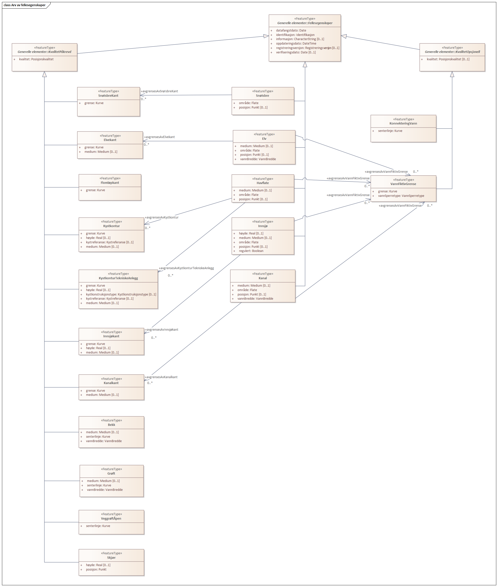
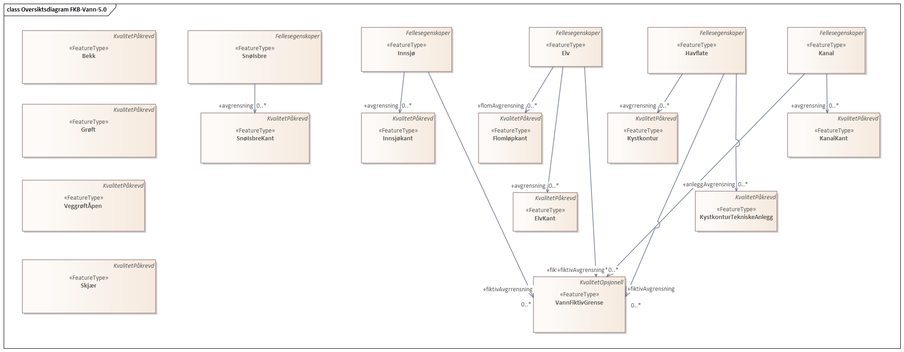
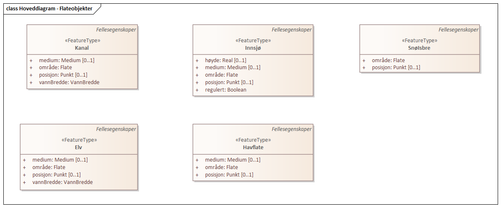
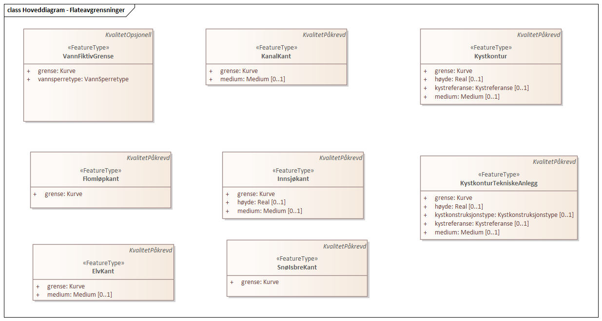
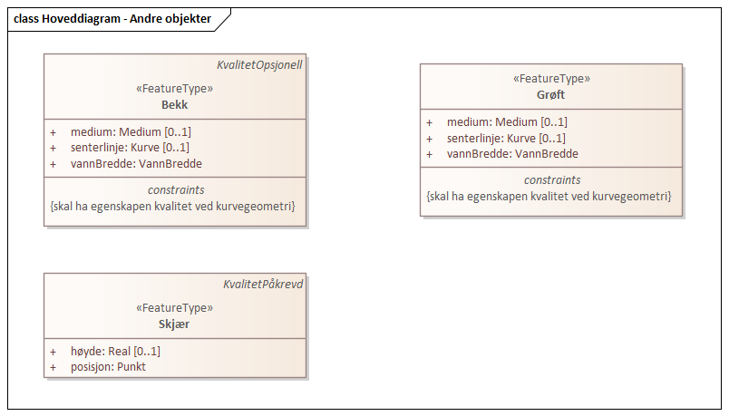
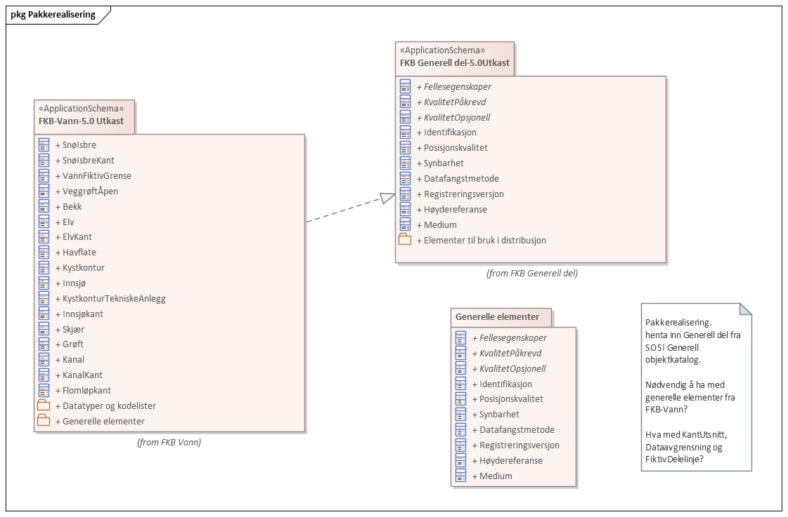
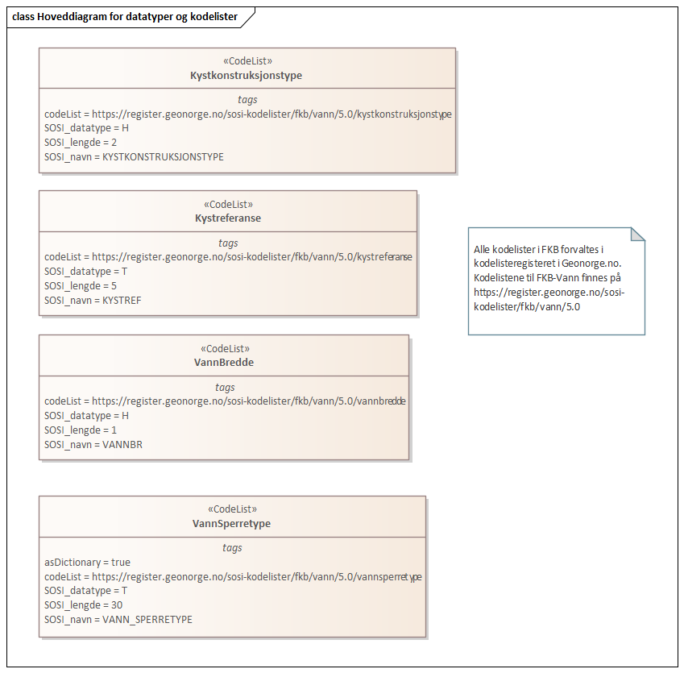
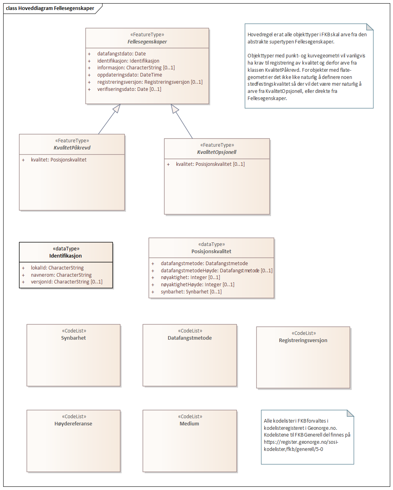
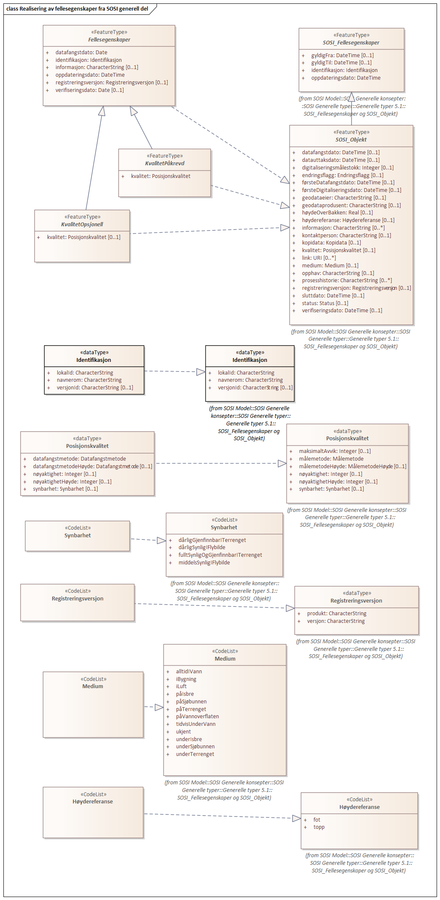
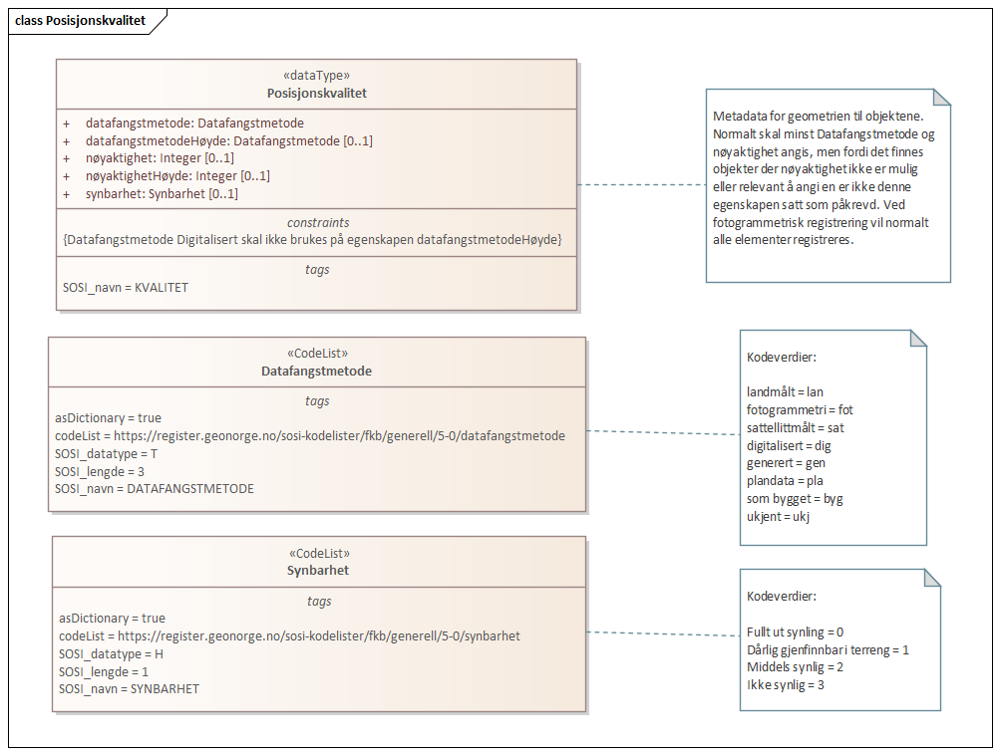

=== «ApplicationSchema» FKB-Vann-5.0 Utkast
Definisjon: Spesifikasjonen beskriver geografisk beliggenhet, forl&#248;p og form for bekker, elver, kanaler, gr&#248;fter, innsj&#248;er, isbreer og den topografiske delen av kyst og sj&#248;. 
Kystkonturen er en del av FKB-Vann og fra og med FKB-Vann versjon 4.6 forvaltes Prim&#230;rdata Kystkontur som en del av FKB-Vann.

FKB-Vann versjon 5.0 baserer seg p&#229; de generelle konseptene fra SOSI del 1 versjon 4.5 og SOSI del 3 Vann, Kyst og Sj&#248; versjon 4.0. 
 
==== Tagged Values
[cols="20,80"]
|===
|description
|Produktspesifikasjon for FKB-Vann
 
|designation
|"text"@en
 
|language
|no
 
|SOSI_kortnavn
|FKB-Vann
 
|SOSI_modellstatus
|utkastOgSkjult
 
|SOSI_versjon
|5.1
 
|targetNamespace
|http://skjema.geonorge.no/SOSI/produktspesifikasjon/FKB-Vann/5.0/
 
|version
|5.0
 
|xmlns
|app
 
|xsdDocument
|FKB-Vann50.xsd
 
|===
[caption="Figur 1: ",title=Arv av fellesegenskaper]

[caption="Figur 2: ",title=Oversiktsdiagram FKB-Vann-5.0]

[caption="Figur 3: ",title=Hoveddiagram - Flateobjekter]

[caption="Figur 4: ",title=Hoveddiagram - Flateavgrensninger]

[caption="Figur 5: ",title=Hoveddiagram - Andre objekter]

[caption="Figur 6: ",title=Pakkerealisering]

 
==== «FeatureType» Bekk
Definisjon: mindre vannvei for rennende vann representert ved senterlinje
 
*Supertype:* «FeatureType» KvalitetPåkrevd
 
===== Egenskaper
[cols="20,80"]
|===
|*Navn:* 
|*senterlinje*
 
|Definisjon: 
|forl&#248;p som f&#248;lger objektets sentrale del
 
|Multiplisitet: 
|[1..1]
 
|Type: 
|Kurve
|===
[cols="20,80"]
|===
|*Navn:* 
|*vannBredde*
 
|Definisjon: 
|grov klassifikasjon av vassdrag etter gjennomsnittelig bredde over lengre strekninger
 
|Multiplisitet: 
|[1..1]
 
|Type: 
|VannBredde
|===
[cols="20,80"]
|===
|*Navn:* 
|*medium*
 
|Definisjon: 
|objektets beliggenhet i forhold til jordoverflaten
 
|Multiplisitet: 
|[0..1]
 
|Type: 
|Medium
|===
 
==== «FeatureType» Elv
Definisjon: st&#248;rre vannvei for rennende vann representert ved flate
 
*Supertype:* «FeatureType» Fellesegenskaper
 
===== Egenskaper
[cols="20,80"]
|===
|*Navn:* 
|*posisjon*
 
|Definisjon: 
|objektets plassering
 
|Multiplisitet: 
|[0..1]
 
|Type: 
|Punkt
|===
[cols="20,80"]
|===
|*Navn:* 
|*område*
 
|Definisjon: 
|objektets utstrekning
 
|Multiplisitet: 
|[1..1]
 
|Type: 
|Flate
|===
[cols="20,80"]
|===
|*Navn:* 
|*vannBredde*
 
|Definisjon: 
|grov klassifisering av vassdrag etter gjennomsnittelig bredde over lengre strekninger
 
|Multiplisitet: 
|[1..1]
 
|Type: 
|VannBredde
|===
[cols="20,80"]
|===
|*Navn:* 
|*medium*
 
|Definisjon: 
|objektets beliggenhet i forhold til jordoverflaten
 
|Multiplisitet: 
|[0..1]
 
|Type: 
|Medium
|===
===== Roller
[cols="20,80"]
|===
|*Rollenavn:* 
|*avgrensning*
 
|Definisjon: 
|konturlinje mellom land og elveflate
 
|Multiplisitet: 
|[0..*]
 
|Til klasse
|«FeatureType» ElvKant
|===
[cols="20,80"]
|===
|*Rollenavn:* 
|*fiktivAvgrensning*
 
|Definisjon:
|delelinjer mellom tilstøtende vannflater
 
|Multiplisitet: 
|[0..*]
 
|Til klasse
|«FeatureType» VannFiktivGrense
|===
 
==== «FeatureType» Grøft
Definisjon: rennende vann der forl&#248;pet er menneskeskapt
 
*Supertype:* «FeatureType» KvalitetPåkrevd
 
===== Egenskaper
[cols="20,80"]
|===
|*Navn:* 
|*senterlinje*
 
|Definisjon: 
|forl&#248;p som f&#248;lger objektets sentrale del
 
|Multiplisitet: 
|[1..1]
 
|Type: 
|Kurve
|===
[cols="20,80"]
|===
|*Navn:* 
|*vannBredde*
 
|Definisjon: 
|grov klassifisering av gr&#248;ft etter bredde 
 
|Multiplisitet: 
|[1..1]
 
|Type: 
|VannBredde
|===
[cols="20,80"]
|===
|*Navn:* 
|*medium*
 
|Definisjon: 
|objektets beliggenhet i forhold til jordoverflaten
 
|Multiplisitet: 
|[0..1]
 
|Type: 
|Medium
|===
 
==== «FeatureType» Kanal
Definisjon: rennende vann der forl&#248;pet er menneskeskapt
 
*Supertype:* «FeatureType» Fellesegenskaper
 
===== Egenskaper
[cols="20,80"]
|===
|*Navn:* 
|*posisjon*
 
|Definisjon: 
|objektets plassering
 
|Multiplisitet: 
|[0..1]
 
|Type: 
|Punkt
|===
[cols="20,80"]
|===
|*Navn:* 
|*område*
 
|Definisjon: 
|objektets utstrekning
 
|Multiplisitet: 
|[1..1]
 
|Type: 
|Flate
|===
[cols="20,80"]
|===
|*Navn:* 
|*medium*
 
|Definisjon: 
|objektets beliggenhet i forhold til jordoverflaten
 
|Multiplisitet: 
|[0..1]
 
|Type: 
|Medium
|===
[cols="20,80"]
|===
|*Navn:* 
|*vannBredde*
 
|Definisjon: 
|grov klassifisering av vassdrag etter gjennomsnittelig bredde over lengre strekninger

 
|Multiplisitet: 
|[1..1]
 
|Type: 
|VannBredde
|===
===== Roller
[cols="20,80"]
|===
|*Rollenavn:* 
|*avgrensning*
 
|Definisjon: 
|avgrensningslinje av kanal, dvs. der vannspeilet normalt står i kanalen.
 
|Multiplisitet: 
|[0..*]
 
|Til klasse
|«FeatureType» KanalKant
|===
[cols="20,80"]
|===
|*Rollenavn:* 
|*fiktivAvgrensning*
 
|Definisjon: 
|delelinjer mellom tilstøtende vannflater
 
|Multiplisitet: 
|[0..*]
 
|Til klasse
|«FeatureType» VannFiktivGrense
|===
 
==== «FeatureType» KonnekteringVann
Definisjon: konnekteringslenke
 
*Supertype:* «FeatureType» KvalitetOpsjonell
 
===== Egenskaper
[cols="20,80"]
|===
|*Navn:* 
|*senterlinje*
 
|Definisjon: 
|konnekteringslinje
 
|Multiplisitet: 
|[1..1]
 
|Type: 
|Kurve
|===
 
==== «FeatureType» SnøIsbre
Definisjon: grense mellom snø eller isbre og barmark der det er usikkert om det er isbre eller snø
 
*Supertype:* «FeatureType» Fellesegenskaper
 
*Realisering av:* «ApplicationSchema» Vann-4.0/Breer og fonner::«featureType» SnøIsbre
 
===== Tagged Values
[cols="20,80"]
|===
|SOSI_geometri
|FLATE;
 
|===
===== Egenskaper
[cols="20,80"]
|===
|*Navn:* 
|*område*
 
|Definisjon: 
|objektets utstrekning
 
|Multiplisitet: 
|[1..1]
 
|Type: 
|Flate
|Tagged Values: 
|
SOSI_melding: Fant ikke denne i SOSI_db + 
SOSI_navn: Flate + 
|===
[cols="20,80"]
|===
|*Navn:* 
|*posisjon*
 
|Definisjon: 
|objektets plassering
 
|Multiplisitet: 
|[0..1]
 
|Type: 
|Punkt
|===
===== Roller
[cols="20,80"]
|===
|*Rollenavn:* 
|*avgrensning*
 
|Definisjon: 
|avgrensning
 
|Multiplisitet: 
|[0..*]
 
|Til klasse
|«FeatureType» SnøIsbreKant
|===
 
==== «FeatureType» SnøIsbreKant
Definisjon: grense mellom snø eller isbre og barmark der det er usikkert om det er isbre eller snø
 
*Supertype:* «FeatureType» KvalitetPåkrevd
 
*Realisering av:* «ApplicationSchema» Vann-4.0/Breer og fonner::«featureType» SnøIsbreKant
 
===== Tagged Values
[cols="20,80"]
|===
|SOSI_geometri
|KURVE;
 
|===
===== Egenskaper
[cols="20,80"]
|===
|*Navn:* 
|*grense*
 
|Definisjon: 
|forløp som følger overgang mellom ulike fenomener
 
|Multiplisitet: 
|[1..1]
 
|Type: 
|Kurve
|Tagged Values: 
|
SOSI_melding: Fant ikke denne i SOSI_db + 
|===
 
==== «FeatureType» VannFiktivGrense
Definisjon: fiktiv delelinje for vannflater, delelinjetype bestemmes p&#229; egenskapsniv&#229;
 
*Supertype:* «FeatureType» KvalitetOpsjonell
 
===== Egenskaper
[cols="20,80"]
|===
|*Navn:* 
|*vannsperretype*
 
|Definisjon: 
|hjelpelinjetyper for &#229; avgrense eller dele opp  vannflater
 
|Multiplisitet: 
|[1..1]
 
|Type: 
|VannSperretype
|===
[cols="20,80"]
|===
|*Navn:* 
|*grense*
 
|Definisjon: 
|avgrensning for fiktive hjelpelinjer
 
|Multiplisitet: 
|[1..1]
 
|Type: 
|Kurve
|===
 
==== «FeatureType» VeggrøftÅpen
Definisjon: &#229;pen drenering parallelt med veg
 
*Supertype:* «FeatureType» KvalitetPåkrevd
 
===== Egenskaper
[cols="20,80"]
|===
|*Navn:* 
|*senterlinje*
 
|Definisjon: 
|forl&#248;p som f&#248;lger objektets sentrale del
 
|Multiplisitet: 
|[1..1]
 
|Type: 
|Kurve
|===
 
==== «FeatureType» ElvKant
Definisjon: konturlinje mellom land og elveflate
 
*Supertype:* «FeatureType» KvalitetPåkrevd
 
*Realisering av:* «ApplicationSchema» Vann-4.0/Elver og bekker::«featureType» ElvBekkKant
 
===== Tagged Values
[cols="20,80"]
|===
|SOSI_geometri
|KURVE;
 
|===
===== Egenskaper
[cols="20,80"]
|===
|*Navn:* 
|*grense*
 
|Definisjon: 
|forløp som følger overgang mellom ulike fenomener
 
|Multiplisitet: 
|[1..1]
 
|Type: 
|Kurve
|Tagged Values: 
|
SOSI_melding: Fant ikke denne i SOSI_db + 
|===
[cols="20,80"]
|===
|*Navn:* 
|*medium*
 
|Definisjon: 
|objektets beliggenhet i forhold til jordoverflaten
 
|Multiplisitet: 
|[0..1]
 
|Type: 
|Medium
|===
 
==== «FeatureType» Havflate
Definisjon: havomr&#229;de som avgrenses av Kystkontur, VannFiktivGrense og KystkonturTekniskAnlegg
 
*Supertype:* «FeatureType» Fellesegenskaper
 
*Realisering av:* «ApplicationSchema» KystogSjø-4.0/Topografi::«featureType» Havflate
 
===== Tagged Values
[cols="20,80"]
|===
|SOSI_geometri
|FLATE;
 
|===
===== Egenskaper
[cols="20,80"]
|===
|*Navn:* 
|*område*
 
|Definisjon: 
|objektets utstrekning
 
|Multiplisitet: 
|[1..1]
 
|Type: 
|Flate
|Tagged Values: 
|
SOSI_melding: Fant ikke denne i SOSI_db + 
|===
[cols="20,80"]
|===
|*Navn:* 
|*posisjon*
 
|Definisjon: 
|objektets plassering
 
|Multiplisitet: 
|[0..1]
 
|Type: 
|Punkt
|===
[cols="20,80"]
|===
|*Navn:* 
|*medium*
 
|Definisjon: 
|objektets beliggenhet i forhold til jordoverflaten
 
|Multiplisitet: 
|[0..1]
 
|Type: 
|Medium
|===
===== Roller
[cols="20,80"]
|===
|*Rollenavn:* 
|*anleggAvgrensning*
 
|Definisjon: 
|grense mellom land og sjø som følger tekniske anlegg.
 
|Multiplisitet: 
|[0..*]
 
|Til klasse
|«FeatureType» KystkonturTekniskeAnlegg
|===
[cols="20,80"]
|===
|*Rollenavn:* 
|*fiktivAvgrensning*
 
|Definisjon: 
|delelinjer mellom tilstøtende vannflater
 
|Multiplisitet: 
|[0..*]
 
|Til klasse
|«FeatureType» VannFiktivGrense
|===
[cols="20,80"]
|===
|*Rollenavn:* 
|*avgrensning*
 
|Definisjon: 
|grense mellom land og sjø i henhold til angitt kystreferanse, normalt middel høyvannstand
 
|Multiplisitet: 
|[0..*]
 
|Til klasse
|«FeatureType» Kystkontur
|===
 
==== «FeatureType» Kystkontur
Definisjon: grense mellom land og sj&#248;, definert som midlere h&#248;yvannslinje.
 
*Supertype:* «FeatureType» KvalitetPåkrevd
 
*Realisering av:* «ApplicationSchema» KystogSjø-4.0/Topografi::«featureType» Kystkontur
 
===== Tagged Values
[cols="20,80"]
|===
|SOSI_geometri
|KURVE;
 
|===
===== Egenskaper
[cols="20,80"]
|===
|*Navn:* 
|*grense*
 
|Definisjon: 
|forløp som følger overgang mellom ulike fenomener
 
|Multiplisitet: 
|[1..1]
 
|Type: 
|Kurve
|===
[cols="20,80"]
|===
|*Navn:* 
|*kystreferanse*
 
|Definisjon: 
|kystkonturens referansenivå
 
|Multiplisitet: 
|[0..1]
 
|Type: 
|Kystreferanse
|Tagged Values: 
|
SOSI_datatype: T + 
SOSI_lengde: 5 + 
SOSI_navn: KYSTREF + 
|===
[cols="20,80"]
|===
|*Navn:* 
|*høyde*
 
|Definisjon: 
|et punkts vertikale avstand over en fysisk eller matematisk definert referanseflate
 
|Multiplisitet: 
|[0..1]
 
|Type: 
|Real
|===
[cols="20,80"]
|===
|*Navn:* 
|*medium*
 
|Definisjon: 
|objektets beliggenhet i forhold til jordoverflaten
 
|Multiplisitet: 
|[0..1]
 
|Type: 
|Medium
|===
 
==== «FeatureType» Innsjø
Definisjon: en ferskvannsflate som ikke er renndende vann
 
*Supertype:* «FeatureType» Fellesegenskaper
 
*Realisering av:* «ApplicationSchema» Vann-4.0/Innsjø::«featureType» Innsjø
 
===== Tagged Values
[cols="20,80"]
|===
|SOSI_geometri
|FLATE;
 
|===
===== Egenskaper
[cols="20,80"]
|===
|*Navn:* 
|*område*
 
|Definisjon: 
|objektets utstrekning
 
|Multiplisitet: 
|[1..1]
 
|Type: 
|Flate
|Tagged Values: 
|
SOSI_melding: Fant ikke denne i SOSI_db + 
SOSI_navn: Flate + 
|===
[cols="20,80"]
|===
|*Navn:* 
|*posisjon*
 
|Definisjon: 
|objektets posisjon
 
|Multiplisitet: 
|[0..1]
 
|Type: 
|Punkt
|===
[cols="20,80"]
|===
|*Navn:* 
|*høyde*
 
|Definisjon: 
|objektets vertikale avstand over en fysisk eller matematisk definert referanseflate.
 
|Multiplisitet: 
|[0..1]
 
|Type: 
|Real
|===
[cols="20,80"]
|===
|*Navn:* 
|*medium*
 
|Definisjon: 
|objektets beliggenhet i forhold til jordoverflaten
 
|Multiplisitet: 
|[0..1]
 
|Type: 
|Medium
|===
[cols="20,80"]
|===
|*Navn:* 
|*regulert*
 
|Definisjon: 
|angir omInnsj&#248; er oppdemt/regulert
 
|Multiplisitet: 
|[1..1]
 
|Type: 
|Boolean
|===
===== Roller
[cols="20,80"]
|===
|*Rollenavn:* 
|*avgrensning*
 
|Definisjon: 
|avgrensning mellom land og innsjø.
 
|Multiplisitet: 
|[0..*]
 
|Til klasse
|«FeatureType» Innsjøkant
|===
[cols="20,80"]
|===
|*Rollenavn:* 
|*fiktivAvgrensning*
 
|Definisjon: 
|delelinjer mellom tilstøtende vannflater
 
|Multiplisitet: 
|[0..*]
 
|Til klasse
|«FeatureType» VannFiktivGrense
|===
 
==== «FeatureType» KystkonturTekniskeAnlegg
Definisjon: angivelse av kystkontur der denne består av tekniske anlegg, definert som  midlere høyvann
 
*Supertype:* «FeatureType» KvalitetPåkrevd
 
*Realisering av:* «ApplicationSchema» KystogSjø-4.0/Topografi::«featureType» KystkonturTekniskeAnlegg
 
===== Tagged Values
[cols="20,80"]
|===
|SOSI_geometri
|KURVE;
 
|===
===== Egenskaper
[cols="20,80"]
|===
|*Navn:* 
|*grense*
 
|Definisjon: 
|forløp som følger overgang mellom ulike fenomener
 
|Multiplisitet: 
|[1..1]
 
|Type: 
|Kurve
|Tagged Values: 
|
SOSI_melding: Fant ikke denne i SOSI_db + 
SOSI_navn: Kurve + 
|===
[cols="20,80"]
|===
|*Navn:* 
|*kystkonstruksjonstype*
 
|Definisjon: 
|angivelse av kystkonturens konstruksjon
 
|Multiplisitet: 
|[0..1]
 
|Type: 
|Kystkonstruksjonstype
|Tagged Values: 
|
SOSI_datatype: H + 
SOSI_lengde: 2 + 
SOSI_navn: KYSTKONSTRUKSJONSTYPE + 
|===
[cols="20,80"]
|===
|*Navn:* 
|*kystreferanse*
 
|Definisjon: 
|kystkonturens referansenivå
 
|Multiplisitet: 
|[0..1]
 
|Type: 
|Kystreferanse
|Tagged Values: 
|
SOSI_datatype: T + 
SOSI_lengde: 5 + 
SOSI_navn: KYSTREF + 
|===
[cols="20,80"]
|===
|*Navn:* 
|*høyde*
 
|Definisjon: 
|et punkts vertikale avstand over en fysisk eller matematisk definert referanseflate
 
|Multiplisitet: 
|[0..1]
 
|Type: 
|Real
|Tagged Values: 
|
SOSI_datatype: D + 
SOSI_lengde: 8.2 + 
SOSI_navn: HØYDE + 
|===
[cols="20,80"]
|===
|*Navn:* 
|*medium*
 
|Definisjon: 
|objektets beliggenhet i forhold til jordoverflaten
 
|Multiplisitet: 
|[0..1]
 
|Type: 
|Medium
|===
 
==== «FeatureType» Innsjøkant
Definisjon: konturlinje mellom land og innsjø
 
*Supertype:* «FeatureType» KvalitetPåkrevd
 
*Realisering av:* «ApplicationSchema» Vann-4.0/Innsjø::«featureType» Innsjøkant
 
===== Tagged Values
[cols="20,80"]
|===
|SOSI_geometri
|KURVE;
 
|===
===== Egenskaper
[cols="20,80"]
|===
|*Navn:* 
|*grense*
 
|Definisjon: 
|forløp som følger overgang mellom ulike fenomener
 
|Multiplisitet: 
|[1..1]
 
|Type: 
|Kurve
|Tagged Values: 
|
SOSI_melding: Fant ikke denne i SOSI_db + 
|===
[cols="20,80"]
|===
|*Navn:* 
|*medium*
 
|Definisjon: 
|objektets beliggenhet i forhold til jordoverflaten
 
|Multiplisitet: 
|[0..1]
 
|Type: 
|Medium
|===
[cols="20,80"]
|===
|*Navn:* 
|*høyde*
 
|Definisjon: 
|kurvas vertikale avstand over en fysisk eller matematisk definert referanseflate.
 
|Multiplisitet: 
|[0..1]
 
|Type: 
|Real
|===
 
==== «FeatureType» Skjær
Definisjon: generalisert punktobjekt for små øyer eller landareal
 
*Supertype:* «FeatureType» KvalitetPåkrevd
 
*Realisering av:* «ApplicationSchema» KystogSjø-4.0/Topografi::«featureType» Skjær
 
===== Tagged Values
[cols="20,80"]
|===
|SOSI_geometri
|PUNKT
 
|===
===== Egenskaper
[cols="20,80"]
|===
|*Navn:* 
|*posisjon*
 
|Definisjon: 
|sted som objektet eksisterer på
 
|Multiplisitet: 
|[1..1]
 
|Type: 
|Punkt
|Tagged Values: 
|
SOSI_datatype: * + 
SOSI_lengde:  + 
SOSI_navn: NØ + 
SOSI_navn: Punkt + 
|===
[cols="20,80"]
|===
|*Navn:* 
|*høyde*
 
|Definisjon: 
|et punkts vertikale avstand over en fysisk eller matematisk definert referanseflate
 
|Multiplisitet: 
|[0..1]
 
|Type: 
|Real
|Tagged Values: 
|
SOSI_datatype: D + 
SOSI_lengde: 8.2 + 
SOSI_navn: HØYDE + 
|===
 
==== «FeatureType» KanalKant
Definisjon: avgrensningslinje av kanal, dvs vannspeilet. Med vannspeil menes der vannet normalt st&#229;r i kanalen
 
*Supertype:* «FeatureType» KvalitetPåkrevd
 
===== Tagged Values
[cols="20,80"]
|===
|SOSI_geometri
|KURVE;
 
|===
===== Egenskaper
[cols="20,80"]
|===
|*Navn:* 
|*grense*
 
|Definisjon: 
|forløp som følger overgang mellom ulike fenomener
 
|Multiplisitet: 
|[1..1]
 
|Type: 
|Kurve
|Tagged Values: 
|
SOSI_melding: Fant ikke denne i SOSI_db + 
|===
[cols="20,80"]
|===
|*Navn:* 
|*medium*
 
|Definisjon: 
|objektets beliggenhet i forhold til jordoverflaten
 
|Multiplisitet: 
|[0..1]
 
|Type: 
|Medium
|===
 
==== «FeatureType» Flomløpkant
Definisjon: begrensningslinje for store markerte elvel&#248;p hvor det pga regulering eller andre &#229;rsaker bare en sjelden gang er vannf&#248;ring
 
*Supertype:* «FeatureType» KvalitetPåkrevd
 
*Realisering av:* «ApplicationSchema» Vann-4.0/Flom::«featureType» Flomløpkant
 
===== Tagged Values
[cols="20,80"]
|===
|SOSI_geometri
|KURVE;
 
|===
===== Egenskaper
[cols="20,80"]
|===
|*Navn:* 
|*grense*
 
|Definisjon: 
|forløp som følger overgang mellom ulike fenomener
 
|Multiplisitet: 
|[1..1]
 
|Type: 
|Kurve
|Tagged Values: 
|
SOSI_melding: Fant ikke denne i SOSI_db + 
|===
=== Pakke: Datatyper og kodelister
Definisjon: datatyper og kodelister
[caption="Figur 7: ",title=Hoveddiagram for datatyper og kodelister]

 
==== «CodeList» Kystkonstruksjonstype
Definisjon: angivelse av kystkonturens konstruksjon
 
===== Tagged Values
[cols="20,80"]
|===
|codeList
|https://register.geonorge.no/sosi-kodelister/fkb/vann/5.0/kystkonstruksjonstype
 
|SOSI_datatype
|H
 
|SOSI_lengde
|2
 
|SOSI_navn
|KYSTKONSTRUKSJONSTYPE
 
|===
Kodeliste hentet fra register: https://register.geonorge.no/sosi-kodelister/fkb/vann/5.0/kystkonstruksjonstype
 
Kodeliste hentet på tidspunkt: 2021-07-16T10:49:09Z
 
Kodelistens navn i registeret: Kystkonstruksjonstype
 
===== Koder
[cols="25,60,15"]
|===
|*Kodenavn:* 
|*Definisjon:* 
|*Utvekslingsalias:* 
 
|Ukjent
|ukjent
|99
|Pir
|pir
|4
|Spunktvegg
|spuntvegg
|7
|Dike
|dike
|8
|Rampe
|rampe
|12
|Bølgebryter
|bølgebryter
|1
|Slipp
|slipp
|13
|Promenadepir
|promenadepir
|5
|Kai
|kai
|6
|Trapper
|trapper
|11
|Mur
|mur
|52
|Molo
|molo
|3
|Fylling
|fylling
|51
|Bølge eller strømbryter
|bølge eller strømbryter
|2
|Bygning
|bygning
|50
|===
 
==== «CodeList» Kystreferanse
Definisjon: kystkonturens referanseniv&#229;
 
===== Tagged Values
[cols="20,80"]
|===
|codeList
|https://register.geonorge.no/sosi-kodelister/fkb/vann/5.0/kystreferanse
 
|SOSI_datatype
|T
 
|SOSI_lengde
|5
 
|SOSI_navn
|KYSTREF
 
|===
Kodeliste hentet fra register: https://register.geonorge.no/sosi-kodelister/fkb/vann/5.0/kystreferanse
 
Kodeliste hentet på tidspunkt: 2021-07-16T10:49:10Z
 
Kodelistens navn i registeret: Kystreferanse
 
===== Koder
[cols="25,60,15"]
|===
|*Kodenavn:* 
|*Definisjon:* 
|*Utvekslingsalias:* 
 
|Ikke kontrollert kontur
|ikke kontrollert kontur
|USIKR
|Middelvann normalnull
|middelvann normalnull
|K0
|Middel høyvannstand
|middel høyvannstand
|MHV
|Fotovannstand
|fotovannstand
|FOTOV
|===
 
==== «CodeList» VannBredde
Definisjon: grov klassifikasjon av vassdrag etter gjennomsnittelig bredde over lengre strekninger
 
===== Tagged Values
[cols="20,80"]
|===
|codeList
|https://register.geonorge.no/sosi-kodelister/fkb/vann/5.0/vannbredde
 
|SOSI_datatype
|H
 
|SOSI_lengde
|1
 
|SOSI_navn
|VANNBR
 
|===
Kodeliste hentet fra register: https://register.geonorge.no/sosi-kodelister/fkb/vann/5.0/vannbredde
 
Kodeliste hentet på tidspunkt: 2021-07-16T10:49:10Z
 
Kodelistens navn i registeret: VannBredde
 
===== Koder
[cols="25,60,15"]
|===
|*Kodenavn:* 
|*Definisjon:* 
|*Utvekslingsalias:* 
 
|Bredde &gt; 40 m
|vannbredde større enn 40 meter
|5
|Bredde &lt;&gt; 1-3 m
|vannbredde en til tre meter
|2
|Bredde &lt;&gt; 3-15 m
|vannbredde tre til femten meter
|3
|Bredde &lt;&gt; 15-40
|vannbredde 15 til 40 meter
|4
|Bredde &lt; 1m
|vannbredde mindre enn en meter
|1
|===
 
==== «CodeList» VannSperretype
Definisjon: inndeling av hjelpelinjer for avgrensning og oppdeling av vannflater
 
===== Tagged Values
[cols="20,80"]
|===
|asDictionary
|true
 
|codeList
|https://register.geonorge.no/sosi-kodelister/fkb/vann/5.0/vannsperretype
 
|SOSI_datatype
|T
 
|SOSI_lengde
|30
 
|SOSI_navn
|VANN_SPERRETYPE
 
|===
Kodeliste hentet fra register: https://register.geonorge.no/sosi-kodelister/fkb/vann/5.0/vannsperretype
 
Kodeliste hentet på tidspunkt: 2021-07-16T10:49:11Z
 
Kodelistens navn i registeret: VannSperretype
 
===== Koder
[cols="25,60,15"]
|===
|*Kodenavn:* 
|*Definisjon:* 
|*Utvekslingsalias:* 
 
|Elv mot elv sperre
|hjelpelinje for avgrensning av en elveflate der den renner ut i en annen elv-/kanalflate
|elveElvSperre
|Havdele fiktiv
|fiktiv delelinje i havflater
|havlinjeFiktiv
|Innsjø mot elv sperre
|hjelpelinje for avgrensning av innsjø mot elv eller kanal
|innsjøElvSperre
|Elvelinje fiktiv
|fiktiv delelinje i elv/kanal
|elvelinjeFiktiv
|Hav mot elv sperre
|fiktiv linje som definerer grensa mellom sjø og elv, i samme nivå som kystKontur (middel høyvann)
|havElvSperre
|Innsjølinje fiktiv
|fiktiv delelinje i innsjøer
|innsjølinjeFiktiv
|===
=== Pakke: Generelle elementer
Definisjon: pakke med elementer som realiserer tilsvarende elementer i FKB Generell del 5.0

Merknad:
Kopieres direkte inn i de enkelte FKB-datasettene
[caption="Figur 8: ",title=Hoveddiagram Fellesegenskaper]

[caption="Figur 9: ",title=Realisering av fellesegenskaper fra SOSI generell del]

[caption="Figur 10: ",title=Posisjonskvalitet]

 
==== «FeatureType» Fellesegenskaper
Definisjon: abstrakt objekttype som b&#230;rer sentrale egenskaper som er anbefalt for bruk i produktspesifikasjoner.

Merknad: Disse egenskapene skal derfor ikke modelleres inn i fagomr&#229;demodeller.
 
*Realisering av:* «ApplicationSchema» Generelle typer 5.1/SOSI_Fellesegenskaper og SOSI_Objekt::«FeatureType» SOSI_Objekt
 
*Realisering av:* «ApplicationSchema» FKB Generell del-5.0Utkast::«FeatureType» Fellesegenskaper
 
===== Egenskaper
[cols="20,80"]
|===
|*Navn:* 
|*identifikasjon*
 
|Definisjon: 
|unik identifikasjon av et objekt 

Merknad FKB:
Unik identifikasjon av et objekt, ivaretas av den ansvarlige produsent/forvalter, og som kan benyttes av eksterne applikasjoner som referanse til objektet.
Den unike identifikatoren er unik for kartobjektet og skal ikke endres i kartobjektets levetid. Dette m&#229; ikke forveksles med en tematisk identifikator (for eksempel bygningsnummer) som unikt identifiserer et objekt i virkeligheten. En bygning med samme bygningsnummer vil kunne representeres i mange kartprodukter der det finnes en unik identifikasjon i hver av dem.
For FKB benyttes UUID (Universally unique identifier) som lokalId. Dette inneb&#230;rer at lokalId alene alltid vil v&#230;re unik. Likevel skal alltid navnerom ogs&#229; angis. Navnerom angir FKB-datasettet.
 
|Multiplisitet: 
|[1..1]
 
|Type: 
|Identifikasjon
|Tagged Values: 
|
SOSI_navn: IDENT + 
|===
[cols="20,80"]
|===
|*Navn:* 
|*oppdateringsdato*
 
|Definisjon: 
|tidspunkt for siste endring p&#229; objektet 

Merknad FKB: 
Denne datoen viser datasystemets siste endring p&#229; dataobjektet. Egenskapen settes av forvaltningssystemet etter f&#248;lgende regler:
i. Oppdateringsdato er tidspunkt for oppdatering av databasen og settes av forvaltningsbasen (ikke
av klienten).
ii. Oppdateringsdato skal endres ogs&#229; hvis det er kopidata som blir endret eller importert i en
”kopibase”.
iii. N&#229;r avgrensingslinjene til en flate endres, skal flateobjektet f&#229; ny oppdateringsdato.
iv. Oppdateringsdato skal endres hvis en egenskap endres.
 
|Multiplisitet: 
|[1..1]
 
|Type: 
|DateTime
|Tagged Values: 
|
SOSI_datatype: DATOTID + 
SOSI_navn: OPPDATERINGSDATO + 
|===
[cols="20,80"]
|===
|*Navn:* 
|*datafangstdato*
 
|Definisjon: 
|
 
|Multiplisitet: 
|[1..1]
 
|Type: 
|Date
|Tagged Values: 
|
SOSI_datatype: DATO + 
SOSI_navn: DATAFANGSTDATO + 
|===
[cols="20,80"]
|===
|*Navn:* 
|*verifiseringsdato*
 
|Definisjon: 
|dato n&#229;r dataene er fastsl&#229;tt &#229; v&#230;re i samsvar med virkeligheten.

Merknad FKB:
Brukes for eksempel i de sammenhenger hvor det er foretatt fotogrammetrisk ajourhold, og hvor det ikke er registrert endringer p&#229; objektet (det virkelige objektet er i samsvar med dataobjektet)
 
|Multiplisitet: 
|[0..1]
 
|Type: 
|Date
|Tagged Values: 
|
SOSI_datatype: DATO + 
SOSI_navn: VERIFISERINGSDATO + 
|===
[cols="20,80"]
|===
|*Navn:* 
|*registreringsversjon*
 
|Definisjon: 
|angivelse av hvilken produktspesifikasjon som er utgangspunkt  for dataene
 
|Multiplisitet: 
|[0..1]
 
|Type: 
|Registreringsversjon
|Tagged Values: 
|
SOSI_navn: REGISTRERINGSVERSJON + 
|===
[cols="20,80"]
|===
|*Navn:* 
|*informasjon*
 
|Definisjon: 
|generell opplysning.

Merknad FKB:
Mulighet til &#229; legge inn utfyllende informasjon om objektet. Egenskapen b&#248;r bare brukes til &#229; legge inn ekstra informasjon om enkeltobjekter. Egenskapen b&#248;r ikke brukes til &#229; systematisk angi ekstrainformasjon om mange/alle objekter i et datasett.
 
|Multiplisitet: 
|[0..1]
 
|Type: 
|CharacterString
|Tagged Values: 
|
SOSI_datatype: T + 
SOSI_lengde: 255 + 
SOSI_navn: INFORMASJON + 
|===
[cols="20,80"]
|===
|*Subtyper:*
|«FeatureType» KvalitetOpsjonell +
«FeatureType» KvalitetPåkrevd +
«FeatureType» Kanal +
«FeatureType» SnøIsbre +
«FeatureType» Innsjø +
«FeatureType» Havflate +
«FeatureType» Elv
|===
 
==== «FeatureType» KvalitetPåkrevd
Definisjon: 
 
*Supertype:* «FeatureType» Fellesegenskaper
 
*Realisering av:* «ApplicationSchema» Generelle typer 5.1/SOSI_Fellesegenskaper og SOSI_Objekt::«FeatureType» SOSI_Objekt
 
*Realisering av:* «ApplicationSchema» FKB Generell del-5.0Utkast::«FeatureType» KvalitetPåkrevd
 
===== Egenskaper
[cols="20,80"]
|===
|*Navn:* 
|*kvalitet*
 
|Definisjon: 
|beskrivelse av kvaliteten på stedfestingen

Merknad: Denne er identisk med ..KVALITET i tidligere versjoner av SOSI.
 
|Multiplisitet: 
|[1..1]
 
|Type: 
|Posisjonskvalitet
|Tagged Values: 
|
SOSI_navn: KVALITET + 
|===
[cols="20,80"]
|===
|*Subtyper:*
|«FeatureType» Innsjøkant +
«FeatureType» KystkonturTekniskeAnlegg +
«FeatureType» KanalKant +
«FeatureType» SnøIsbreKant +
«FeatureType» Flomløpkant +
«FeatureType» ElvKant +
«FeatureType» Skjær +
«FeatureType» VeggrøftÅpen +
«FeatureType» Kystkontur +
«FeatureType» Bekk +
«FeatureType» Grøft
|===
 
==== «FeatureType» KvalitetOpsjonell
Definisjon: 
 
*Supertype:* «FeatureType» Fellesegenskaper
 
*Realisering av:* «ApplicationSchema» Generelle typer 5.1/SOSI_Fellesegenskaper og SOSI_Objekt::«FeatureType» SOSI_Objekt
 
===== Egenskaper
[cols="20,80"]
|===
|*Navn:* 
|*kvalitet*
 
|Definisjon: 
|beskrivelse av kvaliteten på stedfestingen

Merknad: Denne er identisk med ..KVALITET i tidligere versjoner av SOSI.
 
|Multiplisitet: 
|[0..1]
 
|Type: 
|Posisjonskvalitet
|Tagged Values: 
|
SOSI_navn: KVALITET + 
|===
[cols="20,80"]
|===
|*Subtyper:*
|«FeatureType» KonnekteringVann +
«FeatureType» VannFiktivGrense
|===
 
==== «dataType» Identifikasjon
Definisjon: Unik identifikasjon av et objekt i et datasett, forvaltet av den ansvarlige produsent/forvalter, og kan benyttes av eksterne applikasjoner som stabil referanse til objektet. 

Merknad 1: Denne objektidentifikasjonen må ikke forveksles med en tematisk objektidentifikasjon, slik som f.eks bygningsnummer. 

Merknad 2: Denne unike identifikatoren vil ikke endres i løpet av objektets levetid, og ikke gjenbrukes i andre objekt. 
 
*Realisering av:* «ApplicationSchema» Generelle typer 5.1/SOSI_Fellesegenskaper og SOSI_Objekt::«dataType» Identifikasjon
 
===== Tagged Values
[cols="20,80"]
|===
|SOSI_navn
|IDENT
 
|===
===== Egenskaper
[cols="20,80"]
|===
|*Navn:* 
|*lokalId*
 
|Definisjon: 
|lokal identifikator av et objekt

Merknad: Det er dataleverend&#248;rens ansvar &#229; s&#248;rge for at den lokale identifikatoren er unik innenfor navnerommet. For FKB-data benyttes UUID som lokalId.
 
|Multiplisitet: 
|[1..1]
 
|Type: 
|CharacterString
|Tagged Values: 
|
SOSI_datatype: T + 
SOSI_lengde: 100 + 
SOSI_navn: LOKALID + 
|===
[cols="20,80"]
|===
|*Navn:* 
|*navnerom*
 
|Definisjon: 
|navnerom som unikt identifiserer datakilden til et objekt, anbefales å være en http-URI

Eksempel: http://data.geonorge.no/SentraltStedsnavnsregister/1.0

Merknad : Verdien for nanverom vil eies av den dataprodusent som har ansvar for de unike identifikatorene og må være registrert i data.geonorge.no eller data.norge.no
 
|Multiplisitet: 
|[1..1]
 
|Type: 
|CharacterString
|Tagged Values: 
|
SOSI_datatype: T + 
SOSI_lengde: 100 + 
SOSI_navn: NAVNEROM + 
|===
[cols="20,80"]
|===
|*Navn:* 
|*versjonId*
 
|Definisjon: 
|identifikasjon av en spesiell versjon av et geografisk objekt (instans)
 
|Multiplisitet: 
|[0..1]
 
|Type: 
|CharacterString
|Tagged Values: 
|
SOSI_datatype: T + 
SOSI_lengde: 100 + 
SOSI_navn: VERSJONID + 
|===
 
==== «dataType» Posisjonskvalitet
Definisjon: beskrivelse av kvaliteten p&#229; stedfestingen.

Merknad:
Posisjonskvalitet er ikke konform med  kvalitetsmodellen i ISO slik den er defineret i ISO19157:2013, men er en videref&#248;ring av tildligere brukte kvalitetsegenskaper i SOSI. FKB 5.0 innf&#248;rer en egen variant av datatypen Posisjonskvalitet der kodeliste m&#229;lemetode er byttet ut med den mer generelle kodelista Datafangstmetode. 
 
*Realisering av:* «ApplicationSchema» Generelle typer 5.1/SOSI_Fellesegenskaper og SOSI_Objekt::«dataType» Posisjonskvalitet
 
===== Tagged Values
[cols="20,80"]
|===
|SOSI_navn
|KVALITET
 
|===
===== Egenskaper
[cols="20,80"]
|===
|*Navn:* 
|*datafangstmetode*
 
|Definisjon: 
|metode for datafangst. 
Egenskapen beskriver datafangstmetode for grunnrisskoordinater (x,y), eller for b&#229;de grunnriss og h&#248;yde (x,y,z) dersom det ikke er oppgitt noen verdi for datafangstmetodeH&#248;yde.
 
|Multiplisitet: 
|[1..1]
 
|Type: 
|Datafangstmetode
|Tagged Values: 
|
SOSI_lengde: 3 + 
SOSI_navn: DATAFANGSTMETODE + 
|===
[cols="20,80"]
|===
|*Navn:* 
|*nøyaktighet*
 
|Definisjon: 
|standardavviket til posisjoneringa av objektet oppgitt i cm
I de aller fleste sammenhenger benyttes en ansl&#229;tt eller forventet verdi for standardavvik, men dersom man har en beregnet verdi skal denne benyttes. 
For objekter med punktgeometri benyttes verdi for punktstandardavvik. For objekter med kurvegeometri benyttes standardavviket for tverravviket fra kurva. For objekter med overflate- eller volumgeometri er forst&#229;elsen at standardavviket beregnes ut fra (3D) avvikene mellom sann posisjon og n&#230;rmeste punkt p&#229; overflata. 
Merknad:
Verdien er ment &#229; beskrive n&#248;yaktigheten til objektet sammenlignet med sann verdi. Standardavvik er i utgangspunktet et m&#229;l p&#229; det tilfeldige avviket og det inneb&#230;rer at vi forutsetter at det systematiske avviket i liten grad p&#229;virker n&#248;yaktigheten til posisjoneringa. For fotogrammetriske data settes som hovedregel verdien lik kravet til standardavvik ved datafangst. Se standarden Geodatakvalitet for n&#230;rmere definisjon av standardavvik og hvordan dette defineres, beregnes og kontrolleres.
 
|Multiplisitet: 
|[0..1]
 
|Type: 
|Integer
|Tagged Values: 
|
SOSI_lengde: 6 + 
SOSI_navn: NØYAKTIGHET + 
|===
[cols="20,80"]
|===
|*Navn:* 
|*synbarhet*
 
|Definisjon: 
|beskrivelse av hvor godt objektene framg&#229;r i datagrunnlaget for posisjonering (f.eks. flybildene).
 
|Multiplisitet: 
|[0..1]
 
|Type: 
|Synbarhet
|Tagged Values: 
|
SOSI_lengde: 1 + 
SOSI_navn: SYNBARHET + 
|===
[cols="20,80"]
|===
|*Navn:* 
|*datafangstmetodeHøyde*
 
|Definisjon: 
|metoden brukt for h&#248;yderegistrering av posisjon.

Det er bare n&#248;dvending &#229; angi en verdi for egenskapen dersom datafangstmetode for h&#248;yde avviker fra datafangstmetode for grunnriss.

 
|Multiplisitet: 
|[0..1]
 
|Type: 
|Datafangstmetode
|Tagged Values: 
|
SOSI_lengde: 3 + 
SOSI_navn: DATAFANGSTMETODEHØYDE + 
|===
[cols="20,80"]
|===
|*Navn:* 
|*nøyaktighetHøyde*
 
|Definisjon: 
|standardavviket til posisjoneringa av objektet oppgitt i cm
I de aller fleste sammenhenger benyttes en ansl&#229;tt eller forventet verdi for standardavviket, men dersom man faktisk har standardavviket til posisjoneringa av objektet oppgitt i cm
I de aller fleste sammenhenger benyttes en ansl&#229;tt eller forventet verdi for standardavvik, men dersom man har en beregnet verdi skal denne benyttes. 
Merknad:
Verdien er ment &#229; beskrive n&#248;yaktigheten til objektet sammenlignet med sann verdi. Standardavvik er i utgangspunktet et m&#229;l p&#229; det tilfeldige avviket og det inneb&#230;rer at vi forutsetter at det systematiske avviket i liten grad p&#229;virker n&#248;yaktigheten til posisjoneringa. For fotogrammetriske data settes som hovedregel verdien lik kravet til standardavvik ved datafangst. Se standarden Geodatakvalitet for n&#230;rmere definisjon av standardavvik og hvordan dette defineres, beregnes og kontrolleres.
 
|Multiplisitet: 
|[0..1]
 
|Type: 
|Integer
|Tagged Values: 
|
SOSI_lengde: 6 + 
SOSI_navn: H-NØYAKTIGHET + 
|===
 
==== «CodeList» Synbarhet
Definisjon: synbarhet beskriver hvor godt objektene framg&#229;r i datagrunnlaget for posisjonering (f.eks. flybildene).
 
===== Tagged Values
[cols="20,80"]
|===
|asDictionary
|true
 
|codeList
|https://register.geonorge.no/sosi-kodelister/fkb/generell/5-0/synbarhet
 
|SOSI_datatype
|H
 
|SOSI_lengde
|1
 
|SOSI_navn
|SYNBARHET
 
|===
Kodeliste hentet fra register: https://register.geonorge.no/sosi-kodelister/fkb/generell/5-0/synbarhet
 
Kodeliste hentet på tidspunkt: 2021-07-16T10:49:31Z
 
Kodelistens navn i registeret: Synbarhet
 
===== Koder
[cols="25,60,15"]
|===
|*Kodenavn:* 
|*Definisjon:* 
|*Utvekslingsalias:* 
 
|Middels synlig
|Objektet er middels synlig/gjenkjennbart i flybilde eller annen datakilde for posisjonering. Ved fotogrammetrisk datafangst brukes denne koden for objekter som har lav kontrast eller er delvis skjult av overliggende objekter (vegetasjon, takoverbygg, bruer etc.). For slike objekter settes en større verdi for nøyaktighet enn kravet (opptil 3 ganger kravet)
|2
|Ikke synlig
|Objektet er ikke synlig/gjenkjennbart i flybilde eller annen datakilde for posisjonering. Ved fotogrammetrisk datafangst brukes denne koden for objekter som er helt skjult av overliggende objekter (vegetasjon, takoverbygg, bruer etc.). For slike objekter settes en stor verdi for nøyaktighet (mer enn 3 ganger kravet)
|3
|Fullt ut synlig
|Objektet er fullt ut synlig/gjenfinnbart i flybilde eller annen datakilde for posisjonering. Ved fotogrammetrisk registrering skal objekter som er fullt ut synlige registreres i tråd med angitte krav til nøyaktig registrering.
|0
|Dårlig gjenfinnbar i terreng
|Objektets posisjon er vanskelig å definere presist i terrenget på grunn av objektets natur. Koden kan f.eks. brukes på høydekurver (eller andre isolinjer) eller objekter som er skjult i bakken (f.eks. innmåling av ledninger på lukket grøft) 
|1
|===
 
==== «CodeList» Datafangstmetode
Definisjon: metode for datafangst. 

Datafangstmetoden beskriver hvordan selve vektordataene er posisjonert fra et datagrunnlag (observasjoner med landm&#229;lingsutstyr, fotogrammetrisk stereomodell, digital terrengmodell etc.) og ikke prosessen med &#229; innhente det bakenforliggende datagrunnlaget.
 
===== Tagged Values
[cols="20,80"]
|===
|asDictionary
|true
 
|codeList
|https://register.geonorge.no/sosi-kodelister/fkb/generell/5-0/datafangstmetode
 
|SOSI_datatype
|T
 
|SOSI_lengde
|3
 
|SOSI_navn
|DATAFANGSTMETODE
 
|===
Kodeliste hentet fra register: https://register.geonorge.no/sosi-kodelister/fkb/generell/5-0/datafangstmetode
 
Kodeliste hentet på tidspunkt: 2021-07-16T10:49:32Z
 
Kodelistens navn i registeret: Datafangstmetode
 
===== Koder
[cols="25,60,15"]
|===
|*Kodenavn:* 
|*Definisjon:* 
|*Utvekslingsalias:* 
 
|Som bygget
|Posisjonen er hentet fra prosjekterte eller planlagte data, f.eks. fra en BIM-modell, som er verifisert som bygget ved innmålinger
|byg
|Ukjent
|Ukjent eller uspesifisert datafangstmetode
|ukj
|Plandata
|Posisjonen er hentet plandata. Posisjonen er ikke verifisert med innmåling. 
|pla
|Satellittmålt
|Posisjonen er målt inn direkte med GNSS (for posisjoner målt inn med GNSS i kombinasjon med andre landmålingsmetoder skal koden Landmåling benyttes)
|sat
|Generert
|Posisjonen er manuelt konstruert, eller generert ved maskinlæring eller annen type programvare, fra punktsky fra laserskanning, bildematching, sonar, andre typer sensordata eller kombinasjon av flere typer sensordata.
|gen
|Fotogrammetri
|Posisjonen er konstruert/generert fra en fotogrammetrisk stereomodell 
|fot
|Digitalisert
|Posisjonen er digitalisert fra ortofoto eller andre plane kartdata
|dig
|Landmålt
|Posisjonen er målt inn direkte med en landmålingsmetode. Aktuelle landmålingsmetoder kan være nivellering, vinkelmåling, avstandsmåling eller treghetsmåling. Kodeverdien brukes også for kombinasjoner av disse målemetodene eller der disse målemetodene kombineres med GNSS. Landmåling utføres normalt med overskytende målinger og utjevning av resultatet.
|lan
|===
 
==== «CodeList» Registreringsversjon
Definisjon: FKB-verjson som ligger til grunn for registrering. Mest relevant for data som er fotogrammetrisk registrert.
 
===== Tagged Values
[cols="20,80"]
|===
|asDictionary
|true
 
|codeList
|https://register.geonorge.no/sosi-kodelister/fkb/generell/5-0/registreringsversjon
 
|SOSI_datatype
|T
 
|SOSI_lengde
|10
 
|SOSI_navn
|REGISTRERINGSVERSJON
 
|===
Kodeliste hentet fra register: https://register.geonorge.no/sosi-kodelister/fkb/generell/5-0/registreringsversjon
 
Kodeliste hentet på tidspunkt: 2021-07-16T10:49:32Z
 
Kodelistens navn i registeret: Registreringsversjon
 
===== Koder
[cols="25,60,15"]
|===
|*Kodenavn:* 
|*Definisjon:* 
|*Utvekslingsalias:* 
 
|FKB 4.5 2014-03-01
|Data registrert etter FKB 4.5 2014-03-01
|2014-03-01
|FKB 4.6 2020-01-01
|Data registrert etter FKB 4.6/4.61 2020-01-01
|2020-01-01
|FKB 4.6 2018-01-01
|Data registrert etter FKB 4.6/4.61 2018-01-01
|2018-01-01
|FKB 5.0 2022-01-01
|Data registrert etter FKB 5.0 2022-01-01
|2022-01-01
|FKB 4.01 2011-01-01
|Data registrert etter FKB 4.01 2011-01-01
|2011-01-01
|FKB 4.0 2007-01-01
|Data registrert etter FKB 4.0 2007-01-01
|2007-01-07
|FKB 4.6 2016-06-01
|Data registrert etter FKB 4.6 2016-06-01
|2016-06-01
|FKB 4.01 2009-03-10
|Data registrert etter FKB 4.01 2009-03-10
|2009-03-10
|FKB 4.5 2015-01-01
|Data registrert etter FKB 4.5 2015-01-01
|2015-01-01
|FKB 4.02 2013-01-01
|Data registrert etter FKB 4.02 2013-01-01
|2013-01-01
|FKB 4.02 2011-12-01
|Data registrert etter FKB 4.02 2011-12-01
|2001-12-01
|===
 
==== «CodeList» Høydereferanse
Definisjon: koordinatregistering utf&#248;rt p&#229; topp eller bunn av et objekt
 
===== Tagged Values
[cols="20,80"]
|===
|asDictionary
|true
 
|codeList
|https://register.geonorge.no/sosi-kodelister/fkb/generell/5-0/hoydereferanse
 
|SOSI_datatype
|T
 
|SOSI_lengde
|6
 
|SOSI_navn
|HREF
 
|===
Kodeliste hentet fra register: https://register.geonorge.no/sosi-kodelister/fkb/generell/5-0/hoydereferanse
 
Kodeliste hentet på tidspunkt: 2021-07-16T10:49:33Z
 
Kodelistens navn i registeret: Høydereferanse
 
===== Koder
[cols="25,60,15"]
|===
|*Kodenavn:* 
|*Definisjon:* 
|*Utvekslingsalias:* 
 
|Fot
|Høyden målt til foten av objektet
|FOT
|Ukjent
|Ukjent høydereferanse
|UKJENT
|Topp
|Høyden målt til toppen av objektet
|TOP
|===
 
==== «CodeList» Medium
Definisjon: objektets beliggenhet i forhold til jordoverflaten

Eksempel:
Veg p&#229; bro, i tunnel, inne i et bygningsmessig anlegg, etc.
 
===== Tagged Values
[cols="20,80"]
|===
|asDictionary
|true
 
|codeList
|https://register.geonorge.no/sosi-kodelister/fkb/generell/5-0/medium
 
|SOSI_datatype
|T
 
|SOSI_lengde
|1
 
|SOSI_navn
|MEDIUM
 
|===
Kodeliste hentet fra register: https://register.geonorge.no/sosi-kodelister/fkb/generell/5-0/medium
 
Kodeliste hentet på tidspunkt: 2021-07-16T10:49:34Z
 
Kodelistens navn i registeret: Medium
 
===== Koder
[cols="25,60,15"]
|===
|*Kodenavn:* 
|*Definisjon:* 
|*Utvekslingsalias:* 
 
|På terrenget
|På terrenget/på bakkenivå
|T
|Ukjent
|Ukjent plassering i forhold til jordoverflaten
|X
|Delvis under vann
|Delvis i eller under vann
|D
|På Isbre
|På isbre
|I
|Under terrenget
|Under terrenget
|U
|I vann
|Alltid i vann
|V
|I Bygning
|I eller på bygning eller bygningsmessig anlegg
|B
|I luft
|I lufta
|L
|===
