// Start of UML-model
=== Pakke: «ApplicationSchema» FKB-Veg-5.0
*Definisjon:* Datamodell for produktspesifikasjonen FKB-Veg. FKB-Veg inneholder detaljert informasjon om veganlegg og tilhørende objekter. Datamodellen omfatter beskrivelse av alle typer veger for kjørende, syklende og gående, i tillegg et utvalg av tilhørende objekter.
 
[discrete]
==== Profilparametre i tagged values
[cols="20,80"]
|===
|definition
|"Data model for FKB-Veg"@en
 
|description
|"Contains road surface and contour lines describing the road and objects connected to the road" @en
 
|designation
|"Product specification FKB-Veg 5.0"@en
 
|language
|no
 
|SOSI_kortnavn
|FKBVeg
 
|SOSI_langnavn
|FKB-Veg
 
|SOSI_modellstatus
|gyldig
 
|SOSI_spesifikasjonstype
|produktspesifikasjon
 
|SOSI_versjon
|5.0
 
|targetNamespace
|https://skjema.geonorge.no/SOSI/produktspesifikasjon/FKB-Veg/5.0
 
|version
|5.0
 
|xmlns
|app
 
|xsdDocument
|FKBVeg.xsd
 
|xsdEncodingRule
|sosi
 
|===
 
'''
 
.Pakkerealisering 
image::diagrammer/Pakkerealisering.png[link=diagrammer/Pakkerealisering.png, alt="Diagram med navn Pakkerealisering som viser UML-klasser beskrevet i teksten nedenfor."]
 
'''
 
.Oversiktsdiagram FKB-Veg 5.0 
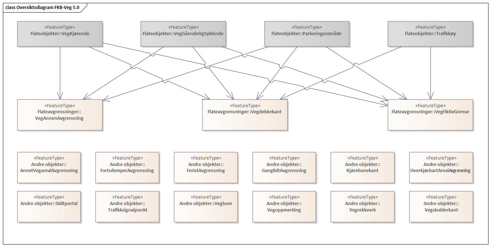
 
'''
 
.Realisering av objekttyper 
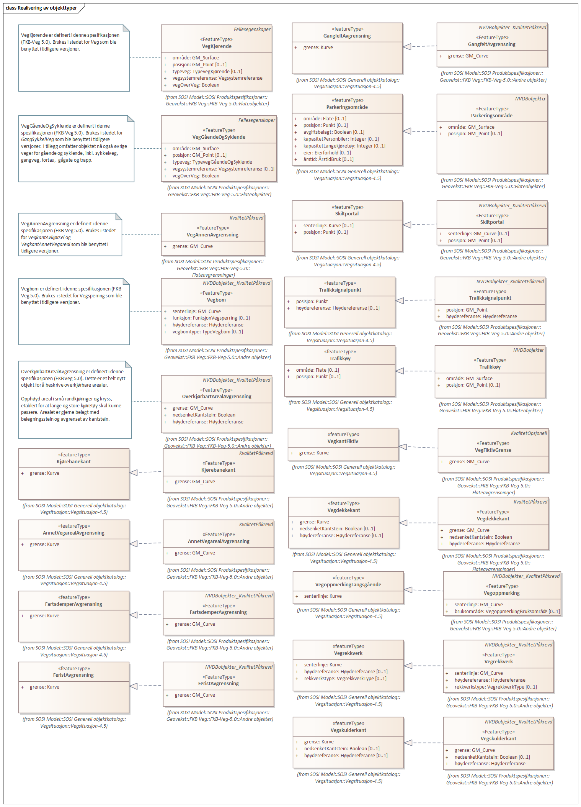
<<<
'''
==== Pakke: Generelle elementer
*Definisjon:* pakke med elementer som realiserer tilsvarende elementer i FKB Generell del 5.0
 
'''
 
.Oversiktsdiagram Fellesegenskaper 
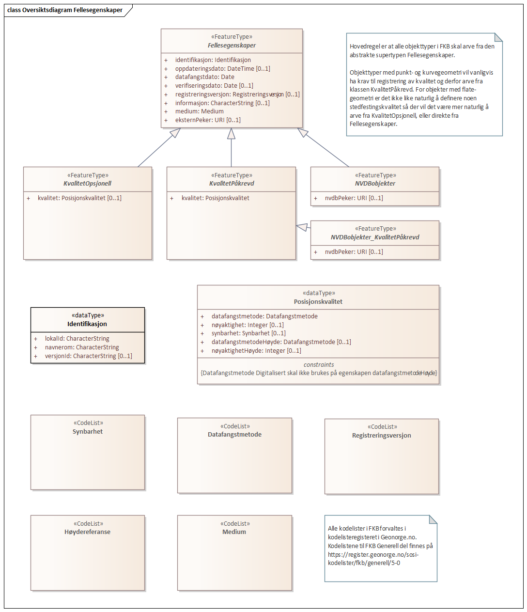
 
'''
 
.Arv av fellesegenskaper 
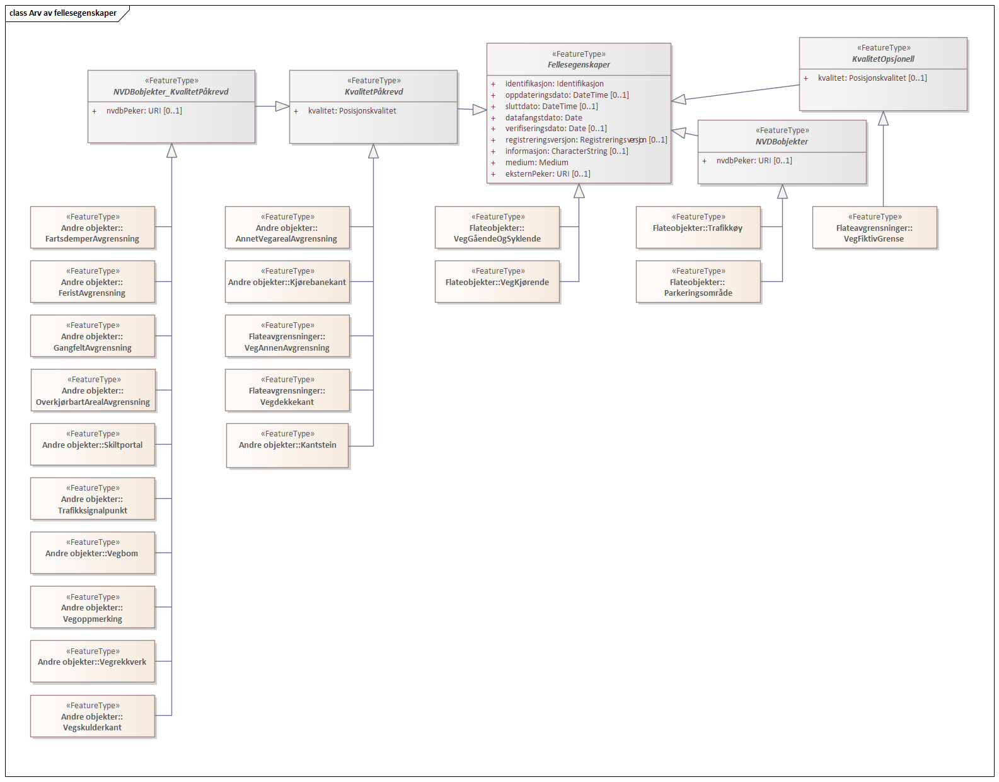
 
'''
 
.Realisering fra SOSI generell del 
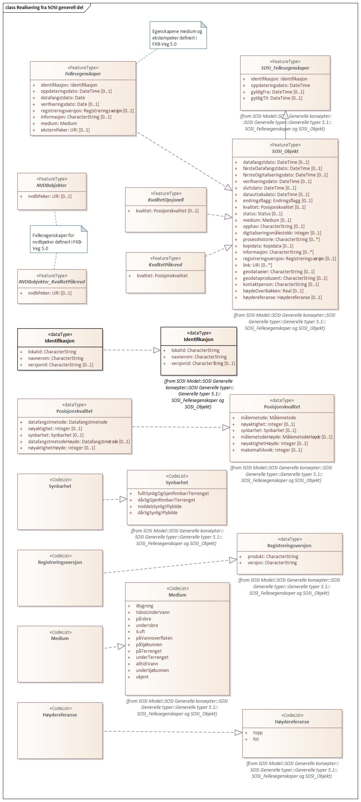
 
'''
 
.Hoveddiagram Posisjonskvalitet 
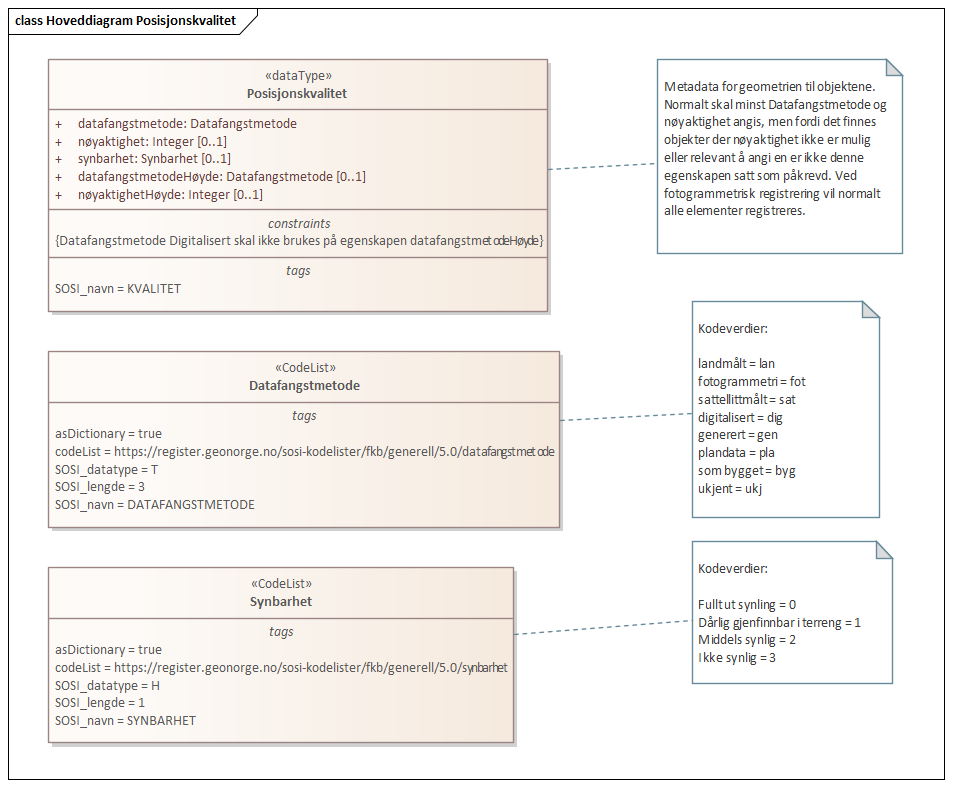
 
'''
 
[[fellesegenskaper]]
===== «FeatureType» Fellesegenskaper (abstrakt)
*Definisjon:* abstrakt objekttype som bærer sentrale egenskaper som er anbefalt for bruk i produktspesifikasjoner.
 
[discrete]
====== Egenskaper
[cols="20,80"]
|===
|*Navn:* 
|*identifikasjon*
 
|Definisjon: 
|unik identifikasjon av et objekt 

Merknad FKB:
Unik identifikasjon av et objekt, ivaretas av den ansvarlige produsent/forvalter, og som kan benyttes av eksterne applikasjoner som referanse til objektet.

Den unike identifikatoren er unik for kartobjektet og skal ikke endres i kartobjektets levetid. Dette må ikke forveksles med en tematisk identifikator (for eksempel bygningsnummer) som unikt identifiserer et objekt i virkeligheten. En bygning med samme bygningsnummer vil kunne representeres i mange kartprodukter der det finnes en unik identifikasjon i hver av dem.

For FKB benyttes UUID (Universally unique identifier) som lokalId. Dette innebærer at lokalId alene alltid vil være unik. Likevel skal alltid navnerom også angis. Navnerom angir FKB-datasettet.
 
|Multiplisitet: 
|[1..1]
 
|Type: 
|<<identifikasjon,«dataType» Identifikasjon>>
|Profilparametre i tagged values: 
|
SOSI_navn: IDENT + 
|===
[cols="20,80"]
|===
|*Navn:* 
|*oppdateringsdato*
 
|Definisjon: 
|tidspunkt for siste endring på objektet 

Merknad FKB: 

Denne datoen viser datasystemets siste endring på dataobjektet. Egenskapen settes av forvaltningssystemet etter følgende regler:

i. Oppdateringsdato er tidspunkt for oppdatering av databasen og settes av forvaltningsbasen (ikke av klienten).

ii. Oppdateringsdato skal endres også hvis det er kopidata som blir endret eller importert i en ”kopibase”.

iii. Når avgrensingslinjene til en flate endres, skal flateobjektet få ny oppdateringsdato.

iv. Oppdateringsdato skal endres hvis en egenskap endres.
 
|Multiplisitet: 
|[1..1]
 
|Type: 
|http://skjema.geonorge.no/SOSI/basistype/DateTime[DateTime]
|Profilparametre i tagged values: 
|
SOSI_datatype: DATOTID + 
SOSI_navn: OPPDATERINGSDATO + 
|===
[cols="20,80"]
|===
|*Navn:* 
|*sluttdato*
 
|Definisjon: 
|Tid for når denne versjonen av objektet var erstattet eller opphørt å eksistere.

Merknad FKB:
Egenskapen settes av forvaltningssystemet. Sluttdato skal kun sendes med ut fra forvaltningssystemet i sammenhenger der objektenes historikk er interessant.    
 
|Multiplisitet: 
|[0..1]
 
|Type: 
|http://skjema.geonorge.no/SOSI/basistype/DateTime[DateTime]
|Profilparametre i tagged values: 
|
SOSI_datatype: DATOTID + 
SOSI_navn: SLUTTDATO + 
|===
[cols="20,80"]
|===
|*Navn:* 
|*datafangstdato*
 
|Definisjon: 
|dato når objektet siste gang ble registrert/observert/målt i terrenget
 
|Multiplisitet: 
|[1..1]
 
|Type: 
|http://skjema.geonorge.no/SOSI/basistype/Date[Date]
|Profilparametre i tagged values: 
|
SOSI_datatype: DATO + 
SOSI_navn: DATAFANGSTDATO + 
|===
[cols="20,80"]
|===
|*Navn:* 
|*verifiseringsdato*
 
|Definisjon: 
|dato når dataene er fastslått å være i samsvar med virkeligheten.

Merknad FKB:
Brukes for eksempel i de sammenhenger hvor det er foretatt fotogrammetrisk ajourhold, og hvor det ikke er registrert endringer på objektet (det virkelige objektet er i samsvar med dataobjektet)
 
|Multiplisitet: 
|[0..1]
 
|Type: 
|http://skjema.geonorge.no/SOSI/basistype/Date[Date]
|Profilparametre i tagged values: 
|
SOSI_datatype: DATO + 
SOSI_navn: VERIFISERINGSDATO + 
|===
[cols="20,80"]
|===
|*Navn:* 
|*registreringsversjon*
 
|Definisjon: 
|angivelse av hvilken produktspesifikasjon som er utgangspunkt  for dataene
 
|Multiplisitet: 
|[0..1]
 
|Type: 
|<<registreringsversjon,«CodeList» Registreringsversjon>>
|Profilparametre i tagged values: 
|
defaultCodeSpace: https://register.geonorge.no/sosi-kodelister/fkb/generell/5.0/registreringsversjon + 
SOSI_datatype: T + 
SOSI_lengde: 10 + 
SOSI_navn: REGISTRERINGSVERSJON + 
|===
[cols="20,80"]
|===
|*Navn:* 
|*informasjon*
 
|Definisjon: 
|generell opplysning.

Merknad FKB:
Mulighet til å legge inn utfyllende informasjon om objektet. Egenskapen bør bare brukes til å legge inn ekstra informasjon om enkeltobjekter. Egenskapen bør ikke brukes til å systematisk angi ekstrainformasjon om mange/alle objekter i et datasett.
 
|Multiplisitet: 
|[0..1]
 
|Type: 
|http://skjema.geonorge.no/SOSI/basistype/CharacterString[CharacterString]
|Profilparametre i tagged values: 
|
SOSI_datatype: T + 
SOSI_lengde: 255 + 
SOSI_navn: INFORMASJON + 
|===
[cols="20,80"]
|===
|*Navn:* 
|*medium*
 
|Definisjon: 
|objektets beliggenhet i forhold til jordoverflaten
 
|Multiplisitet: 
|[1..1]
 
|Type: 
|<<medium,«CodeList» Medium>>
|Profilparametre i tagged values: 
|
SOSI_datatype: T + 
SOSI_lengde: 1 + 
SOSI_navn: MEDIUM + 
|===
[cols="20,80"]
|===
|*Navn:* 
|*eksternPeker*
 
|Definisjon: 
|referanse til objektet i et eksternt system, som ikke er Nasjonal vegdatabank (NVDB).
 
|Multiplisitet: 
|[0..1]
 
|Type: 
|http://skjema.geonorge.no/SOSI/basistype/URI[URI]
|Profilparametre i tagged values: 
|
SOSI_datatype: T + 
SOSI_lengde: 255 + 
SOSI_navn: EKSTERNPEKER + 
|===
 
[discrete]
====== Arv og realiseringer
[cols="20,80"]
|===
|Subtyper:
|<<vegkjørende,«FeatureType» VegKjørende>> +
<<veggåendeogsyklende,«FeatureType» VegGåendeOgSyklende>> +
<<kvalitetpåkrevd,«FeatureType» KvalitetPåkrevd>> +
<<kvalitetopsjonell,«FeatureType» KvalitetOpsjonell>> +
<<nvdbobjekter,«FeatureType» NVDBobjekter>> +
|Realisering av: 
|«ApplicationSchema» Generelle typer 5.1/SOSI_Fellesegenskaper og SOSI_Objekt::«FeatureType» SOSI_Objekt +
|===
 
'''
 
[[kvalitetpåkrevd]]
===== «FeatureType» KvalitetPåkrevd (abstrakt)
*Definisjon:* abstrakt objekttype med påkrevet kvalitetsangivelse
 
[discrete]
====== Egenskaper
[cols="20,80"]
|===
|*Navn:* 
|*kvalitet*
 
|Definisjon: 
|beskrivelse av kvaliteten på stedfestingen

Merknad: Denne er identisk med ..KVALITET i tidligere versjoner av SOSI.
 
|Multiplisitet: 
|[1..1]
 
|Type: 
|<<posisjonskvalitet,«dataType» Posisjonskvalitet>>
|Profilparametre i tagged values: 
|
SOSI_navn: KVALITET + 
|===
 
[discrete]
====== Arv og realiseringer
[cols="20,80"]
|===
|Supertype: 
|<<fellesegenskaper,«FeatureType» Fellesegenskaper>>
 
|Subtyper:
|<<kjørebanekant,«FeatureType» Kjørebanekant>> +
<<vegannenavgrensning,«FeatureType» VegAnnenAvgrensning>> +
<<annetvegarealavgrensning,«FeatureType» AnnetVegarealAvgrensning>> +
<<vegdekkekant,«FeatureType» Vegdekkekant>> +
<<kantstein,«FeatureType» Kantstein>> +
<<nvdbobjekter_kvalitetpåkrevd,«FeatureType» NVDBobjekter_KvalitetPåkrevd>> +
|Realisering av: 
|«ApplicationSchema» Generelle typer 5.1/SOSI_Fellesegenskaper og SOSI_Objekt::«FeatureType» SOSI_Objekt +
|===
 
'''
 
[[kvalitetopsjonell]]
===== «FeatureType» KvalitetOpsjonell (abstrakt)
*Definisjon:* abstrakt objekttype med valgfri kvalitetsangivelse
 
[discrete]
====== Egenskaper
[cols="20,80"]
|===
|*Navn:* 
|*kvalitet*
 
|Definisjon: 
|beskrivelse av kvaliteten på stedfestingen

Merknad: Denne er identisk med ..KVALITET i tidligere versjoner av SOSI.
 
|Multiplisitet: 
|[0..1]
 
|Type: 
|<<posisjonskvalitet,«dataType» Posisjonskvalitet>>
|Profilparametre i tagged values: 
|
SOSI_navn: KVALITET + 
|===
 
[discrete]
====== Arv og realiseringer
[cols="20,80"]
|===
|Supertype: 
|<<fellesegenskaper,«FeatureType» Fellesegenskaper>>
 
|Subtyper:
|<<vegfiktivgrense,«FeatureType» VegFiktivGrense>> +
|Realisering av: 
|«ApplicationSchema» Generelle typer 5.1/SOSI_Fellesegenskaper og SOSI_Objekt::«FeatureType» SOSI_Objekt +
|===
 
'''
 
[[nvdbobjekter]]
===== «FeatureType» NVDBobjekter (abstrakt)
*Definisjon:* abstrakt objekttype som arves fra for flateobjekter som har kobling til NVDB.
 
[discrete]
====== Egenskaper
[cols="20,80"]
|===
|*Navn:* 
|*nvdbPeker*
 
|Definisjon: 
|peker til objekt i NVDB
 
|Multiplisitet: 
|[0..1]
 
|Type: 
|http://skjema.geonorge.no/SOSI/basistype/URI[URI]
|Profilparametre i tagged values: 
|
SOSI_datatype: T + 
SOSI_lengde: 255 + 
SOSI_navn: NVDBPEKER + 
|===
 
[discrete]
====== Arv og realiseringer
[cols="20,80"]
|===
|Supertype: 
|<<fellesegenskaper,«FeatureType» Fellesegenskaper>>
 
|Subtyper:
|<<trafikkøy,«FeatureType» Trafikkøy>> +
<<parkeringsområde,«FeatureType» Parkeringsområde>> +
|===
 
'''
 
[[nvdbobjekter_kvalitetpåkrevd]]
===== «FeatureType» NVDBobjekter_KvalitetPåkrevd (abstrakt)
*Definisjon:* abstrakt objekttype som arves fra for objekter med kvalitet påkrevd som har kobling til NVDB
 
[discrete]
====== Egenskaper
[cols="20,80"]
|===
|*Navn:* 
|*nvdbPeker*
 
|Definisjon: 
|peker til objekt i NVDB
 
|Multiplisitet: 
|[0..1]
 
|Type: 
|http://skjema.geonorge.no/SOSI/basistype/URI[URI]
|Profilparametre i tagged values: 
|
SOSI_datatype: T + 
SOSI_lengde: 255 + 
SOSI_navn: NVDBPEKER + 
|===
 
[discrete]
====== Arv og realiseringer
[cols="20,80"]
|===
|Supertype: 
|<<kvalitetpåkrevd,«FeatureType» KvalitetPåkrevd>>
 
|Subtyper:
|<<vegoppmerking,«FeatureType» Vegoppmerking>> +
<<fartsdemperavgrensning,«FeatureType» FartsdemperAvgrensning>> +
<<vegrekkverk,«FeatureType» Vegrekkverk>> +
<<gangfeltavgrensning,«FeatureType» GangfeltAvgrensning>> +
<<vegskulderkant,«FeatureType» Vegskulderkant>> +
<<trafikksignalpunkt,«FeatureType» Trafikksignalpunkt>> +
<<feristavgrensning,«FeatureType» FeristAvgrensning>> +
<<skiltportal,«FeatureType» Skiltportal>> +
<<vegbom,«FeatureType» Vegbom>> +
<<overkjørbartarealavgrensning,«FeatureType» OverkjørbartArealAvgrensning>> +
|===
 
'''
 
[[identifikasjon]]
===== «dataType» Identifikasjon
*Definisjon:* Unik identifikasjon av et objekt i et datasett, forvaltet av den ansvarlige produsent/forvalter, og kan benyttes av eksterne applikasjoner som stabil referanse til objektet. 

Merknad 1: Denne objektidentifikasjonen må ikke forveksles med en tematisk objektidentifikasjon, slik som f.eks bygningsnummer. 

Merknad 2: Denne unike identifikatoren vil ikke endres i løpet av objektets levetid, og ikke gjenbrukes i andre objekt.
 
[discrete]
====== Profilparametre i tagged values
[cols="20,80"]
|===
|SOSI_navn
|IDENT
 
|===
[discrete]
====== Egenskaper
[cols="20,80"]
|===
|*Navn:* 
|*lokalId*
 
|Definisjon: 
|lokal identifikator av et objekt

Merknad: Det er dataleverendørens ansvar å sørge for at den lokale identifikatoren er unik innenfor navnerommet. For FKB-data benyttes UUID som lokalId.
 
|Multiplisitet: 
|[1..1]
 
|Type: 
|http://skjema.geonorge.no/SOSI/basistype/CharacterString[CharacterString]
|Profilparametre i tagged values: 
|
SOSI_datatype: T + 
SOSI_lengde: 100 + 
SOSI_navn: LOKALID + 
|===
[cols="20,80"]
|===
|*Navn:* 
|*navnerom*
 
|Definisjon: 
|navnerom som unikt identifiserer datakilden til et objekt, anbefales å være en http-URI

Eksempel: http://data.geonorge.no/SentraltStedsnavnsregister/1.0

Merknad : Verdien for navnerom vil eies av den dataprodusent som har ansvar for de unike identifikatorene og må være registrert i data.geonorge.no eller data.norge.no
 
|Multiplisitet: 
|[1..1]
 
|Type: 
|http://skjema.geonorge.no/SOSI/basistype/CharacterString[CharacterString]
|Profilparametre i tagged values: 
|
SOSI_datatype: T + 
SOSI_lengde: 100 + 
SOSI_navn: NAVNEROM + 
|===
[cols="20,80"]
|===
|*Navn:* 
|*versjonId*
 
|Definisjon: 
|identifikasjon av en spesiell versjon av et geografisk objekt (instans)
 
|Multiplisitet: 
|[0..1]
 
|Type: 
|http://skjema.geonorge.no/SOSI/basistype/CharacterString[CharacterString]
|Profilparametre i tagged values: 
|
SOSI_datatype: T + 
SOSI_lengde: 100 + 
SOSI_navn: VERSJONID + 
|===
[discrete]
====== Arv og realiseringer
[cols="20,80"]
|===
|Realisering av: 
|«ApplicationSchema» Generelle typer 5.1/SOSI_Fellesegenskaper og SOSI_Objekt::«dataType» Identifikasjon +
|===
 
'''
 
[[posisjonskvalitet]]
===== «dataType» Posisjonskvalitet
*Definisjon:* beskrivelse av kvaliteten på stedfestingen.

Merknad:
Posisjonskvalitet er ikke konform med  kvalitetsmodellen i ISO slik den er definert i ISO19157:2013, men er en videreføring av tidligere brukte kvalitetsegenskaper i SOSI. FKB 5.0 innfører en egen variant av datatypen Posisjonskvalitet der kodeliste målemetode er byttet ut med den mer generelle kodelista Datafangstmetode.
 
[discrete]
====== Profilparametre i tagged values
[cols="20,80"]
|===
|SOSI_navn
|KVALITET
 
|===
[discrete]
====== Egenskaper
[cols="20,80"]
|===
|*Navn:* 
|*datafangstmetode*
 
|Definisjon: 
|metode for datafangst. 
Egenskapen beskriver datafangstmetode for grunnrisskoordinater (x,y), eller for både grunnriss og høyde (x,y,z) dersom det ikke er oppgitt noen verdi for datafangstmetodeHøyde.
 
|Multiplisitet: 
|[1..1]
 
|Type: 
|<<datafangstmetode,«CodeList» Datafangstmetode>>
|Profilparametre i tagged values: 
|
defaultCodeSpace: https://register.geonorge.no/sosi-kodelister/fkb/generell/5.0/datafangstmetode + 
SOSI_datatype: T + 
SOSI_lengde: 3 + 
SOSI_navn: DATAFANGSTMETODE + 
|===
[cols="20,80"]
|===
|*Navn:* 
|*nøyaktighet*
 
|Definisjon: 
|standardavviket til posisjoneringa av objektet oppgitt i cm

I de aller fleste sammenhenger benyttes en anslått eller forventet verdi for standardavvik, men dersom man har en beregnet verdi skal denne benyttes. 

For objekter med punktgeometri benyttes verdi for punktstandardavvik. For objekter med kurvegeometri benyttes standardavviket for tverravviket fra kurva. For objekter med overflate- eller volumgeometri er forståelsen at standardavviket beregnes ut fra (3D) avvikene mellom sann posisjon og nærmeste punkt på overflata. 

Merknad:

Verdien er ment å beskrive nøyaktigheten til objektet sammenlignet med sann verdi. Standardavvik er i utgangspunktet et mål på det tilfeldige avviket og det innebærer at vi forutsetter at det systematiske avviket i liten grad påvirker nøyaktigheten til posisjoneringa. For fotogrammetriske data settes som hovedregel verdien lik kravet til standardavvik ved datafangst. Se standarden Geodatakvalitet for nærmere definisjon av standardavvik og hvordan dette defineres, beregnes og kontrolleres.

 
|Multiplisitet: 
|[0..1]
 
|Type: 
|http://skjema.geonorge.no/SOSI/basistype/Integer[Integer]
|Profilparametre i tagged values: 
|
SOSI_datatype: H + 
SOSI_lengde: 6 + 
SOSI_navn: NØYAKTIGHET + 
|===
[cols="20,80"]
|===
|*Navn:* 
|*synbarhet*
 
|Definisjon: 
|beskrivelse av hvor godt objektene framgår i datagrunnlaget for posisjonering (f.eks. flybildene).
 
|Multiplisitet: 
|[0..1]
 
|Type: 
|<<synbarhet,«CodeList» Synbarhet>>
|Profilparametre i tagged values: 
|
defaultCodeSpace: https://register.geonorge.no/sosi-kodelister/fkb/generell/5.0/synbarhet + 
SOSI_datatype: H + 
SOSI_lengde: 1 + 
SOSI_navn: SYNBARHET + 
|===
[cols="20,80"]
|===
|*Navn:* 
|*datafangstmetodeHøyde*
 
|Definisjon: 
|metoden brukt for høyderegistrering av posisjon.

Det er bare nødvending å angi en verdi for egenskapen dersom datafangstmetode for høyde avviker fra datafangstmetode for grunnriss.

 
|Multiplisitet: 
|[0..1]
 
|Type: 
|<<datafangstmetode,«CodeList» Datafangstmetode>>
|Profilparametre i tagged values: 
|
defaultCodeSpace: https://register.geonorge.no/sosi-kodelister/fkb/generell/5.0/datafangstmetode + 
SOSI_datatype: T + 
SOSI_lengde: 3 + 
SOSI_navn: DATAFANGSTMETODEHØYDE + 
|===
[cols="20,80"]
|===
|*Navn:* 
|*nøyaktighetHøyde*
 
|Definisjon: 
|standardavviket til posisjoneringa av objektet oppgitt i cm

I de aller fleste sammenhenger benyttes en anslått eller forventet verdi for standardavvik, men dersom man har en beregnet verdi skal denne benyttes. 

For objekter med punktgeometri benyttes verdi for punktstandardavvik. For objekter med kurvegeometri benyttes standardavviket for tverravviket fra kurva. For objekter med overflate- eller volumgeometri er forståelsen at standardavviket beregnes ut fra (3D) avvikene mellom sann posisjon og nærmeste punkt på overflata. 

Merknad:

Verdien er ment å beskrive nøyaktigheten til objektet sammenlignet med sann verdi. Standardavvik er i utgangspunktet et mål på det tilfeldige avviket og det innebærer at vi forutsetter at det systematiske avviket i liten grad påvirker nøyaktigheten til posisjoneringa. For fotogrammetriske data settes som hovedregel verdien lik kravet til standardavvik ved datafangst. Se standarden Geodatakvalitet for nærmere definisjon av standardavvik og hvordan dette defineres, beregnes og kontrolleres.

 
|Multiplisitet: 
|[0..1]
 
|Type: 
|http://skjema.geonorge.no/SOSI/basistype/Integer[Integer]
|Profilparametre i tagged values: 
|
SOSI_datatype: H + 
SOSI_lengde: 6 + 
SOSI_navn: H-NØYAKTIGHET + 
|===
 
[discrete]
====== Restriksjoner
[cols="20,80"]
|===
|*Navn:* 
|*ugyldige datafangstmetoder for høyde*
 
|Beskrivelse: 
|inv: self.datafangstmetodeHøyde &lt;&gt; 'dig'

--Datafangstmetode Digitalisert skal ikke brukes på egenskapen datafangstmetodeHøyde
 
|===
[discrete]
====== Arv og realiseringer
[cols="20,80"]
|===
|Realisering av: 
|«ApplicationSchema» Generelle typer 5.1/SOSI_Fellesegenskaper og SOSI_Objekt::«dataType» Posisjonskvalitet +
|===
 
'''
 
[[synbarhet]]
===== «CodeList» Synbarhet
*Definisjon:* synbarhet beskriver hvor godt objektene framgår i datagrunnlaget for posisjonering (f.eks. flybildene).
 
[discrete]
====== Profilparametre i tagged values
[cols="20,80"]
|===
|asDictionary
|true
 
|codeList
|https://register.geonorge.no/sosi-kodelister/fkb/generell/5.0/synbarhet
 
|SOSI_datatype
|H
 
|SOSI_lengde
|1
 
|SOSI_navn
|SYNBARHET
 
|===
 
'''
 
[[datafangstmetode]]
===== «CodeList» Datafangstmetode
*Definisjon:* metode for datafangst. 

Datafangstmetoden beskriver hvordan selve vektordataene er posisjonert fra et datagrunnlag (observasjoner med landmålingsutstyr, fotogrammetrisk stereomodell, digital terrengmodell etc.) og ikke prosessen med å innhente det bakenforliggende datagrunnlaget.
 
[discrete]
====== Profilparametre i tagged values
[cols="20,80"]
|===
|asDictionary
|true
 
|codeList
|https://register.geonorge.no/sosi-kodelister/fkb/generell/5.0/datafangstmetode
 
|SOSI_datatype
|T
 
|SOSI_lengde
|3
 
|SOSI_navn
|DATAFANGSTMETODE
 
|===
 
'''
 
[[registreringsversjon]]
===== «CodeList» Registreringsversjon
*Definisjon:* FKB-versjon som ligger til grunn for registrering. Mest relevant for data som er fotogrammetrisk registrert.
 
[discrete]
====== Profilparametre i tagged values
[cols="20,80"]
|===
|asDictionary
|true
 
|codeList
|https://register.geonorge.no/sosi-kodelister/fkb/generell/5.0/registreringsversjon
 
|SOSI_datatype
|T
 
|SOSI_lengde
|10
 
|SOSI_navn
|REGISTRERINGSVERSJON
 
|===
 
'''
 
[[høydereferanse]]
===== «CodeList» Høydereferanse
*Definisjon:* koordinatregistering utført på topp eller bunn av et objekt
 
[discrete]
====== Profilparametre i tagged values
[cols="20,80"]
|===
|asDictionary
|true
 
|codeList
|https://register.geonorge.no/sosi-kodelister/fkb/generell/5.0/hoydereferanse
 
|SOSI_datatype
|T
 
|SOSI_lengde
|6
 
|SOSI_navn
|HREF
 
|===
 
'''
 
[[medium]]
===== «CodeList» Medium
*Definisjon:* objektets beliggenhet i forhold til jordoverflaten

Eksempel:
Veg på bro, i tunnel, inne i et bygningsmessig anlegg, etc.
 
[discrete]
====== Profilparametre i tagged values
[cols="20,80"]
|===
|asDictionary
|true
 
|codeList
|https://register.geonorge.no/sosi-kodelister/fkb/generell/5.0/medium
 
|SOSI_datatype
|T
 
|SOSI_lengde
|1
 
|SOSI_navn
|MEDIUM
 
|===
<<<
'''
==== Pakke: Flateobjekter
*Definisjon:* Pakke som inneholder de fire flateobjektene benyttet i FKB-Veg 5.0
 
'''
 
.Hoveddiagram - Flateobjekter 
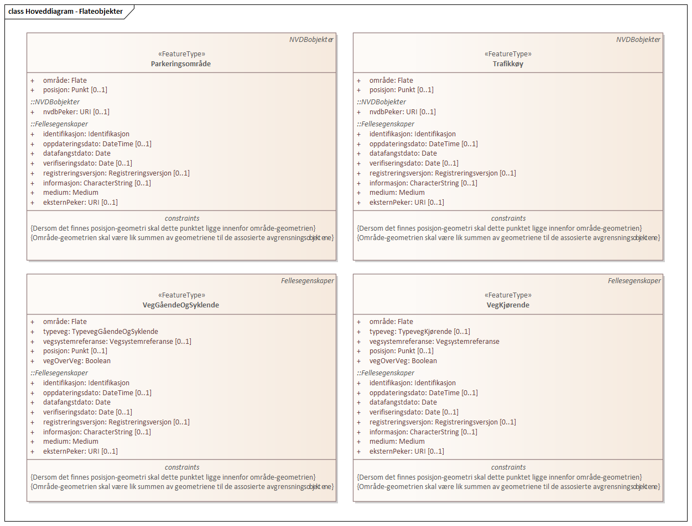
 
'''
 
[[parkeringsområde]]
===== «FeatureType» Parkeringsområde
*Definisjon:* Område for parkering av kjøretøy.
 
 
'''
.Illustrasjon av objekttype Parkeringsområde
image::http://skjema.geonorge.no/SOSI/produktspesifikasjon/FKB-Veg/5.0/figurer/objtype_parkeringsomrade.png[link=http://skjema.geonorge.no/SOSI/produktspesifikasjon/FKB-Veg/5.0/figurer/objtype_parkeringsomrade.png, alt="Bilde av et eksempel på objekttypen Parkeringsområde, eventuelt med påtegning av streker som viser hvor geometrien til objektet skal måles fra."]
[discrete]
====== Egenskaper
[cols="20,80"]
|===
|*Navn:* 
|*område*
 
|Definisjon: 
|objektets utstrekning
 
|Multiplisitet: 
|[1..1]
 
|Type: 
|http://skjema.geonorge.no/SOSI/basistype/GM_Surface[GM_Surface]
|===
[cols="20,80"]
|===
|*Navn:* 
|*posisjon*
 
|Definisjon: 
|sted som objektet eksisterer på
 
|Multiplisitet: 
|[0..1]
 
|Type: 
|http://skjema.geonorge.no/SOSI/basistype/GM_Point[GM_Point]
|===
 
[discrete]
====== Roller
[cols="20,80"]
|===
|*Rollenavn:* 
|*avgrensesAvVegdekkekant*
 
|Definisjon:
|Krav til delt flategeometri. Avgrensning av Parkeringsområde ved hjelp av Vegdekkekant.
 
|Multiplisitet: 
|[0..*]
 
|Til klasse
|<<vegdekkekant,«FeatureType» Vegdekkekant>>
|===
[cols="20,80"]
|===
|*Rollenavn:* 
|*avgrensesAvVegFiktivGrense*
 
|Definisjon:
|Krav til delt flategeometri. Avgrensning av Parkeringsområde ved hjelp av VegFiktivGrense.
 
|Multiplisitet: 
|[0..*]
 
|Til klasse
|<<vegfiktivgrense,«FeatureType» VegFiktivGrense>>
|===
[cols="20,80"]
|===
|*Rollenavn:* 
|*avgrensesAvVegAnnenAvgrensning*
 
|Definisjon:
|Krav til delt flategeometri. Avgrensning av Parkeringsområde ved hjelp av VegAnnenAvgrensning.
 
|Multiplisitet: 
|[0..*]
 
|Til klasse
|<<vegannenavgrensning,«FeatureType» VegAnnenAvgrensning>>
|===
 
[discrete]
====== Restriksjoner
[cols="20,80"]
|===
|*Navn:* 
|*avgrensningsobjekter i samsvar med områdegeometri*
 
|Beskrivelse: 
|
--ingen OCL, restriksjonen implementeres manuelt
 + 
--Område-geometrien skal være lik summen av geometriene til de assosierte avgrensningsobjektene
 
|===
[cols="20,80"]
|===
|*Navn:* 
|*posisjon innenfor område*
 
|Beskrivelse: 
|
--ingen OCL, restriksjonen implementeres manuelt
 + 
--Dersom det finnes område-geometri skal posisjon-geometrien ligge innenfor område-geometrien
 
|===
 
[discrete]
====== Arv og realiseringer
[cols="20,80"]
|===
|Supertype: 
|<<nvdbobjekter,«FeatureType» NVDBobjekter>>
 
|Realisering av: 
|«ApplicationSchema» Vegsituasjon-4.5::«featureType» Parkeringsområde +
|===
 
'''
 
[[trafikkøy]]
===== «FeatureType» Trafikkøy
*Definisjon:* Område som er begrenset av kjørefelt på alle sider og som normalt ikke skal benyttes av kjøretøy.
 
 
'''
.Illustrasjon av objekttype Trafikkøy
image::http://skjema.geonorge.no/SOSI/produktspesifikasjon/FKB-Veg/5.0/figurer/objtype_trafikkoy.png[link=http://skjema.geonorge.no/SOSI/produktspesifikasjon/FKB-Veg/5.0/figurer/objtype_trafikkoy.png, alt="Bilde av et eksempel på objekttypen Trafikkøy, eventuelt med påtegning av streker som viser hvor geometrien til objektet skal måles fra."]
[discrete]
====== Egenskaper
[cols="20,80"]
|===
|*Navn:* 
|*område*
 
|Definisjon: 
|objektets utstrekning
 
|Multiplisitet: 
|[1..1]
 
|Type: 
|http://skjema.geonorge.no/SOSI/basistype/GM_Surface[GM_Surface]
|===
[cols="20,80"]
|===
|*Navn:* 
|*posisjon*
 
|Definisjon: 
|sted som objektet eksisterer på
 
|Multiplisitet: 
|[0..1]
 
|Type: 
|http://skjema.geonorge.no/SOSI/basistype/GM_Point[GM_Point]
|===
 
[discrete]
====== Roller
[cols="20,80"]
|===
|*Rollenavn:* 
|*avgrensesAvVegdekkekant*
 
|Definisjon:
|Krav til delt flategeometri. Avgrensning av Trafikkøy ved hjelp av Vegdekkekant.
 
|Multiplisitet: 
|[0..*]
 
|Til klasse
|<<vegdekkekant,«FeatureType» Vegdekkekant>>
|===
[cols="20,80"]
|===
|*Rollenavn:* 
|*avgrensesAvVegFiktivGrense*
 
|Definisjon:
|Krav til delt flategeometri. Avgrensning av trafikkøy ved hjelp av VegFiktivGrense.
 
|Multiplisitet: 
|[0..*]
 
|Til klasse
|<<vegfiktivgrense,«FeatureType» VegFiktivGrense>>
|===
 
[discrete]
====== Restriksjoner
[cols="20,80"]
|===
|*Navn:* 
|*avgrensningsobjekter i samsvar med områdegeometri*
 
|Beskrivelse: 
|
--ingen OCL, restriksjonen implementeres manuelt
 + 
--Område-geometrien skal være lik summen av geometriene til de assosierte avgrensningsobjektene
 
|===
[cols="20,80"]
|===
|*Navn:* 
|*posisjon innenfor område*
 
|Beskrivelse: 
|
--ingen OCL, restriksjonen implementeres manuelt
 + 
--Dersom det finnes område-geometri skal posisjon-geometrien ligge innenfor område-geometrien
 
|===
 
[discrete]
====== Arv og realiseringer
[cols="20,80"]
|===
|Supertype: 
|<<nvdbobjekter,«FeatureType» NVDBobjekter>>
 
|Realisering av: 
|«ApplicationSchema» Vegsituasjon-4.5::«featureType» Trafikkøy +
|===
 
'''
 
[[veggåendeogsyklende]]
===== «FeatureType» VegGåendeOgSyklende
*Definisjon:* Ferdselsområde for gående og syklende. Her inngår fortau, gangveg, gang- og sykkelveg, sykkelveg, trapp og gågate.

Merknad:
Erstatter tidligere objekttype GangSykkelveg. Den nye objekttypen omfatter alle typer veger for gående og syklende definert i Elveg 2.0
 
 
'''
.Illustrasjon av objekttype VegGåendeOgSyklende
image::http://skjema.geonorge.no/SOSI/produktspesifikasjon/FKB-Veg/5.0/figurer/objtype_veggaendeogsyklende.png[link=http://skjema.geonorge.no/SOSI/produktspesifikasjon/FKB-Veg/5.0/figurer/objtype_veggaendeogsyklende.png, alt="Bilde av et eksempel på objekttypen VegGåendeOgSyklende, eventuelt med påtegning av streker som viser hvor geometrien til objektet skal måles fra."]
[discrete]
====== Egenskaper
[cols="20,80"]
|===
|*Navn:* 
|*område*
 
|Definisjon: 
|objektets utstrekning
 
|Multiplisitet: 
|[1..1]
 
|Type: 
|http://skjema.geonorge.no/SOSI/basistype/GM_Surface[GM_Surface]
|===
[cols="20,80"]
|===
|*Navn:* 
|*posisjon*
 
|Definisjon: 
|sted som objektet eksisterer på, representert som punkt
 
|Multiplisitet: 
|[0..1]
 
|Type: 
|http://skjema.geonorge.no/SOSI/basistype/GM_Point[GM_Point]
|===
[cols="20,80"]
|===
|*Navn:* 
|*typeveg*
 
|Definisjon: 
|Typeveg er den sentrale egenskapen for å vise hvilken hva slags ferdsel som kan skje på veglenka.
 
|Multiplisitet: 
|[1..1]
 
|Type: 
|<<typeveggåendeogsyklende,«CodeList» TypevegGåendeOgSyklende>>
|Profilparametre i tagged values: 
|
defaultCodeSpace: https://register.geonorge.no/sosi-kodelister/fkb/veg/5.0/typeveggaendeogsyklende + 
SOSI_datatype: T + 
SOSI_lengde: 30 + 
SOSI_navn: TYPEVEG + 
|===
[cols="20,80"]
|===
|*Navn:* 
|*vegsystemreferanse*
 
|Definisjon: 
|sammensatt identifikator for vegsystemreferanse
 
|Multiplisitet: 
|[0..1]
 
|Type: 
|<<vegsystemreferanse,«dataType» Vegsystemreferanse>>
|Profilparametre i tagged values: 
|
SOSI_navn: VEGSYSTEMREFERANSE + 
|===
[cols="20,80"]
|===
|*Navn:* 
|*vegOverVeg*
 
|Definisjon: 
|angivelse av om vegen ligger øverst av flere andre veger

Merknad:                             
egenskapen vegOverVeg benyttes der man har flere veger over hverandre (store trafikkmaskiner som Sinsen-krysset). Verdi JA benyttes for vegen som ligger øverst. Denne egenskapen benyttes for å styre hvilke flater som skal tegnes øverst (prioritet).  Ikke påkrevd å benytte ved en veg over annen veg, da styrer MEDIUM-mekanismen også uttegningen.
 
|Multiplisitet: 
|[1..1]
 
|Type: 
|<<boolean,Boolean>>
|Profilparametre i tagged values: 
|
SOSI_datatype: BOOLSK + 
SOSI_navn: VEGOVERVEG + 
|===
 
[discrete]
====== Roller
[cols="20,80"]
|===
|*Rollenavn:* 
|*avgrensesAvVegFiktivGrense*
 
|Definisjon:
|Krav til delt flategeometri. Avgrensning av VegGåendeOgSyklende ved hjelp av VegFiktivGrense.
 
|Multiplisitet: 
|[0..*]
 
|Til klasse
|<<vegfiktivgrense,«FeatureType» VegFiktivGrense>>
|===
[cols="20,80"]
|===
|*Rollenavn:* 
|*avgrensesAvVegAnnenAvgrensning*
 
|Definisjon:
|Krav til delt flategeometri. Avgrensning av VegGåendeOgSyklende ved hjelp av VegAnnenAvgrensning.
 
|Multiplisitet: 
|[0..*]
 
|Til klasse
|<<vegannenavgrensning,«FeatureType» VegAnnenAvgrensning>>
|===
[cols="20,80"]
|===
|*Rollenavn:* 
|*avgrensesAvVegdekkekant*
 
|Definisjon:
|Krav til delt flategeometri. Avgrensning av VegGåendeOgSyklende ved hjelp av Vegdekkekant.
 
|Multiplisitet: 
|[0..*]
 
|Til klasse
|<<vegdekkekant,«FeatureType» Vegdekkekant>>
|===
 
[discrete]
====== Restriksjoner
[cols="20,80"]
|===
|*Navn:* 
|*avgrensningsobjekter i samsvar med områdegeometri*
 
|Beskrivelse: 
|
--ingen OCL, restriksjonen implementeres manuelt
 + 
--Område-geometrien skal være lik summen av geometriene til de assosierte avgrensningsobjektene
 
|===
[cols="20,80"]
|===
|*Navn:* 
|*posisjon innenfor område*
 
|Beskrivelse: 
|
--ingen OCL, restriksjonen implementeres manuelt
 + 
--Dersom det finnes område-geometri skal posisjon-geometrien ligge innenfor område-geometrien
 
|===
 
[discrete]
====== Arv og realiseringer
[cols="20,80"]
|===
|Supertype: 
|<<fellesegenskaper,«FeatureType» Fellesegenskaper>>
 
|===
 
'''
 
[[vegkjørende]]
===== «FeatureType» VegKjørende
*Definisjon:* Ferdselsområde for motorisert trafikk. Her inngår gatetun, enkel bilveg, kanalisert bilveg, rundkjøring og rampe.
 
 
'''
.Illustrasjon av objekttype VegKjørende
image::http://skjema.geonorge.no/SOSI/produktspesifikasjon/FKB-Veg/5.0/figurer/objtype_vegkjorende.png[link=http://skjema.geonorge.no/SOSI/produktspesifikasjon/FKB-Veg/5.0/figurer/objtype_vegkjorende.png, alt="Bilde av et eksempel på objekttypen VegKjørende, eventuelt med påtegning av streker som viser hvor geometrien til objektet skal måles fra."]
[discrete]
====== Egenskaper
[cols="20,80"]
|===
|*Navn:* 
|*område*
 
|Definisjon: 
|objektets utstrekning
 
|Multiplisitet: 
|[1..1]
 
|Type: 
|http://skjema.geonorge.no/SOSI/basistype/GM_Surface[GM_Surface]
|===
[cols="20,80"]
|===
|*Navn:* 
|*posisjon*
 
|Definisjon: 
|sted som objektet eksisterer på, representert som punkt
 
|Multiplisitet: 
|[0..1]
 
|Type: 
|http://skjema.geonorge.no/SOSI/basistype/GM_Point[GM_Point]
|===
[cols="20,80"]
|===
|*Navn:* 
|*typeveg*
 
|Definisjon: 
|Typeveg er den sentrale egenskapen for å vise hvilken hva slags ferdsel som kan skje på veglenka.
 
|Multiplisitet: 
|[0..1]
 
|Type: 
|<<typevegkjørende,«CodeList» TypevegKjørende>>
|Profilparametre i tagged values: 
|
defaultCodeSpace: https://register.geonorge.no/sosi-kodelister/fkb/veg/5.0/typevegkjorende + 
SOSI_datatype: T + 
SOSI_lengde: 30 + 
SOSI_navn: TYPEVEG + 
|===
[cols="20,80"]
|===
|*Navn:* 
|*vegsystemreferanse*
 
|Definisjon: 
|sammensatt identifikator for vegsystemreferanse
 
|Multiplisitet: 
|[1..1]
 
|Type: 
|<<vegsystemreferanse,«dataType» Vegsystemreferanse>>
|Profilparametre i tagged values: 
|
SOSI_navn: VEGSYSTEMREFERANSE + 
|===
[cols="20,80"]
|===
|*Navn:* 
|*vegOverVeg*
 
|Definisjon: 
|angivelse av om vegen ligger øverst av flere andre veger

Merknad:                             
egenskapen vegOverVeg benyttes der man har flere veger over hverandre (store trafikkmaskiner som Sinsen-krysset). Verdi JA benyttes for vegen som ligger øverst. Denne egenskapen benyttes for å styre hvilke flater som skal tegnes øverst (prioritet).  Ikke påkrevd å benytte ved en veg over annen veg, da styrer MEDIUM-mekanismen også uttegningen.
 
|Multiplisitet: 
|[1..1]
 
|Type: 
|<<boolean,Boolean>>
|Profilparametre i tagged values: 
|
SOSI_datatype: BOOLSK + 
SOSI_navn: VEGOVERVEG + 
|===
 
[discrete]
====== Roller
[cols="20,80"]
|===
|*Rollenavn:* 
|*avgrensesAvVegAnnenAvgrensning*
 
|Definisjon:
|Krav til delt flategeometri. Avgrensning av VegKjørende ved hjelp av VegAnnenAvgrensning.
 
|Multiplisitet: 
|[0..*]
 
|Til klasse
|<<vegannenavgrensning,«FeatureType» VegAnnenAvgrensning>>
|===
[cols="20,80"]
|===
|*Rollenavn:* 
|*avgrensesAvVegdekkekant*
 
|Definisjon:
|Krav til delt flategeometri. Avgrensning av VegKjørende ved hjelp av VegAvdekkekant.
 
|Multiplisitet: 
|[0..*]
 
|Til klasse
|<<vegdekkekant,«FeatureType» Vegdekkekant>>
|===
[cols="20,80"]
|===
|*Rollenavn:* 
|*avgrensesAvVegFiktivGrense*
 
|Definisjon:
|Krav til delt flategeometri. Avgrensning av VegKjørende ved hjelp av VegFiktivGrense.
 
|Multiplisitet: 
|[0..*]
 
|Til klasse
|<<vegfiktivgrense,«FeatureType» VegFiktivGrense>>
|===
 
[discrete]
====== Restriksjoner
[cols="20,80"]
|===
|*Navn:* 
|*avgrensningsobjekter i samsvar med områdegeometri*
 
|Beskrivelse: 
|
--ingen OCL, restriksjonen implementeres manuelt
 + 
--Område-geometrien skal være lik summen av geometriene til de assosierte avgrensningsobjektene
 
|===
[cols="20,80"]
|===
|*Navn:* 
|*posisjon innenfor område*
 
|Beskrivelse: 
|
--ingen OCL, restriksjonen implementeres manuelt
 + 
--Dersom det finnes område-geometri skal posisjon-geometrien ligge innenfor område-geometrien
 
|===
 
[discrete]
====== Arv og realiseringer
[cols="20,80"]
|===
|Supertype: 
|<<fellesegenskaper,«FeatureType» Fellesegenskaper>>
 
|===
<<<
'''
==== Pakke: Flateavgrensninger
*Definisjon:* Pakke som inneholder de fire kurveobjektene som brukes til flateavgrensning i FKB-Veg 5.0
 
'''
 
.Hoveddiagram - Flateavgrensninger 
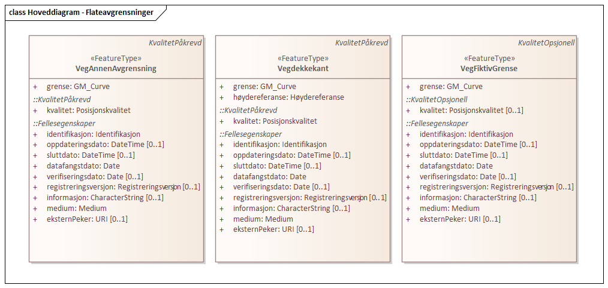
 
'''
 
.Parkeringsområde flateavgrensning 
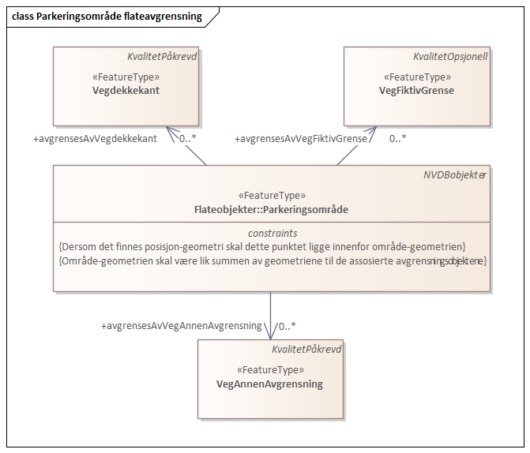
 
'''
 
.Trafikkøy flateavgrensning 
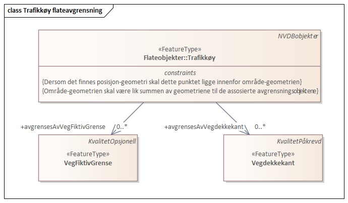
 
'''
 
.VegGåendeOgSyklende flateavgrensning 
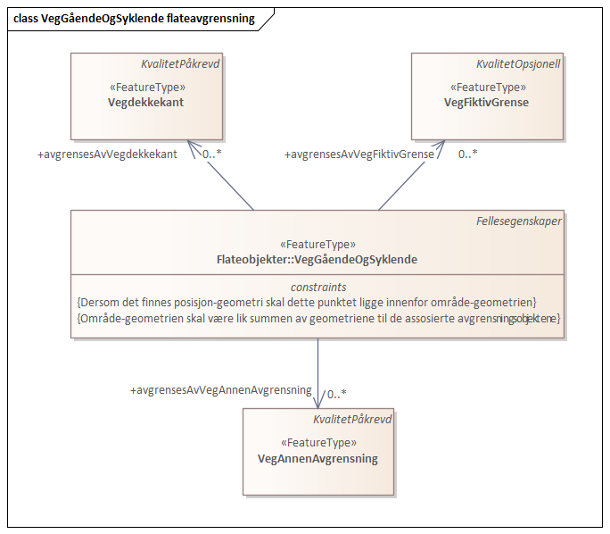
 
'''
 
.VegKjørende flateavgrensning 
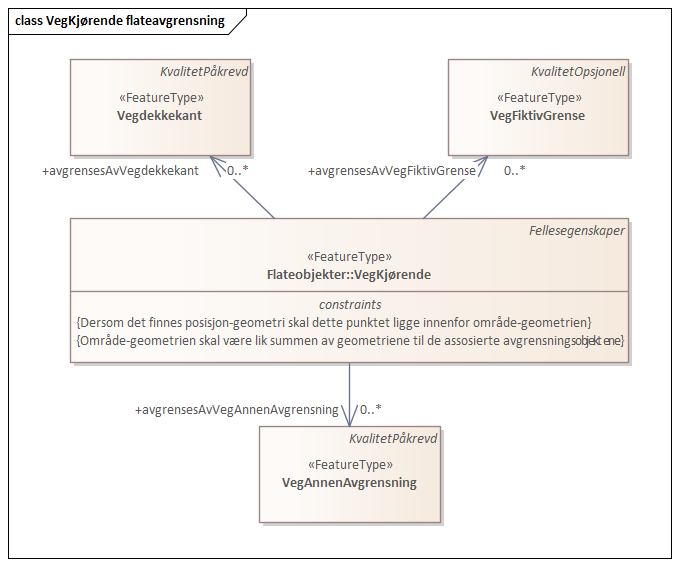
 
'''
 
[[vegannenavgrensning]]
===== «FeatureType» VegAnnenAvgrensning
*Definisjon:* Reell eller fiktiv avgrensing som avgrenser veg mot privat avkjørsel, eller annet vegareal som ligger i tilknytning til vegen. 

Merknad:
Eksempler på annet vegareal er åpne parkeringsplasser, industriområder, bygninger og gårdsplasser. Her inngår også tildligere objekttype VegkantAnnetVegareal og VegkantAvkjørsel.
 
 
'''
.Illustrasjon av objekttype VegAnnenAvgrensning
image::http://skjema.geonorge.no/SOSI/produktspesifikasjon/FKB-Veg/5.0/figurer/objtype_vegannenavgrensning.png[link=http://skjema.geonorge.no/SOSI/produktspesifikasjon/FKB-Veg/5.0/figurer/objtype_vegannenavgrensning.png, alt="Bilde av et eksempel på objekttypen VegAnnenAvgrensning, eventuelt med påtegning av streker som viser hvor geometrien til objektet skal måles fra."]
[discrete]
====== Egenskaper
[cols="20,80"]
|===
|*Navn:* 
|*grense*
 
|Definisjon: 
|forløp som følger overgang mellom ulike fenomener
 
|Multiplisitet: 
|[1..1]
 
|Type: 
|http://skjema.geonorge.no/SOSI/basistype/GM_Curve[GM_Curve]
|===
 
[discrete]
====== Arv og realiseringer
[cols="20,80"]
|===
|Supertype: 
|<<kvalitetpåkrevd,«FeatureType» KvalitetPåkrevd>>
 
|===
 
'''
 
[[vegdekkekant]]
===== «FeatureType» Vegdekkekant
*Definisjon:* avgrensning for alle typer flatedannede vegdekker. 

Merknad: Her inngår også tidligere Trafikkøykant, GangSykkelvegkant, Gangvegkant og AnnetVegarealAvgrensning som avgrenser tidligere bakkant fortau eller parkeringsområdeavgrensning
 
 
'''
.Illustrasjon av objekttype Vegdekkekant
image::http://skjema.geonorge.no/SOSI/produktspesifikasjon/FKB-Veg/5.0/figurer/objtype_vegdekkekant.png[link=http://skjema.geonorge.no/SOSI/produktspesifikasjon/FKB-Veg/5.0/figurer/objtype_vegdekkekant.png, alt="Bilde av et eksempel på objekttypen Vegdekkekant, eventuelt med påtegning av streker som viser hvor geometrien til objektet skal måles fra."]
[discrete]
====== Egenskaper
[cols="20,80"]
|===
|*Navn:* 
|*grense*
 
|Definisjon: 
|forløp som følger overgang mellom ulike fenomener
 
|Multiplisitet: 
|[1..1]
 
|Type: 
|http://skjema.geonorge.no/SOSI/basistype/GM_Curve[GM_Curve]
|===
[cols="20,80"]
|===
|*Navn:* 
|*høydereferanse*
 
|Definisjon: 
|koordinatregistrering utført på topp eller bunn av et objekt
 
|Multiplisitet: 
|[1..1]
 
|Type: 
|<<høydereferanse,«CodeList» Høydereferanse>>
|Profilparametre i tagged values: 
|
SOSI_datatype: T + 
SOSI_lengde: 6 + 
SOSI_navn: HREF + 
|===
 
[discrete]
====== Arv og realiseringer
[cols="20,80"]
|===
|Supertype: 
|<<kvalitetpåkrevd,«FeatureType» KvalitetPåkrevd>>
 
|Realisering av: 
|«ApplicationSchema» Vegsituasjon-4.5::«featureType» Vegdekkekant +
|===
 
'''
 
[[vegfiktivgrense]]
===== «FeatureType» VegFiktivGrense
*Definisjon:* Fiktiv avgrensningslinje (lukkelinje) for vegflater.

Merknad:
VegFiktivGrense brukes for fiktive avgrensninger av vegflater. Objektene skal derfor som hovedregel avgrense to flater.
 
 
'''
.Illustrasjon av objekttype VegFiktivGrense
image::http://skjema.geonorge.no/SOSI/produktspesifikasjon/FKB-Veg/5.0/figurer/objtype_vegfiktivgrense.png[link=http://skjema.geonorge.no/SOSI/produktspesifikasjon/FKB-Veg/5.0/figurer/objtype_vegfiktivgrense.png, alt="Bilde av et eksempel på objekttypen VegFiktivGrense, eventuelt med påtegning av streker som viser hvor geometrien til objektet skal måles fra."]
[discrete]
====== Egenskaper
[cols="20,80"]
|===
|*Navn:* 
|*grense*
 
|Definisjon: 
|forløp som følger overgang mellom ulike fenomener
 
|Multiplisitet: 
|[1..1]
 
|Type: 
|http://skjema.geonorge.no/SOSI/basistype/GM_Curve[GM_Curve]
|===
 
[discrete]
====== Arv og realiseringer
[cols="20,80"]
|===
|Supertype: 
|<<kvalitetopsjonell,«FeatureType» KvalitetOpsjonell>>
 
|Realisering av: 
|«ApplicationSchema» Vegsituasjon-4.5::«featureType» VegkantFiktiv +
|===
<<<
'''
==== Pakke: Andre objekter
*Definisjon:* Pakke som inneholder øvrige objekter som benyttes i FKB-Veg 5.0
 
'''
 
.Hoveddiagram - Andre objekter 
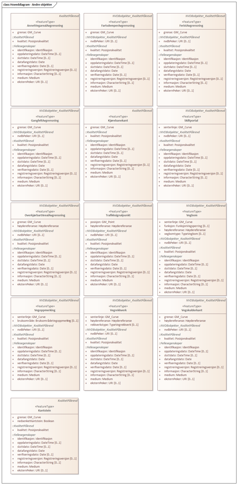
 
'''
 
[[annetvegarealavgrensning]]
===== «FeatureType» AnnetVegarealAvgrensning
*Definisjon:* avgrensning av privat avkjørsel, ytterkant av åpne parkeringsplasser i tilknytning til veg, korte gang- og sykkelveger som ikke hører til hovedvegnettet (for eksempel småveger mellom bebyggelse). 

Merknad: Objekttypen skal ikke brukes til å avgrense vegflate eller fortau
 
 
'''
.Illustrasjon av objekttype AnnetVegarealAvgrensning
image::http://skjema.geonorge.no/SOSI/produktspesifikasjon/FKB-Veg/5.0/figurer/objtype_annetvegarealavgrensning.png[link=http://skjema.geonorge.no/SOSI/produktspesifikasjon/FKB-Veg/5.0/figurer/objtype_annetvegarealavgrensning.png, alt="Bilde av et eksempel på objekttypen AnnetVegarealAvgrensning, eventuelt med påtegning av streker som viser hvor geometrien til objektet skal måles fra."]
[discrete]
====== Egenskaper
[cols="20,80"]
|===
|*Navn:* 
|*grense*
 
|Definisjon: 
|forløp som følger overgang mellom ulike fenomener
 
|Multiplisitet: 
|[1..1]
 
|Type: 
|http://skjema.geonorge.no/SOSI/basistype/GM_Curve[GM_Curve]
|===
 
[discrete]
====== Arv og realiseringer
[cols="20,80"]
|===
|Supertype: 
|<<kvalitetpåkrevd,«FeatureType» KvalitetPåkrevd>>
 
|Realisering av: 
|«ApplicationSchema» Vegsituasjon-4.5::«featureType» AnnetVegarealAvgrensning +
|===
 
'''
 
[[fartsdemperavgrensning]]
===== «FeatureType» FartsdemperAvgrensning
*Definisjon:* Avgrensning av forhøyning i veger og/eller gater for å begrense kjørehastigheten.
 
 
'''
.Illustrasjon av objekttype FartsdemperAvgrensning
image::http://skjema.geonorge.no/SOSI/produktspesifikasjon/FKB-Veg/5.0/figurer/objtype_fartsdemperavgrensning.png[link=http://skjema.geonorge.no/SOSI/produktspesifikasjon/FKB-Veg/5.0/figurer/objtype_fartsdemperavgrensning.png, alt="Bilde av et eksempel på objekttypen FartsdemperAvgrensning, eventuelt med påtegning av streker som viser hvor geometrien til objektet skal måles fra."]
[discrete]
====== Egenskaper
[cols="20,80"]
|===
|*Navn:* 
|*grense*
 
|Definisjon: 
|forløp som følger overgang mellom ulike fenomener
 
|Multiplisitet: 
|[1..1]
 
|Type: 
|http://skjema.geonorge.no/SOSI/basistype/GM_Curve[GM_Curve]
|===
 
[discrete]
====== Arv og realiseringer
[cols="20,80"]
|===
|Supertype: 
|<<nvdbobjekter_kvalitetpåkrevd,«FeatureType» NVDBobjekter_KvalitetPåkrevd>>
 
|Realisering av: 
|«ApplicationSchema» Vegsituasjon-4.5::«featureType» FartsdemperAvgrensning +
|===
 
'''
 
[[feristavgrensning]]
===== «FeatureType» FeristAvgrensning
*Definisjon:* Rist eller gitter som er innbygd i vegbanen, og som hindrer dyr i å komme over.
 
 
'''
.Illustrasjon av objekttype FeristAvgrensning
image::http://skjema.geonorge.no/SOSI/produktspesifikasjon/FKB-Veg/5.0/figurer/objtype_feristavgrensning.png[link=http://skjema.geonorge.no/SOSI/produktspesifikasjon/FKB-Veg/5.0/figurer/objtype_feristavgrensning.png, alt="Bilde av et eksempel på objekttypen FeristAvgrensning, eventuelt med påtegning av streker som viser hvor geometrien til objektet skal måles fra."]
[discrete]
====== Egenskaper
[cols="20,80"]
|===
|*Navn:* 
|*grense*
 
|Definisjon: 
|forløp som følger overgang mellom ulike fenomener
 
|Multiplisitet: 
|[1..1]
 
|Type: 
|http://skjema.geonorge.no/SOSI/basistype/GM_Curve[GM_Curve]
|===
 
[discrete]
====== Arv og realiseringer
[cols="20,80"]
|===
|Supertype: 
|<<nvdbobjekter_kvalitetpåkrevd,«FeatureType» NVDBobjekter_KvalitetPåkrevd>>
 
|Realisering av: 
|«ApplicationSchema» Vegsituasjon-4.5::«featureType» FeristAvgrensning +
|===
 
'''
 
[[gangfeltavgrensning]]
===== «FeatureType» GangfeltAvgrensning
*Definisjon:* Avgrensning av gangfelt.
 
 
'''
.Illustrasjon av objekttype GangfeltAvgrensning
image::http://skjema.geonorge.no/SOSI/produktspesifikasjon/FKB-Veg/5.0/figurer/objtype_gangfeltavgrensning.png[link=http://skjema.geonorge.no/SOSI/produktspesifikasjon/FKB-Veg/5.0/figurer/objtype_gangfeltavgrensning.png, alt="Bilde av et eksempel på objekttypen GangfeltAvgrensning, eventuelt med påtegning av streker som viser hvor geometrien til objektet skal måles fra."]
[discrete]
====== Egenskaper
[cols="20,80"]
|===
|*Navn:* 
|*grense*
 
|Definisjon: 
|forløp som følger overgang mellom ulike fenomener
 
|Multiplisitet: 
|[1..1]
 
|Type: 
|http://skjema.geonorge.no/SOSI/basistype/GM_Curve[GM_Curve]
|===
 
[discrete]
====== Arv og realiseringer
[cols="20,80"]
|===
|Supertype: 
|<<nvdbobjekter_kvalitetpåkrevd,«FeatureType» NVDBobjekter_KvalitetPåkrevd>>
 
|Realisering av: 
|«ApplicationSchema» Vegsituasjon-4.5::«featureType» GangfeltAvgrensning +
|===
 
'''
 
[[kantstein]]
===== «FeatureType» Kantstein
*Definisjon:* Kantstein som avgrenser vegdekke (oftest bilveg) mot fortau eller lignende
 
 
'''
.Illustrasjon av objekttype Kantstein
image::http://skjema.geonorge.no/SOSI/produktspesifikasjon/FKB-Veg/5.0/figurer/objtype_kantstein.png[link=http://skjema.geonorge.no/SOSI/produktspesifikasjon/FKB-Veg/5.0/figurer/objtype_kantstein.png, alt="Bilde av et eksempel på objekttypen Kantstein, eventuelt med påtegning av streker som viser hvor geometrien til objektet skal måles fra."]
[discrete]
====== Egenskaper
[cols="20,80"]
|===
|*Navn:* 
|*grense*
 
|Definisjon: 
|forløp som følger overgang mellom ulike fenomener 
 
|Multiplisitet: 
|[1..1]
 
|Type: 
|http://skjema.geonorge.no/SOSI/basistype/GM_Curve[GM_Curve]
|===
[cols="20,80"]
|===
|*Navn:* 
|*nedsenketKantstein*
 
|Definisjon: 
|Egenskap for å angi om kantstein er nedsenket eller ikke.
Dersom egenskapen ikke er angitt betyr dette det samme som  nedsenketKantstein Nei. 
 
|Multiplisitet: 
|[1..1]
 
|Type: 
|http://skjema.geonorge.no/SOSI/basistype/Boolean[Boolean]
|Profilparametre i tagged values: 
|
SOSI_datatype: BOOLSK + 
SOSI_navn: NEDSENKETKANTSTEIN + 
|===
 
[discrete]
====== Arv og realiseringer
[cols="20,80"]
|===
|Supertype: 
|<<kvalitetpåkrevd,«FeatureType» KvalitetPåkrevd>>
 
|===
 
'''
 
[[kjørebanekant]]
===== «FeatureType» Kjørebanekant
*Definisjon:* Avgrensing av kjørebanen, som ofte identifiseres med hjelp av oppmerking på veien.
 
 
'''
.Illustrasjon av objekttype Kjørebanekant
image::http://skjema.geonorge.no/SOSI/produktspesifikasjon/FKB-Veg/5.0/figurer/objtype_kjorbanekant.png[link=http://skjema.geonorge.no/SOSI/produktspesifikasjon/FKB-Veg/5.0/figurer/objtype_kjorbanekant.png, alt="Bilde av et eksempel på objekttypen Kjørebanekant, eventuelt med påtegning av streker som viser hvor geometrien til objektet skal måles fra."]
[discrete]
====== Egenskaper
[cols="20,80"]
|===
|*Navn:* 
|*grense*
 
|Definisjon: 
|forløp som følger overgang mellom ulike fenomener
 
|Multiplisitet: 
|[1..1]
 
|Type: 
|http://skjema.geonorge.no/SOSI/basistype/GM_Curve[GM_Curve]
|===
 
[discrete]
====== Arv og realiseringer
[cols="20,80"]
|===
|Supertype: 
|<<kvalitetpåkrevd,«FeatureType» KvalitetPåkrevd>>
 
|Realisering av: 
|«ApplicationSchema» Vegsituasjon-4.5::«featureType» Kjørebanekant +
|===
 
'''
 
[[overkjørbartarealavgrensning]]
===== «FeatureType» OverkjørbartArealAvgrensning
*Definisjon:* Den indre eller ytre avgrensningen av et overkjørbart areal. 

Tilleggsinformasjon:
Opphøyd areal i små rundkjøringer og kryss, etablert for at lange og store kjøretøy skal kunne passere. Arealet er gjerne belagt med belegningsstein og avgrenset av kantstein.
 
 
'''
.Illustrasjon av objekttype OverkjørbartArealAvgrensning
image::http://skjema.geonorge.no/SOSI/produktspesifikasjon/FKB-Veg/5.0/figurer/objtype_overkjorbartarealavgrensning.png[link=http://skjema.geonorge.no/SOSI/produktspesifikasjon/FKB-Veg/5.0/figurer/objtype_overkjorbartarealavgrensning.png, alt="Bilde av et eksempel på objekttypen OverkjørbartArealAvgrensning, eventuelt med påtegning av streker som viser hvor geometrien til objektet skal måles fra."]
[discrete]
====== Egenskaper
[cols="20,80"]
|===
|*Navn:* 
|*grense*
 
|Definisjon: 
|forløp som følger overgang mellom ulike fenomener
 
|Multiplisitet: 
|[1..1]
 
|Type: 
|http://skjema.geonorge.no/SOSI/basistype/GM_Curve[GM_Curve]
|Profilparametre i tagged values: 
|
SOSI_navn: Kurve + 
|===
[cols="20,80"]
|===
|*Navn:* 
|*høydereferanse*
 
|Definisjon: 
|koordinatregistrering utført på topp eller bunn av et objekt
 
|Multiplisitet: 
|[1..1]
 
|Type: 
|<<høydereferanse,«CodeList» Høydereferanse>>
|Profilparametre i tagged values: 
|
SOSI_datatype: T + 
SOSI_lengde: 6 + 
SOSI_navn: HREF + 
|===
 
[discrete]
====== Arv og realiseringer
[cols="20,80"]
|===
|Supertype: 
|<<nvdbobjekter_kvalitetpåkrevd,«FeatureType» NVDBobjekter_KvalitetPåkrevd>>
 
|===
 
'''
 
[[skiltportal]]
===== «FeatureType» Skiltportal
*Definisjon:* Anordning for å henge opp skilt, teknisk utstyr etc. over kjørefeltene.
 
 
'''
.Illustrasjon av objekttype Skiltportal
image::http://skjema.geonorge.no/SOSI/produktspesifikasjon/FKB-Veg/5.0/figurer/objtype_skiltportal.png[link=http://skjema.geonorge.no/SOSI/produktspesifikasjon/FKB-Veg/5.0/figurer/objtype_skiltportal.png, alt="Bilde av et eksempel på objekttypen Skiltportal, eventuelt med påtegning av streker som viser hvor geometrien til objektet skal måles fra."]
[discrete]
====== Egenskaper
[cols="20,80"]
|===
|*Navn:* 
|*senterlinje*
 
|Definisjon: 
|forløp som følger objektets sentrale del
 
|Multiplisitet: 
|[1..1]
 
|Type: 
|http://skjema.geonorge.no/SOSI/basistype/GM_Curve[GM_Curve]
|===
 
[discrete]
====== Arv og realiseringer
[cols="20,80"]
|===
|Supertype: 
|<<nvdbobjekter_kvalitetpåkrevd,«FeatureType» NVDBobjekter_KvalitetPåkrevd>>
 
|Realisering av: 
|«ApplicationSchema» Vegsituasjon-4.5::«featureType» Skiltportal +
|===
 
'''
 
[[trafikksignalpunkt]]
===== «FeatureType» Trafikksignalpunkt
*Definisjon:* Trafikksignal inkludert signalhoder og stolpe lokalisert i ett punkt.
 
 
'''
.Illustrasjon av objekttype Trafikksignalpunkt
image::http://skjema.geonorge.no/SOSI/produktspesifikasjon/FKB-Veg/5.0/figurer/objtype_trafikksignalpunkt.png[link=http://skjema.geonorge.no/SOSI/produktspesifikasjon/FKB-Veg/5.0/figurer/objtype_trafikksignalpunkt.png, alt="Bilde av et eksempel på objekttypen Trafikksignalpunkt, eventuelt med påtegning av streker som viser hvor geometrien til objektet skal måles fra."]
[discrete]
====== Egenskaper
[cols="20,80"]
|===
|*Navn:* 
|*posisjon*
 
|Definisjon: 
|sted som objektet eksisterer på
 
|Multiplisitet: 
|[1..1]
 
|Type: 
|http://skjema.geonorge.no/SOSI/basistype/GM_Point[GM_Point]
|Profilparametre i tagged values: 
|
SOSI_navn: Punkt + 
|===
[cols="20,80"]
|===
|*Navn:* 
|*høydereferanse*
 
|Definisjon: 
|koordinatregistrering utført på topp eller bunn av et objekt
 
|Multiplisitet: 
|[1..1]
 
|Type: 
|<<høydereferanse,«CodeList» Høydereferanse>>
|Profilparametre i tagged values: 
|
SOSI_datatype: T + 
SOSI_lengde: 6 + 
SOSI_navn: HREF + 
|===
 
[discrete]
====== Arv og realiseringer
[cols="20,80"]
|===
|Supertype: 
|<<nvdbobjekter_kvalitetpåkrevd,«FeatureType» NVDBobjekter_KvalitetPåkrevd>>
 
|Realisering av: 
|«ApplicationSchema» Vegsituasjon-4.5::«featureType» Trafikksignalpunkt +
|===
 
'''
 
[[vegbom]]
===== «FeatureType» Vegbom
*Definisjon:* Fysisk vegbom. Kan både være bommer som permanent sperrer for kjøring (vegsperringer) og bommer som kan passeres, f.eks. ved å betale avgift.
 
 
'''
.Illustrasjon av objekttype Vegbom
image::http://skjema.geonorge.no/SOSI/produktspesifikasjon/FKB-Veg/5.0/figurer/objtype_vegbom.png[link=http://skjema.geonorge.no/SOSI/produktspesifikasjon/FKB-Veg/5.0/figurer/objtype_vegbom.png, alt="Bilde av et eksempel på objekttypen Vegbom, eventuelt med påtegning av streker som viser hvor geometrien til objektet skal måles fra."]
[discrete]
====== Egenskaper
[cols="20,80"]
|===
|*Navn:* 
|*senterlinje*
 
|Definisjon: 
|forløp som følger objektets sentrale del
 
|Multiplisitet: 
|[1..1]
 
|Type: 
|http://skjema.geonorge.no/SOSI/basistype/GM_Curve[GM_Curve]
|===
[cols="20,80"]
|===
|*Navn:* 
|*funksjon*
 
|Definisjon: 
|Vegbommens funksjon
 
|Multiplisitet: 
|[0..1]
 
|Type: 
|<<funksjonvegsperring,«CodeList» FunksjonVegsperring>>
|Profilparametre i tagged values: 
|
defaultCodeSpace: https://register.geonorge.no/sosi-kodelister/fkb/veg/5.0/funksjonvegsperring + 
SOSI_datatype: T + 
SOSI_lengde: 30 + 
SOSI_navn: FUNKSJON + 
|===
[cols="20,80"]
|===
|*Navn:* 
|*høydereferanse*
 
|Definisjon: 
|koordinatregistering utført på topp eller bunn av et objekt
 
|Multiplisitet: 
|[1..1]
 
|Type: 
|<<høydereferanse,«CodeList» Høydereferanse>>
|Profilparametre i tagged values: 
|
SOSI_datatype: T + 
SOSI_lengde: 6 + 
SOSI_navn: HREF + 
|===
[cols="20,80"]
|===
|*Navn:* 
|*vegbomtype*
 
|Definisjon: 
|Angir hvilken type vegbommen er av
 
|Multiplisitet: 
|[0..1]
 
|Type: 
|<<typevegbom,«CodeList» TypeVegbom>>
|Profilparametre i tagged values: 
|
defaultCodeSpace: https://register.geonorge.no/sosi-kodelister/fkb/veg/5.0/typevegbom + 
SOSI_datatype: T + 
SOSI_lengde: 30 + 
SOSI_navn: VEGBOMTYPE + 
|===
 
[discrete]
====== Arv og realiseringer
[cols="20,80"]
|===
|Supertype: 
|<<nvdbobjekter_kvalitetpåkrevd,«FeatureType» NVDBobjekter_KvalitetPåkrevd>>
 
|===
 
'''
 
[[vegoppmerking]]
===== «FeatureType» Vegoppmerking
*Definisjon:* Langs- og/eller tverrgående vegoppmerkingslinjer i vegen. Vegoppmerking nyttes for å lede, varsle eller regulere trafikken, og for å klargjøre andre bestemmelser gitt ved trafikkskilt eller trafikkregler.
 
 
'''
.Illustrasjon av objekttype Vegoppmerking
image::http://skjema.geonorge.no/SOSI/produktspesifikasjon/FKB-Veg/5.0/figurer/objtype_vegoppmerking.png[link=http://skjema.geonorge.no/SOSI/produktspesifikasjon/FKB-Veg/5.0/figurer/objtype_vegoppmerking.png, alt="Bilde av et eksempel på objekttypen Vegoppmerking, eventuelt med påtegning av streker som viser hvor geometrien til objektet skal måles fra."]
[discrete]
====== Egenskaper
[cols="20,80"]
|===
|*Navn:* 
|*senterlinje*
 
|Definisjon: 
|forløp som følger objektets sentrale del
 
|Multiplisitet: 
|[1..1]
 
|Type: 
|http://skjema.geonorge.no/SOSI/basistype/GM_Curve[GM_Curve]
|===
[cols="20,80"]
|===
|*Navn:* 
|*bruksområde*
 
|Definisjon: 
|bruksområde for vegopmmerking
(hentes fra NVDB) )
 
|Multiplisitet: 
|[0..1]
 
|Type: 
|<<bruksområdevegoppmerking,«CodeList» BruksområdeVegoppmerking>>
|Profilparametre i tagged values: 
|
defaultCodeSpace: https://register.geonorge.no/sosi-kodelister/fkb/veg/5.0/bruksomradevegoppmerking + 
SOSI_datatype: T + 
SOSI_lengde: 30 + 
SOSI_navn: BRUKSOMRÅDE + 
|===
 
[discrete]
====== Arv og realiseringer
[cols="20,80"]
|===
|Supertype: 
|<<nvdbobjekter_kvalitetpåkrevd,«FeatureType» NVDBobjekter_KvalitetPåkrevd>>
 
|Realisering av: 
|«ApplicationSchema» Vegsituasjon-4.5::«featureType» VegoppmerkingLangsgående +
|===
 
'''
 
[[vegrekkverk]]
===== «FeatureType» Vegrekkverk
*Definisjon:* En anordning som skal hindre at kjøretøy forlater vegen.
 
 
'''
.Illustrasjon av objekttype Vegrekkverk
image::http://skjema.geonorge.no/SOSI/produktspesifikasjon/FKB-Veg/5.0/figurer/objtype_vegrekkverk.png[link=http://skjema.geonorge.no/SOSI/produktspesifikasjon/FKB-Veg/5.0/figurer/objtype_vegrekkverk.png, alt="Bilde av et eksempel på objekttypen Vegrekkverk, eventuelt med påtegning av streker som viser hvor geometrien til objektet skal måles fra."]
[discrete]
====== Egenskaper
[cols="20,80"]
|===
|*Navn:* 
|*senterlinje*
 
|Definisjon: 
|forløp som følger objektets sentrale del
 
|Multiplisitet: 
|[1..1]
 
|Type: 
|http://skjema.geonorge.no/SOSI/basistype/GM_Curve[GM_Curve]
|Profilparametre i tagged values: 
|
SOSI_navn: Kurve + 
|===
[cols="20,80"]
|===
|*Navn:* 
|*høydereferanse*
 
|Definisjon: 
|koordinatregistrering utført på topp eller bunn av et objekt
 
|Multiplisitet: 
|[1..1]
 
|Type: 
|<<høydereferanse,«CodeList» Høydereferanse>>
|Profilparametre i tagged values: 
|
SOSI_datatype: T + 
SOSI_lengde: 6 + 
SOSI_navn: HREF + 
|===
[cols="20,80"]
|===
|*Navn:* 
|*rekkverkstype*
 
|Definisjon: 
|type rekkverk
 
|Multiplisitet: 
|[0..1]
 
|Type: 
|<<typevegrekkverk,«CodeList» TypeVegrekkverk>>
|Profilparametre i tagged values: 
|
defaultCodeSpace: https://register.geonorge.no/sosi-kodelister/fkb/veg/5.0/typevegrekkverk + 
SOSI_datatype: T + 
SOSI_lengde: 30 + 
SOSI_navn: REKKVERKSTYPE + 
|===
 
[discrete]
====== Arv og realiseringer
[cols="20,80"]
|===
|Supertype: 
|<<nvdbobjekter_kvalitetpåkrevd,«FeatureType» NVDBobjekter_KvalitetPåkrevd>>
 
|Realisering av: 
|«ApplicationSchema» Vegsituasjon-4.5::«featureType» Vegrekkverk +
|===
 
'''
 
[[vegskulderkant]]
===== «FeatureType» Vegskulderkant
*Definisjon:* Ytterkant av kjørbart felt som ligger inntil kjørebanen. Dette inkluderer rom for rekkverk.
 
 
'''
.Illustrasjon av objekttype Vegskulderkant
image::http://skjema.geonorge.no/SOSI/produktspesifikasjon/FKB-Veg/5.0/figurer/objtype_vegskulderkant.png[link=http://skjema.geonorge.no/SOSI/produktspesifikasjon/FKB-Veg/5.0/figurer/objtype_vegskulderkant.png, alt="Bilde av et eksempel på objekttypen Vegskulderkant, eventuelt med påtegning av streker som viser hvor geometrien til objektet skal måles fra."]
[discrete]
====== Egenskaper
[cols="20,80"]
|===
|*Navn:* 
|*grense*
 
|Definisjon: 
|forløp som følger overgang mellom ulike fenomener
 
|Multiplisitet: 
|[1..1]
 
|Type: 
|http://skjema.geonorge.no/SOSI/basistype/GM_Curve[GM_Curve]
|Profilparametre i tagged values: 
|
SOSI_navn: Kurve + 
|===
[cols="20,80"]
|===
|*Navn:* 
|*høydereferanse*
 
|Definisjon: 
|koordinatregistrering utført på topp eller bunn av et objekt
 
|Multiplisitet: 
|[1..1]
 
|Type: 
|<<høydereferanse,«CodeList» Høydereferanse>>
|Profilparametre i tagged values: 
|
SOSI_datatype: T + 
SOSI_lengde: 6 + 
SOSI_navn: HREF + 
|===
 
[discrete]
====== Arv og realiseringer
[cols="20,80"]
|===
|Supertype: 
|<<nvdbobjekter_kvalitetpåkrevd,«FeatureType» NVDBobjekter_KvalitetPåkrevd>>
 
|Realisering av: 
|«ApplicationSchema» Vegsituasjon-4.5::«featureType» Vegskulderkant +
|===
<<<
'''
==== Pakke: Datatyper og kodelister
*Definisjon:* Inneholder datatyper og kodelister benyttet i FKB-Veg 5.0
 
'''
 
.Hoveddiagram datatyper og kodelister 
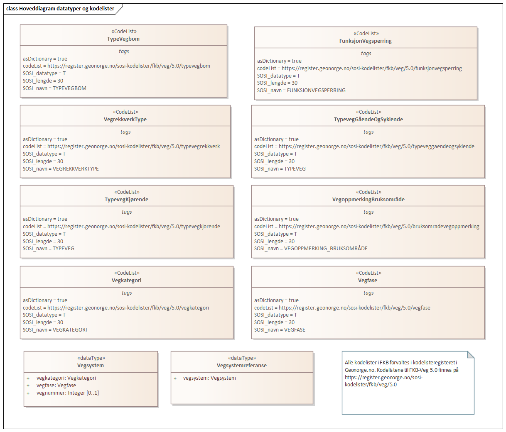
 
'''
 
.Realisering av datatyper fra Vegnett 5.0 
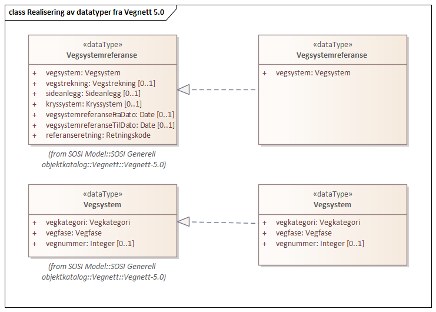
 
'''
 
[[vegsystemreferanse]]
===== «dataType» Vegsystemreferanse
*Definisjon:* sammensatt identifikator for vegsystemreferanse
 
[discrete]
====== Profilparametre i tagged values
[cols="20,80"]
|===
|SOSI_navn
|VEGSYSTEMREFERANSE
 
|===
[discrete]
====== Egenskaper
[cols="20,80"]
|===
|*Navn:* 
|*vegsystem*
 
|Definisjon: 
|hvilke deler av vegnettet som forvaltningsmessig hører sammen
 
|Multiplisitet: 
|[1..1]
 
|Type: 
|<<vegsystem,«dataType» Vegsystem>>
|Profilparametre i tagged values: 
|
SOSI_navn: VEGSYSTEM + 
|===
[discrete]
====== Arv og realiseringer
[cols="20,80"]
|===
|Realisering av: 
|«applicationSchema» Vegnett-5.0::«dataType» Vegsystemreferanse +
|===
 
'''
 
[[vegsystem]]
===== «dataType» Vegsystem
*Definisjon:* Definerer hvilke deler av vegnettet som forvaltningsmessig hører sammen.
 
[discrete]
====== Profilparametre i tagged values
[cols="20,80"]
|===
|SOSI_navn
|VEGSYSTEM
 
|===
[discrete]
====== Egenskaper
[cols="20,80"]
|===
|*Navn:* 
|*vegkategori*
 
|Definisjon: 
|Kategorisering som angir på hvilket nivå vegmyndigheten for strekningen ligger.
 
|Multiplisitet: 
|[1..1]
 
|Type: 
|<<vegkategori,«CodeList» Vegkategori>>
|Profilparametre i tagged values: 
|
SOSI_datatype: T + 
SOSI_lengde: 50 + 
SOSI_navn: VEGKATEGORI + 
|===
[cols="20,80"]
|===
|*Navn:* 
|*vegfase*
 
|Definisjon: 
|Angir vegens fase i livet.
 
|Multiplisitet: 
|[1..1]
 
|Type: 
|<<vegfase,«CodeList» Vegfase>>
|Profilparametre i tagged values: 
|
SOSI_datatype: T + 
SOSI_lengde: 20 + 
SOSI_navn: VEGFASE + 
|===
[cols="20,80"]
|===
|*Navn:* 
|*vegnummer*
 
|Definisjon: 
|Angir hvilke deler av vegnettet som rutemessig hører sammen.
 
|Multiplisitet: 
|[0..1]
 
|Type: 
|<<integer,«dataType» Integer>>
|Profilparametre i tagged values: 
|
SOSI_datatype: H + 
SOSI_lengde: 5 + 
SOSI_navn: VEGNUMMER + 
|===
[discrete]
====== Arv og realiseringer
[cols="20,80"]
|===
|Realisering av: 
|«applicationSchema» Vegnett-5.0::«dataType» Vegsystem +
|===
 
'''
 
[[vegkategori]]
===== «CodeList» Vegkategori
*Definisjon:* angivelse av vegens kategori/eierskap
 
[discrete]
====== Profilparametre i tagged values
[cols="20,80"]
|===
|asDictionary
|true
 
|codeList
|https://register.geonorge.no/sosi-kodelister/fkb/veg/5.0/vegkategori
 
|SOSI_datatype
|T
 
|SOSI_lengde
|30
 
|SOSI_navn
|VEGKATEGORI
 
|===
 
'''
 
[[vegfase]]
===== «CodeList» Vegfase
*Definisjon:* angivelse av vegens "fase i livet"
 
[discrete]
====== Profilparametre i tagged values
[cols="20,80"]
|===
|asDictionary
|true
 
|codeList
|https://register.geonorge.no/sosi-kodelister/fkb/veg/5.0/vegfase
 
|SOSI_datatype
|T
 
|SOSI_lengde
|30
 
|SOSI_navn
|VEGFASE
 
|===
 
'''
 
[[funksjonvegsperring]]
===== «CodeList» FunksjonVegsperring
*Definisjon:* Angir funksjon for vegbom
 
[discrete]
====== Profilparametre i tagged values
[cols="20,80"]
|===
|asDictionary
|true
 
|codeList
|https://register.geonorge.no/sosi-kodelister/fkb/veg/5.0/funksjonvegsperring
 
|SOSI_datatype
|T
 
|SOSI_lengde
|30
 
|SOSI_navn
|FUNKSJONVEGSPERRING
 
|===
 
'''
 
[[typevegbom]]
===== «CodeList» TypeVegbom
*Definisjon:* angivelse av type vegbom
 
[discrete]
====== Profilparametre i tagged values
[cols="20,80"]
|===
|asDictionary
|true
 
|codeList
|https://register.geonorge.no/sosi-kodelister/fkb/veg/5.0/typevegbom
 
|SOSI_datatype
|T
 
|SOSI_lengde
|30
 
|SOSI_navn
|TYPEVEGBOM
 
|===
 
'''
 
[[typeveggåendeogsyklende]]
===== «CodeList» TypevegGåendeOgSyklende
*Definisjon:* typeveger som brukes for veger for gående og syklende
 
[discrete]
====== Profilparametre i tagged values
[cols="20,80"]
|===
|asDictionary
|true
 
|codeList
|https://register.geonorge.no/sosi-kodelister/fkb/veg/5.0/typeveggaendeogsyklende
 
|SOSI_datatype
|T
 
|SOSI_lengde
|30
 
|SOSI_navn
|TYPEVEG
 
|===
 
'''
 
[[typevegkjørende]]
===== «CodeList» TypevegKjørende
*Definisjon:* typeveger som brukes for veger for kjørende
 
[discrete]
====== Profilparametre i tagged values
[cols="20,80"]
|===
|asDictionary
|true
 
|codeList
|https://register.geonorge.no/sosi-kodelister/fkb/veg/5.0/typevegkjorende
 
|SOSI_datatype
|T
 
|SOSI_lengde
|30
 
|SOSI_navn
|TYPEVEG
 
|===
 
'''
 
[[bruksområdevegoppmerking]]
===== «CodeList» BruksområdeVegoppmerking
*Definisjon:* angir bruksområde for vegoppmerking
 
[discrete]
====== Profilparametre i tagged values
[cols="20,80"]
|===
|asDictionary
|true
 
|codeList
|https://register.geonorge.no/sosi-kodelister/fkb/veg/5.0/bruksomradevegoppmerking
 
|SOSI_datatype
|T
 
|SOSI_lengde
|30
 
|SOSI_navn
|BRUKSOMRÅDEVEGOPPMERKING
 
|===
 
'''
 
[[typevegrekkverk]]
===== «CodeList» TypeVegrekkverk
*Definisjon:* angivelse av ulike typer rekkverk
 
[discrete]
====== Profilparametre i tagged values
[cols="20,80"]
|===
|asDictionary
|true
 
|codeList
|https://register.geonorge.no/sosi-kodelister/fkb/veg/5.0/typevegrekkverk
 
|SOSI_datatype
|T
 
|SOSI_lengde
|30
 
|SOSI_navn
|TYPEVEGREKKVERK
 
|===
// End of UML-model
