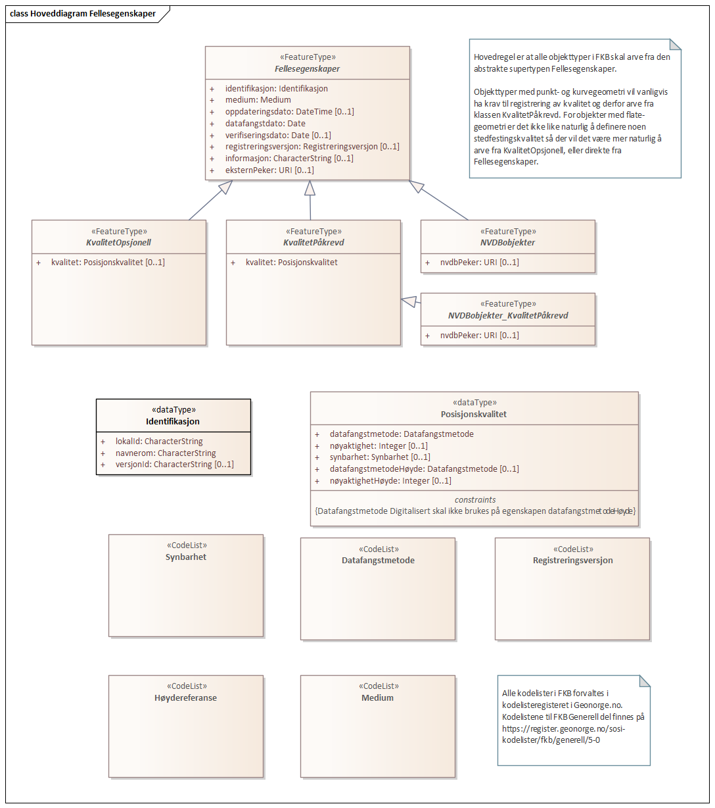
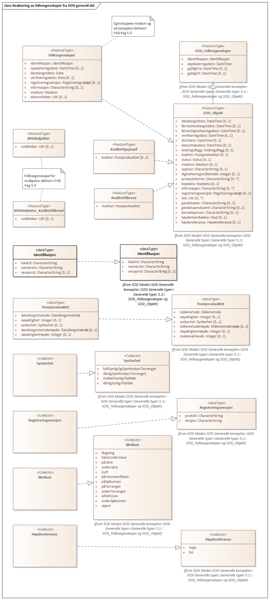
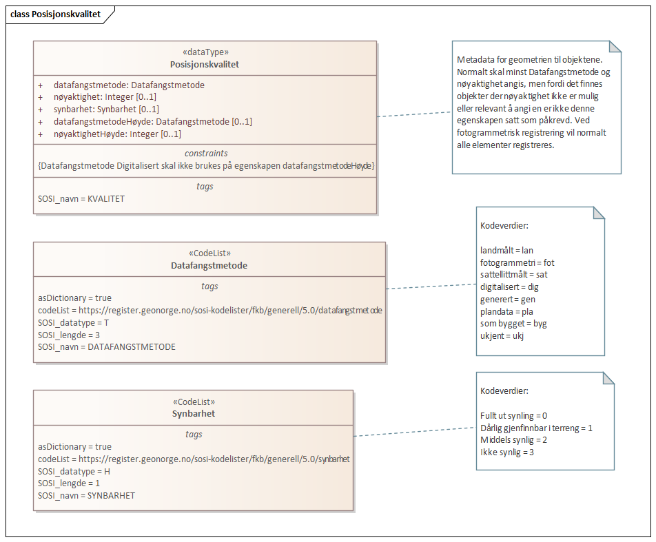

=== Pakke «ApplicationSchema» FKB-Veg-5.0Utkast
*Definisjon:* Datamodell for produktspesfikasjonen FKB-Veg. FKB-Veg inneholder detaljert informasjon om veganlegg og tilh&#248;rende objekter. Datamodellen omfatter beskrivelse av alle typer veger for kj&#248;rende, syklende og g&#229;ende, i tillegg et utvalg av tilh&#248;rende objekter. 
 
===== Profilparametre i tagged values
[cols="20,80"]
|===
|definition
|"Data model for FKB-Veg"@en
 
|description
|"Contains road surface and contour lines describing the road and objects connected to the road" @en
 
|designation
|"Product specification FKB-Veg 5.0"@en
 
|language
|no
 
|SOSI_kortnavn
|FKB-Veg
 
|SOSI_langnavn
|FKB Veg
 
|SOSI_modellstatus
|utkastOgSkjult
 
|SOSI_spesifikasjonstype
|produktspesifikasjon
 
|SOSI_versjon
|5.0
 
|targetNamespace
|http://skjema.geonorge.no/SOSI/produktspesifikasjon/FKB-Veg/5.0/
 
|version
|5.0
 
|xmlns
|app
 
|===
[caption="Figur 1: ",title=Pakkerealisering]
image::diagrammer/Pakkerealisering.png[Pakkerealisering]
[caption="Figur 2: ",title=Oversiktsdiagram FKB-Veg 5.0]
image::diagrammer/Oversiktsdiagram FKB-Veg 5.0.png[Oversiktsdiagram FKB-Veg 5.0]
[caption="Figur 3: ",title=Realisering av objekttyper]
image::diagrammer/Realisering av objekttyper.png[Realisering av objekttyper]
<<<
|===
|===
=== Pakke: Generelle elementer
*Definisjon:* pakke med elementer som realiserer tilsvarende elementer i FKB Generell del 5.0
[caption="Figur 4: ",title=Hoveddiagram Fellesegenskaper]

[caption="Figur 5: ",title=Arv av fellesegenskaper]
image::diagrammer/Arv av fellesegenskaper.png[Arv av fellesegenskaper]
[caption="Figur 6: ",title=Realisering av fellesegenskaper fra SOSI generell del]

[caption="Figur 7: ",title=Posisjonskvalitet]

 
|===
|===
 
[[fellesegenskaper]]
==== «FeatureType» Fellesegenskaper (abstrakt)
*Definisjon:* abstrakt objekttype som bærer sentrale egenskaper som er anbefalt for bruk i produktspesifikasjoner.

Merknad: Disse egenskapene skal derfor ikke modelleres inn i fagområdemodeller.
 
===== Egenskaper
[cols="20,80"]
|===
|*Navn:* 
|*identifikasjon*
 
|Definisjon: 
|unik identifikasjon av et objekt 

Merknad FKB:
Unik identifikasjon av et objekt, ivaretas av den ansvarlige produsent/forvalter, og som kan benyttes av eksterne applikasjoner som referanse til objektet.
Den unike identifikatoren er unik for kartobjektet og skal ikke endres i kartobjektets levetid. Dette m&#229; ikke forveksles med en tematisk identifikator (for eksempel bygningsnummer) som unikt identifiserer et objekt i virkeligheten. En bygning med samme bygningsnummer vil kunne representeres i mange kartprodukter der det finnes en unik identifikasjon i hver av dem.
For FKB benyttes UUID (Universally unique identifier) som lokalId. Dette inneb&#230;rer at lokalId alene alltid vil v&#230;re unik. Likevel skal alltid navnerom ogs&#229; angis. Navnerom angir FKB-datasettet.
 
|Multiplisitet: 
|[1..1]
 
|Type: 
|<<identifikasjon,«dataType» Identifikasjon>>
|Profilparametre i tagged values: 
|
SOSI_navn: IDENT + 
|===
[cols="20,80"]
|===
|*Navn:* 
|*medium*
 
|Definisjon: 
|objektets beliggenhet i forhold til jordoverflaten
 
|Multiplisitet: 
|[1..1]
 
|Type: 
|<<medium,«CodeList» Medium>>
|Profilparametre i tagged values: 
|
SOSI_navn: MEDIUM + 
|===
[cols="20,80"]
|===
|*Navn:* 
|*oppdateringsdato*
 
|Definisjon: 
|tidspunkt for siste endring p&#229; objektet 

Merknad FKB: 
Denne datoen viser datasystemets siste endring p&#229; dataobjektet. Egenskapen settes av forvaltningssystemet etter f&#248;lgende regler:
i. Oppdateringsdato er tidspunkt for oppdatering av databasen og settes av forvaltningsbasen (ikke
av klienten).
ii. Oppdateringsdato skal endres ogs&#229; hvis det er kopidata som blir endret eller importert i en
”kopibase”.
iii. N&#229;r avgrensingslinjene til en flate endres, skal flateobjektet f&#229; ny oppdateringsdato.
iv. Oppdateringsdato skal endres hvis en egenskap endres.
 
|Multiplisitet: 
|[0..1]
 
|Type: 
|http://skjema.geonorge.no/SOSI/basistype/DateTime[DateTime]
|Profilparametre i tagged values: 
|
SOSI_datatype: DATOTID + 
SOSI_navn: OPPDATERINGSDATO + 
|===
[cols="20,80"]
|===
|*Navn:* 
|*datafangstdato*
 
|Definisjon: 
|dato n&#229;r objektet siste gang ble registrert/observert/m&#229;lt i terrenget
 
|Multiplisitet: 
|[1..1]
 
|Type: 
|http://skjema.geonorge.no/SOSI/basistype/Date[Date]
|Profilparametre i tagged values: 
|
SOSI_datatype: DATO + 
SOSI_navn: DATAFANGSTDATO + 
|===
[cols="20,80"]
|===
|*Navn:* 
|*verifiseringsdato*
 
|Definisjon: 
|dato n&#229;r dataene er fastsl&#229;tt &#229; v&#230;re i samsvar med virkeligheten.

Merknad FKB:
Brukes for eksempel i de sammenhenger hvor det er foretatt fotogrammetrisk ajourhold, og hvor det ikke er registrert endringer p&#229; objektet (det virkelige objektet er i samsvar med dataobjektet)
 
|Multiplisitet: 
|[0..1]
 
|Type: 
|http://skjema.geonorge.no/SOSI/basistype/Date[Date]
|Profilparametre i tagged values: 
|
SOSI_datatype: DATO + 
SOSI_navn: VERIFISERINGSDATO + 
|===
[cols="20,80"]
|===
|*Navn:* 
|*registreringsversjon*
 
|Definisjon: 
|angivelse av hvilken produktspesifikasjon som er utgangspunkt  for dataene
 
|Multiplisitet: 
|[0..1]
 
|Type: 
|<<registreringsversjon,«CodeList» Registreringsversjon>>
|Profilparametre i tagged values: 
|
SOSI_navn: REGISTRERINGSVERSJON + 
|===
[cols="20,80"]
|===
|*Navn:* 
|*informasjon*
 
|Definisjon: 
|generell opplysning.

Merknad FKB:
Mulighet til &#229; legge inn utfyllende informasjon om objektet. Egenskapen b&#248;r bare brukes til &#229; legge inn ekstra informasjon om enkeltobjekter. Egenskapen b&#248;r ikke brukes til &#229; systematisk angi ekstrainformasjon om mange/alle objekter i et datasett.
 
|Multiplisitet: 
|[0..1]
 
|Type: 
|http://skjema.geonorge.no/SOSI/basistype/CharacterString[CharacterString]
|Profilparametre i tagged values: 
|
SOSI_datatype: T + 
SOSI_lengde: 255 + 
SOSI_navn: INFORMASJON + 
|===
[cols="20,80"]
|===
|*Navn:* 
|*eksternPeker*
 
|Definisjon: 
|referanse til objektet i et eksternt system, som ikke er Nasjonal vegdatabank (NVDB).
 
|Multiplisitet: 
|[0..1]
 
|Type: 
|http://skjema.geonorge.no/SOSI/basistype/URI[URI]
|Profilparametre i tagged values: 
|
SOSI_navn: EKSTERNPEKER + 
|===
===== Arv og realiseringer
[cols="20,80"]
|===
|Subtyper:
|<<kvalitetopsjonell,«FeatureType» KvalitetOpsjonell>> +
<<vegkjørende,«FeatureType» VegKjørende>> +
<<kvalitetpåkrevd,«FeatureType» KvalitetPåkrevd>> +
<<veggåendeogsyklende,«FeatureType» VegGåendeOgSyklende>> +
<<nvdbobjekter,«FeatureType» NVDBobjekter>> +
|Realisering av: 
|«ApplicationSchema» Generelle typer 5.1/SOSI_Fellesegenskaper og SOSI_Objekt::«FeatureType» SOSI_Objekt +
|===
 
|===
|===
 
[[kvalitetpåkrevd]]
==== «FeatureType» KvalitetPåkrevd (abstrakt)
*Definisjon:* abstrakt objekttype som b&#230;rer datatype Posisjonskvalitet for bruk p&#229; objekttyper der det er p&#229;krevd.
 
===== Egenskaper
[cols="20,80"]
|===
|*Navn:* 
|*kvalitet*
 
|Definisjon: 
|beskrivelse av kvaliteten på stedfestingen

Merknad: Denne er identisk med ..KVALITET i tidligere versjoner av SOSI.
 
|Multiplisitet: 
|[1..1]
 
|Type: 
|<<posisjonskvalitet,«dataType» Posisjonskvalitet>>
|Profilparametre i tagged values: 
|
SOSI_navn: KVALITET + 
|===
===== Arv og realiseringer
[cols="20,80"]
|===
|Supertype: 
|<<fellesegenskaper,«FeatureType» Fellesegenskaper>>
 
|Subtyper:
|<<kjørebanekant,«FeatureType» Kjørebanekant>> +
<<vegannenavgrensning,«FeatureType» VegAnnenAvgrensning>> +
<<annetvegarealavgrensning,«FeatureType» AnnetVegarealAvgrensning>> +
<<vegdekkekant,«FeatureType» Vegdekkekant>> +
<<nvdbobjekter_kvalitetpåkrevd,«FeatureType» NVDBobjekter_KvalitetPåkrevd>> +
|Realisering av: 
|«ApplicationSchema» Generelle typer 5.1/SOSI_Fellesegenskaper og SOSI_Objekt::«FeatureType» SOSI_Objekt +
|===
 
|===
|===
 
[[kvalitetopsjonell]]
==== «FeatureType» KvalitetOpsjonell (abstrakt)
*Definisjon:* abstrakt objekttype som b&#230;rer datatype Posisjonskvalitet for bruk p&#229; objekttyper der det er opsjonelt.
 
===== Egenskaper
[cols="20,80"]
|===
|*Navn:* 
|*kvalitet*
 
|Definisjon: 
|beskrivelse av kvaliteten på stedfestingen

Merknad: Denne er identisk med ..KVALITET i tidligere versjoner av SOSI.
 
|Multiplisitet: 
|[0..1]
 
|Type: 
|<<posisjonskvalitet,«dataType» Posisjonskvalitet>>
|Profilparametre i tagged values: 
|
SOSI_navn: KVALITET + 
|===
===== Arv og realiseringer
[cols="20,80"]
|===
|Supertype: 
|<<fellesegenskaper,«FeatureType» Fellesegenskaper>>
 
|Subtyper:
|<<vegfiktivgrense,«FeatureType» VegFiktivGrense>> +
|Realisering av: 
|«ApplicationSchema» Generelle typer 5.1/SOSI_Fellesegenskaper og SOSI_Objekt::«FeatureType» SOSI_Objekt +
|===
 
|===
|===
 
[[nvdbobjekter]]
==== «FeatureType» NVDBobjekter (abstrakt)
*Definisjon:* abstrakt objekttype som arves fra for flateobjekter som har kobling til NVDB.
 
===== Egenskaper
[cols="20,80"]
|===
|*Navn:* 
|*nvdbPeker*
 
|Definisjon: 
|peker til objekt i NVDB
 
|Multiplisitet: 
|[0..1]
 
|Type: 
|http://skjema.geonorge.no/SOSI/basistype/URI[URI]
|Profilparametre i tagged values: 
|
SOSI_navn: NVDBPEKER + 
|===
===== Arv og realiseringer
[cols="20,80"]
|===
|Supertype: 
|<<fellesegenskaper,«FeatureType» Fellesegenskaper>>
 
|Subtyper:
|<<trafikkøy,«FeatureType» Trafikkøy>> +
<<parkeringsområde,«FeatureType» Parkeringsområde>> +
|===
 
|===
|===
 
[[nvdbobjekter_kvalitetpåkrevd]]
==== «FeatureType» NVDBobjekter_KvalitetPåkrevd (abstrakt)
*Definisjon:* abstrakt objekttype som arves fra for objekter med kvalitet p&#229;krevd som har kobling til NVDB
 
===== Egenskaper
[cols="20,80"]
|===
|*Navn:* 
|*nvdbPeker*
 
|Definisjon: 
|peker til objekt i NVDB
 
|Multiplisitet: 
|[0..1]
 
|Type: 
|http://skjema.geonorge.no/SOSI/basistype/URI[URI]
|Profilparametre i tagged values: 
|
SOSI_navn: NVDBPEKER + 
|===
===== Arv og realiseringer
[cols="20,80"]
|===
|Supertype: 
|<<kvalitetpåkrevd,«FeatureType» KvalitetPåkrevd>>
 
|Subtyper:
|<<vegoppmerking,«FeatureType» Vegoppmerking>> +
<<fartsdemperavgrensning,«FeatureType» FartsdemperAvgrensning>> +
<<vegrekkverk,«FeatureType» Vegrekkverk>> +
<<gangfeltavgrensning,«FeatureType» GangfeltAvgrensning>> +
<<vegskulderkant,«FeatureType» Vegskulderkant>> +
<<trafikksignalpunkt,«FeatureType» Trafikksignalpunkt>> +
<<feristavgrensning,«FeatureType» FeristAvgrensning>> +
<<skiltportal,«FeatureType» Skiltportal>> +
<<vegbom,«FeatureType» Vegbom>> +
<<overkjørbartarealavgrensning,«FeatureType» OverkjørbartArealAvgrensning>> +
|===
 
|===
|===
 
[[identifikasjon]]
==== «dataType» Identifikasjon
*Definisjon:* Unik identifikasjon av et objekt i et datasett, forvaltet av den ansvarlige produsent/forvalter, og kan benyttes av eksterne applikasjoner som stabil referanse til objektet. 

Merknad 1: Denne objektidentifikasjonen må ikke forveksles med en tematisk objektidentifikasjon, slik som f.eks bygningsnummer. 

Merknad 2: Denne unike identifikatoren vil ikke endres i løpet av objektets levetid, og ikke gjenbrukes i andre objekt. 
 
===== Profilparametre i tagged values
[cols="20,80"]
|===
|SOSI_navn
|IDENT
 
|===
===== Egenskaper
[cols="20,80"]
|===
|*Navn:* 
|*lokalId*
 
|Definisjon: 
|lokal identifikator av et objekt

Merknad: Det er dataleverend&#248;rens ansvar &#229; s&#248;rge for at den lokale identifikatoren er unik innenfor navnerommet. For FKB-data benyttes UUID som lokalId.
 
|Multiplisitet: 
|[1..1]
 
|Type: 
|http://skjema.geonorge.no/SOSI/basistype/CharacterString[CharacterString]
|Profilparametre i tagged values: 
|
SOSI_datatype: T + 
SOSI_lengde: 100 + 
SOSI_navn: LOKALID + 
|===
[cols="20,80"]
|===
|*Navn:* 
|*navnerom*
 
|Definisjon: 
|navnerom som unikt identifiserer datakilden til et objekt, anbefales å være en http-URI

Eksempel: http://data.geonorge.no/SentraltStedsnavnsregister/1.0

Merknad : Verdien for nanverom vil eies av den dataprodusent som har ansvar for de unike identifikatorene og må være registrert i data.geonorge.no eller data.norge.no
 
|Multiplisitet: 
|[1..1]
 
|Type: 
|http://skjema.geonorge.no/SOSI/basistype/CharacterString[CharacterString]
|Profilparametre i tagged values: 
|
SOSI_datatype: T + 
SOSI_lengde: 100 + 
SOSI_navn: NAVNEROM + 
|===
[cols="20,80"]
|===
|*Navn:* 
|*versjonId*
 
|Definisjon: 
|identifikasjon av en spesiell versjon av et geografisk objekt (instans)
 
|Multiplisitet: 
|[0..1]
 
|Type: 
|http://skjema.geonorge.no/SOSI/basistype/CharacterString[CharacterString]
|Profilparametre i tagged values: 
|
SOSI_datatype: T + 
SOSI_lengde: 100 + 
SOSI_navn: VERSJONID + 
|===
===== Arv og realiseringer
[cols="20,80"]
|===
|Realisering av: 
|«ApplicationSchema» Generelle typer 5.1/SOSI_Fellesegenskaper og SOSI_Objekt::«dataType» Identifikasjon +
|===
 
|===
|===
 
[[posisjonskvalitet]]
==== «dataType» Posisjonskvalitet
*Definisjon:* beskrivelse av kvaliteten p&#229; stedfestingen.

Merknad:
Posisjonskvalitet er ikke konform med  kvalitetsmodellen i ISO slik den er defineret i ISO19157:2013, men er en videref&#248;ring av tildligere brukte kvalitetsegenskaper i SOSI. FKB 5.0 innf&#248;rer en egen variant av datatypen Posisjonskvalitet der kodeliste m&#229;lemetode er byttet ut med den mer generelle kodelista Datafangstmetode. 
 
===== Profilparametre i tagged values
[cols="20,80"]
|===
|SOSI_navn
|KVALITET
 
|===
===== Egenskaper
[cols="20,80"]
|===
|*Navn:* 
|*datafangstmetode*
 
|Definisjon: 
|metode for datafangst. 
Egenskapen beskriver datafangstmetode for grunnrisskoordinater (x,y), eller for b&#229;de grunnriss og h&#248;yde (x,y,z) dersom det ikke er oppgitt noen verdi for datafangstmetodeH&#248;yde.
 
|Multiplisitet: 
|[1..1]
 
|Type: 
|<<datafangstmetode,«CodeList» Datafangstmetode>>
|Profilparametre i tagged values: 
|
SOSI_lengde: 3 + 
SOSI_navn: DATAFANGSTMETODE + 
|===
[cols="20,80"]
|===
|*Navn:* 
|*nøyaktighet*
 
|Definisjon: 
|standardavviket til posisjoneringa av objektet oppgitt i cm
I de aller fleste sammenhenger benyttes en ansl&#229;tt eller forventet verdi for standardavvik, men dersom man har en beregnet verdi skal denne benyttes. 
For objekter med punktgeometri benyttes verdi for punktstandardavvik. For objekter med kurvegeometri benyttes standardavviket for tverravviket fra kurva. For objekter med overflate- eller volumgeometri er forst&#229;elsen at standardavviket beregnes ut fra (3D) avvikene mellom sann posisjon og n&#230;rmeste punkt p&#229; overflata. 
Merknad:
Verdien er ment &#229; beskrive n&#248;yaktigheten til objektet sammenlignet med sann verdi. Standardavvik er i utgangspunktet et m&#229;l p&#229; det tilfeldige avviket og det inneb&#230;rer at vi forutsetter at det systematiske avviket i liten grad p&#229;virker n&#248;yaktigheten til posisjoneringa. For fotogrammetriske data settes som hovedregel verdien lik kravet til standardavvik ved datafangst. Se standarden Geodatakvalitet for n&#230;rmere definisjon av standardavvik og hvordan dette defineres, beregnes og kontrolleres.
 
|Multiplisitet: 
|[0..1]
 
|Type: 
|http://skjema.geonorge.no/SOSI/basistype/Integer[Integer]
|Profilparametre i tagged values: 
|
SOSI_lengde: 6 + 
SOSI_navn: NØYAKTIGHET + 
|===
[cols="20,80"]
|===
|*Navn:* 
|*synbarhet*
 
|Definisjon: 
|beskrivelse av hvor godt objektene framg&#229;r i datagrunnlaget for posisjonering (f.eks. flybildene).
 
|Multiplisitet: 
|[0..1]
 
|Type: 
|<<synbarhet,«CodeList» Synbarhet>>
|Profilparametre i tagged values: 
|
SOSI_lengde: 1 + 
SOSI_navn: SYNBARHET + 
|===
[cols="20,80"]
|===
|*Navn:* 
|*datafangstmetodeHøyde*
 
|Definisjon: 
|metoden brukt for h&#248;yderegistrering av posisjon.

Det er bare n&#248;dvending &#229; angi en verdi for egenskapen dersom datafangstmetode for h&#248;yde avviker fra datafangstmetode for grunnriss.

 
|Multiplisitet: 
|[0..1]
 
|Type: 
|<<datafangstmetode,«CodeList» Datafangstmetode>>
|Profilparametre i tagged values: 
|
SOSI_lengde: 3 + 
SOSI_navn: DATAFANGSTMETODEHØYDE + 
|===
[cols="20,80"]
|===
|*Navn:* 
|*nøyaktighetHøyde*
 
|Definisjon: 
|standardavviket til posisjoneringa av objektet oppgitt i cm
I de aller fleste sammenhenger benyttes en ansl&#229;tt eller forventet verdi for standardavviket, men dersom man faktisk har standardavviket til posisjoneringa av objektet oppgitt i cm
I de aller fleste sammenhenger benyttes en ansl&#229;tt eller forventet verdi for standardavvik, men dersom man har en beregnet verdi skal denne benyttes. 
Merknad:
Verdien er ment &#229; beskrive n&#248;yaktigheten til objektet sammenlignet med sann verdi. Standardavvik er i utgangspunktet et m&#229;l p&#229; det tilfeldige avviket og det inneb&#230;rer at vi forutsetter at det systematiske avviket i liten grad p&#229;virker n&#248;yaktigheten til posisjoneringa. For fotogrammetriske data settes som hovedregel verdien lik kravet til standardavvik ved datafangst. Se standarden Geodatakvalitet for n&#230;rmere definisjon av standardavvik og hvordan dette defineres, beregnes og kontrolleres.
 
|Multiplisitet: 
|[0..1]
 
|Type: 
|http://skjema.geonorge.no/SOSI/basistype/Integer[Integer]
|Profilparametre i tagged values: 
|
SOSI_lengde: 6 + 
SOSI_navn: H-NØYAKTIGHET + 
|===
===== Restriksjoner
[cols="20,80"]
|===
|*Navn:* 
|*Datafangstmetode Digitalisert skal ikke brukes på egenskapen datafangstmetodeHøyde*
 
|Beskrivelse: 
|inv: self.datafangstmetodeH&#248;yde &lt;&gt; 'dig'
 
|===
===== Arv og realiseringer
[cols="20,80"]
|===
|Realisering av: 
|«ApplicationSchema» Generelle typer 5.1/SOSI_Fellesegenskaper og SOSI_Objekt::«dataType» Posisjonskvalitet +
|===
 
|===
|===
 
[[synbarhet]]
==== «CodeList» Synbarhet
*Definisjon:* synbarhet beskriver hvor godt objektene framg&#229;r i datagrunnlaget for posisjonering (f.eks. flybildene).
 
===== Profilparametre i tagged values
[cols="20,80"]
|===
|asDictionary
|true
 
|codeList
|https://register.geonorge.no/sosi-kodelister/fkb/generell/5-0/synbarhet
 
|SOSI_datatype
|H
 
|SOSI_lengde
|1
 
|SOSI_navn
|SYNBARHET
 
|===
Koder fra ekstern kodeliste kan hentes fra register: https://register.geonorge.no/sosi-kodelister/fkb/generell/5-0/synbarhet
 
 
|===
|===
 
[[datafangstmetode]]
==== «CodeList» Datafangstmetode
*Definisjon:* metode for datafangst. 

Datafangstmetoden beskriver hvordan selve vektordataene er posisjonert fra et datagrunnlag (observasjoner med landm&#229;lingsutstyr, fotogrammetrisk stereomodell, digital terrengmodell etc.) og ikke prosessen med &#229; innhente det bakenforliggende datagrunnlaget.
 
===== Profilparametre i tagged values
[cols="20,80"]
|===
|asDictionary
|true
 
|codeList
|https://register.geonorge.no/sosi-kodelister/fkb/generell/5-0/datafangstmetode
 
|SOSI_datatype
|T
 
|SOSI_lengde
|3
 
|SOSI_navn
|DATAFANGSTMETODE
 
|===
Koder fra ekstern kodeliste kan hentes fra register: https://register.geonorge.no/sosi-kodelister/fkb/generell/5-0/datafangstmetode
 
 
|===
|===
 
[[registreringsversjon]]
==== «CodeList» Registreringsversjon
*Definisjon:* FKB-verjson som ligger til grunn for registrering. Mest relevant for data som er fotogrammetrisk registrert.
 
===== Profilparametre i tagged values
[cols="20,80"]
|===
|asDictionary
|true
 
|codeList
|https://register.geonorge.no/sosi-kodelister/fkb/generell/5-0/registreringsversjon
 
|SOSI_datatype
|T
 
|SOSI_lengde
|10
 
|SOSI_navn
|REGISTRERINGSVERSJON
 
|===
Koder fra ekstern kodeliste kan hentes fra register: https://register.geonorge.no/sosi-kodelister/fkb/generell/5-0/registreringsversjon
 
 
|===
|===
 
[[høydereferanse]]
==== «CodeList» Høydereferanse
*Definisjon:* koordinatregistering utf&#248;rt p&#229; topp eller bunn av et objekt
 
===== Profilparametre i tagged values
[cols="20,80"]
|===
|asDictionary
|true
 
|codeList
|https://register.geonorge.no/sosi-kodelister/fkb/generell/5-0/hoydereferanse
 
|SOSI_datatype
|T
 
|SOSI_lengde
|6
 
|SOSI_navn
|HREF
 
|===
Koder fra ekstern kodeliste kan hentes fra register: https://register.geonorge.no/sosi-kodelister/fkb/generell/5-0/hoydereferanse
 
 
|===
|===
 
[[medium]]
==== «CodeList» Medium
*Definisjon:* objektets beliggenhet i forhold til jordoverflaten

Eksempel:
Veg p&#229; bro, i tunnel, inne i et bygningsmessig anlegg, etc.
 
===== Profilparametre i tagged values
[cols="20,80"]
|===
|asDictionary
|true
 
|codeList
|https://register.geonorge.no/sosi-kodelister/fkb/generell/5-0/medium
 
|SOSI_datatype
|T
 
|SOSI_lengde
|1
 
|SOSI_navn
|MEDIUM
 
|===
Koder fra ekstern kodeliste kan hentes fra register: https://register.geonorge.no/sosi-kodelister/fkb/generell/5-0/medium
 
<<<
|===
|===
=== Pakke: Flateobjekter
*Definisjon:* Pakke som inneholder de fire flateobjektene benyttet i FKB-Veg 5.0
[caption="Figur 8: ",title=Hoveddiagram - Flateobjekter]
image::diagrammer/Hoveddiagram - Flateobjekter.png[Hoveddiagram - Flateobjekter]
 
|===
|===
 
[[parkeringsområde]]
==== «FeatureType» Parkeringsområde
*Definisjon:* Omr&#229;de for parkering av kj&#248;ret&#248;y.
 
===== Profilparametre i tagged values
[cols="20,80"]
|===
|SOSI_geometri
|PUNKT;FLATE;
 
|===
[caption="Figur 9: ",title=Illustrasjon av objekttype Parkeringsområde]
image::http://skjema.geonorge.no/SOSI/produktspesifikasjon/FKB-Veg/5.0/figurer/objtype_parkeringsomr%c3%a5de.png[http://skjema.geonorge.no/SOSI/produktspesifikasjon/FKB-Veg/5.0/figurer/objtype_parkeringsomr%c3%a5de.png]
===== Egenskaper
[cols="20,80"]
|===
|*Navn:* 
|*område*
 
|Definisjon: 
|objektets utstrekning
 
|Multiplisitet: 
|[1..1]
 
|Type: 
|<<flate,Flate>>
|Profilparametre i tagged values: 
|
SOSI_navn: Flate + 
|===
[cols="20,80"]
|===
|*Navn:* 
|*posisjon*
 
|Definisjon: 
|sted som objektet eksisterer på
 
|Multiplisitet: 
|[0..1]
 
|Type: 
|<<punkt,Punkt>>
|Profilparametre i tagged values: 
|
SOSI_navn: Punkt + 
|===
===== Roller
[cols="20,80"]
|===
|*Rollenavn:* 
|*avgrensesAvVegdekkekant*
 
|Definisjon:
|Krav til delt flategeometri. Avgrensning av Parkeringsområde ved hjelp av Vegdekkekant.
 
|Multiplisitet: 
|[0..*]
 
|Til klasse
|<<vegdekkekant,«FeatureType» Vegdekkekant>>
|===
[cols="20,80"]
|===
|*Rollenavn:* 
|*avgrensesAvVegFiktivGrense*
 
|Definisjon:
|Krav til delt flategeometri. Avgrensning av Parkeringsområde ved hjelp av VegFiktivGrense.
 
|Multiplisitet: 
|[0..*]
 
|Til klasse
|<<vegfiktivgrense,«FeatureType» VegFiktivGrense>>
|===
[cols="20,80"]
|===
|*Rollenavn:* 
|*avgrensesAvVegAnnenAvgrensning*
 
|Definisjon:
|Krav til delt flategeometri. Avgrensning av Parkeringsområde ved hjelp av VegAnnenAvgrensning.
 
|Multiplisitet: 
|[0..*]
 
|Til klasse
|<<vegannenavgrensning,«FeatureType» VegAnnenAvgrensning>>
|===
===== Restriksjoner
[cols="20,80"]
|===
|*Navn:* 
|*Dersom det finnes posisjon-geometri skal dette punktet ligge innenfor område-geometrien*
 
|Beskrivelse: 
|--ingen OCL, restriksjonen implementeres manuelt
 
|===
[cols="20,80"]
|===
|*Navn:* 
|*Område-geometrien skal være lik summen av geometriene til de assosierte avgrensningsobjektene*
 
|Beskrivelse: 
|--ingen OCL, restriksjonen implementeres manuelt
 
|===
===== Arv og realiseringer
[cols="20,80"]
|===
|Supertype: 
|<<nvdbobjekter,«FeatureType» NVDBobjekter>>
 
|Realisering av: 
|«ApplicationSchema» Vegsituasjon-4.5::«featureType» Parkeringsområde +
|===
 
|===
|===
 
[[trafikkøy]]
==== «FeatureType» Trafikkøy
*Definisjon:* Omr&#229;de som er begrenset av kj&#248;refelt p&#229; alle sider og som normalt ikke skal benyttes av kj&#248;ret&#248;y.
 
===== Profilparametre i tagged values
[cols="20,80"]
|===
|SOSI_geometri
|PUNKT;FLATE;
 
|===
[caption="Figur 10: ",title=Illustrasjon av objekttype Trafikkøy]
image::http://skjema.geonorge.no/SOSI/produktspesifikasjon/FKB-Veg/5.0/figurer/objtype_trafikkoy.png[http://skjema.geonorge.no/SOSI/produktspesifikasjon/FKB-Veg/5.0/figurer/objtype_trafikkoy.png]
===== Egenskaper
[cols="20,80"]
|===
|*Navn:* 
|*område*
 
|Definisjon: 
|objektets utstrekning
 
|Multiplisitet: 
|[1..1]
 
|Type: 
|<<flate,Flate>>
|===
[cols="20,80"]
|===
|*Navn:* 
|*posisjon*
 
|Definisjon: 
|sted som objektet eksisterer på
 
|Multiplisitet: 
|[0..1]
 
|Type: 
|<<punkt,Punkt>>
|===
===== Roller
[cols="20,80"]
|===
|*Rollenavn:* 
|*avgrensesAvVegdekkekant*
 
|Definisjon:
|Krav til delt flategeometri. Avgrensning av Trafikkøy ved hjelp av Vegdekkekant.
 
|Multiplisitet: 
|[0..*]
 
|Til klasse
|<<vegdekkekant,«FeatureType» Vegdekkekant>>
|===
[cols="20,80"]
|===
|*Rollenavn:* 
|*avgrensesAvVegFiktivGrense*
 
|Definisjon:
|Krav til delt flategeometri. Avgrensning av trafikkøy ved hjelp av VegFiktivGrense.
 
|Multiplisitet: 
|[0..*]
 
|Til klasse
|<<vegfiktivgrense,«FeatureType» VegFiktivGrense>>
|===
===== Restriksjoner
[cols="20,80"]
|===
|*Navn:* 
|*Dersom det finnes posisjon-geometri skal dette punktet ligge innenfor område-geometrien*
 
|Beskrivelse: 
|--ingen OCL, restriksjonen implementeres manuelt
 
|===
[cols="20,80"]
|===
|*Navn:* 
|*Område-geometrien skal være lik summen av geometriene til de assosierte avgrensningsobjektene*
 
|Beskrivelse: 
|--ingen OCL, restriksjonen implementeres manuelt
 
|===
===== Arv og realiseringer
[cols="20,80"]
|===
|Supertype: 
|<<nvdbobjekter,«FeatureType» NVDBobjekter>>
 
|Realisering av: 
|«ApplicationSchema» Vegsituasjon-4.5::«featureType» Trafikkøy +
|===
 
|===
|===
 
[[veggåendeogsyklende]]
==== «FeatureType» VegGåendeOgSyklende
*Definisjon:* Ferdselsomr&#229;de for g&#229;ende og syklende. Her inng&#229;r fortau, gangveg, gang- og sykkelveg, sykkelveg, trapp og g&#229;gate.
 
===== Profilparametre i tagged values
[cols="20,80"]
|===
|SOSI_geometri
|PUNKT;FLATE;
 
|===
[caption="Figur 11: ",title=Illustrasjon av objekttype VegGåendeOgSyklende]
image::http://skjema.geonorge.no/SOSI/produktspesifikasjon/FKB-Veg/5.0/figurer/objtype_veggaendeogsyklende.png[http://skjema.geonorge.no/SOSI/produktspesifikasjon/FKB-Veg/5.0/figurer/objtype_veggaendeogsyklende.png]
===== Egenskaper
[cols="20,80"]
|===
|*Navn:* 
|*område*
 
|Definisjon: 
|objektets utstrekning
 
|Multiplisitet: 
|[1..1]
 
|Type: 
|<<flate,Flate>>
|Profilparametre i tagged values: 
|
SOSI_navn: Flate + 
|===
[cols="20,80"]
|===
|*Navn:* 
|*typeveg*
 
|Definisjon: 
|Typeveg er den sentrale egenskapen for &#229; vise hvilken hva slags ferdsel som kan skje p&#229; veglenka.
 
|Multiplisitet: 
|[1..1]
 
|Type: 
|<<typeveggåendeogsyklende,«CodeList» TypevegGåendeOgSyklende>>
|Profilparametre i tagged values: 
|
SOSI_navn: TYPEVEG + 
|===
[cols="20,80"]
|===
|*Navn:* 
|*vegsystemreferanse*
 
|Definisjon: 
|sammensatt identifikator for vegsystemreferanse
 
|Multiplisitet: 
|[0..1]
 
|Type: 
|<<vegsystemreferanse,«dataType» Vegsystemreferanse>>
|Profilparametre i tagged values: 
|
SOSI_navn: VEGSYSTEMREFERANSE + 
|===
[cols="20,80"]
|===
|*Navn:* 
|*posisjon*
 
|Definisjon: 
|sted som objektet eksisterer p&#229;, representert som punkt
 
|Multiplisitet: 
|[0..1]
 
|Type: 
|http://skjema.geonorge.no/SOSI/basistype/Punkt[Punkt]
|===
[cols="20,80"]
|===
|*Navn:* 
|*vegOverVeg*
 
|Definisjon: 
|angivelse av om vegen ligger øverst av flere andre veger

Merknad:                             
egenskapen vegOverVeg benyttes der man har flere veger over hverandre (store trafikkmaskiner som Sinsen-krysset). Verdi JA benyttes for vegen som ligger øverst. Denne egenskapen benyttes for å styre hvilke flater som skal tegnes øverst (prioritet).  Ikke påkrevd å benytte ved en veg over annen veg, da styrer MEDIUM-mekanismen også uttegningen.
 
|Multiplisitet: 
|[0..1]
 
|Type: 
|<<boolean,Boolean>>
|Profilparametre i tagged values: 
|
SOSI_datatype: BOOLSK + 
SOSI_navn: VEGOVERVEG + 
|===
===== Roller
[cols="20,80"]
|===
|*Rollenavn:* 
|*avgrensesAvVegFiktivGrense*
 
|Definisjon:
|Krav til delt flategeometri. Avgrensning av VegGåendeOgSyklende ved hjelp av VegFiktivGrense.
 
|Multiplisitet: 
|[0..*]
 
|Til klasse
|<<vegfiktivgrense,«FeatureType» VegFiktivGrense>>
|===
[cols="20,80"]
|===
|*Rollenavn:* 
|*avgrensesAvVegAnnenAvgrensning*
 
|Definisjon:
|Krav til delt flategeometri. Avgrensning av VegGåendeOgSyklende ved hjelp av VegAnnenAvgrensning.
 
|Multiplisitet: 
|[0..*]
 
|Til klasse
|<<vegannenavgrensning,«FeatureType» VegAnnenAvgrensning>>
|===
[cols="20,80"]
|===
|*Rollenavn:* 
|*avgrensesAvVegdekkekant*
 
|Definisjon:
|Krav til delt flategeometri. Avgrensning av VegGåendeOgSyklende ved hjelp av Vegdekkekant.
 
|Multiplisitet: 
|[0..*]
 
|Til klasse
|<<vegdekkekant,«FeatureType» Vegdekkekant>>
|===
===== Restriksjoner
[cols="20,80"]
|===
|*Navn:* 
|*Dersom det finnes posisjon-geometri skal dette punktet ligge innenfor område-geometrien*
 
|Beskrivelse: 
|--ingen OCL, restriksjonen implementeres manuelt
 
|===
[cols="20,80"]
|===
|*Navn:* 
|*Område-geometrien skal være lik summen av geometriene til de assosierte avgrensningsobjektene*
 
|Beskrivelse: 
|--ingen OCL, restriksjonen implementeres manuelt
 
|===
===== Arv og realiseringer
[cols="20,80"]
|===
|Supertype: 
|<<fellesegenskaper,«FeatureType» Fellesegenskaper>>
 
|===
 
|===
|===
 
[[vegkjørende]]
==== «FeatureType» VegKjørende
*Definisjon:* Fredselsomr&#229;de for motorisert trafikk. Her inng&#229;r gatetun, enkel bilveg, kanalisert bilveg, rundekj&#248;ring og rampe.
 
===== Profilparametre i tagged values
[cols="20,80"]
|===
|SOSI_geometri
|PUNKT;FLATE;
 
|===
[caption="Figur 12: ",title=Illustrasjon av objekttype VegKjørende]
image::http://skjema.geonorge.no/SOSI/produktspesifikasjon/FKB-Veg/5.0/figurer/objtype_vegkjorende.png[http://skjema.geonorge.no/SOSI/produktspesifikasjon/FKB-Veg/5.0/figurer/objtype_vegkjorende.png]
===== Egenskaper
[cols="20,80"]
|===
|*Navn:* 
|*område*
 
|Definisjon: 
|objektets utstrekning
 
|Multiplisitet: 
|[1..1]
 
|Type: 
|<<flate,Flate>>
|Profilparametre i tagged values: 
|
SOSI_navn: Flate + 
|===
[cols="20,80"]
|===
|*Navn:* 
|*typeveg*
 
|Definisjon: 
|Typeveg er den sentrale egenskapen for &#229; vise hvilken hva slags ferdsel som kan skje p&#229; veglenka.
 
|Multiplisitet: 
|[0..1]
 
|Type: 
|<<typevegkjørende,«CodeList» TypevegKjørende>>
|Profilparametre i tagged values: 
|
SOSI_navn: TYPEVEG + 
|===
[cols="20,80"]
|===
|*Navn:* 
|*vegsystemreferanse*
 
|Definisjon: 
|sammensatt identifikator for vegsystemreferanse
 
|Multiplisitet: 
|[1..1]
 
|Type: 
|<<vegsystemreferanse,«dataType» Vegsystemreferanse>>
|Profilparametre i tagged values: 
|
SOSI_navn: VEGSYSTEMREFERANSE + 
|===
[cols="20,80"]
|===
|*Navn:* 
|*posisjon*
 
|Definisjon: 
|sted som objektet eksisterer p&#229;, representert som punkt
 
|Multiplisitet: 
|[0..1]
 
|Type: 
|http://skjema.geonorge.no/SOSI/basistype/Punkt[Punkt]
|===
[cols="20,80"]
|===
|*Navn:* 
|*vegOverVeg*
 
|Definisjon: 
|angivelse av om vegen ligger øverst av flere andre veger

Merknad:                             
egenskapen vegOverVeg benyttes der man har flere veger over hverandre (store trafikkmaskiner som Sinsen-krysset). Verdi JA benyttes for vegen som ligger øverst. Denne egenskapen benyttes for å styre hvilke flater som skal tegnes øverst (prioritet).  Ikke påkrevd å benytte ved en veg over annen veg, da styrer MEDIUM-mekanismen også uttegningen.
 
|Multiplisitet: 
|[0..1]
 
|Type: 
|<<boolean,Boolean>>
|Profilparametre i tagged values: 
|
SOSI_datatype: BOOLSK + 
SOSI_navn: VEGOVERVEG + 
|===
===== Roller
[cols="20,80"]
|===
|*Rollenavn:* 
|*avgrensesAvVegAnnenAvgrensning*
 
|Definisjon:
|Krav til delt flategeometri. Avgrensning av VegKjørende ved hjelp av VegAnnenAvgrensning.
 
|Multiplisitet: 
|[0..*]
 
|Til klasse
|<<vegannenavgrensning,«FeatureType» VegAnnenAvgrensning>>
|===
[cols="20,80"]
|===
|*Rollenavn:* 
|*avgrensesAvVegdekkekant*
 
|Definisjon:
|Krav til delt flategeometri. Avgrensning av VegKjørende ved hjelp av VegAvdekkekant.
 
|Multiplisitet: 
|[0..*]
 
|Til klasse
|<<vegdekkekant,«FeatureType» Vegdekkekant>>
|===
[cols="20,80"]
|===
|*Rollenavn:* 
|*avgrensesAvVegFiktivGrense*
 
|Definisjon:
|Krav til delt flategeometri. Avgrensning av VegKjørende ved hjelp av VegFiktivGrense.
 
|Multiplisitet: 
|[0..*]
 
|Til klasse
|<<vegfiktivgrense,«FeatureType» VegFiktivGrense>>
|===
===== Restriksjoner
[cols="20,80"]
|===
|*Navn:* 
|*Dersom det finnes posisjon-geometri skal dette punktet ligge innenfor område-geometrien*
 
|Beskrivelse: 
|--ingen OCL, restriksjonen implementeres manuelt
 
|===
[cols="20,80"]
|===
|*Navn:* 
|*Område-geometrien skal være lik summen av geometriene til de assosierte avgrensningsobjektene*
 
|Beskrivelse: 
|--ingen OCL, restriksjonen implementeres manuelt
 
|===
===== Arv og realiseringer
[cols="20,80"]
|===
|Supertype: 
|<<fellesegenskaper,«FeatureType» Fellesegenskaper>>
 
|===
<<<
|===
|===
=== Pakke: Flateavgrensninger
*Definisjon:* Pakke som inneholder de fire kurveobjektene som brukes til flateavgrensning i FKB-Veg 5.0
[caption="Figur 13: ",title=Hoveddiagram - Flateavgrensninger]
image::diagrammer/Hoveddiagram - Flateavgrensninger.png[Hoveddiagram - Flateavgrensninger]
[caption="Figur 14: ",title=Parkeringsområde flateavgrensning]
image::diagrammer/Parkeringsområde flateavgrensning.png[Parkeringsområde flateavgrensning]
[caption="Figur 15: ",title=Trafikkøy flateavgrensning]
image::diagrammer/Trafikkøy flateavgrensning.png[Trafikkøy flateavgrensning]
[caption="Figur 16: ",title=VegGåendeOgSyklende flateavgrensning]
image::diagrammer/VegGåendeOgSyklende flateavgrensning.png[VegGåendeOgSyklende flateavgrensning]
[caption="Figur 17: ",title=VegKjørende flateavgrensning]
image::diagrammer/VegKjørende flateavgrensning.png[VegKjørende flateavgrensning]
 
|===
|===
 
[[vegannenavgrensning]]
==== «FeatureType» VegAnnenAvgrensning
*Definisjon:* Reell eller fiktiv avgrensing som avgrenser veg mot privat avkj&#248;rsel, eller annet vegareal som ligger i tilknytning til veien. Eksempler p&#229; annet vegareal er &#229;pne parkeringsplasser, industriomr&#229;der og g&#229;rdsplasser.
 
===== Profilparametre i tagged values
[cols="20,80"]
|===
|SOSI_geometri
|KURVE;
 
|===
[caption="Figur 18: ",title=Illustrasjon av objekttype VegAnnenAvgrensning]
image::http://skjema.geonorge.no/SOSI/produktspesifikasjon/FKB-Veg/5.0/figurer/objtype_vegannenavgrensning.png[http://skjema.geonorge.no/SOSI/produktspesifikasjon/FKB-Veg/5.0/figurer/objtype_vegannenavgrensning.png]
===== Egenskaper
[cols="20,80"]
|===
|*Navn:* 
|*grense*
 
|Definisjon: 
|forløp som følger overgang mellom ulike fenomener 
 
|Multiplisitet: 
|[1..1]
 
|Type: 
|<<kurve,Kurve>>
|===
===== Arv og realiseringer
[cols="20,80"]
|===
|Supertype: 
|<<kvalitetpåkrevd,«FeatureType» KvalitetPåkrevd>>
 
|===
 
|===
|===
 
[[vegdekkekant]]
==== «FeatureType» Vegdekkekant
*Definisjon:* Avgrensning for alle typer flatedannede vegdekker. Her inng&#229;r ogs&#229; tidligere Trafikk&#248;ykant, GangSykkelvegkant, Gangvegkant og AnnetVegareal som avgrenser fortau.
 
===== Profilparametre i tagged values
[cols="20,80"]
|===
|SOSI_geometri
|KURVE;
 
|===
[caption="Figur 19: ",title=Illustrasjon av objekttype Vegdekkekant]
image::http://skjema.geonorge.no/SOSI/produktspesifikasjon/FKB-Veg/5.0/figurer/objtype_vegdekkekant.png[http://skjema.geonorge.no/SOSI/produktspesifikasjon/FKB-Veg/5.0/figurer/objtype_vegdekkekant.png]
===== Egenskaper
[cols="20,80"]
|===
|*Navn:* 
|*grense*
 
|Definisjon: 
|forløp som følger overgang mellom ulike fenomener 
 
|Multiplisitet: 
|[1..1]
 
|Type: 
|<<kurve,Kurve>>
|Profilparametre i tagged values: 
|
SOSI_navn: Kurve + 
|===
[cols="20,80"]
|===
|*Navn:* 
|*nedsenketKantstein*
 
|Definisjon: 
|Egenskap for &#229; angi om fortauskant er nedsenket eller ikke.
Dersom egenskapen ikke er angitt betyr dette det samme som nedsenketKantstein Nei.
 
|Multiplisitet: 
|[0..1]
 
|Type: 
|<<boolean,Boolean>>
|Profilparametre i tagged values: 
|
SOSI_datatype: BOOLSK + 
SOSI_navn: NEDSENKETKANTSTEIN + 
|===
[cols="20,80"]
|===
|*Navn:* 
|*høydereferanse*
 
|Definisjon: 
|koordinatregistrering utført på topp eller bunn av et objekt 
 
|Multiplisitet: 
|[1..1]
 
|Type: 
|<<høydereferanse,«CodeList» Høydereferanse>>
|Profilparametre i tagged values: 
|
SOSI_datatype: T + 
SOSI_lengde: 6 + 
SOSI_navn: HREF + 
|===
===== Arv og realiseringer
[cols="20,80"]
|===
|Supertype: 
|<<kvalitetpåkrevd,«FeatureType» KvalitetPåkrevd>>
 
|Realisering av: 
|«ApplicationSchema» Vegsituasjon-4.5::«featureType» Vegdekkekant +
|===
 
|===
|===
 
[[vegfiktivgrense]]
==== «FeatureType» VegFiktivGrense
*Definisjon:* Fiktiv avgrensningslinje (lukkelinje) for vegflater.
 
===== Profilparametre i tagged values
[cols="20,80"]
|===
|SOSI_geometri
|KURVE;
 
|===
[caption="Figur 20: ",title=Illustrasjon av objekttype VegFiktivGrense]
image::http://skjema.geonorge.no/SOSI/produktspesifikasjon/FKB-Veg/5.0/figurer/objtype_vegfiktivgrense.png[http://skjema.geonorge.no/SOSI/produktspesifikasjon/FKB-Veg/5.0/figurer/objtype_vegfiktivgrense.png]
===== Egenskaper
[cols="20,80"]
|===
|*Navn:* 
|*grense*
 
|Definisjon: 
|forløp som følger overgang mellom ulike fenomener 
 
|Multiplisitet: 
|[1..1]
 
|Type: 
|<<kurve,Kurve>>
|===
===== Arv og realiseringer
[cols="20,80"]
|===
|Supertype: 
|<<kvalitetopsjonell,«FeatureType» KvalitetOpsjonell>>
 
|Realisering av: 
|«ApplicationSchema» Vegsituasjon-4.5::«featureType» VegkantFiktiv +
|===
<<<
|===
|===
=== Pakke: Andre objekter
*Definisjon:* Pakke som inneholder &#248;vrige objekter som benyttes i FKB-Veg 5.0
[caption="Figur 21: ",title=Hoveddiagram - Andre objekter]
image::diagrammer/Hoveddiagram - Andre objekter.png[Hoveddiagram - Andre objekter]
 
|===
|===
 
[[annetvegarealavgrensning]]
==== «FeatureType» AnnetVegarealAvgrensning
*Definisjon:* avgrensning av private avkj&#248;rsler, ytterkant av &#229;pne parkeringsplasser i tilknytning til veg, korte gang- og sykkelveger som ikke h&#248;rer til hovedvegnettet (for eksempel sm&#229;veger mellom bebyggelse), og som ikke skal avgrense en vegflate
 
===== Profilparametre i tagged values
[cols="20,80"]
|===
|SOSI_geometri
|KURVE;
 
|===
[caption="Figur 22: ",title=Illustrasjon av objekttype AnnetVegarealAvgrensning]
image::http://skjema.geonorge.no/SOSI/produktspesifikasjon/FKB-Veg/5.0/figurer/objtype_annetvegarealavgrensning.png[http://skjema.geonorge.no/SOSI/produktspesifikasjon/FKB-Veg/5.0/figurer/objtype_annetvegarealavgrensning.png]
===== Egenskaper
[cols="20,80"]
|===
|*Navn:* 
|*grense*
 
|Definisjon: 
|forløp som følger overgang mellom ulike fenomener 
 
|Multiplisitet: 
|[1..1]
 
|Type: 
|<<kurve,Kurve>>
|===
===== Arv og realiseringer
[cols="20,80"]
|===
|Supertype: 
|<<kvalitetpåkrevd,«FeatureType» KvalitetPåkrevd>>
 
|Realisering av: 
|«ApplicationSchema» Vegsituasjon-4.5::«featureType» AnnetVegarealAvgrensning +
|===
 
|===
|===
 
[[fartsdemperavgrensning]]
==== «FeatureType» FartsdemperAvgrensning
*Definisjon:* avgrensningslinje for Fartsdemper
 
===== Profilparametre i tagged values
[cols="20,80"]
|===
|SOSI_geometri
|KURVE;
 
|===
[caption="Figur 23: ",title=Illustrasjon av objekttype FartsdemperAvgrensning]
image::http://skjema.geonorge.no/SOSI/produktspesifikasjon/FKB-Veg/5.0/figurer/objtype_fartsdemperavgrensning.png[http://skjema.geonorge.no/SOSI/produktspesifikasjon/FKB-Veg/5.0/figurer/objtype_fartsdemperavgrensning.png]
===== Egenskaper
[cols="20,80"]
|===
|*Navn:* 
|*grense*
 
|Definisjon: 
|forløp som følger overgang mellom ulike fenomener 
 
|Multiplisitet: 
|[1..1]
 
|Type: 
|<<kurve,Kurve>>
|===
===== Arv og realiseringer
[cols="20,80"]
|===
|Supertype: 
|<<nvdbobjekter_kvalitetpåkrevd,«FeatureType» NVDBobjekter_KvalitetPåkrevd>>
 
|Realisering av: 
|«ApplicationSchema» Vegsituasjon-4.5::«featureType» FartsdemperAvgrensning +
|===
 
|===
|===
 
[[feristavgrensning]]
==== «FeatureType» FeristAvgrensning
*Definisjon:* avgrensning av ferist
 
===== Profilparametre i tagged values
[cols="20,80"]
|===
|SOSI_geometri
|KURVE;
 
|===
[caption="Figur 24: ",title=Illustrasjon av objekttype FeristAvgrensning]
image::http://skjema.geonorge.no/SOSI/produktspesifikasjon/FKB-Veg/5.0/figurer/objtype_feristavgrensning.png[http://skjema.geonorge.no/SOSI/produktspesifikasjon/FKB-Veg/5.0/figurer/objtype_feristavgrensning.png]
===== Egenskaper
[cols="20,80"]
|===
|*Navn:* 
|*grense*
 
|Definisjon: 
|forløp som følger overgang mellom ulike fenomener 
 
|Multiplisitet: 
|[1..1]
 
|Type: 
|<<kurve,Kurve>>
|===
===== Arv og realiseringer
[cols="20,80"]
|===
|Supertype: 
|<<nvdbobjekter_kvalitetpåkrevd,«FeatureType» NVDBobjekter_KvalitetPåkrevd>>
 
|Realisering av: 
|«ApplicationSchema» Vegsituasjon-4.5::«featureType» FeristAvgrensning +
|===
 
|===
|===
 
[[gangfeltavgrensning]]
==== «FeatureType» GangfeltAvgrensning
*Definisjon:* avgrensning av gangfelt
 
===== Profilparametre i tagged values
[cols="20,80"]
|===
|SOSI_geometri
|KURVE;
 
|===
[caption="Figur 25: ",title=Illustrasjon av objekttype GangfeltAvgrensning]
image::http://skjema.geonorge.no/SOSI/produktspesifikasjon/FKB-Veg/5.0/figurer/objtype_gangfeltavgrensning.png[http://skjema.geonorge.no/SOSI/produktspesifikasjon/FKB-Veg/5.0/figurer/objtype_gangfeltavgrensning.png]
===== Egenskaper
[cols="20,80"]
|===
|*Navn:* 
|*grense*
 
|Definisjon: 
|forløp som følger overgang mellom ulike fenomener 
 
|Multiplisitet: 
|[1..1]
 
|Type: 
|<<kurve,Kurve>>
|===
===== Arv og realiseringer
[cols="20,80"]
|===
|Supertype: 
|<<nvdbobjekter_kvalitetpåkrevd,«FeatureType» NVDBobjekter_KvalitetPåkrevd>>
 
|Realisering av: 
|«ApplicationSchema» Vegsituasjon-4.5::«featureType» GangfeltAvgrensning +
|===
 
|===
|===
 
[[kjørebanekant]]
==== «FeatureType» Kjørebanekant
*Definisjon:* Avgrensing av kj&#248;rebanen, som ofte identifieres med hjelp av oppmerking p&#229; veien.
 
===== Profilparametre i tagged values
[cols="20,80"]
|===
|SOSI_geometri
|KURVE;
 
|===
[caption="Figur 26: ",title=Illustrasjon av objekttype Kjørebanekant]
image::http://skjema.geonorge.no/SOSI/produktspesifikasjon/FKB-Veg/5.0/figurer/objtype_kjorbanekant.png[http://skjema.geonorge.no/SOSI/produktspesifikasjon/FKB-Veg/5.0/figurer/objtype_kjorbanekant.png]
===== Egenskaper
[cols="20,80"]
|===
|*Navn:* 
|*grense*
 
|Definisjon: 
|forløp som følger overgang mellom ulike fenomener 
 
|Multiplisitet: 
|[1..1]
 
|Type: 
|<<kurve,Kurve>>
|===
===== Arv og realiseringer
[cols="20,80"]
|===
|Supertype: 
|<<kvalitetpåkrevd,«FeatureType» KvalitetPåkrevd>>
 
|Realisering av: 
|«ApplicationSchema» Vegsituasjon-4.5::«featureType» Kjørebanekant +
|===
 
|===
|===
 
[[overkjørbartarealavgrensning]]
==== «FeatureType» OverkjørbartArealAvgrensning
*Definisjon:* Den indre eller ytre avgrensningen
av et overkj&#248;rbart areal. 

Tilleggsinformasjon:
Opph&#248;yd areal i sm&#229; rundkj&#248;ringer og kryss, etablert for at lange og store kj&#248;ret&#248;y skal kunne passere. Arealet er gjerne belagt med belegningsstein og avgrenset av kantstein.
 
===== Profilparametre i tagged values
[cols="20,80"]
|===
|SOSI_geometri
|KURVE;
 
|===
[caption="Figur 27: ",title=Illustrasjon av objekttype OverkjørbartArealAvgrensning]
image::http://skjema.geonorge.no/SOSI/produktspesifikasjon/FKB-Veg/5.0/figurer/objtype_overkjorbartarealavgrensning.png[http://skjema.geonorge.no/SOSI/produktspesifikasjon/FKB-Veg/5.0/figurer/objtype_overkjorbartarealavgrensning.png]
===== Egenskaper
[cols="20,80"]
|===
|*Navn:* 
|*grense*
 
|Definisjon: 
|forløp som følger overgang mellom ulike fenomener 
 
|Multiplisitet: 
|[1..1]
 
|Type: 
|<<kurve,Kurve>>
|Profilparametre i tagged values: 
|
SOSI_navn: Kurve + 
|===
[cols="20,80"]
|===
|*Navn:* 
|*nedsenketKantstein*
 
|Definisjon: 
|Egenskap for &#229; angi om fortauskant er nedsenket eller ikke.
Dersom egenskapen ikke er angitt betyr dette det samme som nedsenketKantstein Nei.
 
|Multiplisitet: 
|[0..1]
 
|Type: 
|<<boolean,Boolean>>
|Profilparametre i tagged values: 
|
SOSI_datatype: BOOLSK + 
SOSI_navn: NEDSENKETKANTSTEIN + 
|===
[cols="20,80"]
|===
|*Navn:* 
|*høydereferanse*
 
|Definisjon: 
|koordinatregistrering utført på topp eller bunn av et objekt 
 
|Multiplisitet: 
|[1..1]
 
|Type: 
|<<høydereferanse,«CodeList» Høydereferanse>>
|Profilparametre i tagged values: 
|
SOSI_datatype: T + 
SOSI_lengde: 6 + 
SOSI_navn: HREF + 
|===
===== Arv og realiseringer
[cols="20,80"]
|===
|Supertype: 
|<<nvdbobjekter_kvalitetpåkrevd,«FeatureType» NVDBobjekter_KvalitetPåkrevd>>
 
|===
 
|===
|===
 
[[skiltportal]]
==== «FeatureType» Skiltportal
*Definisjon:* anordning for å henge opp skilt, teknisk utstyr etc. over kjørefeltene
 
===== Profilparametre i tagged values
[cols="20,80"]
|===
|SOSI_geometri
|PUNKT;KURVE;
 
|===
[caption="Figur 28: ",title=Illustrasjon av objekttype Skiltportal]
image::http://skjema.geonorge.no/SOSI/produktspesifikasjon/FKB-Veg/5.0/figurer/objtype_skiltportal.png[http://skjema.geonorge.no/SOSI/produktspesifikasjon/FKB-Veg/5.0/figurer/objtype_skiltportal.png]
===== Egenskaper
[cols="20,80"]
|===
|*Navn:* 
|*senterlinje*
 
|Definisjon: 
|forløp som følger objektets sentrale del 
 
|Multiplisitet: 
|[0..1]
 
|Type: 
|<<kurve,Kurve>>
|===
[cols="20,80"]
|===
|*Navn:* 
|*posisjon*
 
|Definisjon: 
|sted som objektet eksisterer på 
 
|Multiplisitet: 
|[0..1]
 
|Type: 
|<<punkt,Punkt>>
|===
===== Arv og realiseringer
[cols="20,80"]
|===
|Supertype: 
|<<nvdbobjekter_kvalitetpåkrevd,«FeatureType» NVDBobjekter_KvalitetPåkrevd>>
 
|Realisering av: 
|«ApplicationSchema» Vegsituasjon-4.5::«featureType» Skiltportal +
|===
 
|===
|===
 
[[trafikksignalpunkt]]
==== «FeatureType» Trafikksignalpunkt
*Definisjon:* trafikksignal inkludert signalhoder og stolpe lokalisert i ett punkt.
 
===== Profilparametre i tagged values
[cols="20,80"]
|===
|SOSI_geometri
|PUNKT;
 
|===
[caption="Figur 29: ",title=Illustrasjon av objekttype Trafikksignalpunkt]
image::http://skjema.geonorge.no/SOSI/produktspesifikasjon/FKB-Veg/5.0/figurer/objtype_trafikksignalpunkt.png[http://skjema.geonorge.no/SOSI/produktspesifikasjon/FKB-Veg/5.0/figurer/objtype_trafikksignalpunkt.png]
===== Egenskaper
[cols="20,80"]
|===
|*Navn:* 
|*posisjon*
 
|Definisjon: 
|sted som objektet eksisterer på 
 
|Multiplisitet: 
|[1..1]
 
|Type: 
|<<punkt,Punkt>>
|Profilparametre i tagged values: 
|
SOSI_navn: Punkt + 
|===
[cols="20,80"]
|===
|*Navn:* 
|*høydereferanse*
 
|Definisjon: 
|koordinatregistrering utført på topp eller bunn av et objekt 
 
|Multiplisitet: 
|[1..1]
 
|Type: 
|<<høydereferanse,«CodeList» Høydereferanse>>
|Profilparametre i tagged values: 
|
SOSI_datatype: T + 
SOSI_lengde: 6 + 
SOSI_navn: HREF + 
|===
===== Arv og realiseringer
[cols="20,80"]
|===
|Supertype: 
|<<nvdbobjekter_kvalitetpåkrevd,«FeatureType» NVDBobjekter_KvalitetPåkrevd>>
 
|Realisering av: 
|«ApplicationSchema» Vegsituasjon-4.5::«featureType» Trafikksignalpunkt +
|===
 
|===
|===
 
[[vegbom]]
==== «FeatureType» Vegbom
*Definisjon:* fysisk vegbom. Kan både være bommer som permanent sperrer for kjøring (vegsperringer) og bommer som kan passeres, f.eks. ved å betale avgift.
 
[caption="Figur 30: ",title=Illustrasjon av objekttype Vegbom]
image::http://skjema.geonorge.no/SOSI/produktspesifikasjon/FKB-Veg/5.0/figurer/objtype_vegbom.png[http://skjema.geonorge.no/SOSI/produktspesifikasjon/FKB-Veg/5.0/figurer/objtype_vegbom.png]
===== Egenskaper
[cols="20,80"]
|===
|*Navn:* 
|*funksjon*
 
|Definisjon: 
|Vegbommens funksjon
 
|Multiplisitet: 
|[0..1]
 
|Type: 
|<<funksjonvegbom,«CodeList» FunksjonVegbom>>
|Profilparametre i tagged values: 
|
SOSI_navn: NVDB_FUNKSJONVEGBOM + 
|===
[cols="20,80"]
|===
|*Navn:* 
|*senterlinje*
 
|Definisjon: 
|forløp som følger objektets sentrale del
 
|Multiplisitet: 
|[1..1]
 
|Type: 
|<<kurve,Kurve>>
|===
[cols="20,80"]
|===
|*Navn:* 
|*høydereferanse*
 
|Definisjon: 
|koordinatregistering utført på topp eller bunn av et objekt
 
|Multiplisitet: 
|[1..1]
 
|Type: 
|<<høydereferanse,«CodeList» Høydereferanse>>
|Profilparametre i tagged values: 
|
SOSI_navn: HREF + 
|===
[cols="20,80"]
|===
|*Navn:* 
|*vegbomtype*
 
|Definisjon: 
|Angir hvilken type vegbommen er av
 
|Multiplisitet: 
|[0..1]
 
|Type: 
|<<typevegbom,«CodeList» TypeVegbom>>
|Profilparametre i tagged values: 
|
SOSI_navn: NVDB_TYPEVEGBOM + 
|===
===== Arv og realiseringer
[cols="20,80"]
|===
|Supertype: 
|<<nvdbobjekter_kvalitetpåkrevd,«FeatureType» NVDBobjekter_KvalitetPåkrevd>>
 
|===
 
|===
|===
 
[[vegoppmerking]]
==== «FeatureType» Vegoppmerking
*Definisjon:* langs- og tverrg&#229;ende vegoppmerkingslinjer i vegen. Vegoppmerking nyttes for &#229; lede, varsle eller regulere trafikken, og for &#229; klargj&#248;re andre bestemmelser gitt ved trafikkskilt eller trafikkregler.
 
===== Profilparametre i tagged values
[cols="20,80"]
|===
|SOSI_geometri
|KURVE;
 
|===
[caption="Figur 31: ",title=Illustrasjon av objekttype Vegoppmerking]
image::http://skjema.geonorge.no/SOSI/produktspesifikasjon/FKB-Veg/5.0/figurer/objtype_vegoppmerking.png[http://skjema.geonorge.no/SOSI/produktspesifikasjon/FKB-Veg/5.0/figurer/objtype_vegoppmerking.png]
===== Egenskaper
[cols="20,80"]
|===
|*Navn:* 
|*bruksområde*
 
|Definisjon: 
|bruksomr&#229;de for vegopmmerking
(hentes fra NVDB))
 
|Multiplisitet: 
|[0..1]
 
|Type: 
|<<vegoppmerkingbruksområde,«CodeList» VegoppmerkingBruksområde>>
|Profilparametre i tagged values: 
|
SOSI_navn: VEGOPPMERKING_BRUKSOMRÅDE + 
|===
[cols="20,80"]
|===
|*Navn:* 
|*senterlinje*
 
|Definisjon: 
|forløp som følger objektets sentrale del
 
|Multiplisitet: 
|[1..1]
 
|Type: 
|<<kurve,Kurve>>
|===
===== Arv og realiseringer
[cols="20,80"]
|===
|Supertype: 
|<<nvdbobjekter_kvalitetpåkrevd,«FeatureType» NVDBobjekter_KvalitetPåkrevd>>
 
|Realisering av: 
|«ApplicationSchema» Vegsituasjon-4.5::«featureType» VegoppmerkingLangsgående +
|===
 
|===
|===
 
[[vegrekkverk]]
==== «FeatureType» Vegrekkverk
*Definisjon:* En anordning som skal hindre at kj&#248;ret&#248;y forlater vegen (H&#229;ndbok N101, Statens vegvesen).
 
===== Profilparametre i tagged values
[cols="20,80"]
|===
|SOSI_geometri
|KURVE;
 
|===
[caption="Figur 32: ",title=Illustrasjon av objekttype Vegrekkverk]
image::http://skjema.geonorge.no/SOSI/produktspesifikasjon/FKB-Veg/5.0/figurer/objtype_vegrekkverk.png[http://skjema.geonorge.no/SOSI/produktspesifikasjon/FKB-Veg/5.0/figurer/objtype_vegrekkverk.png]
===== Egenskaper
[cols="20,80"]
|===
|*Navn:* 
|*senterlinje*
 
|Definisjon: 
|forløp som følger objektets sentrale del 
 
|Multiplisitet: 
|[1..1]
 
|Type: 
|<<kurve,Kurve>>
|Profilparametre i tagged values: 
|
SOSI_navn: Kurve + 
|===
[cols="20,80"]
|===
|*Navn:* 
|*høydereferanse*
 
|Definisjon: 
|koordinatregistrering utført på topp eller bunn av et objekt 
 
|Multiplisitet: 
|[1..1]
 
|Type: 
|<<høydereferanse,«CodeList» Høydereferanse>>
|Profilparametre i tagged values: 
|
SOSI_datatype: T + 
SOSI_lengde: 6 + 
SOSI_navn: HREF + 
|===
[cols="20,80"]
|===
|*Navn:* 
|*rekkverkstype*
 
|Definisjon: 
|type rekkverk
 
|Multiplisitet: 
|[0..1]
 
|Type: 
|<<vegrekkverktype,«CodeList» VegrekkverkType>>
|Profilparametre i tagged values: 
|
SOSI_navn: VEGREKKVERKTYPE + 
|===
===== Arv og realiseringer
[cols="20,80"]
|===
|Supertype: 
|<<nvdbobjekter_kvalitetpåkrevd,«FeatureType» NVDBobjekter_KvalitetPåkrevd>>
 
|Realisering av: 
|«ApplicationSchema» Vegsituasjon-4.5::«featureType» Vegrekkverk +
|===
 
|===
|===
 
[[vegskulderkant]]
==== «FeatureType» Vegskulderkant
*Definisjon:* Ytterkant av kj&#248;rbart felt som ligger inntill kj&#248;rebanen. Dette inkluderer rom for rekkverk.
 
===== Profilparametre i tagged values
[cols="20,80"]
|===
|SOSI_geometri
|KURVE;
 
|===
[caption="Figur 33: ",title=Illustrasjon av objekttype Vegskulderkant]
image::http://skjema.geonorge.no/SOSI/produktspesifikasjon/FKB-Veg/5.0/figurer/objtype_vegskulderkant.png[http://skjema.geonorge.no/SOSI/produktspesifikasjon/FKB-Veg/5.0/figurer/objtype_vegskulderkant.png]
===== Egenskaper
[cols="20,80"]
|===
|*Navn:* 
|*grense*
 
|Definisjon: 
|forløp som følger overgang mellom ulike fenomener 
 
|Multiplisitet: 
|[1..1]
 
|Type: 
|<<kurve,Kurve>>
|Profilparametre i tagged values: 
|
SOSI_navn: Kurve + 
|===
[cols="20,80"]
|===
|*Navn:* 
|*nedsenketKantstein*
 
|Definisjon: 
|Egenskap for &#229; angi om fortauskant er nedsenket eller ikke.
Dersom egenskapen ikke er angitt betyr dette det samme som nedsenketKantstein Nei.
 
|Multiplisitet: 
|[0..1]
 
|Type: 
|<<boolean,Boolean>>
|Profilparametre i tagged values: 
|
SOSI_datatype: BOOLSK + 
SOSI_navn: NEDSENKETKANTSTEIN + 
|===
[cols="20,80"]
|===
|*Navn:* 
|*høydereferanse*
 
|Definisjon: 
|koordinatregistrering utført på topp eller bunn av et objekt 
 
|Multiplisitet: 
|[1..1]
 
|Type: 
|<<høydereferanse,«CodeList» Høydereferanse>>
|Profilparametre i tagged values: 
|
SOSI_datatype: T + 
SOSI_lengde: 6 + 
SOSI_navn: HREF + 
|===
===== Arv og realiseringer
[cols="20,80"]
|===
|Supertype: 
|<<nvdbobjekter_kvalitetpåkrevd,«FeatureType» NVDBobjekter_KvalitetPåkrevd>>
 
|Realisering av: 
|«ApplicationSchema» Vegsituasjon-4.5::«featureType» Vegskulderkant +
|===
<<<
|===
|===
=== Pakke: Datatyper og kodelister
*Definisjon:* Inneholder datatyper og kodelister benyttet i FKB-Veg 5.0
[caption="Figur 34: ",title=Hoveddiagram datatyper og kodelister]
image::diagrammer/Hoveddiagram datatyper og kodelister.png[Hoveddiagram datatyper og kodelister]
[caption="Figur 35: ",title=Realisering av datatyper fra Vegnett 5.0]
image::diagrammer/Realisering av datatyper fra Vegnett 5.0.png[Realisering av datatyper fra Vegnett 5.0]
 
|===
|===
 
[[vegsystemreferanse]]
==== «dataType» Vegsystemreferanse
*Definisjon:* sammensatt identifikator for vegsystemreferanse
 
===== Profilparametre i tagged values
[cols="20,80"]
|===
|SOSI_navn
|VREF
 
|===
===== Egenskaper
[cols="20,80"]
|===
|*Navn:* 
|*vegsystem*
 
|Definisjon: 
|hvilke deler av vegnettet som forvaltningsmessig hører sammen
 
|Multiplisitet: 
|[1..1]
 
|Type: 
|<<vegsystem,«dataType» Vegsystem>>
|Profilparametre i tagged values: 
|
SOSI_navn: VEGSYSTEM + 
|===
===== Arv og realiseringer
[cols="20,80"]
|===
|Realisering av: 
|«applicationSchema» Vegnett-5.0::«dataType» Vegsystemreferanse +
|===
 
|===
|===
 
[[vegsystem]]
==== «dataType» Vegsystem
*Definisjon:* Definerer hvilke deler av vegnettet som forvaltningsmessig hører sammen.
 
===== Profilparametre i tagged values
[cols="20,80"]
|===
|catalogue-entry
|NVDB Datakatalogen
 
|NVDB_ID
|915
 
|NVDB_navn
|Vegsystem
 
|SOSI_navn
|VEGSYSTEM
 
|===
===== Egenskaper
[cols="20,80"]
|===
|*Navn:* 
|*vegkategori*
 
|Definisjon: 
|Kategorisering som angir på hvilket nivå vegmyndigheten for strekningen ligger.
 
|Multiplisitet: 
|[1..1]
 
|Type: 
|<<vegkategori,«CodeList» Vegkategori>>
|Profilparametre i tagged values: 
|
NVDB_ID: 11276 + 
NVDB_navn: Vegkategori + 
SOSI_datatype: T + 
SOSI_lengde: 50 + 
SOSI_navn: VEGKATEGORI + 
|===
[cols="20,80"]
|===
|*Navn:* 
|*vegfase*
 
|Definisjon: 
|Angir vegens fase i livet.
 
|Multiplisitet: 
|[1..1]
 
|Type: 
|<<vegfase,«CodeList» Vegfase>>
|Profilparametre i tagged values: 
|
NVDB_ID: 11278 + 
NVDB_navn: Fase + 
SOSI_datatype: T + 
SOSI_lengde: 20 + 
SOSI_navn: VEGFASE + 
|===
[cols="20,80"]
|===
|*Navn:* 
|*vegnummer*
 
|Definisjon: 
|Angir hvilke deler av vegnettet som rutemessig hører sammen.
 
|Multiplisitet: 
|[0..1]
 
|Type: 
|<<integer,«dataType» Integer>>
|Profilparametre i tagged values: 
|
NVDB_ID: 11277 + 
NVDB_navn: Vegnummer + 
SOSI_datatype: H + 
SOSI_lengde: 5 + 
SOSI_navn: VEGNUMMER + 
|===
===== Arv og realiseringer
[cols="20,80"]
|===
|Realisering av: 
|«applicationSchema» Vegnett-5.0::«dataType» Vegsystem +
|===
 
|===
|===
 
[[vegkategori]]
==== «CodeList» Vegkategori
*Definisjon:* angivelse av vegens kategori/eierskap
 
===== Profilparametre i tagged values
[cols="20,80"]
|===
|asDictionary
|true
 
|codeList
|https://register.geonorge.no/sosi-kodelister/fkb/veg/5.0/vegkategori
 
|SOSI_datatype
|T
 
|SOSI_lengde
|30
 
|SOSI_navn
|VEGKATEGORI
 
|===
Koder fra ekstern kodeliste kan hentes fra register: https://register.geonorge.no/sosi-kodelister/fkb/veg/5.0/vegkategori
 
 
|===
|===
 
[[vegfase]]
==== «CodeList» Vegfase
*Definisjon:* angivelse av vegens "fase i livet"
 
===== Profilparametre i tagged values
[cols="20,80"]
|===
|asDictionary
|true
 
|codeList
|https://register.geonorge.no/sosi-kodelister/fkb/veg/5.0/vegfase
 
|SOSI_datatype
|T
 
|SOSI_lengde
|30
 
|SOSI_navn
|VEGFASE
 
|===
Koder fra ekstern kodeliste kan hentes fra register: https://register.geonorge.no/sosi-kodelister/fkb/veg/5.0/vegfase
 
 
|===
|===
 
[[funksjonvegbom]]
==== «CodeList» FunksjonVegbom
*Definisjon:* Angir funksjon for vegbom
 
===== Profilparametre i tagged values
[cols="20,80"]
|===
|asDictionary
|true
 
|codeList
|https://register.geonorge.no/sosi-kodelister/fkb/veg/5.0/funksjonvegbom
 
|SOSI_datatype
|T
 
|SOSI_lengde
|30
 
|SOSI_navn
|NVDB_FUNKSJONVEGBOM
 
|===
Koder fra ekstern kodeliste kan hentes fra register: https://register.geonorge.no/sosi-kodelister/fkb/veg/5.0/funksjonvegbom
 
 
|===
|===
 
[[typevegbom]]
==== «CodeList» TypeVegbom
*Definisjon:* angivelse av type vegbom
 
===== Profilparametre i tagged values
[cols="20,80"]
|===
|asDictionary
|true
 
|codeList
|https://register.geonorge.no/sosi-kodelister/fkb/veg/5.0/typevegbom
 
|SOSI_datatype
|T
 
|SOSI_lengde
|30
 
|SOSI_navn
|NVDB_TYPEVEGBOM
 
|===
Koder fra ekstern kodeliste kan hentes fra register: https://register.geonorge.no/sosi-kodelister/fkb/veg/5.0/typevegbom
 
 
|===
|===
 
[[typeveggåendeogsyklende]]
==== «CodeList» TypevegGåendeOgSyklende
*Definisjon:* typeveger som brukes for veger for g&#229;ende og syklende
 
===== Profilparametre i tagged values
[cols="20,80"]
|===
|asDictionary
|true
 
|codeList
|https://register.geonorge.no/sosi-kodelister/fkb/veg/5.0/typeveggåendeogsyklende
 
|SOSI_datatype
|T
 
|SOSI_lengde
|30
 
|SOSI_navn
|TYPEVEG
 
|===
Koder fra ekstern kodeliste kan hentes fra register: https://register.geonorge.no/sosi-kodelister/fkb/veg/5.0/typeveggåendeogsyklende
 
 
|===
|===
 
[[typevegkjørende]]
==== «CodeList» TypevegKjørende
*Definisjon:* typeveger som brukes for veger for kj&#248;rende
 
===== Profilparametre i tagged values
[cols="20,80"]
|===
|asDictionary
|true
 
|codeList
|https://register.geonorge.no/sosi-kodelister/fkb/veg/5.0/typevegkjørende
 
|SOSI_datatype
|T
 
|SOSI_lengde
|30
 
|SOSI_navn
|TYPEVEG
 
|===
Koder fra ekstern kodeliste kan hentes fra register: https://register.geonorge.no/sosi-kodelister/fkb/veg/5.0/typevegkjørende
 
 
|===
|===
 
[[vegoppmerkingbruksområde]]
==== «CodeList» VegoppmerkingBruksområde
*Definisjon:* angir bruksomr&#229;de for vegoppmerking
 
===== Profilparametre i tagged values
[cols="20,80"]
|===
|asDictionary
|true
 
|codeList
|https://register.geonorge.no/sosi-kodelister/fkb/veg/5.0/vegoppmerkingbruksområde
 
|SOSI_datatype
|T
 
|SOSI_lengde
|30
 
|SOSI_navn
|VEGOPPMERKING_BRUKSOMRÅDE
 
|===
Koder fra ekstern kodeliste kan hentes fra register: https://register.geonorge.no/sosi-kodelister/fkb/veg/5.0/vegoppmerkingbruksområde
 
 
|===
|===
 
[[vegrekkverktype]]
==== «CodeList» VegrekkverkType
*Definisjon:* angivelse av ulike typer rekkverk
 
===== Profilparametre i tagged values
[cols="20,80"]
|===
|asDictionary
|true
 
|codeList
|https://register.geonorge.no/sosi-kodelister/fkb/veg/5.0/vegrekkverktype
 
|SOSI_datatype
|T
 
|SOSI_lengde
|30
 
|SOSI_navn
|VEGREKKVERKTYPE
 
|===
Koder fra ekstern kodeliste kan hentes fra register: https://register.geonorge.no/sosi-kodelister/fkb/veg/5.0/vegrekkverktype
 
// End of UML-model
