=== «ApplicationSchema» FKB-Veg-5.0Utkast
Definisjon: 
 
===== Tagged Values
[cols="20,80"]
|===
|SOSI_modellstatus
|utkastOgSkjult
 
|===
[caption="Figur 1: ",title=Oversiktsdiagram FKB-Veg 5.0]
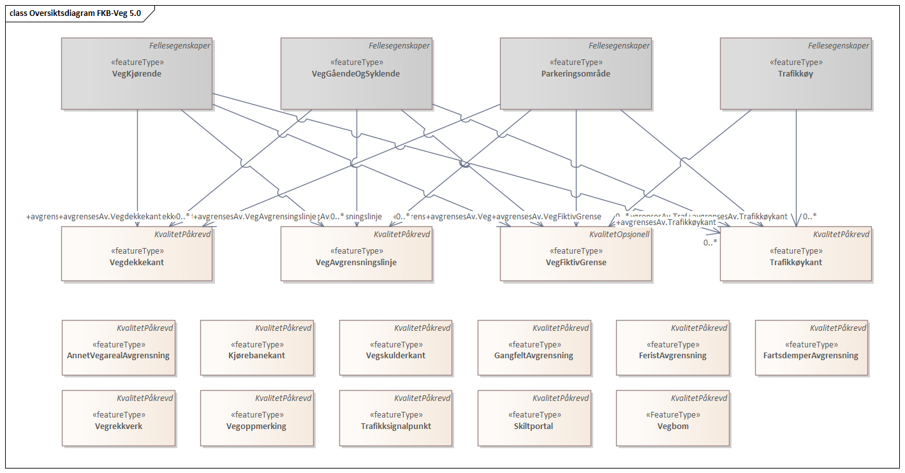
[caption="Figur 2: ",title=Pakkerealisering]
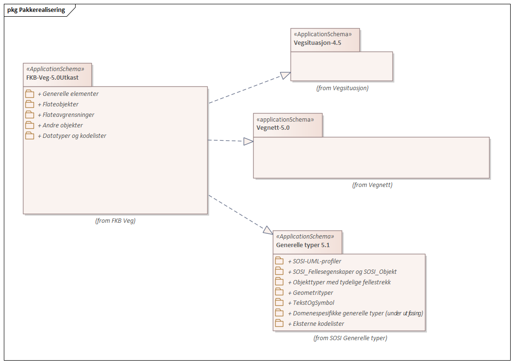
[caption="Figur 3: ",title=Hoveddiagram 1 - Flateobjekter]
image::figurer/Hoveddiagram 1 - Flateobjekter.png[Hoveddiagram 1 - Flateobjekter]
[caption="Figur 4: ",title=Hoveddiagram 2 - Flateavgrensninger]
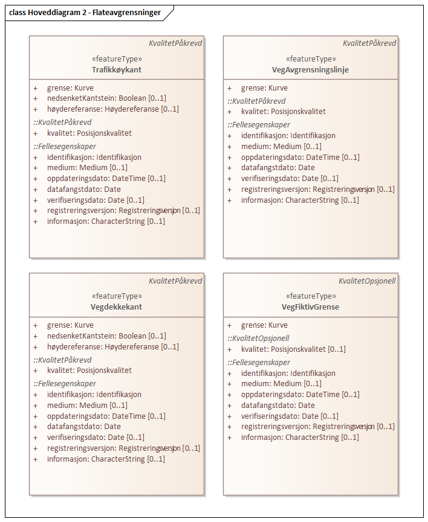
[caption="Figur 5: ",title=Hoveddiagram 3 - Andre objekter]
image::figurer/Hoveddiagram 3 - Andre objekter.png[Hoveddiagram 3 - Andre objekter]
[caption="Figur 6: ",title=Realisering av objekttyper]
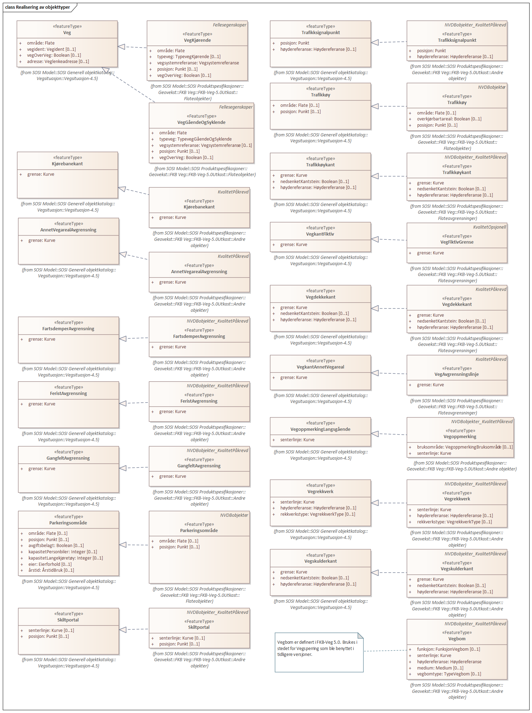
[caption="Figur 7: ",title=Arv av fellesegenskaper]
image::figurer/Arv av fellesegenskaper.png[Arv av fellesegenskaper]
[caption="Figur 8: ",title=VegKjørende flateavgrensning]
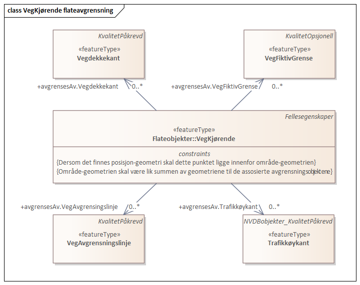
[caption="Figur 9: ",title=VegGåendeOgSyklende flateavgrensning]
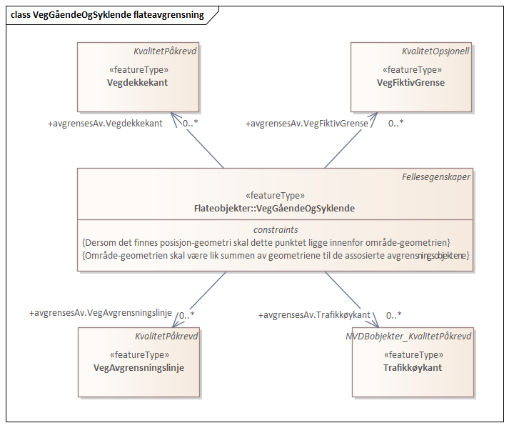
[caption="Figur 10: ",title=Parkeringsområde flateavgrensning]
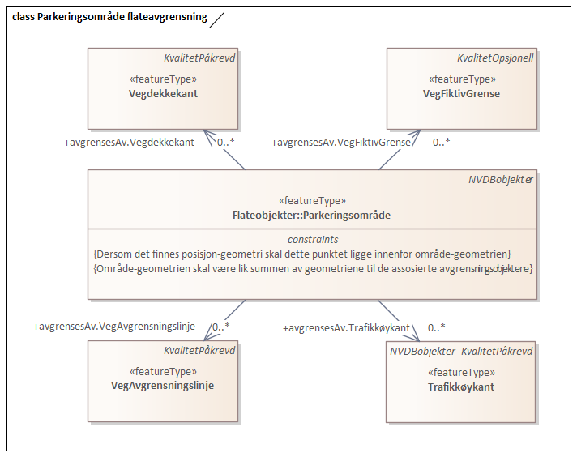
[caption="Figur 11: ",title=Trafikkøy flateavgrensning]
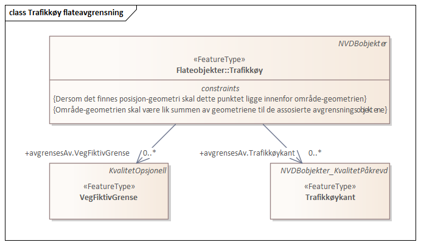
 
==== «FeatureType» Vegbom
Definisjon: fysisk vegbom. Kan både være bommer som permanent sperrer for kjøring (vegsperringer) og bommer som kan passeres, f.eks. ved å betale avgift.
 
*Supertype:* «FeatureType» KvalitetPåkrevd
 
===== Egenskaper
[cols="20,80"]
|===
|*Navn:* 
|*funksjon*
 
|Definisjon: 
|
 
|Multiplisitet: 
|[1..1]
 
|Type: 
|FunksjonVegbom
|===
[cols="20,80"]
|===
|*Navn:* 
|*senterlinje*
 
|Definisjon: 
|forløp som følger objektets sentrale del
 
|Multiplisitet: 
|[1..1]
 
|Type: 
|Kurve
|===
[cols="20,80"]
|===
|*Navn:* 
|*høydereferanse*
 
|Definisjon: 
|koordinatregistering utført på topp eller bunn av et objekt
 
|Multiplisitet: 
|[1..1]
 
|Type: 
|Høydereferanse
|===
[cols="20,80"]
|===
|*Navn:* 
|*medium*
 
|Definisjon: 
|objektets beliggenhet i forhold til jordoverflaten
 
|Multiplisitet: 
|[0..1]
 
|Type: 
|Medium
|===
[cols="20,80"]
|===
|*Navn:* 
|*vegbomtype*
 
|Definisjon: 
|Angir hvilken type vegbommen er av
 
|Multiplisitet: 
|[0..1]
 
|Type: 
|TypeVegbom
|===
 
==== «featureType» AnnetVegarealAvgrensning
Definisjon: avgrensning av private avkjørsler, ytterkant av åpne parkeringsplasser i tilknytning til veg, korte gang- og sykkelveger som ikke hører til hovedvegnettet (for eksempel småveger mellom bebyggelse)
 
*Supertype:* «FeatureType» KvalitetPåkrevd
 
*Realisering av:* «ApplicationSchema» Vegsituasjon-4.5::«featureType» AnnetVegarealAvgrensning
 
===== Tagged Values
[cols="20,80"]
|===
|SOSI_geometri
|KURVE;
 
|===
===== Egenskaper
[cols="20,80"]
|===
|*Navn:* 
|*grense*
 
|Definisjon: 
|forløp som følger overgang mellom ulike fenomener 
 
|Multiplisitet: 
|[1..1]
 
|Type: 
|Kurve
|Tagged Values: 
|
Erling1: Hei + 
SOSI_melding: Fant ikke denne i SOSI_db + 
|===
 
==== «featureType» FartsdemperAvgrensning
Definisjon: avgrensningslinje for Fartsdemper
 
*Supertype:* «FeatureType» KvalitetPåkrevd
 
*Realisering av:* «ApplicationSchema» Vegsituasjon-4.5::«featureType» FartsdemperAvgrensning
 
===== Tagged Values
[cols="20,80"]
|===
|SOSI_geometri
|KURVE;
 
|===
===== Egenskaper
[cols="20,80"]
|===
|*Navn:* 
|*grense*
 
|Definisjon: 
|forløp som følger overgang mellom ulike fenomener 
 
|Multiplisitet: 
|[1..1]
 
|Type: 
|Kurve
|Tagged Values: 
|
Erling1: Hei + 
SOSI_melding: Fant ikke denne i SOSI_db + 
|===
 
==== «featureType» FeristAvgrensning
Definisjon: avgrensning av ferist
 
*Supertype:* «FeatureType» KvalitetPåkrevd
 
*Realisering av:* «ApplicationSchema» Vegsituasjon-4.5::«featureType» FeristAvgrensning
 
===== Tagged Values
[cols="20,80"]
|===
|SOSI_geometri
|KURVE;
 
|===
===== Egenskaper
[cols="20,80"]
|===
|*Navn:* 
|*grense*
 
|Definisjon: 
|forløp som følger overgang mellom ulike fenomener 
 
|Multiplisitet: 
|[1..1]
 
|Type: 
|Kurve
|Tagged Values: 
|
SOSI_melding: Fant ikke denne i SOSI_db + 
|===
 
==== «featureType» GangfeltAvgrensning
Definisjon: avgrensning av gangfelt
 
*Supertype:* «FeatureType» KvalitetPåkrevd
 
*Realisering av:* «ApplicationSchema» Vegsituasjon-4.5::«featureType» GangfeltAvgrensning
 
===== Tagged Values
[cols="20,80"]
|===
|SOSI_geometri
|KURVE;
 
|===
===== Egenskaper
[cols="20,80"]
|===
|*Navn:* 
|*grense*
 
|Definisjon: 
|forløp som følger overgang mellom ulike fenomener 
 
|Multiplisitet: 
|[1..1]
 
|Type: 
|Kurve
|Tagged Values: 
|
Erling1: Hei + 
SOSI_melding: Fant ikke denne i SOSI_db + 
|===
 
==== «featureType» Kjørebanekant
Definisjon: Avgrensing av kjørebanen
 
*Supertype:* «FeatureType» KvalitetPåkrevd
 
*Realisering av:* «ApplicationSchema» Vegsituasjon-4.5::«featureType» Kjørebanekant
 
===== Tagged Values
[cols="20,80"]
|===
|SOSI_geometri
|KURVE;
 
|===
===== Egenskaper
[cols="20,80"]
|===
|*Navn:* 
|*grense*
 
|Definisjon: 
|forløp som følger overgang mellom ulike fenomener 
 
|Multiplisitet: 
|[1..1]
 
|Type: 
|Kurve
|Tagged Values: 
|
SOSI_melding: Fant ikke denne i SOSI_db + 
|===
 
==== «featureType» Parkeringsområde
Definisjon: område for parkering av kjøretøy
 
*Supertype:* «FeatureType» Fellesegenskaper
 
*Realisering av:* «ApplicationSchema» Vegsituasjon-4.5::«featureType» Parkeringsområde
 
===== Tagged Values
[cols="20,80"]
|===
|SOSI_geometri
|PUNKT;FLATE;
 
|===
===== Egenskaper
[cols="20,80"]
|===
|*Navn:* 
|*område*
 
|Definisjon: 
|objektets utstrekning
 
|Multiplisitet: 
|[0..1]
 
|Type: 
|Flate
|Tagged Values: 
|
SOSI_melding: Fant ikke denne i SOSI_db + 
SOSI_navn: Flate + 
|===
[cols="20,80"]
|===
|*Navn:* 
|*posisjon*
 
|Definisjon: 
|sted som objektet eksisterer på
 
|Multiplisitet: 
|[0..1]
 
|Type: 
|Punkt
|Tagged Values: 
|
SOSI_datatype: * + 
SOSI_lengde:  + 
SOSI_navn: NØ + 
SOSI_navn: Punkt + 
|===
[cols="20,80"]
|===
===== Roller
|*Rollenavn:* 
|*dekkekantAvgrensning*
 
|Multiplisitet: 
|[0..*]
 
|Til klasse:
|«featureType» Vegdekkekant
|===
|*Rollenavn:* 
|*trafikkøyavgrensning*
 
|Multiplisitet: 
|[0..*]
 
|Til klasse:
|«featureType» Trafikkøykant
|===
|*Rollenavn:* 
|*avgrensningAnnetareal*
 
|Multiplisitet: 
|[0..*]
 
|Til klasse:
|«featureType» VegAvgrensingslinje
|===
|*Rollenavn:* 
|*fiktivAvgrensning*
 
|Multiplisitet: 
|[0..*]
 
|Til klasse:
|«featureType» VegFiktivGrense
|===
 
==== «featureType» Skiltportal
Definisjon: anordning for å henge opp skilt, teknisk utstyr etc. over kjørefeltene
 
*Supertype:* «FeatureType» KvalitetPåkrevd
 
*Realisering av:* «ApplicationSchema» Vegsituasjon-4.5::«featureType» Skiltportal
 
===== Tagged Values
[cols="20,80"]
|===
|SOSI_geometri
|PUNKT;KURVE;
 
|===
===== Egenskaper
[cols="20,80"]
|===
|*Navn:* 
|*senterlinje*
 
|Definisjon: 
|forløp som følger objektets sentrale del 
 
|Multiplisitet: 
|[0..1]
 
|Type: 
|Kurve
|Tagged Values: 
|
SOSI_melding: Fant ikke denne i SOSI_db + 
|===
[cols="20,80"]
|===
|*Navn:* 
|*posisjon*
 
|Definisjon: 
|sted som objektet eksisterer på 
 
|Multiplisitet: 
|[0..1]
 
|Type: 
|Punkt
|Tagged Values: 
|
SOSI_datatype: * + 
SOSI_lengde:  + 
SOSI_navn: NØ + 
|===
 
==== «featureType» Trafikksignalpunkt
Definisjon: trafikksignal inkludert signalhoder og stolpe lokalisert i ett punkt.
 
*Supertype:* «FeatureType» KvalitetPåkrevd
 
*Realisering av:* «ApplicationSchema» Vegsituasjon-4.5::«featureType» Trafikksignalpunkt
 
===== Tagged Values
[cols="20,80"]
|===
|SOSI_geometri
|PUNKT;
 
|===
===== Egenskaper
[cols="20,80"]
|===
|*Navn:* 
|*posisjon*
 
|Definisjon: 
|sted som objektet eksisterer på 
 
|Multiplisitet: 
|[1..1]
 
|Type: 
|Punkt
|Tagged Values: 
|
SOSI_datatype: * + 
SOSI_lengde:  + 
SOSI_navn: NØ + 
SOSI_navn: Punkt + 
|===
[cols="20,80"]
|===
|*Navn:* 
|*høydereferanse*
 
|Definisjon: 
|koordinatregistrering utført på topp eller bunn av et objekt 
 
|Multiplisitet: 
|[0..1]
 
|Type: 
|Høydereferanse
|Tagged Values: 
|
SOSI_datatype: T + 
SOSI_lengde: 6 + 
SOSI_navn: HREF + 
|===
 
==== «featureType» Trafikkøy
Definisjon: område som er begrenset av kjørefelt på alle sider og som normalt ikke skal benyttes av kjøretøy
 
*Supertype:* «FeatureType» Fellesegenskaper
 
*Realisering av:* «ApplicationSchema» Vegsituasjon-4.5::«featureType» Trafikkøy
 
===== Tagged Values
[cols="20,80"]
|===
|SOSI_geometri
|PUNKT;FLATE;
 
|===
===== Egenskaper
[cols="20,80"]
|===
|*Navn:* 
|*område*
 
|Definisjon: 
|objektets utstrekning
 
|Multiplisitet: 
|[0..1]
 
|Type: 
|Flate
|Tagged Values: 
|
SOSI_melding: Fant ikke denne i SOSI_db + 
|===
[cols="20,80"]
|===
|*Navn:* 
|*overkjørbartareal*
 
|Definisjon: 
|Betinget egenskap som kun brukes for del av trafikk&#248;y/rundkj&#248;ring som er overkj&#248;rbart areal. Dersom egenskapen ikke er angitt betyr dette det samme som overkj&#248;rbartareal Nei.
 
|Multiplisitet: 
|[0..1]
 
|Type: 
|Boolean
|===
[cols="20,80"]
|===
|*Navn:* 
|*posisjon*
 
|Definisjon: 
|sted som objektet eksisterer på
 
|Multiplisitet: 
|[0..1]
 
|Type: 
|Punkt
|Tagged Values: 
|
SOSI_datatype: * + 
SOSI_lengde:  + 
SOSI_navn: NØ + 
|===
[cols="20,80"]
|===
===== Roller
|*Rollenavn:* 
|*avgrensning*
 
|Multiplisitet: 
|[1..*]
 
|Til klasse:
|«featureType» Trafikkøykant
|===
 
==== «featureType» Trafikkøykant
Definisjon: avgrensing av trafikkøy
 
*Supertype:* «FeatureType» KvalitetPåkrevd
 
*Realisering av:* «ApplicationSchema» Vegsituasjon-4.5::«featureType» Trafikkøykant
 
===== Tagged Values
[cols="20,80"]
|===
|SOSI_geometri
|KURVE;
 
|===
===== Egenskaper
[cols="20,80"]
|===
|*Navn:* 
|*grense*
 
|Definisjon: 
|forløp som følger overgang mellom ulike fenomener 
 
|Multiplisitet: 
|[1..1]
 
|Type: 
|Kurve
|Tagged Values: 
|
SOSI_melding: Fant ikke denne i SOSI_db + 
SOSI_navn: Kurve + 
|===
[cols="20,80"]
|===
|*Navn:* 
|*nedsenketKantstein*
 
|Definisjon: 
|om fortauskanten er nedsenket eller ikke 
 
|Multiplisitet: 
|[0..1]
 
|Type: 
|Boolean
|Tagged Values: 
|
SOSI_datatype: BOOLSK + 
SOSI_lengde:  + 
SOSI_melding: Fant ikke denne i SOSI_db/Objektegenskaper + 
SOSI_navn: BOOLSK + 
SOSI_navn: NEDSENKETKANTSTEIN + 
|===
[cols="20,80"]
|===
|*Navn:* 
|*høydereferanse*
 
|Definisjon: 
|koordinatregistrering utført på topp eller bunn av et objekt 
 
|Multiplisitet: 
|[0..1]
 
|Type: 
|Høydereferanse
|Tagged Values: 
|
SOSI_datatype: T + 
SOSI_lengde: 6 + 
SOSI_navn: HREF + 
|===
 
==== «featureType» VegGåendeOgSyklende
Definisjon: ferdselsåre for motorisert trafikk
 
*Supertype:* «FeatureType» Fellesegenskaper
 
*Realisering av:* «ApplicationSchema» Vegsituasjon-4.5::«featureType» Veg
 
===== Tagged Values
[cols="20,80"]
|===
|SOSI_geometri
|PUNKT;KURVE;FLATE;
 
|===
===== Egenskaper
[cols="20,80"]
|===
|*Navn:* 
|*område*
 
|Definisjon: 
|objektets utstrekning
 
|Multiplisitet: 
|[1..1]
 
|Type: 
|Flate
|Tagged Values: 
|
SOSI_melding: Fant ikke denne i SOSI_db + 
SOSI_navn: Flate + 
|===
[cols="20,80"]
|===
|*Navn:* 
|*typeveg*
 
|Definisjon: 
|
 
|Multiplisitet: 
|[1..1]
 
|Type: 
|TypevegGåendeOgSyklende
|===
[cols="20,80"]
|===
|*Navn:* 
|*vegsystemreferanse*
 
|Definisjon: 
|
 
|Multiplisitet: 
|[0..1]
 
|Type: 
|Vegsystemreferanse
|===
[cols="20,80"]
|===
|*Navn:* 
|*vegOverVeg*
 
|Definisjon: 
|angivelse av om vegen ligger øverst av flere andre veger

Merknad:                             
egenskapen vegOverVeg benyttes der man har flere veger over hverandre (store trafikkmaskiner som Sinsen-krysset). Verdi JA benyttes for vegen som ligger øverst. Denne egenskapen benyttes for å styre hvilke flater som skal tegnes øverst (prioritet).  Ikke påkrevd å benytte ved en veg over annen veg, da styrer MEDIUM-mekanismen også uttegningen.
 
|Multiplisitet: 
|[0..1]
 
|Type: 
|Boolean
|Tagged Values: 
|
SOIS_navn: VEGOVERVEG + 
SOSI_datatype: BOOLSK + 
SOSI_lengde:  + 
SOSI_navn: VEGOVERVEG + 
|===
[cols="20,80"]
|===
===== Roller
|*Rollenavn:* 
|*avgrensning*
 
|Multiplisitet: 
|[0..*]
 
|Til klasse
|«featureType» VegFiktivGrense
|===
|*Rollenavn:* 
|*avgrensning*
 
|Multiplisitet: 
|[0..*]
 
|Til klasse
|«featureType» Vegdekkekant
|===
|*Rollenavn:* 
|*avgrensning*
 
|Multiplisitet: 
|[0..*]
 
|Til klasse
|«featureType» Trafikkøykant
|===
|*Rollenavn:* 
|*avgrensning*
 
|Multiplisitet: 
|[0..*]
 
|Til klasse
|«featureType» VegAvgrensingslinje
|===
 
==== «featureType» VegKjørende
Definisjon: ferdselsåre for motorisert trafikk
 
*Supertype:* «FeatureType» Fellesegenskaper
 
*Realisering av:* «ApplicationSchema» Vegsituasjon-4.5::«featureType» Veg
 
===== Tagged Values
[cols="20,80"]
|===
|SOSI_geometri
|PUNKT;KURVE;FLATE;
 
|===
===== Egenskaper
[cols="20,80"]
|===
|*Navn:* 
|*område*
 
|Definisjon: 
|objektets utstrekning
 
|Multiplisitet: 
|[1..1]
 
|Type: 
|Flate
|Tagged Values: 
|
SOSI_melding: Fant ikke denne i SOSI_db + 
SOSI_navn: Flate + 
|===
[cols="20,80"]
|===
|*Navn:* 
|*typeveg*
 
|Definisjon: 
|
 
|Multiplisitet: 
|[0..1]
 
|Type: 
|TypevegKjørende
|===
[cols="20,80"]
|===
|*Navn:* 
|*vegsystemreferanse*
 
|Definisjon: 
|
 
|Multiplisitet: 
|[1..1]
 
|Type: 
|Vegsystemreferanse
|===
[cols="20,80"]
|===
|*Navn:* 
|*vegOverVeg*
 
|Definisjon: 
|angivelse av om vegen ligger øverst av flere andre veger

Merknad:                             
egenskapen vegOverVeg benyttes der man har flere veger over hverandre (store trafikkmaskiner som Sinsen-krysset). Verdi JA benyttes for vegen som ligger øverst. Denne egenskapen benyttes for å styre hvilke flater som skal tegnes øverst (prioritet).  Ikke påkrevd å benytte ved en veg over annen veg, da styrer MEDIUM-mekanismen også uttegningen.
 
|Multiplisitet: 
|[0..1]
 
|Type: 
|Boolean
|Tagged Values: 
|
SOIS_navn: VEGOVERVEG + 
SOSI_datatype: BOOLSK + 
SOSI_lengde:  + 
SOSI_navn: VEGOVERVEG + 
|===
[cols="20,80"]
|===
===== Roller
|*Rollenavn:* 
|*fiktivavgrensning*
 
|Multiplisitet: 
|[0..*]
 
|Til klasse:
|«featureType» VegFiktivGrense
|===
|*Rollenavn:* 
|*avgrensning*
 
|Multiplisitet: 
|[0..*]
 
|Til klasse:
|«featureType» Vegdekkekant
|===
|*Rollenavn:* 
|*trafikkøyavgrensning*
 
|Multiplisitet: 
|[0..*]
 
|Til klasse:
|«featureType» Trafikkøykant
|===
|*Rollenavn:* 
|*avgrensningAnnetareal*
 
|Multiplisitet: 
|[0..*]
 
|Til klasse:
|«featureType» VegAvgrensingslinje
|===
 
==== «featureType» Vegdekkekant
Definisjon: sideveis avgrensning av vegdekke
 
*Supertype:* «FeatureType» KvalitetPåkrevd
 
*Realisering av:* «ApplicationSchema» Vegsituasjon-4.5::«featureType» Vegdekkekant
 
===== Tagged Values
[cols="20,80"]
|===
|SOSI_geometri
|KURVE;
 
|===
===== Egenskaper
[cols="20,80"]
|===
|*Navn:* 
|*grense*
 
|Definisjon: 
|forløp som følger overgang mellom ulike fenomener 
 
|Multiplisitet: 
|[1..1]
 
|Type: 
|Kurve
|Tagged Values: 
|
SOSI_melding: Fant ikke denne i SOSI_db + 
SOSI_navn: Kurve + 
|===
[cols="20,80"]
|===
|*Navn:* 
|*nedsenketKantstein*
 
|Definisjon: 
|om fortauskanten er nedsenket eller ikke 
 
|Multiplisitet: 
|[0..1]
 
|Type: 
|Boolean
|Tagged Values: 
|
SOSI_datatype: BOOLSK + 
SOSI_datatype:  + 
SOSI_lengde:  + 
SOSI_navn: NEDSENKETKANTSTEIN + 
|===
[cols="20,80"]
|===
|*Navn:* 
|*høydereferanse*
 
|Definisjon: 
|koordinatregistrering utført på topp eller bunn av et objekt 
 
|Multiplisitet: 
|[0..1]
 
|Type: 
|Høydereferanse
|Tagged Values: 
|
SOSI_datatype: T + 
SOSI_lengde: 6 + 
SOSI_navn: HREF + 
|===
 
==== «featureType» VegAvgrensingslinje
Definisjon: fiktiv linje som avgrenser veg mot "annet vegareal" som ligger i tilknytning til vegnettet. Eksempel på "annet vegareal" er åpne parkeringsplasser, industriområder og gårdsplasser
 
*Supertype:* «FeatureType» KvalitetPåkrevd
 
*Realisering av:* «ApplicationSchema» Vegsituasjon-4.5::«featureType» VegkantAnnetVegareal
 
===== Tagged Values
[cols="20,80"]
|===
|SOSI_geometri
|KURVE;
 
|===
===== Egenskaper
[cols="20,80"]
|===
|*Navn:* 
|*grense*
 
|Definisjon: 
|forløp som følger overgang mellom ulike fenomener 
 
|Multiplisitet: 
|[1..1]
 
|Type: 
|Kurve
|Tagged Values: 
|
SOSI_melding: Fant ikke denne i SOSI_db + 
|===
 
==== «featureType» VegFiktivGrense
Definisjon: fiktiv avgrensningslinje (lukkelinje) for vegflater
 
*Supertype:* «FeatureType» KvalitetOpsjonell
 
*Realisering av:* «ApplicationSchema» Vegsituasjon-4.5::«featureType» VegkantFiktiv
 
===== Tagged Values
[cols="20,80"]
|===
|SOSI_geometri
|KURVE;
 
|===
===== Egenskaper
[cols="20,80"]
|===
|*Navn:* 
|*grense*
 
|Definisjon: 
|forløp som følger overgang mellom ulike fenomener 
 
|Multiplisitet: 
|[1..1]
 
|Type: 
|Kurve
|Tagged Values: 
|
SOSI_melding: Fant ikke denne i SOSI_db + 
|===
 
==== «featureType» Vegoppmerking
Definisjon: langsgående vegoppmerkingslinjer i veien
 
*Supertype:* «FeatureType» KvalitetPåkrevd
 
*Realisering av:* «ApplicationSchema» Vegsituasjon-4.5::«featureType» VegoppmerkingLangsgående
 
===== Tagged Values
[cols="20,80"]
|===
|SOSI_geometri
|KURVE;
 
|===
===== Egenskaper
[cols="20,80"]
|===
|*Navn:* 
|*bruksområde*
 
|Definisjon: 
|bruksomr&#229;de for vegopmmerking
(hentes fra NVDB))
 
|Multiplisitet: 
|[0..1]
 
|Type: 
|VegoppmerkingBruksområde
|===
[cols="20,80"]
|===
|*Navn:* 
|*senterlinje*
 
|Definisjon: 
|forløp som følger objektets sentrale del
 
|Multiplisitet: 
|[1..1]
 
|Type: 
|Kurve
|Tagged Values: 
|
SOSI_melding: Fant ikke denne i SOSI_db + 
|===
 
==== «featureType» Vegrekkverk
Definisjon: rekkverk som står som hinder langs vegskulder og som trafikkdeler.
 
*Supertype:* «FeatureType» KvalitetPåkrevd
 
*Realisering av:* «ApplicationSchema» Vegsituasjon-4.5::«featureType» Vegrekkverk
 
===== Tagged Values
[cols="20,80"]
|===
|SOSI_geometri
|KURVE;
 
|===
===== Egenskaper
[cols="20,80"]
|===
|*Navn:* 
|*senterlinje*
 
|Definisjon: 
|forløp som følger objektets sentrale del 
 
|Multiplisitet: 
|[1..1]
 
|Type: 
|Kurve
|Tagged Values: 
|
SOSI_melding: Fant ikke denne i SOSI_db + 
SOSI_navn: Kurve + 
|===
[cols="20,80"]
|===
|*Navn:* 
|*høydereferanse*
 
|Definisjon: 
|koordinatregistrering utført på topp eller bunn av et objekt 
 
|Multiplisitet: 
|[0..1]
 
|Type: 
|Høydereferanse
|Tagged Values: 
|
SOSI_datatype: T + 
SOSI_lengde: 6 + 
SOSI_navn: HREF + 
|===
[cols="20,80"]
|===
|*Navn:* 
|*rekkverkstype*
 
|Definisjon: 
|type rekkverk
 
|Multiplisitet: 
|[0..1]
 
|Type: 
|VegrekkverkType
|Tagged Values: 
|
SOSI_melding: Fant ikke denne i SOSI_db + 
SOSI_navn: VEGREKKVERKTYPE + 
|===
 
==== «featureType» Vegskulderkant
Definisjon: kant av kjørbart felt som ligger inntil kjørebanen

Merknad: 
inkluderer i tillegg rom for rekkverk etc.
 
*Supertype:* «FeatureType» KvalitetPåkrevd
 
*Realisering av:* «ApplicationSchema» Vegsituasjon-4.5::«featureType» Vegskulderkant
 
===== Tagged Values
[cols="20,80"]
|===
|SOSI_geometri
|KURVE;
 
|===
===== Egenskaper
[cols="20,80"]
|===
|*Navn:* 
|*grense*
 
|Definisjon: 
|forløp som følger overgang mellom ulike fenomener 
 
|Multiplisitet: 
|[1..1]
 
|Type: 
|Kurve
|Tagged Values: 
|
SOSI_melding: Fant ikke denne i SOSI_db + 
SOSI_navn: Kurve + 
|===
[cols="20,80"]
|===
|*Navn:* 
|*nedsenketKantstein*
 
|Definisjon: 
|om fortauskanten er nedsenket eller ikke
 
|Multiplisitet: 
|[0..1]
 
|Type: 
|Boolean
|Tagged Values: 
|
SOSI_datatype: BOOLSK + 
SOSI_lengde:  + 
SOSI_navn: NEDSENKETKANTSTEIN + 
|===
[cols="20,80"]
|===
|*Navn:* 
|*høydereferanse*
 
|Definisjon: 
|koordinatregistrering utført på topp eller bunn av et objekt 
 
|Multiplisitet: 
|[0..1]
 
|Type: 
|Høydereferanse
|Tagged Values: 
|
SOSI_datatype: T + 
SOSI_lengde: 6 + 
SOSI_navn: HREF + 
|===
=== Pakke: Datatype og kodelister
Definisjon: Inneholder datatyper og kodelister benyttet i produktspesifikasjonen
[caption="Figur 12: ",title=Realisering av datatyper og kodelister]
image::figurer/Realisering av datatyper og kodelister.png[Realisering av datatyper og kodelister]
 
==== «dataType» Vegsystem
Definisjon: Definerer hvilke deler av vegnettet som forvaltningsmessig hører sammen.
 
*Realisering av:* «applicationSchema» Vegnett-5.0::«dataType» Vegsystem
 
===== Tagged Values
[cols="20,80"]
|===
|catalogue-entry
|NVDB Datakatalogen
 
|NVDB_ID
|915
 
|NVDB_navn
|Vegsystem
 
|SOSI_navn
|VEGSYSTEM
 
|===
===== Egenskaper
[cols="20,80"]
|===
|*Navn:* 
|*vegkategori*
 
|Definisjon: 
|Kategorisering som angir på hvilket nivå vegmyndigheten for strekningen ligger.
 
|Multiplisitet: 
|[1..1]
 
|Type: 
|Vegkategori
|Tagged Values: 
|
NVDB_ID: 11276 + 
NVDB_navn: Vegkategori + 
SOSI_datatype: T + 
SOSI_lengde: 50 + 
SOSI_navn: VEGKATEGORI + 
|===
[cols="20,80"]
|===
|*Navn:* 
|*vegfase*
 
|Definisjon: 
|Angir vegens fase i livet.
 
|Multiplisitet: 
|[1..1]
 
|Type: 
|Vegfase
|Tagged Values: 
|
NVDB_ID: 11278 + 
NVDB_navn: Fase + 
SOSI_datatype: T + 
SOSI_lengde: 20 + 
SOSI_navn: VEGFASE + 
|===
[cols="20,80"]
|===
|*Navn:* 
|*vegnummer*
 
|Definisjon: 
|Angir hvilke deler av vegnettet som rutemessig hører sammen.
 
|Multiplisitet: 
|[0..1]
 
|Type: 
|Integer
|Tagged Values: 
|
NVDB_ID: 11277 + 
NVDB_navn: Vegnummer + 
SOSI_datatype: H + 
SOSI_lengde: 5 + 
SOSI_navn: VEGNUMMER + 
|===
 
==== «dataType» Vegsystemreferanse
Definisjon: sammensatt identifikator for vegsystemreferanse
 
*Realisering av:* «applicationSchema» Vegnett-5.0::«dataType» Vegsystemreferanse
 
===== Tagged Values
[cols="20,80"]
|===
|SOSI_navn
|VREF
 
|===
===== Egenskaper
[cols="20,80"]
|===
|*Navn:* 
|*vegsystem*
 
|Definisjon: 
|hvilke deler av vegnettet som forvaltningsmessig hører sammen
 
|Multiplisitet: 
|[1..1]
 
|Type: 
|Vegsystem
|Tagged Values: 
|
SOSI_navn: VEGSYSTEM + 
|===
 
==== «CodeList» FunksjonVegbom
Definisjon: 
 
===== Tagged Values
[cols="20,80"]
|===
|===
 
==== «CodeList» TypeVegbom
Definisjon: 
 
===== Tagged Values
[cols="20,80"]
|===
|===
 
==== «CodeList» TypevegGåendeOgSyklende
Definisjon: 
 
===== Tagged Values
[cols="20,80"]
|===
|asDictionary
|true
 
|SOSI_datatype
|T
 
|SOSI_lengde
|30
 
|SOSI_navn
|TYPEVEG
 
|===
 
==== «CodeList» TypevegKjørende
Definisjon: 
 
===== Tagged Values
[cols="20,80"]
|===
|asDictionary
|true
 
|SOSI_datatype
|T
 
|SOSI_lengde
|30
 
|SOSI_navn
|TYPEVEG
 
|===
 
==== «CodeList» VegoppmerkingBruksområde
Definisjon: 
 
===== Tagged Values
[cols="20,80"]
|===
|===
 
==== «codeList» Vegfase
Definisjon: Angir vegens fase i livet.
 
===== Tagged Values
[cols="20,80"]
|===
|asDictionary
|false
 
|catalogue-entry
|NVDB Datakatalogen
 
|codeList
|https://raw.githubusercontent.com/jetgeo/NVDBGML/master/XSD/NVDBFase
 
|NVDB_ID
|11278
 
|NVDB_navn
|Fase
 
|SOSI_datatype
|T
 
|SOSI_lengde
|20
 
|SOSI_navn
|VEGFASE
 
|===
Kodeliste kunne ikke hentes fra register: https://raw.githubusercontent.com/jetgeo/NVDBGML/master/XSD/NVDBFase
 
===== Koder
[cols="25,60,15"]
|===
|*Kodenavn:* 
|*Definisjon:* 
|*Utvekslingsalias:* 
 
|planlagtVeg
|Planlagt veg, vedtatt trasé.
|P
|vegUnderBygging
|Veg under bygging
|A
|eksisterendeVeg
|Veg som er del av operativt vegnett
|V
|===
 
==== «codeList» Vegkategori
Definisjon: Kategorisering som angir på hvilket nivå vegmyndigheten for strekningen ligger.
 
===== Tagged Values
[cols="20,80"]
|===
|asDictionary
|false
 
|catalogue-entry
|NVDB Datakatalogen
 
|codeList
|https://raw.githubusercontent.com/jetgeo/NVDBGML/master/XSD/NVDBVegkategoriVegsystem
 
|NVDB_ID
|11276
 
|NVDB_navn
|Vegkategori
 
|SOSI_datatype
|T
 
|SOSI_lengde
|50
 
|SOSI_navn
|VEGKATEGORI
 
|===
Kodeliste kunne ikke hentes fra register: https://raw.githubusercontent.com/jetgeo/NVDBGML/master/XSD/NVDBVegkategoriVegsystem
 
===== Koder
[cols="25,60,15"]
|===
|*Kodenavn:* 
|*Definisjon:* 
|*Utvekslingsalias:* 
 
|europaveg
|SVV er vegmyndighet. Unik nummerering iht. europeisk avtale om internasjonale trafikkårer, AGR
|E
|riksveg
|SVV er vegmyndighet. Unik nummerering på nasjonalt nivå.
|R
|fylkesveg
|Fylkeskommunen er vegmyndighet. Unik nummerering på nasjonalt nivå.
|F
|kommunalVeg
|Kommunen er vegmyndighet. Unik nummerering innenfor kommunen.
|K
|privatVeg
|Private veger. Evt. nummerering er unik innenfor kommunen.
|P
|skogsveg
|Private landbruksveger som brukes til skogbruksformål. Nummerering iht. landbruksforvaltningens fagsystem ØKS
|S
|===
 
==== «codeList» VegrekkverkType
Definisjon: angivelse av ulike typer rekkverk
 
===== Tagged Values
[cols="20,80"]
|===
|SOSI_datatype
|T
 
|SOSI_lengde
|tom
 
|SOSI_navn
|VEGREKKVERKTYPE
 
|===
===== Koder
[cols="20,80"]
|===
|*Navn:* 
|*Definisjon:* 
 
|Betongrekkverk
|
|Betongrekkverk New Jersey
|
|Betongrekkverk plasstøpt
|
|Betongrekkverk prefabrikkerte element
|
|Betongrekkverk Stabb/Saxegård
|
|Rekkverk med skinne
|
|Rekkverk med wire
|
|Stabbesteiner
|
|Topprekkverk på mur/kantdrage
|
|===
=== Pakke: Generelle elementer
Definisjon: pakke med elementer som realiserer tilsvarende elementer i FKB Generell del 5.0

Merknad:
Kopieres direkte inn i de enkelte FKB-datasettene
[caption="Figur 13: ",title=Hoveddiagram Fellesegenskaper]
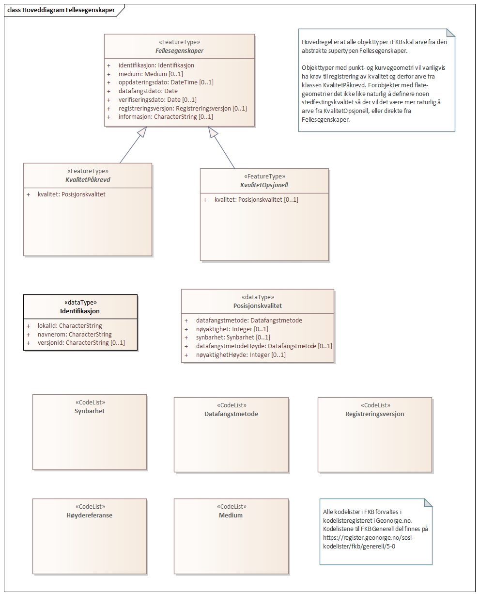
[caption="Figur 14: ",title=Realisering av fellesegenskaper fra SOSI generell del]
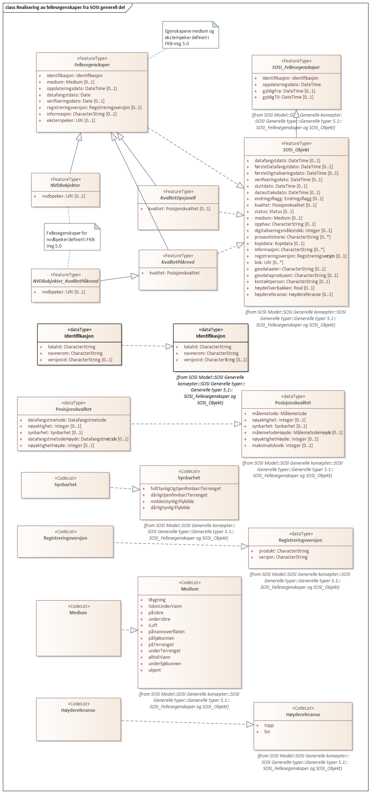
[caption="Figur 15: ",title=Posisjonskvalitet]
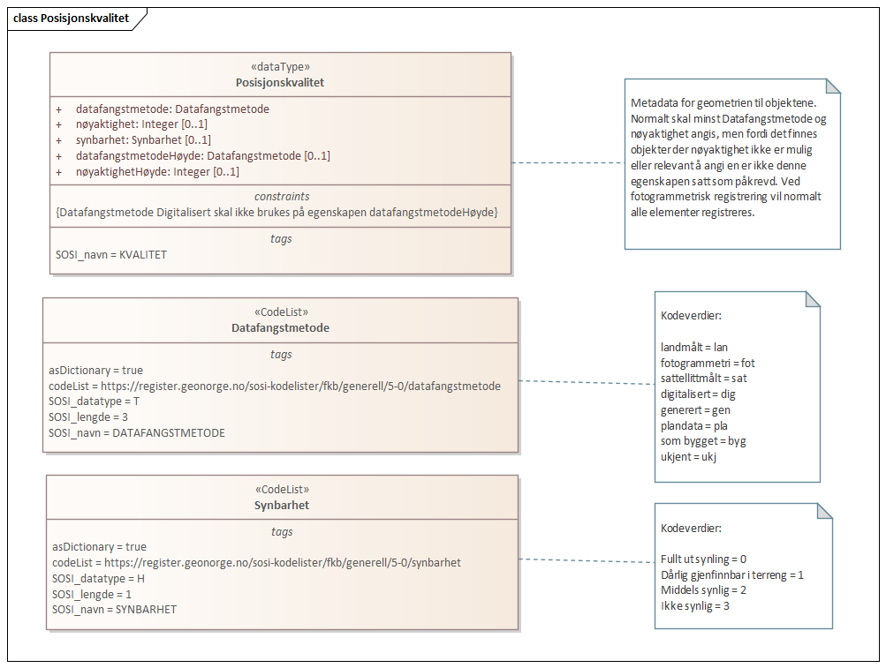
 
==== «FeatureType» Fellesegenskaper
Definisjon: abstrakt objekttype som bærer sentrale egenskaper som er anbefalt for bruk i produktspesifikasjoner.

Merknad: Disse egenskapene skal derfor ikke modelleres inn i fagområdemodeller.
 
*Realisering av:* «ApplicationSchema» Generelle typer 5.1/SOSI_Fellesegenskaper og SOSI_Objekt::«FeatureType» SOSI_Objekt
 
===== Egenskaper
[cols="20,80"]
|===
|*Navn:* 
|*identifikasjon*
 
|Definisjon: 
|unik identifikasjon av et objekt 

Merknad FKB:
Unik identifikasjon av et objekt, ivaretas av den ansvarlige produsent/forvalter, og som kan benyttes av eksterne applikasjoner som referanse til objektet.
Den unike identifikatoren er unik for kartobjektet og skal ikke endres i kartobjektets levetid. Dette m&#229; ikke forveksles med en tematisk identifikator (for eksempel bygningsnummer) som unikt identifiserer et objekt i virkeligheten. En bygning med samme bygningsnummer vil kunne representeres i mange kartprodukter der det finnes en unik identifikasjon i hver av dem.
For FKB benyttes UUID (Universally unique identifier) som lokalId. Dette inneb&#230;rer at lokalId alene alltid vil v&#230;re unik. Likevel skal alltid navnerom ogs&#229; angis. Navnerom angir FKB-datasettet.
 
|Multiplisitet: 
|[1..1]
 
|Type: 
|Identifikasjon
|Tagged Values: 
|
SOSI_navn: IDENT + 
|===
[cols="20,80"]
|===
|*Navn:* 
|*medium*
 
|Definisjon: 
|
 
|Multiplisitet: 
|[0..1]
 
|Type: 
|Medium
|===
[cols="20,80"]
|===
|*Navn:* 
|*oppdateringsdato*
 
|Definisjon: 
|tidspunkt for siste endring p&#229; objektet 

Merknad FKB: 
Denne datoen viser datasystemets siste endring p&#229; dataobjektet. Egenskapen settes av forvaltningssystemet etter f&#248;lgende regler:
i. Oppdateringsdato er tidspunkt for oppdatering av databasen og settes av forvaltningsbasen (ikke
av klienten).
ii. Oppdateringsdato skal endres ogs&#229; hvis det er kopidata som blir endret eller importert i en
”kopibase”.
iii. N&#229;r avgrensingslinjene til en flate endres, skal flateobjektet f&#229; ny oppdateringsdato.
iv. Oppdateringsdato skal endres hvis en egenskap endres.
 
|Multiplisitet: 
|[0..1]
 
|Type: 
|DateTime
|Tagged Values: 
|
SOSI_datatype: DATOTID + 
SOSI_navn: OPPDATERINGSDATO + 
|===
[cols="20,80"]
|===
|*Navn:* 
|*datafangstdato*
 
|Definisjon: 
|
 
|Multiplisitet: 
|[1..1]
 
|Type: 
|Date
|Tagged Values: 
|
SOSI_datatype: DATO + 
SOSI_navn: DATAFANGSTDATO + 
|===
[cols="20,80"]
|===
|*Navn:* 
|*verifiseringsdato*
 
|Definisjon: 
|dato n&#229;r dataene er fastsl&#229;tt &#229; v&#230;re i samsvar med virkeligheten.

Merknad FKB:
Brukes for eksempel i de sammenhenger hvor det er foretatt fotogrammetrisk ajourhold, og hvor det ikke er registrert endringer p&#229; objektet (det virkelige objektet er i samsvar med dataobjektet)
 
|Multiplisitet: 
|[0..1]
 
|Type: 
|Date
|Tagged Values: 
|
SOSI_datatype: DATO + 
SOSI_navn: VERIFISERINGSDATO + 
|===
[cols="20,80"]
|===
|*Navn:* 
|*registreringsversjon*
 
|Definisjon: 
|angivelse av hvilken produktspesifikasjon som er utgangspunkt  for dataene
 
|Multiplisitet: 
|[0..1]
 
|Type: 
|Registreringsversjon
|Tagged Values: 
|
SOSI_navn: REGISTRERINGSVERSJON + 
|===
[cols="20,80"]
|===
|*Navn:* 
|*informasjon*
 
|Definisjon: 
|generell opplysning.

Merknad FKB:
Mulighet til &#229; legge inn utfyllende informasjon om objektet. Egenskapen b&#248;r bare brukes til &#229; legge inn ekstra informasjon om enkeltobjekter. Egenskapen b&#248;r ikke brukes til &#229; systematisk angi ekstrainformasjon om mange/alle objekter i et datasett.
 
|Multiplisitet: 
|[0..1]
 
|Type: 
|CharacterString
|Tagged Values: 
|
SOSI_datatype: T + 
SOSI_lengde: 255 + 
SOSI_navn: INFORMASJON + 
|===
[cols="20,80"]
|===
|*Subtyper:*
|«FeatureType» KvalitetPåkrevd +
«FeatureType» KvalitetOpsjonell +
«featureType» VegGåendeOgSyklende +
«featureType» VegKjørende +
«featureType» Parkeringsområde +
«featureType» Trafikkøy
|===
 
==== «FeatureType» KvalitetPåkrevd
Definisjon: 
 
*Supertype:* «FeatureType» Fellesegenskaper
 
*Realisering av:* «ApplicationSchema» Generelle typer 5.1/SOSI_Fellesegenskaper og SOSI_Objekt::«FeatureType» SOSI_Objekt
 
===== Egenskaper
[cols="20,80"]
|===
|*Navn:* 
|*kvalitet*
 
|Definisjon: 
|beskrivelse av kvaliteten på stedfestingen

Merknad: Denne er identisk med ..KVALITET i tidligere versjoner av SOSI.
 
|Multiplisitet: 
|[1..1]
 
|Type: 
|Posisjonskvalitet
|Tagged Values: 
|
SOSI_navn: KVALITET + 
|===
[cols="20,80"]
|===
|*Subtyper:*
|«featureType» Trafikksignalpunkt +
«featureType» Kjørebanekant +
«featureType» Vegdekkekant +
«featureType» GangfeltAvgrensning +
«featureType» Vegrekkverk +
«featureType» FeristAvgrensning +
«featureType» FartsdemperAvgrensning +
«featureType» Vegoppmerking +
«featureType» AnnetVegarealAvgrensning +
«featureType» Trafikkøykant +
«featureType» Vegskulderkant +
«featureType» VegAvgrensingslinje +
«FeatureType» Vegbom +
«featureType» Skiltportal
|===
 
==== «FeatureType» KvalitetOpsjonell
Definisjon: 
 
*Supertype:* «FeatureType» Fellesegenskaper
 
*Realisering av:* «ApplicationSchema» Generelle typer 5.1/SOSI_Fellesegenskaper og SOSI_Objekt::«FeatureType» SOSI_Objekt
 
===== Egenskaper
[cols="20,80"]
|===
|*Navn:* 
|*kvalitet*
 
|Definisjon: 
|beskrivelse av kvaliteten på stedfestingen

Merknad: Denne er identisk med ..KVALITET i tidligere versjoner av SOSI.
 
|Multiplisitet: 
|[0..1]
 
|Type: 
|Posisjonskvalitet
|Tagged Values: 
|
SOSI_navn: KVALITET + 
|===
[cols="20,80"]
|===
|*Subtyper:*
|«featureType» VegFiktivGrense
|===
 
==== «dataType» Identifikasjon
Definisjon: Unik identifikasjon av et objekt i et datasett, forvaltet av den ansvarlige produsent/forvalter, og kan benyttes av eksterne applikasjoner som stabil referanse til objektet. 

Merknad 1: Denne objektidentifikasjonen må ikke forveksles med en tematisk objektidentifikasjon, slik som f.eks bygningsnummer. 

Merknad 2: Denne unike identifikatoren vil ikke endres i løpet av objektets levetid, og ikke gjenbrukes i andre objekt. 
 
*Realisering av:* «ApplicationSchema» Generelle typer 5.1/SOSI_Fellesegenskaper og SOSI_Objekt::«dataType» Identifikasjon
 
===== Tagged Values
[cols="20,80"]
|===
|SOSI_navn
|IDENT
 
|===
===== Egenskaper
[cols="20,80"]
|===
|*Navn:* 
|*lokalId*
 
|Definisjon: 
|lokal identifikator av et objekt

Merknad: Det er dataleverend&#248;rens ansvar &#229; s&#248;rge for at den lokale identifikatoren er unik innenfor navnerommet. For FKB-data benyttes UUID som lokalId.
 
|Multiplisitet: 
|[1..1]
 
|Type: 
|CharacterString
|Tagged Values: 
|
SOSI_datatype: T + 
SOSI_lengde: 100 + 
SOSI_navn: LOKALID + 
|===
[cols="20,80"]
|===
|*Navn:* 
|*navnerom*
 
|Definisjon: 
|navnerom som unikt identifiserer datakilden til et objekt, anbefales å være en http-URI

Eksempel: http://data.geonorge.no/SentraltStedsnavnsregister/1.0

Merknad : Verdien for nanverom vil eies av den dataprodusent som har ansvar for de unike identifikatorene og må være registrert i data.geonorge.no eller data.norge.no
 
|Multiplisitet: 
|[1..1]
 
|Type: 
|CharacterString
|Tagged Values: 
|
SOSI_datatype: T + 
SOSI_lengde: 100 + 
SOSI_navn: NAVNEROM + 
|===
[cols="20,80"]
|===
|*Navn:* 
|*versjonId*
 
|Definisjon: 
|identifikasjon av en spesiell versjon av et geografisk objekt (instans)
 
|Multiplisitet: 
|[0..1]
 
|Type: 
|CharacterString
|Tagged Values: 
|
SOSI_datatype: T + 
SOSI_lengde: 100 + 
SOSI_navn: VERSJONID + 
|===
 
==== «dataType» Posisjonskvalitet
Definisjon: beskrivelse av kvaliteten p&#229; stedfestingen.

Merknad:
Posisjonskvalitet er ikke konform med  kvalitetsmodellen i ISO slik den er defineret i ISO19157:2013, men er en videref&#248;ring av tildligere brukte kvalitetsegenskaper i SOSI. FKB 5.0 innf&#248;rer en egen variant av datatypen Posisjonskvalitet der kodeliste m&#229;lemetode er byttet ut med den mer generelle kodelista Datafangstmetode. 
 
*Realisering av:* «ApplicationSchema» Generelle typer 5.1/SOSI_Fellesegenskaper og SOSI_Objekt::«dataType» Posisjonskvalitet
 
===== Tagged Values
[cols="20,80"]
|===
|SOSI_navn
|KVALITET
 
|===
===== Egenskaper
[cols="20,80"]
|===
|*Navn:* 
|*datafangstmetode*
 
|Definisjon: 
|metode for datafangst. 
Egenskapen beskriver datafangstmetode for grunnrisskoordinater (x,y), eller for b&#229;de grunnriss og h&#248;yde (x,y,z) dersom det ikke er oppgitt noen verdi for datafangstmetodeH&#248;yde.
 
|Multiplisitet: 
|[1..1]
 
|Type: 
|Datafangstmetode
|Tagged Values: 
|
SOSI_lengde: 3 + 
SOSI_navn: DATAFANGSTMETODE + 
|===
[cols="20,80"]
|===
|*Navn:* 
|*nøyaktighet*
 
|Definisjon: 
|standardavviket til posisjoneringa av objektet oppgitt i cm
I de aller fleste sammenhenger benyttes en ansl&#229;tt eller forventet verdi for standardavvik, men dersom man har en beregnet verdi skal denne benyttes. 
For objekter med punktgeometri benyttes verdi for punktstandardavvik. For objekter med kurvegeometri benyttes standardavviket for tverravviket fra kurva. For objekter med overflate- eller volumgeometri er forst&#229;elsen at standardavviket beregnes ut fra (3D) avvikene mellom sann posisjon og n&#230;rmeste punkt p&#229; overflata. 
Merknad:
Verdien er ment &#229; beskrive n&#248;yaktigheten til objektet sammenlignet med sann verdi. Standardavvik er i utgangspunktet et m&#229;l p&#229; det tilfeldige avviket og det inneb&#230;rer at vi forutsetter at det systematiske avviket i liten grad p&#229;virker n&#248;yaktigheten til posisjoneringa. For fotogrammetriske data settes som hovedregel verdien lik kravet til standardavvik ved datafangst. Se standarden Geodatakvalitet for n&#230;rmere definisjon av standardavvik og hvordan dette defineres, beregnes og kontrolleres.
 
|Multiplisitet: 
|[0..1]
 
|Type: 
|Integer
|Tagged Values: 
|
SOSI_lengde: 6 + 
SOSI_navn: NØYAKTIGHET + 
|===
[cols="20,80"]
|===
|*Navn:* 
|*synbarhet*
 
|Definisjon: 
|beskrivelse av hvor godt objektene framg&#229;r i datagrunnlaget for posisjonering (f.eks. flybildene).
 
|Multiplisitet: 
|[0..1]
 
|Type: 
|Synbarhet
|Tagged Values: 
|
SOSI_lengde: 1 + 
SOSI_navn: SYNBARHET + 
|===
[cols="20,80"]
|===
|*Navn:* 
|*datafangstmetodeHøyde*
 
|Definisjon: 
|metoden brukt for h&#248;yderegistrering av posisjon.

Det er bare n&#248;dvending &#229; angi en verdi for egenskapen dersom datafangstmetode for h&#248;yde avviker fra datafangstmetode for grunnriss.

 
|Multiplisitet: 
|[0..1]
 
|Type: 
|Datafangstmetode
|Tagged Values: 
|
SOSI_lengde: 3 + 
SOSI_navn: DATAFANGSTMETODEHØYDE + 
|===
[cols="20,80"]
|===
|*Navn:* 
|*nøyaktighetHøyde*
 
|Definisjon: 
|standardavviket til posisjoneringa av objektet oppgitt i cm
I de aller fleste sammenhenger benyttes en ansl&#229;tt eller forventet verdi for standardavviket, men dersom man faktisk har standardavviket til posisjoneringa av objektet oppgitt i cm
I de aller fleste sammenhenger benyttes en ansl&#229;tt eller forventet verdi for standardavvik, men dersom man har en beregnet verdi skal denne benyttes. 
Merknad:
Verdien er ment &#229; beskrive n&#248;yaktigheten til objektet sammenlignet med sann verdi. Standardavvik er i utgangspunktet et m&#229;l p&#229; det tilfeldige avviket og det inneb&#230;rer at vi forutsetter at det systematiske avviket i liten grad p&#229;virker n&#248;yaktigheten til posisjoneringa. For fotogrammetriske data settes som hovedregel verdien lik kravet til standardavvik ved datafangst. Se standarden Geodatakvalitet for n&#230;rmere definisjon av standardavvik og hvordan dette defineres, beregnes og kontrolleres.
 
|Multiplisitet: 
|[0..1]
 
|Type: 
|Integer
|Tagged Values: 
|
SOSI_lengde: 6 + 
SOSI_navn: H-NØYAKTIGHET + 
|===
 
==== «CodeList» Synbarhet
Definisjon: synbarhet beskriver hvor godt objektene framg&#229;r i datagrunnlaget for posisjonering (f.eks. flybildene).
 
===== Tagged Values
[cols="20,80"]
|===
|asDictionary
|true
 
|codeList
|https://register.geonorge.no/sosi-kodelister/fkb/generell/5-0/synbarhet
 
|SOSI_datatype
|H
 
|SOSI_lengde
|1
 
|SOSI_navn
|SYNBARHET
 
|===
Kodeliste hentet fra register: https://register.geonorge.no/sosi-kodelister/fkb/generell/5-0/synbarhet
 
Kodeliste hentet på tidspunkt: 2021-07-01T14:43:44Z
 
Kodelistens navn i registeret: Synbarhet
 
===== Koder
[cols="25,60,15"]
|===
|*Kodenavn:* 
|*Definisjon:* 
|*Utvekslingsalias:* 
 
|Middels synlig
|Objektet er middels synlig/gjenkjennbart i flybilde eller annen datakilde for posisjonering. Ved fotogrammetrisk datafangst brukes denne koden for objekter som har lav kontrast eller er delvis skjult av overliggende objekter (vegetasjon, takoverbygg, bruer etc.). For slike objekter settes en større verdi for nøyaktighet enn kravet (opptil 3 ganger kravet)
|2
|Ikke synlig
|Objektet er ikke synlig/gjenkjennbart i flybilde eller annen datakilde for posisjonering. Ved fotogrammetrisk datafangst brukes denne koden for objekter som er helt skjult av overliggende objekter (vegetasjon, takoverbygg, bruer etc.). For slike objekter settes en stor verdi for nøyaktighet (mer enn 3 ganger kravet)
|3
|Fullt ut synlig
|Objektet er fullt ut synlig/gjenfinnbart i flybilde eller annen datakilde for posisjonering. Ved fotogrammetrisk registrering skal objekter som er fullt ut synlige registreres i tråd med angitte krav til nøyaktig registrering.
|0
|Dårlig gjenfinnbar i terreng
|Objektets posisjon er vanskelig å definere presist i terrenget på grunn av objektets natur. Koden kan f.eks. brukes på høydekurver (eller andre isolinjer) eller objekter som er skjult i bakken (f.eks. innmåling av ledninger på lukket grøft) 
|1
|===
 
==== «CodeList» Datafangstmetode
Definisjon: metode for datafangst. 

Datafangstmetoden beskriver hvordan selve vektordataene er posisjonert fra et datagrunnlag (observasjoner med landm&#229;lingsutstyr, fotogrammetrisk stereomodell, digital terrengmodell etc.) og ikke prosessen med &#229; innhente det bakenforliggende datagrunnlaget.
 
===== Tagged Values
[cols="20,80"]
|===
|asDictionary
|true
 
|codeList
|https://register.geonorge.no/sosi-kodelister/fkb/generell/5-0/datafangstmetode
 
|SOSI_datatype
|T
 
|SOSI_lengde
|3
 
|SOSI_navn
|DATAFANGSTMETODE
 
|===
Kodeliste hentet fra register: https://register.geonorge.no/sosi-kodelister/fkb/generell/5-0/datafangstmetode
 
Kodeliste hentet på tidspunkt: 2021-07-01T14:43:45Z
 
Kodelistens navn i registeret: Datafangstmetode
 
===== Koder
[cols="25,60,15"]
|===
|*Kodenavn:* 
|*Definisjon:* 
|*Utvekslingsalias:* 
 
|Som bygget
|Posisjonen er hentet fra prosjekterte eller planlagte data, f.eks. fra en BIM-modell, som er verifisert som bygget ved innmålinger
|byg
|Ukjent
|Ukjent eller uspesifisert datafangstmetode
|ukj
|Plandata
|Posisjonen er hentet plandata. Posisjonen er ikke verifisert med innmåling. 
|pla
|Satellittmålt
|Posisjonen er målt inn direkte med GNSS (for posisjoner målt inn med GNSS i kombinasjon med andre landmålingsmetoder skal koden Landmåling benyttes)
|sat
|Generert
|Posisjonen er manuelt konstruert, eller generert ved maskinlæring eller annen type programvare, fra punktsky fra laserskanning, bildematching, sonar, andre typer sensordata eller kombinasjon av flere typer sensordata.
|gen
|Fotogrammetri
|Posisjonen er konstruert/generert fra en fotogrammetrisk stereomodell 
|fot
|Landmålt
|Posisjonen er målt inn direkte med en landmålingsmetode. Aktuelle landmålingsmetoder kan være nivellering, vinkelmåling, avstandsmåling eller treghetsmåling. Kodeverdien brukes også for kombinasjoner av disse målemetodene eller der disse målemetodene kombineres med GNSS. Landmåling utføres normalt med overskytende målinger og utjevning av resultatet.
|lan
|===
 
==== «CodeList» Registreringsversjon
Definisjon: FKB-verjson som ligger til grunn for registrering. Mest relevant for data som er fotogrammetrisk registrert.
 
===== Tagged Values
[cols="20,80"]
|===
|asDictionary
|true
 
|codeList
|https://register.geonorge.no/sosi-kodelister/fkb/generell/5-0/registreringsversjon
 
|SOSI_datatype
|T
 
|SOSI_lengde
|10
 
|SOSI_navn
|REGISTRERINGSVERSJON
 
|===
Kodeliste hentet fra register: https://register.geonorge.no/sosi-kodelister/fkb/generell/5-0/registreringsversjon
 
Kodeliste hentet på tidspunkt: 2021-07-01T14:43:46Z
 
Kodelistens navn i registeret: Registreringsversjon
 
===== Koder
[cols="25,60,15"]
|===
|*Kodenavn:* 
|*Definisjon:* 
|*Utvekslingsalias:* 
 
|FKB 4.5 2014-03-01
|Data registrert etter FKB 4.5 2014-03-01
|2014-03-01
|FKB 4.6 2020-01-01
|Data registrert etter FKB 4.6/4.61 2020-01-01
|2020-01-01
|FKB 4.6 2018-01-01
|Data registrert etter FKB 4.6/4.61 2018-01-01
|2018-01-01
|FKB 5.0 2022-01-01
|Data registrert etter FKB 5.0 2022-01-01
|2022-01-01
|FKB 4.01 2011-01-01
|Data registrert etter FKB 4.01 2011-01-01
|2011-01-01
|FKB 4.0 2007-01-01
|Data registrert etter FKB 4.0 2007-01-01
|2007-01-07
|FKB 4.6 2016-06-01
|Data registrert etter FKB 4.6 2016-06-01
|2016-06-01
|FKB 4.01 2009-03-10
|Data registrert etter FKB 4.01 2009-03-10
|2009-03-10
|FKB 4.5 2015-01-01
|Data registrert etter FKB 4.5 2015-01-01
|2015-01-01
|FKB 4.02 2013-01-01
|Data registrert etter FKB 4.02 2013-01-01
|2013-01-01
|FKB 4.02 2011-12-01
|Data registrert etter FKB 4.02 2011-12-01
|2001-12-01
|===
 
==== «CodeList» Høydereferanse
Definisjon: koordinatregistering utf&#248;rt p&#229; topp eller bunn av et objekt
 
===== Tagged Values
[cols="20,80"]
|===
|asDictionary
|true
 
|codeList
|https://register.geonorge.no/sosi-kodelister/fkb/generell/5-0/hoydereferanse
 
|SOSI_datatype
|T
 
|SOSI_lengde
|6
 
|SOSI_navn
|HREF
 
|===
Kodeliste hentet fra register: https://register.geonorge.no/sosi-kodelister/fkb/generell/5-0/hoydereferanse
 
Kodeliste hentet på tidspunkt: 2021-07-01T14:43:47Z
 
Kodelistens navn i registeret: Høydereferanse
 
===== Koder
[cols="25,60,15"]
|===
|*Kodenavn:* 
|*Definisjon:* 
|*Utvekslingsalias:* 
 
|Fot
|Høyden målt til foten av objektet
|FOT
|Ukjent
|Ukjent høydereferanse
|UKJENT
|Topp
|Høyden målt til toppen av objektet
|TOP
|===
 
==== «CodeList» Medium
Definisjon: objektets beliggenhet i forhold til jordoverflaten

Eksempel:
Veg p&#229; bro, i tunnel, inne i et bygningsmessig anlegg, etc.
 
===== Tagged Values
[cols="20,80"]
|===
|asDictionary
|true
 
|codeList
|https://register.geonorge.no/sosi-kodelister/fkb/generell/5-0/medium
 
|SOSI_datatype
|T
 
|SOSI_lengde
|1
 
|SOSI_navn
|MEDIUM
 
|===
Kodeliste hentet fra register: https://register.geonorge.no/sosi-kodelister/fkb/generell/5-0/medium
 
Kodeliste hentet på tidspunkt: 2021-07-01T14:43:48Z
 
Kodelistens navn i registeret: Medium
 
===== Koder
[cols="25,60,15"]
|===
|*Kodenavn:* 
|*Definisjon:* 
|*Utvekslingsalias:* 
 
|På terrenget
|På terrenget/på bakkenivå
|T
|Ukjent
|Ukjent plassering i forhold til jordoverflaten
|X
|Delvis under vann
|Delvis i eller under vann
|D
|På Isbre
|På isbre
|I
|Under terrenget
|Under terrenget
|U
|I vann
|Alltid i vann
|V
|I Bygning
|I eller på bygning eller bygningsmessig anlegg
|B
|I luft
|I lufta
|L
|===
