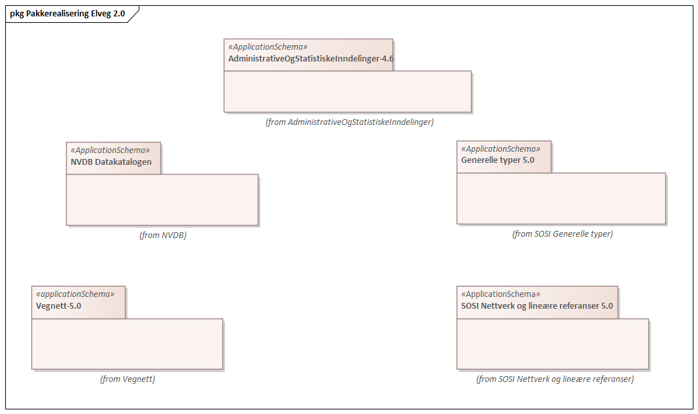
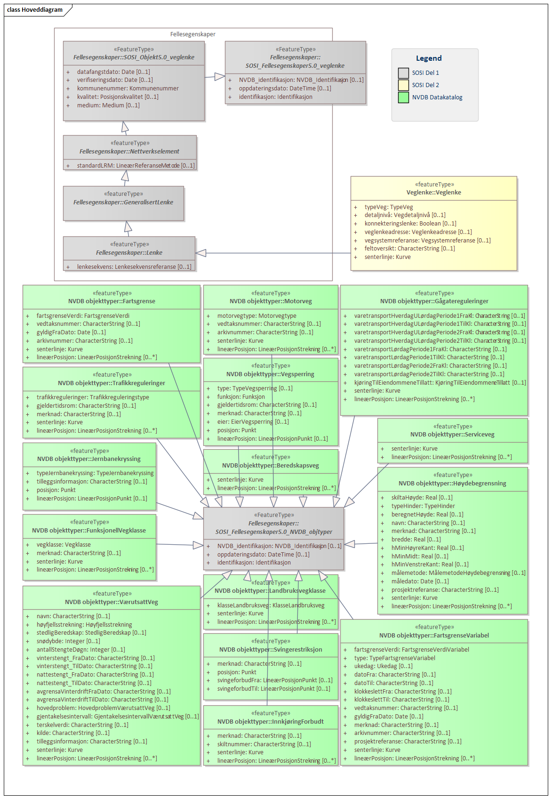
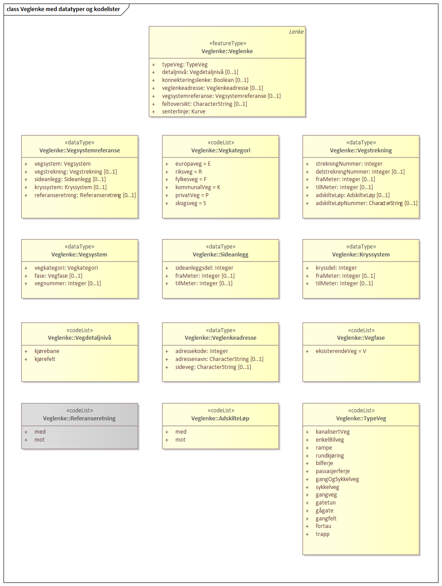
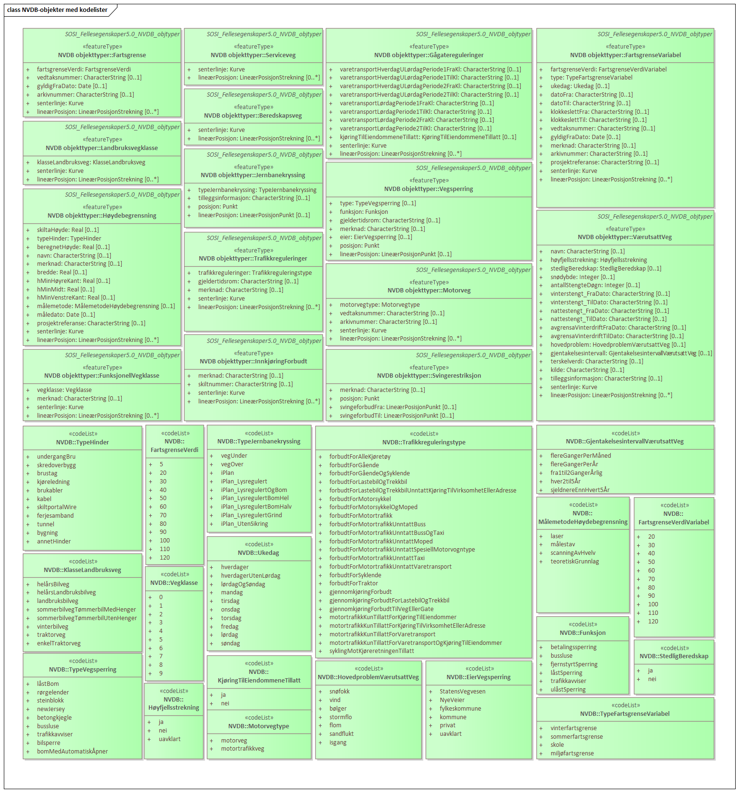
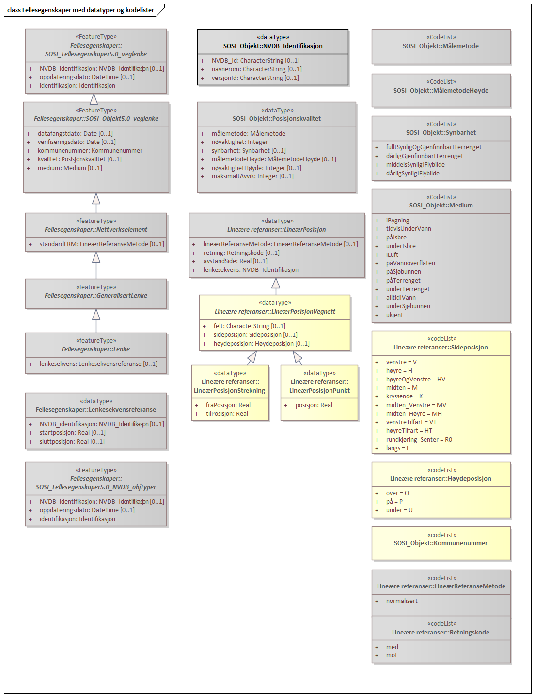
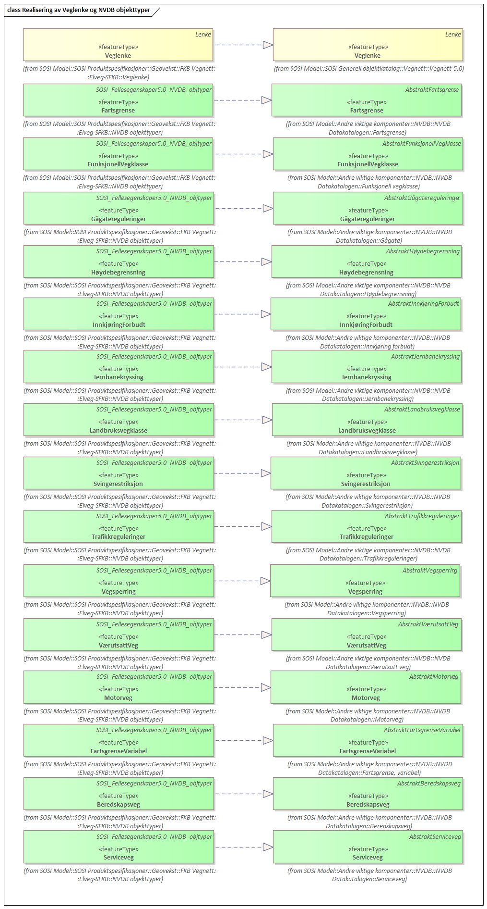
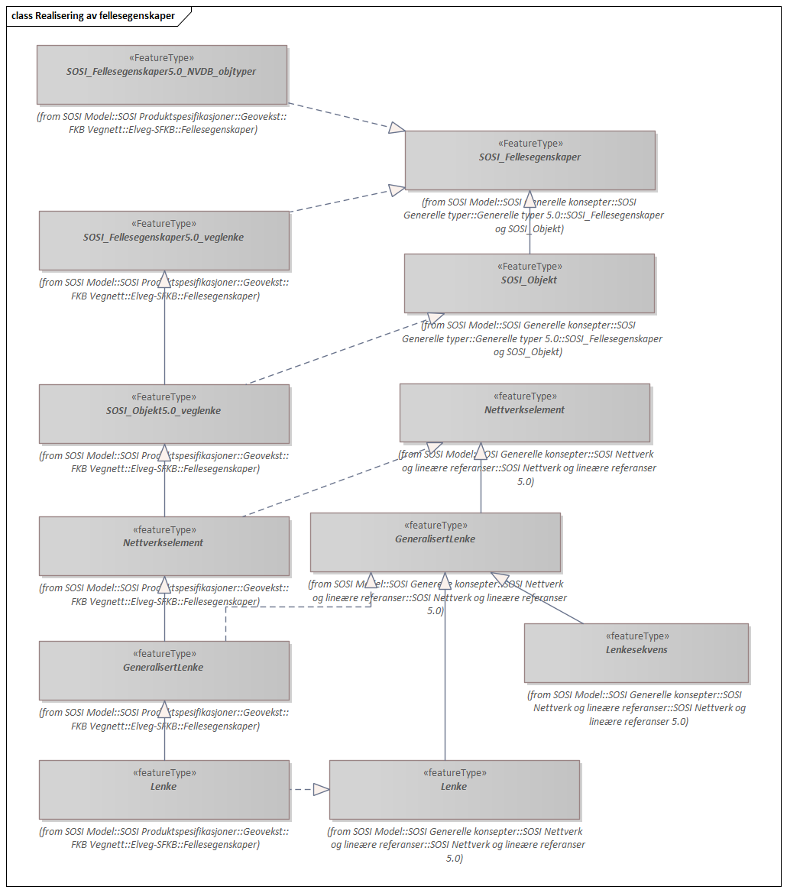
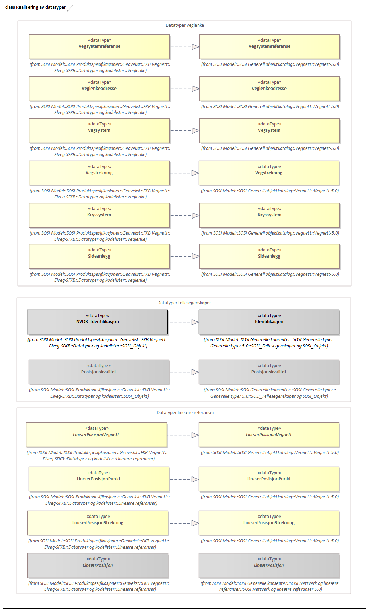
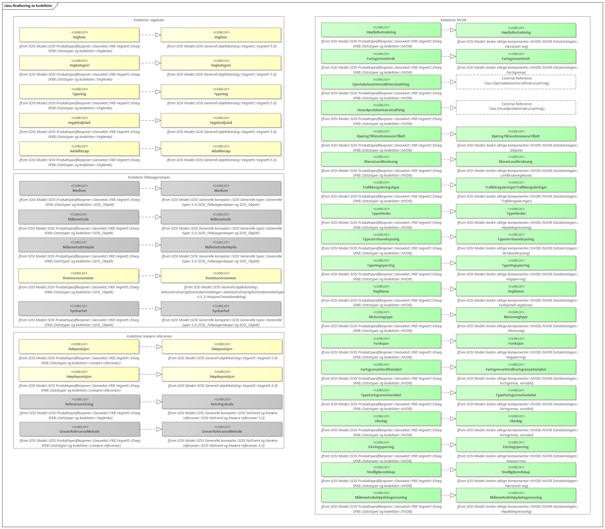

= Dokumentasjon av UML-modell Elveg-SFKB
:sectnums:
:toc: left
:toc-title: Innholdsfortegnelse
:toclevels: 3
:figure-caption: Figur
:table-caption: Tabell
:doctype: article
:encoding: utf-8
:lang: nb
:appendix-caption: Vedlegg
:pdf-page-size: A4

CAUTION: Testversjon 2021-08-17

=== «ApplicationSchema» Elveg-SFKB
Definisjon: 
 
===== Tagged Values
[cols="20,80"]
|===
|SOSI_kortnavn
|Elveg-SFKB
 
|SOSI_langnavn
|Elveg Sentral FKB
 
|SOSI_modellstatus
|utkast
 
|SOSI_spesifikasjonstype
|Produktspesifikasjon
 
|SOSI_versjon
|5.0
 
|targetNamespace
|https://skjema.geonorge.no/SOSI/produktspesifikasjon/Elveg/2.0
 
|version
|5.0
 
|xmlns
|app
 
|xsdDocument
|Elveg-SFKB-2.0.xsd
 
|xsdEncodingRule
|sosi
 
|===
[caption="Figur 1: ",title=Pakkerealisering Elveg 2.0]

[caption="Figur 2: ",title=Hoveddiagram]

[caption="Figur 3: ",title=Veglenke med datatyper og kodelister]

[caption="Figur 4: ",title=NVDB-objekter med kodelister]

[caption="Figur 5: ",title=Fellesegenskaper med datatyper og kodelister]

[caption="Figur 6: ",title=Realisering av Veglenke og NVDB objekttyper]

[caption="Figur 7: ",title=Realisering av fellesegenskaper]

[caption="Figur 8: ",title=Realisering av datatyper]

[caption="Figur 9: ",title=Realisering av kodelister]

=== Pakke: Veglenke
Definisjon: Pakke med objekttypen som representerer lenker i vegnettet
 
==== «featureType» Veglenke
Definisjon: Objekttype som representerer lenker i vegnettet
Eksempel: NVDB Referanselenkedeler, NVDB Transportlenker
 
*Supertype:* «featureType» Lenke
 
*Realisering av:* «applicationSchema» Vegnett-5.0::«featureType» Veglenke
 
===== Egenskaper
[cols="20,80"]
|===
|*Navn:* 
|*typeVeg*
 
|Definisjon: 
|type veg (FormOfWay). 
 
|Multiplisitet: 
|[1..1]
 
|Type: 
|TypeVeg
|Tagged Values: 
|
SOSI_navn: TYPEVEG + 
|===
[cols="20,80"]
|===
|*Navn:* 
|*detaljnivå*
 
|Definisjon: 
|Detaljnivå i vegnettet. 
 
|Multiplisitet: 
|[0..1]
 
|Type: 
|Vegdetaljnivå
|Tagged Values: 
|
SOSI_navn: DETALJNIVÅ + 
|===
[cols="20,80"]
|===
|*Navn:* 
|*konnekteringslenke*
 
|Definisjon: 
|angir at en lenke kun eksisterer for å knytte sammen andre lenker.
Et kunstig objekt hvor senterlinjen representerer en konstruert linje som skjøter sammen lenker der det er hull i geometrien.
 
|Multiplisitet: 
|[0..1]
 
|Type: 
|Boolean
|Tagged Values: 
|
SOSI_datatype: BOOLSK + 
SOSI_navn: KONNEKTERINGSLENKE + 
|===
[cols="20,80"]
|===
|*Navn:* 
|*veglenkeadresse*
 
|Definisjon: 
|sammensatt identifikator for veglenkeadresse.
Merknad: Komplett vegadresse består i tillegg av husnummer og bokstav
 
|Multiplisitet: 
|[0..1]
 
|Type: 
|Veglenkeadresse
|Tagged Values: 
|
SOSI_navn: VEGLENKEADRESSE + 
|===
[cols="20,80"]
|===
|*Navn:* 
|*vegsystemreferanse*
 
|Definisjon: 
|sammensatt identifikator for vegreferanse
 
|Multiplisitet: 
|[0..1]
 
|Type: 
|Vegsystemreferanse
|Tagged Values: 
|
SOSI_navn: VEGSYSTEMREFERANSE + 
|===
[cols="20,80"]
|===
|*Navn:* 
|*feltoversikt*
 
|Definisjon: 
|kjørefeltnummer angir stedfesting i vegens tverretning 
 
|Multiplisitet: 
|[0..1]
 
|Type: 
|CharacterString
|Tagged Values: 
|
SOSI_datatype: T + 
SOSI_lengde: 50 + 
SOSI_navn: FELTOVERSIKT + 
|===
[cols="20,80"]
|===
|*Navn:* 
|*senterlinje*
 
|Definisjon: 
|forløp som følger objektets sentrale del 
 
|Multiplisitet: 
|[1..1]
 
|Type: 
|Kurve
|===
=== Pakke: NVDB objekttyper
Definisjon: Pakke med objekter hentet ut fra NVDB objektkatalogen
 
==== «featureType» Beredskapsveg
Definisjon: Vegstrekning som ikke er åpen for allmenn trafikk. Åpnes for å lede trafikk til en annen veg når hovedvegen stenges.
 
*Supertype:* «FeatureType» SOSI_Fellesegenskaper5.0_NVDB_objtyper
 
*Realisering av:* «ApplicationSchema» NVDB Datakatalogen/Beredskapsveg::«featureType» Beredskapsveg
 
===== Tagged Values
[cols="20,80"]
|===
|byValuePropertyType
|false
 
|catalogue-entry
|NVDB Datakatalogen
 
|isCollection
|false
 
|noPropertyType
|false
 
|NVDB_ID
|923
 
|NVDB_navn
|Beredskapsveg
 
|SOSI_navn
|BEREDSKAPSVEG
 
|===
===== Egenskaper
[cols="20,80"]
|===
|*Navn:* 
|*senterlinje*
 
|Definisjon: 
|Angivelse av objektets posisjon
 
|Multiplisitet: 
|[1..1]
 
|Type: 
|Kurve
|===
[cols="20,80"]
|===
|*Navn:* 
|*lineærPosisjon*
 
|Definisjon: 
|Angivelse av posisjon på det lineære objektet.
 
|Multiplisitet: 
|[0..*]
 
|Type: 
|LineærPosisjonStrekning
|Tagged Values: 
|
SOSI_navn: LRSTREKNING + 
|===
===== Restriksjoner
[cols="20,80"]
|===
|*Navn:* 
|*LineærPosisjon skal ha retning*
 
|Beskrivelse: 
|inv:count(self.lineærPosisjon.retning)=1
 
|*Navn:* 
|*Må ha minst en av stedfestingene lineærPosisjon og senterlinje*
 
|Beskrivelse: 
|inv:count(self.senterlinje)+count(self.lineærposisjon)>0
 
|===
 
==== «featureType» Fartsgrense
Definisjon: Høyeste tillatte hastighet på en vegstrekning.
 
*Supertype:* «FeatureType» SOSI_Fellesegenskaper5.0_NVDB_objtyper
 
*Realisering av:* «ApplicationSchema» NVDB Datakatalogen/Fartsgrense::«featureType» Fartsgrense
 
===== Tagged Values
[cols="20,80"]
|===
|byValuePropertyType
|false
 
|catalogue-entry
|NVDB Datakatalogen
 
|isCollection
|false
 
|noPropertyType
|false
 
|NVDB_ID
|105
 
|NVDB_navn
|Fartsgrense
 
|SOSI_navn
|FARTSGRENSE
 
|===
===== Egenskaper
[cols="20,80"]
|===
|*Navn:* 
|*fartsgrenseVerdi*
 
|Definisjon: 
|Fartsgrense
Enhet: Kilometer/time
 
|Multiplisitet: 
|[1..1]
 
|Type: 
|FartsgrenseVerdi
|Tagged Values: 
|
NVDB_ID: 2021 + 
NVDB_navn: Fartsgrense + 
SOSI_datatype: H + 
SOSI_lengde: 3 + 
SOSI_navn: FARTSGRENSEVERDI + 
|===
[cols="20,80"]
|===
|*Navn:* 
|*vedtaksnummer*
 
|Definisjon: 
|Angir vedtaksnummer
 
|Multiplisitet: 
|[0..1]
 
|Type: 
|CharacterString
|Tagged Values: 
|
NVDB_ID: 1891 + 
NVDB_navn: Vedtaksnummer + 
SOSI_datatype: T + 
SOSI_lengde: 30 + 
SOSI_navn: VEDTAKSNUMMER + 
|===
[cols="20,80"]
|===
|*Navn:* 
|*gyldigFraDato*
 
|Definisjon: 
|Dato for når fartsgrense ble satt i drift.  Den dato skiltene ble "avduket".
 
|Multiplisitet: 
|[0..1]
 
|Type: 
|Date
|Tagged Values: 
|
NVDB_ID: 5127 + 
NVDB_navn: Gyldig fra dato + 
SOSI_datatype: DATO + 
SOSI_navn: GYLDIGFRADATO + 
|===
[cols="20,80"]
|===
|*Navn:* 
|*arkivnummer*
 
|Definisjon: 
|Gir referanse til relevant sak i vegeiers arkivsystem
 
|Multiplisitet: 
|[0..1]
 
|Type: 
|CharacterString
|Tagged Values: 
|
NVDB_ID: 9155 + 
NVDB_navn: Arkivnummer + 
SOSI_datatype: T + 
SOSI_lengde: 250 + 
SOSI_navn: ARKIVNUMMER + 
|===
[cols="20,80"]
|===
|*Navn:* 
|*senterlinje*
 
|Definisjon: 
|Angivelse av objektets posisjon
 
|Multiplisitet: 
|[1..1]
 
|Type: 
|Kurve
|===
[cols="20,80"]
|===
|*Navn:* 
|*lineærPosisjon*
 
|Definisjon: 
|Angivelse av posisjon på det lineære objektet.
 
|Multiplisitet: 
|[0..*]
 
|Type: 
|LineærPosisjonStrekning
|Tagged Values: 
|
SOSI_navn: LRSTREKNING + 
|===
===== Restriksjoner
[cols="20,80"]
|===
|*Navn:* 
|*Må ha minst en av stedfestingene lineærPosisjon og senterlinje*
 
|Beskrivelse: 
|inv:count(self.senterlinje)+count(self.lineærposisjon)>0
 
|===
 
==== «featureType» FartsgrenseVariabel
Definisjon: Høyeste tillatte hastighet på en vegstrekning innenfor et avgrenset tidsrom.
 
*Supertype:* «FeatureType» SOSI_Fellesegenskaper5.0_NVDB_objtyper
 
*Realisering av:* «ApplicationSchema» NVDB Datakatalogen/Fartsgrense, variabel::«featureType» FartsgrenseVariabel
 
===== Tagged Values
[cols="20,80"]
|===
|byValuePropertyType
|false
 
|catalogue-entry
|NVDB Datakatalogen
 
|isCollection
|false
 
|noPropertyType
|false
 
|NVDB_ID
|721
 
|NVDB_navn
|Fartsgrense,variabel
 
|SOSI_navn
|FARTSGRENSEVARIABEL
 
|===
===== Egenskaper
[cols="20,80"]
|===
|*Navn:* 
|*fartsgrenseVerdi*
 
|Definisjon: 
|Verdien på fartsgrensen i angitt tidsrom
Enhet: Kilometer/time
 
|Multiplisitet: 
|[1..1]
 
|Type: 
|FartsgrenseVerdiVariabel
|Tagged Values: 
|
NVDB_ID: 7023 + 
NVDB_navn: Fartsgrense + 
SOSI_datatype: H + 
SOSI_lengde: 3 + 
SOSI_navn: FARTSGRENSEVERDI + 
|===
[cols="20,80"]
|===
|*Navn:* 
|*type*
 
|Definisjon: 
|Angir hvilken type variabel fartsgrense det er
 
|Multiplisitet: 
|[1..1]
 
|Type: 
|TypeFartsgrenseVariabel
|Tagged Values: 
|
NVDB_ID: 7016 + 
NVDB_navn: Type + 
SOSI_datatype: T + 
SOSI_lengde: 30 + 
SOSI_navn: TYPE + 
|===
[cols="20,80"]
|===
|*Navn:* 
|*ukedag*
 
|Definisjon: 
|Angir ukedager en variabel fartsgrense gjelder for.
 
|Multiplisitet: 
|[0..1]
 
|Type: 
|Ukedag
|Tagged Values: 
|
NVDB_ID: 9401 + 
NVDB_navn: Ukedag + 
SOSI_datatype: T + 
SOSI_lengde: 30 + 
SOSI_navn: UKEDAG + 
|===
[cols="20,80"]
|===
|*Navn:* 
|*datoFra*
 
|Definisjon: 
|Angir dato (mmdd) som variabel fartsgrense gjelder fra og med i et normalår.
 
|Multiplisitet: 
|[0..1]
 
|Type: 
|CharacterString
|Tagged Values: 
|
NVDB_ID: 7019 + 
NVDB_navn: Dato, fra + 
SOSI_datatype: T + 
SOSI_lengde: 4 + 
SOSI_navn: DATOFRA + 
|===
[cols="20,80"]
|===
|*Navn:* 
|*datoTil*
 
|Definisjon: 
|Angir dato (mmdd) som variabel fartsgrense gjelder til og med i et normalår.
 
|Multiplisitet: 
|[0..1]
 
|Type: 
|CharacterString
|Tagged Values: 
|
NVDB_ID: 7022 + 
NVDB_navn: Dato, til + 
SOSI_datatype: T + 
SOSI_lengde: 4 + 
SOSI_navn: DATOTIL + 
|===
[cols="20,80"]
|===
|*Navn:* 
|*klokkeslettFra*
 
|Definisjon: 
|Angir tidspunkt (hhmm) på døgnet som variabel fartsgrense gjelder fra.
 
|Multiplisitet: 
|[0..1]
 
|Type: 
|CharacterString
|Tagged Values: 
|
NVDB_ID: 7017 + 
NVDB_navn: Klokkeslett, fra + 
SOSI_datatype: T + 
SOSI_lengde: 4 + 
SOSI_navn: KLOKKESLETTFRA + 
|===
[cols="20,80"]
|===
|*Navn:* 
|*klokkeslettTil*
 
|Definisjon: 
|Angir tidspunkt på døgnet (hhmm) som variabel fartsgrense gjelder til
 
|Multiplisitet: 
|[0..1]
 
|Type: 
|CharacterString
|Tagged Values: 
|
NVDB_ID: 7018 + 
NVDB_navn: Klokkeslett, til + 
SOSI_datatype: T + 
SOSI_lengde: 4 + 
SOSI_navn: KLOKKESLETTTIL + 
|===
[cols="20,80"]
|===
|*Navn:* 
|*vedtaksnummer*
 
|Definisjon: 
|Angir vedtaksnummer
 
|Multiplisitet: 
|[0..1]
 
|Type: 
|CharacterString
|Tagged Values: 
|
NVDB_ID: 9402 + 
NVDB_navn: Vedtaksnummer + 
SOSI_datatype: T + 
SOSI_lengde: 15 + 
SOSI_navn: VEDTAKSNUMMER + 
|===
[cols="20,80"]
|===
|*Navn:* 
|*gyldigFraDato*
 
|Definisjon: 
|Dato for når fartsgrense ble satt i drift.  Den dato skiltene ble "avduket".
 
|Multiplisitet: 
|[0..1]
 
|Type: 
|Date
|Tagged Values: 
|
NVDB_ID: 9400 + 
NVDB_navn: Gyldig fra dato + 
SOSI_datatype: DATO + 
SOSI_navn: GYLDIGFRADATO + 
|===
[cols="20,80"]
|===
|*Navn:* 
|*merknad*
 
|Definisjon: 
|Kan gi merknad i forhold til variabel fartsgrense.  F.eks spesifikasjon av gyldighet, retningslinjer for nedsetting av fartsgrense etc
 
|Multiplisitet: 
|[0..1]
 
|Type: 
|CharacterString
|Tagged Values: 
|
NVDB_ID: 8829 + 
NVDB_navn: Merknad + 
SOSI_datatype: T + 
SOSI_lengde: 400 + 
SOSI_navn: MERKNAD + 
|===
[cols="20,80"]
|===
|*Navn:* 
|*arkivnummer*
 
|Definisjon: 
|Gir referanse til relevant sak i vegeiers arkivsystem
 
|Multiplisitet: 
|[0..1]
 
|Type: 
|CharacterString
|Tagged Values: 
|
NVDB_ID: 9399 + 
NVDB_navn: Arkivnummer + 
SOSI_datatype: T + 
SOSI_lengde: 250 + 
SOSI_navn: ARKIVNUMMER + 
|===
[cols="20,80"]
|===
|*Navn:* 
|*prosjektreferanse*
 
|Definisjon: 
|Referanse til prosjekt. Benyttes for å lettere kunne skille nye data fra eksisterende data i NVDB
 
|Multiplisitet: 
|[0..1]
 
|Type: 
|CharacterString
|Tagged Values: 
|
NVDB_ID: 11465 + 
NVDB_navn: Prosjektreferanse + 
SOSI_datatype: T + 
SOSI_lengde: 200 + 
SOSI_navn: PROSJEKTREFERANSE + 
|===
[cols="20,80"]
|===
|*Navn:* 
|*senterlinje*
 
|Definisjon: 
|Angivelse av objektets posisjon
 
|Multiplisitet: 
|[1..1]
 
|Type: 
|Kurve
|===
[cols="20,80"]
|===
|*Navn:* 
|*lineærPosisjon*
 
|Definisjon: 
|Angivelse av posisjon på det lineære objektet.
 
|Multiplisitet: 
|[0..*]
 
|Type: 
|LineærPosisjonStrekning
|Tagged Values: 
|
SOSI_navn: LRSTREKNING + 
|===
===== Restriksjoner
[cols="20,80"]
|===
|*Navn:* 
|*Må ha minst en av stedfestingene lineærPosisjon og senterlinje*
 
|Beskrivelse: 
|inv:count(self.senterlinje)+count(self.lineærposisjon)>0
 
|===
 
==== «featureType» FunksjonellVegklasse
Definisjon: En klassifisering basert på hvor viktig en veg er for det totale vegnettets forbindelsesmuligheter. Brukes blant annet for vekting i ruteplanlegging
 
*Supertype:* «FeatureType» SOSI_Fellesegenskaper5.0_NVDB_objtyper
 
*Realisering av:* «ApplicationSchema» NVDB Datakatalogen/Funksjonell vegklasse::«featureType» FunksjonellVegklasse
 
===== Tagged Values
[cols="20,80"]
|===
|byValuePropertyType
|false
 
|catalogue-entry
|NVDB Datakatalogen
 
|isCollection
|false
 
|noPropertyType
|false
 
|NVDB_ID
|821
 
|NVDB_navn
|Funksjonell vegklasse
 
|SOSI_navn
|FUNKSJONELLVEGKLASSE
 
|===
===== Egenskaper
[cols="20,80"]
|===
|*Navn:* 
|*vegklasse*
 
|Definisjon: 
|Angir funksjonell vegklasse
 
|Multiplisitet: 
|[1..1]
 
|Type: 
|Vegklasse
|Tagged Values: 
|
NVDB_ID: 9338 + 
NVDB_navn: Vegklasse + 
SOSI_datatype: H + 
SOSI_lengde: 1 + 
SOSI_navn: VEGKLASSE + 
|===
[cols="20,80"]
|===
|*Navn:* 
|*merknad*
 
|Definisjon: 
|Permanent merknad til aktuell forekomst.  Kan gi informasjoner som ikke er mulig å gi på annet vis.
 
|Multiplisitet: 
|[0..1]
 
|Type: 
|CharacterString
|Tagged Values: 
|
NVDB_ID: 10183 + 
NVDB_navn: Merknad + 
SOSI_datatype: T + 
SOSI_lengde: 250 + 
SOSI_navn: MERKNAD + 
|===
[cols="20,80"]
|===
|*Navn:* 
|*senterlinje*
 
|Definisjon: 
|Angivelse av objektets posisjon
 
|Multiplisitet: 
|[1..1]
 
|Type: 
|Kurve
|===
[cols="20,80"]
|===
|*Navn:* 
|*lineærPosisjon*
 
|Definisjon: 
|Angivelse av posisjon på det lineære objektet.
 
|Multiplisitet: 
|[0..*]
 
|Type: 
|LineærPosisjonStrekning
|Tagged Values: 
|
SOSI_navn: LRSTREKNING + 
|===
===== Restriksjoner
[cols="20,80"]
|===
|*Navn:* 
|*Må ha minst en av stedfestingene lineærPosisjon og senterlinje*
 
|Beskrivelse: 
|inv:count(self.senterlinje)+count(self.lineærposisjon)>0
 
|===
 
==== «featureType» Gågatereguleringer
Definisjon: Gate uten fortau reservert for gående hvor trafikkreglene for gågate gjelder
 
*Supertype:* «FeatureType» SOSI_Fellesegenskaper5.0_NVDB_objtyper
 
*Realisering av:* «ApplicationSchema» NVDB Datakatalogen/Gågate::«featureType» Gågatereguleringer
 
===== Tagged Values
[cols="20,80"]
|===
|byValuePropertyType
|false
 
|catalogue-entry
|NVDB Datakatalogen
 
|isCollection
|false
 
|noPropertyType
|false
 
|NVDB_ID
|813
 
|NVDB_navn
|Gågate
 
|SOSI_navn
|GÅGATEREGULERINGER
 
|===
===== Egenskaper
[cols="20,80"]
|===
|*Navn:* 
|*varetransportHverdagULørdagPeriode1FraKl*
 
|Definisjon: 
|Varetransport hverdag unntatt lørdag periode 1, fra klokkeslett
 
|Multiplisitet: 
|[0..1]
 
|Type: 
|CharacterString
|Tagged Values: 
|
NVDB_ID: 9314 + 
NVDB_navn: Varetransport hverdag u lørdag periode 1 fra kl + 
SOSI_datatype: T + 
SOSI_lengde: 4 + 
SOSI_navn: VARETRANSPORTULØRPERIODE1FRAKL + 
|===
[cols="20,80"]
|===
|*Navn:* 
|*varetransportHverdagULørdagPeriode1TilKl*
 
|Definisjon: 
|Varetransport hverdag unntatt lørdag periode 1, til klokkeslett
 
|Multiplisitet: 
|[0..1]
 
|Type: 
|CharacterString
|Tagged Values: 
|
NVDB_ID: 9315 + 
NVDB_navn: Varetransport hverdag u lørdag periode 1 til kl + 
SOSI_datatype: T + 
SOSI_lengde: 4 + 
SOSI_navn: VARETRANSPORTULØRPERIODE1TILKL + 
|===
[cols="20,80"]
|===
|*Navn:* 
|*varetransportHverdagULørdagPeriode2FraKl*
 
|Definisjon: 
|Varetransport hverdag unntatt lørdag periode 2, fra klokkeslett
 
|Multiplisitet: 
|[0..1]
 
|Type: 
|CharacterString
|Tagged Values: 
|
NVDB_ID: 9316 + 
NVDB_navn: Varetransport hverdag u lørdag periode 2 fra kl + 
SOSI_datatype: T + 
SOSI_lengde: 4 + 
SOSI_navn: VARETRANSPORTULØRPERIODE2FRAKL + 
|===
[cols="20,80"]
|===
|*Navn:* 
|*varetransportHverdagULørdagPeriode2TilKl*
 
|Definisjon: 
|Varetransport lørdag periode 1, fra klokkeslett
 
|Multiplisitet: 
|[0..1]
 
|Type: 
|CharacterString
|Tagged Values: 
|
NVDB_navn: Varetransport hverdag u lørdag periode 2 til kl + 
SOSI_datatype: T + 
SOSI_lengde: 4 + 
SOSI_navn: VARETRANSPORTULØRPERIODE2TILKL + 
|===
[cols="20,80"]
|===
|*Navn:* 
|*varetransportLørdagPeriode1FraKl*
 
|Definisjon: 
|Varetransport lørdag periode 1, fra klokkeslett
 
|Multiplisitet: 
|[0..1]
 
|Type: 
|CharacterString
|Tagged Values: 
|
NVDB_navn: Varetransport lørdag periode 1 fra kl + 
SOSI_datatype: T + 
SOSI_lengde: 4 + 
SOSI_navn: VARETRANSPORTLØRPERIODE1FRAKL + 
|===
[cols="20,80"]
|===
|*Navn:* 
|*varetransportLørdagPeriode1TilKl*
 
|Definisjon: 
|Varetransport lørdag periode 1, til klokkeslett
 
|Multiplisitet: 
|[0..1]
 
|Type: 
|CharacterString
|Tagged Values: 
|
NVDB_ID: 11538 + 
NVDB_navn: Varetransport lørdag periode 1 til kl + 
SOSI_datatype: T + 
SOSI_lengde: 4 + 
SOSI_navn: VARETRANSPORTLØRPERIODE1TILKL + 
|===
[cols="20,80"]
|===
|*Navn:* 
|*varetransportLørdagPeriode2FraKl*
 
|Definisjon: 
|Varetransport lørdag periode 2, fra klokkeslett
 
|Multiplisitet: 
|[0..1]
 
|Type: 
|CharacterString
|Tagged Values: 
|
NVDB_ID: 11539 + 
NVDB_navn: Varetransport lørdag periode 2 fra kl + 
SOSI_datatype: T + 
SOSI_lengde: 4 + 
SOSI_navn: VARETRANSPORTLØRPERIODE2FRAKL + 
|===
[cols="20,80"]
|===
|*Navn:* 
|*varetransportLørdagPeriode2TilKl*
 
|Definisjon: 
|Varetransport lørdag periode 2, til klokkeslett
 
|Multiplisitet: 
|[0..1]
 
|Type: 
|CharacterString
|Tagged Values: 
|
NVDB_navn: Varetransport lørdag periode 2 til kl + 
SOSI_datatype: T + 
SOSI_lengde: 4 + 
SOSI_navn: VARETRANSPORTLØRPERIODE2TILKL + 
|===
[cols="20,80"]
|===
|*Navn:* 
|*kjøringTilEiendommeneTillatt*
 
|Definisjon: 
|
 
|Multiplisitet: 
|[0..1]
 
|Type: 
|KjøringTilEiendommeneTillatt
|Tagged Values: 
|
NVDB_ID: 9313 + 
NVDB_navn: Kjøring til eiendommene tillatt + 
SOSI_datatype: T + 
SOSI_lengde: 3 + 
SOSI_navn: KJØRINGTILEIENDOMMENETILLATT + 
|===
[cols="20,80"]
|===
|*Navn:* 
|*senterlinje*
 
|Definisjon: 
|Gir linje/kurve som geometrisk representerer objektet.
 
|Multiplisitet: 
|[1..1]
 
|Type: 
|Kurve
|Tagged Values: 
|
NVDB_ID: 9322 + 
NVDB_navn: Geometri, linje + 
SOSI_datatype: KURVE + 
SOSI_navn: SENTERLINJE + 
|===
[cols="20,80"]
|===
|*Navn:* 
|*lineærPosisjon*
 
|Definisjon: 
|Angivelse av posisjon på det lineære objektet.
 
|Multiplisitet: 
|[0..*]
 
|Type: 
|LineærPosisjonStrekning
|Tagged Values: 
|
SOSI_navn: LRSTREKNING + 
|===
===== Restriksjoner
[cols="20,80"]
|===
|*Navn:* 
|*Må ha minst en av stedfestingene lineærPosisjon og senterlinje*
 
|Beskrivelse: 
|inv:count(self.senterlinje)+count(self.lineærposisjon)>0
 
|===
 
==== «featureType» Høydebegrensning
Definisjon: Strekning i vegnettet hvor kjøretøy kan komme i konflikt med overliggende hinder
 
*Supertype:* «FeatureType» SOSI_Fellesegenskaper5.0_NVDB_objtyper
 
*Realisering av:* «ApplicationSchema» NVDB Datakatalogen/Høydebegrensning::«featureType» Høydebegrensning
 
===== Tagged Values
[cols="20,80"]
|===
|byValuePropertyType
|false
 
|catalogue-entry
|NVDB Datakatalogen
 
|isCollection
|false
 
|noPropertyType
|false
 
|NVDB_ID
|591
 
|NVDB_navn
|Høydebegrensning
 
|SOSI_navn
|HØYDEBEGRENSNING
 
|===
===== Egenskaper
[cols="20,80"]
|===
|*Navn:* 
|*skiltaHøyde*
 
|Definisjon: 
|Angir skilta høyde i forbindelse med høydebegrensningen. Håndbok N300 (050) beskriver hvordan verdier beregnes ut fra målte høyder
Enhet: Meter
 
|Multiplisitet: 
|[0..1]
 
|Type: 
|Real
|Tagged Values: 
|
NVDB_ID: 5277 + 
NVDB_navn: Skilta høyde + 
SOSI_datatype: D + 
SOSI_lengde: 3 + 
SOSI_navn: SKILTAHØYDE + 
|===
[cols="20,80"]
|===
|*Navn:* 
|*typeHinder*
 
|Definisjon: 
|Angir hvilken type hinder det er tale om
 
|Multiplisitet: 
|[1..1]
 
|Type: 
|TypeHinder
|Tagged Values: 
|
NVDB_ID: 5270 + 
NVDB_navn: Type hinder + 
SOSI_datatype: T + 
SOSI_lengde: 50 + 
SOSI_navn: TYPEHINDER + 
|===
[cols="20,80"]
|===
|*Navn:* 
|*beregnetHøyde*
 
|Definisjon: 
|Minste målte høyde minus sikkerhetsmargin, avrundet ned til nærmeste desimeter (ref. regelverk i håndbok N300, tidl. Hb 050)
Enhet: Meter
 
|Multiplisitet: 
|[0..1]
 
|Type: 
|Real
|Tagged Values: 
|
NVDB_ID: 10247 + 
NVDB_navn: Beregnet høyde + 
SOSI_datatype: D + 
SOSI_lengde: 5 + 
SOSI_navn: BEREGNETHØYDE + 
|===
[cols="20,80"]
|===
|*Navn:* 
|*navn*
 
|Definisjon: 
|Gir navn tilknyttet høydebegrensning
 
|Multiplisitet: 
|[0..1]
 
|Type: 
|CharacterString
|Tagged Values: 
|
NVDB_ID: 5778 + 
NVDB_navn: Navn + 
SOSI_datatype: T + 
SOSI_lengde: 50 + 
SOSI_navn: NAVN + 
|===
[cols="20,80"]
|===
|*Navn:* 
|*merknad*
 
|Definisjon: 
|Merknad som gjelder for den bestemte forekomsten uavhengig av tid
 
|Multiplisitet: 
|[0..1]
 
|Type: 
|CharacterString
|Tagged Values: 
|
NVDB_ID: 5285 + 
NVDB_navn: Merknad + 
SOSI_datatype: T + 
SOSI_lengde: 50 + 
SOSI_navn: MERKNAD + 
|===
[cols="20,80"]
|===
|*Navn:* 
|*bredde*
 
|Definisjon: 
|Angir minste bredde mellom høydemåling for venstre og høyre side.
Enhet: Meter
 
|Multiplisitet: 
|[0..1]
 
|Type: 
|Real
|Tagged Values: 
|
NVDB_ID: 3846 + 
NVDB_navn: Bredde + 
SOSI_datatype: D + 
SOSI_lengde: 5 + 
SOSI_navn: BREDDE + 
|===
[cols="20,80"]
|===
|*Navn:* 
|*hMinHøyreKant*
 
|Definisjon: 
|Angir minste høyde for høydebegrensningens høyre kjørebanekant.  Høyre og venstre bestemmes ut fra at en er vendt i retning av vegens metreringsretning.
Enhet: Meter
 
|Multiplisitet: 
|[0..1]
 
|Type: 
|Real
|Tagged Values: 
|
NVDB_ID: 3868 + 
NVDB_navn: H-min, høyre kant + 
SOSI_datatype: D + 
SOSI_lengde: 5 + 
SOSI_navn: HMINHØYREKANT + 
|===
[cols="20,80"]
|===
|*Navn:* 
|*hMinMidt*
 
|Definisjon: 
|Angir minste høyde innenfor et 3-metersbelte vanligvis plassert i midten av høydebegrensningen.
Enhet: Meter
 
|Multiplisitet: 
|[0..1]
 
|Type: 
|Real
|Tagged Values: 
|
NVDB_ID: 3869 + 
NVDB_navn: H-min, midt + 
SOSI_datatype: D + 
SOSI_lengde: 5 + 
SOSI_navn: HMINMIDT + 
|===
[cols="20,80"]
|===
|*Navn:* 
|*hMinVenstreKant*
 
|Definisjon: 
|Angir minste høyde for høydebegrensningens venstre kjørebanekant.  Høyre og venstre bestemmes ut fra at en er vendt i retning av vegens metreringsretning.
Enhet: Meter
 
|Multiplisitet: 
|[0..1]
 
|Type: 
|Real
|Tagged Values: 
|
NVDB_ID: 3870 + 
NVDB_navn: H-min, venstre kant + 
SOSI_datatype: D + 
SOSI_lengde: 5 + 
SOSI_navn: HMINVENSTREKANT + 
|===
[cols="20,80"]
|===
|*Navn:* 
|*målemetode*
 
|Definisjon: 
|Angir målemetode som er brukt for å måle høyder
 
|Multiplisitet: 
|[0..1]
 
|Type: 
|MålemetodeHøydebegrensning
|Tagged Values: 
|
NVDB_ID: 9490 + 
NVDB_navn: Målemetode + 
SOSI_datatype: T + 
SOSI_lengde: 20 + 
SOSI_navn: MÅLEMETODEHØYDEBEGRENSNING + 
|===
[cols="20,80"]
|===
|*Navn:* 
|*måledato*
 
|Definisjon: 
|Angir dato når innmåling er gjort
 
|Multiplisitet: 
|[0..1]
 
|Type: 
|Date
|Tagged Values: 
|
NVDB_ID: 9489 + 
NVDB_navn: Måledato + 
SOSI_datatype: DATO + 
SOSI_navn: MÅLEDATO + 
|===
[cols="20,80"]
|===
|*Navn:* 
|*prosjektreferanse*
 
|Definisjon: 
|Referanse til prosjekt. Benyttes for å lettere kunne skille nye data fra eksisterende data i NVDB
 
|Multiplisitet: 
|[0..1]
 
|Type: 
|CharacterString
|Tagged Values: 
|
NVDB_ID: 11149 + 
NVDB_navn: Prosjektreferanse + 
SOSI_datatype: T + 
SOSI_lengde: 200 + 
SOSI_navn: PROSJEKTREFERANSE + 
|===
[cols="20,80"]
|===
|*Navn:* 
|*senterlinje*
 
|Definisjon: 
|Gir linje/kurve som geometrisk representerer objektet.
 
|Multiplisitet: 
|[1..1]
 
|Type: 
|Kurve
|Tagged Values: 
|
NVDB_ID: 6924 + 
NVDB_navn: Geometri, linje + 
SOSI_datatype: KURVE + 
SOSI_navn: SENTERLINJE + 
|===
[cols="20,80"]
|===
|*Navn:* 
|*lineærPosisjon*
 
|Definisjon: 
|Angivelse av posisjon på det lineære objektet.
 
|Multiplisitet: 
|[0..*]
 
|Type: 
|LineærPosisjonStrekning
|Tagged Values: 
|
SOSI_navn: LRSTREKNING + 
|===
===== Restriksjoner
[cols="20,80"]
|===
|*Navn:* 
|*Må ha minst en av stedfestingene lineærPosisjon og senterlinje*
 
|Beskrivelse: 
|inv:count(self.senterlinje)+count(self.lineærposisjon)>0
 
|===
 
==== «featureType» InnkjøringForbudt
Definisjon: Angir innkjøring forbudt
 
*Supertype:* «FeatureType» SOSI_Fellesegenskaper5.0_NVDB_objtyper
 
*Realisering av:* «ApplicationSchema» NVDB Datakatalogen/Innkjøring forbudt::«featureType» InnkjøringForbudt
 
===== Tagged Values
[cols="20,80"]
|===
|byValuePropertyType
|false
 
|catalogue-entry
|NVDB Datakatalogen
 
|isCollection
|false
 
|noPropertyType
|false
 
|NVDB_ID
|606
 
|NVDB_navn
|Innkjøring forbudt
 
|SOSI_navn
|INNKJØRINGFORBUDT
 
|===
===== Egenskaper
[cols="20,80"]
|===
|*Navn:* 
|*merknad*
 
|Definisjon: 
|Merknad som gjelder for den bestemte forekomsten uavhengig av tid.
 
|Multiplisitet: 
|[0..1]
 
|Type: 
|CharacterString
|Tagged Values: 
|
NVDB_ID: 5476 + 
NVDB_navn: Merknad + 
SOSI_datatype: T + 
SOSI_lengde: 200 + 
SOSI_navn: MERKNAD + 
|===
[cols="20,80"]
|===
|*Navn:* 
|*skiltnummer*
 
|Definisjon: 
|Angir skiltnummer i forbindelse med innkjøring forbudt
 
|Multiplisitet: 
|[0..1]
 
|Type: 
|CharacterString
|Tagged Values: 
|
NVDB_ID: 5475 + 
NVDB_navn: Skiltnummer + 
SOSI_datatype: T + 
SOSI_lengde: 7 + 
SOSI_navn: SKILTNUMMER + 
|===
[cols="20,80"]
|===
|*Navn:* 
|*senterlinje*
 
|Definisjon: 
|Gir linje/kurve som geometrisk representerer objektet.
 
|Multiplisitet: 
|[1..1]
 
|Type: 
|Kurve
|Tagged Values: 
|
NVDB_ID: 6916 + 
NVDB_navn: Geometri, linje + 
SOSI_datatype: KURVE + 
SOSI_navn: SENTERLINJE + 
|===
[cols="20,80"]
|===
|*Navn:* 
|*lineærPosisjon*
 
|Definisjon: 
|Angivelse av posisjon på det lineære objektet.
 
|Multiplisitet: 
|[0..*]
 
|Type: 
|LineærPosisjonStrekning
|Tagged Values: 
|
SOSI_navn: LRSTREKNING + 
|===
===== Restriksjoner
[cols="20,80"]
|===
|*Navn:* 
|*LineærPosisjon skal ha retning*
 
|Beskrivelse: 
|inv:count(self.lineærPosisjon.retning)=1
 
|*Navn:* 
|*Må ha minst en av stedfestingene lineærPosisjon og senterlinje*
 
|Beskrivelse: 
|inv:count(self.senterlinje)+count(self.lineærposisjon)>0
 
|===
 
==== «featureType» Jernbanekryssing
Definisjon: Sted i vegnettet hvor veg og jernbane krysses
 
*Supertype:* «FeatureType» SOSI_Fellesegenskaper5.0_NVDB_objtyper
 
*Realisering av:* «ApplicationSchema» NVDB Datakatalogen/Jernbanekryssing::«featureType» Jernbanekryssing
 
===== Tagged Values
[cols="20,80"]
|===
|byValuePropertyType
|false
 
|catalogue-entry
|NVDB Datakatalogen
 
|isCollection
|false
 
|noPropertyType
|false
 
|NVDB_ID
|100
 
|NVDB_navn
|Jernbanekryssing
 
|SOSI_navn
|JERNBANEKRYSSING
 
|===
===== Egenskaper
[cols="20,80"]
|===
|*Navn:* 
|*typeJernbanekryssing*
 
|Definisjon: 
|Angir hvilken type vegobjektet er av
 
|Multiplisitet: 
|[1..1]
 
|Type: 
|TypeJernbanekryssing
|Tagged Values: 
|
NVDB_ID: 1153 + 
NVDB_navn: Type + 
SOSI_datatype: T + 
SOSI_lengde: 50 + 
SOSI_navn: TYPEJERNBANEKRYSSING + 
|===
[cols="20,80"]
|===
|*Navn:* 
|*tilleggsinformasjon*
 
|Definisjon: 
|Supplerende informasjon om vegobjektet som ikke framkommer direkte av andre egenskapstyper
 
|Multiplisitet: 
|[0..1]
 
|Type: 
|CharacterString
|Tagged Values: 
|
NVDB_ID: 11576 + 
NVDB_navn: Tilleggsinformasjon + 
SOSI_datatype: T + 
SOSI_lengde: 250 + 
SOSI_navn: TILLEGGSINFORMASJON + 
|===
[cols="20,80"]
|===
|*Navn:* 
|*posisjon*
 
|Definisjon: 
|Gir punkt som geometrisk representerer objektet.
 
|Multiplisitet: 
|[1..1]
 
|Type: 
|Punkt
|Tagged Values: 
|
NVDB_ID: 4799 + 
NVDB_navn: Geometri, punkt + 
SOSI_datatype: PUNKT + 
SOSI_navn: POSISJON + 
|===
[cols="20,80"]
|===
|*Navn:* 
|*lineærPosisjon*
 
|Definisjon: 
|Angivelse av posisjon på det lineære objektet.
 
|Multiplisitet: 
|[0..1]
 
|Type: 
|LineærPosisjonPunkt
|Tagged Values: 
|
SOSI_navn: LRPUNKT + 
|===
===== Restriksjoner
[cols="20,80"]
|===
|*Navn:* 
|*Må ha minst en av stedfestingene lineærPosisjon og posisjon*
 
|Beskrivelse: 
|inv:count(self.posisjon)+count(self.lineærPosisjon)>0
 
|===
 
==== «featureType» Landbruksvegklasse
Definisjon: Landbruksmyndighetene sin inndeling av landbruksveger, ut i fra støtteordninger
 
*Supertype:* «FeatureType» SOSI_Fellesegenskaper5.0_NVDB_objtyper
 
*Realisering av:* «ApplicationSchema» NVDB Datakatalogen/Landbruksvegklasse::«featureType» Landbruksvegklasse
 
===== Tagged Values
[cols="20,80"]
|===
|byValuePropertyType
|false
 
|catalogue-entry
|NVDB Datakatalogen
 
|isCollection
|false
 
|noPropertyType
|false
 
|NVDB_ID
|822
 
|NVDB_navn
|Landbruksvegklasse
 
|SOSI_navn
|LANDBRUKSVEGKLASSE
 
|===
===== Egenskaper
[cols="20,80"]
|===
|*Navn:* 
|*klasseLandbruksveg*
 
|Definisjon: 
|
 
|Multiplisitet: 
|[1..1]
 
|Type: 
|KlasseLandbruksveg
|Tagged Values: 
|
NVDB_ID: 9339 + 
NVDB_navn: Klasse + 
SOSI_datatype: T + 
SOSI_lengde: 40 + 
SOSI_navn: KLASSELANDBRUKSVEG + 
|===
[cols="20,80"]
|===
|*Navn:* 
|*senterlinje*
 
|Definisjon: 
|Angivelse av objektets posisjon
 
|Multiplisitet: 
|[1..1]
 
|Type: 
|Kurve
|===
[cols="20,80"]
|===
|*Navn:* 
|*lineærPosisjon*
 
|Definisjon: 
|Angivelse av posisjon på det lineære objektet.
 
|Multiplisitet: 
|[0..*]
 
|Type: 
|LineærPosisjonStrekning
|Tagged Values: 
|
SOSI_navn: LRSTREKNING + 
|===
===== Restriksjoner
[cols="20,80"]
|===
|*Navn:* 
|*Må ha minst en av stedfestingene lineærPosisjon og senterlinje*
 
|Beskrivelse: 
|inv:count(self.senterlinje)+count(self.lineærposisjon)>0
 
|===
 
==== «featureType» Motorveg
Definisjon: Strekninger som har vedtatt status motorveg.
 
*Supertype:* «FeatureType» SOSI_Fellesegenskaper5.0_NVDB_objtyper
 
*Realisering av:* «ApplicationSchema» NVDB Datakatalogen/Motorveg::«featureType» Motorveg
 
===== Tagged Values
[cols="20,80"]
|===
|byValuePropertyType
|false
 
|catalogue-entry
|NVDB Datakatalogen
 
|isCollection
|false
 
|noPropertyType
|false
 
|NVDB_ID
|595
 
|NVDB_navn
|Motorveg
 
|SOSI_navn
|MOTORVEG
 
|===
===== Egenskaper
[cols="20,80"]
|===
|*Navn:* 
|*motorvegtype*
 
|Definisjon: 
|Angir hvilken type motorveg det er tale om
 
|Multiplisitet: 
|[1..1]
 
|Type: 
|Motorvegtype
|Tagged Values: 
|
NVDB_ID: 5378 + 
NVDB_navn: Motorvegtype + 
SOSI_datatype: T + 
SOSI_lengde: 20 + 
SOSI_navn: MOTORVEGTYPE + 
|===
[cols="20,80"]
|===
|*Navn:* 
|*vedtaksnummer*
 
|Definisjon: 
|Angir vedtaksnummer
 
|Multiplisitet: 
|[0..1]
 
|Type: 
|CharacterString
|Tagged Values: 
|
NVDB_ID: 5376 + 
NVDB_navn: Vedtaksnummer + 
SOSI_datatype: T + 
SOSI_lengde: 15 + 
SOSI_navn: VEDTAKSNUMMER + 
|===
[cols="20,80"]
|===
|*Navn:* 
|*arkivnummer*
 
|Definisjon: 
|Gir referanse til relevant sak i vegeiers arkivsystem
 
|Multiplisitet: 
|[0..1]
 
|Type: 
|CharacterString
|Tagged Values: 
|
NVDB_ID: 9485 + 
NVDB_navn: Arkivnummer + 
SOSI_datatype: T + 
SOSI_lengde: 250 + 
SOSI_navn: ARKIVNUMMER + 
|===
[cols="20,80"]
|===
|*Navn:* 
|*senterlinje*
 
|Definisjon: 
|Gir linje/kurve som geometrisk representerer objektet.
 
|Multiplisitet: 
|[1..1]
 
|Type: 
|Kurve
|Tagged Values: 
|
NVDB_ID: 6908 + 
NVDB_navn: Geometri, linje + 
SOSI_datatype: KURVE + 
SOSI_navn: SENTERLINJE + 
|===
[cols="20,80"]
|===
|*Navn:* 
|*lineærPosisjon*
 
|Definisjon: 
|Angivelse av posisjon på det lineære objektet.
 
|Multiplisitet: 
|[0..*]
 
|Type: 
|LineærPosisjonStrekning
|Tagged Values: 
|
SOSI_navn: LRSTREKNING + 
|===
===== Restriksjoner
[cols="20,80"]
|===
|*Navn:* 
|*Må ha minst en av stedfestingene lineærPosisjon og senterlinje*
 
|Beskrivelse: 
|inv:count(self.senterlinje)+count(self.lineærposisjon)>0
 
|===
 
==== «featureType» Serviceveg
Definisjon: Vegstrekning som ikke er åpen for allmenn trafikk, men som benyttes for å komme til tekniske anlegg el.l.
 
*Supertype:* «FeatureType» SOSI_Fellesegenskaper5.0_NVDB_objtyper
 
*Realisering av:* «ApplicationSchema» NVDB Datakatalogen/Serviceveg::«featureType» Serviceveg
 
===== Tagged Values
[cols="20,80"]
|===
|byValuePropertyType
|false
 
|catalogue-entry
|NVDB Datakatalogen
 
|isCollection
|false
 
|noPropertyType
|false
 
|NVDB_ID
|924
 
|NVDB_navn
|Serviceveg
 
|SOSI_navn
|SERVICEVEG
 
|===
===== Egenskaper
[cols="20,80"]
|===
|*Navn:* 
|*senterlinje*
 
|Definisjon: 
|Angivelse av objektets posisjon
 
|Multiplisitet: 
|[1..1]
 
|Type: 
|Kurve
|===
[cols="20,80"]
|===
|*Navn:* 
|*lineærPosisjon*
 
|Definisjon: 
|Angivelse av posisjon på det lineære objektet.
 
|Multiplisitet: 
|[0..*]
 
|Type: 
|LineærPosisjonStrekning
|Tagged Values: 
|
SOSI_navn: LRSTREKNING + 
|===
===== Restriksjoner
[cols="20,80"]
|===
|*Navn:* 
|*LineærPosisjon skal ha retning*
 
|Beskrivelse: 
|inv:count(self.lineærPosisjon.retning)=1
 
|*Navn:* 
|*Må ha minst en av stedfestingene lineærPosisjon og senterlinje*
 
|Beskrivelse: 
|inv:count(self.senterlinje)+count(self.lineærposisjon)>0
 
|===
 
==== «featureType» Svingerestriksjon
Definisjon: Angir svingerestriksjon
 
*Supertype:* «FeatureType» SOSI_Fellesegenskaper5.0_NVDB_objtyper
 
*Realisering av:* «ApplicationSchema» NVDB Datakatalogen/Svingerestriksjon::«featureType» Svingerestriksjon
 
===== Tagged Values
[cols="20,80"]
|===
|byValuePropertyType
|false
 
|catalogue-entry
|NVDB Datakatalogen
 
|isCollection
|false
 
|noPropertyType
|false
 
|NVDB_ID
|573
 
|NVDB_navn
|Svingerestriksjon
 
|SOSI_navn
|SVINGERESTRIKSJON
 
|===
===== Egenskaper
[cols="20,80"]
|===
|*Navn:* 
|*merknad*
 
|Definisjon: 
|Kan gi permanent merknad.  F.eks "høyresving forbudt"
 
|Multiplisitet: 
|[0..1]
 
|Type: 
|CharacterString
|Tagged Values: 
|
NVDB_ID: 5294 + 
NVDB_navn: Merknad + 
SOSI_datatype: T + 
SOSI_lengde: 200 + 
SOSI_navn: MERKNAD + 
|===
[cols="20,80"]
|===
|*Navn:* 
|*posisjon*
 
|Definisjon: 
|Gir punkt som geometrisk representerer objektet.
 
|Multiplisitet: 
|[1..1]
 
|Type: 
|Punkt
|Tagged Values: 
|
NVDB_ID: 8875 + 
NVDB_navn: Geometri, punkt + 
SOSI_datatype: PUNKT + 
SOSI_navn: POSISJON + 
|===
[cols="20,80"]
|===
|*Navn:* 
|*svingeforbudFra*
 
|Definisjon: 
|angir hvilken lenke svingerestriksjonen gjelder fra. Merknad: Egenskapen finnes ikke i NVDB, men avledes ut fra stedfesting på referanselenkene
 
|Multiplisitet: 
|[0..1]
 
|Type: 
|LineærPosisjonPunkt
|Tagged Values: 
|
SOSI_navn: SVINGEFORBUDFRA + 
|===
[cols="20,80"]
|===
|*Navn:* 
|*svingeforbudTil*
 
|Definisjon: 
|angir hvilken lenke svingerestriksjonen gjelder til. Merknad: Egenskapen finnes ikke i NVDB, men avledes ut fra stedfesting på referanselenkene
 
|Multiplisitet: 
|[0..1]
 
|Type: 
|LineærPosisjonPunkt
|Tagged Values: 
|
SOSI_navn: SVINGEFORBUDTIL + 
|===
===== Restriksjoner
[cols="20,80"]
|===
|*Navn:* 
|*Lineære posisjoner skal ha retning*
 
|Beskrivelse: 
|inv:count(self.svingeforbudFra.retning)=1 and count(self.svingeforbudTil.retning)=1
 
|===
 
==== «featureType» Trafikkreguleringer
Definisjon: Strekning hvor det er restriksjoner for motortrafikk eller gående og syklende
 
*Supertype:* «FeatureType» SOSI_Fellesegenskaper5.0_NVDB_objtyper
 
*Realisering av:* «ApplicationSchema» NVDB Datakatalogen/Trafikkreguleringer::«featureType» Trafikkreguleringer
 
===== Tagged Values
[cols="20,80"]
|===
|byValuePropertyType
|false
 
|catalogue-entry
|NVDB Datakatalogen
 
|isCollection
|false
 
|noPropertyType
|false
 
|NVDB_ID
|856
 
|NVDB_navn
|Trafikkreguleringer
 
|SOSI_navn
|TRAFIKKREGULERINGER
 
|===
===== Egenskaper
[cols="20,80"]
|===
|*Navn:* 
|*trafikkreguleringer*
 
|Definisjon: 
|Angir eventuelle restriksjoner for motortrafikk, gående og syklende
 
|Multiplisitet: 
|[1..1]
 
|Type: 
|Trafikkreguleringstype
|Tagged Values: 
|
NVDB_ID: 9794 + 
NVDB_navn: Trafikkreguleringer + 
SOSI_datatype: T + 
SOSI_lengde: 80 + 
SOSI_navn: TRAFIKKREGULERINGER + 
|===
[cols="20,80"]
|===
|*Navn:* 
|*gjeldertidsrom*
 
|Definisjon: 
|Angir tidsrommet (hhmm-hhmm) eller (mnd-mnd) trafikkreguleringen gjelder
 
|Multiplisitet: 
|[0..1]
 
|Type: 
|CharacterString
|Tagged Values: 
|
NVDB_ID: 11541 + 
NVDB_navn: Gjelder tidsrom + 
SOSI_datatype: T + 
SOSI_lengde: 9 + 
SOSI_navn: GJELDERTIDSROM + 
|===
[cols="20,80"]
|===
|*Navn:* 
|*merknad*
 
|Definisjon: 
|Angir eventuelle unntak for tidspunkt, kjøretøytyper, mm
 
|Multiplisitet: 
|[0..1]
 
|Type: 
|CharacterString
|Tagged Values: 
|
NVDB_ID: 10782 + 
NVDB_navn: Merknad + 
SOSI_datatype: T + 
SOSI_lengde: 290 + 
SOSI_navn: MERKNAD + 
|===
[cols="20,80"]
|===
|*Navn:* 
|*senterlinje*
 
|Definisjon: 
|Angivelse av objektets posisjon
 
|Multiplisitet: 
|[1..1]
 
|Type: 
|Kurve
|===
[cols="20,80"]
|===
|*Navn:* 
|*lineærPosisjon*
 
|Definisjon: 
|Angivelse av posisjon på det lineære objektet.
 
|Multiplisitet: 
|[0..*]
 
|Type: 
|LineærPosisjonStrekning
|Tagged Values: 
|
SOSI_navn: LRSTREKNING + 
|===
===== Restriksjoner
[cols="20,80"]
|===
|*Navn:* 
|*Må ha minst en av stedfestingene lineærPosisjon og senterlinje*
 
|Beskrivelse: 
|inv:count(self.senterlinje)+count(self.lineærposisjon)>0
 
|===
 
==== «featureType» VærutsattVeg
Definisjon: Vegstrekning som er spesielt utsatt for uvær, og av den grunn kan ha begrenset åpningstid. Merknad: Strekninger kan ikke ha dobbeltregistreringer (overlapp), ved flere likestilte naturfarer beskrives dette under "Tilleggsinformasjon"
 
*Supertype:* «FeatureType» SOSI_Fellesegenskaper5.0_NVDB_objtyper
 
*Realisering av:* «ApplicationSchema» NVDB Datakatalogen/Værutsatt veg::«featureType» VærutsattVeg
 
===== Tagged Values
[cols="20,80"]
|===
|byValuePropertyType
|false
 
|catalogue-entry
|NVDB Datakatalogen
 
|isCollection
|false
 
|noPropertyType
|false
 
|NVDB_ID
|107
 
|NVDB_navn
|Værutsatt veg
 
|SOSI_navn
|VÆRUTSATTVEG
 
|===
===== Egenskaper
[cols="20,80"]
|===
|*Navn:* 
|*navn*
 
|Definisjon: 
|Angir navn på vegstrekning (høyfjellsstrekning)
 
|Multiplisitet: 
|[0..1]
 
|Type: 
|CharacterString
|Tagged Values: 
|
NVDB_ID: 1082 + 
NVDB_navn: Navn + 
SOSI_datatype: T + 
SOSI_lengde: 40 + 
SOSI_navn: NAVN + 
|===
[cols="20,80"]
|===
|*Navn:* 
|*høyfjellsstrekning*
 
|Definisjon: 
|Angir om denne vegstrekningen kan kategoriseres som høgfjellsstrekning eller ikke.  Med høgfjellsstrekning menes: Veger ekstra utsatt for snø og vind.  De behøver ikke ligge høyt over havet, men er over tregrensen.
 
|Multiplisitet: 
|[1..1]
 
|Type: 
|Høyfjellsstrekning
|Tagged Values: 
|
NVDB_ID: 8835 + 
NVDB_navn: Høyfjellsstrekning + 
SOSI_datatype: T + 
SOSI_lengde: 10 + 
SOSI_navn: HØYFJELLSSTREKNING + 
|===
[cols="20,80"]
|===
|*Navn:* 
|*stedligBeredskap*
 
|Definisjon: 
|Angir om det er stedlig beredskap knyttet til vegstrekningen.
 
|Multiplisitet: 
|[0..1]
 
|Type: 
|StedligBeredskap
|Tagged Values: 
|
NVDB_ID: 3107 + 
NVDB_navn: Stedlig beredskap + 
SOSI_datatype: T + 
SOSI_lengde: 3 + 
SOSI_navn: STEDLIGBEREDSKAP + 
|===
[cols="20,80"]
|===
|*Navn:* 
|*snødybde*
 
|Definisjon: 
|Angir snødybde ved åpning av vegstrekningen. Gjelder høyfjellsstrekninger.
Enhet: Centimeter
 
|Multiplisitet: 
|[0..1]
 
|Type: 
|Integer
|Tagged Values: 
|
NVDB_ID: 2103 + 
NVDB_navn: Snødybde + 
SOSI_datatype: H + 
SOSI_lengde: 4 + 
SOSI_navn: SNØDYBDE + 
|===
[cols="20,80"]
|===
|*Navn:* 
|*antallStengteDøgn*
 
|Definisjon: 
|Angir hvor mange døgn pr år vegstrekningen normalt er stengt.
Enhet: Stykker
 
|Multiplisitet: 
|[0..1]
 
|Type: 
|Integer
|Tagged Values: 
|
NVDB_ID: 1917 + 
NVDB_navn: Antall stengte døgn + 
SOSI_datatype: H + 
SOSI_lengde: 3 + 
SOSI_navn: ANTALLSTENGTEDØGN + 
|===
[cols="20,80"]
|===
|*Navn:* 
|*vinterstengt_FraDato*
 
|Definisjon: 
|Angir dato (mmdd) for når vinterstengning starter et normalår.
 
|Multiplisitet: 
|[0..1]
 
|Type: 
|CharacterString
|Tagged Values: 
|
NVDB_ID: 2074 + 
NVDB_navn: Vinterstengt, fra dato + 
SOSI_datatype: T + 
SOSI_lengde: 4 + 
SOSI_navn: VINTERSTENGT_FRADATO + 
|===
[cols="20,80"]
|===
|*Navn:* 
|*vinterstengt_TilDato*
 
|Definisjon: 
|Angir dato (mmdd) for når vinterstengning opphører i et normalår.
 
|Multiplisitet: 
|[0..1]
 
|Type: 
|CharacterString
|Tagged Values: 
|
NVDB_ID: 2223 + 
NVDB_navn: Vinterstengt, til dato + 
SOSI_datatype: T + 
SOSI_lengde: 4 + 
SOSI_navn: VINTERSTENGT_TILDATO + 
|===
[cols="20,80"]
|===
|*Navn:* 
|*nattestengt_FraDato*
 
|Definisjon: 
|Angir dato (mmdd) for når nattestengning starter i et normalår.
 
|Multiplisitet: 
|[0..1]
 
|Type: 
|CharacterString
|Tagged Values: 
|
NVDB_ID: 2073 + 
NVDB_navn: Nattestengt, fra dato + 
SOSI_datatype: T + 
SOSI_lengde: 4 + 
SOSI_navn: NATTESTENGT_FRADATO + 
|===
[cols="20,80"]
|===
|*Navn:* 
|*nattestengt_TilDato*
 
|Definisjon: 
|Angir dato (mmdd) for når nattestengning avsluttes i et normalår.
 
|Multiplisitet: 
|[0..1]
 
|Type: 
|CharacterString
|Tagged Values: 
|
NVDB_ID: 2222 + 
NVDB_navn: Nattestengt, til dato + 
SOSI_datatype: T + 
SOSI_lengde: 4 + 
SOSI_navn: NATTESTENGT_TILDATO + 
|===
[cols="20,80"]
|===
|*Navn:* 
|*avgrensaVinterdriftFraDato*
 
|Definisjon: 
|Angir dato (mmdd) for når avgrensa vinterdrift starter et normalår.  Med avgrenset vinterdrift menes at det er spesielle kriterier knyttet til når vegen skal åpnes og stenges.
 
|Multiplisitet: 
|[0..1]
 
|Type: 
|CharacterString
|Tagged Values: 
|
NVDB_ID: 8836 + 
NVDB_navn: Avgrensa vinterdrift, fra dato + 
SOSI_datatype: T + 
SOSI_lengde: 4 + 
SOSI_navn: AVGRENSAVINTERDRIFTFRADATO + 
|===
[cols="20,80"]
|===
|*Navn:* 
|*avgrensaVinterdriftTilDato*
 
|Definisjon: 
|Angir dato (mmdd) for når avgrensa vinterdrift avsluttes et normalår.  Med avgrenset vinterdrift menes at det er spesielle kriterier knyttet til når vegen skal åpnes og stenges. Det kan innenfor denne perioden være gitt en periode hvor vegen er helt vinterstengt (se egne ET).
 
|Multiplisitet: 
|[0..1]
 
|Type: 
|CharacterString
|Tagged Values: 
|
NVDB_ID: 8837 + 
NVDB_navn: Avgrensa vinterdrift, til dato + 
SOSI_datatype: T + 
SOSI_lengde: 4 + 
SOSI_navn: AVGRENSAVINTERDRIFTTILDATO + 
|===
[cols="20,80"]
|===
|*Navn:* 
|*hovedproblem*
 
|Definisjon: 
|Angir hva som er hovedproblem for værutsatt veg.
 
|Multiplisitet: 
|[0..1]
 
|Type: 
|HovedproblemVærutsattVeg
|Tagged Values: 
|
NVDB_ID: 9957 + 
NVDB_navn: Hovedproblem + 
SOSI_datatype: T + 
SOSI_lengde: 30 + 
SOSI_navn: HOVEDPROBLEM + 
|===
[cols="20,80"]
|===
|*Navn:* 
|*gjentakelsesintervall*
 
|Definisjon: 
|Angir hvor ofte dette problemet statistisk sett oppstår. Det defineres som at problemet har inntruffet ikke bare om vegen blir stengt, men også om det er behov for økt beredskap og enkelte restriksjoner som f.eks nedsatt hastighet, sperring av ett kjørefelt mm
 
|Multiplisitet: 
|[0..1]
 
|Type: 
|GjentakelsesintervallVærutsattVeg
|Tagged Values: 
|
NVDB_ID: 9958 + 
NVDB_navn: Gjentakelsesintervall + 
SOSI_datatype: T + 
SOSI_lengde: 40 + 
SOSI_navn: GJENTAKELSESINTERVALL + 
|===
[cols="20,80"]
|===
|*Navn:* 
|*terskelverdi*
 
|Definisjon: 
|Beskriver hvor mye vær som tåles før problem oppstår. Kan f.eks være vindstyrke, vindretning, bølgehøyde, snømengde osv
 
|Multiplisitet: 
|[0..1]
 
|Type: 
|CharacterString
|Tagged Values: 
|
NVDB_ID: 9959 + 
NVDB_navn: Terskelverdi + 
SOSI_datatype: T + 
SOSI_lengde: 250 + 
SOSI_navn: TERSKELVERDI + 
|===
[cols="20,80"]
|===
|*Navn:* 
|*kilde*
 
|Definisjon: 
|Kilde
 
|Multiplisitet: 
|[0..1]
 
|Type: 
|CharacterString
|Tagged Values: 
|
NVDB_ID: 9960 + 
NVDB_navn: Kilde + 
SOSI_datatype: T + 
SOSI_lengde: 400 + 
SOSI_navn: KILDE + 
|===
[cols="20,80"]
|===
|*Navn:* 
|*tilleggsinformasjon*
 
|Definisjon: 
|Supplerende informasjon om vegobjektet som ikke framkommer direkte av andre egenskapstyper, f.eks mer detaljer om problemene
 
|Multiplisitet: 
|[0..1]
 
|Type: 
|CharacterString
|Tagged Values: 
|
NVDB_ID: 10765 + 
NVDB_navn: Tilleggsinformasjon + 
SOSI_datatype: T + 
SOSI_lengde: 400 + 
SOSI_navn: TILLEGGSINFORMASJON + 
|===
[cols="20,80"]
|===
|*Navn:* 
|*senterlinje*
 
|Definisjon: 
|Angivelse av objektets posisjon
 
|Multiplisitet: 
|[1..1]
 
|Type: 
|Kurve
|===
[cols="20,80"]
|===
|*Navn:* 
|*lineærPosisjon*
 
|Definisjon: 
|Angivelse av posisjon på det lineære objektet.
 
|Multiplisitet: 
|[0..*]
 
|Type: 
|LineærPosisjonStrekning
|Tagged Values: 
|
SOSI_navn: LRSTREKNING + 
|===
===== Restriksjoner
[cols="20,80"]
|===
|*Navn:* 
|*Må ha minst en av stedfestingene lineærPosisjon og senterlinje*
 
|Beskrivelse: 
|inv:count(self.senterlinje)+count(self.lineærposisjon)>0
 
|===
 
==== «featureType» Vegsperring
Definisjon: Angir at veg er fysisk sperret.
 
*Supertype:* «FeatureType» SOSI_Fellesegenskaper5.0_NVDB_objtyper
 
*Realisering av:* «ApplicationSchema» NVDB Datakatalogen/Vegsperring::«featureType» Vegsperring
 
===== Tagged Values
[cols="20,80"]
|===
|byValuePropertyType
|false
 
|catalogue-entry
|NVDB Datakatalogen
 
|isCollection
|false
 
|noPropertyType
|false
 
|NVDB_ID
|607
 
|NVDB_navn
|Vegsperring
 
|SOSI_navn
|VEGSPERRING
 
|===
===== Egenskaper
[cols="20,80"]
|===
|*Navn:* 
|*type*
 
|Definisjon: 
|Angir hvilken type sperring det er tale om
 
|Multiplisitet: 
|[0..1]
 
|Type: 
|TypeVegsperring
|Tagged Values: 
|
NVDB_ID: 7861 + 
NVDB_navn: Type + 
SOSI_datatype: T + 
SOSI_lengde: 30 + 
SOSI_navn: TYPE + 
|===
[cols="20,80"]
|===
|*Navn:* 
|*funksjon*
 
|Definisjon: 
|Angir hvilken funksjon sperringen har
 
|Multiplisitet: 
|[1..1]
 
|Type: 
|Funksjon
|Tagged Values: 
|
NVDB_ID: 11542 + 
NVDB_navn: Funksjon + 
SOSI_datatype: T + 
SOSI_lengde: 25 + 
SOSI_navn: FUNKSJON + 
|===
[cols="20,80"]
|===
|*Navn:* 
|*gjeldertidsrom*
 
|Definisjon: 
|Angir tidsrommet (hhmm-hhmm) eller (mnd-mnd) vegsperringen gjelder
 
|Multiplisitet: 
|[0..1]
 
|Type: 
|CharacterString
|Tagged Values: 
|
NVDB_ID: 11543 + 
NVDB_navn: Gjelder tidsrom + 
SOSI_datatype: T + 
SOSI_lengde: 9 + 
SOSI_navn: GJELDERTIDSROM + 
|===
[cols="20,80"]
|===
|*Navn:* 
|*merknad*
 
|Definisjon: 
|Opplysning om spesielle forhold knyttet til fysisk sperring.
 
|Multiplisitet: 
|[0..1]
 
|Type: 
|CharacterString
|Tagged Values: 
|
NVDB_ID: 5478 + 
NVDB_navn: Merknad + 
SOSI_datatype: T + 
SOSI_lengde: 200 + 
SOSI_navn: MERKNAD + 
|===
[cols="20,80"]
|===
|*Navn:* 
|*eier*
 
|Definisjon: 
|Angir hvem som er eier av vegobjektet
 
|Multiplisitet: 
|[0..1]
 
|Type: 
|EierVegsperring
|Tagged Values: 
|
NVDB_ID: 9498 + 
NVDB_navn: Eier + 
SOSI_datatype: T + 
SOSI_lengde: 30 + 
SOSI_navn: EIER + 
|===
[cols="20,80"]
|===
|*Navn:* 
|*posisjon*
 
|Definisjon: 
|Gir punkt som geometrisk representerer objektet.
 
|Multiplisitet: 
|[1..1]
 
|Type: 
|Punkt
|Tagged Values: 
|
NVDB_ID: 7930 + 
NVDB_navn: Geometri, punkt + 
SOSI_datatype: PUNKT + 
SOSI_navn: POSISJON + 
|===
[cols="20,80"]
|===
|*Navn:* 
|*lineærPosisjon*
 
|Definisjon: 
|Angivelse av posisjon på det lineære objektet.
 
|Multiplisitet: 
|[0..1]
 
|Type: 
|LineærPosisjonPunkt
|Tagged Values: 
|
SOSI_navn: LRPUNKT + 
|===
===== Restriksjoner
[cols="20,80"]
|===
|*Navn:* 
|*Må ha minst en av stedfestingene lineærPosisjon og posisjon*
 
|Beskrivelse: 
|inv:count(self.posisjon)+count(self.lineærPosisjon)>0
 
|===
=== Pakke: Fellesegenskaper
Definisjon: Pakke med abstrakte objekter som inneholder fellesegenskaper som arves ut i objektene
 
==== «FeatureType» SOSI_Fellesegenskaper5.0_NVDB_objtyper
Definisjon: abstrakt objekttype som bærer sentrale egenskaper som er anbefalt for bruk i produktspesifikasjoner.

Merknad: Disse egenskapene skal derfor ikke modelleres inn i fagområdemodeller.
 
*Realisering av:* «ApplicationSchema» Generelle typer 5.0/SOSI_Fellesegenskaper og SOSI_Objekt::«FeatureType» SOSI_Fellesegenskaper
 
===== Egenskaper
[cols="20,80"]
|===
|*Navn:* 
|*NVDB_identifikasjon*
 
|Definisjon: 
|unik identifikasjon av et objekt 
 
|Multiplisitet: 
|[0..1]
 
|Type: 
|NVDB_Identifikasjon
|===
[cols="20,80"]
|===
|*Navn:* 
|*oppdateringsdato*
 
|Definisjon: 
|dato for siste endring på objektetdataene 

Merknad: 
Oppdateringsdato kan være forskjellig fra Datafangsdato ved at data som er registrert kan bufres en kortere eller lengre periode før disse legges inn i datasystemet (databasen).
 
|Multiplisitet: 
|[0..1]
 
|Type: 
|DateTime
|Tagged Values: 
|
definition: "Date and time at which this version of the spatial object was inserted or changed in the spatial data set."@en + 
SOSI_datatype: DATOTID + 
SOSI_navn: OPPDATERINGSDATO + 
|===
[cols="20,80"]
|===
|*Navn:* 
|*identifikasjon*
 
|Definisjon: 
|
 
|Multiplisitet: 
|[1..1]
 
|Type: 
|Identifikasjon
|===
[cols="20,80"]
|===
|*Subtyper:*
|«featureType» Trafikkreguleringer +
«featureType» VærutsattVeg +
«featureType» Vegsperring +
«featureType» Høydebegrensning +
«featureType» FartsgrenseVariabel +
«featureType» Motorveg +
«featureType» Fartsgrense +
«featureType» Serviceveg +
«featureType» Jernbanekryssing +
«featureType» Svingerestriksjon +
«featureType» Landbruksvegklasse +
«featureType» Beredskapsveg +
«featureType» InnkjøringForbudt +
«featureType» Gågatereguleringer +
«featureType» FunksjonellVegklasse
|===
 
==== «FeatureType» SOSI_Fellesegenskaper5.0_veglenke
Definisjon: abstrakt objekttype som bærer sentrale egenskaper som er anbefalt for bruk i produktspesifikasjoner.

Merknad: Disse egenskapene skal derfor ikke modelleres inn i fagområdemodeller.
 
*Realisering av:* «ApplicationSchema» Generelle typer 5.0/SOSI_Fellesegenskaper og SOSI_Objekt::«FeatureType» SOSI_Fellesegenskaper
 
===== Egenskaper
[cols="20,80"]
|===
|*Navn:* 
|*NVDB_identifikasjon*
 
|Definisjon: 
|unik identifikasjon av et objekt 
 
|Multiplisitet: 
|[0..1]
 
|Type: 
|NVDB_Identifikasjon
|===
[cols="20,80"]
|===
|*Navn:* 
|*oppdateringsdato*
 
|Definisjon: 
|dato for siste endring på objektetdataene 

Merknad: 
Oppdateringsdato kan være forskjellig fra Datafangsdato ved at data som er registrert kan bufres en kortere eller lengre periode før disse legges inn i datasystemet (databasen).
 
|Multiplisitet: 
|[0..1]
 
|Type: 
|DateTime
|Tagged Values: 
|
definition: "Date and time at which this version of the spatial object was inserted or changed in the spatial data set."@en + 
SOSI_datatype: DATOTID + 
SOSI_navn: OPPDATERINGSDATO + 
|===
[cols="20,80"]
|===
|*Navn:* 
|*identifikasjon*
 
|Definisjon: 
|
 
|Multiplisitet: 
|[1..1]
 
|Type: 
|Identifikasjon
|===
[cols="20,80"]
|===
|*Subtyper:*
|«FeatureType» SOSI_Objekt5.0_veglenke
|===
 
==== «featureType» Nettverkselement
Definisjon: Abstrakt objekttype som representerer et element i et nettverk, med generelle egenskaper som muliggjør lineære referanser til elementene, 
Realisering av INSPIRE Network:NetworkElement og ISO19148 LR_Feature.
 
*Supertype:* «FeatureType» SOSI_Objekt5.0_veglenke
 
*Realisering av:* «ApplicationSchema» SOSI Nettverk og lineære referanser 5.0::«featureType» Nettverkselement
 
===== Egenskaper
[cols="20,80"]
|===
|*Navn:* 
|*standardLRM*
 
|Definisjon: 
|Standard metode som brukes for å angi lineære referanser til nettverkselementet

Merknad: Kan overstyres for den enkelte posisjonsangivelse. 

ISO19148: LR_ILinearElement ::defaultLRM() : LR_LinearReferencingMethod
 
|Multiplisitet: 
|[0..1]
 
|Type: 
|LineærReferanseMetode
|Tagged Values: 
|
SOSI_navn: LRLRM + 
|===
[cols="20,80"]
|===
|*Subtyper:*
|«featureType» GeneralisertLenke
|===
===== Restriksjoner
[cols="20,80"]
|===
|*Navn:* 
|*Alle instanser skal ha en unik identifikator*
 
|Beskrivelse: 
|Alle instanser skal ha en unik identifikator
 
|===
 
==== «FeatureType» SOSI_Objekt5.0_veglenke
Definisjon: abstrakt objekttype som bærer en rekke egenskaper som er fagområde-uavhengige og kan benyttes for alle objekttyper

Merknad:
Spesielt i produktspesifikasjonsarbeid vil en velge egenskaper og av grensningslinjer fra denne klassen.
 
*Supertype:* «FeatureType» SOSI_Fellesegenskaper5.0_veglenke
 
*Realisering av:* «ApplicationSchema» Generelle typer 5.0/SOSI_Fellesegenskaper og SOSI_Objekt::«FeatureType» SOSI_Objekt
 
===== Egenskaper
[cols="20,80"]
|===
|*Navn:* 
|*datafangstdato*
 
|Definisjon: 
|dato når objektet siste gang ble registrert/observert/målt i terrenget

Merknad: I mange tilfeller er denne forskjellig fra Oppdateringsdato, da registrerte endringer kan bufres i en kortere eller lengre periode før disse legges inn i databasen.
Ved førstegangsregistrering settes Datafangstdato lik førsteDatafangstdato.
 
|Multiplisitet: 
|[0..1]
 
|Type: 
|Date
|Tagged Values: 
|
SOSI_datatype: DATOTID + 
SOSI_navn: DATAFANGSTDATO + 
|===
[cols="20,80"]
|===
|*Navn:* 
|*verifiseringsdato*
 
|Definisjon: 
|dato når dataene er fastslått å være i samsvar med virkeligheten

Merknad: Verifiseringsdato er identisk med ..DATO i tidligere versjoner av SOSI
 
|Multiplisitet: 
|[0..1]
 
|Type: 
|Date
|Tagged Values: 
|
SOSI_datatype: DATOTID + 
SOSI_navn: VERIFISERINGSDATO + 
|===
[cols="20,80"]
|===
|*Navn:* 
|*kommunenummer*
 
|Definisjon: 
|Kommunenummer.
 
|Multiplisitet: 
|[1..1]
 
|Type: 
|Kommunenummer
|Tagged Values: 
|
defaultCodeSpace: http://skjema.geonorge.no/SOSI/kodeliste/AdmEnheter/Kommunenummer + 
SOSI_navn: KOMM + 
|===
[cols="20,80"]
|===
|*Navn:* 
|*kvalitet*
 
|Definisjon: 
|beskrivelse av kvaliteten på stedfestingen

Merknad: Denne er identisk med ..KVALITET i tidligere versjoner av SOSI.
 
|Multiplisitet: 
|[0..1]
 
|Type: 
|Posisjonskvalitet
|Tagged Values: 
|
SOSI_navn: KVALITET + 
|===
[cols="20,80"]
|===
|*Navn:* 
|*medium*
 
|Definisjon: 
|objektets beliggenhet i forhold til jordoverflaten

Eksempel:
På bro, i tunnel, inne i et bygningsmessig anlegg, etc.
 
|Multiplisitet: 
|[0..1]
 
|Type: 
|Medium
|Tagged Values: 
|
SOSI_navn: MEDIUM + 
|===
[cols="20,80"]
|===
|*Subtyper:*
|«featureType» Nettverkselement
|===
 
==== «featureType» GeneralisertLenke
Definisjon: Abstrakt, generalisert objekttype for nettverkslenker
Realisering av INSPIRE Network:GeneralisedLink 
 
*Supertype:* «featureType» Nettverkselement
 
*Realisering av:* «ApplicationSchema» SOSI Nettverk og lineære referanser 5.0::«featureType» GeneralisertLenke
 
[cols="20,80"]
|===
|*Subtyper:*
|«featureType» Lenke
|===
 
==== «featureType» Lenke
Definisjon: Abstrakt objekttype for nettverkslenker, med mulighet for å angi posisjon i en sekvens av lenker.

Merknad: Lenkens posisjon i et nettverk og skalering av lengde i forhold til geometrilengde  kan angis på flere alternative måter:
&nbsp;

 Kun startVerdi. Målt lengde og sluttverdi er lik geometrilengde      

 Kombinasjonen startVerdi-sluttVerdi. Målt lengde er lik differansen mellom disse egenskapene.      
 Kombinasjonen startVerdi-måltLengde. Sluttverdi er lik summen av disse egenskapene.      
 Kun måltLengde. startverdi er lik 0, og sluttverdi er lik målt lengde      
 Ingen av egenskapene angitt. Kun geometrien benyttes for beregning av posisjoner.      

Realisering av INSPIRE Network:Link.
 
*Supertype:* «featureType» GeneralisertLenke
 
*Realisering av:* «ApplicationSchema» SOSI Nettverk og lineære referanser 5.0::«featureType» Lenke
 
===== Tagged Values
[cols="20,80"]
|===
|SOSI_fremmednøkkel
|identifikasjon
 
|===
===== Egenskaper
[cols="20,80"]
|===
|*Navn:* 
|*lenkesekvens*
 
|Definisjon: 
|unik identifikasjon av lenkesekvens
 
|Multiplisitet: 
|[0..1]
 
|Type: 
|Lenkesekvensreferanse
|Tagged Values: 
|
SOSI_navn: LENKESEKVENS + 
|===
[cols="20,80"]
|===
|*Subtyper:*
|«featureType» Veglenke
|===
===== Restriksjoner
[cols="20,80"]
|===
|*Navn:* 
|*Realiserbare subtyper skal ha kurvegeometri*
 
|Beskrivelse: 
|Realiserbare subtyper skal ha kurvegeometri
 
|===
 
==== «dataType» Lenkesekvensreferanse
Definisjon: referanse til sekvenser av lenker.
 
*Realisering av:* «ApplicationSchema» SOSI Nettverk og lineære referanser 5.0::«featureType» Lenkesekvens
 
===== Tagged Values
[cols="20,80"]
|===
|isCollection
|false
 
|noPropertyType
|false
 
|SOSI_navn
|LENKESEKVENS
 
|===
===== Egenskaper
[cols="20,80"]
|===
|*Navn:* 
|*NVDB_identifikasjon*
 
|Definisjon: 
|identifikasjon på ordna samling med retta lenker som utgjør lenkesekvensen
 
|Multiplisitet: 
|[0..1]
 
|Type: 
|NVDB_Identifikasjon
|===
[cols="20,80"]
|===
|*Navn:* 
|*startposisjon*
 
|Definisjon: 
|startposisjon for lenken i et lineært referansesystem

ISO19148: 
LR_ILinearElement ::
startValue(LRM : LinearReferencingMethod) : Measure 
 
|Multiplisitet: 
|[0..1]
 
|Type: 
|Real
|Tagged Values: 
|
SOSI_datatype: D + 
SOSI_lengde: 20 + 
SOSI_navn: LRSTARTVERDI + 
|===
[cols="20,80"]
|===
|*Navn:* 
|*sluttposisjon*
 
|Definisjon: 
|sluttposisjon for lenken i et lineært referansesystem

ISO19148: Finnes ikke 
 
|Multiplisitet: 
|[0..1]
 
|Type: 
|Real
|Tagged Values: 
|
SOSI_datatype: D + 
SOSI_lengde: 20 + 
SOSI_navn: LRSLUTTVERDI + 
|===
=== Pakke: Datatyper og kodelister
Definisjon: Pakke med alle datatyper og kodelister som brukes i datasettet
=== Pakke: Veglenke
Definisjon: Pakke med datatyper og kodelister som hører til vegklenke-objektet
 
==== «dataType» Veglenkeadresse
Definisjon: sammensatt identifikator for veglenkeadresse. 
Merknad: Komplett vegadresse består i tillegg av husnummer og bokstav.
 
*Realisering av:* «applicationSchema» Vegnett-5.0::«dataType» Veglenkeadresse
 
===== Tagged Values
[cols="20,80"]
|===
|SOSI_navn
|VEGLENKEADRESSE
 
|===
===== Egenskaper
[cols="20,80"]
|===
|*Navn:* 
|*adressekode*
 
|Definisjon: 
|nummer som entydig identifiserer adresserbare veglenker i matrikkelen. For hvert adressenavn skal det således foreligge en adressekode, jf. matrikkelforskriften § 51.2. 
Merknad: Adressekode er unik innenfor kommunen
 
|Multiplisitet: 
|[1..1]
 
|Type: 
|Integer
|Tagged Values: 
|
SOSI_datatype: H + 
SOSI_lengde: 5 + 
SOSI_navn: ADRESSEKODE + 
|===
[cols="20,80"]
|===
|*Navn:* 
|*adressenavn*
 
|Definisjon: 
|navn på veglenke i matrikkelen (matrikkelforskriften § 2e).
 
|Multiplisitet: 
|[0..1]
 
|Type: 
|CharacterString
|Tagged Values: 
|
SOSI_datatype: T + 
SOSI_lengde: 30 + 
SOSI_navn: ADRESSENAVN + 
|===
[cols="20,80"]
|===
|*Navn:* 
|*sideveg*
 
|Definisjon: 
|angir om en veglenke er sideveg og dermed bruker adresser fra lenka den er sideveg fra.
Dersom ikke oppgitt, gir det "Nei"-alternativet, dvs "Ikke sideveg"
 
|Multiplisitet: 
|[0..1]
 
|Type: 
|CharacterString
|Tagged Values: 
|
SOSI_datatype: T + 
SOSI_lengde: 3 + 
SOSI_navn: SIDEVEG + 
|===
 
==== «dataType» Kryssystem
Definisjon: angir hvilke deler av et kryss som forvaltningsmessig sett hører sammen
 
*Realisering av:* «applicationSchema» Vegnett-5.0::«dataType» Kryssystem
 
===== Tagged Values
[cols="20,80"]
|===
|SOSI_navn
|KRYSSYSTEM
 
|===
===== Egenskaper
[cols="20,80"]
|===
|*Navn:* 
|*kryssdel*
 
|Definisjon: 
|de enkelte delene et kryssystem består av, f.eks. ramper eller deler av en rundkjøring
 
|Multiplisitet: 
|[1..1]
 
|Type: 
|Integer
|Tagged Values: 
|
SOSI_datatype: H + 
SOSI_lengde: 3 + 
SOSI_navn: KRYSSDEL + 
|===
[cols="20,80"]
|===
|*Navn:* 
|*fraMeter*
 
|Definisjon: 
|meterverdi ved start kryssdel
 
|Multiplisitet: 
|[0..1]
 
|Type: 
|Integer
|Tagged Values: 
|
SOSI_datatype: H + 
SOSI_lengde: 5 + 
SOSI_navn: FRAMETER + 
|===
[cols="20,80"]
|===
|*Navn:* 
|*tilMeter*
 
|Definisjon: 
|meterverdi ved slutt kryssdel
 
|Multiplisitet: 
|[0..1]
 
|Type: 
|Integer
|Tagged Values: 
|
SOSI_datatype: H + 
SOSI_lengde: 5 + 
SOSI_navn: TILMETER + 
|===
 
==== «dataType» Sideanlegg
Definisjon: sideanlegg som trenger egne referanselenker forvaltningsmessig sett fordi disse ikke er en del av vegen for øvrig
 
*Realisering av:* «applicationSchema» Vegnett-5.0::«dataType» Sideanlegg
 
===== Tagged Values
[cols="20,80"]
|===
|SOSI_navn
|SIDEANLEGG
 
|===
===== Egenskaper
[cols="20,80"]
|===
|*Navn:* 
|*sideanleggsdel*
 
|Definisjon: 
|De enkelte delene et sideanlegg består av
 
|Multiplisitet: 
|[1..1]
 
|Type: 
|Integer
|Tagged Values: 
|
SOSI_datatype: H + 
SOSI_lengde: 3 + 
SOSI_navn: SIDEANLEGGSDEL + 
|===
[cols="20,80"]
|===
|*Navn:* 
|*fraMeter*
 
|Definisjon: 
|meterverdi ved start sideanleggsdel
 
|Multiplisitet: 
|[0..1]
 
|Type: 
|Integer
|Tagged Values: 
|
SOSI_datatype: H + 
SOSI_lengde: 5 + 
SOSI_navn: FRAMETER + 
|===
[cols="20,80"]
|===
|*Navn:* 
|*tilMeter*
 
|Definisjon: 
|meterverdi ved slutt sideanleggsdel
 
|Multiplisitet: 
|[0..1]
 
|Type: 
|Integer
|Tagged Values: 
|
SOSI_datatype: H + 
SOSI_lengde: 5 + 
SOSI_navn: TILMETER + 
|===
 
==== «dataType» Vegstrekning
Definisjon: deler inn vegsystemet i praktisk håndterbare størrelser nummerert i stigende rekkefølge i vegens retning
 
*Realisering av:* «applicationSchema» Vegnett-5.0::«dataType» Vegstrekning
 
===== Tagged Values
[cols="20,80"]
|===
|SOSI_navn
|VEGSTREKNING
 
|===
===== Egenskaper
[cols="20,80"]
|===
|*Navn:* 
|*strekningNummer*
 
|Definisjon: 
|nummer for den enkelte strekning i et vegsystem
 
|Multiplisitet: 
|[1..1]
 
|Type: 
|Integer
|Tagged Values: 
|
SOSI_datatype: H + 
SOSI_lengde: 3 + 
SOSI_navn: STREKNINGNUMMER + 
|===
[cols="20,80"]
|===
|*Navn:* 
|*delstrekningNummer*
 
|Definisjon: 
|inndeling av Strekning i forhold til delstrekningens funksjon, f.eks. hovedløp, armer, gang- og sykkelveger. Nummeret er unikt innenfor strekningen.
 
|Multiplisitet: 
|[0..1]
 
|Type: 
|Integer
|Tagged Values: 
|
SOSI_datatype: H + 
SOSI_lengde: 3 + 
SOSI_navn: DELSTREKNINGNUMMER + 
|===
[cols="20,80"]
|===
|*Navn:* 
|*fraMeter*
 
|Definisjon: 
|meterverdi ved start veglenke
 
|Multiplisitet: 
|[0..1]
 
|Type: 
|Integer
|Tagged Values: 
|
SOSI_datatype: H + 
SOSI_lengde: 5 + 
SOSI_navn: FRAMETER + 
|===
[cols="20,80"]
|===
|*Navn:* 
|*tilMeter*
 
|Definisjon: 
|meterverdi ved slutt veglenke
 
|Multiplisitet: 
|[0..1]
 
|Type: 
|Integer
|Tagged Values: 
|
SOSI_datatype: H + 
SOSI_lengde: 5 + 
SOSI_navn: TILMETER + 
|===
[cols="20,80"]
|===
|*Navn:* 
|*adskilteLøp*
 
|Definisjon: 
|angir at delstrekningen har så fysisk adskilte løp eller kjørebaner at disse referansemessig må håndteres hver for seg
 
|Multiplisitet: 
|[0..1]
 
|Type: 
|AdskilteLøp
|Tagged Values: 
|
SOSI_datatype: T + 
SOSI_lengde: 3 + 
SOSI_navn: ADSKILTELØP + 
|===
[cols="20,80"]
|===
|*Navn:* 
|*adskilteLøpNummer*
 
|Definisjon: 
|unik nummerering innenfor strekningen for adskilte løp som hører sammen, f.eks. 1-1, 1-2
 
|Multiplisitet: 
|[0..1]
 
|Type: 
|CharacterString
|Tagged Values: 
|
SOSI_datatype: T + 
SOSI_lengde: 1 + 
SOSI_navn: ADSKILTELØPNUMMER + 
|===
===== Restriksjoner
[cols="20,80"]
|===
|*Navn:* 
|*retning er påkrevd dersom metrering er angitt*
 
|Beskrivelse: 
|inv: count (self.fraMeter) + count(self.tilMeter) &gt; 0 implies count(self.retning) = 1
 
|===
 
==== «dataType» Vegsystem
Definisjon: hvilke deler av vegnettet som forvaltningsmessig hører sammen.
 
*Realisering av:* «applicationSchema» Vegnett-5.0::«dataType» Vegsystem
 
===== Tagged Values
[cols="20,80"]
|===
|SOSI_navn
|VEGSYSTEM
 
|===
===== Egenskaper
[cols="20,80"]
|===
|*Navn:* 
|*vegkategori*
 
|Definisjon: 
|kategorisering som angir på hvilket nivå vegmyndigheten for strekningen ligger
 
|Multiplisitet: 
|[1..1]
 
|Type: 
|Vegkategori
|Tagged Values: 
|
SOSI_navn: VEGKATEGORI + 
|===
[cols="20,80"]
|===
|*Navn:* 
|*fase*
 
|Definisjon: 
|vegens fase i livet
 
|Multiplisitet: 
|[0..1]
 
|Type: 
|Vegfase
|Tagged Values: 
|
SOSI_navn: VEGFASE + 
|===
[cols="20,80"]
|===
|*Navn:* 
|*vegnummer*
 
|Definisjon: 
|angir hvilke deler av vegnettet som rutemessig hører sammen
 
|Multiplisitet: 
|[0..1]
 
|Type: 
|Integer
|Tagged Values: 
|
SOSI_datatype: H + 
SOSI_lengde: 5 + 
SOSI_navn: VEGNUMMER + 
|===
 
==== «dataType» Vegsystemreferanse
Definisjon: sammensatt identifikator for vegsystemreferanse
 
*Realisering av:* «applicationSchema» Vegnett-5.0::«dataType» Vegsystemreferanse
 
===== Tagged Values
[cols="20,80"]
|===
|SOSI_navn
|VEGSYSTEMREFERANSE
 
|===
===== Egenskaper
[cols="20,80"]
|===
|*Navn:* 
|*vegsystem*
 
|Definisjon: 
|hvilke deler av vegnettet som forvaltningsmessig hører sammen
 
|Multiplisitet: 
|[1..1]
 
|Type: 
|Vegsystem
|Tagged Values: 
|
SOSI_navn: VEGSYSTEM + 
|===
[cols="20,80"]
|===
|*Navn:* 
|*vegstrekning*
 
|Definisjon: 
|deler inn vegsystemet i praktisk håndterbare størrelser nummerert i stigende rekkefølge i vegens retning
 
|Multiplisitet: 
|[0..1]
 
|Type: 
|Vegstrekning
|Tagged Values: 
|
SOSI_navn: VEGSTREKNING + 
|===
[cols="20,80"]
|===
|*Navn:* 
|*sideanlegg*
 
|Definisjon: 
|sideanlegg som trenger egne referanselenker forvaltningsmessig sett fordi disse ikke er en del av vegen for øvrig
 
|Multiplisitet: 
|[0..1]
 
|Type: 
|Sideanlegg
|Tagged Values: 
|
SOSI_navn: SIDEANLEGG + 
|===
[cols="20,80"]
|===
|*Navn:* 
|*kryssystem*
 
|Definisjon: 
|angir hvilke deler av et kryss som forvaltningsmessig sett hører sammen
 
|Multiplisitet: 
|[0..1]
 
|Type: 
|Kryssystem
|Tagged Values: 
|
SOSI_navn: KRYSSYSTEM + 
|===
[cols="20,80"]
|===
|*Navn:* 
|*referanseretning*
 
|Definisjon: 
|retning for metrering, med eller mot koordinatrekkef&#248;lgen. Merknad: Egenskapen finnes ikke i NVDB, men avledes ut fra stedfesting og lenkenes geometri.
 
|Multiplisitet: 
|[0..1]
 
|Type: 
|Referanseretning
|Tagged Values: 
|
SOSI_datatype: T + 
SOSI_lengde: 1 + 
SOSI_navn: REFERANSERETNING + 
|===
===== Restriksjoner
[cols="20,80"]
|===
|*Navn:* 
|*vegstrekning er påkrevd dersom sideanlegg og/eller kryssystem er angitt*
 
|Beskrivelse: 
|inv:count(self.sideanlegg) + count(self.kryssystem) &gt; 0 implies count(self.vegstrekning)=1
 
|===
 
==== «codeList» Referanseretning
Definisjon: Kodeliste for å angi retning i forrhold til nettverkselementets geometri. 
 
===== Tagged Values
[cols="20,80"]
|===
|asDictionary
|false
 
|codeList
|http://skjema.geonorge.no/SOSI/produktspesifikasjon/FKB-Vegnett/-DraftName4.6/Retningskode_referanseretning
 
|SOSI_datatype
|T
 
|SOSI_lengde
|3
 
|SOSI_navn
|REFERANSERETNING
 
|===
Kodeliste kunne ikke hentes fra register: http://skjema.geonorge.no/SOSI/produktspesifikasjon/FKB-Vegnett/-DraftName4.6/Retningskode_referanseretning
 
===== Koder
[cols="20,80"]
|===
|*Navn:* 
|*Definisjon:* 
 
|med
|Retning med geometrien
|mot
|Retning mot geometrien
|===
 
==== «codeList» TypeVeg
Definisjon: Type veg (FormOfWay).
 
===== Tagged Values
[cols="20,80"]
|===
|SOSI_datatype
|T
 
|SOSI_lengde
|20
 
|SOSI_navn
|TYPEVEG
 
|===
===== Koder
[cols="20,80"]
|===
|*Navn:* 
|*Definisjon:* 
 
|kanalisertVeg
|Kanalisert veg: veg som har fysisk adskilte kjørebaner med rekkverk eller annen fysisk barriere.
INSPIRE: FormOfWay=dualCarriageway
|enkelBilveg
|Enkel bilveg: øvrige bilveger
INSPIRE: FormOfWay=singleCarriageway
|rampe
|Rampe: veg for på- eller avkjøring av annen veg.
INSPIRE: FormOfWay=slipRoad
|rundkjøring
|Rundkjøring.
INSPIRE: FormOfWay=roundabout
|bilferje
|Bilferje: strekning trafikkert av bilferjer som del av vegnettet.
INSPIRE: FeatureType=FerryUse, FerryUseValue=cars
|passasjerferje
|Passasjerferje: strekning trafikkert av passasjerferjer som del av nettverket.
INSPIRE: FeatureType=FerryUse, FerryUseValue=passengers
|gangOgSykkelveg
|Gang- og sykkelveg: veg som er bestemt for gående, syklende eller kombinert gang- og sykkeltrafikk. Vegen er skilt fra annen veg med gressplen, grøft, gjerde, kantstein eller på annen måte. Normalt skiltet med skilt 522.
INSPIRE: FormOfWay=bicycleRoad
|sykkelveg
|Sykkelveg: veg som er bestemt for syklende. Vegen er skilt fra annen veg med gressplen, grøft, gjerde, kantstein eller på annen måte. Normalt skiltet med skilt 520.
INSPIRE: FormOfWay=bicycleRoad
|gangveg
|Gangveg: veg som er bestemt for gående. Vegen er skilt fra annen veg med gressplen, grøft, gjerde, kantstein eller på annen måte.
INSPIRE: FormOfWay=walkway
|gatetun
|boliggate hvor det er iverksatt fysiske tiltak for å etablere et uteareal for alle trafikantkategorier, hvor all kjøring skjer på fotgjengernes vilkår.
|gågate
|Gågate: område hvor det er forbudt å kjøre motorvogn og hvor trafikkreglenes bestemmelser om gågate gjelder. Skiltet med skilt 548.
INSPIRE:FormOfWay=pedestrianZone
|gangfelt
|Gangfelt: kryssingssted for gående hvor trafikkreglenes bestemmelser om gangfelt gjelder. Oppmerket og eventuelt skiltet med skilt 516.
INSPIRE: FormOfWay=walkway
|fortau
|Fortau: del av veg reservert for gående. Ligger høyere enn vegbanen og er adskilt fra denne med kantstein
INSPIRE: FormOfWay=walkway
|trapp
|Trapp: trapp som naturlig inngår i nettverket
|===
 
==== «codeList» Vegdetaljnivå
Definisjon: Detaljnivå i vegnettet. Dersom verdi ikke er angitt representerer lenka både vegtrase og kjørebane.
 
===== Tagged Values
[cols="20,80"]
|===
|SOSI_datatype
|T
 
|SOSI_lengde
|10
 
|SOSI_navn
|VEGDETALJNIVÅ
 
|===
===== Koder
[cols="20,80"]
|===
|*Navn:* 
|*Definisjon:* 
 
|kjørebane
|del av veg som består av ett eller flere kjørefelt som ligger inntil hverandre og i samme plan
|kjørefelt
|del av veg som er bestemt for en vognrekke
|===
 
==== «codeList» Vegkategori
Definisjon: Angir vegkategori
 
===== Tagged Values
[cols="20,80"]
|===
|asDictionary
|False
 
|catalogue-entry
|NVDB Datakatalogen
 
|codeList
|https://raw.githubusercontent.com/jetgeo/NVDBGML/master/XSD/V205Vegkategori
 
|NVDB_ID
|4566
 
|NVDB_navn
|Vegkategori
 
|SOSI_datatype
|T
 
|SOSI_lengde
|1
 
|SOSI_navn
|VEGKATEGORI
 
|===
Kodeliste kunne ikke hentes fra register: https://raw.githubusercontent.com/jetgeo/NVDBGML/master/XSD/V205Vegkategori
 
===== Koder
[cols="25,60,15"]
|===
|*Kodenavn:* 
|*Definisjon:* 
|*Utvekslingsalias:* 
 
|europaveg
|Europaveg. SVV er vegmyndighet. Unik nummerering ihht. internasjonale avtaler (AGR).
|E
|riksveg
|Riksveg. SVV er vegmyndighet. Unik nummerering på nasjonalt nivå.
|R
|fylkesveg
|Fylkesveg. Fylkeskommunen er vegmyndighet. Unik nummerering på nasjonalt nivå.
|F
|kommunalVeg
|Kommunal veg. Kommunen er vegmyndighet. Unik nummerering innenfor kommunen.
|K
|privatVeg
|Privat veg. Evt. nummerering er unik innenfor kommunen.
|P
|skogsveg
|Skogsveg. Private landbruksveger som brukes til skogbruksformål. Nummerering ihht ØKS.
|S
|===
 
==== «codeList» AdskilteLøp
Definisjon: angir at delstrekningen har så fysisk adskilte løp eller kjørebaner at disse referansemessig må håndteres hver for seg
 
===== Tagged Values
[cols="20,80"]
|===
|asDictionary
|False
 
|catalogue-entry
|NVDB Datakatalogen
 
|codeList
|https://raw.githubusercontent.com/jetgeo/NVDBGML/master/XSD/V205Vegstatus
 
|NVDB_ID
|4567
 
|NVDB_navn
|Vegstatus
 
|SOSI_datatype
|T
 
|SOSI_lengde
|3
 
|SOSI_navn
|ADSKILTELØP
 
|===
Kodeliste kunne ikke hentes fra register: https://raw.githubusercontent.com/jetgeo/NVDBGML/master/XSD/V205Vegstatus
 
===== Koder
[cols="20,80"]
|===
|*Navn:* 
|*Definisjon:* 
 
|med
|Medstrekning for adskilte løp der kjøreretning er med metreringsretning.
|mot
|Motstrekning for adskilte løp der kjøreretning er mot metreringsretning.
|===
 
==== «codeList» Vegfase
Definisjon: angir vegens fase i live
 
===== Tagged Values
[cols="20,80"]
|===
|asDictionary
|False
 
|catalogue-entry
|NVDB Datakatalogen
 
|codeList
|https://raw.githubusercontent.com/jetgeo/NVDBGML/master/XSD/V205Vegstatus
 
|NVDB_ID
|4567
 
|NVDB_navn
|Vegstatus
 
|SOSI_datatype
|T
 
|SOSI_lengde
|1
 
|SOSI_navn
|VEGFASE
 
|===
Kodeliste kunne ikke hentes fra register: https://raw.githubusercontent.com/jetgeo/NVDBGML/master/XSD/V205Vegstatus
 
===== Koder
[cols="20,80"]
|===
|Navn: 
|eksisterendeVeg
 
|Definisjon: 
|veg som er del av operativt vegnett
 
|Utvekslingsalias: 
|V
|===
=== Pakke: SOSI_Objekt
Definisjon: Pakke med datatyper og kodelister som hører til SOSI-Objektet
 
==== «dataType» Identifikasjon
Definisjon: Unik identifikasjon av et objekt i et datasett, forvaltet av den ansvarlige produsent/forvalter, og kan benyttes av eksterne applikasjoner som stabil referanse til objektet. 

Merknad 1: Denne objektidentifikasjonen tildeles og h&#229;ndteres i Sentral FKB og benyttes bl.a. ved geosynkronisering. 

 
===== Tagged Values
[cols="20,80"]
|===
|SOSI_navn
|IDENT
 
|===
===== Egenskaper
[cols="20,80"]
|===
|*Navn:* 
|*lokalId*
 
|Definisjon: 
|lokal identifikator av et objekt

Merknad: Det er dataleverendørens ansvar å sørge for at den lokale identifikatoren er unik innenfor navnerommet.
 
|Multiplisitet: 
|[1..1]
 
|Type: 
|CharacterString
|Tagged Values: 
|
SOSI_datatype: T + 
SOSI_lengde: 100 + 
SOSI_navn: LOKALID + 
|===
[cols="20,80"]
|===
|*Navn:* 
|*navnerom*
 
|Definisjon: 
|navnerom som unikt identifiserer datakilden til et objekt, anbefales å være en http-URI

Eksempel:http://register.geonorge.no/navnerom/https-data-geonorge-no-sosi-stedsnavn/e696eb95-9a00-42fe-ab28-3ec6272c9108

Merknad : Verdien for nanverom vil eies av den dataprodusent som har ansvar for de unike identifikatorene og må være registrert i data.geonorge.no eller data.norge.no
 
|Multiplisitet: 
|[1..1]
 
|Type: 
|CharacterString
|Tagged Values: 
|
SOSI_datatype: T + 
SOSI_lengde: 100 + 
SOSI_navn: NAVNEROM + 
|===
[cols="20,80"]
|===
|*Navn:* 
|*versjonId*
 
|Definisjon: 
|identifikasjon av en spesiell versjon av et geografisk objekt (instans)
 
|Multiplisitet: 
|[0..1]
 
|Type: 
|CharacterString
|Tagged Values: 
|
SOSI_datatype: T + 
SOSI_lengde: 100 + 
SOSI_navn: VERSJONID + 
|===
 
==== «dataType» NVDB_Identifikasjon
Definisjon: Unik identifikasjon av et objekt i et datasett, forvaltet av den ansvarlige produsent/forvalter, og kan benyttes av eksterne applikasjoner som stabil referanse til objektet. 

Merknad 1: Denne objektidentifikasjonen tildeles og h&#229;ndteres av NVDB og benyttes bl.a. ved line&#230;re referanser. 
 
*Realisering av:* «ApplicationSchema» Generelle typer 5.0/SOSI_Fellesegenskaper og SOSI_Objekt::«dataType» Identifikasjon
 
===== Tagged Values
[cols="20,80"]
|===
|SOSI_navn
|NVDB_IDENT
 
|===
===== Egenskaper
[cols="20,80"]
|===
|*Navn:* 
|*NVDB_Id*
 
|Definisjon: 
|lokal identifikator av et objekt

Merknad: Det er dataleverendørens ansvar å sørge for at den lokale identifikatoren er unik innenfor navnerommet.
 
|Multiplisitet: 
|[0..1]
 
|Type: 
|CharacterString
|Tagged Values: 
|
SOSI_datatype: T + 
SOSI_lengde: 100 + 
SOSI_navn: NVDB_ID + 
|===
[cols="20,80"]
|===
|*Navn:* 
|*navnerom*
 
|Definisjon: 
|navnerom som unikt identifiserer datakilden til et objekt, anbefales å være en http-URI

Eksempel:http://register.geonorge.no/navnerom/https-data-geonorge-no-sosi-stedsnavn/e696eb95-9a00-42fe-ab28-3ec6272c9108

Merknad : Verdien for nanverom vil eies av den dataprodusent som har ansvar for de unike identifikatorene og må være registrert i data.geonorge.no eller data.norge.no
 
|Multiplisitet: 
|[0..1]
 
|Type: 
|CharacterString
|Tagged Values: 
|
SOSI_datatype: T + 
SOSI_lengde: 100 + 
SOSI_navn: NAVNEROM + 
|===
[cols="20,80"]
|===
|*Navn:* 
|*versjonId*
 
|Definisjon: 
|identifikasjon av en spesiell versjon av et geografisk objekt (instans)
 
|Multiplisitet: 
|[0..1]
 
|Type: 
|CharacterString
|Tagged Values: 
|
SOSI_datatype: T + 
SOSI_lengde: 100 + 
SOSI_navn: VERSJONID + 
|===
 
==== «dataType» Posisjonskvalitet
Definisjon: beskrivelse av kvaliteten på stedfestingen.

Merknad: Posisjonskvalitet er ikke konform med  kvalitetsmodellen i ISO slik den er definert i ISO19157:2013, men er en videreføring av tildligere brukte kvalitetsegenskaper i SOSI.
 
*Realisering av:* «ApplicationSchema» Generelle typer 5.0/SOSI_Fellesegenskaper og SOSI_Objekt::«dataType» Posisjonskvalitet
 
===== Tagged Values
[cols="20,80"]
|===
|SOSI_navn
|KVALITET
 
|===
===== Egenskaper
[cols="20,80"]
|===
|*Navn:* 
|*målemetode*
 
|Definisjon: 
|metode for måling i grunnriss (x,y), og høyde (z) når metoden er den samme som ved måling i grunnriss
 
|Multiplisitet: 
|[1..1]
 
|Type: 
|Målemetode
|Tagged Values: 
|
defaultCodeSpace: http://skjema.geonorge.no/SOSI/generelleKonsepter/generelleTyper/5.0/Målemetode + 
SOSI_navn: MÅLEMETODE + 
|===
[cols="20,80"]
|===
|*Navn:* 
|*nøyaktighet*
 
|Definisjon: 
|punktstandardavviket i grunnriss for punkter samt tverravvik for linjer

Merknad:
Oppgitt i cm
 
|Multiplisitet: 
|[1..1]
 
|Type: 
|Integer
|Tagged Values: 
|
SOSI_datatype: H + 
SOSI_lengde: 6 + 
SOSI_navn: NØYAKTIGHET + 
|===
[cols="20,80"]
|===
|*Navn:* 
|*synbarhet*
 
|Definisjon: 
|hvor godt den kartlagte detalj var synbar ved kartleggingen
 
|Multiplisitet: 
|[0..1]
 
|Type: 
|Synbarhet
|Tagged Values: 
|
SOSI_navn: SYNBARHET + 
|===
[cols="20,80"]
|===
|*Navn:* 
|*målemetodeHøyde*
 
|Definisjon: 
|metode for å måle høyden
 
|Multiplisitet: 
|[0..1]
 
|Type: 
|MålemetodeHøyde
|Tagged Values: 
|
defaultCodeSpace: http://skjema.geonorge.no/SOSI/generelleKonsepter/generelleTyper/5.0/MålemetodeHøyde + 
SOSI_navn: H-MÅLEMETODE + 
|===
[cols="20,80"]
|===
|*Navn:* 
|*nøyaktighetHøyde*
 
|Definisjon: 
|nøyaktighet for høyden i cm
 
|Multiplisitet: 
|[0..1]
 
|Type: 
|Integer
|Tagged Values: 
|
SOSI_datatype: H + 
SOSI_lengde: 6 + 
SOSI_navn: H-NØYAKTIGHET + 
|===
[cols="20,80"]
|===
|*Navn:* 
|*maksimaltAvvik*
 
|Definisjon: 
|absolutt toleranse for geometriske avvik
 
|Multiplisitet: 
|[0..1]
 
|Type: 
|Integer
|Tagged Values: 
|
SOSI_datatype: H + 
SOSI_lengde: 6 + 
SOSI_navn: MAX-AVVIK + 
|===
 
==== «codeList» Kommunenummer
Definisjon: nummerering av kommuner i henhold til Statistisk sentralbyrå sin offisielle liste samt et utvalg av utgåtte numre.
 
===== Tagged Values
[cols="20,80"]
|===
|asDictionary
|true
 
|codeList
|http://skjema.geonorge.no/SOSI/kodeliste/AdmEnheter/Kommunenummer
 
|defaultCodeSpace
|http://skjema.geonorge.no/SOSI/kodeliste/AdmEnheter/Kommunenummer
 
|SOSI_datatype
|T
 
|SOSI_lengde
|4
 
|SOSI_navn
|KOMM
 
|===
Kodeliste kunne ikke hentes fra register: http://skjema.geonorge.no/SOSI/kodeliste/AdmEnheter/Kommunenummer
 
 
==== «CodeList» Målemetode
Definisjon: metode som ligger til grunn for registrering av posisjon

-- Definition - - 
method on which registration of position is based
 
===== Tagged Values
[cols="20,80"]
|===
|asDictionary
|true
 
|codeList
|http://skjema.geonorge.no/SOSI/generelleKonsepter/generelleTyper/5.0/Målemetode
 
|SOSI_datatype
|T
 
|SOSI_navn
|MÅLEMETODE
 
|===
Kodeliste kunne ikke hentes fra register: http://skjema.geonorge.no/SOSI/generelleKonsepter/generelleTyper/5.0/Målemetode
 
 
==== «CodeList» Synbarhet
Definisjon: hvor godt den kartlagte detalj var synbar ved kartleggingen
 
===== Tagged Values
[cols="20,80"]
|===
|SOSI_navn
|SYNBARHET
 
|===
===== Koder
[cols="20,80"]
|===
|*Navn:* 
|*Definisjon:* 
 
|fulltSynligOgGjenfinnbarITerrenget
|Fullt ut synlig/gjenfinnbar i terrenget
Default
|dårligGjenfinnbarITerrenget
|Dårlig gjenfinnbari terreng.
Forøvrig grei å innmåle. (Benyttes bl.a. for innmåling av ledninger på lukket grøft)
|middelsSynligIFlybilde
|Middels synlig i flybilde/modell
|dårligSynligIFlybilde
|Dårlig/ikke synlig i flybilde/modell
|===
 
==== «CodeList» MålemetodeHøyde
Definisjon: metode for å måle objekttypens høydeverdi
 
===== Tagged Values
[cols="20,80"]
|===
|asDictionary
|true
 
|codeList
|http://skjema.geonorge.no/SOSI/generelleKonsepter/generelleTyper/5.0/MålemetodeHøyde
 
|SOSI_datatype
|T
 
|SOSI_navn
|H-MÅLEMETODE
 
|===
Kodeliste kunne ikke hentes fra register: http://skjema.geonorge.no/SOSI/generelleKonsepter/generelleTyper/5.0/MålemetodeHøyde
 
 
==== «CodeList» Medium
Definisjon: objektets beliggenhet i forhold til jordoverflaten

Eksempel:
Veg på bro, i tunnel, inne i et bygningsmessig anlegg, etc.
 
===== Tagged Values
[cols="20,80"]
|===
|SOSI_navn
|MEDIUM
 
|===
===== Koder
[cols="20,80"]
|===
|*Navn:* 
|*Definisjon:* 
 
|iBygning
|I bygning/bygningsmessig anlegg
|tidvisUnderVann
|Tidvis under vann
|påIsbre
|På isbre
|underIsbre
|Under isbre
|iLuft
|I luft
|påVannoverflaten
|På vannoverflaten
|påSjøbunnen
|På sjøbunnen
|påTerrenget
|På terrenget/på bakkenivå. default
|underTerrenget
|Under terrenget
|alltidIVann
|Alltid i vann
|underSjøbunnen
|Under sjøbunnen
|ukjent
|ukjent
|===
=== Pakke: NVDB
Definisjon: Pakke med datatyper og kodelister som hører til NVDB-objekter
 
==== «codeList» Funksjon
Definisjon: Angir hvilken funksjon sperringen har
 
===== Tagged Values
[cols="20,80"]
|===
|asDictionary
|false
 
|catalogue-entry
|NVDB Datakatalogen
 
|codeList
|https://raw.githubusercontent.com/jetgeo/NVDBGML/master/XSD/NVDBFunksjon
 
|defaultCodeSpace
|http://skjema.geonorge.no/legg_inn_riktig_url
 
|NVDB_ID
|11542
 
|NVDB_navn
|Funksjon
 
|SOSI_datatype
|T
 
|SOSI_lengde
|25
 
|SOSI_navn
|FUNKSJON
 
|===
Kodeliste kunne ikke hentes fra register: https://raw.githubusercontent.com/jetgeo/NVDBGML/master/XSD/NVDBFunksjon
 
===== Koder
[cols="20,80"]
|===
|*Navn:* 
|*Definisjon:* 
 
|betalingssperring
|Bom eller annen type vegsperring som kan åpnes ved betaling
|bussluse
|Grop i vegen som hindrer biltrafikk. Tilgjengelig for buss (brede kjøretøy)
|fjernstyrtSperring
|Bom eller annen type vegsperring som kan åpnes vha SMS, bombrikke, oppringning, vaktsentral e.l.
|låstSperring
|Bom eller annen type vegsperring som kan åpnes med nøkkel eller kode
|trafikkavviser
|Stein, blokk, pullert, rørgelender eller andre vegsperringer som ikke kan flyttes eller åpnes uten verktøy eller store kjøretøyer.
|ulåstSperring
|Bom eller annen type vegsperring som kan åpnes manuelt uten nøkkel eller kode
|===
 
==== «codeList» EierVegsperring
Definisjon: Angir hvem som er eier av vegobjektet
 
===== Tagged Values
[cols="20,80"]
|===
|asDictionary
|false
 
|catalogue-entry
|NVDB Datakatalogen
 
|codeList
|https://raw.githubusercontent.com/jetgeo/NVDBGML/master/XSD/NVDBEierVegsperring
 
|defaultCodeSpace
|http://skjema.geonorge.no/legg_inn_riktig_url
 
|NVDB_ID
|9498
 
|NVDB_navn
|Eier
 
|SOSI_datatype
|T
 
|SOSI_lengde
|30
 
|SOSI_navn
|EIERVEGSPERRING
 
|===
Kodeliste kunne ikke hentes fra register: https://raw.githubusercontent.com/jetgeo/NVDBGML/master/XSD/NVDBEierVegsperring
 
===== Koder
[cols="20,80"]
|===
|*Navn:* 
|*Definisjon:* 
 
|StatensVegvesen
|Stat, Statens vegvesen
|NyeVeier
|Stat, Nye Veier
|fylkeskommune
|Fylkeskommune
|kommune
|Kommune
|privat
|Privat
|uavklart
|Verdi benyttes inntil det er avklart hvem som er eier (ingen verdi tolkes som at vegeier er eier).
|===
 
==== «codeList» FartsgrenseVerdi
Definisjon: Fartsgrense
 
===== Tagged Values
[cols="20,80"]
|===
|asDictionary
|false
 
|catalogue-entry
|NVDB Datakatalogen
 
|codeList
|https://raw.githubusercontent.com/jetgeo/NVDBGML/master/XSD/NVDBFartsgrenseVerdi
 
|defaultCodeSpace
|http://skjema.geonorge.no/legg_inn_riktig_url
 
|NVDB_ID
|2021
 
|NVDB_navn
|Fartsgrense
 
|SOSI_datatype
|H
 
|SOSI_lengde
|3
 
|SOSI_navn
|FARTSGRENSEVERDI
 
|===
Kodeliste kunne ikke hentes fra register: https://raw.githubusercontent.com/jetgeo/NVDBGML/master/XSD/NVDBFartsgrenseVerdi
 
===== Koder
[cols="20,80"]
|===
|*Navn:* 
|*Definisjon:* 
 
|5
|15
|20
|20
|30
|30
|40
|40
|50
|50
|60
|60
|70
|70
|80
|80
|90
|90
|100
|100
|110
|110
|120
|120
|===
 
==== «codeList» FartsgrenseVerdiVariabel
Definisjon: Verdien på fartsgrensen i angitt tidsrom
 
===== Tagged Values
[cols="20,80"]
|===
|asDictionary
|false
 
|catalogue-entry
|NVDB Datakatalogen
 
|codeList
|https://raw.githubusercontent.com/jetgeo/NVDBGML/master/XSD/NVDBFartsgrenseVerdiFartsgrenseVariabel
 
|defaultCodeSpace
|http://skjema.geonorge.no/legg_inn_riktig_url
 
|NVDB_ID
|7023
 
|NVDB_navn
|Fartsgrense
 
|SOSI_datatype
|H
 
|SOSI_lengde
|3
 
|SOSI_navn
|FARTSGRENSEVERDIVARIABEL
 
|===
Kodeliste kunne ikke hentes fra register: https://raw.githubusercontent.com/jetgeo/NVDBGML/master/XSD/NVDBFartsgrenseVerdiFartsgrenseVariabel
 
===== Koder
[cols="20,80"]
|===
|*Navn:* 
|*Definisjon:* 
 
|20
|20
|30
|30
|40
|40
|50
|50
|60
|60
|70
|70
|80
|80
|90
|90
|100
|100
|110
|110
|120
|120
|===
 
==== «codeList» GjentakelsesintervallVærutsattVeg
Definisjon: Angir hvor ofte dette problemet statistisk sett oppstår. Det defineres som at problemet har inntruffet ikke bare om vegen blir stengt, men også om det er behov for økt beredskap og enkelte restriksjoner som f.eks nedsatt hastighet, sperring av ett kjørefe
 
===== Tagged Values
[cols="20,80"]
|===
|asDictionary
|false
 
|catalogue-entry
|NVDB Datakatalogen
 
|codeList
|https://raw.githubusercontent.com/jetgeo/NVDBGML/master/XSD/NVDBGjentakelsesintervallVærutsattVeg
 
|defaultCodeSpace
|http://skjema.geonorge.no/legg_inn_riktig_url
 
|NVDB_ID
|9958
 
|NVDB_navn
|Gjentakelsesintervall
 
|SOSI_datatype
|T
 
|SOSI_lengde
|40
 
|SOSI_navn
|GJENTAKELSESINTERVALLVÆRUTSATTVEG
 
|===
Kodeliste kunne ikke hentes fra register: https://raw.githubusercontent.com/jetgeo/NVDBGML/master/XSD/NVDBGjentakelsesintervallVærutsattVeg
 
===== Koder
[cols="20,80"]
|===
|*Navn:* 
|*Definisjon:* 
 
|flereGangerPerMåned
|Flere ganger per måned
|flereGangerPerÅr
|Flere ganger per år
|fra1til2GangerÅrlig
|1-2 ganger årlig
|hver2til5År
|Hver 2.-5. år
|sjeldnereEnnHvert5År
|Sjeldnere enn hvert 5. år
|===
 
==== «codeList» KjøringTilEiendommeneTillatt
Definisjon: Angir om det er lovlig å kjøre til eiendommene
 
===== Tagged Values
[cols="20,80"]
|===
|asDictionary
|false
 
|catalogue-entry
|NVDB Datakatalogen
 
|codeList
|https://raw.githubusercontent.com/jetgeo/NVDBGML/master/XSD/NVDBKjøringTilEiendommeneTillatt
 
|defaultCodeSpace
|http://skjema.geonorge.no/legg_inn_riktig_url
 
|NVDB_ID
|9313
 
|NVDB_navn
|Kjøring til eiendommene tillatt
 
|SOSI_datatype
|T
 
|SOSI_lengde
|3
 
|SOSI_navn
|KJØRINGTILEIENDOMMENETILLATT
 
|===
Kodeliste kunne ikke hentes fra register: https://raw.githubusercontent.com/jetgeo/NVDBGML/master/XSD/NVDBKjøringTilEiendommeneTillatt
 
===== Koder
[cols="20,80"]
|===
|*Navn:* 
|*Definisjon:* 
 
|ja
|Ja
|nei
|Nei
|===
 
==== «codeList» KlasseLandbruksveg
Definisjon: Angir landbruksvegklasse
 
===== Tagged Values
[cols="20,80"]
|===
|asDictionary
|false
 
|catalogue-entry
|NVDB Datakatalogen
 
|codeList
|https://raw.githubusercontent.com/jetgeo/NVDBGML/master/XSD/NVDBKlasseLandbruksveg
 
|defaultCodeSpace
|http://skjema.geonorge.no/legg_inn_riktig_url
 
|NVDB_ID
|9339
 
|NVDB_navn
|Klasse
 
|SOSI_datatype
|T
 
|SOSI_lengde
|40
 
|SOSI_navn
|KLASSELANDBRUKSVEG
 
|===
Kodeliste kunne ikke hentes fra register: https://raw.githubusercontent.com/jetgeo/NVDBGML/master/XSD/NVDBKlasseLandbruksveg
 
===== Koder
[cols="20,80"]
|===
|*Navn:* 
|*Definisjon:* 
 
|helårsBilveg
|helårs bilveg som bygges i samarbeid med det offentlige slik at den senere kan inngå i det offentlige vegnett. Krav til geometrisk utforming m.m. skal være i samsvar med de spesifikasjoner Statens vegvesen har fastsatt for den avtalte vegklasse.
|helårsLandbruksbilveg
|helårs bilveg med høy standard som skal kunne trafikkeres med lass hele året. Denne vegklassen skal brukes på grendeveger med blandet trafikkgrunnlag og på skogsbilveger, gardsveger og seterveger med stor trafikkbelastning av tunge kjøretøyer.
|landbruksbilveg
|standarden for skogsbilveger med moderat til lavt trafikkgrunnlag, og for enkle gards- og seterveger. Vegen skal kunne trafikkeres med lass hele året, unntatt i teleløsningsperioden og i perioder med spesielt mye nedbør.
|sommerbilvegTømmerbilMedHenger
|bilveger som bygges for transport av tømmer i barmarksperioden, enkle seterveger etc. Vegklassen bør bare bygges i områder der tømmerkvantum og transportavstand tilsier biltransport, men der terrengforhold og tilgjengelige ressurser ikke gir økonomisk grunnlag for å bygge en helårsveg.
|sommerbilvegTømmerbilUtenHenger
|bilveger beregnet for tømmertransport med bil uten henger utelukkende i barmarksperioden. Vegklassen må bare bygges på steder der det ikke er teknisk mulig eller økonomisk forsvarlig å bygge en høyere vegstandard. Denne vegklassen skal bare benyttes i unntakstilfeller.
|vinterbilveg
|bilveger for tømmertransport på vinterføre, der vegens bæreevne baseres på tele og snø. Vegklassen egner seg i strøk med stabile vinterforhold og lange transportavstander, og på steder der tømmerdriftene kan konsentreres på enkelte år med flere års mellomrom. Vegklassen bør bare brukes der det ikke er økonomisk grunnlag for å bygge helårsveg, og der den videre skogbehandling ikke krever bedre vegstandard.
|traktorveg
|veger for transport av landbruksprodukter og tømmer med lastetraktor og landbrukstraktor med henger. Generelt skal disse vegene kunne nyttes til transport hele året unntatt i teleløsningen. Svake partier i undergrunnen må forsterkes med bærelag.
|enkelTraktorveg
|veger for slepkjøring av tømmer og transport av landbruksprodukter og redskap med landbrukstraktor eller annet lettere transportutstyr. Vegklassen omfatter enklere traktorveger som inngår i det permanente landbruksvegnettet og som medfører varige terrenginngrep. Standarden må i stor grad tilpasses det formål og transportutstyr vegen bygges for.
|===
 
==== «codeList» MålemetodeHøydebegrensning
Definisjon: Angir målemetode som er brukt for å måle høyder
 
===== Tagged Values
[cols="20,80"]
|===
|asDictionary
|false
 
|catalogue-entry
|NVDB Datakatalogen
 
|codeList
|https://raw.githubusercontent.com/jetgeo/NVDBGML/master/XSD/NVDBMålemetode
 
|defaultCodeSpace
|http://skjema.geonorge.no/legg_inn_riktig_url
 
|NVDB_ID
|9490
 
|NVDB_navn
|Målemetode
 
|SOSI_datatype
|T
 
|SOSI_lengde
|20
 
|SOSI_navn
|MÅLEMETODEHØYDEBEGRENSNING
 
|===
Kodeliste kunne ikke hentes fra register: https://raw.githubusercontent.com/jetgeo/NVDBGML/master/XSD/NVDBMålemetode
 
===== Koder
[cols="20,80"]
|===
|*Navn:* 
|*Definisjon:* 
 
|laser
|Laser
|målestav
|Målestav
|scanningAvHvelv
|Scanning av hvelv
|teoretiskGrunnlag
|Høyder er beregnet ut fra teoretisk grunnlag, f.eks digital 3D-modell
|===
 
==== «codeList» Motorvegtype
Definisjon: Angir hvilken type motorveg det er tale om
 
===== Tagged Values
[cols="20,80"]
|===
|asDictionary
|false
 
|catalogue-entry
|NVDB Datakatalogen
 
|codeList
|https://raw.githubusercontent.com/jetgeo/NVDBGML/master/XSD/NVDBMotorvegtype
 
|defaultCodeSpace
|http://skjema.geonorge.no/legg_inn_riktig_url
 
|NVDB_ID
|5378
 
|NVDB_navn
|Motorvegtype
 
|SOSI_datatype
|T
 
|SOSI_lengde
|20
 
|SOSI_navn
|MOTORVEGTYPE
 
|===
Kodeliste kunne ikke hentes fra register: https://raw.githubusercontent.com/jetgeo/NVDBGML/master/XSD/NVDBMotorvegtype
 
===== Koder
[cols="20,80"]
|===
|*Navn:* 
|*Definisjon:* 
 
|motorveg
|Motorveg
|motortrafikkveg
|Motortrafikkveg
|===
 
==== «codeList» Trafikkreguleringstype
Definisjon: Angir eventuelle restriksjoner for motortrafikk, gående og syklende
 
===== Tagged Values
[cols="20,80"]
|===
|asDictionary
|false
 
|catalogue-entry
|NVDB Datakatalogen
 
|codeList
|https://raw.githubusercontent.com/jetgeo/NVDBGML/master/XSD/NVDBTrafikkreguleringerTrafikkreguleringer
 
|defaultCodeSpace
|http://skjema.geonorge.no/legg_inn_riktig_url
 
|NVDB_ID
|9794
 
|NVDB_navn
|Trafikkreguleringer
 
|SOSI_datatype
|T
 
|SOSI_lengde
|80
 
|SOSI_navn
|TRAFIKKREGULERINGERSTYPE
 
|===
Kodeliste kunne ikke hentes fra register: https://raw.githubusercontent.com/jetgeo/NVDBGML/master/XSD/NVDBTrafikkreguleringerTrafikkreguleringer
 
===== Koder
[cols="20,80"]
|===
|*Navn:* 
|*Definisjon:* 
 
|forbudtForAlleKjøretøy
|Forbudt for alle kjøretøy
|forbudtForGående
|Forbudt for gående
|forbudtForGåendeOgSyklende
|Forbudt for gående og syklende, regulert vha skilt
|forbudtForLastebilOgTrekkbil
|Forbudt for lastebil og trekkbil
|forbudtForLastebilOgTrekkbilUnntattKjøringTilVirksomhetEllerAdresse
|Forbudt for lastebil og trekkbil unntatt kjøring til virksomhet eller adresse Virksomhet eller adresse spesifiseres som Merknad.
|forbudtForMotorsykkel
|Forbudt for motorsykkel
|forbudtForMotorsykkelOgMoped
|Forbudt for motorsykkel og moped
|forbudtForMotortrafikk
|Forbudt for motortrafikk
|forbudtForMotortrafikkUnntattBuss
|Forbudt for motortrafikk unntatt buss
|forbudtForMotortrafikkUnntattBussOgTaxi
|Forbudt for motortrafikk unntatt buss og taxi
|forbudtForMotortrafikkUnntattMoped
|Forbudt for motortrafikk unntatt moped
|forbudtForMotortrafikkUnntattSpesiellMotorvogntype
|Forbudt for motortrafikk unntatt spesiell motorvogntype. Motorvogntype spesifiseres som Merknad.
|forbudtForMotortrafikkUnntattTaxi
|Forbudt for motortrafikk unntatt taxi
|forbudtForMotortrafikkUnntattVaretransport
|Forbudt for motortrafikk unntatt varetransport
|forbudtForSyklende
|Forbudt for syklende, regulert vha skilt
|forbudtForTraktor
|Forbudt for traktor
|gjennomkjøringForbudt
|Gjennomkjøring forbudt
|gjennomkjøringForbudtForLastebilOgTrekkbil
|Gjennomkjøring forbudt for lastebil og trekkbil
|gjennomkjøringForbudtTilVegEllerGate
|Gjennomkjøring forbudt til veg eller gate. Veg eller gate som Merknad.
|motortrafikkKunTillattForKjøringTilEiendommer
|Forbudt for motortrafikk, med unntak av kjøring til eiendommer.
|motortrafikkKunTillattForKjøringTilVirksomhetEllerAdresse
|Motortrafikk kun tillatt for kjøring til virksomhet eller adresse. Virksomhet eller adresse spesifiseres som Merknad.
|motortrafikkKunTillattForVaretransport
|Forbudt for motortrafikk, med unntak av varetransport
|motortrafikkKunTillattForVaretransportOgKjøringTilEiendommer
|Forbudt for motortrafikk, med unntak av varetransport og kjøring til eiendommer.
|syklingMotKjøreretningenTillatt
|Sykling mot kjøreretning er tillatt, og dette er regulert vha skilt. Gjelder der det ikke er merket opp egne sykkelfelt.
|===
 
==== «codeList» TypeJernbanekryssing
Definisjon: Angir hvilken type vegobjektet er av
 
===== Tagged Values
[cols="20,80"]
|===
|asDictionary
|false
 
|catalogue-entry
|NVDB Datakatalogen
 
|codeList
|https://raw.githubusercontent.com/jetgeo/NVDBGML/master/XSD/NVDBTypeJernbanekryssing
 
|defaultCodeSpace
|http://skjema.geonorge.no/legg_inn_riktig_url
 
|NVDB_ID
|1153
 
|NVDB_navn
|Type
 
|SOSI_datatype
|T
 
|SOSI_lengde
|50
 
|SOSI_navn
|TYPEJERNBANEKRYSSING
 
|===
Kodeliste kunne ikke hentes fra register: https://raw.githubusercontent.com/jetgeo/NVDBGML/master/XSD/NVDBTypeJernbanekryssing
 
===== Koder
[cols="20,80"]
|===
|*Navn:* 
|*Definisjon:* 
 
|vegUnder
|Veg under
|vegOver
|Veg over
|iPlan
|I plan
|iPlan_Lysregulert
|I plan, lysregulert
|iPlan_LysregulertOgBom
|I plan, lysregulert og bom
|iPlan_LysregulertBomHel
|I plan, lysregulert, bom, hel
|iPlan_LysregulertBomHalv
|I plan, lysregulert, bom, halv
|iPlan_LysregulertGrind
|I plan, lysregulert, grind
|iPlan_UtenSikring 
|I plan, uten sikring
|===
 
==== «codeList» Vegklasse
Definisjon: Angir funksjonell vegklasse
 
===== Tagged Values
[cols="20,80"]
|===
|asDictionary
|false
 
|catalogue-entry
|NVDB Datakatalogen
 
|codeList
|https://raw.githubusercontent.com/jetgeo/NVDBGML/master/XSD/NVDBVegklasse
 
|defaultCodeSpace
|http://skjema.geonorge.no/legg_inn_riktig_url
 
|NVDB_ID
|9338
 
|NVDB_navn
|Vegklasse
 
|SOSI_datatype
|H
 
|SOSI_lengde
|1
 
|SOSI_navn
|VEGKLASSE
 
|===
Kodeliste kunne ikke hentes fra register: https://raw.githubusercontent.com/jetgeo/NVDBGML/master/XSD/NVDBVegklasse
 
===== Koder
[cols="20,80"]
|===
|*Navn:* 
|*Definisjon:* 
 
|0
|De viktigste vegene i et vegnettverk, f.eks. motorveger.
|1
|De nest viktigste vegene i et vegnettverk, f.eks. større riksveger.
|2
|De tredje viktigste vegene i et vegnettverk, f.eks. mindre riksveger.
|3
|De fjerde viktigste vegene i et vegnettverk, f.eks. større fylkesveger.
|4
|De femte viktigste vegene i et vegnettverk, f.eks. mindre fylkesveger.
|5
|De sjette viktigste vegene i et vegnettverk, f.eks. de minste fylkesvegene og viktige kommunale veger.
|6
|De sjuende viktigste vegene i et vegnettverk, f.eks. kommunale veger.
|7
|De åttende viktigste vegene i et vegnettverk, f.eks. private veger.
|8
|De niende viktigste vegene i et vegnettverk, f.eks. skogsbilveger.
|9
|De minst viktige vegene i et vegnettverk, f.eks. veger det ikke er anbefalt å kjøre på, men mulig å kjøre på.
|===
 
==== «codeList» HovedproblemVærutsattVeg
Definisjon: Angir hva som er hovedproblem for værutsatt veg.
 
===== Tagged Values
[cols="20,80"]
|===
|asDictionary
|false
 
|catalogue-entry
|NVDB Datakatalogen
 
|codeList
|https://raw.githubusercontent.com/jetgeo/NVDBGML/master/XSD/NVDBHovedproblemVærutsattVeg
 
|defaultCodeSpace
|http://skjema.geonorge.no/legg_inn_riktig_url
 
|NVDB_ID
|9957
 
|NVDB_navn
|Hovedproblem
 
|SOSI_datatype
|T
 
|SOSI_lengde
|30
 
|SOSI_navn
|HOVEDPROBLEMVÆRUTSATTVEG
 
|===
Kodeliste kunne ikke hentes fra register: https://raw.githubusercontent.com/jetgeo/NVDBGML/master/XSD/NVDBHovedproblemVærutsattVeg
 
===== Koder
[cols="20,80"]
|===
|*Navn:* 
|*Definisjon:* 
 
|snøfokk
|Problem med dårlig sikt og oppbygging av snøfonner, vind uten snø er mindre problematisk
|vind
|Problem med sterk vind selv om det ikke snør eller er bølger.
|bølger
|Problem med bølger som slår over veg selv om det ikke nødvendigvis er stormflo
|stormflo
|Kan være problem med oversvømmelse av vegen (selv uten vind/bølger). Vurderes med tanke på stormflonivået i 2050
|flom
|Strekning utsatt for sterk vind og sandtransport som kan gi redusert sikt.
|sandflukt
|Stor vannføring som kan føre til erosjon og/ eller oversvømmelse som er til hinder for trafikkavvikling. Kan være som følge av regn og/ eller snøsmelting.
|isgang
|Det at isen i elver og innsjøer brekkes opp på grunn av økt vannføring, og føres med strømmen nedover vassdraget. Dette skaper periodevis  trafikale problemer på gitt vegstrekning
|===
 
==== «codeList» TypeFartsgrenseVariabel
Definisjon: Angir hvilken type variabel fartsgrense det er
 
===== Tagged Values
[cols="20,80"]
|===
|asDictionary
|false
 
|catalogue-entry
|NVDB Datakatalogen
 
|codeList
|https://raw.githubusercontent.com/jetgeo/NVDBGML/master/XSD/NVDBTypeFartsgrenseVariabel
 
|defaultCodeSpace
|http://skjema.geonorge.no/legg_inn_riktig_url
 
|NVDB_ID
|7016
 
|NVDB_navn
|Type
 
|SOSI_datatype
|T
 
|SOSI_lengde
|30
 
|SOSI_navn
|TYPEFARTSGRENSEVARIABEL
 
|===
Kodeliste kunne ikke hentes fra register: https://raw.githubusercontent.com/jetgeo/NVDBGML/master/XSD/NVDBTypeFartsgrenseVariabel
 
===== Koder
[cols="20,80"]
|===
|*Navn:* 
|*Definisjon:* 
 
|vinterfartsgrense
|Vinterfartsgrense
|sommerfartsgrense
|Sommerfartsgrense
|skole
|Skole
|miljøfartsgrense
|Miljøfartsgrense
|===
 
==== «codeList» TypeHinder
Definisjon: Angir hvilken type hinder det er tale om
 
===== Tagged Values
[cols="20,80"]
|===
|asDictionary
|false
 
|catalogue-entry
|NVDB Datakatalogen
 
|codeList
|https://raw.githubusercontent.com/jetgeo/NVDBGML/master/XSD/NVDBTypeHinder
 
|defaultCodeSpace
|http://skjema.geonorge.no/legg_inn_riktig_url
 
|NVDB_ID
|5270
 
|NVDB_navn
|Type hinder
 
|SOSI_datatype
|T
 
|SOSI_lengde
|50
 
|SOSI_navn
|TYPEHINDER
 
|===
Kodeliste kunne ikke hentes fra register: https://raw.githubusercontent.com/jetgeo/NVDBGML/master/XSD/NVDBTypeHinder
 
===== Koder
[cols="20,80"]
|===
|*Navn:* 
|*Definisjon:* 
 
|undergangBru
|Undergang/Bru
|skredoverbygg
|Skredoverbygg
|brustag
|Bru-stag
|kjøreledning
|Kjøreledning
|brukabler
|Kabel
|kabel
|Brukabler
|skiltportalWire
|Skiltportal/wire
|ferjesamband
|Høydebegrensing på standard ferje på gitt ferjesamband
|tunnel
|Tunnel
|bygning
|Bygning
|annetHinder
|Type høydebegrensing som ikke dekkes av de andre verdiene.
|===
 
==== «codeList» TypeVegsperring
Definisjon: Angir hvilken type sperring det er tale om
 
===== Tagged Values
[cols="20,80"]
|===
|asDictionary
|false
 
|catalogue-entry
|NVDB Datakatalogen
 
|codeList
|https://raw.githubusercontent.com/jetgeo/NVDBGML/master/XSD/NVDBTypeVegsperring
 
|defaultCodeSpace
|http://skjema.geonorge.no/legg_inn_riktig_url
 
|NVDB_ID
|7861
 
|NVDB_navn
|Type
 
|SOSI_datatype
|T
 
|SOSI_lengde
|30
 
|SOSI_navn
|TYPEVEGSPERRING
 
|===
Kodeliste kunne ikke hentes fra register: https://raw.githubusercontent.com/jetgeo/NVDBGML/master/XSD/NVDBTypeVegsperring
 
===== Koder
[cols="20,80"]
|===
|*Navn:* 
|*Definisjon:* 
 
|låstBom
|Bom på tvers av vegen.  I permanent låst posisjon.
|rørgelender
|Rørgelender/trafikkgjerde plassert slik at det stenger for biltrafikk.
|steinblokk
|Steinblokker plassert slik at det stenger for biltrafikk.
|newJersey
|New Jersey-steiner o.l. plassert slik at det stenger for biltrafikk.
|betongkjegle
|Kjegle(r)/pullert(er) av betong plassert slik at det stenger for biltrafikk.
|bussluse
|Grop i vegen som hindrer biltrafikk.  Tilgjengelig for buss (brede kjøretøy)
|trafikkavviser
|Stolper, steiner, blokker etc plassert i vegen eller i overgang mellom veg og fotgjengerareal for å stenge for biltrafikk (egen).
|bilsperre
|Bilsperre
|bomMedAutomatiskÅpner
|Bom som åpner seg automatisk på signal fra kjøretøy
|===
 
==== «codeList» Høyfjellsstrekning
Definisjon: Angir om denne vegstrekningen kan kategoriseres som høgfjellsstrekning eller ikke.  Med høgfjellsstrekning menes: Veger ekstra utsatt for snø og vind.  De behøver ikke ligge høyt over havet, men er over tregrensen.
 
===== Tagged Values
[cols="20,80"]
|===
|asDictionary
|false
 
|catalogue-entry
|NVDB Datakatalogen
 
|codeList
|https://raw.githubusercontent.com/jetgeo/NVDBGML/master/XSD/NVDBHøyfjellsstrekning
 
|defaultCodeSpace
|http://skjema.geonorge.no/legg_inn_riktig_url
 
|NVDB_ID
|8835
 
|NVDB_navn
|Høyfjellsstrekning
 
|SOSI_datatype
|T
 
|SOSI_lengde
|10
 
|SOSI_navn
|HØYFJELLSSTREKNING
 
|===
Kodeliste kunne ikke hentes fra register: https://raw.githubusercontent.com/jetgeo/NVDBGML/master/XSD/NVDBHøyfjellsstrekning
 
===== Koder
[cols="20,80"]
|===
|*Navn:* 
|*Definisjon:* 
 
|ja
|Ja
|nei
|Nei
|uavklart
|Angis dersom det ikke er vurdert/tatt stilling til om det er høyfjellsstrekning eller ikke.
|===
 
==== «codeList» Ukedag
Definisjon: Angir ukedager en variabel fartsgrense gjelder for.
 
===== Tagged Values
[cols="20,80"]
|===
|asDictionary
|false
 
|catalogue-entry
|NVDB Datakatalogen
 
|codeList
|https://raw.githubusercontent.com/jetgeo/NVDBGML/master/XSD/NVDBUkedag
 
|defaultCodeSpace
|http://skjema.geonorge.no/legg_inn_riktig_url
 
|NVDB_ID
|9401
 
|NVDB_navn
|Ukedag
 
|SOSI_datatype
|T
 
|SOSI_lengde
|30
 
|SOSI_navn
|UKEDAG
 
|===
Kodeliste kunne ikke hentes fra register: https://raw.githubusercontent.com/jetgeo/NVDBGML/master/XSD/NVDBUkedag
 
===== Koder
[cols="20,80"]
|===
|*Navn:* 
|*Definisjon:* 
 
|hverdager
|Mandag - Lørdag
|hverdagerUtenLørdag
|Mandag - Fredag
|lørdagOgSøndag
|Lørdag - Søndag
|mandag
|Mandag
|tirsdag
|Tirsdag
|onsdag
|Onsdag
|torsdag
|Torsdag
|fredag
|Fredag
|lørdag
|Lørdag
|søndag
|Søndag
|===
 
==== «codeList» StedligBeredskap
Definisjon: Angir om det er stedlig beredskap knyttet til vegstrekningen.
 
===== Tagged Values
[cols="20,80"]
|===
|asDictionary
|false
 
|catalogue-entry
|NVDB Datakatalogen
 
|codeList
|https://raw.githubusercontent.com/jetgeo/NVDBGML/master/XSD/NVDBStedligBeredskap
 
|defaultCodeSpace
|http://skjema.geonorge.no/legg_inn_riktig_url
 
|NVDB_ID
|3107
 
|NVDB_navn
|Stedlig beredskap
 
|SOSI_datatype
|T
 
|SOSI_lengde
|3
 
|SOSI_navn
|STEDLIGBEREDSKAP
 
|===
Kodeliste kunne ikke hentes fra register: https://raw.githubusercontent.com/jetgeo/NVDBGML/master/XSD/NVDBStedligBeredskap
 
===== Koder
[cols="20,80"]
|===
|*Navn:* 
|*Definisjon:* 
 
|ja
|Ja
|nei
|Nei
|===
=== Pakke: Lineære referanser
Definisjon: Pakke med datatyper og kodelister som hører til de lineære referanseobjektene
 
==== «dataType» LineærPosisjon
Definisjon: Angivelse av en posisjon langs et nettverkselement

Realisering av ISO19148: LE_EventLocation
 
===== Tagged Values
[cols="20,80"]
|===
|SOSI_navn
|LRPOSISJON
 
|===
===== Egenskaper
[cols="20,80"]
|===
|*Navn:* 
|*lineærReferanseMetode*
 
|Definisjon: 
|metode som er brukt for å angi lineære referanser

Merknad: Dersom verdi er angitt overstyrer denne standard metode for det refererte nettverkselementet. 

ISO19148: overridingLRM
 
|Multiplisitet: 
|[0..1]
 
|Type: 
|LineærReferanseMetode
|===
[cols="20,80"]
|===
|*Navn:* 
|*retning*
 
|Definisjon: 
|Posisjonens retning i forhold til nettverkselementet sin retning
 
|Multiplisitet: 
|[0..1]
 
|Type: 
|Retningskode
|Tagged Values: 
|
SOSI_navn: RETNING + 
|===
[cols="20,80"]
|===
|*Navn:* 
|*avstandSide*
 
|Definisjon: 
|Forskyvning til side for nettverkselementet. Positivt tall betyr høyre side, negativt tall betyr venstre side.
ISO19148: offsetLateralDistance 
 
|Multiplisitet: 
|[0..1]
 
|Type: 
|Real
|Tagged Values: 
|
SOSI_datatype: D + 
SOSI_lengde: 10 + 
SOSI_navn: LRAVSTANDSIDE + 
|===
[cols="20,80"]
|===
|*Navn:* 
|*lenkesekvens*
 
|Definisjon: 
|Realisering av rollen nettverkselement
 
|Multiplisitet: 
|[1..1]
 
|Type: 
|NVDB_Identifikasjon
|===
[cols="20,80"]
|===
|*Subtyper:*
|«dataType» LineærPosisjonVegnett
|===
===== Restriksjoner
[cols="20,80"]
|===
|*Navn:* 
|*lineærReferanseMetode er påkrevd dersom ikke angitt på nettverkselement*
 
|Beskrivelse: 
|
 
|===
 
==== «dataType» LineærPosisjonVegnett
Definisjon: Angivelse av en posisjon langs et nettverkselement

Realisering av ISO19148: LE_EventLocation
 
*Supertype:* «dataType» LineærPosisjon
 
*Realisering av:* «applicationSchema» Vegnett-5.0::«dataType» LineærPosisjonVegnett
 
===== Tagged Values
[cols="20,80"]
|===
|SOSI_navn
|LRPOSISJON
 
|===
===== Egenskaper
[cols="20,80"]
|===
|*Navn:* 
|*felt*
 
|Definisjon: 
|Forskyvning til side for nettverkselementet. Positivt tall betyr høyre side, negativt tall betyr venstre side.
ISO19148: offsetLateralDistance 
 
|Multiplisitet: 
|[0..1]
 
|Type: 
|CharacterString
|Tagged Values: 
|
SOSI_datatype: T + 
SOSI_lengde: 50 + 
SOSI_navn: LRFELT + 
|===
[cols="20,80"]
|===
|*Navn:* 
|*sideposisjon*
 
|Definisjon: 
|Forskyvning til side for nettverkselementet. Positivt tall betyr høyre side, negativt tall betyr venstre side.
ISO19148: offsetLateralDistance 
 
|Multiplisitet: 
|[0..1]
 
|Type: 
|Sideposisjon
|Tagged Values: 
|
SOSI_datatype: D + 
SOSI_lengde: 10 + 
SOSI_navn: LRSIDEPOSISJON + 
|===
[cols="20,80"]
|===
|*Navn:* 
|*høydeposisjon*
 
|Definisjon: 
|Forskyvning til side for nettverkselementet. Positivt tall betyr høyre side, negativt tall betyr venstre side.
ISO19148: offsetLateralDistance 
 
|Multiplisitet: 
|[0..1]
 
|Type: 
|Høydeposisjon
|Tagged Values: 
|
SOSI_navn: LRHØYDEPOSISJON + 
|===
[cols="20,80"]
|===
|*Subtyper:*
|«dataType» LineærPosisjonStrekning +
«dataType» LineærPosisjonPunkt
|===
 
==== «dataType» LineærPosisjonPunkt
Definisjon: lineær posisjon som et punkt

Merknad:
Dette er en forenkling i forhold til ISO19148, der posisjonsangivelsene er en egen datatype LR_DistanceExpression som har igjen egenskapen DistanceAlong.
LR_DistanceExpression har også en subtype LRO_LateralOffsetDistanceExpression, som inneholder egenskapen offsetLateralDistance (avstandSide).

Realisering av ISO19148: LE_AtLocation
 
*Supertype:* «dataType» LineærPosisjonVegnett
 
*Realisering av:* «applicationSchema» Vegnett-5.0::«dataType» LineærPosisjonPunkt
 
===== Tagged Values
[cols="20,80"]
|===
|SOSI_navn
|LRPUNKT
 
|===
===== Egenskaper
[cols="20,80"]
|===
|*Navn:* 
|*posisjon*
 
|Definisjon: 
|posisjon langs nettverkselementet, i henhold til referansemetoden 

Merknad: Ref ISO19148: atPosition -  distanceAlong 
 
|Multiplisitet: 
|[1..1]
 
|Type: 
|Real
|Tagged Values: 
|
SOSI_datatype: D + 
SOSI_lengde: 10 + 
SOSI_navn: LRPUNKTPOSISJON + 
|===
 
==== «dataType» LineærPosisjonStrekning
Definisjon: lineær posisjon som en strekning

Merknad: 
Dette er en forenkling i forhold til ISO19148, der posisjonsangivelsene er en egen datatype LR_DistanceExpression som har igjen egenskapen DistanceAlong.
LR_DistanceExpression har også en subtype LRO_LateralOffsetDistanceExpression, som inneholder egenskapen offsetLateralDistance (avstandSide).

Realisering av ISO19148: LE_FromToLocation
 
*Supertype:* «dataType» LineærPosisjonVegnett
 
*Realisering av:* «applicationSchema» Vegnett-5.0::«dataType» LineærPosisjonStrekning
 
===== Tagged Values
[cols="20,80"]
|===
|SOSI_navn
|LRSTREKNING
 
|===
===== Egenskaper
[cols="20,80"]
|===
|*Navn:* 
|*fraPosisjon*
 
|Definisjon: 
|startposisjon langs nettverkselementet, i henhold til referansemetoden 

Merknad: Ref ISO19148: fromPosition -  distanceAlong 
 
|Multiplisitet: 
|[1..1]
 
|Type: 
|Real
|Tagged Values: 
|
SOSI_datatype: D + 
SOSI_lengde: 10 + 
SOSI_navn: LRFRAPOSISJON + 
|===
[cols="20,80"]
|===
|*Navn:* 
|*tilPosisjon*
 
|Definisjon: 
|sluttposisjon langs nettverkselementet, i henhold til referansemetoden

Merknad: Ref ISO19148: toPosition -  distanceAlong 
 
|Multiplisitet: 
|[1..1]
 
|Type: 
|Real
|Tagged Values: 
|
SOSI_datatype: D + 
SOSI_lengde: 10 + 
SOSI_navn: LRTILPOSISJON + 
|===
===== Restriksjoner
[cols="20,80"]
|===
|*Navn:* 
|*fraPosisjon mindre enn tilPosisjon*
 
|Beskrivelse: 
|inv:self.fraPosisjon&lt;self.tilPosisjon
 
|===
 
==== «codeList» Retningskode
Definisjon: Kodeliste for å angi retning i forrhold til nettverkselementets geometri. 
 
===== Tagged Values
[cols="20,80"]
|===
|asDictionary
|false
 
|codeList
|http://skjema.geonorge.no/legg_inn_riktig_url
 
|SOSI_datatype
|T
 
|SOSI_lengde
|3
 
|SOSI_navn
|RETNING
 
|===
Kodeliste kunne ikke hentes fra register: http://skjema.geonorge.no/legg_inn_riktig_url
 
===== Koder
[cols="20,80"]
|===
|*Navn:* 
|*Definisjon:* 
 
|med
|Retning med geometrien
|mot
|Retning mot geometrien
|===
 
==== «codeList» Høydeposisjon
Definisjon: Gir lovlige verdier for høydeposisjon i NVDB sin lokasjonsattributt
 
===== Tagged Values
[cols="20,80"]
|===
|catalogue-entry
|NVDB Datakatalogen
 
|NVDB_ID
|8763
 
|NVDB_navn
|Høydeposisjon
 
|===
===== Koder
[cols="25,60,15"]
|===
|*Kodenavn:* 
|*Definisjon:* 
|*Utvekslingsalias:* 
 
|over
|Over: LEVEL_OVER_T  Ligger over.
|O
|på
|På: LEVEL_ON_T  Ligger på.
|P
|under
|Under: LEVEL_UNDER_T  Ligger under.
|U
|===
 
==== «codeList» Sideposisjon
Definisjon: Gir lovlige verdier for sideposisjon i NVDB sin lokasjonsattributt. Høyre og venstre er relatert til vegens metreringsretning.
 
===== Tagged Values
[cols="20,80"]
|===
|catalogue-entry
|NVDB Datakatalogen
 
|NVDB_ID
|8762
 
|NVDB_navn
|Sideposisjon
 
|===
===== Koder
[cols="25,60,15"]
|===
|*Kodenavn:* 
|*Definisjon:* 
|*Utvekslingsalias:* 
 
|venstre
|Venstre: Angir at vegobjektet er stedfestet på venstre side av vegen (LEFT)
|V
|høyre
|Høyre: Angir at vegobjektet er stedfestet på høyre side av vegen. (RIGHT)
|H
|høyreOgVenstre
|Høyre og venstre: Angir at vegobjektet er stedfestet delvis på høyre og delvis på venstre side av vegen (LEFT_AND_RIGHT)
|HV
|midten
|Midten: Angir at vegobjektet er stedfestet på midtrabatt (MIDDLE)
|M
|kryssende
|Kryssende: Angir at vegobjektet krysser vegen. (CROSSING)
|K
|midten_Venstre
|Midten, venstre: Angir at vegobjektet er stedfestet på venstre side av midtrabatt (MIDDLE_LEFT)
|MV
|midten_Høyre
|Midten, høyre: Angir at vegobjektet er stedfestet på høyre side av midtrabatt (MIDDLE_RIGHT)
|MH
|venstreTilfart
|Venstre tilfart: Angir at vegobjektet er stedfestet i tilknytning til sideveg/avkjørsel på venstre side av vegen (LEFT_ACCESS)
|VT
|høyreTilfart
|Høyre tilfart: Angir at vegobjektet er stedfestet i tilknytning til sideveg/avkjørsel på høyre side av vegen (RIGHT_ACCESS)
|HT
|rundkjøring_Senter
|Rundkjøring, senter: Angir at vegobjektet er stedfestet på sentraløya i rundkjøring (ROUNDABOUT_CENTRE)
|R0
|langs
|Langs: Angir at vegobjektet ligger langs med vegen (LONGITUDINAL)
|L
|===
 
==== «codeList» LineærReferanseMetode
Definisjon: Metode brukt for lineære referanser
 
===== Tagged Values
[cols="20,80"]
|===
|SOSI_datatype
|T
 
|SOSI_lengde
|20
 
|SOSI_navn
|LRLRM
 
|===
===== Koder
[cols="20,80"]
|===
|Navn: 
|normalisert
 
|Definisjon: 
|posisjon fra start av nettverkselementet, angitt som et desimaltall mellom 0 og 1, i forhold til start (0) og slutt (1) på nettverkselementet (lenken)

Merknad: 
ISO19148: LR_LinearReferencingMethod:

 type: "Interpolative"  
 units: "0..1"  
|===
