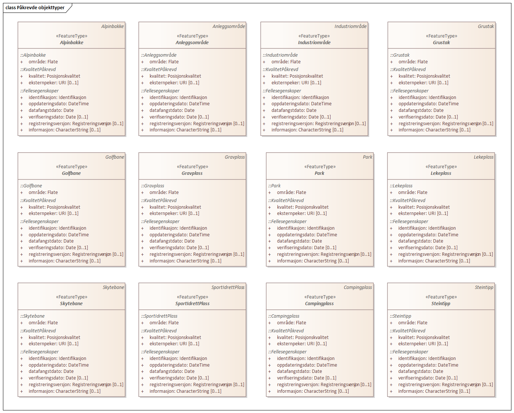

.Påkrevde objekttyper

 
'''
 
[[alpinbakke]]
==== «FeatureType» Alpinbakke
*Definisjon fra FKB produktspesifikasjon*: nedfart for ski med permanent karakter
 
*Tilleggsinformasjon for fotogrammetrisk registrering:* For &#229; sikre korrekt avgrensing ved fotogrammetrisk registrering, 
anbefales det &#229; utarbeide manus. Spesielt kan det v&#230;re vanskelig &#229; 
tolke avgrensingen av alpinbakke i snaufjellsomr&#229;der. 

Alpinbakke skal registreres fullstendig, avgrensingen skal v&#230;re i 
samsvar med utstrekning av Skitrekk / Stolheis og preparerte 
l&#248;yper.
 
 
'''
.Illustrasjon fra produktspesifikasjon av Alpinbakke
image::http://skjema.geonorge.no/SOSI/produktspesifikasjon/FKB-Arealbruk/5.0/figurer/objtype_alpinbakke.png[link=http://skjema.geonorge.no/SOSI/produktspesifikasjon/FKB-Arealbruk/5.0/figurer/objtype_alpinbakke.png,"Illustrasjon fra produktspesifikasjon: Alpinbakke"]
 
 
'''
.Illustrasjon fra fil av objekttype Alpinbakke
image::figurer/alpinbakke1.png[link=figurer/alpinbakke1.png,"Eksempel på riktig registrering av Alpinbakke."]
 
 
'''
.Illustrasjon fra fil av objekttype Alpinbakke
image::figurer/alpinbakke2.png[link=figurer/alpinbakke2.png,"Eksempel på ufullstendig registrering av alpinbakke. Alpinbakken skulle vært registrert helt til toppen av skitrekket. Siden det er vanskelig å tolke hvor nedfarten går i dette området burde det vært utarbeidet manus."]
 
 
===== Føringer
[cols="25,75"]
|===
|FKB-A
|Påkrevd registrering
 
|FKB-B
|Påkrevd registrering
 
|FKB-C
|Påkrevd registrering
 
|FKB-D
|Påkrevd registrering
 
|===
 
===== Egenskapstabell
[cols="20,20,20,10"]
|===
|*Navn:* 
|*Type:* 
|*SOSI_navn:* 
|*Mult.:* 
 
|identifikasjon
|«dataType» Identifikasjon
|..IDENT
|[1..1]
 
|identifikasjon.lokalId
|CharacterString
|...LOKALID
|[1..1]
 
|identifikasjon.navnerom
|CharacterString
|...NAVNEROM
|[1..1]
 
|identifikasjon.versjonId
|CharacterString
|...VERSJONID
|[0..1]
 
|oppdateringsdato
|DateTime
|..OPPDATERINGSDATO
|[1..1]
 
|datafangstdato
|Date
|..DATAFANGSTDATO
|[1..1]
 
|verifiseringsdato
|Date
|..VERIFISERINGSDATO
|[0..1]
 
|registreringsversjon
|«CodeList» Registreringsversjon
|..REGISTRERINGSVERSJON
|[0..1]
 
|informasjon
|CharacterString
|..INFORMASJON
|[0..1]
 
|kvalitet
|«dataType» Posisjonskvalitet
|..KVALITET
|[1..1]
 
|kvalitet.datafangstmetode
|«CodeList» Datafangstmetode
|...DATAFANGSTMETODE
|[1..1]
 
|kvalitet.nøyaktighet
|Integer
|...NØYAKTIGHET
|[0..1]
 
|kvalitet.synbarhet
|«CodeList» Synbarhet
|...SYNBARHET
|[0..1]
 
|kvalitet.datafangstmetodeHøyde
|«CodeList» Datafangstmetode
|...DATAFANGSTMETODEHØYDE
|[0..1]
 
|kvalitet.nøyaktighetHøyde
|Integer
|...H-NØYAKTIGHET
|[0..1]
 
|eksternpeker
|URI
|..EKSTERNPEKER
|[0..1]
 
|område
|Flate
|.FLATE
|[1..1]
 
|===
 
'''
 
[[anleggsområde]]
==== «FeatureType» Anleggsområde
*Definisjon fra FKB produktspesifikasjon*: omr&#229;de der det p&#229;g&#229;r anleggsarbeid

I FKB er det en m&#229;lsetting om at mest mulig av byggeaktivitet n&#229;r det gjelder f.eks. bygninger eller veganlegg fanges opp gjennom saksbehandling og legges inn i tiltaksbasen (FKB-Tiltak). Anleggsomr&#229;der som ligger i tiltaksbasen skal ikke inng&#229; i FKB-Arealbruk.
 
*Tilleggsinformasjon for fotogrammetrisk registrering:* Som anleggsomr&#229;de regnes omr&#229;der der det p&#229;g&#229;r midlertidig anleggsarbeid som for eksempel utbygging, inkludert fyllplasser. Benyttes for st&#248;rre anlegg  (st&#248;rre enn 1000m2), typisk vegprosjekter eller boligfelt. 

Grustak regnes ikke som anleggsomr&#229;de. 

Innenfor et anleggsomr&#229;de skal kun objekter av permanent 
karakter registreres (for eksempel bygninger og ferdig opparbeide veger). Objekter av midlertidig karakter, som antas &#229; bli endret/fjernet n&#229;r anleggsarbeidet er ferdig skal ikke registreres (for eksempel anleggsveger, fyllinger, gr&#248;fter og gjerder). 
 
 
'''
.Illustrasjon fra produktspesifikasjon av Anleggsområde
image::http://skjema.geonorge.no/SOSI/produktspesifikasjon/FKB-Arealbruk/5.0/figurer/objtype_anleggsomrade.png[link=http://skjema.geonorge.no/SOSI/produktspesifikasjon/FKB-Arealbruk/5.0/figurer/objtype_anleggsomrade.png,"Illustrasjon fra produktspesifikasjon: Anleggsområde"]
 
 
'''
.Eksempel på registrering av anleggsområde. Her er det riktig å registrere vegen som i prinsipp er ferdigbygd
image::figurer/anlegg1.png[link=figurer/anlegg1.png,"Eksempel på registrering av anleggsområde. Her er det riktig å registrere vegen som i prinsipp er ferdigbygd "]
 
 
'''
.Eksempel på registrering av anleggsområde. Her skal ikke den påbegynte vegen og grøfter registreres.
image::figurer/anlegg2.png[link=figurer/anlegg2.png,"Eksempel på registrering av anleggsområde. Her skal ikke den påbegynte vegen og grøfter registreres."]
 
 
===== Føringer
[cols="25,75"]
|===
|FKB minstestørrelse A
|Areal  1000m2
 
|FKB-A
|Påkrevd registrering
 
|FKB-B
|Påkrevd registrering
 
|FKB-C
|Påkrevd registrering
 
|FKB-C
|Påkrevd registrering
 
|FKB-D
|Påkrevd registrering
 
|===
 
===== Egenskapstabell
[cols="20,20,20,10"]
|===
|*Navn:* 
|*Type:* 
|*SOSI_navn:* 
|*Mult.:* 
 
|identifikasjon
|«dataType» Identifikasjon
|..IDENT
|[1..1]
 
|identifikasjon.lokalId
|CharacterString
|...LOKALID
|[1..1]
 
|identifikasjon.navnerom
|CharacterString
|...NAVNEROM
|[1..1]
 
|identifikasjon.versjonId
|CharacterString
|...VERSJONID
|[0..1]
 
|oppdateringsdato
|DateTime
|..OPPDATERINGSDATO
|[1..1]
 
|datafangstdato
|Date
|..DATAFANGSTDATO
|[1..1]
 
|verifiseringsdato
|Date
|..VERIFISERINGSDATO
|[0..1]
 
|registreringsversjon
|«CodeList» Registreringsversjon
|..REGISTRERINGSVERSJON
|[0..1]
 
|informasjon
|CharacterString
|..INFORMASJON
|[0..1]
 
|kvalitet
|«dataType» Posisjonskvalitet
|..KVALITET
|[1..1]
 
|kvalitet.datafangstmetode
|«CodeList» Datafangstmetode
|...DATAFANGSTMETODE
|[1..1]
 
|kvalitet.nøyaktighet
|Integer
|...NØYAKTIGHET
|[0..1]
 
|kvalitet.synbarhet
|«CodeList» Synbarhet
|...SYNBARHET
|[0..1]
 
|kvalitet.datafangstmetodeHøyde
|«CodeList» Datafangstmetode
|...DATAFANGSTMETODEHØYDE
|[0..1]
 
|kvalitet.nøyaktighetHøyde
|Integer
|...H-NØYAKTIGHET
|[0..1]
 
|eksternpeker
|URI
|..EKSTERNPEKER
|[0..1]
 
|område
|Flate
|.FLATE
|[1..1]
 
|===
 
'''
 
[[campingplass]]
==== «FeatureType» Campingplass
*Definisjon fra FKB produktspesifikasjon*: faste anlegg med vaskerom, campinghytter o.l.
 
*Tilleggsinformasjon for fotogrammetrisk registrering:* For &#229; sikre korrekt avgrensing ved fotogrammetrisk registrering, 
anbefales det &#229; utarbeide manus. Spesielt kan det v&#230;re vanskelig &#229; tolke avgrensingen av campingplasser som ikke er inngjerdet eller avgrenset av andre objekttyper. 

Campingplassen skal registreres fullstendig. Interne veger og 
fellesarealer skal inng&#229; i arealbruksflaten.
 
 
'''
.Illustrasjon fra produktspesifikasjon av Campingplass
image::http://skjema.geonorge.no/SOSI/produktspesifikasjon/FKB-Arealbruk/5.0/figurer/objtype_campingplass.png[link=http://skjema.geonorge.no/SOSI/produktspesifikasjon/FKB-Arealbruk/5.0/figurer/objtype_campingplass.png,"Illustrasjon fra produktspesifikasjon: Campingplass"]
 
 
'''
.Illustrasjon fra fil av objekttype Campingplass
image::figurer/campingplass.png[link=figurer/campingplass.png,"Eksempel på registrering av Campingplass. Her vises også at arealbruk inne i andre arealbruk skal registreres, her representert av en Lekeplass inne på campingplassen."]
 
 
===== Føringer
[cols="25,75"]
|===
|FKB-A
|Påkrevd registrering
 
|FKB-B
|Påkrevd registrering
 
|FKB-C
|Påkrevd registrering
 
|FKB-D
|Påkrevd registrering
 
|===
 
===== Egenskapstabell
[cols="20,20,20,10"]
|===
|*Navn:* 
|*Type:* 
|*SOSI_navn:* 
|*Mult.:* 
 
|identifikasjon
|«dataType» Identifikasjon
|..IDENT
|[1..1]
 
|identifikasjon.lokalId
|CharacterString
|...LOKALID
|[1..1]
 
|identifikasjon.navnerom
|CharacterString
|...NAVNEROM
|[1..1]
 
|identifikasjon.versjonId
|CharacterString
|...VERSJONID
|[0..1]
 
|oppdateringsdato
|DateTime
|..OPPDATERINGSDATO
|[1..1]
 
|datafangstdato
|Date
|..DATAFANGSTDATO
|[1..1]
 
|verifiseringsdato
|Date
|..VERIFISERINGSDATO
|[0..1]
 
|registreringsversjon
|«CodeList» Registreringsversjon
|..REGISTRERINGSVERSJON
|[0..1]
 
|informasjon
|CharacterString
|..INFORMASJON
|[0..1]
 
|kvalitet
|«dataType» Posisjonskvalitet
|..KVALITET
|[1..1]
 
|kvalitet.datafangstmetode
|«CodeList» Datafangstmetode
|...DATAFANGSTMETODE
|[1..1]
 
|kvalitet.nøyaktighet
|Integer
|...NØYAKTIGHET
|[0..1]
 
|kvalitet.synbarhet
|«CodeList» Synbarhet
|...SYNBARHET
|[0..1]
 
|kvalitet.datafangstmetodeHøyde
|«CodeList» Datafangstmetode
|...DATAFANGSTMETODEHØYDE
|[0..1]
 
|kvalitet.nøyaktighetHøyde
|Integer
|...H-NØYAKTIGHET
|[0..1]
 
|eksternpeker
|URI
|..EKSTERNPEKER
|[0..1]
 
|område
|Flate
|.FLATE
|[1..1]
 
|===
 
'''
 
[[golfbane]]
==== «FeatureType» Golfbane
*Definisjon fra FKB produktspesifikasjon*: område for golfspilling
 
*Tilleggsinformasjon for fotogrammetrisk registrering:* For &#229; sikre korrekt avgrensing ved fotogrammetrisk registrering, 
anbefales det &#229; utarbeide manus. 

Golfbanen skal registreres fullstendig. Interne veger og tilh&#248;rende areal skal inng&#229; i arealbruksflaten, ikke bare spilleflaten p&#229; de forskjellige hullene
 
 
'''
.Illustrasjon fra produktspesifikasjon av Golfbane
image::http://skjema.geonorge.no/SOSI/produktspesifikasjon/FKB-Arealbruk/5.0/figurer/objtype_golfbane.png[link=http://skjema.geonorge.no/SOSI/produktspesifikasjon/FKB-Arealbruk/5.0/figurer/objtype_golfbane.png,"Illustrasjon fra produktspesifikasjon: Golfbane"]
 
 
'''
.Illustrasjon fra fil av objekttype Golfbane
image::figurer/golfbane1.png[link=figurer/golfbane1.png,"Eksempel på registrering av Golfbane"]
 
 
'''
.Illustrasjon fra fil av objekttype Golfbane
image::figurer/golfbane2.png[link=figurer/golfbane2.png,"Eksempel på registrering av Golfbane"]
 
 
===== Føringer
[cols="25,75"]
|===
|FKB-A
|Påkrevd registrering
 
|FKB-B
|Påkrevd registrering
 
|FKB-C
|Påkrevd registrering
 
|FKB-D
|Påkrevd registrering
 
|===
 
===== Egenskapstabell
[cols="20,20,20,10"]
|===
|*Navn:* 
|*Type:* 
|*SOSI_navn:* 
|*Mult.:* 
 
|identifikasjon
|«dataType» Identifikasjon
|..IDENT
|[1..1]
 
|identifikasjon.lokalId
|CharacterString
|...LOKALID
|[1..1]
 
|identifikasjon.navnerom
|CharacterString
|...NAVNEROM
|[1..1]
 
|identifikasjon.versjonId
|CharacterString
|...VERSJONID
|[0..1]
 
|oppdateringsdato
|DateTime
|..OPPDATERINGSDATO
|[1..1]
 
|datafangstdato
|Date
|..DATAFANGSTDATO
|[1..1]
 
|verifiseringsdato
|Date
|..VERIFISERINGSDATO
|[0..1]
 
|registreringsversjon
|«CodeList» Registreringsversjon
|..REGISTRERINGSVERSJON
|[0..1]
 
|informasjon
|CharacterString
|..INFORMASJON
|[0..1]
 
|kvalitet
|«dataType» Posisjonskvalitet
|..KVALITET
|[1..1]
 
|kvalitet.datafangstmetode
|«CodeList» Datafangstmetode
|...DATAFANGSTMETODE
|[1..1]
 
|kvalitet.nøyaktighet
|Integer
|...NØYAKTIGHET
|[0..1]
 
|kvalitet.synbarhet
|«CodeList» Synbarhet
|...SYNBARHET
|[0..1]
 
|kvalitet.datafangstmetodeHøyde
|«CodeList» Datafangstmetode
|...DATAFANGSTMETODEHØYDE
|[0..1]
 
|kvalitet.nøyaktighetHøyde
|Integer
|...H-NØYAKTIGHET
|[0..1]
 
|eksternpeker
|URI
|..EKSTERNPEKER
|[0..1]
 
|område
|Flate
|.FLATE
|[1..1]
 
|===
 
'''
 
[[gravplass]]
==== «FeatureType» Gravplass
*Definisjon fra FKB produktspesifikasjon*: område for gravstøtter, begravelsesplass og kirkegård
 
*Tilleggsinformasjon for fotogrammetrisk registrering:* Avgrensingen kan v&#230;re diffus, spesielt for nyere omr&#229;der og 
gravplasser uten inngjerding. For &#229; sikre god fullstendighet og 
korrekt tolking ved fotogrammetrisk registrering, anbefales det &#229; 
utarbeide manus. 

Gravplassen skal registreres fullstendig. Interne veger, gangveger 
og tilh&#248;rende areal skal inng&#229; i arealbruksflaten
 
 
'''
.Illustrasjon fra produktspesifikasjon av Gravplass
image::http://skjema.geonorge.no/SOSI/produktspesifikasjon/FKB-Arealbruk/5.0/figurer/objtype_gravplass.png[link=http://skjema.geonorge.no/SOSI/produktspesifikasjon/FKB-Arealbruk/5.0/figurer/objtype_gravplass.png,"Illustrasjon fra produktspesifikasjon: Gravplass"]
 
 
'''
.Illustrasjon fra fil av objekttype Gravplass
image::figurer/gravplass.png[link=figurer/gravplass.png,"Eksempler på registrering av Gravplass. I disse tilfellene er gravplassene helt eller delvis inngjerdet"]
 
 
===== Føringer
[cols="25,75"]
|===
|FKB-A
|Påkrevd registrering
 
|FKB-B
|Påkrevd registrering
 
|FKB-C
|Påkrevd registrering
 
|FKB-D
|Påkrevd registrering
 
|===
 
===== Egenskapstabell
[cols="20,20,20,10"]
|===
|*Navn:* 
|*Type:* 
|*SOSI_navn:* 
|*Mult.:* 
 
|identifikasjon
|«dataType» Identifikasjon
|..IDENT
|[1..1]
 
|identifikasjon.lokalId
|CharacterString
|...LOKALID
|[1..1]
 
|identifikasjon.navnerom
|CharacterString
|...NAVNEROM
|[1..1]
 
|identifikasjon.versjonId
|CharacterString
|...VERSJONID
|[0..1]
 
|oppdateringsdato
|DateTime
|..OPPDATERINGSDATO
|[1..1]
 
|datafangstdato
|Date
|..DATAFANGSTDATO
|[1..1]
 
|verifiseringsdato
|Date
|..VERIFISERINGSDATO
|[0..1]
 
|registreringsversjon
|«CodeList» Registreringsversjon
|..REGISTRERINGSVERSJON
|[0..1]
 
|informasjon
|CharacterString
|..INFORMASJON
|[0..1]
 
|kvalitet
|«dataType» Posisjonskvalitet
|..KVALITET
|[1..1]
 
|kvalitet.datafangstmetode
|«CodeList» Datafangstmetode
|...DATAFANGSTMETODE
|[1..1]
 
|kvalitet.nøyaktighet
|Integer
|...NØYAKTIGHET
|[0..1]
 
|kvalitet.synbarhet
|«CodeList» Synbarhet
|...SYNBARHET
|[0..1]
 
|kvalitet.datafangstmetodeHøyde
|«CodeList» Datafangstmetode
|...DATAFANGSTMETODEHØYDE
|[0..1]
 
|kvalitet.nøyaktighetHøyde
|Integer
|...H-NØYAKTIGHET
|[0..1]
 
|eksternpeker
|URI
|..EKSTERNPEKER
|[0..1]
 
|område
|Flate
|.FLATE
|[1..1]
 
|===
 
'''
 
[[grustak]]
==== «FeatureType» Grustak
*Definisjon fra FKB produktspesifikasjon*: uttaksplass, område, drevet i dagen for malm eller sand, grus, pukk, skifer
 
*Tilleggsinformasjon for fotogrammetrisk registrering:* Leirtak og Steinbrudd er utg&#229;tt som egne objekttyper og skal
registreres som Grustak. 
 
 
'''
.Illustrasjon fra produktspesifikasjon av Grustak
image::http://skjema.geonorge.no/SOSI/produktspesifikasjon/FKB-Arealbruk/5.0/figurer/objtype_grustak.png[link=http://skjema.geonorge.no/SOSI/produktspesifikasjon/FKB-Arealbruk/5.0/figurer/objtype_grustak.png,"Illustrasjon fra produktspesifikasjon: Grustak"]
 
 
'''
.Illustrasjon fra fil av objekttype Grustak
image::figurer/grustak1.png[link=figurer/grustak1.png,"Eksempel på registrering av grustak."]
 
 
'''
.Illustrasjon fra fil av objekttype Grustak
image::figurer/grustak2.png[link=figurer/grustak2.png,"Eksempel på registrering av grustak (tidligere steinbrudd)."]
 
 
===== Føringer
[cols="25,75"]
|===
|FKB-A
|Påkrevd registrering
 
|FKB-B
|Påkrevd registrering
 
|FKB-C
|Påkrevd registrering
 
|FKB-D
|Påkrevd registrering
 
|===
 
===== Egenskapstabell
[cols="20,20,20,10"]
|===
|*Navn:* 
|*Type:* 
|*SOSI_navn:* 
|*Mult.:* 
 
|identifikasjon
|«dataType» Identifikasjon
|..IDENT
|[1..1]
 
|identifikasjon.lokalId
|CharacterString
|...LOKALID
|[1..1]
 
|identifikasjon.navnerom
|CharacterString
|...NAVNEROM
|[1..1]
 
|identifikasjon.versjonId
|CharacterString
|...VERSJONID
|[0..1]
 
|oppdateringsdato
|DateTime
|..OPPDATERINGSDATO
|[1..1]
 
|datafangstdato
|Date
|..DATAFANGSTDATO
|[1..1]
 
|verifiseringsdato
|Date
|..VERIFISERINGSDATO
|[0..1]
 
|registreringsversjon
|«CodeList» Registreringsversjon
|..REGISTRERINGSVERSJON
|[0..1]
 
|informasjon
|CharacterString
|..INFORMASJON
|[0..1]
 
|kvalitet
|«dataType» Posisjonskvalitet
|..KVALITET
|[1..1]
 
|kvalitet.datafangstmetode
|«CodeList» Datafangstmetode
|...DATAFANGSTMETODE
|[1..1]
 
|kvalitet.nøyaktighet
|Integer
|...NØYAKTIGHET
|[0..1]
 
|kvalitet.synbarhet
|«CodeList» Synbarhet
|...SYNBARHET
|[0..1]
 
|kvalitet.datafangstmetodeHøyde
|«CodeList» Datafangstmetode
|...DATAFANGSTMETODEHØYDE
|[0..1]
 
|kvalitet.nøyaktighetHøyde
|Integer
|...H-NØYAKTIGHET
|[0..1]
 
|eksternpeker
|URI
|..EKSTERNPEKER
|[0..1]
 
|område
|Flate
|.FLATE
|[1..1]
 
|===
 
'''
 
[[industriområde]]
==== «FeatureType» Industriområde
*Definisjon fra FKB produktspesifikasjon*: område, bebygd eller ubebygd, benyttet til industriformål
 
*Tilleggsinformasjon for fotogrammetrisk registrering:* Avgrensingen kan v&#230;re diffus. For &#229; sikre god fullstendighet og 
korrekt tolking ved fotogrammetrisk registrering, anbefales det &#229; 
utarbeide manus.
 
 
'''
.Illustrasjon fra produktspesifikasjon av Industriområde
image::http://skjema.geonorge.no/SOSI/produktspesifikasjon/FKB-Arealbruk/5.0/figurer/objtype_industriomrade.png[link=http://skjema.geonorge.no/SOSI/produktspesifikasjon/FKB-Arealbruk/5.0/figurer/objtype_industriomrade.png,"Illustrasjon fra produktspesifikasjon: Industriområde"]
 
 
'''
.Illustrasjon fra fil av objekttype Industriområde
image::figurer/industri1.png[link=figurer/industri1.png,"Eksempler på registrering av industriområde"]
 
 
'''
.Illustrasjon fra fil av objekttype Industriområde
image::figurer/industri2.png[link=figurer/industri2.png,"Eksempler på registrering av industriområde"]
 
 
===== Føringer
[cols="25,75"]
|===
|FKB-A
|Påkrevd registrering
 
|FKB-B
|Påkrevd registrering
 
|FKB-C
|Påkrevd registrering
 
|FKB-D
|Påkrevd registrering
 
|===
 
===== Egenskapstabell
[cols="20,20,20,10"]
|===
|*Navn:* 
|*Type:* 
|*SOSI_navn:* 
|*Mult.:* 
 
|identifikasjon
|«dataType» Identifikasjon
|..IDENT
|[1..1]
 
|identifikasjon.lokalId
|CharacterString
|...LOKALID
|[1..1]
 
|identifikasjon.navnerom
|CharacterString
|...NAVNEROM
|[1..1]
 
|identifikasjon.versjonId
|CharacterString
|...VERSJONID
|[0..1]
 
|oppdateringsdato
|DateTime
|..OPPDATERINGSDATO
|[1..1]
 
|datafangstdato
|Date
|..DATAFANGSTDATO
|[1..1]
 
|verifiseringsdato
|Date
|..VERIFISERINGSDATO
|[0..1]
 
|registreringsversjon
|«CodeList» Registreringsversjon
|..REGISTRERINGSVERSJON
|[0..1]
 
|informasjon
|CharacterString
|..INFORMASJON
|[0..1]
 
|kvalitet
|«dataType» Posisjonskvalitet
|..KVALITET
|[1..1]
 
|kvalitet.datafangstmetode
|«CodeList» Datafangstmetode
|...DATAFANGSTMETODE
|[1..1]
 
|kvalitet.nøyaktighet
|Integer
|...NØYAKTIGHET
|[0..1]
 
|kvalitet.synbarhet
|«CodeList» Synbarhet
|...SYNBARHET
|[0..1]
 
|kvalitet.datafangstmetodeHøyde
|«CodeList» Datafangstmetode
|...DATAFANGSTMETODEHØYDE
|[0..1]
 
|kvalitet.nøyaktighetHøyde
|Integer
|...H-NØYAKTIGHET
|[0..1]
 
|eksternpeker
|URI
|..EKSTERNPEKER
|[0..1]
 
|område
|Flate
|.FLATE
|[1..1]
 
|===
 
'''
 
[[lekeplass]]
==== «FeatureType» Lekeplass
*Definisjon fra FKB produktspesifikasjon*: område for lekeplass
 
*Tilleggsinformasjon for fotogrammetrisk registrering:* For &#229; sikre god fullstendighet og korrekt tolking ved 
fotogrammetrisk registrering, anbefales det &#229; utarbeide manus. 

Lekeomr&#229;der i skoleg&#229;rder/barnehager skal som hovedregel 
registreres som en sammenhengende lekeplass. 

Lekeplasser i &#229;pne fellesareal (blokkbebyggelse) og innenfor andre arealbruksflater (for eksempel park) skal registreres. 

Omr&#229;der med lekeapparater i private hager (villa/enebolig) 
registreres ikke.
 
 
'''
.Illustrasjon fra produktspesifikasjon av Lekeplass
image::http://skjema.geonorge.no/SOSI/produktspesifikasjon/FKB-Arealbruk/5.0/figurer/objtype_lekeplass.png[link=http://skjema.geonorge.no/SOSI/produktspesifikasjon/FKB-Arealbruk/5.0/figurer/objtype_lekeplass.png,"Illustrasjon fra produktspesifikasjon: Lekeplass"]
 
 
'''
.Illustrasjon fra fil av objekttype Lekeplass
image::figurer/lekeplass_feil.png[link=figurer/lekeplass_feil.png,"Eksempel på feil registrering av Lekeplass rundt for eksempel lekeapparater og fotballmål i private hager."]
 
 
'''
.Illustrasjon fra fil av objekttype Lekeplass
image::figurer/lekeplass_idrettsplass.png[link=figurer/lekeplass_idrettsplass.png,"Eksempel på registrering av Lekeplass (de to til venstre) og SportIdrettPlass (de to til høyre) i et skoleområde."]
 
 
'''
.Illustrasjon fra fil av objekttype Lekeplass
image::figurer/lekeplass1.png[link=figurer/lekeplass1.png,"Eksempel på registrering av flere mindre Lekeplass i forbindelse med blokkbebyggelse"]
 
 
'''
.Illustrasjon fra fil av objekttype Lekeplass
image::figurer/lekeplass2.png[link=figurer/lekeplass2.png,"Eksempel på registrering av Lekeplass i forbindelse med en skole"]
 
 
===== Føringer
[cols="25,75"]
|===
|FKB-A
|Påkrevd registrering
 
|FKB-B
|Påkrevd registrering
 
|FKB-C
|Påkrevd registrering
 
|FKB-D
|Påkrevd registrering
 
|===
 
===== Egenskapstabell
[cols="20,20,20,10"]
|===
|*Navn:* 
|*Type:* 
|*SOSI_navn:* 
|*Mult.:* 
 
|identifikasjon
|«dataType» Identifikasjon
|..IDENT
|[1..1]
 
|identifikasjon.lokalId
|CharacterString
|...LOKALID
|[1..1]
 
|identifikasjon.navnerom
|CharacterString
|...NAVNEROM
|[1..1]
 
|identifikasjon.versjonId
|CharacterString
|...VERSJONID
|[0..1]
 
|oppdateringsdato
|DateTime
|..OPPDATERINGSDATO
|[1..1]
 
|datafangstdato
|Date
|..DATAFANGSTDATO
|[1..1]
 
|verifiseringsdato
|Date
|..VERIFISERINGSDATO
|[0..1]
 
|registreringsversjon
|«CodeList» Registreringsversjon
|..REGISTRERINGSVERSJON
|[0..1]
 
|informasjon
|CharacterString
|..INFORMASJON
|[0..1]
 
|kvalitet
|«dataType» Posisjonskvalitet
|..KVALITET
|[1..1]
 
|kvalitet.datafangstmetode
|«CodeList» Datafangstmetode
|...DATAFANGSTMETODE
|[1..1]
 
|kvalitet.nøyaktighet
|Integer
|...NØYAKTIGHET
|[0..1]
 
|kvalitet.synbarhet
|«CodeList» Synbarhet
|...SYNBARHET
|[0..1]
 
|kvalitet.datafangstmetodeHøyde
|«CodeList» Datafangstmetode
|...DATAFANGSTMETODEHØYDE
|[0..1]
 
|kvalitet.nøyaktighetHøyde
|Integer
|...H-NØYAKTIGHET
|[0..1]
 
|eksternpeker
|URI
|..EKSTERNPEKER
|[0..1]
 
|område
|Flate
|.FLATE
|[1..1]
 
|===
 
'''
 
[[park]]
==== «FeatureType» Park
*Definisjon fra FKB produktspesifikasjon*: grøntområde i by- eller tettbygd område, opparbeidet og vedlikeholdt med plenareal, beplantninger, vannpartier og lignende
 
*Tilleggsinformasjon for fotogrammetrisk registrering:* Avgrensingen kan v&#230;re diffus. For &#229; sikre god fullstendighet og 
korrekt tolking ved fotogrammetrisk registrering, anbefales det &#229; 
utarbeide manus
 
 
'''
.Illustrasjon fra produktspesifikasjon av Park
image::http://skjema.geonorge.no/SOSI/produktspesifikasjon/FKB-Arealbruk/5.0/figurer/objtype_park.png[link=http://skjema.geonorge.no/SOSI/produktspesifikasjon/FKB-Arealbruk/5.0/figurer/objtype_park.png,"Illustrasjon fra produktspesifikasjon: Park"]
 
 
'''
.Illustrasjon fra fil av objekttype Park
image::figurer/park1.png[link=figurer/park1.png,"Eksempel på registrering av Park"]
 
 
'''
.Illustrasjon fra fil av objekttype Park
image::figurer/park2.png[link=figurer/park2.png,"Eksempel på registrering av Park"]
 
 
===== Føringer
[cols="25,75"]
|===
|FKB-A
|Påkrevd registrering
 
|FKB-B
|Påkrevd registrering
 
|FKB-C
|Påkrevd registrering
 
|FKB-D
|Påkrevd registrering
 
|===
 
===== Egenskapstabell
[cols="20,20,20,10"]
|===
|*Navn:* 
|*Type:* 
|*SOSI_navn:* 
|*Mult.:* 
 
|identifikasjon
|«dataType» Identifikasjon
|..IDENT
|[1..1]
 
|identifikasjon.lokalId
|CharacterString
|...LOKALID
|[1..1]
 
|identifikasjon.navnerom
|CharacterString
|...NAVNEROM
|[1..1]
 
|identifikasjon.versjonId
|CharacterString
|...VERSJONID
|[0..1]
 
|oppdateringsdato
|DateTime
|..OPPDATERINGSDATO
|[1..1]
 
|datafangstdato
|Date
|..DATAFANGSTDATO
|[1..1]
 
|verifiseringsdato
|Date
|..VERIFISERINGSDATO
|[0..1]
 
|registreringsversjon
|«CodeList» Registreringsversjon
|..REGISTRERINGSVERSJON
|[0..1]
 
|informasjon
|CharacterString
|..INFORMASJON
|[0..1]
 
|kvalitet
|«dataType» Posisjonskvalitet
|..KVALITET
|[1..1]
 
|kvalitet.datafangstmetode
|«CodeList» Datafangstmetode
|...DATAFANGSTMETODE
|[1..1]
 
|kvalitet.nøyaktighet
|Integer
|...NØYAKTIGHET
|[0..1]
 
|kvalitet.synbarhet
|«CodeList» Synbarhet
|...SYNBARHET
|[0..1]
 
|kvalitet.datafangstmetodeHøyde
|«CodeList» Datafangstmetode
|...DATAFANGSTMETODEHØYDE
|[0..1]
 
|kvalitet.nøyaktighetHøyde
|Integer
|...H-NØYAKTIGHET
|[0..1]
 
|eksternpeker
|URI
|..EKSTERNPEKER
|[0..1]
 
|område
|Flate
|.FLATE
|[1..1]
 
|===
 
'''
 
[[skytebane]]
==== «FeatureType» Skytebane
*Definisjon fra FKB produktspesifikasjon*: avgrenset område hvor det skytes
 
 
'''
.Illustrasjon fra produktspesifikasjon av Skytebane
image::http://skjema.geonorge.no/SOSI/produktspesifikasjon/FKB-Arealbruk/5.0/figurer/objtype_skytebane.png[link=http://skjema.geonorge.no/SOSI/produktspesifikasjon/FKB-Arealbruk/5.0/figurer/objtype_skytebane.png,"Illustrasjon fra produktspesifikasjon: Skytebane"]
 
 
'''
.Illustrasjon fra fil av objekttype Skytebane
image::figurer/skytebane.png[link=figurer/skytebane.png,"Eksempel på registrering av Skytebane"]
 
 
===== Føringer
[cols="25,75"]
|===
|FKB-A
|Påkrevd registrering
 
|FKB-B
|Påkrevd registrering
 
|FKB-C
|Påkrevd registrering
 
|FKB-D
|Påkrevd registrering
 
|===
 
===== Egenskapstabell
[cols="20,20,20,10"]
|===
|*Navn:* 
|*Type:* 
|*SOSI_navn:* 
|*Mult.:* 
 
|identifikasjon
|«dataType» Identifikasjon
|..IDENT
|[1..1]
 
|identifikasjon.lokalId
|CharacterString
|...LOKALID
|[1..1]
 
|identifikasjon.navnerom
|CharacterString
|...NAVNEROM
|[1..1]
 
|identifikasjon.versjonId
|CharacterString
|...VERSJONID
|[0..1]
 
|oppdateringsdato
|DateTime
|..OPPDATERINGSDATO
|[1..1]
 
|datafangstdato
|Date
|..DATAFANGSTDATO
|[1..1]
 
|verifiseringsdato
|Date
|..VERIFISERINGSDATO
|[0..1]
 
|registreringsversjon
|«CodeList» Registreringsversjon
|..REGISTRERINGSVERSJON
|[0..1]
 
|informasjon
|CharacterString
|..INFORMASJON
|[0..1]
 
|kvalitet
|«dataType» Posisjonskvalitet
|..KVALITET
|[1..1]
 
|kvalitet.datafangstmetode
|«CodeList» Datafangstmetode
|...DATAFANGSTMETODE
|[1..1]
 
|kvalitet.nøyaktighet
|Integer
|...NØYAKTIGHET
|[0..1]
 
|kvalitet.synbarhet
|«CodeList» Synbarhet
|...SYNBARHET
|[0..1]
 
|kvalitet.datafangstmetodeHøyde
|«CodeList» Datafangstmetode
|...DATAFANGSTMETODEHØYDE
|[0..1]
 
|kvalitet.nøyaktighetHøyde
|Integer
|...H-NØYAKTIGHET
|[0..1]
 
|eksternpeker
|URI
|..EKSTERNPEKER
|[0..1]
 
|område
|Flate
|.FLATE
|[1..1]
 
|===
 
'''
 
[[sportidrettplass]]
==== «FeatureType» SportIdrettPlass
*Definisjon fra FKB produktspesifikasjon*: område hvor det utøves sport og idrett
 
*Tilleggsinformasjon for fotogrammetrisk registrering:* For &#229; sikre god fullstendighet og korrekt tolking ved 
fotogrammetrisk registrering, anbefales det &#229; utarbeide manus.
 
Omfatter ogs&#229; sport- og idrettsomr&#229;der i tilknytning til skoler og 
omr&#229;der tilrettelagt for motorsport (for eks motorcrossbane).

Ytterkant (gresskant, gruskant, asfaltkant) av banene registreres 
som Idrettsanlegg (se FKB-BygnAnlegg). Selve oppmerkingen av 
banene skal ikke registreres
 
 
'''
.Illustrasjon fra produktspesifikasjon av SportIdrettPlass
image::http://skjema.geonorge.no/SOSI/produktspesifikasjon/FKB-Arealbruk/5.0/figurer/objtype_sportidrettsplass.png[link=http://skjema.geonorge.no/SOSI/produktspesifikasjon/FKB-Arealbruk/5.0/figurer/objtype_sportidrettsplass.png,"Illustrasjon fra produktspesifikasjon: SportIdrettPlass"]
 
 
'''
.Illustrasjon fra fil av objekttype SportIdrettPlass
image::figurer/idrettsplass1.png[link=figurer/idrettsplass1.png,"Eksempel på registrering av SportIdrettPlass. Ytterkant til banene (for eksempel gresskant, gruskant eller asfaltkant) beskrives med objekttypen Idrettsanlegg i FKB-BygnAnlegg."]
 
 
===== Føringer
[cols="25,75"]
|===
|FKB-A
|Påkrevd registrering
 
|FKB-B
|Påkrevd registrering
 
|FKB-C
|Påkrevd registrering
 
|FKB-D
|Påkrevd registrering
 
|===
 
===== Egenskapstabell
[cols="20,20,20,10"]
|===
|*Navn:* 
|*Type:* 
|*SOSI_navn:* 
|*Mult.:* 
 
|identifikasjon
|«dataType» Identifikasjon
|..IDENT
|[1..1]
 
|identifikasjon.lokalId
|CharacterString
|...LOKALID
|[1..1]
 
|identifikasjon.navnerom
|CharacterString
|...NAVNEROM
|[1..1]
 
|identifikasjon.versjonId
|CharacterString
|...VERSJONID
|[0..1]
 
|oppdateringsdato
|DateTime
|..OPPDATERINGSDATO
|[1..1]
 
|datafangstdato
|Date
|..DATAFANGSTDATO
|[1..1]
 
|verifiseringsdato
|Date
|..VERIFISERINGSDATO
|[0..1]
 
|registreringsversjon
|«CodeList» Registreringsversjon
|..REGISTRERINGSVERSJON
|[0..1]
 
|informasjon
|CharacterString
|..INFORMASJON
|[0..1]
 
|kvalitet
|«dataType» Posisjonskvalitet
|..KVALITET
|[1..1]
 
|kvalitet.datafangstmetode
|«CodeList» Datafangstmetode
|...DATAFANGSTMETODE
|[1..1]
 
|kvalitet.nøyaktighet
|Integer
|...NØYAKTIGHET
|[0..1]
 
|kvalitet.synbarhet
|«CodeList» Synbarhet
|...SYNBARHET
|[0..1]
 
|kvalitet.datafangstmetodeHøyde
|«CodeList» Datafangstmetode
|...DATAFANGSTMETODEHØYDE
|[0..1]
 
|kvalitet.nøyaktighetHøyde
|Integer
|...H-NØYAKTIGHET
|[0..1]
 
|eksternpeker
|URI
|..EKSTERNPEKER
|[0..1]
 
|område
|Flate
|.FLATE
|[1..1]
 
|===
 
'''
 
[[steintipp]]
==== «FeatureType» Steintipp
*Definisjon fra FKB produktspesifikasjon*: område for steintipp
 
*Tilleggsinformasjon for fotogrammetrisk registrering:* Benyttes for permanente steintipper (st&#248;rre enn 1000m2) i forbindelse med damanlegg og gruvedrift. 
 
 
'''
.Illustrasjon fra produktspesifikasjon av Steintipp
image::http://skjema.geonorge.no/SOSI/produktspesifikasjon/FKB-Arealbruk/5.0/figurer/objtype_steintipp.png[link=http://skjema.geonorge.no/SOSI/produktspesifikasjon/FKB-Arealbruk/5.0/figurer/objtype_steintipp.png,"Illustrasjon fra produktspesifikasjon: Steintipp"]
 
 
'''
.Illustrasjon fra fil av objekttype Steintipp
image::figurer/steintipp.png[link=figurer/steintipp.png,"Eksempel på registrering av steintipp i forbindelse med gruvedrift"]
 
 
===== Føringer
[cols="25,75"]
|===
|FKB minstestørrelse A
|Areal  1000m2
 
|FKB-A
|Påkrevd registrering
 
|FKB-B
|Påkrevd registrering
 
|FKB-C
|Påkrevd registrering
 
|FKB-D
|Påkrevd registrering
 
|===
 
===== Egenskapstabell
[cols="20,20,20,10"]
|===
|*Navn:* 
|*Type:* 
|*SOSI_navn:* 
|*Mult.:* 
 
|identifikasjon
|«dataType» Identifikasjon
|..IDENT
|[1..1]
 
|identifikasjon.lokalId
|CharacterString
|...LOKALID
|[1..1]
 
|identifikasjon.navnerom
|CharacterString
|...NAVNEROM
|[1..1]
 
|identifikasjon.versjonId
|CharacterString
|...VERSJONID
|[0..1]
 
|oppdateringsdato
|DateTime
|..OPPDATERINGSDATO
|[1..1]
 
|datafangstdato
|Date
|..DATAFANGSTDATO
|[1..1]
 
|verifiseringsdato
|Date
|..VERIFISERINGSDATO
|[0..1]
 
|registreringsversjon
|«CodeList» Registreringsversjon
|..REGISTRERINGSVERSJON
|[0..1]
 
|informasjon
|CharacterString
|..INFORMASJON
|[0..1]
 
|kvalitet
|«dataType» Posisjonskvalitet
|..KVALITET
|[1..1]
 
|kvalitet.datafangstmetode
|«CodeList» Datafangstmetode
|...DATAFANGSTMETODE
|[1..1]
 
|kvalitet.nøyaktighet
|Integer
|...NØYAKTIGHET
|[0..1]
 
|kvalitet.synbarhet
|«CodeList» Synbarhet
|...SYNBARHET
|[0..1]
 
|kvalitet.datafangstmetodeHøyde
|«CodeList» Datafangstmetode
|...DATAFANGSTMETODEHØYDE
|[0..1]
 
|kvalitet.nøyaktighetHøyde
|Integer
|...H-NØYAKTIGHET
|[0..1]
 
|eksternpeker
|URI
|..EKSTERNPEKER
|[0..1]
 
|område
|Flate
|.FLATE
|[1..1]
 
|===
// End of Registreringsinstruks UML-model
