 
<<<
'''
 
[[alpinbakke]]
=== Objekttype: Alpinbakke
*Definisjon fra FKB produktspesifikasjon*: nedfart for ski med permanent karakter
 
 
.Illustrasjon fra produktspesifikasjon av Alpinbakke
image::http://skjema.geonorge.no/SOSI/produktspesifikasjon/FKB-Arealbruk/5.0/figurer/objtype_alpinbakke.png[link=http://skjema.geonorge.no/SOSI/produktspesifikasjon/FKB-Arealbruk/5.0/figurer/objtype_alpinbakke.png, Alt="Illustrasjon fra produktspesifikasjon: Alpinbakke"]
 
 
[discrete]
==== Tilleggsinformasjon for fotogrammetrisk registrering
For &#229; sikre korrekt avgrensing ved fotogrammetrisk registrering, anbefales det &#229; utarbeide manus. Spesielt kan det v&#230;re vanskelig &#229; 
tolke avgrensingen av alpinbakke i snaufjellsomr&#229;der. 

Alpinbakke skal registreres fullstendig, avgrensingen skal v&#230;re i samsvar med utstrekning av Skitrekk / Stolheis og preparerte l&#248;yper.
 
 
'''
.Eksempel på riktig registrering av Alpinbakke.
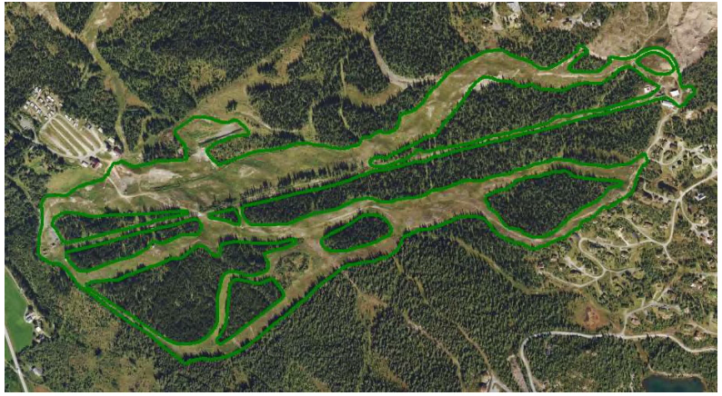
 
 
'''
.Eksempel på ufullstendig registrering av alpinbakke. Alpinbakken skulle vært registrert helt til toppen av skitrekket. Siden det er vanskelig å tolke hvor nedfarten går i dette området burde det vært utarbeidet manus.
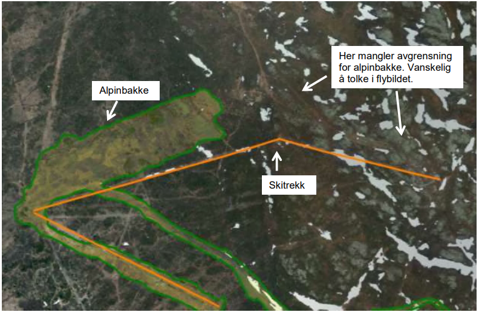
 
 
 
[discrete]
==== Føringer
[cols="h,2"]
|===
|FKB-A
|Påkrevd registrering
 
|FKB-B
|Påkrevd registrering
 
|FKB-C
|Påkrevd registrering
 
|FKB-D
|Påkrevd registrering
 
|===
 
 
<<<
 
[discrete]
==== Egenskapstabell for objekttype: Alpinbakke
[cols="20,20,20,10", options="header"]
|===
|*Navn:* 
|*Type:* 
|*SOSI_navn:* 
|*Mult.:* 
 
|identifikasjon
|«dataType» Identifikasjon
|..IDENT
|[0..1]
 
|identifikasjon.lokalId
|CharacterString
|...LOKALID
|[1..1]
 
|identifikasjon.navnerom
|CharacterString
|...NAVNEROM
|[1..1]
 
|identifikasjon.versjonId
|CharacterString
|...VERSJONID
|[0..1]
 
|oppdateringsdato
|DateTime
|..OPPDATERINGSDATO
|[0..1]
 
|sluttdato
|DateTime
|..SLUTTDATO
|[0..1]
 
|datafangstdato
|Date
|..DATAFANGSTDATO
|[1..1]
 
|verifiseringsdato
|Date
|..VERIFISERINGSDATO
|[0..1]
 
|registreringsversjon
|«CodeList» Registreringsversjon
|..REGISTRERINGSVERSJON
|[0..1]
 
|informasjon
|CharacterString
|..INFORMASJON
|[0..1]
 
|kvalitet
|«dataType» Posisjonskvalitet
|..KVALITET
|[1..1]
 
|kvalitet.datafangstmetode
| «CodeList»  https://register.geonorge.no/sosi-kodelister/fkb/generell/5.0/datafangstmetode[Datafangstmetode, window = _blank]
|...DATAFANGSTMETODE
|[1..1]
 
|kvalitet.nøyaktighet
|Integer
|...NØYAKTIGHET
|[0..1]
 
|kvalitet.synbarhet
| «CodeList»  https://register.geonorge.no/sosi-kodelister/fkb/generell/5.0/synbarhet[Synbarhet, window = _blank]
|...SYNBARHET
|[0..1]
 
|kvalitet.datafangstmetodeHøyde
| «CodeList»  https://register.geonorge.no/sosi-kodelister/fkb/generell/5.0/datafangstmetode[Datafangstmetode, window = _blank]
|...DATAFANGSTMETODEHØYDE
|[0..1]
 
|kvalitet.nøyaktighetHøyde
|Integer
|...H-NØYAKTIGHET
|[0..1]
 
|eksternpeker
|URI
|..EKSTERNPEKER
|[1..1]
 
|område
|GM_Surface
|.FLATE
|[1..1]
 
|===
 
<<<
'''
 
[[anleggsområde]]
=== Objekttype: Anleggsområde
*Definisjon fra FKB produktspesifikasjon*: omr&#229;de der det p&#229;g&#229;r anleggsarbeid

I FKB er det en m&#229;lsetting om at mest mulig av byggeaktivitet n&#229;r det gjelder f.eks. bygninger eller veganlegg fanges opp gjennom saksbehandling og legges inn i tiltaksbasen (FKB-Tiltak). Anleggsomr&#229;der som ligger i tiltaksbasen skal ikke inng&#229; i FKB-Arealbruk.
 
 
.Illustrasjon fra produktspesifikasjon av Anleggsområde
image::http://skjema.geonorge.no/SOSI/produktspesifikasjon/FKB-Arealbruk/5.0/figurer/objtype_anleggsomrade.png[link=http://skjema.geonorge.no/SOSI/produktspesifikasjon/FKB-Arealbruk/5.0/figurer/objtype_anleggsomrade.png, Alt="Illustrasjon fra produktspesifikasjon: Anleggsområde"]
 
 
[discrete]
==== Tilleggsinformasjon for fotogrammetrisk registrering
Som anleggsomr&#229;de regnes omr&#229;der der det p&#229;g&#229;r midlertidig anleggsarbeid som for eksempel utbygging, inkludert fyllplasser. Benyttes for st&#248;rre anlegg  (st&#248;rre enn 1000m2), typisk vegprosjekter eller boligfelt. 

Grustak regnes ikke som anleggsomr&#229;de. 

Innenfor et anleggsomr&#229;de skal kun objekter av permanent karakter registreres (for eksempel bygninger og ferdig opparbeide veger). Objekter av midlertidig karakter, som antas &#229; bli endret/fjernet n&#229;r anleggsarbeidet er ferdig skal ikke registreres (for eksempel anleggsveger, fyllinger, gr&#248;fter og gjerder). 

Merknad:
Utbyggingsomr&#229;der kan/b&#248;r ogs&#229; i stor grad registreres i FKB-Tiltak. I utgangspunktet registreres anleggsomr&#229;der i FKB-Arealbruk uavhengig av innholdet i FKB-Tiltak, men unntak fra dette kan avtales det enkelte kartleggingsprosjekt. F.eks. at store utbyggingsprosjekter knyttet til samferdsel som ligger i FKB-Tiltak ikke registreres i FKB-Arealbruk.
 
 
'''
.Eksempel på registrering av anleggsområde. Her er det riktig å registrere vegen som i prinsipp er ferdigbygd.
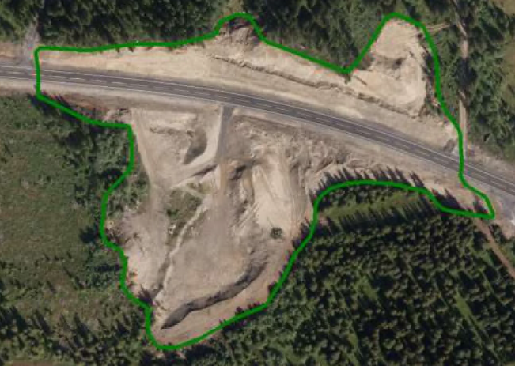
 
 
'''
.Eksempel på registrering av anleggsområde. Her skal ikke den påbegynte vegen og grøfter registreres.
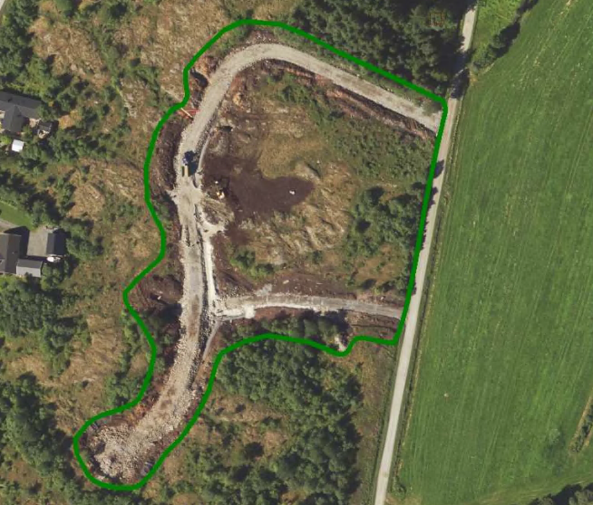
 
 
 
[discrete]
==== Føringer
[cols="h,2"]
|===
|FKB-A minstestørrelse
|Areal > 1000m2
 
|FKB-A
|Påkrevd registrering
 
|FKB-B
|Påkrevd registrering
 
|FKB-C
|Påkrevd registrering
 
|FKB-C
|Påkrevd registrering
 
|FKB-D
|Påkrevd registrering
 
|===
 
 
<<<
 
[discrete]
==== Egenskapstabell for objekttype: Anleggsområde
[cols="20,20,20,10", options="header"]
|===
|*Navn:* 
|*Type:* 
|*SOSI_navn:* 
|*Mult.:* 
 
|identifikasjon
|«dataType» Identifikasjon
|..IDENT
|[0..1]
 
|identifikasjon.lokalId
|CharacterString
|...LOKALID
|[1..1]
 
|identifikasjon.navnerom
|CharacterString
|...NAVNEROM
|[1..1]
 
|identifikasjon.versjonId
|CharacterString
|...VERSJONID
|[0..1]
 
|oppdateringsdato
|DateTime
|..OPPDATERINGSDATO
|[0..1]
 
|sluttdato
|DateTime
|..SLUTTDATO
|[0..1]
 
|datafangstdato
|Date
|..DATAFANGSTDATO
|[1..1]
 
|verifiseringsdato
|Date
|..VERIFISERINGSDATO
|[0..1]
 
|registreringsversjon
|«CodeList» Registreringsversjon
|..REGISTRERINGSVERSJON
|[0..1]
 
|informasjon
|CharacterString
|..INFORMASJON
|[0..1]
 
|kvalitet
|«dataType» Posisjonskvalitet
|..KVALITET
|[1..1]
 
|kvalitet.datafangstmetode
| «CodeList»  https://register.geonorge.no/sosi-kodelister/fkb/generell/5.0/datafangstmetode[Datafangstmetode, window = _blank]
|...DATAFANGSTMETODE
|[1..1]
 
|kvalitet.nøyaktighet
|Integer
|...NØYAKTIGHET
|[0..1]
 
|kvalitet.synbarhet
| «CodeList»  https://register.geonorge.no/sosi-kodelister/fkb/generell/5.0/synbarhet[Synbarhet, window = _blank]
|...SYNBARHET
|[0..1]
 
|kvalitet.datafangstmetodeHøyde
| «CodeList»  https://register.geonorge.no/sosi-kodelister/fkb/generell/5.0/datafangstmetode[Datafangstmetode, window = _blank]
|...DATAFANGSTMETODEHØYDE
|[0..1]
 
|kvalitet.nøyaktighetHøyde
|Integer
|...H-NØYAKTIGHET
|[0..1]
 
|eksternpeker
|URI
|..EKSTERNPEKER
|[1..1]
 
|område
|GM_Surface
|.FLATE
|[1..1]
 
|===
 
<<<
'''
 
[[campingplass]]
=== Objekttype: Campingplass
*Definisjon fra FKB produktspesifikasjon*: faste anlegg med serviceanlegg, campinghytter o.l.
 
 
.Illustrasjon fra produktspesifikasjon av Campingplass
image::http://skjema.geonorge.no/SOSI/produktspesifikasjon/FKB-Arealbruk/5.0/figurer/objtype_campingplass.png[link=http://skjema.geonorge.no/SOSI/produktspesifikasjon/FKB-Arealbruk/5.0/figurer/objtype_campingplass.png, Alt="Illustrasjon fra produktspesifikasjon: Campingplass"]
 
 
[discrete]
==== Tilleggsinformasjon for fotogrammetrisk registrering
For &#229; sikre korrekt avgrensing ved fotogrammetrisk registrering, anbefales det &#229; utarbeide manus. Spesielt kan det v&#230;re vanskelig &#229; tolke avgrensingen av campingplasser som ikke er inngjerdet eller avgrenset av andre objekttyper. 

Campingplassen skal registreres fullstendig. Interne veger og fellesarealer skal inng&#229; i arealbruksflaten.
 
 
'''
.Eksempel på registrering av Campingplass. Her vises også at arealbruk inne i andre arealbruk skal registreres, her representert av en Lekeplass inne på campingplassen.
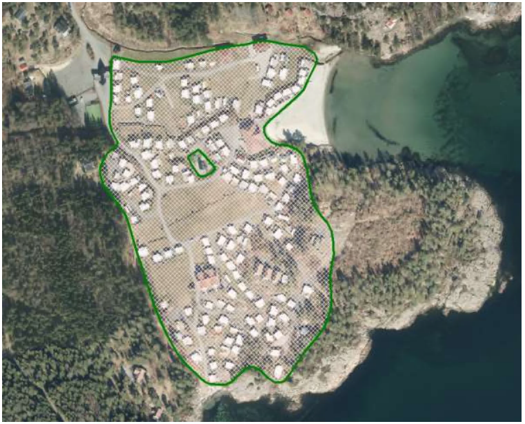
 
 
 
[discrete]
==== Føringer
[cols="h,2"]
|===
|FKB-A
|Påkrevd registrering
 
|FKB-B
|Påkrevd registrering
 
|FKB-C
|Påkrevd registrering
 
|FKB-D
|Påkrevd registrering
 
|===
 
 
<<<
 
[discrete]
==== Egenskapstabell for objekttype: Campingplass
[cols="20,20,20,10", options="header"]
|===
|*Navn:* 
|*Type:* 
|*SOSI_navn:* 
|*Mult.:* 
 
|identifikasjon
|«dataType» Identifikasjon
|..IDENT
|[0..1]
 
|identifikasjon.lokalId
|CharacterString
|...LOKALID
|[1..1]
 
|identifikasjon.navnerom
|CharacterString
|...NAVNEROM
|[1..1]
 
|identifikasjon.versjonId
|CharacterString
|...VERSJONID
|[0..1]
 
|oppdateringsdato
|DateTime
|..OPPDATERINGSDATO
|[0..1]
 
|sluttdato
|DateTime
|..SLUTTDATO
|[0..1]
 
|datafangstdato
|Date
|..DATAFANGSTDATO
|[1..1]
 
|verifiseringsdato
|Date
|..VERIFISERINGSDATO
|[0..1]
 
|registreringsversjon
|«CodeList» Registreringsversjon
|..REGISTRERINGSVERSJON
|[0..1]
 
|informasjon
|CharacterString
|..INFORMASJON
|[0..1]
 
|kvalitet
|«dataType» Posisjonskvalitet
|..KVALITET
|[1..1]
 
|kvalitet.datafangstmetode
| «CodeList»  https://register.geonorge.no/sosi-kodelister/fkb/generell/5.0/datafangstmetode[Datafangstmetode, window = _blank]
|...DATAFANGSTMETODE
|[1..1]
 
|kvalitet.nøyaktighet
|Integer
|...NØYAKTIGHET
|[0..1]
 
|kvalitet.synbarhet
| «CodeList»  https://register.geonorge.no/sosi-kodelister/fkb/generell/5.0/synbarhet[Synbarhet, window = _blank]
|...SYNBARHET
|[0..1]
 
|kvalitet.datafangstmetodeHøyde
| «CodeList»  https://register.geonorge.no/sosi-kodelister/fkb/generell/5.0/datafangstmetode[Datafangstmetode, window = _blank]
|...DATAFANGSTMETODEHØYDE
|[0..1]
 
|kvalitet.nøyaktighetHøyde
|Integer
|...H-NØYAKTIGHET
|[0..1]
 
|eksternpeker
|URI
|..EKSTERNPEKER
|[1..1]
 
|område
|GM_Surface
|.FLATE
|[1..1]
 
|===
 
<<<
'''
 
[[golfbane]]
=== Objekttype: Golfbane
*Definisjon fra FKB produktspesifikasjon*: område for golfspilling
 
 
.Illustrasjon fra produktspesifikasjon av Golfbane
image::http://skjema.geonorge.no/SOSI/produktspesifikasjon/FKB-Arealbruk/5.0/figurer/objtype_golfbane.png[link=http://skjema.geonorge.no/SOSI/produktspesifikasjon/FKB-Arealbruk/5.0/figurer/objtype_golfbane.png, Alt="Illustrasjon fra produktspesifikasjon: Golfbane"]
 
 
[discrete]
==== Tilleggsinformasjon for fotogrammetrisk registrering
For &#229; sikre korrekt avgrensing ved fotogrammetrisk registrering, anbefales det &#229; utarbeide manus. 

Golfbanen skal registreres fullstendig. Interne veger og tilh&#248;rende areal skal inng&#229; i arealbruksflaten, ikke bare spilleflaten p&#229; de forskjellige hullene
 
 
'''
.Eksempel på registrering av Golfbane
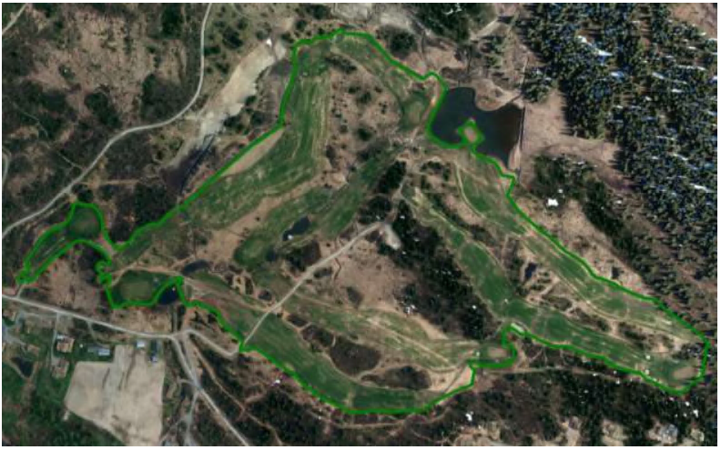
 
 
'''
.Eksempel på registrering av Golfbane
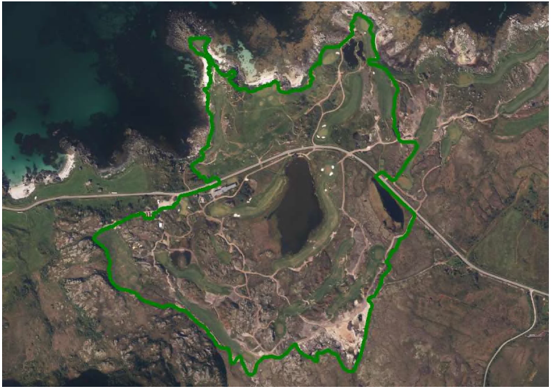
 
 
 
[discrete]
==== Føringer
[cols="h,2"]
|===
|FKB-A
|Påkrevd registrering
 
|FKB-B
|Påkrevd registrering
 
|FKB-C
|Påkrevd registrering
 
|FKB-D
|Påkrevd registrering
 
|===
 
 
<<<
 
[discrete]
==== Egenskapstabell for objekttype: Golfbane
[cols="20,20,20,10", options="header"]
|===
|*Navn:* 
|*Type:* 
|*SOSI_navn:* 
|*Mult.:* 
 
|identifikasjon
|«dataType» Identifikasjon
|..IDENT
|[0..1]
 
|identifikasjon.lokalId
|CharacterString
|...LOKALID
|[1..1]
 
|identifikasjon.navnerom
|CharacterString
|...NAVNEROM
|[1..1]
 
|identifikasjon.versjonId
|CharacterString
|...VERSJONID
|[0..1]
 
|oppdateringsdato
|DateTime
|..OPPDATERINGSDATO
|[0..1]
 
|sluttdato
|DateTime
|..SLUTTDATO
|[0..1]
 
|datafangstdato
|Date
|..DATAFANGSTDATO
|[1..1]
 
|verifiseringsdato
|Date
|..VERIFISERINGSDATO
|[0..1]
 
|registreringsversjon
|«CodeList» Registreringsversjon
|..REGISTRERINGSVERSJON
|[0..1]
 
|informasjon
|CharacterString
|..INFORMASJON
|[0..1]
 
|kvalitet
|«dataType» Posisjonskvalitet
|..KVALITET
|[1..1]
 
|kvalitet.datafangstmetode
| «CodeList»  https://register.geonorge.no/sosi-kodelister/fkb/generell/5.0/datafangstmetode[Datafangstmetode, window = _blank]
|...DATAFANGSTMETODE
|[1..1]
 
|kvalitet.nøyaktighet
|Integer
|...NØYAKTIGHET
|[0..1]
 
|kvalitet.synbarhet
| «CodeList»  https://register.geonorge.no/sosi-kodelister/fkb/generell/5.0/synbarhet[Synbarhet, window = _blank]
|...SYNBARHET
|[0..1]
 
|kvalitet.datafangstmetodeHøyde
| «CodeList»  https://register.geonorge.no/sosi-kodelister/fkb/generell/5.0/datafangstmetode[Datafangstmetode, window = _blank]
|...DATAFANGSTMETODEHØYDE
|[0..1]
 
|kvalitet.nøyaktighetHøyde
|Integer
|...H-NØYAKTIGHET
|[0..1]
 
|eksternpeker
|URI
|..EKSTERNPEKER
|[1..1]
 
|område
|GM_Surface
|.FLATE
|[1..1]
 
|===
 
<<<
'''
 
[[gravplass]]
=== Objekttype: Gravplass
*Definisjon fra FKB produktspesifikasjon*: område for gravstøtter, begravelsesplass og kirkegård
 
 
.Illustrasjon fra produktspesifikasjon av Gravplass
image::http://skjema.geonorge.no/SOSI/produktspesifikasjon/FKB-Arealbruk/5.0/figurer/objtype_gravplass.png[link=http://skjema.geonorge.no/SOSI/produktspesifikasjon/FKB-Arealbruk/5.0/figurer/objtype_gravplass.png, Alt="Illustrasjon fra produktspesifikasjon: Gravplass"]
 
 
[discrete]
==== Tilleggsinformasjon for fotogrammetrisk registrering
Avgrensingen kan v&#230;re diffus, spesielt for nyere omr&#229;der og gravplasser uten inngjerding. For &#229; sikre god fullstendighet og 
korrekt tolking ved fotogrammetrisk registrering, anbefales det &#229; utarbeide manus. 

Gravplassen skal registreres fullstendig. Interne veger, gangveger og tilh&#248;rende areal skal inng&#229; i arealbruksflaten
 
 
'''
.Eksempler på registrering av Gravplass. I disse tilfellene er gravplassene helt eller delvis inngjerdet
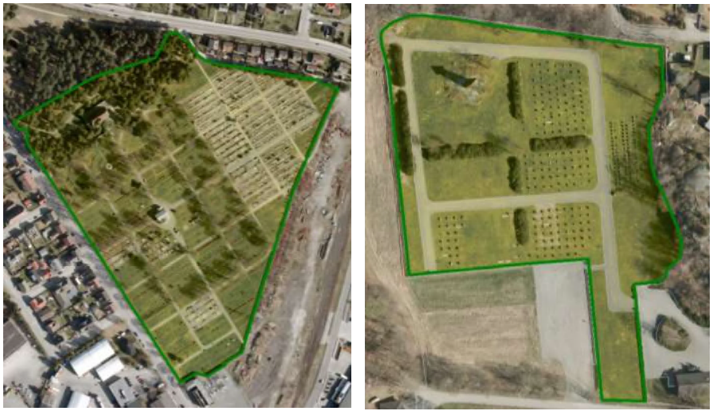
 
 
 
[discrete]
==== Føringer
[cols="h,2"]
|===
|FKB-A
|Påkrevd registrering
 
|FKB-B
|Påkrevd registrering
 
|FKB-C
|Påkrevd registrering
 
|FKB-D
|Påkrevd registrering
 
|===
 
 
<<<
 
[discrete]
==== Egenskapstabell for objekttype: Gravplass
[cols="20,20,20,10", options="header"]
|===
|*Navn:* 
|*Type:* 
|*SOSI_navn:* 
|*Mult.:* 
 
|identifikasjon
|«dataType» Identifikasjon
|..IDENT
|[0..1]
 
|identifikasjon.lokalId
|CharacterString
|...LOKALID
|[1..1]
 
|identifikasjon.navnerom
|CharacterString
|...NAVNEROM
|[1..1]
 
|identifikasjon.versjonId
|CharacterString
|...VERSJONID
|[0..1]
 
|oppdateringsdato
|DateTime
|..OPPDATERINGSDATO
|[0..1]
 
|sluttdato
|DateTime
|..SLUTTDATO
|[0..1]
 
|datafangstdato
|Date
|..DATAFANGSTDATO
|[1..1]
 
|verifiseringsdato
|Date
|..VERIFISERINGSDATO
|[0..1]
 
|registreringsversjon
|«CodeList» Registreringsversjon
|..REGISTRERINGSVERSJON
|[0..1]
 
|informasjon
|CharacterString
|..INFORMASJON
|[0..1]
 
|kvalitet
|«dataType» Posisjonskvalitet
|..KVALITET
|[1..1]
 
|kvalitet.datafangstmetode
| «CodeList»  https://register.geonorge.no/sosi-kodelister/fkb/generell/5.0/datafangstmetode[Datafangstmetode, window = _blank]
|...DATAFANGSTMETODE
|[1..1]
 
|kvalitet.nøyaktighet
|Integer
|...NØYAKTIGHET
|[0..1]
 
|kvalitet.synbarhet
| «CodeList»  https://register.geonorge.no/sosi-kodelister/fkb/generell/5.0/synbarhet[Synbarhet, window = _blank]
|...SYNBARHET
|[0..1]
 
|kvalitet.datafangstmetodeHøyde
| «CodeList»  https://register.geonorge.no/sosi-kodelister/fkb/generell/5.0/datafangstmetode[Datafangstmetode, window = _blank]
|...DATAFANGSTMETODEHØYDE
|[0..1]
 
|kvalitet.nøyaktighetHøyde
|Integer
|...H-NØYAKTIGHET
|[0..1]
 
|eksternpeker
|URI
|..EKSTERNPEKER
|[1..1]
 
|område
|GM_Surface
|.FLATE
|[1..1]
 
|===
 
<<<
'''
 
[[grustak]]
=== Objekttype: Grustak
*Definisjon fra FKB produktspesifikasjon*: uttaksplass, område, drevet i dagen for malm eller sand, grus, pukk, skifer
 
 
.Illustrasjon fra produktspesifikasjon av Grustak
image::http://skjema.geonorge.no/SOSI/produktspesifikasjon/FKB-Arealbruk/5.0/figurer/objtype_grustak.png[link=http://skjema.geonorge.no/SOSI/produktspesifikasjon/FKB-Arealbruk/5.0/figurer/objtype_grustak.png, Alt="Illustrasjon fra produktspesifikasjon: Grustak"]
 
 
[discrete]
==== Tilleggsinformasjon for fotogrammetrisk registrering
Leirtak og Steinbrudd er utg&#229;tt som egne objekttyper og skal registreres som Grustak. 
 
 
'''
.Eksempel på registrering av grustak.
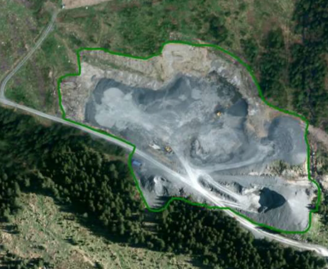
 
 
'''
.Eksempel på registrering av grustak (tidligere steinbrudd).
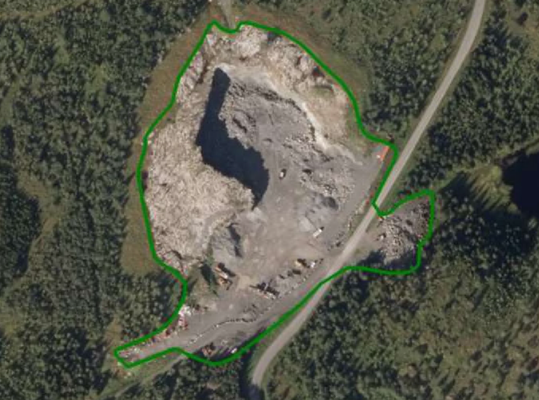
 
 
 
[discrete]
==== Føringer
[cols="h,2"]
|===
|FKB-A
|Påkrevd registrering
 
|FKB-B
|Påkrevd registrering
 
|FKB-C
|Påkrevd registrering
 
|FKB-D
|Påkrevd registrering
 
|===
 
 
<<<
 
[discrete]
==== Egenskapstabell for objekttype: Grustak
[cols="20,20,20,10", options="header"]
|===
|*Navn:* 
|*Type:* 
|*SOSI_navn:* 
|*Mult.:* 
 
|identifikasjon
|«dataType» Identifikasjon
|..IDENT
|[0..1]
 
|identifikasjon.lokalId
|CharacterString
|...LOKALID
|[1..1]
 
|identifikasjon.navnerom
|CharacterString
|...NAVNEROM
|[1..1]
 
|identifikasjon.versjonId
|CharacterString
|...VERSJONID
|[0..1]
 
|oppdateringsdato
|DateTime
|..OPPDATERINGSDATO
|[0..1]
 
|sluttdato
|DateTime
|..SLUTTDATO
|[0..1]
 
|datafangstdato
|Date
|..DATAFANGSTDATO
|[1..1]
 
|verifiseringsdato
|Date
|..VERIFISERINGSDATO
|[0..1]
 
|registreringsversjon
|«CodeList» Registreringsversjon
|..REGISTRERINGSVERSJON
|[0..1]
 
|informasjon
|CharacterString
|..INFORMASJON
|[0..1]
 
|kvalitet
|«dataType» Posisjonskvalitet
|..KVALITET
|[1..1]
 
|kvalitet.datafangstmetode
| «CodeList»  https://register.geonorge.no/sosi-kodelister/fkb/generell/5.0/datafangstmetode[Datafangstmetode, window = _blank]
|...DATAFANGSTMETODE
|[1..1]
 
|kvalitet.nøyaktighet
|Integer
|...NØYAKTIGHET
|[0..1]
 
|kvalitet.synbarhet
| «CodeList»  https://register.geonorge.no/sosi-kodelister/fkb/generell/5.0/synbarhet[Synbarhet, window = _blank]
|...SYNBARHET
|[0..1]
 
|kvalitet.datafangstmetodeHøyde
| «CodeList»  https://register.geonorge.no/sosi-kodelister/fkb/generell/5.0/datafangstmetode[Datafangstmetode, window = _blank]
|...DATAFANGSTMETODEHØYDE
|[0..1]
 
|kvalitet.nøyaktighetHøyde
|Integer
|...H-NØYAKTIGHET
|[0..1]
 
|eksternpeker
|URI
|..EKSTERNPEKER
|[1..1]
 
|område
|GM_Surface
|.FLATE
|[1..1]
 
|===
 
<<<
'''
 
[[industriområde]]
=== Objekttype: Industriområde
*Definisjon fra FKB produktspesifikasjon*: område, bebygd eller ubebygd, benyttet til industriformål
 
 
.Illustrasjon fra produktspesifikasjon av Industriområde
image::http://skjema.geonorge.no/SOSI/produktspesifikasjon/FKB-Arealbruk/5.0/figurer/objtype_industriomrade.png[link=http://skjema.geonorge.no/SOSI/produktspesifikasjon/FKB-Arealbruk/5.0/figurer/objtype_industriomrade.png, Alt="Illustrasjon fra produktspesifikasjon: Industriområde"]
 
 
[discrete]
==== Tilleggsinformasjon for fotogrammetrisk registrering
Avgrensingen kan v&#230;re diffus. For &#229; sikre god fullstendighet og korrekt tolking ved fotogrammetrisk registrering, anbefales det &#229; 
utarbeide manus.
 
 
'''
.Eksempler på registrering av industriområde
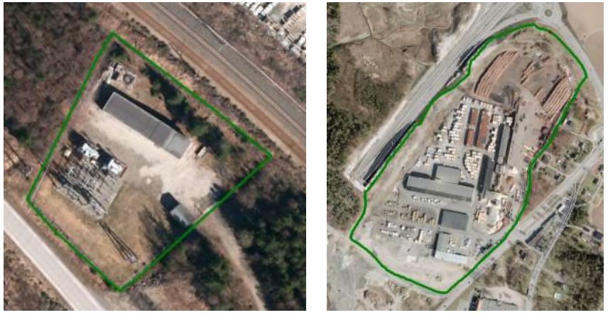
 
 
'''
.Eksempler på registrering av industriområde
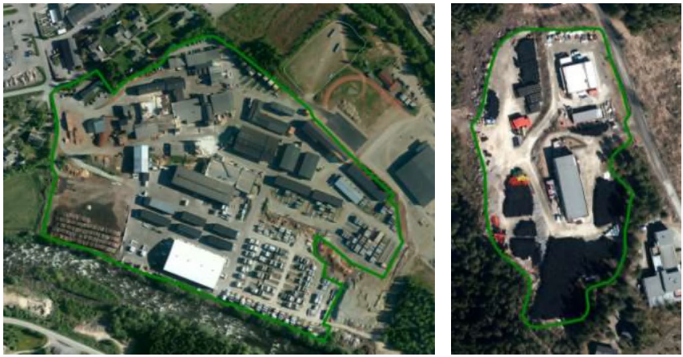
 
 
 
[discrete]
==== Føringer
[cols="h,2"]
|===
|FKB-A
|Påkrevd registrering
 
|FKB-B
|Påkrevd registrering
 
|FKB-C
|Påkrevd registrering
 
|FKB-D
|Påkrevd registrering
 
|===
 
 
<<<
 
[discrete]
==== Egenskapstabell for objekttype: Industriområde
[cols="20,20,20,10", options="header"]
|===
|*Navn:* 
|*Type:* 
|*SOSI_navn:* 
|*Mult.:* 
 
|identifikasjon
|«dataType» Identifikasjon
|..IDENT
|[0..1]
 
|identifikasjon.lokalId
|CharacterString
|...LOKALID
|[1..1]
 
|identifikasjon.navnerom
|CharacterString
|...NAVNEROM
|[1..1]
 
|identifikasjon.versjonId
|CharacterString
|...VERSJONID
|[0..1]
 
|oppdateringsdato
|DateTime
|..OPPDATERINGSDATO
|[0..1]
 
|sluttdato
|DateTime
|..SLUTTDATO
|[0..1]
 
|datafangstdato
|Date
|..DATAFANGSTDATO
|[1..1]
 
|verifiseringsdato
|Date
|..VERIFISERINGSDATO
|[0..1]
 
|registreringsversjon
|«CodeList» Registreringsversjon
|..REGISTRERINGSVERSJON
|[0..1]
 
|informasjon
|CharacterString
|..INFORMASJON
|[0..1]
 
|kvalitet
|«dataType» Posisjonskvalitet
|..KVALITET
|[1..1]
 
|kvalitet.datafangstmetode
| «CodeList»  https://register.geonorge.no/sosi-kodelister/fkb/generell/5.0/datafangstmetode[Datafangstmetode, window = _blank]
|...DATAFANGSTMETODE
|[1..1]
 
|kvalitet.nøyaktighet
|Integer
|...NØYAKTIGHET
|[0..1]
 
|kvalitet.synbarhet
| «CodeList»  https://register.geonorge.no/sosi-kodelister/fkb/generell/5.0/synbarhet[Synbarhet, window = _blank]
|...SYNBARHET
|[0..1]
 
|kvalitet.datafangstmetodeHøyde
| «CodeList»  https://register.geonorge.no/sosi-kodelister/fkb/generell/5.0/datafangstmetode[Datafangstmetode, window = _blank]
|...DATAFANGSTMETODEHØYDE
|[0..1]
 
|kvalitet.nøyaktighetHøyde
|Integer
|...H-NØYAKTIGHET
|[0..1]
 
|eksternpeker
|URI
|..EKSTERNPEKER
|[1..1]
 
|område
|GM_Surface
|.FLATE
|[1..1]
 
|===
 
<<<
'''
 
[[lekeplass]]
=== Objekttype: Lekeplass
*Definisjon fra FKB produktspesifikasjon*: område for lekeplass
 
 
.Illustrasjon fra produktspesifikasjon av Lekeplass
image::http://skjema.geonorge.no/SOSI/produktspesifikasjon/FKB-Arealbruk/5.0/figurer/objtype_lekeplass.png[link=http://skjema.geonorge.no/SOSI/produktspesifikasjon/FKB-Arealbruk/5.0/figurer/objtype_lekeplass.png, Alt="Illustrasjon fra produktspesifikasjon: Lekeplass"]
 
 
[discrete]
==== Tilleggsinformasjon for fotogrammetrisk registrering
For &#229; sikre god fullstendighet og korrekt tolking ved fotogrammetrisk registrering, anbefales det &#229; utarbeide manus. 

Lekeomr&#229;der i skoleg&#229;rder/barnehager skal registreres som en sammenhengende lekeplass med mindre lekeomr&#229;der ligger fysisk adskilt. I s&#229; fall registreres lekeplass for hvert enkelt omr&#229;de.

Lekeplasser i &#229;pne fellesareal (blokkbebyggelse) og innenfor andre arealbruksflater (for eksempel park) skal registreres. 

Omr&#229;der med lekeapparater i private hager (villa/enebolig) registreres ikke.
 
 
'''
.Eksempel på feil registrering av Lekeplass rundt for eksempel lekeapparater og fotballmål i private hager.
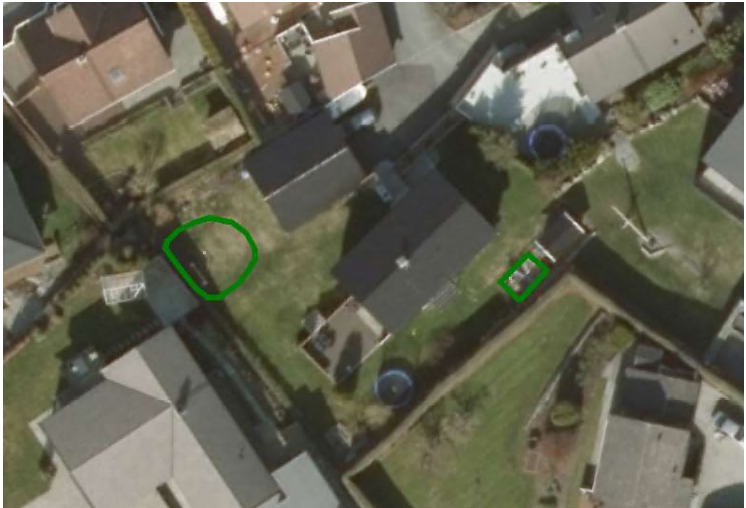
 
 
'''
.Eksempel på registrering av Lekeplass (de to til venstre) og SportIdrettPlass (de to til høyre) i et skoleområde.
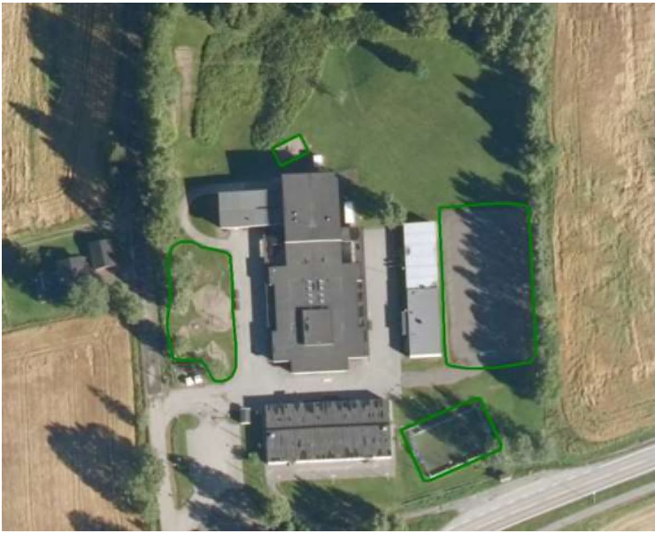
 
 
'''
.Eksempel på registrering av flere mindre Lekeplass i forbindelse med blokkbebyggelse.
image::figurer/lekeplass1.png[link=figurer/lekeplass1.png, Alt="Eksempel på registrering av flere mindre Lekeplass i forbindelse med blokkbebyggelse."]
 
 
'''
.Eksempel på registrering av Lekeplass i forbindelse med en skole.
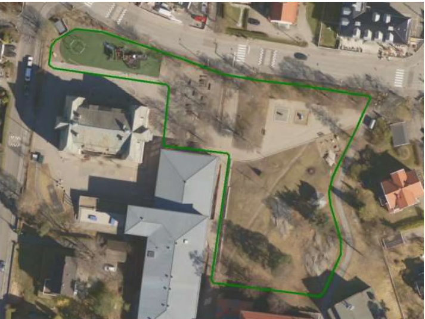
 
 
 
[discrete]
==== Føringer
[cols="h,2"]
|===
|FKB-A
|Påkrevd registrering
 
|FKB-B
|Påkrevd registrering
 
|FKB-C
|Påkrevd registrering
 
|FKB-D
|Påkrevd registrering
 
|===
 
 
<<<
 
[discrete]
==== Egenskapstabell for objekttype: Lekeplass
[cols="20,20,20,10", options="header"]
|===
|*Navn:* 
|*Type:* 
|*SOSI_navn:* 
|*Mult.:* 
 
|identifikasjon
|«dataType» Identifikasjon
|..IDENT
|[0..1]
 
|identifikasjon.lokalId
|CharacterString
|...LOKALID
|[1..1]
 
|identifikasjon.navnerom
|CharacterString
|...NAVNEROM
|[1..1]
 
|identifikasjon.versjonId
|CharacterString
|...VERSJONID
|[0..1]
 
|oppdateringsdato
|DateTime
|..OPPDATERINGSDATO
|[0..1]
 
|sluttdato
|DateTime
|..SLUTTDATO
|[0..1]
 
|datafangstdato
|Date
|..DATAFANGSTDATO
|[1..1]
 
|verifiseringsdato
|Date
|..VERIFISERINGSDATO
|[0..1]
 
|registreringsversjon
|«CodeList» Registreringsversjon
|..REGISTRERINGSVERSJON
|[0..1]
 
|informasjon
|CharacterString
|..INFORMASJON
|[0..1]
 
|kvalitet
|«dataType» Posisjonskvalitet
|..KVALITET
|[1..1]
 
|kvalitet.datafangstmetode
| «CodeList»  https://register.geonorge.no/sosi-kodelister/fkb/generell/5.0/datafangstmetode[Datafangstmetode, window = _blank]
|...DATAFANGSTMETODE
|[1..1]
 
|kvalitet.nøyaktighet
|Integer
|...NØYAKTIGHET
|[0..1]
 
|kvalitet.synbarhet
| «CodeList»  https://register.geonorge.no/sosi-kodelister/fkb/generell/5.0/synbarhet[Synbarhet, window = _blank]
|...SYNBARHET
|[0..1]
 
|kvalitet.datafangstmetodeHøyde
| «CodeList»  https://register.geonorge.no/sosi-kodelister/fkb/generell/5.0/datafangstmetode[Datafangstmetode, window = _blank]
|...DATAFANGSTMETODEHØYDE
|[0..1]
 
|kvalitet.nøyaktighetHøyde
|Integer
|...H-NØYAKTIGHET
|[0..1]
 
|eksternpeker
|URI
|..EKSTERNPEKER
|[1..1]
 
|område
|GM_Surface
|.FLATE
|[1..1]
 
|===
 
<<<
'''
 
[[park]]
=== Objekttype: Park
*Definisjon fra FKB produktspesifikasjon*: grøntområde i by- eller tettbygd område, opparbeidet og vedlikeholdt med plenareal, beplantninger, vannpartier og lignende
 
 
.Illustrasjon fra produktspesifikasjon av Park
image::http://skjema.geonorge.no/SOSI/produktspesifikasjon/FKB-Arealbruk/5.0/figurer/objtype_park.png[link=http://skjema.geonorge.no/SOSI/produktspesifikasjon/FKB-Arealbruk/5.0/figurer/objtype_park.png, Alt="Illustrasjon fra produktspesifikasjon: Park"]
 
 
[discrete]
==== Tilleggsinformasjon for fotogrammetrisk registrering
Avgrensingen kan v&#230;re diffus. For &#229; sikre god fullstendighet og korrekt tolking ved fotogrammetrisk registrering, anbefales det &#229; utarbeide manus
 
 
'''
.Eksempel på registrering av Park
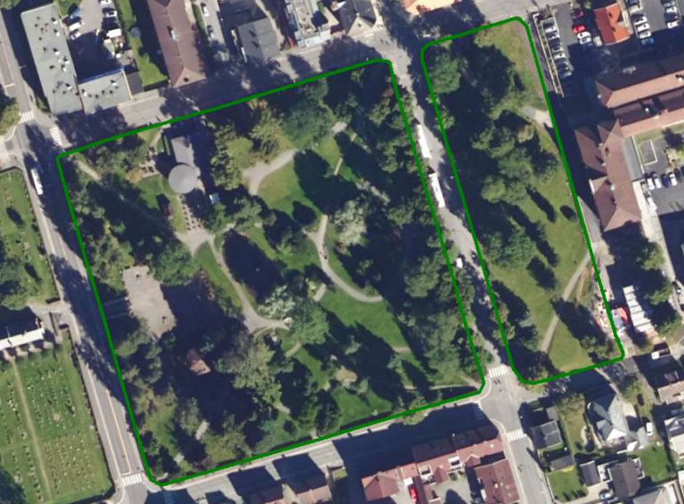
 
 
'''
.Eksempel på registrering av Park
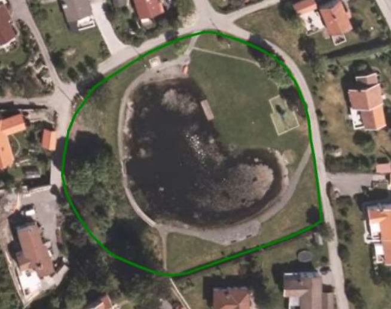
 
 
 
[discrete]
==== Føringer
[cols="h,2"]
|===
|FKB-A
|Påkrevd registrering
 
|FKB-B
|Påkrevd registrering
 
|FKB-C
|Påkrevd registrering
 
|FKB-D
|Påkrevd registrering
 
|===
 
 
<<<
 
[discrete]
==== Egenskapstabell for objekttype: Park
[cols="20,20,20,10", options="header"]
|===
|*Navn:* 
|*Type:* 
|*SOSI_navn:* 
|*Mult.:* 
 
|identifikasjon
|«dataType» Identifikasjon
|..IDENT
|[0..1]
 
|identifikasjon.lokalId
|CharacterString
|...LOKALID
|[1..1]
 
|identifikasjon.navnerom
|CharacterString
|...NAVNEROM
|[1..1]
 
|identifikasjon.versjonId
|CharacterString
|...VERSJONID
|[0..1]
 
|oppdateringsdato
|DateTime
|..OPPDATERINGSDATO
|[0..1]
 
|sluttdato
|DateTime
|..SLUTTDATO
|[0..1]
 
|datafangstdato
|Date
|..DATAFANGSTDATO
|[1..1]
 
|verifiseringsdato
|Date
|..VERIFISERINGSDATO
|[0..1]
 
|registreringsversjon
|«CodeList» Registreringsversjon
|..REGISTRERINGSVERSJON
|[0..1]
 
|informasjon
|CharacterString
|..INFORMASJON
|[0..1]
 
|kvalitet
|«dataType» Posisjonskvalitet
|..KVALITET
|[1..1]
 
|kvalitet.datafangstmetode
| «CodeList»  https://register.geonorge.no/sosi-kodelister/fkb/generell/5.0/datafangstmetode[Datafangstmetode, window = _blank]
|...DATAFANGSTMETODE
|[1..1]
 
|kvalitet.nøyaktighet
|Integer
|...NØYAKTIGHET
|[0..1]
 
|kvalitet.synbarhet
| «CodeList»  https://register.geonorge.no/sosi-kodelister/fkb/generell/5.0/synbarhet[Synbarhet, window = _blank]
|...SYNBARHET
|[0..1]
 
|kvalitet.datafangstmetodeHøyde
| «CodeList»  https://register.geonorge.no/sosi-kodelister/fkb/generell/5.0/datafangstmetode[Datafangstmetode, window = _blank]
|...DATAFANGSTMETODEHØYDE
|[0..1]
 
|kvalitet.nøyaktighetHøyde
|Integer
|...H-NØYAKTIGHET
|[0..1]
 
|eksternpeker
|URI
|..EKSTERNPEKER
|[1..1]
 
|område
|GM_Surface
|.FLATE
|[1..1]
 
|===
 
<<<
'''
 
[[skytebane]]
=== Objekttype: Skytebane
*Definisjon fra FKB produktspesifikasjon*: avgrenset område hvor det skytes
 
 
.Illustrasjon fra produktspesifikasjon av Skytebane
image::http://skjema.geonorge.no/SOSI/produktspesifikasjon/FKB-Arealbruk/5.0/figurer/objtype_skytebane.png[link=http://skjema.geonorge.no/SOSI/produktspesifikasjon/FKB-Arealbruk/5.0/figurer/objtype_skytebane.png, Alt="Illustrasjon fra produktspesifikasjon: Skytebane"]
 
 
 
'''
.Eksempel på registrering av Skytebane
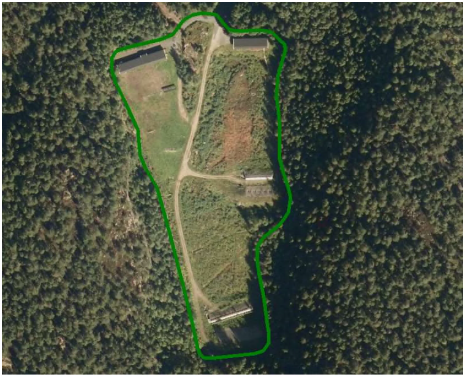
 
 
 
[discrete]
==== Føringer
[cols="h,2"]
|===
|FKB-A
|Påkrevd registrering
 
|FKB-B
|Påkrevd registrering
 
|FKB-C
|Påkrevd registrering
 
|FKB-D
|Påkrevd registrering
 
|===
 
 
<<<
 
[discrete]
==== Egenskapstabell for objekttype: Skytebane
[cols="20,20,20,10", options="header"]
|===
|*Navn:* 
|*Type:* 
|*SOSI_navn:* 
|*Mult.:* 
 
|identifikasjon
|«dataType» Identifikasjon
|..IDENT
|[0..1]
 
|identifikasjon.lokalId
|CharacterString
|...LOKALID
|[1..1]
 
|identifikasjon.navnerom
|CharacterString
|...NAVNEROM
|[1..1]
 
|identifikasjon.versjonId
|CharacterString
|...VERSJONID
|[0..1]
 
|oppdateringsdato
|DateTime
|..OPPDATERINGSDATO
|[0..1]
 
|sluttdato
|DateTime
|..SLUTTDATO
|[0..1]
 
|datafangstdato
|Date
|..DATAFANGSTDATO
|[1..1]
 
|verifiseringsdato
|Date
|..VERIFISERINGSDATO
|[0..1]
 
|registreringsversjon
|«CodeList» Registreringsversjon
|..REGISTRERINGSVERSJON
|[0..1]
 
|informasjon
|CharacterString
|..INFORMASJON
|[0..1]
 
|kvalitet
|«dataType» Posisjonskvalitet
|..KVALITET
|[1..1]
 
|kvalitet.datafangstmetode
| «CodeList»  https://register.geonorge.no/sosi-kodelister/fkb/generell/5.0/datafangstmetode[Datafangstmetode, window = _blank]
|...DATAFANGSTMETODE
|[1..1]
 
|kvalitet.nøyaktighet
|Integer
|...NØYAKTIGHET
|[0..1]
 
|kvalitet.synbarhet
| «CodeList»  https://register.geonorge.no/sosi-kodelister/fkb/generell/5.0/synbarhet[Synbarhet, window = _blank]
|...SYNBARHET
|[0..1]
 
|kvalitet.datafangstmetodeHøyde
| «CodeList»  https://register.geonorge.no/sosi-kodelister/fkb/generell/5.0/datafangstmetode[Datafangstmetode, window = _blank]
|...DATAFANGSTMETODEHØYDE
|[0..1]
 
|kvalitet.nøyaktighetHøyde
|Integer
|...H-NØYAKTIGHET
|[0..1]
 
|eksternpeker
|URI
|..EKSTERNPEKER
|[1..1]
 
|område
|GM_Surface
|.FLATE
|[1..1]
 
|===
 
<<<
'''
 
[[sportidrettplass]]
=== Objekttype: SportIdrettPlass
*Definisjon fra FKB produktspesifikasjon*: område hvor det utøves sport og idrett
 
 
.Illustrasjon fra produktspesifikasjon av SportIdrettPlass
image::http://skjema.geonorge.no/SOSI/produktspesifikasjon/FKB-Arealbruk/5.0/figurer/objtype_sportidrettsplass.png[link=http://skjema.geonorge.no/SOSI/produktspesifikasjon/FKB-Arealbruk/5.0/figurer/objtype_sportidrettsplass.png, Alt="Illustrasjon fra produktspesifikasjon: SportIdrettPlass"]
 
 
[discrete]
==== Tilleggsinformasjon for fotogrammetrisk registrering
For &#229; sikre god fullstendighet og korrekt tolking ved 
fotogrammetrisk registrering, anbefales det &#229; utarbeide manus.
 
Omfatter ogs&#229; sport- og idrettsomr&#229;der i tilknytning til skoler og 
omr&#229;der tilrettelagt for motorsport (for eks motorcrossbane).

Ytterkant (gresskant, gruskant, asfaltkant) av banene registreres 
som Idrettsanlegg (se FKB-BygnAnlegg). Selve oppmerkingen av 
banene skal ikke registreres
 
 
'''
.Eksempel på registrering av SportIdrettPlass. Ytterkant til banene (for eksempel gresskant, gruskant eller asfaltkant) beskrives med objekttypen Idrettsanlegg i FKB-BygnAnlegg.
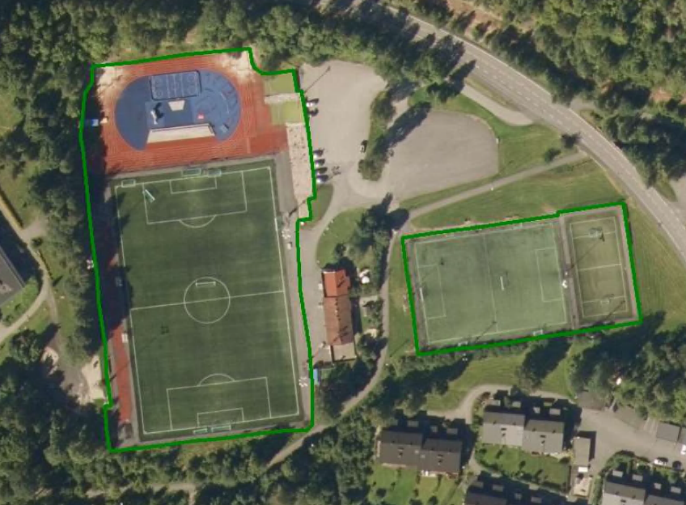
 
 
 
[discrete]
==== Føringer
[cols="h,2"]
|===
|FKB-A
|Påkrevd registrering
 
|FKB-B
|Påkrevd registrering
 
|FKB-C
|Påkrevd registrering
 
|FKB-D
|Påkrevd registrering
 
|===
 
 
<<<
 
[discrete]
==== Egenskapstabell for objekttype: SportIdrettPlass
[cols="20,20,20,10", options="header"]
|===
|*Navn:* 
|*Type:* 
|*SOSI_navn:* 
|*Mult.:* 
 
|identifikasjon
|«dataType» Identifikasjon
|..IDENT
|[0..1]
 
|identifikasjon.lokalId
|CharacterString
|...LOKALID
|[1..1]
 
|identifikasjon.navnerom
|CharacterString
|...NAVNEROM
|[1..1]
 
|identifikasjon.versjonId
|CharacterString
|...VERSJONID
|[0..1]
 
|oppdateringsdato
|DateTime
|..OPPDATERINGSDATO
|[0..1]
 
|sluttdato
|DateTime
|..SLUTTDATO
|[0..1]
 
|datafangstdato
|Date
|..DATAFANGSTDATO
|[1..1]
 
|verifiseringsdato
|Date
|..VERIFISERINGSDATO
|[0..1]
 
|registreringsversjon
|«CodeList» Registreringsversjon
|..REGISTRERINGSVERSJON
|[0..1]
 
|informasjon
|CharacterString
|..INFORMASJON
|[0..1]
 
|kvalitet
|«dataType» Posisjonskvalitet
|..KVALITET
|[1..1]
 
|kvalitet.datafangstmetode
| «CodeList»  https://register.geonorge.no/sosi-kodelister/fkb/generell/5.0/datafangstmetode[Datafangstmetode, window = _blank]
|...DATAFANGSTMETODE
|[1..1]
 
|kvalitet.nøyaktighet
|Integer
|...NØYAKTIGHET
|[0..1]
 
|kvalitet.synbarhet
| «CodeList»  https://register.geonorge.no/sosi-kodelister/fkb/generell/5.0/synbarhet[Synbarhet, window = _blank]
|...SYNBARHET
|[0..1]
 
|kvalitet.datafangstmetodeHøyde
| «CodeList»  https://register.geonorge.no/sosi-kodelister/fkb/generell/5.0/datafangstmetode[Datafangstmetode, window = _blank]
|...DATAFANGSTMETODEHØYDE
|[0..1]
 
|kvalitet.nøyaktighetHøyde
|Integer
|...H-NØYAKTIGHET
|[0..1]
 
|eksternpeker
|URI
|..EKSTERNPEKER
|[1..1]
 
|område
|GM_Surface
|.FLATE
|[1..1]
 
|===
 
<<<
'''
 
[[steintipp]]
=== Objekttype: Steintipp
*Definisjon fra FKB produktspesifikasjon*: område for steintipp
 
 
.Illustrasjon fra produktspesifikasjon av Steintipp
image::http://skjema.geonorge.no/SOSI/produktspesifikasjon/FKB-Arealbruk/5.0/figurer/objtype_steintipp.png[link=http://skjema.geonorge.no/SOSI/produktspesifikasjon/FKB-Arealbruk/5.0/figurer/objtype_steintipp.png, Alt="Illustrasjon fra produktspesifikasjon: Steintipp"]
 
 
[discrete]
==== Tilleggsinformasjon for fotogrammetrisk registrering
Benyttes for permanente steintipper (st&#248;rre enn 1000m2) i forbindelse med damanlegg og gruvedrift. 
 
 
'''
.Eksempel på registrering av steintipp i forbindelse med gruvedrift
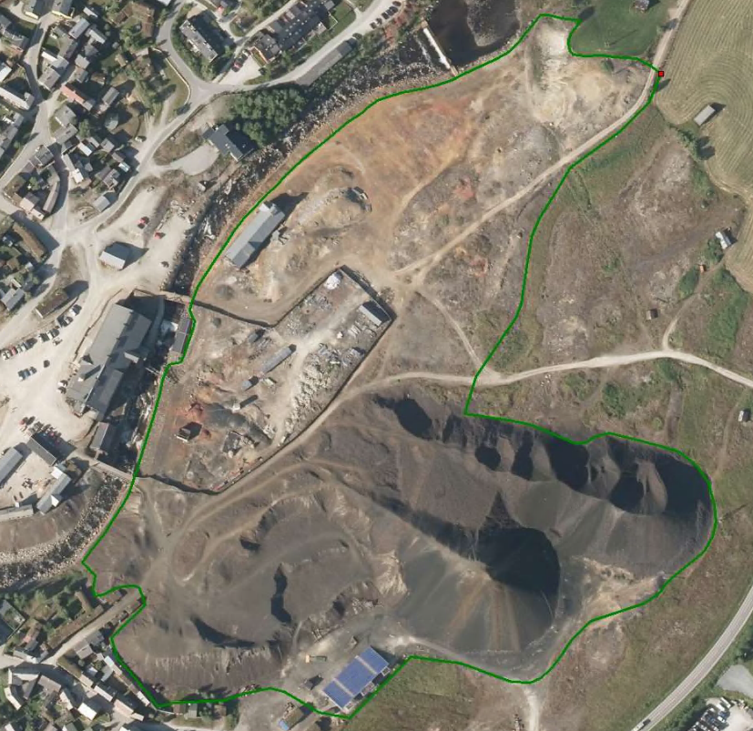
 
 
 
[discrete]
==== Føringer
[cols="h,2"]
|===
|FKB-A minstestørrelse
|Areal > 1000m2
 
|FKB-A
|Påkrevd registrering
 
|FKB-B
|Påkrevd registrering
 
|FKB-C
|Påkrevd registrering
 
|FKB-D
|Påkrevd registrering
 
|===
 
 
<<<
 
[discrete]
==== Egenskapstabell for objekttype: Steintipp
[cols="20,20,20,10", options="header"]
|===
|*Navn:* 
|*Type:* 
|*SOSI_navn:* 
|*Mult.:* 
 
|identifikasjon
|«dataType» Identifikasjon
|..IDENT
|[0..1]
 
|identifikasjon.lokalId
|CharacterString
|...LOKALID
|[1..1]
 
|identifikasjon.navnerom
|CharacterString
|...NAVNEROM
|[1..1]
 
|identifikasjon.versjonId
|CharacterString
|...VERSJONID
|[0..1]
 
|oppdateringsdato
|DateTime
|..OPPDATERINGSDATO
|[0..1]
 
|sluttdato
|DateTime
|..SLUTTDATO
|[0..1]
 
|datafangstdato
|Date
|..DATAFANGSTDATO
|[1..1]
 
|verifiseringsdato
|Date
|..VERIFISERINGSDATO
|[0..1]
 
|registreringsversjon
|«CodeList» Registreringsversjon
|..REGISTRERINGSVERSJON
|[0..1]
 
|informasjon
|CharacterString
|..INFORMASJON
|[0..1]
 
|kvalitet
|«dataType» Posisjonskvalitet
|..KVALITET
|[1..1]
 
|kvalitet.datafangstmetode
| «CodeList»  https://register.geonorge.no/sosi-kodelister/fkb/generell/5.0/datafangstmetode[Datafangstmetode, window = _blank]
|...DATAFANGSTMETODE
|[1..1]
 
|kvalitet.nøyaktighet
|Integer
|...NØYAKTIGHET
|[0..1]
 
|kvalitet.synbarhet
| «CodeList»  https://register.geonorge.no/sosi-kodelister/fkb/generell/5.0/synbarhet[Synbarhet, window = _blank]
|...SYNBARHET
|[0..1]
 
|kvalitet.datafangstmetodeHøyde
| «CodeList»  https://register.geonorge.no/sosi-kodelister/fkb/generell/5.0/datafangstmetode[Datafangstmetode, window = _blank]
|...DATAFANGSTMETODEHØYDE
|[0..1]
 
|kvalitet.nøyaktighetHøyde
|Integer
|...H-NØYAKTIGHET
|[0..1]
 
|eksternpeker
|URI
|..EKSTERNPEKER
|[1..1]
 
|område
|GM_Surface
|.FLATE
|[1..1]
 
|===
 
<<<
'''
 
[[transformatorstasjon]]
=== Objekttype: Transformatorstasjon
*Definisjon fra FKB produktspesifikasjon*: omr&#229;de for omforming og fordeling av elektrisk energi.

Oftest et tydelig avgrenset/inngjerdet omr&#229;de med mange kabler inn og ut. 
 
 
.Illustrasjon fra produktspesifikasjon av Transformatorstasjon
image::http://skjema.geonorge.no/SOSI/produktspesifikasjon/FKB-Arealbruk/5.0/figurer/objtype_transformatorstasjon.png[link=http://skjema.geonorge.no/SOSI/produktspesifikasjon/FKB-Arealbruk/5.0/figurer/objtype_transformatorstasjon.png, Alt="Illustrasjon fra produktspesifikasjon: Transformatorstasjon"]
 
 
[discrete]
==== Tilleggsinformasjon for fotogrammetrisk registrering
Merknad: Inngikk fram til FKB 4.61 som en del av Industriomr&#229;de, men b&#248;r v&#230;re grei &#229; klassifisere som transformatorstasjon fra flybilder. 
 
 
[discrete]
==== Føringer
[cols="h,2"]
|===
|FKB-A
|Påkrevd registrering
 
|FKB-B
|Påkrevd registrering
 
|FKB-C
|Påkrevd registrering
 
|FKB-D
|Påkrevd registrering
 
|===
 
 
<<<
 
[discrete]
==== Egenskapstabell for objekttype: Transformatorstasjon
[cols="20,20,20,10", options="header"]
|===
|*Navn:* 
|*Type:* 
|*SOSI_navn:* 
|*Mult.:* 
 
|identifikasjon
|«dataType» Identifikasjon
|..IDENT
|[0..1]
 
|identifikasjon.lokalId
|CharacterString
|...LOKALID
|[1..1]
 
|identifikasjon.navnerom
|CharacterString
|...NAVNEROM
|[1..1]
 
|identifikasjon.versjonId
|CharacterString
|...VERSJONID
|[0..1]
 
|oppdateringsdato
|DateTime
|..OPPDATERINGSDATO
|[0..1]
 
|sluttdato
|DateTime
|..SLUTTDATO
|[0..1]
 
|datafangstdato
|Date
|..DATAFANGSTDATO
|[1..1]
 
|verifiseringsdato
|Date
|..VERIFISERINGSDATO
|[0..1]
 
|registreringsversjon
|«CodeList» Registreringsversjon
|..REGISTRERINGSVERSJON
|[0..1]
 
|informasjon
|CharacterString
|..INFORMASJON
|[0..1]
 
|kvalitet
|«dataType» Posisjonskvalitet
|..KVALITET
|[1..1]
 
|kvalitet.datafangstmetode
| «CodeList»  https://register.geonorge.no/sosi-kodelister/fkb/generell/5.0/datafangstmetode[Datafangstmetode, window = _blank]
|...DATAFANGSTMETODE
|[1..1]
 
|kvalitet.nøyaktighet
|Integer
|...NØYAKTIGHET
|[0..1]
 
|kvalitet.synbarhet
| «CodeList»  https://register.geonorge.no/sosi-kodelister/fkb/generell/5.0/synbarhet[Synbarhet, window = _blank]
|...SYNBARHET
|[0..1]
 
|kvalitet.datafangstmetodeHøyde
| «CodeList»  https://register.geonorge.no/sosi-kodelister/fkb/generell/5.0/datafangstmetode[Datafangstmetode, window = _blank]
|...DATAFANGSTMETODEHØYDE
|[0..1]
 
|kvalitet.nøyaktighetHøyde
|Integer
|...H-NØYAKTIGHET
|[0..1]
 
|eksternpeker
|URI
|..EKSTERNPEKER
|[1..1]
 
|område
|GM_Surface
|.FLATE
|[1..1]
 
|===
// End of Registreringsinstruks UML-model
