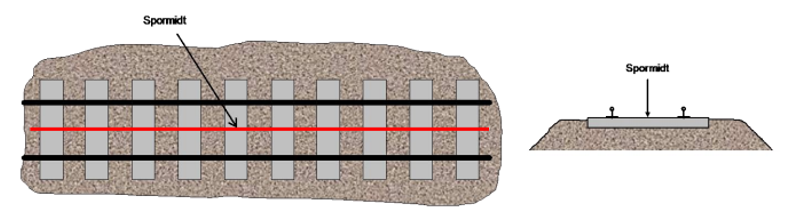
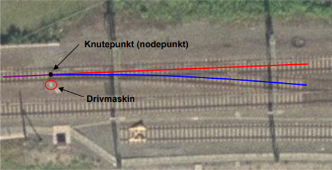
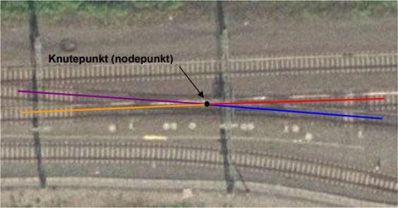

 
<<<
'''
 
[[jernbaneplattformkant]]
=== Objekttype: Jernbaneplattformkant
*Definisjon fra FKB produktspesifikasjon*: yttergrense av konstruksjon til bruk ved av-/påstigning for passasjerer eller ved av-/pålasting av gods
 
 
.Illustrasjon fra produktspesifikasjon av Jernbaneplattformkant
image::http://skjema.geonorge.no/SOSI/produktspesifikasjon/FKB-Bane/5.0/figurer/objtype_jernbaneplattformkant.png[link=http://skjema.geonorge.no/SOSI/produktspesifikasjon/FKB-Bane/5.0/figurer/objtype_jernbaneplattformkant.png, Alt="Illustrasjon fra produktspesifikasjon: Jernbaneplattformkant"]
 
 
[discrete]
==== Tilleggsinformasjon for fotogrammetrisk registrering
Ingen tilleggsdefinisjon.

Merknad: Der det er naturlig skal det lages knutepunkt (nodepunkt eller konnekteringspunkt) mot andre tilst&#248;tende objekter, for eksempel bygninger og murer.
 
 
[discrete]
==== Føringer
[cols="h,2"]
|===
|FKB grunnrissreferanse
|Ytterkant av plattform
 
|FKB høydereferanse
|Topp av plattform
 
|FKB registreringsmetode
|Enkeltpunkt i sekvens
 
|FKB-A
|Påkrevd registrering
 
|FKB-B
|Påkrevd registrering
 
|FKB-C
|Påkrevd registrering
 
|FKB-D
|Påkrevd registrering
 
|===
 
 
<<<
 
[discrete]
==== Egenskapstabell for objekttype: Jernbaneplattformkant
[cols="20,20,20,10", options="header"]
|===
|*Navn:* 
|*Type:* 
|*SOSI_navn:* 
|*Mult.:* 
 
|identifikasjon
|«dataType» Identifikasjon
|..IDENT
|[0..1]
 
|identifikasjon.lokalId
|CharacterString
|...LOKALID
|[1..1]
 
|identifikasjon.navnerom
|CharacterString
|...NAVNEROM
|[1..1]
 
|identifikasjon.versjonId
|CharacterString
|...VERSJONID
|[0..1]
 
|oppdateringsdato
|DateTime
|..OPPDATERINGSDATO
|[0..1]
 
|sluttdato
|DateTime
|..SLUTTDATO
|[0..1]
 
|datafangstdato
|Date
|..DATAFANGSTDATO
|[1..1]
 
|verifiseringsdato
|Date
|..VERIFISERINGSDATO
|[0..1]
 
|registreringsversjon
| «CodeList»  https://register.geonorge.no/sosi-kodelister/fkb/generell/5.0/registreringsversjon[Registreringsversjon, window = _blank]
|..REGISTRERINGSVERSJON
|[0..1]
 
|informasjon
|CharacterString
|..INFORMASJON
|[0..1]
 
|kvalitet
|«dataType» Posisjonskvalitet
|..KVALITET
|[1..1]
 
|kvalitet.datafangstmetode
| «CodeList»  https://register.geonorge.no/sosi-kodelister/fkb/generell/5.0/datafangstmetode[Datafangstmetode, window = _blank]
|...DATAFANGSTMETODE
|[1..1]
 
|kvalitet.nøyaktighet
|Integer
|...NØYAKTIGHET
|[0..1]
 
|kvalitet.synbarhet
| «CodeList»  https://register.geonorge.no/sosi-kodelister/fkb/generell/5.0/synbarhet[Synbarhet, window = _blank]
|...SYNBARHET
|[0..1]
 
|kvalitet.datafangstmetodeHøyde
| «CodeList»  https://register.geonorge.no/sosi-kodelister/fkb/generell/5.0/datafangstmetode[Datafangstmetode, window = _blank]
|...DATAFANGSTMETODEHØYDE
|[0..1]
 
|kvalitet.nøyaktighetHøyde
|Integer
|...H-NØYAKTIGHET
|[0..1]
 
|grense
|GM_Curve
|.KURVE
|[1..1]
 
|medium
|«CodeList» Medium
|..MEDIUM
|[1..1]
 
|eksternpeker
|URI
|..EKSTERNPEKER
|[0..1]
 
|===
 
<<<
'''
 
[[spormidt]]
=== Objekttype: Spormidt
*Definisjon fra FKB produktspesifikasjon*: teoretisk linje midt mellom skinnestrengene
 
 
.Illustrasjon fra produktspesifikasjon av Spormidt
image::http://skjema.geonorge.no/SOSI/produktspesifikasjon/FKB-Bane/5.0/figurer/objtype_spormidt.png[link=http://skjema.geonorge.no/SOSI/produktspesifikasjon/FKB-Bane/5.0/figurer/objtype_spormidt.png, Alt="Illustrasjon fra produktspesifikasjon: Spormidt"]
 
 
[discrete]
==== Tilleggsinformasjon for fotogrammetrisk registrering
Spormidt skal registreres fullstendig og sammenhengende.
Det skal registreres knutepunkt (nodepunkt) i sporveksler og sporkryss/kryssveksler samt der det er endring i &#233;n eller flere egenskaper. Se figurer som viser riktig plassering av nodepunkt.

H&#248;ydereferanse for Spormidt defineres relativt til skinnestreng. For fotogrammetrisk konstruksjon er dette topp sville/ballastpukk i spormidt. Dette er ved foten av skinna og skal ha HREF FOT. 

Der Spormidt er levert fra prosjekterte data (linjeberegninger) vil h&#248;ydereferansen v&#230;re topp laveste skinne, alts&#229; med HREF TOP.

Sporet kan v&#230;re helt eller delvis skjult av togmateriell i flybildene. Dette vises ved kvalitetskoding.

Kodeliste for Jernbanetype finnes p&#229; https://register.geonorge.no/sosi-kodelister/fkb/bane/5.0/Jernbanetype.
 
 
'''
.Eksempel på plassering av Spormidt (rød strek).

 
 
'''
.Eksempel på plassering av knutepunkt (nodepunkt) i sporveksel. Knutepunktet plasseres i skjæringspunktet for Spormidt og normalen fra drivmaskinen ned på Spormidt.  

 
 
'''
.Eksempel på plassering av knutepunkt (nodepunkt) i sporkryss/kryssveksel. Knutepunktet plasseres i skjæringspunktet for to kryssende Spormidt.  

 
 
 
[discrete]
==== Føringer
[cols="h,2"]
|===
|FKB grunnrissreferanse
|Midt mellom skinnene
 
|FKB høydereferanse
|Topp sville/ballastpukk
 
|FKB registreringsmetode
|Enkeltpunkt i sekvens
 
|FKB-A
|Påkrevd registrering
 
|FKB-B
|Påkrevd registrering
 
|FKB-C
|Påkrevd registrering
 
|FKB-D
|Påkrevd registrering
 
|===
 
 
<<<
 
[discrete]
==== Egenskapstabell for objekttype: Spormidt
[cols="20,20,20,10", options="header"]
|===
|*Navn:* 
|*Type:* 
|*SOSI_navn:* 
|*Mult.:* 
 
|identifikasjon
|«dataType» Identifikasjon
|..IDENT
|[0..1]
 
|identifikasjon.lokalId
|CharacterString
|...LOKALID
|[1..1]
 
|identifikasjon.navnerom
|CharacterString
|...NAVNEROM
|[1..1]
 
|identifikasjon.versjonId
|CharacterString
|...VERSJONID
|[0..1]
 
|oppdateringsdato
|DateTime
|..OPPDATERINGSDATO
|[0..1]
 
|sluttdato
|DateTime
|..SLUTTDATO
|[0..1]
 
|datafangstdato
|Date
|..DATAFANGSTDATO
|[1..1]
 
|verifiseringsdato
|Date
|..VERIFISERINGSDATO
|[0..1]
 
|registreringsversjon
| «CodeList»  https://register.geonorge.no/sosi-kodelister/fkb/generell/5.0/registreringsversjon[Registreringsversjon, window = _blank]
|..REGISTRERINGSVERSJON
|[0..1]
 
|informasjon
|CharacterString
|..INFORMASJON
|[0..1]
 
|kvalitet
|«dataType» Posisjonskvalitet
|..KVALITET
|[1..1]
 
|kvalitet.datafangstmetode
| «CodeList»  https://register.geonorge.no/sosi-kodelister/fkb/generell/5.0/datafangstmetode[Datafangstmetode, window = _blank]
|...DATAFANGSTMETODE
|[1..1]
 
|kvalitet.nøyaktighet
|Integer
|...NØYAKTIGHET
|[0..1]
 
|kvalitet.synbarhet
| «CodeList»  https://register.geonorge.no/sosi-kodelister/fkb/generell/5.0/synbarhet[Synbarhet, window = _blank]
|...SYNBARHET
|[0..1]
 
|kvalitet.datafangstmetodeHøyde
| «CodeList»  https://register.geonorge.no/sosi-kodelister/fkb/generell/5.0/datafangstmetode[Datafangstmetode, window = _blank]
|...DATAFANGSTMETODEHØYDE
|[0..1]
 
|kvalitet.nøyaktighetHøyde
|Integer
|...H-NØYAKTIGHET
|[0..1]
 
|senterlinje
|GM_Curve
|.KURVE
|[1..1]
 
|jernbanetype
|«CodeList» Jernbanetype
|..JERNBANETYPE
|[1..1]
 
|høydereferanse
|«CodeList» Høydereferanse
|..HREF
|[1..1]
 
|medium
|«CodeList» Medium
|..MEDIUM
|[1..1]
 
|eksternpeker
|URI
|..EKSTERNPEKER
|[0..1]
 
|===
// End of Registreringsinstruks UML-model
