 
<<<
'''
 
[[bru]]
=== Objekttype: Bru
*Definisjon fra FKB produktspesifikasjon*: konstruksjon for kryssing av vanskelig farbart område
Merknad: Med vanskelig farbart område menes en elv, et juv eller andre naturlige hindringer, samt kryssende infrastruktur.
 
 
.Illustrasjon fra produktspesifikasjon av Bru
image::http://skjema.geonorge.no/SOSI/produktspesifikasjon/FKB-BygnAnlegg/5.0/figurer/objtype_bru.png[link=http://skjema.geonorge.no/SOSI/produktspesifikasjon/FKB-BygnAnlegg/5.0/figurer/objtype_bru.png, Alt="Illustrasjon fra produktspesifikasjon: Bru"]
 
 
[discrete]
==== Tilleggsinformasjon for fotogrammetrisk registrering
Det er selve brukonstruksjonens utstrekning som skal registreres. Med dette menes spennvidde i luft (kant brukar til kant brukar).

Man skal s&#229; langt som mulig registrere objekter som ligger under bruer. Spesielt gjelder dette veger, traktorveger, bane, gang- og sykkelveger og murer. 

Evt. usikker registrering skal fremkomme av kvalitetskodingen.
 
 
'''
.Eksempel på registrering av spennvidde (i luft).
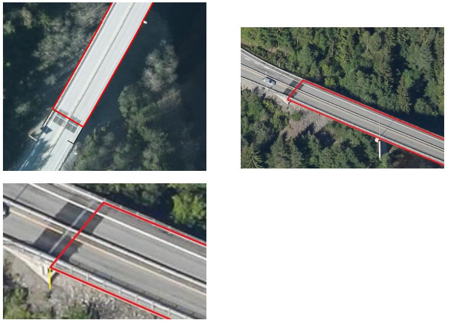
 
 
'''
.Figuren viser hvordan veg og bru forholder seg til hverandre.  
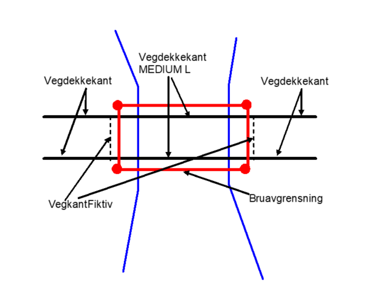
 
 
 
[discrete]
==== Føringer
[cols="h,2"]
|===
|FKB grunnrissreferanse
|Ytterkant brukonstruksjon
 
|FKB høydereferanse
|Topp kant brukonstruksjon. Oftest vil dette være i samme nivå som vegbanen/sporet
 
|FKB-A
|Påkrevd registrering
 
|FKB-B
|Påkrevd registrering
 
|FKB-C
|Påkrevd registrering
 
|FKB-D
|Påkrevd registrering
 
|===
 
 
<<<
 
[discrete]
==== Egenskapstabell for objekttype: Bru
[cols="20,20,20,10", options="header"]
|===
|*Navn:* 
|*Type:* 
|*SOSI_navn:* 
|*Mult.:* 
 
|identifikasjon
|«dataType» Identifikasjon
|..IDENT
|[0..1]
 
|identifikasjon.lokalId
|CharacterString
|...LOKALID
|[1..1]
 
|identifikasjon.navnerom
|CharacterString
|...NAVNEROM
|[1..1]
 
|identifikasjon.versjonId
|CharacterString
|...VERSJONID
|[0..1]
 
|oppdateringsdato
|DateTime
|..OPPDATERINGSDATO
|[0..1]
 
|sluttdato
|DateTime
|..SLUTTDATO
|[0..1]
 
|datafangstdato
|Date
|..DATAFANGSTDATO
|[1..1]
 
|verifiseringsdato
|Date
|..VERIFISERINGSDATO
|[0..1]
 
|registreringsversjon
| «CodeList»  https://register.geonorge.no/sosi-kodelister/fkb/generell/5.0/registreringsversjon[Registreringsversjon, window = _blank]
|..REGISTRERINGSVERSJON
|[0..1]
 
|informasjon
|CharacterString
|..INFORMASJON
|[0..1]
 
|kvalitet
|«dataType» Posisjonskvalitet
|..KVALITET
|[1..1]
 
|kvalitet.datafangstmetode
| «CodeList»  https://register.geonorge.no/sosi-kodelister/fkb/generell/5.0/datafangstmetode[Datafangstmetode, window = _blank]
|...DATAFANGSTMETODE
|[1..1]
 
|kvalitet.nøyaktighet
|Integer
|...NØYAKTIGHET
|[0..1]
 
|kvalitet.synbarhet
| «CodeList»  https://register.geonorge.no/sosi-kodelister/fkb/generell/5.0/synbarhet[Synbarhet, window = _blank]
|...SYNBARHET
|[0..1]
 
|kvalitet.datafangstmetodeHøyde
| «CodeList»  https://register.geonorge.no/sosi-kodelister/fkb/generell/5.0/datafangstmetode[Datafangstmetode, window = _blank]
|...DATAFANGSTMETODEHØYDE
|[0..1]
 
|kvalitet.nøyaktighetHøyde
|Integer
|...H-NØYAKTIGHET
|[0..1]
 
|nvdbpeker
|URI
|..NVDBPEKER
|[0..1]
 
|område
|GM_Surface
|.FLATE
|[1..1]
 
|bruOverBru
|Boolean
|..BRUOVERBRU
|[0..1]
 
|brutrafikktype
| «CodeList»  https://register.geonorge.no/sosi-kodelister/fkb/bygnanlegg/5.0/brutrafikktype[Brutrafikktype, window = _blank]
|..BRUTRAFIKKTYPE
|[0..1]
 
|eksternpeker
|URI
|..EKSTERNPEKER
|[0..1]
 
|friseilingshøyde
|Real
|..FRISEILINGSHØYDE
|[0..1]
 
|tilhørendeDetalj
|«featureType» Brudetalj
|..TILHØRENDEDETALJ
|[0..*]
|===
[discrete]
==== Restriksjoner
[cols="20,80", options="header"]
 
|===
|*Navn:* 
|*Beskrivelse:* 
 
|brutrafikktype
|Egenskapen b&#248;r v&#230;re grei &#229; klassifisere fotogrammetrisk. Dersom tvil benyttes kodeverdien "veg"
 
|===
 
<<<
'''
 
[[brudetalj]]
=== Objekttype: Brudetalj
*Definisjon fra FKB produktspesifikasjon*: markante detaljer på bru som ikke registreres gjennom andre objekttyper
Eksempler:
-          Brutårn for hengebruer.
-          Bæreelement for brukonstruksjon.
 
 
.Illustrasjon fra produktspesifikasjon av Brudetalj
image::http://skjema.geonorge.no/SOSI/produktspesifikasjon/FKB-BygnAnlegg/5.0/figurer/objtype_brudetalj.png[link=http://skjema.geonorge.no/SOSI/produktspesifikasjon/FKB-BygnAnlegg/5.0/figurer/objtype_brudetalj.png, Alt="Illustrasjon fra produktspesifikasjon: Brudetalj"]
 
 
[discrete]
==== Tilleggsinformasjon for fotogrammetrisk registrering
Det er kun &#248;verste detaljer som f.eks. brut&#229;rn og vaiere som registreres.
 
 
[discrete]
==== Føringer
[cols="h,2"]
|===
|FKB grunnrissreferanse
|Ytterkant/senterlinje for brutårn. Senterlinje eller avgrensning av bæreelement.
 
|FKB høydereferanse
|Topp objekt
 
|FKB-A
|Påkrevd registrering
 
|FKB-B
|Påkrevd registrering
 
|FKB-C
|Påkrevd registrering
 
|FKB-D
|Påkrevd registrering
 
|===
 
 
<<<
 
[discrete]
==== Egenskapstabell for objekttype: Brudetalj
[cols="20,20,20,10", options="header"]
|===
|*Navn:* 
|*Type:* 
|*SOSI_navn:* 
|*Mult.:* 
 
|identifikasjon
|«dataType» Identifikasjon
|..IDENT
|[0..1]
 
|identifikasjon.lokalId
|CharacterString
|...LOKALID
|[1..1]
 
|identifikasjon.navnerom
|CharacterString
|...NAVNEROM
|[1..1]
 
|identifikasjon.versjonId
|CharacterString
|...VERSJONID
|[0..1]
 
|oppdateringsdato
|DateTime
|..OPPDATERINGSDATO
|[0..1]
 
|sluttdato
|DateTime
|..SLUTTDATO
|[0..1]
 
|datafangstdato
|Date
|..DATAFANGSTDATO
|[1..1]
 
|verifiseringsdato
|Date
|..VERIFISERINGSDATO
|[0..1]
 
|registreringsversjon
| «CodeList»  https://register.geonorge.no/sosi-kodelister/fkb/generell/5.0/registreringsversjon[Registreringsversjon, window = _blank]
|..REGISTRERINGSVERSJON
|[0..1]
 
|informasjon
|CharacterString
|..INFORMASJON
|[0..1]
 
|kvalitet
|«dataType» Posisjonskvalitet
|..KVALITET
|[1..1]
 
|kvalitet.datafangstmetode
| «CodeList»  https://register.geonorge.no/sosi-kodelister/fkb/generell/5.0/datafangstmetode[Datafangstmetode, window = _blank]
|...DATAFANGSTMETODE
|[1..1]
 
|kvalitet.nøyaktighet
|Integer
|...NØYAKTIGHET
|[0..1]
 
|kvalitet.synbarhet
| «CodeList»  https://register.geonorge.no/sosi-kodelister/fkb/generell/5.0/synbarhet[Synbarhet, window = _blank]
|...SYNBARHET
|[0..1]
 
|kvalitet.datafangstmetodeHøyde
| «CodeList»  https://register.geonorge.no/sosi-kodelister/fkb/generell/5.0/datafangstmetode[Datafangstmetode, window = _blank]
|...DATAFANGSTMETODEHØYDE
|[0..1]
 
|kvalitet.nøyaktighetHøyde
|Integer
|...H-NØYAKTIGHET
|[0..1]
 
|senterlinje
|GM_Curve
|.KURVE
|[1..1]
 
|===
 
<<<
'''
 
[[kulvert]]
=== Objekttype: Kulvert
*Definisjon fra FKB produktspesifikasjon*: gjennoml&#248;p p&#229; tvers av veg-eller jernbane med overliggende fylling og lys&#229;pning mellom 1m og 2,5m
 
 
.Illustrasjon fra produktspesifikasjon av Kulvert
image::http://skjema.geonorge.no/SOSI/produktspesifikasjon/FKB-BygnAnlegg/5.0/figurer/objtype_kulvert.png[link=http://skjema.geonorge.no/SOSI/produktspesifikasjon/FKB-BygnAnlegg/5.0/figurer/objtype_kulvert.png, Alt="Illustrasjon fra produktspesifikasjon: Kulvert"]
 
 
[discrete]
==== Tilleggsinformasjon for fotogrammetrisk registrering
Skal etableres som lukket polygon.

Eksempel p&#229; kulvert er jordbruksundergang for dyr.
Inn mot kulvert vil det ofte v&#230;re forst&#248;tningsmur.

Benyttes kun der gjennoml&#248;pet ikke er en del av veg, 
gang/sykkelveg, traktorveg eller sti. Ved gjennoml&#248;p hvor det er 
bygget bru, skal Bruavgrensning benyttes. 

Der hvor gang/sykkelveg, traktorveg eller sti g&#229;r i kulvert under 
veg/jernbane, skal disse objektene kodes med MEDIUM U og kulvert sl&#248;yfes. 
 
 
'''
.Eksempel på registrering av kulvert
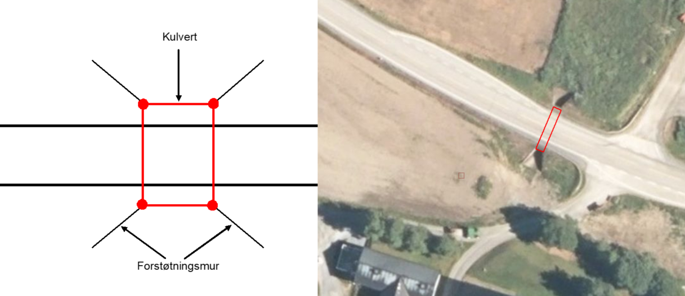
 
 
 
[discrete]
==== Føringer
[cols="h,2"]
|===
|FKB grunnrissreferanse
|Ende/hjørne av gjennomløp
 
|FKB høydereferanse
|Bunn gjennomløp
 
|FKB-A
|Opsjonell registrering
 
|FKB-B
|Opsjonell registrering
 
|FKB-C
|Registreres ikke
 
|FKB-D
|Registreres ikke
 
|===
 
 
<<<
 
[discrete]
==== Egenskapstabell for objekttype: Kulvert
[cols="20,20,20,10", options="header"]
|===
|*Navn:* 
|*Type:* 
|*SOSI_navn:* 
|*Mult.:* 
 
|identifikasjon
|«dataType» Identifikasjon
|..IDENT
|[0..1]
 
|identifikasjon.lokalId
|CharacterString
|...LOKALID
|[1..1]
 
|identifikasjon.navnerom
|CharacterString
|...NAVNEROM
|[1..1]
 
|identifikasjon.versjonId
|CharacterString
|...VERSJONID
|[0..1]
 
|oppdateringsdato
|DateTime
|..OPPDATERINGSDATO
|[0..1]
 
|sluttdato
|DateTime
|..SLUTTDATO
|[0..1]
 
|datafangstdato
|Date
|..DATAFANGSTDATO
|[1..1]
 
|verifiseringsdato
|Date
|..VERIFISERINGSDATO
|[0..1]
 
|registreringsversjon
| «CodeList»  https://register.geonorge.no/sosi-kodelister/fkb/generell/5.0/registreringsversjon[Registreringsversjon, window = _blank]
|..REGISTRERINGSVERSJON
|[0..1]
 
|informasjon
|CharacterString
|..INFORMASJON
|[0..1]
 
|kvalitet
|«dataType» Posisjonskvalitet
|..KVALITET
|[1..1]
 
|kvalitet.datafangstmetode
| «CodeList»  https://register.geonorge.no/sosi-kodelister/fkb/generell/5.0/datafangstmetode[Datafangstmetode, window = _blank]
|...DATAFANGSTMETODE
|[1..1]
 
|kvalitet.nøyaktighet
|Integer
|...NØYAKTIGHET
|[0..1]
 
|kvalitet.synbarhet
| «CodeList»  https://register.geonorge.no/sosi-kodelister/fkb/generell/5.0/synbarhet[Synbarhet, window = _blank]
|...SYNBARHET
|[0..1]
 
|kvalitet.datafangstmetodeHøyde
| «CodeList»  https://register.geonorge.no/sosi-kodelister/fkb/generell/5.0/datafangstmetode[Datafangstmetode, window = _blank]
|...DATAFANGSTMETODEHØYDE
|[0..1]
 
|kvalitet.nøyaktighetHøyde
|Integer
|...H-NØYAKTIGHET
|[0..1]
 
|nvdbpeker
|URI
|..NVDBPEKER
|[0..1]
 
|senterlinje
|GM_Curve
|.KURVE
|[1..1]
 
|===
 
<<<
'''
 
[[stikkrenne]]
=== Objekttype: Stikkrenne
*Definisjon fra FKB produktspesifikasjon*: gjennoml&#248;p p&#229; tvers av veg-eller jernbane med overliggende fylling og lys&#229;pning mindre enn 1m
 
 
.Illustrasjon fra produktspesifikasjon av Stikkrenne
image::http://skjema.geonorge.no/SOSI/produktspesifikasjon/FKB-BygnAnlegg/5.0/figurer/objtype_stikkrenne.png[link=http://skjema.geonorge.no/SOSI/produktspesifikasjon/FKB-BygnAnlegg/5.0/figurer/objtype_stikkrenne.png, Alt="Illustrasjon fra produktspesifikasjon: Stikkrenne"]
 
 
[discrete]
==== Tilleggsinformasjon for fotogrammetrisk registrering
Skal registreres som en linje mellom to punkter; ett i hver ende av 
stikkrenna. 

I de tilfellene stikkrenna kun er synlig p&#229; den ene siden 
av vegen/jernbanen kan stikkrenna registreres bare p&#229; ene siden 
(kort linje). Stikkrenne skal ikke registreres som et punkt.

Ved fotogrammetrisk registrering er kun endene av stikkrenna 
synlige. Forl&#248;pet under vegen/jernbanen er ukjent. H&#248;ydereferansen kan v&#230;re usikker
 
 
'''
.Eksempel på registrering av stikkrenne
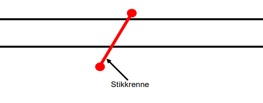
 
 
 
[discrete]
==== Føringer
[cols="h,2"]
|===
|FKB grunnrissreferanse
|Midt ende av innløp og utløp
 
|FKB høydereferanse
|Bunn stikkrenne
 
|FKB-A
|Opsjonell registrering
 
|FKB-B
|Opsjonell registrering
 
|FKB-C
|Registreres ikke
 
|FKB-D
|Registreres ikke
 
|===
 
 
<<<
 
[discrete]
==== Egenskapstabell for objekttype: Stikkrenne
[cols="20,20,20,10", options="header"]
|===
|*Navn:* 
|*Type:* 
|*SOSI_navn:* 
|*Mult.:* 
 
|identifikasjon
|«dataType» Identifikasjon
|..IDENT
|[0..1]
 
|identifikasjon.lokalId
|CharacterString
|...LOKALID
|[1..1]
 
|identifikasjon.navnerom
|CharacterString
|...NAVNEROM
|[1..1]
 
|identifikasjon.versjonId
|CharacterString
|...VERSJONID
|[0..1]
 
|oppdateringsdato
|DateTime
|..OPPDATERINGSDATO
|[0..1]
 
|sluttdato
|DateTime
|..SLUTTDATO
|[0..1]
 
|datafangstdato
|Date
|..DATAFANGSTDATO
|[1..1]
 
|verifiseringsdato
|Date
|..VERIFISERINGSDATO
|[0..1]
 
|registreringsversjon
| «CodeList»  https://register.geonorge.no/sosi-kodelister/fkb/generell/5.0/registreringsversjon[Registreringsversjon, window = _blank]
|..REGISTRERINGSVERSJON
|[0..1]
 
|informasjon
|CharacterString
|..INFORMASJON
|[0..1]
 
|kvalitet
|«dataType» Posisjonskvalitet
|..KVALITET
|[1..1]
 
|kvalitet.datafangstmetode
| «CodeList»  https://register.geonorge.no/sosi-kodelister/fkb/generell/5.0/datafangstmetode[Datafangstmetode, window = _blank]
|...DATAFANGSTMETODE
|[1..1]
 
|kvalitet.nøyaktighet
|Integer
|...NØYAKTIGHET
|[0..1]
 
|kvalitet.synbarhet
| «CodeList»  https://register.geonorge.no/sosi-kodelister/fkb/generell/5.0/synbarhet[Synbarhet, window = _blank]
|...SYNBARHET
|[0..1]
 
|kvalitet.datafangstmetodeHøyde
| «CodeList»  https://register.geonorge.no/sosi-kodelister/fkb/generell/5.0/datafangstmetode[Datafangstmetode, window = _blank]
|...DATAFANGSTMETODEHØYDE
|[0..1]
 
|kvalitet.nøyaktighetHøyde
|Integer
|...H-NØYAKTIGHET
|[0..1]
 
|nvdbpeker
|URI
|..NVDBPEKER
|[0..1]
 
|senterlinje
|GM_Curve
|.KURVE
|[1..1]
 
|===
 
<<<
'''
 
[[tunnelportal]]
=== Objekttype: Tunnelportal
*Definisjon fra FKB produktspesifikasjon*: spesielt byggverk som sammenbinder tunnel og åpen veg
 
 
.Illustrasjon fra produktspesifikasjon av Tunnelportal
image::http://skjema.geonorge.no/SOSI/produktspesifikasjon/FKB-BygnAnlegg/5.0/figurer/objtype_tunnelportal.png[link=http://skjema.geonorge.no/SOSI/produktspesifikasjon/FKB-BygnAnlegg/5.0/figurer/objtype_tunnelportal.png, Alt="Illustrasjon fra produktspesifikasjon: Tunnelportal"]
 
 
 
'''
.Eksempl på registrering av tunnelportal
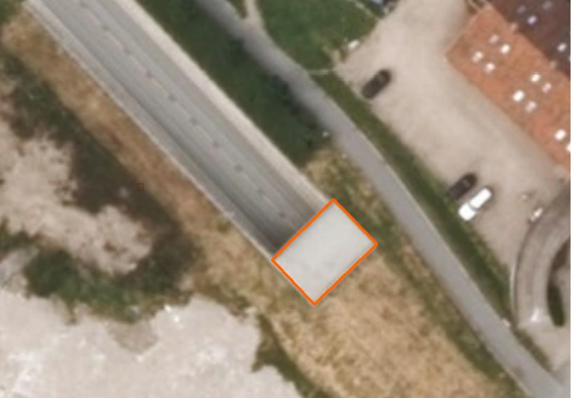
 
 
 
[discrete]
==== Føringer
[cols="h,2"]
|===
|FKB grunnrissreferanse
|Ytterkant tunnelportal
 
|FKB høydereferanse
|Topp kant tunnelportal
 
|FKB-A
|Påkrevd registrering
 
|FKB-B
|Påkrevd registrering
 
|FKB-C
|Registreres ikke
 
|FKB-D
|Registreres ikke
 
|===
 
 
<<<
 
[discrete]
==== Egenskapstabell for objekttype: Tunnelportal
[cols="20,20,20,10", options="header"]
|===
|*Navn:* 
|*Type:* 
|*SOSI_navn:* 
|*Mult.:* 
 
|identifikasjon
|«dataType» Identifikasjon
|..IDENT
|[0..1]
 
|identifikasjon.lokalId
|CharacterString
|...LOKALID
|[1..1]
 
|identifikasjon.navnerom
|CharacterString
|...NAVNEROM
|[1..1]
 
|identifikasjon.versjonId
|CharacterString
|...VERSJONID
|[0..1]
 
|oppdateringsdato
|DateTime
|..OPPDATERINGSDATO
|[0..1]
 
|sluttdato
|DateTime
|..SLUTTDATO
|[0..1]
 
|datafangstdato
|Date
|..DATAFANGSTDATO
|[1..1]
 
|verifiseringsdato
|Date
|..VERIFISERINGSDATO
|[0..1]
 
|registreringsversjon
| «CodeList»  https://register.geonorge.no/sosi-kodelister/fkb/generell/5.0/registreringsversjon[Registreringsversjon, window = _blank]
|..REGISTRERINGSVERSJON
|[0..1]
 
|informasjon
|CharacterString
|..INFORMASJON
|[0..1]
 
|kvalitet
|«dataType» Posisjonskvalitet
|..KVALITET
|[1..1]
 
|kvalitet.datafangstmetode
| «CodeList»  https://register.geonorge.no/sosi-kodelister/fkb/generell/5.0/datafangstmetode[Datafangstmetode, window = _blank]
|...DATAFANGSTMETODE
|[1..1]
 
|kvalitet.nøyaktighet
|Integer
|...NØYAKTIGHET
|[0..1]
 
|kvalitet.synbarhet
| «CodeList»  https://register.geonorge.no/sosi-kodelister/fkb/generell/5.0/synbarhet[Synbarhet, window = _blank]
|...SYNBARHET
|[0..1]
 
|kvalitet.datafangstmetodeHøyde
| «CodeList»  https://register.geonorge.no/sosi-kodelister/fkb/generell/5.0/datafangstmetode[Datafangstmetode, window = _blank]
|...DATAFANGSTMETODEHØYDE
|[0..1]
 
|kvalitet.nøyaktighetHøyde
|Integer
|...H-NØYAKTIGHET
|[0..1]
 
|nvdbpeker
|URI
|..NVDBPEKER
|[0..1]
 
|senterlinje
|GM_Curve
|.KURVE
|[1..1]
 
|===
 
<<<
'''
 
[[avfallsbeholder]]
=== Objekttype: Avfallsbeholder
*Definisjon fra FKB produktspesifikasjon*: St&#248;rre tank eller annen type beholder for avfall
 
 
.Illustrasjon fra produktspesifikasjon av Avfallsbeholder
image::http://skjema.geonorge.no/SOSI/produktspesifikasjon/FKB-BygnAnlegg/5.0/figurer/objtype_avfallsbeholder.png[link=http://skjema.geonorge.no/SOSI/produktspesifikasjon/FKB-BygnAnlegg/5.0/figurer/objtype_avfallsbeholder.png, Alt="Illustrasjon fra produktspesifikasjon: Avfallsbeholder"]
 
 
[discrete]
==== Tilleggsinformasjon for fotogrammetrisk registrering
Registreres som punktobjekter ved fotogrammetrisk registrering dersom ikke annet er avtalt.
 
 
[discrete]
==== Føringer
[cols="h,2"]
|===
|FKB grunnrissreferanse
|Senter beholder
 
|FKB høydereferanse
|Topp beholder
 
|FKB-A
|Opsjonell registrering
 
|FKB-B
|Opsjonell registrering
 
|FKB-C
|Registreres ikke
 
|FKB-D
|Registreres ikke
 
|===
 
 
<<<
 
[discrete]
==== Egenskapstabell for objekttype: Avfallsbeholder
[cols="20,20,20,10", options="header"]
|===
|*Navn:* 
|*Type:* 
|*SOSI_navn:* 
|*Mult.:* 
 
|identifikasjon
|«dataType» Identifikasjon
|..IDENT
|[0..1]
 
|identifikasjon.lokalId
|CharacterString
|...LOKALID
|[1..1]
 
|identifikasjon.navnerom
|CharacterString
|...NAVNEROM
|[1..1]
 
|identifikasjon.versjonId
|CharacterString
|...VERSJONID
|[0..1]
 
|oppdateringsdato
|DateTime
|..OPPDATERINGSDATO
|[0..1]
 
|sluttdato
|DateTime
|..SLUTTDATO
|[0..1]
 
|datafangstdato
|Date
|..DATAFANGSTDATO
|[1..1]
 
|verifiseringsdato
|Date
|..VERIFISERINGSDATO
|[0..1]
 
|registreringsversjon
| «CodeList»  https://register.geonorge.no/sosi-kodelister/fkb/generell/5.0/registreringsversjon[Registreringsversjon, window = _blank]
|..REGISTRERINGSVERSJON
|[0..1]
 
|informasjon
|CharacterString
|..INFORMASJON
|[0..1]
 
|kvalitet
|«dataType» Posisjonskvalitet
|..KVALITET
|[1..1]
 
|kvalitet.datafangstmetode
| «CodeList»  https://register.geonorge.no/sosi-kodelister/fkb/generell/5.0/datafangstmetode[Datafangstmetode, window = _blank]
|...DATAFANGSTMETODE
|[1..1]
 
|kvalitet.nøyaktighet
|Integer
|...NØYAKTIGHET
|[0..1]
 
|kvalitet.synbarhet
| «CodeList»  https://register.geonorge.no/sosi-kodelister/fkb/generell/5.0/synbarhet[Synbarhet, window = _blank]
|...SYNBARHET
|[0..1]
 
|kvalitet.datafangstmetodeHøyde
| «CodeList»  https://register.geonorge.no/sosi-kodelister/fkb/generell/5.0/datafangstmetode[Datafangstmetode, window = _blank]
|...DATAFANGSTMETODEHØYDE
|[0..1]
 
|kvalitet.nøyaktighetHøyde
|Integer
|...H-NØYAKTIGHET
|[0..1]
 
|posisjon
|GM_Point
|.PUNKT
|[0..1]
 
|område
|GM_Surface
|.FLATE
|[0..1]
 
|medium
| «CodeList»  https://register.geonorge.no/sosi-kodelister/fkb/generell/5.0/medium[Medium, window = _blank]
|..MEDIUM
|[1..1]
 
|høydereferanse
| «CodeList»  https://register.geonorge.no/sosi-kodelister/fkb/generell/5.0/hoydereferanse[Høydereferanse, window = _blank]
|..HREF
|[1..1]
 
|eksternpeker
|URI
|..EKSTERNPEKER
|[0..1]
 
|===
 
<<<
'''
 
[[brønn]]
=== Objekttype: Brønn
*Definisjon fra FKB produktspesifikasjon*: lite bygningsmessig anlegg for uttak av ferskvann
 
 
.Illustrasjon fra produktspesifikasjon av Brønn
image::http://skjema.geonorge.no/SOSI/produktspesifikasjon/FKB-BygnAnlegg/5.0/figurer/objtype_bronn.png[link=http://skjema.geonorge.no/SOSI/produktspesifikasjon/FKB-BygnAnlegg/5.0/figurer/objtype_bronn.png, Alt="Illustrasjon fra produktspesifikasjon: Brønn"]
 
 
[discrete]
==== Tilleggsinformasjon for fotogrammetrisk registrering
Registreres som punkt ved fotogrammetrisk registrering dersom ikke annet er avtalt.
 
 
[discrete]
==== Føringer
[cols="h,2"]
|===
|FKB grunnrissreferanse
|Senter
 
|FKB høydereferanse
|Terrengnivå (HREF FOT) eller ev. topp kant av mur rundt brønn (HREF TOP)
 
|FKB-A
|Opsjonell registrering
 
|FKB-B
|Opsjonell registrering
 
|FKB-C
|Registreres ikke
 
|FKB-D
|Registreres ikke
 
|===
 
 
<<<
 
[discrete]
==== Egenskapstabell for objekttype: Brønn
[cols="20,20,20,10", options="header"]
|===
|*Navn:* 
|*Type:* 
|*SOSI_navn:* 
|*Mult.:* 
 
|identifikasjon
|«dataType» Identifikasjon
|..IDENT
|[0..1]
 
|identifikasjon.lokalId
|CharacterString
|...LOKALID
|[1..1]
 
|identifikasjon.navnerom
|CharacterString
|...NAVNEROM
|[1..1]
 
|identifikasjon.versjonId
|CharacterString
|...VERSJONID
|[0..1]
 
|oppdateringsdato
|DateTime
|..OPPDATERINGSDATO
|[0..1]
 
|sluttdato
|DateTime
|..SLUTTDATO
|[0..1]
 
|datafangstdato
|Date
|..DATAFANGSTDATO
|[1..1]
 
|verifiseringsdato
|Date
|..VERIFISERINGSDATO
|[0..1]
 
|registreringsversjon
| «CodeList»  https://register.geonorge.no/sosi-kodelister/fkb/generell/5.0/registreringsversjon[Registreringsversjon, window = _blank]
|..REGISTRERINGSVERSJON
|[0..1]
 
|informasjon
|CharacterString
|..INFORMASJON
|[0..1]
 
|kvalitet
|«dataType» Posisjonskvalitet
|..KVALITET
|[1..1]
 
|kvalitet.datafangstmetode
| «CodeList»  https://register.geonorge.no/sosi-kodelister/fkb/generell/5.0/datafangstmetode[Datafangstmetode, window = _blank]
|...DATAFANGSTMETODE
|[1..1]
 
|kvalitet.nøyaktighet
|Integer
|...NØYAKTIGHET
|[0..1]
 
|kvalitet.synbarhet
| «CodeList»  https://register.geonorge.no/sosi-kodelister/fkb/generell/5.0/synbarhet[Synbarhet, window = _blank]
|...SYNBARHET
|[0..1]
 
|kvalitet.datafangstmetodeHøyde
| «CodeList»  https://register.geonorge.no/sosi-kodelister/fkb/generell/5.0/datafangstmetode[Datafangstmetode, window = _blank]
|...DATAFANGSTMETODEHØYDE
|[0..1]
 
|kvalitet.nøyaktighetHøyde
|Integer
|...H-NØYAKTIGHET
|[0..1]
 
|område
|GM_Surface
|.FLATE
|[0..1]
 
|posisjon
|GM_Point
|.PUNKT
|[0..1]
 
|høydereferanse
| «CodeList»  https://register.geonorge.no/sosi-kodelister/fkb/generell/5.0/hoydereferanse[Høydereferanse, window = _blank]
|..HREF
|[1..1]
 
|===
 
<<<
'''
 
[[flaggstang]]
=== Objekttype: Flaggstang
*Definisjon fra FKB produktspesifikasjon*: lang rett stang for heising av flagg
 
 
.Illustrasjon fra produktspesifikasjon av Flaggstang
image::http://skjema.geonorge.no/SOSI/produktspesifikasjon/FKB-BygnAnlegg/5.0/figurer/objtype_flaggstang.png[link=http://skjema.geonorge.no/SOSI/produktspesifikasjon/FKB-BygnAnlegg/5.0/figurer/objtype_flaggstang.png, Alt="Illustrasjon fra produktspesifikasjon: Flaggstang"]
 
 
 
[discrete]
==== Føringer
[cols="h,2"]
|===
|FKB grunnrissreferanse
|Senter
 
|FKB høydereferanse
|Topp flaggstang
 
|FKB-A minstestørrelse
|Alle synlige flaggstenger
 
|FKB-B minstestørrelse
|Alle synlige flaggstenger
 
|FKB-C minstestørrelse
|Flaggstenger høyere enn 15m
 
|FKB-D minstestørrelse
|Flaggstenger høyere enn 15m
 
|FKB-A
|Påkrevd registrering
 
|FKB-B
|Påkrevd registrering
 
|FKB-C
|Påkrevd registrering
 
|FKB-D
|Påkrevd registrering
 
|===
 
 
<<<
 
[discrete]
==== Egenskapstabell for objekttype: Flaggstang
[cols="20,20,20,10", options="header"]
|===
|*Navn:* 
|*Type:* 
|*SOSI_navn:* 
|*Mult.:* 
 
|identifikasjon
|«dataType» Identifikasjon
|..IDENT
|[0..1]
 
|identifikasjon.lokalId
|CharacterString
|...LOKALID
|[1..1]
 
|identifikasjon.navnerom
|CharacterString
|...NAVNEROM
|[1..1]
 
|identifikasjon.versjonId
|CharacterString
|...VERSJONID
|[0..1]
 
|oppdateringsdato
|DateTime
|..OPPDATERINGSDATO
|[0..1]
 
|sluttdato
|DateTime
|..SLUTTDATO
|[0..1]
 
|datafangstdato
|Date
|..DATAFANGSTDATO
|[1..1]
 
|verifiseringsdato
|Date
|..VERIFISERINGSDATO
|[0..1]
 
|registreringsversjon
| «CodeList»  https://register.geonorge.no/sosi-kodelister/fkb/generell/5.0/registreringsversjon[Registreringsversjon, window = _blank]
|..REGISTRERINGSVERSJON
|[0..1]
 
|informasjon
|CharacterString
|..INFORMASJON
|[0..1]
 
|kvalitet
|«dataType» Posisjonskvalitet
|..KVALITET
|[1..1]
 
|kvalitet.datafangstmetode
| «CodeList»  https://register.geonorge.no/sosi-kodelister/fkb/generell/5.0/datafangstmetode[Datafangstmetode, window = _blank]
|...DATAFANGSTMETODE
|[1..1]
 
|kvalitet.nøyaktighet
|Integer
|...NØYAKTIGHET
|[0..1]
 
|kvalitet.synbarhet
| «CodeList»  https://register.geonorge.no/sosi-kodelister/fkb/generell/5.0/synbarhet[Synbarhet, window = _blank]
|...SYNBARHET
|[0..1]
 
|kvalitet.datafangstmetodeHøyde
| «CodeList»  https://register.geonorge.no/sosi-kodelister/fkb/generell/5.0/datafangstmetode[Datafangstmetode, window = _blank]
|...DATAFANGSTMETODEHØYDE
|[0..1]
 
|kvalitet.nøyaktighetHøyde
|Integer
|...H-NØYAKTIGHET
|[0..1]
 
|nrlpeker
|URI
|..NRLPEKER
|[0..1]
 
|posisjon
|GM_Point
|.PUNKT
|[1..1]
 
|høydereferanse
| «CodeList»  https://register.geonorge.no/sosi-kodelister/fkb/generell/5.0/hoydereferanse[Høydereferanse, window = _blank]
|..HREF
|[1..1]
 
|medium
| «CodeList»  https://register.geonorge.no/sosi-kodelister/fkb/generell/5.0/medium[Medium, window = _blank]
|..MEDIUM
|[1..1]
 
|===
 
<<<
'''
 
[[fundament]]
=== Objekttype: Fundament
*Definisjon fra FKB produktspesifikasjon*: st&#248;pt underlag for frittst&#229;ende konstruksjoner 
Merknad: Selve konstruksjonen opp&#229; fundamentet og dens funksjon vil v&#230;re kartlagt som egne objekter. For eksempel stolper, master, r&#248;rgater, brupilarer, vindturbiner, helikopterlandingsplasser mv.
 
 
.Illustrasjon fra produktspesifikasjon av Fundament
image::http://skjema.geonorge.no/SOSI/produktspesifikasjon/FKB-BygnAnlegg/5.0/figurer/objtype_fundament.png[link=http://skjema.geonorge.no/SOSI/produktspesifikasjon/FKB-BygnAnlegg/5.0/figurer/objtype_fundament.png, Alt="Illustrasjon fra produktspesifikasjon: Fundament"]
 
 
[discrete]
==== Tilleggsinformasjon for fotogrammetrisk registrering
Omfatter det st&#248;pte underlaget for frittst&#229;ende konstruksjoner. For eksempel fundamenter for Bru.

Dersom deler av kanten har d&#229;rlig innsyn angis dette ved kvalitetskoding p&#229; objektet.
 
 
'''
.Eksempel på registrering av Fundament ved rørgater.
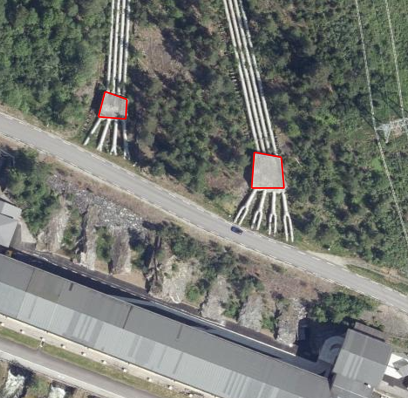
 
 
 
[discrete]
==== Føringer
[cols="h,2"]
|===
|FKB grunnrissreferanse
|Ytterkant fundament
 
|FKB høydereferanse
|Topp fundament. Ved registrering av topp fundament skal alle knekklinjer og høydesprang over 0,5m registreres
 
|FKB-A minstestørrelse
|Fundamenter med areal større enn 6m2
 
|FKB-B minstestørrelse
|Fundamenter med areal større enn 6m2
 
|FKB-C minstestørrelse
|Fundamenter med areal større enn 20m2
 
|FKB-D minstestørrelse
|Fundamenter med areal større enn 20m2
 
|FKB-A
|Påkrevd registrering
 
|FKB-B
|Påkrevd registrering
 
|FKB-C
|Påkrevd registrering
 
|FKB-D
|Påkrevd registrering
 
|===
 
 
<<<
 
[discrete]
==== Egenskapstabell for objekttype: Fundament
[cols="20,20,20,10", options="header"]
|===
|*Navn:* 
|*Type:* 
|*SOSI_navn:* 
|*Mult.:* 
 
|identifikasjon
|«dataType» Identifikasjon
|..IDENT
|[0..1]
 
|identifikasjon.lokalId
|CharacterString
|...LOKALID
|[1..1]
 
|identifikasjon.navnerom
|CharacterString
|...NAVNEROM
|[1..1]
 
|identifikasjon.versjonId
|CharacterString
|...VERSJONID
|[0..1]
 
|oppdateringsdato
|DateTime
|..OPPDATERINGSDATO
|[0..1]
 
|sluttdato
|DateTime
|..SLUTTDATO
|[0..1]
 
|datafangstdato
|Date
|..DATAFANGSTDATO
|[1..1]
 
|verifiseringsdato
|Date
|..VERIFISERINGSDATO
|[0..1]
 
|registreringsversjon
| «CodeList»  https://register.geonorge.no/sosi-kodelister/fkb/generell/5.0/registreringsversjon[Registreringsversjon, window = _blank]
|..REGISTRERINGSVERSJON
|[0..1]
 
|informasjon
|CharacterString
|..INFORMASJON
|[0..1]
 
|kvalitet
|«dataType» Posisjonskvalitet
|..KVALITET
|[1..1]
 
|kvalitet.datafangstmetode
| «CodeList»  https://register.geonorge.no/sosi-kodelister/fkb/generell/5.0/datafangstmetode[Datafangstmetode, window = _blank]
|...DATAFANGSTMETODE
|[1..1]
 
|kvalitet.nøyaktighet
|Integer
|...NØYAKTIGHET
|[0..1]
 
|kvalitet.synbarhet
| «CodeList»  https://register.geonorge.no/sosi-kodelister/fkb/generell/5.0/synbarhet[Synbarhet, window = _blank]
|...SYNBARHET
|[0..1]
 
|kvalitet.datafangstmetodeHøyde
| «CodeList»  https://register.geonorge.no/sosi-kodelister/fkb/generell/5.0/datafangstmetode[Datafangstmetode, window = _blank]
|...DATAFANGSTMETODEHØYDE
|[0..1]
 
|kvalitet.nøyaktighetHøyde
|Integer
|...H-NØYAKTIGHET
|[0..1]
 
|område
|GM_Surface
|.FLATE
|[1..1]
 
|medium
| «CodeList»  https://register.geonorge.no/sosi-kodelister/fkb/generell/5.0/medium[Medium, window = _blank]
|..MEDIUM
|[1..1]
 
|===
 
<<<
'''
 
[[pipe]]
=== Objekttype: Pipe
*Definisjon fra FKB produktspesifikasjon*: frittst&#229;ende r&#248;rformete innretninger for transport av avgasser

Merknad: Piper kan forskjellig tverrsnitt (m&#229; ikke v&#230;re sirkul&#230;re)
 
 
.Illustrasjon fra produktspesifikasjon av Pipe
image::http://skjema.geonorge.no/SOSI/produktspesifikasjon/FKB-BygnAnlegg/5.0/figurer/objtype_pipe.png[link=http://skjema.geonorge.no/SOSI/produktspesifikasjon/FKB-BygnAnlegg/5.0/figurer/objtype_pipe.png, Alt="Illustrasjon fra produktspesifikasjon: Pipe"]
 
 
[discrete]
==== Tilleggsinformasjon for fotogrammetrisk registrering
Omfatter frittst&#229;ende r&#248;rformede innretninger for transport av 
avgasser. 

Piper registreres fortrinnsvis med flategeometri. Piper der areal i toppen av pipa er under 1m2 kan registreres som punkter.

Dersom pipa er rund, skal det registreres eller genereres 
tilstrekkelig tett med punkter slik at pipa synes jevnt rund n&#229;r den 
plottes. 

For piper med skr&#229; vegger, registreres "Kant ved bakken" som BeskrivendeHjelpelinjeAnlegg.
 
 
[discrete]
==== Føringer
[cols="h,2"]
|===
|FKB grunnrissreferanse
|Topp ytterkant pipe (senter pipe ved punktgeometri)
 
|FKB høydereferanse
|Topp ytterkant pipe
 
|FKB-A minstestørrelse
|Piper høyere enn 5m
 
|FKB-B minstestørrelse
|Piper høyere enn 5m
 
|FKB-C minstestørrelse
|Piper høyere enn 10m
 
|FKB-D minstestørrelse
|Piper høyere enn 10m
 
|FKB-A
|Påkrevd registrering
 
|FKB-B
|Påkrevd registrering
 
|FKB-C
|Påkrevd registrering
 
|FKB-D
|Påkrevd registrering
 
|===
 
 
<<<
 
[discrete]
==== Egenskapstabell for objekttype: Pipe
[cols="20,20,20,10", options="header"]
|===
|*Navn:* 
|*Type:* 
|*SOSI_navn:* 
|*Mult.:* 
 
|identifikasjon
|«dataType» Identifikasjon
|..IDENT
|[0..1]
 
|identifikasjon.lokalId
|CharacterString
|...LOKALID
|[1..1]
 
|identifikasjon.navnerom
|CharacterString
|...NAVNEROM
|[1..1]
 
|identifikasjon.versjonId
|CharacterString
|...VERSJONID
|[0..1]
 
|oppdateringsdato
|DateTime
|..OPPDATERINGSDATO
|[0..1]
 
|sluttdato
|DateTime
|..SLUTTDATO
|[0..1]
 
|datafangstdato
|Date
|..DATAFANGSTDATO
|[1..1]
 
|verifiseringsdato
|Date
|..VERIFISERINGSDATO
|[0..1]
 
|registreringsversjon
| «CodeList»  https://register.geonorge.no/sosi-kodelister/fkb/generell/5.0/registreringsversjon[Registreringsversjon, window = _blank]
|..REGISTRERINGSVERSJON
|[0..1]
 
|informasjon
|CharacterString
|..INFORMASJON
|[0..1]
 
|kvalitet
|«dataType» Posisjonskvalitet
|..KVALITET
|[1..1]
 
|kvalitet.datafangstmetode
| «CodeList»  https://register.geonorge.no/sosi-kodelister/fkb/generell/5.0/datafangstmetode[Datafangstmetode, window = _blank]
|...DATAFANGSTMETODE
|[1..1]
 
|kvalitet.nøyaktighet
|Integer
|...NØYAKTIGHET
|[0..1]
 
|kvalitet.synbarhet
| «CodeList»  https://register.geonorge.no/sosi-kodelister/fkb/generell/5.0/synbarhet[Synbarhet, window = _blank]
|...SYNBARHET
|[0..1]
 
|kvalitet.datafangstmetodeHøyde
| «CodeList»  https://register.geonorge.no/sosi-kodelister/fkb/generell/5.0/datafangstmetode[Datafangstmetode, window = _blank]
|...DATAFANGSTMETODEHØYDE
|[0..1]
 
|kvalitet.nøyaktighetHøyde
|Integer
|...H-NØYAKTIGHET
|[0..1]
 
|nrlpeker
|URI
|..NRLPEKER
|[0..1]
 
|posisjon
|GM_Point
|.PUNKT
|[0..1]
 
|område
|GM_Surface
|.FLATE
|[0..1]
 
|høydereferanse
| «CodeList»  https://register.geonorge.no/sosi-kodelister/fkb/generell/5.0/hoydereferanse[Høydereferanse, window = _blank]
|..HREF
|[1..1]
 
|===
 
<<<
'''
 
[[tank]]
=== Objekttype: Tank
*Definisjon fra FKB produktspesifikasjon*: lukkede kar for oppbevaring av gass eller væsker som ikke er registrert som bygning
 
 
.Illustrasjon fra produktspesifikasjon av Tank
image::http://skjema.geonorge.no/SOSI/produktspesifikasjon/FKB-BygnAnlegg/5.0/figurer/objtype_tank.png[link=http://skjema.geonorge.no/SOSI/produktspesifikasjon/FKB-BygnAnlegg/5.0/figurer/objtype_tank.png, Alt="Illustrasjon fra produktspesifikasjon: Tank"]
 
 
[discrete]
==== Tilleggsinformasjon for fotogrammetrisk registrering
Tank registreres med flategeometri ved fotogrammetrisk registrering.

Brukes for &#229; beskrive omriss av lukkede kar for oppbevaring av gass eller v&#230;ske n&#229;r tanken ikke er registrert som "Bygning". Inkluderer ogs&#229; vannt&#229;rn og lagringsrom for f&#244;r og korn (tidligere objekttype Silo).

Dersom tanken er rund, skal det registreres eller genereres tilstrekkelig tett med punkter slik at tanken synes jevnt rund n&#229;r 
den plottes. Tanken skal alltid lukkes. Det er lov &#229; generere ett eller 
flere punkter for &#229; lukke tanken.

N&#229;r det er flere tanker tett inntil hverandre skal de registreres som et
sammenhengende polygon, dersom det samlede arealet overstiger 
minstem&#229;l.
 
 
'''
.Registrering av liggende tanker med skrå vegger.
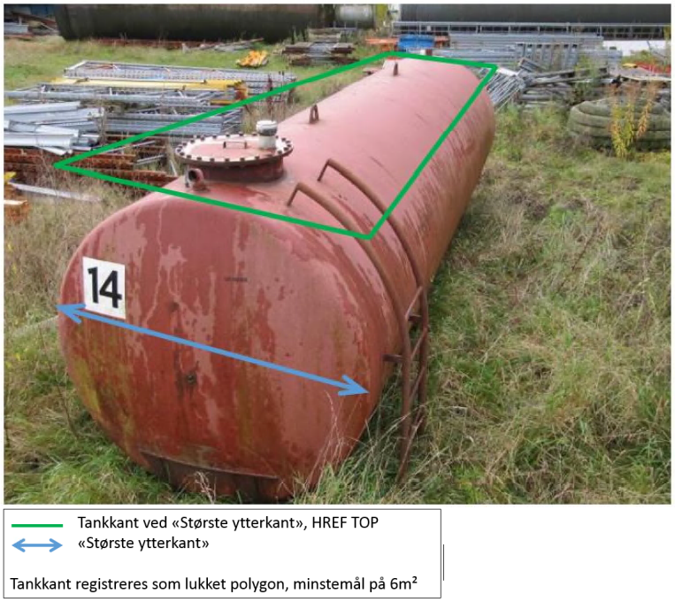
 
 
'''
.Når det er flere tanker ved siden av hverandre skal de registreres som et sammenhengende polygon, dersom det samlede arealet overstiger minstemål. Underste bilde viser tre tanker (hver enkelte Tank under minstemål) som skal registreres sammenhengende ettersom det samlede arealet overstiger minstemål.
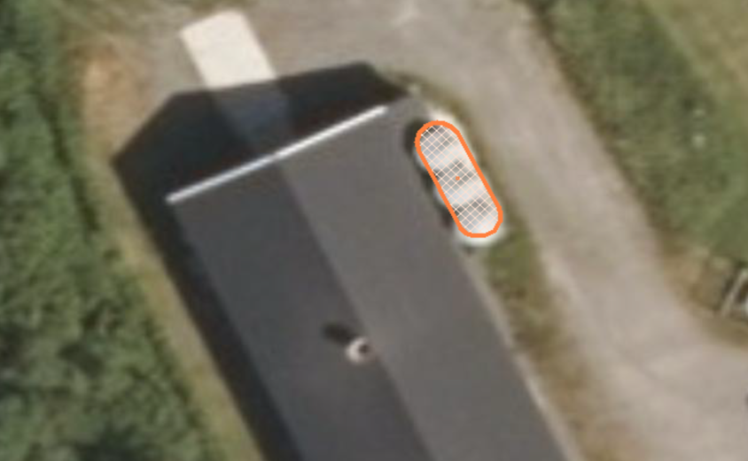
 
 
 
[discrete]
==== Føringer
[cols="h,2"]
|===
|FKB grunnrissreferanse
|Ytterkant av tank (største omkrets)
 
|FKB høydereferanse
|Tankens største høyde (HREF TOP)
 
|FKB-A minstestørrelse
|Areal større enn 6m2
 
|FKB-A
|Påkrevd registrering
 
|FKB-B
|Påkrevd registrering
 
|FKB-C
|Påkrevd registrering
 
|FKB-D
|Påkrevd registrering
 
|===
 
 
<<<
 
[discrete]
==== Egenskapstabell for objekttype: Tank
[cols="20,20,20,10", options="header"]
|===
|*Navn:* 
|*Type:* 
|*SOSI_navn:* 
|*Mult.:* 
 
|identifikasjon
|«dataType» Identifikasjon
|..IDENT
|[0..1]
 
|identifikasjon.lokalId
|CharacterString
|...LOKALID
|[1..1]
 
|identifikasjon.navnerom
|CharacterString
|...NAVNEROM
|[1..1]
 
|identifikasjon.versjonId
|CharacterString
|...VERSJONID
|[0..1]
 
|oppdateringsdato
|DateTime
|..OPPDATERINGSDATO
|[0..1]
 
|sluttdato
|DateTime
|..SLUTTDATO
|[0..1]
 
|datafangstdato
|Date
|..DATAFANGSTDATO
|[1..1]
 
|verifiseringsdato
|Date
|..VERIFISERINGSDATO
|[0..1]
 
|registreringsversjon
| «CodeList»  https://register.geonorge.no/sosi-kodelister/fkb/generell/5.0/registreringsversjon[Registreringsversjon, window = _blank]
|..REGISTRERINGSVERSJON
|[0..1]
 
|informasjon
|CharacterString
|..INFORMASJON
|[0..1]
 
|kvalitet
|«dataType» Posisjonskvalitet
|..KVALITET
|[1..1]
 
|kvalitet.datafangstmetode
| «CodeList»  https://register.geonorge.no/sosi-kodelister/fkb/generell/5.0/datafangstmetode[Datafangstmetode, window = _blank]
|...DATAFANGSTMETODE
|[1..1]
 
|kvalitet.nøyaktighet
|Integer
|...NØYAKTIGHET
|[0..1]
 
|kvalitet.synbarhet
| «CodeList»  https://register.geonorge.no/sosi-kodelister/fkb/generell/5.0/synbarhet[Synbarhet, window = _blank]
|...SYNBARHET
|[0..1]
 
|kvalitet.datafangstmetodeHøyde
| «CodeList»  https://register.geonorge.no/sosi-kodelister/fkb/generell/5.0/datafangstmetode[Datafangstmetode, window = _blank]
|...DATAFANGSTMETODEHØYDE
|[0..1]
 
|kvalitet.nøyaktighetHøyde
|Integer
|...H-NØYAKTIGHET
|[0..1]
 
|nrlpeker
|URI
|..NRLPEKER
|[0..1]
 
|posisjon
|GM_Point
|.PUNKT
|[0..1]
 
|område
|GM_Surface
|.FLATE
|[0..1]
 
|medium
| «CodeList»  https://register.geonorge.no/sosi-kodelister/fkb/generell/5.0/medium[Medium, window = _blank]
|..MEDIUM
|[1..1]
 
|===
 
<<<
'''
 
[[tårn]]
=== Objekttype: Tårn
*Definisjon fra FKB produktspesifikasjon*: h&#248;y bygningsmessig konstruksjon hvor h&#248;yden er stor i forhold til bygningens areal i grunnplanet
Merknad: Omfatter alle t&#229;rn med unntak av de som er registrert i matrikkelen og de som har en mer spesifisert beskrivelse, som f.eks. tank. 
Eksempel: M&#229;let&#229;rn og stupet&#229;rn
 
 
.Illustrasjon fra produktspesifikasjon av Tårn
image::http://skjema.geonorge.no/SOSI/produktspesifikasjon/FKB-BygnAnlegg/5.0/figurer/objtype_tarn.png[link=http://skjema.geonorge.no/SOSI/produktspesifikasjon/FKB-BygnAnlegg/5.0/figurer/objtype_tarn.png, Alt="Illustrasjon fra produktspesifikasjon: Tårn"]
 
 
[discrete]
==== Tilleggsinformasjon for fotogrammetrisk registrering
Omfatter alle t&#229;rn med unntak av de t&#229;rn som har en mer spesifisert beskrivelse, som f.eks. Tank. Eksempel p&#229; t&#229;rn er m&#229;let&#229;rn, stupet&#229;rn og t&#229;rn for telekommunikasjon. Vannt&#229;rn kodes som Tank.

For t&#229;rn med loddrette vegger, registreres "Ytterkant av t&#229;rn/Topp ytterkant t&#229;rn". For t&#229;rn med skr&#229; vegger, registreres i tillegg registreres "Kant ved bakken" som BeskrivendeHjelpelinjeAnlegg.  

Dersom t&#229;rnet st&#229;r p&#229; markerte bein, kan disse registreres som fundament.
 
 
[discrete]
==== Føringer
[cols="h,2"]
|===
|FKB grunnrissreferanse
|Topp ytterkant tårn
 
|FKB høydereferanse
|Topp ytterkant tårn
 
|FKB-A minstestørrelse
|Høyde større enn 5m
 
|FKB-B minstestørrelse
|Høyde større enn 5m
 
|FKB-C minstestørrelse
|Høyde større enn 10m
 
|FKB-D minstestørrelse
|Høyde større enn 10m
 
|FKB-A
|Påkrevd registrering
 
|FKB-B
|Påkrevd registrering
 
|FKB-C
|Påkrevd registrering
 
|FKB-D
|Påkrevd registrering
 
|===
 
 
<<<
 
[discrete]
==== Egenskapstabell for objekttype: Tårn
[cols="20,20,20,10", options="header"]
|===
|*Navn:* 
|*Type:* 
|*SOSI_navn:* 
|*Mult.:* 
 
|identifikasjon
|«dataType» Identifikasjon
|..IDENT
|[0..1]
 
|identifikasjon.lokalId
|CharacterString
|...LOKALID
|[1..1]
 
|identifikasjon.navnerom
|CharacterString
|...NAVNEROM
|[1..1]
 
|identifikasjon.versjonId
|CharacterString
|...VERSJONID
|[0..1]
 
|oppdateringsdato
|DateTime
|..OPPDATERINGSDATO
|[0..1]
 
|sluttdato
|DateTime
|..SLUTTDATO
|[0..1]
 
|datafangstdato
|Date
|..DATAFANGSTDATO
|[1..1]
 
|verifiseringsdato
|Date
|..VERIFISERINGSDATO
|[0..1]
 
|registreringsversjon
| «CodeList»  https://register.geonorge.no/sosi-kodelister/fkb/generell/5.0/registreringsversjon[Registreringsversjon, window = _blank]
|..REGISTRERINGSVERSJON
|[0..1]
 
|informasjon
|CharacterString
|..INFORMASJON
|[0..1]
 
|kvalitet
|«dataType» Posisjonskvalitet
|..KVALITET
|[1..1]
 
|kvalitet.datafangstmetode
| «CodeList»  https://register.geonorge.no/sosi-kodelister/fkb/generell/5.0/datafangstmetode[Datafangstmetode, window = _blank]
|...DATAFANGSTMETODE
|[1..1]
 
|kvalitet.nøyaktighet
|Integer
|...NØYAKTIGHET
|[0..1]
 
|kvalitet.synbarhet
| «CodeList»  https://register.geonorge.no/sosi-kodelister/fkb/generell/5.0/synbarhet[Synbarhet, window = _blank]
|...SYNBARHET
|[0..1]
 
|kvalitet.datafangstmetodeHøyde
| «CodeList»  https://register.geonorge.no/sosi-kodelister/fkb/generell/5.0/datafangstmetode[Datafangstmetode, window = _blank]
|...DATAFANGSTMETODEHØYDE
|[0..1]
 
|kvalitet.nøyaktighetHøyde
|Integer
|...H-NØYAKTIGHET
|[0..1]
 
|nrlpeker
|URI
|..NRLPEKER
|[0..1]
 
|posisjon
|GM_Point
|.PUNKT
|[0..1]
 
|område
|GM_Surface
|.FLATE
|[0..1]
 
|medium
| «CodeList»  https://register.geonorge.no/sosi-kodelister/fkb/generell/5.0/medium[Medium, window = _blank]
|..MEDIUM
|[1..1]
 
|===
 
<<<
'''
 
[[trapp]]
=== Objekttype: Trapp
*Definisjon fra FKB produktspesifikasjon*: trapp som ikke st&#229;r i tilknytning til en bygning

Merknad: Kan ogs&#229; brukes p&#229; rullestolramper etc.
 
 
.Illustrasjon fra produktspesifikasjon av Trapp
image::http://skjema.geonorge.no/SOSI/produktspesifikasjon/FKB-BygnAnlegg/5.0/figurer/objtype_trapp.png[link=http://skjema.geonorge.no/SOSI/produktspesifikasjon/FKB-BygnAnlegg/5.0/figurer/objtype_trapp.png, Alt="Illustrasjon fra produktspesifikasjon: Trapp"]
 
 
[discrete]
==== Tilleggsinformasjon for fotogrammetrisk registrering
Benyttes for trapper som ikke st&#229;r i tilknytning til en bygning eller veranda tilknyttet bygning. TrappBygg er spesifisert i datasettet Bygning.

Avsatser og reposer regnes som del av trappa. Amfier og lignende anlegg skal registreres som Tribune.
 
 
'''
.Eksempel på trapp som er delt inn i ulike nivåer. Rød helstrek viser de delene som er skrå/vertikale, rød stiplet viser horisontale deler av trappen.
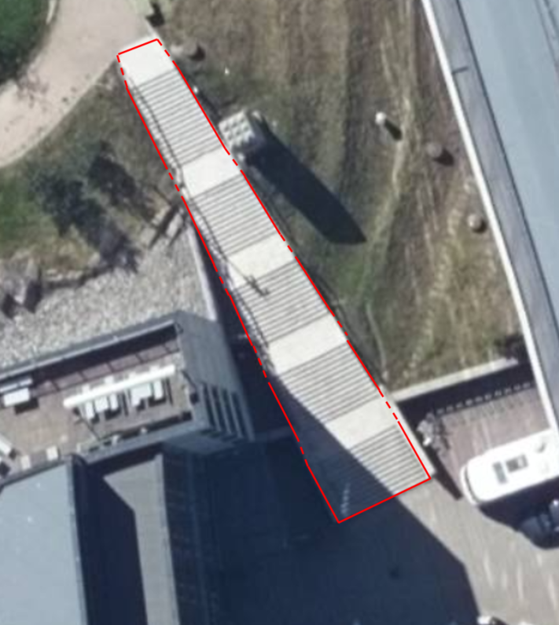
 
 
 
[discrete]
==== Føringer
[cols="h,2"]
|===
|FKB grunnrissreferanse
|Ytterkant av trapp
 
|FKB høydereferanse
|Ytterkant av trapp (skråplan)
 
|FKB-A minstestørrelse
|Alle synlige trapper
 
|FKB-B minstestørrelse
|Trapper med areal større enn 6m2
 
|FKB-A
|Påkrevd registrering
 
|FKB-B
|Påkrevd registrering
 
|FKB-C
|Registreres ikke
 
|FKB-D
|Registreres ikke
 
|===
 
 
<<<
 
[discrete]
==== Egenskapstabell for objekttype: Trapp
[cols="20,20,20,10", options="header"]
|===
|*Navn:* 
|*Type:* 
|*SOSI_navn:* 
|*Mult.:* 
 
|identifikasjon
|«dataType» Identifikasjon
|..IDENT
|[0..1]
 
|identifikasjon.lokalId
|CharacterString
|...LOKALID
|[1..1]
 
|identifikasjon.navnerom
|CharacterString
|...NAVNEROM
|[1..1]
 
|identifikasjon.versjonId
|CharacterString
|...VERSJONID
|[0..1]
 
|oppdateringsdato
|DateTime
|..OPPDATERINGSDATO
|[0..1]
 
|sluttdato
|DateTime
|..SLUTTDATO
|[0..1]
 
|datafangstdato
|Date
|..DATAFANGSTDATO
|[1..1]
 
|verifiseringsdato
|Date
|..VERIFISERINGSDATO
|[0..1]
 
|registreringsversjon
| «CodeList»  https://register.geonorge.no/sosi-kodelister/fkb/generell/5.0/registreringsversjon[Registreringsversjon, window = _blank]
|..REGISTRERINGSVERSJON
|[0..1]
 
|informasjon
|CharacterString
|..INFORMASJON
|[0..1]
 
|kvalitet
|«dataType» Posisjonskvalitet
|..KVALITET
|[1..1]
 
|kvalitet.datafangstmetode
| «CodeList»  https://register.geonorge.no/sosi-kodelister/fkb/generell/5.0/datafangstmetode[Datafangstmetode, window = _blank]
|...DATAFANGSTMETODE
|[1..1]
 
|kvalitet.nøyaktighet
|Integer
|...NØYAKTIGHET
|[0..1]
 
|kvalitet.synbarhet
| «CodeList»  https://register.geonorge.no/sosi-kodelister/fkb/generell/5.0/synbarhet[Synbarhet, window = _blank]
|...SYNBARHET
|[0..1]
 
|kvalitet.datafangstmetodeHøyde
| «CodeList»  https://register.geonorge.no/sosi-kodelister/fkb/generell/5.0/datafangstmetode[Datafangstmetode, window = _blank]
|...DATAFANGSTMETODEHØYDE
|[0..1]
 
|kvalitet.nøyaktighetHøyde
|Integer
|...H-NØYAKTIGHET
|[0..1]
 
|område
|GM_Surface
|.FLATE
|[1..1]
 
|medium
| «CodeList»  https://register.geonorge.no/sosi-kodelister/fkb/generell/5.0/medium[Medium, window = _blank]
|..MEDIUM
|[1..1]
 
|===
 
<<<
'''
 
[[gjerde]]
=== Objekttype: Gjerde
*Definisjon fra FKB produktspesifikasjon*: oppsatt stengsel som hindrer passering. St&#229;r ofte i grensa mellom eiendommer
 
 
.Illustrasjon fra produktspesifikasjon av Gjerde
image::http://skjema.geonorge.no/SOSI/produktspesifikasjon/FKB-BygnAnlegg/5.0/figurer/objtype_gjerde.png[link=http://skjema.geonorge.no/SOSI/produktspesifikasjon/FKB-BygnAnlegg/5.0/figurer/objtype_gjerde.png, Alt="Illustrasjon fra produktspesifikasjon: Gjerde"]
 
 
[discrete]
==== Tilleggsinformasjon for fotogrammetrisk registrering
Gjerder i forbindelse med anleggsomr&#229;der skal ikke registreres.

Fortrinnsvis skal topp gjerde registreres, men der dette er vanskelig kan h&#248;yde for gjerdet registreres ved terrengniv&#229; (HREF FOT). 
 
 
[discrete]
==== Føringer
[cols="h,2"]
|===
|FKB grunnrissreferanse
|Senter gjerde
 
|FKB høydereferanse
|Topp gjerde. Knekklinjer og sprang over 0,5m registreres
 
|FKB-A minstestørrelse
|Gjerder høyere enn 0,5m og lengre enn 2m registreres
 
|FKB-B minstestørrelse
|Gjerder høyere enn 0,5m og lengre enn 2m registreres
 
|FKB-C minstestørrelse
|Gjerder høyere enn 1m og lengre enn 4m registreres
 
|FKB-D minstestørrelse
|Gjerder høyere enn 1m og lengre enn 4m registreres
 
|FKB-A
|Påkrevd registrering
 
|FKB-B
|Påkrevd registrering
 
|FKB-C
|Påkrevd registrering
 
|FKB-D
|Påkrevd registrering
 
|===
 
 
<<<
 
[discrete]
==== Egenskapstabell for objekttype: Gjerde
[cols="20,20,20,10", options="header"]
|===
|*Navn:* 
|*Type:* 
|*SOSI_navn:* 
|*Mult.:* 
 
|identifikasjon
|«dataType» Identifikasjon
|..IDENT
|[0..1]
 
|identifikasjon.lokalId
|CharacterString
|...LOKALID
|[1..1]
 
|identifikasjon.navnerom
|CharacterString
|...NAVNEROM
|[1..1]
 
|identifikasjon.versjonId
|CharacterString
|...VERSJONID
|[0..1]
 
|oppdateringsdato
|DateTime
|..OPPDATERINGSDATO
|[0..1]
 
|sluttdato
|DateTime
|..SLUTTDATO
|[0..1]
 
|datafangstdato
|Date
|..DATAFANGSTDATO
|[1..1]
 
|verifiseringsdato
|Date
|..VERIFISERINGSDATO
|[0..1]
 
|registreringsversjon
| «CodeList»  https://register.geonorge.no/sosi-kodelister/fkb/generell/5.0/registreringsversjon[Registreringsversjon, window = _blank]
|..REGISTRERINGSVERSJON
|[0..1]
 
|informasjon
|CharacterString
|..INFORMASJON
|[0..1]
 
|kvalitet
|«dataType» Posisjonskvalitet
|..KVALITET
|[1..1]
 
|kvalitet.datafangstmetode
| «CodeList»  https://register.geonorge.no/sosi-kodelister/fkb/generell/5.0/datafangstmetode[Datafangstmetode, window = _blank]
|...DATAFANGSTMETODE
|[1..1]
 
|kvalitet.nøyaktighet
|Integer
|...NØYAKTIGHET
|[0..1]
 
|kvalitet.synbarhet
| «CodeList»  https://register.geonorge.no/sosi-kodelister/fkb/generell/5.0/synbarhet[Synbarhet, window = _blank]
|...SYNBARHET
|[0..1]
 
|kvalitet.datafangstmetodeHøyde
| «CodeList»  https://register.geonorge.no/sosi-kodelister/fkb/generell/5.0/datafangstmetode[Datafangstmetode, window = _blank]
|...DATAFANGSTMETODEHØYDE
|[0..1]
 
|kvalitet.nøyaktighetHøyde
|Integer
|...H-NØYAKTIGHET
|[0..1]
 
|nvdbpeker
|URI
|..NVDBPEKER
|[0..1]
 
|senterlinje
|GM_Curve
|.KURVE
|[1..1]
 
|gjerdetype
| «CodeList»  https://register.geonorge.no/sosi-kodelister/fkb/bygnanlegg/5.0/gjerdetype[Gjerdetype, window = _blank]
|..GJERDETYPE
|[1..1]
 
|høydereferanse
| «CodeList»  https://register.geonorge.no/sosi-kodelister/fkb/generell/5.0/hoydereferanse[Høydereferanse, window = _blank]
|..HREF
|[1..1]
 
|medium
| «CodeList»  https://register.geonorge.no/sosi-kodelister/fkb/generell/5.0/medium[Medium, window = _blank]
|..MEDIUM
|[1..1]
 
|===
[discrete]
==== Presiseringer til beskrivelsen av kodelistekoder
 
 
[discrete]
===== Gjerdetype - Kodenavn: Annet gjerde
*Definisjon:* Oppsatt stengsel som hindrer passering.    Standardverdi for fotogrammetrisk registrering. Brukes for alle andre typer gjerder enn steingjerder.  
 
 
[discrete]
===== Gjerdetype - Kodenavn: Steingjerde
*Definisjon:* frittst&#229;ende mur oppf&#248;rt av naturstein uten bindemiddel
 
.Eksempel på steingjerde
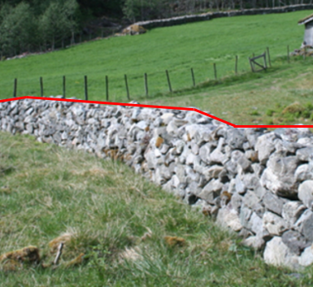
 
 
 
<<<
'''
 
[[murfrittstående]]
=== Objekttype: MurFrittstående
*Definisjon fra FKB produktspesifikasjon*: mur hvor oppfyllingen på en side utgjør mindre enn halve høyden på den andre siden
 
 
.Illustrasjon fra produktspesifikasjon av MurFrittstående
image::http://skjema.geonorge.no/SOSI/produktspesifikasjon/FKB-BygnAnlegg/5.0/figurer/objtype_murfrittstaende.png[link=http://skjema.geonorge.no/SOSI/produktspesifikasjon/FKB-BygnAnlegg/5.0/figurer/objtype_murfrittstaende.png, Alt="Illustrasjon fra produktspesifikasjon: MurFrittstående"]
 
 
[discrete]
==== Tilleggsinformasjon for fotogrammetrisk registrering
Kan v&#230;re mur som er murt oppe p&#229; forst&#248;tningsmur.

Brukes p&#229; gj&#248;dselkummer i landbruket (med eller uten tak). Tak p&#229; 
gj&#248;dselkummer skal i tillegg beskrives med BeskrivendeHjelpelinjeAnlegg.

Murer skal s&#229; langt som mulig registreres sammenhengende. Man 
skal pr&#248;ve &#229; registrere murer under bruer. Usikker stedfesting kodes 
med KVALITET.
 
 
'''
.Eksempel på registrering av åpen gjødselkum som MurFrittstående
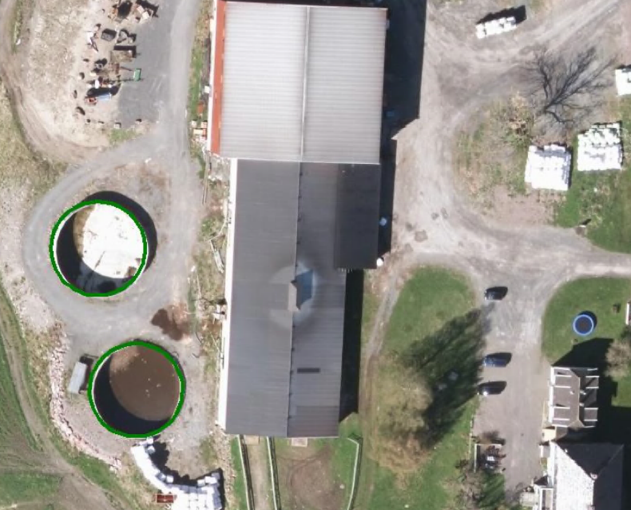
 
 
'''
.Eksempel på registrering av lukket gjødselkum (med tak) som MurFrittstående.
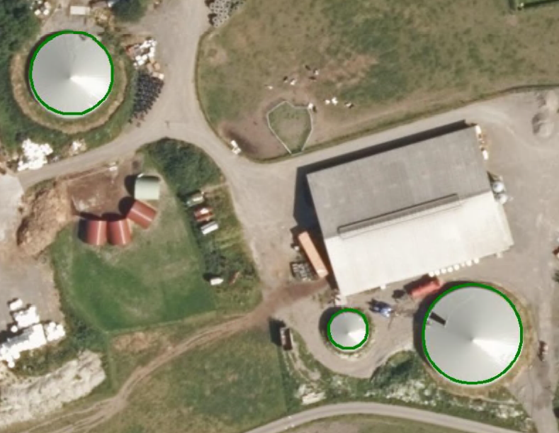
 
 
'''
.Eksempel på registrering av lukket gjødselkum (med tak) som MurFrittstående (rødt) og BeskrivendeHjelpelinjeAnlegg (gult)
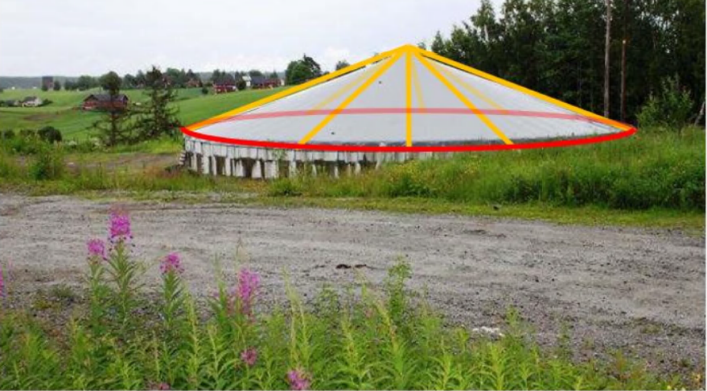
 
 
'''
.Murfrittstående registreres der mur hvor oppfyllingen på en side utgjør mindre enn halve høyden på den andre siden  
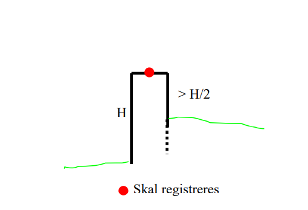
 
 
'''
.Eksempel på registrering av mur (rødt) rundt tank (gult)
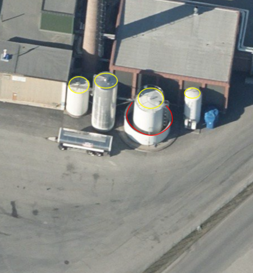
 
 
 
[discrete]
==== Føringer
[cols="h,2"]
|===
|FKB grunnrissreferanse
|Senter mur
 
|FKB høydereferanse
|Topp mur. Ved registrering av topp mur skal alle knekklinjer registreres. Dersom det er høydesprang større enn 0,5 meter, skal disse registreres som sprang
 
|FKB-A minstestørrelse
|Murer høyere enn 0,5m
 
|FKB-B minstestørrelse
|Murer høyere enn 0,5m
 
|FKB-C minstestørrelse
|Murer høyere enn 2,5m
 
|FKB-D minstestørrelse
|Murer høyere enn 2,5m
 
|FKB-A
|Påkrevd registrering
 
|FKB-B
|Påkrevd registrering
 
|FKB-C
|Påkrevd registrering
 
|FKB-D
|Påkrevd registrering
 
|===
 
 
<<<
 
[discrete]
==== Egenskapstabell for objekttype: MurFrittstående
[cols="20,20,20,10", options="header"]
|===
|*Navn:* 
|*Type:* 
|*SOSI_navn:* 
|*Mult.:* 
 
|identifikasjon
|«dataType» Identifikasjon
|..IDENT
|[0..1]
 
|identifikasjon.lokalId
|CharacterString
|...LOKALID
|[1..1]
 
|identifikasjon.navnerom
|CharacterString
|...NAVNEROM
|[1..1]
 
|identifikasjon.versjonId
|CharacterString
|...VERSJONID
|[0..1]
 
|oppdateringsdato
|DateTime
|..OPPDATERINGSDATO
|[0..1]
 
|sluttdato
|DateTime
|..SLUTTDATO
|[0..1]
 
|datafangstdato
|Date
|..DATAFANGSTDATO
|[1..1]
 
|verifiseringsdato
|Date
|..VERIFISERINGSDATO
|[0..1]
 
|registreringsversjon
| «CodeList»  https://register.geonorge.no/sosi-kodelister/fkb/generell/5.0/registreringsversjon[Registreringsversjon, window = _blank]
|..REGISTRERINGSVERSJON
|[0..1]
 
|informasjon
|CharacterString
|..INFORMASJON
|[0..1]
 
|kvalitet
|«dataType» Posisjonskvalitet
|..KVALITET
|[1..1]
 
|kvalitet.datafangstmetode
| «CodeList»  https://register.geonorge.no/sosi-kodelister/fkb/generell/5.0/datafangstmetode[Datafangstmetode, window = _blank]
|...DATAFANGSTMETODE
|[1..1]
 
|kvalitet.nøyaktighet
|Integer
|...NØYAKTIGHET
|[0..1]
 
|kvalitet.synbarhet
| «CodeList»  https://register.geonorge.no/sosi-kodelister/fkb/generell/5.0/synbarhet[Synbarhet, window = _blank]
|...SYNBARHET
|[0..1]
 
|kvalitet.datafangstmetodeHøyde
| «CodeList»  https://register.geonorge.no/sosi-kodelister/fkb/generell/5.0/datafangstmetode[Datafangstmetode, window = _blank]
|...DATAFANGSTMETODEHØYDE
|[0..1]
 
|kvalitet.nøyaktighetHøyde
|Integer
|...H-NØYAKTIGHET
|[0..1]
 
|grense
|GM_Curve
|.KURVE
|[1..1]
 
|høydereferanse
| «CodeList»  https://register.geonorge.no/sosi-kodelister/fkb/generell/5.0/hoydereferanse[Høydereferanse, window = _blank]
|..HREF
|[1..1]
 
|medium
| «CodeList»  https://register.geonorge.no/sosi-kodelister/fkb/generell/5.0/medium[Medium, window = _blank]
|..MEDIUM
|[1..1]
 
|===
 
<<<
'''
 
[[murloddrett]]
=== Objekttype: Murloddrett
*Definisjon fra FKB produktspesifikasjon*: forst&#248;tningsmur hvor topp og bunn er ubetydelig forskj&#248;vet i  forhold til hverandre
 
 
.Illustrasjon fra produktspesifikasjon av Murloddrett
image::http://skjema.geonorge.no/SOSI/produktspesifikasjon/FKB-BygnAnlegg/5.0/figurer/objtype_murloddrett.png[link=http://skjema.geonorge.no/SOSI/produktspesifikasjon/FKB-BygnAnlegg/5.0/figurer/objtype_murloddrett.png, Alt="Illustrasjon fra produktspesifikasjon: Murloddrett"]
 
 
[discrete]
==== Tilleggsinformasjon for fotogrammetrisk registrering
Murer skal s&#229; langt som mulig registreres sammenhengende. Man 
skal pr&#248;ve &#229; registrere murer under bruer. Usikker stedfesting kodes 
med KVALITET.

Det skal lages nodepunkt til eventuelle tilst&#248;tende 
situasjonsdetaljer som bygninger og lignende.
 
 
[discrete]
==== Føringer
[cols="h,2"]
|===
|FKB grunnrissreferanse
|Ytterkant topp av mur
 
|FKB høydereferanse
|Ytterkant topp av mur. Høydesprang registreres
 
|FKB-A minstestørrelse
|Høyere enn 0,5 m
 
|FKB-B minstestørrelse
|Høyere enn 0,5 m
 
|FKB-C minstestørrelse
|Høyere enn 2,5 m
 
|FKB-D minstestørrelse
|Høyere enn 2,5 m
 
|FKB-A
|Påkrevd registrering
 
|FKB-B
|Påkrevd registrering
 
|FKB-C
|Påkrevd registrering
 
|FKB-D
|Påkrevd registrering
 
|===
 
 
<<<
 
[discrete]
==== Egenskapstabell for objekttype: Murloddrett
[cols="20,20,20,10", options="header"]
|===
|*Navn:* 
|*Type:* 
|*SOSI_navn:* 
|*Mult.:* 
 
|identifikasjon
|«dataType» Identifikasjon
|..IDENT
|[0..1]
 
|identifikasjon.lokalId
|CharacterString
|...LOKALID
|[1..1]
 
|identifikasjon.navnerom
|CharacterString
|...NAVNEROM
|[1..1]
 
|identifikasjon.versjonId
|CharacterString
|...VERSJONID
|[0..1]
 
|oppdateringsdato
|DateTime
|..OPPDATERINGSDATO
|[0..1]
 
|sluttdato
|DateTime
|..SLUTTDATO
|[0..1]
 
|datafangstdato
|Date
|..DATAFANGSTDATO
|[1..1]
 
|verifiseringsdato
|Date
|..VERIFISERINGSDATO
|[0..1]
 
|registreringsversjon
| «CodeList»  https://register.geonorge.no/sosi-kodelister/fkb/generell/5.0/registreringsversjon[Registreringsversjon, window = _blank]
|..REGISTRERINGSVERSJON
|[0..1]
 
|informasjon
|CharacterString
|..INFORMASJON
|[0..1]
 
|kvalitet
|«dataType» Posisjonskvalitet
|..KVALITET
|[1..1]
 
|kvalitet.datafangstmetode
| «CodeList»  https://register.geonorge.no/sosi-kodelister/fkb/generell/5.0/datafangstmetode[Datafangstmetode, window = _blank]
|...DATAFANGSTMETODE
|[1..1]
 
|kvalitet.nøyaktighet
|Integer
|...NØYAKTIGHET
|[0..1]
 
|kvalitet.synbarhet
| «CodeList»  https://register.geonorge.no/sosi-kodelister/fkb/generell/5.0/synbarhet[Synbarhet, window = _blank]
|...SYNBARHET
|[0..1]
 
|kvalitet.datafangstmetodeHøyde
| «CodeList»  https://register.geonorge.no/sosi-kodelister/fkb/generell/5.0/datafangstmetode[Datafangstmetode, window = _blank]
|...DATAFANGSTMETODEHØYDE
|[0..1]
 
|kvalitet.nøyaktighetHøyde
|Integer
|...H-NØYAKTIGHET
|[0..1]
 
|nvdbpeker
|URI
|..NVDBPEKER
|[0..1]
 
|grense
|GM_Curve
|.KURVE
|[1..1]
 
|høydereferanse
| «CodeList»  https://register.geonorge.no/sosi-kodelister/fkb/generell/5.0/hoydereferanse[Høydereferanse, window = _blank]
|..HREF
|[1..1]
 
|medium
| «CodeList»  https://register.geonorge.no/sosi-kodelister/fkb/generell/5.0/medium[Medium, window = _blank]
|..MEDIUM
|[1..1]
 
|===
 
<<<
'''
 
[[portstolpe]]
=== Objekttype: Portstolpe
*Definisjon fra FKB produktspesifikasjon*: stolpe som en port kan være hengslet til
 
 
.Illustrasjon fra produktspesifikasjon av Portstolpe
image::http://skjema.geonorge.no/SOSI/produktspesifikasjon/FKB-BygnAnlegg/5.0/figurer/objtype_portstolpe.png[link=http://skjema.geonorge.no/SOSI/produktspesifikasjon/FKB-BygnAnlegg/5.0/figurer/objtype_portstolpe.png, Alt="Illustrasjon fra produktspesifikasjon: Portstolpe"]
 
 
 
[discrete]
==== Føringer
[cols="h,2"]
|===
|FKB grunnrissreferanse
|Senter stolpe
 
|FKB høydereferanse
|Topp stolpe
 
|FKB-A
|Opsjonell registrering
 
|FKB-B
|Opsjonell registrering
 
|FKB-C
|Registreres ikke
 
|FKB-D
|Registreres ikke
 
|===
 
 
<<<
 
[discrete]
==== Egenskapstabell for objekttype: Portstolpe
[cols="20,20,20,10", options="header"]
|===
|*Navn:* 
|*Type:* 
|*SOSI_navn:* 
|*Mult.:* 
 
|identifikasjon
|«dataType» Identifikasjon
|..IDENT
|[0..1]
 
|identifikasjon.lokalId
|CharacterString
|...LOKALID
|[1..1]
 
|identifikasjon.navnerom
|CharacterString
|...NAVNEROM
|[1..1]
 
|identifikasjon.versjonId
|CharacterString
|...VERSJONID
|[0..1]
 
|oppdateringsdato
|DateTime
|..OPPDATERINGSDATO
|[0..1]
 
|sluttdato
|DateTime
|..SLUTTDATO
|[0..1]
 
|datafangstdato
|Date
|..DATAFANGSTDATO
|[1..1]
 
|verifiseringsdato
|Date
|..VERIFISERINGSDATO
|[0..1]
 
|registreringsversjon
| «CodeList»  https://register.geonorge.no/sosi-kodelister/fkb/generell/5.0/registreringsversjon[Registreringsversjon, window = _blank]
|..REGISTRERINGSVERSJON
|[0..1]
 
|informasjon
|CharacterString
|..INFORMASJON
|[0..1]
 
|kvalitet
|«dataType» Posisjonskvalitet
|..KVALITET
|[1..1]
 
|kvalitet.datafangstmetode
| «CodeList»  https://register.geonorge.no/sosi-kodelister/fkb/generell/5.0/datafangstmetode[Datafangstmetode, window = _blank]
|...DATAFANGSTMETODE
|[1..1]
 
|kvalitet.nøyaktighet
|Integer
|...NØYAKTIGHET
|[0..1]
 
|kvalitet.synbarhet
| «CodeList»  https://register.geonorge.no/sosi-kodelister/fkb/generell/5.0/synbarhet[Synbarhet, window = _blank]
|...SYNBARHET
|[0..1]
 
|kvalitet.datafangstmetodeHøyde
| «CodeList»  https://register.geonorge.no/sosi-kodelister/fkb/generell/5.0/datafangstmetode[Datafangstmetode, window = _blank]
|...DATAFANGSTMETODEHØYDE
|[0..1]
 
|kvalitet.nøyaktighetHøyde
|Integer
|...H-NØYAKTIGHET
|[0..1]
 
|posisjon
|GM_Point
|.PUNKT
|[1..1]
 
|høydereferanse
| «CodeList»  https://register.geonorge.no/sosi-kodelister/fkb/generell/5.0/hoydereferanse[Høydereferanse, window = _blank]
|..HREF
|[1..1]
 
|===
 
<<<
'''
 
[[ruin]]
=== Objekttype: Ruin
*Definisjon fra FKB produktspesifikasjon*: Synlig mur som er rester etter tidligere byggverk
 
 
.Illustrasjon fra produktspesifikasjon av Ruin
image::http://skjema.geonorge.no/SOSI/produktspesifikasjon/FKB-BygnAnlegg/5.0/figurer/objtype_ruin.png[link=http://skjema.geonorge.no/SOSI/produktspesifikasjon/FKB-BygnAnlegg/5.0/figurer/objtype_ruin.png, Alt="Illustrasjon fra produktspesifikasjon: Ruin"]
 
 
[discrete]
==== Tilleggsinformasjon for fotogrammetrisk registrering
Ruin brukes kun om gamle, forfalne murer. For nye/vedlikeholdte murer/byggverk brukes andre objekttyper i FKB.

Hvis ruinen har brede murer kan det ogs&#229; registreres indre avgrensning av mur.
 
 
[discrete]
==== Føringer
[cols="h,2"]
|===
|FKB grunnrissreferanse
|Ytterkant ruin
 
|FKB høydereferanse
|Topp ytterkant ruin (HREF TOP)
 
|FKB-A
|Opsjonell registrering
 
|FKB-B
|Opsjonell registrering
 
|FKB-C
|Opsjonell registrering
 
|FKB-D
|Opsjonell registrering
 
|===
 
 
<<<
 
[discrete]
==== Egenskapstabell for objekttype: Ruin
[cols="20,20,20,10", options="header"]
|===
|*Navn:* 
|*Type:* 
|*SOSI_navn:* 
|*Mult.:* 
 
|identifikasjon
|«dataType» Identifikasjon
|..IDENT
|[0..1]
 
|identifikasjon.lokalId
|CharacterString
|...LOKALID
|[1..1]
 
|identifikasjon.navnerom
|CharacterString
|...NAVNEROM
|[1..1]
 
|identifikasjon.versjonId
|CharacterString
|...VERSJONID
|[0..1]
 
|oppdateringsdato
|DateTime
|..OPPDATERINGSDATO
|[0..1]
 
|sluttdato
|DateTime
|..SLUTTDATO
|[0..1]
 
|datafangstdato
|Date
|..DATAFANGSTDATO
|[1..1]
 
|verifiseringsdato
|Date
|..VERIFISERINGSDATO
|[0..1]
 
|registreringsversjon
| «CodeList»  https://register.geonorge.no/sosi-kodelister/fkb/generell/5.0/registreringsversjon[Registreringsversjon, window = _blank]
|..REGISTRERINGSVERSJON
|[0..1]
 
|informasjon
|CharacterString
|..INFORMASJON
|[0..1]
 
|kvalitet
|«dataType» Posisjonskvalitet
|..KVALITET
|[1..1]
 
|kvalitet.datafangstmetode
| «CodeList»  https://register.geonorge.no/sosi-kodelister/fkb/generell/5.0/datafangstmetode[Datafangstmetode, window = _blank]
|...DATAFANGSTMETODE
|[1..1]
 
|kvalitet.nøyaktighet
|Integer
|...NØYAKTIGHET
|[0..1]
 
|kvalitet.synbarhet
| «CodeList»  https://register.geonorge.no/sosi-kodelister/fkb/generell/5.0/synbarhet[Synbarhet, window = _blank]
|...SYNBARHET
|[0..1]
 
|kvalitet.datafangstmetodeHøyde
| «CodeList»  https://register.geonorge.no/sosi-kodelister/fkb/generell/5.0/datafangstmetode[Datafangstmetode, window = _blank]
|...DATAFANGSTMETODEHØYDE
|[0..1]
 
|kvalitet.nøyaktighetHøyde
|Integer
|...H-NØYAKTIGHET
|[0..1]
 
|grense
|GM_Curve
|.KURVE
|[1..1]
 
|høydereferanse
| «CodeList»  https://register.geonorge.no/sosi-kodelister/fkb/generell/5.0/hoydereferanse[Høydereferanse, window = _blank]
|..HREF
|[1..1]
 
|medium
| «CodeList»  https://register.geonorge.no/sosi-kodelister/fkb/generell/5.0/medium[Medium, window = _blank]
|..MEDIUM
|[1..1]
 
|eksternpeker
|URI
|..EKSTERNPEKER
|[0..1]
 
|===
 
<<<
'''
 
[[skjerm]]
=== Objekttype: Skjerm
*Definisjon fra FKB produktspesifikasjon*: frittst&#229;ende konstruksjon laget for &#229; skjerme mot st&#248;y eller sn&#248;, eller hindre/begrense ras og flom.
 
 
.Illustrasjon fra produktspesifikasjon av Skjerm
image::http://skjema.geonorge.no/SOSI/produktspesifikasjon/FKB-BygnAnlegg/5.0/figurer/objtype_skjerm.png[link=http://skjema.geonorge.no/SOSI/produktspesifikasjon/FKB-BygnAnlegg/5.0/figurer/objtype_skjerm.png, Alt="Illustrasjon fra produktspesifikasjon: Skjerm"]
 
 
 
'''
.Innglassede skjermer skal registreres som støyskjerm.  
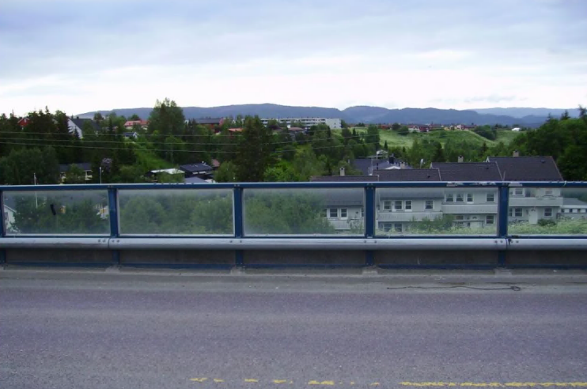
 
 
'''
.Eksempel på registrering av støyskjerm. Det lages 2D nodepunkt der det er høydesprang på mer enn 0.5 meter. Samme prinsipp for høyderegistrering gjelder også for veldig mange andre objekttyper i FKB-BygnAnlegg som Gjerde etc.
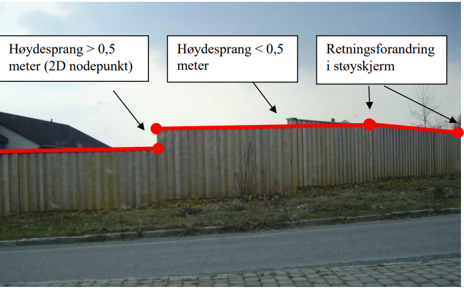
 
 
 
[discrete]
==== Føringer
[cols="h,2"]
|===
|FKB grunnrissreferanse
|Senter skjerm
 
|FKB høydereferanse
|Topp skjerm
 
|FKB-A
|Påkrevd registrering
 
|FKB-B
|Påkrevd registrering
 
|FKB-C
|Påkrevd registrering
 
|FKB-D
|Påkrevd registrering
 
|===
 
 
<<<
 
[discrete]
==== Egenskapstabell for objekttype: Skjerm
[cols="20,20,20,10", options="header"]
|===
|*Navn:* 
|*Type:* 
|*SOSI_navn:* 
|*Mult.:* 
 
|identifikasjon
|«dataType» Identifikasjon
|..IDENT
|[0..1]
 
|identifikasjon.lokalId
|CharacterString
|...LOKALID
|[1..1]
 
|identifikasjon.navnerom
|CharacterString
|...NAVNEROM
|[1..1]
 
|identifikasjon.versjonId
|CharacterString
|...VERSJONID
|[0..1]
 
|oppdateringsdato
|DateTime
|..OPPDATERINGSDATO
|[0..1]
 
|sluttdato
|DateTime
|..SLUTTDATO
|[0..1]
 
|datafangstdato
|Date
|..DATAFANGSTDATO
|[1..1]
 
|verifiseringsdato
|Date
|..VERIFISERINGSDATO
|[0..1]
 
|registreringsversjon
| «CodeList»  https://register.geonorge.no/sosi-kodelister/fkb/generell/5.0/registreringsversjon[Registreringsversjon, window = _blank]
|..REGISTRERINGSVERSJON
|[0..1]
 
|informasjon
|CharacterString
|..INFORMASJON
|[0..1]
 
|kvalitet
|«dataType» Posisjonskvalitet
|..KVALITET
|[1..1]
 
|kvalitet.datafangstmetode
| «CodeList»  https://register.geonorge.no/sosi-kodelister/fkb/generell/5.0/datafangstmetode[Datafangstmetode, window = _blank]
|...DATAFANGSTMETODE
|[1..1]
 
|kvalitet.nøyaktighet
|Integer
|...NØYAKTIGHET
|[0..1]
 
|kvalitet.synbarhet
| «CodeList»  https://register.geonorge.no/sosi-kodelister/fkb/generell/5.0/synbarhet[Synbarhet, window = _blank]
|...SYNBARHET
|[0..1]
 
|kvalitet.datafangstmetodeHøyde
| «CodeList»  https://register.geonorge.no/sosi-kodelister/fkb/generell/5.0/datafangstmetode[Datafangstmetode, window = _blank]
|...DATAFANGSTMETODEHØYDE
|[0..1]
 
|kvalitet.nøyaktighetHøyde
|Integer
|...H-NØYAKTIGHET
|[0..1]
 
|nvdbpeker
|URI
|..NVDBPEKER
|[0..1]
 
|senterlinje
|GM_Curve
|.KURVE
|[1..1]
 
|skjermingsfunksjon
| «CodeList»  https://register.geonorge.no/sosi-kodelister/fkb/bygnanlegg/5.0/skjermingsfunksjon[SkjermingsFunksjon, window = _blank]
|..SKJERMINGFUNK
|[1..1]
 
|høydereferanse
| «CodeList»  https://register.geonorge.no/sosi-kodelister/fkb/generell/5.0/hoydereferanse[Høydereferanse, window = _blank]
|..HREF
|[1..1]
 
|medium
| «CodeList»  https://register.geonorge.no/sosi-kodelister/fkb/generell/5.0/medium[Medium, window = _blank]
|..MEDIUM
|[1..1]
 
|høydeOverBakken
|Real
|..HOB
|[0..1]
 
|===
[discrete]
==== Restriksjoner
[cols="20,80", options="header"]
 
|===
|*Navn:* 
|*Beskrivelse:* 
 
|høydeOverBakken
|benyttes dersom HREF ikke er topp skjerm, eller dersom det er mangelfullt med terrengdata ved skjermen
 
|skjermingsfunksjon
|Skjermingstype St&#248;yskjerm brukes som standardverdi ved fotogrammetrisk registrering. Denne verdien benyttes dersom det ikke er &#229;penbart at skjermen er laget for en annen type skjerming eller at det ev. finnes et manus til hjelp ved klassifisering.
 
|===
 
<<<
'''
 
[[skråforstøtningsmur]]
=== Objekttype: SkråForstøtningsmur
*Definisjon fra FKB produktspesifikasjon*: forst&#248;tningsmur hvor topp og bunn er betydelig forskj&#248;vet i forhold til hverandre
 
 
.Illustrasjon fra produktspesifikasjon av SkråForstøtningsmur
image::http://skjema.geonorge.no/SOSI/produktspesifikasjon/FKB-BygnAnlegg/5.0/figurer/objtype_skraforstotningsmur.png[link=http://skjema.geonorge.no/SOSI/produktspesifikasjon/FKB-BygnAnlegg/5.0/figurer/objtype_skraforstotningsmur.png, Alt="Illustrasjon fra produktspesifikasjon: SkråForstøtningsmur"]
 
 
[discrete]
==== Tilleggsinformasjon for fotogrammetrisk registrering
Registreres som flategeometri. Skal benyttes for murer der grunnrissforskjellen mellom topp og bunn (se figur) er st&#248;rre enn 1/3 av h&#248;yden p&#229; muren. 

Murer skal s&#229; langt som mulig registreres sammenhengende. Man skal pr&#248;ve &#229; registrere murer under bruer. Usikker stedfesting av deler av avgrensningen angis med kvalitetskoding. 
 
 
'''
.Skråforstøtningsmur registreres nå forskjellen i grunnriss mellom topp og bunn (Delta P i figuren) er større enn 1/3 av høyden av muren.
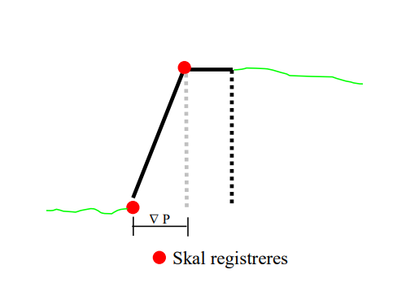
 
 
 
[discrete]
==== Føringer
[cols="h,2"]
|===
|FKB grunnrissreferanse
|Omriss av murens skråflate
 
|FKB høydereferanse
|Topp/fot/kant av murens skråflate
 
|FKB-A minstestørrelse
|Murer høyere enn 0,5m
 
|FKB-B minstestørrelse
|Murer høyere enn 0,5m
 
|FKB-C minstestørrelse
|Murer høyere enn 2,5m
 
|FKB-D minstestørrelse
|Murer høyere enn 2,5m
 
|FKB-A
|Påkrevd registrering
 
|FKB-B
|Påkrevd registrering
 
|FKB-C
|Påkrevd registrering
 
|FKB-D
|Påkrevd registrering
 
|===
 
 
<<<
 
[discrete]
==== Egenskapstabell for objekttype: SkråForstøtningsmur
[cols="20,20,20,10", options="header"]
|===
|*Navn:* 
|*Type:* 
|*SOSI_navn:* 
|*Mult.:* 
 
|identifikasjon
|«dataType» Identifikasjon
|..IDENT
|[0..1]
 
|identifikasjon.lokalId
|CharacterString
|...LOKALID
|[1..1]
 
|identifikasjon.navnerom
|CharacterString
|...NAVNEROM
|[1..1]
 
|identifikasjon.versjonId
|CharacterString
|...VERSJONID
|[0..1]
 
|oppdateringsdato
|DateTime
|..OPPDATERINGSDATO
|[0..1]
 
|sluttdato
|DateTime
|..SLUTTDATO
|[0..1]
 
|datafangstdato
|Date
|..DATAFANGSTDATO
|[1..1]
 
|verifiseringsdato
|Date
|..VERIFISERINGSDATO
|[0..1]
 
|registreringsversjon
| «CodeList»  https://register.geonorge.no/sosi-kodelister/fkb/generell/5.0/registreringsversjon[Registreringsversjon, window = _blank]
|..REGISTRERINGSVERSJON
|[0..1]
 
|informasjon
|CharacterString
|..INFORMASJON
|[0..1]
 
|kvalitet
|«dataType» Posisjonskvalitet
|..KVALITET
|[1..1]
 
|kvalitet.datafangstmetode
| «CodeList»  https://register.geonorge.no/sosi-kodelister/fkb/generell/5.0/datafangstmetode[Datafangstmetode, window = _blank]
|...DATAFANGSTMETODE
|[1..1]
 
|kvalitet.nøyaktighet
|Integer
|...NØYAKTIGHET
|[0..1]
 
|kvalitet.synbarhet
| «CodeList»  https://register.geonorge.no/sosi-kodelister/fkb/generell/5.0/synbarhet[Synbarhet, window = _blank]
|...SYNBARHET
|[0..1]
 
|kvalitet.datafangstmetodeHøyde
| «CodeList»  https://register.geonorge.no/sosi-kodelister/fkb/generell/5.0/datafangstmetode[Datafangstmetode, window = _blank]
|...DATAFANGSTMETODEHØYDE
|[0..1]
 
|kvalitet.nøyaktighetHøyde
|Integer
|...H-NØYAKTIGHET
|[0..1]
 
|nvdbpeker
|URI
|..NVDBPEKER
|[0..1]
 
|område
|GM_Surface
|.FLATE
|[1..1]
 
|medium
| «CodeList»  https://register.geonorge.no/sosi-kodelister/fkb/generell/5.0/medium[Medium, window = _blank]
|..MEDIUM
|[1..1]
 
|===
 
<<<
'''
 
[[voll]]
=== Objekttype: Voll
*Definisjon fra FKB produktspesifikasjon*: opph&#248;yd terrengformasjon anlagt for &#229; hindre st&#248;y, ukontrollert gjennomstr&#248;mming av vann, skade fra  prosjektiler p&#229; skytebane o.l.
 
 
.Illustrasjon fra produktspesifikasjon av Voll
image::http://skjema.geonorge.no/SOSI/produktspesifikasjon/FKB-BygnAnlegg/5.0/figurer/objtype_voll.png[link=http://skjema.geonorge.no/SOSI/produktspesifikasjon/FKB-BygnAnlegg/5.0/figurer/objtype_voll.png, Alt="Illustrasjon fra produktspesifikasjon: Voll"]
 
 
 
'''
.Eksempel på registrering av av Voll med skjermingsfunksjon Støyskjerm
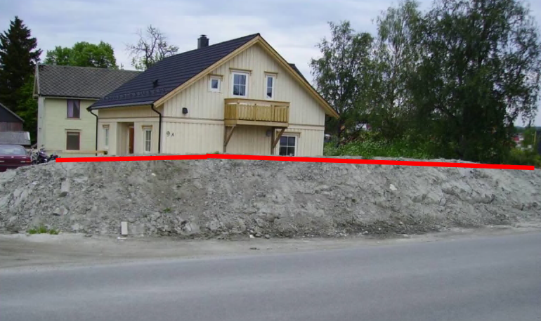
 
 
 
[discrete]
==== Føringer
[cols="h,2"]
|===
|FKB grunnrissreferanse
|Senter voll
 
|FKB høydereferanse
|Topp voll
 
|FKB-A
|Påkrevd registrering
 
|FKB-B
|Påkrevd registrering
 
|FKB-C
|Påkrevd registrering
 
|FKB-D
|Påkrevd registrering
 
|===
 
 
<<<
 
[discrete]
==== Egenskapstabell for objekttype: Voll
[cols="20,20,20,10", options="header"]
|===
|*Navn:* 
|*Type:* 
|*SOSI_navn:* 
|*Mult.:* 
 
|identifikasjon
|«dataType» Identifikasjon
|..IDENT
|[0..1]
 
|identifikasjon.lokalId
|CharacterString
|...LOKALID
|[1..1]
 
|identifikasjon.navnerom
|CharacterString
|...NAVNEROM
|[1..1]
 
|identifikasjon.versjonId
|CharacterString
|...VERSJONID
|[0..1]
 
|oppdateringsdato
|DateTime
|..OPPDATERINGSDATO
|[0..1]
 
|sluttdato
|DateTime
|..SLUTTDATO
|[0..1]
 
|datafangstdato
|Date
|..DATAFANGSTDATO
|[1..1]
 
|verifiseringsdato
|Date
|..VERIFISERINGSDATO
|[0..1]
 
|registreringsversjon
| «CodeList»  https://register.geonorge.no/sosi-kodelister/fkb/generell/5.0/registreringsversjon[Registreringsversjon, window = _blank]
|..REGISTRERINGSVERSJON
|[0..1]
 
|informasjon
|CharacterString
|..INFORMASJON
|[0..1]
 
|kvalitet
|«dataType» Posisjonskvalitet
|..KVALITET
|[1..1]
 
|kvalitet.datafangstmetode
| «CodeList»  https://register.geonorge.no/sosi-kodelister/fkb/generell/5.0/datafangstmetode[Datafangstmetode, window = _blank]
|...DATAFANGSTMETODE
|[1..1]
 
|kvalitet.nøyaktighet
|Integer
|...NØYAKTIGHET
|[0..1]
 
|kvalitet.synbarhet
| «CodeList»  https://register.geonorge.no/sosi-kodelister/fkb/generell/5.0/synbarhet[Synbarhet, window = _blank]
|...SYNBARHET
|[0..1]
 
|kvalitet.datafangstmetodeHøyde
| «CodeList»  https://register.geonorge.no/sosi-kodelister/fkb/generell/5.0/datafangstmetode[Datafangstmetode, window = _blank]
|...DATAFANGSTMETODEHØYDE
|[0..1]
 
|kvalitet.nøyaktighetHøyde
|Integer
|...H-NØYAKTIGHET
|[0..1]
 
|nvdbpeker
|URI
|..NVDBPEKER
|[0..1]
 
|senterlinje
|GM_Curve
|.KURVE
|[1..1]
 
|skjermingsfunksjon
| «CodeList»  https://register.geonorge.no/sosi-kodelister/fkb/bygnanlegg/5.0/skjermingsfunksjon[SkjermingsFunksjon, window = _blank]
|..SKJERMINGFUNK
|[1..1]
 
|høydereferanse
| «CodeList»  https://register.geonorge.no/sosi-kodelister/fkb/generell/5.0/hoydereferanse[Høydereferanse, window = _blank]
|..HREF
|[1..1]
 
|høydeOverBakken
|Real
|..HOB
|[0..1]
 
|===
[discrete]
==== Restriksjoner
[cols="20,80", options="header"]
 
|===
|*Navn:* 
|*Beskrivelse:* 
 
|høydeOverBakken
|benyttes dersom HREF ikke er topp voll, eller dersom det er mangelfullt med terrengdata ved vollen
 
|skjermingsfunksjon
|Skjermingstype St&#248;yskjerm brukes som standardverdi ved fotogrammetrisk registrering. Denne verdien benyttes dersom det ikke er &#229;penbart at vollen er laget for en annen type skjerming eller at det ev. finnes et manus til hjelp ved klassifisering.
 
|===
 
<<<
'''
 
[[hoppbakke]]
=== Objekttype: Hoppbakke
*Definisjon fra FKB produktspesifikasjon*: anlegg for skihopping med kunstig eller naturlig tilløp
 
 
.Illustrasjon fra produktspesifikasjon av Hoppbakke
image::http://skjema.geonorge.no/SOSI/produktspesifikasjon/FKB-BygnAnlegg/5.0/figurer/objtype_hoppbakke.png[link=http://skjema.geonorge.no/SOSI/produktspesifikasjon/FKB-BygnAnlegg/5.0/figurer/objtype_hoppbakke.png, Alt="Illustrasjon fra produktspesifikasjon: Hoppbakke"]
 
 
[discrete]
==== Tilleggsinformasjon for fotogrammetrisk registrering
Dette er en beskrivelse av det bygningsmessige ved en hoppbakke slik som omriss av stillas og hopp, samt karakteristiske linjer som kant underrenn, kant slette, kant overrenn (hvis det ikke er stillas) og lignende. 

I tillegg kan hele omr&#229;det rundt hoppbakken med selve bakken, tilskuerplasser, mindre parkeringsplasser, boder, o.l. beskrives som SportIdrettPlass i FKB-Arealbruk.
 
 
[discrete]
==== Føringer
[cols="h,2"]
|===
|FKB grunnrissreferanse
|Ytterkant
 
|FKB høydereferanse
|Topp, ev. terrengnivå
 
|FKB-A
|Påkrevd registrering
 
|FKB-B
|Påkrevd registrering
 
|FKB-C
|Påkrevd registrering
 
|FKB-D
|Påkrevd registrering
 
|===
 
 
<<<
 
[discrete]
==== Egenskapstabell for objekttype: Hoppbakke
[cols="20,20,20,10", options="header"]
|===
|*Navn:* 
|*Type:* 
|*SOSI_navn:* 
|*Mult.:* 
 
|identifikasjon
|«dataType» Identifikasjon
|..IDENT
|[0..1]
 
|identifikasjon.lokalId
|CharacterString
|...LOKALID
|[1..1]
 
|identifikasjon.navnerom
|CharacterString
|...NAVNEROM
|[1..1]
 
|identifikasjon.versjonId
|CharacterString
|...VERSJONID
|[0..1]
 
|oppdateringsdato
|DateTime
|..OPPDATERINGSDATO
|[0..1]
 
|sluttdato
|DateTime
|..SLUTTDATO
|[0..1]
 
|datafangstdato
|Date
|..DATAFANGSTDATO
|[1..1]
 
|verifiseringsdato
|Date
|..VERIFISERINGSDATO
|[0..1]
 
|registreringsversjon
| «CodeList»  https://register.geonorge.no/sosi-kodelister/fkb/generell/5.0/registreringsversjon[Registreringsversjon, window = _blank]
|..REGISTRERINGSVERSJON
|[0..1]
 
|informasjon
|CharacterString
|..INFORMASJON
|[0..1]
 
|kvalitet
|«dataType» Posisjonskvalitet
|..KVALITET
|[1..1]
 
|kvalitet.datafangstmetode
| «CodeList»  https://register.geonorge.no/sosi-kodelister/fkb/generell/5.0/datafangstmetode[Datafangstmetode, window = _blank]
|...DATAFANGSTMETODE
|[1..1]
 
|kvalitet.nøyaktighet
|Integer
|...NØYAKTIGHET
|[0..1]
 
|kvalitet.synbarhet
| «CodeList»  https://register.geonorge.no/sosi-kodelister/fkb/generell/5.0/synbarhet[Synbarhet, window = _blank]
|...SYNBARHET
|[0..1]
 
|kvalitet.datafangstmetodeHøyde
| «CodeList»  https://register.geonorge.no/sosi-kodelister/fkb/generell/5.0/datafangstmetode[Datafangstmetode, window = _blank]
|...DATAFANGSTMETODEHØYDE
|[0..1]
 
|kvalitet.nøyaktighetHøyde
|Integer
|...H-NØYAKTIGHET
|[0..1]
 
|senterlinje
|GM_Curve
|.KURVE
|[1..1]
 
|høydereferanse
| «CodeList»  https://register.geonorge.no/sosi-kodelister/fkb/generell/5.0/hoydereferanse[Høydereferanse, window = _blank]
|..HREF
|[1..1]
 
|===
 
<<<
'''
 
[[idrettsanlegg]]
=== Objekttype: Idrettsanlegg
*Definisjon fra FKB produktspesifikasjon*: linje for avgrensning av anleggsmessige deler av et idrettsanlegg, som f.eks ytteravgrensning av en fotballbane

Merknad: Omr&#229;det rundt idrettsanlegget kan beskrives som arealbruksobjekt (se kap. for arealbruk).
 
 
.Illustrasjon fra produktspesifikasjon av Idrettsanlegg
image::http://skjema.geonorge.no/SOSI/produktspesifikasjon/FKB-BygnAnlegg/5.0/figurer/objtype_idrettsanlegg.png[link=http://skjema.geonorge.no/SOSI/produktspesifikasjon/FKB-BygnAnlegg/5.0/figurer/objtype_idrettsanlegg.png, Alt="Illustrasjon fra produktspesifikasjon: Idrettsanlegg"]
 
 
[discrete]
==== Tilleggsinformasjon for fotogrammetrisk registrering
Ytterkant (gresskant, gruskant, asfaltkant) av banene registreres som Idrettsanlegg. Selve oppmerkingen av banene skal ikke registreres.

SportIdrettPlass i FKB-Arealbruk brukes til &#229; registrere et st&#248;rre omr&#229;de som inkluderer en fotballbane, tennisbane, tilskuerplasser, treningsbane osv.
 
 
'''
.Eksempel på registrering av Idrettsanlegg (oransje) og avgrensning av SportIdrettPlass i FKB-Arealbruk (grønn)
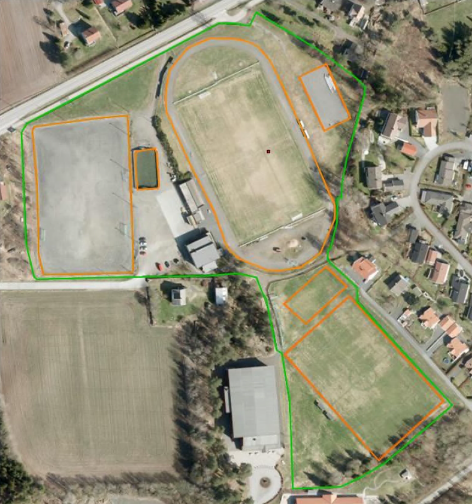
 
 
 
[discrete]
==== Føringer
[cols="h,2"]
|===
|FKB grunnrissreferanse
|Ytterkant
 
|FKB høydereferanse
|Terrengnivå, eventuelt topp
 
|FKB-A
|Påkrevd registrering
 
|FKB-B
|Påkrevd registrering
 
|FKB-C
|Påkrevd registrering
 
|FKB-D
|Påkrevd registrering
 
|===
 
 
<<<
 
[discrete]
==== Egenskapstabell for objekttype: Idrettsanlegg
[cols="20,20,20,10", options="header"]
|===
|*Navn:* 
|*Type:* 
|*SOSI_navn:* 
|*Mult.:* 
 
|identifikasjon
|«dataType» Identifikasjon
|..IDENT
|[0..1]
 
|identifikasjon.lokalId
|CharacterString
|...LOKALID
|[1..1]
 
|identifikasjon.navnerom
|CharacterString
|...NAVNEROM
|[1..1]
 
|identifikasjon.versjonId
|CharacterString
|...VERSJONID
|[0..1]
 
|oppdateringsdato
|DateTime
|..OPPDATERINGSDATO
|[0..1]
 
|sluttdato
|DateTime
|..SLUTTDATO
|[0..1]
 
|datafangstdato
|Date
|..DATAFANGSTDATO
|[1..1]
 
|verifiseringsdato
|Date
|..VERIFISERINGSDATO
|[0..1]
 
|registreringsversjon
| «CodeList»  https://register.geonorge.no/sosi-kodelister/fkb/generell/5.0/registreringsversjon[Registreringsversjon, window = _blank]
|..REGISTRERINGSVERSJON
|[0..1]
 
|informasjon
|CharacterString
|..INFORMASJON
|[0..1]
 
|kvalitet
|«dataType» Posisjonskvalitet
|..KVALITET
|[1..1]
 
|kvalitet.datafangstmetode
| «CodeList»  https://register.geonorge.no/sosi-kodelister/fkb/generell/5.0/datafangstmetode[Datafangstmetode, window = _blank]
|...DATAFANGSTMETODE
|[1..1]
 
|kvalitet.nøyaktighet
|Integer
|...NØYAKTIGHET
|[0..1]
 
|kvalitet.synbarhet
| «CodeList»  https://register.geonorge.no/sosi-kodelister/fkb/generell/5.0/synbarhet[Synbarhet, window = _blank]
|...SYNBARHET
|[0..1]
 
|kvalitet.datafangstmetodeHøyde
| «CodeList»  https://register.geonorge.no/sosi-kodelister/fkb/generell/5.0/datafangstmetode[Datafangstmetode, window = _blank]
|...DATAFANGSTMETODEHØYDE
|[0..1]
 
|kvalitet.nøyaktighetHøyde
|Integer
|...H-NØYAKTIGHET
|[0..1]
 
|grense
|GM_Curve
|.KURVE
|[1..1]
 
|høydereferanse
| «CodeList»  https://register.geonorge.no/sosi-kodelister/fkb/generell/5.0/hoydereferanse[Høydereferanse, window = _blank]
|..HREF
|[1..1]
 
|===
 
<<<
'''
 
[[parkdetalj]]
=== Objekttype: Parkdetalj
*Definisjon fra FKB produktspesifikasjon*: detalj i parkmessig omr&#229;de

Merknad:
Omfatter detaljer som f.eks. bautaer, statuer, fontener, basseng, lekeapparater og sandkasser. Registreres som punkt- eller flategeometri.
 
 
.Illustrasjon fra produktspesifikasjon av Parkdetalj
image::http://skjema.geonorge.no/SOSI/produktspesifikasjon/FKB-BygnAnlegg/5.0/figurer/objtype_parkdetalj.png[link=http://skjema.geonorge.no/SOSI/produktspesifikasjon/FKB-BygnAnlegg/5.0/figurer/objtype_parkdetalj.png, Alt="Illustrasjon fra produktspesifikasjon: Parkdetalj"]
 
 
[discrete]
==== Tilleggsinformasjon for fotogrammetrisk registrering
Parkdetalj kan registreres b&#229;de som flate (omriss av objekt med HREF FOT) eller punkt (HREF TOP). Ved registrering av parkdetalj skal alltid parkdetaljtype klassifiseres.

Parkdetaljer kan/b&#248;r ofte kompletteres med andre objekttyper som gjerder, murer, BeskrivendeHjelplinjeAnlegg etc.

 
 
[discrete]
==== Føringer
[cols="h,2"]
|===
|FKB grunnrissreferanse
|Ytterkant objekt eller ev. senter objekt
 
|FKB høydereferanse
|Topp objekt (HREF TOP) registreres som hovedregel
 
|FKB-A
|Opsjonell registrering
 
|FKB-B
|Opsjonell registrering
 
|FKB-C
|Registreres ikke
 
|FKB-D
|Registreres ikke
 
|===
 
 
<<<
 
[discrete]
==== Egenskapstabell for objekttype: Parkdetalj
[cols="20,20,20,10", options="header"]
|===
|*Navn:* 
|*Type:* 
|*SOSI_navn:* 
|*Mult.:* 
 
|identifikasjon
|«dataType» Identifikasjon
|..IDENT
|[0..1]
 
|identifikasjon.lokalId
|CharacterString
|...LOKALID
|[1..1]
 
|identifikasjon.navnerom
|CharacterString
|...NAVNEROM
|[1..1]
 
|identifikasjon.versjonId
|CharacterString
|...VERSJONID
|[0..1]
 
|oppdateringsdato
|DateTime
|..OPPDATERINGSDATO
|[0..1]
 
|sluttdato
|DateTime
|..SLUTTDATO
|[0..1]
 
|datafangstdato
|Date
|..DATAFANGSTDATO
|[1..1]
 
|verifiseringsdato
|Date
|..VERIFISERINGSDATO
|[0..1]
 
|registreringsversjon
| «CodeList»  https://register.geonorge.no/sosi-kodelister/fkb/generell/5.0/registreringsversjon[Registreringsversjon, window = _blank]
|..REGISTRERINGSVERSJON
|[0..1]
 
|informasjon
|CharacterString
|..INFORMASJON
|[0..1]
 
|kvalitet
|«dataType» Posisjonskvalitet
|..KVALITET
|[1..1]
 
|kvalitet.datafangstmetode
| «CodeList»  https://register.geonorge.no/sosi-kodelister/fkb/generell/5.0/datafangstmetode[Datafangstmetode, window = _blank]
|...DATAFANGSTMETODE
|[1..1]
 
|kvalitet.nøyaktighet
|Integer
|...NØYAKTIGHET
|[0..1]
 
|kvalitet.synbarhet
| «CodeList»  https://register.geonorge.no/sosi-kodelister/fkb/generell/5.0/synbarhet[Synbarhet, window = _blank]
|...SYNBARHET
|[0..1]
 
|kvalitet.datafangstmetodeHøyde
| «CodeList»  https://register.geonorge.no/sosi-kodelister/fkb/generell/5.0/datafangstmetode[Datafangstmetode, window = _blank]
|...DATAFANGSTMETODEHØYDE
|[0..1]
 
|kvalitet.nøyaktighetHøyde
|Integer
|...H-NØYAKTIGHET
|[0..1]
 
|posisjon
|GM_Point
|.PUNKT
|[0..1]
 
|område
|GM_Surface
|.FLATE
|[0..1]
 
|høydereferanse
| «CodeList»  https://register.geonorge.no/sosi-kodelister/fkb/generell/5.0/hoydereferanse[Høydereferanse, window = _blank]
|..HREF
|[1..1]
 
|parkdetaljtype
| «CodeList»  https://register.geonorge.no/sosi-kodelister/fkb/bygnanlegg/5.0/parkdetaljtype[Parkdetaljtype, window = _blank]
|..PARKDETALJTYPE
|[1..1]
 
|eksternpeker
|URI
|..EKSTERNPEKER
|[0..1]
 
|medium
|«CodeList» Medium
|..MEDIUM
|[1..1]
 
|===
[discrete]
==== Presiseringer til beskrivelsen av kodelistekoder
 
 
[discrete]
===== Parkdetaljtype - Kodenavn: Basseng
*Definisjon:* Basseng, fontene eller annen type vannanlegg i parken.    Registreres som flateobjekt. Avgrensning av basseng f&#248;lger bassengkant/vannkant i grunnriss og h&#248;yde.  
 
.Eksempel på basseng/fontene som kan registeres som parkdetalj
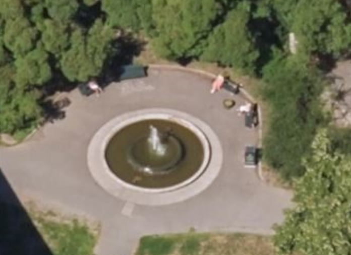
 
 
 
[discrete]
===== Parkdetaljtype - Kodenavn: Bauta
*Definisjon:* bauta, statue, skulptur eller annen type monoment. Registreres som punkt-geometri.    Hvis fundament er betydelig kan omriss med href Fot registreres som objekttype Fundament.
 
.Eksempel på statue registreres som punkt med HREF TOP
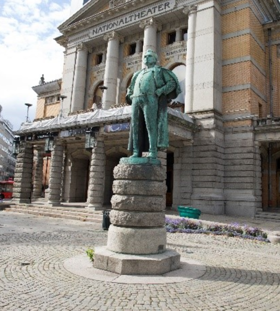
 
 
 
[discrete]
===== Parkdetaljtype - Kodenavn: Lekeapparat
*Definisjon:* St&#248;rre lekeapparater registreres som flate med HREF FOT for omrisset av konstruksjonen.    Et litt st&#248;rre omr&#229;de rundt lekeapparatene kan registreres som Lekeplass i FKB-Arealbruk
 
.Ekspempel på stort lekeapparat i park
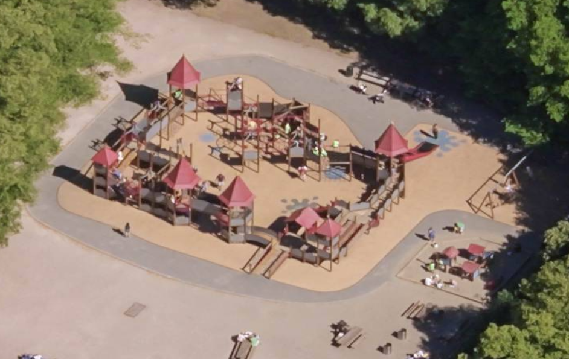
 
 
 
[discrete]
===== Parkdetaljtype - Kodenavn: Sandkasse
*Definisjon:* Registreres som flateobjekt.    Mindre lekeapparater inne i sandkasser registreres ikke
 
.Eksempel på registrering av sandkasser
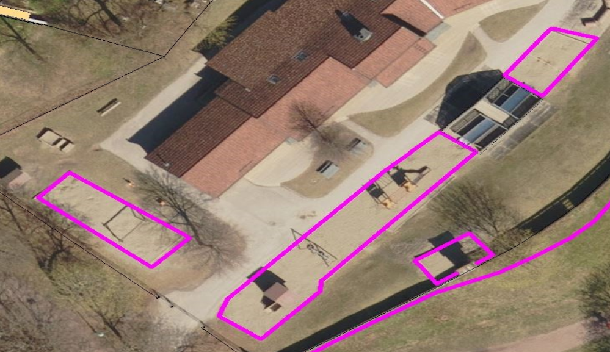
 
 
 
<<<
'''
 
[[skytebaneinnretning]]
=== Objekttype: Skytebaneinnretning
*Definisjon fra FKB produktspesifikasjon*: omriss av tekniske anlegg på skytebane - standplass og skiver som ikke blir registrert som f.eks bygninger og murer
 
 
.Illustrasjon fra produktspesifikasjon av Skytebaneinnretning
image::http://skjema.geonorge.no/SOSI/produktspesifikasjon/FKB-BygnAnlegg/5.0/figurer/objtype_skytebaneinnretning.png[link=http://skjema.geonorge.no/SOSI/produktspesifikasjon/FKB-BygnAnlegg/5.0/figurer/objtype_skytebaneinnretning.png, Alt="Illustrasjon fra produktspesifikasjon: Skytebaneinnretning"]
 
 
 
[discrete]
==== Føringer
[cols="h,2"]
|===
|FKB grunnrissreferanse
|Ytterkant/senter
 
|FKB høydereferanse
|Topp/terrengnivå
 
|FKB-A
|Påkrevd registrering
 
|FKB-B
|Påkrevd registrering
 
|FKB-C
|Påkrevd registrering
 
|FKB-D
|Påkrevd registrering
 
|===
 
 
<<<
 
[discrete]
==== Egenskapstabell for objekttype: Skytebaneinnretning
[cols="20,20,20,10", options="header"]
|===
|*Navn:* 
|*Type:* 
|*SOSI_navn:* 
|*Mult.:* 
 
|identifikasjon
|«dataType» Identifikasjon
|..IDENT
|[0..1]
 
|identifikasjon.lokalId
|CharacterString
|...LOKALID
|[1..1]
 
|identifikasjon.navnerom
|CharacterString
|...NAVNEROM
|[1..1]
 
|identifikasjon.versjonId
|CharacterString
|...VERSJONID
|[0..1]
 
|oppdateringsdato
|DateTime
|..OPPDATERINGSDATO
|[0..1]
 
|sluttdato
|DateTime
|..SLUTTDATO
|[0..1]
 
|datafangstdato
|Date
|..DATAFANGSTDATO
|[1..1]
 
|verifiseringsdato
|Date
|..VERIFISERINGSDATO
|[0..1]
 
|registreringsversjon
| «CodeList»  https://register.geonorge.no/sosi-kodelister/fkb/generell/5.0/registreringsversjon[Registreringsversjon, window = _blank]
|..REGISTRERINGSVERSJON
|[0..1]
 
|informasjon
|CharacterString
|..INFORMASJON
|[0..1]
 
|kvalitet
|«dataType» Posisjonskvalitet
|..KVALITET
|[1..1]
 
|kvalitet.datafangstmetode
| «CodeList»  https://register.geonorge.no/sosi-kodelister/fkb/generell/5.0/datafangstmetode[Datafangstmetode, window = _blank]
|...DATAFANGSTMETODE
|[1..1]
 
|kvalitet.nøyaktighet
|Integer
|...NØYAKTIGHET
|[0..1]
 
|kvalitet.synbarhet
| «CodeList»  https://register.geonorge.no/sosi-kodelister/fkb/generell/5.0/synbarhet[Synbarhet, window = _blank]
|...SYNBARHET
|[0..1]
 
|kvalitet.datafangstmetodeHøyde
| «CodeList»  https://register.geonorge.no/sosi-kodelister/fkb/generell/5.0/datafangstmetode[Datafangstmetode, window = _blank]
|...DATAFANGSTMETODEHØYDE
|[0..1]
 
|kvalitet.nøyaktighetHøyde
|Integer
|...H-NØYAKTIGHET
|[0..1]
 
|senterlinje
|GM_Curve
|.KURVE
|[1..1]
 
|høydereferanse
| «CodeList»  https://register.geonorge.no/sosi-kodelister/fkb/generell/5.0/hoydereferanse[Høydereferanse, window = _blank]
|..HREF
|[1..1]
 
|===
 
<<<
'''
 
[[svømmebasseng]]
=== Objekttype: Svømmebasseng
*Definisjon fra FKB produktspesifikasjon*: basseng for svømming og vannlek
 
 
.Illustrasjon fra produktspesifikasjon av Svømmebasseng
image::http://skjema.geonorge.no/SOSI/produktspesifikasjon/FKB-BygnAnlegg/5.0/figurer/objtype_svommebasseng.png[link=http://skjema.geonorge.no/SOSI/produktspesifikasjon/FKB-BygnAnlegg/5.0/figurer/objtype_svommebasseng.png, Alt="Illustrasjon fra produktspesifikasjon: Svømmebasseng"]
 
 
[discrete]
==== Tilleggsinformasjon for fotogrammetrisk registrering
Som sv&#248;mmebasseng regnes ikke fuglebad og fontener. Slike objekter kan registreres som Parkdetalj.
 
 
'''
.Eksempel på regstrering av svømmebasseng
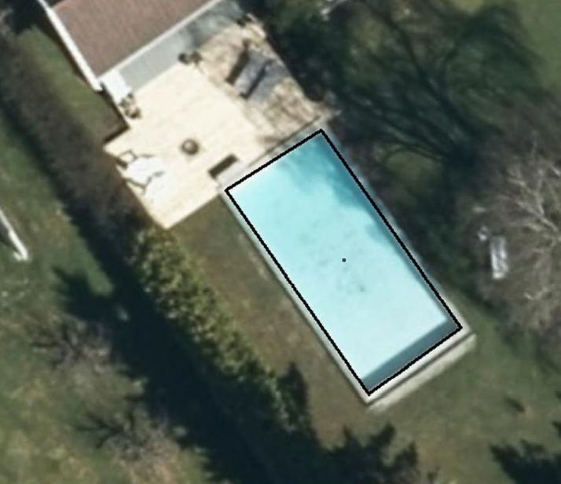
 
 
 
[discrete]
==== Føringer
[cols="h,2"]
|===
|FKB grunnrissreferanse
|Ytterkant mot vannflaten
 
|FKB høydereferanse
|Topp bassengkant
 
|FKB-A minstestørrelse
|Areal større enn 15m2
 
|FKB-A
|Påkrevd registrering
 
|FKB-B
|Påkrevd registrering
 
|FKB-C
|Påkrevd registrering
 
|FKB-D
|Påkrevd registrering
 
|===
 
 
<<<
 
[discrete]
==== Egenskapstabell for objekttype: Svømmebasseng
[cols="20,20,20,10", options="header"]
|===
|*Navn:* 
|*Type:* 
|*SOSI_navn:* 
|*Mult.:* 
 
|identifikasjon
|«dataType» Identifikasjon
|..IDENT
|[0..1]
 
|identifikasjon.lokalId
|CharacterString
|...LOKALID
|[1..1]
 
|identifikasjon.navnerom
|CharacterString
|...NAVNEROM
|[1..1]
 
|identifikasjon.versjonId
|CharacterString
|...VERSJONID
|[0..1]
 
|oppdateringsdato
|DateTime
|..OPPDATERINGSDATO
|[0..1]
 
|sluttdato
|DateTime
|..SLUTTDATO
|[0..1]
 
|datafangstdato
|Date
|..DATAFANGSTDATO
|[1..1]
 
|verifiseringsdato
|Date
|..VERIFISERINGSDATO
|[0..1]
 
|registreringsversjon
| «CodeList»  https://register.geonorge.no/sosi-kodelister/fkb/generell/5.0/registreringsversjon[Registreringsversjon, window = _blank]
|..REGISTRERINGSVERSJON
|[0..1]
 
|informasjon
|CharacterString
|..INFORMASJON
|[0..1]
 
|kvalitet
|«dataType» Posisjonskvalitet
|..KVALITET
|[1..1]
 
|kvalitet.datafangstmetode
| «CodeList»  https://register.geonorge.no/sosi-kodelister/fkb/generell/5.0/datafangstmetode[Datafangstmetode, window = _blank]
|...DATAFANGSTMETODE
|[1..1]
 
|kvalitet.nøyaktighet
|Integer
|...NØYAKTIGHET
|[0..1]
 
|kvalitet.synbarhet
| «CodeList»  https://register.geonorge.no/sosi-kodelister/fkb/generell/5.0/synbarhet[Synbarhet, window = _blank]
|...SYNBARHET
|[0..1]
 
|kvalitet.datafangstmetodeHøyde
| «CodeList»  https://register.geonorge.no/sosi-kodelister/fkb/generell/5.0/datafangstmetode[Datafangstmetode, window = _blank]
|...DATAFANGSTMETODEHØYDE
|[0..1]
 
|kvalitet.nøyaktighetHøyde
|Integer
|...H-NØYAKTIGHET
|[0..1]
 
|område
|GM_Surface
|.FLATE
|[1..1]
 
|medium
| «CodeList»  https://register.geonorge.no/sosi-kodelister/fkb/generell/5.0/medium[Medium, window = _blank]
|..MEDIUM
|[1..1]
 
|===
 
<<<
'''
 
[[taubane]]
=== Objekttype: Taubane
*Definisjon fra FKB produktspesifikasjon*: innretning hvor tau eller vaiere bærer og eller trekker last over en strekning
 
 
.Illustrasjon fra produktspesifikasjon av Taubane
image::http://skjema.geonorge.no/SOSI/produktspesifikasjon/FKB-BygnAnlegg/5.0/figurer/objtype_taubane.png[link=http://skjema.geonorge.no/SOSI/produktspesifikasjon/FKB-BygnAnlegg/5.0/figurer/objtype_taubane.png, Alt="Illustrasjon fra produktspesifikasjon: Taubane"]
 
 
[discrete]
==== Tilleggsinformasjon for fotogrammetrisk registrering
Taubane registreres som en kurve der hvert punkt utgj&#248;res av den enkelte mast/opphengspunkt for taubana.

Merknad: Taubanen registreres helt til forankringspunkt i bakken/bygning etc. 

 
 
[discrete]
==== Føringer
[cols="h,2"]
|===
|FKB grunnrissreferanse
|Senter mast
 
|FKB høydereferanse
|Topp mast
 
|FKB-A minstestørrelse
|Taubaner med lengde over 50m registreres
 
|FKB-A
|Påkrevd registrering
 
|FKB-B
|Påkrevd registrering
 
|FKB-C
|Påkrevd registrering
 
|FKB-D
|Påkrevd registrering
 
|===
 
 
<<<
 
[discrete]
==== Egenskapstabell for objekttype: Taubane
[cols="20,20,20,10", options="header"]
|===
|*Navn:* 
|*Type:* 
|*SOSI_navn:* 
|*Mult.:* 
 
|identifikasjon
|«dataType» Identifikasjon
|..IDENT
|[0..1]
 
|identifikasjon.lokalId
|CharacterString
|...LOKALID
|[1..1]
 
|identifikasjon.navnerom
|CharacterString
|...NAVNEROM
|[1..1]
 
|identifikasjon.versjonId
|CharacterString
|...VERSJONID
|[0..1]
 
|oppdateringsdato
|DateTime
|..OPPDATERINGSDATO
|[0..1]
 
|sluttdato
|DateTime
|..SLUTTDATO
|[0..1]
 
|datafangstdato
|Date
|..DATAFANGSTDATO
|[1..1]
 
|verifiseringsdato
|Date
|..VERIFISERINGSDATO
|[0..1]
 
|registreringsversjon
| «CodeList»  https://register.geonorge.no/sosi-kodelister/fkb/generell/5.0/registreringsversjon[Registreringsversjon, window = _blank]
|..REGISTRERINGSVERSJON
|[0..1]
 
|informasjon
|CharacterString
|..INFORMASJON
|[0..1]
 
|kvalitet
|«dataType» Posisjonskvalitet
|..KVALITET
|[1..1]
 
|kvalitet.datafangstmetode
| «CodeList»  https://register.geonorge.no/sosi-kodelister/fkb/generell/5.0/datafangstmetode[Datafangstmetode, window = _blank]
|...DATAFANGSTMETODE
|[1..1]
 
|kvalitet.nøyaktighet
|Integer
|...NØYAKTIGHET
|[0..1]
 
|kvalitet.synbarhet
| «CodeList»  https://register.geonorge.no/sosi-kodelister/fkb/generell/5.0/synbarhet[Synbarhet, window = _blank]
|...SYNBARHET
|[0..1]
 
|kvalitet.datafangstmetodeHøyde
| «CodeList»  https://register.geonorge.no/sosi-kodelister/fkb/generell/5.0/datafangstmetode[Datafangstmetode, window = _blank]
|...DATAFANGSTMETODEHØYDE
|[0..1]
 
|kvalitet.nøyaktighetHøyde
|Integer
|...H-NØYAKTIGHET
|[0..1]
 
|nrlpeker
|URI
|..NRLPEKER
|[0..1]
 
|senterlinje
|GM_Surface
|.FLATE
|[1..1]
 
|taubanetype
| «CodeList»  https://register.geonorge.no/sosi-kodelister/fkb/bygnanlegg/5.0/taubanetype[Taubanetype, window = _blank]
|..TAUBANETYPE
|[1..1]
 
|høydereferanse
| «CodeList»  https://register.geonorge.no/sosi-kodelister/fkb/generell/5.0/hoydereferanse[Høydereferanse, window = _blank]
|..HREF
|[1..1]
 
|eksternpeker
|URI
|..EKSTERNPEKER
|[0..1]
 
|tilhørendeMast
|«FeatureType» Taubanemast
|..TILHØRENDEMAST
|[0..*]
|===
[discrete]
==== Restriksjoner
[cols="20,80", options="header"]
 
|===
|*Navn:* 
|*Beskrivelse:* 
 
|taubanetype
|Taubanetype skal klassifiseres ved fotogrammetrisk registrering. Se egen beskrivelse/skisser av kodeverdier til hjelp ved klassifisering 
 
|===
[discrete]
==== Presiseringer til beskrivelsen av kodelistekoder
 
 
[discrete]
===== Taubanetype - Kodenavn: Annen taubane
*Definisjon:* Benyttes ved fotogrammetrisk registrering kun der det ikke er mulig &#229; klassifisere taubana til en av de andre taubanetypene.
 
 
[discrete]
===== Taubanetype - Kodenavn: Gondolbane
*Definisjon:* Taubaner hvor lasten er plassert i lukkete kabiner. Oftest kun 2 gondoler som er festet til vaieren der den ene g&#229;r opp n&#229;r den andre g&#229;r ned.     En del skianlegg har taubaner med mange lukkende kabiner. Disse registreres ogs&#229; som Gondolbane.
 
.Eksempel på gondol
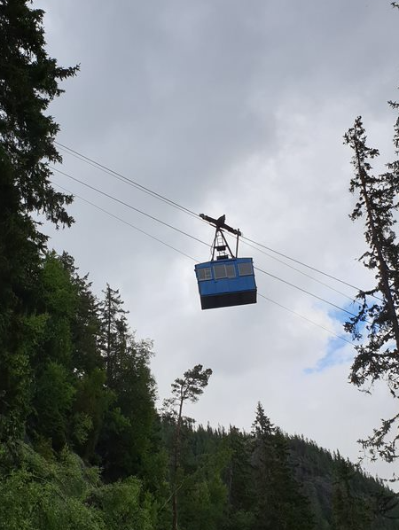
 
 
 
[discrete]
===== Taubanetype - Kodenavn: Løypestreng
*Definisjon:* Vaier spent mellom to punkter i terrenget for transport av last. Kan ha ekstra vaier/tau festet til sveiv eller motor slik at transporten ikke er avhengig av fall.    Mindre vanlig type taubane som sjelden forekommer  i forbindelse med skianlegg/turisme etc.
 
 
[discrete]
===== Taubanetype - Kodenavn: Skitrekk
*Definisjon:* Taubane til &#229; dra skil&#248;per opp bratte bakker (T-krok, sk&#229;lheiser etc.)
 
.Eksempel på registrering av taubanemast i skitrekk
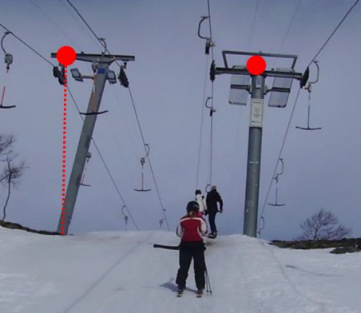
 
 
 
[discrete]
===== Taubanetype - Kodenavn: Stolheis
*Definisjon:* Taubane med stoler til persontransport. Aktuelt &#229; registrere i forbindelse med skianlegg.
 
.Eksempel på registrering av mast for stolheis
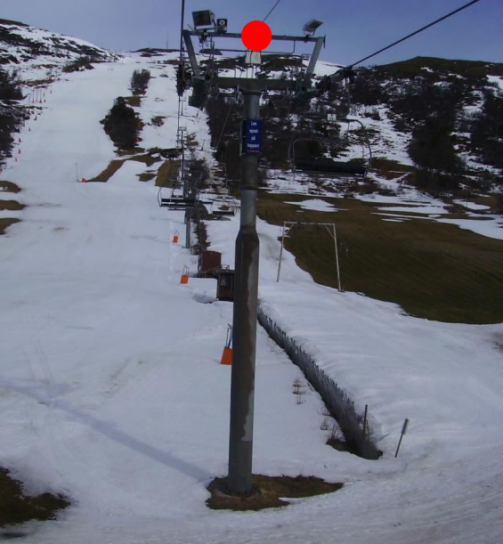
 
 
 
[discrete]
===== Taubanetype - Kodenavn: Zipline
*Definisjon:* Fastspent vaier for &#229; sende personer eller last nedover.    Vanlig i forbindelse med klatreparker etc. Zipline er vanligvis bare hengt opp i to punkter/master (ett i hver ende)
 
.Eksempel på zipline
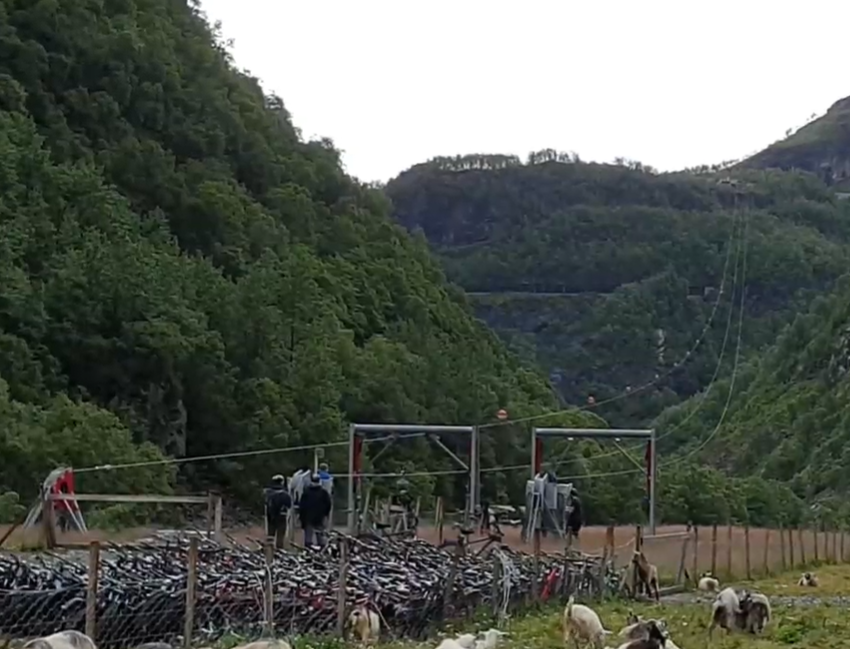
 
 
 
<<<
'''
 
[[taubanemast]]
=== Objekttype: Taubanemast
*Definisjon fra FKB produktspesifikasjon*: mast som taubanen er hengt opp i
 
 
.Illustrasjon fra produktspesifikasjon av Taubanemast
image::http://skjema.geonorge.no/SOSI/produktspesifikasjon/FKB-BygnAnlegg/5.0/figurer/objtype_taubanemast.png[link=http://skjema.geonorge.no/SOSI/produktspesifikasjon/FKB-BygnAnlegg/5.0/figurer/objtype_taubanemast.png, Alt="Illustrasjon fra produktspesifikasjon: Taubanemast"]
 
 
[discrete]
==== Tilleggsinformasjon for fotogrammetrisk registrering
Registreres som enkeltpunkter med samme geometri som punktene i kurvegeometrien til Taubane
 
 
[discrete]
==== Føringer
[cols="h,2"]
|===
|FKB grunnrissreferanse
|Senter mast
 
|FKB høydereferanse
|Topp mast
 
|FKB-A
|Påkrevd registrering
 
|FKB-B
|Påkrevd registrering
 
|FKB-C
|Påkrevd registrering
 
|FKB-D
|Påkrevd registrering
 
|===
 
 
<<<
 
[discrete]
==== Egenskapstabell for objekttype: Taubanemast
[cols="20,20,20,10", options="header"]
|===
|*Navn:* 
|*Type:* 
|*SOSI_navn:* 
|*Mult.:* 
 
|identifikasjon
|«dataType» Identifikasjon
|..IDENT
|[0..1]
 
|identifikasjon.lokalId
|CharacterString
|...LOKALID
|[1..1]
 
|identifikasjon.navnerom
|CharacterString
|...NAVNEROM
|[1..1]
 
|identifikasjon.versjonId
|CharacterString
|...VERSJONID
|[0..1]
 
|oppdateringsdato
|DateTime
|..OPPDATERINGSDATO
|[0..1]
 
|sluttdato
|DateTime
|..SLUTTDATO
|[0..1]
 
|datafangstdato
|Date
|..DATAFANGSTDATO
|[1..1]
 
|verifiseringsdato
|Date
|..VERIFISERINGSDATO
|[0..1]
 
|registreringsversjon
| «CodeList»  https://register.geonorge.no/sosi-kodelister/fkb/generell/5.0/registreringsversjon[Registreringsversjon, window = _blank]
|..REGISTRERINGSVERSJON
|[0..1]
 
|informasjon
|CharacterString
|..INFORMASJON
|[0..1]
 
|kvalitet
|«dataType» Posisjonskvalitet
|..KVALITET
|[1..1]
 
|kvalitet.datafangstmetode
| «CodeList»  https://register.geonorge.no/sosi-kodelister/fkb/generell/5.0/datafangstmetode[Datafangstmetode, window = _blank]
|...DATAFANGSTMETODE
|[1..1]
 
|kvalitet.nøyaktighet
|Integer
|...NØYAKTIGHET
|[0..1]
 
|kvalitet.synbarhet
| «CodeList»  https://register.geonorge.no/sosi-kodelister/fkb/generell/5.0/synbarhet[Synbarhet, window = _blank]
|...SYNBARHET
|[0..1]
 
|kvalitet.datafangstmetodeHøyde
| «CodeList»  https://register.geonorge.no/sosi-kodelister/fkb/generell/5.0/datafangstmetode[Datafangstmetode, window = _blank]
|...DATAFANGSTMETODEHØYDE
|[0..1]
 
|kvalitet.nøyaktighetHøyde
|Integer
|...H-NØYAKTIGHET
|[0..1]
 
|nrlpeker
|URI
|..NRLPEKER
|[0..1]
 
|posisjon
|GM_Point
|.PUNKT
|[1..1]
 
|høydereferanse
| «CodeList»  https://register.geonorge.no/sosi-kodelister/fkb/generell/5.0/hoydereferanse[Høydereferanse, window = _blank]
|..HREF
|[1..1]
 
|linjebredde
|Real
|..LINJEBREDDE
|[0..1]
 
|===
 
<<<
'''
 
[[tribune]]
=== Objekttype: Tribune
*Definisjon fra FKB produktspesifikasjon*: opparbeidet anlegg av metall- stein- mur eller tre for betjening av publikum på kulturarenaer, særlig idrettsanlegg
Merknad: Tribune som er innredet for bruk, f.eks. som kontor eller butikk, vil være en bygningsenhet.
 
 
.Illustrasjon fra produktspesifikasjon av Tribune
image::http://skjema.geonorge.no/SOSI/produktspesifikasjon/FKB-BygnAnlegg/5.0/figurer/objtype_tribune.png[link=http://skjema.geonorge.no/SOSI/produktspesifikasjon/FKB-BygnAnlegg/5.0/figurer/objtype_tribune.png, Alt="Illustrasjon fra produktspesifikasjon: Tribune"]
 
 
[discrete]
==== Tilleggsinformasjon for fotogrammetrisk registrering
Tribune omfatter opparbeidede anlegg av metall, stein, betong, mur eller tre for betjening av publikum p&#229; kulturarenaer, s&#230;rlig idrettsanlegg. 

Tak over tribunen skal registreres som Takoverbygg.
 
 
'''
.Eksempel på amfi skal registreres som Tribune
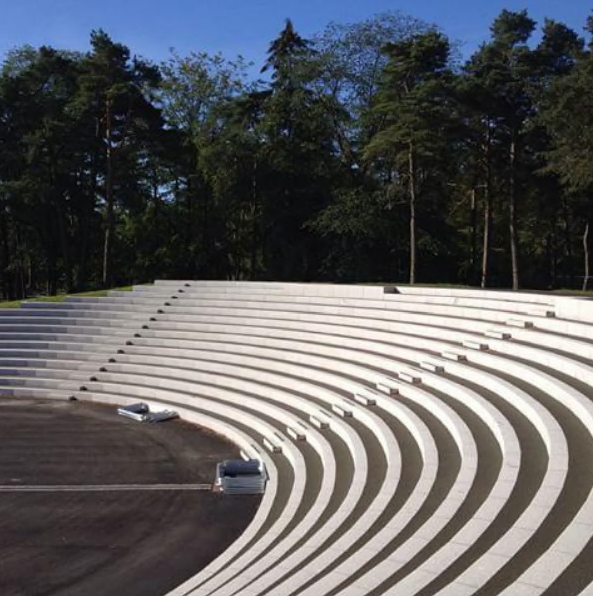
 
 
 
[discrete]
==== Føringer
[cols="h,2"]
|===
|FKB grunnrissreferanse
|Ytterkant av tribune
 
|FKB høydereferanse
|Topp Ytterkant. Knekklinjer og sprang større enn 0,5m registreres
 
|FKB-A
|Påkrevd registrering
 
|FKB-B
|Påkrevd registrering
 
|FKB-C
|Påkrevd registrering
 
|FKB-D
|Påkrevd registrering
 
|===
 
 
<<<
 
[discrete]
==== Egenskapstabell for objekttype: Tribune
[cols="20,20,20,10", options="header"]
|===
|*Navn:* 
|*Type:* 
|*SOSI_navn:* 
|*Mult.:* 
 
|identifikasjon
|«dataType» Identifikasjon
|..IDENT
|[0..1]
 
|identifikasjon.lokalId
|CharacterString
|...LOKALID
|[1..1]
 
|identifikasjon.navnerom
|CharacterString
|...NAVNEROM
|[1..1]
 
|identifikasjon.versjonId
|CharacterString
|...VERSJONID
|[0..1]
 
|oppdateringsdato
|DateTime
|..OPPDATERINGSDATO
|[0..1]
 
|sluttdato
|DateTime
|..SLUTTDATO
|[0..1]
 
|datafangstdato
|Date
|..DATAFANGSTDATO
|[1..1]
 
|verifiseringsdato
|Date
|..VERIFISERINGSDATO
|[0..1]
 
|registreringsversjon
| «CodeList»  https://register.geonorge.no/sosi-kodelister/fkb/generell/5.0/registreringsversjon[Registreringsversjon, window = _blank]
|..REGISTRERINGSVERSJON
|[0..1]
 
|informasjon
|CharacterString
|..INFORMASJON
|[0..1]
 
|kvalitet
|«dataType» Posisjonskvalitet
|..KVALITET
|[1..1]
 
|kvalitet.datafangstmetode
| «CodeList»  https://register.geonorge.no/sosi-kodelister/fkb/generell/5.0/datafangstmetode[Datafangstmetode, window = _blank]
|...DATAFANGSTMETODE
|[1..1]
 
|kvalitet.nøyaktighet
|Integer
|...NØYAKTIGHET
|[0..1]
 
|kvalitet.synbarhet
| «CodeList»  https://register.geonorge.no/sosi-kodelister/fkb/generell/5.0/synbarhet[Synbarhet, window = _blank]
|...SYNBARHET
|[0..1]
 
|kvalitet.datafangstmetodeHøyde
| «CodeList»  https://register.geonorge.no/sosi-kodelister/fkb/generell/5.0/datafangstmetode[Datafangstmetode, window = _blank]
|...DATAFANGSTMETODEHØYDE
|[0..1]
 
|kvalitet.nøyaktighetHøyde
|Integer
|...H-NØYAKTIGHET
|[0..1]
 
|område
|GM_Surface
|.FLATE
|[1..1]
 
|===
 
<<<
'''
 
[[beskrivendehjelpelinjeanlegg]]
=== Objekttype: BeskrivendeHjelpelinjeAnlegg
*Definisjon fra FKB produktspesifikasjon*: karakteristiske linjer p&#229; bygningsmessige- og tekniske anlegg

Merknad:
Kan ogs&#229; benyttes til &#229; registrere mindre selvstendige bygningsmessige anlegg som ikke omfattes av andre objekttyper i FKB, men som det er naturlig &#229; registrere i et detaljert grunnkart. 

Eksempler: 
Markerte linjer p&#229; en demning, molo, sluse, pipe, t&#229;rn, murloddrett og sm&#229; frittst&#229;ende anlegg som f.eks. skilderhus, kiosker etc.
 
 
[discrete]
==== Tilleggsinformasjon for fotogrammetrisk registrering
Benyttes kun for tilleggsbeskrivelse av &#248;vrige objekttyper i FKB-BygnAnlegg. Eksempel p&#229; bruk er markerte linjer p&#229; en demning og tak over gj&#248;dselkum.

Prinsipp for registrering av h&#248;ydesprang angitt under Skjerm gjelder ogs&#229; for BeskrivendehjelpelinjeAnlegg
 
 
'''
.Viser eksempel på bruk av BeskrivendeHjelpelinjeAnlegg (røde streker) til registrering av fortøyningsanlegg. Konstruksjonen vist med oransje strek skal også registreres i FKB-BygnAnlegg, f.eks. ved bruk av objekttype Fundament eller alternativt Murloddrett.
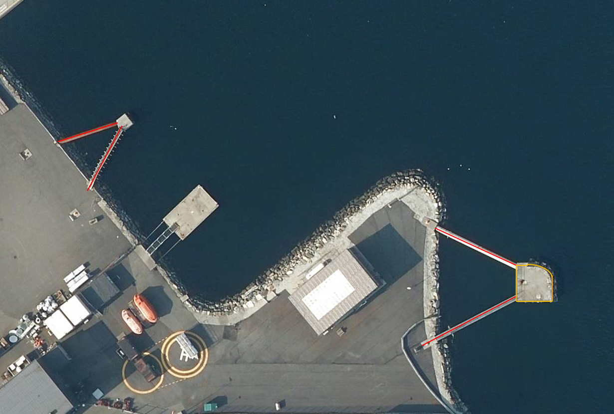
 
 
 
[discrete]
==== Føringer
[cols="h,2"]
|===
|FKB grunnrissreferanse
|Ytterkant/senter
 
|FKB høydereferanse
|Topp/terrengnivå (angis med høydereferanse)
 
|FKB-A
|Påkrevd registrering
 
|FKB-B
|Påkrevd registrering
 
|FKB-C
|Påkrevd registrering
 
|FKB-D
|Påkrevd registrering
 
|===
 
 
<<<
 
[discrete]
==== Egenskapstabell for objekttype: BeskrivendeHjelpelinjeAnlegg
[cols="20,20,20,10", options="header"]
|===
|*Navn:* 
|*Type:* 
|*SOSI_navn:* 
|*Mult.:* 
 
|identifikasjon
|«dataType» Identifikasjon
|..IDENT
|[0..1]
 
|identifikasjon.lokalId
|CharacterString
|...LOKALID
|[1..1]
 
|identifikasjon.navnerom
|CharacterString
|...NAVNEROM
|[1..1]
 
|identifikasjon.versjonId
|CharacterString
|...VERSJONID
|[0..1]
 
|oppdateringsdato
|DateTime
|..OPPDATERINGSDATO
|[0..1]
 
|sluttdato
|DateTime
|..SLUTTDATO
|[0..1]
 
|datafangstdato
|Date
|..DATAFANGSTDATO
|[1..1]
 
|verifiseringsdato
|Date
|..VERIFISERINGSDATO
|[0..1]
 
|registreringsversjon
| «CodeList»  https://register.geonorge.no/sosi-kodelister/fkb/generell/5.0/registreringsversjon[Registreringsversjon, window = _blank]
|..REGISTRERINGSVERSJON
|[0..1]
 
|informasjon
|CharacterString
|..INFORMASJON
|[0..1]
 
|kvalitet
|«dataType» Posisjonskvalitet
|..KVALITET
|[1..1]
 
|kvalitet.datafangstmetode
| «CodeList»  https://register.geonorge.no/sosi-kodelister/fkb/generell/5.0/datafangstmetode[Datafangstmetode, window = _blank]
|...DATAFANGSTMETODE
|[1..1]
 
|kvalitet.nøyaktighet
|Integer
|...NØYAKTIGHET
|[0..1]
 
|kvalitet.synbarhet
| «CodeList»  https://register.geonorge.no/sosi-kodelister/fkb/generell/5.0/synbarhet[Synbarhet, window = _blank]
|...SYNBARHET
|[0..1]
 
|kvalitet.datafangstmetodeHøyde
| «CodeList»  https://register.geonorge.no/sosi-kodelister/fkb/generell/5.0/datafangstmetode[Datafangstmetode, window = _blank]
|...DATAFANGSTMETODEHØYDE
|[0..1]
 
|kvalitet.nøyaktighetHøyde
|Integer
|...H-NØYAKTIGHET
|[0..1]
 
|senterlinje
|GM_Curve
|.KURVE
|[1..1]
 
|høydereferanse
| «CodeList»  https://register.geonorge.no/sosi-kodelister/fkb/generell/5.0/hoydereferanse[Høydereferanse, window = _blank]
|..HREF
|[1..1]
 
|medium
| «CodeList»  https://register.geonorge.no/sosi-kodelister/fkb/generell/5.0/medium[Medium, window = _blank]
|..MEDIUM
|[1..1]
 
|===
[discrete]
==== Restriksjoner
[cols="20,80", options="header"]
 
|===
|*Navn:* 
|*Beskrivelse:* 
 
|medium
|MEDIUM B benyttes for linjer som ligger p&#229; bygningsmessige anlegg og MEDIUM L for objekter som ikke ligger p&#229; terreng
 
|===
 
<<<
'''
 
[[demning]]
=== Objekttype: Demning
*Definisjon fra FKB produktspesifikasjon*: konstruksjon for å heve vannspeilet og danne et kunstig vannmagasin, samt regulere vannføringen
 
 
.Illustrasjon fra produktspesifikasjon av Demning
image::http://skjema.geonorge.no/SOSI/produktspesifikasjon/FKB-BygnAnlegg/5.0/figurer/objtype_demning.png[link=http://skjema.geonorge.no/SOSI/produktspesifikasjon/FKB-BygnAnlegg/5.0/figurer/objtype_demning.png, Alt="Illustrasjon fra produktspesifikasjon: Demning"]
 
 
[discrete]
==== Tilleggsinformasjon for fotogrammetrisk registrering
Demning omfatter oppbygde hindringer som skal sikre jevn vannf&#248;ring til vannforsyningsanlegg eller kraftverk, eller som skal skape grunnlag for fiskeoppdrett. 

Beskrivende linjer inne p&#229; damanlegget skal registreres som BeskrivendeHjelpelinjeAnlegg. Topp av dam registreres som BeskrivendeHjelpelinjeAnlegg. Det er viktig &#229; f&#229; registrert st&#248;rste h&#248;yde p&#229; dammen med tanke p&#229; vannstanden ved flom.
 
 
'''
.Skisse som viser høydereferanse for registrering av demning. Demningens avgrensning registreres som de røde objektene. Toppen av Demning registreres med BeskrivendeHjelpelinjeAnlegg
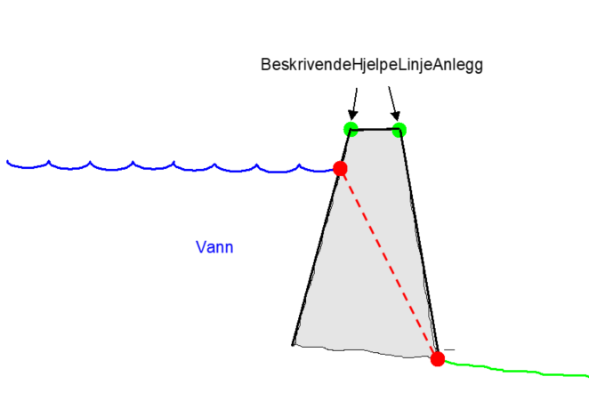
 
 
'''
.Eksempel på registrering av Demning. Rød linje angir avgrensning av Demning, mens grønn linje angir BeskrivendeHjelpelinjeAnlegg.
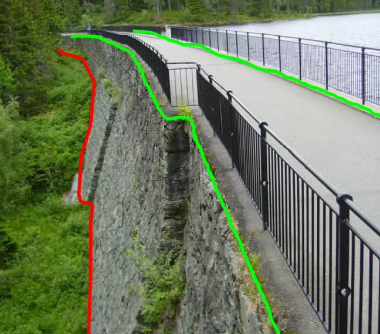
 
 
 
[discrete]
==== Føringer
[cols="h,2"]
|===
|FKB grunnrissreferanse
|Ytterkant dam. Følger terrenget og høyeste tillatte reguleringsvannstand
 
|FKB høydereferanse
|Ytterkant dam. Følger terrenget og høyeste tillatte reguleringsvannstand
 
|FKB-A
|Påkrevd registrering
 
|FKB-B
|Påkrevd registrering
 
|FKB-C
|Påkrevd registrering
 
|FKB-D
|Påkrevd registrering
 
|===
 
 
<<<
 
[discrete]
==== Egenskapstabell for objekttype: Demning
[cols="20,20,20,10", options="header"]
|===
|*Navn:* 
|*Type:* 
|*SOSI_navn:* 
|*Mult.:* 
 
|identifikasjon
|«dataType» Identifikasjon
|..IDENT
|[0..1]
 
|identifikasjon.lokalId
|CharacterString
|...LOKALID
|[1..1]
 
|identifikasjon.navnerom
|CharacterString
|...NAVNEROM
|[1..1]
 
|identifikasjon.versjonId
|CharacterString
|...VERSJONID
|[0..1]
 
|oppdateringsdato
|DateTime
|..OPPDATERINGSDATO
|[0..1]
 
|sluttdato
|DateTime
|..SLUTTDATO
|[0..1]
 
|datafangstdato
|Date
|..DATAFANGSTDATO
|[1..1]
 
|verifiseringsdato
|Date
|..VERIFISERINGSDATO
|[0..1]
 
|registreringsversjon
| «CodeList»  https://register.geonorge.no/sosi-kodelister/fkb/generell/5.0/registreringsversjon[Registreringsversjon, window = _blank]
|..REGISTRERINGSVERSJON
|[0..1]
 
|informasjon
|CharacterString
|..INFORMASJON
|[0..1]
 
|kvalitet
|«dataType» Posisjonskvalitet
|..KVALITET
|[1..1]
 
|kvalitet.datafangstmetode
| «CodeList»  https://register.geonorge.no/sosi-kodelister/fkb/generell/5.0/datafangstmetode[Datafangstmetode, window = _blank]
|...DATAFANGSTMETODE
|[1..1]
 
|kvalitet.nøyaktighet
|Integer
|...NØYAKTIGHET
|[0..1]
 
|kvalitet.synbarhet
| «CodeList»  https://register.geonorge.no/sosi-kodelister/fkb/generell/5.0/synbarhet[Synbarhet, window = _blank]
|...SYNBARHET
|[0..1]
 
|kvalitet.datafangstmetodeHøyde
| «CodeList»  https://register.geonorge.no/sosi-kodelister/fkb/generell/5.0/datafangstmetode[Datafangstmetode, window = _blank]
|...DATAFANGSTMETODEHØYDE
|[0..1]
 
|kvalitet.nøyaktighetHøyde
|Integer
|...H-NØYAKTIGHET
|[0..1]
 
|område
|GM_Surface
|.FLATE
|[1..1]
 
|===
 
<<<
'''
 
[[elveforbygning]]
=== Objekttype: Elveforbygning
*Definisjon fra FKB produktspesifikasjon*: konstruksjon i eller langs vassdrag for å sikre mot erosjon, flom eller som miljøtiltak
 
 
.Illustrasjon fra produktspesifikasjon av Elveforbygning
image::http://skjema.geonorge.no/SOSI/produktspesifikasjon/FKB-BygnAnlegg/5.0/figurer/objtype_elveforbygning.png[link=http://skjema.geonorge.no/SOSI/produktspesifikasjon/FKB-BygnAnlegg/5.0/figurer/objtype_elveforbygning.png, Alt="Illustrasjon fra produktspesifikasjon: Elveforbygning"]
 
 
[discrete]
==== Tilleggsinformasjon for fotogrammetrisk registrering
Omfatter oppbygde hindringer som skal hindre elven i &#229; flomme ut over sine bredder.

Topp av elveforbygning registreres som 
BeskrivendeHjelpelinjeAnlegg. Det er viktig &#229; f&#229; registrert st&#248;rste h&#248;yde p&#229; elveforbygningen med tanke p&#229; vannstanden ved flom.

 
 
[discrete]
==== Føringer
[cols="h,2"]
|===
|FKB grunnrissreferanse
|Ytterkant elveforbygning mot terreng
 
|FKB høydereferanse
|Ytterkant elveforbygning mot terreng
 
|FKB-A minstestørrelse
|Høyde større enn 1m
 
|FKB-A
|Påkrevd registrering
 
|FKB-B
|Påkrevd registrering
 
|FKB-C
|Påkrevd registrering
 
|FKB-D
|Påkrevd registrering
 
|===
 
 
<<<
 
[discrete]
==== Egenskapstabell for objekttype: Elveforbygning
[cols="20,20,20,10", options="header"]
|===
|*Navn:* 
|*Type:* 
|*SOSI_navn:* 
|*Mult.:* 
 
|identifikasjon
|«dataType» Identifikasjon
|..IDENT
|[0..1]
 
|identifikasjon.lokalId
|CharacterString
|...LOKALID
|[1..1]
 
|identifikasjon.navnerom
|CharacterString
|...NAVNEROM
|[1..1]
 
|identifikasjon.versjonId
|CharacterString
|...VERSJONID
|[0..1]
 
|oppdateringsdato
|DateTime
|..OPPDATERINGSDATO
|[0..1]
 
|sluttdato
|DateTime
|..SLUTTDATO
|[0..1]
 
|datafangstdato
|Date
|..DATAFANGSTDATO
|[1..1]
 
|verifiseringsdato
|Date
|..VERIFISERINGSDATO
|[0..1]
 
|registreringsversjon
| «CodeList»  https://register.geonorge.no/sosi-kodelister/fkb/generell/5.0/registreringsversjon[Registreringsversjon, window = _blank]
|..REGISTRERINGSVERSJON
|[0..1]
 
|informasjon
|CharacterString
|..INFORMASJON
|[0..1]
 
|kvalitet
|«dataType» Posisjonskvalitet
|..KVALITET
|[1..1]
 
|kvalitet.datafangstmetode
| «CodeList»  https://register.geonorge.no/sosi-kodelister/fkb/generell/5.0/datafangstmetode[Datafangstmetode, window = _blank]
|...DATAFANGSTMETODE
|[1..1]
 
|kvalitet.nøyaktighet
|Integer
|...NØYAKTIGHET
|[0..1]
 
|kvalitet.synbarhet
| «CodeList»  https://register.geonorge.no/sosi-kodelister/fkb/generell/5.0/synbarhet[Synbarhet, window = _blank]
|...SYNBARHET
|[0..1]
 
|kvalitet.datafangstmetodeHøyde
| «CodeList»  https://register.geonorge.no/sosi-kodelister/fkb/generell/5.0/datafangstmetode[Datafangstmetode, window = _blank]
|...DATAFANGSTMETODEHØYDE
|[0..1]
 
|kvalitet.nøyaktighetHøyde
|Integer
|...H-NØYAKTIGHET
|[0..1]
 
|område
|GM_Surface
|.FLATE
|[1..1]
 
|===
 
<<<
'''
 
[[elveterskel]]
=== Objekttype: Elveterskel
*Definisjon fra FKB produktspesifikasjon*: kunstig oppbygning i elver som brukes for å lage vannspeil i elveløpet
 
 
.Illustrasjon fra produktspesifikasjon av Elveterskel
image::http://skjema.geonorge.no/SOSI/produktspesifikasjon/FKB-BygnAnlegg/5.0/figurer/objtype_elveterskel.png[link=http://skjema.geonorge.no/SOSI/produktspesifikasjon/FKB-BygnAnlegg/5.0/figurer/objtype_elveterskel.png, Alt="Illustrasjon fra produktspesifikasjon: Elveterskel"]
 
 
 
[discrete]
==== Føringer
[cols="h,2"]
|===
|FKB grunnrissreferanse
|Ytterkant av elveterskel
 
|FKB høydereferanse
|Vannspeil
 
|FKB-A
|Påkrevd registrering
 
|FKB-B
|Påkrevd registrering
 
|FKB-C
|Påkrevd registrering
 
|FKB-D
|Påkrevd registrering
 
|===
 
 
<<<
 
[discrete]
==== Egenskapstabell for objekttype: Elveterskel
[cols="20,20,20,10", options="header"]
|===
|*Navn:* 
|*Type:* 
|*SOSI_navn:* 
|*Mult.:* 
 
|identifikasjon
|«dataType» Identifikasjon
|..IDENT
|[0..1]
 
|identifikasjon.lokalId
|CharacterString
|...LOKALID
|[1..1]
 
|identifikasjon.navnerom
|CharacterString
|...NAVNEROM
|[1..1]
 
|identifikasjon.versjonId
|CharacterString
|...VERSJONID
|[0..1]
 
|oppdateringsdato
|DateTime
|..OPPDATERINGSDATO
|[0..1]
 
|sluttdato
|DateTime
|..SLUTTDATO
|[0..1]
 
|datafangstdato
|Date
|..DATAFANGSTDATO
|[1..1]
 
|verifiseringsdato
|Date
|..VERIFISERINGSDATO
|[0..1]
 
|registreringsversjon
| «CodeList»  https://register.geonorge.no/sosi-kodelister/fkb/generell/5.0/registreringsversjon[Registreringsversjon, window = _blank]
|..REGISTRERINGSVERSJON
|[0..1]
 
|informasjon
|CharacterString
|..INFORMASJON
|[0..1]
 
|kvalitet
|«dataType» Posisjonskvalitet
|..KVALITET
|[1..1]
 
|kvalitet.datafangstmetode
| «CodeList»  https://register.geonorge.no/sosi-kodelister/fkb/generell/5.0/datafangstmetode[Datafangstmetode, window = _blank]
|...DATAFANGSTMETODE
|[1..1]
 
|kvalitet.nøyaktighet
|Integer
|...NØYAKTIGHET
|[0..1]
 
|kvalitet.synbarhet
| «CodeList»  https://register.geonorge.no/sosi-kodelister/fkb/generell/5.0/synbarhet[Synbarhet, window = _blank]
|...SYNBARHET
|[0..1]
 
|kvalitet.datafangstmetodeHøyde
| «CodeList»  https://register.geonorge.no/sosi-kodelister/fkb/generell/5.0/datafangstmetode[Datafangstmetode, window = _blank]
|...DATAFANGSTMETODEHØYDE
|[0..1]
 
|kvalitet.nøyaktighetHøyde
|Integer
|...H-NØYAKTIGHET
|[0..1]
 
|område
|GM_Surface
|.FLATE
|[1..1]
 
|===
 
<<<
'''
 
[[fiktivavgrensningforanlegg]]
=== Objekttype: FiktivAvgrensningForAnlegg
*Definisjon fra FKB produktspesifikasjon*: fiktiv avgrensningslinje for anlegg
Merknad: Brukes når det skal dannes flater av bygningsmessige- og tekniske anlegg og det mangler en eller flere avgrensingslinjer.
 
 
[discrete]
==== Tilleggsinformasjon for fotogrammetrisk registrering
FiktivAvgrensningForAnlegg er med p&#229; &#229; danne flate for Kai. 
 
 
[discrete]
==== Føringer
[cols="h,2"]
|===
|FKB grunnrissreferanse
|Der man kan anta at Kai går over til noe annet (terreng/veg/bygning etc.)
 
|FKB høydereferanse
|Terrenget
 
|FKB-A
|Påkrevd registrering
 
|FKB-B
|Påkrevd registrering
 
|FKB-C
|Påkrevd registrering
 
|FKB-D
|Påkrevd registrering
 
|===
 
 
<<<
 
[discrete]
==== Egenskapstabell for objekttype: FiktivAvgrensningForAnlegg
[cols="20,20,20,10", options="header"]
|===
|*Navn:* 
|*Type:* 
|*SOSI_navn:* 
|*Mult.:* 
 
|identifikasjon
|«dataType» Identifikasjon
|..IDENT
|[0..1]
 
|identifikasjon.lokalId
|CharacterString
|...LOKALID
|[1..1]
 
|identifikasjon.navnerom
|CharacterString
|...NAVNEROM
|[1..1]
 
|identifikasjon.versjonId
|CharacterString
|...VERSJONID
|[0..1]
 
|oppdateringsdato
|DateTime
|..OPPDATERINGSDATO
|[0..1]
 
|sluttdato
|DateTime
|..SLUTTDATO
|[0..1]
 
|datafangstdato
|Date
|..DATAFANGSTDATO
|[1..1]
 
|verifiseringsdato
|Date
|..VERIFISERINGSDATO
|[0..1]
 
|registreringsversjon
| «CodeList»  https://register.geonorge.no/sosi-kodelister/fkb/generell/5.0/registreringsversjon[Registreringsversjon, window = _blank]
|..REGISTRERINGSVERSJON
|[0..1]
 
|informasjon
|CharacterString
|..INFORMASJON
|[0..1]
 
|grense
|GM_Curve
|.KURVE
|[1..1]
 
|===
 
<<<
'''
 
[[fiskehjell]]
=== Objekttype: Fiskehjell
*Definisjon fra FKB produktspesifikasjon*: anordning bygd opp for tørking av fisk
 
 
.Illustrasjon fra produktspesifikasjon av Fiskehjell
image::http://skjema.geonorge.no/SOSI/produktspesifikasjon/FKB-BygnAnlegg/5.0/figurer/objtype_fiskehjell.png[link=http://skjema.geonorge.no/SOSI/produktspesifikasjon/FKB-BygnAnlegg/5.0/figurer/objtype_fiskehjell.png, Alt="Illustrasjon fra produktspesifikasjon: Fiskehjell"]
 
 
 
'''
.Registrering av ytterkant av Fiskehjell med møne (HREF = FOT)
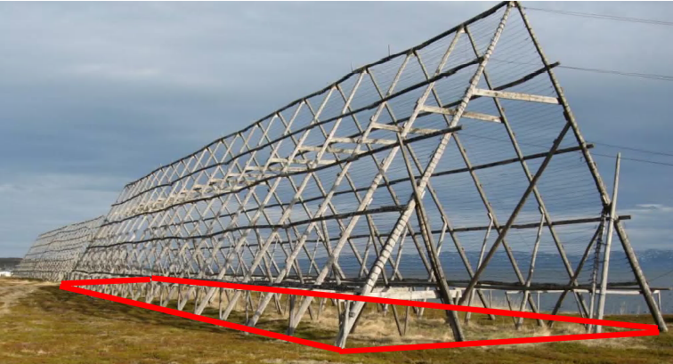
 
 
'''
.Registrering av ytterkant av Fiskehjell uten møne (HREF = TOP)
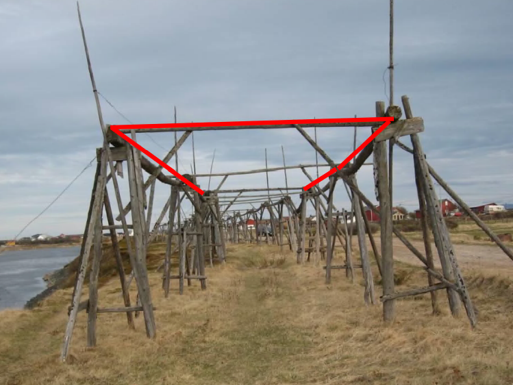
 
 
 
[discrete]
==== Føringer
[cols="h,2"]
|===
|FKB grunnrissreferanse
|Ytterkant av fiskehjell
 
|FKB høydereferanse
|Enten fot eller topp. Avhengig av type fiskehjell. Se figur.
 
|FKB-A
|Påkrevd registrering
 
|FKB-B
|Påkrevd registrering
 
|FKB-C
|Påkrevd registrering
 
|FKB-D
|Påkrevd registrering
 
|===
 
 
<<<
 
[discrete]
==== Egenskapstabell for objekttype: Fiskehjell
[cols="20,20,20,10", options="header"]
|===
|*Navn:* 
|*Type:* 
|*SOSI_navn:* 
|*Mult.:* 
 
|identifikasjon
|«dataType» Identifikasjon
|..IDENT
|[0..1]
 
|identifikasjon.lokalId
|CharacterString
|...LOKALID
|[1..1]
 
|identifikasjon.navnerom
|CharacterString
|...NAVNEROM
|[1..1]
 
|identifikasjon.versjonId
|CharacterString
|...VERSJONID
|[0..1]
 
|oppdateringsdato
|DateTime
|..OPPDATERINGSDATO
|[0..1]
 
|sluttdato
|DateTime
|..SLUTTDATO
|[0..1]
 
|datafangstdato
|Date
|..DATAFANGSTDATO
|[1..1]
 
|verifiseringsdato
|Date
|..VERIFISERINGSDATO
|[0..1]
 
|registreringsversjon
| «CodeList»  https://register.geonorge.no/sosi-kodelister/fkb/generell/5.0/registreringsversjon[Registreringsversjon, window = _blank]
|..REGISTRERINGSVERSJON
|[0..1]
 
|informasjon
|CharacterString
|..INFORMASJON
|[0..1]
 
|kvalitet
|«dataType» Posisjonskvalitet
|..KVALITET
|[1..1]
 
|kvalitet.datafangstmetode
| «CodeList»  https://register.geonorge.no/sosi-kodelister/fkb/generell/5.0/datafangstmetode[Datafangstmetode, window = _blank]
|...DATAFANGSTMETODE
|[1..1]
 
|kvalitet.nøyaktighet
|Integer
|...NØYAKTIGHET
|[0..1]
 
|kvalitet.synbarhet
| «CodeList»  https://register.geonorge.no/sosi-kodelister/fkb/generell/5.0/synbarhet[Synbarhet, window = _blank]
|...SYNBARHET
|[0..1]
 
|kvalitet.datafangstmetodeHøyde
| «CodeList»  https://register.geonorge.no/sosi-kodelister/fkb/generell/5.0/datafangstmetode[Datafangstmetode, window = _blank]
|...DATAFANGSTMETODEHØYDE
|[0..1]
 
|kvalitet.nøyaktighetHøyde
|Integer
|...H-NØYAKTIGHET
|[0..1]
 
|område
|GM_Surface
|.FLATE
|[1..1]
 
|tilhørendeMøne
|«featureType» FiskehjellMøne
|..TILHØRENDEMØNE
|[0..*]
|===
 
<<<
'''
 
[[fiskehjellmøne]]
=== Objekttype: FiskehjellMøne
*Definisjon fra FKB produktspesifikasjon*: toppen av rammeverket for fiskehjell
 
 
.Illustrasjon fra produktspesifikasjon av FiskehjellMøne
image::http://skjema.geonorge.no/SOSI/produktspesifikasjon/FKB-BygnAnlegg/5.0/figurer/objtype_fiskehjellmone.png[link=http://skjema.geonorge.no/SOSI/produktspesifikasjon/FKB-BygnAnlegg/5.0/figurer/objtype_fiskehjellmone.png, Alt="Illustrasjon fra produktspesifikasjon: FiskehjellMøne"]
 
 
 
[discrete]
==== Føringer
[cols="h,2"]
|===
|FKB grunnrissreferanse
|Topp møne
 
|FKB høydereferanse
|Topp mønelinje. Knekklinjer og høydesprang over 0,5m registreres
 
|FKB-A
|Påkrevd registrering
 
|FKB-B
|Påkrevd registrering
 
|FKB-C
|Påkrevd registrering
 
|FKB-D
|Påkrevd registrering
 
|===
 
 
<<<
 
[discrete]
==== Egenskapstabell for objekttype: FiskehjellMøne
[cols="20,20,20,10", options="header"]
|===
|*Navn:* 
|*Type:* 
|*SOSI_navn:* 
|*Mult.:* 
 
|identifikasjon
|«dataType» Identifikasjon
|..IDENT
|[0..1]
 
|identifikasjon.lokalId
|CharacterString
|...LOKALID
|[1..1]
 
|identifikasjon.navnerom
|CharacterString
|...NAVNEROM
|[1..1]
 
|identifikasjon.versjonId
|CharacterString
|...VERSJONID
|[0..1]
 
|oppdateringsdato
|DateTime
|..OPPDATERINGSDATO
|[0..1]
 
|sluttdato
|DateTime
|..SLUTTDATO
|[0..1]
 
|datafangstdato
|Date
|..DATAFANGSTDATO
|[1..1]
 
|verifiseringsdato
|Date
|..VERIFISERINGSDATO
|[0..1]
 
|registreringsversjon
| «CodeList»  https://register.geonorge.no/sosi-kodelister/fkb/generell/5.0/registreringsversjon[Registreringsversjon, window = _blank]
|..REGISTRERINGSVERSJON
|[0..1]
 
|informasjon
|CharacterString
|..INFORMASJON
|[0..1]
 
|kvalitet
|«dataType» Posisjonskvalitet
|..KVALITET
|[1..1]
 
|kvalitet.datafangstmetode
| «CodeList»  https://register.geonorge.no/sosi-kodelister/fkb/generell/5.0/datafangstmetode[Datafangstmetode, window = _blank]
|...DATAFANGSTMETODE
|[1..1]
 
|kvalitet.nøyaktighet
|Integer
|...NØYAKTIGHET
|[0..1]
 
|kvalitet.synbarhet
| «CodeList»  https://register.geonorge.no/sosi-kodelister/fkb/generell/5.0/synbarhet[Synbarhet, window = _blank]
|...SYNBARHET
|[0..1]
 
|kvalitet.datafangstmetodeHøyde
| «CodeList»  https://register.geonorge.no/sosi-kodelister/fkb/generell/5.0/datafangstmetode[Datafangstmetode, window = _blank]
|...DATAFANGSTMETODEHØYDE
|[0..1]
 
|kvalitet.nøyaktighetHøyde
|Integer
|...H-NØYAKTIGHET
|[0..1]
 
|senterlinje
|GM_Curve
|.KURVE
|[1..1]
 
|===
 
<<<
'''
 
[[fisketrapp]]
=== Objekttype: Fisketrapp
*Definisjon fra FKB produktspesifikasjon*: innretning i elver for at fisken kan vandre oppover elven
 
 
.Illustrasjon fra produktspesifikasjon av Fisketrapp
image::http://skjema.geonorge.no/SOSI/produktspesifikasjon/FKB-BygnAnlegg/5.0/figurer/objtype_fisketrapp.png[link=http://skjema.geonorge.no/SOSI/produktspesifikasjon/FKB-BygnAnlegg/5.0/figurer/objtype_fisketrapp.png, Alt="Illustrasjon fra produktspesifikasjon: Fisketrapp"]
 
 
 
[discrete]
==== Føringer
[cols="h,2"]
|===
|FKB grunnrissreferanse
|Ytterkant fisketrapp
 
|FKB høydereferanse
|Topp fisketrapp. Alle knekklinjer og sprang større enn 0,5m registreres
 
|FKB-A
|Påkrevd registrering
 
|FKB-B
|Påkrevd registrering
 
|FKB-C
|Påkrevd registrering
 
|FKB-D
|Påkrevd registrering
 
|===
 
 
<<<
 
[discrete]
==== Egenskapstabell for objekttype: Fisketrapp
[cols="20,20,20,10", options="header"]
|===
|*Navn:* 
|*Type:* 
|*SOSI_navn:* 
|*Mult.:* 
 
|identifikasjon
|«dataType» Identifikasjon
|..IDENT
|[0..1]
 
|identifikasjon.lokalId
|CharacterString
|...LOKALID
|[1..1]
 
|identifikasjon.navnerom
|CharacterString
|...NAVNEROM
|[1..1]
 
|identifikasjon.versjonId
|CharacterString
|...VERSJONID
|[0..1]
 
|oppdateringsdato
|DateTime
|..OPPDATERINGSDATO
|[0..1]
 
|sluttdato
|DateTime
|..SLUTTDATO
|[0..1]
 
|datafangstdato
|Date
|..DATAFANGSTDATO
|[1..1]
 
|verifiseringsdato
|Date
|..VERIFISERINGSDATO
|[0..1]
 
|registreringsversjon
| «CodeList»  https://register.geonorge.no/sosi-kodelister/fkb/generell/5.0/registreringsversjon[Registreringsversjon, window = _blank]
|..REGISTRERINGSVERSJON
|[0..1]
 
|informasjon
|CharacterString
|..INFORMASJON
|[0..1]
 
|kvalitet
|«dataType» Posisjonskvalitet
|..KVALITET
|[1..1]
 
|kvalitet.datafangstmetode
| «CodeList»  https://register.geonorge.no/sosi-kodelister/fkb/generell/5.0/datafangstmetode[Datafangstmetode, window = _blank]
|...DATAFANGSTMETODE
|[1..1]
 
|kvalitet.nøyaktighet
|Integer
|...NØYAKTIGHET
|[0..1]
 
|kvalitet.synbarhet
| «CodeList»  https://register.geonorge.no/sosi-kodelister/fkb/generell/5.0/synbarhet[Synbarhet, window = _blank]
|...SYNBARHET
|[0..1]
 
|kvalitet.datafangstmetodeHøyde
| «CodeList»  https://register.geonorge.no/sosi-kodelister/fkb/generell/5.0/datafangstmetode[Datafangstmetode, window = _blank]
|...DATAFANGSTMETODEHØYDE
|[0..1]
 
|kvalitet.nøyaktighetHøyde
|Integer
|...H-NØYAKTIGHET
|[0..1]
 
|senterlinje
|GM_Curve
|.KURVE
|[1..1]
 
|===
 
<<<
'''
 
[[flytebrygge]]
=== Objekttype: Flytebrygge
*Definisjon fra FKB produktspesifikasjon*: flytende plattform som er forankret til bunn og hvor plasseringen kan avhenge av vind og str&#248;mretning
 
 
.Illustrasjon fra produktspesifikasjon av Flytebrygge
image::http://skjema.geonorge.no/SOSI/produktspesifikasjon/FKB-BygnAnlegg/5.0/figurer/objtype_flytebrygge.png[link=http://skjema.geonorge.no/SOSI/produktspesifikasjon/FKB-BygnAnlegg/5.0/figurer/objtype_flytebrygge.png, Alt="Illustrasjon fra produktspesifikasjon: Flytebrygge"]
 
 
[discrete]
==== Tilleggsinformasjon for fotogrammetrisk registrering
Flytebrygger (i havet) ligger normalt helt ute i sj&#248;en, og skal ikke krysse eller tangere kystkonturen.
 
 
'''
.Skisse som viser registrering av Flytebrygge og FlytebryggeLandgang
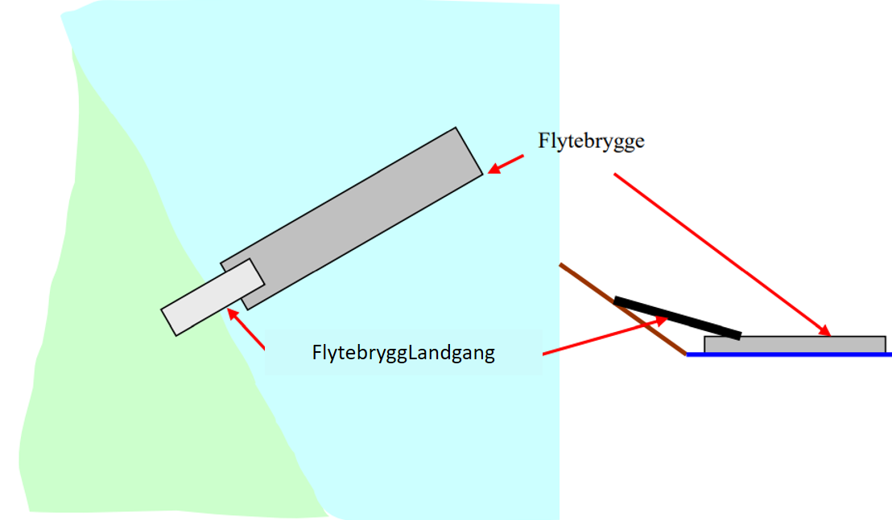
 
 
 
[discrete]
==== Føringer
[cols="h,2"]
|===
|FKB grunnrissreferanse
|Ytterkant flytebrygge
 
|FKB høydereferanse
|Topp flytebrygge. Alle knekklinjer og sprang større enn 0,5m registreres
 
|FKB-A minstestørrelse
|Flytebrygger større enn 6m2 registreres
 
|FKB-A
|Påkrevd registrering
 
|FKB-B
|Påkrevd registrering
 
|FKB-C
|Påkrevd registrering
 
|FKB-D
|Påkrevd registrering
 
|===
 
 
<<<
 
[discrete]
==== Egenskapstabell for objekttype: Flytebrygge
[cols="20,20,20,10", options="header"]
|===
|*Navn:* 
|*Type:* 
|*SOSI_navn:* 
|*Mult.:* 
 
|identifikasjon
|«dataType» Identifikasjon
|..IDENT
|[0..1]
 
|identifikasjon.lokalId
|CharacterString
|...LOKALID
|[1..1]
 
|identifikasjon.navnerom
|CharacterString
|...NAVNEROM
|[1..1]
 
|identifikasjon.versjonId
|CharacterString
|...VERSJONID
|[0..1]
 
|oppdateringsdato
|DateTime
|..OPPDATERINGSDATO
|[0..1]
 
|sluttdato
|DateTime
|..SLUTTDATO
|[0..1]
 
|datafangstdato
|Date
|..DATAFANGSTDATO
|[1..1]
 
|verifiseringsdato
|Date
|..VERIFISERINGSDATO
|[0..1]
 
|registreringsversjon
| «CodeList»  https://register.geonorge.no/sosi-kodelister/fkb/generell/5.0/registreringsversjon[Registreringsversjon, window = _blank]
|..REGISTRERINGSVERSJON
|[0..1]
 
|informasjon
|CharacterString
|..INFORMASJON
|[0..1]
 
|kvalitet
|«dataType» Posisjonskvalitet
|..KVALITET
|[1..1]
 
|kvalitet.datafangstmetode
| «CodeList»  https://register.geonorge.no/sosi-kodelister/fkb/generell/5.0/datafangstmetode[Datafangstmetode, window = _blank]
|...DATAFANGSTMETODE
|[1..1]
 
|kvalitet.nøyaktighet
|Integer
|...NØYAKTIGHET
|[0..1]
 
|kvalitet.synbarhet
| «CodeList»  https://register.geonorge.no/sosi-kodelister/fkb/generell/5.0/synbarhet[Synbarhet, window = _blank]
|...SYNBARHET
|[0..1]
 
|kvalitet.datafangstmetodeHøyde
| «CodeList»  https://register.geonorge.no/sosi-kodelister/fkb/generell/5.0/datafangstmetode[Datafangstmetode, window = _blank]
|...DATAFANGSTMETODEHØYDE
|[0..1]
 
|kvalitet.nøyaktighetHøyde
|Integer
|...H-NØYAKTIGHET
|[0..1]
 
|område
|GM_Surface
|.FLATE
|[1..1]
 
|tilhørendeUtligger
|«featureType» FlytebryggeUtligger
|..TILHØRENDEUTLIGGER
|[0..*]
|tilhørendeLandgang
|«featureType» FlytebryggeLandgang
|..TILHØRENDELANGANG
|[0..*]
|===
 
<<<
'''
 
[[flytebryggelandgang]]
=== Objekttype: FlytebryggeLandgang
*Definisjon fra FKB produktspesifikasjon*: landgang for flytebrygger
 
 
.Illustrasjon fra produktspesifikasjon av FlytebryggeLandgang
image::http://skjema.geonorge.no/SOSI/produktspesifikasjon/FKB-BygnAnlegg/5.0/figurer/objtype_flytebryggelandgang.png[link=http://skjema.geonorge.no/SOSI/produktspesifikasjon/FKB-BygnAnlegg/5.0/figurer/objtype_flytebryggelandgang.png, Alt="Illustrasjon fra produktspesifikasjon: FlytebryggeLandgang"]
 
 
 
[discrete]
==== Føringer
[cols="h,2"]
|===
|FKB grunnrissreferanse
|Ytterkant landgang
 
|FKB høydereferanse
|Gulv på landgang
 
|FKB-A minstestørrelse
|Alle landganger som er minst 2 meter lange registreres
 
|FKB-A
|Opsjonell registrering
 
|FKB-B
|Opsjonell registrering
 
|FKB-C
|Registreres ikke
 
|FKB-D
|Registreres ikke
 
|===
 
 
<<<
 
[discrete]
==== Egenskapstabell for objekttype: FlytebryggeLandgang
[cols="20,20,20,10", options="header"]
|===
|*Navn:* 
|*Type:* 
|*SOSI_navn:* 
|*Mult.:* 
 
|identifikasjon
|«dataType» Identifikasjon
|..IDENT
|[0..1]
 
|identifikasjon.lokalId
|CharacterString
|...LOKALID
|[1..1]
 
|identifikasjon.navnerom
|CharacterString
|...NAVNEROM
|[1..1]
 
|identifikasjon.versjonId
|CharacterString
|...VERSJONID
|[0..1]
 
|oppdateringsdato
|DateTime
|..OPPDATERINGSDATO
|[0..1]
 
|sluttdato
|DateTime
|..SLUTTDATO
|[0..1]
 
|datafangstdato
|Date
|..DATAFANGSTDATO
|[1..1]
 
|verifiseringsdato
|Date
|..VERIFISERINGSDATO
|[0..1]
 
|registreringsversjon
| «CodeList»  https://register.geonorge.no/sosi-kodelister/fkb/generell/5.0/registreringsversjon[Registreringsversjon, window = _blank]
|..REGISTRERINGSVERSJON
|[0..1]
 
|informasjon
|CharacterString
|..INFORMASJON
|[0..1]
 
|kvalitet
|«dataType» Posisjonskvalitet
|..KVALITET
|[1..1]
 
|kvalitet.datafangstmetode
| «CodeList»  https://register.geonorge.no/sosi-kodelister/fkb/generell/5.0/datafangstmetode[Datafangstmetode, window = _blank]
|...DATAFANGSTMETODE
|[1..1]
 
|kvalitet.nøyaktighet
|Integer
|...NØYAKTIGHET
|[0..1]
 
|kvalitet.synbarhet
| «CodeList»  https://register.geonorge.no/sosi-kodelister/fkb/generell/5.0/synbarhet[Synbarhet, window = _blank]
|...SYNBARHET
|[0..1]
 
|kvalitet.datafangstmetodeHøyde
| «CodeList»  https://register.geonorge.no/sosi-kodelister/fkb/generell/5.0/datafangstmetode[Datafangstmetode, window = _blank]
|...DATAFANGSTMETODEHØYDE
|[0..1]
 
|kvalitet.nøyaktighetHøyde
|Integer
|...H-NØYAKTIGHET
|[0..1]
 
|grense
|GM_Curve
|.KURVE
|[1..1]
 
|===
 
<<<
'''
 
[[flytebryggeutligger]]
=== Objekttype: FlytebryggeUtligger
*Definisjon fra FKB produktspesifikasjon*: Utligger for fort&#248;yning av mindre b&#229;ter som er b&#229;ter som er forankret i flytebrygge.
 
 
.Illustrasjon fra produktspesifikasjon av FlytebryggeUtligger
image::http://skjema.geonorge.no/SOSI/produktspesifikasjon/FKB-BygnAnlegg/5.0/figurer/objtype_flytebrygge_utligger.png[link=http://skjema.geonorge.no/SOSI/produktspesifikasjon/FKB-BygnAnlegg/5.0/figurer/objtype_flytebrygge_utligger.png, Alt="Illustrasjon fra produktspesifikasjon: FlytebryggeUtligger"]
 
 
 
[discrete]
==== Føringer
[cols="h,2"]
|===
|FKB grunnrissreferanse
|Senter utligger
 
|FKB høydereferanse
|Topp utligger
 
|FKB-A
|Opsjonell registrering
 
|FKB-B
|Opsjonell registrering
 
|FKB-C
|Registreres ikke
 
|FKB-D
|Registreres ikke
 
|===
 
 
<<<
 
[discrete]
==== Egenskapstabell for objekttype: FlytebryggeUtligger
[cols="20,20,20,10", options="header"]
|===
|*Navn:* 
|*Type:* 
|*SOSI_navn:* 
|*Mult.:* 
 
|identifikasjon
|«dataType» Identifikasjon
|..IDENT
|[0..1]
 
|identifikasjon.lokalId
|CharacterString
|...LOKALID
|[1..1]
 
|identifikasjon.navnerom
|CharacterString
|...NAVNEROM
|[1..1]
 
|identifikasjon.versjonId
|CharacterString
|...VERSJONID
|[0..1]
 
|oppdateringsdato
|DateTime
|..OPPDATERINGSDATO
|[0..1]
 
|sluttdato
|DateTime
|..SLUTTDATO
|[0..1]
 
|datafangstdato
|Date
|..DATAFANGSTDATO
|[1..1]
 
|verifiseringsdato
|Date
|..VERIFISERINGSDATO
|[0..1]
 
|registreringsversjon
| «CodeList»  https://register.geonorge.no/sosi-kodelister/fkb/generell/5.0/registreringsversjon[Registreringsversjon, window = _blank]
|..REGISTRERINGSVERSJON
|[0..1]
 
|informasjon
|CharacterString
|..INFORMASJON
|[0..1]
 
|kvalitet
|«dataType» Posisjonskvalitet
|..KVALITET
|[1..1]
 
|kvalitet.datafangstmetode
| «CodeList»  https://register.geonorge.no/sosi-kodelister/fkb/generell/5.0/datafangstmetode[Datafangstmetode, window = _blank]
|...DATAFANGSTMETODE
|[1..1]
 
|kvalitet.nøyaktighet
|Integer
|...NØYAKTIGHET
|[0..1]
 
|kvalitet.synbarhet
| «CodeList»  https://register.geonorge.no/sosi-kodelister/fkb/generell/5.0/synbarhet[Synbarhet, window = _blank]
|...SYNBARHET
|[0..1]
 
|kvalitet.datafangstmetodeHøyde
| «CodeList»  https://register.geonorge.no/sosi-kodelister/fkb/generell/5.0/datafangstmetode[Datafangstmetode, window = _blank]
|...DATAFANGSTMETODEHØYDE
|[0..1]
 
|kvalitet.nøyaktighetHøyde
|Integer
|...H-NØYAKTIGHET
|[0..1]
 
|senterlinje
|GM_Curve
|.KURVE
|[1..1]
 
|===
 
<<<
'''
 
[[kaibrygge]]
=== Objekttype: KaiBrygge
*Definisjon fra FKB produktspesifikasjon*: platformkonstruksjon langs land eller fra land og ut i vannet, brukt som fort&#248;yningssted for st&#248;rre eller mindre fart&#248;yer. 
Merknad: KaiBrygge kan v&#230;re bygget over vann slik at vannkonturen registeres under konstruksjonen
 
 
.Illustrasjon fra produktspesifikasjon av KaiBrygge
image::http://skjema.geonorge.no/SOSI/produktspesifikasjon/FKB-BygnAnlegg/5.0/figurer/objtype_kaibrygge.png[link=http://skjema.geonorge.no/SOSI/produktspesifikasjon/FKB-BygnAnlegg/5.0/figurer/objtype_kaibrygge.png, Alt="Illustrasjon fra produktspesifikasjon: KaiBrygge"]
 
 
[discrete]
==== Tilleggsinformasjon for fotogrammetrisk registrering
KaiBrygge registreres som flate med delt geometri og avgrenses av KaiBryggeKant og FiktivavgrensningsForAnlegg.

For tekniske konstruksjoner langs vann som ikke er beregnet for &#229; legge til med b&#229;t registreres ikke KaiBrygge. Andre typer objekter (molo, mur, trapp, vegkant etc.) i FKB benyttes i stedet dersom objektet omfattes av definisjonen for disse. 

Kaier blir ogs&#229; registrert i Havnedata. Det kan v&#230;re aktuelt &#229; levere manus for fotogrammetrisk konstruksjon/ajourhold av Kai/Kaifront i FKB-BygnAnlegg basert p&#229; datainnholdet i Havnedata. 
 
 
'''
.Eksempel på registrering av KaiBryggekant (rød helstrek), FiktivAvgrensningForAnlegg (rød stiplet), MurLoddrett (blått), AnnetGjerde (gult), Trapp (grønt).
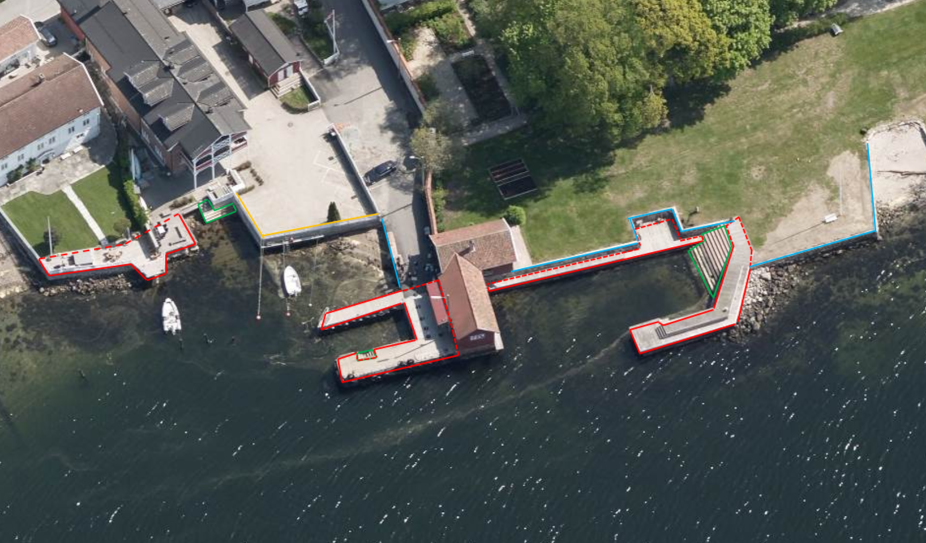
 
 
 
[discrete]
==== Føringer
[cols="h,2"]
|===
|FKB grunnrissreferanse
|Se avgrensningsobjekter
 
|FKB høydereferanse
|Se avgrensningsobjekter
 
|FKB-A minstestørrelse
|Større enn 15m2
 
|FKB-A
|Påkrevd registrering
 
|FKB-B
|Påkrevd registrering
 
|FKB-C
|Påkrevd registrering
 
|FKB-D
|Påkrevd registrering
 
|===
 
 
<<<
 
[discrete]
==== Egenskapstabell for objekttype: KaiBrygge
[cols="20,20,20,10", options="header"]
|===
|*Navn:* 
|*Type:* 
|*SOSI_navn:* 
|*Mult.:* 
 
|identifikasjon
|«dataType» Identifikasjon
|..IDENT
|[0..1]
 
|identifikasjon.lokalId
|CharacterString
|...LOKALID
|[1..1]
 
|identifikasjon.navnerom
|CharacterString
|...NAVNEROM
|[1..1]
 
|identifikasjon.versjonId
|CharacterString
|...VERSJONID
|[0..1]
 
|oppdateringsdato
|DateTime
|..OPPDATERINGSDATO
|[0..1]
 
|sluttdato
|DateTime
|..SLUTTDATO
|[0..1]
 
|datafangstdato
|Date
|..DATAFANGSTDATO
|[1..1]
 
|verifiseringsdato
|Date
|..VERIFISERINGSDATO
|[0..1]
 
|registreringsversjon
| «CodeList»  https://register.geonorge.no/sosi-kodelister/fkb/generell/5.0/registreringsversjon[Registreringsversjon, window = _blank]
|..REGISTRERINGSVERSJON
|[0..1]
 
|informasjon
|CharacterString
|..INFORMASJON
|[0..1]
 
|område
|GM_Surface
|.FLATE
|[1..1]
 
|havnedatapeker
|URI
|..HAVNEDATAPEKER
|[0..1]
 
|===
 
<<<
'''
 
[[kaibryggekant]]
=== Objekttype: KaiBryggeKant
*Definisjon fra FKB produktspesifikasjon*: avgrensning av kai mot vann.
 
 
.Illustrasjon fra produktspesifikasjon av KaiBryggeKant
image::http://skjema.geonorge.no/SOSI/produktspesifikasjon/FKB-BygnAnlegg/5.0/figurer/objtype_kaibryggekant.png[link=http://skjema.geonorge.no/SOSI/produktspesifikasjon/FKB-BygnAnlegg/5.0/figurer/objtype_kaibryggekant.png, Alt="Illustrasjon fra produktspesifikasjon: KaiBryggeKant"]
 
 
[discrete]
==== Tilleggsinformasjon for fotogrammetrisk registrering
Kaifront registreres for der Kai grenser mot vann.

Kaifront registreres ogs&#229; i Havnedata. Der er det et krav om at hvert objekt kun skal omfatte en "b&#229;tplass". Dersom dette kravet skal gjelde ogs&#229; ved konstruksjon av FKB-BygnAnlegg m&#229; det leveres manus for oppdeling da dette ikke n&#248;dvendigvis er lett &#229; tolke fra flybilder.
 
 
[discrete]
==== Føringer
[cols="h,2"]
|===
|FKB grunnrissreferanse
|Ytterkant Kai (sammenfallende med KystkonturTekniskeAnlegg)
 
|FKB høydereferanse
|Topp Kai. Knekklinjer og sprang over 0,5m registreres
 
|FKB-A
|Påkrevd registrering
 
|FKB-B
|Påkrevd registrering
 
|FKB-C
|Påkrevd registrering
 
|FKB-D
|Påkrevd registrering
 
|===
 
 
<<<
 
[discrete]
==== Egenskapstabell for objekttype: KaiBryggeKant
[cols="20,20,20,10", options="header"]
|===
|*Navn:* 
|*Type:* 
|*SOSI_navn:* 
|*Mult.:* 
 
|identifikasjon
|«dataType» Identifikasjon
|..IDENT
|[0..1]
 
|identifikasjon.lokalId
|CharacterString
|...LOKALID
|[1..1]
 
|identifikasjon.navnerom
|CharacterString
|...NAVNEROM
|[1..1]
 
|identifikasjon.versjonId
|CharacterString
|...VERSJONID
|[0..1]
 
|oppdateringsdato
|DateTime
|..OPPDATERINGSDATO
|[0..1]
 
|sluttdato
|DateTime
|..SLUTTDATO
|[0..1]
 
|datafangstdato
|Date
|..DATAFANGSTDATO
|[1..1]
 
|verifiseringsdato
|Date
|..VERIFISERINGSDATO
|[0..1]
 
|registreringsversjon
| «CodeList»  https://register.geonorge.no/sosi-kodelister/fkb/generell/5.0/registreringsversjon[Registreringsversjon, window = _blank]
|..REGISTRERINGSVERSJON
|[0..1]
 
|informasjon
|CharacterString
|..INFORMASJON
|[0..1]
 
|kvalitet
|«dataType» Posisjonskvalitet
|..KVALITET
|[1..1]
 
|kvalitet.datafangstmetode
| «CodeList»  https://register.geonorge.no/sosi-kodelister/fkb/generell/5.0/datafangstmetode[Datafangstmetode, window = _blank]
|...DATAFANGSTMETODE
|[1..1]
 
|kvalitet.nøyaktighet
|Integer
|...NØYAKTIGHET
|[0..1]
 
|kvalitet.synbarhet
| «CodeList»  https://register.geonorge.no/sosi-kodelister/fkb/generell/5.0/synbarhet[Synbarhet, window = _blank]
|...SYNBARHET
|[0..1]
 
|kvalitet.datafangstmetodeHøyde
| «CodeList»  https://register.geonorge.no/sosi-kodelister/fkb/generell/5.0/datafangstmetode[Datafangstmetode, window = _blank]
|...DATAFANGSTMETODEHØYDE
|[0..1]
 
|kvalitet.nøyaktighetHøyde
|Integer
|...H-NØYAKTIGHET
|[0..1]
 
|grense
|GM_Curve
|.KURVE
|[1..1]
 
|===
 
<<<
'''
 
[[molo]]
=== Objekttype: Molo
*Definisjon fra FKB produktspesifikasjon*: kunstig eller naturlig oppbygning som demper eller tilintetgjør bølgebevegelser i sjøen
 
 
.Illustrasjon fra produktspesifikasjon av Molo
image::http://skjema.geonorge.no/SOSI/produktspesifikasjon/FKB-BygnAnlegg/5.0/figurer/objtype_molo.png[link=http://skjema.geonorge.no/SOSI/produktspesifikasjon/FKB-BygnAnlegg/5.0/figurer/objtype_molo.png, Alt="Illustrasjon fra produktspesifikasjon: Molo"]
 
 
[discrete]
==== Tilleggsinformasjon for fotogrammetrisk registrering
Toppen av Molo registreres med BeskrivendeHjelpelinjeAnlegg
 
 
'''
.Eksempel på registering av situasjon der Molo ligger inntil Kai
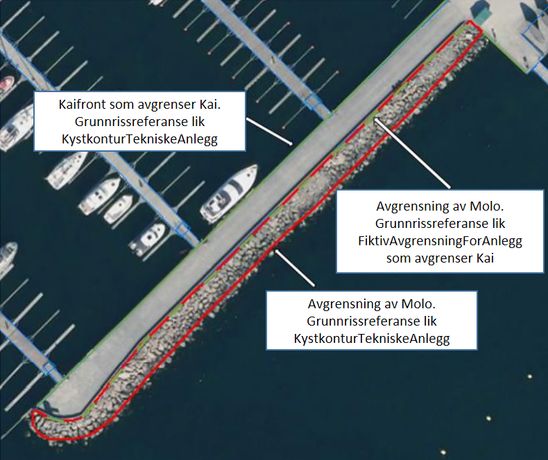
 
 
 
[discrete]
==== Føringer
[cols="h,2"]
|===
|FKB grunnrissreferanse
|Ytterkant molo ved vannets referansenivå (middelhøyvannstand)
 
|FKB høydereferanse
|Ved vannets referansenivå (middelhøyvannstand)
 
|FKB-A minstestørrelse
|Moloer større enn 15m2 registreres
 
|FKB-A
|Påkrevd registrering
 
|FKB-B
|Påkrevd registrering
 
|FKB-C
|Påkrevd registrering
 
|FKB-D
|Påkrevd registrering
 
|===
 
 
<<<
 
[discrete]
==== Egenskapstabell for objekttype: Molo
[cols="20,20,20,10", options="header"]
|===
|*Navn:* 
|*Type:* 
|*SOSI_navn:* 
|*Mult.:* 
 
|identifikasjon
|«dataType» Identifikasjon
|..IDENT
|[0..1]
 
|identifikasjon.lokalId
|CharacterString
|...LOKALID
|[1..1]
 
|identifikasjon.navnerom
|CharacterString
|...NAVNEROM
|[1..1]
 
|identifikasjon.versjonId
|CharacterString
|...VERSJONID
|[0..1]
 
|oppdateringsdato
|DateTime
|..OPPDATERINGSDATO
|[0..1]
 
|sluttdato
|DateTime
|..SLUTTDATO
|[0..1]
 
|datafangstdato
|Date
|..DATAFANGSTDATO
|[1..1]
 
|verifiseringsdato
|Date
|..VERIFISERINGSDATO
|[0..1]
 
|registreringsversjon
| «CodeList»  https://register.geonorge.no/sosi-kodelister/fkb/generell/5.0/registreringsversjon[Registreringsversjon, window = _blank]
|..REGISTRERINGSVERSJON
|[0..1]
 
|informasjon
|CharacterString
|..INFORMASJON
|[0..1]
 
|kvalitet
|«dataType» Posisjonskvalitet
|..KVALITET
|[1..1]
 
|kvalitet.datafangstmetode
| «CodeList»  https://register.geonorge.no/sosi-kodelister/fkb/generell/5.0/datafangstmetode[Datafangstmetode, window = _blank]
|...DATAFANGSTMETODE
|[1..1]
 
|kvalitet.nøyaktighet
|Integer
|...NØYAKTIGHET
|[0..1]
 
|kvalitet.synbarhet
| «CodeList»  https://register.geonorge.no/sosi-kodelister/fkb/generell/5.0/synbarhet[Synbarhet, window = _blank]
|...SYNBARHET
|[0..1]
 
|kvalitet.datafangstmetodeHøyde
| «CodeList»  https://register.geonorge.no/sosi-kodelister/fkb/generell/5.0/datafangstmetode[Datafangstmetode, window = _blank]
|...DATAFANGSTMETODEHØYDE
|[0..1]
 
|kvalitet.nøyaktighetHøyde
|Integer
|...H-NØYAKTIGHET
|[0..1]
 
|område
|GM_Surface
|.FLATE
|[1..1]
 
|medium
| «CodeList»  https://register.geonorge.no/sosi-kodelister/fkb/generell/5.0/medium[Medium, window = _blank]
|..MEDIUM
|[1..1]
 
|===
 
<<<
'''
 
[[navigasjonsinstallasjon]]
=== Objekttype: Navigasjonsinstallasjon
*Definisjon fra FKB produktspesifikasjon*: objekt som hjelper sjøfarende å navigere på sjøen.
 
 
.Illustrasjon fra produktspesifikasjon av Navigasjonsinstallasjon
image::http://skjema.geonorge.no/SOSI/produktspesifikasjon/FKB-BygnAnlegg/5.0/figurer/objtype_navigasjonsinstallasjon.png[link=http://skjema.geonorge.no/SOSI/produktspesifikasjon/FKB-BygnAnlegg/5.0/figurer/objtype_navigasjonsinstallasjon.png, Alt="Illustrasjon fra produktspesifikasjon: Navigasjonsinstallasjon"]
 
 
[discrete]
==== Tilleggsinformasjon for fotogrammetrisk registrering
Marine fyr. Kun frittst&#229;ende fyrlykter registreres. St&#248;rre fyr 
registreres som bygning, med bygningstype fyr
 
 
[discrete]
==== Føringer
[cols="h,2"]
|===
|FKB grunnrissreferanse
|Senter fyrlykt/tak
 
|FKB høydereferanse
|Topp lyskilde
 
|FKB-A
|Påkrevd registrering
 
|FKB-B
|Påkrevd registrering
 
|FKB-C
|Påkrevd registrering
 
|FKB-D
|Påkrevd registrering
 
|===
 
 
<<<
 
[discrete]
==== Egenskapstabell for objekttype: Navigasjonsinstallasjon
[cols="20,20,20,10", options="header"]
|===
|*Navn:* 
|*Type:* 
|*SOSI_navn:* 
|*Mult.:* 
 
|identifikasjon
|«dataType» Identifikasjon
|..IDENT
|[0..1]
 
|identifikasjon.lokalId
|CharacterString
|...LOKALID
|[1..1]
 
|identifikasjon.navnerom
|CharacterString
|...NAVNEROM
|[1..1]
 
|identifikasjon.versjonId
|CharacterString
|...VERSJONID
|[0..1]
 
|oppdateringsdato
|DateTime
|..OPPDATERINGSDATO
|[0..1]
 
|sluttdato
|DateTime
|..SLUTTDATO
|[0..1]
 
|datafangstdato
|Date
|..DATAFANGSTDATO
|[1..1]
 
|verifiseringsdato
|Date
|..VERIFISERINGSDATO
|[0..1]
 
|registreringsversjon
| «CodeList»  https://register.geonorge.no/sosi-kodelister/fkb/generell/5.0/registreringsversjon[Registreringsversjon, window = _blank]
|..REGISTRERINGSVERSJON
|[0..1]
 
|informasjon
|CharacterString
|..INFORMASJON
|[0..1]
 
|kvalitet
|«dataType» Posisjonskvalitet
|..KVALITET
|[1..1]
 
|kvalitet.datafangstmetode
| «CodeList»  https://register.geonorge.no/sosi-kodelister/fkb/generell/5.0/datafangstmetode[Datafangstmetode, window = _blank]
|...DATAFANGSTMETODE
|[1..1]
 
|kvalitet.nøyaktighet
|Integer
|...NØYAKTIGHET
|[0..1]
 
|kvalitet.synbarhet
| «CodeList»  https://register.geonorge.no/sosi-kodelister/fkb/generell/5.0/synbarhet[Synbarhet, window = _blank]
|...SYNBARHET
|[0..1]
 
|kvalitet.datafangstmetodeHøyde
| «CodeList»  https://register.geonorge.no/sosi-kodelister/fkb/generell/5.0/datafangstmetode[Datafangstmetode, window = _blank]
|...DATAFANGSTMETODEHØYDE
|[0..1]
 
|kvalitet.nøyaktighetHøyde
|Integer
|...H-NØYAKTIGHET
|[0..1]
 
|posisjon
|GM_Point
|.PUNKT
|[1..1]
 
|===
 
<<<
'''
 
[[oppdrettskar]]
=== Objekttype: Oppdrettskar
*Definisjon fra FKB produktspesifikasjon*: kar for oppdrett av fisk
 
 
.Illustrasjon fra produktspesifikasjon av Oppdrettskar
image::http://skjema.geonorge.no/SOSI/produktspesifikasjon/FKB-BygnAnlegg/5.0/figurer/objtype_oppdrettskar.png[link=http://skjema.geonorge.no/SOSI/produktspesifikasjon/FKB-BygnAnlegg/5.0/figurer/objtype_oppdrettskar.png, Alt="Illustrasjon fra produktspesifikasjon: Oppdrettskar"]
 
 
 
[discrete]
==== Føringer
[cols="h,2"]
|===
|FKB grunnrissreferanse
|Ytterkant kar
 
|FKB høydereferanse
|Topp kar
 
|FKB-A
|Påkrevd registrering
 
|FKB-B
|Påkrevd registrering
 
|FKB-C
|Påkrevd registrering
 
|FKB-D
|Påkrevd registrering
 
|===
 
 
<<<
 
[discrete]
==== Egenskapstabell for objekttype: Oppdrettskar
[cols="20,20,20,10", options="header"]
|===
|*Navn:* 
|*Type:* 
|*SOSI_navn:* 
|*Mult.:* 
 
|identifikasjon
|«dataType» Identifikasjon
|..IDENT
|[0..1]
 
|identifikasjon.lokalId
|CharacterString
|...LOKALID
|[1..1]
 
|identifikasjon.navnerom
|CharacterString
|...NAVNEROM
|[1..1]
 
|identifikasjon.versjonId
|CharacterString
|...VERSJONID
|[0..1]
 
|oppdateringsdato
|DateTime
|..OPPDATERINGSDATO
|[0..1]
 
|sluttdato
|DateTime
|..SLUTTDATO
|[0..1]
 
|datafangstdato
|Date
|..DATAFANGSTDATO
|[1..1]
 
|verifiseringsdato
|Date
|..VERIFISERINGSDATO
|[0..1]
 
|registreringsversjon
| «CodeList»  https://register.geonorge.no/sosi-kodelister/fkb/generell/5.0/registreringsversjon[Registreringsversjon, window = _blank]
|..REGISTRERINGSVERSJON
|[0..1]
 
|informasjon
|CharacterString
|..INFORMASJON
|[0..1]
 
|kvalitet
|«dataType» Posisjonskvalitet
|..KVALITET
|[1..1]
 
|kvalitet.datafangstmetode
| «CodeList»  https://register.geonorge.no/sosi-kodelister/fkb/generell/5.0/datafangstmetode[Datafangstmetode, window = _blank]
|...DATAFANGSTMETODE
|[1..1]
 
|kvalitet.nøyaktighet
|Integer
|...NØYAKTIGHET
|[0..1]
 
|kvalitet.synbarhet
| «CodeList»  https://register.geonorge.no/sosi-kodelister/fkb/generell/5.0/synbarhet[Synbarhet, window = _blank]
|...SYNBARHET
|[0..1]
 
|kvalitet.datafangstmetodeHøyde
| «CodeList»  https://register.geonorge.no/sosi-kodelister/fkb/generell/5.0/datafangstmetode[Datafangstmetode, window = _blank]
|...DATAFANGSTMETODEHØYDE
|[0..1]
 
|kvalitet.nøyaktighetHøyde
|Integer
|...H-NØYAKTIGHET
|[0..1]
 
|grense
|GM_Curve
|.KURVE
|[1..1]
 
|høydereferanse
| «CodeList»  https://register.geonorge.no/sosi-kodelister/fkb/generell/5.0/hoydereferanse[Høydereferanse, window = _blank]
|..HREF
|[1..1]
 
|===
 
<<<
'''
 
[[oppdrettslokalitet]]
=== Objekttype: Oppdrettslokalitet
*Definisjon fra FKB produktspesifikasjon*: fast anlegg for oppdrett av fisk i vann
 
 
.Illustrasjon fra produktspesifikasjon av Oppdrettslokalitet
image::http://skjema.geonorge.no/SOSI/produktspesifikasjon/FKB-BygnAnlegg/5.0/figurer/objtype_oppdrettslokalitet.png[link=http://skjema.geonorge.no/SOSI/produktspesifikasjon/FKB-BygnAnlegg/5.0/figurer/objtype_oppdrettslokalitet.png, Alt="Illustrasjon fra produktspesifikasjon: Oppdrettslokalitet"]
 
 
[discrete]
==== Tilleggsinformasjon for fotogrammetrisk registrering
Det anbefales bruk av manus ved fotogrammetrisk registrering av oppdrettslokaliteter
 
 
[discrete]
==== Føringer
[cols="h,2"]
|===
|FKB grunnrissreferanse
|Ytterkant av de faste forankringene for oppdrettsanlegget
 
|FKB høydereferanse
|Midlere høyvannstand
 
|FKB-A
|Opsjonell registrering
 
|FKB-B
|Opsjonell registrering
 
|FKB-C
|Opsjonell registrering
 
|FKB-D
|Opsjonell registrering
 
|===
 
 
<<<
 
[discrete]
==== Egenskapstabell for objekttype: Oppdrettslokalitet
[cols="20,20,20,10", options="header"]
|===
|*Navn:* 
|*Type:* 
|*SOSI_navn:* 
|*Mult.:* 
 
|identifikasjon
|«dataType» Identifikasjon
|..IDENT
|[0..1]
 
|identifikasjon.lokalId
|CharacterString
|...LOKALID
|[1..1]
 
|identifikasjon.navnerom
|CharacterString
|...NAVNEROM
|[1..1]
 
|identifikasjon.versjonId
|CharacterString
|...VERSJONID
|[0..1]
 
|oppdateringsdato
|DateTime
|..OPPDATERINGSDATO
|[0..1]
 
|sluttdato
|DateTime
|..SLUTTDATO
|[0..1]
 
|datafangstdato
|Date
|..DATAFANGSTDATO
|[1..1]
 
|verifiseringsdato
|Date
|..VERIFISERINGSDATO
|[0..1]
 
|registreringsversjon
| «CodeList»  https://register.geonorge.no/sosi-kodelister/fkb/generell/5.0/registreringsversjon[Registreringsversjon, window = _blank]
|..REGISTRERINGSVERSJON
|[0..1]
 
|informasjon
|CharacterString
|..INFORMASJON
|[0..1]
 
|kvalitet
|«dataType» Posisjonskvalitet
|..KVALITET
|[1..1]
 
|kvalitet.datafangstmetode
| «CodeList»  https://register.geonorge.no/sosi-kodelister/fkb/generell/5.0/datafangstmetode[Datafangstmetode, window = _blank]
|...DATAFANGSTMETODE
|[1..1]
 
|kvalitet.nøyaktighet
|Integer
|...NØYAKTIGHET
|[0..1]
 
|kvalitet.synbarhet
| «CodeList»  https://register.geonorge.no/sosi-kodelister/fkb/generell/5.0/synbarhet[Synbarhet, window = _blank]
|...SYNBARHET
|[0..1]
 
|kvalitet.datafangstmetodeHøyde
| «CodeList»  https://register.geonorge.no/sosi-kodelister/fkb/generell/5.0/datafangstmetode[Datafangstmetode, window = _blank]
|...DATAFANGSTMETODEHØYDE
|[0..1]
 
|kvalitet.nøyaktighetHøyde
|Integer
|...H-NØYAKTIGHET
|[0..1]
 
|område
|GM_Surface
|.FLATE
|[1..1]
 
|eksternpeker
|URI
|..EKSTERNPEKER
|[0..1]
 
|===
 
<<<
'''
 
[[pælebunt]]
=== Objekttype: Pælebunt
*Definisjon fra FKB produktspesifikasjon*: bunt av stokker som er drevet ned i sjøbunnen, vann eller elver for å lede trafikken eller tømmer
 
 
.Illustrasjon fra produktspesifikasjon av Pælebunt
image::http://skjema.geonorge.no/SOSI/produktspesifikasjon/FKB-BygnAnlegg/5.0/figurer/objtype_palebunt.png[link=http://skjema.geonorge.no/SOSI/produktspesifikasjon/FKB-BygnAnlegg/5.0/figurer/objtype_palebunt.png, Alt="Illustrasjon fra produktspesifikasjon: Pælebunt"]
 
 
 
[discrete]
==== Føringer
[cols="h,2"]
|===
|FKB grunnrissreferanse
|Senter pælebunt
 
|FKB høydereferanse
|Topp pælebunt
 
|FKB-A
|Påkrevd registrering
 
|FKB-B
|Påkrevd registrering
 
|FKB-C
|Registreres ikke
 
|FKB-D
|Registreres ikke
 
|===
 
 
<<<
 
[discrete]
==== Egenskapstabell for objekttype: Pælebunt
[cols="20,20,20,10", options="header"]
|===
|*Navn:* 
|*Type:* 
|*SOSI_navn:* 
|*Mult.:* 
 
|identifikasjon
|«dataType» Identifikasjon
|..IDENT
|[0..1]
 
|identifikasjon.lokalId
|CharacterString
|...LOKALID
|[1..1]
 
|identifikasjon.navnerom
|CharacterString
|...NAVNEROM
|[1..1]
 
|identifikasjon.versjonId
|CharacterString
|...VERSJONID
|[0..1]
 
|oppdateringsdato
|DateTime
|..OPPDATERINGSDATO
|[0..1]
 
|sluttdato
|DateTime
|..SLUTTDATO
|[0..1]
 
|datafangstdato
|Date
|..DATAFANGSTDATO
|[1..1]
 
|verifiseringsdato
|Date
|..VERIFISERINGSDATO
|[0..1]
 
|registreringsversjon
| «CodeList»  https://register.geonorge.no/sosi-kodelister/fkb/generell/5.0/registreringsversjon[Registreringsversjon, window = _blank]
|..REGISTRERINGSVERSJON
|[0..1]
 
|informasjon
|CharacterString
|..INFORMASJON
|[0..1]
 
|kvalitet
|«dataType» Posisjonskvalitet
|..KVALITET
|[1..1]
 
|kvalitet.datafangstmetode
| «CodeList»  https://register.geonorge.no/sosi-kodelister/fkb/generell/5.0/datafangstmetode[Datafangstmetode, window = _blank]
|...DATAFANGSTMETODE
|[1..1]
 
|kvalitet.nøyaktighet
|Integer
|...NØYAKTIGHET
|[0..1]
 
|kvalitet.synbarhet
| «CodeList»  https://register.geonorge.no/sosi-kodelister/fkb/generell/5.0/synbarhet[Synbarhet, window = _blank]
|...SYNBARHET
|[0..1]
 
|kvalitet.datafangstmetodeHøyde
| «CodeList»  https://register.geonorge.no/sosi-kodelister/fkb/generell/5.0/datafangstmetode[Datafangstmetode, window = _blank]
|...DATAFANGSTMETODEHØYDE
|[0..1]
 
|kvalitet.nøyaktighetHøyde
|Integer
|...H-NØYAKTIGHET
|[0..1]
 
|posisjon
|GM_Point
|.PUNKT
|[1..1]
 
|høydereferanse
| «CodeList»  https://register.geonorge.no/sosi-kodelister/fkb/generell/5.0/hoydereferanse[Høydereferanse, window = _blank]
|..HREF
|[1..1]
 
|===
 
<<<
'''
 
[[rørgate]]
=== Objekttype: Rørgate
*Definisjon fra FKB produktspesifikasjon*: store r&#248;r som leder vann frem til foredlingsanlegg, kraftverk, fjernvarmeanlegg, annet vassdrag osv. 
 
 
.Illustrasjon fra produktspesifikasjon av Rørgate
image::http://skjema.geonorge.no/SOSI/produktspesifikasjon/FKB-BygnAnlegg/5.0/figurer/objtype_rorgate.png[link=http://skjema.geonorge.no/SOSI/produktspesifikasjon/FKB-BygnAnlegg/5.0/figurer/objtype_rorgate.png, Alt="Illustrasjon fra produktspesifikasjon: Rørgate"]
 
 
[discrete]
==== Tilleggsinformasjon for fotogrammetrisk registrering
Alle r&#248;r i r&#248;rgaten registreres. Fundamentene, ofte av betong, registreres som fundament.
 
 
[discrete]
==== Føringer
[cols="h,2"]
|===
|FKB grunnrissreferanse
|Senter rørgate
 
|FKB høydereferanse
|Topp rørgate. Knekklinjer og sprang større enn 0,5m registreres
 
|FKB-A
|Påkrevd registrering
 
|FKB-B
|Påkrevd registrering
 
|FKB-C
|Påkrevd registrering
 
|FKB-D
|Påkrevd registrering
 
|===
 
 
<<<
 
[discrete]
==== Egenskapstabell for objekttype: Rørgate
[cols="20,20,20,10", options="header"]
|===
|*Navn:* 
|*Type:* 
|*SOSI_navn:* 
|*Mult.:* 
 
|identifikasjon
|«dataType» Identifikasjon
|..IDENT
|[0..1]
 
|identifikasjon.lokalId
|CharacterString
|...LOKALID
|[1..1]
 
|identifikasjon.navnerom
|CharacterString
|...NAVNEROM
|[1..1]
 
|identifikasjon.versjonId
|CharacterString
|...VERSJONID
|[0..1]
 
|oppdateringsdato
|DateTime
|..OPPDATERINGSDATO
|[0..1]
 
|sluttdato
|DateTime
|..SLUTTDATO
|[0..1]
 
|datafangstdato
|Date
|..DATAFANGSTDATO
|[1..1]
 
|verifiseringsdato
|Date
|..VERIFISERINGSDATO
|[0..1]
 
|registreringsversjon
| «CodeList»  https://register.geonorge.no/sosi-kodelister/fkb/generell/5.0/registreringsversjon[Registreringsversjon, window = _blank]
|..REGISTRERINGSVERSJON
|[0..1]
 
|informasjon
|CharacterString
|..INFORMASJON
|[0..1]
 
|kvalitet
|«dataType» Posisjonskvalitet
|..KVALITET
|[1..1]
 
|kvalitet.datafangstmetode
| «CodeList»  https://register.geonorge.no/sosi-kodelister/fkb/generell/5.0/datafangstmetode[Datafangstmetode, window = _blank]
|...DATAFANGSTMETODE
|[1..1]
 
|kvalitet.nøyaktighet
|Integer
|...NØYAKTIGHET
|[0..1]
 
|kvalitet.synbarhet
| «CodeList»  https://register.geonorge.no/sosi-kodelister/fkb/generell/5.0/synbarhet[Synbarhet, window = _blank]
|...SYNBARHET
|[0..1]
 
|kvalitet.datafangstmetodeHøyde
| «CodeList»  https://register.geonorge.no/sosi-kodelister/fkb/generell/5.0/datafangstmetode[Datafangstmetode, window = _blank]
|...DATAFANGSTMETODEHØYDE
|[0..1]
 
|kvalitet.nøyaktighetHøyde
|Integer
|...H-NØYAKTIGHET
|[0..1]
 
|senterlinje
|GM_Curve
|.KURVE
|[1..1]
 
|høydereferanse
| «CodeList»  https://register.geonorge.no/sosi-kodelister/fkb/generell/5.0/hoydereferanse[Høydereferanse, window = _blank]
|..HREF
|[1..1]
 
|medium
| «CodeList»  https://register.geonorge.no/sosi-kodelister/fkb/generell/5.0/medium[Medium, window = _blank]
|..MEDIUM
|[1..1]
 
|===
 
<<<
'''
 
[[slipp]]
=== Objekttype: Slipp
*Definisjon fra FKB produktspesifikasjon*: bane som mindre og middelstore fartøyer kan hales opp ved landsetting, bedding
 
 
.Illustrasjon fra produktspesifikasjon av Slipp
image::http://skjema.geonorge.no/SOSI/produktspesifikasjon/FKB-BygnAnlegg/5.0/figurer/objtype_slipp.png[link=http://skjema.geonorge.no/SOSI/produktspesifikasjon/FKB-BygnAnlegg/5.0/figurer/objtype_slipp.png, Alt="Illustrasjon fra produktspesifikasjon: Slipp"]
 
 
 
[discrete]
==== Føringer
[cols="h,2"]
|===
|FKB grunnrissreferanse
|Ytterkant slipp
 
|FKB høydereferanse
|Topp ytterkant. Høydesprang registreres.
 
|FKB-A minstestørrelse
|Slipper lengre enn 8 m registreres
 
|FKB-A
|Påkrevd registrering
 
|FKB-B
|Påkrevd registrering
 
|FKB-C
|Påkrevd registrering
 
|FKB-D
|Påkrevd registrering
 
|===
 
 
<<<
 
[discrete]
==== Egenskapstabell for objekttype: Slipp
[cols="20,20,20,10", options="header"]
|===
|*Navn:* 
|*Type:* 
|*SOSI_navn:* 
|*Mult.:* 
 
|identifikasjon
|«dataType» Identifikasjon
|..IDENT
|[0..1]
 
|identifikasjon.lokalId
|CharacterString
|...LOKALID
|[1..1]
 
|identifikasjon.navnerom
|CharacterString
|...NAVNEROM
|[1..1]
 
|identifikasjon.versjonId
|CharacterString
|...VERSJONID
|[0..1]
 
|oppdateringsdato
|DateTime
|..OPPDATERINGSDATO
|[0..1]
 
|sluttdato
|DateTime
|..SLUTTDATO
|[0..1]
 
|datafangstdato
|Date
|..DATAFANGSTDATO
|[1..1]
 
|verifiseringsdato
|Date
|..VERIFISERINGSDATO
|[0..1]
 
|registreringsversjon
| «CodeList»  https://register.geonorge.no/sosi-kodelister/fkb/generell/5.0/registreringsversjon[Registreringsversjon, window = _blank]
|..REGISTRERINGSVERSJON
|[0..1]
 
|informasjon
|CharacterString
|..INFORMASJON
|[0..1]
 
|kvalitet
|«dataType» Posisjonskvalitet
|..KVALITET
|[1..1]
 
|kvalitet.datafangstmetode
| «CodeList»  https://register.geonorge.no/sosi-kodelister/fkb/generell/5.0/datafangstmetode[Datafangstmetode, window = _blank]
|...DATAFANGSTMETODE
|[1..1]
 
|kvalitet.nøyaktighet
|Integer
|...NØYAKTIGHET
|[0..1]
 
|kvalitet.synbarhet
| «CodeList»  https://register.geonorge.no/sosi-kodelister/fkb/generell/5.0/synbarhet[Synbarhet, window = _blank]
|...SYNBARHET
|[0..1]
 
|kvalitet.datafangstmetodeHøyde
| «CodeList»  https://register.geonorge.no/sosi-kodelister/fkb/generell/5.0/datafangstmetode[Datafangstmetode, window = _blank]
|...DATAFANGSTMETODEHØYDE
|[0..1]
 
|kvalitet.nøyaktighetHøyde
|Integer
|...H-NØYAKTIGHET
|[0..1]
 
|grense
|GM_Curve
|.KURVE
|[1..1]
 
|høydereferanse
|«CodeList» Høydereferanse
|..HREF
|[1..1]
 
|===
 
<<<
'''
 
[[sluse]]
=== Objekttype: Sluse
*Definisjon fra FKB produktspesifikasjon*: byggverk i elv eller kanal med flere slusekamre som gjør det mulig å heve eller senke fartøy fra et vann-nivå til et annet
 
 
.Illustrasjon fra produktspesifikasjon av Sluse
image::http://skjema.geonorge.no/SOSI/produktspesifikasjon/FKB-BygnAnlegg/5.0/figurer/objtype_sluse.png[link=http://skjema.geonorge.no/SOSI/produktspesifikasjon/FKB-BygnAnlegg/5.0/figurer/objtype_sluse.png, Alt="Illustrasjon fra produktspesifikasjon: Sluse"]
 
 
[discrete]
==== Tilleggsinformasjon for fotogrammetrisk registrering
Beskrivende linjer inne p&#229; sluseanlegget kan registreres som BeskrivendeHjelpelinjeAnlegg
 
 
[discrete]
==== Føringer
[cols="h,2"]
|===
|FKB grunnrissreferanse
|Ytterkant sluseanlegg, langs terrenget.
 
|FKB høydereferanse
|Topp i ytterkant av anlegget. Knekklinjer og sprang over 0,5m registreres
 
|FKB-A
|Påkrevd registrering
 
|FKB-B
|Påkrevd registrering
 
|FKB-C
|Påkrevd registrering
 
|FKB-D
|Påkrevd registrering
 
|===
 
 
<<<
 
[discrete]
==== Egenskapstabell for objekttype: Sluse
[cols="20,20,20,10", options="header"]
|===
|*Navn:* 
|*Type:* 
|*SOSI_navn:* 
|*Mult.:* 
 
|identifikasjon
|«dataType» Identifikasjon
|..IDENT
|[0..1]
 
|identifikasjon.lokalId
|CharacterString
|...LOKALID
|[1..1]
 
|identifikasjon.navnerom
|CharacterString
|...NAVNEROM
|[1..1]
 
|identifikasjon.versjonId
|CharacterString
|...VERSJONID
|[0..1]
 
|oppdateringsdato
|DateTime
|..OPPDATERINGSDATO
|[0..1]
 
|sluttdato
|DateTime
|..SLUTTDATO
|[0..1]
 
|datafangstdato
|Date
|..DATAFANGSTDATO
|[1..1]
 
|verifiseringsdato
|Date
|..VERIFISERINGSDATO
|[0..1]
 
|registreringsversjon
| «CodeList»  https://register.geonorge.no/sosi-kodelister/fkb/generell/5.0/registreringsversjon[Registreringsversjon, window = _blank]
|..REGISTRERINGSVERSJON
|[0..1]
 
|informasjon
|CharacterString
|..INFORMASJON
|[0..1]
 
|kvalitet
|«dataType» Posisjonskvalitet
|..KVALITET
|[1..1]
 
|kvalitet.datafangstmetode
| «CodeList»  https://register.geonorge.no/sosi-kodelister/fkb/generell/5.0/datafangstmetode[Datafangstmetode, window = _blank]
|...DATAFANGSTMETODE
|[1..1]
 
|kvalitet.nøyaktighet
|Integer
|...NØYAKTIGHET
|[0..1]
 
|kvalitet.synbarhet
| «CodeList»  https://register.geonorge.no/sosi-kodelister/fkb/generell/5.0/synbarhet[Synbarhet, window = _blank]
|...SYNBARHET
|[0..1]
 
|kvalitet.datafangstmetodeHøyde
| «CodeList»  https://register.geonorge.no/sosi-kodelister/fkb/generell/5.0/datafangstmetode[Datafangstmetode, window = _blank]
|...DATAFANGSTMETODEHØYDE
|[0..1]
 
|kvalitet.nøyaktighetHøyde
|Integer
|...H-NØYAKTIGHET
|[0..1]
 
|grense
|GM_Curve
|.KURVE
|[1..1]
 
|sluseType
| «CodeList»  https://register.geonorge.no/sosi-kodelister/fkb/bygnanlegg/5.0/slusetype[SluseType, window = _blank]
|..SLUSETYP
|[0..1]
 
|høydereferanse
| «CodeList»  https://register.geonorge.no/sosi-kodelister/fkb/generell/5.0/hoydereferanse[Høydereferanse, window = _blank]
|..HREF
|[1..1]
 
|===
// End of Registreringsinstruks UML-model
