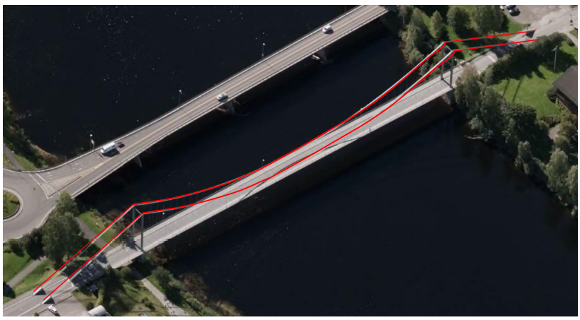

=== Bruer og tuneller
 
<<<
'''
 
[[bru]]
==== «FeatureType» Bru
*Definisjon fra FKB produktspesifikasjon*: konstruksjon for kryssing av vanskelig farbart område
Merknad: Med vanskelig farbart område menes en elv, et juv eller andre naturlige hindringer, samt kryssende infrastruktur.
 
 
.Illustrasjon fra produktspesifikasjon av Bru
image::http://skjema.geonorge.no/SOSI/produktspesifikasjon/FKB-BygnAnlegg/5.0/figurer/objtype_bru.png[link=http://skjema.geonorge.no/SOSI/produktspesifikasjon/FKB-BygnAnlegg/5.0/figurer/objtype_bru.png, Alt="Illustrasjon fra produktspesifikasjon: Bru"]
 
 
===== Tilleggsinformasjon for fotogrammetrisk registrering
Det er selve brukonstruksjonens utstrekning som skal registreres. Med dette menes spennvidde i luft (kant brukar til kant brukar).

Man skal s&#229; langt som mulig registrere objekter som ligger under bruer. Spesielt gjelder dette veger, traktorveger, bane, gang- og sykkelveger og murer. 

Evt. usikker registrering skal fremkomme av kvalitetskodingen.
 
 
'''
.Figuren viser hvordan veg og bru forholder seg til hverandre. 
image::figurer/bru_skisse.png[link=figurer/bru_skisse.png, Alt="Figuren viser hvordan veg og bru forholder seg til hverandre. "]
 
 
'''
.Eksempel på registrering av spennvidde (i luft).
image::figurer/bru_eksempel.png[link=figurer/bru_eksempel.png, Alt="Eksempel på registrering av spennvidde (i luft)."]
 
 
 
===== Føringer
[cols="25,75"]
|===
|FKB grunnrissreferanse
|Ytterkant brukonstruksjon
 
|FKB høydereferanse
|Topp kant brukonstruksjon. Oftest vil dette være i samme nivå som vegbanen/sporet
 
|FKB-A
|Påkrevd registrering
 
|FKB-B
|Påkrevd registrering
 
|FKB-C
|Påkrevd registrering
 
|FKB-D
|Påkrevd registrering
 
|===
 
 
<<<
 
===== Egenskapstabell for objekttype: Bru
[cols="20,20,20,10"]
|===
|*Navn:* 
|*Type:* 
|*SOSI_navn:* 
|*Mult.:* 
 
|identifikasjon
|«dataType» Identifikasjon
|..IDENT
|[1..1]
 
|identifikasjon.lokalId
|CharacterString
|...LOKALID
|[1..1]
 
|identifikasjon.navnerom
|CharacterString
|...NAVNEROM
|[1..1]
 
|identifikasjon.versjonId
|CharacterString
|...VERSJONID
|[0..1]
 
|oppdateringsdato
|DateTime
|..OPPDATERINGSDATO
|[1..1]
 
|datafangstdato
|Date
|..DATAFANGSTDATO
|[1..1]
 
|verifiseringsdato
|Date
|..VERIFISERINGSDATO
|[0..1]
 
|registreringsversjon
|«CodeList» Registreringsversjon
|..REGISTRERINGSVERSJON
|[0..1]
 
|informasjon
|CharacterString
|..INFORMASJON
|[0..1]
 
|kvalitet
|«dataType» Posisjonskvalitet
|..KVALITET
|[1..1]
 
|kvalitet.datafangstmetode
|«CodeList» Datafangstmetode
|...DATAFANGSTMETODE
|[1..1]
 
|kvalitet.nøyaktighet
|Integer
|...NØYAKTIGHET
|[0..1]
 
|kvalitet.synbarhet
|«CodeList» Synbarhet
|...SYNBARHET
|[0..1]
 
|kvalitet.datafangstmetodeHøyde
|«CodeList» Datafangstmetode
|...DATAFANGSTMETODEHØYDE
|[0..1]
 
|kvalitet.nøyaktighetHøyde
|Integer
|...H-NØYAKTIGHET
|[0..1]
 
|nvdbpeker
|URI
|..NVDBPEKER
|[0..1]
 
|område
|Flate
|.FLATE
|[1..1]
 
|bruOverBru
|Boolean
|..BRUOVERBRU
|[0..1]
 
|brutrafikktype
|«CodeList» Brutrafikktype
|..BRUTRAFIKKTYPE
|[0..1]
 
|friseilingshøyde
|Real
|..FRISEILINGSHØYDE
|[0..1]
 
|tilhørendeDetalj
|«featureType» Brudetalj
|..
|[0..*]
|===
 
<<<
'''
 
[[brudetalj]]
==== «FeatureType» Brudetalj
*Definisjon fra FKB produktspesifikasjon*: markante detaljer p&#229; bru som ikke registreres gjennom andre objekttyper

Eksempler:

- Brut&#229;rn for hengebruer.

- B&#230;reelement for brukonstruksjon.
 
 
.Illustrasjon fra produktspesifikasjon av Brudetalj
image::http://skjema.geonorge.no/SOSI/produktspesifikasjon/FKB-BygnAnlegg/5.0/figurer/objtype_brudetalj.png[link=http://skjema.geonorge.no/SOSI/produktspesifikasjon/FKB-BygnAnlegg/5.0/figurer/objtype_brudetalj.png, Alt="Illustrasjon fra produktspesifikasjon: Brudetalj"]
 
 
===== Tilleggsinformasjon for fotogrammetrisk registrering
Det er kun &#248;verste detalj som skal registreres.

 
 
'''
.Eksempl på registrering av brudetaljer. Brutårn og vaiere registreres.

 
 
 
===== Føringer
[cols="25,75"]
|===
|FKB grunnrissreferanse
|Ytterkant/senterlinje for brutårn. Senterlinje eller avgrensning av bæreelement.
 
|FKB høydereferanse
|Topp objekt
 
|FKB-A
|Påkrevd registrering
 
|FKB-B
|Påkrevd registrering
 
|FKB-C
|Påkrevd registrering
 
|FKB-D
|Påkrevd registrering
 
|===
 
 
<<<
 
===== Egenskapstabell for objekttype: Brudetalj
[cols="20,20,20,10"]
|===
|*Navn:* 
|*Type:* 
|*SOSI_navn:* 
|*Mult.:* 
 
|identifikasjon
|«dataType» Identifikasjon
|..IDENT
|[1..1]
 
|identifikasjon.lokalId
|CharacterString
|...LOKALID
|[1..1]
 
|identifikasjon.navnerom
|CharacterString
|...NAVNEROM
|[1..1]
 
|identifikasjon.versjonId
|CharacterString
|...VERSJONID
|[0..1]
 
|oppdateringsdato
|DateTime
|..OPPDATERINGSDATO
|[1..1]
 
|datafangstdato
|Date
|..DATAFANGSTDATO
|[1..1]
 
|verifiseringsdato
|Date
|..VERIFISERINGSDATO
|[0..1]
 
|registreringsversjon
|«CodeList» Registreringsversjon
|..REGISTRERINGSVERSJON
|[0..1]
 
|informasjon
|CharacterString
|..INFORMASJON
|[0..1]
 
|kvalitet
|«dataType» Posisjonskvalitet
|..KVALITET
|[1..1]
 
|kvalitet.datafangstmetode
|«CodeList» Datafangstmetode
|...DATAFANGSTMETODE
|[1..1]
 
|kvalitet.nøyaktighet
|Integer
|...NØYAKTIGHET
|[0..1]
 
|kvalitet.synbarhet
|«CodeList» Synbarhet
|...SYNBARHET
|[0..1]
 
|kvalitet.datafangstmetodeHøyde
|«CodeList» Datafangstmetode
|...DATAFANGSTMETODEHØYDE
|[0..1]
 
|kvalitet.nøyaktighetHøyde
|Integer
|...H-NØYAKTIGHET
|[0..1]
 
|senterlinje
|Kurve
|.KURVE
|[1..1]
 
|===
 
<<<
'''
 
[[kulvert]]
==== «FeatureType» Kulvert
*Definisjon fra FKB produktspesifikasjon*: gjennomløp på tvers av veg-eller jernbane med overliggende fylling og 1m &lt; lysåpning &lt; 2,5m
 
 
.Illustrasjon fra produktspesifikasjon av Kulvert
image::http://skjema.geonorge.no/SOSI/produktspesifikasjon/FKB-BygnAnlegg/5.0/figurer/objtype_kulvert.png[link=http://skjema.geonorge.no/SOSI/produktspesifikasjon/FKB-BygnAnlegg/5.0/figurer/objtype_kulvert.png, Alt="Illustrasjon fra produktspesifikasjon: Kulvert"]
 
 
===== Tilleggsinformasjon for fotogrammetrisk registrering
Skal etableres som lukket polygon.

Eksempel p&#229; kulvert er jordbruksundergang for dyr.
Inn mot kulvert vil det ofte v&#230;re forst&#248;tningsmur.

Benyttes kun der gjennoml&#248;pet ikke er en del av veg, 
gang/sykkelveg, traktorveg eller sti. Ved gjennoml&#248;p hvor det er 
bygget bru, skal Bruavgrensning benyttes. 

Der hvor gang/sykkelveg, traktorveg eller sti g&#229;r i kulvert under 
veg/jernbane, skal disse objektene kodes med MEDIUM U og kulvert sl&#248;yfes. 
 
 
'''
.Eksempel på registrering av kulvert
image::figurer/kulvert.png[link=figurer/kulvert.png, Alt="Eksempel på registrering av kulvert"]
 
 
 
===== Føringer
[cols="25,75"]
|===
|FKB grunnrissreferanse
|Ende/hjørne av gjennomløp
 
|FKB høydereferanse
|Bunn gjennomløp
 
|FKB-A
|Opsjonell registrering
 
|FKB-B
|Opsjonell registrering
 
|FKB-C
|Registreres ikke
 
|FKB-D
|Registreres ikke
 
|===
 
 
<<<
 
===== Egenskapstabell for objekttype: Kulvert
[cols="20,20,20,10"]
|===
|*Navn:* 
|*Type:* 
|*SOSI_navn:* 
|*Mult.:* 
 
|identifikasjon
|«dataType» Identifikasjon
|..IDENT
|[1..1]
 
|identifikasjon.lokalId
|CharacterString
|...LOKALID
|[1..1]
 
|identifikasjon.navnerom
|CharacterString
|...NAVNEROM
|[1..1]
 
|identifikasjon.versjonId
|CharacterString
|...VERSJONID
|[0..1]
 
|oppdateringsdato
|DateTime
|..OPPDATERINGSDATO
|[1..1]
 
|datafangstdato
|Date
|..DATAFANGSTDATO
|[1..1]
 
|verifiseringsdato
|Date
|..VERIFISERINGSDATO
|[0..1]
 
|registreringsversjon
|«CodeList» Registreringsversjon
|..REGISTRERINGSVERSJON
|[0..1]
 
|informasjon
|CharacterString
|..INFORMASJON
|[0..1]
 
|kvalitet
|«dataType» Posisjonskvalitet
|..KVALITET
|[1..1]
 
|kvalitet.datafangstmetode
|«CodeList» Datafangstmetode
|...DATAFANGSTMETODE
|[1..1]
 
|kvalitet.nøyaktighet
|Integer
|...NØYAKTIGHET
|[0..1]
 
|kvalitet.synbarhet
|«CodeList» Synbarhet
|...SYNBARHET
|[0..1]
 
|kvalitet.datafangstmetodeHøyde
|«CodeList» Datafangstmetode
|...DATAFANGSTMETODEHØYDE
|[0..1]
 
|kvalitet.nøyaktighetHøyde
|Integer
|...H-NØYAKTIGHET
|[0..1]
 
|nvdbpeker
|URI
|..NVDBPEKER
|[0..1]
 
|senterlinje
|Kurve
|.KURVE
|[1..1]
 
|===
 
<<<
'''
 
[[stikkrenne]]
==== «FeatureType» Stikkrenne
*Definisjon fra FKB produktspesifikasjon*: gjennomløp på tvers av veg-eller jernbane med overliggende fylling og 1m &gt; lysåpning
 
 
.Illustrasjon fra produktspesifikasjon av Stikkrenne
image::http://skjema.geonorge.no/SOSI/produktspesifikasjon/FKB-BygnAnlegg/5.0/figurer/objtype_stikkrenne.png[link=http://skjema.geonorge.no/SOSI/produktspesifikasjon/FKB-BygnAnlegg/5.0/figurer/objtype_stikkrenne.png, Alt="Illustrasjon fra produktspesifikasjon: Stikkrenne"]
 
 
===== Tilleggsinformasjon for fotogrammetrisk registrering
Skal registreres som en linje mellom to punkter; ett i hver ende av 
stikkrenna. 

I de tilfellene stikkrenna kun er synlig p&#229; den ene siden 
av vegen/jernbanen kan stikkrenna registreres bare p&#229; ene siden 
(kort linje). Stikkrenne skal ikke registreres som et punkt.

Ved fotogrammetrisk registrering er kun endene av stikkrenna 
synlige. Forl&#248;pet under vegen/jernbanen er ukjent. H&#248;ydereferansen kan v&#230;re usikker
 
 
'''
.Eksempel på registrering av stikkrenne
image::figurer/stikkrenne.png[link=figurer/stikkrenne.png, Alt="Eksempel på registrering av stikkrenne"]
 
 
 
===== Føringer
[cols="25,75"]
|===
|FKB grunnrissreferanse
|Midt ende av innløp og utløp
 
|FKB høydereferanse
|Bunn stikkrenne
 
|FKB-A
|Opsjonell registrering
 
|FKB-B
|Opsjonell registrering
 
|FKB-C
|Registreres ikke
 
|FKB-D
|Registreres ikke
 
|===
 
 
<<<
 
===== Egenskapstabell for objekttype: Stikkrenne
[cols="20,20,20,10"]
|===
|*Navn:* 
|*Type:* 
|*SOSI_navn:* 
|*Mult.:* 
 
|identifikasjon
|«dataType» Identifikasjon
|..IDENT
|[1..1]
 
|identifikasjon.lokalId
|CharacterString
|...LOKALID
|[1..1]
 
|identifikasjon.navnerom
|CharacterString
|...NAVNEROM
|[1..1]
 
|identifikasjon.versjonId
|CharacterString
|...VERSJONID
|[0..1]
 
|oppdateringsdato
|DateTime
|..OPPDATERINGSDATO
|[1..1]
 
|datafangstdato
|Date
|..DATAFANGSTDATO
|[1..1]
 
|verifiseringsdato
|Date
|..VERIFISERINGSDATO
|[0..1]
 
|registreringsversjon
|«CodeList» Registreringsversjon
|..REGISTRERINGSVERSJON
|[0..1]
 
|informasjon
|CharacterString
|..INFORMASJON
|[0..1]
 
|kvalitet
|«dataType» Posisjonskvalitet
|..KVALITET
|[1..1]
 
|kvalitet.datafangstmetode
|«CodeList» Datafangstmetode
|...DATAFANGSTMETODE
|[1..1]
 
|kvalitet.nøyaktighet
|Integer
|...NØYAKTIGHET
|[0..1]
 
|kvalitet.synbarhet
|«CodeList» Synbarhet
|...SYNBARHET
|[0..1]
 
|kvalitet.datafangstmetodeHøyde
|«CodeList» Datafangstmetode
|...DATAFANGSTMETODEHØYDE
|[0..1]
 
|kvalitet.nøyaktighetHøyde
|Integer
|...H-NØYAKTIGHET
|[0..1]
 
|nvdbpeker
|URI
|..NVDBPEKER
|[0..1]
 
|senterlinje
|Kurve
|.KURVE
|[1..1]
 
|===
 
<<<
'''
 
[[tunnelportal]]
==== «FeatureType» Tunnelportal
*Definisjon fra FKB produktspesifikasjon*: spesielt byggverk som sammenbinder tunnel og åpen veg
 
 
.Illustrasjon fra produktspesifikasjon av Tunnelportal
image::http://skjema.geonorge.no/SOSI/produktspesifikasjon/FKB-BygnAnlegg/5.0/figurer/objtype_tunnelportal.png[link=http://skjema.geonorge.no/SOSI/produktspesifikasjon/FKB-BygnAnlegg/5.0/figurer/objtype_tunnelportal.png, Alt="Illustrasjon fra produktspesifikasjon: Tunnelportal"]
 
 
 
'''
.Eksempl på registrering av tunnelportal
image::figurer/tunnelportal.png[link=figurer/tunnelportal.png, Alt="Eksempl på registrering av tunnelportal"]
 
 
 
===== Føringer
[cols="25,75"]
|===
|FKB grunnrissreferanse
|Ytterkant tunnelportal
 
|FKB høydereferanse
|Topp kant tunnelportal
 
|FKB-A
|Påkrevd registrering
 
|FKB-B
|Påkrevd registrering
 
|FKB-C
|Registreres ikke
 
|FKB-D
|Registreres ikke
 
|===
 
 
<<<
 
===== Egenskapstabell for objekttype: Tunnelportal
[cols="20,20,20,10"]
|===
|*Navn:* 
|*Type:* 
|*SOSI_navn:* 
|*Mult.:* 
 
|identifikasjon
|«dataType» Identifikasjon
|..IDENT
|[1..1]
 
|identifikasjon.lokalId
|CharacterString
|...LOKALID
|[1..1]
 
|identifikasjon.navnerom
|CharacterString
|...NAVNEROM
|[1..1]
 
|identifikasjon.versjonId
|CharacterString
|...VERSJONID
|[0..1]
 
|oppdateringsdato
|DateTime
|..OPPDATERINGSDATO
|[1..1]
 
|datafangstdato
|Date
|..DATAFANGSTDATO
|[1..1]
 
|verifiseringsdato
|Date
|..VERIFISERINGSDATO
|[0..1]
 
|registreringsversjon
|«CodeList» Registreringsversjon
|..REGISTRERINGSVERSJON
|[0..1]
 
|informasjon
|CharacterString
|..INFORMASJON
|[0..1]
 
|kvalitet
|«dataType» Posisjonskvalitet
|..KVALITET
|[1..1]
 
|kvalitet.datafangstmetode
|«CodeList» Datafangstmetode
|...DATAFANGSTMETODE
|[1..1]
 
|kvalitet.nøyaktighet
|Integer
|...NØYAKTIGHET
|[0..1]
 
|kvalitet.synbarhet
|«CodeList» Synbarhet
|...SYNBARHET
|[0..1]
 
|kvalitet.datafangstmetodeHøyde
|«CodeList» Datafangstmetode
|...DATAFANGSTMETODEHØYDE
|[0..1]
 
|kvalitet.nøyaktighetHøyde
|Integer
|...H-NØYAKTIGHET
|[0..1]
 
|nvdbpeker
|URI
|..NVDBPEKER
|[0..1]
 
|senterlinje
|Kurve
|.KURVE
|[1..1]
 
|===
=== Bygningsmessige anlegg
 
<<<
'''
 
[[brønn]]
==== «FeatureType» Brønn
*Definisjon fra FKB produktspesifikasjon*: lite bygningsmessig anlegg for uttak av ferskvann
 
 
.Illustrasjon fra produktspesifikasjon av Brønn
image::http://skjema.geonorge.no/SOSI/produktspesifikasjon/FKB-BygnAnlegg/5.0/figurer/objtype_bronn.png[link=http://skjema.geonorge.no/SOSI/produktspesifikasjon/FKB-BygnAnlegg/5.0/figurer/objtype_bronn.png, Alt="Illustrasjon fra produktspesifikasjon: Brønn"]
 
 
===== Tilleggsinformasjon for fotogrammetrisk registrering
Registreres som punkt ved fotogrammetrisk registrering dersom ikke annet er avtalt.
 
 
===== Føringer
[cols="25,75"]
|===
|FKB grunnrissreferanse
|Senter
 
|FKB høydereferanse
|Terrengnivå (HREF FOT)
 
|FKB-A
|Påkrevd registrering
 
|FKB-B
|Påkrevd registrering
 
|FKB-C
|Registreres ikke
 
|FKB-D
|Registreres ikke
 
|===
 
 
<<<
 
===== Egenskapstabell for objekttype: Brønn
[cols="20,20,20,10"]
|===
|*Navn:* 
|*Type:* 
|*SOSI_navn:* 
|*Mult.:* 
 
|identifikasjon
|«dataType» Identifikasjon
|..IDENT
|[1..1]
 
|identifikasjon.lokalId
|CharacterString
|...LOKALID
|[1..1]
 
|identifikasjon.navnerom
|CharacterString
|...NAVNEROM
|[1..1]
 
|identifikasjon.versjonId
|CharacterString
|...VERSJONID
|[0..1]
 
|oppdateringsdato
|DateTime
|..OPPDATERINGSDATO
|[1..1]
 
|datafangstdato
|Date
|..DATAFANGSTDATO
|[1..1]
 
|verifiseringsdato
|Date
|..VERIFISERINGSDATO
|[0..1]
 
|registreringsversjon
|«CodeList» Registreringsversjon
|..REGISTRERINGSVERSJON
|[0..1]
 
|informasjon
|CharacterString
|..INFORMASJON
|[0..1]
 
|kvalitet
|«dataType» Posisjonskvalitet
|..KVALITET
|[1..1]
 
|kvalitet.datafangstmetode
|«CodeList» Datafangstmetode
|...DATAFANGSTMETODE
|[1..1]
 
|kvalitet.nøyaktighet
|Integer
|...NØYAKTIGHET
|[0..1]
 
|kvalitet.synbarhet
|«CodeList» Synbarhet
|...SYNBARHET
|[0..1]
 
|kvalitet.datafangstmetodeHøyde
|«CodeList» Datafangstmetode
|...DATAFANGSTMETODEHØYDE
|[0..1]
 
|kvalitet.nøyaktighetHøyde
|Integer
|...H-NØYAKTIGHET
|[0..1]
 
|område
|Flate
|.FLATE
|[0..1]
 
|posisjon
|Punkt
|.PUNKT
|[0..1]
 
|høydereferanse
|«CodeList» Høydereferanse
|..HREF
|[1..1]
 
|===
 
<<<
'''
 
[[flaggstang]]
==== «FeatureType» Flaggstang
*Definisjon fra FKB produktspesifikasjon*: lang rett stang for heising av flagg
 
 
.Illustrasjon fra produktspesifikasjon av Flaggstang
image::http://skjema.geonorge.no/SOSI/produktspesifikasjon/FKB-BygnAnlegg/5.0/figurer/objtype_flaggstang.png[link=http://skjema.geonorge.no/SOSI/produktspesifikasjon/FKB-BygnAnlegg/5.0/figurer/objtype_flaggstang.png, Alt="Illustrasjon fra produktspesifikasjon: Flaggstang"]
 
 
 
===== Føringer
[cols="25,75"]
|===
|FKB grunnrissreferanse
|Senter
 
|FKB høydereferanse
|Topp flaggstang
 
|FKB-A
|Påkrevd registrering
 
|FKB-B
|Påkrevd registrering
 
|FKB-C
|Registreres ikke
 
|FKB-D
|Registreres ikke
 
|===
 
 
<<<
 
===== Egenskapstabell for objekttype: Flaggstang
[cols="20,20,20,10"]
|===
|*Navn:* 
|*Type:* 
|*SOSI_navn:* 
|*Mult.:* 
 
|identifikasjon
|«dataType» Identifikasjon
|..IDENT
|[1..1]
 
|identifikasjon.lokalId
|CharacterString
|...LOKALID
|[1..1]
 
|identifikasjon.navnerom
|CharacterString
|...NAVNEROM
|[1..1]
 
|identifikasjon.versjonId
|CharacterString
|...VERSJONID
|[0..1]
 
|oppdateringsdato
|DateTime
|..OPPDATERINGSDATO
|[1..1]
 
|datafangstdato
|Date
|..DATAFANGSTDATO
|[1..1]
 
|verifiseringsdato
|Date
|..VERIFISERINGSDATO
|[0..1]
 
|registreringsversjon
|«CodeList» Registreringsversjon
|..REGISTRERINGSVERSJON
|[0..1]
 
|informasjon
|CharacterString
|..INFORMASJON
|[0..1]
 
|kvalitet
|«dataType» Posisjonskvalitet
|..KVALITET
|[1..1]
 
|kvalitet.datafangstmetode
|«CodeList» Datafangstmetode
|...DATAFANGSTMETODE
|[1..1]
 
|kvalitet.nøyaktighet
|Integer
|...NØYAKTIGHET
|[0..1]
 
|kvalitet.synbarhet
|«CodeList» Synbarhet
|...SYNBARHET
|[0..1]
 
|kvalitet.datafangstmetodeHøyde
|«CodeList» Datafangstmetode
|...DATAFANGSTMETODEHØYDE
|[0..1]
 
|kvalitet.nøyaktighetHøyde
|Integer
|...H-NØYAKTIGHET
|[0..1]
 
|posisjon
|Punkt
|.PUNKT
|[1..1]
 
|høydereferanse
|«CodeList» Høydereferanse
|..HREF
|[1..1]
 
|medium
|«CodeList» Medium
|..MEDIUM
|[1..1]
 
|===
 
<<<
'''
 
[[fundament]]
==== «FeatureType» Fundament
*Definisjon fra FKB produktspesifikasjon*: støpt underlag for frittstående konstruksjoner 
Merknad: Selve konstruksjonen oppå fundamentet og dens funksjon vil eventuelt  være beskrevet som en node i nettverket den er en del av.
Eksempel: Stolper og master
 
 
.Illustrasjon fra produktspesifikasjon av Fundament
image::http://skjema.geonorge.no/SOSI/produktspesifikasjon/FKB-BygnAnlegg/5.0/figurer/objtype_fundament.png[link=http://skjema.geonorge.no/SOSI/produktspesifikasjon/FKB-BygnAnlegg/5.0/figurer/objtype_fundament.png, Alt="Illustrasjon fra produktspesifikasjon: Fundament"]
 
 
===== Tilleggsinformasjon for fotogrammetrisk registrering
Omfatter det st&#248;pte underlaget for frittst&#229;ende konstruksjoner. For eksempel fundamenter for Bru.

Dersom deler av kanten har d&#229;rlig innsyn angis dette ved kvalitetskoding p&#229; objektet.
 
 
===== Føringer
[cols="25,75"]
|===
|FKB grunnrissreferanse
|Ytterkant fundament
 
|FKB høydereferanse
|Topp fundament. Ved registrering av topp fundament skal alle knekklinjer og høydesprang over 0,5m registreres
 
|FKB minstestørrelse A
|Fundamenter med areal større enn 6m2
 
|FKB minstestørrelse B
|Fundamenter med areal større enn 6m2
 
|FKB minstestørrelse C
|Fundamenter med areal større enn 40m2
 
|FKB minstestørrelse D
|Fundamenter med areal større enn 40m2
 
|FKB-A
|Påkrevd registrering
 
|FKB-B
|Påkrevd registrering
 
|FKB-C
|Påkrevd registrering
 
|FKB-D
|Påkrevd registrering
 
|===
 
 
<<<
 
===== Egenskapstabell for objekttype: Fundament
[cols="20,20,20,10"]
|===
|*Navn:* 
|*Type:* 
|*SOSI_navn:* 
|*Mult.:* 
 
|identifikasjon
|«dataType» Identifikasjon
|..IDENT
|[1..1]
 
|identifikasjon.lokalId
|CharacterString
|...LOKALID
|[1..1]
 
|identifikasjon.navnerom
|CharacterString
|...NAVNEROM
|[1..1]
 
|identifikasjon.versjonId
|CharacterString
|...VERSJONID
|[0..1]
 
|oppdateringsdato
|DateTime
|..OPPDATERINGSDATO
|[1..1]
 
|datafangstdato
|Date
|..DATAFANGSTDATO
|[1..1]
 
|verifiseringsdato
|Date
|..VERIFISERINGSDATO
|[0..1]
 
|registreringsversjon
|«CodeList» Registreringsversjon
|..REGISTRERINGSVERSJON
|[0..1]
 
|informasjon
|CharacterString
|..INFORMASJON
|[0..1]
 
|kvalitet
|«dataType» Posisjonskvalitet
|..KVALITET
|[1..1]
 
|kvalitet.datafangstmetode
|«CodeList» Datafangstmetode
|...DATAFANGSTMETODE
|[1..1]
 
|kvalitet.nøyaktighet
|Integer
|...NØYAKTIGHET
|[0..1]
 
|kvalitet.synbarhet
|«CodeList» Synbarhet
|...SYNBARHET
|[0..1]
 
|kvalitet.datafangstmetodeHøyde
|«CodeList» Datafangstmetode
|...DATAFANGSTMETODEHØYDE
|[0..1]
 
|kvalitet.nøyaktighetHøyde
|Integer
|...H-NØYAKTIGHET
|[0..1]
 
|område
|Flate
|.FLATE
|[1..1]
 
|medium
|«CodeList» Medium
|..MEDIUM
|[1..1]
 
|===
 
<<<
'''
 
[[parkdetalj]]
==== «FeatureType» Parkdetalj
*Definisjon fra FKB produktspesifikasjon*: detalj i parkmessig omr&#229;de

Merknad:
Omfatter detaljer som f.eks. bauter, statuer, fontener, basseng, lekeapparater og sandkasser. Registreres som punkt- eller flategeometri.
 
 
.Illustrasjon fra produktspesifikasjon av Parkdetalj
image::http://skjema.geonorge.no/SOSI/produktspesifikasjon/FKB-BygnAnlegg/5.0/figurer/objtype_parkdetalj.png[link=http://skjema.geonorge.no/SOSI/produktspesifikasjon/FKB-BygnAnlegg/5.0/figurer/objtype_parkdetalj.png, Alt="Illustrasjon fra produktspesifikasjon: Parkdetalj"]
 
 
 
===== Føringer
[cols="25,75"]
|===
|===
 
 
<<<
 
===== Egenskapstabell for objekttype: Parkdetalj
[cols="20,20,20,10"]
|===
|*Navn:* 
|*Type:* 
|*SOSI_navn:* 
|*Mult.:* 
 
|identifikasjon
|«dataType» Identifikasjon
|..IDENT
|[1..1]
 
|identifikasjon.lokalId
|CharacterString
|...LOKALID
|[1..1]
 
|identifikasjon.navnerom
|CharacterString
|...NAVNEROM
|[1..1]
 
|identifikasjon.versjonId
|CharacterString
|...VERSJONID
|[0..1]
 
|oppdateringsdato
|DateTime
|..OPPDATERINGSDATO
|[1..1]
 
|datafangstdato
|Date
|..DATAFANGSTDATO
|[1..1]
 
|verifiseringsdato
|Date
|..VERIFISERINGSDATO
|[0..1]
 
|registreringsversjon
|«CodeList» Registreringsversjon
|..REGISTRERINGSVERSJON
|[0..1]
 
|informasjon
|CharacterString
|..INFORMASJON
|[0..1]
 
|kvalitet
|«dataType» Posisjonskvalitet
|..KVALITET
|[1..1]
 
|kvalitet.datafangstmetode
|«CodeList» Datafangstmetode
|...DATAFANGSTMETODE
|[1..1]
 
|kvalitet.nøyaktighet
|Integer
|...NØYAKTIGHET
|[0..1]
 
|kvalitet.synbarhet
|«CodeList» Synbarhet
|...SYNBARHET
|[0..1]
 
|kvalitet.datafangstmetodeHøyde
|«CodeList» Datafangstmetode
|...DATAFANGSTMETODEHØYDE
|[0..1]
 
|kvalitet.nøyaktighetHøyde
|Integer
|...H-NØYAKTIGHET
|[0..1]
 
|posisjon
|Punkt
|.PUNKT
|[0..1]
 
|område
|Flate
|.FLATE
|[0..1]
 
|høydereferanse
|«CodeList» Høydereferanse
|..HREF
|[1..1]
 
|parkdetaljtype
|«CodeList» Parkdetaljtype
|..PARKDETALJTYPE
|[1..1]
 
|eksternpeker
|URI
|..EKSTERNPEKER
|[0..1]
 
|===
 
<<<
'''
 
[[pipe]]
==== «FeatureType» Pipe
*Definisjon fra FKB produktspesifikasjon*: frittstående rørformete innretninger for transport av avgasser
 
 
.Illustrasjon fra produktspesifikasjon av Pipe
image::http://skjema.geonorge.no/SOSI/produktspesifikasjon/FKB-BygnAnlegg/5.0/figurer/objtype_pipe.png[link=http://skjema.geonorge.no/SOSI/produktspesifikasjon/FKB-BygnAnlegg/5.0/figurer/objtype_pipe.png, Alt="Illustrasjon fra produktspesifikasjon: Pipe"]
 
 
===== Tilleggsinformasjon for fotogrammetrisk registrering
Omfatter frittst&#229;ende r&#248;rformede innretninger for transport av 
avgasser. 

Piper registreres fortrinnsvis med flategeometri. Piper der areal i toppen av pipa er under 1m2 kan registreres som punkter.

Dersom pipa er rund, skal det registreres eller genereres 
tilstrekkelig tett med punkter slik at pipa synes jevnt rund n&#229;r den 
plottes. 

For piper med skr&#229; vegger, registreres "Kant ved bakken" som BeskrivendeHjelpelinjeAnlegg.
 
 
===== Føringer
[cols="25,75"]
|===
|FKB grunnrissreferanse
|Topp ytterkant pipe (senter pipe ved punktgeometri)
 
|FKB høydereferanse
|Topp ytterkant pipe
 
|FKB minstestørrelse A
|Piper høyere enn 5m
 
|FKB minstestørrelse B
|Piper høyere enn 5m
 
|FKB minstestørrelse C
|Piper høyere enn 10m
 
|FKB minstestørrelse D
|Piper høyere enn 10m
 
|FKB-A
|Påkrevd registrering
 
|FKB-B
|Påkrevd registrering
 
|FKB-C
|Påkrevd registrering
 
|FKB-D
|Påkrevd registrering
 
|===
 
 
<<<
 
===== Egenskapstabell for objekttype: Pipe
[cols="20,20,20,10"]
|===
|*Navn:* 
|*Type:* 
|*SOSI_navn:* 
|*Mult.:* 
 
|identifikasjon
|«dataType» Identifikasjon
|..IDENT
|[1..1]
 
|identifikasjon.lokalId
|CharacterString
|...LOKALID
|[1..1]
 
|identifikasjon.navnerom
|CharacterString
|...NAVNEROM
|[1..1]
 
|identifikasjon.versjonId
|CharacterString
|...VERSJONID
|[0..1]
 
|oppdateringsdato
|DateTime
|..OPPDATERINGSDATO
|[1..1]
 
|datafangstdato
|Date
|..DATAFANGSTDATO
|[1..1]
 
|verifiseringsdato
|Date
|..VERIFISERINGSDATO
|[0..1]
 
|registreringsversjon
|«CodeList» Registreringsversjon
|..REGISTRERINGSVERSJON
|[0..1]
 
|informasjon
|CharacterString
|..INFORMASJON
|[0..1]
 
|kvalitet
|«dataType» Posisjonskvalitet
|..KVALITET
|[1..1]
 
|kvalitet.datafangstmetode
|«CodeList» Datafangstmetode
|...DATAFANGSTMETODE
|[1..1]
 
|kvalitet.nøyaktighet
|Integer
|...NØYAKTIGHET
|[0..1]
 
|kvalitet.synbarhet
|«CodeList» Synbarhet
|...SYNBARHET
|[0..1]
 
|kvalitet.datafangstmetodeHøyde
|«CodeList» Datafangstmetode
|...DATAFANGSTMETODEHØYDE
|[0..1]
 
|kvalitet.nøyaktighetHøyde
|Integer
|...H-NØYAKTIGHET
|[0..1]
 
|nrlpeker
|URI
|..NRLPEKER
|[0..1]
 
|posisjon
|Punkt
|.PUNKT
|[0..1]
 
|område
|Flate
|.FLATE
|[0..1]
 
|høydereferanse
|«CodeList» Høydereferanse
|..HREF
|[1..1]
 
|===
 
<<<
'''
 
[[søppelbeholder]]
==== «FeatureType» Søppelbeholder
*Definisjon fra FKB produktspesifikasjon*: St&#248;rre tank eller annen type beholder for s&#248;ppel
 
 
.Illustrasjon fra produktspesifikasjon av Søppelbeholder
image::http://skjema.geonorge.no/SOSI/produktspesifikasjon/FKB-BygnAnlegg/5.0/figurer/objtype_soppelbeholder.png[link=http://skjema.geonorge.no/SOSI/produktspesifikasjon/FKB-BygnAnlegg/5.0/figurer/objtype_soppelbeholder.png, Alt="Illustrasjon fra produktspesifikasjon: Søppelbeholder"]
 
 
 
===== Føringer
[cols="25,75"]
|===
|===
 
 
<<<
 
===== Egenskapstabell for objekttype: Søppelbeholder
[cols="20,20,20,10"]
|===
|*Navn:* 
|*Type:* 
|*SOSI_navn:* 
|*Mult.:* 
 
|identifikasjon
|«dataType» Identifikasjon
|..IDENT
|[1..1]
 
|identifikasjon.lokalId
|CharacterString
|...LOKALID
|[1..1]
 
|identifikasjon.navnerom
|CharacterString
|...NAVNEROM
|[1..1]
 
|identifikasjon.versjonId
|CharacterString
|...VERSJONID
|[0..1]
 
|oppdateringsdato
|DateTime
|..OPPDATERINGSDATO
|[1..1]
 
|datafangstdato
|Date
|..DATAFANGSTDATO
|[1..1]
 
|verifiseringsdato
|Date
|..VERIFISERINGSDATO
|[0..1]
 
|registreringsversjon
|«CodeList» Registreringsversjon
|..REGISTRERINGSVERSJON
|[0..1]
 
|informasjon
|CharacterString
|..INFORMASJON
|[0..1]
 
|kvalitet
|«dataType» Posisjonskvalitet
|..KVALITET
|[1..1]
 
|kvalitet.datafangstmetode
|«CodeList» Datafangstmetode
|...DATAFANGSTMETODE
|[1..1]
 
|kvalitet.nøyaktighet
|Integer
|...NØYAKTIGHET
|[0..1]
 
|kvalitet.synbarhet
|«CodeList» Synbarhet
|...SYNBARHET
|[0..1]
 
|kvalitet.datafangstmetodeHøyde
|«CodeList» Datafangstmetode
|...DATAFANGSTMETODEHØYDE
|[0..1]
 
|kvalitet.nøyaktighetHøyde
|Integer
|...H-NØYAKTIGHET
|[0..1]
 
|posisjon
|Punkt
|.PUNKT
|[0..1]
 
|område
|Flate
|.FLATE
|[0..1]
 
|medium
|«CodeList» Medium
|..MEDIUM
|[1..1]
 
|høydereferanse
|«CodeList» Høydereferanse
|..HREF
|[1..1]
 
|eksternpeker
|URI
|..EKSTERNPEKER
|[1..1]
 
|===
 
<<<
'''
 
[[tank]]
==== «FeatureType» Tank
*Definisjon fra FKB produktspesifikasjon*: lukkede kar for oppbevaring av gass eller væsker som ikke er registrert som bygning
 
 
.Illustrasjon fra produktspesifikasjon av Tank
image::http://skjema.geonorge.no/SOSI/produktspesifikasjon/FKB-BygnAnlegg/5.0/figurer/objtype_tank.png[link=http://skjema.geonorge.no/SOSI/produktspesifikasjon/FKB-BygnAnlegg/5.0/figurer/objtype_tank.png, Alt="Illustrasjon fra produktspesifikasjon: Tank"]
 
 
===== Tilleggsinformasjon for fotogrammetrisk registrering
Tank registreres med flategeometri ved fotogrammetrisk registrering.

Brukes for &#229; beskrive omriss av lukkede kar for oppbevaring av gass eller v&#230;ske n&#229;r tanken ikke er registrert som "Bygning". Inkluderer ogs&#229; vannt&#229;rn og lagringsrom for f&#244;r og korn (tidligere objekttype Silo).

Dersom tanken er rund, skal det registreres eller genereres 
tilstrekkelig tett med punkter slik at tanken synes jevnt rund n&#229;r 
den plottes. Tanken skal alltid lukkes. Det er lov &#229; generere ett eller 
flere punkter for &#229; lukke tanken.

N&#229;r det er flere tanker tett inntil hverandre skal de registreres som et
sammenhengende polygon, dersom det samlede arealet overstiger 
minstem&#229;l.
 
 
'''
.Registrering av liggende tanker med skrå vegger.
image::figurer/tank.png[link=figurer/tank.png, Alt="Registrering av liggende tanker med skrå vegger."]
 
 
'''
.Når det er flere tanker ved siden av hverandre skal de registreres som et sammenhengende polygon, dersom det samlede arealet overstiger minstemål. Underste bilde viser tre tanker (hver enkelte Tank under minstemål) som skal registreres sammenhengende ettersom det samlede arealet overstiger minstemål.
image::figurer/tank_flere.png[link=figurer/tank_flere.png, Alt="Når det er flere tanker ved siden av hverandre skal de registreres som et sammenhengende polygon, dersom det samlede arealet overstiger minstemål. Underste bilde viser tre tanker (hver enkelte Tank under minstemål) som skal registreres sammenhengende ettersom det samlede arealet overstiger minstemål."]
 
 
 
===== Føringer
[cols="25,75"]
|===
|FKB grunnrissreferanse
|Ytterkant av tank (største omkrets)
 
|FKB høydereferanse
|Tankens største høyde (HREF TOP)
 
|FKB minstestørrelse A
|Areal større enn 6m2
 
|FKB-A
|Påkrevd registrering
 
|FKB-B
|Påkrevd registrering
 
|FKB-C
|Påkrevd registrering
 
|FKB-D
|Påkrevd registrering
 
|===
 
 
<<<
 
===== Egenskapstabell for objekttype: Tank
[cols="20,20,20,10"]
|===
|*Navn:* 
|*Type:* 
|*SOSI_navn:* 
|*Mult.:* 
 
|identifikasjon
|«dataType» Identifikasjon
|..IDENT
|[1..1]
 
|identifikasjon.lokalId
|CharacterString
|...LOKALID
|[1..1]
 
|identifikasjon.navnerom
|CharacterString
|...NAVNEROM
|[1..1]
 
|identifikasjon.versjonId
|CharacterString
|...VERSJONID
|[0..1]
 
|oppdateringsdato
|DateTime
|..OPPDATERINGSDATO
|[1..1]
 
|datafangstdato
|Date
|..DATAFANGSTDATO
|[1..1]
 
|verifiseringsdato
|Date
|..VERIFISERINGSDATO
|[0..1]
 
|registreringsversjon
|«CodeList» Registreringsversjon
|..REGISTRERINGSVERSJON
|[0..1]
 
|informasjon
|CharacterString
|..INFORMASJON
|[0..1]
 
|kvalitet
|«dataType» Posisjonskvalitet
|..KVALITET
|[1..1]
 
|kvalitet.datafangstmetode
|«CodeList» Datafangstmetode
|...DATAFANGSTMETODE
|[1..1]
 
|kvalitet.nøyaktighet
|Integer
|...NØYAKTIGHET
|[0..1]
 
|kvalitet.synbarhet
|«CodeList» Synbarhet
|...SYNBARHET
|[0..1]
 
|kvalitet.datafangstmetodeHøyde
|«CodeList» Datafangstmetode
|...DATAFANGSTMETODEHØYDE
|[0..1]
 
|kvalitet.nøyaktighetHøyde
|Integer
|...H-NØYAKTIGHET
|[0..1]
 
|nrlpeker
|URI
|..NRLPEKER
|[0..1]
 
|posisjon
|Punkt
|.PUNKT
|[0..1]
 
|område
|Flate
|.FLATE
|[0..1]
 
|medium
|«CodeList» Medium
|..MEDIUM
|[1..1]
 
|===
 
<<<
'''
 
[[tårn]]
==== «FeatureType» Tårn
*Definisjon fra FKB produktspesifikasjon*: h&#248;y bygningsmessig konstruksjon hvor h&#248;yden er stor i forhold til bygningens areal i grunnplanet
Merknad: Omfatter alle t&#229;rn med unntak av de som er registrert i matrikkelen og de som har en mer spesifisert beskrivelse- som f.eks tank. 
Eksempel: M&#229;let&#229;rn og stupet&#229;rn
 
 
.Illustrasjon fra produktspesifikasjon av Tårn
image::http://skjema.geonorge.no/SOSI/produktspesifikasjon/FKB-BygnAnlegg/5.0/figurer/objtype_tarn.png[link=http://skjema.geonorge.no/SOSI/produktspesifikasjon/FKB-BygnAnlegg/5.0/figurer/objtype_tarn.png, Alt="Illustrasjon fra produktspesifikasjon: Tårn"]
 
 
===== Tilleggsinformasjon for fotogrammetrisk registrering
Omfatter alle t&#229;rn med unntak av de t&#229;rn som har en mer spesifisert beskrivelse, som f.eks. Tank. Eksempel p&#229; t&#229;rn er m&#229;let&#229;rn, stupet&#229;rn og t&#229;rn for telekommunikasjon. Vannt&#229;rn kodes som Tank.

For t&#229;rn med loddrette vegger, registreres "Ytterkant av t&#229;rn/Topp ytterkant t&#229;rn". For t&#229;rn med skr&#229; vegger, registreres i tillegg registreres "Kant ved bakken" som 
BeskrivendeHjelpelinjeAnlegg.  

Dersom t&#229;rnet st&#229;r p&#229; markerte bein, kan disse registreres som fundament.
 
 
===== Føringer
[cols="25,75"]
|===
|FKB grunnrissreferanse
|Topp ytterkant tårn
 
|FKB høydereferanse
|Topp ytterkant tårn
 
|FKB minstestørrelse A
|Høyde større enn 5m
 
|FKB minstestørrelse B
|Høyde større enn 5m
 
|FKB minstestørrelse C
|Høyde større enn 10m
 
|FKB minstestørrelse D
|Høyde større enn 10m
 
|FKB-A
|Påkrevd registrering
 
|FKB-B
|Påkrevd registrering
 
|FKB-C
|Påkrevd registrering
 
|FKB-D
|Påkrevd registrering
 
|===
 
 
<<<
 
===== Egenskapstabell for objekttype: Tårn
[cols="20,20,20,10"]
|===
|*Navn:* 
|*Type:* 
|*SOSI_navn:* 
|*Mult.:* 
 
|identifikasjon
|«dataType» Identifikasjon
|..IDENT
|[1..1]
 
|identifikasjon.lokalId
|CharacterString
|...LOKALID
|[1..1]
 
|identifikasjon.navnerom
|CharacterString
|...NAVNEROM
|[1..1]
 
|identifikasjon.versjonId
|CharacterString
|...VERSJONID
|[0..1]
 
|oppdateringsdato
|DateTime
|..OPPDATERINGSDATO
|[1..1]
 
|datafangstdato
|Date
|..DATAFANGSTDATO
|[1..1]
 
|verifiseringsdato
|Date
|..VERIFISERINGSDATO
|[0..1]
 
|registreringsversjon
|«CodeList» Registreringsversjon
|..REGISTRERINGSVERSJON
|[0..1]
 
|informasjon
|CharacterString
|..INFORMASJON
|[0..1]
 
|kvalitet
|«dataType» Posisjonskvalitet
|..KVALITET
|[1..1]
 
|kvalitet.datafangstmetode
|«CodeList» Datafangstmetode
|...DATAFANGSTMETODE
|[1..1]
 
|kvalitet.nøyaktighet
|Integer
|...NØYAKTIGHET
|[0..1]
 
|kvalitet.synbarhet
|«CodeList» Synbarhet
|...SYNBARHET
|[0..1]
 
|kvalitet.datafangstmetodeHøyde
|«CodeList» Datafangstmetode
|...DATAFANGSTMETODEHØYDE
|[0..1]
 
|kvalitet.nøyaktighetHøyde
|Integer
|...H-NØYAKTIGHET
|[0..1]
 
|nrlpeker
|URI
|..NRLPEKER
|[0..1]
 
|posisjon
|Punkt
|.PUNKT
|[0..1]
 
|område
|Flate
|.FLATE
|[0..1]
 
|medium
|«CodeList» Medium
|..MEDIUM
|[1..1]
 
|===
 
<<<
'''
 
[[trapp]]
==== «FeatureType» Trapp
*Definisjon fra FKB produktspesifikasjon*: trapp som ikke st&#229;r i tilknytning til en bygning
 
 
.Illustrasjon fra produktspesifikasjon av Trapp
image::http://skjema.geonorge.no/SOSI/produktspesifikasjon/FKB-BygnAnlegg/5.0/figurer/objtype_trapp.png[link=http://skjema.geonorge.no/SOSI/produktspesifikasjon/FKB-BygnAnlegg/5.0/figurer/objtype_trapp.png, Alt="Illustrasjon fra produktspesifikasjon: Trapp"]
 
 
===== Tilleggsinformasjon for fotogrammetrisk registrering
Benyttes for trapper som ikke st&#229;r i tilknytning til en bygning eller 
veranda tilknyttet bygning. TrappBygg er spesifisert i datasettet 
Bygning.

Avsatser og reposer regnes som del av trappa. Amfier og lignende 
anlegg skal registreres som Tribune.
 
 
===== Føringer
[cols="25,75"]
|===
|FKB grunnrissreferanse
|Ytterkant av trapp
 
|FKB høydereferanse
|Ytterkant av trapp (skråplan)
 
|FKB minstestørrelse A
|Alle synlige trapper
 
|FKB minstestørrelse B
|Trapper med areal større enn 6m2
 
|FKB-A
|Påkrevd registrering
 
|FKB-B
|Påkrevd registrering
 
|FKB-C
|Registreres ikke
 
|FKB-D
|Registreres ikke
 
|===
 
 
<<<
 
===== Egenskapstabell for objekttype: Trapp
[cols="20,20,20,10"]
|===
|*Navn:* 
|*Type:* 
|*SOSI_navn:* 
|*Mult.:* 
 
|identifikasjon
|«dataType» Identifikasjon
|..IDENT
|[1..1]
 
|identifikasjon.lokalId
|CharacterString
|...LOKALID
|[1..1]
 
|identifikasjon.navnerom
|CharacterString
|...NAVNEROM
|[1..1]
 
|identifikasjon.versjonId
|CharacterString
|...VERSJONID
|[0..1]
 
|oppdateringsdato
|DateTime
|..OPPDATERINGSDATO
|[1..1]
 
|datafangstdato
|Date
|..DATAFANGSTDATO
|[1..1]
 
|verifiseringsdato
|Date
|..VERIFISERINGSDATO
|[0..1]
 
|registreringsversjon
|«CodeList» Registreringsversjon
|..REGISTRERINGSVERSJON
|[0..1]
 
|informasjon
|CharacterString
|..INFORMASJON
|[0..1]
 
|kvalitet
|«dataType» Posisjonskvalitet
|..KVALITET
|[1..1]
 
|kvalitet.datafangstmetode
|«CodeList» Datafangstmetode
|...DATAFANGSTMETODE
|[1..1]
 
|kvalitet.nøyaktighet
|Integer
|...NØYAKTIGHET
|[0..1]
 
|kvalitet.synbarhet
|«CodeList» Synbarhet
|...SYNBARHET
|[0..1]
 
|kvalitet.datafangstmetodeHøyde
|«CodeList» Datafangstmetode
|...DATAFANGSTMETODEHØYDE
|[0..1]
 
|kvalitet.nøyaktighetHøyde
|Integer
|...H-NØYAKTIGHET
|[0..1]
 
|område
|Flate
|.FLATE
|[1..1]
 
|medium
|«CodeList» Medium
|..MEDIUM
|[1..1]
 
|===
=== Murer og gjerder
 
<<<
'''
 
[[gjerde]]
==== «FeatureType» Gjerde
 
 
===== Føringer
[cols="25,75"]
|===
|===
 
 
<<<
'''
 
[[murfrittstående]]
==== «FeatureType» MurFrittstående
 
===== Tilleggsinformasjon for fotogrammetrisk registrering
Kan v&#230;re mur som er murt oppe p&#229; forst&#248;tningsmur.

Brukes p&#229; gj&#248;dselkummer i landbruket (med eller uten tak). Tak p&#229; 
gj&#248;dselkummer skal i tillegg beskrives med BeskrivendeHjelpelinjeAnlegg.

Murer skal s&#229; langt som mulig registreres sammenhengende. Man 
skal pr&#248;ve &#229; registrere murer under bruer. Usikker stedfesting kodes 
med KVALITET.
 
 
'''
.Murfrittstående registreres der mur hvor oppfyllingen på en side utgjør mindre enn halve høyden på den andre siden 
image::figurer/murfrittstaende.png[link=figurer/murfrittstaende.png, Alt="Murfrittstående registreres der mur hvor oppfyllingen på en side utgjør mindre enn halve høyden på den andre siden "]
 
 
'''
.Eksempel på registrering av åpen gjødselkum som MurFrittstående
image::figurer/mur_gjodsel1.png[link=figurer/mur_gjodsel1.png, Alt="Eksempel på registrering av åpen gjødselkum som MurFrittstående"]
 
 
'''
.Eksempel på registrering av lukket gjødselkum (med tak) som MurFrittstående.
image::figurer/mur_gjodsel2.png[link=figurer/mur_gjodsel2.png, Alt="Eksempel på registrering av lukket gjødselkum (med tak) som MurFrittstående."]
 
 
'''
.Eksempel på registrering av lukket gjødselkum (med tak) som MurFrittstående (rødt) og BeskrivendeHjelpelinjeAnlegg (gult)
image::figurer/mur_gjodsel3.png[link=figurer/mur_gjodsel3.png, Alt="Eksempel på registrering av lukket gjødselkum (med tak) som MurFrittstående (rødt) og BeskrivendeHjelpelinjeAnlegg (gult)"]
 
 
 
===== Føringer
[cols="25,75"]
|===
|FKB grunnrissreferanse
|Senter mur
 
|FKB høydereferanse
|Topp mur. Ved registrering av topp mur skal alle knekklinjer registreres. Dersom det er høydesprang større enn 0,5 meter, skal disse registreres som sprang
 
|FKB minstestørrelse A
|Murer høyere enn 0,5m
 
|FKB minstestørrelse B
|Murer høyere enn 0,5m
 
|FKB minstestørrelse C
|Murer høyere enn 2,5m
 
|FKB minstestørrelse D
|Murer høyere enn 2,5m
 
|FKB-A
|Påkrevd registrering
 
|FKB-B
|Påkrevd registrering
 
|FKB-C
|Påkrevd registrering
 
|FKB-D
|Påkrevd registrering
 
|===
 
 
<<<
'''
 
[[portstolpe]]
==== «FeatureType» Portstolpe
 
 
===== Føringer
[cols="25,75"]
|===
|===
 
 
<<<
'''
 
[[ruin]]
==== «FeatureType» Ruin
 
 
===== Føringer
[cols="25,75"]
|===
|===
 
 
<<<
'''
 
[[skråforstøtningsmur]]
==== «FeatureType» SkråForstøtningsmur
 
===== Tilleggsinformasjon for fotogrammetrisk registrering
Registreres som flategeometri. Skal benyttes for murer der grunnrissforskjellen mellom topp og bunn (se figur) er st&#248;rre enn 1/3 av h&#248;yden p&#229; muren. 

Murer skal s&#229; langt som mulig registreres sammenhengende. Man skal pr&#248;ve &#229; registrere murer under bruer. Usikker stedfesting av deler av avgrensningen angis med kvalitetskoding. 
 
 
'''
.Skråforstøtningsmur registreres nå forskjellen i grunnriss mellom topp og bunn (Delta P i figuren) er større enn 1/3 av høyden av muren.
image::figurer/skraamur.png[link=figurer/skraamur.png, Alt="Skråforstøtningsmur registreres nå forskjellen i grunnriss mellom topp og bunn (Delta P i figuren) er større enn 1/3 av høyden av muren."]
 
 
 
===== Føringer
[cols="25,75"]
|===
|FKB grunnrissreferanse
|Omriss av murens skråflate
 
|FKB høydereferanse
|Topp/fot/kant av murens skråflate
 
|FKB minstestørrelse A
|Murer høyere enn 0,5m
 
|FKB minstestørrelse B
|Murer høyere enn 0,5m
 
|FKB minstestørrelse C
|Murer høyere enn 2,5m
 
|FKB minstestørrelse D
|Murer høyere enn 2,5m
 
|FKB-A
|Påkrevd registrering
 
|FKB-B
|Påkrevd registrering
 
|FKB-C
|Påkrevd registrering
 
|FKB-D
|Påkrevd registrering
 
|===
 
 
<<<
'''
 
[[voll]]
==== «FeatureType» Voll
 
 
===== Føringer
[cols="25,75"]
|===
|===
 
=== Tekniske anlegg for kultur og lek
 
<<<
'''
 
[[hoppbakke]]
==== «FeatureType» Hoppbakke
 
 
===== Føringer
[cols="25,75"]
|===
|===
 
 
<<<
'''
 
[[idrettsanlegg]]
==== «FeatureType» Idrettsanlegg
 
 
===== Føringer
[cols="25,75"]
|===
|===
 
 
<<<
'''
 
[[skytebaneinnretning]]
==== «FeatureType» Skytebaneinnretning
 
 
===== Føringer
[cols="25,75"]
|===
|===
 
 
<<<
'''
 
[[svømmebasseng]]
==== «FeatureType» Svømmebasseng
 
 
===== Føringer
[cols="25,75"]
|===
|===
 
 
<<<
'''
 
[[taubane]]
==== «FeatureType» Taubane
 
 
===== Føringer
[cols="25,75"]
|===
|===
 
 
<<<
'''
 
[[taubanemast]]
==== «FeatureType» Taubanemast
 
 
===== Føringer
[cols="25,75"]
|===
|===
 
 
<<<
'''
 
[[tribune]]
==== «FeatureType» Tribune
 
 
===== Føringer
[cols="25,75"]
|===
|===
 
=== Tekniske anlegg for vann, vassdrag og kyst
 
<<<
'''
 
[[beskrivendehjelpelinjeanlegg]]
==== «FeatureType» BeskrivendeHjelpelinjeAnlegg
 
 
===== Føringer
[cols="25,75"]
|===
|===
 
 
<<<
'''
 
[[brygge]]
==== «FeatureType» Brygge
 
 
===== Føringer
[cols="25,75"]
|===
|===
 
 
<<<
'''
 
[[demning]]
==== «FeatureType» Demning
 
 
===== Føringer
[cols="25,75"]
|===
|===
 
 
<<<
'''
 
[[elveforbygning]]
==== «FeatureType» Elveforbygning
 
 
===== Føringer
[cols="25,75"]
|===
|===
 
 
<<<
'''
 
[[elveterskel]]
==== «FeatureType» Elveterskel
 
 
===== Føringer
[cols="25,75"]
|===
|===
 
 
<<<
'''
 
[[fiktivavgrensningsforanlegg]]
==== «FeatureType» FiktivAvgrensningsForAnlegg
 
 
===== Føringer
[cols="25,75"]
|===
|===
 
 
<<<
'''
 
[[fiskehjell]]
==== «FeatureType» Fiskehjell
 
 
===== Føringer
[cols="25,75"]
|===
|===
 
 
<<<
'''
 
[[fiskehjellmøne]]
==== «FeatureType» FiskehjellMøne
 
 
===== Føringer
[cols="25,75"]
|===
|===
 
 
<<<
'''
 
[[flytebrygge]]
==== «FeatureType» Flytebrygge
 
 
===== Føringer
[cols="25,75"]
|===
|===
 
 
<<<
'''
 
[[flytebryggelandgang]]
==== «FeatureType» FlytebryggeLandgang
 
 
===== Føringer
[cols="25,75"]
|===
|===
 
 
<<<
'''
 
[[kai]]
==== «FeatureType» Kai
 
 
===== Føringer
[cols="25,75"]
|===
|===
 
 
<<<
'''
 
[[kaifront]]
==== «FeatureType» KaiFront
 
 
===== Føringer
[cols="25,75"]
|===
|===
 
 
<<<
'''
 
[[molo]]
==== «FeatureType» Molo
 
 
===== Føringer
[cols="25,75"]
|===
|===
 
 
<<<
'''
 
[[oppdrettskar]]
==== «FeatureType» Oppdrettskar
 
 
===== Føringer
[cols="25,75"]
|===
|===
 
 
<<<
'''
 
[[pælebunt]]
==== «FeatureType» Pælebunt
 
 
===== Føringer
[cols="25,75"]
|===
|===
 
 
<<<
'''
 
[[rørgate]]
==== «FeatureType» Rørgate
 
 
===== Føringer
[cols="25,75"]
|===
|===
 
 
<<<
'''
 
[[sluse]]
==== «FeatureType» Sluse
 
 
===== Føringer
[cols="25,75"]
|===
|===
 
// End of Registreringsinstruks UML-model
