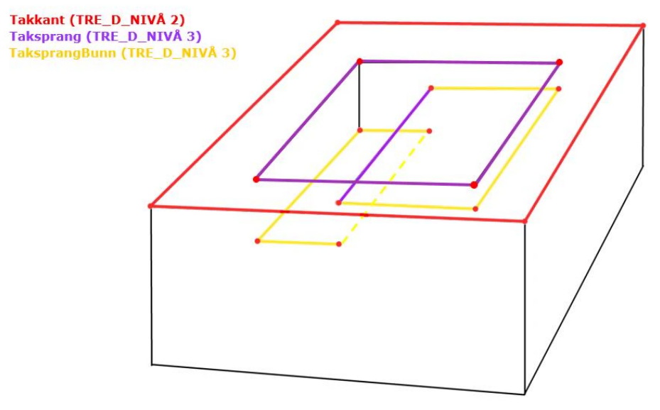

=== Fotogrammetrisk registreringsinstruks
Definisjon: 
=== Bygninger
Definisjon: 
|===
|===
 
==== «FeatureType» AnnenBygning
Definisjon: bygning som ikke er registrert  i matrikkelen
 
Tilleggsdefinisjon: Alle bygninger over minstem&#229;l som ikke har et bygningspunkt fra matrikkelen innenfor bygningsomriss (takkant) registreres som AnnenBygning (flategeometri). 
Busskur skal registreres som AnnenBygning dersom de er st&#248;rre minstem&#229;let.
Campingvogner skal ikke registreres. Spikertelt (permanent fortelt til campingvogn som typisk er laget av treverk) i tilknytning til campingvogn skal registreres dersom de er st&#248;rre en minstem&#229;let.
AnnenBygning skal ogs&#229; benyttes for plasthaller og brakker, selv om de er midlertidige.
AnnenBygning registreres med delt flategeometri.
 
.Illustrasjon av AnnenBygning fra produktspesifikasjonen
image::http://skjema.geonorge.no/SOSI/produktspesifikasjon/FKB-Bygning/5.0/figurer/objtype_annenbygning.png[link=http://skjema.geonorge.no/SOSI/produktspesifikasjon/FKB-Bygning/5.0/figurer/objtype_annenbygning.png]

.Figurene viser minstehøyde for AnnenBygning over 3m². Bygningen til venstre skal registreres ettersom minstehøyde ved høyeste taknivå er over 2m (grønn pil). Bygningen (hundehuset) til høyre skal ikke registreres ettersom minstehøyde ved høyeste taknivå er under 2m (rød pil).
image::figurer/annenbygning_minstehoyde.png[figurer/annenbygning_minstehoyde.png]
 
===== Føringer
[cols="20,80"]
|===
|FKB_grunnrissreferanse
|Se avgrensningsobjekttyper
 
|FKB_høydereferanse
|Se avgrengsningsobjekttyper
 
|FKB_minstestørrelse_A
|Areal  3m2 og høyde  2m
 
|FKB_minstestørrelse_B
|Areal  3m2 og høyde  2m
 
|FKB_minstestørrelse_C
|Areal  3m2 og høyde  2m
 
|FKB_minstestørrelse_D
|Areal  3m2 og høyde  2m
 
|FKB-A
|Påkrevd registrering
 
|FKB-B
|Påkrevd registrering
 
|FKB-C
|Påkrevd registrering
 
|FKB-D
|Påkrevd registrering
 
|===
 
===== Egenskapstabell
[cols="20,20,20,10"]
|===
|*Navn:* 
|*Type:* 
|*SOSI_navn:* 
|*Lengde:* 
 
|identifikasjon
|«dataType» Identifikasjon
|..IDENT
|[0..1]
 
|identifikasjon.lokalId
|CharacterString
|...LOKALID
|[1..1]
 
|identifikasjon.navnerom
|CharacterString
|...NAVNEROM
|[1..1]
 
|identifikasjon.versjonId
|CharacterString
|...VERSJONID
|[0..1]
 
|oppdateringsdato
|DateTime
|..OPPDATERINGSDATO
|[0..1]
 
|datafangstdato
|Date
|..DATAFANGSTDATO
|[1..1]
 
|verifiseringsdato
|Date
|..VERIFISERINGSDATO
|[0..1]
 
|registreringsversjon
|«CodeList» Registreringsversjon
|..REGISTRERINGSVERSJON
|[0..1]
 
|informasjon
|CharacterString
|..INFORMASJON
|[0..1]
 
|område
|Flate
|.FLATE
|[1..1]
 
|posisjon
|Punkt
|.PUNKT
|[0..1]
 
|medium
|«CodeList» Medium
|..MEDIUM
|[1..1]
 
|===
|===
|===
 
==== «FeatureType» Bygning
Definisjon: bygning som er registrert i matrikkelen
 
Tilleggsdefinisjon: Alle bygninger som har et bygningspunkt fra matrikkelen innenfor bygningsomriss (takkant) registreres som Bygning (flategeometri) i forbindelse med fotogrammetrisk registrering. Bygningspunktet fra matrikkelen beholdes som en punktgeometri (representasjonspunkt) p&#229; det samme objektet.

Bygning registreres med delt flategeometri. 
 
[caption="Figur  ",title=Figur fra produktspesifikasjonen]
image::http://skjema.geonorge.no/SOSI/produktspesifikasjon/FKB-Bygning/5.0/figurer/objtype_bygning.png[http://skjema.geonorge.no/SOSI/produktspesifikasjon/FKB-Bygning/5.0/figurer/objtype_bygning.png]
 
===== Føringer
[cols="20,80"]
|===
|FKB_grunnrissreferanse
|Se avgrensningsobjekttyper
 
|FKB_høydereferanse
|Se avgrensningsobjekttyper
 
|FKB-A
|Påkrevd registrering
 
|FKB-B
|Påkrevd registrering
 
|FKB-C
|Påkrevd registrering
 
|FKB-D
|Påkrevd registrering
 
|===
 
===== Egenskapstabell
[cols="20,20,20,10"]
|===
|*Navn:* 
|*Type:* 
|*SOSI_navn:* 
|*Lengde:* 
 
|identifikasjon
|«dataType» Identifikasjon
|..IDENT
|[0..1]
 
|identifikasjon.lokalId
|CharacterString
|...LOKALID
|[1..1]
 
|identifikasjon.navnerom
|CharacterString
|...NAVNEROM
|[1..1]
 
|identifikasjon.versjonId
|CharacterString
|...VERSJONID
|[0..1]
 
|oppdateringsdato
|DateTime
|..OPPDATERINGSDATO
|[0..1]
 
|datafangstdato
|Date
|..DATAFANGSTDATO
|[1..1]
 
|verifiseringsdato
|Date
|..VERIFISERINGSDATO
|[0..1]
 
|registreringsversjon
|«CodeList» Registreringsversjon
|..REGISTRERINGSVERSJON
|[0..1]
 
|informasjon
|CharacterString
|..INFORMASJON
|[0..1]
 
|område
|Flate
|.FLATE
|[0..1]
 
|posisjon
|Punkt
|.PUNKT
|[1..1]
 
|bygningsnummer
|«dataType» Integer
|..BYGGNR
|[1..1]
 
|bygningstype
|«CodeList» Bygningstype
|..BYGGTYP_NBR
|[1..1]
 
|bygningsstatus
|«CodeList» Bygningsstatus
|..BYGGSTAT
|[1..1]
 
|kommunenummer
|«CodeList» Kommunenummer
|..KOMM
|[1..1]
 
|medium
|«CodeList» Medium
|..MEDIUM
|[1..1]
 
|===
=== Bygningsavgrensning
Definisjon: 
|===
|===
 
==== «FeatureType» Takkant
Definisjon: bygningens ytre takflateavgrensing
Merknad: Høydereferansen er de målte punktene på taket. 
Merknad: Dersom deler av takkanten ikke er synlig kodes den synlige delen som takkant- og den ikke synlige som fiktiv bygningsavgrensning.
 
Tilleggsdefinisjon: Der det er sprang i taket som er mindre enn toleransen for 
stedfestingsn&#248;yaktigheten, registreres skr&#229;linjen fra h&#248;yeste punkt i takkanten til den laveste uten &#229; registrere et punkt i takkanten. 

Hvis et Taksprang eller Bygningslinje ender i et Taksprang som ligger under minstem&#229;l, skal punkt i taksprang likevel registreres. Det skal da lages nodepunkt mellom tilst&#248;tende linjer (vanlige noderegler).

Dersom deler av en bygning, registrert i matrikkelen, har ingen eller f&#229; vegger (Takoverbygg) benyttes Takkant uansett for hele bygningsavgrensningen.

Dersom deler av takkanten ikke er synlig kodes den synlige delen som takkant- og den ikke synlige som fiktiv bygningsavgrensning  (gjelder for bygninger som delvis ligger under terreng) .

Takkant skal sammen med Bygningsdelelinje og FiktivBygningsavgrensning danne avgrensning til AnnenBygning/Bygning.

Takkanten skal registreres sammenhengende i 3D. Unntaket er de tilfellene der det er et Taksprang. Da skal Takkanten kun henge sammen i 2D. 

Der Takkant henger sammen med beskrivende bygningslinjer 
skal det lages 3D-nodepunkt.

I de tilfeller der Takkant skal danne grunnriss som 
bygningsavgrensning for Bygning skal det dannes nodepunkt med Bygningsdelelinje. Nodepunktene skal v&#230;re i 3D der dette er naturlig.

Takkanter kan overlappe hverandre og takkanter kan overlappe Takoverbygg.

Takkant kan v&#230;re sammenfallende med TakoverbyggKant, 
Veranda, TrappBygg, L&#229;vebru eller Bygningsbru. Da registreres to frittst&#229;ende objekter. 
 
[caption="Figur  ",title=Figur fra produktspesifikasjonen]
image::http://skjema.geonorge.no/SOSI/produktspesifikasjon/FKB-Bygning/5.0/figurer/objtype_takkant.png[http://skjema.geonorge.no/SOSI/produktspesifikasjon/FKB-Bygning/5.0/figurer/objtype_takkant.png]
 
[Eksempel på registrering av takkant (takkant i rødt og taksprang i blått).]
image::figurer/takkant_nodepunkt.png[figurer/takkant_nodepunkt.png]
[caption="Figur  ",title= Eksempel på lovlige overlappende takkanter og bygningsflater. Takkant på hovedhus går over takkant på garasje. ]
image::figurer/takkant_overlapp.png[figurer/takkant_overlapp.png]
[caption="Figur  ",title= Delen av bygningsavgrensningen markert med piler er et takoverbygg (uten vegger). Siden takoverbygget inngår i en bygning registrert i matrikkelen, avgrenses dette med Takkant i likhet med resten av bygningsavgrensningen]
image::figurer/takkant_sammenhengende.png[figurer/takkant_sammenhengende.png]
[caption="Figur  ",title= Eksempler på registrering av takkant der det er en opphøyet kant ved takflaten. I disse tilfellene skal høyden på takkanten registreres på takplanet og ikke på de oppstikkende objektene. Takkant er tegnet med rød strek.]
image::figurer/takkant_takflate.png[figurer/takkant_takflate.png]
[caption="Figur  ",title= Eksempel på registrering av takkant for bygning med flatt tak (Takkant er tegnet i rødt, Taksprang er tegnet i blått). Det skal lages 2D nodepunkt i takkant som går over taksprang.]
image::figurer/takkant_taksprang_nodepunkt.png[figurer/takkant_taksprang_nodepunkt.png]
 
===== Føringer
[cols="20,80"]
|===
|FKB_grunnrissreferanse
|Ytterst på tak/takrenne/vindskie
 
|FKB_høydereferanse
|Takplanet
 
|FKB-A
|Påkrevd registrering
 
|FKB-B
|Påkrevd registrering
 
|FKB-C
|Påkrevd registrering
 
|FKB-C
|Påkrevd registrering
 
|FKB-D
|Påkrevd registrering
 
|===
 
===== Egenskapstabell
[cols="20,20,20,10"]
|===
|*Navn:* 
|*Type:* 
|*SOSI_navn:* 
|*Lengde:* 
 
|identifikasjon
|«dataType» Identifikasjon
|..IDENT
|[0..1]
 
|identifikasjon.lokalId
|CharacterString
|...LOKALID
|[1..1]
 
|identifikasjon.navnerom
|CharacterString
|...NAVNEROM
|[1..1]
 
|identifikasjon.versjonId
|CharacterString
|...VERSJONID
|[0..1]
 
|oppdateringsdato
|DateTime
|..OPPDATERINGSDATO
|[0..1]
 
|datafangstdato
|Date
|..DATAFANGSTDATO
|[1..1]
 
|verifiseringsdato
|Date
|..VERIFISERINGSDATO
|[0..1]
 
|registreringsversjon
|«CodeList» Registreringsversjon
|..REGISTRERINGSVERSJON
|[0..1]
 
|informasjon
|CharacterString
|..INFORMASJON
|[0..1]
 
|kvalitet
|«dataType» Posisjonskvalitet
|..KVALITET
|[1..1]
 
|kvalitet.datafangstmetode
|«CodeList» Datafangstmetode
|...DATAFANGSTMETODE
|[1..1]
 
|kvalitet.nøyaktighet
|Integer
|...NØYAKTIGHET
|[1..1]
 
|kvalitet.synbarhet
|«CodeList» Synbarhet
|...SYNBARHET
|[0..1]
 
|kvalitet.datafangstmetodeHøyde
|«CodeList» Datafangstmetode
|...DATAFANGSTMETODEHØYDE
|[0..1]
 
|kvalitet.nøyaktighetHøyde
|Integer
|...H-NØYAKTIGHET
|[0..1]
 
|grense
|Kurve
|.KURVE
|[1..1]
 
|medium
|«CodeList» Medium
|..MEDIUM
|[1..1]
 
|treDNivå
|«CodeList» TreDNivå
|..TRE_D_NIVÅ
|[1..1]
 
|takskjegg
|«dataType» Integer
|..TAKSKJEGG
|[0..1]
 
|===
|===
|===
 
==== «FeatureType» Fasadeliv
Definisjon: bygningens ytre avgrensing i fasaderiss
 
Tilleggsdefinisjon: Egner seg ikke for normal fotogrammetrisk registrering, med unntak for bygninger der ingen av veggene har takskjegg.

Fasadeliv kan brukes for bygningsavgrensning under bakken/bergrom o.l og skal da kodes med MEDIUM U.

Fasadeliv kan sammen med Bygningsdelelinje og 
FiktivBygningsavgrensning danne 
bygningsavgrensning til AnnenBygning/Bygning. Egenskapen SKAL_AVGRENSE_BYGNING settes da til JA (true).

 
[caption="Figur  ",title=Figur fra produktspesifikasjonen]
image::http://skjema.geonorge.no/SOSI/produktspesifikasjon/FKB-Bygning/5.0/figurer/objtype_fasadeliv.png[http://skjema.geonorge.no/SOSI/produktspesifikasjon/FKB-Bygning/5.0/figurer/objtype_fasadeliv.png]
 
[caption="Figur  ",title= Figuren viser forskjellen mellom Grunnmur, Fasadeliv og Takkant]
image::figurer/fasadeliv_takkant_grunnmur.png[figurer/fasadeliv_takkant_grunnmur.png]
 
===== Føringer
[cols="20,80"]
|===
|FKB_grunnrissreferanse
|Grunnrissreferanse er hovedfasade/hovedbygg
 
|FKB_høydereferanse
|Høydereferanse er fot eller topp fasadeliv. HREF benyttes for å angi 
høydereferanse.
 
|FKB-A
|Opsjonell registrering
 
|FKB-B
|Opsjonell registrering
 
|FKB-C
|Opsjonell registrering
 
|FKB-D
|Opsjonell registrering
 
|===
 
===== Egenskapstabell
[cols="20,20,20,10"]
|===
|*Navn:* 
|*Type:* 
|*SOSI_navn:* 
|*Lengde:* 
 
|identifikasjon
|«dataType» Identifikasjon
|..IDENT
|[0..1]
 
|identifikasjon.lokalId
|CharacterString
|...LOKALID
|[1..1]
 
|identifikasjon.navnerom
|CharacterString
|...NAVNEROM
|[1..1]
 
|identifikasjon.versjonId
|CharacterString
|...VERSJONID
|[0..1]
 
|oppdateringsdato
|DateTime
|..OPPDATERINGSDATO
|[0..1]
 
|datafangstdato
|Date
|..DATAFANGSTDATO
|[1..1]
 
|verifiseringsdato
|Date
|..VERIFISERINGSDATO
|[0..1]
 
|registreringsversjon
|«CodeList» Registreringsversjon
|..REGISTRERINGSVERSJON
|[0..1]
 
|informasjon
|CharacterString
|..INFORMASJON
|[0..1]
 
|kvalitet
|«dataType» Posisjonskvalitet
|..KVALITET
|[1..1]
 
|kvalitet.datafangstmetode
|«CodeList» Datafangstmetode
|...DATAFANGSTMETODE
|[1..1]
 
|kvalitet.nøyaktighet
|Integer
|...NØYAKTIGHET
|[1..1]
 
|kvalitet.synbarhet
|«CodeList» Synbarhet
|...SYNBARHET
|[0..1]
 
|kvalitet.datafangstmetodeHøyde
|«CodeList» Datafangstmetode
|...DATAFANGSTMETODEHØYDE
|[0..1]
 
|kvalitet.nøyaktighetHøyde
|Integer
|...H-NØYAKTIGHET
|[0..1]
 
|grense
|Kurve
|.KURVE
|[1..1]
 
|medium
|«CodeList» Medium
|..MEDIUM
|[1..1]
 
|høydereferanse
|«CodeList» Høydereferanse
|..HREF
|[1..1]
 
|skalAvgrenseBygning
|Boolean
|..SKAL_AVGR_BYGN
|[1..1]
 
|===
|===
|===
 
==== «FeatureType» Grunnmur
Definisjon: bygningens ytteravgrensning langs grunnmur
Merknad: Høydereferanse  angis med høydereferanse. Grunnrissreferanse er ytterkant av grunnmur.
Merknad: Kan benyttes for bygning under oppføring eller for bygning som er revet/nedbrent
 
Tilleggsdefinisjon: Grunnmur skal kun brukes for bygning under oppf&#248;ring. Revede bygg/ruiner skal ikke registreres som grunnmur men kan registreres som Ruin i FKB-BygnAnlegg.

Grunnmur kan sammen med Bygningsdelelinje og FiktivBygningsavgrensning danne bygningsavgrensning til AnnenBygning/Bygning. Dersom Takkant finnes, skal denne benyttes til &#229; danne bygningsavgrensning.

I de tilfeller der Grunnmur skal danne bygningsavgrensning skal det dannes nodepunkt med Bygningsdelelinje. Der Grunnmur henger sammen med beskrivende bygningslinjer skal det lages nodepunkt.

 
[caption="Figur  ",title=Figur fra produktspesifikasjonen]
image::http://skjema.geonorge.no/SOSI/produktspesifikasjon/FKB-Bygning/5.0/figurer/objtype_grunnmur.png[http://skjema.geonorge.no/SOSI/produktspesifikasjon/FKB-Bygning/5.0/figurer/objtype_grunnmur.png]
 
[caption="Figur  ",title= Grunnmur (se også figur under fasadeliv). Grunnmur er tegnet i blått]
image::figurer/grunnmur.png[figurer/grunnmur.png]
 
===== Føringer
[cols="20,80"]
|===
|FKB_grunnrissreferanse
|Ytterkant av grunnmur
 
|FKB_høydereferanse
|Topp grunnmur (angis med HREF = TOP)
 
|FKB-A
|Påkrevd registrering
 
|FKB-B
|Påkrevd registrering
 
|FKB-C
|Påkrevd registrering
 
|FKB-D
|Påkrevd registrering
 
|===
 
===== Egenskapstabell
[cols="20,20,20,10"]
|===
|*Navn:* 
|*Type:* 
|*SOSI_navn:* 
|*Lengde:* 
 
|identifikasjon
|«dataType» Identifikasjon
|..IDENT
|[0..1]
 
|identifikasjon.lokalId
|CharacterString
|...LOKALID
|[1..1]
 
|identifikasjon.navnerom
|CharacterString
|...NAVNEROM
|[1..1]
 
|identifikasjon.versjonId
|CharacterString
|...VERSJONID
|[0..1]
 
|oppdateringsdato
|DateTime
|..OPPDATERINGSDATO
|[0..1]
 
|datafangstdato
|Date
|..DATAFANGSTDATO
|[1..1]
 
|verifiseringsdato
|Date
|..VERIFISERINGSDATO
|[0..1]
 
|registreringsversjon
|«CodeList» Registreringsversjon
|..REGISTRERINGSVERSJON
|[0..1]
 
|informasjon
|CharacterString
|..INFORMASJON
|[0..1]
 
|kvalitet
|«dataType» Posisjonskvalitet
|..KVALITET
|[1..1]
 
|kvalitet.datafangstmetode
|«CodeList» Datafangstmetode
|...DATAFANGSTMETODE
|[1..1]
 
|kvalitet.nøyaktighet
|Integer
|...NØYAKTIGHET
|[1..1]
 
|kvalitet.synbarhet
|«CodeList» Synbarhet
|...SYNBARHET
|[0..1]
 
|kvalitet.datafangstmetodeHøyde
|«CodeList» Datafangstmetode
|...DATAFANGSTMETODEHØYDE
|[0..1]
 
|kvalitet.nøyaktighetHøyde
|Integer
|...H-NØYAKTIGHET
|[0..1]
 
|grense
|Kurve
|.KURVE
|[1..1]
 
|medium
|«CodeList» Medium
|..MEDIUM
|[1..1]
 
|høydereferanse
|«CodeList» Høydereferanse
|..HREF
|[1..1]
 
|===
|===
|===
 
==== «FeatureType» Bygningsdelelinje
Definisjon: linje mellom to bygninger (bygninger registrert i Matrikkelen) som står inntil hverandre
Merknad: Det kan ofte være vanskelig å registrere bygningsdelelinjer nøyaktig. Usikkerhet i fastleggelsen av bygningsdelelinjen skal synliggjøres gjennom kvalitetskoding (f.eks posisjonskvalitet 81 50).
 
Tilleggsdefinisjon: Bygningsdelelinje kan v&#230;re vanskelig &#229; registrere eksakt ved hjelp av fotogrammetri. Linjen skal imidlertid registreres s&#229; langt det lar seg gj&#248;re. Situasjonsdetaljer som hekk/gjerde kan brukes som grunnlag for &#229; vurdere hvor bygningsdelelinjen g&#229;r.

Der Bygningsdelelinje faller sammen med Taksprang, Bygningslinje eller M&#248;nelinje registreres alltid to objekter.

Bygningsdelelinje skal sammen med Takkant/Grunnmur/Fasadeliv og FiktivBygningsavgrensning danne avgrensning til AnnenBygning/Bygning.

Der Bygningsdelelinje m&#248;ter andre beskrivende bygningslinjer (m&#248;nelinje etc.), og har lik koordinat i grunnriss og h&#248;yde og samme TRE_D_NIV&#197;, skal det dannes et 3D nodepunkt.
 
[caption="Figur  ",title=Figur fra produktspesifikasjonen]
image::http://skjema.geonorge.no/SOSI/produktspesifikasjon/FKB-Bygning/5.0/figurer/objtype_bygningsdelelinje.png[http://skjema.geonorge.no/SOSI/produktspesifikasjon/FKB-Bygning/5.0/figurer/objtype_bygningsdelelinje.png]
 
[caption="Figur  ",title= Eksempel på registrering av bygningsdelelinje]
image::figurer/bygningsdelelinje_eksempel1.png[figurer/bygningsdelelinje_eksempel1.png]
[caption="Figur  ",title= Eksempel på registrering av bygningsdelelinje]
image::figurer/bygningsdelelinje_eksempel2.png[figurer/bygningsdelelinje_eksempel2.png]
 
===== Føringer
[cols="20,80"]
|===
|FKB_grunnrissreferanse
|Grunnrissreferanse er linjene den støter til (takkant, eller ev. grunnmur eller fasadeliv).
 
|FKB_høydereferanse
|Høyden skal følge hovedtakplanet
 
|FKB-A
|Påkrevd registrering
 
|FKB-B
|Påkrevd registrering
 
|FKB-C
|Påkrevd registrering
 
|FKB-D
|Påkrevd registrering
 
|===
 
===== Egenskapstabell
[cols="20,20,20,10"]
|===
|*Navn:* 
|*Type:* 
|*SOSI_navn:* 
|*Lengde:* 
 
|identifikasjon
|«dataType» Identifikasjon
|..IDENT
|[0..1]
 
|identifikasjon.lokalId
|CharacterString
|...LOKALID
|[1..1]
 
|identifikasjon.navnerom
|CharacterString
|...NAVNEROM
|[1..1]
 
|identifikasjon.versjonId
|CharacterString
|...VERSJONID
|[0..1]
 
|oppdateringsdato
|DateTime
|..OPPDATERINGSDATO
|[0..1]
 
|datafangstdato
|Date
|..DATAFANGSTDATO
|[1..1]
 
|verifiseringsdato
|Date
|..VERIFISERINGSDATO
|[0..1]
 
|registreringsversjon
|«CodeList» Registreringsversjon
|..REGISTRERINGSVERSJON
|[0..1]
 
|informasjon
|CharacterString
|..INFORMASJON
|[0..1]
 
|grense
|Kurve
|.KURVE
|[1..1]
 
|treDNivå
|«CodeList» TreDNivå
|..TRE_D_NIVÅ
|[1..1]
 
|===
|===
|===
 
==== «FeatureType» FiktivBygningsavgrensning
Definisjon: fiktiv avgrensing av bygning
Merknad: Brukes når deler av takkant, fasadeliv, grunnmur eller bygningsdelelinje er ukjent for at det skal bli mulig å danne en flate.  Fiktiv bygningsavgrensing benyttes også for å lage flater for underjordiske bygninger og som fiktiv linje på takoverbygg der takoverbyggkant mangler.
 
Tilleggsdefinisjon: Brukes n&#229;r deler av takkant, fasadeliv, grunnmur eller 
bygningsdelelinje er ukjent for at det skal bli mulig &#229; danne en flate. Fiktiv bygningsavgrensing benyttes ogs&#229; for &#229; lage flater for underjordiske bygninger.

 MEDIUM U benyttes for del av bygningsavgrensning som ligger under terreng.

FiktivBygningsavgrensning danner flater for bygning sammen med andre objekttyper som danner bygningsavgrensning. Det skal dannes nodepunkt mot tilst&#248;tende objekter. Nodepunktene lages i 3D der dette er naturlig

 
[caption="Figur  ",title=Figur fra produktspesifikasjonen]
image::http://skjema.geonorge.no/SOSI/produktspesifikasjon/FKB-Bygning/5.0/figurer/objtype_fiktivbygningsavgrensning.png[http://skjema.geonorge.no/SOSI/produktspesifikasjon/FKB-Bygning/5.0/figurer/objtype_fiktivbygningsavgrensning.png]
 
[caption="Figur  ",title= Eksempel på bruk av FiktivBygningsavgrensning (svart linje). Deler av bygningen går inn i terreng og det finnes ikke noe takkant. Dersom takkanten er usynlig på grunn av vegetasjon, registreres takkant og man benytter kvalitetskodingen for å angi dårlig synbarhet (rød stiplet linje).]
image::figurer/fiktivbygningsavgrensning.png[figurer/fiktivbygningsavgrensning.png]
 
===== Føringer
[cols="20,80"]
|===
|FKB_grunnrissreferanse
|Tilsvarende som objekttypen den er ment å erstatte
 
|FKB_høydereferanse
|Tilsvarende som objekttypen den er ment å erstatte
 
|FKB-A
|Påkrevd registrering
 
|FKB-B
|Påkrevd registrering
 
|FKB-C
|Påkrevd registrering
 
|FKB-D
|Påkrevd registrering
 
|===
 
===== Egenskapstabell
[cols="20,20,20,10"]
|===
|*Navn:* 
|*Type:* 
|*SOSI_navn:* 
|*Lengde:* 
 
|identifikasjon
|«dataType» Identifikasjon
|..IDENT
|[0..1]
 
|identifikasjon.lokalId
|CharacterString
|...LOKALID
|[1..1]
 
|identifikasjon.navnerom
|CharacterString
|...NAVNEROM
|[1..1]
 
|identifikasjon.versjonId
|CharacterString
|...VERSJONID
|[0..1]
 
|oppdateringsdato
|DateTime
|..OPPDATERINGSDATO
|[0..1]
 
|datafangstdato
|Date
|..DATAFANGSTDATO
|[1..1]
 
|verifiseringsdato
|Date
|..VERIFISERINGSDATO
|[0..1]
 
|registreringsversjon
|«CodeList» Registreringsversjon
|..REGISTRERINGSVERSJON
|[0..1]
 
|informasjon
|CharacterString
|..INFORMASJON
|[0..1]
 
|kvalitet
|«dataType» Posisjonskvalitet
|..KVALITET
|[0..1]
 
|kvalitet.datafangstmetode
|«CodeList» Datafangstmetode
|...DATAFANGSTMETODE
|[1..1]
 
|kvalitet.nøyaktighet
|Integer
|...NØYAKTIGHET
|[1..1]
 
|kvalitet.synbarhet
|«CodeList» Synbarhet
|...SYNBARHET
|[0..1]
 
|kvalitet.datafangstmetodeHøyde
|«CodeList» Datafangstmetode
|...DATAFANGSTMETODEHØYDE
|[0..1]
 
|kvalitet.nøyaktighetHøyde
|Integer
|...H-NØYAKTIGHET
|[0..1]
 
|grense
|Kurve
|.KURVE
|[1..1]
 
|medium
|«CodeList» Medium
|..
|[1..1]
 
|===
=== BeskrivendeBygningslinjer
Definisjon: 
|===
|===
 
==== «FeatureType» Arkade
Definisjon: avgrensing av en tunnel gjennom en bygning
 
Tilleggsdefinisjon: Kan registreres fotogrammetrisk ved innsyn. Dette avtales s&#230;rskilt. En arkade som best&#229;r av flatt tak regnes ogs&#229; som en arkade.

Registreres som lukket polygon.
 
[caption="Figur  ",title=Figur fra produktspesifikasjonen]
image::http://skjema.geonorge.no/SOSI/produktspesifikasjon/FKB-Bygning/5.0/figurer/objtype_arkade.png[http://skjema.geonorge.no/SOSI/produktspesifikasjon/FKB-Bygning/5.0/figurer/objtype_arkade.png]
 
===== Føringer
[cols="20,80"]
|===
|FKB_grunnrissreferanse
|Ytterkant arkade
 
|FKB_høydereferanse
|Tak eller gulv i arkade (bruk HREF). Primært registreres topp
 
|FKB-A
|Opsjonell registrering
 
|FKB-B
|Opsjonell registrering
 
|FKB-C
|Registreres ikke
 
|FKB-D
|Registreres ikke
 
|===
 
===== Egenskapstabell
[cols="20,20,20,10"]
|===
|*Navn:* 
|*Type:* 
|*SOSI_navn:* 
|*Lengde:* 
 
|identifikasjon
|«dataType» Identifikasjon
|..IDENT
|[0..1]
 
|identifikasjon.lokalId
|CharacterString
|...LOKALID
|[1..1]
 
|identifikasjon.navnerom
|CharacterString
|...NAVNEROM
|[1..1]
 
|identifikasjon.versjonId
|CharacterString
|...VERSJONID
|[0..1]
 
|oppdateringsdato
|DateTime
|..OPPDATERINGSDATO
|[0..1]
 
|datafangstdato
|Date
|..DATAFANGSTDATO
|[1..1]
 
|verifiseringsdato
|Date
|..VERIFISERINGSDATO
|[0..1]
 
|registreringsversjon
|«CodeList» Registreringsversjon
|..REGISTRERINGSVERSJON
|[0..1]
 
|informasjon
|CharacterString
|..INFORMASJON
|[0..1]
 
|kvalitet
|«dataType» Posisjonskvalitet
|..KVALITET
|[1..1]
 
|kvalitet.datafangstmetode
|«CodeList» Datafangstmetode
|...DATAFANGSTMETODE
|[1..1]
 
|kvalitet.nøyaktighet
|Integer
|...NØYAKTIGHET
|[1..1]
 
|kvalitet.synbarhet
|«CodeList» Synbarhet
|...SYNBARHET
|[0..1]
 
|kvalitet.datafangstmetodeHøyde
|«CodeList» Datafangstmetode
|...DATAFANGSTMETODEHØYDE
|[0..1]
 
|kvalitet.nøyaktighetHøyde
|Integer
|...H-NØYAKTIGHET
|[0..1]
 
|treDNivå
|«CodeList» TreDNivå
|..TRE_D_NIVÅ
|[1..1]
 
|høydereferanse
|«CodeList» Høydereferanse
|..HREF
|[1..1]
 
|grense
|Kurve
|.KURVE
|[1..1]
 
|===
|===
|===
 
==== «FeatureType» Bygningslinje
Definisjon: linje som beskriver bygningsdetalj innenfor en takflate  og som ikke kan beskrives av andre objekttyper
Eksempel: Valming på tak
 
Tilleggsdefinisjon: Der Bygningslinje m&#248;ter andre beskrivende bygningslinjer, og har lik koordinat i grunnriss og h&#248;yde og samme TRE_D_NIV&#197;, skal det dannes et 3D nodepunkt. Nodepunkt mellom objekter med ulike TRE_D_NIV&#197;-ene er ikke n&#248;dvendig.

Der Bygningslinje m&#248;ter Taksprang p&#229; et h&#248;yere takplan eller Bygningslinje med et h&#248;yere TRE_D_NIV&#197; og p&#229; et h&#248;yere takplan, skal det lages et konnekteringspunkt.

Bygningslinje og Bygningsdelelinje kan v&#230;re sammenfallende. Da registreres to frittst&#229;ende objekter. Bygningslinje og M&#248;nelinje kan v&#230;re sammenfallende. Da registreres to frittst&#229;ende objekter. 

Ventilasjonsr&#248;r p&#229; tak skal ikke registreres som bygningsdetalj.
For takoppbrett som g&#229;r opp til m&#248;nelinje, skal det registreres b&#229;de M&#248;nelinje (TRE_D_NIV&#197; 2) og Bygningslinje (TRE_D_NIV&#197; 3). 

Dersom det er takoppbrett med lik utstrekning p&#229; begge sider av m&#248;nelinje, skal det registreres en felles bygningslinje (TRE_D_NIV&#197; 3) p&#229; toppen av m&#248;nelinje (TRE_D_NIV&#197; 2 ). 

Bygningslinje registreres ikke som un&#248;yaktig, dvs. enten er 
bygningslinja OK eller s&#229; registreres den ikke i det hele tatt.
 
[caption="Figur  ",title=Figur fra produktspesifikasjonen]
image::http://skjema.geonorge.no/SOSI/produktspesifikasjon/FKB-Bygning/5.0/figurer/objtype_bygningslinje.png[http://skjema.geonorge.no/SOSI/produktspesifikasjon/FKB-Bygning/5.0/figurer/objtype_bygningslinje.png]
 
[caption="Figur  ",title= Eksempel på registrering av bygningslinjer (tegnet i rødt)]
image::figurer/bygningslinje_eksempel1.png[figurer/bygningslinje_eksempel1.png]
[caption="Figur  ",title= Eksempel på registrering av takoppbrett. Mønelinje og Bygningslinje skal registreres parallelt på topp møne. Her har mønelinja og bygningslinja ulikt TRE_D_NIVÅ og det skal derfor ikke lages nodepunkt i mønelinja. I tilfeller med takoppbrett på begge sider av mønet, skal disse ha en felles bygningslinje langs mønelinja. ]
image::figurer/bygningslinje_eksempel2.png[figurer/bygningslinje_eksempel2.png]
 
===== Føringer
[cols="20,80"]
|===
|FKB_grunnrissreferanse
|Topp/bunn/ytterkant av knekklinjer (knekkpunkter) i taket
 
|FKB_høydereferanse
|Topp/bunn av knekklinjer (knekkpunkter) i taket
 
|FKB_minstestørrelse_A
|Bygningslinje skal benyttes for å registrere objekter (den oppstikkende detaljen på taket som 
omsluttes objekttypen Bygningslinje) med volum større enn 2 m3
 
|FKB_minstestørrelse_B
|Bygningslinje skal benyttes for å registrere objekter (den oppstikkende detaljen på taket som 
omsluttes objekttypen Bygningslinje) med volum større enn 7.5 m3.
 
|FKB_minstestørrelse_C
|Bygningslinje (TRE_D_NIVÅ 2) skal benyttes for å registrere hovedformen på takflater, for eksempel 
der mønelinja ikke når ut til takkant (valmet tak). Det registreres ikke oppstikkende objekter 
(TRE_D_NIVÅ 3) 
 
|FKB_minstestørrelse_D
|Bygningslinje (TRE_D_NIVÅ 2) skal benyttes for å registrere hovedformen på takflater, for eksempel 
der mønelinja ikke når ut til takkant (valmet tak). Det registreres ikke oppstikkende objekter 
(TRE_D_NIVÅ 3) 
 
|FKB-A
|Påkrevd registrering
 
|FKB-B
|Påkrevd registrering
 
|FKB-C
|Påkrevd registrering
 
|FKB-D
|Påkrevd registrering
 
|===
 
===== Egenskapstabell
[cols="20,20,20,10"]
|===
|*Navn:* 
|*Type:* 
|*SOSI_navn:* 
|*Lengde:* 
 
|identifikasjon
|«dataType» Identifikasjon
|..IDENT
|[0..1]
 
|identifikasjon.lokalId
|CharacterString
|...LOKALID
|[1..1]
 
|identifikasjon.navnerom
|CharacterString
|...NAVNEROM
|[1..1]
 
|identifikasjon.versjonId
|CharacterString
|...VERSJONID
|[0..1]
 
|oppdateringsdato
|DateTime
|..OPPDATERINGSDATO
|[0..1]
 
|datafangstdato
|Date
|..DATAFANGSTDATO
|[1..1]
 
|verifiseringsdato
|Date
|..VERIFISERINGSDATO
|[0..1]
 
|registreringsversjon
|«CodeList» Registreringsversjon
|..REGISTRERINGSVERSJON
|[0..1]
 
|informasjon
|CharacterString
|..INFORMASJON
|[0..1]
 
|kvalitet
|«dataType» Posisjonskvalitet
|..KVALITET
|[1..1]
 
|kvalitet.datafangstmetode
|«CodeList» Datafangstmetode
|...DATAFANGSTMETODE
|[1..1]
 
|kvalitet.nøyaktighet
|Integer
|...NØYAKTIGHET
|[1..1]
 
|kvalitet.synbarhet
|«CodeList» Synbarhet
|...SYNBARHET
|[0..1]
 
|kvalitet.datafangstmetodeHøyde
|«CodeList» Datafangstmetode
|...DATAFANGSTMETODEHØYDE
|[0..1]
 
|kvalitet.nøyaktighetHøyde
|Integer
|...H-NØYAKTIGHET
|[0..1]
 
|treDNivå
|«CodeList» TreDNivå
|..TRE_D_NIVÅ
|[1..1]
 
|grense
|Kurve
|.KURVE
|[1..1]
 
|===
|===
|===
 
==== «FeatureType» Hjelpelinje3D
Definisjon: linje for å kunne danne gode 3D modeller av bygninger
 
Tilleggsdefinisjon: Hjelpelinjer inne p&#229; tak som skal benyttes for volumdanning av 
bygningen. Disse skal ikke presenteres p&#229; kart.

Der Hjelpelinje3D m&#248;ter andre beskrivende bygningslinjer, og har lik koordinat i grunnriss og h&#248;yde og samme TRE_D_NIV&#197;, skal det dannes et 3D nodepunkt. Der Hjelpelinje3D m&#248;ter Taksprang p&#229; et h&#248;yere takplan eller Bygningslinje med et h&#248;yere TRE_D_NIV&#197; og p&#229; et h&#248;yere takplan, skal det lages et konnekteringspunkt.
 
[caption="Figur  ",title=Figur fra produktspesifikasjonen]
image::http://skjema.geonorge.no/SOSI/produktspesifikasjon/FKB-Bygning/5.0/figurer/objtype_hjelpelinje3d.png[http://skjema.geonorge.no/SOSI/produktspesifikasjon/FKB-Bygning/5.0/figurer/objtype_hjelpelinje3d.png]
 
[caption="Figur  ",title= Eksempel på et bygg der man må benytte Hjelpelinje3D for å kunne beskrive hovedbygget fullstendig. I eksemplet over til venstre må de røde knekklinjene registreres for å kunne gi en full beskrivelse av takoverflaten. Hvis ikke vil det bli løse bygningslinjer slik det er vist i figuren til høyre. De røde knekklinjene i dette tilfellet skal registreres med Hjelpelinje3D.]
image::figurer/hjelpelinje3d_fullstendig.png[figurer/hjelpelinje3d_fullstendig.png]
[caption="Figur  ",title= Prinsippskisser som viser bruk av Hjelpelinje3D for kuppel og spir. I figuren under vises hva som menes med pilhøyde. I de fleste tilfeller vil det være bunnen av den krumme flaten man må ta utgangspunkt i for å vurdere hvor tett det skal være med hjelpelinjer.]
image::figurer/hjelpelinje3d_pilhoyde.png[figurer/hjelpelinje3d_pilhoyde.png]
[caption="Figur  ",title= Eksempel på et bygg der man må benytte Hjelpelinje3D for å kunne beskrive hovedbygget fullstendig]
image::figurer/hjelpelinje3d_tredniva.png[figurer/hjelpelinje3d_tredniva.png]
 
===== Føringer
[cols="20,80"]
|===
|FKB_grunnrissreferanse
|knekklinje i takoverflaten
 
|FKB_høydereferanse
|Takplanet
 
|FKB_minstestørrelse
|krav til maksimal pilhøyde 50 cm
 
|FKB_minstestørrelse_A
|krav til maksimal pilhøyde 20 cm
 
|FKB_minstestørrelse_C
|krav til maksimal pilhøyde 100 cm
 
|FKB_minstestørrelse_D
|krav til maksimal pilhøyde 100 cm
 
|FKB-A
|Påkrevd registrering
 
|FKB-B
|Påkrevd registrering
 
|FKB-C
|Påkrevd registrering
 
|FKB-C
|Påkrevd registrering
 
|FKB-D
|Påkrevd registrering
 
|===
 
===== Egenskapstabell
[cols="20,20,20,10"]
|===
|*Navn:* 
|*Type:* 
|*SOSI_navn:* 
|*Lengde:* 
 
|identifikasjon
|«dataType» Identifikasjon
|..IDENT
|[0..1]
 
|identifikasjon.lokalId
|CharacterString
|...LOKALID
|[1..1]
 
|identifikasjon.navnerom
|CharacterString
|...NAVNEROM
|[1..1]
 
|identifikasjon.versjonId
|CharacterString
|...VERSJONID
|[0..1]
 
|oppdateringsdato
|DateTime
|..OPPDATERINGSDATO
|[0..1]
 
|datafangstdato
|Date
|..DATAFANGSTDATO
|[1..1]
 
|verifiseringsdato
|Date
|..VERIFISERINGSDATO
|[0..1]
 
|registreringsversjon
|«CodeList» Registreringsversjon
|..REGISTRERINGSVERSJON
|[0..1]
 
|informasjon
|CharacterString
|..INFORMASJON
|[0..1]
 
|kvalitet
|«dataType» Posisjonskvalitet
|..KVALITET
|[1..1]
 
|kvalitet.datafangstmetode
|«CodeList» Datafangstmetode
|...DATAFANGSTMETODE
|[1..1]
 
|kvalitet.nøyaktighet
|Integer
|...NØYAKTIGHET
|[1..1]
 
|kvalitet.synbarhet
|«CodeList» Synbarhet
|...SYNBARHET
|[0..1]
 
|kvalitet.datafangstmetodeHøyde
|«CodeList» Datafangstmetode
|...DATAFANGSTMETODEHØYDE
|[0..1]
 
|kvalitet.nøyaktighetHøyde
|Integer
|...H-NØYAKTIGHET
|[0..1]
 
|treDNivå
|«CodeList» TreDNivå
|..TRE_D_NIVÅ
|[1..1]
 
|senterlinje
|Kurve
|.KURVE
|[1..1]
 
|===
|===
|===
 
==== «FeatureType» Mønelinje
Definisjon: linje som beskriver den horisontale knekklinje på toppen av taket (høyeste topp)
 
Tilleggsdefinisjon: Det skal registreres m&#248;nelinjer p&#229; alle bygninger, arker, tilbygg og takoverbygg. Registreres kun der hvor knekklinjer er definerbare.

Der M&#248;nelinje m&#248;ter andre beskrivende bygningslinjer, og har lik koordinat i grunnriss og h&#248;yde og samme TRE_D_NIV&#197;, skal det dannes et 3D nodepunkt. Der M&#248;nelinje m&#248;ter Taksprang p&#229; et h&#248;yere takplan eller Bygningslinje med et h&#248;yere TRE_D_NIV&#197; og p&#229; et h&#248;yere takplan, skal det lages et konnekteringspunkt.

For takoppbrett som g&#229;r opp til m&#248;nelinje, skal det registreres b&#229;de M&#248;nelinje (TRE_D_NIV&#197; 2) og Bygningslinje (TRE_D_NIV&#197; 3). Dersom det er takoppbrett med lik utstrekning p&#229; begge sider av m&#248;nelinje, skal det registreres en felles bygningslinje (TRE_D_NIV&#197; 3) p&#229; toppen av m&#248;nelinje (TRE_D_NIV&#197; 2 ). 

N&#229;r Bygningslinje (TRE_D_NIV&#197; 3) og M&#248;nelinje ( TRE_D_NIV&#197; 2) er sammenfallende i 3D registreres to frittst&#229;ende objekter. Nodepunkt mellom de ulike TRE_D_NIV&#197;-ene er ikke n&#248;dvendig. 
 
[caption="Figur  ",title=Figur fra produktspesifikasjonen]
image::http://skjema.geonorge.no/SOSI/produktspesifikasjon/FKB-Bygning/5.0/figurer/objtype_monelinje.png[http://skjema.geonorge.no/SOSI/produktspesifikasjon/FKB-Bygning/5.0/figurer/objtype_monelinje.png]
 
[caption="Figur  ",title= Eksempel på registrering av mønelinje. Mønelinje er tegnet grønt]
image::figurer/monelinje_eksempel.png[figurer/monelinje_eksempel.png]
 
===== Føringer
[cols="20,80"]
|===
|FKB_grunnrissreferanse
|Topp møne ved skrå takflater
 
|FKB_høydereferanse
|Topp møne ved skrå takflater
 
|FKB-A
|Påkrevd registrering
 
|FKB-B
|Påkrevd registrering
 
|FKB-C
|Påkrevd registrering
 
|FKB-D
|Påkrevd registrering
 
|===
 
===== Egenskapstabell
[cols="20,20,20,10"]
|===
|*Navn:* 
|*Type:* 
|*SOSI_navn:* 
|*Lengde:* 
 
|identifikasjon
|«dataType» Identifikasjon
|..IDENT
|[0..1]
 
|identifikasjon.lokalId
|CharacterString
|...LOKALID
|[1..1]
 
|identifikasjon.navnerom
|CharacterString
|...NAVNEROM
|[1..1]
 
|identifikasjon.versjonId
|CharacterString
|...VERSJONID
|[0..1]
 
|oppdateringsdato
|DateTime
|..OPPDATERINGSDATO
|[0..1]
 
|datafangstdato
|Date
|..DATAFANGSTDATO
|[1..1]
 
|verifiseringsdato
|Date
|..VERIFISERINGSDATO
|[0..1]
 
|registreringsversjon
|«CodeList» Registreringsversjon
|..REGISTRERINGSVERSJON
|[0..1]
 
|informasjon
|CharacterString
|..INFORMASJON
|[0..1]
 
|kvalitet
|«dataType» Posisjonskvalitet
|..KVALITET
|[1..1]
 
|kvalitet.datafangstmetode
|«CodeList» Datafangstmetode
|...DATAFANGSTMETODE
|[1..1]
 
|kvalitet.nøyaktighet
|Integer
|...NØYAKTIGHET
|[1..1]
 
|kvalitet.synbarhet
|«CodeList» Synbarhet
|...SYNBARHET
|[0..1]
 
|kvalitet.datafangstmetodeHøyde
|«CodeList» Datafangstmetode
|...DATAFANGSTMETODEHØYDE
|[0..1]
 
|kvalitet.nøyaktighetHøyde
|Integer
|...H-NØYAKTIGHET
|[0..1]
 
|treDNivå
|«CodeList» TreDNivå
|..TRE_D_NIVÅ
|[1..1]
 
|grense
|Kurve
|.KURVE
|[1..1]
 
|===
|===
|===
 
==== «FeatureType» Portrom
Definisjon: avgrensing av en tunnel gjennom en bygning
 
Tilleggsdefinisjon: Kan registreres fotogrammetrisk ved innsyn. Dette avtales s&#230;rskilt.
 

 Registreres som lukket polygon.

 
[caption="Figur  ",title=Figur fra produktspesifikasjonen]
image::http://skjema.geonorge.no/SOSI/produktspesifikasjon/FKB-Bygning/5.0/figurer/objtype_portrom.png[http://skjema.geonorge.no/SOSI/produktspesifikasjon/FKB-Bygning/5.0/figurer/objtype_portrom.png]
 
===== Føringer
[cols="20,80"]
|===
|FKB_grunnrissreferanse
|Ytterkant portrom
 
|FKB_høydereferanse
|Tak eller gulv i portrom (bruk HREF). Primært registreres topp.
 
|FKB-A
|Opsjonell registrering
 
|FKB-B
|Opsjonell registrering
 
|FKB-C
|Registreres ikke
 
|FKB-D
|Registreres ikke
 
|===
 
===== Egenskapstabell
[cols="20,20,20,10"]
|===
|*Navn:* 
|*Type:* 
|*SOSI_navn:* 
|*Lengde:* 
 
|identifikasjon
|«dataType» Identifikasjon
|..IDENT
|[0..1]
 
|identifikasjon.lokalId
|CharacterString
|...LOKALID
|[1..1]
 
|identifikasjon.navnerom
|CharacterString
|...NAVNEROM
|[1..1]
 
|identifikasjon.versjonId
|CharacterString
|...VERSJONID
|[0..1]
 
|oppdateringsdato
|DateTime
|..OPPDATERINGSDATO
|[0..1]
 
|datafangstdato
|Date
|..DATAFANGSTDATO
|[1..1]
 
|verifiseringsdato
|Date
|..VERIFISERINGSDATO
|[0..1]
 
|registreringsversjon
|«CodeList» Registreringsversjon
|..REGISTRERINGSVERSJON
|[0..1]
 
|informasjon
|CharacterString
|..INFORMASJON
|[0..1]
 
|kvalitet
|«dataType» Posisjonskvalitet
|..KVALITET
|[1..1]
 
|kvalitet.datafangstmetode
|«CodeList» Datafangstmetode
|...DATAFANGSTMETODE
|[1..1]
 
|kvalitet.nøyaktighet
|Integer
|...NØYAKTIGHET
|[1..1]
 
|kvalitet.synbarhet
|«CodeList» Synbarhet
|...SYNBARHET
|[0..1]
 
|kvalitet.datafangstmetodeHøyde
|«CodeList» Datafangstmetode
|...DATAFANGSTMETODEHØYDE
|[0..1]
 
|kvalitet.nøyaktighetHøyde
|Integer
|...H-NØYAKTIGHET
|[0..1]
 
|treDNivå
|«CodeList» TreDNivå
|..TRE_D_NIVÅ
|[1..1]
 
|grense
|Kurve
|.KURVE
|[1..1]
 
|høydereferanse
|«CodeList» Høydereferanse
|..HREF
|[1..1]
 
|===
|===
|===
 
==== «FeatureType» Takmur
Definisjon: opphøyde kanter ved takkant
Merknad: Eksempel på kanter der TakMur skal benyttes er gavlvegger og brannvegger som stikker opp over takflaten
 
[caption="Figur  ",title=Figur fra produktspesifikasjonen]
image::http://skjema.geonorge.no/SOSI/produktspesifikasjon/FKB-Bygning/5.0/figurer/objtype_takmur.png[http://skjema.geonorge.no/SOSI/produktspesifikasjon/FKB-Bygning/5.0/figurer/objtype_takmur.png]
 
===== Føringer
[cols="20,80"]
|===
|FKB_grunnrissreferanse
|Senter TakMur
 
|FKB_høydereferanse
|Topp TakMur
 
|FKB_minstestørrelse_A
|TakMur med høyde større en 0.5 meter registreres
 
|FKB-A
|Opsjonell registrering
 
|FKB-B
|Registreres ikke
 
|FKB-C
|Registreres ikke
 
|FKB-D
|Registreres ikke
 
|===
 
===== Egenskapstabell
[cols="20,20,20,10"]
|===
|*Navn:* 
|*Type:* 
|*SOSI_navn:* 
|*Lengde:* 
 
|identifikasjon
|«dataType» Identifikasjon
|..IDENT
|[0..1]
 
|identifikasjon.lokalId
|CharacterString
|...LOKALID
|[1..1]
 
|identifikasjon.navnerom
|CharacterString
|...NAVNEROM
|[1..1]
 
|identifikasjon.versjonId
|CharacterString
|...VERSJONID
|[0..1]
 
|oppdateringsdato
|DateTime
|..OPPDATERINGSDATO
|[0..1]
 
|datafangstdato
|Date
|..DATAFANGSTDATO
|[1..1]
 
|verifiseringsdato
|Date
|..VERIFISERINGSDATO
|[0..1]
 
|registreringsversjon
|«CodeList» Registreringsversjon
|..REGISTRERINGSVERSJON
|[0..1]
 
|informasjon
|CharacterString
|..INFORMASJON
|[0..1]
 
|kvalitet
|«dataType» Posisjonskvalitet
|..KVALITET
|[1..1]
 
|kvalitet.datafangstmetode
|«CodeList» Datafangstmetode
|...DATAFANGSTMETODE
|[1..1]
 
|kvalitet.nøyaktighet
|Integer
|...NØYAKTIGHET
|[1..1]
 
|kvalitet.synbarhet
|«CodeList» Synbarhet
|...SYNBARHET
|[0..1]
 
|kvalitet.datafangstmetodeHøyde
|«CodeList» Datafangstmetode
|...DATAFANGSTMETODEHØYDE
|[0..1]
 
|kvalitet.nøyaktighetHøyde
|Integer
|...H-NØYAKTIGHET
|[0..1]
 
|treDNivå
|«CodeList» TreDNivå
|..TRE_D_NIVÅ
|[1..1]
 
|grense
|Kurve
|.KURVE
|[1..1]
 
|===
|===
|===
 
==== «FeatureType» Takplatå
Definisjon: innsøkk i form av laveste vannrette flate på hovedvolum på bygningskropp
Eksempel: Arker som går inn i hovedtaket og "terrasse" inne i en bygård.
 
Tilleggsdefinisjon: Pga. manglende innsyn kan det v&#230;re vanskelig med fotogrammetrisk registrering av innerste kant p&#229; takplat&#229;.

Selv om det er oppf&#248;rt entydige krav til minstem&#229;l, vil det alltid v&#230;r et tolkingssp&#248;rsm&#229;l om hvilke objekter som skal registreres. Minstem&#229;lene m&#229; derfor oppfattes som veiledende

Der Takplat&#229; m&#248;ter andre beskrivende bygningslinjer, og har lik 
koordinat i grunnriss og h&#248;yde og samme TRE_D_NIV&#197;, skal det dannes et 3D nodepunkt. Der Takplat&#229; m&#248;ter Taksprang p&#229; et h&#248;yere takplan eller Bygningslinje med et h&#248;yere TRE_D_NIV&#197; og p&#229; et h&#248;yere takplan, skal det lages et konnekteringspunkt. 

 
[caption="Figur  ",title=Figur fra produktspesifikasjonen]
image::http://skjema.geonorge.no/SOSI/produktspesifikasjon/FKB-Bygning/5.0/figurer/objtype_takplata.png[http://skjema.geonorge.no/SOSI/produktspesifikasjon/FKB-Bygning/5.0/figurer/objtype_takplata.png]
 
[caption="Figur  ",title= Eksempel på registrering av Takplatå (tegnet i grønt) for ”innoverarker”]
image::figurer/takplata_eksempel1.png[figurer/takplata_eksempel1.png]
[caption="Figur  ",title= Eksempel på registrering av Takplatå i en bygård med indre rom]
image::figurer/takplata_eksempel2.png[figurer/takplata_eksempel2.png]
 
===== Føringer
[cols="20,80"]
|===
|FKB_grunnrissreferanse
|Omriss i gulvnivå (som ved takterrasse innfelt i hovedtakflate)
 
|FKB_høydereferanse
|Høydereferanse er laveste flate. I bygård med lavereliggende tak vil 
man registrere på nivå med lavere tak inne i bygård.
 
|FKB_minstestørrelse_A
|Takplatå tas med hvis volum er større enn 5 m3
 
|FKB_minstestørrelse_B
|Takplatå tas med hvis volum er større enn 15 m3
 
|FKB-A
|Påkrevd registrering
 
|FKB-B
|Påkrevd registrering
 
|FKB-C
|Registreres ikke
 
|FKB-D
|Registreres ikke
 
|===
 
===== Egenskapstabell
[cols="20,20,20,10"]
|===
|*Navn:* 
|*Type:* 
|*SOSI_navn:* 
|*Lengde:* 
 
|identifikasjon
|«dataType» Identifikasjon
|..IDENT
|[0..1]
 
|identifikasjon.lokalId
|CharacterString
|...LOKALID
|[1..1]
 
|identifikasjon.navnerom
|CharacterString
|...NAVNEROM
|[1..1]
 
|identifikasjon.versjonId
|CharacterString
|...VERSJONID
|[0..1]
 
|oppdateringsdato
|DateTime
|..OPPDATERINGSDATO
|[0..1]
 
|datafangstdato
|Date
|..DATAFANGSTDATO
|[1..1]
 
|verifiseringsdato
|Date
|..VERIFISERINGSDATO
|[0..1]
 
|registreringsversjon
|«CodeList» Registreringsversjon
|..REGISTRERINGSVERSJON
|[0..1]
 
|informasjon
|CharacterString
|..INFORMASJON
|[0..1]
 
|kvalitet
|«dataType» Posisjonskvalitet
|..KVALITET
|[1..1]
 
|kvalitet.datafangstmetode
|«CodeList» Datafangstmetode
|...DATAFANGSTMETODE
|[1..1]
 
|kvalitet.nøyaktighet
|Integer
|...NØYAKTIGHET
|[1..1]
 
|kvalitet.synbarhet
|«CodeList» Synbarhet
|...SYNBARHET
|[0..1]
 
|kvalitet.datafangstmetodeHøyde
|«CodeList» Datafangstmetode
|...DATAFANGSTMETODEHØYDE
|[0..1]
 
|kvalitet.nøyaktighetHøyde
|Integer
|...H-NØYAKTIGHET
|[0..1]
 
|treDNivå
|«CodeList» TreDNivå
|..TRE_D_NIVÅ
|[1..1]
 
|grense
|Kurve
|.KURVE
|[1..1]
 
|===
|===
|===
 
==== «FeatureType» TakplatåTopp
Definisjon: takkant i indre rom i byg&#229;rder der det indre rommet ikke g&#229;r ned til terrengoverflaten
MERKNAD: Objekttypen skal benyttes som en utfyllende linje for &#229; beskrive bygningsvolumet. Benyttes kun der Takplat&#229; er benyttet for &#229; beskrive tak inne i en bygning (for eksempel en byg&#229;rd).
 
Tilleggsdefinisjon: For &#229; kunne danne virkelighetstro volumobjekter av FKB-dataene er det &#248;nskelig &#229; ha registrert s&#229; mange beskrivende linjer som mulig. For byg&#229;rder kan det v&#230;re en fordel &#229; registrere Takplat&#229;Topp i tillegg til andre beskrivende bygningslinjer. Dette gjelder spesielt i byomr&#229;der (FKB-A). 

Der Takplat&#229;Topp m&#248;ter andre beskrivende bygningslinjer, og har lik koordinat i grunnriss og h&#248;yde og samme TRE_D_NIV&#197;, skal det dannes et 3D nodepunkt. Der Takplat&#229;Topp m&#248;ter Taksprang p&#229; et h&#248;yere takplan eller Bygningslinje med et h&#248;yere TRE_D_NIV&#197; og p&#229; et h&#248;yere takplan, skal det lages et konnekteringspunkt.

 
[caption="Figur  ",title=Figur fra produktspesifikasjonen]
image::http://skjema.geonorge.no/SOSI/produktspesifikasjon/FKB-Bygning/5.0/figurer/objtype_takplatatopp.png[http://skjema.geonorge.no/SOSI/produktspesifikasjon/FKB-Bygning/5.0/figurer/objtype_takplatatopp.png]
 
[caption="Figur  ",title= Eksempel på registrering av TakplatåTopp (mørk grønn linje)]
image::figurer/takplatatopp_eksempel.png[figurer/takplatatopp_eksempel.png]
 
===== Føringer
[cols="20,80"]
|===
|FKB_grunnrissreferanse
|Topp takrenne eller topp ytterkant tak. Dersom det er registrert en 
opphøyet kant på taket (TakMur), skal fremdeles takhøyden 
registreres.
 
|FKB_høydereferanse
|Ytterst på tak/takrenne/vindskie
 
|FKB-A
|Opsjonell registrering
 
|FKB-B
|Registreres ikke
 
|FKB-C
|Registreres ikke
 
|FKB-D
|Registreres ikke
 
|===
 
===== Egenskapstabell
[cols="20,20,20,10"]
|===
|*Navn:* 
|*Type:* 
|*SOSI_navn:* 
|*Lengde:* 
 
|identifikasjon
|«dataType» Identifikasjon
|..IDENT
|[0..1]
 
|identifikasjon.lokalId
|CharacterString
|...LOKALID
|[1..1]
 
|identifikasjon.navnerom
|CharacterString
|...NAVNEROM
|[1..1]
 
|identifikasjon.versjonId
|CharacterString
|...VERSJONID
|[0..1]
 
|oppdateringsdato
|DateTime
|..OPPDATERINGSDATO
|[0..1]
 
|datafangstdato
|Date
|..DATAFANGSTDATO
|[1..1]
 
|verifiseringsdato
|Date
|..VERIFISERINGSDATO
|[0..1]
 
|registreringsversjon
|«CodeList» Registreringsversjon
|..REGISTRERINGSVERSJON
|[0..1]
 
|informasjon
|CharacterString
|..INFORMASJON
|[0..1]
 
|kvalitet
|«dataType» Posisjonskvalitet
|..KVALITET
|[1..1]
 
|kvalitet.datafangstmetode
|«CodeList» Datafangstmetode
|...DATAFANGSTMETODE
|[1..1]
 
|kvalitet.nøyaktighet
|Integer
|...NØYAKTIGHET
|[1..1]
 
|kvalitet.synbarhet
|«CodeList» Synbarhet
|...SYNBARHET
|[0..1]
 
|kvalitet.datafangstmetodeHøyde
|«CodeList» Datafangstmetode
|...DATAFANGSTMETODEHØYDE
|[0..1]
 
|kvalitet.nøyaktighetHøyde
|Integer
|...H-NØYAKTIGHET
|[0..1]
 
|treDNivå
|«CodeList» TreDNivå
|..TRE_D_NIVÅ
|[1..1]
 
|grense
|Kurve
|.KURVE
|[1..1]
 
|===
|===
|===
 
==== «FeatureType» Taksprang
Definisjon: topp av takkant inne på en bygningskropp
Merknad: ikke ytterkant som registreres som takkant
 
Tilleggsdefinisjon: Taksprang f&#248;lger reelle kanter p&#229; tak. Dvs. en linje som viser kantene langs takniv&#229;er, p&#229; h&#248;yeste takflate av de to der det er h&#248;ydeforskjell.
Taksprang skal registreres der h&#248;ydeforskjellen mellom to takplan (hele eller deler av takspranget) er st&#248;rre enn kravet til stedfestingsn&#248;yaktighet i h&#248;yde.
Der Taksprang m&#248;ter andre beskrivende bygningslinjer, og har lik koordinat i grunnriss og h&#248;yde og samme TRE_D_NIV&#197;, skal det dannes et 3D nodepunkt. Der Taksprang m&#248;ter Taksprang p&#229; et h&#248;yere takplan eller Bygningslinje med et h&#248;yere TRE_D_NIV&#197; og p&#229; et h&#248;yere takplan, skal det lages et konnekteringspunkt.
Bygningsdelelinje og Taksprang kan v&#230;re sammenfallende. Da registreres to frittst&#229;ende objekter. 

 
[caption="Figur  ",title=Figur fra produktspesifikasjonen]
image::http://skjema.geonorge.no/SOSI/produktspesifikasjon/FKB-Bygning/5.0/figurer/objtype_taksprang.png[http://skjema.geonorge.no/SOSI/produktspesifikasjon/FKB-Bygning/5.0/figurer/objtype_taksprang.png]
 
[caption="Figur  ",title= Eksempel på registrering av Taksprang (blå linje) og Takkant (rød linje).]
image::figurer/taksprang_eksempel.png[figurer/taksprang_eksempel.png]
 
===== Føringer
[cols="20,80"]
|===
|FKB_grunnrissreferanse
|Ytterst på tak/takrenne/vindskie. For flate tak registreres ytterkant 
vegg.
 
|FKB_høydereferanse
|Takplan
 
|FKB-A
|Påkrevd registrering
 
|FKB-B
|Påkrevd registrering
 
|FKB-C
|Påkrevd registrering
 
|FKB-D
|Påkrevd registrering
 
|===
 
===== Egenskapstabell
[cols="20,20,20,10"]
|===
|*Navn:* 
|*Type:* 
|*SOSI_navn:* 
|*Lengde:* 
 
|identifikasjon
|«dataType» Identifikasjon
|..IDENT
|[0..1]
 
|identifikasjon.lokalId
|CharacterString
|...LOKALID
|[1..1]
 
|identifikasjon.navnerom
|CharacterString
|...NAVNEROM
|[1..1]
 
|identifikasjon.versjonId
|CharacterString
|...VERSJONID
|[0..1]
 
|oppdateringsdato
|DateTime
|..OPPDATERINGSDATO
|[0..1]
 
|datafangstdato
|Date
|..DATAFANGSTDATO
|[1..1]
 
|verifiseringsdato
|Date
|..VERIFISERINGSDATO
|[0..1]
 
|registreringsversjon
|«CodeList» Registreringsversjon
|..REGISTRERINGSVERSJON
|[0..1]
 
|informasjon
|CharacterString
|..INFORMASJON
|[0..1]
 
|kvalitet
|«dataType» Posisjonskvalitet
|..KVALITET
|[1..1]
 
|kvalitet.datafangstmetode
|«CodeList» Datafangstmetode
|...DATAFANGSTMETODE
|[1..1]
 
|kvalitet.nøyaktighet
|Integer
|...NØYAKTIGHET
|[1..1]
 
|kvalitet.synbarhet
|«CodeList» Synbarhet
|...SYNBARHET
|[0..1]
 
|kvalitet.datafangstmetodeHøyde
|«CodeList» Datafangstmetode
|...DATAFANGSTMETODEHØYDE
|[0..1]
 
|kvalitet.nøyaktighetHøyde
|Integer
|...H-NØYAKTIGHET
|[0..1]
 
|treDNivå
|«CodeList» TreDNivå
|..TRE_D_NIVÅ
|[1..1]
 
|grense
|Kurve
|.KURVE
|[1..1]
 
|===
|===
|===
 
==== «FeatureType» TaksprangBunn
Definisjon: bunn av takkant inne på en bygningskropp 
Merknad: Ikke ytterkant som er takkant
 
Tilleggsdefinisjon: TaksprangBunn skal om mulig v&#230;re sammenfallende i grunnriss  som det tilh&#248;rende Taksprang-objektet. 
TaksprangBunn f&#248;lger alltid takplanet, g&#229;r ikke gjennom luft eller bygning. 
Det er tillatt &#229; generere TaksprangBunn ut fra andre registrerte objekter.
Der TaksprangBunn m&#248;ter andre beskrivende bygningslinjer, og har lik koordinat i grunnriss og h&#248;yde og samme TRE_D_NIV&#197;, skal det dannes et 3D nodepunkt. Der TaksprangBunn m&#248;ter Taksprang/TaksprangBunn p&#229; et h&#248;yere takplan eller Bygningslinje med et h&#248;yere TRE_D_NIV&#197; og p&#229; et h&#248;yere takplan, skal det lages et konnekteringspunkt
 
[caption="Figur  ",title=Figur fra produktspesifikasjonen]
image::http://skjema.geonorge.no/SOSI/produktspesifikasjon/FKB-Bygning/5.0/figurer/objtype_taksprangbunn.png[http://skjema.geonorge.no/SOSI/produktspesifikasjon/FKB-Bygning/5.0/figurer/objtype_taksprangbunn.png]
 
[caption="Figur  ",title= Eksempel på registrering av TaksprangBunn (blå linje) og Takkant (rød linje)]
image::figurer/taksprangbunn_eksempel1.png[figurer/taksprangbunn_eksempel1.png]
[caption="Figur  ",title= Eksempel på registrering av Taksprang og TaksprangBunn i en bygård med indre rom.]

 
===== Føringer
[cols="20,80"]
|===
|FKB_grunnrissreferanse
|Der øvre takkant blir projisert ned på nedre tak
 
|FKB_høydereferanse
|På nedre takplan
 
|FKB-A
|Påkrevd registrering
 
|FKB-B
|Påkrevd registrering
 
|FKB-C
|Registreres ikke
 
|FKB-D
|Registreres ikke
 
|===
 
===== Egenskapstabell
[cols="20,20,20,10"]
|===
|*Navn:* 
|*Type:* 
|*SOSI_navn:* 
|*Lengde:* 
 
|identifikasjon
|«dataType» Identifikasjon
|..IDENT
|[0..1]
 
|identifikasjon.lokalId
|CharacterString
|...LOKALID
|[1..1]
 
|identifikasjon.navnerom
|CharacterString
|...NAVNEROM
|[1..1]
 
|identifikasjon.versjonId
|CharacterString
|...VERSJONID
|[0..1]
 
|oppdateringsdato
|DateTime
|..OPPDATERINGSDATO
|[0..1]
 
|datafangstdato
|Date
|..DATAFANGSTDATO
|[1..1]
 
|verifiseringsdato
|Date
|..VERIFISERINGSDATO
|[0..1]
 
|registreringsversjon
|«CodeList» Registreringsversjon
|..REGISTRERINGSVERSJON
|[0..1]
 
|informasjon
|CharacterString
|..INFORMASJON
|[0..1]
 
|kvalitet
|«dataType» Posisjonskvalitet
|..KVALITET
|[1..1]
 
|kvalitet.datafangstmetode
|«CodeList» Datafangstmetode
|...DATAFANGSTMETODE
|[1..1]
 
|kvalitet.nøyaktighet
|Integer
|...NØYAKTIGHET
|[1..1]
 
|kvalitet.synbarhet
|«CodeList» Synbarhet
|...SYNBARHET
|[0..1]
 
|kvalitet.datafangstmetodeHøyde
|«CodeList» Datafangstmetode
|...DATAFANGSTMETODEHØYDE
|[0..1]
 
|kvalitet.nøyaktighetHøyde
|Integer
|...H-NØYAKTIGHET
|[0..1]
 
|treDNivå
|«CodeList» TreDNivå
|..TRE_D_NIVÅ
|[1..1]
 
|grense
|Kurve
|.KURVE
|[1..1]
 
|===
|===
|===
 
==== «CodeList» TreDNivå
Definisjon: 
 
===== Tagged Values
[cols="20,80"]
|===
|===
=== Bygningsvedheng
Definisjon: 
|===
|===
 
==== «FeatureType» BygningBru
Definisjon: bru tilknyttet bygning som brukes som adkomst til bygninger, og bruer mellom bygninger
Merknad:  Brukes på bygninger som ikke er driftsbygninger i landbruket. I det siste tilfellet brukes låvebru
 
Tilleggsdefinisjon: BygningBru brukes ogs&#229; for ramper til bygg, f.eks. for tilgang for rullestol og varelevering.

BygningBru kan v&#230;re sammenfallende med takkant, men skal 
alltid v&#230;re fullstendig og sammenhengende registrert. Takkant og BygningBru registreres som to frittst&#229;ende objekt.

 
[caption="Figur  ",title=Figur fra produktspesifikasjonen]
image::http://skjema.geonorge.no/SOSI/produktspesifikasjon/FKB-Bygning/5.0/figurer/objtype_bygningbru.png[http://skjema.geonorge.no/SOSI/produktspesifikasjon/FKB-Bygning/5.0/figurer/objtype_bygningbru.png]
 
===== Føringer
[cols="20,80"]
|===
|FKB_grunnrissreferanse
|Ytterkant av bru. Registreres som sammenhengende polygon
 
|FKB_høydereferanse
|Gulv
 
|FKB-A
|Påkrevd registrering
 
|FKB-B
|Påkrevd registrering
 
|FKB-C
|Registreres ikke
 
|FKB-D
|Registreres ikke
 
|===
 
===== Egenskapstabell
[cols="20,20,20,10"]
|===
|*Navn:* 
|*Type:* 
|*SOSI_navn:* 
|*Lengde:* 
 
|identifikasjon
|«dataType» Identifikasjon
|..IDENT
|[0..1]
 
|identifikasjon.lokalId
|CharacterString
|...LOKALID
|[1..1]
 
|identifikasjon.navnerom
|CharacterString
|...NAVNEROM
|[1..1]
 
|identifikasjon.versjonId
|CharacterString
|...VERSJONID
|[0..1]
 
|oppdateringsdato
|DateTime
|..OPPDATERINGSDATO
|[0..1]
 
|datafangstdato
|Date
|..DATAFANGSTDATO
|[1..1]
 
|verifiseringsdato
|Date
|..VERIFISERINGSDATO
|[0..1]
 
|registreringsversjon
|«CodeList» Registreringsversjon
|..REGISTRERINGSVERSJON
|[0..1]
 
|informasjon
|CharacterString
|..INFORMASJON
|[0..1]
 
|kvalitet
|«dataType» Posisjonskvalitet
|..KVALITET
|[1..1]
 
|kvalitet.datafangstmetode
|«CodeList» Datafangstmetode
|...DATAFANGSTMETODE
|[1..1]
 
|kvalitet.nøyaktighet
|Integer
|...NØYAKTIGHET
|[1..1]
 
|kvalitet.synbarhet
|«CodeList» Synbarhet
|...SYNBARHET
|[0..1]
 
|kvalitet.datafangstmetodeHøyde
|«CodeList» Datafangstmetode
|...DATAFANGSTMETODEHØYDE
|[0..1]
 
|kvalitet.nøyaktighetHøyde
|Integer
|...H-NØYAKTIGHET
|[0..1]
 
|grense
|Kurve
|.KURVE
|[1..1]
 
|===
|===
|===
 
==== «FeatureType» Låvebru
Definisjon: kjørerampe til et landbruksbygg
Merknad: Kjørerampe i tilknytning til et industri og lagerbygg beskrives som Annet vegareal/avkjørsel og Brukonstruksjon
 
Tilleggsdefinisjon: L&#229;vebru registreres som sammenhengende polygon.

L&#229;vebru kan v&#230;re sammenfallende med Takkant, men skal alltid v&#230;re fullstendig og sammenhengende registrert. Takkant og L&#229;vebru registreres som to frittst&#229;ende objekt.

 
[caption="Figur  ",title=Figur fra produktspesifikasjonen]
image::http://skjema.geonorge.no/SOSI/produktspesifikasjon/FKB-Bygning/5.0/figurer/objtype_lavebru.png[http://skjema.geonorge.no/SOSI/produktspesifikasjon/FKB-Bygning/5.0/figurer/objtype_lavebru.png]
 
[caption="Figur  ",title= Skisse som viser registrering av Låvebru]
image::figurer/lavebru_skisse.png[figurer/lavebru_skisse.png]
 
===== Føringer
[cols="20,80"]
|===
|FKB_grunnrissreferanse
|Ytterkant av låvebru
 
|FKB_høydereferanse
|Topp låvebrukjørebane, eventuelt bakken ved start låvebru
 
|FKB-A
|Påkrevd registrering
 
|FKB-B
|Påkrevd registrering
 
|FKB-C
|Registreres ikke
 
|FKB-D
|Registreres ikke
 
|===
 
===== Egenskapstabell
[cols="20,20,20,10"]
|===
|*Navn:* 
|*Type:* 
|*SOSI_navn:* 
|*Lengde:* 
 
|identifikasjon
|«dataType» Identifikasjon
|..IDENT
|[0..1]
 
|identifikasjon.lokalId
|CharacterString
|...LOKALID
|[1..1]
 
|identifikasjon.navnerom
|CharacterString
|...NAVNEROM
|[1..1]
 
|identifikasjon.versjonId
|CharacterString
|...VERSJONID
|[0..1]
 
|oppdateringsdato
|DateTime
|..OPPDATERINGSDATO
|[0..1]
 
|datafangstdato
|Date
|..DATAFANGSTDATO
|[1..1]
 
|verifiseringsdato
|Date
|..VERIFISERINGSDATO
|[0..1]
 
|registreringsversjon
|«CodeList» Registreringsversjon
|..REGISTRERINGSVERSJON
|[0..1]
 
|informasjon
|CharacterString
|..INFORMASJON
|[0..1]
 
|kvalitet
|«dataType» Posisjonskvalitet
|..KVALITET
|[1..1]
 
|kvalitet.datafangstmetode
|«CodeList» Datafangstmetode
|...DATAFANGSTMETODE
|[1..1]
 
|kvalitet.nøyaktighet
|Integer
|...NØYAKTIGHET
|[1..1]
 
|kvalitet.synbarhet
|«CodeList» Synbarhet
|...SYNBARHET
|[0..1]
 
|kvalitet.datafangstmetodeHøyde
|«CodeList» Datafangstmetode
|...DATAFANGSTMETODEHØYDE
|[0..1]
 
|kvalitet.nøyaktighetHøyde
|Integer
|...H-NØYAKTIGHET
|[0..1]
 
|grense
|Kurve
|.KURVE
|[1..1]
 
|===
|===
|===
 
==== «FeatureType» TrappBygg
Definisjon: omfatter trapper som danner adkomsten til hus og trapp inntil hus
 
Tilleggsdefinisjon: TrappBygg skal benyttes n&#229;r trappa st&#229;r inntil takkanten og/eller veranda tilknyttet bygning. Trapper som ikke st&#229;r i tilknytning til en bygning registreres i datasettet bygningsmessige anlegg.

TrappBygg kan v&#230;re sammenfallende med Takkant og/eller Veranda, men skal alltid v&#230;re fullstendig og sammenhengende registrert. TrappBygg og Takkant/Veranda registreres som to frittst&#229;ende objekt

Ved fotogrammetrisk registrering kan det v&#230;re vanskelig &#229; registrere trapp p&#229; grunn av manglende innsyn i flybildene. Det skal komme frem ved koding av N&#216;YAKTIGHET og SYNBARHET.
 
[caption="Figur  ",title=Figur fra produktspesifikasjonen]
image::http://skjema.geonorge.no/SOSI/produktspesifikasjon/FKB-Bygning/5.0/figurer/objtype_trappbygg.png[http://skjema.geonorge.no/SOSI/produktspesifikasjon/FKB-Bygning/5.0/figurer/objtype_trappbygg.png]
 
[caption="Figur  ",title= Skisse som viser registrering av TrappBygg]
image::figurer/trappbygg_skisse.png[figurer/trappbygg_skisse.png]
[caption="Figur  ",title= Eksempel på registrering av forskjellige typer TrappBygg (blå linje)]
image::figurer/trappbygg_eksempel.png[figurer/trappbygg_eksempel.png]
 
===== Føringer
[cols="20,80"]
|===
|FKB_grunnrissreferanse
|Ytterkant av trapp
 
|FKB_høydereferanse
|Topp og fot av trappa (trappas skråplan)
 
|FKB_minstestørrelse_A
|Alle synlige trapper
 
|FKB_minstestørrelse_B
|Areal  6m2 (regnet fra takkant)
 
|FKB-A
|Påkrevd registrering
 
|FKB-B
|Påkrevd registrering
 
|FKB-C
|Registreres ikke
 
|FKB-D
|Registreres ikke
 
|===
 
===== Egenskapstabell
[cols="20,20,20,10"]
|===
|*Navn:* 
|*Type:* 
|*SOSI_navn:* 
|*Lengde:* 
 
|identifikasjon
|«dataType» Identifikasjon
|..IDENT
|[0..1]
 
|identifikasjon.lokalId
|CharacterString
|...LOKALID
|[1..1]
 
|identifikasjon.navnerom
|CharacterString
|...NAVNEROM
|[1..1]
 
|identifikasjon.versjonId
|CharacterString
|...VERSJONID
|[0..1]
 
|oppdateringsdato
|DateTime
|..OPPDATERINGSDATO
|[0..1]
 
|datafangstdato
|Date
|..DATAFANGSTDATO
|[1..1]
 
|verifiseringsdato
|Date
|..VERIFISERINGSDATO
|[0..1]
 
|registreringsversjon
|«CodeList» Registreringsversjon
|..REGISTRERINGSVERSJON
|[0..1]
 
|informasjon
|CharacterString
|..INFORMASJON
|[0..1]
 
|kvalitet
|«dataType» Posisjonskvalitet
|..KVALITET
|[1..1]
 
|kvalitet.datafangstmetode
|«CodeList» Datafangstmetode
|...DATAFANGSTMETODE
|[1..1]
 
|kvalitet.nøyaktighet
|Integer
|...NØYAKTIGHET
|[1..1]
 
|kvalitet.synbarhet
|«CodeList» Synbarhet
|...SYNBARHET
|[0..1]
 
|kvalitet.datafangstmetodeHøyde
|«CodeList» Datafangstmetode
|...DATAFANGSTMETODEHØYDE
|[0..1]
 
|kvalitet.nøyaktighetHøyde
|Integer
|...H-NØYAKTIGHET
|[0..1]
 
|grense
|Kurve
|.KURVE
|[1..1]
 
|===
|===
|===
 
==== «FeatureType» Veranda
Definisjon: bygningsvedheng som omfatter veranda,  terrasse, altan, balkong og lasterampe
Merknad: Garasje med veranda på taket er enten en del av bygningsenheten den ligger til eller - hvis den er tildelt eget bygningsnummer - en bygning.
 
Tilleggsdefinisjon: Veranda registreres som sammenhengende polygon. 

Det skal skilles p&#229; om veranda ligger p&#229; tak (takterrasse), p&#229; vegg (veranda, balkong, altan) og p&#229; terreng (terrasse). Dette gj&#248;res for &#229; kunne lage gode 3D-modeller. Egenskapen MEDIUM (med verdiene T for objekter p&#229; terrenget, L for objekter p&#229; vegg og B for objekter p&#229; tak) benyttes for &#229; gj&#248;re dette skillet. Dersom en veranda ligger for eksempel b&#229;de p&#229; tak og p&#229; terreng, skal veranda splittes slik at MEDIUM viser faktisk situasjon. 

P&#229; tak registreres veranda (MEDIUM B) kun der det er rekkverk/vegg med h&#248;ydereferanse topp. I en del tilfeller kan det v&#230;re at en veranda delvis har rekkverk. Som hovedregel registreres fot veranda i slike tilfeller. Verandaer p&#229; tak har ikke krav om lukking.

Plattinger som ligger p&#229; terreng og som er helt uten rekkverk registreres ikke som veranda. Plattinger som ligger minst 40 cm over terrengniv&#229;et skal registreres som Veranda (selv om rekkverk mangler).

Veranda kan v&#230;re sammenfallende med Takkant. Takkant og Veranda da registreres da som to frittst&#229;ende objekt. 

Som standard skal h&#248;ydereferanse (HREF) benyttes slik: HREF TOP (topp rekkverk) benyttes p&#229; takterrasse, HREF FOT (gulvniv&#229;) benyttes p&#229; terrasser p&#229; terreng og det er valgfritt om ..HREF TOP eller FOT benyttes for veranda p&#229; vegg.
 
[caption="Figur  ",title=Figur fra produktspesifikasjonen]
image::http://skjema.geonorge.no/SOSI/produktspesifikasjon/FKB-Bygning/5.0/figurer/objtype_veranda.png[http://skjema.geonorge.no/SOSI/produktspesifikasjon/FKB-Bygning/5.0/figurer/objtype_veranda.png]
 
[caption="Figur  ",title= Skisse som viser registrering av Veranda med forskjellig verdier av MEDIUM og HREF]
image::figurer/veranda_skisse.png[figurer/veranda_skisse.png]
[caption="Figur  ",title= Eksempel på registrering av Veranda med forskjellige høydereferanser (ikke alle Verandaer på bildet er illustrert med en egen strek)]
image::figurer/veranda_eksempel.png[figurer/veranda_eksempel.png]
[caption="Figur  ",title= Registrering av veranda (rød linje) i blokk. Alle verandaene skal registreres. I bildet til høyre skal det også registreres takoverbygg på toppen (blå linje).]
image::figurer/veranda_blokk.png[figurer/veranda_blokk.png]
[caption="Figur  ",title= Figur som viser prinsippene for registrering av verandaer med høydesprang. Dersom høydesprangene er over 50cm skal det registreres høydesprang som på bildet nederst.]
image::figurer/veranda_hoydesprang.png[figurer/veranda_hoydesprang.png]
[caption="Figur  ",title= Veranda skal registreres også under Takoverbygg på verandaen]
image::figurer/veeranda_takoverbygg.png[figurer/veeranda_takoverbygg.png]
 
===== Føringer
[cols="20,80"]
|===
|FKB_grunnrissreferanse
|Ytterkant veranda
 
|FKB_høydereferanse
|Det skal angis hvilken høydereferanse (HREF) som er benyttet ved 
registrering. For verandaer på tak (MEDIUM B) skal 
høydereferansen være topp.
 
|FKB_minstestørrelse_A
|Veranda med areal større enn 2 m2 (regnet fra takkant)
 
|FKB_minstestørrelse_B
|Veranda med areal større enn 6 m2 (regnet fra takkant)
 
|FKB-A
|Påkrevd registrering
 
|FKB-B
|Påkrevd registrering
 
|FKB-C
|Registreres ikke
 
|FKB-D
|Registreres ikke
 
|===
 
===== Egenskapstabell
[cols="20,20,20,10"]
|===
|*Navn:* 
|*Type:* 
|*SOSI_navn:* 
|*Lengde:* 
 
|identifikasjon
|«dataType» Identifikasjon
|..IDENT
|[0..1]
 
|identifikasjon.lokalId
|CharacterString
|...LOKALID
|[1..1]
 
|identifikasjon.navnerom
|CharacterString
|...NAVNEROM
|[1..1]
 
|identifikasjon.versjonId
|CharacterString
|...VERSJONID
|[0..1]
 
|oppdateringsdato
|DateTime
|..OPPDATERINGSDATO
|[0..1]
 
|datafangstdato
|Date
|..DATAFANGSTDATO
|[1..1]
 
|verifiseringsdato
|Date
|..VERIFISERINGSDATO
|[0..1]
 
|registreringsversjon
|«CodeList» Registreringsversjon
|..REGISTRERINGSVERSJON
|[0..1]
 
|informasjon
|CharacterString
|..INFORMASJON
|[0..1]
 
|kvalitet
|«dataType» Posisjonskvalitet
|..KVALITET
|[1..1]
 
|kvalitet.datafangstmetode
|«CodeList» Datafangstmetode
|...DATAFANGSTMETODE
|[1..1]
 
|kvalitet.nøyaktighet
|Integer
|...NØYAKTIGHET
|[1..1]
 
|kvalitet.synbarhet
|«CodeList» Synbarhet
|...SYNBARHET
|[0..1]
 
|kvalitet.datafangstmetodeHøyde
|«CodeList» Datafangstmetode
|...DATAFANGSTMETODEHØYDE
|[0..1]
 
|kvalitet.nøyaktighetHøyde
|Integer
|...H-NØYAKTIGHET
|[0..1]
 
|grense
|Kurve
|.KURVE
|[1..1]
 
|høydereferanse
|«CodeList» Høydereferanse
|..HREF
|[1..1]
 
|medium
|«CodeList» Medium
|..MEDIUM
|[1..1]
 
|===
|===
|===
 
==== «FeatureType» Veggfrittstående
Definisjon: vegg oppsatt for skjerming
 
Tilleggsdefinisjon: Ved registrering av topp vegg skal alle knekklinjer registreres. Dersom det er h&#248;ydesprang st&#248;rre enn 0,5 meter, skal disse registreres som sprang.

Det skal lages nodepunkt til eventuelle tilst&#248;tende situasjonsdetaljer. Avhengig av situasjon dannes nodepunktet i 2D eller 3D. Konnekteres til bygninger og lignende der veggen g&#229;r inn til slike.
 
[caption="Figur  ",title=Figur fra produktspesifikasjonen]
image::http://skjema.geonorge.no/SOSI/produktspesifikasjon/FKB-Bygning/5.0/figurer/objtype_veggfrittstaende.png[http://skjema.geonorge.no/SOSI/produktspesifikasjon/FKB-Bygning/5.0/figurer/objtype_veggfrittstaende.png]
 
[caption="Figur  ",title= Viser prinsippene for registrering av skillevegger i forbindelse med rekkehus]
image::figurer/veggfrittstaende_skisse.png[figurer/veggfrittstaende_skisse.png]
 
===== Føringer
[cols="20,80"]
|===
|FKB_grunnrissreferanse
|Senter vegg

 
|FKB_høydereferanse
|Topp vegg
 
|FKB_minstestørrelse_A
|Høyere enn 1.5 meter og lengre enn 1 meter
 
|FKB_minstestørrelse_B
|Høyere enn 1.5 meter og lengre enn 2 meter
 
|FKB-A
|Påkrevd registrering
 
|FKB-B
|Påkrevd registrering
 
|FKB-C
|Registreres ikke
 
|FKB-D
|Registreres ikke
 
|===
 
===== Egenskapstabell
[cols="20,20,20,10"]
|===
|*Navn:* 
|*Type:* 
|*SOSI_navn:* 
|*Lengde:* 
 
|identifikasjon
|«dataType» Identifikasjon
|..IDENT
|[0..1]
 
|identifikasjon.lokalId
|CharacterString
|...LOKALID
|[1..1]
 
|identifikasjon.navnerom
|CharacterString
|...NAVNEROM
|[1..1]
 
|identifikasjon.versjonId
|CharacterString
|...VERSJONID
|[0..1]
 
|oppdateringsdato
|DateTime
|..OPPDATERINGSDATO
|[0..1]
 
|datafangstdato
|Date
|..DATAFANGSTDATO
|[1..1]
 
|verifiseringsdato
|Date
|..VERIFISERINGSDATO
|[0..1]
 
|registreringsversjon
|«CodeList» Registreringsversjon
|..REGISTRERINGSVERSJON
|[0..1]
 
|informasjon
|CharacterString
|..INFORMASJON
|[0..1]
 
|kvalitet
|«dataType» Posisjonskvalitet
|..KVALITET
|[1..1]
 
|kvalitet.datafangstmetode
|«CodeList» Datafangstmetode
|...DATAFANGSTMETODE
|[1..1]
 
|kvalitet.nøyaktighet
|Integer
|...NØYAKTIGHET
|[1..1]
 
|kvalitet.synbarhet
|«CodeList» Synbarhet
|...SYNBARHET
|[0..1]
 
|kvalitet.datafangstmetodeHøyde
|«CodeList» Datafangstmetode
|...DATAFANGSTMETODEHØYDE
|[0..1]
 
|kvalitet.nøyaktighetHøyde
|Integer
|...H-NØYAKTIGHET
|[0..1]
 
|grense
|Kurve
|.KURVE
|[1..1]
 
|høydereferanse
|«CodeList» Høydereferanse
|..HREF
|[1..1]
 
|medium
|«CodeList» Medium
|..MEDIUM
|[1..1]
 
|===
=== Takoverbygg
Definisjon: 
|===
|===
 
==== «FeatureType» Takoverbygg
Definisjon: byggverk med ingen eller få vegger, og som ikke er registrert som bygning i matrikkelen
Eksempel:  'carport' eller tak over bensinpumper
 
Tilleggsdefinisjon: Takoverbygg avgrenses av TakoverbyggKant og/eller FiktivBygningsavgrensning.

Takoverbygg skal registreres p&#229; samme m&#229;te som et tak p&#229; et bygg ved at den f&#248;lger takkanten opp til evt. m&#248;ne osv. Takoverbygget kan ogs&#229; inneholde m&#248;nelinje og bygningslinje for &#229; bedre beskrive formen, dvs. alle knekklinjer p&#229; takoverflaten skal registreres.

Det kan ogs&#229; v&#230;re aktuelt &#229; registrere takoverbygg over verandaer, over verandaer p&#229; tak, over gangbruer, over trapper til bygg osv. dersom objektet er st&#248;rre enn minstem&#229;l. Det er kun tette tak som registreres, ikke pergola ol. 

Ved evt. sprang i TakoverbyggKant registreres separate Takoverbygg-objekter.

Ved fotogrammetrisk registrering kan det v&#230;re vanskelig &#229; registrere hele omrisset p&#229; grunn av manglende innsyn i flybildene. Det skal komme frem ved koding av N&#216;YAKTIGHET og SYNBARHET.

 
[caption="Figur  ",title=Figur fra produktspesifikasjonen]
image::http://skjema.geonorge.no/SOSI/produktspesifikasjon/FKB-Bygning/5.0/figurer/objtype_takoverbygg.png[http://skjema.geonorge.no/SOSI/produktspesifikasjon/FKB-Bygning/5.0/figurer/objtype_takoverbygg.png]
 
[caption="Figur  ",title= Skisser for registrering av ulike typer takoverbygg]
image::figurer/takoverbygg_skisser.png[figurer/takoverbygg_skisser.png]
[caption="Figur  ",title= Eksempel på registrering av takoverbygg]
image::figurer/takoverbygg_eksempel.png[figurer/takoverbygg_eksempel.png]
 
===== Føringer
[cols="20,80"]
|===
|FKB_grunnrissreferanse
|Se avgrensningsobjekttyper
 
|FKB_høydereferanse
|Se avgrensningsobjekttyper
 
|FKB_minstestørrelse_A
|Takoverbygg med areal større enn 3 m2
 
|FKB_minstestørrelse_B
|Takoverbygg med areal større enn 6 m2
 
|FKB-A
|Påkrevd registrering
 
|FKB-B
|Påkrevd registrering
 
|FKB-C
|Registreres ikke
 
|FKB-D
|Registreres ikke
 
|===
 
===== Egenskapstabell
[cols="20,20,20,10"]
|===
|*Navn:* 
|*Type:* 
|*SOSI_navn:* 
|*Lengde:* 
 
|identifikasjon
|«dataType» Identifikasjon
|..IDENT
|[0..1]
 
|identifikasjon.lokalId
|CharacterString
|...LOKALID
|[1..1]
 
|identifikasjon.navnerom
|CharacterString
|...NAVNEROM
|[1..1]
 
|identifikasjon.versjonId
|CharacterString
|...VERSJONID
|[0..1]
 
|oppdateringsdato
|DateTime
|..OPPDATERINGSDATO
|[0..1]
 
|datafangstdato
|Date
|..DATAFANGSTDATO
|[1..1]
 
|verifiseringsdato
|Date
|..VERIFISERINGSDATO
|[0..1]
 
|registreringsversjon
|«CodeList» Registreringsversjon
|..REGISTRERINGSVERSJON
|[0..1]
 
|informasjon
|CharacterString
|..INFORMASJON
|[0..1]
 
|område
|Flate
|.FLATE
|[1..1]
 
|posisjon
|Punkt
|.PUNKT
|[0..1]
 
|===
|===
|===
 
==== «FeatureType» Takoverbyggkant
Definisjon: avgrensing av takoverbygg
 
Tilleggsdefinisjon: TakoverbyggKant benyttes kun for avgrensing av Takoverbygg som ikke er registrert som bygning i matrikkelen. Dersom deler av en bygningsavgrensning har ingen eller f&#229; vegger benyttes Takkant for 
hele bygningsavgrensningen.

TakoverbyggKant benyttes for avgrensing av Takoverbygg som henger p&#229; bygning, for eksempel over Veranda eller TrappBygg.

Takkant og TakoverbyggKant kan v&#230;re sammenfallende. Da registreres to frittst&#229;ende objekter. Takoverbygg og Takkant kan ha overlappende flater.
 
[caption="Figur  ",title=Figur fra produktspesifikasjonen]
image::http://skjema.geonorge.no/SOSI/produktspesifikasjon/FKB-Bygning/5.0/figurer/objtype_takoverbyggkant.png[http://skjema.geonorge.no/SOSI/produktspesifikasjon/FKB-Bygning/5.0/figurer/objtype_takoverbyggkant.png]
 
===== Føringer
[cols="20,80"]
|===
|FKB_grunnrissreferanse
|Ytterkant tak
 
|FKB_høydereferanse
|Topp ytterkant tak
 
|FKB-A
|Påkrevd registrering
 
|FKB-B
|Påkrevd registrering
 
|FKB-C
|Registreres ikke
 
|FKB-D
|Registreres ikke
 
|===
 
===== Egenskapstabell
[cols="20,20,20,10"]
|===
|*Navn:* 
|*Type:* 
|*SOSI_navn:* 
|*Lengde:* 
 
|identifikasjon
|«dataType» Identifikasjon
|..IDENT
|[0..1]
 
|identifikasjon.lokalId
|CharacterString
|...LOKALID
|[1..1]
 
|identifikasjon.navnerom
|CharacterString
|...NAVNEROM
|[1..1]
 
|identifikasjon.versjonId
|CharacterString
|...VERSJONID
|[0..1]
 
|oppdateringsdato
|DateTime
|..OPPDATERINGSDATO
|[0..1]
 
|datafangstdato
|Date
|..DATAFANGSTDATO
|[1..1]
 
|verifiseringsdato
|Date
|..VERIFISERINGSDATO
|[0..1]
 
|registreringsversjon
|«CodeList» Registreringsversjon
|..REGISTRERINGSVERSJON
|[0..1]
 
|informasjon
|CharacterString
|..INFORMASJON
|[0..1]
 
|kvalitet
|«dataType» Posisjonskvalitet
|..KVALITET
|[1..1]
 
|kvalitet.datafangstmetode
|«CodeList» Datafangstmetode
|...DATAFANGSTMETODE
|[1..1]
 
|kvalitet.nøyaktighet
|Integer
|...NØYAKTIGHET
|[1..1]
 
|kvalitet.synbarhet
|«CodeList» Synbarhet
|...SYNBARHET
|[0..1]
 
|kvalitet.datafangstmetodeHøyde
|«CodeList» Datafangstmetode
|...DATAFANGSTMETODEHØYDE
|[0..1]
 
|kvalitet.nøyaktighetHøyde
|Integer
|...H-NØYAKTIGHET
|[0..1]
 
|grense
|Kurve
|.KURVE
|[1..1]
 
|===
// End of Registreringsinstruks UML-model
