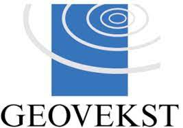

:toc: left
:toc-title: Innholdsfortegnelse
:toclevels: 3
:sectnums:
:sectnumlevels: 3
:figure-caption: Figur
:table-caption: Tabell
:section-refsig: Kapittel
:version-label: Versjon
:doctype: book
:encoding: utf-8
:lang: nb
:appendix-caption: Vedlegg
:pdf-page-size: A4
ifdef::backend-pdf[:toc: macro]
:chapter-label! :
:skjemabase-url: https://skjema.geonorge.no/SOSI/produktspesifikasjon/
:prodspekbase-url: https://sosi.geonorge.no/produktspesifikasjoner/
:umlbase-url: https://sosi.geonorge.no/uml-modeller/sosi-del-3-produktspesifikasjoner/
:reginstrbase-url: https://sosi.geonorge.no/registreringsinstrukser/
:fkbGenerellDel-url: https://sosi.geonorge.no/Standarder/FKB_generell_del/5.0
//:title-page-background-image: image:../../felles/figurer/forsidebilde_kartverketstandarder.jpg[]
:title-logo-image: 
:fkbdatasett: {datasett} {versjon}
:skjema-url: {skjemabase-url}{datasett}/{versjon}
:prodspek-url: {prodspekbase-url}{datasett}
:uml-url: {umlbase-url}{datasett}/{versjon}
:reginstr-url: {reginstrbase-url}{datasett}/{versjon}/{reginstr-type}_{underversjon}