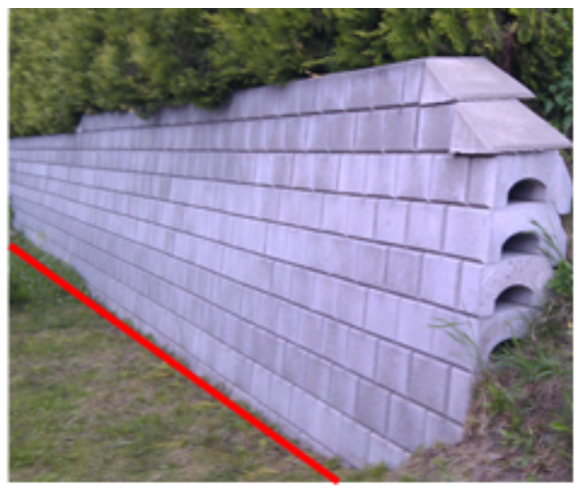

 
<<<
'''
 
[[forsenkningskurve]]
=== Objekttype: Forsenkningskurve
*Definisjon fra FKB produktspesifikasjon*: linje i terrenget med fast h&#248;ydeverdi (z-verdi) som beskriver en forsenkning i terrenget

Merknad: Alle kurver som beskriver en forsenkning skal kodes som forsenkningskurver- ikke bare den nederste kurven.
 
 
[discrete]
==== Tilleggsinformasjon for registrering
Forsenkningskurver avledes fra digital terrengmodell etablert fra punktsky.

Forsenkningskurve har retningsavhengighet mot urviseren.

Forsenkningskurver skal brukes i f&#248;lgende tilfeller:

* Naturlige depresjoner (spesielt: moreneflater med d&#248;disgroper, fordypninger i omr&#229;der med kalkrikt fjell).

* Hull og groper som skyldes bergverk/steinbrudd/grustak

* (Vei)gr&#248;fter hvor vannet renner mot en stikkrenne eller drensr&#248;r.

Forsenkningskurver skal ikke brukes i f&#248;lgende tilfeller:

* St&#248;rre omr&#229;der (for eksempel innsj&#248;er p&#229; flere km2) som renner/drenerer ut gjennom/under store veg- eller jernbanefyllinger.

* Omr&#229;der mellom HRV og LRV i regulerte elver og innsj&#248;er.

Forsenkningskurver generert fra punktsky, skal ha p&#229;f&#248;rt datafangstmetode Generert. I tillegg skal egenskapen Opphav benyttes for &#229; skille p&#229; om punktskyen som ligger til grunn for kurvegenereringen er etablert ved hjelp av laserskanning eller bildematching og om objektet sikkert gjengir terrenget eller ikke.

Ved generering av forsenkningskurver fra punktsky skal forsenkningskurvene v&#230;re gjennomg&#229;ende ved forst&#248;tningsmur, massive brygger og lignende.
 
 
[discrete]
==== Føringer
[cols="h,2"]
|===
|FKB grunnrissreferanse
|Der terrenget har gitt høyde
 
|FKB høydereferanse
|Gitt høyde
 
|FKB-H1
|Påkrevd registrering
 
|FKB-H5
|Påkrevd registrering
 
|===
 
 
<<<
 
[discrete]
==== Egenskapstabell for objekttype: Forsenkningskurve
[cols="20,20,20,10", options="header"]
|===
|*Navn:* 
|*Type:* 
|*SOSI_navn:* 
|*Mult.:* 
 
|identifikasjon
|«dataType» Identifikasjon
|..IDENT
|[0..1]
 
|identifikasjon.lokalId
|CharacterString
|...LOKALID
|[1..1]
 
|identifikasjon.navnerom
|CharacterString
|...NAVNEROM
|[1..1]
 
|identifikasjon.versjonId
|CharacterString
|...VERSJONID
|[0..1]
 
|oppdateringsdato
|DateTime
|..OPPDATERINGSDATO
|[0..1]
 
|sluttdato
|DateTime
|..SLUTTDATO
|[0..1]
 
|datafangstdato
|Date
|..DATAFANGSTDATO
|[1..1]
 
|medium
|«CodeList» Medium
|..MEDIUM
|[0..1]
 
|verifiseringsdato
|Date
|..VERIFISERINGSDATO
|[0..1]
 
|registreringsversjon
|«CodeList» Registreringsversjon
|..REGISTRERINGSVERSJON
|[0..1]
 
|informasjon
|CharacterString
|..INFORMASJON
|[0..1]
 
|kvalitet
|«dataType» Posisjonskvalitet
|..KVALITET
|[1..1]
 
|kvalitet.datafangstmetode
|«CodeList» Datafangstmetode
|...DATAFANGSTMETODE
|[1..1]
 
|kvalitet.nøyaktighet
|Integer
|...NØYAKTIGHET
|[0..1]
 
|kvalitet.synbarhet
|«CodeList» Synbarhet
|...SYNBARHET
|[0..1]
 
|kvalitet.datafangstmetodeHøyde
|«CodeList» Datafangstmetode
|...DATAFANGSTMETODEHØYDE
|[0..1]
 
|kvalitet.nøyaktighetHøyde
|Integer
|...H-NØYAKTIGHET
|[0..1]
 
|senterlinje
|GM_Curve
|.KURVE
|[1..1]
 
|høyde
|Real
|..HØYDE
|[1..1]
 
|opphav
|«dataType» Opphav
|..OPPHAV
|[1..1]
 
|opphav.sikkerTerrenggjengivelse
|Boolean
|...SIKKERTERRENGGJENGIVELSE
|[1..1]
 
|opphav.datakilde
|«CodeList» DatafangsmetodeUtvidet
|...DATAKILDE
|[1..1]
 
|===
 
<<<
'''
 
[[høydekurve]]
=== Objekttype: Høydekurve
*Definisjon fra FKB produktspesifikasjon*: linje i terrenget med fast h&#248;ydeverdi (z-verdi) over referanseh&#248;yden
 
 
[discrete]
==== Tilleggsinformasjon for registrering
H&#248;ydekurver avledes fra digital terrengmodell etablert fra punktsky.

H&#248;ydekurver skal ikke krysse hverandre, bortsett fra der dette er tilfelle (overheng).

H&#248;ydekurver skal ikke brytes n&#229;r de g&#229;r gjennom bygninger, steinbrudd, sandtak, ur etc.; over veier, over bekker/elver, passerer bruer o.l. Alle kurver skal v&#230;re lukket og merket med knutepunkt. Dersom det er knyttet usikkerhet til n&#248;yaktigheten til h&#248;ydekurver som g&#229;r gjennom store bygninger, skal dette angis med kvalitetskoding.

H&#248;ydekurver generert fra punktsky, skal ha p&#229;f&#248;rt datafangstmetode Generert. I tillegg skal egenskapen Opphav benyttes for &#229; skille p&#229; om punktskyen som ligger til grunn for kurvegenereringen er etablert ved hjelp av laserskanning eller bildematching og om objektet sikkert gjengir terrenget eller ikke.

Ved generering av h&#248;ydekurver fra punktsky skal h&#248;ydekurvene v&#230;re gjennomg&#229;ende ved forst&#248;tningsmur, massive brygger og lignende.
 
 
[discrete]
==== Føringer
[cols="h,2"]
|===
|FKB grunnrissreferanse
|Der terrenget har gitt høyde
 
|FKB høydereferanse
|Gitt høyde
 
|FKB-H1
|Påkrevd registrering
 
|FKB-H5
|Påkrevd registrering
 
|===
 
 
<<<
 
[discrete]
==== Egenskapstabell for objekttype: Høydekurve
[cols="20,20,20,10", options="header"]
|===
|*Navn:* 
|*Type:* 
|*SOSI_navn:* 
|*Mult.:* 
 
|identifikasjon
|«dataType» Identifikasjon
|..IDENT
|[0..1]
 
|identifikasjon.lokalId
|CharacterString
|...LOKALID
|[1..1]
 
|identifikasjon.navnerom
|CharacterString
|...NAVNEROM
|[1..1]
 
|identifikasjon.versjonId
|CharacterString
|...VERSJONID
|[0..1]
 
|oppdateringsdato
|DateTime
|..OPPDATERINGSDATO
|[0..1]
 
|sluttdato
|DateTime
|..SLUTTDATO
|[0..1]
 
|datafangstdato
|Date
|..DATAFANGSTDATO
|[1..1]
 
|medium
|«CodeList» Medium
|..MEDIUM
|[0..1]
 
|verifiseringsdato
|Date
|..VERIFISERINGSDATO
|[0..1]
 
|registreringsversjon
|«CodeList» Registreringsversjon
|..REGISTRERINGSVERSJON
|[0..1]
 
|informasjon
|CharacterString
|..INFORMASJON
|[0..1]
 
|kvalitet
|«dataType» Posisjonskvalitet
|..KVALITET
|[1..1]
 
|kvalitet.datafangstmetode
|«CodeList» Datafangstmetode
|...DATAFANGSTMETODE
|[1..1]
 
|kvalitet.nøyaktighet
|Integer
|...NØYAKTIGHET
|[0..1]
 
|kvalitet.synbarhet
|«CodeList» Synbarhet
|...SYNBARHET
|[0..1]
 
|kvalitet.datafangstmetodeHøyde
|«CodeList» Datafangstmetode
|...DATAFANGSTMETODEHØYDE
|[0..1]
 
|kvalitet.nøyaktighetHøyde
|Integer
|...H-NØYAKTIGHET
|[0..1]
 
|senterlinje
|GM_Curve
|.KURVE
|[1..1]
 
|høyde
|Real
|..HØYDE
|[1..1]
 
|opphav
|«dataType» Opphav
|..OPPHAV
|[1..1]
 
|opphav.sikkerTerrenggjengivelse
|Boolean
|...SIKKERTERRENGGJENGIVELSE
|[1..1]
 
|opphav.datakilde
|«CodeList» DatafangsmetodeUtvidet
|...DATAKILDE
|[1..1]
 
|===
 
<<<
'''
 
[[terrenglinje]]
=== Objekttype: Terrenglinje
*Definisjon fra FKB produktspesifikasjon*: linje som benyttes der hvor terrenget markert forandrer helning og/eller retning (på tvers av terrenglinja) Typisk skal terrenglinjer benyttes i søkk, på rygger, over topper, i bunnen av forsenkninger, i sadel eller på flate områder hvor det er lite annen høydeinformasjon
 
 
[discrete]
==== Tilleggsinformasjon for registrering
Benyttes normalt som et supplement utover annen h&#248;ydeb&#230;rende informasjon slik at de til sammen gir nok h&#248;ydeb&#230;rende informasjon til &#229; beskrive terrengets form og h&#248;yde innenfor de kvalitetskrav som er satt. Det er ikke krav om at terrenglinjen skal v&#230;re lukket eller sammenhengende med andre linjeelementer.

I omr&#229;der hvor h&#248;ydegrunnlaget er etablert ved laserskanning vil det som regel kun v&#230;re aktuelt &#229; registrere terrenglinjer i forbindelse med tekniske anlegg langs veg og i bebygde omr&#229;der.

I omr&#229;der med d&#229;rlig terrengmodell kan det i tillegg v&#230;re aktuelt &#229; bestille ytterligere registrering av terrenglinjer:

* p&#229; markerte terrengformasjoner ved bygningsmessige og tekniske anlegg

* p&#229; begge sider av st&#248;yskjerm

* p&#229; kant av st&#248;rre gr&#248;fter og bekker der h&#248;yden fra vannkant til topp kant er st&#248;rre enn 1,5 meter

* p&#229; knekklinjer og p&#229; topp kant langs elv der andre objekttyper ikke beskriver terrengformen. Benyttes for elver som i snitt er bredere enn ca. 10 meter, samt for mindre elver i flate omr&#229;der der det er fare for flom. Dersom det er elveforbygninger langs elva skal disse registreres spesielt. Det er viktig med nok terrenglinjer langs elv. Dette med tanke p&#229; flomanalyse.

Objekttypen er opsjonell og det m&#229; avklares i hvert enkelt oppdrag n&#229;r og hvordan den eventuelt skal benyttes.
 
 
'''
.Eksempel på registrering av terrenglinje langs fot av MurLoddrett i FKB-H1

 
 
 
[discrete]
==== Føringer
[cols="h,2"]
|===
|FKB grunnrissreferanse
|På markerte knekklinjer i terrenget
 
|FKB høydereferanse
|På terrenget
 
|FKB-H1
|Opsjonell registrering
 
|FKB-H5
|Opsjonell registrering
 
|===
 
 
<<<
 
[discrete]
==== Egenskapstabell for objekttype: Terrenglinje
[cols="20,20,20,10", options="header"]
|===
|*Navn:* 
|*Type:* 
|*SOSI_navn:* 
|*Mult.:* 
 
|identifikasjon
|«dataType» Identifikasjon
|..IDENT
|[0..1]
 
|identifikasjon.lokalId
|CharacterString
|...LOKALID
|[1..1]
 
|identifikasjon.navnerom
|CharacterString
|...NAVNEROM
|[1..1]
 
|identifikasjon.versjonId
|CharacterString
|...VERSJONID
|[0..1]
 
|oppdateringsdato
|DateTime
|..OPPDATERINGSDATO
|[0..1]
 
|sluttdato
|DateTime
|..SLUTTDATO
|[0..1]
 
|datafangstdato
|Date
|..DATAFANGSTDATO
|[1..1]
 
|medium
|«CodeList» Medium
|..MEDIUM
|[0..1]
 
|verifiseringsdato
|Date
|..VERIFISERINGSDATO
|[0..1]
 
|registreringsversjon
|«CodeList» Registreringsversjon
|..REGISTRERINGSVERSJON
|[0..1]
 
|informasjon
|CharacterString
|..INFORMASJON
|[0..1]
 
|kvalitet
|«dataType» Posisjonskvalitet
|..KVALITET
|[1..1]
 
|kvalitet.datafangstmetode
|«CodeList» Datafangstmetode
|...DATAFANGSTMETODE
|[1..1]
 
|kvalitet.nøyaktighet
|Integer
|...NØYAKTIGHET
|[0..1]
 
|kvalitet.synbarhet
|«CodeList» Synbarhet
|...SYNBARHET
|[0..1]
 
|kvalitet.datafangstmetodeHøyde
|«CodeList» Datafangstmetode
|...DATAFANGSTMETODEHØYDE
|[0..1]
 
|kvalitet.nøyaktighetHøyde
|Integer
|...H-NØYAKTIGHET
|[0..1]
 
|senterlinje
|GM_Curve
|.KURVE
|[1..1]
 
|opphav
|«dataType» Opphav
|..OPPHAV
|[1..1]
 
|opphav.sikkerTerrenggjengivelse
|Boolean
|...SIKKERTERRENGGJENGIVELSE
|[1..1]
 
|opphav.datakilde
|«CodeList» DatafangsmetodeUtvidet
|...DATAKILDE
|[1..1]
 
|===
 
<<<
'''
 
[[forsenkningspunkt]]
=== Objekttype: Forsenkningspunkt
*Definisjon fra FKB produktspesifikasjon*: punkt med m&#229;lt h&#248;ydeverdi som ligger i en markert forsenkning i terrenget
 
 
[discrete]
==== Tilleggsinformasjon for registrering
Forsenkningspunkt avledes fra digital terrengmodell etablert fra punktsky.

Objekttypen skal i FKB-H1 registreres for forsenkninger dypere enn 7 meter under omkringliggende terreng. Det tillates skj&#248;nnsmessig justering av minstem&#229;let i terrengtyper hvor dette gir uhensiktsmessig f&#229; eller mange forsenkningspunkt
 
 
[discrete]
==== Føringer
[cols="h,2"]
|===
|FKB grunnrissreferanse
|Laveste punkt i forsenkning
 
|FKB høydereferanse
|Terrengnivå
 
|FKB-H1
|Påkrevd registrering
 
|FKB-H5
|Opsjonell registrering
 
|===
 
 
<<<
 
[discrete]
==== Egenskapstabell for objekttype: Forsenkningspunkt
[cols="20,20,20,10", options="header"]
|===
|*Navn:* 
|*Type:* 
|*SOSI_navn:* 
|*Mult.:* 
 
|identifikasjon
|«dataType» Identifikasjon
|..IDENT
|[0..1]
 
|identifikasjon.lokalId
|CharacterString
|...LOKALID
|[1..1]
 
|identifikasjon.navnerom
|CharacterString
|...NAVNEROM
|[1..1]
 
|identifikasjon.versjonId
|CharacterString
|...VERSJONID
|[0..1]
 
|oppdateringsdato
|DateTime
|..OPPDATERINGSDATO
|[0..1]
 
|sluttdato
|DateTime
|..SLUTTDATO
|[0..1]
 
|datafangstdato
|Date
|..DATAFANGSTDATO
|[1..1]
 
|medium
|«CodeList» Medium
|..MEDIUM
|[0..1]
 
|verifiseringsdato
|Date
|..VERIFISERINGSDATO
|[0..1]
 
|registreringsversjon
|«CodeList» Registreringsversjon
|..REGISTRERINGSVERSJON
|[0..1]
 
|informasjon
|CharacterString
|..INFORMASJON
|[0..1]
 
|kvalitet
|«dataType» Posisjonskvalitet
|..KVALITET
|[1..1]
 
|kvalitet.datafangstmetode
|«CodeList» Datafangstmetode
|...DATAFANGSTMETODE
|[1..1]
 
|kvalitet.nøyaktighet
|Integer
|...NØYAKTIGHET
|[0..1]
 
|kvalitet.synbarhet
|«CodeList» Synbarhet
|...SYNBARHET
|[0..1]
 
|kvalitet.datafangstmetodeHøyde
|«CodeList» Datafangstmetode
|...DATAFANGSTMETODEHØYDE
|[0..1]
 
|kvalitet.nøyaktighetHøyde
|Integer
|...H-NØYAKTIGHET
|[0..1]
 
|posisjon
|GM_Point
|.PUNKT
|[1..1]
 
|høyde
|Real
|..HØYDE
|[1..1]
 
|opphav
|«dataType» Opphav
|..OPPHAV
|[1..1]
 
|opphav.sikkerTerrenggjengivelse
|Boolean
|...SIKKERTERRENGGJENGIVELSE
|[1..1]
 
|opphav.datakilde
|«CodeList» DatafangsmetodeUtvidet
|...DATAKILDE
|[1..1]
 
|===
 
<<<
'''
 
[[toppunkt]]
=== Objekttype: Toppunkt
*Definisjon fra FKB produktspesifikasjon*: punkt med målt høydeverdi som ligger på en markert forhøyning eller topp i terrenget
 
 
[discrete]
==== Tilleggsinformasjon for registrering
Toppunkt avledes fra digital terrengmodell etablert fra punktsky.

Objekttypen skal i FKB-H1 registreres for h&#248;yder som er h&#248;yere enn 10 meter over omkringliggende terreng. For mindre &#248;yer som stikker opp mindre enn 10 meter over havflaten, skal det normalt alltid registreres toppunkt. Unntaket er n&#229;r &#248;vrig terrenginformasjon gir en god nok beskrivelse av terrengoverflaten. Det tillates skj&#248;nnsmessig justering av minstem&#229;let i terrengtyper hvor dette gir uhensiktsmessig f&#229; eller mange toppunkt.

 
 
[discrete]
==== Føringer
[cols="h,2"]
|===
|FKB grunnrissreferanse
|Høyeste punkt
 
|FKB høydereferanse
|Terrenghøyde
 
|FKB-H1
|Påkrevd registrering
 
|FKB-H5
|Opsjonell registrering
 
|===
 
 
<<<
 
[discrete]
==== Egenskapstabell for objekttype: Toppunkt
[cols="20,20,20,10", options="header"]
|===
|*Navn:* 
|*Type:* 
|*SOSI_navn:* 
|*Mult.:* 
 
|identifikasjon
|«dataType» Identifikasjon
|..IDENT
|[0..1]
 
|identifikasjon.lokalId
|CharacterString
|...LOKALID
|[1..1]
 
|identifikasjon.navnerom
|CharacterString
|...NAVNEROM
|[1..1]
 
|identifikasjon.versjonId
|CharacterString
|...VERSJONID
|[0..1]
 
|oppdateringsdato
|DateTime
|..OPPDATERINGSDATO
|[0..1]
 
|sluttdato
|DateTime
|..SLUTTDATO
|[0..1]
 
|datafangstdato
|Date
|..DATAFANGSTDATO
|[1..1]
 
|medium
|«CodeList» Medium
|..MEDIUM
|[0..1]
 
|verifiseringsdato
|Date
|..VERIFISERINGSDATO
|[0..1]
 
|registreringsversjon
|«CodeList» Registreringsversjon
|..REGISTRERINGSVERSJON
|[0..1]
 
|informasjon
|CharacterString
|..INFORMASJON
|[0..1]
 
|kvalitet
|«dataType» Posisjonskvalitet
|..KVALITET
|[1..1]
 
|kvalitet.datafangstmetode
|«CodeList» Datafangstmetode
|...DATAFANGSTMETODE
|[1..1]
 
|kvalitet.nøyaktighet
|Integer
|...NØYAKTIGHET
|[0..1]
 
|kvalitet.synbarhet
|«CodeList» Synbarhet
|...SYNBARHET
|[0..1]
 
|kvalitet.datafangstmetodeHøyde
|«CodeList» Datafangstmetode
|...DATAFANGSTMETODEHØYDE
|[0..1]
 
|kvalitet.nøyaktighetHøyde
|Integer
|...H-NØYAKTIGHET
|[0..1]
 
|posisjon
|GM_Point
|.PUNKT
|[1..1]
 
|høyde
|Real
|..HØYDE
|[1..1]
 
|opphav
|«dataType» Opphav
|..OPPHAV
|[1..1]
 
|opphav.sikkerTerrenggjengivelse
|Boolean
|...SIKKERTERRENGGJENGIVELSE
|[1..1]
 
|opphav.datakilde
|«CodeList» DatafangsmetodeUtvidet
|...DATAKILDE
|[1..1]
 
|===
 
<<<
'''
 
[[terrengpunkt]]
=== Objekttype: Terrengpunkt
*Definisjon fra FKB produktspesifikasjon*: punkt i terrenget med målt høydeverdi som brukes for å angi høyde på markerte flater i terrenget som for eksempel sadler og store flater, i veg- og gatekryss og andre kryss mellom samferdselslinjer, på gårdsplasser utenfor hovedinnganger og på parkeringsplasser
 
 
[discrete]
==== Tilleggsinformasjon for registrering
Terrengpunkt avledes fra digital terrengmodell etablert fra punktsky.

Terrengpunkt kan benyttes der h&#248;ydekurvene alene, eventuelt sammen med terrenglinjer, ikke gir detaljert nok informasjon om terrengformene.

Objekttyper er opsjonell og det m&#229; avklares i hvert enkelt oppdrag n&#229;r og hvordan den eventuelt skal benyttes.
 
 
[discrete]
==== Føringer
[cols="h,2"]
|===
|FKB grunnrissreferanse
|Markert punkt i terrenget
 
|FKB høydereferanse
|På terrenget
 
|FKB-H1
|Opsjonell registrering
 
|FKB-H5
|Opsjonell registrering
 
|===
 
 
<<<
 
[discrete]
==== Egenskapstabell for objekttype: Terrengpunkt
[cols="20,20,20,10", options="header"]
|===
|*Navn:* 
|*Type:* 
|*SOSI_navn:* 
|*Mult.:* 
 
|identifikasjon
|«dataType» Identifikasjon
|..IDENT
|[0..1]
 
|identifikasjon.lokalId
|CharacterString
|...LOKALID
|[1..1]
 
|identifikasjon.navnerom
|CharacterString
|...NAVNEROM
|[1..1]
 
|identifikasjon.versjonId
|CharacterString
|...VERSJONID
|[0..1]
 
|oppdateringsdato
|DateTime
|..OPPDATERINGSDATO
|[0..1]
 
|sluttdato
|DateTime
|..SLUTTDATO
|[0..1]
 
|datafangstdato
|Date
|..DATAFANGSTDATO
|[1..1]
 
|medium
|«CodeList» Medium
|..MEDIUM
|[0..1]
 
|verifiseringsdato
|Date
|..VERIFISERINGSDATO
|[0..1]
 
|registreringsversjon
|«CodeList» Registreringsversjon
|..REGISTRERINGSVERSJON
|[0..1]
 
|informasjon
|CharacterString
|..INFORMASJON
|[0..1]
 
|kvalitet
|«dataType» Posisjonskvalitet
|..KVALITET
|[1..1]
 
|kvalitet.datafangstmetode
|«CodeList» Datafangstmetode
|...DATAFANGSTMETODE
|[1..1]
 
|kvalitet.nøyaktighet
|Integer
|...NØYAKTIGHET
|[0..1]
 
|kvalitet.synbarhet
|«CodeList» Synbarhet
|...SYNBARHET
|[0..1]
 
|kvalitet.datafangstmetodeHøyde
|«CodeList» Datafangstmetode
|...DATAFANGSTMETODEHØYDE
|[0..1]
 
|kvalitet.nøyaktighetHøyde
|Integer
|...H-NØYAKTIGHET
|[0..1]
 
|posisjon
|GM_Point
|.PUNKT
|[1..1]
 
|høyde
|Real
|..HØYDE
|[1..1]
 
|opphav
|«dataType» Opphav
|..OPPHAV
|[1..1]
 
|opphav.sikkerTerrenggjengivelse
|Boolean
|...SIKKERTERRENGGJENGIVELSE
|[1..1]
 
|opphav.datakilde
|«CodeList» DatafangsmetodeUtvidet
|...DATAKILDE
|[1..1]
 
|===
// End of Registreringsinstruks UML-model
