 
<<<
'''
 
[[bardun]]
==== «FeatureType» Bardun
*Definisjon fra FKB produktspesifikasjon*: tau, vaier eller liknende som st&#248;tter eller stabiliserer h&#248;ye gjenstander

Merknad FKB:
Dersom flere barduner g&#229;r i samme retning skal den h&#248;yeste og lengste bardunen registreres.

 
*Tilleggsinformasjon for fotogrammetrisk registrering:* Dersom flere barduner g&#229;r i samme retning skal den h&#248;yeste og lengste bardunen registreres.
 
 
'''
.Illustrasjon fra produktspesifikasjon av Bardun
image::http://skjema.geonorge.no/SOSITEST/produktspesifikasjon/FKB-Ledning/5.0/figurer/Bardun.jpg[link=http://skjema.geonorge.no/SOSITEST/produktspesifikasjon/FKB-Ledning/5.0/figurer/Bardun.jpg, Alt="Illustrasjon fra produktspesifikasjon: Bardun"]
 
 
'''
.Dersom flere barduner går i samme retning skal den høyeste og lengste bardunen registreres.
image::figurer\bardun.png[link=figurer\bardun.png, Alt="Dersom flere barduner går i samme retning skal den høyeste og lengste bardunen registreres."]
 
 
===== Føringer
[cols="25,75"]
|===
|FKB grunnrissreferanse
|Senter bardun
 
|FKB høydereferanse
|Topp bardun senter mast og fot bardun i feste ved bakken.
 
|FKB-A
|Påkrevd registrering
 
|FKB-B
|Påkrevd registrering
 
|FKB-C
|Påkrevd registrering
 
|FKB-D
|Påkrevd registrering
 
|===
 
===== Egenskapstabell
[cols="20,20,20,10"]
|===
|*Navn:* 
|*Type:* 
|*SOSI_navn:* 
|*Mult.:* 
 
|identifikasjon
|«dataType» Identifikasjon
|..IDENT
|[0..1]
 
|identifikasjon.lokalId
|CharacterString
|...LOKALID
|[1..1]
 
|identifikasjon.navnerom
|CharacterString
|...NAVNEROM
|[1..1]
 
|identifikasjon.versjonId
|CharacterString
|...VERSJONID
|[0..1]
 
|oppdateringsdato
|DateTime
|..OPPDATERINGSDATO
|[0..1]
 
|datafangstdato
|Date
|..DATAFANGSTDATO
|[1..1]
 
|verifiseringsdato
|Date
|..VERIFISERINGSDATO
|[0..1]
 
|registreringsversjon
|«CodeList» Registreringsversjon
|..REGISTRERINGSVERSJON
|[0..1]
 
|informasjon
|CharacterString
|..INFORMASJON
|[0..1]
 
|høydereferanse
|«CodeList» Høydereferanse
|..HREF
|[1..1]
 
|medium
|«CodeList» Medium
|..MEDIUM
|[1..1]
 
|kvalitet
|«dataType» Posisjonskvalitet
|..KVALITET
|[1..1]
 
|kvalitet.datafangstmetode
|«CodeList» Datafangstmetode
|...DATAFANGSTMETODE
|[1..1]
 
|kvalitet.nøyaktighet
|Integer
|...NØYAKTIGHET
|[0..1]
 
|kvalitet.synbarhet
|«CodeList» Synbarhet
|...SYNBARHET
|[0..1]
 
|kvalitet.datafangstmetodeHøyde
|«CodeList» Datafangstmetode
|...DATAFANGSTMETODEHØYDE
|[0..1]
 
|kvalitet.nøyaktighetHøyde
|Integer
|...H-NØYAKTIGHET
|[0..1]
 
|driftsmerking
|CharacterString
|..DRIFTSMERKING
|[0..1]
 
|eierOrgNr
|CharacterString
|..EIERORGNR
|[0..1]
 
|eksternPeker
|URI
|..EKSTERNPEKER
|[0..*]
 
|hovedbruk
|«CodeList» Ledningsnettverkstype
|..LEDNINGSNETTVERKSTYPE
|[1..1]
 
|beliggenhet
|GM_Curve
|.KURVE
|[1..1]
 
|===
 
<<<
'''
 
[[flymarkør]]
==== «FeatureType» Flymarkør
*Definisjon fra FKB produktspesifikasjon*: markering av store luftspenn over daler og fjorder
 
*Tilleggsinformasjon for fotogrammetrisk registrering:* Brukes for markering av lange luftspenn. Typisk er dette oransje bl&#229;ser festet p&#229; linjene.

Pilh&#248;yden for lange luftspenn kan variere mye som f&#248;lge av v&#230;r og temperatur. Dette f&#248;rer til at mark&#248;renes posisjon vil variere, noe som resulterer i d&#229;rlig posisjonsn&#248;yaktighet.

Flymark&#248;r og kurvepunkt i Trase skal ha samme posisjon, b&#229;de i grunnriss og h&#248;yde.

I tilfeller hvor flymark&#248;ren ikke er plassert p&#229; Trase, normalforskyves flymark&#248;ren inn p&#229; traseen og kvalitetskodes deretter. I tillegg legges det til _informasjon_ "Mark&#248;r normalforskj&#248;vet inn p&#229; trase".
 
 
'''
.Illustrasjon fra produktspesifikasjon av Flymarkør
image::http://skjema.geonorge.no/SOSITEST/produktspesifikasjon/FKB-Ledning/5.0/figurer/Flymarkor.jpg[link=http://skjema.geonorge.no/SOSITEST/produktspesifikasjon/FKB-Ledning/5.0/figurer/Flymarkor.jpg, Alt="Illustrasjon fra produktspesifikasjon: Flymarkør"]
 
 
'''
.Flymarkører registreres som senter topp flymarkør/blåse.
image::figurer\flymarkør.png[link=figurer\flymarkør.png, Alt="Flymarkører registreres som senter topp flymarkør/blåse."]
 
 
===== Føringer
[cols="25,75"]
|===
|FKB grunnrissreferanse
|Senter flymarkør
 
|FKB høydereferanse
|Topp flymarkør
 
|FKB-A
|Påkrevd registrering
 
|FKB-B
|Påkrevd registrering
 
|FKB-C
|Påkrevd registrering
 
|FKB-D
|Påkrevd registrering
 
|===
 
===== Egenskapstabell
[cols="20,20,20,10"]
|===
|*Navn:* 
|*Type:* 
|*SOSI_navn:* 
|*Mult.:* 
 
|identifikasjon
|«dataType» Identifikasjon
|..IDENT
|[0..1]
 
|identifikasjon.lokalId
|CharacterString
|...LOKALID
|[1..1]
 
|identifikasjon.navnerom
|CharacterString
|...NAVNEROM
|[1..1]
 
|identifikasjon.versjonId
|CharacterString
|...VERSJONID
|[0..1]
 
|oppdateringsdato
|DateTime
|..OPPDATERINGSDATO
|[0..1]
 
|datafangstdato
|Date
|..DATAFANGSTDATO
|[1..1]
 
|verifiseringsdato
|Date
|..VERIFISERINGSDATO
|[0..1]
 
|registreringsversjon
|«CodeList» Registreringsversjon
|..REGISTRERINGSVERSJON
|[0..1]
 
|informasjon
|CharacterString
|..INFORMASJON
|[0..1]
 
|høydereferanse
|«CodeList» Høydereferanse
|..HREF
|[1..1]
 
|medium
|«CodeList» Medium
|..MEDIUM
|[1..1]
 
|kvalitet
|«dataType» Posisjonskvalitet
|..KVALITET
|[1..1]
 
|kvalitet.datafangstmetode
|«CodeList» Datafangstmetode
|...DATAFANGSTMETODE
|[1..1]
 
|kvalitet.nøyaktighet
|Integer
|...NØYAKTIGHET
|[0..1]
 
|kvalitet.synbarhet
|«CodeList» Synbarhet
|...SYNBARHET
|[0..1]
 
|kvalitet.datafangstmetodeHøyde
|«CodeList» Datafangstmetode
|...DATAFANGSTMETODEHØYDE
|[0..1]
 
|kvalitet.nøyaktighetHøyde
|Integer
|...H-NØYAKTIGHET
|[0..1]
 
|driftsmerking
|CharacterString
|..DRIFTSMERKING
|[0..1]
 
|eierOrgNr
|CharacterString
|..EIERORGNR
|[0..1]
 
|eksternPeker
|URI
|..EKSTERNPEKER
|[0..*]
 
|hovedbruk
|«CodeList» Ledningsnettverkstype
|..LEDNINGSNETTVERKSTYPE
|[1..1]
 
|posisjon
|GM_Point
|.PUNKT
|[1..1]
 
|===
 
<<<
'''
 
[[kanal]]
==== «FeatureType» Kanal
*Definisjon fra FKB produktspesifikasjon*: brukes som fremf&#248;ringsvei for ledning
 
*Tilleggsinformasjon for fotogrammetrisk registrering:* Brukes ved registrering av kanaler som f&#248;rer kabler for elektrotekniske anlegg.

N&#229;r flere kanaler ligger parallelt, skal hver enkelt kanal registreres.

*I FKB er det kun kanaler som er synlige i terrenget som skal registreres. Oftest tilh&#248;rende Bane NOR.*
 
 
'''
.Illustrasjon fra produktspesifikasjon av Kanal
image::http://skjema.geonorge.no/SOSITEST/produktspesifikasjon/FKB-Ledning/5.0/figurer/Kanal.jpg[link=http://skjema.geonorge.no/SOSITEST/produktspesifikasjon/FKB-Ledning/5.0/figurer/Kanal.jpg, Alt="Illustrasjon fra produktspesifikasjon: Kanal"]
 
 
'''
.Registrering av kabelkanal (foto: Bane NOR)
image::figurer\kanal.png[link=figurer\kanal.png, Alt="Registrering av kabelkanal (foto: Bane NOR)"]
 
 
===== Føringer
[cols="25,75"]
|===
|FKB grunnrissreferanse
|Senter kanal, med knekkpunkt
 
|FKB høydereferanse
|Topp kanal
 
|FKB-A
|Påkrevd registrering
 
|FKB-B
|Påkrevd registrering
 
|FKB-C
|Registreres ikke
 
|FKB-D
|Registreres ikke
 
|===
 
===== Egenskapstabell
[cols="20,20,20,10"]
|===
|*Navn:* 
|*Type:* 
|*SOSI_navn:* 
|*Mult.:* 
 
|identifikasjon
|«dataType» Identifikasjon
|..IDENT
|[0..1]
 
|identifikasjon.lokalId
|CharacterString
|...LOKALID
|[1..1]
 
|identifikasjon.navnerom
|CharacterString
|...NAVNEROM
|[1..1]
 
|identifikasjon.versjonId
|CharacterString
|...VERSJONID
|[0..1]
 
|oppdateringsdato
|DateTime
|..OPPDATERINGSDATO
|[0..1]
 
|datafangstdato
|Date
|..DATAFANGSTDATO
|[1..1]
 
|verifiseringsdato
|Date
|..VERIFISERINGSDATO
|[0..1]
 
|registreringsversjon
|«CodeList» Registreringsversjon
|..REGISTRERINGSVERSJON
|[0..1]
 
|informasjon
|CharacterString
|..INFORMASJON
|[0..1]
 
|høydereferanse
|«CodeList» Høydereferanse
|..HREF
|[1..1]
 
|medium
|«CodeList» Medium
|..MEDIUM
|[1..1]
 
|kvalitet
|«dataType» Posisjonskvalitet
|..KVALITET
|[1..1]
 
|kvalitet.datafangstmetode
|«CodeList» Datafangstmetode
|...DATAFANGSTMETODE
|[1..1]
 
|kvalitet.nøyaktighet
|Integer
|...NØYAKTIGHET
|[0..1]
 
|kvalitet.synbarhet
|«CodeList» Synbarhet
|...SYNBARHET
|[0..1]
 
|kvalitet.datafangstmetodeHøyde
|«CodeList» Datafangstmetode
|...DATAFANGSTMETODEHØYDE
|[0..1]
 
|kvalitet.nøyaktighetHøyde
|Integer
|...H-NØYAKTIGHET
|[0..1]
 
|driftsmerking
|CharacterString
|..DRIFTSMERKING
|[0..1]
 
|eierOrgNr
|CharacterString
|..EIERORGNR
|[0..1]
 
|eksternPeker
|URI
|..EKSTERNPEKER
|[0..*]
 
|hovedbruk
|«CodeList» Ledningsnettverkstype
|..LEDNINGSNETTVERKSTYPE
|[1..1]
 
|beliggenhet
|GM_Curve
|.KURVE
|[1..1]
 
|===
 
<<<
'''
 
[[kum]]
==== «FeatureType» Kum
*Definisjon fra FKB produktspesifikasjon*: et fysisk objekt som regel av st&#229;l, plast eller betong som er gravd ned i bakken, og som lager et rom

Merknad FKB:
Ytterkant topp kumkonstruksjon der denne er synlig. 
 
*Tilleggsinformasjon for fotogrammetrisk registrering:* Ytterkant topp kumkonstruksjon der denne er synlig.
Kum er spesielt tenkt benyttet ved bane for &#229; registrere sammenheng mellom kanaler. Se figur.

*P&#229;krevet registrering langs bane, opsjonell for&#248;vrig*
 
 
'''
.Illustrasjon fra produktspesifikasjon av Kum
image::http://skjema.geonorge.no/SOSITEST/produktspesifikasjon/FKB-Ledning/5.0/figurer/Kum.jpg[link=http://skjema.geonorge.no/SOSITEST/produktspesifikasjon/FKB-Ledning/5.0/figurer/Kum.jpg, Alt="Illustrasjon fra produktspesifikasjon: Kum"]
 
 
'''
.Ytterkant topp kumkonstruksjon registreres som kurve der den er synlig og konstruksjonen har en diagonale/diameter større enn 1,5 meter.
image::figurer\kum.png[link=figurer\kum.png, Alt="Ytterkant topp kumkonstruksjon registreres som kurve der den er synlig og konstruksjonen har en diagonale/diameter større enn 1,5 meter."]
 
 
===== Føringer
[cols="25,75"]
|===
|FKB grunnrissreferanse
|Ytterkant kum
 
|FKB høydereferanse
|Topp ytterkant kum
 
|FKB minstestørrelse A
|Diagonal/diameter 1,5 meter
 
|FKB-A
|Påkrevd registrering
 
|FKB-B
|Påkrevd registrering
 
|FKB-C
|Registreres ikke
 
|FKB-D
|Registreres ikke
 
|===
 
===== Egenskapstabell
[cols="20,20,20,10"]
|===
|*Navn:* 
|*Type:* 
|*SOSI_navn:* 
|*Mult.:* 
 
|identifikasjon
|«dataType» Identifikasjon
|..IDENT
|[0..1]
 
|identifikasjon.lokalId
|CharacterString
|...LOKALID
|[1..1]
 
|identifikasjon.navnerom
|CharacterString
|...NAVNEROM
|[1..1]
 
|identifikasjon.versjonId
|CharacterString
|...VERSJONID
|[0..1]
 
|oppdateringsdato
|DateTime
|..OPPDATERINGSDATO
|[0..1]
 
|datafangstdato
|Date
|..DATAFANGSTDATO
|[1..1]
 
|verifiseringsdato
|Date
|..VERIFISERINGSDATO
|[0..1]
 
|registreringsversjon
|«CodeList» Registreringsversjon
|..REGISTRERINGSVERSJON
|[0..1]
 
|informasjon
|CharacterString
|..INFORMASJON
|[0..1]
 
|høydereferanse
|«CodeList» Høydereferanse
|..HREF
|[1..1]
 
|medium
|«CodeList» Medium
|..MEDIUM
|[1..1]
 
|kvalitet
|«dataType» Posisjonskvalitet
|..KVALITET
|[1..1]
 
|kvalitet.datafangstmetode
|«CodeList» Datafangstmetode
|...DATAFANGSTMETODE
|[1..1]
 
|kvalitet.nøyaktighet
|Integer
|...NØYAKTIGHET
|[0..1]
 
|kvalitet.synbarhet
|«CodeList» Synbarhet
|...SYNBARHET
|[0..1]
 
|kvalitet.datafangstmetodeHøyde
|«CodeList» Datafangstmetode
|...DATAFANGSTMETODEHØYDE
|[0..1]
 
|kvalitet.nøyaktighetHøyde
|Integer
|...H-NØYAKTIGHET
|[0..1]
 
|driftsmerking
|CharacterString
|..DRIFTSMERKING
|[0..1]
 
|eierOrgNr
|CharacterString
|..EIERORGNR
|[0..1]
 
|eksternPeker
|URI
|..EKSTERNPEKER
|[0..*]
 
|hovedbruk
|«CodeList» Ledningsnettverkstype
|..LEDNINGSNETTVERKSTYPE
|[1..1]
 
|beliggenhet
|GM_Curve
|.KURVE
|[1..1]
 
|===
 
<<<
'''
 
[[kumlokk]]
==== «FeatureType» Kumlokk
*Definisjon fra FKB produktspesifikasjon*: et deksel over en kum eller annet hulrom under bakkeniv&#229;
 
*Tilleggsinformasjon for fotogrammetrisk registrering:* Egenskapen _kumlokkform_ benyttes for &#229; angi geometrisk form av kumlokket. I FKB skilles det p&#229; disse &#171;kumlokkformene&#187;; Hydrant, Kvadratisk, Rektangul&#230;rt, Sirkelformet og Sluk.  

For &#229; sikre god fullstendighet og riktig tolkning ved fotogrammetrisk registrering anbefales det &#229; etablere manus eller signalere kumlokkene.
 
 
'''
.Illustrasjon fra produktspesifikasjon av Kumlokk
image::http://skjema.geonorge.no/SOSITEST/produktspesifikasjon/FKB-Ledning/5.0/figurer/Kumlokk.jpg[link=http://skjema.geonorge.no/SOSITEST/produktspesifikasjon/FKB-Ledning/5.0/figurer/Kumlokk.jpg, Alt="Illustrasjon fra produktspesifikasjon: Kumlokk"]
 
===== Føringer
[cols="25,75"]
|===
|FKB grunnrissreferanse
|Senter topp kum
 
|FKB høydereferanse
|Topp kum
 
|FKB-A
|Opsjonell registrering
 
|FKB-B
|Opsjonell registrering
 
|FKB-C
|Registreres ikke
 
|FKB-D
|Registreres ikke
 
|===
 
===== Egenskapstabell
[cols="20,20,20,10"]
|===
|*Navn:* 
|*Type:* 
|*SOSI_navn:* 
|*Mult.:* 
 
|identifikasjon
|«dataType» Identifikasjon
|..IDENT
|[0..1]
 
|identifikasjon.lokalId
|CharacterString
|...LOKALID
|[1..1]
 
|identifikasjon.navnerom
|CharacterString
|...NAVNEROM
|[1..1]
 
|identifikasjon.versjonId
|CharacterString
|...VERSJONID
|[0..1]
 
|oppdateringsdato
|DateTime
|..OPPDATERINGSDATO
|[0..1]
 
|datafangstdato
|Date
|..DATAFANGSTDATO
|[1..1]
 
|verifiseringsdato
|Date
|..VERIFISERINGSDATO
|[0..1]
 
|registreringsversjon
|«CodeList» Registreringsversjon
|..REGISTRERINGSVERSJON
|[0..1]
 
|informasjon
|CharacterString
|..INFORMASJON
|[0..1]
 
|høydereferanse
|«CodeList» Høydereferanse
|..HREF
|[1..1]
 
|medium
|«CodeList» Medium
|..MEDIUM
|[1..1]
 
|kvalitet
|«dataType» Posisjonskvalitet
|..KVALITET
|[1..1]
 
|kvalitet.datafangstmetode
|«CodeList» Datafangstmetode
|...DATAFANGSTMETODE
|[1..1]
 
|kvalitet.nøyaktighet
|Integer
|...NØYAKTIGHET
|[0..1]
 
|kvalitet.synbarhet
|«CodeList» Synbarhet
|...SYNBARHET
|[0..1]
 
|kvalitet.datafangstmetodeHøyde
|«CodeList» Datafangstmetode
|...DATAFANGSTMETODEHØYDE
|[0..1]
 
|kvalitet.nøyaktighetHøyde
|Integer
|...H-NØYAKTIGHET
|[0..1]
 
|driftsmerking
|CharacterString
|..DRIFTSMERKING
|[0..1]
 
|eierOrgNr
|CharacterString
|..EIERORGNR
|[0..1]
 
|eksternPeker
|URI
|..EKSTERNPEKER
|[0..*]
 
|hovedbruk
|«CodeList» Ledningsnettverkstype
|..LEDNINGSNETTVERKSTYPE
|[1..1]
 
|posisjon
|GM_Point
|.PUNKT
|[1..1]
 
|kumlokkform
|«CodeList» Kumlokkform
|..KUMLOKKFORM
|[1..1]
 
|kum
|«FeatureType» Kum
|..KUM
|[0..1]
|===
===== Presiseringer til beskrivelsen av kodelistekoder
Figurer og skisser knyttet til bruk av bestemte kodelister og koder.
 
===== Kumlokk.kumlokkform : Kumlokkform - Kode : Hydrant
*Definisjon :* konstruksjon som er utformet slik at vannslanger for spyling eller brannslukning, kan kobles direkte til r&#248;rmuffe i konstruksjonen
 
.Senter topp hydrant skal registreres
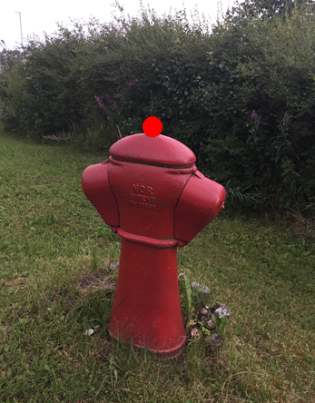
===== Kumlokk.kumlokkform : Kumlokkform - Kode : Kvadratisk
*Definisjon :* kumlokket har utstrekning i form av et kvadrat
 
.Senter kumlokk skal registreres. I bildet til venstre vises både et kvadratisk og sirkelformet kumlokk
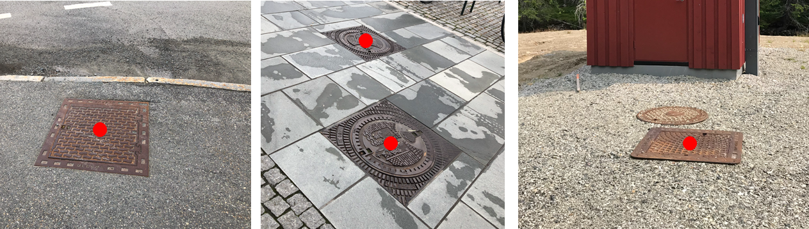
===== Kumlokk.kumlokkform : Kumlokkform - Kode : Rektangulært
*Definisjon :* kumlokket har utstrekning i form av et rektangel
 
.Senter kumlokk skal registreres
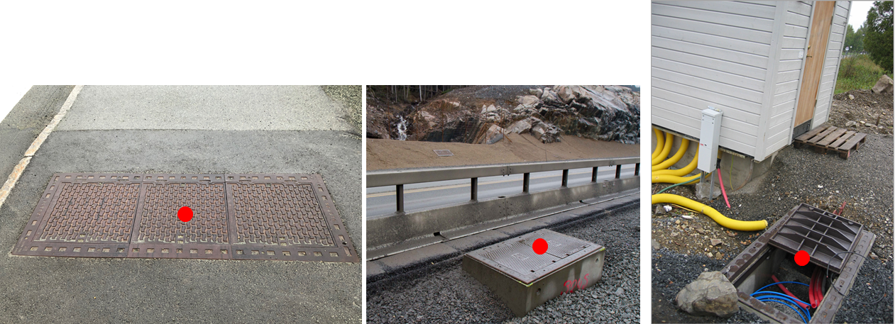
===== Kumlokk.kumlokkform : Kumlokkform - Kode : Sirkelformet
*Definisjon :* kumlokket er sirkelformet, rundt
 
.Senter kumlokk skal registreres
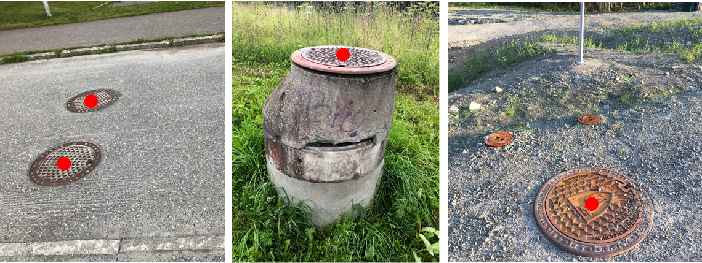
===== Kumlokk.kumlokkform : Kumlokkform - Kode : Sluk
*Definisjon :* kumlokk eller &#229;pning med rist der overflatevann kan renne ned i avl&#248;pssystemet, ofte i forbindelse med vegsystemer
 
.Senter kumlokk skal registreres
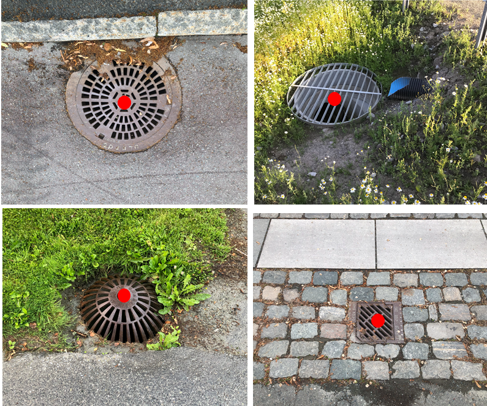
 
<<<
'''
 
[[lysarmatur]]
==== «FeatureType» Lysarmatur
*Definisjon fra FKB produktspesifikasjon*: selve det elektriske punktet som gir lys
 
*Tilleggsinformasjon for fotogrammetrisk registrering:* Belysningspunkt som henger i vaier registreres som Lysarmatur. Typisk er disse knyttet til samferdselsobjekter.
Det er ogs&#229; mulig &#229; registrere Lysarmatur for lyspunkt i mast. 

*I FKB er det kun lysarmatur i vaier som henger over veger/gater som er p&#229;krevd &#229; fotogrammetrisk registrere. Om andre lysarmaturer skal registreres m&#229; dette avtales s&#230;rskilt (er opsjonelt).*
 
 
'''
.Illustrasjon fra produktspesifikasjon av Lysarmatur
image::http://skjema.geonorge.no/SOSITEST/produktspesifikasjon/FKB-Ledning/5.0/figurer/Lysarmatur.jpg[link=http://skjema.geonorge.no/SOSITEST/produktspesifikasjon/FKB-Ledning/5.0/figurer/Lysarmatur.jpg, Alt="Illustrasjon fra produktspesifikasjon: Lysarmatur"]
 
===== Føringer
[cols="25,75"]
|===
|FKB grunnrissreferanse
|Senter lysarmatur
 
|FKB høydereferanse
|Topp lysarmatur
 
|FKB-A
|Påkrevd registrering
 
|FKB-B
|Påkrevd registrering
 
|FKB-C
|Registreres ikke
 
|FKB-D
|Registreres ikke
 
|===
 
===== Egenskapstabell
[cols="20,20,20,10"]
|===
|*Navn:* 
|*Type:* 
|*SOSI_navn:* 
|*Mult.:* 
 
|identifikasjon
|«dataType» Identifikasjon
|..IDENT
|[0..1]
 
|identifikasjon.lokalId
|CharacterString
|...LOKALID
|[1..1]
 
|identifikasjon.navnerom
|CharacterString
|...NAVNEROM
|[1..1]
 
|identifikasjon.versjonId
|CharacterString
|...VERSJONID
|[0..1]
 
|oppdateringsdato
|DateTime
|..OPPDATERINGSDATO
|[0..1]
 
|datafangstdato
|Date
|..DATAFANGSTDATO
|[1..1]
 
|verifiseringsdato
|Date
|..VERIFISERINGSDATO
|[0..1]
 
|registreringsversjon
|«CodeList» Registreringsversjon
|..REGISTRERINGSVERSJON
|[0..1]
 
|informasjon
|CharacterString
|..INFORMASJON
|[0..1]
 
|høydereferanse
|«CodeList» Høydereferanse
|..HREF
|[1..1]
 
|medium
|«CodeList» Medium
|..MEDIUM
|[1..1]
 
|kvalitet
|«dataType» Posisjonskvalitet
|..KVALITET
|[1..1]
 
|kvalitet.datafangstmetode
|«CodeList» Datafangstmetode
|...DATAFANGSTMETODE
|[1..1]
 
|kvalitet.nøyaktighet
|Integer
|...NØYAKTIGHET
|[0..1]
 
|kvalitet.synbarhet
|«CodeList» Synbarhet
|...SYNBARHET
|[0..1]
 
|kvalitet.datafangstmetodeHøyde
|«CodeList» Datafangstmetode
|...DATAFANGSTMETODEHØYDE
|[0..1]
 
|kvalitet.nøyaktighetHøyde
|Integer
|...H-NØYAKTIGHET
|[0..1]
 
|driftsmerking
|CharacterString
|..DRIFTSMERKING
|[0..1]
 
|eierOrgNr
|CharacterString
|..EIERORGNR
|[0..1]
 
|eksternPeker
|URI
|..EKSTERNPEKER
|[0..*]
 
|hovedbruk
|«CodeList» Ledningsnettverkstype
|..LEDNINGSNETTVERKSTYPE
|[1..1]
 
|posisjon
|GM_Point
|.PUNKT
|[1..1]
 
|plassering
|«CodeList» Punktplassering
|..BELYSNINGSPLASSERING
|[1..1]
 
|iMast
|«FeatureType» Mast
|..IMAST
|[0..1]
|===
===== Presiseringer til beskrivelsen av kodelistekoder
Figurer og skisser knyttet til bruk av bestemte kodelister og koder.
 
===== Lysarmatur.plassering : Punktplassering - Kode : Hengende i kabel
*Definisjon :* objektet er montert hengende i kabel
 
.Topp senter lysarmatur for lysarmatur i vaier over gater/veger skal registreres
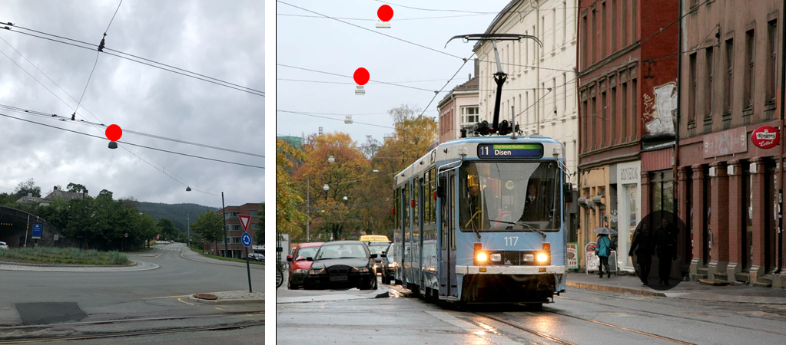
===== Lysarmatur.plassering : Punktplassering - Kode : I åk
*Definisjon :* objektet er montert p&#229;/i &#229;k    *Fotogrammetrisk registrering: Opsjonel registrering*
 
.Eksempel på registrering av lysarmatur i/på åk. Kun et utvalg armatur er markert med rød prikk. Dette er ikke en påkrevet registrering ved fotogrammetri.
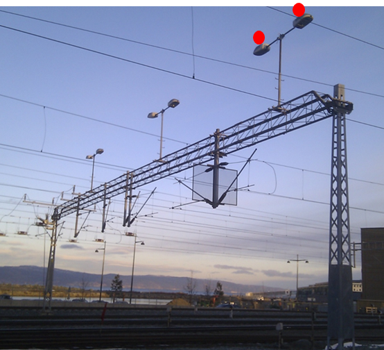
===== Lysarmatur.plassering : Punktplassering - Kode : I mast
*Definisjon :* objektet er montert p&#229;/i mast    *Fotogrammetrisk registrering: Opsjonel registrering*
 
.Eksempel på registrering av lysarmatur i mast. Kun et utvalg armatur er markert med rød prikk. Dette er ikke en påkrevet registrering ved fotogrammetri.
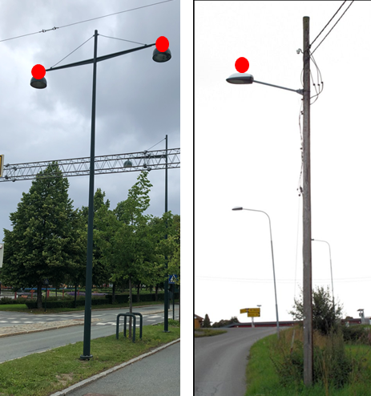
 
<<<
'''
 
[[mast]]
==== «FeatureType» Mast
*Definisjon fra FKB produktspesifikasjon*: alle konstruksjoner som prim&#230;rt er laget for &#229; holde ledningsnett/komponent oppe fra bakken

Merknad FKB:
En mast kan best&#229; av en eller flere stolper og beskriver mastens representasjonspunkt (senterpunkt grunnriss / mastepunkt).
 
*Tilleggsinformasjon for fotogrammetrisk registrering:* En mast kan best&#229; av en eller flere stolper og beskriver mastens representasjonspunkt (senterpunkt grunnriss / mastepunkt). 

Mast er en generalisering av komponenter slik som stolper, barduner, traverser osv. som danner en mast. En mast kan v&#230;re konstruert i ulike fasonger og materiale som st&#229;l, tre eller kompositt.
Den p&#229;krevde egenskapen _konstruksjon_ benyttes for &#229; angi hvilken type mast det er (EnkeltStolpe, StorStolpe, Fagverksmast eller Annet).

Den p&#229;krevde egenskapen _belysning_ benyttes for &#229; angi om det henger lysarmatur i masten eller ikke.

For mast som er h&#248;yere enn 15 meter skal _vertikalAvstand_ angis. For mast som har ytterliner med avstand lengre enn 10 meter fra hverandre, skal st&#248;rste avstanden mellom ytterfasene (linene) i ei mast oppgis med egenskapen _linjebredde_. Disse egenskapene kan benyttes for visualisering av store master og til beregning av omr&#229;det som linene dekker ved store anlegg som for eksempel Statnett sitt sentralnett.

Mast og knekkpunkt i Trase skal ha samme posisjon (fortrinnsvis i b&#229;de grunnriss og h&#248;yde, minimum i grunnriss).

Mast kan ha en assosiasjon til evt. Lysarmatur som er montert i mast. Dette forutsetter at lysarmatur er registrert som selvstendig punkt. 
 
 
'''
.Illustrasjon fra produktspesifikasjon av Mast
image::http://skjema.geonorge.no/SOSITEST/produktspesifikasjon/FKB-Ledning/5.0/figurer/Mast.jpg[link=http://skjema.geonorge.no/SOSITEST/produktspesifikasjon/FKB-Ledning/5.0/figurer/Mast.jpg, Alt="Illustrasjon fra produktspesifikasjon: Mast"]
 
 
'''
.For mast som er høyere enn 15 meter skal VertikalAvstand angis som avstand fra fot/bakkenivå til topp mast. For mast som har liner med avstand lengre enn 10 meter fra hverandre, skal største avstanden mellom ytterfasene (linene) i ei mast oppgis med egenskapen Linjebredde.
image::figurer\mast_vertikalAvstand_linjebredde.png[link=figurer\mast_vertikalAvstand_linjebredde.png, Alt="For mast som er høyere enn 15 meter skal VertikalAvstand angis som avstand fra fot/bakkenivå til topp mast. For mast som har liner med avstand lengre enn 10 meter fra hverandre, skal største avstanden mellom ytterfasene (linene) i ei mast oppgis med egenskapen Linjebredde."]
 
 
===== Føringer
[cols="25,75"]
|===
|FKB grunnrissreferanse
|Senter for mastekonstruksjon
 
|FKB høydereferanse
|Som hovedregel skal topp mast registreres.
 
|FKB-A
|Påkrevd registrering
 
|FKB-B
|Påkrevd registrering
 
|FKB-C
|Påkrevd registrering
 
|FKB-D
|Påkrevd registrering
 
|===
 
===== Egenskapstabell
[cols="20,20,20,10"]
|===
|*Navn:* 
|*Type:* 
|*SOSI_navn:* 
|*Mult.:* 
 
|identifikasjon
|«dataType» Identifikasjon
|..IDENT
|[0..1]
 
|identifikasjon.lokalId
|CharacterString
|...LOKALID
|[1..1]
 
|identifikasjon.navnerom
|CharacterString
|...NAVNEROM
|[1..1]
 
|identifikasjon.versjonId
|CharacterString
|...VERSJONID
|[0..1]
 
|oppdateringsdato
|DateTime
|..OPPDATERINGSDATO
|[0..1]
 
|datafangstdato
|Date
|..DATAFANGSTDATO
|[1..1]
 
|verifiseringsdato
|Date
|..VERIFISERINGSDATO
|[0..1]
 
|registreringsversjon
|«CodeList» Registreringsversjon
|..REGISTRERINGSVERSJON
|[0..1]
 
|informasjon
|CharacterString
|..INFORMASJON
|[0..1]
 
|høydereferanse
|«CodeList» Høydereferanse
|..HREF
|[1..1]
 
|medium
|«CodeList» Medium
|..MEDIUM
|[1..1]
 
|kvalitet
|«dataType» Posisjonskvalitet
|..KVALITET
|[1..1]
 
|kvalitet.datafangstmetode
|«CodeList» Datafangstmetode
|...DATAFANGSTMETODE
|[1..1]
 
|kvalitet.nøyaktighet
|Integer
|...NØYAKTIGHET
|[0..1]
 
|kvalitet.synbarhet
|«CodeList» Synbarhet
|...SYNBARHET
|[0..1]
 
|kvalitet.datafangstmetodeHøyde
|«CodeList» Datafangstmetode
|...DATAFANGSTMETODEHØYDE
|[0..1]
 
|kvalitet.nøyaktighetHøyde
|Integer
|...H-NØYAKTIGHET
|[0..1]
 
|driftsmerking
|CharacterString
|..DRIFTSMERKING
|[0..1]
 
|eierOrgNr
|CharacterString
|..EIERORGNR
|[0..1]
 
|eksternPeker
|URI
|..EKSTERNPEKER
|[0..*]
 
|hovedbruk
|«CodeList» Ledningsnettverkstype
|..LEDNINGSNETTVERKSTYPE
|[1..1]
 
|posisjon
|GM_Point
|.PUNKT
|[1..1]
 
|antallLaserPunkt
|Integer
|..ANTALL_LASERPUNKT
|[0..1]
 
|belysning
|Boolean
|..BELYSNING
|[1..1]
 
|konstruksjon
|«CodeList» Mastekonstruksjon
|..MASTEKONSTRUKSJON
|[0..1]
 
|linjebredde
|Real
|..LINJEBREDDE
|[0..1]
 
|vertikalAvstand
|Real
|..VERTIKALAVSTAND
|[0..1]
 
|bardun
|«FeatureType» Bardun
|..BARDUN
|[0..*]
|harArmatur
|«FeatureType» Lysarmatur
|..HARARMATUR
|[0..*]
|omriss
|«FeatureType» Masteomriss
|..OMRISS
|[0..*]
|===
===== Restriksjoner
[cols="20,80"]
|===
|*Navn:* 
|*antallLaserPunkt: registreres ikke fotogrammetrisk*
 
|Beskrivelse: 
|
 
|===
[cols="20,80"]
|===
|*Navn:* 
|*linjebredde: benyttes kun for master som har en bredde > 10 meter*
 
|Beskrivelse: 
|
 
|===
[cols="20,80"]
|===
|*Navn:* 
|*mastekonstruksjon: (EnkelStolpe, StorStolpe, Fagverksmast eller Annet) registreres for master hvor det er mulig å tolke funksjonen i bildene.*
 
|Beskrivelse: 
|
 
|===
[cols="20,80"]
|===
|*Navn:* 
|*vertikalAvstand: benyttes kun for master som har høyde > 15 meter*
 
|Beskrivelse: 
|
 
|===
===== Presiseringer til beskrivelsen av kodelistekoder
Figurer og skisser knyttet til bruk av bestemte kodelister og koder.
 
===== Mast.konstruksjon : Mastekonstruksjon - Kode : Annet
*Definisjon :* andre typer mastekonstruksjoner som ikke er spesifisert i kodelisten eller master sammensatt av to eller flere konstruksjonstyper    For at en mast skal registreres som Annet skal den ha en vertikalAvstand &gt; 5 meter.
 
.Telemaster, radiomaster etc. registreres som topp senter mast.
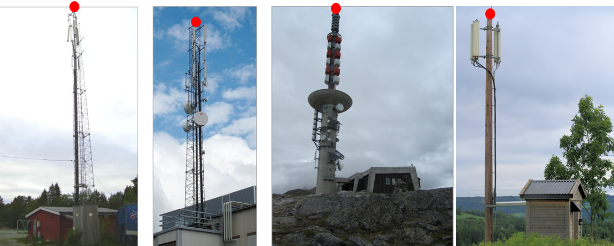
===== Mast.konstruksjon : Mastekonstruksjon - Kode : EnkelStolpe
*Definisjon :* mast laget av kun en enkelt stolpe, vanligvis i lavspentnett, ekom eller langs jernbane
 
.For enkeltstolper skal topp mast registreres. I noen tilfeller, typisk på veilys, må man generere topp mast (se figur lengst til høyre)
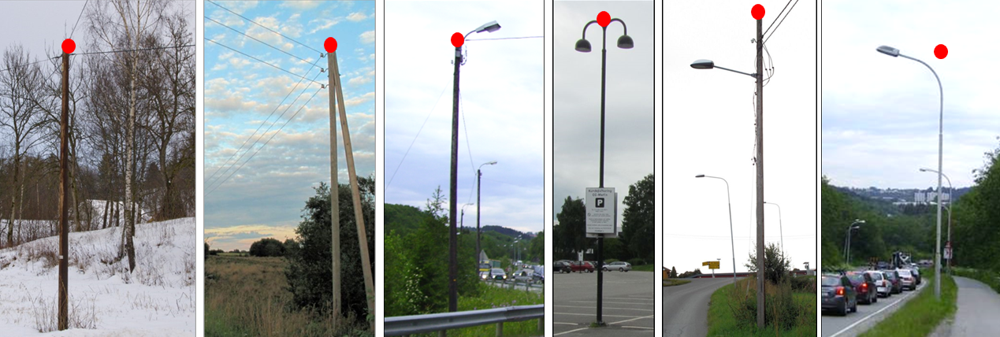
===== Mast.konstruksjon : Mastekonstruksjon - Kode : Fagverksmast
*Definisjon :* fagverk av metallkonstruksjoner
 
.Senter topp mast registreres
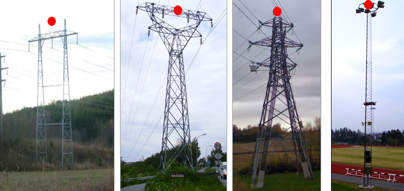
===== Mast.konstruksjon : Mastekonstruksjon - Kode : StorStolpe
*Definisjon :* stolpe(r) i h&#248;yspentlinjer som ikke er fagverksmast
 
.Senter topp mast registreres
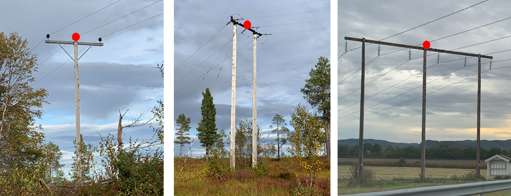
 
<<<
'''
 
[[masteomriss]]
==== «FeatureType» Masteomriss
*Definisjon fra FKB produktspesifikasjon*: ytre avgrensning av mastens fotavtrykk p&#229; bakken
 
*Tilleggsinformasjon for fotogrammetrisk registrering:* Geometrisk utstrekning av masten.
Hovedregelen er at alle master som best&#229;r av flere fundamenterings-/bakkepunkt (store master) skal registreres med masteomriss

I de tilfeller hvor to master st&#229;r inntil hverandre skal hver mast ha sin egen utstrekning.
 
 
'''
.Eksempel på registrering av Masteomriss for StolpeStor og Fagverksmast. Hvert enkelt punkt i kurven angir det enkelte fundament for masten.
image::figurer\masteomriss1.png[link=figurer\masteomriss1.png, Alt="Eksempel på registrering av Masteomriss for StolpeStor og Fagverksmast. Hvert enkelt punkt i kurven angir det enkelte fundament for masten."]
 
 
'''
.For mast som har betongfundament, typisk rund form, registreres omriss av fundamentet.
image::figurer\masteomriss2.png[link=figurer\masteomriss2.png, Alt="For mast som har betongfundament, typisk rund form, registreres omriss av fundamentet."]
 
 
===== Føringer
[cols="25,75"]
|===
|FKB grunnrissreferanse
|Ytterkant av mastens fotavtrykk
 
|FKB høydereferanse
|Fot mast
 
|FKB-A
|Påkrevd registrering
 
|FKB-B
|Påkrevd registrering
 
|FKB-C
|Påkrevd registrering
 
|FKB-D
|Påkrevd registrering
 
|===
 
===== Egenskapstabell
[cols="20,20,20,10"]
|===
|*Navn:* 
|*Type:* 
|*SOSI_navn:* 
|*Mult.:* 
 
|identifikasjon
|«dataType» Identifikasjon
|..IDENT
|[0..1]
 
|identifikasjon.lokalId
|CharacterString
|...LOKALID
|[1..1]
 
|identifikasjon.navnerom
|CharacterString
|...NAVNEROM
|[1..1]
 
|identifikasjon.versjonId
|CharacterString
|...VERSJONID
|[0..1]
 
|oppdateringsdato
|DateTime
|..OPPDATERINGSDATO
|[0..1]
 
|datafangstdato
|Date
|..DATAFANGSTDATO
|[1..1]
 
|verifiseringsdato
|Date
|..VERIFISERINGSDATO
|[0..1]
 
|registreringsversjon
|«CodeList» Registreringsversjon
|..REGISTRERINGSVERSJON
|[0..1]
 
|informasjon
|CharacterString
|..INFORMASJON
|[0..1]
 
|høydereferanse
|«CodeList» Høydereferanse
|..HREF
|[1..1]
 
|medium
|«CodeList» Medium
|..MEDIUM
|[1..1]
 
|kvalitet
|«dataType» Posisjonskvalitet
|..KVALITET
|[1..1]
 
|kvalitet.datafangstmetode
|«CodeList» Datafangstmetode
|...DATAFANGSTMETODE
|[1..1]
 
|kvalitet.nøyaktighet
|Integer
|...NØYAKTIGHET
|[0..1]
 
|kvalitet.synbarhet
|«CodeList» Synbarhet
|...SYNBARHET
|[0..1]
 
|kvalitet.datafangstmetodeHøyde
|«CodeList» Datafangstmetode
|...DATAFANGSTMETODEHØYDE
|[0..1]
 
|kvalitet.nøyaktighetHøyde
|Integer
|...H-NØYAKTIGHET
|[0..1]
 
|driftsmerking
|CharacterString
|..DRIFTSMERKING
|[0..1]
 
|eierOrgNr
|CharacterString
|..EIERORGNR
|[0..1]
 
|eksternPeker
|URI
|..EKSTERNPEKER
|[0..*]
 
|hovedbruk
|«CodeList» Ledningsnettverkstype
|..LEDNINGSNETTVERKSTYPE
|[1..1]
 
|beliggenhet
|GM_Curve
|.KURVE
|[1..1]
 
|type
|«CodeList» Mastekonstruksjon
|..MASTEKONSTRUKSJON
|[0..1]
 
|===
===== Restriksjoner
[cols="20,80"]
|===
|*Navn:* 
|*type: (EnkelStolpe, StorStolpe, Fagverksmast eller Annet) registreres for master hvor det er mulig å tolke funksjonen i bildene.*
 
|Beskrivelse: 
|
 
|===
 
<<<
'''
 
[[nettverkstasjon]]
==== «FeatureType» Nettverkstasjon
*Definisjon fra FKB produktspesifikasjon*: et fysisk, gjerne bygningsmessig, objekt som inneholder komponenter som gjør en eller annen behandling av vann, elektrisk strøm, signal eller annet som det nettverket den er en del av fører. Komponenter som gjør behandlingen kan for eksempel være pumper for vann, transformatorer for elektrisk strøm, forsterkere for signal osv.
 
*Tilleggsinformasjon for fotogrammetrisk registrering:* Egenskapen _plassering_ benyttes for &#229; klassifisere type Nettverkstasjon. I FKB skilles det p&#229; disse nettverkstasjonen; frittst&#229;ende, minikiosk, mastearrangement og mastefotkiosk. 

Fortrinnsvis skal b&#229;de punkt og omriss inng&#229; i FKB. Ved sm&#229; bygninger eller d&#229;rlig innsyn ved kartkonstruksjon kan bare punkt benyttes. N&#229;r nettverkstasjonen er registrert i matrikkel, registreres den som bygning. Dette gjelder typisk for bygninger med areal st&#248;rre enn 15 m2.

Ved fotogrammetrisk registrering kan det v&#230;re vanskelig &#229; skille minikiosk, pumpestasjon og andre bygninger fra hverandre. Det anbefales derfor manuskart for korrekt registrering.

Kan avgrenses av Nettverkstasjonsomriss. Omriss (Nettverkstasjonsomriss) skal om mulig alltid registreres.

*I FKB er det ikke p&#229;krevd &#229; registrere Nettverkstasjon med _plassering_ Mastearrangement i FKB-C og FKB-D omr&#229;der fotogrammetrisk.*
 
 
'''
.Illustrasjon fra produktspesifikasjon av Nettverkstasjon
image::http://skjema.geonorge.no/SOSITEST/produktspesifikasjon/FKB-Ledning/5.0/figurer/Nettverkstasjon.jpg[link=http://skjema.geonorge.no/SOSITEST/produktspesifikasjon/FKB-Ledning/5.0/figurer/Nettverkstasjon.jpg, Alt="Illustrasjon fra produktspesifikasjon: Nettverkstasjon"]
 
===== Føringer
[cols="25,75"]
|===
|FKB grunnrissreferanse
|Senter Nettverkstasjon
 
|FKB høydereferanse
|Topp av senter Nettverkstasjon
 
|FKB-A
|Påkrevd registrering
 
|FKB-B
|Påkrevd registrering
 
|FKB-C
|Påkrevd registrering
 
|FKB-D
|Påkrevd registrering
 
|===
 
===== Egenskapstabell
[cols="20,20,20,10"]
|===
|*Navn:* 
|*Type:* 
|*SOSI_navn:* 
|*Mult.:* 
 
|identifikasjon
|«dataType» Identifikasjon
|..IDENT
|[0..1]
 
|identifikasjon.lokalId
|CharacterString
|...LOKALID
|[1..1]
 
|identifikasjon.navnerom
|CharacterString
|...NAVNEROM
|[1..1]
 
|identifikasjon.versjonId
|CharacterString
|...VERSJONID
|[0..1]
 
|oppdateringsdato
|DateTime
|..OPPDATERINGSDATO
|[0..1]
 
|datafangstdato
|Date
|..DATAFANGSTDATO
|[1..1]
 
|verifiseringsdato
|Date
|..VERIFISERINGSDATO
|[0..1]
 
|registreringsversjon
|«CodeList» Registreringsversjon
|..REGISTRERINGSVERSJON
|[0..1]
 
|informasjon
|CharacterString
|..INFORMASJON
|[0..1]
 
|høydereferanse
|«CodeList» Høydereferanse
|..HREF
|[1..1]
 
|medium
|«CodeList» Medium
|..MEDIUM
|[1..1]
 
|kvalitet
|«dataType» Posisjonskvalitet
|..KVALITET
|[1..1]
 
|kvalitet.datafangstmetode
|«CodeList» Datafangstmetode
|...DATAFANGSTMETODE
|[1..1]
 
|kvalitet.nøyaktighet
|Integer
|...NØYAKTIGHET
|[0..1]
 
|kvalitet.synbarhet
|«CodeList» Synbarhet
|...SYNBARHET
|[0..1]
 
|kvalitet.datafangstmetodeHøyde
|«CodeList» Datafangstmetode
|...DATAFANGSTMETODEHØYDE
|[0..1]
 
|kvalitet.nøyaktighetHøyde
|Integer
|...H-NØYAKTIGHET
|[0..1]
 
|driftsmerking
|CharacterString
|..DRIFTSMERKING
|[0..1]
 
|eierOrgNr
|CharacterString
|..EIERORGNR
|[0..1]
 
|eksternPeker
|URI
|..EKSTERNPEKER
|[0..*]
 
|hovedbruk
|«CodeList» Ledningsnettverkstype
|..LEDNINGSNETTVERKSTYPE
|[1..1]
 
|posisjon
|GM_Point
|.PUNKT
|[1..1]
 
|plassering
|«CodeList» Stasjonsplassering
|..STASJONSPLASSERING
|[1..1]
 
|omriss
|«FeatureType» Nettverkstasjonomriss
|..OMRISS
|[0..1]
|===
===== Presiseringer til beskrivelsen av kodelistekoder
Figurer og skisser knyttet til bruk av bestemte kodelister og koder.
 
===== Nettverkstasjon.plassering : Stasjonsplassering - Kode : Frittstående
*Definisjon :* frittst&#229;ende nettverkstasjon i form av liten bygning
 
.Eksempel på registrering av frittstående nettverkstasjon som representasjonspunkt. Uten manus vil det være vanskelig å skille frittstående nettverksstasjoner med andre bygninger, og man må derfor påregne at slike nettverkstasjoner blir registrert som Anne
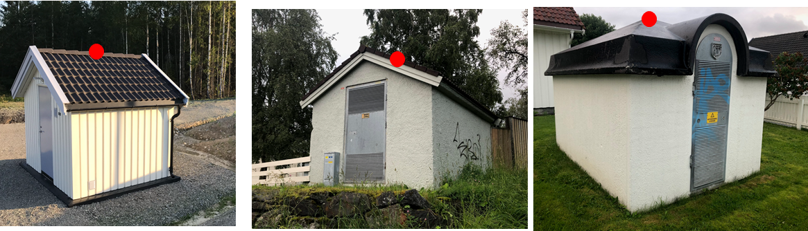
===== Nettverkstasjon.plassering : Stasjonsplassering - Kode : Mastearrangement
*Definisjon :* nettverkstasjon hengende i mast
 
.Eksempel på registrering av mastearrangement som representasjonspunkt.
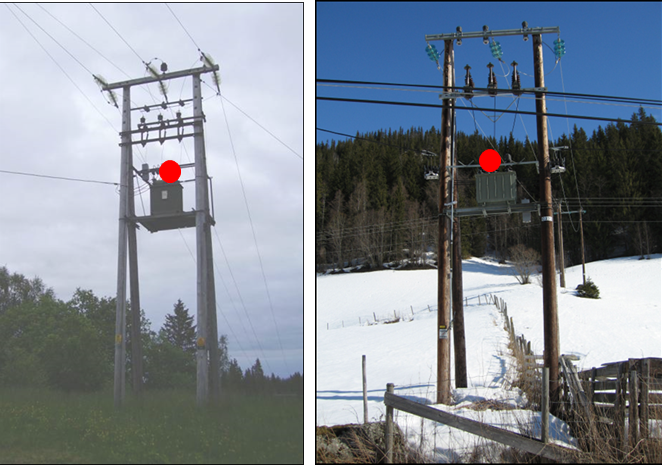
===== Nettverkstasjon.plassering : Stasjonsplassering - Kode : Mastefotkiosk
*Definisjon :* plassering av nettverkstasjon p&#229; bakkeniv&#229; mellom mastefundamentene    *H&#248;gspenttraseer er p&#229;krevd &#229; registrere ved fotogrammetrisk konstruksjon*
 
.Eksempel på registrering av mastefotkiosk som representasjonspunkt.
image::figurer/nettverkstasjon_mastefotstasjon.png[link=figurer/nettverkstasjon_mastefotstasjon.png, Alt="Eksempel på registrering av mastefotkiosk som representasjonspunkt."]
===== Nettverkstasjon.plassering : Stasjonsplassering - Kode : Minikiosk
*Definisjon :* nettverkstasjon som minikiosk
 
.Eksempel på registrering av minikiosk som representasjonspunkt.
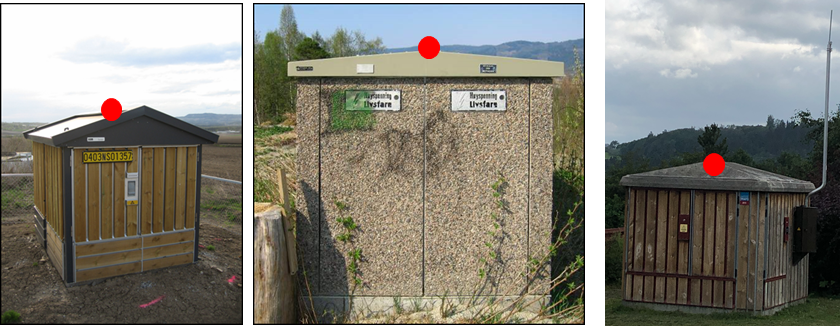
 
<<<
'''
 
[[nettverkstasjonomriss]]
==== «FeatureType» Nettverkstasjonomriss
*Definisjon fra FKB produktspesifikasjon*: ytre avgrensning av nettverkstasjonen, i grunnriss
 
*Tilleggsinformasjon for fotogrammetrisk registrering:* Liten bygning som inneholder transformator for fordeling av elektrisitet.

Ved sm&#229; bygninger eller d&#229;rlig innsyn ved kartkonstruksjon kan bare punkt benyttes. N&#229;r nettstasjon er registrert i matrikkel, registreres den som bygning. Dette gjelder typisk for bygninger med areal st&#248;rre enn 15 m2.

Nettverkstasjonomriss beskriver omrisset av en Nettverkstasjon.
 
 
'''
.Eksempel på registrering av Nettverkstasjonomriss.
image::figurer\nettverkstasjonomriss.png[link=figurer\nettverkstasjonomriss.png, Alt="Eksempel på registrering av Nettverkstasjonomriss."]
 
 
===== Føringer
[cols="25,75"]
|===
|FKB grunnrissreferanse
|Ytterkant nettstasjon
 
|FKB høydereferanse
|Topp ytterkant nettstasjon
 
|FKB-A
|Påkrevd registrering
 
|FKB-B
|Påkrevd registrering
 
|FKB-C
|Påkrevd registrering
 
|FKB-D
|Påkrevd registrering
 
|===
 
===== Egenskapstabell
[cols="20,20,20,10"]
|===
|*Navn:* 
|*Type:* 
|*SOSI_navn:* 
|*Mult.:* 
 
|identifikasjon
|«dataType» Identifikasjon
|..IDENT
|[0..1]
 
|identifikasjon.lokalId
|CharacterString
|...LOKALID
|[1..1]
 
|identifikasjon.navnerom
|CharacterString
|...NAVNEROM
|[1..1]
 
|identifikasjon.versjonId
|CharacterString
|...VERSJONID
|[0..1]
 
|oppdateringsdato
|DateTime
|..OPPDATERINGSDATO
|[0..1]
 
|datafangstdato
|Date
|..DATAFANGSTDATO
|[1..1]
 
|verifiseringsdato
|Date
|..VERIFISERINGSDATO
|[0..1]
 
|registreringsversjon
|«CodeList» Registreringsversjon
|..REGISTRERINGSVERSJON
|[0..1]
 
|informasjon
|CharacterString
|..INFORMASJON
|[0..1]
 
|høydereferanse
|«CodeList» Høydereferanse
|..HREF
|[1..1]
 
|medium
|«CodeList» Medium
|..MEDIUM
|[1..1]
 
|kvalitet
|«dataType» Posisjonskvalitet
|..KVALITET
|[1..1]
 
|kvalitet.datafangstmetode
|«CodeList» Datafangstmetode
|...DATAFANGSTMETODE
|[1..1]
 
|kvalitet.nøyaktighet
|Integer
|...NØYAKTIGHET
|[0..1]
 
|kvalitet.synbarhet
|«CodeList» Synbarhet
|...SYNBARHET
|[0..1]
 
|kvalitet.datafangstmetodeHøyde
|«CodeList» Datafangstmetode
|...DATAFANGSTMETODEHØYDE
|[0..1]
 
|kvalitet.nøyaktighetHøyde
|Integer
|...H-NØYAKTIGHET
|[0..1]
 
|driftsmerking
|CharacterString
|..DRIFTSMERKING
|[0..1]
 
|eierOrgNr
|CharacterString
|..EIERORGNR
|[0..1]
 
|eksternPeker
|URI
|..EKSTERNPEKER
|[0..*]
 
|hovedbruk
|«CodeList» Ledningsnettverkstype
|..LEDNINGSNETTVERKSTYPE
|[1..1]
 
|beliggenhet
|GM_Curve
|.KURVE
|[1..1]
 
|===
 
<<<
'''
 
[[skap]]
==== «FeatureType» Skap
*Definisjon fra FKB produktspesifikasjon*: beskyttelseskasse plassert vanligvis p&#229; bakken, som inneholder koblinger for elektrisk str&#248;m, signal eller annet

Merknad:
Kan ogs&#229; v&#230;re p&#229; st&#248;rrelse med kiosk.
 
*Tilleggsinformasjon for fotogrammetrisk registrering:* Skap for fordeling av elektrisitet eller ekom.
Brukes ved registrering av koblingsbokser (-skap) for elektrisitet og ekom p&#229; bakken, inntil hus, inntil gjerder m.m. 

Ofte st&#229;r flere skap tilh&#248;rende flere etater/fagomr&#229;der inntil hverandre. Det kan v&#230;re vanskelig &#229; skille de enkelte skap fra hverandre.

For &#229; sikre god fullstendighet og riktig tolkning ved fotogrammetrisk registrering anbefales det &#229; etablere manus eller signalere skapene.
 
 
'''
.Illustrasjon fra produktspesifikasjon av Skap
image::http://skjema.geonorge.no/SOSITEST/produktspesifikasjon/FKB-Ledning/5.0/figurer/Skap.jpg[link=http://skjema.geonorge.no/SOSITEST/produktspesifikasjon/FKB-Ledning/5.0/figurer/Skap.jpg, Alt="Illustrasjon fra produktspesifikasjon: Skap"]
 
 
'''
.Eksempel på registrering av skap.
image::figurer\skap.png[link=figurer\skap.png, Alt="Eksempel på registrering av skap."]
 
 
===== Føringer
[cols="25,75"]
|===
|FKB grunnrissreferanse
|Senter topp skap
 
|FKB høydereferanse
|Topp skap
 
|FKB-A
|Opsjonell registrering
 
|FKB-B
|Opsjonell registrering
 
|FKB-C
|Registreres ikke
 
|FKB-D
|Registreres ikke
 
|===
 
===== Egenskapstabell
[cols="20,20,20,10"]
|===
|*Navn:* 
|*Type:* 
|*SOSI_navn:* 
|*Mult.:* 
 
|identifikasjon
|«dataType» Identifikasjon
|..IDENT
|[0..1]
 
|identifikasjon.lokalId
|CharacterString
|...LOKALID
|[1..1]
 
|identifikasjon.navnerom
|CharacterString
|...NAVNEROM
|[1..1]
 
|identifikasjon.versjonId
|CharacterString
|...VERSJONID
|[0..1]
 
|oppdateringsdato
|DateTime
|..OPPDATERINGSDATO
|[0..1]
 
|datafangstdato
|Date
|..DATAFANGSTDATO
|[1..1]
 
|verifiseringsdato
|Date
|..VERIFISERINGSDATO
|[0..1]
 
|registreringsversjon
|«CodeList» Registreringsversjon
|..REGISTRERINGSVERSJON
|[0..1]
 
|informasjon
|CharacterString
|..INFORMASJON
|[0..1]
 
|høydereferanse
|«CodeList» Høydereferanse
|..HREF
|[1..1]
 
|medium
|«CodeList» Medium
|..MEDIUM
|[1..1]
 
|kvalitet
|«dataType» Posisjonskvalitet
|..KVALITET
|[1..1]
 
|kvalitet.datafangstmetode
|«CodeList» Datafangstmetode
|...DATAFANGSTMETODE
|[1..1]
 
|kvalitet.nøyaktighet
|Integer
|...NØYAKTIGHET
|[0..1]
 
|kvalitet.synbarhet
|«CodeList» Synbarhet
|...SYNBARHET
|[0..1]
 
|kvalitet.datafangstmetodeHøyde
|«CodeList» Datafangstmetode
|...DATAFANGSTMETODEHØYDE
|[0..1]
 
|kvalitet.nøyaktighetHøyde
|Integer
|...H-NØYAKTIGHET
|[0..1]
 
|driftsmerking
|CharacterString
|..DRIFTSMERKING
|[0..1]
 
|eierOrgNr
|CharacterString
|..EIERORGNR
|[0..1]
 
|eksternPeker
|URI
|..EKSTERNPEKER
|[0..*]
 
|hovedbruk
|«CodeList» Ledningsnettverkstype
|..LEDNINGSNETTVERKSTYPE
|[1..1]
 
|posisjon
|GM_Point
|.PUNKT
|[1..1]
 
|===
 
<<<
'''
 
[[trase]]
==== «FeatureType» Trase
*Definisjon fra FKB produktspesifikasjon*: den mest mulig geografisk riktige posisjonen for en framf&#248;ring av ledning(er)
 
*Tilleggsinformasjon for fotogrammetrisk registrering:* Brukes ved registrering av traseer mellom master. En trase beskriver den geografisk plassering for en eller flere ledninger, (ledning = kabel, linje, r&#248;r osv.).

Registreres som rett linje mellom punkter i master. Det skal kun registreres nodepunkt eller knutepunkt der hvor traseen er tilknyttet et annet fysisk objekt (Mast, Nettverkstasjon eller Flymark&#248;r).

Ved fotogrammetrisk registrering kan det v&#230;re vanskelig &#229; skille mellom hva som er lavspent og ekom. Det kan derfor v&#230;re aktuelt &#229; lage manus f&#248;r kartkonstruksjon.

Ved fjordspenn og overf&#248;ringer over dal der ledningene forgreiner seg og avstanden mellom hver enkel ledning er st&#248;rre enn 15 meter, skal det registreres en trase pr. ledning. 

Lange luftspenn traseer over fjorder og lignende skal registreres som ei sammenhengende kurve mellom endemastene. N&#229;r slike spenn har mark&#248;rer skal traseen registreres med et punkt i kurven som er lik mark&#248;rens koordinat (rett linje fra mark&#248;r til mark&#248;r). 

I FKB er det kun traseer som er synlige i terrenget som skal registreres (luftspenn).

Det skal dannes nodepunkt (knutepunkt) mellom tilst&#248;tende traseer. Situasjonen avgj&#248;r om nodepunktet skal etableres i 2D eller 3D.
Hvert punkt i trasen skal ha lik koordinat som objekttype Mast, Nettverkstasjon eller Flymark&#248;r.

*I FKB er f&#248;lgende p&#229;krevd &#229; registrere fotogrammetrisk:
<ul>
	<li>h&#248;gspenttraseer</li>
	<li>andre traseer (luftspenn) lengre enn 100 meter</li>
</ul>
Lavspent, belysning og ekom traseer skal ikke fotogrammetrisk registreres med mindre dette er s&#230;rskilt avtalt (er opsjonelt). *
 
 
'''
.Illustrasjon fra produktspesifikasjon av Trase
image::http://skjema.geonorge.no/SOSITEST/produktspesifikasjon/FKB-Ledning/5.0/figurer/Trase.jpg[link=http://skjema.geonorge.no/SOSITEST/produktspesifikasjon/FKB-Ledning/5.0/figurer/Trase.jpg, Alt="Illustrasjon fra produktspesifikasjon: Trase"]
 
 
'''
.Eksempel på registrering av trase med forgreining, samt hvordan en fjordoverføring med forgreining skal synliggjøres i kartet.
image::figurer\trase_forgrening_fjorspenn.png[link=figurer\trase_forgrening_fjorspenn.png, Alt="Eksempel på registrering av trase med forgreining, samt hvordan en fjordoverføring med forgreining skal synliggjøres i kartet."]
 
 
===== Føringer
[cols="25,75"]
|===
|FKB grunnrissreferanse
|Senter mastekonstruksjon, nettverkstasjon eller flymarkør
 
|FKB høydereferanse
|Topp mast (absolutt høyeste punkt), nettstasjon eller flymarkør. Høyden kan være vanskelig å bestemme nøyaktig.
 
|FKB-A
|Påkrevd registrering
 
|FKB-B
|Påkrevd registrering
 
|FKB-C
|Påkrevd registrering
 
|FKB-D
|Påkrevd registrering
 
|===
 
===== Egenskapstabell
[cols="20,20,20,10"]
|===
|*Navn:* 
|*Type:* 
|*SOSI_navn:* 
|*Mult.:* 
 
|identifikasjon
|«dataType» Identifikasjon
|..IDENT
|[0..1]
 
|identifikasjon.lokalId
|CharacterString
|...LOKALID
|[1..1]
 
|identifikasjon.navnerom
|CharacterString
|...NAVNEROM
|[1..1]
 
|identifikasjon.versjonId
|CharacterString
|...VERSJONID
|[0..1]
 
|oppdateringsdato
|DateTime
|..OPPDATERINGSDATO
|[0..1]
 
|datafangstdato
|Date
|..DATAFANGSTDATO
|[1..1]
 
|verifiseringsdato
|Date
|..VERIFISERINGSDATO
|[0..1]
 
|registreringsversjon
|«CodeList» Registreringsversjon
|..REGISTRERINGSVERSJON
|[0..1]
 
|informasjon
|CharacterString
|..INFORMASJON
|[0..1]
 
|høydereferanse
|«CodeList» Høydereferanse
|..HREF
|[1..1]
 
|medium
|«CodeList» Medium
|..MEDIUM
|[1..1]
 
|kvalitet
|«dataType» Posisjonskvalitet
|..KVALITET
|[1..1]
 
|kvalitet.datafangstmetode
|«CodeList» Datafangstmetode
|...DATAFANGSTMETODE
|[1..1]
 
|kvalitet.nøyaktighet
|Integer
|...NØYAKTIGHET
|[0..1]
 
|kvalitet.synbarhet
|«CodeList» Synbarhet
|...SYNBARHET
|[0..1]
 
|kvalitet.datafangstmetodeHøyde
|«CodeList» Datafangstmetode
|...DATAFANGSTMETODEHØYDE
|[0..1]
 
|kvalitet.nøyaktighetHøyde
|Integer
|...H-NØYAKTIGHET
|[0..1]
 
|driftsmerking
|CharacterString
|..DRIFTSMERKING
|[0..1]
 
|eierOrgNr
|CharacterString
|..EIERORGNR
|[0..1]
 
|eksternPeker
|URI
|..EKSTERNPEKER
|[0..*]
 
|hovedbruk
|«CodeList» Ledningsnettverkstype
|..LEDNINGSNETTVERKSTYPE
|[1..1]
 
|beliggenhet
|GM_Curve
|.KURVE
|[1..1]
 
|antallLaserPunkt
|Integer
|..ANTALL_LASERPUNKT
|[0..1]
 
|maksVertikalAvstand
|«dataType» VertikalAvstandLedning
|..MAKS_VERTIKALUTSTREKNING
|[0..1]
 
|maksVertikalAvstand.vertikalhøydeposisjon
|GM_Point
|.NØHKOOR
|[1..1]
 
|maksVertikalAvstand.vertikalhøyde
|«dataType» Real
|...VERTIKALHØYDE
|[1..1]
 
|minVertikalAvstand
|«dataType» VertikalAvstandLedning
|..MIN_VERTIKALUTSTREKNING
|[0..1]
 
|minVertikalAvstand.vertikalhøydeposisjon
|GM_Point
|.NØHKOOR
|[1..1]
 
|minVertikalAvstand.vertikalhøyde
|«dataType» Real
|...VERTIKALHØYDE
|[1..1]
 
|trasenavn
|CharacterString
|..TRASENAVN
|[0..1]
 
|===
===== Presiseringer til beskrivelsen av kodelistekoder
Figurer og skisser knyttet til bruk av bestemte kodelister og koder.
 
===== Trase.hovedbruk : Ledningsnettverkstype - Kode : Kontaktledning
*Definisjon :* anlegg for str&#248;mforsyning gjennom takmontert str&#248;mavtakerutstyr p&#229; elektriske kj&#248;ret&#248;y
 
.Senter topp mast registreres
image::figurer/mast_kontaktledning.png[link=figurer/mast_kontaktledning.png, Alt="Senter topp mast registreres"]
===== Trase.hovedbruk : Ledningsnettverkstype - Kode : Signalanlegg
*Definisjon :* nettverk som brukes for &#229; oversende og formidle trafikksignal
 
.Senter topp mast registreres
image::figurer/mast_signalanlegg.png[link=figurer/mast_signalanlegg.png, Alt="Senter topp mast registreres"]
 
<<<
'''
 
[[vindturbin]]
==== «FeatureType» Vindturbin
*Definisjon fra FKB produktspesifikasjon*: en kontainer som betegner en hel "vindm&#248;lle". En vindturbin har en generator
 
*Tilleggsinformasjon for fotogrammetrisk registrering:* Benyttes for &#229; registrere vindturbiner. 

Egenskapene _navh&#248;yde_ og _rotorbladlengde_ skal registreres for &#229; angi utstrekning til Vindturbinen. Disse egenskapene, i tillegg til registrert posisjon, kan benyttes til visualisere den romlige utstrekningen for vindturbinen.

Fotavtrykket for Vindturbin registreres som Vindturbinomriss.
 
 
'''
.Illustrasjon fra produktspesifikasjon av Vindturbin
image::http://skjema.geonorge.no/SOSITEST/produktspesifikasjon/FKB-Ledning/5.0/figurer/Vindturbin.jpg[link=http://skjema.geonorge.no/SOSITEST/produktspesifikasjon/FKB-Ledning/5.0/figurer/Vindturbin.jpg, Alt="Illustrasjon fra produktspesifikasjon: Vindturbin"]
 
 
'''
.Eksempel på registrering av Vindturbin (topp nav)
image::figurer\vindturbin1.png[link=figurer\vindturbin1.png, Alt="Eksempel på registrering av Vindturbin (topp nav)"]
 
 
'''
.Illustrasjon som viser betydningen av egenskapene Navhøyde og Rotorbladlengde
image::figurer\vindturbin2.png[link=figurer\vindturbin2.png, Alt="Illustrasjon som viser betydningen av egenskapene Navhøyde og Rotorbladlengde"]
 
 
===== Føringer
[cols="25,75"]
|===
|FKB grunnrissreferanse
|Senter vindturbin
 
|FKB høydereferanse
|Top nav for vindturbin
 
|FKB-A
|Påkrevd registrering
 
|FKB-B
|Påkrevd registrering
 
|FKB-C
|Påkrevd registrering
 
|FKB-D
|Påkrevd registrering
 
|===
 
===== Egenskapstabell
[cols="20,20,20,10"]
|===
|*Navn:* 
|*Type:* 
|*SOSI_navn:* 
|*Mult.:* 
 
|identifikasjon
|«dataType» Identifikasjon
|..IDENT
|[0..1]
 
|identifikasjon.lokalId
|CharacterString
|...LOKALID
|[1..1]
 
|identifikasjon.navnerom
|CharacterString
|...NAVNEROM
|[1..1]
 
|identifikasjon.versjonId
|CharacterString
|...VERSJONID
|[0..1]
 
|oppdateringsdato
|DateTime
|..OPPDATERINGSDATO
|[0..1]
 
|datafangstdato
|Date
|..DATAFANGSTDATO
|[1..1]
 
|verifiseringsdato
|Date
|..VERIFISERINGSDATO
|[0..1]
 
|registreringsversjon
|«CodeList» Registreringsversjon
|..REGISTRERINGSVERSJON
|[0..1]
 
|informasjon
|CharacterString
|..INFORMASJON
|[0..1]
 
|høydereferanse
|«CodeList» Høydereferanse
|..HREF
|[1..1]
 
|medium
|«CodeList» Medium
|..MEDIUM
|[1..1]
 
|kvalitet
|«dataType» Posisjonskvalitet
|..KVALITET
|[1..1]
 
|kvalitet.datafangstmetode
|«CodeList» Datafangstmetode
|...DATAFANGSTMETODE
|[1..1]
 
|kvalitet.nøyaktighet
|Integer
|...NØYAKTIGHET
|[0..1]
 
|kvalitet.synbarhet
|«CodeList» Synbarhet
|...SYNBARHET
|[0..1]
 
|kvalitet.datafangstmetodeHøyde
|«CodeList» Datafangstmetode
|...DATAFANGSTMETODEHØYDE
|[0..1]
 
|kvalitet.nøyaktighetHøyde
|Integer
|...H-NØYAKTIGHET
|[0..1]
 
|driftsmerking
|CharacterString
|..DRIFTSMERKING
|[0..1]
 
|eierOrgNr
|CharacterString
|..EIERORGNR
|[0..1]
 
|eksternPeker
|URI
|..EKSTERNPEKER
|[0..*]
 
|hovedbruk
|«CodeList» Ledningsnettverkstype
|..LEDNINGSNETTVERKSTYPE
|[1..1]
 
|posisjon
|GM_Point
|.PUNKT
|[1..1]
 
|rotorbladlengde
|Real
|..ROTORBLADLENGDE
|[0..1]
 
|navhøyde
|Real
|..NAVHØYDE
|[0..1]
 
|omriss
|«FeatureType» Vindturbinomriss
|..OMRISS
|[0..1]
|===
 
<<<
'''
 
[[vindturbinomriss]]
==== «FeatureType» Vindturbinomriss
*Definisjon fra FKB produktspesifikasjon*: ytre avgrensning av vindturbinens fotavtrykk p&#229; bakken
 
*Tilleggsinformasjon for fotogrammetrisk registrering:* Omriss av Vindturbin
 
 
'''
.Eksempel på registrering av vindturbinomriss
image::figurer\vindturbinomriss.png[link=figurer\vindturbinomriss.png, Alt="Eksempel på registrering av vindturbinomriss"]
 
 
===== Føringer
[cols="25,75"]
|===
|FKB grunnrissreferanse
|Ytterkant av vindturbinens fundament
 
|FKB høydereferanse
|Fot vindturbin
 
|FKB-A
|Påkrevd registrering
 
|FKB-B
|Påkrevd registrering
 
|FKB-C
|Påkrevd registrering
 
|FKB-D
|Påkrevd registrering
 
|===
 
===== Egenskapstabell
[cols="20,20,20,10"]
|===
|*Navn:* 
|*Type:* 
|*SOSI_navn:* 
|*Mult.:* 
 
|identifikasjon
|«dataType» Identifikasjon
|..IDENT
|[0..1]
 
|identifikasjon.lokalId
|CharacterString
|...LOKALID
|[1..1]
 
|identifikasjon.navnerom
|CharacterString
|...NAVNEROM
|[1..1]
 
|identifikasjon.versjonId
|CharacterString
|...VERSJONID
|[0..1]
 
|oppdateringsdato
|DateTime
|..OPPDATERINGSDATO
|[0..1]
 
|datafangstdato
|Date
|..DATAFANGSTDATO
|[1..1]
 
|verifiseringsdato
|Date
|..VERIFISERINGSDATO
|[0..1]
 
|registreringsversjon
|«CodeList» Registreringsversjon
|..REGISTRERINGSVERSJON
|[0..1]
 
|informasjon
|CharacterString
|..INFORMASJON
|[0..1]
 
|høydereferanse
|«CodeList» Høydereferanse
|..HREF
|[1..1]
 
|medium
|«CodeList» Medium
|..MEDIUM
|[1..1]
 
|kvalitet
|«dataType» Posisjonskvalitet
|..KVALITET
|[1..1]
 
|kvalitet.datafangstmetode
|«CodeList» Datafangstmetode
|...DATAFANGSTMETODE
|[1..1]
 
|kvalitet.nøyaktighet
|Integer
|...NØYAKTIGHET
|[0..1]
 
|kvalitet.synbarhet
|«CodeList» Synbarhet
|...SYNBARHET
|[0..1]
 
|kvalitet.datafangstmetodeHøyde
|«CodeList» Datafangstmetode
|...DATAFANGSTMETODEHØYDE
|[0..1]
 
|kvalitet.nøyaktighetHøyde
|Integer
|...H-NØYAKTIGHET
|[0..1]
 
|driftsmerking
|CharacterString
|..DRIFTSMERKING
|[0..1]
 
|eierOrgNr
|CharacterString
|..EIERORGNR
|[0..1]
 
|eksternPeker
|URI
|..EKSTERNPEKER
|[0..*]
 
|hovedbruk
|«CodeList» Ledningsnettverkstype
|..LEDNINGSNETTVERKSTYPE
|[1..1]
 
|beliggenhet
|GM_Curve
|.KURVE
|[1..1]
 
|===
 
<<<
'''
 
[[åk]]
==== «FeatureType» Åk
*Definisjon fra FKB produktspesifikasjon*: en hovedsaklig liggende konstruksjon festet i (vanligvis) to master, ei p&#229; hver side av bane

Merknad FKB:
"Beina" er egne objekter (objekttype Mast), og ikke del av objektet av objekttypen &#197;k.
 
*Tilleggsinformasjon for fotogrammetrisk registrering:* Horisontal konstruksjon i st&#229;l, som regel med mast i hver ende, for opphenging av kontaktledning, signalanlegg eller belysning. I FKB registreres &#197;k kun i forbindelse med bane.
 
 
'''
.Illustrasjon fra produktspesifikasjon av Åk
image::http://skjema.geonorge.no/SOSITEST/produktspesifikasjon/FKB-Ledning/5.0/figurer/Aak.jpg[link=http://skjema.geonorge.no/SOSITEST/produktspesifikasjon/FKB-Ledning/5.0/figurer/Aak.jpg, Alt="Illustrasjon fra produktspesifikasjon: Åk"]
 
 
'''
.Eksempel på registrering av Åk. Den enkelte mast registreres i tillegg.
image::figurer\åk.png[link=figurer\åk.png, Alt="Eksempel på registrering av Åk. Den enkelte mast registreres i tillegg."]
 
 
===== Føringer
[cols="25,75"]
|===
|FKB grunnrissreferanse
|Endepunkt Åk
 
|FKB høydereferanse
|Topp Åk
 
|FKB-A
|Påkrevd registrering
 
|FKB-B
|Påkrevd registrering
 
|FKB-C
|Påkrevd registrering
 
|FKB-D
|Påkrevd registrering
 
|===
 
===== Egenskapstabell
[cols="20,20,20,10"]
|===
|*Navn:* 
|*Type:* 
|*SOSI_navn:* 
|*Mult.:* 
 
|identifikasjon
|«dataType» Identifikasjon
|..IDENT
|[0..1]
 
|identifikasjon.lokalId
|CharacterString
|...LOKALID
|[1..1]
 
|identifikasjon.navnerom
|CharacterString
|...NAVNEROM
|[1..1]
 
|identifikasjon.versjonId
|CharacterString
|...VERSJONID
|[0..1]
 
|oppdateringsdato
|DateTime
|..OPPDATERINGSDATO
|[0..1]
 
|datafangstdato
|Date
|..DATAFANGSTDATO
|[1..1]
 
|verifiseringsdato
|Date
|..VERIFISERINGSDATO
|[0..1]
 
|registreringsversjon
|«CodeList» Registreringsversjon
|..REGISTRERINGSVERSJON
|[0..1]
 
|informasjon
|CharacterString
|..INFORMASJON
|[0..1]
 
|høydereferanse
|«CodeList» Høydereferanse
|..HREF
|[1..1]
 
|medium
|«CodeList» Medium
|..MEDIUM
|[1..1]
 
|kvalitet
|«dataType» Posisjonskvalitet
|..KVALITET
|[1..1]
 
|kvalitet.datafangstmetode
|«CodeList» Datafangstmetode
|...DATAFANGSTMETODE
|[1..1]
 
|kvalitet.nøyaktighet
|Integer
|...NØYAKTIGHET
|[0..1]
 
|kvalitet.synbarhet
|«CodeList» Synbarhet
|...SYNBARHET
|[0..1]
 
|kvalitet.datafangstmetodeHøyde
|«CodeList» Datafangstmetode
|...DATAFANGSTMETODEHØYDE
|[0..1]
 
|kvalitet.nøyaktighetHøyde
|Integer
|...H-NØYAKTIGHET
|[0..1]
 
|driftsmerking
|CharacterString
|..DRIFTSMERKING
|[0..1]
 
|eierOrgNr
|CharacterString
|..EIERORGNR
|[0..1]
 
|eksternPeker
|URI
|..EKSTERNPEKER
|[0..*]
 
|hovedbruk
|«CodeList» Ledningsnettverkstype
|..LEDNINGSNETTVERKSTYPE
|[1..1]
 
|beliggenhet
|GM_Curve
|.KURVE
|[1..1]
 
|===
// End of Registreringsinstruks UML-model
