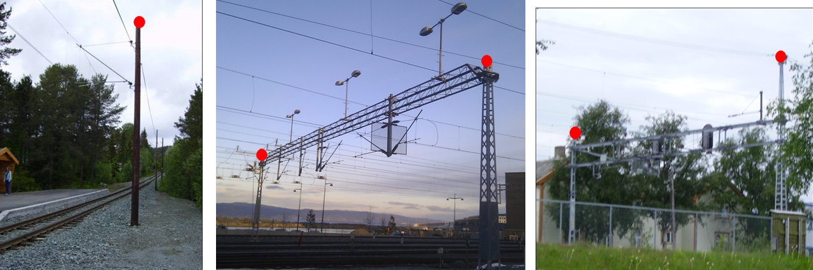
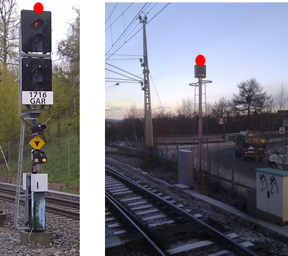

[discrete]
===== Ledningsnettverkstype - Kodenavn: Kontaktledning
*Definisjon :* anlegg for str&#248;mforsyning gjennom takmontert str&#248;mavtakerutstyr p&#229; elektriske kj&#248;ret&#248;y 

For kontaktledningsmaster angis egenskapen _konstruksjon_ med verdien "enkelStolpe".
 
.Senter topp mast registreres

[discrete]
===== Ledningsnettverkstype - Kodenavn: Signalanlegg
*Definisjon :* nettverk som brukes for &#229; oversende og formidle trafikksignal 

For signalmaster angis egenskapen _konstruksjon_ med verdien "enkelStolpe".
 
.Senter topp mast registreres
