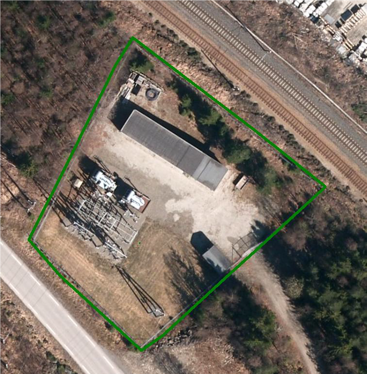

=== Spesielt om registrering av ledningsdata ved større trafostasjoner

Ved trafostasjoner skal koplingsobjekter, master og ledning registreres som spesifisert i denne spesifikasjonen. Det samme gjelder bygninger, veger, gjerder etc. skal registreres som normalt.
Andre ledningsdetaljer (som for eksempel samleskinner, brytere, avledere osv.) skal ikke registreres.

Området innenfor gjerdet for trafostasjon skal registreres som arealbruksområde Transformatorstasjon i FKB-Arealbruk 5.0. Se spesifikasjonen av http://skjema.geonorge.no/SOSITEST/registreringsinstruks/FKB-Arealbruk/5.0/[FKB-Arealbruk 5.0] for detaljer.

.Avgrensing av trafostasjon skal gjøres ved hjelp av arealbruksobjekt Transformatorstasjon

