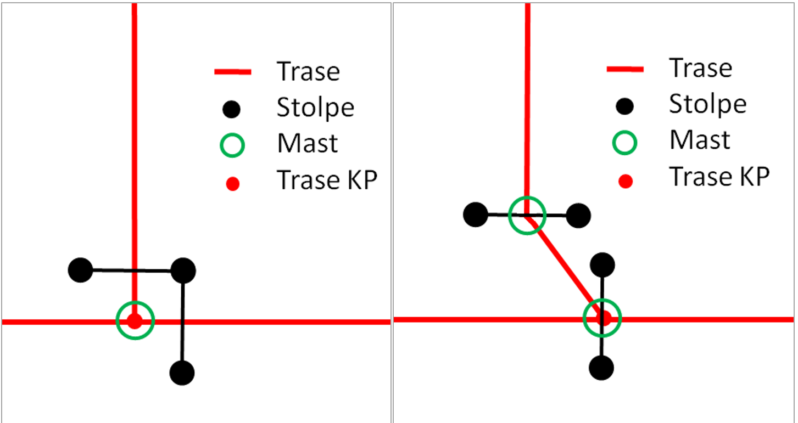
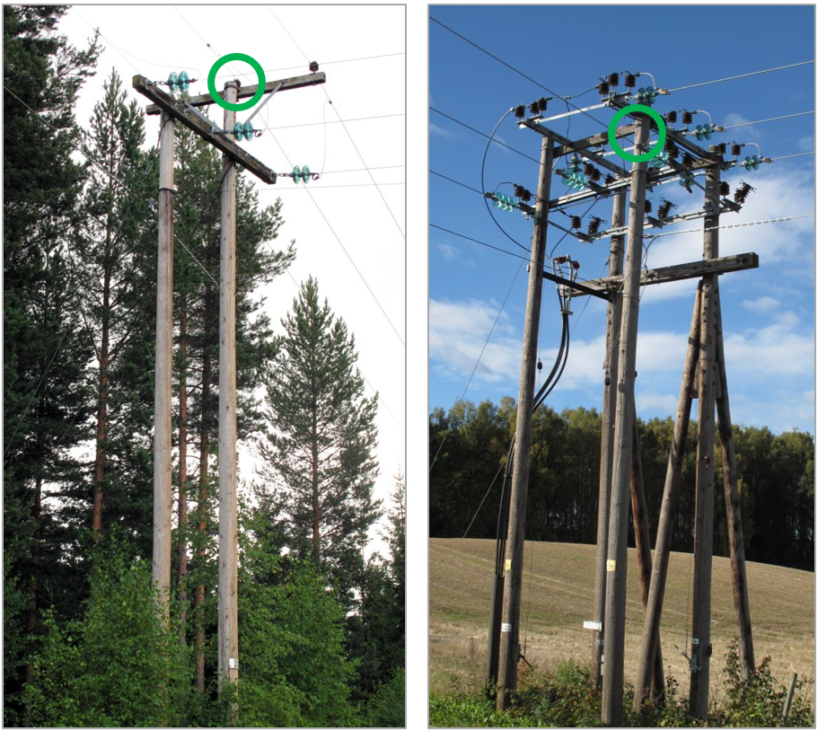
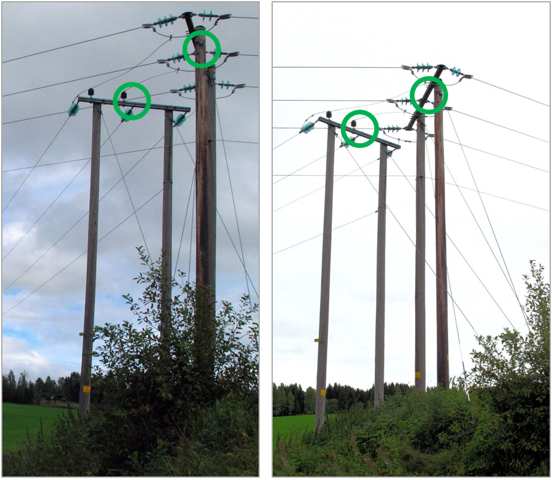

=== Spesielt om registrering av traseknutepunkt

Når to eller flere lavspent- og/eller høgspenttraseer møtes skal det etableres et knutepunkt med lik koordinat som masten. Knutepunktets høydeverdi (høydereferansen) skal alltid være topp mast. Dette gjelder i de tilfeller hvor to eller flere traseer er koblet sammen i en mast.
 
Mastene i slike traseknutepunkt kan være utformet på mange ulike måter. Hovedregelen for hvordan master konstrueres er som følger:

* En mast er samling av en eller flere stolper som er knyttet sammen med traverser, slik at stolpene fysisk sett er koplet sammen og mekanisk påvirker hverandre. Hvis flere stolper geografisk står i nærheten av hverandre, men ikke fysisk er knyttet sammen, altså ikke mekanisk påvirker hverandre, skal de registreres som to eller flere master.  
* Blir det definert to eller flere master, skal det registreres trase mellom mastepunktene.

Skissen under illustrerer når et traseknutepunkt skal registreres som en mast kontra to master.

.Eksempel på registrering av maste(r) og traseknutepunkt

.Traseknutepunkt som skal registreres som en mast (mastepunkt = grønn ring)

.Traseknutepunkt som skal registreres som to master (mastepunkt = grønn ring)
