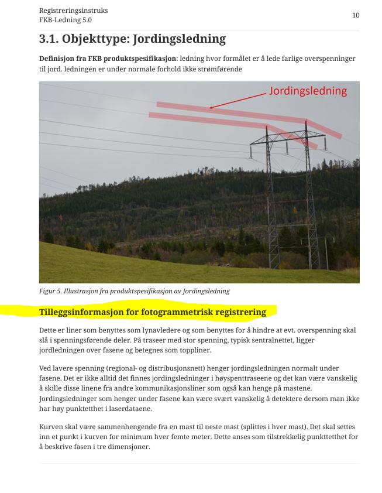

== Innspill til endringer i Punktsky FKB-Ledning 5.0 2022-01-01

[cols="10,15,40,35", options="header"]
|===
|Når
|Fra hvem
|Innspill
|Foreløpig kommentar

| 2022-07-13
| Lars Mardal
a| "_Fant en malfeil i registreringsinstrsuksen for punktsky FKB-Ledning. Ser det henvises til fotogrammetrisk registrering. Dette bør rettes til neste versjon._"

Feilen gjelder overskriftsnivå 4 "Tilleggsinformasjon for fotogrammetrisk registreringsinstruks" under kapittel 3.

| Juster malen ved neste utgivelse av registreringsinstruksen

| åååå-mm-dd
| navn@domene.no
| Emne: 

Tekst tekst tekst

| Svar på epost åååå-mm-dd: 

Tekst tekst tekst

|===
