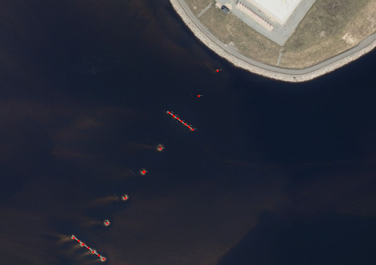
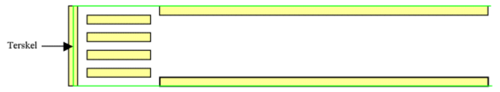
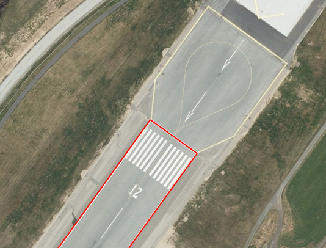
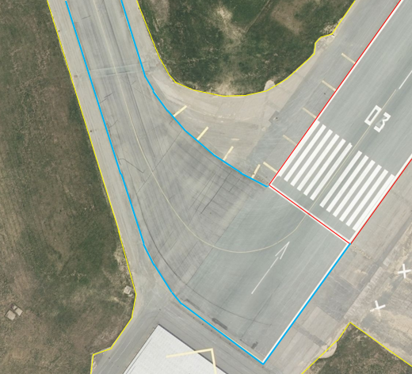
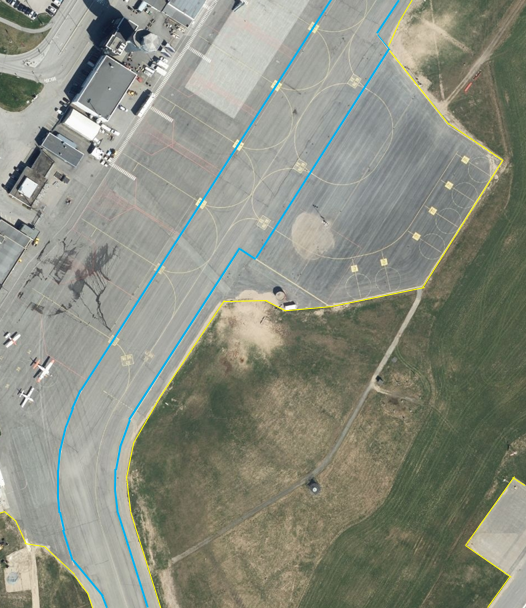

 
<<<
'''
 
[[lufthavnlys]]
==== «FeatureType» Lufthavnlys
*Definisjon fra FKB produktspesifikasjon*: spesielle lys for en lufthavn tiltenkt navigasjon og visualisering av oppmerking i mørket
 
 
.Illustrasjon fra produktspesifikasjon av Lufthavnlys
image::https://skjema.geonorge.no/SOSI/produktspesifikasjon/FKB-Lufthavn/5.0/figurer/objtype_lufthavnlys.png[link=https://skjema.geonorge.no/SOSI/produktspesifikasjon/FKB-Lufthavn/5.0/figurer/objtype_lufthavnlys.png, Alt="Illustrasjon fra produktspesifikasjon: Lufthavnlys"]
 
 
===== Tilleggsinformasjon for fotogrammetrisk registrering
Alle lufthavnlys klassifiseres som Annen lufthavnbelysning (..LHLYSTYPE 99) ved registrering etter denne instruksen.

I kartleggingsprosjekter der Avinor (lufthavneier) ikke deltar som oppdragsgiver skal det, hvis annet ikke avtales, kun registreres lufthavnlys utenfor lufthavnen.
 
 
'''
.Eksempel på Lufthavnlys. Røde punkter markerer hvert lufthavnlys utenfor lufthavnen.

 
 
 
===== Føringer
[cols="25,75"]
|===
|FKB grunnrissreferanse
|Senter
 
|FKB høydereferanse
|Topp
 
|FKB-A
|Påkrevd registrering
 
|FKB-B
|Påkrevd registrering
 
|FKB-C
|Registreres ikke
 
|FKB-D
|Registreres ikke
 
|===
 
===== Egenskapstabell
[cols="20,20,20,10"]
|===
|*Navn:* 
|*Type:* 
|*SOSI_navn:* 
|*Mult.:* 
 
|identifikasjon
|«dataType» Identifikasjon
|..IDENT
|[0..1]
 
|identifikasjon.lokalId
|CharacterString
|...LOKALID
|[1..1]
 
|identifikasjon.navnerom
|CharacterString
|...NAVNEROM
|[1..1]
 
|identifikasjon.versjonId
|CharacterString
|...VERSJONID
|[0..1]
 
|oppdateringsdato
|DateTime
|..OPPDATERINGSDATO
|[0..1]
 
|datafangstdato
|Date
|..DATAFANGSTDATO
|[1..1]
 
|verifiseringsdato
|Date
|..VERIFISERINGSDATO
|[0..1]
 
|registreringsversjon
|«CodeList» Registreringsversjon
|..REGISTRERINGSVERSJON
|[0..1]
 
|informasjon
|CharacterString
|..INFORMASJON
|[0..1]
 
|kvalitet
|«dataType» Posisjonskvalitet
|..KVALITET
|[1..1]
 
|kvalitet.datafangstmetode
|«CodeList» Datafangstmetode
|...DATAFANGSTMETODE
|[1..1]
 
|kvalitet.nøyaktighet
|Integer
|...NØYAKTIGHET
|[0..1]
 
|kvalitet.synbarhet
|«CodeList» Synbarhet
|...SYNBARHET
|[0..1]
 
|kvalitet.datafangstmetodeHøyde
|«CodeList» Datafangstmetode
|...DATAFANGSTMETODEHØYDE
|[0..1]
 
|kvalitet.nøyaktighetHøyde
|Integer
|...H-NØYAKTIGHET
|[0..1]
 
|posisjon
|Punkt
|.PUNKT
|[1..1]
 
|eksternpeker
|URI
|..EKSTERNPEKER
|[0..1]
 
|lufthavnlystype
|«CodeList» Lufthavnlystype
|..LHLYSTYPE
|[1..1]
 
|===
 
<<<
'''
 
[[rullebane]]
==== «FeatureType» Rullebane
*Definisjon fra FKB produktspesifikasjon*: avgrenset, rektangulært område på en flyplass på land innrettet for landing og avgang med luftfartøyer
 
 
.Illustrasjon fra produktspesifikasjon av Rullebane
image::https://skjema.geonorge.no/SOSI/produktspesifikasjon/FKB-Lufthavn/5.0/figurer/objtype_rullebane.png[link=https://skjema.geonorge.no/SOSI/produktspesifikasjon/FKB-Lufthavn/5.0/figurer/objtype_rullebane.png, Alt="Illustrasjon fra produktspesifikasjon: Rullebane"]
 
 
===== Tilleggsinformasjon for fotogrammetrisk registrering
Skal registreres som lukket areal, og slik sett overstyrer dette objektet andre objekter som for eksempel Taksebanegrense
 
 
'''
.Rullebane. Lukket polygon skal registreres (grønt) rundt hele rullebanen med avgrensning mot ytterkant oppmerking (gult) på langsiden og gjennom terskel på kortsidene.

 
 
'''
.Eksempel på registrering av rullebane (rød strek).

 
 
 
===== Føringer
[cols="25,75"]
|===
|FKB grunnrissreferanse
|Langside: Ytterkant oppmerking kantstripe, Kortside: Gjennom Terskelpunktet (LufthavnFastmerke) evt. midten oppmerking terskelbar
 
|FKB høydereferanse
|Terreng/dekke
 
|FKB-A
|Påkrevd registrering
 
|FKB-B
|Påkrevd registrering
 
|FKB-C
|Påkrevd registrering
 
|FKB-D
|Påkrevd registrering
 
|===
 
===== Egenskapstabell
[cols="20,20,20,10"]
|===
|*Navn:* 
|*Type:* 
|*SOSI_navn:* 
|*Mult.:* 
 
|identifikasjon
|«dataType» Identifikasjon
|..IDENT
|[0..1]
 
|identifikasjon.lokalId
|CharacterString
|...LOKALID
|[1..1]
 
|identifikasjon.navnerom
|CharacterString
|...NAVNEROM
|[1..1]
 
|identifikasjon.versjonId
|CharacterString
|...VERSJONID
|[0..1]
 
|oppdateringsdato
|DateTime
|..OPPDATERINGSDATO
|[0..1]
 
|datafangstdato
|Date
|..DATAFANGSTDATO
|[1..1]
 
|verifiseringsdato
|Date
|..VERIFISERINGSDATO
|[0..1]
 
|registreringsversjon
|«CodeList» Registreringsversjon
|..REGISTRERINGSVERSJON
|[0..1]
 
|informasjon
|CharacterString
|..INFORMASJON
|[0..1]
 
|kvalitet
|«dataType» Posisjonskvalitet
|..KVALITET
|[1..1]
 
|kvalitet.datafangstmetode
|«CodeList» Datafangstmetode
|...DATAFANGSTMETODE
|[1..1]
 
|kvalitet.nøyaktighet
|Integer
|...NØYAKTIGHET
|[0..1]
 
|kvalitet.synbarhet
|«CodeList» Synbarhet
|...SYNBARHET
|[0..1]
 
|kvalitet.datafangstmetodeHøyde
|«CodeList» Datafangstmetode
|...DATAFANGSTMETODEHØYDE
|[0..1]
 
|kvalitet.nøyaktighetHøyde
|Integer
|...H-NØYAKTIGHET
|[0..1]
 
|område
|Flate
|.FLATE
|[1..1]
 
|posisjon
|Punkt
|.PUNKT
|[0..1]
 
|eksternpeker
|URI
|..EKSTERNPEKER
|[0..1]
 
|===
 
<<<
'''
 
[[taksebanegrense]]
==== «FeatureType» Taksebanegrense
*Definisjon fra FKB produktspesifikasjon*: avgrensning av bane eller rute på en flyplass opprettet til bruk for taksende luftfartøyer i den hensikt å virke som en forbindelse mellom ulike deler av flyplassen
 
 
.Illustrasjon fra produktspesifikasjon av Taksebanegrense
image::https://skjema.geonorge.no/SOSI/produktspesifikasjon/FKB-Lufthavn/5.0/figurer/taksebanegrense.png[link=https://skjema.geonorge.no/SOSI/produktspesifikasjon/FKB-Lufthavn/5.0/figurer/taksebanegrense.png, Alt="Illustrasjon fra produktspesifikasjon: Taksebanegrense"]
 
 
===== Tilleggsinformasjon for fotogrammetrisk registrering
Registreres fortrinnsvis langs ytterkant oppmerking eller dersom oppmerking mangler langs dekkekant. Starter ved rullebanen og g&#229;r frem og konnekteres til annen vegsituasjonsobjekter (i FKB-Veg).
 
 
'''
.Eksempel på taksebanegrense er markert med blått i bildet. Taksebanegrense skal registreres etter markering alternativt dekkekant hvis markering mangler. Rullebane er markert i rødt i bildet. Annen vegsituasjon (gult i bildet) på lufthavnen som ikke beskrives av andre objekttyper skal registreres som AnnetVegarealAvgrensning. Se mer om dette i registreringsinstruksen for FKB-Veg.

 
 
'''
.Eksempel på taksebanegrense er markert med blått i bildet. Taksebanegrense skal registreres etter markering alternativt dekkekant hvis markering mangler. Rullebane er markert i rødt i bildet. Annen vegsituasjon (gult i bildet) på lufthavnen som ikke beskrives av andre objekttyper skal registreres som AnnetVegarealAvgrensning. Se mer om dette i registreringsinstruksen for FKB-Veg.

 
 
 
===== Føringer
[cols="25,75"]
|===
|FKB grunnrissreferanse
|Oppmerking, dekkekant
 
|FKB høydereferanse
|Terreng/dekke
 
|FKB-A
|Påkrevd registrering
 
|FKB-B
|Påkrevd registrering
 
|FKB-C
|Påkrevd registrering
 
|FKB-D
|Påkrevd registrering
 
|===
 
===== Egenskapstabell
[cols="20,20,20,10"]
|===
|*Navn:* 
|*Type:* 
|*SOSI_navn:* 
|*Mult.:* 
 
|identifikasjon
|«dataType» Identifikasjon
|..IDENT
|[0..1]
 
|identifikasjon.lokalId
|CharacterString
|...LOKALID
|[1..1]
 
|identifikasjon.navnerom
|CharacterString
|...NAVNEROM
|[1..1]
 
|identifikasjon.versjonId
|CharacterString
|...VERSJONID
|[0..1]
 
|oppdateringsdato
|DateTime
|..OPPDATERINGSDATO
|[0..1]
 
|datafangstdato
|Date
|..DATAFANGSTDATO
|[1..1]
 
|verifiseringsdato
|Date
|..VERIFISERINGSDATO
|[0..1]
 
|registreringsversjon
|«CodeList» Registreringsversjon
|..REGISTRERINGSVERSJON
|[0..1]
 
|informasjon
|CharacterString
|..INFORMASJON
|[0..1]
 
|kvalitet
|«dataType» Posisjonskvalitet
|..KVALITET
|[1..1]
 
|kvalitet.datafangstmetode
|«CodeList» Datafangstmetode
|...DATAFANGSTMETODE
|[1..1]
 
|kvalitet.nøyaktighet
|Integer
|...NØYAKTIGHET
|[0..1]
 
|kvalitet.synbarhet
|«CodeList» Synbarhet
|...SYNBARHET
|[0..1]
 
|kvalitet.datafangstmetodeHøyde
|«CodeList» Datafangstmetode
|...DATAFANGSTMETODEHØYDE
|[0..1]
 
|kvalitet.nøyaktighetHøyde
|Integer
|...H-NØYAKTIGHET
|[0..1]
 
|grense
|Kurve
|.KURVE
|[1..1]
 
|eksternpeker
|URI
|..EKSTERNPEKER
|[0..1]
 
|===
// End of Registreringsinstruks UML-model
