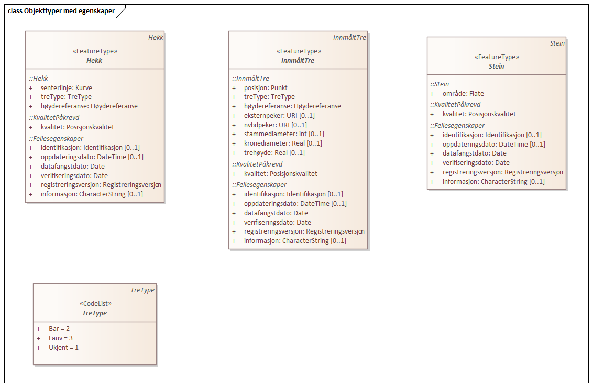
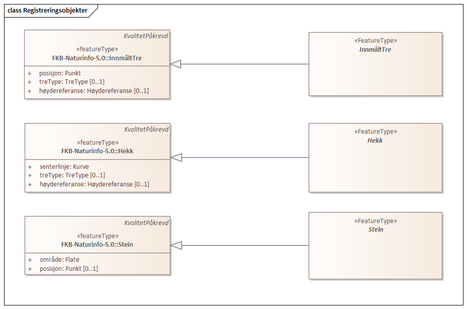

=== UML-modell

Dokumentasjon av UML-modell for Fotogrammetrisk registreringsinstruks for FKB-Naturinfo
(notes-feltet fra UML-pakka skrives ut)

[fig-objekttyper]
.UML-diagram: Objekttyper med egenskaper

[fig-Registreringsobjekter]
.UML-diagram: Registreringsobjekter

 
=== «FeatureType» Hekk
Definisjon: plantede busker som utgjør en hekk

==== Regler for registrering

(tilleggsinformasjon fra notes på abstrakt objekttype skkrives ut her)

[cols="20,80"]
|===
|FKB_A
|P
 
|FKB_B
|P
 
|FKB_C
|-
 
|FKB_D
|-
 
|FKB_minstestørrelse_A
|Alle synlige hekker lengre enn 3m registreres
 
|FKB_minstestørrelse_B
|Alle synlige hekker lengre enn 3m registreres
 
|===
"P" => Påkrevd registrering, "O" => Opsjonell registrering, "-" => Registreres ikke
 
===== Egenskapstabell
[cols="15,15,15,15"]
|===
|*Navn:* 
|*Type:* 
|*SOSI_navn:* 
|*Multiplisistet:* 
 
|senterlinje
|Kurve
|.Kurve
|[1..1]
 
|treType
|TreType
|..TRE_TYP
|[0..1]
 
|høydereferanse
|Høydereferanse
|..HREF
|[0..1]
 
|kvalitet
|Posisjonskvalitet
|..KVALITET
|[1..1]
 
|identifikasjon
|Identifikasjon
|..IDENT
|[0..1]
 
|oppdateringsdato
|DateTime
|..OPPDATERINGSDATO
|[0..1]
 
|datafangstdato
|Date
|..DATAFANGSTDATO
|[1..1]
 
|verifiseringsdato
|Date
|..VERIFISERINGSDATO
|[1..1]
 
|registreringsversjon
|Registreringsversjon
|..REGISTRERINGSVERSJON
|[1..1]
 
|informasjon
|CharacterString
|..INFORMASJON
|[0..1]

|===

==== Figurer og skisser

[fig-objtype_hekk] 
.Figur for objekttype Hekk
image::http://skjema.geonorge.no/SOSITEST/produktspesifikasjon/FKB-Naturinfo/5.0/figurer/objtype_hekk.png[]

=== «FeatureType» InnmåltTre
Definisjon: markerte enkeltrær
 
 
==== Regler for registrering
Ved fotogrammetrisk datafangst er det vanskelig &#229; vurdere hvilke tr&#230;r som skal registreres. Det forutsettes derfor at det utarbeides manus/instruks med n&#230;rmere angivelse av hvilke tr&#230;r som skal registreres, for eksempel langs utvalgte veger.

[cols="20,80"]
|===
|FKB_A
|O
 
|FKB_B
|O
 
|FKB_C
|-
 
|FKB_D
|-
 
|===
"P" => Påkrevd registrering, "O" => Opsjonell registrering, "-" => Registreres ikke
 
==== Egenskapstabell
[cols="15,15,15,15"]
|===
|*Navn:* 
|*Type:* 
|*SOSI_navn:* 
|*Multiplisitet:* 
 
|posisjon
|Punkt
|.Punkt
|[1..1]
 
|treType
|TreType
|..TRE_TYP
|[0..1]
 
|høydereferanse
|Høydereferanse
|..HREF
|[0..1]
 
|kvalitet
|Posisjonskvalitet
|..KVALITET
|[1..1]
 
|identifikasjon
|Identifikasjon
|..IDENT
|[0..1]
 
|oppdateringsdato
|DateTime
|..OPPDATERINGSDATO
|[0..1]
 
|datafangstdato
|Date
|..DATAFANGSTDATO
|[1..1]
 
|verifiseringsdato
|Date
|..VERIFISERINGSDATO
|[0..1]
 
|registreringsversjon
|Registreringsversjon
|..REGISTRERINGSVERSJON
|[1..1]
 
|informasjon
|CharacterString
|..INFORMASJON
|[0..1]

|===

==== Figurer og skisser

[fig-objtype_innmalttre] 
.Figur for objekttype InnmåltTre
image::http://skjema.geonorge.no/SOSITEST/produktspesifikasjon/FKB-Naturinfo/5.0/figurer/objtype_innmalttre.png[]
 
=== «FeatureType» Stein
Definisjon fra produktspesifikasjon: markert stein
 
==== Reger for registrering

Ved fotogrammetrisk registrering anbefales det at oppdragsgiver og oppdragstaker f&#248;r prosjektstart, blir enige om hvor store steiner som skal tas med. Eventuelt i hvilke deler av prosjektet det skal registreres steiner.

[cols="20,80"]
|===
|FKB_A
|P
 
|FKB_B
|P
 
|FKB_C
|-
 
|FKB_D
|-
 
|FKB_minstestørrelse_A
|Steiner større enn 10m3 registreres
 
|FKB_minstestørrelse_B
|Steiner større enn 10m3 registreres
 
|===
"P" => Påkrevd registrering, "O" => Opsjonell registrering, "-" => Registreres ikke
 
==== Egenskapstabell
[cols="15,15,15,15"]
|===
|*Navn:* 
|*Type:* 
|*SOSI_navn:* 
|*Multiplisitet:* 
 
|område
|Flate
|.Flate
|[1..1]
 
|posisjon
|Punkt
|.PUNKT
|[0..1]
 
|kvalitet
|Posisjonskvalitet
|..KVALITET
|[1..1]
 
|identifikasjon
|Identifikasjon
|..IDENT
|[0..1]
 
|oppdateringsdato
|DateTime
|..OPPDATERINGSDATO
|[0..1]
 
|datafangstdato
|Date
|..DATAFANGSTDATO
|[1..1]
 
|verifiseringsdato
|Date
|..VERIFISERINGSDATO
|[0..1]
 
|registreringsversjon
|Registreringsversjon
|..REGISTRERINGSVERSJON
|[1..1]
 
|informasjon
|CharacterString
|..INFORMASJON
|[0..1]

|===

==== Figurer og skisser
[fig-registrering_storstein] 
.Eksempel på registrering av stor stein
image::http://skjema.geonorge.no/SOSITEST/registreringsinstruks/FKB-Naturinfo/5.0/figurer/registrering_storstein.png[http://skjema.geonorge.no/SOSITEST/registreringsinstruks/FKB-Naturinfo/5.0/figurer/registrering_storstein.png]

