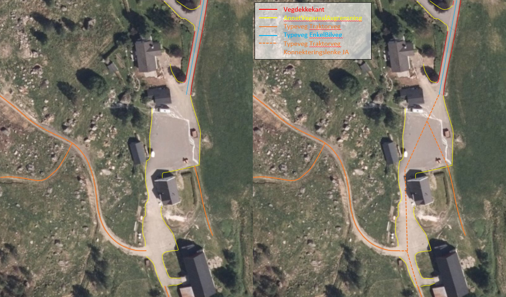
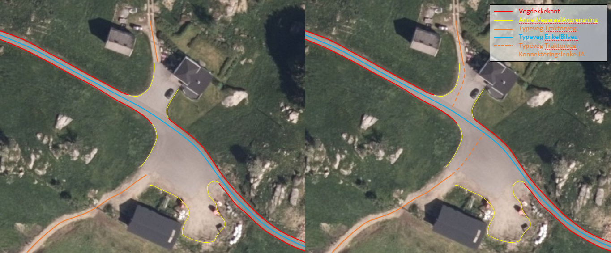
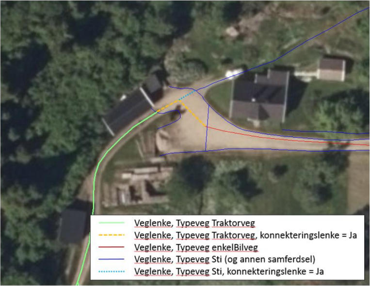

=== Prinsipp for registrering av _konnekteringslenke_

Benyttes for å knytte sammen veglenkene over åpne plasser, f.eks. ulike typer tun og parkeringsplasser. I FKB-TraktorvegSti benyttes normalt ikke konnekteringslenke på korte lenker i forbindelse med kryss etc. (jf. FKB-Elveg 2.0), men egenskapen kan benyttes for å hekte traktorveg eller sti inn på vegnettet i Elveg 2.0 der traktorvegen eller stien ender i/langs veg.
Egenskapens standardverdi er NEI (dvs. at egenskapen bare er nødvendig å angi dersom veglenka er konnekteringslenke).
Konnekteringslenker skal registreres og ajourføres fotogrammetrisk.

Betingelse: Egenskapen skal angis for veglenker som er konnekteringslenker

.Eksempel på bruk av konnekteringslenke over gardstun i FKB-TraktorvegSti. Konnekteringslenker skal registreres fotogrammetrisk.

.Eksempel på bruk av konnekteringslenke over gardstun i FKB-TraktorvegSti. Konnekteringslenker skal registreres fotogrammetrisk.

.Eksempel på bruk av konnekteringslenke over tun i FKB-TraktorvegSti. Konnekteringslenker skal registreres fotogrammetrisk.

