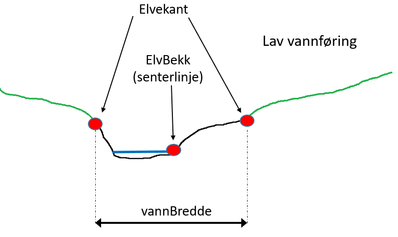
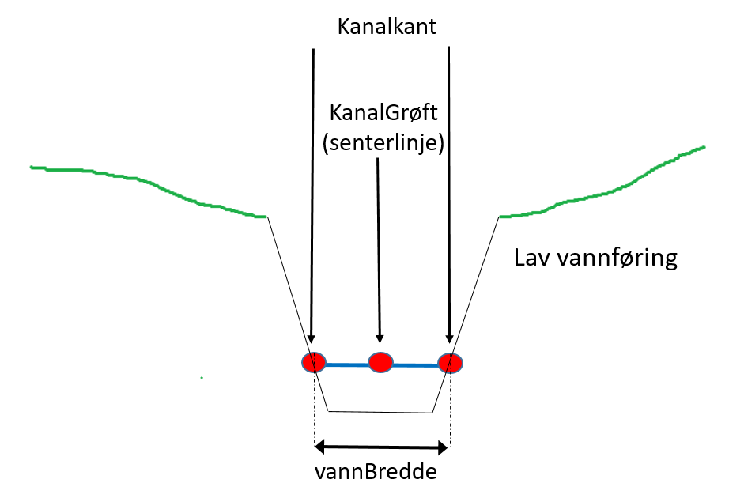
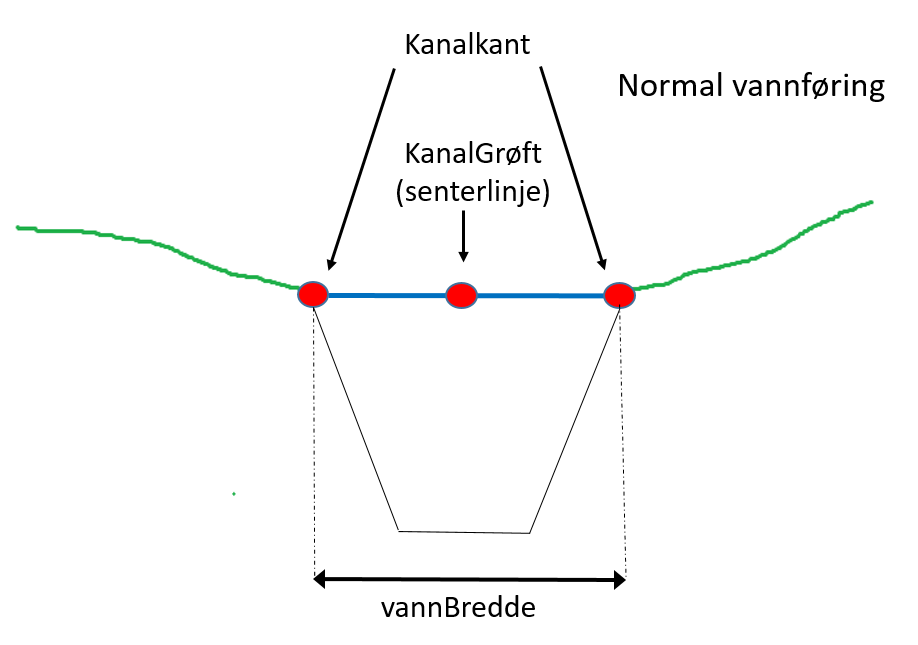

 
<<<
'''
 
[[kystkontur]]
==== «FeatureType» Kystkontur
*Definisjon fra FKB produktspesifikasjon*: grense mellom land og sj&#248;, definert som midlere h&#248;yvannslinje.
 
 
.Illustrasjon fra produktspesifikasjon av Kystkontur
image::http://skjema.geonorge.no/SOSI/produktspesifikasjon/FKB-Vann/5.0/figurer/objtype_kystkontur.png[link=http://skjema.geonorge.no/SOSI/produktspesifikasjon/FKB-Vann/5.0/figurer/objtype_kystkontur.png, Alt="Illustrasjon fra produktspesifikasjon: Kystkontur"]
 
 
===== Tilleggsinformasjon for fotogrammetrisk registrering
Kystkonturen skal v&#230;re registrert fullstendig og sammenhengende.
Eventuelle synlige tekniske anlegg som ligger under MHV skal registreres. 
Skille mellom Kystkontur og Elv markeres med VannFiktivGrense og egenskap vannSperretype lik havElvSperre.

Det skal v&#230;re konstant h&#248;yde p&#229; kystkonturen.
I et kartleggingsprosjekt skal oppdragsgiver fremskaffe riktige h&#248;ydeverdier for kystkontur. 

Kystkontur skal v&#230;re med p&#229; &#229; avgrense Havflate.

Merknader:
Kystkonturen kan v&#230;re gjennomg&#229;ende under sm&#229; brygger og lignende som st&#229;r p&#229; p&#230;ler og som stikker mindre enn 5 meter ut fra land.

Kystkonturen skal f&#248;lge alle tekniske anlegg (kai/brygger ol.) som stikker mer enn 5 meter ut fra land, uavhengig om det er vann under eller ikke. Se beskrivelse for objekttype KystkonturTekniskeAnlegg.

MEDIUM U benyttes p&#229; kystkontur som g&#229;r under terreng, for eksempel i kulvert. Skal ikke benyttes ved bruer. 

Kystkonturen skal v&#230;re koblet mot andre situasjonsdetaljer (kai, mur, osv.) ved at kystkonturen konnekteres i 2 dimensjoner til objektet. Kystkonturen skal ha samme grunnrisskoordinater som objektet, men med riktig vannh&#248;yde. Det skal bearbeides nodepunkt til andre vanntema. Nodepunktene dannes i 3D der dette er naturlig. 
 
 
'''
.Registrering av kystkontur ved brygge.
image::figurer/kystkontur_ved_brygge.png[link=figurer/kystkontur_ved_brygge.png, Alt="Registrering av kystkontur ved brygge."]
 
 
'''
.Registrering av kystkontur ved kai.
image::figurer/kystkontur_ved_kystkonturtekniskeanlegg.png[link=figurer/kystkontur_ved_kystkonturtekniskeanlegg.png, Alt="Registrering av kystkontur ved kai."]
 
 
 
===== Føringer
[cols="25,75"]
|===
|FKB grunnrissreferanse
|Terreng/vannkant i riktig høyde, se høydereferanse
 
|FKB høydereferanse
|Midlere høyvann (MHV)
 
|FKB-A minstestørrelse
|Øyer større enn 10m2 registreres som kystkontur
 
|FKB-B minstestørrelse
|Øyer større enn 10m2 registreres som kystkontur
 
|FKB-C minstestørrelse
|Øyer større enn 10m2 registreres som kystkontur
 
|FKB-D minstestørrelse
|Øyer større enn 10m2 registreres som kystkontur
 
|FKB registreringsmetode
|Kontinuerlig registrering
 
|FKB-A
|Påkrevd registrering
 
|FKB-B
|Påkrevd registrering
 
|FKB-C
|Påkrevd registrering
 
|FKB-D
|Påkrevd registrering
 
|===
 
 
<<<
 
===== Egenskapstabell for objekttype: Kystkontur
[cols="20,20,20,10"]
|===
|*Navn:* 
|*Type:* 
|*SOSI_navn:* 
|*Mult.:* 
 
|identifikasjon
|«dataType» Identifikasjon
|..IDENT
|[0..1]
 
|identifikasjon.lokalId
|CharacterString
|...LOKALID
|[1..1]
 
|identifikasjon.navnerom
|CharacterString
|...NAVNEROM
|[1..1]
 
|identifikasjon.versjonId
|CharacterString
|...VERSJONID
|[0..1]
 
|oppdateringsdato
|DateTime
|..OPPDATERINGSDATO
|[0..1]
 
|datafangstdato
|Date
|..DATAFANGSTDATO
|[1..1]
 
|verifiseringsdato
|Date
|..VERIFISERINGSDATO
|[0..1]
 
|registreringsversjon
|«CodeList» Registreringsversjon
|..REGISTRERINGSVERSJON
|[0..1]
 
|informasjon
|CharacterString
|..INFORMASJON
|[0..1]
 
|kvalitet
|«dataType» Posisjonskvalitet
|..KVALITET
|[1..1]
 
|kvalitet.datafangstmetode
|«CodeList» Datafangstmetode
|...DATAFANGSTMETODE
|[1..1]
 
|kvalitet.nøyaktighet
|Integer
|...NØYAKTIGHET
|[0..1]
 
|kvalitet.synbarhet
|«CodeList» Synbarhet
|...SYNBARHET
|[0..1]
 
|kvalitet.datafangstmetodeHøyde
|«CodeList» Datafangstmetode
|...DATAFANGSTMETODEHØYDE
|[0..1]
 
|kvalitet.nøyaktighetHøyde
|Integer
|...H-NØYAKTIGHET
|[0..1]
 
|grense
|Kurve
|.KURVE
|[1..1]
 
|kystreferanse
|«CodeList» Kystreferanse
|..KYSTREF
|[0..1]
 
|høyde
|Real
|..HØYDE
|[0..1]
 
|medium
|«CodeList» Medium
|..MEDIUM
|[1..1]
 
|===
 
<<<
'''
 
[[kystkonturtekniskeanlegg]]
==== «FeatureType» KystkonturTekniskeAnlegg
*Definisjon fra FKB produktspesifikasjon*: angivelse av kystkontur der denne består av tekniske anlegg, definert som  midlere høyvann
 
 
.Illustrasjon fra produktspesifikasjon av KystkonturTekniskeAnlegg
image::http://skjema.geonorge.no/SOSI/produktspesifikasjon/FKB-Vann/5.0/figurer/objtype_kystkonturtekniskeanlegg.png[link=http://skjema.geonorge.no/SOSI/produktspesifikasjon/FKB-Vann/5.0/figurer/objtype_kystkonturtekniskeanlegg.png, Alt="Illustrasjon fra produktspesifikasjon: KystkonturTekniskeAnlegg"]
 
 
===== Tilleggsinformasjon for fotogrammetrisk registrering
Benyttes der kystkonturen f&#248;lger tekniske anlegg som for eksempel kaier.

Det skal v&#230;re konstant h&#248;yde p&#229; kystkonturen.

KystkonturTekniskeAnlegg skal v&#230;re med p&#229; &#229; avgrense Havflate.

Merknader:
Det skal bearbeides nodepunkt inntil Kystkontur. Nodepunktene dannes i 3D der dette er naturlig.
KystkonturTekniskeAnlegg skal om mulig konnekteres til det tekniske anlegget i 2 dimensjoner. KystkonturTekniskeAnlegg skal (vanligvis) ha samme grunnrisskoordinater som objektet, men med riktig vannh&#248;yde. 

MEDIUM U benyttes p&#229; kystkontur som g&#229;r under terreng, for eksempel i kulvert. Skal ikke benyttes ved bruer. 
 
 
===== Føringer
[cols="25,75"]
|===
|FKB grunnrissreferanse
|Terreng/vannkant i riktig høyde, se høydereferanse
 
|FKB høydereferanse
|Midlere høyvann (MHV)
 
|FKB registreringsmetode
|Enkeltpunkt i sekvens
 
|FKB-A
|Påkrevd registrering
 
|FKB-B
|Påkrevd registrering
 
|FKB-C
|Påkrevd registrering
 
|FKB-D
|Påkrevd registrering
 
|===
 
 
<<<
 
===== Egenskapstabell for objekttype: KystkonturTekniskeAnlegg
[cols="20,20,20,10"]
|===
|*Navn:* 
|*Type:* 
|*SOSI_navn:* 
|*Mult.:* 
 
|identifikasjon
|«dataType» Identifikasjon
|..IDENT
|[0..1]
 
|identifikasjon.lokalId
|CharacterString
|...LOKALID
|[1..1]
 
|identifikasjon.navnerom
|CharacterString
|...NAVNEROM
|[1..1]
 
|identifikasjon.versjonId
|CharacterString
|...VERSJONID
|[0..1]
 
|oppdateringsdato
|DateTime
|..OPPDATERINGSDATO
|[0..1]
 
|datafangstdato
|Date
|..DATAFANGSTDATO
|[1..1]
 
|verifiseringsdato
|Date
|..VERIFISERINGSDATO
|[0..1]
 
|registreringsversjon
|«CodeList» Registreringsversjon
|..REGISTRERINGSVERSJON
|[0..1]
 
|informasjon
|CharacterString
|..INFORMASJON
|[0..1]
 
|kvalitet
|«dataType» Posisjonskvalitet
|..KVALITET
|[1..1]
 
|kvalitet.datafangstmetode
|«CodeList» Datafangstmetode
|...DATAFANGSTMETODE
|[1..1]
 
|kvalitet.nøyaktighet
|Integer
|...NØYAKTIGHET
|[0..1]
 
|kvalitet.synbarhet
|«CodeList» Synbarhet
|...SYNBARHET
|[0..1]
 
|kvalitet.datafangstmetodeHøyde
|«CodeList» Datafangstmetode
|...DATAFANGSTMETODEHØYDE
|[0..1]
 
|kvalitet.nøyaktighetHøyde
|Integer
|...H-NØYAKTIGHET
|[0..1]
 
|grense
|Kurve
|.KURVE
|[1..1]
 
|kystkonstruksjonstype
|«CodeList» Kystkonstruksjonstype
|..KYSTKONSTRUKSJONSTYPE
|[1..1]
 
|kystreferanse
|«CodeList» Kystreferanse
|..KYSTREF
|[0..1]
 
|høyde
|Real
|..HØYDE
|[0..1]
 
|medium
|«CodeList» Medium
|..MEDIUM
|[1..1]
 
|===
 
<<<
'''
 
[[skjær]]
==== «FeatureType» Skjær
*Definisjon fra FKB produktspesifikasjon*: generalisert punktobjekt for sm&#229; &#248;yer eller landareal
 
 
.Illustrasjon fra produktspesifikasjon av Skjær
image::http://skjema.geonorge.no/SOSI/produktspesifikasjon/FKB-Vann/5.0/figurer/objtype_skjer.png[link=http://skjema.geonorge.no/SOSI/produktspesifikasjon/FKB-Vann/5.0/figurer/objtype_skjer.png, Alt="Illustrasjon fra produktspesifikasjon: Skjær"]
 
 
===== Tilleggsinformasjon for fotogrammetrisk registrering
Skal benyttes p&#229; sm&#229; &#248;yer som ikke registreres som kystkontur.

Alle skj&#230;r som er synlig i flybilder skal registreres - ogs&#229; de som ligger under MHV.
 
 
===== Føringer
[cols="25,75"]
|===
|FKB grunnrissreferanse
|Senter av skjæret
 
|FKB høydereferanse
|Topp skjær
 
|FKB-A minstestørrelse
|Øyer mindre enn 10m2 registreres som skjær
 
|FKB-B minstestørrelse
|Øyer mindre enn 10m2 registreres som skjær
 
|FKB-C minstestørrelse
|Øyer mindre enn 10m2 registreres som skjær
 
|FKB-D minstestørrelse
|Øyer mindre enn 10m2 registreres som skjær
 
|FKB registreringsmetode
|Enkeltpunkt
 
|FKB-A
|Påkrevd registrering
 
|FKB-B
|Påkrevd registrering
 
|FKB-C
|Påkrevd registrering
 
|FKB-D
|Påkrevd registrering
 
|===
 
 
<<<
 
===== Egenskapstabell for objekttype: Skjær
[cols="20,20,20,10"]
|===
|*Navn:* 
|*Type:* 
|*SOSI_navn:* 
|*Mult.:* 
 
|identifikasjon
|«dataType» Identifikasjon
|..IDENT
|[0..1]
 
|identifikasjon.lokalId
|CharacterString
|...LOKALID
|[1..1]
 
|identifikasjon.navnerom
|CharacterString
|...NAVNEROM
|[1..1]
 
|identifikasjon.versjonId
|CharacterString
|...VERSJONID
|[0..1]
 
|oppdateringsdato
|DateTime
|..OPPDATERINGSDATO
|[0..1]
 
|datafangstdato
|Date
|..DATAFANGSTDATO
|[1..1]
 
|verifiseringsdato
|Date
|..VERIFISERINGSDATO
|[0..1]
 
|registreringsversjon
|«CodeList» Registreringsversjon
|..REGISTRERINGSVERSJON
|[0..1]
 
|informasjon
|CharacterString
|..INFORMASJON
|[0..1]
 
|kvalitet
|«dataType» Posisjonskvalitet
|..KVALITET
|[1..1]
 
|kvalitet.datafangstmetode
|«CodeList» Datafangstmetode
|...DATAFANGSTMETODE
|[1..1]
 
|kvalitet.nøyaktighet
|Integer
|...NØYAKTIGHET
|[0..1]
 
|kvalitet.synbarhet
|«CodeList» Synbarhet
|...SYNBARHET
|[0..1]
 
|kvalitet.datafangstmetodeHøyde
|«CodeList» Datafangstmetode
|...DATAFANGSTMETODEHØYDE
|[0..1]
 
|kvalitet.nøyaktighetHøyde
|Integer
|...H-NØYAKTIGHET
|[0..1]
 
|posisjon
|Punkt
|.PUNKT
|[1..1]
 
|høyde
|Real
|..HØYDE
|[0..1]
 
|===
 
<<<
'''
 
[[havflate]]
==== «FeatureType» Havflate
*Definisjon fra FKB produktspesifikasjon*: havomr&#229;de som avgrenses av Kystkontur, VannFiktivGrense og KystkonturTekniskAnlegg
 
 
.Illustrasjon fra produktspesifikasjon av Havflate
image::http://skjema.geonorge.no/SOSI/produktspesifikasjon/FKB-Vann/5.0/figurer/objtype_havflate.png[link=http://skjema.geonorge.no/SOSI/produktspesifikasjon/FKB-Vann/5.0/figurer/objtype_havflate.png, Alt="Illustrasjon fra produktspesifikasjon: Havflate"]
 
 
===== Tilleggsinformasjon for fotogrammetrisk registrering
Havflate kan avgrenses av Kystkontur, KystkonturTekniskeAnlegg, VannFiktivGrense med egenskap vannSperretype lik  havElvSperre,   VannFiktivGrense med egenskap vannSperretype lik havlinjeFiktiv og Dataavgrensning.

Merknad: For avgrensning av Havflate ut mot ikke kartlagt omr&#229;de benyttes den generelle objekttypen Dataavgrensning.

MEDIUM U benyttes p&#229; havflater som ligger under terreng, for eksempel i kulvert. Skal ikke benyttes ved bruer. 
 
 
===== Føringer
[cols="25,75"]
|===
|FKB registreringsmetode
|Enkeltpunkt
 
|FKB-A
|Påkrevd registrering
 
|FKB-B
|Påkrevd registrering
 
|FKB-C
|Påkrevd registrering
 
|FKB-D
|Påkrevd registrering
 
|===
 
 
<<<
 
===== Egenskapstabell for objekttype: Havflate
[cols="20,20,20,10"]
|===
|*Navn:* 
|*Type:* 
|*SOSI_navn:* 
|*Mult.:* 
 
|identifikasjon
|«dataType» Identifikasjon
|..IDENT
|[0..1]
 
|identifikasjon.lokalId
|CharacterString
|...LOKALID
|[1..1]
 
|identifikasjon.navnerom
|CharacterString
|...NAVNEROM
|[1..1]
 
|identifikasjon.versjonId
|CharacterString
|...VERSJONID
|[0..1]
 
|oppdateringsdato
|DateTime
|..OPPDATERINGSDATO
|[0..1]
 
|datafangstdato
|Date
|..DATAFANGSTDATO
|[1..1]
 
|verifiseringsdato
|Date
|..VERIFISERINGSDATO
|[0..1]
 
|registreringsversjon
|«CodeList» Registreringsversjon
|..REGISTRERINGSVERSJON
|[0..1]
 
|informasjon
|CharacterString
|..INFORMASJON
|[0..1]
 
|område
|Flate
|.FLATE
|[1..1]
 
|posisjon
|Punkt
|.PUNKT
|[0..1]
 
|medium
|«CodeList» Medium
|..MEDIUM
|[1..1]
 
|===
 
<<<
'''
 
[[elvekant]]
==== «FeatureType» Elvekant
*Definisjon fra FKB produktspesifikasjon*: konturlinje mellom land og elveflate
 
 
.Illustrasjon fra produktspesifikasjon av Elvekant
image::http://skjema.geonorge.no/SOSI/produktspesifikasjon/FKB-Vann/5.0/figurer/objtype_elvekant.png[link=http://skjema.geonorge.no/SOSI/produktspesifikasjon/FKB-Vann/5.0/figurer/objtype_elvekant.png, Alt="Illustrasjon fra produktspesifikasjon: Elvekant"]
 
 
===== Tilleggsinformasjon for fotogrammetrisk registrering
Ved fotogrammetrisk datafangst er registrering av Elvekant en opsjon. Fotovannstanden vil v&#230;re avgj&#248;rende for om registrering av Elvekant skal utf&#248;res eller ikke. Dersom fotovannstand er unormalt h&#248;y (flom) vil det v&#230;re vanskelig &#229; f&#229; en korrekt registrering av Elvekant og det m&#229; vurderes om eksisterende data gir en riktigere beskrivelse.

Der Elvekant renner ut i sj&#248;, innsj&#248; eller regulert innsj&#248; skal h&#248;yden i Elvekant ikke noe sted v&#230;re lavere enn h&#248;yden til nodepunktet som er felles. 

Ved fotogrammetrisk datafangst kan det v&#230;re vanskelig &#229; se ned til vannspeilet i enkelte tilfeller. Elvekant skal likevel konstrueres fullstendig og sammenhengende og kvalitetskodes deretter. I tilfeller med manglende innsyn er det tillatt &#229; generere Elvekant, dette skal i s&#229; fall tydelig fremkomme av kvalitetskodingen. Elveleier som tidvis er t&#248;rre, men godt synlig i flybildene og i terrenget skal konstrueres.

Elvekant skal v&#230;re med p&#229; &#229; avgrense Elv.

Merknader:
Elvekant skal ha samme geometri i grunnriss som situasjonsdetaljer som den f&#248;lger (massive kaier, murer, osv.). Vannkanten konnekteres i to dimensjoner til objektet. Det skal lages Elvekant rundt objektet med samme grunnrisskoordinater som objektet, men med riktig vannh&#248;yde.

N&#229;r elvekanten g&#229;r under kai/brygge, f.eks. ved mindre trebrygger, skal elvekanten v&#230;re gjennomg&#229;ende. Elvekanten registreres uten hensyn til brygga over. Brygga og elvekanten er helt "uavhengige" objekter. For &#248;vrig skal det etableres nodepunkt mellom Elvekant og andre tilst&#248;tende vannobjekter. Der det er naturlig skal nodepunktene v&#230;re i 3D.

MEDIUM U benyttes p&#229; Elvekant som ligger under terreng, for eksempel under veg. Skal ikke benyttes ved bruer.

 
 
'''
.Eksempel på registrering av Elvekant og Elv  flate) der elva delvis går under bakken.
image::figurer/elv_flate_med_medium_u.png[link=figurer/elv_flate_med_medium_u.png, Alt="Eksempel på registrering av Elvekant og Elv  flate) der elva delvis går under bakken."]
 
 
'''
.Elvekant. Lav vannføring. Kanten skal registreres der det er normal vannføring.

 
 
'''
.Elvekant. Normal vannføring.
image::figurer/elvekant_elvbekk_normal_vannsstand.png[link=figurer/elvekant_elvbekk_normal_vannsstand.png, Alt="Elvekant. Normal vannføring."]
 
 
'''
.I en del elver kan det være stor variasjon i hvor elvekanten går avhengig av liten eller stor vannstand. Det  presiseres at man skal prøve å registrere der hvor høy vannføring i elva normalt går og ikke vannspeilet. Bruk  KVALITET til å angi usikkerheten i registreringen. I bildet over er det tegnet inn med blå strek hvor man antar at  normal vannføring er.  
image::figurer/elvekant_registreres_der_hoy_vannstand_normalt_gaar.png[link=figurer/elvekant_registreres_der_hoy_vannstand_normalt_gaar.png, Alt="I en del elver kan det være stor variasjon i hvor elvekanten går avhengig av liten eller stor vannstand. Det  presiseres at man skal prøve å registrere der hvor høy vannføring i elva normalt går og ikke vannspeilet. Bruk  KVALITET til å angi usikkerheten i registreringen. I bildet over er det tegnet inn med blå strek hvor man antar at  normal vannføring er.  "]
 
 
 
===== Føringer
[cols="25,75"]
|===
|FKB grunnrissreferanse
|Der hvor høy vannføring i elva normalt går. Dette vil ofte være overgangen mellom vegetasjon og sand/grus/steiner.
 
|FKB høydereferanse
|Terrenghøyden ved grunnrissreferanse.
 
|FKB-A minstestørrelse
|Naturlig rennende vann bredere enn 1 meter (Vannbredde 2-5)
 
|FKB-B minstestørrelse
|Naturlig rennende vann bredere enn 1 meter (Vannbredde 2-5)
 
|FKB-C minstestørrelse
|Naturlig rennende vann bredere enn 3 meter (Vannbredde 3-5)
 
|FKB-D minstestørrelse
|Naturlig rennende vann bredere enn 15 meter (Vannbredde 4-5)
 
|FKB registreringsmetode
|Enkeltpunkt i sekvens der konturen går inntil kai o.l. og der den går i rette strekninger. Kontinuerlig registrering brukes der konturen ikke følger kai o.l.
 
|FKB-A
|O (se minstestørrelse for FKB-A)
 
|FKB-B
|O (se minstestørrelse for FKB-B)
 
|FKB-C
|O (se minstestørrelse for FKB-C)
 
|FKB-D
|O (se minstestørrelse for FKB-D)
 
|===
 
 
<<<
 
===== Egenskapstabell for objekttype: Elvekant
[cols="20,20,20,10"]
|===
|*Navn:* 
|*Type:* 
|*SOSI_navn:* 
|*Mult.:* 
 
|identifikasjon
|«dataType» Identifikasjon
|..IDENT
|[0..1]
 
|identifikasjon.lokalId
|CharacterString
|...LOKALID
|[1..1]
 
|identifikasjon.navnerom
|CharacterString
|...NAVNEROM
|[1..1]
 
|identifikasjon.versjonId
|CharacterString
|...VERSJONID
|[0..1]
 
|oppdateringsdato
|DateTime
|..OPPDATERINGSDATO
|[0..1]
 
|datafangstdato
|Date
|..DATAFANGSTDATO
|[1..1]
 
|verifiseringsdato
|Date
|..VERIFISERINGSDATO
|[0..1]
 
|registreringsversjon
|«CodeList» Registreringsversjon
|..REGISTRERINGSVERSJON
|[0..1]
 
|informasjon
|CharacterString
|..INFORMASJON
|[0..1]
 
|kvalitet
|«dataType» Posisjonskvalitet
|..KVALITET
|[1..1]
 
|kvalitet.datafangstmetode
|«CodeList» Datafangstmetode
|...DATAFANGSTMETODE
|[1..1]
 
|kvalitet.nøyaktighet
|Integer
|...NØYAKTIGHET
|[0..1]
 
|kvalitet.synbarhet
|«CodeList» Synbarhet
|...SYNBARHET
|[0..1]
 
|kvalitet.datafangstmetodeHøyde
|«CodeList» Datafangstmetode
|...DATAFANGSTMETODEHØYDE
|[0..1]
 
|kvalitet.nøyaktighetHøyde
|Integer
|...H-NØYAKTIGHET
|[0..1]
 
|grense
|Kurve
|.KURVE
|[1..1]
 
|medium
|«CodeList» Medium
|..MEDIUM
|[1..1]
 
|===
 
<<<
'''
 
[[elv]]
==== «FeatureType» Elv
*Definisjon fra FKB produktspesifikasjon*: st&#248;rre vannvei for rennende vann representert ved flate
 
 
.Illustrasjon fra produktspesifikasjon av Elv
image::http://skjema.geonorge.no/SOSI/produktspesifikasjon/FKB-Vann/5.0/figurer/objtype_elv.png[link=http://skjema.geonorge.no/SOSI/produktspesifikasjon/FKB-Vann/5.0/figurer/objtype_elv.png, Alt="Illustrasjon fra produktspesifikasjon: Elv"]
 
 
===== Tilleggsinformasjon for fotogrammetrisk registrering
For avgrensing av flate mot ikke kartlagt omr&#229;de eller mellom ulike standarder kan VannFiktivGrense med egenskap  vannSperretype lik elvelinjeFiktiv benyttes.

Elv skal avgrenses av Elvrekant og kan i tillegg avgrenses av VannFiktivGrense med egenskap vannSperretype lik elveElvperre, Innsj&#248;ElvSperre, havElvSperre eller elvelinjeFiktiv.

MEDIUM U benyttes p&#229; Elv som ligger under terreng, for eksempel under veg. Skal ikke benyttes ved bruer.
 
 
===== Føringer
[cols="25,75"]
|===
|FKB-A minstestørrelse
|Naturlig rennende vann med bredde over 1 meter (flate med vannBredde 2 - 5)
 
|FKB-B minstestørrelse
|Naturlig rennende vann med bredde over 1 meter (flate med vannBredde 2 - 5)
 
|FKB-C minstestørrelse
|Naturlig rennende vann med bredde over 3 meter (flate med vannBredde 3 - 5)
 
|FKB-D minstestørrelse
|Naturlig rennende vann med bredde over 15 meter (flate med vannBredde 4 - 5)
 
|FKB-A
|Påkrevd registrering
 
|FKB-B
|Påkrevd registrering
 
|FKB-C
|Påkrevd registrering
 
|FKB-D
|Påkrevd registrering
 
|===
 
 
<<<
 
===== Egenskapstabell for objekttype: Elv
[cols="20,20,20,10"]
|===
|*Navn:* 
|*Type:* 
|*SOSI_navn:* 
|*Mult.:* 
 
|identifikasjon
|«dataType» Identifikasjon
|..IDENT
|[0..1]
 
|identifikasjon.lokalId
|CharacterString
|...LOKALID
|[1..1]
 
|identifikasjon.navnerom
|CharacterString
|...NAVNEROM
|[1..1]
 
|identifikasjon.versjonId
|CharacterString
|...VERSJONID
|[0..1]
 
|oppdateringsdato
|DateTime
|..OPPDATERINGSDATO
|[0..1]
 
|datafangstdato
|Date
|..DATAFANGSTDATO
|[1..1]
 
|verifiseringsdato
|Date
|..VERIFISERINGSDATO
|[0..1]
 
|registreringsversjon
|«CodeList» Registreringsversjon
|..REGISTRERINGSVERSJON
|[0..1]
 
|informasjon
|CharacterString
|..INFORMASJON
|[0..1]
 
|posisjon
|Punkt
|.PUNKT
|[0..1]
 
|område
|Flate
|.FLATE
|[1..1]
 
|vannBredde
|«CodeList» VannBredde
|..VANNBR
|[1..1]
 
|medium
|«CodeList» Medium
|..MEDIUM
|[1..1]
 
|===
 
<<<
'''
 
[[kanalkant]]
==== «FeatureType» Kanalkant
*Definisjon fra FKB produktspesifikasjon*: avgrensningslinje av kanal, dvs vannspeilet. Med vannspeil menes der vannet normalt st&#229;r i kanalen
 
 
.Illustrasjon fra produktspesifikasjon av Kanalkant
image::http://skjema.geonorge.no/SOSI/produktspesifikasjon/FKB-Vann/5.0/figurer/objtype_kanalkant.png[link=http://skjema.geonorge.no/SOSI/produktspesifikasjon/FKB-Vann/5.0/figurer/objtype_kanalkant.png, Alt="Illustrasjon fra produktspesifikasjon: Kanalkant"]
 
 
===== Tilleggsinformasjon for fotogrammetrisk registrering
Kanalkanten skal registreres fullstendig og sammenhengende. For avgrensing av flate mot ikke kartlagt omr&#229;de eller mellom ulike standarder kan VannFiktivGrense med egenskap vannSperretype lik elvelinjeFiktiv benyttes.

Kanalkant er med p&#229; &#229; avgrense Kanal.

Det skal genereres nodepunkt mellom Kanalkant og andre vanntema. Nodepunktet skal v&#230;re i 3D der dette er naturlig.

MEDIUM U benyttes p&#229; Kanalkant som ligger under terreng, for eksempel under veg. Skal ikke benyttes ved bruer. 
 
 
'''
.KanalKant og KanalGrøft, lav vannføring.

 
 
'''
.Kanalkant og KanalGrøft, normal vannføring.

 
 
 
===== Føringer
[cols="25,75"]
|===
|FKB grunnrissreferanse
|Terreng/vannkant i riktig høyde, se høydereferanse
 
|FKB høydereferanse
|Terrenghøyden i vannspeilet eller der vannet ville ha stått hvis kanalen var tørr ved etablering.
 
|FKB-A minstestørrelse
|Kanal bredere enn 1 meter (vannBredde 2-5)
 
|FKB-B minstestørrelse
|Kanal bredere enn 1 meter (vannBredde 2-5)
 
|FKB-C minstestørrelse
|Kanal bredere enn 3 meter (vannBredde 3-5)
 
|FKB-D minstestørrelse
|Kanal bredere enn 15 meter (vannBredde 4-5)
 
|FKB registreringsmetode
|Enkeltpunkt i sekvens der konturen går inntil kai o.l. og der den går i rette strekninger. Kontinuerlig registrering brukes der konturen ikke følger kai o.l.
 
|FKB-A
|Påkrevd registrering
 
|FKB-B
|Påkrevd registrering
 
|FKB-C
|Påkrevd registrering
 
|FKB-D
|Påkrevd registrering
 
|===
 
 
<<<
 
===== Egenskapstabell for objekttype: Kanalkant
[cols="20,20,20,10"]
|===
|*Navn:* 
|*Type:* 
|*SOSI_navn:* 
|*Mult.:* 
 
|identifikasjon
|«dataType» Identifikasjon
|..IDENT
|[0..1]
 
|identifikasjon.lokalId
|CharacterString
|...LOKALID
|[1..1]
 
|identifikasjon.navnerom
|CharacterString
|...NAVNEROM
|[1..1]
 
|identifikasjon.versjonId
|CharacterString
|...VERSJONID
|[0..1]
 
|oppdateringsdato
|DateTime
|..OPPDATERINGSDATO
|[0..1]
 
|datafangstdato
|Date
|..DATAFANGSTDATO
|[1..1]
 
|verifiseringsdato
|Date
|..VERIFISERINGSDATO
|[0..1]
 
|registreringsversjon
|«CodeList» Registreringsversjon
|..REGISTRERINGSVERSJON
|[0..1]
 
|informasjon
|CharacterString
|..INFORMASJON
|[0..1]
 
|kvalitet
|«dataType» Posisjonskvalitet
|..KVALITET
|[1..1]
 
|kvalitet.datafangstmetode
|«CodeList» Datafangstmetode
|...DATAFANGSTMETODE
|[1..1]
 
|kvalitet.nøyaktighet
|Integer
|...NØYAKTIGHET
|[0..1]
 
|kvalitet.synbarhet
|«CodeList» Synbarhet
|...SYNBARHET
|[0..1]
 
|kvalitet.datafangstmetodeHøyde
|«CodeList» Datafangstmetode
|...DATAFANGSTMETODEHØYDE
|[0..1]
 
|kvalitet.nøyaktighetHøyde
|Integer
|...H-NØYAKTIGHET
|[0..1]
 
|grense
|Kurve
|.KURVE
|[1..1]
 
|medium
|«CodeList» Medium
|..MEDIUM
|[1..1]
 
|===
 
<<<
'''
 
[[kanal]]
==== «FeatureType» Kanal
*Definisjon fra FKB produktspesifikasjon*: rennende vann der forl&#248;pet er menneskeskapt
 
 
.Illustrasjon fra produktspesifikasjon av Kanal
image::http://skjema.geonorge.no/SOSI/produktspesifikasjon/FKB-Vann/5.0/figurer/objtype_kanal.png[link=http://skjema.geonorge.no/SOSI/produktspesifikasjon/FKB-Vann/5.0/figurer/objtype_kanal.png, Alt="Illustrasjon fra produktspesifikasjon: Kanal"]
 
 
===== Tilleggsinformasjon for fotogrammetrisk registrering
For avgrensing av flate mot ikke kartlagt omr&#229;de eller mellom ulike standarder kan VannFiktivGrense med egenskap  vannSperretype lik elvelinjeFiktiv benyttes.

Kanal kan avgrenses av Kanalkant,  VannFiktivGrense med egenskap  vannSperretype lik elveElvSperre, innsj&#248;ElvSperre, havElvSperre eller elvelinjeFiktiv.

MEDIUM U benyttes p&#229; Kanal som ligger under terreng, for eksempel under veg. Skal ikke benyttes ved bruer.
 
 
===== Føringer
[cols="25,75"]
|===
|FKB-A minstestørrelse
|Kanal bredere enn 1 meter (vannBredde 2-5)
 
|FKB-B minstestørrelse
|Kanal bredere enn 1 meter (vannBredde 2-5)
 
|FKB-C minstestørrelse
|Kanal bredere enn 3 meter (vannBredde 3-5)
 
|FKB-D minstestørrelse
|Kanal bredere enn 15 meter (vannBredde 4-5)
 
|FKB-A
|Påkrevd registrering
 
|FKB-B
|Påkrevd registrering
 
|FKB-C
|Påkrevd registrering
 
|FKB-D
|Påkrevd registrering
 
|===
 
 
<<<
 
===== Egenskapstabell for objekttype: Kanal
[cols="20,20,20,10"]
|===
|*Navn:* 
|*Type:* 
|*SOSI_navn:* 
|*Mult.:* 
 
|identifikasjon
|«dataType» Identifikasjon
|..IDENT
|[0..1]
 
|identifikasjon.lokalId
|CharacterString
|...LOKALID
|[1..1]
 
|identifikasjon.navnerom
|CharacterString
|...NAVNEROM
|[1..1]
 
|identifikasjon.versjonId
|CharacterString
|...VERSJONID
|[0..1]
 
|oppdateringsdato
|DateTime
|..OPPDATERINGSDATO
|[0..1]
 
|datafangstdato
|Date
|..DATAFANGSTDATO
|[1..1]
 
|verifiseringsdato
|Date
|..VERIFISERINGSDATO
|[0..1]
 
|registreringsversjon
|«CodeList» Registreringsversjon
|..REGISTRERINGSVERSJON
|[0..1]
 
|informasjon
|CharacterString
|..INFORMASJON
|[0..1]
 
|posisjon
|Punkt
|.PUNKT
|[0..1]
 
|område
|Flate
|.FLATE
|[1..1]
 
|medium
|«CodeList» Medium
|..MEDIUM
|[1..1]
 
|vannBredde
|«CodeList» VannBredde
|..VANNBR
|[1..1]
 
|===
 
<<<
'''
 
[[innsjøkant]]
==== «FeatureType» Innsjøkant
*Definisjon fra FKB produktspesifikasjon*: konturlinje mellom land og innsj&#248;

Merknad:
for innsj&#248; som er oppdemt/regulert skal konturlinjen ligge i h&#248;ydeniv&#229;et for h&#248;yeste regulerte vannstand
 
 
.Illustrasjon fra produktspesifikasjon av Innsjøkant
image::http://skjema.geonorge.no/SOSI/produktspesifikasjon/FKB-Vann/5.0/figurer/objtype_innsjokant.png[link=http://skjema.geonorge.no/SOSI/produktspesifikasjon/FKB-Vann/5.0/figurer/objtype_innsjokant.png, Alt="Illustrasjon fra produktspesifikasjon: Innsjøkant"]
 
 
===== Tilleggsinformasjon for fotogrammetrisk registrering
Hvis innsj&#248;en er regulert skal innsj&#248;kanten registreres i h&#248;ydeniv&#229; lik h&#248;yeste regulerte vannstand.
Ved fotogrammetrisk datafangst er registrering av Innsj&#248;kant en opsjon. Fotovannstanden vil v&#230;re avgj&#248;rende for om registrering av Innsj&#248;kant skal utf&#248;res eller ikke. Dersom fotovannstand er unormalt h&#248;y (flom) vil det v&#230;re vanskelig &#229; f&#229; en korrekt registrering av Innsj&#248;kant og det m&#229; vurderes om eksisterende data gir en riktigere beskrivelse.
Innsj&#248;kanten skal registreres fullstendig og sammenhengende. For avgrensing av flate mot ikke kartlagt omr&#229;de eller mellom ulike standarder kan  VannFiktivGrense med egenskap vannSperretype lik innsj&#248;linjeFiktiv benyttes.

Innsj&#248;kant er med p&#229; &#229; avgrense Innsj&#248;.

Merknader:
Den fysiske vannkanten skal registreres. Innsj&#248;kant skal ha samme geometri i grunnriss som situasjonsdetaljer som den f&#248;lger (massive kaier, murer, osv.). Det skal lages Innsj&#248;kant rundt objektet med samme grunnrisskoordinater som objektet, men med riktig vannh&#248;yde.

N&#229;r vannkanten g&#229;r under kai/brygge, f.eks. ved mindre trebrygger, skal vannkanten v&#230;re gjennomg&#229;ende. Innsj&#248;kanten registreres uten hensyn til brygga over. Brygga og innsj&#248;kanten er helt "uavhengige" objekter. Det skal etableres nodepunkt med andre tilst&#248;tende vannobjekter. Der det er naturlig skal det lages nodepunkt i 3D.

MEDIUM U benyttes p&#229; Innsj&#248;kant som ligger under terreng, for eksempel under veg. Skal ikke benyttes ved bruer. 
 
 
===== Føringer
[cols="25,75"]
|===
|FKB grunnrissreferanse
|Terreng/vannkant i riktig høyde, se høydereferanse.
 
|FKB høydereferanse
|Fotovannstand. Ved store avvik mellom fotovannstand og normal  vannstand skal referansen være normal vannstand. Innsjøkanten  skal ha konstant høyde for hele vannet. For regulerte innsjøer brukes høyeste regulerte vannstand.
 
|FKB-A minstestørrelse
|Innsjøer og øyer over 10m2
 
|FKB-B minstestørrelse
|Innsjøer og øyer over 20m2
 
|FKB-C minstestørrelse
|Innsjøer og øyer over 100m2
 
|FKB-D minstestørrelse
|Innsjøer og øyer over 100m2
 
|FKB registreringsmetode
|Enkeltpunkt i sekvens der konturen går inntil kai o.l. og der den går i rette strekninger. Kontinuerlig registrering brukes der konturen ikke følger kai o.l.
 
|FKB-A
|Opsjonell registrering
 
|FKB-B
|Opsjonell registrering
 
|FKB-C
|Opsjonell registrering
 
|FKB-D
|Opsjonell registrering
 
|===
 
 
<<<
 
===== Egenskapstabell for objekttype: Innsjøkant
[cols="20,20,20,10"]
|===
|*Navn:* 
|*Type:* 
|*SOSI_navn:* 
|*Mult.:* 
 
|identifikasjon
|«dataType» Identifikasjon
|..IDENT
|[0..1]
 
|identifikasjon.lokalId
|CharacterString
|...LOKALID
|[1..1]
 
|identifikasjon.navnerom
|CharacterString
|...NAVNEROM
|[1..1]
 
|identifikasjon.versjonId
|CharacterString
|...VERSJONID
|[0..1]
 
|oppdateringsdato
|DateTime
|..OPPDATERINGSDATO
|[0..1]
 
|datafangstdato
|Date
|..DATAFANGSTDATO
|[1..1]
 
|verifiseringsdato
|Date
|..VERIFISERINGSDATO
|[0..1]
 
|registreringsversjon
|«CodeList» Registreringsversjon
|..REGISTRERINGSVERSJON
|[0..1]
 
|informasjon
|CharacterString
|..INFORMASJON
|[0..1]
 
|kvalitet
|«dataType» Posisjonskvalitet
|..KVALITET
|[1..1]
 
|kvalitet.datafangstmetode
|«CodeList» Datafangstmetode
|...DATAFANGSTMETODE
|[1..1]
 
|kvalitet.nøyaktighet
|Integer
|...NØYAKTIGHET
|[0..1]
 
|kvalitet.synbarhet
|«CodeList» Synbarhet
|...SYNBARHET
|[0..1]
 
|kvalitet.datafangstmetodeHøyde
|«CodeList» Datafangstmetode
|...DATAFANGSTMETODEHØYDE
|[0..1]
 
|kvalitet.nøyaktighetHøyde
|Integer
|...H-NØYAKTIGHET
|[0..1]
 
|grense
|Kurve
|.KURVE
|[1..1]
 
|medium
|«CodeList» Medium
|..MEDIUM
|[1..1]
 
|høyde
|Real
|..HØYDE
|[0..1]
 
|===
 
<<<
'''
 
[[innsjø]]
==== «FeatureType» Innsjø
*Definisjon fra FKB produktspesifikasjon*: en ferskvannsflate som ikke er rennende vann
 
 
.Illustrasjon fra produktspesifikasjon av Innsjø
image::http://skjema.geonorge.no/SOSI/produktspesifikasjon/FKB-Vann/5.0/figurer/objtype_innsjo.png[link=http://skjema.geonorge.no/SOSI/produktspesifikasjon/FKB-Vann/5.0/figurer/objtype_innsjo.png, Alt="Illustrasjon fra produktspesifikasjon: Innsjø"]
 
 
===== Tilleggsinformasjon for fotogrammetrisk registrering
For avgrensing av flate mot ikke kartlagt omr&#229;de eller mellom ulike standarder kan VannFiktivGrense med egenskap vannSperretype lik innsj&#248;linjeFiktiv benyttes.

Egenskapen regulert skal ha verdi lik JA er hvis innsj&#248;en er regulert. Innsj&#248;kanter som avgrenser forekomster av Innsj&#248; med egenskap regulert lik JA skal registreres i h&#248;yde lik h&#248;yeste regulerte vannstand for innsj&#248;en.
Reguleringsstatus og opplysninger om h&#248;yeste regulerte vannstand kan hentes fra NVE sitt register (NVE Atlas). http://atlas.nve.no. Alternativt kan egenskapen eksternpeker brukes til &#229; peke inn i eksterne systemer som inneholder opplysninger om reguleringsstatus.

Innsj&#248; kan avgrenses av disse objekttypene: Innsj&#248;kant og VannFiktivGrense med egenskap  vannSperretype lik innsj&#248;ElvSperre eller innsj&#248;linjeFiktiv.

MEDIUM U benyttes p&#229; del av Innsj&#248; som ligger under terreng, for eksempel under veg. Skal ikke benyttes ved bruer. 
 
 
===== Føringer
[cols="25,75"]
|===
|FKB-A minstestørrelse
|Innsjøer og øyer over 10m2
 
|FKB-B minstestørrelse
|nnsjøer og øyer over 20m2
 
|FKB-C minstestørrelse
|Innsjøer og øyer over 100m2
 
|FKB-D minstestørrelse
|Innsjøer og øyer over 100m2
 
|FKB-A
|Påkrevd registrering
 
|FKB-B
|Påkrevd registrering
 
|FKB-C
|Påkrevd registrering
 
|FKB-D
|Påkrevd registrering
 
|===
 
 
<<<
 
===== Egenskapstabell for objekttype: Innsjø
[cols="20,20,20,10"]
|===
|*Navn:* 
|*Type:* 
|*SOSI_navn:* 
|*Mult.:* 
 
|identifikasjon
|«dataType» Identifikasjon
|..IDENT
|[0..1]
 
|identifikasjon.lokalId
|CharacterString
|...LOKALID
|[1..1]
 
|identifikasjon.navnerom
|CharacterString
|...NAVNEROM
|[1..1]
 
|identifikasjon.versjonId
|CharacterString
|...VERSJONID
|[0..1]
 
|oppdateringsdato
|DateTime
|..OPPDATERINGSDATO
|[0..1]
 
|datafangstdato
|Date
|..DATAFANGSTDATO
|[1..1]
 
|verifiseringsdato
|Date
|..VERIFISERINGSDATO
|[0..1]
 
|registreringsversjon
|«CodeList» Registreringsversjon
|..REGISTRERINGSVERSJON
|[0..1]
 
|informasjon
|CharacterString
|..INFORMASJON
|[0..1]
 
|område
|Flate
|.FLATE
|[1..1]
 
|posisjon
|Punkt
|.PUNKT
|[0..1]
 
|høyde
|Real
|..HØYDE
|[0..1]
 
|medium
|«CodeList» Medium
|..MEDIUM
|[1..1]
 
|regulert
|Boolean
|..REGULERT
|[1..1]
 
|eksternpeker
|URI
|..EKSTERNPEKER
|[0..1]
 
|===
 
<<<
'''
 
[[elvbekk]]
==== «FeatureType» ElvBekk
*Definisjon fra FKB produktspesifikasjon*: mindre vannvei for rennende vann representert ved senterlinje
 
 
.Illustrasjon fra produktspesifikasjon av ElvBekk
image::http://skjema.geonorge.no/SOSI/produktspesifikasjon/FKB-Vann/5.0/figurer/objtype_elvbekk.png[link=http://skjema.geonorge.no/SOSI/produktspesifikasjon/FKB-Vann/5.0/figurer/objtype_elvbekk.png, Alt="Illustrasjon fra produktspesifikasjon: ElvBekk"]
 
 
===== Tilleggsinformasjon for fotogrammetrisk registrering
Ved fotogrammetrisk datafangst kan det v&#230;re vanskelig &#229; se ned til vannspeilet i enkelte tilfeller. ElvBekk (midtlinje) skal likevel konstrueres s&#229; fullstendig og sammenhengende som mulig og kvalitetskodes deretter. Bekkeleier som tidvis er t&#248;rre, men godt synlig i flybildene og i terrenget skal konstrueres.

Merknad: Det skal etableres nodepunkt mellom ElvBekk (midtlinje) og andre tilst&#248;tende vannobjekter. Der det er naturlig skal det lages nodepunkt i 3D. 

MEDIUM U benyttes p&#229; ElvBekk som ligger under terreng, for eksempel under veg. Skal ikke benyttes ved bruer.
 
 
===== Føringer
[cols="25,75"]
|===
|FKB grunnrissreferanse
|Midten av elv/bekk
 
|FKB høydereferanse
|Vannspeilet ved normalvannstand
 
|FKB-A minstestørrelse
|Naturlig rennende vann med bredde opptil 1 meter registreres med midtlinje (vannBredde 1). Er vannbredden over 1 mter brukes Elvekant og Elv
 
|FKB-B minstestørrelse
|Naturlig rennende vann med bredde opptil 1 meter registreres med midtlinje (vannBredde 1). Er vannbredden over 1 mter brukes Elvekant og Elv
 
|FKB-C minstestørrelse
|Naturlig rennende vann med bredde opptil 3 meter registreres som midtlinje (vannbredde 1-2).  Er vannbredden over 3 mter brukes Elvekant og Elv
 
|FKB-D minstestørrelse
|Naturlig rennende vann med bredde opptil 15 meter registreres som midtlinje (vannbredde 1-3).  Er vannbredden over 15 mter brukes Elvekant og Elv
 
|FKB registreringsmetode
|Enkeltpunkt i sekvens for rette strekninger. Ellers benyttes  kontinuerlig registrering.
 
|FKB-A
|Påkrevd registrering
 
|FKB-B
|Påkrevd registrering
 
|FKB-C
|Påkrevd registrering
 
|FKB-D
|Påkrevd registrering
 
|===
 
 
<<<
 
===== Egenskapstabell for objekttype: ElvBekk
[cols="20,20,20,10"]
|===
|*Navn:* 
|*Type:* 
|*SOSI_navn:* 
|*Mult.:* 
 
|identifikasjon
|«dataType» Identifikasjon
|..IDENT
|[0..1]
 
|identifikasjon.lokalId
|CharacterString
|...LOKALID
|[1..1]
 
|identifikasjon.navnerom
|CharacterString
|...NAVNEROM
|[1..1]
 
|identifikasjon.versjonId
|CharacterString
|...VERSJONID
|[0..1]
 
|oppdateringsdato
|DateTime
|..OPPDATERINGSDATO
|[0..1]
 
|datafangstdato
|Date
|..DATAFANGSTDATO
|[1..1]
 
|verifiseringsdato
|Date
|..VERIFISERINGSDATO
|[0..1]
 
|registreringsversjon
|«CodeList» Registreringsversjon
|..REGISTRERINGSVERSJON
|[0..1]
 
|informasjon
|CharacterString
|..INFORMASJON
|[0..1]
 
|kvalitet
|«dataType» Posisjonskvalitet
|..KVALITET
|[1..1]
 
|kvalitet.datafangstmetode
|«CodeList» Datafangstmetode
|...DATAFANGSTMETODE
|[1..1]
 
|kvalitet.nøyaktighet
|Integer
|...NØYAKTIGHET
|[0..1]
 
|kvalitet.synbarhet
|«CodeList» Synbarhet
|...SYNBARHET
|[0..1]
 
|kvalitet.datafangstmetodeHøyde
|«CodeList» Datafangstmetode
|...DATAFANGSTMETODEHØYDE
|[0..1]
 
|kvalitet.nøyaktighetHøyde
|Integer
|...H-NØYAKTIGHET
|[0..1]
 
|senterlinje
|Kurve
|.KURVE
|[1..1]
 
|vannBredde
|«CodeList» VannBredde
|..VANNBREDDE
|[1..1]
 
|medium
|«CodeList» Medium
|..MEDIUM
|[1..1]
 
|===
 
<<<
'''
 
[[kanalgrøft]]
==== «FeatureType» KanalGrøft
*Definisjon fra FKB produktspesifikasjon*: rennende vann der forl&#248;pet er menneskeskapt
 
 
.Illustrasjon fra produktspesifikasjon av KanalGrøft
image::http://skjema.geonorge.no/SOSI/produktspesifikasjon/FKB-Vann/5.0/figurer/objtype_kanalgroft.png[link=http://skjema.geonorge.no/SOSI/produktspesifikasjon/FKB-Vann/5.0/figurer/objtype_kanalgroft.png, Alt="Illustrasjon fra produktspesifikasjon: KanalGrøft"]
 
 
===== Tilleggsinformasjon for fotogrammetrisk registrering
Ved fotogrammetrisk datafangst kan det v&#230;re vanskelig &#229; se ned til vannspeilet i enkelte tilfeller. KanalGr&#248;ft skal likevel konstrueres s&#229; fullstendig og sammenhengende som mulig og kvalitetskodes deretter. 

Merknad: Det skal etableres nodepunkt mellom KanalGr&#248;ft (midtlinje) og andre tilst&#248;tende vannobjekter. Der det er naturlig skal det lages nodepunkt i 3D. 

MEDIUM U benyttes p&#229; KanalGr&#248;ft som ligger under terreng, for eksempel under veg. Skal ikke benyttes ved bruer.
 
 
===== Føringer
[cols="25,75"]
|===
|FKB grunnrissreferanse
|Midten av kanal/grøft
 
|FKB høydereferanse
|Terrenghøyde i vannspeilet
 
|FKB-A minstestørrelse
|KanalGrøft smalere enn 1 meter (vannBredde 1). Er vannbredden større brukes Kanalkant og Kanal
 
|FKB-B minstestørrelse
|KanalGrøft smalere enn 1 meter (vannBredde 1). Er vannbredden større brukes Kanalkant og Kanal
 
|FKB-C minstestørrelse
|KanalGrøft smalere enn 3 meter (vannBredde 1 - 2). Er vannbredden større brukes Kanalkant og Kanal
 
|FKB minstestørrrelse D
|KanalGrøft smalere enn 15 meter (vannBredde 1 - 3). Er vannbredden større brukes Kanalkant og Kanal
 
|FKB registreringsmetode
|Enkeltpunkt i sekvens brukes der det er rette strekninger.  Ellers kontinuerlig registrering.
 
|FKB-A
|Påkrevd registrering
 
|FKB-B
|Påkrevd registrering
 
|FKB-C
|Påkrevd registrering
 
|FKB-D
|Påkrevd registrering
 
|===
 
 
<<<
 
===== Egenskapstabell for objekttype: KanalGrøft
[cols="20,20,20,10"]
|===
|*Navn:* 
|*Type:* 
|*SOSI_navn:* 
|*Mult.:* 
 
|identifikasjon
|«dataType» Identifikasjon
|..IDENT
|[0..1]
 
|identifikasjon.lokalId
|CharacterString
|...LOKALID
|[1..1]
 
|identifikasjon.navnerom
|CharacterString
|...NAVNEROM
|[1..1]
 
|identifikasjon.versjonId
|CharacterString
|...VERSJONID
|[0..1]
 
|oppdateringsdato
|DateTime
|..OPPDATERINGSDATO
|[0..1]
 
|datafangstdato
|Date
|..DATAFANGSTDATO
|[1..1]
 
|verifiseringsdato
|Date
|..VERIFISERINGSDATO
|[0..1]
 
|registreringsversjon
|«CodeList» Registreringsversjon
|..REGISTRERINGSVERSJON
|[0..1]
 
|informasjon
|CharacterString
|..INFORMASJON
|[0..1]
 
|kvalitet
|«dataType» Posisjonskvalitet
|..KVALITET
|[1..1]
 
|kvalitet.datafangstmetode
|«CodeList» Datafangstmetode
|...DATAFANGSTMETODE
|[1..1]
 
|kvalitet.nøyaktighet
|Integer
|...NØYAKTIGHET
|[0..1]
 
|kvalitet.synbarhet
|«CodeList» Synbarhet
|...SYNBARHET
|[0..1]
 
|kvalitet.datafangstmetodeHøyde
|«CodeList» Datafangstmetode
|...DATAFANGSTMETODEHØYDE
|[0..1]
 
|kvalitet.nøyaktighetHøyde
|Integer
|...H-NØYAKTIGHET
|[0..1]
 
|senterlinje
|Kurve
|.KURVE
|[1..1]
 
|vannBredde
|«CodeList» VannBredde
|..VANNBR
|[1..1]
 
|medium
|«CodeList» Medium
|..MEDIUM
|[1..1]
 
|===
 
<<<
'''
 
[[veggrøftåpen]]
==== «FeatureType» VeggrøftÅpen
*Definisjon fra FKB produktspesifikasjon*: &#229;pen drenering parallelt med veg
 
 
.Illustrasjon fra produktspesifikasjon av VeggrøftÅpen
image::http://skjema.geonorge.no/SOSI/produktspesifikasjon/FKB-Vann/5.0/figurer/objtype_veggroftapen.png[link=http://skjema.geonorge.no/SOSI/produktspesifikasjon/FKB-Vann/5.0/figurer/objtype_veggroftapen.png, Alt="Illustrasjon fra produktspesifikasjon: VeggrøftÅpen"]
 
 
===== Tilleggsinformasjon for fotogrammetrisk registrering
Benyttes kun for gr&#248;fter langs veg. For alle andre gr&#248;fter (for eks. langs traktorveg) benyttes KanalGr&#248;ft.
Kun den delen av gr&#248;fta som g&#229;r parallellt med veg registreres som Veggr&#248;ft&#197;pen.

 
 
===== Føringer
[cols="25,75"]
|===
|FKB grunnrissreferanse
|Midten av veggrøft
 
|FKB høydereferanse
|Bunn veggrøft
 
|FKB registreringsmetode
|Enkeltpunkt i sekvens
 
|FKB-A
|Påkrevd registrering
 
|FKB-B
|Påkrevd registrering
 
|FKB-C
|Registreres ikke
 
|FKB-D
|Registreres ikke
 
|===
 
 
<<<
 
===== Egenskapstabell for objekttype: VeggrøftÅpen
[cols="20,20,20,10"]
|===
|*Navn:* 
|*Type:* 
|*SOSI_navn:* 
|*Mult.:* 
 
|identifikasjon
|«dataType» Identifikasjon
|..IDENT
|[0..1]
 
|identifikasjon.lokalId
|CharacterString
|...LOKALID
|[1..1]
 
|identifikasjon.navnerom
|CharacterString
|...NAVNEROM
|[1..1]
 
|identifikasjon.versjonId
|CharacterString
|...VERSJONID
|[0..1]
 
|oppdateringsdato
|DateTime
|..OPPDATERINGSDATO
|[0..1]
 
|datafangstdato
|Date
|..DATAFANGSTDATO
|[1..1]
 
|verifiseringsdato
|Date
|..VERIFISERINGSDATO
|[0..1]
 
|registreringsversjon
|«CodeList» Registreringsversjon
|..REGISTRERINGSVERSJON
|[0..1]
 
|informasjon
|CharacterString
|..INFORMASJON
|[0..1]
 
|kvalitet
|«dataType» Posisjonskvalitet
|..KVALITET
|[1..1]
 
|kvalitet.datafangstmetode
|«CodeList» Datafangstmetode
|...DATAFANGSTMETODE
|[1..1]
 
|kvalitet.nøyaktighet
|Integer
|...NØYAKTIGHET
|[0..1]
 
|kvalitet.synbarhet
|«CodeList» Synbarhet
|...SYNBARHET
|[0..1]
 
|kvalitet.datafangstmetodeHøyde
|«CodeList» Datafangstmetode
|...DATAFANGSTMETODEHØYDE
|[0..1]
 
|kvalitet.nøyaktighetHøyde
|Integer
|...H-NØYAKTIGHET
|[0..1]
 
|senterlinje
|Kurve
|.KURVE
|[1..1]
 
|===
 
<<<
'''
 
[[snøisbrekant]]
==== «FeatureType» SnøIsbreKant
*Definisjon fra FKB produktspesifikasjon*: grense mellom snø eller isbre og barmark der det er usikkert om det er isbre eller snø
 
 
.Illustrasjon fra produktspesifikasjon av SnøIsbreKant
image::http://skjema.geonorge.no/SOSI/produktspesifikasjon/FKB-Vann/5.0/figurer/objtype_snoisbrekant.png[link=http://skjema.geonorge.no/SOSI/produktspesifikasjon/FKB-Vann/5.0/figurer/objtype_snoisbrekant.png, Alt="Illustrasjon fra produktspesifikasjon: SnøIsbreKant"]
 
 
===== Tilleggsinformasjon for fotogrammetrisk registrering
Sn&#248;/isbre som ikke smelter i l&#248;pet av sommeren. Ved etablering ved hjelp av fotogrammetri vil det v&#230;re vanskelig &#229; tolke hvilke sn&#248;flater/isbreer som vil smelte i l&#248;pet av sommeren og hvilke som vil "overleve" til neste vinter. De siste etableres slik de var p&#229; fotograferingstidspunktet. 
Dersom breen g&#229;r ned til vannkontur eller kystkontur, registreres Sn&#248;IsbreKant og vannkantene hver for seg med lik geometri.

Sn&#248;IsbreKant skal avgrense Sn&#248;Isbre.
 
 
===== Føringer
[cols="25,75"]
|===
|FKB grunnrissreferanse
|Terrenget på kanten av snøisbre, i overgangen mot bart terreng  (eventuelt mot vann)
 
|FKB høydereferanse
|Terrenget på kanten av snø/isbre, i overgangen mot bart terreng  (eventuelt mot vann)
 
|FKB registreringsmetode
|Kontinuerlig reegistrering
 
|FKB-A
|Påkrevd registrering
 
|FKB-B
|Påkrevd registrering
 
|FKB-C
|Påkrevd registrering
 
|FKB-D
|Påkrevd registrering
 
|===
 
 
<<<
 
===== Egenskapstabell for objekttype: SnøIsbreKant
[cols="20,20,20,10"]
|===
|*Navn:* 
|*Type:* 
|*SOSI_navn:* 
|*Mult.:* 
 
|identifikasjon
|«dataType» Identifikasjon
|..IDENT
|[0..1]
 
|identifikasjon.lokalId
|CharacterString
|...LOKALID
|[1..1]
 
|identifikasjon.navnerom
|CharacterString
|...NAVNEROM
|[1..1]
 
|identifikasjon.versjonId
|CharacterString
|...VERSJONID
|[0..1]
 
|oppdateringsdato
|DateTime
|..OPPDATERINGSDATO
|[0..1]
 
|datafangstdato
|Date
|..DATAFANGSTDATO
|[1..1]
 
|verifiseringsdato
|Date
|..VERIFISERINGSDATO
|[0..1]
 
|registreringsversjon
|«CodeList» Registreringsversjon
|..REGISTRERINGSVERSJON
|[0..1]
 
|informasjon
|CharacterString
|..INFORMASJON
|[0..1]
 
|kvalitet
|«dataType» Posisjonskvalitet
|..KVALITET
|[1..1]
 
|kvalitet.datafangstmetode
|«CodeList» Datafangstmetode
|...DATAFANGSTMETODE
|[1..1]
 
|kvalitet.nøyaktighet
|Integer
|...NØYAKTIGHET
|[0..1]
 
|kvalitet.synbarhet
|«CodeList» Synbarhet
|...SYNBARHET
|[0..1]
 
|kvalitet.datafangstmetodeHøyde
|«CodeList» Datafangstmetode
|...DATAFANGSTMETODEHØYDE
|[0..1]
 
|kvalitet.nøyaktighetHøyde
|Integer
|...H-NØYAKTIGHET
|[0..1]
 
|grense
|Kurve
|.KURVE
|[1..1]
 
|===
 
<<<
'''
 
[[snøisbre]]
==== «FeatureType» SnøIsbre
*Definisjon fra FKB produktspesifikasjon*: grense mellom snø eller isbre og barmark der det er usikkert om det er isbre eller snø
 
 
.Illustrasjon fra produktspesifikasjon av SnøIsbre
image::http://skjema.geonorge.no/SOSI/produktspesifikasjon/FKB-Vann/5.0/figurer/objtype_snoisbre.png[link=http://skjema.geonorge.no/SOSI/produktspesifikasjon/FKB-Vann/5.0/figurer/objtype_snoisbre.png, Alt="Illustrasjon fra produktspesifikasjon: SnøIsbre"]
 
 
===== Tilleggsinformasjon for fotogrammetrisk registrering
Sn&#248;/isbre som ikke smelter i l&#248;pet av sommeren. Ved etablering ved hjelp av fotogrammetri vil det v&#230;re vanskelig &#229; tolke hvilke sn&#248;flater/isbreer som vil smelte i l&#248;pet av sommeren og hvilke som vil "overleve" til neste vinter. De siste etableres slik de var p&#229; fotograferingstidspunktet.

Avgrenses av Sn&#248;IsbreKant
 
 
===== Føringer
[cols="25,75"]
|===
|FKB-A minstestørrelse
|1000m2
 
|FKB-B minstestørrelse
|1000m2
 
|FKB-C minstestørrelse
|1000m2
 
|FKB-D minstestørrelse
|1000m2
 
|FKB-A
|Påkrevd registrering
 
|FKB-B
|Påkrevd registrering
 
|FKB-C
|Påkrevd registrering
 
|FKB-D
|Påkrevd registrering
 
|===
 
 
<<<
 
===== Egenskapstabell for objekttype: SnøIsbre
[cols="20,20,20,10"]
|===
|*Navn:* 
|*Type:* 
|*SOSI_navn:* 
|*Mult.:* 
 
|identifikasjon
|«dataType» Identifikasjon
|..IDENT
|[0..1]
 
|identifikasjon.lokalId
|CharacterString
|...LOKALID
|[1..1]
 
|identifikasjon.navnerom
|CharacterString
|...NAVNEROM
|[1..1]
 
|identifikasjon.versjonId
|CharacterString
|...VERSJONID
|[0..1]
 
|oppdateringsdato
|DateTime
|..OPPDATERINGSDATO
|[0..1]
 
|datafangstdato
|Date
|..DATAFANGSTDATO
|[1..1]
 
|verifiseringsdato
|Date
|..VERIFISERINGSDATO
|[0..1]
 
|registreringsversjon
|«CodeList» Registreringsversjon
|..REGISTRERINGSVERSJON
|[0..1]
 
|informasjon
|CharacterString
|..INFORMASJON
|[0..1]
 
|område
|Flate
|.FLATE
|[1..1]
 
|posisjon
|Punkt
|.PUNKT
|[0..1]
 
|===
 
<<<
'''
 
[[flomløpkant]]
==== «FeatureType» FlomløpKant
*Definisjon fra FKB produktspesifikasjon*: begrensningslinje for store markerte elvel&#248;p hvor det pga regulering eller andre &#229;rsaker bare en sjelden gang er vannf&#248;ring
 
 
.Illustrasjon fra produktspesifikasjon av FlomløpKant
image::http://skjema.geonorge.no/SOSI/produktspesifikasjon/FKB-Vann/5.0/figurer/objtype_flomlopkant.png[link=http://skjema.geonorge.no/SOSI/produktspesifikasjon/FKB-Vann/5.0/figurer/objtype_flomlopkant.png, Alt="Illustrasjon fra produktspesifikasjon: FlomløpKant"]
 
 
===== Tilleggsinformasjon for fotogrammetrisk registrering
Det skal lages nodepunkt med &#248;vrige vannobjekter. Der det er naturlig skal nodepunktene v&#230;re i 3D.
 
 
===== Føringer
[cols="25,75"]
|===
|FKB grunnrissreferanse
|Ytre grense av flomløp
 
|FKB høydereferanse
|Terrenghøyde
 
|FKB-A minstestørrelse
|Flomløp bredere enn 2 meter
 
|FKB-B minstestørrelse
|Flomløp bredere enn 2 meter
 
|FKB-C minstestørrelse
|Flomløp bredere enn 5 meter
 
|FKB-D minstestørrelse
|Flomløp bredere enn 15 meter
 
|FKB registreringsmetode
|Enkeltpunkt i sekvens
 
|FKB-A
|Påkrevd registrering
 
|FKB-B
|Påkrevd registrering
 
|FKB-C
|Påkrevd registrering
 
|FKB-D
|Påkrevd registrering
 
|===
 
 
<<<
 
===== Egenskapstabell for objekttype: FlomløpKant
[cols="20,20,20,10"]
|===
|*Navn:* 
|*Type:* 
|*SOSI_navn:* 
|*Mult.:* 
 
|identifikasjon
|«dataType» Identifikasjon
|..IDENT
|[0..1]
 
|identifikasjon.lokalId
|CharacterString
|...LOKALID
|[1..1]
 
|identifikasjon.navnerom
|CharacterString
|...NAVNEROM
|[1..1]
 
|identifikasjon.versjonId
|CharacterString
|...VERSJONID
|[0..1]
 
|oppdateringsdato
|DateTime
|..OPPDATERINGSDATO
|[0..1]
 
|datafangstdato
|Date
|..DATAFANGSTDATO
|[1..1]
 
|verifiseringsdato
|Date
|..VERIFISERINGSDATO
|[0..1]
 
|registreringsversjon
|«CodeList» Registreringsversjon
|..REGISTRERINGSVERSJON
|[0..1]
 
|informasjon
|CharacterString
|..INFORMASJON
|[0..1]
 
|kvalitet
|«dataType» Posisjonskvalitet
|..KVALITET
|[1..1]
 
|kvalitet.datafangstmetode
|«CodeList» Datafangstmetode
|...DATAFANGSTMETODE
|[1..1]
 
|kvalitet.nøyaktighet
|Integer
|...NØYAKTIGHET
|[0..1]
 
|kvalitet.synbarhet
|«CodeList» Synbarhet
|...SYNBARHET
|[0..1]
 
|kvalitet.datafangstmetodeHøyde
|«CodeList» Datafangstmetode
|...DATAFANGSTMETODEHØYDE
|[0..1]
 
|kvalitet.nøyaktighetHøyde
|Integer
|...H-NØYAKTIGHET
|[0..1]
 
|grense
|Kurve
|.KURVE
|[1..1]
 
|===
 
<<<
'''
 
[[vannfiktivgrense]]
==== «FeatureType» VannFiktivGrense
*Definisjon fra FKB produktspesifikasjon*: fiktiv delelinje for vannflater, delelinjetype spesifiseres p&#229; egenskapsniv&#229;
 
 
.Illustrasjon fra produktspesifikasjon av VannFiktivGrense
image::http://skjema.geonorge.no/SOSI/produktspesifikasjon/FKB-Vann/5.0/figurer/objtype_vannfiktivgrense.png[link=http://skjema.geonorge.no/SOSI/produktspesifikasjon/FKB-Vann/5.0/figurer/objtype_vannfiktivgrense.png, Alt="Illustrasjon fra produktspesifikasjon: VannFiktivGrense"]
 
 
===== Tilleggsinformasjon for fotogrammetrisk registrering
Hjelpelinje som brukes for &#229; dele opp flateobjekter. Egenskapen vannSperretype gir mere detaljert inndeling. 
Kodeliste for vannSperretype finnes p&#229; https://register.geonorge.no/sosi-kodelister/fkb/vann/5.0/vannsperretype.

===== VannFiktivGrense med vannSperretype elveElvSperre
Hjelpelinje for avgrensning av en elveflate der den renner ut i en annen elv-/kanalflate. Elvesperre registreres over elv/kanal i munningen, der denne naturlig g&#229;r over i annen elv/kanal.

Referanse i grunnriss og h&#248;yde er lik den st&#248;rste elvas/kanalens nodepunkt. 

Kan v&#230;re med p&#229; &#229; avgrense Elv og Kanal.

===== VannFiktivGrense med vannSperretype elvelinjeFiktiv
Kan brukes i de tilfeller det er aktuelt &#229; dele opp en elv i mindre deler. Brukes ogs&#229; der deler av elvekanten er ukjent for &#229; kunne danne elveflate og for avgrensning av av flate mot ikke kartlagt omr&#229;de eller mellom ulike standarder.

Det skal lages nodepunkt mot  Elvekant/Kanalkant. Der det er naturlig lages det nodepunkt i 3D. 

Kan v&#230;re med p&#229; &#229; avgrense Elv og Kanal.

===== VannFiktivGrense med vannSperretype havlinjeFiktiv
Kan brukes i de tilfeller det er aktuelt &#229; dele opp en havflate i mindre deler
Det skal dannes nodepunkt med Kystkontur. Der det er naturlig lages det 3D-nodepunkt..

Kan v&#230;re med p&#229; &#229; avgrense Havflate.

===== VannFiktivGrense med vannSperretype havElvSperre:
Sperrelinjen etableres som en rett linje mellom endepunkt p&#229; Kystkontur i overgang mellom Kystkontur og Elvekant. Kriterier for plassering av havElvSperre:

- Overgang fra kyst til elv er der elva har h&#248;yde lik MHV
- Der elvekanten er registrert med MHV oppover i elva plasseres sperrelinja i et naturlig skille mellom kyst og elv ut fra topografien (munningen)
- Elvekanten p&#229; innsiden av sperrelinja kan registreres med MHV som h&#248;ydeverdi, men h&#248;ydeverdien skal ikke v&#230;re lavere enn MHV

Det skal dannes nodepunkt med andre vannobjekter. Der det er naturlig lages det 3D-nodepunkt. Referanse i grunnriss og h&#248;yde skal v&#230;re lik kystkonturens nodepunkt.

===== VannFiktivGrense med vannSperretype innsj&#248;ElvSperre
innsj&#248;ElvSperre registreres over elv/kanal i munningen, der denne naturlig g&#229;r over i innsj&#248;. 
Referanse i grunnriss og h&#248;yde er lik innsj&#248;kantens nodepunkt. 

Det skal dannes nodepunkt med andre vannobjekter. Der det er naturlig lages det 3D-nodepunkt. 

Kan v&#230;re med p&#229; &#229; avgrense Innsj&#248;, Elv og Kanal.

===== VannFiktivGrense med vannSperretype innsj&#248;linjeFiktiv
Brukes i de tilfeller det er aktuelt &#229; dele opp en innsj&#248; i mindre deler. Brukes ogs&#229; mot ikke kartlagt omr&#229;de eller mellom ulike standarder.

Det skal lages nodepunkt mot Innsj&#248;kant. Der det er naturlig lages det nodepunkt i 3D. 

Kan v&#230;re med p&#229; &#229; avgrense Innsj&#248;.

 
 
===== Føringer
[cols="25,75"]
|===
|FKB registreringsmetode
|Enkeltpunkt i sekvens
 
|FKB standard A
|Påkrevd registrering
 
|FKB standard B
|Påkrevd registrering
 
|FKB standard C
|Påkrevd registrering
 
|FKB standard D
|Påkrevd registrering
 
|===
 
 
<<<
 
===== Egenskapstabell for objekttype: VannFiktivGrense
[cols="20,20,20,10"]
|===
|*Navn:* 
|*Type:* 
|*SOSI_navn:* 
|*Mult.:* 
 
|identifikasjon
|«dataType» Identifikasjon
|..IDENT
|[0..1]
 
|identifikasjon.lokalId
|CharacterString
|...LOKALID
|[1..1]
 
|identifikasjon.navnerom
|CharacterString
|...NAVNEROM
|[1..1]
 
|identifikasjon.versjonId
|CharacterString
|...VERSJONID
|[0..1]
 
|oppdateringsdato
|DateTime
|..OPPDATERINGSDATO
|[0..1]
 
|datafangstdato
|Date
|..DATAFANGSTDATO
|[1..1]
 
|verifiseringsdato
|Date
|..VERIFISERINGSDATO
|[0..1]
 
|registreringsversjon
|«CodeList» Registreringsversjon
|..REGISTRERINGSVERSJON
|[0..1]
 
|informasjon
|CharacterString
|..INFORMASJON
|[0..1]
 
|kvalitet
|«dataType» Posisjonskvalitet
|..KVALITET
|[0..1]
 
|kvalitet.datafangstmetode
|«CodeList» Datafangstmetode
|...DATAFANGSTMETODE
|[1..1]
 
|kvalitet.nøyaktighet
|Integer
|...NØYAKTIGHET
|[0..1]
 
|kvalitet.synbarhet
|«CodeList» Synbarhet
|...SYNBARHET
|[0..1]
 
|kvalitet.datafangstmetodeHøyde
|«CodeList» Datafangstmetode
|...DATAFANGSTMETODEHØYDE
|[0..1]
 
|kvalitet.nøyaktighetHøyde
|Integer
|...H-NØYAKTIGHET
|[0..1]
 
|vannSperretype
|«CodeList» VannSperretype
|..VANN_SPERRETYPE
|[1..1]
 
|grense
|Kurve
|.KURVE
|[1..1]
 
|===
 
<<<
'''
 
[[konnekteringvann]]
==== «FeatureType» KonnekteringVann
*Definisjon fra FKB produktspesifikasjon*: konnekteringslenke
 
 
.Illustrasjon fra produktspesifikasjon av KonnekteringVann
image::http://skjema.geonorge.no/SOSI/produktspesifikasjon/FKB-Vann/5.0/figurer/objtype_konnekteringvann.png[link=http://skjema.geonorge.no/SOSI/produktspesifikasjon/FKB-Vann/5.0/figurer/objtype_konnekteringvann.png, Alt="Illustrasjon fra produktspesifikasjon: KonnekteringVann"]
 
 
===== Tilleggsinformasjon for fotogrammetrisk registrering
Et kunstig objekt hvor senterlinjen representerer en konstruert linje som skj&#248;ter sammen lenker der det er hull i geometrien.

Benyttes for &#229; lage sammenhengende vannregistrering i omr&#229;der der geometrien ikke er sammenhengende.
Kan brukes for &#229; knytte sammen bekkeforl&#248;p over dyrket mark, myromr&#229;der og liknende.

Det skal lages nodepunkt mot tilst&#248;tende vannobjekter. Der det er naturlig lages det nodepunkt i 3D.

Konnekteringslenker registreres vanligvis ikke fotogrammetrisk.

 
 
===== Føringer
[cols="25,75"]
|===
|FKB registreringsmetode
|Enkeltpunkt i sekvens
 
|FKB-A
|Opsjonell registrering
 
|FKB-B
|Opsjonell registrering
 
|FKB-C
|Opsjonell registrering
 
|FKB-D
|Opsjonell registrering
 
|===
 
 
<<<
 
===== Egenskapstabell for objekttype: KonnekteringVann
[cols="20,20,20,10"]
|===
|*Navn:* 
|*Type:* 
|*SOSI_navn:* 
|*Mult.:* 
 
|identifikasjon
|«dataType» Identifikasjon
|..IDENT
|[0..1]
 
|identifikasjon.lokalId
|CharacterString
|...LOKALID
|[1..1]
 
|identifikasjon.navnerom
|CharacterString
|...NAVNEROM
|[1..1]
 
|identifikasjon.versjonId
|CharacterString
|...VERSJONID
|[0..1]
 
|oppdateringsdato
|DateTime
|..OPPDATERINGSDATO
|[0..1]
 
|datafangstdato
|Date
|..DATAFANGSTDATO
|[1..1]
 
|verifiseringsdato
|Date
|..VERIFISERINGSDATO
|[0..1]
 
|registreringsversjon
|«CodeList» Registreringsversjon
|..REGISTRERINGSVERSJON
|[0..1]
 
|informasjon
|CharacterString
|..INFORMASJON
|[0..1]
 
|kvalitet
|«dataType» Posisjonskvalitet
|..KVALITET
|[0..1]
 
|kvalitet.datafangstmetode
|«CodeList» Datafangstmetode
|...DATAFANGSTMETODE
|[1..1]
 
|kvalitet.nøyaktighet
|Integer
|...NØYAKTIGHET
|[0..1]
 
|kvalitet.synbarhet
|«CodeList» Synbarhet
|...SYNBARHET
|[0..1]
 
|kvalitet.datafangstmetodeHøyde
|«CodeList» Datafangstmetode
|...DATAFANGSTMETODEHØYDE
|[0..1]
 
|kvalitet.nøyaktighetHøyde
|Integer
|...H-NØYAKTIGHET
|[0..1]
 
|senterlinje
|Kurve
|.KURVE
|[1..1]
 
|medium
|«CodeList» Medium
|..
|[1..1]
 
|===
// End of Registreringsinstruks UML-model
