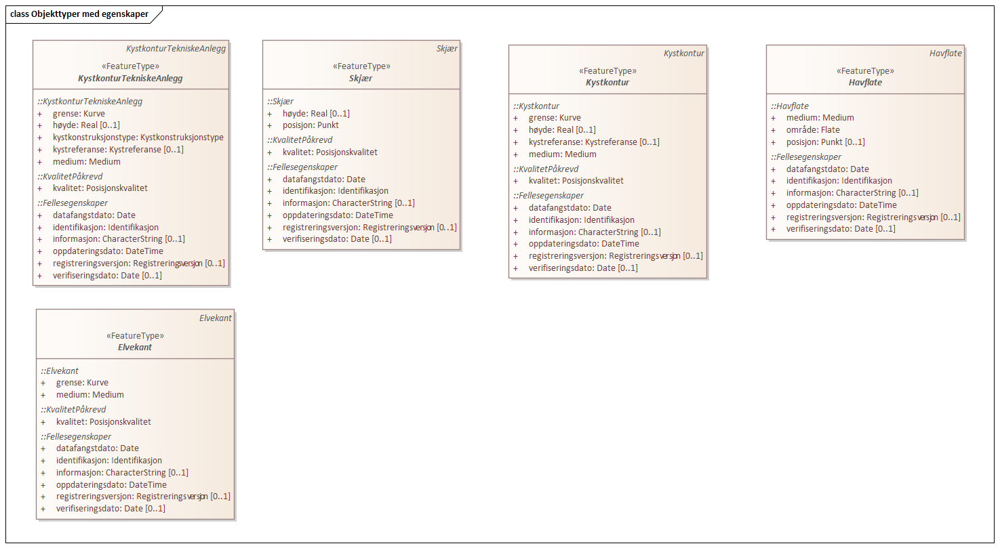

=== Fotogrammetrisk registreringsinstruks
Definisjon: 
[caption="Figur  ",title=Objekttyper med egenskaper]

|===
|===
 
==== «FeatureType» Kystkontur
Definisjon: grense mellom land og sj&#248;, definert som midlere h&#248;yvannslinje.
 
Tilleggsdefinisjon: Kystkonturen skal v&#230;re registrert fullstendig og sammenhengende.
Eventuelle synlige tekniske anlegg som ligger under MHV skal registreres.

Det skal v&#230;re konstant h&#248;yde p&#229; kystkonturen.
I et kartleggingsprosjekt skal oppdragsgiver fremskaffe riktige h&#248;ydeverdier for kystkontur. 

Skille mellom Kystkontur og Elv markeres med VannFiktivGrense og egenskap vannSperretype lik havElvSperre.

Kystkontur skal v&#230;re med p&#229; &#229; avgrense Havflate.

Merknader:
Kystkonturen kan v&#230;re gjennomg&#229;ende under sm&#229; brygger og lignende som st&#229;r p&#229; p&#230;ler og som stikker mindre enn 5 meter ut fra land.

Kystkonturen skal f&#248;lge alle tekniske anlegg (kai/brygger ol.) som stikker
mer enn 5 meter ut fra land, uavhengig om det er vann under eller ikke. Se
beskrivelse for objekttype KystkonturTekniskeAnlegg.

MEDIUM U benyttes p&#229; kystkontur som g&#229;r under terreng, for eksempel i kulvert. Skal ikke benyttes ved bruer. 

Kystkonturen skal v&#230;re koblet mot andre situasjonsdetaljer (kai, mur, osv.) ved at kystkonturen konnekteres i 2 dimensjoner til objektet. Kystkonturen skal ha samme grunnrisskoordinater som objektet, men med
riktig vannh&#248;yde. Det skal bearbeides nodepunkt til andre vanntema. Nodepunktene dannes i 3D der dette er naturlig. 
 
[caption="Figur  ",title=Figur fra produktspesifikasjonen]
image::http://skjema.geonorge.no/SOSI/produktspesifikasjon/FKB-Vann/5.0/figurer/objtype_kystkontur.png[http://skjema.geonorge.no/SOSI/produktspesifikasjon/FKB-Vann/5.0/figurer/objtype_kystkontur.png]
 
===== Føringer
[cols="20,80"]
|===
|FKB_grunnrissreferanse
|Terreng/vannkant i riktig høyde, se høydereferanse
 
|FKB_høydereferanse
|Midlere høyvann (MHV)
 
|FKB_minstestørrelse_A
|Øyer større enn 10m2 registreres som kystkontur
 
|FKB_minstestørrelse_B
|Øyer større enn 10m2 registreres som kystkontur
 
|FKB_minstestørrelse_C
|Øyer større enn 10m2 registreres som kystkontur
 
|FKB_minstestørrelse_D
|Øyer større enn 10m2 registreres som kystkontur
 
|FKB-A
|Påkrevd registrering
 
|FKB-B
|Påkrevd registrering
 
|FKB-C
|Påkrevd registrering
 
|FKB-D
|Påkrevd registrering
 
|===
 
===== Egenskapstabell
[cols="20,20,20,10"]
|===
|*Navn:* 
|*Type:* 
|*SOSI_navn:* 
|*Lengde:* 
 
|identifikasjon
|«dataType» Identifikasjon
|..IDENT
|[1..1]
 
|identifikasjon.lokalId
|CharacterString
|...LOKALID
|[1..1]
 
|identifikasjon.navnerom
|CharacterString
|...NAVNEROM
|[1..1]
 
|identifikasjon.versjonId
|CharacterString
|...VERSJONID
|[0..1]
 
|oppdateringsdato
|DateTime
|..OPPDATERINGSDATO
|[1..1]
 
|datafangstdato
|Date
|..DATAFANGSTDATO
|[1..1]
 
|verifiseringsdato
|Date
|..VERIFISERINGSDATO
|[0..1]
 
|registreringsversjon
|«CodeList» Registreringsversjon
|..REGISTRERINGSVERSJON
|[0..1]
 
|informasjon
|CharacterString
|..INFORMASJON
|[0..1]
 
|kvalitet
|«dataType» Posisjonskvalitet
|..KVALITET
|[1..1]
 
|kvalitet.datafangstmetode
|«CodeList» Datafangstmetode
|...DATAFANGSTMETODE
|[1..1]
 
|kvalitet.nøyaktighet
|Integer
|...NØYAKTIGHET
|[0..1]
 
|kvalitet.synbarhet
|«CodeList» Synbarhet
|...SYNBARHET
|[0..1]
 
|kvalitet.datafangstmetodeHøyde
|«CodeList» Datafangstmetode
|...DATAFANGSTMETODEHØYDE
|[0..1]
 
|kvalitet.nøyaktighetHøyde
|Integer
|...H-NØYAKTIGHET
|[0..1]
 
|grense
|Kurve
|.KURVE
|[1..1]
 
|kystreferanse
|«CodeList» Kystreferanse
|..KYSTREF
|[0..1]
 
|høyde
|Real
|..HØYDE
|[0..1]
 
|medium
|«CodeList» Medium
|..MEDIUM
|[1..1]
 
|===
|===
|===
 
==== «FeatureType» KystkonturTekniskeAnlegg
Definisjon: angivelse av kystkontur der denne består av tekniske anlegg, definert som  midlere høyvann
 
Tilleggsdefinisjon: Benyttes der kystkonturen f&#248;lger tekniske anlegg som for eksempel
kaier.

Det skal v&#230;re konstant h&#248;yde p&#229; kystkonturen.

Merknader:
Det skal bearbeides nodepunkt inntil Kystkontur. Nodepunktene dannes i
3D der dette er naturlig.
KystkonturTekniskeAnlegg skal om mulig konnekteres til det tekniske
anlegget i 2 dimensjoner. KystkonturTekniskeAnlegg skal (vanligvis) ha
samme grunnrisskoordinater som objektet, men med riktig vannh&#248;yde. 

MEDIUM U benyttes p&#229; kystkontur som g&#229;r under terreng, for eksempel i kulvert. Skal ikke benyttes ved bruer. 
 
[caption="Figur  ",title=Figur fra produktspesifikasjonen]
image::http://skjema.geonorge.no/SOSI/produktspesifikasjon/FKB-Vann/5.0/figurer/objtype_kystkonturtekniskeanlegg.png[http://skjema.geonorge.no/SOSI/produktspesifikasjon/FKB-Vann/5.0/figurer/objtype_kystkonturtekniskeanlegg.png]
 
===== Føringer
[cols="20,80"]
|===
|FKB_grunnrissreferanse
|Terreng/vannkant i riktig høyde, se høydereferanse
 
|FKB_høydereferanse
|Midlere høyvann (MHV)
 
|FKB-A
|Påkrevd registrering
 
|FKB-B
|Påkrevd registrering
 
|FKB-C
|Påkrevd registrering
 
|FKB-D
|Påkrevd registrering
 
|===
 
===== Egenskapstabell
[cols="20,20,20,10"]
|===
|*Navn:* 
|*Type:* 
|*SOSI_navn:* 
|*Lengde:* 
 
|identifikasjon
|«dataType» Identifikasjon
|..IDENT
|[1..1]
 
|identifikasjon.lokalId
|CharacterString
|...LOKALID
|[1..1]
 
|identifikasjon.navnerom
|CharacterString
|...NAVNEROM
|[1..1]
 
|identifikasjon.versjonId
|CharacterString
|...VERSJONID
|[0..1]
 
|oppdateringsdato
|DateTime
|..OPPDATERINGSDATO
|[1..1]
 
|datafangstdato
|Date
|..DATAFANGSTDATO
|[1..1]
 
|verifiseringsdato
|Date
|..VERIFISERINGSDATO
|[0..1]
 
|registreringsversjon
|«CodeList» Registreringsversjon
|..REGISTRERINGSVERSJON
|[0..1]
 
|informasjon
|CharacterString
|..INFORMASJON
|[0..1]
 
|kvalitet
|«dataType» Posisjonskvalitet
|..KVALITET
|[1..1]
 
|kvalitet.datafangstmetode
|«CodeList» Datafangstmetode
|...DATAFANGSTMETODE
|[1..1]
 
|kvalitet.nøyaktighet
|Integer
|...NØYAKTIGHET
|[0..1]
 
|kvalitet.synbarhet
|«CodeList» Synbarhet
|...SYNBARHET
|[0..1]
 
|kvalitet.datafangstmetodeHøyde
|«CodeList» Datafangstmetode
|...DATAFANGSTMETODEHØYDE
|[0..1]
 
|kvalitet.nøyaktighetHøyde
|Integer
|...H-NØYAKTIGHET
|[0..1]
 
|grense
|Kurve
|.KURVE
|[1..1]
 
|kystkonstruksjonstype
|«CodeList» Kystkonstruksjonstype
|..KYSTKONSTRUKSJONSTYPE
|[1..1]
 
|kystreferanse
|«CodeList» Kystreferanse
|..KYSTREF
|[0..1]
 
|høyde
|Real
|..HØYDE
|[0..1]
 
|medium
|«CodeList» Medium
|..MEDIUM
|[1..1]
 
|===
|===
|===
 
==== «FeatureType» Skjær
Definisjon: generalisert punktobjekt for sm&#229; &#248;yer eller landareal
 
Tilleggsdefinisjon: Skal benyttes p&#229; sm&#229; &#248;yer som ikke registreres som kystkontur.
 
[caption="Figur  ",title=Figur fra produktspesifikasjonen]
image::http://skjema.geonorge.no/SOSI/produktspesifikasjon/FKB-Vann/5.0/figurer/objtype_skjær.png[http://skjema.geonorge.no/SOSI/produktspesifikasjon/FKB-Vann/5.0/figurer/objtype_skjær.png]
 
===== Føringer
[cols="20,80"]
|===
|FKB_grunnrissreferanse
|Senter av skjæret
 
|FKB_høydereferanse
|Topp skjær
 
|FKB_minstestørrelse_A
|Øyer mindre enn 10m2 registreres som skjær
 
|FKB_minstestørrelse_B
|Øyer mindre enn 10m2 registreres som skjær
 
|FKB_minstestørrelse_C
|Øyer mindre enn 10m2 registreres som skjær
 
|FKB_minstestørrelse_D
|Øyer mindre enn 10m2 registreres som skjær
 
|FKB-A
|Påkrevd registrering
 
|FKB-B
|Påkrevd registrering
 
|FKB-C
|Påkrevd registrering
 
|FKB-D
|Påkrevd registrering
 
|===
 
===== Egenskapstabell
[cols="20,20,20,10"]
|===
|*Navn:* 
|*Type:* 
|*SOSI_navn:* 
|*Lengde:* 
 
|identifikasjon
|«dataType» Identifikasjon
|..IDENT
|[1..1]
 
|identifikasjon.lokalId
|CharacterString
|...LOKALID
|[1..1]
 
|identifikasjon.navnerom
|CharacterString
|...NAVNEROM
|[1..1]
 
|identifikasjon.versjonId
|CharacterString
|...VERSJONID
|[0..1]
 
|oppdateringsdato
|DateTime
|..OPPDATERINGSDATO
|[1..1]
 
|datafangstdato
|Date
|..DATAFANGSTDATO
|[1..1]
 
|verifiseringsdato
|Date
|..VERIFISERINGSDATO
|[0..1]
 
|registreringsversjon
|«CodeList» Registreringsversjon
|..REGISTRERINGSVERSJON
|[0..1]
 
|informasjon
|CharacterString
|..INFORMASJON
|[0..1]
 
|kvalitet
|«dataType» Posisjonskvalitet
|..KVALITET
|[1..1]
 
|kvalitet.datafangstmetode
|«CodeList» Datafangstmetode
|...DATAFANGSTMETODE
|[1..1]
 
|kvalitet.nøyaktighet
|Integer
|...NØYAKTIGHET
|[0..1]
 
|kvalitet.synbarhet
|«CodeList» Synbarhet
|...SYNBARHET
|[0..1]
 
|kvalitet.datafangstmetodeHøyde
|«CodeList» Datafangstmetode
|...DATAFANGSTMETODEHØYDE
|[0..1]
 
|kvalitet.nøyaktighetHøyde
|Integer
|...H-NØYAKTIGHET
|[0..1]
 
|posisjon
|Punkt
|.PUNKT
|[1..1]
 
|høyde
|Real
|..HØYDE
|[0..1]
 
|===
|===
|===
 
==== «FeatureType» Havflate
Definisjon: havomr&#229;de som avgrenses av Kystkontur, VannFiktivGrense og KystkonturTekniskAnlegg
 
Tilleggsdefinisjon: Ingen tilleggsdefinisjon.

Merknad: For avgrensning av Havflate ut mot ikke kartlagt omr&#229;de benyttes den generelle objekttypen Dataavgrensning.

MEDIUM U benyttes p&#229; havflater som ligger under terreng, for eksempel i kulvert. Skal ikke benyttes ved bruer. 
 
[caption="Figur  ",title=Figur fra produktspesifikasjonen]
image::http://skjema.geonorge.no/SOSI/produktspesifikasjon/FKB-Vann/5.0/figurer/objtype_havflate.png[http://skjema.geonorge.no/SOSI/produktspesifikasjon/FKB-Vann/5.0/figurer/objtype_havflate.png]
 
===== Føringer
[cols="20,80"]
|===
|FKB-A
|Påkrevd registrering
 
|FKB-B
|Påkrevd registrering
 
|FKB-C
|Påkrevd registrering
 
|FKB-D
|Påkrevd registrering
 
|===
 
===== Egenskapstabell
[cols="20,20,20,10"]
|===
|*Navn:* 
|*Type:* 
|*SOSI_navn:* 
|*Lengde:* 
 
|identifikasjon
|«dataType» Identifikasjon
|..IDENT
|[1..1]
 
|identifikasjon.lokalId
|CharacterString
|...LOKALID
|[1..1]
 
|identifikasjon.navnerom
|CharacterString
|...NAVNEROM
|[1..1]
 
|identifikasjon.versjonId
|CharacterString
|...VERSJONID
|[0..1]
 
|oppdateringsdato
|DateTime
|..OPPDATERINGSDATO
|[1..1]
 
|datafangstdato
|Date
|..DATAFANGSTDATO
|[1..1]
 
|verifiseringsdato
|Date
|..VERIFISERINGSDATO
|[0..1]
 
|registreringsversjon
|«CodeList» Registreringsversjon
|..REGISTRERINGSVERSJON
|[0..1]
 
|informasjon
|CharacterString
|..INFORMASJON
|[0..1]
 
|område
|Flate
|.FLATE
|[1..1]
 
|posisjon
|Punkt
|.PUNKT
|[0..1]
 
|medium
|«CodeList» Medium
|..MEDIUM
|[1..1]
 
|===
|===
|===
 
==== «FeatureType» Elvekant
Definisjon: konturlinje mellom land og elveflate
 
Tilleggsdefinisjon: Ingen tilleggsdefinisjon

Ved fotogrammetrisk datafangst er registrering av Elvekant en opsjon. Fotovannstanden vil v&#230;re avgj&#248;rende for om registrering av Elvekant skal utf&#248;res eller ikke. Dersom fotovannstand er unormalt h&#248;y (flom) vil det v&#230;re vanskelig &#229; f&#229; en korrekt registrering av Elvekant og det m&#229; vurderes om eksisterende data gir en riktigere beskrivelse.

Der Elvekant renner ut i sj&#248;, innsj&#248; eller regulert innsj&#248; skal h&#248;yden i Elvekant ikke noe sted v&#230;re lavere enn h&#248;yden til nodepunktet som er felles. 

Ved fotogrammetrisk datafangst kan det v&#230;re vanskelig &#229; se ned til vannspeilet i enkelte tilfeller. Elvekant skal likevel konstrueres fullstendig og sammenhengende og kvalitetskodes deretter. I tilfeller med manglende innsyn er det tillatt &#229; generere Elvekant, dette skal i s&#229; fall tydelig fremkomme av kvalitetskodingen. Elveleier som tidvis er t&#248;rre, men godt synlig i flybildene og i terrenget skal konstrueres.

Merknader:
Elvekant skal ha samme geometri i grunnriss som situasjonsdetaljer som den f&#248;lger (massive kaier, murer, osv.). Vannkanten konnekteres i to dimensjoner til objektet. Det skal lages Elvekant rundt objektet med samme grunnrisskoordinater som objektet, men med riktig vannh&#248;yde.

N&#229;r elvekanten g&#229;r under kai/brygge, f.eks. ved mindre trebrygger, skal elvekanten v&#230;re gjennomg&#229;ende. Elvekanten registreres uten hensyn til brygga over. Brygga og elvekanten er helt "uavhengige" objekter. For &#248;vrig skal det etableres nodepunkt mellom Elvekant og andre tilst&#248;tende vannobjekter. Der det er naturlig skal nodepunktene v&#230;re i 3D.

MEDIUM U benyttes p&#229; Elvekant som ligger under terreng, for eksempel under veg. Skal ikke benyttes ved bruer.

 
[caption="Figur  ",title=Figur fra produktspesifikasjonen]
image::http://skjema.geonorge.no/SOSI/produktspesifikasjon/FKB-Vann/5.0/figurer/objtype_elvekant.png[http://skjema.geonorge.no/SOSI/produktspesifikasjon/FKB-Vann/5.0/figurer/objtype_elvekant.png]
 
===== Føringer
[cols="20,80"]
|===
|FKB_grunnrissreferanse
|Der hvor høy vannføring i elva normalt går. Dette vil ofte være overgangen mellom vegetasjon og sand/grus/steiner.
 
|FKB_høydereferanse
|Terrenghøyden ved grunnrissreferanse.
 
|FKB_minstestørrelse_A
|Naturlig rennende vann bredere enn 1 meter (Vannbredde 2-5)
 
|FKB_minstestørrelse_B
|Naturlig rennende vann bredere enn 1 meter (Vannbredde 2-5)
 
|FKB_minstestørrelse_C
|Naturlig rennende vann bredere enn 3 meter (Vannbredde 3-5)
 
|FKB_minstestørrelse_D
|Naturlig rennende vann bredere enn 15 meter (Vannbredde 4-5)
 
|FKB-A
|O (se minstestørrelse for FKB-A)
 
|FKB-B
|O (se minstestørrelse for FKB-B)
 
|FKB-C
|O (se minstestørrelse for FKB-C)
 
|FKB-D
|O (se minstestørrelse for FKB-D)
 
|===
 
===== Egenskapstabell
[cols="20,20,20,10"]
|===
|*Navn:* 
|*Type:* 
|*SOSI_navn:* 
|*Lengde:* 
 
|identifikasjon
|«dataType» Identifikasjon
|..IDENT
|[1..1]
 
|identifikasjon.lokalId
|CharacterString
|...LOKALID
|[1..1]
 
|identifikasjon.navnerom
|CharacterString
|...NAVNEROM
|[1..1]
 
|identifikasjon.versjonId
|CharacterString
|...VERSJONID
|[0..1]
 
|oppdateringsdato
|DateTime
|..OPPDATERINGSDATO
|[1..1]
 
|datafangstdato
|Date
|..DATAFANGSTDATO
|[1..1]
 
|verifiseringsdato
|Date
|..VERIFISERINGSDATO
|[0..1]
 
|registreringsversjon
|«CodeList» Registreringsversjon
|..REGISTRERINGSVERSJON
|[0..1]
 
|informasjon
|CharacterString
|..INFORMASJON
|[0..1]
 
|kvalitet
|«dataType» Posisjonskvalitet
|..KVALITET
|[1..1]
 
|kvalitet.datafangstmetode
|«CodeList» Datafangstmetode
|...DATAFANGSTMETODE
|[1..1]
 
|kvalitet.nøyaktighet
|Integer
|...NØYAKTIGHET
|[0..1]
 
|kvalitet.synbarhet
|«CodeList» Synbarhet
|...SYNBARHET
|[0..1]
 
|kvalitet.datafangstmetodeHøyde
|«CodeList» Datafangstmetode
|...DATAFANGSTMETODEHØYDE
|[0..1]
 
|kvalitet.nøyaktighetHøyde
|Integer
|...H-NØYAKTIGHET
|[0..1]
 
|grense
|Kurve
|.KURVE
|[1..1]
 
|medium
|«CodeList» Medium
|..MEDIUM
|[1..1]
 
|===
|===
|===
 
==== «FeatureType» Elv
Definisjon: st&#248;rre vannvei for rennende vann representert ved flate
 
Definisjon: st&#248;rre vannvei for rennende vann representert ved flate
 
Tilleggsdefinisjon: Ingen tilleggsdefinisjon

For avgrensing av flate mot ikke kartlagt omr&#229;de eller mellom ulike standarder kan VannFiktivGrense med egenskap  vannSperretype lik elvelinjeFiktiv benyttes.

MEDIUM U benyttes p&#229; ElvBekk som ligger under terreng, for eksempel under veg. Skal ikke benyttes ved bruer.
 
[caption="Figur  ",title=Figur fra produktspesifikasjonen]
image::http://skjema.geonorge.no/SOSI/produktspesifikasjon/FKB-Vann/5.0/figurer/objtype_elv.png[http://skjema.geonorge.no/SOSI/produktspesifikasjon/FKB-Vann/5.0/figurer/objtype_elv.png]
 
===== Føringer
[cols="20,80"]
|===
|FKB_minstestørrelse_A
|Naturlig rennende vann med bredde over 1 meter (flate med vannBredde 2 - 5)
 
|FKB_minstestørrelse_B
|Naturlig rennende vann med bredde over 1 meter (flate med vannBredde 2 - 5)
 
|FKB_minstestørrelse_C
|Naturlig rennende vann med bredde over 3 meter (flate med vannBredde 3 - 5)
 
|FKB_minstestørrelse_D
|Naturlig rennende vann med bredde over 15 meter (flate med vannBredde 4 - 5)
 
|FKB-A
|Påkrevd registrering
 
|FKB-B
|Påkrevd registrering
 
|FKB-C
|Påkrevd registrering
 
|FKB-D
|Påkrevd registrering
 
|===
 
===== Egenskapstabell
[cols="20,20,20,10"]
|===
|*Navn:* 
|*Type:* 
|*SOSI_navn:* 
|*Lengde:* 
 
|identifikasjon
|«dataType» Identifikasjon
|..IDENT
|[1..1]
 
|identifikasjon.lokalId
|CharacterString
|...LOKALID
|[1..1]
 
|identifikasjon.navnerom
|CharacterString
|...NAVNEROM
|[1..1]
 
|identifikasjon.versjonId
|CharacterString
|...VERSJONID
|[0..1]
 
|oppdateringsdato
|DateTime
|..OPPDATERINGSDATO
|[1..1]
 
|datafangstdato
|Date
|..DATAFANGSTDATO
|[1..1]
 
|verifiseringsdato
|Date
|..VERIFISERINGSDATO
|[0..1]
 
|registreringsversjon
|«CodeList» Registreringsversjon
|..REGISTRERINGSVERSJON
|[0..1]
 
|informasjon
|CharacterString
|..INFORMASJON
|[0..1]
 
|posisjon
|Punkt
|.PUNKT
|[0..1]
 
|område
|Flate
|.FLATE
|[1..1]
 
|vannBredde
|«CodeList» VannBredde
|..VANNBR
|[1..1]
 
|medium
|«CodeList» Medium
|..MEDIUM
|[1..1]
 
|identifikasjon
|«dataType» Identifikasjon
|..IDENT
|[1..1]
 
|identifikasjon.lokalId
|CharacterString
|...LOKALID
|[1..1]
 
|identifikasjon.navnerom
|CharacterString
|...NAVNEROM
|[1..1]
 
|identifikasjon.versjonId
|CharacterString
|...VERSJONID
|[0..1]
 
|oppdateringsdato
|DateTime
|..OPPDATERINGSDATO
|[1..1]
 
|datafangstdato
|Date
|..DATAFANGSTDATO
|[1..1]
 
|verifiseringsdato
|Date
|..VERIFISERINGSDATO
|[0..1]
 
|registreringsversjon
|«CodeList» Registreringsversjon
|..REGISTRERINGSVERSJON
|[0..1]
 
|informasjon
|CharacterString
|..INFORMASJON
|[0..1]
 
|posisjon
|Punkt
|.PUNKT
|[0..1]
 
|område
|Flate
|.FLATE
|[1..1]
 
|vannBredde
|«CodeList» VannBredde
|..VANNBR
|[1..1]
 
|medium
|«CodeList» Medium
|..MEDIUM
|[1..1]
 
|===
|===
|===
 
==== «FeatureType» Kanalkant
Definisjon: avgrensningslinje av kanal, dvs vannspeilet. Med vannspeil menes der vannet normalt st&#229;r i kanalen
 
Tilleggsdefinisjon: Ingen tilleggsdefinisjon.

Kanalkanten skal registreres fullstendig og sammenhengende. For avgrensing av flate mot ikke kartlagt omr&#229;de eller mellom ulike standarder kan VannFiktivGrense med egenskap vannSperretype lik elvelinjeFiktiv benyttes.

Det skal genereres nodepunkt mellom Kanalkant og andre vanntema. Nodepunktet skal v&#230;re i 3D der dette er naturlig.

MEDIUM U benyttes p&#229; Kanalkant som ligger under terreng, for eksempel under veg. Skal ikke benyttes ved bruer. 
 
[caption="Figur  ",title=Figur fra produktspesifikasjonen]
image::http://skjema.geonorge.no/SOSI/produktspesifikasjon/FKB-Vann/5.0/figurer/objtype_kanalkant.png[http://skjema.geonorge.no/SOSI/produktspesifikasjon/FKB-Vann/5.0/figurer/objtype_kanalkant.png]
 
===== Føringer
[cols="20,80"]
|===
|FKB_grunnrissreferanse
|Terreng/vannkant i riktig høyde, se høydereferanse
 
|FKB_høydereferanse
|Terrenghøyden i vannspeilet eller der vannet ville ha stått hvis kanalen var tørr ved etablering.
 
|FKB_minstestørrelse_A
|Kanal bredere enn 1 meter (vannBredde 2-5)
 
|FKB_minstestørrelse_B
|Kanal bredere enn 1 meter (vannBredde 2-5)
 
|FKB_minstestørrelse_C
|Kanal bredere enn 3 meter (vannBredde 3-5)
 
|FKB_minstestørrelse_D
| Kanal bredere enn 15 meter (vannBredde 4-5)
 
|FKB-A
|Påkrevd registrering
 
|FKB-B
|Påkrevd registrering
 
|FKB-C
|Påkrevd registrering
 
|FKB-D
|P 
 
|===
 
===== Egenskapstabell
[cols="20,20,20,10"]
|===
|*Navn:* 
|*Type:* 
|*SOSI_navn:* 
|*Lengde:* 
 
|identifikasjon
|«dataType» Identifikasjon
|..IDENT
|[1..1]
 
|identifikasjon.lokalId
|CharacterString
|...LOKALID
|[1..1]
 
|identifikasjon.navnerom
|CharacterString
|...NAVNEROM
|[1..1]
 
|identifikasjon.versjonId
|CharacterString
|...VERSJONID
|[0..1]
 
|oppdateringsdato
|DateTime
|..OPPDATERINGSDATO
|[1..1]
 
|datafangstdato
|Date
|..DATAFANGSTDATO
|[1..1]
 
|verifiseringsdato
|Date
|..VERIFISERINGSDATO
|[0..1]
 
|registreringsversjon
|«CodeList» Registreringsversjon
|..REGISTRERINGSVERSJON
|[0..1]
 
|informasjon
|CharacterString
|..INFORMASJON
|[0..1]
 
|kvalitet
|«dataType» Posisjonskvalitet
|..KVALITET
|[1..1]
 
|kvalitet.datafangstmetode
|«CodeList» Datafangstmetode
|...DATAFANGSTMETODE
|[1..1]
 
|kvalitet.nøyaktighet
|Integer
|...NØYAKTIGHET
|[0..1]
 
|kvalitet.synbarhet
|«CodeList» Synbarhet
|...SYNBARHET
|[0..1]
 
|kvalitet.datafangstmetodeHøyde
|«CodeList» Datafangstmetode
|...DATAFANGSTMETODEHØYDE
|[0..1]
 
|kvalitet.nøyaktighetHøyde
|Integer
|...H-NØYAKTIGHET
|[0..1]
 
|grense
|Kurve
|.KURVE
|[1..1]
 
|medium
|«CodeList» Medium
|..MEDIUM
|[1..1]
 
|===
|===
|===
 
==== «FeatureType» Kanal
Definisjon: rennende vann der forl&#248;pet er menneskeskapt
 
Tilleggsdefinisjon: Ingen tilleggsdefinisjon

For avgrensing av flate mot ikke kartlagt omr&#229;de eller mellom ulike standarder kan kan VannFiktivGrense med egenskap  vannSperretype lik elvelinjeFiktiv benyttes.

MEDIUM U benyttes p&#229; Kanal som ligger under terreng, for eksempel under veg. Skal ikke benyttes ved bruer.
 
[caption="Figur  ",title=Figur fra produktspesifikasjonen]
image::http://skjema.geonorge.no/SOSI/produktspesifikasjon/FKB-Vann/5.0/figurer/objtype_kanal.png[http://skjema.geonorge.no/SOSI/produktspesifikasjon/FKB-Vann/5.0/figurer/objtype_kanal.png]
 
===== Føringer
[cols="20,80"]
|===
|FKB_minstestørrelse_A
|Kanal bredere enn 1 meter (vannBredde 2-5)
 
|FKB_minstestørrelse_B
|Kanal bredere enn 1 meter (vannBredde 2-5)
 
|FKB_minstestørrelse_C
|Kanal bredere enn 3 meter (vannBredde 3-5)
 
|FKB_minstestørrelse_D
|Kanal bredere enn 15 meter (vannBredde 4-5)
 
|FKB-A
|Påkrevd registrering
 
|FKB-B
|Påkrevd registrering
 
|FKB-C
|Påkrevd registrering
 
|FKB-D
|Påkrevd registrering
 
|===
 
===== Egenskapstabell
[cols="20,20,20,10"]
|===
|*Navn:* 
|*Type:* 
|*SOSI_navn:* 
|*Lengde:* 
 
|identifikasjon
|«dataType» Identifikasjon
|..IDENT
|[1..1]
 
|identifikasjon.lokalId
|CharacterString
|...LOKALID
|[1..1]
 
|identifikasjon.navnerom
|CharacterString
|...NAVNEROM
|[1..1]
 
|identifikasjon.versjonId
|CharacterString
|...VERSJONID
|[0..1]
 
|oppdateringsdato
|DateTime
|..OPPDATERINGSDATO
|[1..1]
 
|datafangstdato
|Date
|..DATAFANGSTDATO
|[1..1]
 
|verifiseringsdato
|Date
|..VERIFISERINGSDATO
|[0..1]
 
|registreringsversjon
|«CodeList» Registreringsversjon
|..REGISTRERINGSVERSJON
|[0..1]
 
|informasjon
|CharacterString
|..INFORMASJON
|[0..1]
 
|posisjon
|Punkt
|.PUNKT
|[0..1]
 
|område
|Flate
|.FLATE
|[1..1]
 
|medium
|«CodeList» Medium
|..MEDIUM
|[1..1]
 
|vannBredde
|«CodeList» VannBredde
|..VANNBR
|[1..1]
 
|===
|===
|===
 
==== «FeatureType» Innsjøkant
Definisjon: konturlinje mellom land og innsj&#248;

Merknad:
for innsj&#248; som er oppdemt/regulert skal konturlinjen ligge i h&#248;ydeniv&#229;et for h&#248;yeste regulerte vannstand
 
Tilleggsdefinisjon: Hvis innsj&#248;en er regulert skal innsj&#248;kanten gjengi h&#248;yeste regulerte vannstand.

Ved fotogrammetrisk datafangst er registrering av Innsj&#248;kant en opsjon. Fotovannstanden vil v&#230;re avgj&#248;rende for om registrering av Innsj&#248;kant skal utf&#248;res eller ikke. Dersom fotovannstand er unormalt h&#248;y (flom) vil det v&#230;re vanskelig &#229; f&#229; en korrekt registrering av Innsj&#248;kant og det m&#229; vurderes om eksisterende data gir en riktigere beskrivelse.

Innsj&#248;kanten skal registreres fullstendig og sammenhengende. For avgrensing av flate mot ikke kartlagt omr&#229;de eller mellom ulike standarder kan  VannFiktivGrense med egenskap vannSperretype lik innsj&#248;linjeFiktiv benyttes.

Merknader:
Den fysiske vannkanten skal registreres. Innsj&#248;kant skal ha samme geometri i grunnriss som situasjonsdetaljer som den f&#248;lger (massive kaier, murer, osv.). Det skal lages Innsj&#248;kant rundt objektet med samme grunnrisskoordinater som objektet, men med riktig vannh&#248;yde.

N&#229;r vannkanten g&#229;r under kai/brygge, f.eks. ved mindre trebrygger, skal vannkanten v&#230;re gjennomg&#229;ende. Innsj&#248;kanten registreres uten hensyn til brygga over. Brygga og innsj&#248;kanten er helt "uavhengige" objekter. Det skal etableres nodepunkt med andre tilst&#248;tende vannobjekter. Der det er naturlig skal det lages nodepunkt i 3D.

MEDIUM U benyttes p&#229; Innsj&#248;kant som ligger under terreng, for eksempel under veg. Skal ikke benyttes ved bruer. 
 
[caption="Figur  ",title=Figur fra produktspesifikasjonen]
image::http://skjema.geonorge.no/SOSI/produktspesifikasjon/FKB-Vann/5.0/figurer/objtype_innsjøkant.png[http://skjema.geonorge.no/SOSI/produktspesifikasjon/FKB-Vann/5.0/figurer/objtype_innsjøkant.png]
 
===== Føringer
[cols="20,80"]
|===
|FKB_grunnrissreferanse
|Terreng/vannkant i riktig høyde, se høydereferanse.
 
|FKB_høydereferanse
|Fotovannstand. Ved store avvik mellom fotovannstand og normal
vannstand skal referansen være normal vannstand. Innsjøkanten
skal ha konstant høyde for hele vannet. For regulerte innsjøer brukes høyeste regulerte vannstand.
 
|FKB_minstestørrelse_B
|Innsjøer og øyer over 20m2
 
|FKB_minstestørrelse_C
|Innsjøer og øyer over 100m2
 
|FKB_minstestørrelse_D
|Innsjøer og øyer over 100m2
 
|FKB_minstestørrrelse_A
| Innsjøer og øyer over 10m2
 
|FKB-A
|Opsjonell registrering
 
|FKB-B
|Opsjonell registrering
 
|FKB-C
|Opsjonell registrering
 
|FKB-D
|Opsjonell registrering
 
|===
 
===== Egenskapstabell
[cols="20,20,20,10"]
|===
|*Navn:* 
|*Type:* 
|*SOSI_navn:* 
|*Lengde:* 
 
|identifikasjon
|«dataType» Identifikasjon
|..IDENT
|[1..1]
 
|identifikasjon.lokalId
|CharacterString
|...LOKALID
|[1..1]
 
|identifikasjon.navnerom
|CharacterString
|...NAVNEROM
|[1..1]
 
|identifikasjon.versjonId
|CharacterString
|...VERSJONID
|[0..1]
 
|oppdateringsdato
|DateTime
|..OPPDATERINGSDATO
|[1..1]
 
|datafangstdato
|Date
|..DATAFANGSTDATO
|[1..1]
 
|verifiseringsdato
|Date
|..VERIFISERINGSDATO
|[0..1]
 
|registreringsversjon
|«CodeList» Registreringsversjon
|..REGISTRERINGSVERSJON
|[0..1]
 
|informasjon
|CharacterString
|..INFORMASJON
|[0..1]
 
|kvalitet
|«dataType» Posisjonskvalitet
|..KVALITET
|[1..1]
 
|kvalitet.datafangstmetode
|«CodeList» Datafangstmetode
|...DATAFANGSTMETODE
|[1..1]
 
|kvalitet.nøyaktighet
|Integer
|...NØYAKTIGHET
|[0..1]
 
|kvalitet.synbarhet
|«CodeList» Synbarhet
|...SYNBARHET
|[0..1]
 
|kvalitet.datafangstmetodeHøyde
|«CodeList» Datafangstmetode
|...DATAFANGSTMETODEHØYDE
|[0..1]
 
|kvalitet.nøyaktighetHøyde
|Integer
|...H-NØYAKTIGHET
|[0..1]
 
|grense
|Kurve
|.KURVE
|[1..1]
 
|medium
|«CodeList» Medium
|..MEDIUM
|[1..1]
 
|høyde
|Real
|..HØYDE
|[0..1]
 
|===
|===
|===
 
==== «FeatureType» Innsjø
Definisjon: en ferskvannsflate som ikke er renndende vann
 
Tilleggsdefinisjon: Ingen tilleggsdefinisjon

For avgrensing av flate mot ikke kartlagt omr&#229;de eller mellom ulike standarder kan Innsj&#248;linjeFiktiv benyttes. 

Egenskapen regulert skal ha verdi lik JA er hvis innsj&#248;en er regulert. Innsj&#248;kanter som avgrenser forekomster av Innsj&#248; med egenskap regulert lik JA skal registreres i h&#248;yde lik h&#248;yeste regulerte vannstand for innsj&#248;en.
Reguleringsstatus og opplysninger om h&#248;yeste regulerte vannstand kan hentes fra NVE sitt register (NVE Atlas). http://atlas.nve.no. Alterrnativt kan egenskapen eksternpeker brukes til &#229; peke inn i eksterene systemer som inneholder opplysninger om reguleringsstatus for det akuelle innsj&#248;objektet.

MEDIUM U benyttes p&#229; del av Innsj&#248; som ligger under terreng, for eksempel under veg. Skal ikke benyttes ved bruer. 
 
[caption="Figur  ",title=Figur fra produktspesifikasjonen]
image::http://skjema.geonorge.no/SOSI/produktspesifikasjon/FKB-Vann/5.0/figurer/objtype_innsjø.png[http://skjema.geonorge.no/SOSI/produktspesifikasjon/FKB-Vann/5.0/figurer/objtype_innsjø.png]
 
===== Føringer
[cols="20,80"]
|===
|FKB_minstesstørrelse_D
|nnsjøer og øyer over 100 m2
 
|FKB_minstestørrelse_A
|Innsjøer og øyer over 10 m2
 
|FKB_minstestørrelse_B
|nnsjøer og øyer over 20 m2
 
|FKB_minstestørrelse_C
|Innsjøer og øyer over 100 m2
 
|FKB-A
|Påkrevd registrering
 
|FKB-B
|Påkrevd registrering
 
|FKB-C
|Påkrevd registrering
 
|FKB-D
|Påkrevd registrering
 
|===
 
===== Egenskapstabell
[cols="20,20,20,10"]
|===
|*Navn:* 
|*Type:* 
|*SOSI_navn:* 
|*Lengde:* 
 
|identifikasjon
|«dataType» Identifikasjon
|..IDENT
|[1..1]
 
|identifikasjon.lokalId
|CharacterString
|...LOKALID
|[1..1]
 
|identifikasjon.navnerom
|CharacterString
|...NAVNEROM
|[1..1]
 
|identifikasjon.versjonId
|CharacterString
|...VERSJONID
|[0..1]
 
|oppdateringsdato
|DateTime
|..OPPDATERINGSDATO
|[1..1]
 
|datafangstdato
|Date
|..DATAFANGSTDATO
|[1..1]
 
|verifiseringsdato
|Date
|..VERIFISERINGSDATO
|[0..1]
 
|registreringsversjon
|«CodeList» Registreringsversjon
|..REGISTRERINGSVERSJON
|[0..1]
 
|informasjon
|CharacterString
|..INFORMASJON
|[0..1]
 
|område
|Flate
|.FLATE
|[1..1]
 
|posisjon
|Punkt
|.PUNKT
|[0..1]
 
|høyde
|Real
|..HØYDE
|[0..1]
 
|medium
|«CodeList» Medium
|..MEDIUM
|[1..1]
 
|regulert
|Boolean
|..REGULERT
|[1..1]
 
|eksternpeker
|URI
|..EKSTERNPEKER
|[0..1]
 
|===
|===
|===
 
==== «FeatureType» Bekk
Definisjon: mindre vannvei for rennende vann representert ved senterlinje
 
Tilleggsdefinisjon: Ingen tilleggsdefinisjon

Ved fotogrammetrisk datafangst kan det v&#230;re vanskelig &#229; se ned til vannspeilet i enkelte tilfeller. Bekk (midtlinje) skal likevel konstrueres s&#229; fullstendig og sammenhengende som mulig og kvalitetskodes deretter. Bekkeleier som tidvis er t&#248;rre, men godt synlig i flybildene og i terrenget skal konstrueres.

MEDIUM U benyttes p&#229; Bekk som ligger under terreng, for eksempel under veg. Skal ikke benyttes ved bruer.

Merknad: Det skal etableres nodepunkt mellom Bekk (midtlinje) og andre tilst&#248;tende vannobjekter. Der det er naturlig skal det lages nodepunkt i 3D. 
 
[caption="Figur  ",title=Figur fra produktspesifikasjonen]
image::http://skjema.geonorge.no/SOSI/produktspesifikasjon/FKB-Vann/5.0/figurer/objtype_bekk.png[http://skjema.geonorge.no/SOSI/produktspesifikasjon/FKB-Vann/5.0/figurer/objtype_bekk.png]
 
===== Føringer
[cols="20,80"]
|===
|FKB_grunnrissreferanse
|Midten av bekken
 
|FKB_høydereferanse
|Vannspeilet ved normalvannstand
 
|FKB_minstestørrelse_A
|Naturlig rennende vann med bredde opptil 1 meter registreres med midtlinje (vannBredde 1). Er vannbredden over 1 mter brukes Elvekant og Elv
 
|FKB_minstestørrelse_B
|NAturlig rennende vann med bredde opptil 1 meter registreres med midtlinje (vannBredde 1). Er vannbredden over 1 mter brukes Elvekant og Elv
 
|FKB_minstestørrelse_C
|Naturlig rennende vann med bredde opptil 3 meter registreres som midtlinje (vannbredde 1-2).  Er vannbredden over 3 mter brukes Elvekant og Elv
 
|FKB_minstestørrelse_D
|Naturlig rennende vann med bredde opptil 15 meter registreres som midtlinje (vannbredde 1-3).  Er vannbredden over 15 mter brukes Elvekant og Elv
 
|FKB-A
|Påkrevd registrering
 
|FKB-B
|Påkrevd registrering
 
|FKB-C
|Påkrevd registrering
 
|FKB-D
|Påkrevd registrering
 
|===
 
===== Egenskapstabell
[cols="20,20,20,10"]
|===
|*Navn:* 
|*Type:* 
|*SOSI_navn:* 
|*Lengde:* 
 
|identifikasjon
|«dataType» Identifikasjon
|..IDENT
|[1..1]
 
|identifikasjon.lokalId
|CharacterString
|...LOKALID
|[1..1]
 
|identifikasjon.navnerom
|CharacterString
|...NAVNEROM
|[1..1]
 
|identifikasjon.versjonId
|CharacterString
|...VERSJONID
|[0..1]
 
|oppdateringsdato
|DateTime
|..OPPDATERINGSDATO
|[1..1]
 
|datafangstdato
|Date
|..DATAFANGSTDATO
|[1..1]
 
|verifiseringsdato
|Date
|..VERIFISERINGSDATO
|[0..1]
 
|registreringsversjon
|«CodeList» Registreringsversjon
|..REGISTRERINGSVERSJON
|[0..1]
 
|informasjon
|CharacterString
|..INFORMASJON
|[0..1]
 
|kvalitet
|«dataType» Posisjonskvalitet
|..KVALITET
|[1..1]
 
|kvalitet.datafangstmetode
|«CodeList» Datafangstmetode
|...DATAFANGSTMETODE
|[1..1]
 
|kvalitet.nøyaktighet
|Integer
|...NØYAKTIGHET
|[0..1]
 
|kvalitet.synbarhet
|«CodeList» Synbarhet
|...SYNBARHET
|[0..1]
 
|kvalitet.datafangstmetodeHøyde
|«CodeList» Datafangstmetode
|...DATAFANGSTMETODEHØYDE
|[0..1]
 
|kvalitet.nøyaktighetHøyde
|Integer
|...H-NØYAKTIGHET
|[0..1]
 
|senterlinje
|Kurve
|.KURVE
|[1..1]
 
|vannBredde
|«CodeList» VannBredde
|..VANNBREDDE
|[1..1]
 
|medium
|«CodeList» Medium
|..MEDIUM
|[1..1]
 
|===
|===
|===
 
==== «FeatureType» Grøft
Definisjon: rennende vann der forl&#248;pet er menneskeskapt
 
Tilleggsdefinisjon: Ingen tilleggsdefinisjon

Ved fotogrammetrisk datafangst kan det v&#230;re vanskelig &#229; se ned til vannspeilet i enkelte tilfeller. Gr&#248;ft skal likevel konstrueres s&#229; fullstendig og sammenhengende som mulig og kvalitetskodes deretter. 

Merknad: Det skal etableres nodepunkt mellom KanalGr&#248;ft (midtlinje) og andre tilst&#248;tende vannobjekter. Der det er naturlig skal det lages nodepunkt i 3D. 

MEDIUM U benyttes p&#229; Gr&#248;ft som ligger under terreng, for eksempel under veg. Skal ikke benyttes ved bruer.
 
[caption="Figur  ",title=Figur fra produktspesifikasjonen]
image::http://skjema.geonorge.no/SOSI/produktspesifikasjon/FKB-Vann/5.0/figurer/objtype_grøft.png[http://skjema.geonorge.no/SOSI/produktspesifikasjon/FKB-Vann/5.0/figurer/objtype_grøft.png]
 
===== Føringer
[cols="20,80"]
|===
|FKB_grunnrissreferanse
|Midten av grøfta
 
|FKB_høydereferanse
|Terrenghøyde i vannspeilet
 
|FKB_minstestørrelse_A
|Grøft smalere enn 1 meter (vannBredde 1)
 
|FKB_minstestørrelse_B
|Grøft smalere enn 1 meter (vannBredde 1)
 
|FKB_minstestørrelse_C
|Grøft smalere enn 3 meter (vannBredde 1 - 2)
 
|FKB_minstestørrrelse_D
|Grøft smalere enn 15 meter (vannBredde 1 - 3)
 
|FKB-A
|Påkrevd registrering
 
|FKB-B
|Påkrevd registrering
 
|FKB-C
|Påkrevd registrering
 
|FKB-D
|Påkrevd registrering
 
|===
 
===== Egenskapstabell
[cols="20,20,20,10"]
|===
|*Navn:* 
|*Type:* 
|*SOSI_navn:* 
|*Lengde:* 
 
|identifikasjon
|«dataType» Identifikasjon
|..IDENT
|[1..1]
 
|identifikasjon.lokalId
|CharacterString
|...LOKALID
|[1..1]
 
|identifikasjon.navnerom
|CharacterString
|...NAVNEROM
|[1..1]
 
|identifikasjon.versjonId
|CharacterString
|...VERSJONID
|[0..1]
 
|oppdateringsdato
|DateTime
|..OPPDATERINGSDATO
|[1..1]
 
|datafangstdato
|Date
|..DATAFANGSTDATO
|[1..1]
 
|verifiseringsdato
|Date
|..VERIFISERINGSDATO
|[0..1]
 
|registreringsversjon
|«CodeList» Registreringsversjon
|..REGISTRERINGSVERSJON
|[0..1]
 
|informasjon
|CharacterString
|..INFORMASJON
|[0..1]
 
|kvalitet
|«dataType» Posisjonskvalitet
|..KVALITET
|[1..1]
 
|kvalitet.datafangstmetode
|«CodeList» Datafangstmetode
|...DATAFANGSTMETODE
|[1..1]
 
|kvalitet.nøyaktighet
|Integer
|...NØYAKTIGHET
|[0..1]
 
|kvalitet.synbarhet
|«CodeList» Synbarhet
|...SYNBARHET
|[0..1]
 
|kvalitet.datafangstmetodeHøyde
|«CodeList» Datafangstmetode
|...DATAFANGSTMETODEHØYDE
|[0..1]
 
|kvalitet.nøyaktighetHøyde
|Integer
|...H-NØYAKTIGHET
|[0..1]
 
|senterlinje
|Kurve
|.KURVE
|[1..1]
 
|vannBredde
|«CodeList» VannBredde
|..VANNBR
|[1..1]
 
|medium
|«CodeList» Medium
|..MEDIUM
|[1..1]
 
|===
|===
|===
 
==== «FeatureType» VeggrøftÅpen
Definisjon: &#229;pen drenering parallelt med veg
 
Tilleggsdefinisjon: Benyttes kun for gr&#248;fter langs veg. For alle andre gr&#248;fter (for eks. langs traktorveg) benyttes Gr&#248;ft.

Merknad:
Kun den delen av gr&#248;fta som g&#229;r parallelt med veg registreres som Veggr&#248;ft&#197;pen. 

 
[caption="Figur  ",title=Figur fra produktspesifikasjonen]
image::http://skjema.geonorge.no/SOSI/produktspesifikasjon/FKB-Vann/5.0/figurer/objtype_veggrøftåpen.png[http://skjema.geonorge.no/SOSI/produktspesifikasjon/FKB-Vann/5.0/figurer/objtype_veggrøftåpen.png]
 
===== Føringer
[cols="20,80"]
|===
|FKB_grunnrissreferanse
|For veggrøfter med bunnbredde mindre enn 1 meter registreres
midtlinje. Ellers registreres ytterkant (tostreks VeggrøftÅpen).
 
|FKB_høydereferanse
|Bunn veggrøft
 
|FKB_minstestørrelse_A
|-
 
|FKB_minstestørrelse_B
|-
 
|FKB_minstestørrelse_C
|-
 
|FKB_minstestørrelse_D
|-
 
|FKB-A
|Påkrevd registrering
 
|FKB-B
|Påkrevd registrering
 
|===
 
===== Egenskapstabell
[cols="20,20,20,10"]
|===
|*Navn:* 
|*Type:* 
|*SOSI_navn:* 
|*Lengde:* 
 
|identifikasjon
|«dataType» Identifikasjon
|..IDENT
|[1..1]
 
|identifikasjon.lokalId
|CharacterString
|...LOKALID
|[1..1]
 
|identifikasjon.navnerom
|CharacterString
|...NAVNEROM
|[1..1]
 
|identifikasjon.versjonId
|CharacterString
|...VERSJONID
|[0..1]
 
|oppdateringsdato
|DateTime
|..OPPDATERINGSDATO
|[1..1]
 
|datafangstdato
|Date
|..DATAFANGSTDATO
|[1..1]
 
|verifiseringsdato
|Date
|..VERIFISERINGSDATO
|[0..1]
 
|registreringsversjon
|«CodeList» Registreringsversjon
|..REGISTRERINGSVERSJON
|[0..1]
 
|informasjon
|CharacterString
|..INFORMASJON
|[0..1]
 
|kvalitet
|«dataType» Posisjonskvalitet
|..KVALITET
|[1..1]
 
|kvalitet.datafangstmetode
|«CodeList» Datafangstmetode
|...DATAFANGSTMETODE
|[1..1]
 
|kvalitet.nøyaktighet
|Integer
|...NØYAKTIGHET
|[0..1]
 
|kvalitet.synbarhet
|«CodeList» Synbarhet
|...SYNBARHET
|[0..1]
 
|kvalitet.datafangstmetodeHøyde
|«CodeList» Datafangstmetode
|...DATAFANGSTMETODEHØYDE
|[0..1]
 
|kvalitet.nøyaktighetHøyde
|Integer
|...H-NØYAKTIGHET
|[0..1]
 
|senterlinje
|Kurve
|.KURVE
|[1..1]
 
|===
// End of Registreringsinstruks UML-model
