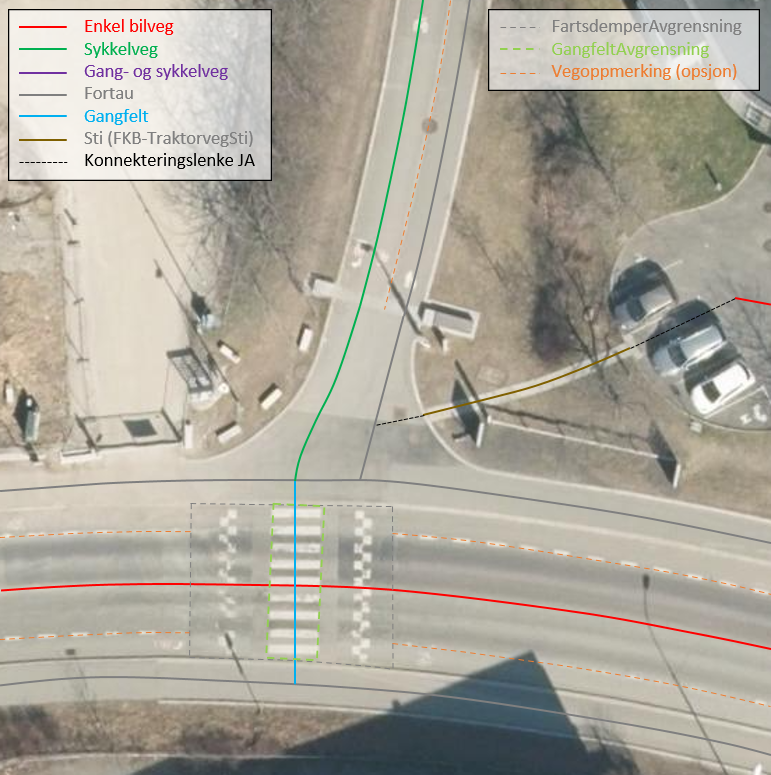
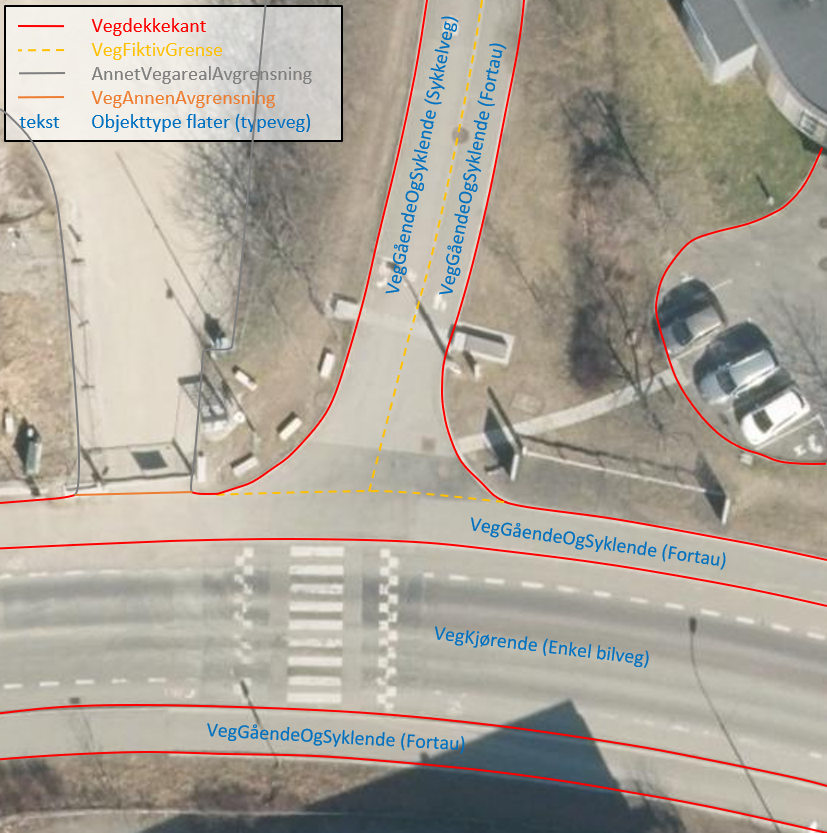
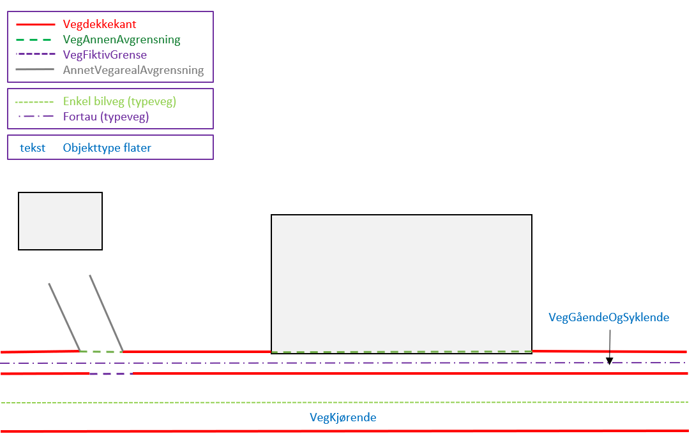
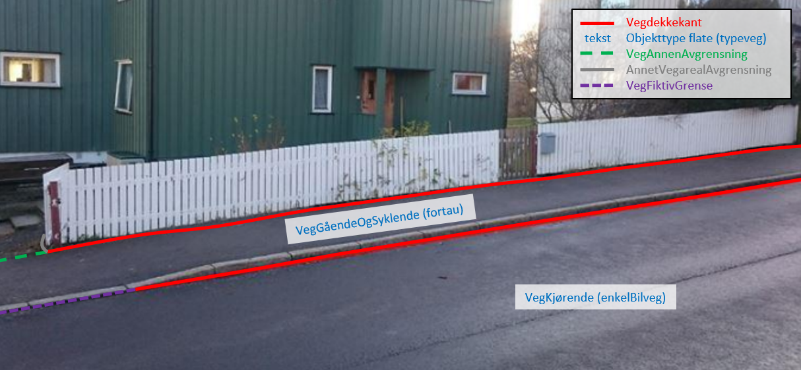
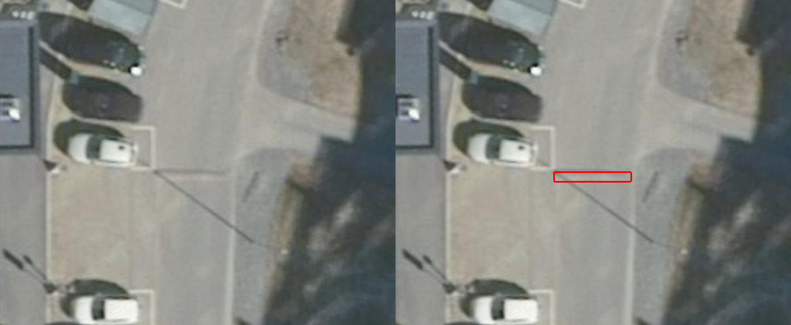

= Vedlegg til FKB Fotogrammetriske registreringsinstrukser - versjon 5.0
:sectnums:
:toc: left
:toc-title: Innholdsfortegnelse
:toclevels: 3
:figure-caption: Figur
:table-caption: Tabell
:doctype: article
:encoding: utf-8
:lang: nb
:URLrot: https://sosi.geonorge.no/registreringsinstrukser
:fkb: http://sosi.geonorge.no/Standarder/FKB_generell_del
:publisert: Oppdatert 2022-06-09

CAUTION: {publisert} 

== Vedlegg til FKB Fotogrammetriske registreringsinstrukser - versjon 5.0

=== Innledning

FKB Fotogrammetriske registreringsinstrukser - versjon 5.0 - ble tilgjengeliggjort i januar 2022 og lagt til grunn for FKB kartleggingsprosjekter gjennom Geovekst med datafangst i 2022. Disse dokumentene er grunnlaget for inngåtte avtaler og det er derfor lite hensiktsmessig å endre de fotogrammetriske registreringsinstruksene underveis i et pågående kartleggingsprosjekt.

I løpet av våren 2022 er det gjennomført et FKB 5.0 testprosjekt der kartleggingsfirmaene i Norge har levert inn data basert på de nye spesifikasjonene for et lite område. Basert på erfaringene fra dette prosjektet er det behov for å presisere tolkning/håndtering av de FKB 5.0 registreringsinstruksene på en del områder. Dette dokumentet samler disse presiseringene for hvert datasett og bør derfor leses sammen med de fotogrammetriske registreringsinstruksene ved gjennomføring av FKB kartleggingsprosjekter 2022.

Det vil være naturlig at justeringene/presiseringene som er beskrevet i dette dokumenten innarbeides i reviderte FKB registreringsinstrukser som vil bli benyttet i neste kartleggingssesong.

Linker:

* FKB 5.0 generell del: {fkb}
* Geovekst produktspesifikasjoner og registreringsinstrukser: https://kartverket.no/geodataarbeid/geovekst/fkb-produktspesifikasjoner

== FKB Fotogrammetriske registreringsinstrukser

=== Generelle presiseringer

==== Bruk av datafangstdato 
I følge http://sosi.geonorge.no/Standarder/FKB_generell_del/#truedatafangstdato[definisjonen av datafangstdato] skal dette være datoen for når flybildene som ligger til grunn for kartkonstruksjonen ble tatt (flyfotodato). I en del kartleggingsprosjekter kan imidlertid bildene være tatt på ulike datoer og det kan da være ønskelig at alle data i prosjektet likevel får samme dato. Dersom man ønsker å gjøre det på denne måten skal dette avklares i det enkelte prosjekt. 

==== Kompaktifisering av gruppeegenskaper i SOSI-formatet
I FKB 5.0 skal ingen datatyper/gruppeegenskaper kompaktifiseres i SOSI-formatet. Dette gjelder også egenskapen ..KVALITET

==== Egenskaper knyttet til geometrien på flater med heleid geometri
For objekttyper som er modellert med heleid flategeometri (finnes i Arealbruk, BygnAnlegg og Naturinfo) må egenskaper knyttet til geometrien som datafangstdato og kvalitet representere hele flateobjektet. Man har ikke som tidligere muligheten av å splitte avgrensningen og sette ulik kvalitet/dato på ulike deler av avgrensningen. 

Dersom deler av (avgrensningen til) en flate har redusert kvalitet bør dette gjenspeiles på flatas kvalitetskoding. Ved ajourføring av en flate settes ny datafangstdato på flateobjektet. 

:ds: Elveg
:spek: {URLrot}/{ds}/2.0/Fotogrammetrisk_2022-01-01/.
=== {ds}

Fotogrammetrisk registreringsinstruks for {ds} 2.0 er tilgjengelig på {spek}

==== Registrering av veglenker for gående/syklende
Figur 1-3 i Elveg (lenke?) erstattes med bildene under. Det presiseres at lenker under 2 m ikke skal registreres i Elveg. I eksemplene under vises de mest typiske situasjonene der Gangfelt nå forlenges utover egen utsrekning og mot nærmeste veglenke.

.Eksempel på riktig registrering av typeveg Gangfelt sammen med andre veglenker
image::figurer/Veglenker1.jpg[alt="Bilde av veglenker"]
.Eksempel på riktig registrering av typeveg Gangfelt sammen med andre veglenker
image::figurer/Veglenker2.jpg[alt="Bilde av veglenker"]
.Eksempel på riktig registrering av typeveg Gangfelt sammen med andre veglenker
image::figurer/Veglenker3.jpg[alt="Bilde av veglenker"]

Figur 16 i FKB-Veg (lenke?) erstattes med bildet under. Det presiseres at ved parallelle lenker forlenges hver lenke (her sykkelveg og fortau) mot nærmest tilstøtende veglenke (her fortau).

.Eksempel på riktig registrering av parallelle veglenker med forskjellig typeveg

Se <<Oppdeling av VegGåendeOgSyklende-flater med forskjellig typeveg>> for inndeling i flater i FKB-Veg i det samme området.

:ds: FKB-BygnAnlegg
:spek: {URLrot}/{ds}/5.0/Fotogrammetrisk_2022-01-01/.
=== {ds}

Fotogrammetrisk registreringsinstruks for {ds} 5.0 er tilgjengelig på {spek}

==== Avfallsbeholder 
Det presiseres at mobile avfallsbeholdere/søppelkasser ikke skal registreres. Objekttypen er opsjonell og dersom det bestilles datafangst av avfallsbeholdere anbefales det at det avtales nærmere rammer for dette i det enkelte prosjekt. 

==== Tank 
I figur 19 i FKB-BygnAnlegg (lenke?) presiseres det at flere tanker som står inntil hverandre skal de registreres som et sammenhengende polygon (så fremt de totalt utgjør 6m2 totalareal). 
Denne regelen er laget for å fange opp datafangst av mange små tanker (der hver tank er mindre enn 6m2) som står inntil hverandre. 

Det presiseres at hovedregelen er at tanker om mulig registreres som separate objekter pr. tank, selv om de står inntil andre tanker. 

:ds: FKB-Bygning
:spek: {URLrot}/{ds}/5.0/Fotogrammetrisk_2022-01-01/.
=== {ds}

Fotogrammetrisk registreringsinstruks for {ds} 5.0 er tilgjengelig på {spek}

==== Bygningsdelelinje 
I definisjon av Bygningsdelelinje står det at "usikkerhet i fastleggelsen av bygningsdelelinjen skal synliggjøres gjennom kvalitetskoding (f.eks posisjonskvalitet 81 50)". Imidlertid er ikke stedfestingskvalitet en lovlig egenskap på Bygningsdelelije i FKB-Bygning 5.0. Det presiseres derfor at setningen om kvalitet under definisjon sees bort fra og at Kvalitet ikke skal legges på Byggningsdelelinje fra FKB 5.0. 

:ds: FKB-Veg
:spek: {URLrot}/{ds}/5.0/Fotogrammetrisk_2022-01-01/.
=== {ds}

Fotogrammetrisk registreringsinstruks for {ds} 5.0 er tilgjengelig på {spek}

==== Oppdeling av VegGåendeOgSyklende-flater med forskjellig typeveg
Figur 15 i FKB-Veg (lenke?) erstattes med bildet under.Det presiseres at flate VegGåendeOgSyklende skal deles der det er foskjellig bruk av vegen. Både når de er skilt med kantstein/nivå og når de kun er skilt med oppmerking. Klassifisering av typeveg i Elveg er styrende for tolkningen. For typeveg-inndeling, se kap.2.2.1 i dette dokumentet.

.Eksempel på riktig registrering av VegGåendeOgSyklende med forskjellig typeveg.

Se <<Registrering av veglenker for gående/syklende>> for registrering av veglenker i det samme området.

==== VegFiktivGrense
Det presiseres at VegFiktivGrense også skal brukes i avgrensning mellom VegKjørende og VegGåendeOgSyklende (typeveg fortau) mot avkjørsler.

.Eksempel på riktig registrering av VegFiktivGrense og VegAnnenAvgrensning i forbindelse med avkjørsel over fortau
image::figurer/vegfiktivgrense.png[alt="Bilde av vegfiktivgrense"]

Figur 10 i FKB-Veg (lenke?) erstattes med bildet under.

.Eksempel på registrering av VegFiktivGrense ved avkjørsel over fortau og VegAnnenAvgrensning ved fortau mot bygning

Figur 32 i FKB-Veg (lenke?) erstattes med bildet under.

.Eksempel på registrering av VegFiktivGrense ved avkjørsel over fortau

==== OverkjørbartArealAvgrensning
Figur 54 i FKB-Veg utgår! Det presiseres at helt overkjøbart areal (i samme plan som vegbanen, men avgrenset med oppmerking eller annen type dekke) ikke skal registreres som overkjørbart areal. 

.Eksempel på helt overkjørbart areal som ikke skal registreres med OverkjørbartArealAvgrensning. Dette gjelder også helt overkjørbare rundkjøringer
image::figurer/ovekjorbartareal.png[alt="Bilde av overkjørbartareal"]

==== Fartsdempere 
Det presiseres at avgrensning til alle typer fartsdempere skal registreres så lenge de er synlige i bildene.

.Eksempel på fartsdempere av "smal type" som skal registreres

