= Vedlegg til FKB Fotogrammetriske registreringsinstrukser - versjon 5.0
:sectnums:
:toc: left
:toc-title: Innholdsfortegnelse
:toclevels: 3
:figure-caption: Figur
:table-caption: Tabell
:section-refsig: kapittel
:doctype: article
:encoding: utf-8
:lang: nb
:URLrot: https://sosi.geonorge.no/registreringsinstrukser
:fkb: http://sosi.geonorge.no/Standarder/FKB_generell_del
:publisert: Oppdatert 2022-07-01

CAUTION: {publisert} 

== Vedlegg til FKB Fotogrammetriske registreringsinstrukser - versjon 5.0

=== Innledning

FKB Fotogrammetriske registreringsinstrukser - versjon 5.0 - ble tilgjengeliggjort i januar 2022 og lagt til grunn for FKB kartleggingsprosjekter gjennom Geovekst med datafangst i 2022. Disse dokumentene er grunnlaget for inngåtte avtaler og det er derfor lite hensiktsmessig å endre de fotogrammetriske registreringsinstruksene underveis i et pågående kartleggingsprosjekt.

I løpet av våren 2022 er det gjennomført et FKB 5.0 testprosjekt der kartleggingsfirmaene i Norge har levert inn data basert på de nye spesifikasjonene for et lite område. Basert på erfaringene fra dette prosjektet er det behov for å presisere tolkning/håndtering av de FKB 5.0 registreringsinstruksene på en del områder. Dette dokumentet samler disse presiseringene for hvert datasett og bør derfor leses sammen med de fotogrammetriske registreringsinstruksene ved gjennomføring av FKB kartleggingsprosjekter 2022.

Det vil være naturlig at justeringene/presiseringene som er beskrevet i dette dokumenten innarbeides i reviderte FKB registreringsinstrukser som vil bli benyttet i neste kartleggingssesong.

Linker:

* FKB 5.0 generell del: {fkb}
* Geovekst produktspesifikasjoner og registreringsinstrukser: https://kartverket.no/geodataarbeid/geovekst/fkb-produktspesifikasjoner

=== Endringslogg

Tabellen under viser en oversikt over når vedlegget har blitt endret. 

:xrefstyle: short

[cols="1,4"]
|===
|Dato|Endringer

| 2022-03-17
| Første versjon av vedlegg

| 2022-07-01
| Oppdatert med et bildeeksempel på registrering av kanalisert veg (<<veglenkerKjørende>>) og to bildeeksempler på registrering av gangveg og gangfelt (<<veglenkerGåSykkel>>).

| 2022-10-11
a| Justering av kapittel rekkefølgen under <<fkbreginstruks>>.
Lagt inn to presiseringer knyttet til registreringsinstruksen for FKB-Ledning (<<FKBLedning>>)

| 2022-10-14
a| Lagt inn nytt generelt kapitel om registrering av veglenker og nettverkstopologi (<<veglenkerGåSykkel>>).
Lagt inn tre nye kapiteler under Elveg om registrering av både korte og lengre veglenker for gående og syklende (<<kortForbindelseGåSykkel>> - <<sykkelfelt>>).

|===

:xrefstyle: basic

[[fkbreginstruks]]
== FKB Fotogrammetriske registreringsinstrukser

[[generellePresiseringer]]
=== Generelle presiseringer

==== Bruk av datafangstdato 
I følge http://sosi.geonorge.no/Standarder/FKB_generell_del/#truedatafangstdato[definisjonen av datafangstdato] skal dette være datoen for når flybildene som ligger til grunn for kartkonstruksjonen ble tatt (flyfotodato). I en del kartleggingsprosjekter kan imidlertid bildene være tatt på ulike datoer og det kan da være ønskelig at alle data i prosjektet likevel får samme dato. Dersom man ønsker å gjøre det på denne måten skal dette avklares i det enkelte prosjekt. 

==== Kompaktifisering av gruppeegenskaper i SOSI-formatet
I FKB 5.0 skal ingen datatyper/gruppeegenskaper kompaktifiseres i SOSI-formatet. Dette gjelder også egenskapen ..KVALITET

==== Egenskaper knyttet til geometrien på flater med heleid geometri
For objekttyper som er modellert med heleid flategeometri (finnes i Arealbruk, BygnAnlegg og Naturinfo) må egenskaper knyttet til geometrien som datafangstdato og kvalitet representere hele flateobjektet. Man har ikke som tidligere muligheten av å splitte avgrensningen og sette ulik kvalitet/dato på ulike deler av avgrensningen. 

Dersom deler av (avgrensningen til) en flate har redusert kvalitet bør dette gjenspeiles på flatas kvalitetskoding. Ved ajourføring av en flate settes ny datafangstdato på flateobjektet.

:ds: FKB-BygnAnlegg
:spek: {URLrot}/{ds}/5.0/Fotogrammetrisk_2022-01-01/.
[[FKBBygnAnlegg]]
=== {ds}

Fotogrammetrisk registreringsinstruks for {ds} 5.0 er tilgjengelig på {spek}

==== Avfallsbeholder 
Det presiseres at mobile avfallsbeholdere/søppelkasser ikke skal registreres. Objekttypen er opsjonell og dersom det bestilles datafangst av avfallsbeholdere anbefales det at det avtales nærmere rammer for dette i det enkelte prosjekt. 

==== Tank 
I figur 19 i https://sosi.geonorge.no/registreringsinstrukser/FKB-BygnAnlegg/5.0/Fotogrammetrisk_2022-01-01/#tank[FKB-BygnAnlegg] presiseres det at flere tanker som står inntil hverandre skal de registreres som et sammenhengende polygon (så fremt de totalt utgjør 6m2 totalareal). 
Denne regelen er laget for å fange opp datafangst av mange små tanker (der hver tank er mindre enn 6m2) som står inntil hverandre. 

Det presiseres at hovedregelen er at tanker om mulig registreres som separate objekter pr. tank, selv om de står inntil andre tanker. 

:ds: FKB-Bygning
:spek: {URLrot}/{ds}/5.0/Fotogrammetrisk_2022-01-01/.
[[FKBBygning]]
=== {ds}

Fotogrammetrisk registreringsinstruks for {ds} 5.0 er tilgjengelig på {spek}

==== Bygningsdelelinje 
I definisjon av https://sosi.geonorge.no/registreringsinstrukser/FKB-Bygning/5.0/Fotogrammetrisk_2022-01-01/#bygningsdelelinje[Bygningsdelelinje] står det at "usikkerhet i fastleggelsen av bygningsdelelinjen skal synliggjøres gjennom kvalitetskoding (f.eks posisjonskvalitet 81 50)". Imidlertid er ikke stedfestingskvalitet en lovlig egenskap på Bygningsdelelije i FKB-Bygning 5.0. Det presiseres derfor at setningen om kvalitet under definisjon sees bort fra og at Kvalitet ikke skal legges på Byggningsdelelinje fra FKB 5.0. 

:ds: FKB-Ledning
:spek: {URLrot}/{ds}/5.0/Fotogrammetrisk_2022-01-01/.
[[FKBLedning]]
=== {ds}

Fotogrammetrisk registreringsinstruks for {ds} 5.0 er tilgjengelig på {spek}

==== Registrering av linjebredde og vertikalAvstand
Når egenskapene _linjebredde_ og _vertikalAvstand_ skal registreres kan fremstå noe uklart i endringsloggen.

I FKB er følgende påkrevd å registrere fotogrammetrisk:

* _linjebredde_ der hvor avstanden mellom ytterfasene er >10 meter i grunnriss
* _vertikalAvstand_ der hvor en mast har vertikal avstand > 15 meter

Disse egenskapene skal registreres uavhengig av hverandre. Hvis for eksempel avstand mellom ytterfasene er > 10 meter og vertikal avstand på mast er < 15 meter, er det ikke påkrevd å registrere _vertikalAvstand_. Tilsvarende hvis vertikal avstand på mast er > 15 meter og linjebredde < 10 meter,  er det ingen krav om å registrere _linjebredde_. 

==== Trase, lavspent og ekom

Der hvor opsjonen for konstruksjon av lavspent og ekom er utløst skal disse traseene konstrueres helt frem til abonnent, typisk husvegg. For traseer som stopper i en bygning eller i en annen større konstruksjon skal det *ikke* konstrueres mast i dette trase endepunktet.

:ds: FKB-Veg
:spek: {URLrot}/{ds}/5.0/Fotogrammetrisk_2022-01-01/.
[[FKBveg]]
=== {ds}

Fotogrammetrisk registreringsinstruks for {ds} 5.0 er tilgjengelig på {spek}

==== Oppdeling av VegGåendeOgSyklende-flater med forskjellig typeveg
Figur 15 i https://sosi.geonorge.no/registreringsinstrukser/FKB-Veg/5.0/Fotogrammetrisk_2022-01-01/#veggåendeogsyklende[FKB-Veg] erstattes med bildet under.Det presiseres at flate VegGåendeOgSyklende skal deles der det er foskjellig bruk av vegen. Både når de er skilt med kantstein/nivå og når de kun er skilt med oppmerking. Klassifisering av typeveg i Elveg er styrende for tolkningen. For typeveg-inndeling, se kap.2.2.1 i dette dokumentet.

.Eksempel på registrering av sykkelveg og gangveg uten fysisk skille mellom seg (kun oppmerking).
image::figurer/vegflater.png[alt="Bilde av vegflater"]

Se <<Registrering av veglenker for gående/syklende>> for registrering av veglenker i det samme området.

==== VegFiktivGrense
Det presiseres at VegFiktivGrense også skal brukes i avgrensning mellom VegKjørende og VegGåendeOgSyklende (typeveg fortau) mot avkjørsler.

.Eksempel på riktig registrering av VegFiktivGrense og VegAnnenAvgrensning i forbindelse med avkjørsel over fortau
image::figurer/vegfiktivgrense.png[alt="Bilde av vegfiktivgrense"]

Figur 10 i https://sosi.geonorge.no/registreringsinstrukser/FKB-Veg/5.0/Fotogrammetrisk_2022-01-01/#veggåendeogsyklende[FKB-Veg] erstattes med bildet under.

.Eksempel på registrering av fortau som går mot bygning/husvegg. Egenskap Typeveg tilhører Elveg.
image::figurer/veggaendeogsyklende.png[alt="Bilde av veggaendeogsyklende"]

Figur 32 i https://sosi.geonorge.no/registreringsinstrukser/FKB-Veg/5.0/Fotogrammetrisk_2022-01-01/#vegdekkekant[FKB-Veg] erstattes med bildet under.

.Eksempel på registrering av fortauskanter med Vegdekkekant
image::figurer/fortauskant.png[alt="Bilde av fortauskant"]

==== OverkjørbartArealAvgrensning
Figur 54 i FKB-Veg utgår! Det presiseres at helt overkjøbart areal (i samme plan som vegbanen, men avgrenset med oppmerking eller annen type dekke) ikke skal registreres som overkjørbart areal. 

.Eksempel på helt overkjørbart areal som ikke skal registreres med OverkjørbartArealAvgrensning. Dette gjelder også helt overkjørbare rundkjøringer
image::figurer/ovekjorbartareal.png[alt="Bilde av overkjørbartareal"]

==== Fartsdempere 
Det presiseres at avgrensning til alle typer fartsdempere skal registreres så lenge de er synlige i bildene.

.Eksempel på fartsdempere av "smal type" som skal registreres
image::figurer/fartsdemperavgrensning.png[alt="Bilde av fartsdemperavgrensning"]

:ds: Elveg
:spek: {URLrot}/{ds}/2.0/Fotogrammetrisk_2022-01-01/.
[[Elveg]]
=== {ds}

Fotogrammetrisk registreringsinstruks for {ds} 2.0 er tilgjengelig på {spek}

Det presiseres at veglenker under 2 meter ikke skal registreres i Elveg.

[[veglenkerGåSykkel]]
==== Generelt angående registrering av veglenker og nettverkstopolpogi
Målet er et sammenhengende nettverk for både gående og kjørende. Noen ganger er det også naturlig og nødvendig å binde veglenker for gående og syklende sammen mot veglenker for kjørende. Av og til må vi også akseptere løse ender i nettverket der det er fysisk "umulig" eller ulogisk (se eksempel i figur 8 i Registreringsinstruks: Fotogrammetrisk Elveg) å ta seg videre, enten som gående eller kjørende.

På de leveranser som er kommet inn til mottakskontroll i høst ser vi at det er en del hull i nettverket, spesielt mellom nye veglenker eller mellom nye veglenker og eksisterende veglenker for gående.
Registreringsinstruksen beskriver dessverre langt ifra alle disse situasjonene og følgende eksempler (til oppdatert vedlegg) prøver å presisere hva som skal gjøres ved enkelte situasjoner som vi har oppdaget i kontrollen til nå.

Ved nyregistrertefootnote:[Geometriforbedring eller nyregistrering grunnet «ulovlig» datafangstmetode (se kravspesifikasjon) inngår i nyregistrerte.] veglenker skal også tilhørende avgrensingslinjer og flater (hvis dette fremkommer gjennom teknisk kravspesifikasjon – for eksempel med en bestilt oppgradering av flater på fortau og gangveg) konsekvensrettes i FKB-Veg. Dette utføres etter beste evne ved hjelp av eksisterende data eller naturlige avgrensninger/kontraster i bildene for å finne passende avgrensnings- og lukkelinjer for flatene.

[[veglenkerGåSykkel]]
==== Registrering av veglenker for gående/syklende
Figur 1-3 i https://sosi.geonorge.no/registreringsinstrukser/Elveg/2.0/Fotogrammetrisk_2022-01-01/#trueeksempler-p%C3%A5-p%C3%A5-registrering-av-veglenke-med-forskjellig-typeveg[Elveg] erstattes med bildene under. I eksemplene vises de mest typiske situasjonene der veglenker under 2 meter (i forbindelse med Gangfelt) nå forlenges utover egen utstrekning og konnekteres mot nærmeste veglenke.

.Figuren viser eksempel på registrering av flere ulike typer veg. Rundkjøring registreres i senter av sirkulasjonsarealet uavhengig av antall kjørefelt.
image::figurer/Veglenker1.jpg[alt="Bilde av veglenker"]
.Figuren viser registrering av flere ulike typer veg i et fullkanalisert T-kryss med svingefelt. I de aller fleste tilfeller vil topologien i slike kryss være etablert og skal da ikke endres ved fotogrammetrisk registrering. Fotogrammetrisk registrering vil i hovedsak gå ut på forbedring av geometri der kriteriene for dette er tilstede.
image::figurer/Veglenker3.jpg[alt="Bilde av veglenker"]
.Figuren viser registrering av flere ulike typer veg
image::figurer/Veglenker2.jpg[alt="Bilde av veglenker"]

Figur 16 i https://sosi.geonorge.no/registreringsinstrukser/FKB-Veg/5.0/Fotogrammetrisk_2022-01-01/#veggåendeogsyklende[FKB-Veg] erstattes med bildet under. Det presiseres at ved parallelle lenker forlenges hver lenke (her sykkelveg og fortau) mot nærmest tilstøtende veglenke (her fortau).

.Eksemplet viser hvordan veglenkene i Elveg skal henge sammen.
image::figurer/veglenker.png[alt="Bilde av veglenker"]

Se <<Oppdeling av VegGåendeOgSyklende-flater med forskjellig typeveg>> for inndeling i flater i FKB-Veg i det samme området.

Under vises et eksempel på registrering av en utydelig typeveg mellom fortau (fra sør) og gangfelt (til venstre) – markert med rødt i figuren).
Disse typevegene er meget vanskelige å skille på ved registrering, derfor skal typeveg kodes som gangveg ved fotogrammetrisk nyregistrering og ev. justeres administrativt.

.Eksemplet viser registrering av typeveg gangveg.
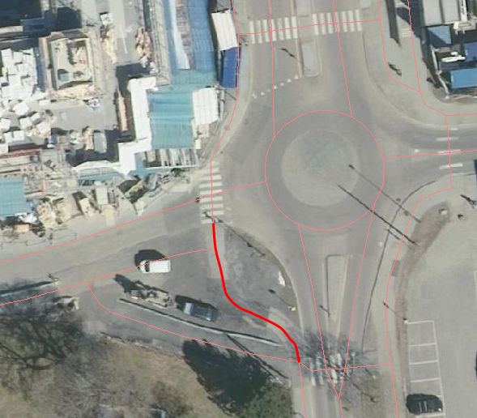

Under vises et eksempel på registrering på registrering av veglenke mellom to gangfelt (markert i rødt i figuren). Hvis lengde er under minstemål for registrering av veglenker (2m) registreres gangfeltet sammenhengende. Hvis lengde er over minstemål registreres veglenken mellom gangfeltene som gangveg fotogrammetrisk og justeres ev. administrativt.
Ved eksisterende veglenke (gang- og sykkelveg) over gangfelt kan veglenke splittes opp og gis ny typeveg og endret type E, hvis eksiterende veglenke oppfyller kravene for nøyaktighet.

.Eksemplet viser registrering av veglenke mellom to typeveg gangfelt.
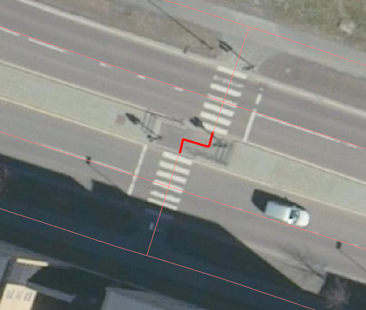

[[kortForbindelseGåSykkel]]
==== Korte (>2m), naturlige forbindelser for gående og syklende
Normalt skal type veg klassifiseres ut fra fysisk utforming for strekningen veglenkenrepresenterer. Ferdselsområder for gående og syklende hvor type veg er vanskelig å bestemme fotogrammetrisk, men som er nødvendig for et topologisk sammenhengende nettverk, registreres med type veg gangveg. Eventuelle synlige kontraster/detaljer i bildet legges til grunn ved registreringen.

Disse veglenkene skal registreres fotogrammetrisk (ikke konnekteringslenke).

.Et eksempel på kortere veglenke (>2m) som danner topologi mellom gangfelt og gang- og sykkelveg, på begge sider om bilvegen.
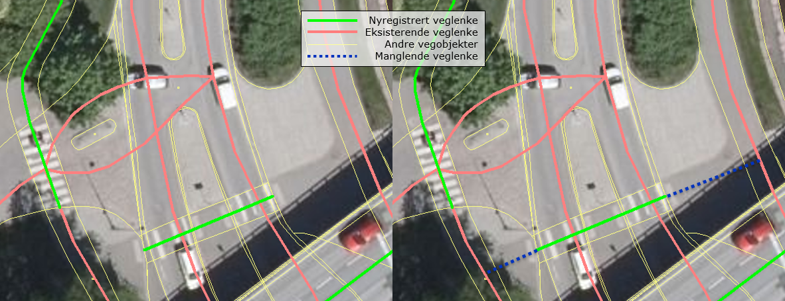

.Et eksempel på kortere veglenke (>2m) som danner topologi mellom to gang- og sykkelveger.
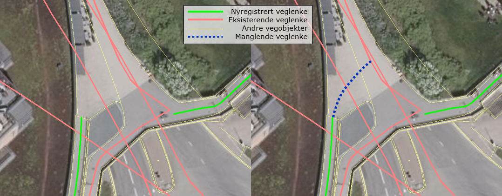

Manglende «nettverk» ved trapper

.Når avstanden er kortere enn 2m skal trapp forlenges mot nærmeste veglenke. Når avstanden er over 2m skal egen veglenke registreres, fortrinnsvis med typeveg gangveg mellom trapper og/eller mot tilgrensende veglenker for gående (se bildeeksempel til høyre).
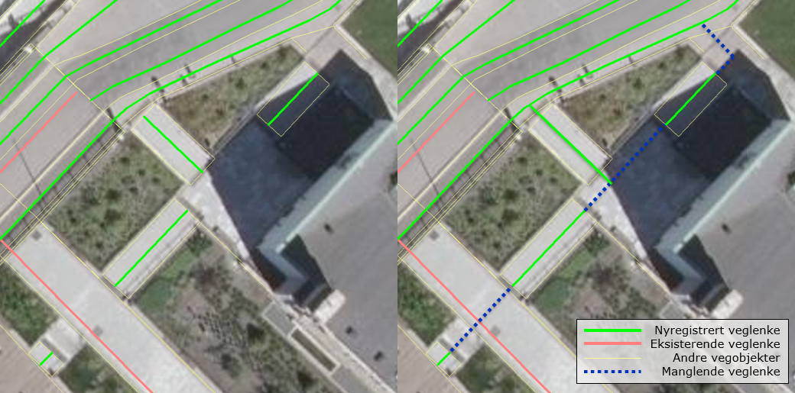

[[langForbindelseGåSykkel]]
==== Lengre, naturlige forbindelser for gående og syklende
Normalt skal type veg klassifiseres ut fra fysisk utforming for strekningen veglenkenrepresenterer. Ferdselsområder for gående og syklende hvor type veg er vanskelig å bestemme fotogrammetrisk, men som er nødvendig for et topologisk sammenhengende nettverk, kan registreres etter manus fra oppdragsgiver. Dersom ikke annet er oppgitt i manuset, registreres veglenke med type veg gangveg.Dersom manuset beskriver etablering av nytt nettverk der trapper, gangfelt eller andre type veg inngår, registreres disse med riktig type veg.

Disse veglenkene kan registreres fotogrammetrisk etter manus (ikke konnekteringslenke).

.Eksempelet viser en veglenke som kan registreres (med typeveg gangveg) etter manus. Denne skal knyttes sammen mot fortau i nord og mot fortau (manglende veglenke for trapp og veglenke videre fra trapp mot fortau vises også i blått i bildet) i sørøst.
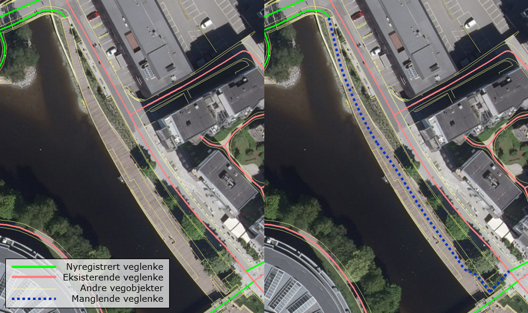

.Eksempelet viser en veglenke som kan registreres (med typeveg fortau) etter manus. Denne skal knyttes sammen mot bilveg i nordvest og mot fortau i sørøst.
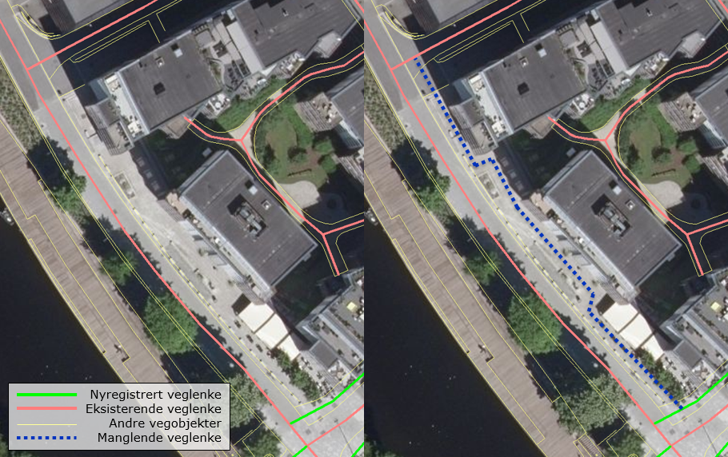

Veglenkene i eksemplene under bør kunne registreres fotogrammetrisk uten manus (ikke konnekteringslenke). De har enten tydelige eksisterende avgrensningslinjer og/eller nærliggende nyregistrerte veglenker (med løse ender) som det er naturlig å knytte disse til.

.Eksempelet viser en veglenke som går over en litt lengre strekning men som samtidig har tydelige avgrensingslinjer (kaibryggekant/bru). Derfor skal denne typen veglenker registreres fotogrammetrisk. Veglenke skal registreres med typeveg gangveg som knyttes sammen med gangveg i øst (manglende veglenke for trapp og videre mot gangveg, vises også i blått i bildet) og i vest.
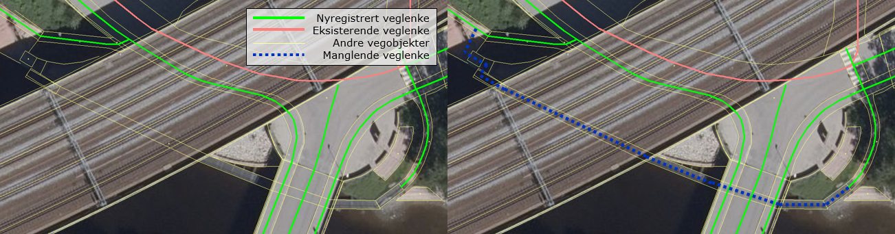

.Eksempelet viser en veglenke som går over en litt lengre strekning men som samtidig har nyregistrerte veglenker i begge ender (med typeveg fortau). Derfor skal denne typen veglenker registreres fotogrammetrisk. Veglenke skal registreres med typeveg fortau som knyttes sammen med nyregistrerte fortau i både nordøst og sørvest. Eksempelet viser også en manglende veglenke fra gangfelt til eksisterende gang- og sykkelveg, som kan beskrives som en kortere veglenke som skal registreres fotogrammetrisk (se kap.2.6.3).
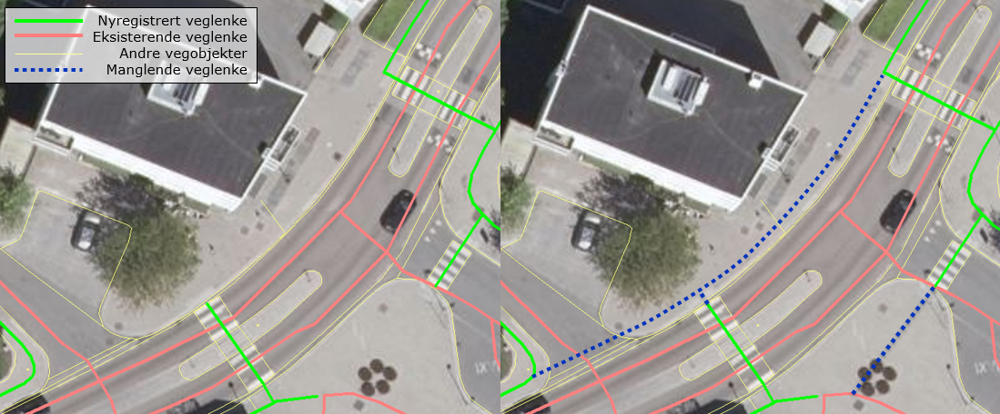

[[sykkelfelt]]
==== Sykkelfelt i vegbanen
Sykkelfelt med langsgående oppmerking er egne kjørefelt i kjørebanen og skal ikke ha egne veglenker i nettverket.

.Pilen i bildet viser innsynsretning for bildeeksempelet under.
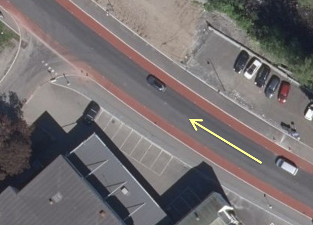

.Eksempel på registrering av sykkelfelt i vegbanen. Sykkelfelt har ingen egen veglenke i FKB 5.0. Den inngår i vegflaten og avgrensningen av sykkelfeltet registreres med objekttypen vegoppmerking (opsjon). For beskrivelse av objekttyper og typeveg, se bilde.
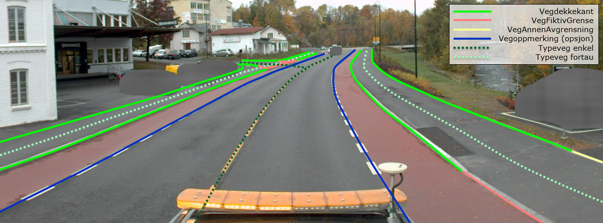

[[veglenkerKjørende]]
==== Registrering av veglenker for kjørende
Under vises et eksempel på registrering av et svingefelt (høyresvingefelt – markert med rødt i figuren). Svingefelt skal registreres med typeveg kanalisert veg. Ellers gjelder teksten fra figur 2 i produktspesifikasjonen for Elveg: "I de aller fleste tilfeller vil topologien i slike kryss være etablert og skal da ikke endres ved fotogrammetrisk registrering. Fotogrammetrisk registrering vil i hovedsak gå ut på forbedring av geometri der kriteriene for dette er til stede".

.Eksemplet viser registrering av veglenke med typeveg kanalisert veg for svingefelt.
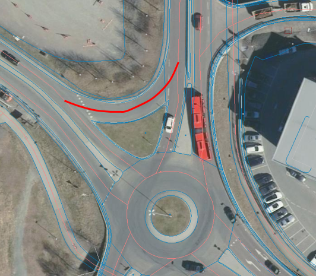

