= Vedlegg til FKB Fotogrammetriske registreringsinstrukser - versjon 5.0
:sectnums:
:toc: left
:toc-title: Innholdsfortegnelse
:toclevels: 3
:figure-caption: Figur
:table-caption: Tabell
:section-refsig: kapittel
:doctype: article
:encoding: utf-8
:lang: nb
:URLrot: https://sosi.geonorge.no/registreringsinstrukser
:fkb: http://sosi.geonorge.no/Standarder/FKB_generell_del
:publisert: Oppdatert 2023-04-17

CAUTION: {publisert} 

== Vedlegg til FKB Fotogrammetriske registreringsinstrukser - versjon 5.0

=== Innledning

FKB Fotogrammetriske registreringsinstrukser - versjon 5.0 2022-01-01 - ble tilgjengeliggjort i januar 2022 og lagt til grunn for FKB kartleggingsprosjekter gjennom Geovekst med datafangst i 2022. Flere av registreringsinstruksene er også oppdatert med en versjon 5.0 2023-01-01. Det er siste versjon av disse dokumentene som er grunnlaget for inngåtte avtaler i kartleggingsprosjektene for 2023. Se http://sosi.geonorge.no/Standarder/FKB_generell_del/#truefkb-datasett[FKB generell del, tabell 1] for en oversikt over siste/gjeldende versjoner av FKB produktspesifikasjoner og fotogrammetriske registreringsinstrukser.

Erfaringene fra prosjektene i 2022-sesongen tilsier at det behov for å presisere tolkning/håndtering av FKB 5.0 registreringsinstruksene på en del områder. Dette dokumentet samler disse presiseringene for hvert datasett og bør derfor leses sammen med de fotogrammetriske registreringsinstruksene ved gjennomføring av FKB kartleggingsprosjekter 2023.

Det presiseres at dette dokumentet kun har som formål å klargjøre/presisere innholdet i FKB registreringsinstruksene og ikke _endre_ innholdet i disse dokumentene på noen måte.

Det vil være naturlig at justeringene/presiseringene som er beskrevet i dette dokumenten innarbeides i reviderte FKB registreringsinstrukser som vil bli benyttet i neste kartleggingssesong.

Linker:

* FKB 5.0 generell del: {fkb}
* Geovekst produktspesifikasjoner og registreringsinstrukser: https://kartverket.no/geodataarbeid/geovekst/fkb-produktspesifikasjoner

=== Endringslogg

Tabellen under viser en oversikt over når vedlegget har blitt endret. 

:xrefstyle: short

[cols="1,4"]
|===
|Dato|Endringer

| 2023-05-01
| Første versjon av vedlegg 2023

|===

[[fkbreginstruks]]
== FKB Fotogrammetriske registreringsinstrukser

[[generellePresiseringer]]
=== Generelle presiseringer

==== Egenskaper på heleid flategeometri

Det presiseres at kapitel 2.1.3 i FKB-BygnAnlegg også gjelder for datasettene FKB-Arealbruk og FKB-Naturinfo. Kapitelet gjengis i sin helhet i boksen under.

****
For objekttyper som er modellert med heleid flategeometri (finnes i Arealbruk, BygnAnlegg og Naturinfo) må egenskaper knyttet til geometrien som datafangstdato og kvalitet representere hele flateobjektet. Man har ikke som tidligere muligheten av å splitte avgrensningen og sette ulik kvalitet/dato på ulike deler av avgrensningen. 

Dersom deler av (avgrensningen til) en flate har redusert kvalitet bør dette gjenspeiles på flatas kvalitetskoding. Ved ajourføring av en flate settes ny datafangstdato på flateobjektet.
****

:ds: FKB-BygnAnlegg
:spek: {URLrot}/{ds}/5.0/Fotogrammetrisk_2023-01-01/.
[[FKBBygnAnlegg]]
=== {ds}

Fotogrammetrisk registreringsinstruks for {ds} 5.0 er tilgjengelig på {spek}

==== Inkonsistens mellom FKB-BygnAnlegg og FKB-Vann 
Det er tillatt med inkonsistens mellom datasettene Vann og BygnAnlegg når KaiBrygge er under minstemål og ikke skal konstrueres, samtidig som det registreres KystkonturTekniskeanlegg rundt omrisset til KaiBrygge.

.Et eksempel på inkonsistens sees i toppen av bildet (rosa linje).
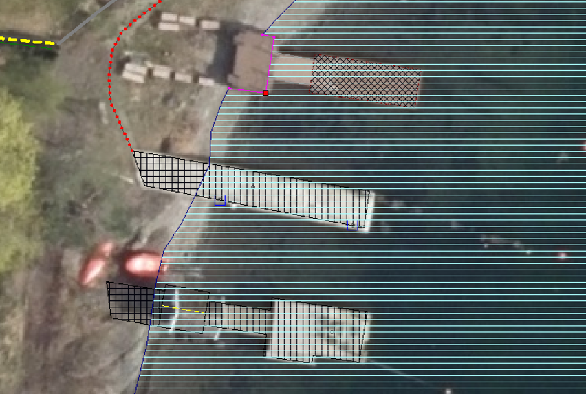

:ds: FKB-Bygning
:spek: {URLrot}/{ds}/5.0/Fotogrammetrisk_2023-01-01/.
[[FKBBygning]]
=== {ds}

Fotogrammetrisk registreringsinstruks for {ds} 5.0 er tilgjengelig på {spek}

==== Registrering av plasthaller (oval/rund bygningsform) 
Registrering av typiske plasthaller med oval/rund bygningsform skal utføres i henhold til bildeeksempelet under.

.Et eksempel på registrering av en plasthall med oval bygningsform. Se bilde for objekttyper.
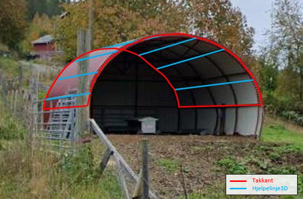

:ds: FKB-Ledning
:spek: {URLrot}/{ds}/5.0/Fotogrammetrisk_2023-01-01/.
[[FKBLedning]]
=== {ds}

Fotogrammetrisk registreringsinstruks for {ds} 5.0 er tilgjengelig på {spek}

==== Presisering av forskjellen mellom Kum og Kumlokk 
Kum er ett lokk eller deksel for hulrom eller annet under bakkenivå og er en opsjon.

Kumlokk er også ett lokk eller deksel men som henger sammen med kabelkanaler. Objektet er kun påkrevd langs bane ved et minstemål på 1,5m i ytre diameter/diagonal.

:ds: FKB-TraktorvegSti
:spek: {URLrot}/{ds}/5.0/Fotogrammetrisk_2023-01-01/.
[[FKBTraktorvegSti]]
=== {ds}

Fotogrammetrisk registreringsinstruks for {ds} 5.0 er tilgjengelig på {spek}

==== Generell presisering om konsekvensretting i FKB-Veg for endringer av veglenker i TraktorvegSti 
Som beskrevet i kap.3.4 i FKB-Veg og kap.3.2 i Elveg gjelder konsekvensretting i FKB-Veg også for endringer av veglenker i TraktorvegSti:

****
Enhver endring av geometri og egenskap typeveg i Elveg eller FKB-TraktorvegSti skal følges opp med konsekvensretting av vegkanter og flater i FKB-Veg. Det er alltid senterlinjegeometri i Elveg og FKB-TraktorvegSti som skal være førende for innhold og koding av vegkanter og vegflater i FKB-Veg, ikke omvendt.
****

==== Nye bildeeksempler for kap.5.1 (Prinsipp for registrering av konnekteringslenke) 
Det er laget noen nye bildeeksempler som viser hvordan konnekteringslenker skal registreres i TraktorvegSti når traktorveg eller sti skal knyttes sammen mot veglenker i Elveg.

Det presiseres at konnekteringslenkene skal registreres over åpne plasser som en naturlig kobling mellom traktorveg/sti og veg. Forløpet skal følge andre samferdselsobjekter. Eventuell usikkerhet i forløpet skal fremgå av kvalitetskodingen.
Konnekteringslenker kan også registreres der eksisterende AnnetVegarealAvgrensning representerer begynnelsen av traktorvegen/stien fra selve vegen.

.Et eksempel på feil (til venstre) og riktig (til høyre) registrering av en konnekteringslenke over åpent areal (avgrenset med AnnetVegarealAvgrensning) for å knytte sammen Typeveg enkel og Typeveg traktorveg. Konnekteringslenken skal følge rutens naturlige forløp og usikkert forløp oppgis gjennom kvalitetskodingen.
image::figurer_2023/Konnekteringslenke1_TrvegSti.png[alt="Bilde av konnekteringslenker"]

.Et eksempel på hvordan en konnekteringslenke knytter sammen Typeveg enkel og Typeveg traktorveg med et naturlig forløp over "åpent areal" sammen med AnnetVegarealAvgrensning.
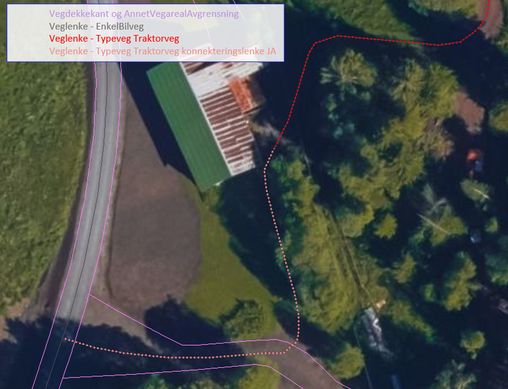

.Et eksempel på hvordan to konnekteringslenker knytter sammen Typeveg enkel og Typeveg traktorveg med et naturlig forløp over åpent areal.
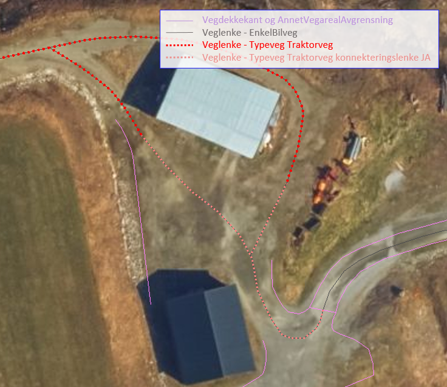

.Et eksempel på hvordan en konnekteringslenke knytter sammen Typeveg enkel og Typeveg traktorveg med et naturlig forløp over åpent areal.
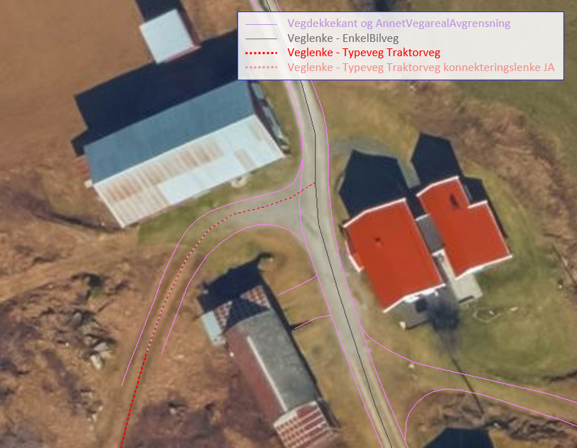

Vi viser også til noen eksempler der det IKKE skal etableres konnekteringslenke. Det er typisk der det ikke er åpne arealer mellom lenkene eller fysiske hindringer (for eksempel grøfter) som gjør ferdsel mellom veglenkene unaturlig eller umulig.

.Tre eksempler der det IKKE skal etableres konnekteringslenker. Til venstre er det ikke naturlig/logisk å ha konnekteringslenke mellom sti til høyre og veg (mer naturlig mellom sti til venstre og veg). I midten er det en veggrøft/skråning mellom sti og veg. Til høyre er det ikke naturlig/logisk med konnekteringslenke grunnet grus/steinhaug mellom traktorveg (under bygging?) og veg. I alle eksemplene mangler vi også åpne plasser eller AnnetVegarealAvgrensning i bildene.
image::figurer_2023/Konnekteringslenke5_TrvegSti.png[alt="Bilde av konnekteringslenker"]

:ds: FKB-Veg
:spek: {URLrot}/{ds}/5.0/Fotogrammetrisk_2023-01-01/.
[[FKBVeg]]
=== {ds}

Fotogrammetrisk registreringsinstruks for {ds} 5.0 er tilgjengelig på {spek}

==== Registrering av Vegbom
Det presiseres at alle synlige vegbommer skal registreres fotogrammetrisk. Vegbommene registreres som om de er lukket/nedfelt, selv om bommen står åpen i bildene.

==== Figurer erstattes av nye figurer
Figur 2 i https://sosi.geonorge.no/registreringsinstrukser/FKB-Veg/5.0/Fotogrammetrisk_2022-01-01/#trueobjekttyper-og-egenskaper[FKB-Veg] erstattes med bildet under. Det har blitt lagt til VegFiktivGrense under rundkjøringen.

.Eksempel på flater og avgrensningslinjer.
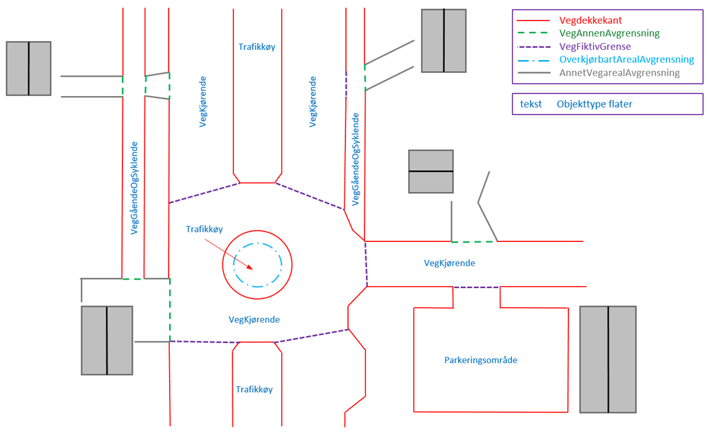

Figur 3 i https://sosi.geonorge.no/registreringsinstrukser/FKB-Veg/5.0/Fotogrammetrisk_2022-01-01/#trueobjekttyper-og-egenskaper[FKB-Veg] erstattes med bildet under. Det har blitt lagt til VegFiktivGrense under rundkjøringen.

.Eksempel på flater og avgrensningslinjer.
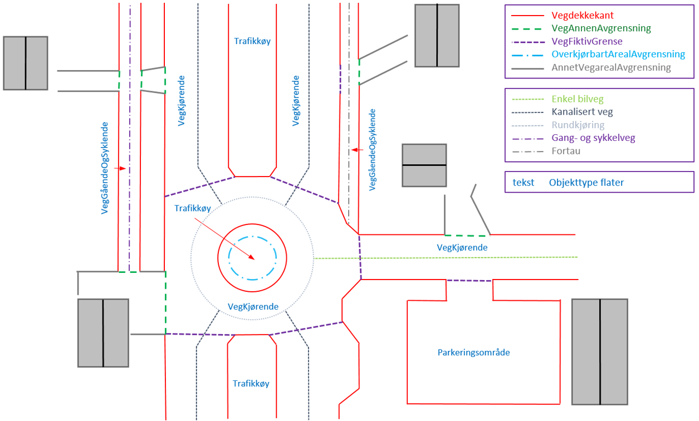

==== Registrering av Kjørebanekant
Ny tekst for kap.3.12 i FKB-Veg "Tilleggsinformasjon for fotogrammetrisk registrering" er:
Dersom Kjørebanekant skal registreres skal denne registreres sammenhengende for alle aktuelle veger.

Kjørebanen er avgrenset av kantlinjene eller sammenfallende med Vegdekkekant eller Vegskulderkant. I ytterkant registreres hvit kantlinje (heltrukken eller stiplet). Dersom det er midtdeler eller trafikkøyer registreres i tillegg gule sperrelinjer som Kjørebanekant.

Dersom både Vegdekkekant, Kjørebanekant og Vegskulderkant skal registreres i et kartleggingsprosjekt, og man i flybildene ikke kan skille objekttypene fra hverandre, skal disse objekttypene ha lik geometri.
Kjørebanekant skal så langt som mulig registreres under bruer og trafikklokk, men ikke i tunneler. Usikker nøyaktighet/synbarhet oppgis gjennom kvalitetskodingen.

.Eksempel på registrering av Kjørebanekant inn mot kryss med rundkjøring. Bildet erstatter figur 54 i FKB-Veg.
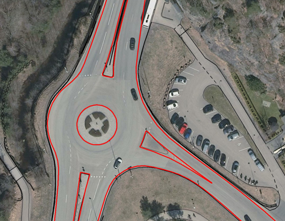

==== Registrering av VegFiktivGrense vs. VegAnnenAvgrensning
Vi minner om riktig bruk av objekttypene VegFiktivGrense (flater på begge sider objektet) og VegAnnenAvgrensning (flate kun på ene siden av objektet) Se mer i https://sosi.geonorge.no/registreringsinstrukser//FKB-Veg/5.0/Fotogrammetrisk_2023-01-01/#vegannenavgrensning[kap. 3.5] og https://sosi.geonorge.no/registreringsinstrukser//FKB-Veg/5.0/Fotogrammetrisk_2023-01-01/#vegfiktivgrense[kap. 3.7] i FKB-Veg og spesielt figur 43 i forbindelse med avkjørsler over fortau.

:ds: Elveg
:spek: {URLrot}/{ds}/2.0/Fotogrammetrisk_2023-01-01/.
[[Elveg]]
=== {ds}

Fotogrammetrisk registreringsinstruks for {ds} 2.0 er tilgjengelig på {spek}

==== Registrering av Typeveg gangveg
Gangveger benyttes typisk i parkområder, på gravplasser og til gangareal (tilknytningsveger for gående) i forbindelse med blokkbebyggelse og offentlige bygg.
Ved enkelte situasjoner, som parker eller gravplasser med mange gangveger i området, streves det kun etter å registrere «hovedvegene» som ruter gående og syklende gjennom parken eller gravplassen. Øvrige gangarealer kan registreres som sti.

I flere tilfeller vil det være lang avstand mellom aktuell gangveg og eksisterende nettverk. Typiske eksempler på dette er over åpne plasser og parkeringsplasser. I slike tilfeller skal det brukes konnekteringslenke ja for å knytte gangvegen sammen med nettverket og det vil derfor ikke være aktuelt for fotogrammetrisk registrering.

Eksisterende veglenker med konnekteringslenke ja skal bare slettes dersom veglenka den skaper forbindelse til også slettes.
Eksisterende veglenker med konnekteringslenke ja skal geometriforbedres dersom tilstøtende veglenker geometriforbedres.

Det presiseres at gangveger som ikke er til felles anvendelse (eksempler kan være inne på områder til barnehager eller eldresenter) eller som blir liggende som løst nettverk ikke skal registreres. Det skal heller ikke registreres gangveger i forbindelse med eneboliger eller på inngjerdet område av privat karakter.

.Eksempel på hvordan "hovegangvegene" kan registreres på en gravplass.
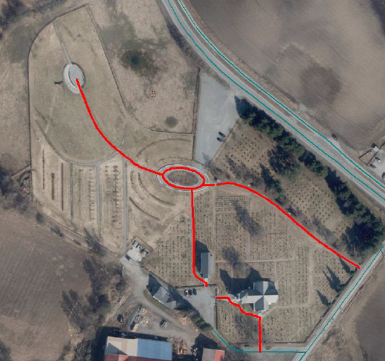

.Eksempel på gangveger som ikke skal registreres, i dette fallet gangareal som er innegjerdet i en barnehage.
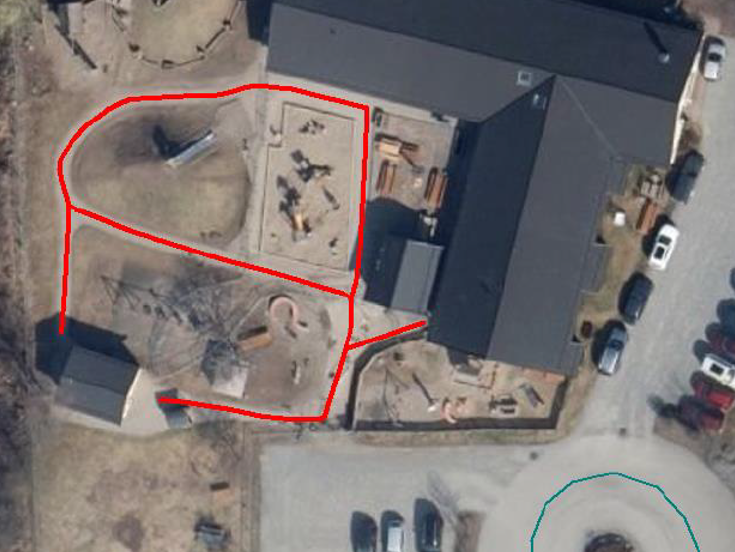

==== Registrering av veglenker uten tydelig tilknytning
Veglenker som ikke har noen tydelig tilknytning men som har en naturlig rutefunksjon (typisk stop i busslomme, som vist i bildeeksempelet under) skal registreres og «forlenges» mot nærmeste veglenke for gående og syklende, eller kjørende der denne utgjør eneste mulighet for ruting videre.

Eksisterende veglenker med konnekteringslenke ja skal bare slettes dersom veglenka den skaper forbindelse til også slettes.
Eksisterende veglenker med konnekteringslenke ja skal geometriforbedres dersom tilstøtende veglenker geometriforbedres.

.Eksempel på veglenke som skal forlenges (rød pil i bildet) mot nærmest annen veglenke for ruting for gående til/fra et busstopp.
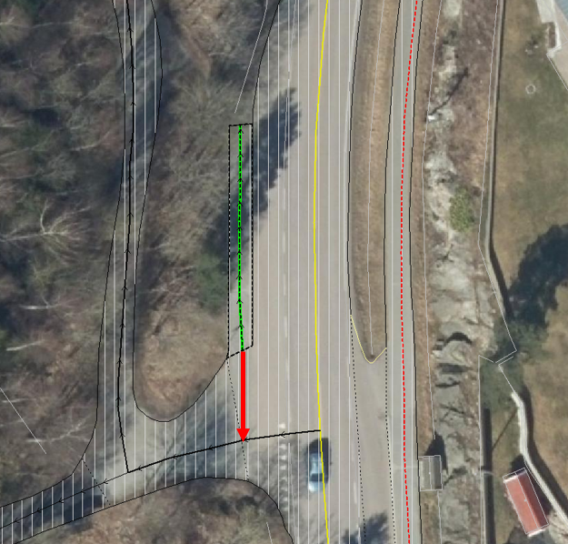

==== Mindre flater/arealer uten veglenke
Selv om kravet for konsekvensretting mellom veglenke og vegflate er +-10 meter skal kortere veglenker registreres for mindre flater/arealer der eneste naturlige ruting for gående og syklende er over veg (for kjørende) for å komme seg videre.

.Eksempel på veglenke (rød pil i bildet) som skal registreres over mindre flater/arealer for ruting videre for gående og syklende.
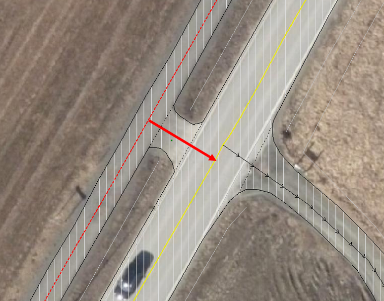

