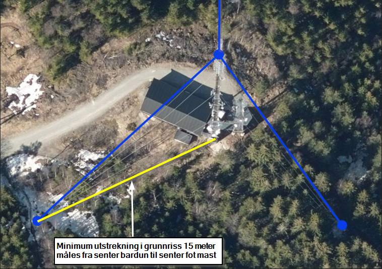
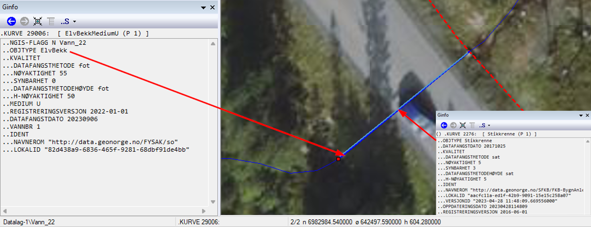

= Vedlegg til FKB Fotogrammetriske registreringsinstrukser - versjon 5.0 - 2024.01.01
:sectnums:
:toc: left
:toc-title: Innholdsfortegnelse
:toclevels: 3
:figure-caption: Figur
:table-caption: Tabell
:section-refsig: kapittel
:doctype: article
:encoding: utf-8
:lang: nb
:URLrot: https://sosi.geonorge.no/registreringsinstrukser
:fkb: http://sosi.geonorge.no/Standarder/FKB_generell_del
:publisert: Oppdatert 2024-05-03

CAUTION: {publisert} 

== Vedlegg til FKB Fotogrammetriske registreringsinstrukser - versjon 5.0 - 2024.01.01

=== Innledning

FKB Fotogrammetriske registreringsinstrukser - versjon 5.0 2024-01-01 - ble tilgjengeliggjort i januar 2024 og ligger til grunn for FKB kartleggingsprosjekter gjennom Geovekst med datafangst i 2024. Det er siste versjon av disse dokumentene som er grunnlaget for inngåtte avtaler i kartleggingsprosjektene for 2024. Se http://sosi.geonorge.no/Standarder/FKB_generell_del/#truefkb-datasett[FKB generell del, tabell 1] for en oversikt over siste/gjeldende versjoner av FKB produktspesifikasjoner og fotogrammetriske registreringsinstrukser.

Erfaringene fra prosjektene i 2023-sesongen tilsier at det behov for å presisere tolkning/håndtering av FKB 5.0 registreringsinstruksene på en del områder. Dette dokumentet samler disse presiseringene for hvert datasett og bør derfor leses sammen med de fotogrammetriske registreringsinstruksene ved gjennomføring av FKB kartleggingsprosjekter 2024.

Det presiseres at dette dokumentet kun har som formål å klargjøre/presisere innholdet i FKB registreringsinstruksene og ikke _endre_ innholdet i disse dokumentene på noen måte.

Det vil være naturlig at justeringene/presiseringene som er beskrevet i dette dokumenten innarbeides i reviderte FKB registreringsinstrukser som vil bli benyttet i neste kartleggingssesong.

Linker:

* FKB 5.0 generell del: {fkb}
* Geovekst produktspesifikasjoner og registreringsinstrukser: https://kartverket.no/geodataarbeid/geovekst/fkb-produktspesifikasjoner

=== Endringslogg

Tabellen under viser en oversikt over når vedlegget har blitt endret. 

:xrefstyle: short

[cols="1,4"]
|===
|Dato|Endringer

| 2024-05-03
| Første versjon av vedlegg 2024

|===

[[fkbreginstruks]]
== FKB Fotogrammetriske registreringsinstrukser

:ds: FKB-BygnAnlegg
:spek: {URLrot}/{ds}/5.0/Fotogrammetrisk_2024-01-01/.
[[FKBBygnAnlegg]]
=== {ds}

Fotogrammetrisk registreringsinstruks for {ds} 5.0 er tilgjengelig på {spek}

==== Presisering for registrering av gjerder 
I tillegg til anleggsgjerder er det ikke aktuelt å registrere strømgjerder.

:ds: FKB-Ledning
:spek: {URLrot}/{ds}/5.0/Fotogrammetrisk_2024-01-01/.
[[FKBLedning]]
=== {ds}

Fotogrammetrisk registreringsinstruks for {ds} 5.0 er tilgjengelig på {spek}

==== Presisering for registrering av Bardun.
Figur 5 er oppdatert for å presisere at barduner i alle tre retninger skal registreres. Ny figur som forklarere hvordan minstemål for bardun skal måles.

.Illustrasjon av hvordan bardun skal registreres. Dersom flere barduner går i samme retning skal bare den høyeste og lengste bardunen registreres
image::figurer_2024/bardun.png[alt="Bilde av bardun1"]

.Illustrasjon av hvordan minstemål for bardun skal måles. Minimum utstrekning i grunnriss 15 meter måles fra senter bardun til senter fot mast

:ds: FKB-Vann
:spek: {URLrot}/{ds}/5.0/Fotogrammetrisk_2024-01-01/.
[[FKBVann]]
=== {ds}

Fotogrammetrisk registreringsinstruks for {ds} 5.0 er tilgjengelig på {spek}

==== Presisering for registrering av vannobjekter med medium U.
Fotogrammetrisk instruks for FKB-Vann gir føringer om at FKB-Vann skal registreres så fullstendig som mulig. Disse føringene gjelder uavhengig av om det er bestilt opsjoner Stikkrenne og/eller Kulvert i FKB-BygningsmessigAnlegg. Dette innebærer at vannveger under bakken i stikkrenner og kulverter skal registreres både i FKB-Vann med medium U, og i FKB-BygningsmessigAnlegg når disse opsjonene er bestilt. Dette for at vannettverket skal bli registrert sammenhengende i FKB-Vann.

.Eksempel på vannobjekt med medium U registrert sammen med stikkrenne.

:ds: FKB-Veg
:spek: {URLrot}/{ds}/5.0/Fotogrammetrisk_2024-01-01/.
[[FKBVeg]]
=== {ds}

Fotogrammetrisk registreringsinstruks for {ds} 5.0 er tilgjengelig på {spek}

==== Presisering for registrering av Skiltportal.
Setningen "Det er ikke nødvendig å registrere stolpene som skiltportalen er festet i." i kap.3.14 Tilleggsinformasjonen for fotogrammetrisk registrering, strykes fra registreringsinstruksen for å unngå misforståelser.

==== Presisering for geometriforbedring av veglenker, der ny veglenke er under 50 meter.
I kap.5.2 Sletting av eksisterende veglenker, står det at det ikke er krav om etablering av vegflate i FKB-Veg. Dette gjelder kun eksisterende veglenker som ikke slettes eller ikke geometriforbedres. ALLE veglenker som geometriforbedres skal konsekvensrettes (vegflate og tilhørende avgrensningslinjer) i FKB-Veg, slik teksten i FKB-Veg kap.3.4 Objekttype: VegKjørende, Tilleggsinformasjon for fotogrammetrisk registrering, viser til. Unntak om avvik mellom veglenke i Elveg og "tiltenkt" flate i FKB-Veg er under +/- 10 meter.

