= Vedlegg til FKB Fotogrammetriske registreringsinstrukser - versjon 2025-01-01
:sectnums:
:toc: left
:toc-title: Innholdsfortegnelse
:toclevels: 3
:figure-caption: Figur
:table-caption: Tabell
:section-refsig: kapittel
:doctype: article
:encoding: utf-8
:lang: nb
:URLrot: https://sosi.geonorge.no/registreringsinstrukser
:fkb: http://sosi.geonorge.no/Standarder/FKB_generell_del
:publisert: Oppdatert 2025-01-31

CAUTION: {publisert} 

== Vedlegg til FKB Fotogrammetriske registreringsinstrukser - versjon 2025-01-01

=== Innledning

==== Om ulike versjoner av FKB Generell del, FKB-produktspesifikasjoner og Fotogrammetriske registreringsinstrukser
Det er siste versjon av fotogrammetriske registreringsinstrukser som er grunnlaget for inngåtte avtaler i kartleggingsprosjektene for 2025. 
Følg linkene videre fra https://www.kartverket.no/geodataarbeid/geovekst/fkb-produktspesifikasjoner[tabell over FKB produktspesifikasjoner og fotogrammetriske registreringsinstrukser på kartverket.no].

FKB Generell del ble oppgradert til versjon 5.1 i løpet av 2025 (med referansedato 2025-07-01). 
I FKB Generell del 5.1 er det innført et nytt https://sosi.geonorge.no/Standarder/FKB_generell_del/#_generelle_retningslinjer_for_fotogrammetrisk_registrering_av_fkb_normativt[vedlegg D] som beskriver generelle retningslinjer for fotogrammetrisk registering av FKB. 

I forbindelse med nyttår ble det utarbeidet nye fotogrammetriske registreringsinstrukser for datasettene FKB-BygnAnlegg, FKB-Ledning, FKB-Veg og FKB-Vann. Disse henviser til FKB Generell del 5.1 og vedlegg D. 
For fotogrammetriske registreringsinstrukser som ikke ble revidert 2025-01-01 er det henvist til eldre versjoner av FKB Generell del og de generelle retningslinjene for fotogrammetrisk registrering er der angitt i kapittel 2 i den enkelte registreringsinstruks. 

==== Formål med dokumentet

Erfaringene fra prosjektene i 2024-sesongen tilsier at det behov for å presisere tolkning/håndtering av FKB 5.0 registreringsinstruksene på en del områder. Dette dokumentet samler disse presiseringene for hvert datasett og bør derfor leses sammen med de fotogrammetriske registreringsinstruksene ved gjennomføring av FKB kartleggingsprosjekter 2025.

Det presiseres at dette dokumentet kun har som formål å klargjøre/presisere innholdet i FKB registreringsinstruksene og ikke _endre_ innholdet i disse dokumentene på noen måte.

Det vil være naturlig at justeringene/presiseringene som er beskrevet i dette dokumenten innarbeides i reviderte FKB registreringsinstrukser som vil bli benyttet i neste kartleggingssesong.

==== Linker

* FKB 5.0 generell del: {fkb}
* Geovekst produktspesifikasjoner og registreringsinstrukser: https://kartverket.no/geodataarbeid/geovekst/fkb-produktspesifikasjoner

=== Endringslogg

Tabellen under viser en oversikt over når vedlegget har blitt endret. 

:xrefstyle: short

[cols="1,4"]
|===
|Dato|Endringer

| 2025-04-04
| Første versjon av vedlegg 2025

|===

== FKB Generell del 5.1

:ds: FKB-Generell del
:spek: {URLrot}/{ds}/5.0/Fotogrammetrisk_2025-01-01/.

=== {ds}

Generell del for 5.1 er tilgjengelig på {fkb}

==== Presisering for Kvalitet og datafangstdato
I Generell del, Vedlegg D, D.1.2.1. presiseres det at dataene skal være kodet etter de avgrensningspolygonene som er fastsatt i forhold til kartleggingsstandardene i prosjektet. Datafangstdato brukes fra de bildene det er konstruert ifra. Det betyr i praksis at dataene kan være kodet i FKB-B kvalitet og ha datafangstdato fra FKB-A flyvningen, hvis A- og B-stripene er flydd på forskjellige datoer.

[[fkbreginstruks]]
== FKB Fotogrammetriske registreringsinstrukser

:ds: FKB-Arealbruk
:spek: {URLrot}/{ds}/5.0/Fotogrammetrisk_2024-01-01/.
[[FKBArealbruk]]
=== {ds}

Fotogrammetrisk registreringsinstruks for {ds} 5.0 er tilgjengelig på {spek}

==== Presisering for objekttypen SportIdrettPlass 
I kap.3.11. Objekttype: SportIdrettPlass presiseres det at også frisbeegolf, putball/fotballgolf, ridesport og travbaner skal registreres som SportIdrettPlass. Under følger noen bildeeksempler.

.Illustrasjon av hvordan områder for frisbeegolf skal registreres.
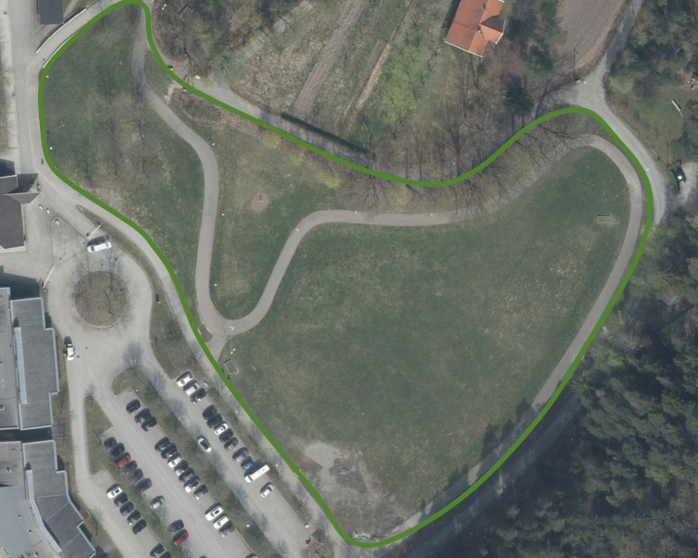

.Illustrasjon av hvordan områder for putball/fotballgolf skal registreres.
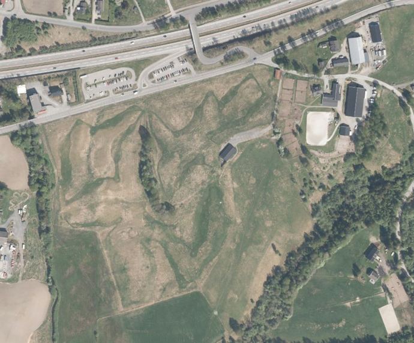

.Illustrasjon av hvordan områder for ridesport skal registreres. Oftest grusunderlag med hinder.
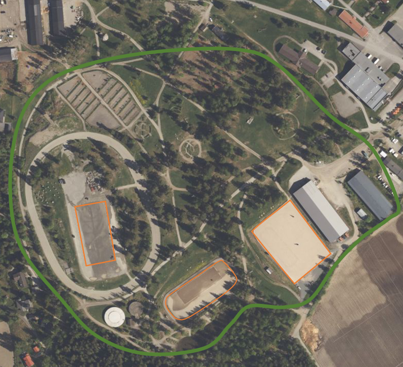

.Illustrasjon av hvordan områder for travsport skal registreres.
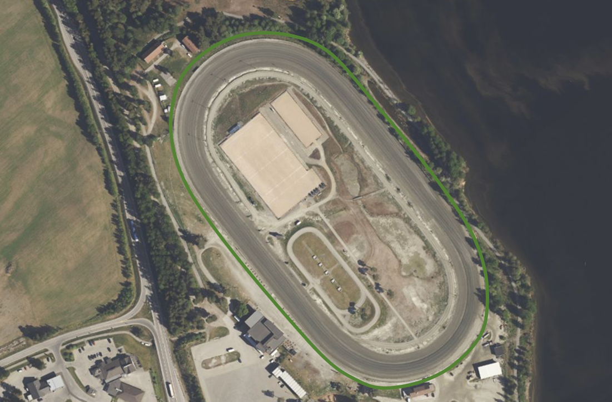

:ds: FKB-Bane
:spek: {URLrot}/{ds}/5.0/Fotogrammetrisk_2022-01-01/.
[[FKBBane]]
=== {ds}

Fotogrammetrisk registreringsinstruks for {ds} 5.0 er tilgjengelig på {spek}

==== Presisering for objekttypen Jernbaneplattformkant
I kap.3.1. Objekttype: Jernbaneplattformkant skal figur 1 byttes ut med nye figurer som tydeligere skal vise hvordan Jernbaneplattformkant skal registreres og avgrenses mot omgivelsene.

.Ny illustrasjon av hvordan Jernbaneplattformkant skal registreres.
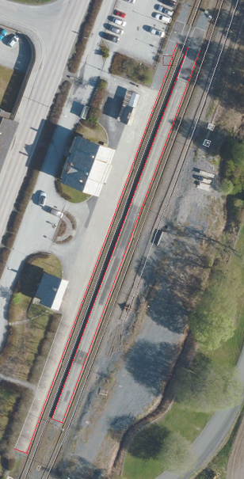

.Ny illustrasjon av hvordan Jernbaneplattformkant (rødt) skal registreres sammen med AnnetVegarealAvgrensning (blått).
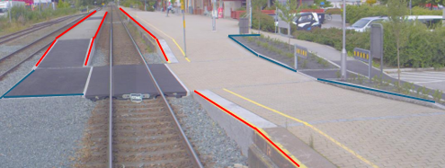

==== Presisering for objekttypen Spormidt og nodepunktsregistrering
I kap.3.2. Objekttype Spormidt skal figur 4 byttes ut med ny figur som tydeligere skal vise plassering for registrering av nodepunkt for Spormidt i sporveksel.

.Ny illustrasjon av hvor nodepunkt skal plasseres i forhold til sporveksel. Knutepunktet plasseres i skjæringspunktet for Spormidt og normalen fra drivmaskinen ned på Spormidt.
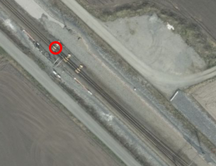

:ds: FKB-Bygning
:spek: {URLrot}/{ds}/5.0/Fotogrammetrisk_2024-01-01/.
[[FKBBygning]]
=== {ds}

Fotogrammetrisk registreringsinstruks for {ds} 5.0 er tilgjengelig på {spek}

==== Presisering for objekttypen TakoverbyggKant
Det presiseres at TakoverbyggKant skal skrives med stor K. Dette er skrevet feil i rubrikkteksten for _kap.3.24 Objekttype TakoverbyggKant_. Dette var med i vedlegg 2024 (versjon 2), men registreringsinstruksen har dessverre ikke blitt oppdatert ved årsskiftet og har fortsatt versjon 2024-01-01.

==== Presisering for kap.1.2.1. Endringer fra versjon 5.0 2023-01-01 til versjon 5.1 2024-01-01
Riktig tekst skal være Endringer fra versjon 5.0 2023-01-01 til versjon 5.0 2024-01-01.

==== Presisering for objekttypen Grunnmur
I kap.3.5. Objekttype: Grunnmur og Tilleggsinformasjon for fotogrammetrisk registrering skal _opsjonell registrering_ strykes fra teksten om Ruin. Riktig tekst er

_Revede bygg/ruiner skal ikke registreres som grunnmur, men kan registreres som Ruin i FKB-BygnAnlegg_.

==== Presisering for objekttypen VeggFrittstående
I kap.3.22. Objekttype: VeggFrittstående og Tilleggsinformasjon for fotogrammetrisk registrering presiseres det at VeggFrittstående skal benyttes når veggen står inntil takkant og/eller veranda. Vegger som ikke står i tilknytning til bygning/veranda registreres som aktuelt objekt i datasettet bygningsmessige anlegg.

==== Presisering for objekttypen Veranda
I kap.3.21. Objekttype: Veranda og Tilleggsinformasjon for fotogrammetrisk registrering presiseres det at verandaer som ikke stikker ut fra veggen/takkanten, men er trukket inn i bygget ikke forventes registrert. Det er lagt til en figur som beskriver slike verandaer.

.Illustrasjon av bygning der verandaene i øverste etasje ikke stikker ut fra takkant/vegg. Verandaene i de tre nederste etasjene stikker ut fra bygget og skal registreres (rød linje).
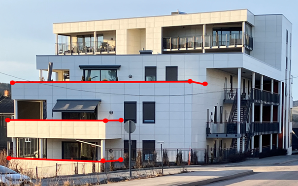

:ds: FKB-BygnAnlegg
:spek: {URLrot}/{ds}/5.1/Fotogrammetrisk_2025-01-01/.
[[FKBBygnAnlegg]]
=== {ds}

Fotogrammetrisk registreringsinstruks for {ds} 5.0 er tilgjengelig på {spek}

==== Presisering for registrering av nedsenkte svingskiver.
I kap.3.15. Objekttype: MurFrittstående er det lagt til ny figur som beskriver hvordan nedsenkt svingskive, i forbindelse med jernbane, skal registreres. Omriss av svingskive registreres som MurFrittstående, mens dreibart sporområde registreres som Bru. Det er ikke nødvendig å ajourføre posisjonen til Bru eller Spormidt, som ved bruk vil forandre posisjon hele tiden.

.Illustrasjon av nedsenkt svingskive.
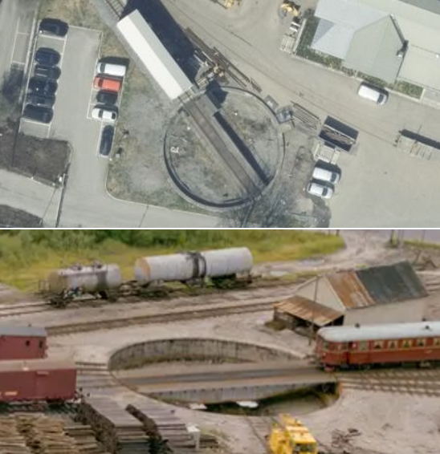

==== Presisering for registrering av diverse objekter som BeskrivendeHjelpelinjeAnlegg.
I kap.3.30. Objekttype: BeskrivendeHjelpelinjeAnlegg er det lagt til nye figurer. En som skal illustrere at store solcelleanlegg på bakken skal registreres som BeskrivendeHjelpelinjeAnlegg. Merk at solcelleanlegg på tak ikke skal registreres.
Den andre figuren viser en svingskive på bakkenivå, i forbindelse med jernbane. Omrisset av svingskiven skal registreres som BeskrivendeHjelpelinjeAnlegg. Spormidt på svingskive trenger ikke å ajourføres ettersom retningen på Spormidt forandres hele tiden.

.Illustrasjon av solcelleanlegg på bakken.
image::figurer_2025/solcelleanlegg.png[alt="Bilde av solcelleanlegg på bakken."]

.Illustrasjon av svingskive på bakkenivå.
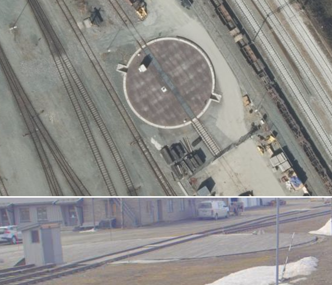

==== Presisering for objekttypen FlytebryggeUtligger.
I kap.3.40. Objekttype: FlytebryggeUtligger presiseres det at alle utliggere skal registreres, også de som stikker ut fra KaiBrygge.

==== Presisering for registrering av gjerder/rekkverk på bruer langs jernbanen.
I kap.3.14. Objekttype: Gjerde er det lagt til ny figur som skal illustrere at også gjerder/rekkverk på bruer langs jernbane skal registreres, og tildeles medium L. Gjerdetype _Annet gjerde_ brukes.

.Illustrasjon av gjerde/rekkverk (blått, MEDIUM L) på bru langs jernbane. Kabelkanal er også illustert i bildet (rødt og rødt stiplet på bru, MEDIUM L).
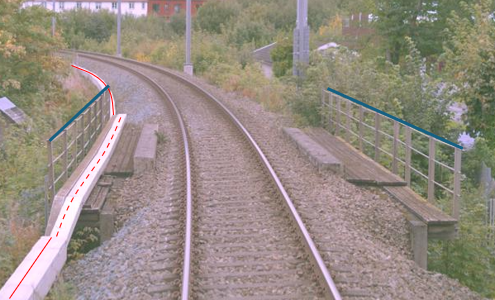

==== Presisering for objekttypen Gjerde (Reingjerde).
I kap.3.14. Objekttype: Gjerde er det lagt til ny figur som viser eksempel på Reingjerde som er ny godkjent gjerdetype. Normalt skal ikke disse gjerdene registreres fotogrammetrisk.

.Illustrasjon av Reingjerde.
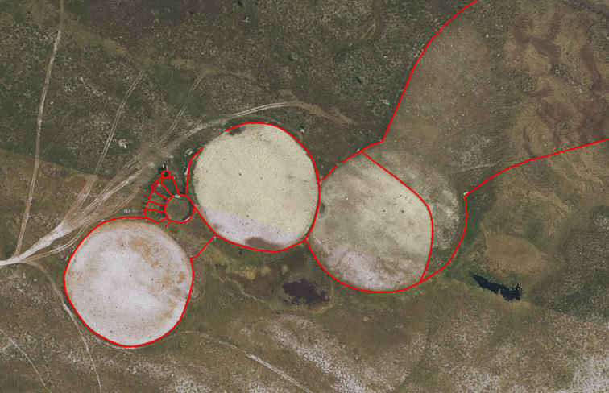

==== Presisering for objekttypen Stikkrenne.
I kap. 3.4. Objekttype: Stikkrenne og Tilleggsinformasjon for fotogrammetrisk registrering presiseres det at føringene om fullstendighet i FKB-Vann gjelder uavhengig av om det er bestilt opsjoner Stikkrenne og/eller Kulvert i FKB-BygnAnlegg. Dette innebærer at vannveger under bakken i stikkrenner og kulverter skal registreres både i FKB-Vann med medium U, og i FKB-BygnAnlegg når disse opsjonene er bestilt. Dette for at vannettverket skal bli registrert sammenhengende i FKB-Vann.

==== Presisering for objekttypen Rørgate.
I kap.3.48. Objekttype: Rørgate og Tilleggsinformasjon for fotogrammetrisk registrering presiseres det at rørgater innenfor lukket område som ikke er tilgjengelig for allmen ferdsel ikke skal registreres.

.Illustrasjon av rørgater på Mongstad, som ikke skal registreres.
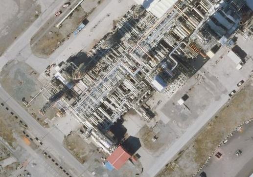

:ds: FKB-Ledning
:spek: {URLrot}/{ds}/5.1/Fotogrammetrisk_2025-01-01/.
[[FKBLedning]]
=== {ds}

Fotogrammetrisk registreringsinstruks for {ds} 5.0 er tilgjengelig på {spek}

==== Presisering for objekttypen Kabelkanal.
I kap.3.3. Objekttype: Kabelkanal, er det lagt til nye figurer som viser flere Kabelkanal i bredde og flere Kabelkanal i høyde. Hver enkelt Kabalkanal i bredde skal registreres. For Kabelkanal i høyde skal den øverste Kabelkanal registreres og påføres medium L.
Det presiseres også at Kabelkanal skal registreres fullstendig over bruer og påføres medium L.

Figur 6 utgår og erstattes med ny figur på Kabelkanal.

I figurtekst til Figur 7 presiseres det at i bildet oppe til høyre er deler av Kabelkanal i luft, og skal derfor påføres medium L.

.Illustrasjon av registrering for Kabelkanal med flere kanaler i bredde. Hver Kabelkanal skal registeres.
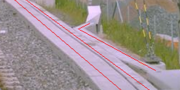

.Illustrasjon av registrering for Kabelkanal med flere kanaler i høyde med medium L. Øverste Kabelkanal skal registreres, med MEDIUM L.
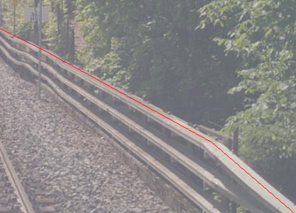

==== Presisering for objekttypene Kumlokk.
I kap.3.4. Objekttype: Kum og Tilleggsinformasjon for fotogrammetrisk registrering, presiseres det at Kumlokk som inngår i Kum skal registereres, selv om Kum er under minstemål og ikke registreres. Kum og Kumlokk skal alltid påføres LEDNINGSNETTVERKSTYPE ekom hvis de henger sammen med Kabelkanal.

==== Presisering for objekttypen Kumlokk.
I kap.3.5. Objekttype: Kumlokk og Tilleggsinformasjon for fotogrammetrisk registrering, presiseres det at baliser ikke regnes som Kumlokk. Baliser ligger som regel i Spormidt og er gule i fargen. Bilde på baliser under.

.Illustrasjon av baliser som ikke skal registreres.
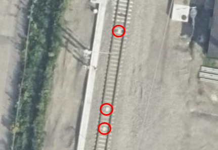

==== Presisering for objekttypen Mast, kontaktledningsmaster.
I kap.3.7. Objekttype: Mast og Presiseringer til beskrivelsen av kodelister, er det lagt til ny figur som viser et bildeeksempel på kontaktledningsmaster ovenfra. Disse mastene skal påføres LEDNINGSNETTVERKSTYPE kontaktledning.

.Illustrasjon av registrering for kontaktledningsmaster langs jernbane.
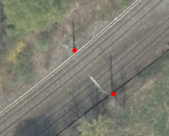

==== Presisering for objekttypen Nettverkstasjon.
I kap.3.9. Objekttype: Nettverkstasjon og Presiseringer til beskrivelsen av kodelister, under Stasjonsplassering - Kodenavn: Mastearrangement er det lagt til ny figur som viser hvordan nettverkstasjon registreres i mast langs jernbane.

.Illustrasjon av registrering av Nettverkstasjon med stasjonsplassering Mastearrangement (gult punkt). Masteomriss (blå strek) og Mast med ledningsnettverkstype Kontaktledning (rødt punkt). Nettverkstasjon og Mast vil ha lik koordinat i grunnriss, men forskjellige høydeverdi.
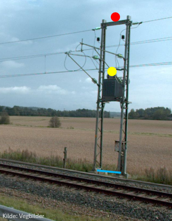

==== Presisering for objekttypen Åk.
I kap.3.15. Objekttype: Åk, presiseres det at også halvåk (konstruksjon festet i kun en mast) skal registreres. Det er lagt til ny figur som viser et bildeeksempel på halvåk. Mastene som ikke er en del av objekttypen åk, skal registreres som objekttype Mast.

.Illustrasjon av registrering for halvåk. Grønn linje representerer Åk, rød punkt Mast.
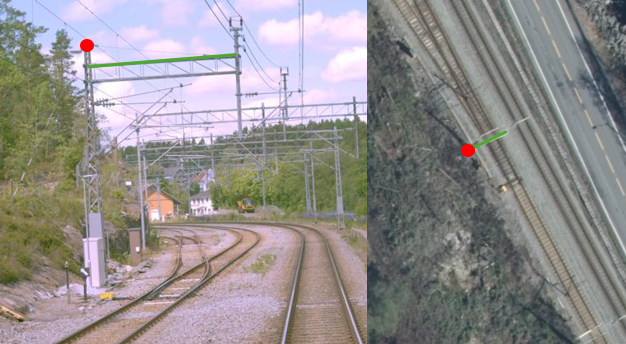

==== Nytt kap.5.4. Spesielt om registrering av ledningsdata ved jernbane.
Ved og langs jernbane kan det vært tett mellom de forskjellige ledningsobjektene. De etterfølgende bildeeksemplene prøver å presisere hva som skal registreres fotogrammetrisk og hvordan.

.Illustrasjon av planovergang langs jernbane og vanlige objekttyper. Blå linje viser Vegbom (registrert nedfelt) og rød punkt viser Mast med  LEDNINGSNETTVERKSTYPE Signalanlegg.
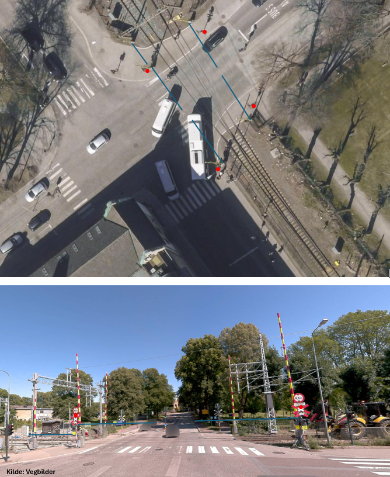

.Illustrasjon av stasjonsområde langs jernbane og vanlige objekttyper. Blå strek viser Kum med LEDNINGSNETTVERKSTYPE ekom, svart sirkel viser Kumlokk med LEDNINGSNETTVERKSTYPE ekom, svart stiplet strek viser Kabelkanal med LEDNINGSNETTVERKSTYPE ekom, svart strek viser Spormidt, JERNBANETYPE J, svart firkant viser Skap med LEDNINGSNETTVERKSTYPE ukjent, grønn prikk viser Mast med LEDNINGSNETTVERKSTYPE kontaktledning, Oransje prikk viser Mast med LEDNINGSNETTVERKSTYPE signal og grønn strek viser Åk med LEDNINGSNETTVERKSTYPE kontakledning.
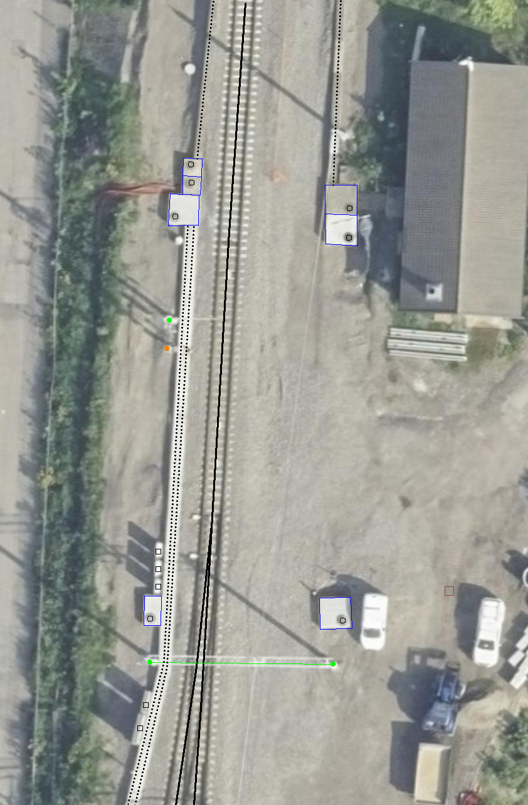

:ds: FKB-Vann
:spek: {URLrot}/{ds}/5.1/Fotogrammetrisk_2025-01-01/.
[[FKBVann]]
=== {ds}

Fotogrammetrisk registreringsinstruks for {ds} 5.0 er tilgjengelig på {spek}

==== Presisering for objekttypen Kystkontur.
I kap.3.1. Objekttype: Kystkontur og Tilleggsinformasjon for fotogrammetrisk registrering gjøres det en presisering i teksten som beskriver registrering av kystkontur ved tekniske anlegg som stikker mer enn 5 meter ut fra land. Riktig tekst er

_Kystkonturen skal følge alle tekniske anlegg (kai/brygger o.l) som stikker mer enn 5 meter ut fra land, og skal da registreres som KystkonturTekniskeAnlegg_.

==== Presisering for objekttypen Innsjøkant.
I kap.3.9. Objekttype: Innsjøkant og merknad: presiseres det at ordet _oppdemt_ strykes. Riktig tekst er

_Merknad: for innsjø som er regulert skal konturlinjen ligge i høydenivået for høyeste regulerte vannstand_.

:ds: FKB-Veg
:spek: {URLrot}/{ds}/5.1/Fotogrammetrisk_2025-01-01/.
[[FKBVeg]]
=== {ds}

Fotogrammetrisk registreringsinstruks for {ds} 5.0 er tilgjengelig på {spek}

====  Presisering om objekttypen Vegbom.
I kap.3.16 Objekttype: Vegbom og Tilleggsinformasjon for fotogrammetrisk registrering, presiseres det at vegbommer ved planoverganger langs jernbane skal registreres som om de er lukket/nedfelt, selv om bommene står åpne i bildene. Ref. figur 20 (Illustrasjon av planovergang langs jernbane og vanlige objekttyper) i kap.3.5.7.

.Illustrasjon av vegbom ved planovergang langs jernbane.
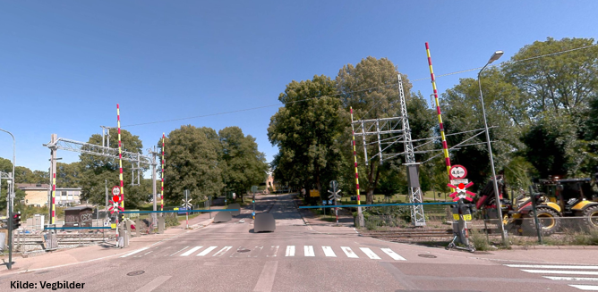

====  Nytt kap.4.3. Presisering om bruk av synbarhetkoding.

Kravene til stedfestingsnøyaktighet er knyttet til veldefinerte detaljer kodet med synbarhet 0. Se full definisjon av synbarhetskodene i kodeliste på geonorge.no.

* Synbarhet 0 - Fullt ut synlig

Brukes for vegobjekter som er fullt synlige i bildene og med en veldefinert avgrensing mellom objektet og omgivelsene.

* Synbarhet 2 - Middels synlig

Brukes for vegobjekter som er delvis skjult av overliggende objekter (vegetasjon, skygger, bygninger etc.).

* Synbarhet 3 - Ikke synlig

Brukes for vegobjekter som er helt skjult av overliggende objekter (vegetasjon, skygger, bygninger, bruer etc.).

* Synbarhet 1 – Diffuse objekter

Brukes for alle objekter i FKB-Veg som er vanskelig å definere presist i terrenget på grunn av objektets natur eller manglende kontrast mot omgivelsene (for eksempel grusvei og AnnetVegarealAvgrensning). For disse objektene gjelder krav i kvalitetsklasse 4 uavhengig av objekttype.

_Hvis diffuse objekter også har begrenset innsyn i bildene (vegetasjon, skygger, bygninger etc.) skal objektet da kodes med synbarhet 2 eller 3 for den utstrekningen dette gjelder for. Kravene for kvalitetsklasse 4 gjelder fortsatt.
Det vil sikkert forekomme både asfaltveier som anses som diffuse objekter og grusveier som anses som veldefinerte objekter i bildene. Objektene skal alltid kodes med den nøyaktighet som konstruktør mener er mulig å oppnå ved registrering. Kravene i standarden er øvre verdier._

==== Presisering for kap.3.3 Feil figurhenvisning
I kap.3.3 Objekttype: VegGåendeOgSyklende og Tilleggsinformasjon for fotogrammetrisk registrering er det henvist til feil figur. Riktig tekst er

_For typeveg-inndeling, se figur 18 i dette dokumentet_.

:ds: Elveg
:spek: {URLrot}/{ds}/2.0/Fotogrammetrisk_2024-01-01/.
[[Elveg]]
=== {ds}

Fotogrammetrisk registreringsinstruks for {ds} 2.0 er tilgjengelig på {spek}

====  Presisering om objekttypen Veglenke, Typeveg Trapp.
I kap.3.2.3 Registrering av veglenker for gående/syklende presiseres det at i trapper med avsatser, der avstand mellom trinnene er under 2 meter, skal hele strekningen registreres som trapp. Det er lagt til ny figur som viser et bildeeksempel på riktig registrering. 

.I trapper med korte trappeavsatser (<2m), skal hele strekningen registreres som trapp.
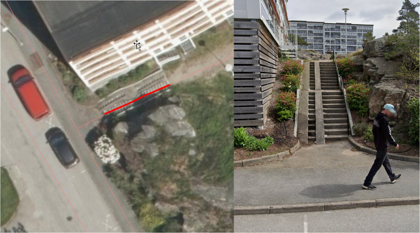

==== Presiseringer for kap.3.2.1, 3.2.8, 5.1 og 5.2 Feil figurhenvisning
I kap.3.2.1 Generelt angående registrering av veglenker og nettverkstopolpogi er det henvist til feil figur. Riktig tekst er

_Av og til må vi også akseptere løse ender i nettverket der det er fysisk "umulig" eller ulogisk (se eksempel i figur 11 i Registreringsinstruks: Fotogrammetrisk Elveg) å ta seg videre, enten som gående eller kjørende_.

I kap.3.2.8 Registrering av veglenker for kjørende er det henvist til produktspesifikasjon istedenfor registreringsinstruks, og til feil figur. Riktig tekst er

_Ellers gjelder teksten fra figur 4 i Fotogrammetrisk registreringsinstruks for Elveg: "I de aller fleste tilfeller vil topologien i slike kryss være etablert og skal da ikke endres ved fotogrammetrisk registrering. Fotogrammetrisk registrering vil i hovedsak gå ut på forbedring av geometri der kriteriene for dette er til stede"_.

I kap.5.1 Registrering av nye veglenker er det henvist til feil figur tre steder i teksten. Riktig tekst er

_Det skal være topologi (nodepunkt) internt i nykonstruerte veglenker, men det skal ikke etableres nodepunkt eller konnekteringspunkt mot eksisterende veglenker. Se figur 30_.

_I forbindelse med industriområder, gårdsplasser og andre åpne plasser vil det være en vurderingssak hvor langt inn på plassen veglenken skal gå. Veglenken bør avsluttes slik at en vegflate i FKB-Veg også naturlig kan avgrenses der veglenken slutter. Se figur 31_. 

_Gangfelt innenfor lukket område som ikke er tilgjengelige for allmenn ferdsel og heller ikke krysser veg eller henger sammen med annen del av nettverket, skal ikke registreres. Se figur 32_.

I kap.5.2 Sletting av eksisterende veglenker er det henvist til feil figurer. Riktig tekst er

_Veglenker skal kun slettes dersom det kan verifiseres i flybildene at vegen ikke eksisterer/ er kjørbar (se figur 34)._

_I eksisterende data kan det ligge veglenker som ikke oppfyller kriteriene for fotogrammetrisk registrering, for eksempel at de er kortere enn minstemål. Disse skal ikke slettes. I slike tilfeller er det ikke krav om etablering av vegflate i FKB-Veg (se figur 35)._

_Veglenker med Medium U og B, i tunnel eller i bygning, skal ikke slettes. Hvis tunnel eller bygning er borte (revet) kan veglenker med medium slettes._

_Det tolereres inntil +/- 10 meter avvik mellom Elveg og FKB-Veg i forbindelse med avslutning av eksisterende veglenker inn på gårdsplasser ol. (se figur 36 og 37)._
